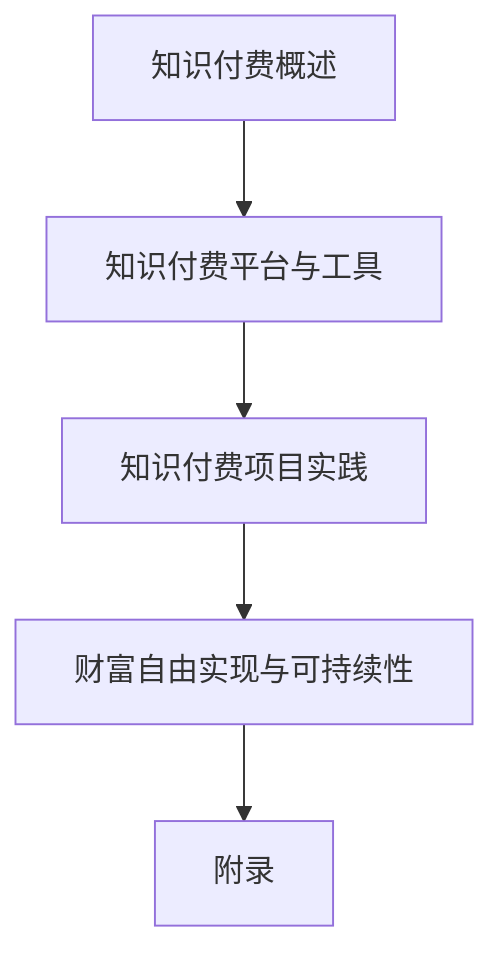

                 


### 文章标题：《程序员如何利用知识付费实现财富自由》

> 关键词：知识付费、程序员、财富自由、平台选择、项目实践、营销推广、收益转化

> 摘要：本文将详细探讨程序员如何通过知识付费这一途径实现财富自由。从知识付费的定义、背景、优势，到财富自由的概念、路径，再到具体的知识付费平台选择、内容制作与推广、项目实践和财富自由实现策略，全面解析程序员利用知识付费实现财富自由的路径和方法。

### 《程序员如何利用知识付费实现财富自由》目录大纲

#### 第一部分：知识付费概述

**1.1 知识付费的定义与背景**

- **1.1.1 知识付费的兴起**
    - 互联网时代的发展与知识分享平台的崛起
    - 用户对个性化、高质量知识的渴求
- **1.1.2 知识付费的现状与趋势**
    - 知识付费的市场规模与增长速度
    - 知识付费领域的细分市场与发展方向
- **1.1.3 知识付费的重要意义**
    - 对知识创造者而言：知识变现，实现个人价值
    - 对知识消费者而言：高效获取专业知识和技能

**1.2 程序员的优势与机会**

- **1.2.1 程序员的核心竞争力**
    - 技术实力和专业能力
    - 创新思维和实践经验
- **1.2.2 程序员在知识付费市场中的定位**
    - 技术专家、技术咨询、技术培训等
    - 个人品牌和影响力的打造
- **1.2.3 程序员如何发挥自身优势**
    - 精通某一技术领域的深入研究和分享
    - 利用工具和平台提升内容创作和推广效率

**1.3 财富自由的定义与路径**

- **1.3.1 财富自由的概念**
    - 财务自由、时间自由、精神自由的综合体现
    - 程序员如何定义自己的财富自由
- **1.3.2 财富自由的重要性**
    - 财富自由对程序员职业发展的推动作用
    - 财富自由对程序员生活质量的影响
- **1.3.3 程序员如何实现财富自由**
    - 知识变现的途径和策略
    - 收入结构优化和投资理财

#### 第二部分：知识付费平台与工具

**2.1 知识付费平台的选择**

- **2.1.1 常见知识付费平台介绍**
    - 知乎Live、喜马拉雅、得到、网易云课堂等
    - 平台特点、优劣势分析
- **2.1.2 平台选择的标准与要素**
    - 用户群体、内容类型、收益模式等
    - 平台的安全性和可靠性
- **2.1.3 平台运营模式分析**
    - 中心化平台、去中心化平台、社区型平台等
    - 平台的盈利模式与可持续发展

**2.2 知识付费工具的使用**

- **2.2.1 知识付费工具的类型**
    - 内容创作工具、内容推广工具、用户管理工具等
    - 知识变现工具、数据分析工具等
- **2.2.2 工具的选型与配置**
    - 根据自身需求选择合适的工具
    - 工具的整合与优化配置
- **2.2.3 工具使用的最佳实践**
    - 工具的高效利用方法
    - 工具的协同使用策略

**2.3 内容制作与推广**

- **2.3.1 内容创作的方法与技巧**
    - 如何定位受众、提炼主题、构建内容框架
    - 如何提高内容的质量和创新性
- **2.3.2 内容推广的渠道与策略**
    - 社交媒体、搜索引擎、内容分发平台等
    - 营销策略的制定与执行
- **2.3.3 社群运营与粉丝互动**
    - 社群建设的意义与目标
    - 社群运营的方法与技巧

#### 第三部分：知识付费项目实践

**3.1 知识付费项目规划**

- **3.1.1 项目目标与定位**
    - 项目的发展方向、目标用户群体等
    - 项目定位与市场定位
- **3.1.2 项目计划与执行**
    - 项目的时间规划、任务分配等
    - 项目执行的监控与调整
- **3.1.3 项目风险评估与管理**
    - 风险识别、风险评估、风险应对等

**3.2 知识付费产品开发**

- **3.2.1 产品定位与需求分析**
    - 产品功能、特点、优势等
    - 用户需求调研与需求分析
- **3.2.2 产品设计与开发**
    - 产品的UI/UX设计、功能实现等
    - 技术选型与开发框架
- **3.2.3 产品测试与优化**
    - 产品测试方法、测试策略等
    - 用户反馈与产品优化

**3.3 营销推广与收益转化**

- **3.3.1 营销策略与执行**
    - 营销目标的制定、策略的选择与执行
    - 营销活动的策划与执行
- **3.3.2 收益模式与转化率优化**
    - 收益模式的探索与优化
    - 转化率的提升策略
- **3.3.3 用户反馈与持续改进**
    - 用户反馈的收集与分析
    - 产品与服务的持续改进

#### 第四部分：财富自由实现与可持续性

**4.1 财富自由的实现路径**

- **4.1.1 财富自由的关键要素**
    - 财务收入、投资理财、个人品牌等
    - 财富自由的评估与规划
- **4.1.2 程序员的收入结构优化**
    - 薪资收入、知识付费、股权收益等
    - 收入结构的优化策略
- **4.1.3 财富自由实现的案例分享**
    - 成功案例的介绍与解析
    - 案例对程序员财富自由的启示

**4.2 财富自由的可持续性**

- **4.2.1 财富自由的风险管理**
    - 财务风险、市场风险、法律风险等
    - 风险管理策略与措施
- **4.2.2 财富自由的长期规划**
    - 长期财务规划、投资规划、生活规划等
    - 财富自由的可持续发展策略
- **4.2.3 财富自由的个人价值观**
    - 财富自由背后的价值观
    - 财富自由对个人成长的影响

#### 附录

**附录 A：知识付费相关资源与工具**

- **A.1 常用知识付费平台介绍**
    - 平台特点、优劣势分析
- **A.2 知识付费工具推荐**
    - 内容创作、推广、用户管理等方面的工具
- **A.3 知识付费社区与论坛**
    - 知识交流、学习分享、经验交流的平台

**附录 B：财富自由实现策略表**

- **B.1 财富自由计划表格模板**
    - 收入计划、支出计划、投资计划的模板
- **B.2 收入结构与支出分析**
    - 收入来源、支出项目的详细分析
- **B.3 投资策略与风险控制**
    - 投资目标、投资策略、风险控制的规划

### Mermaid 流程图示例



### 核心算法原理讲解伪代码示例

```python
# 伪代码：知识付费收益计算算法

def calculate_income(content_quality, marketing_strategy, user_base):
    """
    计算知识付费项目的收入

    :param content_quality: 内容质量评分（0-10分）
    :param marketing_strategy: 营销策略评分（0-10分）
    :param user_base: 用户基数（人）
    :return: 收入（元）
    """
    base_income_per_user = 10  # 每个用户的基础收入
    quality_bonus = content_quality * 0.1  # 内容质量奖金
    strategy_bonus = marketing_strategy * 0.1  # 营销策略奖金

    total_income = (base_income_per_user + quality_bonus + strategy_bonus) * user_base
    return total_income
```

### 数学模型和数学公式示例

$$
N(t) = N_0 + r \cdot t
$$

其中：
- \( N(t) \) 是时间 \( t \) 时的用户数
- \( N_0 \) 是初始用户数
- \( r \) 是用户增长率（人/时间单位）

### 文章标题：《程序员如何利用知识付费实现财富自由》

> 作者：AI天才研究院/AI Genius Institute & 禅与计算机程序设计艺术 /Zen And The Art of Computer Programming

### 文章正文

随着互联网的快速发展，知识付费已经成为一个新兴的市场。对于程序员来说，利用知识付费不仅能够实现个人价值的最大化，还能帮助实现财富自由。本文将围绕这一主题，详细探讨程序员如何通过知识付费实现财富自由。

#### 第一部分：知识付费概述

**1.1 知识付费的定义与背景**

知识付费是指用户为获取高质量的专业知识和技能，愿意支付一定费用的一种消费模式。它起源于互联网的发展，得益于知识分享平台的崛起。随着人们对个性化、高质量知识的渴求，知识付费市场逐渐壮大。

在知识付费的背景下，程序员具备独特的优势。首先，程序员拥有技术实力和专业能力，能够为用户提供高质量的技术内容。其次，程序员具备创新思维和实践经验，能够不断推出新颖的技术产品和服务。此外，程序员还善于利用工具和平台，提升内容创作和推广效率。

**1.2 程序员的优势与机会**

程序员的竞争力主要体现在以下几个方面：

1. 技术实力和专业能力
程序员精通编程语言、框架和工具，具备解决复杂技术问题的能力。他们在技术领域的深入研究和实践经验，使得他们能够为用户提供高质量的技术知识和解决方案。

2. 创新思维和实践经验
程序员具备创新思维，能够不断推出新颖的技术产品和服务。他们在实际项目中积累的经验，使得他们能够为用户提供实用的技术指导。

3. 善于利用工具和平台
程序员熟悉各种开发工具和平台，能够高效地进行内容创作和推广。他们可以利用这些工具和平台，快速搭建知识付费项目，扩大影响力。

**1.3 财富自由的定义与路径**

财富自由是指个人不再依赖传统的工作收入，而是通过投资、知识变现等方式实现财务自由、时间自由和精神自由的状态。对于程序员来说，财富自由意味着他们可以通过知识付费获得稳定的收入，拥有更多的自由时间和机会。

实现财富自由的关键路径包括：

1. 知识变现
程序员可以通过写作、录制课程、开设在线讲座等方式，将自己的技术知识和经验变现。通过高质量的内容创作，吸引更多用户，实现持续的收入。

2. 收入结构优化
程序员应该注重收入结构的多元化，不仅仅依赖于薪资收入，还要通过股权收益、投资等方式增加收入来源。优化收入结构，提高财务稳定性。

3. 投资理财
程序员可以利用投资理财来实现财富的增值。他们可以选择股票、基金、房地产等投资渠道，根据自身的风险承受能力和投资目标进行投资。

#### 第二部分：知识付费平台与工具

**2.1 知识付费平台的选择**

程序员在选择知识付费平台时，需要考虑以下因素：

1. 用户群体
平台的目标用户群体是否符合程序员的定位。例如，一些技术社区和平台，如GitHub、Stack Overflow等，更适合程序员分享技术知识和经验。

2. 内容类型
平台支持的内容类型是否丰富，是否满足程序员的需求。例如，程序员可以发布技术博客、视频课程、直播讲座等。

3. 收益模式
平台的收益模式是否合理，是否有足够的分成比例。程序员需要选择能够给予他们合理回报的平台。

4. 安全性和可靠性
平台的安全性和可靠性是程序员选择平台时的重要考量。他们需要确保用户信息和内容的安全。

目前，常见的知识付费平台包括知乎Live、喜马拉雅、得到、网易云课堂等。这些平台各有特点，程序员可以根据自身需求选择合适的平台。

**2.2 知识付费工具的使用**

程序员在进行知识付费时，需要使用各种工具来提升内容创作和推广效率。以下是一些常用的知识付费工具：

1. 内容创作工具
例如Markdown编辑器、视频录制工具等，帮助程序员高效地进行内容创作。

2. 内容推广工具
例如SEO优化工具、社交媒体推广工具等，帮助程序员将内容推广给更多用户。

3. 用户管理工具
例如用户管理系统、邮件营销工具等，帮助程序员管理用户和进行用户互动。

4. 数据分析工具
例如Google Analytics、百度统计等，帮助程序员分析用户行为和内容效果，进行数据驱动的优化。

**2.3 内容制作与推广**

1. 内容创作的方法与技巧
程序员在进行内容创作时，需要注意以下几点：

- 明确受众：了解目标用户的需求和兴趣，有针对性地进行内容创作。
- 提炼主题：围绕技术领域的关键词和热点话题，提炼出有价值的内容主题。
- 构建内容框架：梳理内容结构，确保内容逻辑清晰、易于理解。
- 提高质量：注重内容的深度和实用性，提供有价值的观点和经验。

2. 内容推广的渠道与策略
程序员可以通过以下渠道进行内容推广：

- 社交媒体：利用微博、微信、知乎等社交媒体平台，发布内容链接，吸引粉丝关注。
- 技术社区：在GitHub、Stack Overflow等技术社区发布内容，增加曝光度。
- 内容分发平台：将内容发布到得到、网易云课堂等知识付费平台，扩大影响力。

3. 社群运营与粉丝互动
程序员可以建立自己的社群，与粉丝进行互动。通过社群运营，提高用户粘性，增加粉丝忠诚度。社群运营的方法包括：

- 定期举办线上活动，如直播讲座、技术分享等，与粉丝互动。
- 回复粉丝的提问和评论，提供帮助和支持。
- 分享有价值的资源和信息，为粉丝提供价值。

#### 第三部分：知识付费项目实践

**3.1 知识付费项目规划**

1. 项目目标与定位
程序员在启动知识付费项目前，需要明确项目的发展方向和目标用户群体。例如，可以定位为技术专家、技术咨询、技术培训等。

2. 项目计划与执行
程序员需要制定详细的项目计划，包括时间规划、任务分配、资源准备等。在项目执行过程中，要定期检查进度，确保项目按计划进行。

3. 项目风险评估与管理
程序员需要对项目可能面临的风险进行评估，并制定相应的风险管理措施。例如，市场风险、技术风险、法律风险等。

**3.2 知识付费产品开发**

1. 产品定位与需求分析
程序员需要明确产品的定位，了解用户的需求和期望。通过需求分析，确定产品的功能、特点、优势等。

2. 产品设计与开发
程序员需要设计产品的UI/UX，确保用户使用体验良好。在开发过程中，要选择合适的技术栈和开发框架，确保产品的高效实现。

3. 产品测试与优化
程序员需要对产品进行严格的测试，确保产品的稳定性和性能。在产品上线后，要持续收集用户反馈，进行优化和改进。

**3.3 营销推广与收益转化**

1. 营销策略与执行
程序员需要制定合理的营销策略，包括内容营销、社交媒体营销、SEO优化等。在执行过程中，要定期评估效果，进行调整和优化。

2. 收益模式与转化率优化
程序员需要探索多种收益模式，如一次性收费、会员制等。同时，要关注转化率的提升，通过优化用户体验、提高内容质量等方式，增加收入。

3. 用户反馈与持续改进
程序员需要积极收集用户反馈，了解用户的需求和满意度。根据用户反馈，对产品和服务进行持续改进，提高用户忠诚度和满意度。

#### 第四部分：财富自由实现与可持续性

**4.1 财富自由的实现路径**

1. 财富自由的关键要素
程序员实现财富自由的关键要素包括财务收入、投资理财、个人品牌等。程序员需要制定合理的财务规划，通过多种途径实现收入来源的多元化。

2. 程序员的收入结构优化
程序员需要关注收入结构的优化，不仅仅依赖薪资收入，还要通过股权收益、投资等方式增加收入来源。优化收入结构，提高财务稳定性。

3. 财富自由实现的案例分享
通过成功案例的分享，程序员可以了解实现财富自由的路径和方法。案例包括技术创业者、投资大师等，他们的经验和策略对程序员有很好的启示作用。

**4.2 财富自由的可持续性**

1. 财富自由的风险管理
程序员在实现财富自由的过程中，需要关注风险管理。包括财务风险、市场风险、法律风险等。通过合理的风险管理策略，确保财富自由的可持续性。

2. 财富自由的长期规划
程序员需要制定长期的财务规划，包括投资规划、生活规划等。通过长期的规划，确保财富自由的可持续发展。

3. 财富自由的个人价值观
财富自由不仅仅是物质层面的追求，更是精神层面的解放。程序员需要树立正确的个人价值观，关注生活质量和精神成长，实现全面的发展。

#### 附录

**附录 A：知识付费相关资源与工具**

1. **常用知识付费平台介绍**
    - 知乎Live：以专业知识和经验分享为主的知识付费平台
    - 喜马拉雅：以音频课程为主的综合性知识付费平台
    - 得到：以文字、音频、视频课程为主的综合型知识付费平台
    - 网易云课堂：以在线教育课程为主的平台

2. **知识付费工具推荐**
    - Markdown编辑器：用于撰写技术博客和文档的工具
    - 视频录制工具：用于录制教学视频的工具
    - SEO优化工具：用于优化网站内容和搜索引擎排名的工具

3. **知识付费社区与论坛**
    - GitHub：开源代码托管平台，程序员交流学习的社区
    - Stack Overflow：技术问答社区，程序员解决问题的平台

**附录 B：财富自由实现策略表**

1. **财富自由计划表格模板**
    - 收入计划：列出每月、每季、每年的收入来源和金额
    - 支出计划：列出每月、每季、每年的支出项目和使用金额
    - 投资计划：列出投资目标和投资策略

2. **收入结构与支出分析**
    - 收入来源分析：分析各种收入来源的优劣势和潜力
    - 支出项目分析：分析各种支出项目的合理性和优化空间

3. **投资策略与风险控制**
    - 投资目标：确定短期、中期和长期的财务目标
    - 投资策略：根据风险承受能力选择合适的投资渠道
    - 风险控制：制定风险控制措施，确保投资的安全性和稳定性

### 总结

程序员通过知识付费实现财富自由，不仅需要技术实力和专业能力，还需要创新思维和实践经验。通过选择合适的知识付费平台、制作高质量的内容、制定有效的营销策略，程序员可以逐步实现财富自由。同时，程序员还需要关注财务规划、投资理财等方面，确保财富自由的可持续性。希望本文对程序员实现财富自由提供一些启示和帮助。

