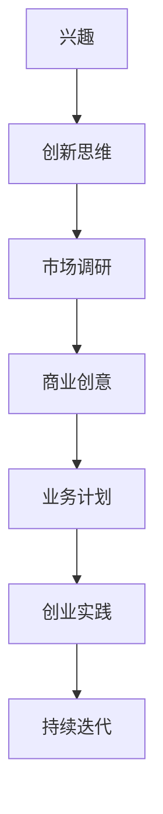
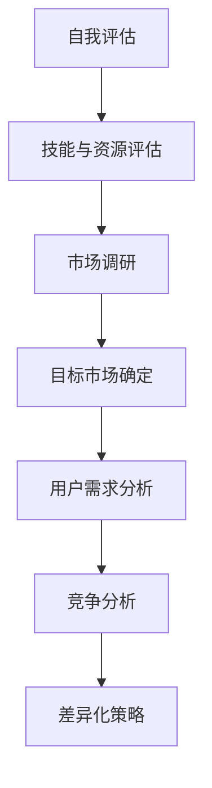
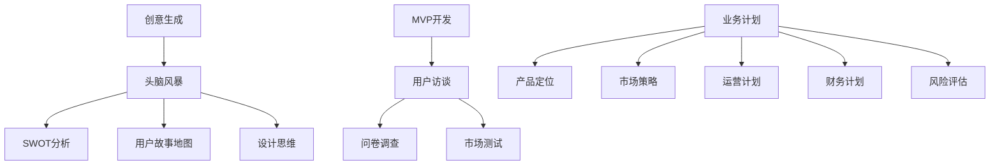
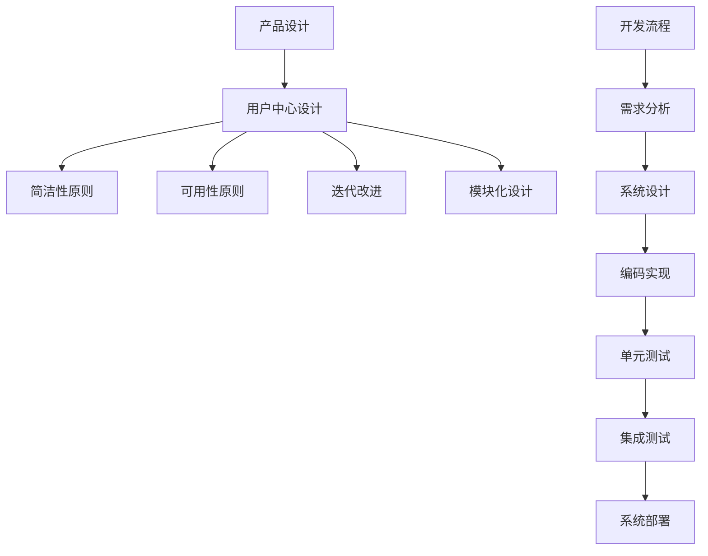
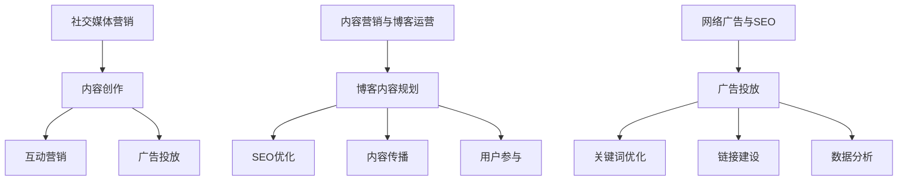
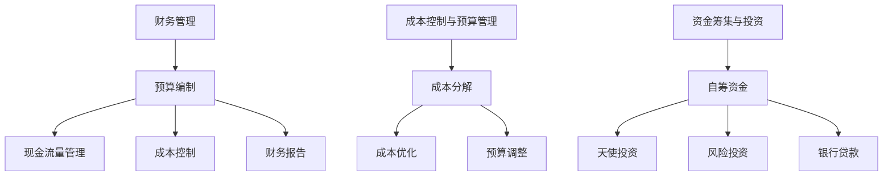
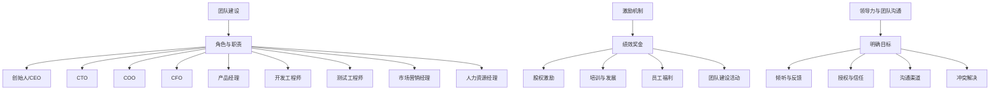
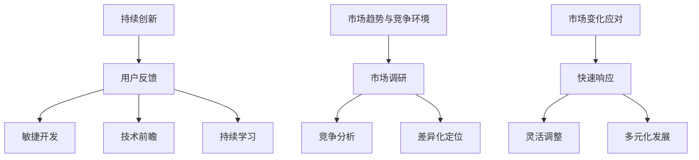
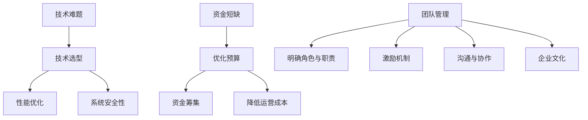

                 

### 文章标题

《程序员如何将兴趣爱好转化为创业项目》

关键词：程序员、兴趣爱好、创业项目、市场调研、产品设计与开发、市场推广、财务管理、团队建设、持续创新

摘要：本文将深入探讨程序员如何将自己的兴趣爱好转化为成功的创业项目。通过分析兴趣与创业的关系、自我评估与市场调研、构建创业项目、运营与成长等环节，本文旨在为程序员提供一套系统的创业指南，帮助他们将热情转化为商业成功。此外，文章还将通过成功案例分析与启示，为创业者提供实用的经验和策略。

### 第一部分：兴趣与创业的基础准备

在互联网和人工智能高速发展的时代，程序员作为科技领域的佼佼者，拥有丰富的技术积累和独特的思维方式。然而，单纯的编程工作往往无法完全满足程序员的激情与创造力，很多程序员开始思考如何将自身的兴趣爱好转化为创业项目，实现个人价值与商业成功的双重收获。

#### 第1章：理解兴趣与创业的关系

**1.1 兴趣的本质与创业的关系**

兴趣是人们对于某种活动、领域或事物表现出的一种强烈的喜爱和追求。而创业则是一个充满挑战和机遇的过程，涉及到商业模式的探索、资源的整合、团队的组建等各个方面。将兴趣转化为创业项目，意味着不仅要在技术层面上有所突破，还需要在商业层面上具备敏锐的市场洞察力和风险控制能力。

兴趣与创业的关系可以从以下几个方面来理解：

- **共同点**：兴趣和创业都源于内心的热情和动力，都是个人价值观和人生目标的体现。
- **互补性**：兴趣为创业提供了独特的视角和创新思路，而创业则为兴趣提供了实践的平台和商业化的可能。
- **挑战性**：兴趣转化为创业项目，往往需要克服更多的现实挑战，如市场的不确定性、资源的限制等。

**1.2 创业者的心态与特质**

创业者需要具备一系列特定的心态和特质，这些特质是成功创业的关键：

- **创新意识**：创业者需要不断寻求创新，通过新颖的想法和解决方案来突破市场瓶颈。
- **坚韧不拔**：创业过程中不可避免地会遇到挫折和失败，创业者需要有坚强的意志力来克服困难。
- **风险承担**：创业本身就伴随着风险，创业者需要有勇气去接受和承担这些风险。
- **团队合作**：成功的企业往往离不开团队的力量，创业者需要具备团队领导能力，能够激发团队成员的潜能。

**1.3 从兴趣到商业机会的转化路径**

将兴趣爱好转化为商业机会，通常需要以下几个步骤：

- **挖掘兴趣点**：首先，要深入了解自己的兴趣所在，确定一个具体且具有商业潜力的领域。
- **市场调研**：在确定了兴趣点后，需要进行市场调研，了解目标市场的需求和竞争态势。
- **创意生成**：基于市场调研的结果，可以生成具体的商业创意，并对其进行初步的市场验证。
- **业务计划**：在创意生成后，需要制定详细的业务计划，包括产品定位、市场策略、运营计划等。

**核心概念与联系**

以下是关于兴趣与创业关系的一个核心概念和联系架构的Mermaid流程图：



**核心算法原理讲解**

将兴趣爱好转化为商业机会的“核心算法原理”可以概括为以下伪代码：

```python
def convert_interest_to_business(interest):
    # 挖掘兴趣点
    interest_point = explore_interest(interest)
    # 市场调研
    market_data = conduct_market_research(interest_point)
    # 创意生成
    business_idea = generate_idea(market_data)
    # 制定业务计划
    business_plan = create_business_plan(business_idea)
    # 执行创业实践
    execute_business_plan(business_plan)
    # 持续迭代
    iterate_and_optimize()
```

**数学模型和公式 & 详细讲解 & 举例说明**

在商业创意生成和市场验证过程中，可以使用以下数学模型来量化评估商业机会：

- **市场占有率模型**：$$\text{Market Share} = \frac{\text{Company Sales}}{\text{Total Market Sales}}$$

  例如，假设某个市场总销售额为1000万元，您的公司销售额为200万元，则市场占有率为20%。

- **成本收益模型**：$$\text{Profit} = \text{Revenue} - \text{Cost}$$

  例如，如果您的产品销售额为100万元，成本为50万元，则利润为50万元。

**项目实战：开发环境搭建，源代码详细实现和代码解读，代码应用解读与分析，实际案例分析和详细讲解剖析，项目小结**

假设您是一名程序员，对区块链技术充满兴趣，并希望将其转化为一个商业项目。以下是该项目的一个实战案例：

**1. 项目简介**

该项目名为“TrustChain”，旨在打造一个去中心化的信任生态系统，通过区块链技术记录用户的行为和信用评分，为用户提供可信的交易环境。

**2. 技术实现与代码解读**

- **区块链架构设计**：使用Solidity语言开发智能合约，实现去中心化的数据存储和验证。
- **前端开发**：使用React框架构建用户界面，实现用户与区块链的交互。
- **后端服务**：使用Node.js搭建RESTful API，提供数据查询和交易处理服务。

**3. 运营策略与市场表现分析**

- **市场推广**：通过社交媒体和区块链社区进行宣传，吸引潜在用户。
- **用户增长**：通过提供优质的服务和体验，增加用户粘性和活跃度。
- **数据监控**：定期分析区块链数据，优化产品功能和用户体验。

**4. 项目小结**

通过TrustChain项目，您不仅实现了个人兴趣的商业化，还为区块链技术在商业领域的应用做出了积极探索。项目成功的关键在于对区块链技术的深入理解和创新应用，以及对市场需求的准确把握。

**最佳实践 tips、小结、注意事项、拓展阅读等内容**

- **最佳实践 tips**：在将兴趣转化为创业项目时，建议先进行充分的市场调研和风险评估，避免盲目投入。
- **小结**：将兴趣转化为创业项目需要综合运用技术、市场、管理等多方面知识，保持持续学习和创新。
- **注意事项**：在创业过程中，要注重团队建设，培养良好的沟通和协作氛围。
- **拓展阅读**：推荐阅读《精益创业》和《创业维艰》等书籍，了解创业过程中的实战经验和心理准备。

### 第2章：自我评估与市场调研

**2.1 评估个人技能与资源**

程序员在将兴趣爱好转化为创业项目时，首先要对自己的技能和资源进行客观评估。以下是一些关键因素：

- **技术能力**：包括编程语言、开发框架、数据库技术、前端设计等。评估自己的技术栈，确定是否具备开展项目所需的技能。
- **项目管理能力**：包括任务分配、进度控制、风险管理和团队沟通等。作为一个创业者，不仅需要编程能力，还需要具备一定的项目管理能力。
- **业务理解能力**：理解市场需求、商业模式和行业动态。这有助于确定创业项目的方向和定位。
- **资源状况**：包括资金、时间、人脉和设备等。资源是创业成功的重要保障，需要评估自己能否满足项目的初始需求。

**2.2 确定目标市场与用户需求**

在评估个人技能和资源后，下一步是确定目标市场和用户需求。以下是一些关键步骤：

- **市场细分**：根据产品特点，将市场划分为不同的细分市场，找到最具潜力的目标市场。
- **用户画像**：基于市场调研结果，构建目标用户的画像，了解他们的需求、行为和偏好。
- **需求调研**：通过问卷调查、访谈、用户测试等方式，深入了解用户的具体需求和痛点。
- **市场定位**：结合自身优势和用户需求，确定产品的市场定位和差异化竞争优势。

**2.3 竞争分析：找到你的优势**

在确定目标市场和用户需求后，需要开展竞争分析，找到自己的竞争优势：

- **竞争对手分析**：识别市场上的主要竞争对手，分析他们的产品特点、市场策略和用户评价。
- **自身优势分析**：结合自身的技能和资源，找出自己相对于竞争对手的优势，如技术优势、服务优势、市场定位优势等。
- **差异化策略**：根据竞争优势，制定差异化策略，确保产品在市场中具有独特的价值主张。
- **市场定位与策略**：结合市场定位和差异化策略，制定具体的市场推广和运营计划。

**核心概念与联系**

以下是关于自我评估与市场调研的核心概念和联系架构的Mermaid流程图：



**核心算法原理讲解**

自我评估与市场调研的“核心算法原理”可以概括为以下伪代码：

```python
def self_evaluation():
    # 技能与资源评估
    skills_and_resources = evaluate_skills_and_resources()
    # 市场调研
    market_data = conduct_market_research()
    # 目标市场确定
    target_market = determine_target_market(market_data)
    # 用户需求分析
    user_requirements = analyze_user_requirements(target_market)
    # 竞争分析
    competitors_analysis = analyze_competitors(user_requirements)
    # 差异化策略
    differentiation_strategy = create_differentiation_strategy(competitors_analysis)
    # 返回评估结果
    return skills_and_resources, market_data, target_market, user_requirements, competitors_analysis, differentiation_strategy
```

**数学模型和公式 & 详细讲解 & 举例说明**

在市场调研中，可以使用以下数学模型和公式来分析数据：

- **市场增长率模型**：$$\text{Growth Rate} = \frac{\text{Current Market Size} - \text{Previous Market Size}}{\text{Previous Market Size}} \times 100\%$$

  例如，假设某市场的当前规模为1000万元，上一年度为800万元，则市场增长率为25%。

- **用户满意度模型**：$$\text{Customer Satisfaction} = \frac{\text{Satisfied Customers}}{\text{Total Customers}} \times 100\%$$

  例如，假设总共有1000名用户，其中900名用户对产品表示满意，则用户满意度为90%。

**项目实战：开发环境搭建，源代码详细实现和代码解读，代码应用解读与分析，实际案例分析和详细讲解剖析，项目小结**

假设您希望开发一款基于人工智能的智能客服系统，以下是该项目的一个实战案例：

**1. 项目简介**

该项目名为“AIChat”，旨在利用人工智能技术，提供高效、智能的在线客服服务，帮助企业提升客户体验。

**2. 技术实现与代码解读**

- **人工智能模型**：使用TensorFlow框架训练自然语言处理模型，实现智能对话功能。
- **前端开发**：使用Vue框架搭建用户界面，实现与用户的交互。
- **后端服务**：使用Flask框架搭建RESTful API，处理用户请求和返回响应。

**3. 运营策略与市场表现分析**

- **市场推广**：通过社交媒体和行业展会进行宣传，吸引潜在客户。
- **用户增长**：通过提供优质的智能客服体验，增加用户粘性和活跃度。
- **数据监控**：定期分析用户反馈和系统运行数据，优化产品功能和用户体验。

**4. 项目小结**

通过AIChat项目，您不仅实现了个人兴趣的商业化，还为企业提供了创新的智能客服解决方案。项目成功的关键在于对人工智能技术的深入理解和创新应用，以及对市场需求的准确把握。

**最佳实践 tips、小结、注意事项、拓展阅读等内容**

- **最佳实践 tips**：在确定目标市场和用户需求时，建议采用多渠道调研方法，提高数据准确性。
- **小结**：自我评估与市场调研是创业项目成功的重要基础，要重视每一个环节的细节和数据分析。
- **注意事项**：在竞争分析时，要客观评估自身优势，避免盲目自信。
- **拓展阅读**：推荐阅读《市场调研实战》和《商业模式创新》等书籍，了解市场调研和商业模式的实战技巧。

### 第3章：创意生成与市场验证

**3.1 创意生成的方法与技巧**

创意生成是创业过程中至关重要的一环。以下是一些常见的方法和技巧：

- **头脑风暴**：通过集体讨论，激发团队成员的创意思维，产生多个潜在的商业想法。
- **SWOT分析**：对自身优势（Strengths）、劣势（Weaknesses）、机会（Opportunities）和威胁（Threats）进行系统分析，帮助确定创意的可行性。
- **用户故事地图**：通过绘制用户故事地图，了解用户在不同情境下的需求和痛点，从而生成创新的解决方案。
- **设计思维**：采用用户为中心的设计方法，通过原型设计、用户测试和迭代改进，不断优化创意。

**3.2 市场验证的策略与实践**

市场验证是确保创业项目可行性、可行性和市场接受度的重要步骤。以下是一些常用的市场验证策略：

- **最小可行产品（MVP）**：开发一个最小可行版本的产品，通过实际用户的使用反馈来验证市场需求的真实性和可行性。
- **用户访谈**：与潜在用户进行一对一访谈，了解他们对产品功能的看法和建议，从而优化产品设计和功能。
- **问卷调查**：通过在线问卷或线下调查，收集大量用户的反馈数据，进行分析和统计，了解市场需求和用户偏好。
- **市场测试**：在特定市场或区域进行小规模的产品测试，观察产品的市场表现和用户反应，评估产品的市场潜力。

**3.3 如何制定初步的业务计划**

在完成创意生成和市场验证后，需要制定初步的业务计划，为创业项目提供方向和指导。以下是一些关键步骤：

- **产品定位**：明确产品的市场定位和目标用户，确保产品能够满足用户需求。
- **市场策略**：制定市场推广和销售策略，包括渠道选择、定价策略、促销活动等。
- **运营计划**：明确产品运营的具体流程和关键节点，包括人员配置、任务分配、时间表等。
- **财务计划**：制定详细的财务预算和资金使用计划，包括收入预测、成本控制和资金筹集策略。
- **风险评估**：评估创业项目可能面临的风险，制定相应的风险控制和应对措施。

**核心概念与联系**

以下是关于创意生成与市场验证的核心概念和联系架构的Mermaid流程图：



**核心算法原理讲解**

创意生成与市场验证的“核心算法原理”可以概括为以下伪代码：

```python
def generate_ideas():
    # 头脑风暴
    brainstorm Ideen = brainstorming_session()
    # SWOT分析
    SWOT_analysis = perform_SWOT_analysis(brainstorm Ideen)
    # 用户故事地图
    user_story_map = create_user_story_map(SWOT_analysis)
    # 设计思维
    design_thinking = apply_design_thinking(user_story_map)
    # MVP开发
    MVP = develop_MVP(design_thinking)
    # 用户访谈
    user_interviews = conduct_user_interviews(MVP)
    # 问卷调查
    survey_data = conduct_surveys(user_interviews)
    # 市场测试
    market_tests = perform_market_tests(survey_data)
    # 制定业务计划
    business_plan = create_business_plan(market_tests)
    return business_plan
```

**数学模型和公式 & 详细讲解 & 举例说明**

在市场验证过程中，可以使用以下数学模型和公式来分析数据：

- **接受度模型**：$$\text{Acceptance Rate} = \frac{\text{Satisfied Users}}{\text{Total Users}} \times 100\%$$

  例如，假设总共有100名用户，其中80名用户对产品表示满意，则接受度为80%。

- **转化率模型**：$$\text{Conversion Rate} = \frac{\text{Converted Users}}{\text{Total Visitors}} \times 100\%$$

  例如，假设总共有1000名访问用户，其中200名用户完成了产品注册，则转化率为20%。

**项目实战：开发环境搭建，源代码详细实现和代码解读，代码应用解读与分析，实际案例分析和详细讲解剖析，项目小结**

假设您希望开发一款基于大数据分析的智能推荐系统，以下是该项目的一个实战案例：

**1. 项目简介**

该项目名为“SmartRecommender”，旨在利用大数据和机器学习技术，为电商网站提供个性化的商品推荐服务。

**2. 技术实现与代码解读**

- **数据预处理**：使用Python的Pandas库进行数据清洗和预处理，提取关键特征。
- **机器学习模型**：使用Scikit-learn库训练协同过滤算法，生成推荐结果。
- **前端开发**：使用React框架搭建用户界面，实现用户与推荐系统的交互。

**3. 运营策略与市场表现分析**

- **市场推广**：通过电商平台合作和广告投放，吸引潜在客户。
- **用户增长**：通过个性化推荐，提高用户购物体验和购买意愿。
- **数据监控**：定期分析用户行为数据，优化推荐算法和产品功能。

**4. 项目小结**

通过SmartRecommender项目，您不仅实现了个人兴趣的商业化，还为电商行业提供了创新的推荐解决方案。项目成功的关键在于对大数据和机器学习技术的深入理解和创新应用，以及对市场需求的准确把握。

**最佳实践 tips、小结、注意事项、拓展阅读等内容**

- **最佳实践 tips**：在市场验证阶段，建议多进行用户测试和反馈收集，以便及时调整产品方向。
- **小结**：创意生成与市场验证是创业项目成功的重要保障，要注重创新思维的培养和市场反馈的收集。
- **注意事项**：在制定业务计划时，要充分考虑市场变化和竞争态势，保持灵活应对。
- **拓展阅读**：推荐阅读《创新与企业家精神》和《数据驱动决策》等书籍，了解创意生成和市场验证的实战技巧。

### 第4章：产品设计与开发

**4.1 产品设计的原则与方法**

产品设计是创业项目成功的关键环节，需要遵循一系列原则和方法，以确保产品的实用性、易用性和市场竞争力。以下是一些核心原则和方法：

- **用户中心设计**：以用户需求为中心，关注用户体验，确保产品功能符合用户实际需求。
- **简洁性原则**：简化产品界面和功能，避免冗余和复杂，提高用户操作的便捷性。
- **可用性原则**：确保产品易于使用，降低学习成本，提高用户满意度。
- **迭代改进**：采用敏捷开发方法，通过不断迭代和优化，快速响应市场需求和用户反馈。
- **模块化设计**：采用模块化设计方法，提高系统的可扩展性和可维护性。

**4.2 开发流程与管理**

在产品设计与开发过程中，需要遵循系统化的开发流程，以确保项目的顺利进行。以下是一些关键步骤：

- **需求分析**：明确产品功能和性能要求，编写详细的软件需求规格说明书。
- **系统设计**：进行系统架构设计，确定系统的模块划分、数据结构和接口规范。
- **编码实现**：根据系统设计文档，进行编码实现，编写高质量的源代码。
- **单元测试**：对每个模块进行单元测试，确保模块功能的正确性和稳定性。
- **集成测试**：将各模块集成，进行集成测试，验证系统的整体功能性和性能。
- **系统部署**：将系统部署到生产环境，进行用户测试和上线发布。

**4.3 技术选型与资源整合**

在产品设计与开发过程中，技术选型和资源整合至关重要。以下是一些关键考虑因素：

- **技术栈选择**：根据项目需求和团队技能，选择合适的技术栈，如编程语言、框架、数据库等。
- **第三方服务**：整合第三方服务，如云服务、支付系统、短信服务，以提高系统的稳定性和可靠性。
- **开源与商业化**：合理利用开源技术和商业化工具，提高开发效率和降低成本。
- **技术储备**：保持技术储备，不断学习和掌握新技术，以应对未来市场需求。

**核心概念与联系**

以下是关于产品设计与开发的核心概念和联系架构的Mermaid流程图：



**核心算法原理讲解**

产品设计与开发的“核心算法原理”可以概括为以下伪代码：

```python
def product_design_and_development(product_requirements):
    # 需求分析
    analyzed_requirements = analyze_requirements(product_requirements)
    # 系统设计
    system_design = design_system(analyzed_requirements)
    # 编码实现
    source_code = implement_code(system_design)
    # 单元测试
    unit_tests = conduct_unit_tests(source_code)
    # 集成测试
    integration_tests = conduct_integration_tests(source_code, unit_tests)
    # 系统部署
    system_deployment = deploy_system(integration_tests)
    # 迭代改进
    iterative_improvement = iterate_system(system_deployment)
    return iterative_improvement
```

**数学模型和公式 & 详细讲解 & 举例说明**

在产品设计与开发过程中，可以使用以下数学模型和公式来优化系统性能：

- **响应时间模型**：$$\text{Response Time} = \text{Service Time} + \text{Queue Time}$$

  例如，假设某系统的平均服务时间为2秒，平均排队时间为3秒，则平均响应时间为5秒。

- **吞吐量模型**：$$\text{Throughput} = \frac{\text{Processed Transactions}}{\text{Time}}$$

  例如，假设某系统在1小时内处理了1000个交易，则系统的吞吐量为1000交易/小时。

**项目实战：开发环境搭建，源代码详细实现和代码解读，代码应用解读与分析，实际案例分析和详细讲解剖析，项目小结**

假设您希望开发一款基于区块链的智能合约平台，以下是该项目的一个实战案例：

**1. 项目简介**

该项目名为“SmartContractPlatform”，旨在提供一款易于使用和部署的智能合约平台，帮助企业实现自动化和智能化的业务流程。

**2. 技术实现与代码解读**

- **区块链架构设计**：使用以太坊区块链平台，编写Solidity语言编写的智能合约。
- **前端开发**：使用React框架搭建用户界面，实现与智能合约的交互。
- **后端服务**：使用Node.js搭建RESTful API，处理智能合约的调用和事件监听。

**3. 运营策略与市场表现分析**

- **市场推广**：通过区块链社区和行业活动进行宣传，吸引潜在客户。
- **用户增长**：通过提供便捷的智能合约开发和部署工具，增加用户粘性和活跃度。
- **数据监控**：定期分析平台数据，优化智能合约的执行效率和用户体验。

**4. 项目小结**

通过SmartContractPlatform项目，您不仅实现了个人兴趣的商业化，还为区块链技术在商业领域的应用做出了积极探索。项目成功的关键在于对区块链技术和智能合约的深入理解，以及对市场需求的准确把握。

**最佳实践 tips、小结、注意事项、拓展阅读等内容**

- **最佳实践 tips**：在产品设计与开发过程中，建议采用敏捷开发方法，提高开发效率和灵活性。
- **小结**：产品设计与开发是创业项目成功的关键环节，要注重用户体验和系统性能的优化。
- **注意事项**：在技术选型时，要充分考虑团队技能和项目需求，避免盲目跟风。
- **拓展阅读**：推荐阅读《敏捷开发实践指南》和《软件架构设计：基于模式的软件架构》等书籍，了解产品设计与开发的实战技巧。

### 第5章：市场推广策略

**5.1 社交媒体营销**

社交媒体营销是现代营销的重要手段之一，可以帮助创业者迅速扩大品牌影响力，提高产品知名度。以下是一些关键策略：

- **内容创作**：创作高质量、有价值的内容，包括文章、图片、视频等，吸引用户关注。
- **互动营销**：积极与用户互动，回复评论、参与话题讨论，建立良好的用户关系。
- **广告投放**：利用社交媒体平台的广告服务，进行精准投放，提高品牌曝光率。
- **社交媒体分析**：定期分析社交媒体数据，了解用户行为和反馈，优化营销策略。

**5.2 内容营销与博客运营**

内容营销是通过创造和分享有价值的内容，吸引潜在客户，提高品牌知名度和忠诚度。以下是一些关键策略：

- **博客内容规划**：制定博客内容规划，确保内容的质量和更新频率。
- **SEO优化**：优化博客内容，提高在搜索引擎中的排名，吸引更多流量。
- **内容传播**：利用社交媒体、邮件营销等手段，传播博客内容，提高阅读量。
- **用户参与**：鼓励用户在博客上留言、评论，增加互动和用户粘性。

**5.3 网络广告与搜索引擎优化**

网络广告和搜索引擎优化（SEO）是提高产品知名度和流量的有效手段。以下是一些关键策略：

- **广告投放**：选择合适的广告平台，如Google Ads、Facebook Ads等，进行精准投放。
- **关键词优化**：分析目标用户搜索习惯，选择合适的关键词，优化网站内容和页面结构。
- **链接建设**：通过外链建设，提高网站的权威性和排名。
- **数据分析**：定期分析广告和SEO数据，优化广告投放和SEO策略，提高转化率。

**核心概念与联系**

以下是关于市场推广策略的核心概念和联系架构的Mermaid流程图：



**核心算法原理讲解**

市场推广策略的“核心算法原理”可以概括为以下伪代码：

```python
def marketing_strategy():
    # 社交媒体营销
    social_media_marketing = create_content_and_ads()
    # 内容营销与博客运营
    content_marketing = plan_blog_content_and_optimize_for_SEO()
    # 网络广告与SEO
    online_ads_and_SEO = run_ads_and_optimize_for_keywords()
    # 分析与优化
    analyze_data = analyze_performance_and_optimize()
    return social_media_marketing, content_marketing, online_ads_and_SEO, analyze_data
```

**数学模型和公式 & 详细讲解 & 举例说明**

在市场推广中，可以使用以下数学模型和公式来评估推广效果：

- **点击率（CTR）模型**：$$\text{Click-Through Rate} = \frac{\text{Clicked Ads}}{\text{Impressions}} \times 100\%$$

  例如，假设某广告展示了1000次，被点击了200次，则点击率为20%。

- **转化率模型**：$$\text{Conversion Rate} = \frac{\text{Converted Users}}{\text{Total Visitors}} \times 100\%$$

  例如，假设总共有1000名访问用户，其中200名用户完成了购买，则转化率为20%。

**项目实战：开发环境搭建，源代码详细实现和代码解读，代码应用解读与分析，实际案例分析和详细讲解剖析，项目小结**

假设您希望推广一款基于人工智能的智能家居设备，以下是该项目的一个实战案例：

**1. 项目简介**

该项目名为“AIHome”，旨在提供一款集成了人工智能技术的智能家居设备，为用户提供便捷、智能的家居生活体验。

**2. 社交媒体营销策略**

- **内容创作**：创作关于智能家居设备和人工智能技术的科普文章和视频，吸引用户关注。
- **互动营销**：定期在社交媒体上与用户互动，解答疑问，提高用户满意度。
- **广告投放**：在抖音、微博等平台上投放智能家居设备相关的广告，提高品牌曝光率。

**3. 内容营销与博客运营**

- **博客内容规划**：定期发布关于智能家居设备和人工智能技术的博客文章，优化SEO。
- **内容传播**：利用社交媒体和邮件营销，传播博客内容，提高阅读量和用户参与度。

**4. 网络广告与SEO**

- **广告投放**：在百度和谷歌广告平台上投放智能家尙设备相关的广告，提高品牌知名度。
- **关键词优化**：分析目标用户搜索习惯，优化网站内容和关键词，提高在搜索引擎中的排名。

**5. 项目小结**

通过AIHome项目，您不仅实现了产品的市场推广，还提高了品牌知名度和用户忠诚度。项目成功的关键在于多渠道的营销策略和持续的数据分析优化。

**最佳实践 tips、小结、注意事项、拓展阅读等内容**

- **最佳实践 tips**：在市场推广过程中，建议多渠道结合，提高营销效果。
- **小结**：市场推广策略要灵活多变，根据市场反馈和数据优化，持续提升效果。
- **注意事项**：在广告投放和SEO优化时，要注意合法合规，避免恶意行为。
- **拓展阅读**：推荐阅读《数字营销全渠道管理》和《搜索引擎营销实战》等书籍，了解市场推广策略的实战技巧。

### 第6章：财务管理与成本控制

**6.1 创业初期的财务管理**

创业初期，财务管理至关重要，它直接关系到企业的生存和发展。以下是一些关键财务管理策略：

- **预算编制**：制定详细的预算计划，包括收入预测、成本预算和资金需求，确保资金的合理使用。
- **现金流量管理**：密切关注现金流入和流出，确保企业有足够的流动资金来应对日常运营需求。
- **成本控制**：严格控制成本，避免不必要的开支，确保企业的成本效益最大化。
- **财务报告**：定期编制财务报告，如资产负债表、利润表和现金流量表，帮助企业及时掌握财务状况。

**6.2 成本控制与预算管理**

成本控制和预算管理是创业成功的重要保障。以下是一些关键策略：

- **成本分解**：将成本分解为可管理的部分，如固定成本和变动成本，以便更好地控制和管理。
- **成本优化**：通过优化采购、生产、销售等环节，降低成本，提高企业的盈利能力。
- **预算调整**：根据实际情况，及时调整预算计划，确保预算的合理性和有效性。

**6.3 资金筹集与投资关系**

创业过程中，资金筹集是必不可少的环节。以下是一些关键策略：

- **自筹资金**：通过个人储蓄、家庭支持等方式筹集资金，减少对外部资金的依赖。
- **天使投资**：寻找天使投资者，提供企业早期的资金支持。
- **风险投资**：寻求风险投资机构的资金支持，加快企业发展速度。
- **银行贷款**：通过银行贷款获得资金，但要注意贷款利率和还款期限。

**核心概念与联系**

以下是关于财务管理与成本控制的核心概念和联系架构的Mermaid流程图：



**核心算法原理讲解**

财务管理与成本控制的“核心算法原理”可以概括为以下伪代码：

```python
def financial_management():
    # 预算编制
    budget = create_budget()
    # 现金流量管理
    cash_flow = manage_cash_flow(budget)
    # 成本控制
    cost_control = control_costs(cash_flow)
    # 成本优化
    cost_optimization = optimize_costs(cost_control)
    # 预算调整
    adjusted_budget = adjust_budget(cost_optimization)
    # 资金筹集与投资
    funding = raise_funds(adjusted_budget)
    return budget, cash_flow, cost_control, cost_optimization, adjusted_budget, funding
```

**数学模型和公式 & 详细讲解 & 举例说明**

在财务管理与成本控制中，可以使用以下数学模型和公式来分析和优化财务状况：

- **利润率模型**：$$\text{Profit Margin} = \frac{\text{Profit}}{\text{Revenue}} \times 100\%$$

  例如，假设企业的利润为50万元，收入为100万元，则利润率为50%。

- **成本效益模型**：$$\text{Cost Efficiency} = \frac{\text{Output}}{\text{Input}} \times 100\%$$

  例如，假设企业的产出为100万元，投入为50万元，则成本效益为200%。

**项目实战：开发环境搭建，源代码详细实现和代码解读，代码应用解读与分析，实际案例分析和详细讲解剖析，项目小结**

假设您希望开发一款基于区块链的加密货币交易系统，以下是该项目的一个实战案例：

**1. 项目简介**

该项目名为“CryptoExchange”，旨在提供一款安全、高效的加密货币交易平台，为用户提供便捷的交易服务。

**2. 财务管理策略**

- **预算编制**：制定详细的预算计划，包括研发、运营和营销等各方面的成本。
- **现金流量管理**：密切关注交易平台的收入和支出，确保有足够的流动资金。
- **成本控制**：通过优化开发流程和降低运营成本，提高企业的盈利能力。
- **预算调整**：根据市场反馈和实际情况，及时调整预算计划，确保预算的合理性。

**3. 资金筹集与投资**

- **自筹资金**：通过个人储蓄和家庭支持，筹集了部分初始资金。
- **天使投资**：获得了几位天使投资者的资金支持，加快了项目进度。
- **风险投资**：在项目成熟期，获得了风险投资机构的资金支持，实现了快速发展。

**4. 项目小结**

通过CryptoExchange项目，您不仅实现了财务管理的规范化和成本控制的优化，还通过有效的资金筹集策略，实现了企业的快速发展。项目成功的关键在于对财务管理的重视和灵活的资金运作。

**最佳实践 tips、小结、注意事项、拓展阅读等内容**

- **最佳实践 tips**：在创业初期，建议严格控制成本，避免不必要的开支，确保企业的财务健康。
- **小结**：财务管理与成本控制是创业成功的重要保障，要注重预算编制、成本控制和资金筹集。
- **注意事项**：在资金筹集过程中，要注意投资人的选择，避免盲目跟风。
- **拓展阅读**：推荐阅读《创业企业财务管理》和《风险投资与创业企业融资》等书籍，了解财务管理与资金筹集的实战技巧。

### 第7章：团队建设与激励机制

**7.1 团队成员的角色与职责**

在创业过程中，团队建设至关重要。以下是一些关键团队成员的角色与职责：

- **创始人/CEO**：负责企业的整体战略规划、决策和领导。
- **CTO**：负责技术方向的确定、技术团队的组建和技术产品的开发。
- **COO**：负责运营管理和日常运营的协调。
- **CFO**：负责财务管理、预算编制和资金筹集。
- **产品经理**：负责产品规划和产品设计，确保产品满足市场需求。
- **开发工程师**：负责编写代码、开发软件和系统。
- **测试工程师**：负责软件测试、缺陷跟踪和修复。
- **市场营销经理**：负责市场推广、品牌建设和用户增长。
- **人力资源经理**：负责招聘、培训和员工关系管理。

**7.2 激励机制的设计与实践**

为了激发团队成员的积极性和创造力，建立有效的激励机制至关重要。以下是一些关键策略：

- **绩效奖金**：根据员工的工作绩效，发放相应的奖金，激励员工提高工作效率。
- **股权激励**：通过股权激励，让员工成为企业的一部分，分享企业成长的收益。
- **培训与发展**：提供培训机会，帮助员工提升技能，实现个人和企业的共同成长。
- **员工福利**：提供良好的工作环境和福利待遇，提高员工的工作满意度。
- **团队建设活动**：定期组织团队活动，增强团队凝聚力和合作精神。

**7.3 领导力与团队沟通**

有效的领导力和团队沟通是团队建设的关键。以下是一些关键策略：

- **明确目标**：设定清晰的目标，让团队成员了解企业的发展方向和自己的职责。
- **倾听与反馈**：倾听员工的想法和建议，及时给予反馈，激发员工的积极性和创造力。
- **授权与信任**：赋予员工足够的自主权，信任他们能够完成任务，提高团队的工作效率。
- **沟通渠道**：建立多样化的沟通渠道，如定期会议、邮件、即时通讯等，确保信息传递的及时性和准确性。
- **冲突解决**：及时解决团队内部的冲突，保持团队和谐稳定。

**核心概念与联系**

以下是关于团队建设与激励机制的的核心概念和联系架构的Mermaid流程图：



**核心算法原理讲解**

团队建设与激励机制的“核心算法原理”可以概括为以下伪代码：

```python
def team_building_and_motivation():
    # 团队建设
    team_structure = define_roles_and_responsibilities()
    # 激励机制
    motivation_strategy = design_incentive_programs()
    # 领导力与团队沟通
    leadership_communication = cultivate_leadership_and_open_communication()
    return team_structure, motivation_strategy, leadership_communication
```

**数学模型和公式 & 详细讲解 & 举例说明**

在团队建设与激励机制中，可以使用以下数学模型和公式来评估团队成员的表现：

- **绩效评估模型**：$$\text{Performance Score} = \frac{\text{Achieved Goals}}{\text{Total Goals}} \times 100\%$$

  例如，假设某员工完成了5个目标中的4个，则绩效评分为80%。

- **员工满意度模型**：$$\text{Employee Satisfaction} = \frac{\text{Satisfied Employees}}{\text{Total Employees}} \times 100\%$$

  例如，假设总共有10名员工，其中8名员工对工作环境满意，则员工满意度为80%。

**项目实战：开发环境搭建，源代码详细实现和代码解读，代码应用解读与分析，实际案例分析和详细讲解剖析，项目小结**

假设您希望构建一个创业团队，开发一款基于区块链的供应链管理系统，以下是该项目的一个实战案例：

**1. 项目简介**

该项目名为“BlockchainSupply”，旨在利用区块链技术，提高供应链的透明度和效率，为企业提供可信的供应链管理解决方案。

**2. 团队建设**

- **角色与职责**：明确了创始人/CEO、CTO、产品经理、开发工程师、测试工程师等关键成员的角色与职责。
- **激励机制**：实施了绩效奖金、股权激励和员工福利等激励机制，提高团队成员的积极性和创造力。
- **领导力与团队沟通**：通过定期会议、团队活动和员工反馈，建立了良好的团队沟通和领导力。

**3. 项目小结**

通过BlockchainSupply项目，团队不仅成功地搭建了供应链管理系统，还实现了团队成员的积极投入和高效合作。项目成功的关键在于科学的团队建设、有效的激励机制和良好的团队沟通。

**最佳实践 tips、小结、注意事项、拓展阅读等内容**

- **最佳实践 tips**：在团队建设过程中，建议重视团队成员的个性化需求，提高团队凝聚力和工作效率。
- **小结**：团队建设与激励机制是创业成功的关键，要注重角色明确、激励有效和沟通畅通。
- **注意事项**：在实施激励机制时，要公平公正，避免造成团队成员之间的不公平感。
- **拓展阅读**：推荐阅读《团队领导力》和《激励机制设计》等书籍，了解团队建设与激励机制的实战技巧。

### 第8章：持续创新与适应市场变化

**8.1 创业项目的迭代与优化**

在创业过程中，持续创新是保持竞争力的关键。以下是一些关键策略：

- **用户反馈**：定期收集用户反馈，了解用户需求和市场动态，指导产品优化。
- **敏捷开发**：采用敏捷开发方法，快速迭代产品，及时响应市场变化。
- **技术前瞻**：关注行业前沿技术，提前布局，确保产品具有领先优势。
- **持续学习**：鼓励团队成员持续学习，提升技能和知识，为创新提供源源不断的动力。

**8.2 市场趋势与竞争环境的分析**

市场趋势和竞争环境是影响创业项目成功的重要因素。以下是一些关键策略：

- **市场调研**：定期进行市场调研，了解行业趋势、竞争对手和用户需求。
- **竞争分析**：分析竞争对手的产品、策略和市场表现，找出自身的竞争优势和差异化策略。
- **差异化定位**：基于市场调研和竞争分析，明确产品的差异化定位，提高市场竞争力。

**8.3 应对市场变化的策略**

在快速变化的市场中，灵活应对市场变化至关重要。以下是一些关键策略：

- **快速响应**：建立快速响应机制，及时调整产品策略和市场推广计划。
- **灵活调整**：根据市场反馈和竞争态势，灵活调整产品功能和市场定位。
- **多元化发展**：探索新的市场机会，多元化产品线，降低市场风险。

**核心概念与联系**

以下是关于持续创新与适应市场变化的核心概念和联系架构的Mermaid流程图：



**核心算法原理讲解**

持续创新与适应市场变化的“核心算法原理”可以概括为以下伪代码：

```python
def continuous_innovation_and_market_adaptation():
    # 用户反馈
    user_feedback = collect_user_feedback()
    # 敏捷开发
    agile_development = implement_agile_methods(user_feedback)
    # 技术前瞻
    technology_PREVIEW = keep_aware_of_technological_trends()
    # 持续学习
    continuous_learning = encourage_learning_among_team_members()
    # 市场趋势与竞争环境
    market_trends = conduct_market_research_and_competition_analysis()
    # 应对市场变化
    market_adaptation = respond_to_market_changes(market_trends)
    return user_feedback, agile_development, technology_PREVIEW, continuous_learning, market_trends, market_adaptation
```

**数学模型和公式 & 详细讲解 & 举例说明**

在持续创新与适应市场变化中，可以使用以下数学模型和公式来分析和评估：

- **市场占有率模型**：$$\text{Market Share} = \frac{\text{Company Sales}}{\text{Total Market Sales}}$$

  例如，假设某个市场总销售额为1000万元，您的公司销售额为200万元，则市场占有率为20%。

- **用户满意度模型**：$$\text{Customer Satisfaction} = \frac{\text{Satisfied Customers}}{\text{Total Customers}} \times 100\%$$

  例如，假设总共有1000名用户，其中900名用户对产品表示满意，则用户满意度为90%。

**项目实战：开发环境搭建，源代码详细实现和代码解读，代码应用解读与分析，实际案例分析和详细讲解剖析，项目小结**

假设您希望开发一款基于人工智能的客户关系管理系统，以下是该项目的一个实战案例：

**1. 项目简介**

该项目名为“AI-CRM”，旨在利用人工智能技术，帮助企业更好地管理和维护客户关系，提高销售业绩。

**2. 持续创新与市场变化应对**

- **用户反馈**：通过定期收集用户反馈，了解客户需求和痛点，指导产品优化。
- **敏捷开发**：采用敏捷开发方法，快速迭代产品，及时响应市场变化。
- **技术前瞻**：关注人工智能和大数据技术的最新发展，提前布局，确保产品具有领先优势。
- **持续学习**：鼓励团队成员持续学习，提升技能和知识，为创新提供源源不断的动力。

**3. 市场趋势与竞争环境分析**

- **市场调研**：定期进行市场调研，了解行业趋势、竞争对手和用户需求。
- **竞争分析**：分析竞争对手的产品、策略和市场表现，找出自身的竞争优势和差异化策略。
- **差异化定位**：基于市场调研和竞争分析，明确产品的差异化定位，提高市场竞争力。

**4. 项目小结**

通过AI-CRM项目，您不仅实现了产品的持续创新和优化，还成功应对了市场变化，提高了产品的市场竞争力。项目成功的关键在于对用户反馈的重视、敏捷开发方法的应用、技术前瞻性以及持续学习的推动。

**最佳实践 tips、小结、注意事项、拓展阅读等内容**

- **最佳实践 tips**：在持续创新过程中，建议注重用户反馈和市场调研，确保产品符合市场需求。
- **小结**：持续创新与适应市场变化是创业项目成功的关键，要注重用户反馈、敏捷开发、技术前瞻和持续学习。
- **注意事项**：在应对市场变化时，要灵活调整产品策略，保持市场竞争力。
- **拓展阅读**：推荐阅读《敏捷开发实践指南》和《创新与企业家精神》等书籍，了解持续创新与适应市场变化的实战技巧。

### 第四部分：成功案例分析与启示

#### 第9章：成功创业案例分析

在编程和科技领域，有许多成功的创业者通过将个人兴趣转化为商业项目，取得了显著的成就。以下是国内外的几个成功案例，我们将对这些案例进行详细解读，提炼共性与差异，为程序员提供宝贵的创业启示。

**9.1 国内创业成功案例解读**

**案例一：字节跳动**

字节跳动是一家知名的互联网科技公司，其创始人张一鸣凭借对内容分发和人工智能技术的热爱，从一个小型博客开始，逐步发展成为全球领先的科技公司。以下是其成功的关键因素：

- **技术创新**：张一鸣始终关注人工智能和大数据技术的发展，将其应用于内容推荐和用户数据分析，大幅提升了用户体验。
- **市场洞察**：通过深入分析用户需求和市场动态，字节跳动能够快速调整产品策略，抢占市场先机。
- **快速迭代**：采用敏捷开发方法，字节跳动能够快速响应市场变化，推出一系列受欢迎的产品，如今日头条、抖音等。

**案例二：快手**

快手是一家以短视频和直播为主要业务的互联网公司，其创始人宿华和张利东凭借对社交和娱乐内容的热爱，将快手打造成为国内领先的短视频平台。以下是其成功的关键因素：

- **用户导向**：快手始终坚持“记录生活，分享快乐”的理念，高度重视用户体验，不断提升产品功能和服务质量。
- **社区建设**：通过鼓励用户创作和互动，快手成功打造了一个健康的社区生态，吸引了大量用户。
- **多元化发展**：快手不仅在短视频领域取得了成功，还通过直播电商等多元化业务模式，实现了收入增长。

**9.2 国外创业成功案例借鉴**

**案例一：Slack**

Slack 是一家提供团队协作工具的科技公司，其创始人Stewart Butterfield凭借对协作和沟通工具的热爱，将 Slack 打造成为全球领先的团队协作平台。以下是其成功的关键因素：

- **用户需求驱动**：Slack 一直关注用户需求，通过不断优化产品功能和用户体验，赢得了大量用户的青睐。
- **灵活扩展**：Slack 在早期就采用了模块化设计，使得产品能够根据用户需求进行灵活扩展。
- **品牌建设**：Slack 注重品牌形象建设，通过举办活动、赞助体育赛事等手段，提升了品牌知名度。

**案例二：GitHub**

GitHub 是一家提供版本控制和协作平台的科技公司，其创始人Chris Wanstrath 和 Tom Preston-Werner 凭借对编程和开源社区的热爱，将 GitHub 打造成为全球领先的代码托管平台。以下是其成功的关键因素：

- **开源精神**：GitHub 积极拥抱开源文化，为开发者提供免费的服务和工具，赢得了广泛的开发者社区支持。
- **技术创新**：GitHub 在版本控制和协作工具方面不断进行技术创新，提升了开发效率。
- **市场定位**：GitHub 明确了其为企业级开发者提供服务的市场定位，通过提供专业的服务和支持，吸引了大量企业用户。

**9.3 案例中的共性与差异**

通过对国内外的成功创业案例进行解读，可以发现以下几个共性和差异：

**共性：**

- **技术创新**：成功的企业往往具备较强的技术创新能力，能够不断推出具有竞争力的产品和服务。
- **用户导向**：成功的企业始终关注用户需求，致力于提升用户体验，赢得用户的信任和忠诚。
- **市场洞察**：成功的企业具备敏锐的市场洞察力，能够准确判断市场趋势和机会，及时调整产品策略。
- **团队协作**：成功的企业拥有一支高效的团队，团队成员之间能够密切协作，共同应对挑战。

**差异：**

- **文化背景**：国内和海外市场的文化背景不同，创业者在制定产品策略和运营策略时，需要考虑当地的文化特点和用户习惯。
- **市场环境**：国内和海外市场的竞争环境和政策法规不同，创业者在制定创业计划时，需要充分考虑这些因素。
- **发展模式**：国内企业往往更注重短期盈利，而海外企业更注重长期发展，通过持续创新和品牌建设来实现可持续发展。

**启示：**

对于程序员而言，成功创业案例提供了宝贵的启示：

- **坚定信念**：要对自己感兴趣的技术领域保持坚定的信念，不断学习和创新。
- **用户导向**：始终关注用户需求，通过提供优质的产品和服务赢得用户信任。
- **团队协作**：组建一个高效的团队，共同应对创业过程中的挑战。
- **市场洞察**：关注市场动态，灵活调整产品策略，抓住市场机会。

通过学习这些成功创业案例，程序员可以更好地理解创业过程中的关键因素，为自己的创业之路提供指导。

### 第10章：创业路上的常见挑战与解决方案

**10.1 技术难题与解决方案**

在创业过程中，技术难题是程序员经常遇到的一大挑战。以下是一些常见的技术难题及其解决方案：

**难题一：技术选型**

**解决方案**：在进行技术选型时，需要综合考虑项目的需求、团队技能、资源限制等因素。可以采用以下策略：

- **调研比较**：对不同技术进行调研和比较，了解其优缺点和适用场景。
- **小范围试点**：在确定技术方案后，进行小范围的试点，验证其性能和稳定性。
- **持续更新**：技术不断发展，要定期评估现有技术的适用性，根据需要及时更新技术栈。

**难题二：性能优化**

**解决方案**：针对性能优化问题，可以采取以下策略：

- **代码审查**：定期进行代码审查，查找潜在的优化点，如减少不必要的计算、优化算法等。
- **压力测试**：进行压力测试，了解系统的性能瓶颈，针对性地进行优化。
- **缓存机制**：使用缓存机制，减少数据库查询和重复计算，提高系统响应速度。

**难题三：系统安全性**

**解决方案**：确保系统安全，可以采取以下措施：

- **安全测试**：定期进行安全测试，查找系统中的安全漏洞。
- **权限控制**：实施严格的权限控制，确保用户只能访问其权限内的数据。
- **数据加密**：对敏感数据进行加密处理，防止数据泄露。

**10.2 资金短缺与应对策略**

资金短缺是创业过程中常见的挑战之一，以下是一些应对策略：

**策略一：优化预算**

- **成本控制**：严格控制各项成本，避免不必要的开支。
- **预算调整**：根据实际情况，及时调整预算，确保资金的合理使用。
- **资源共享**：利用共享资源，如云服务、开源工具等，降低硬件和软件成本。

**策略二：资金筹集**

- **自筹资金**：通过个人储蓄、家庭支持等方式筹集资金。
- **天使投资**：寻找天使投资者，提供早期的资金支持。
- **风险投资**：寻求风险投资机构的资金支持，加快企业发展。
- **银行贷款**：通过银行贷款获得资金，但要注意贷款利率和还款期限。

**策略三：降低运营成本**

- **远程办公**：采用远程办公模式，减少办公室租金和水电等费用。
- **共享资源**：与其他企业或团队共享资源，如设备、服务器等，降低运营成本。

**10.3 团队管理与文化建设**

团队管理是创业成功的关键因素之一，以下是一些团队管理与文化建设的策略：

**策略一：明确角色与职责**

- **角色分配**：明确团队成员的角色和职责，确保每个人都知道自己的工作内容和目标。
- **任务分配**：合理分配任务，确保团队成员的能力和兴趣得到充分发挥。

**策略二：激励机制**

- **绩效奖金**：根据员工的工作绩效，发放相应的奖金，激励员工提高工作效率。
- **股权激励**：通过股权激励，让员工成为企业的一部分，分享企业成长的收益。
- **培训与发展**：提供培训机会，帮助员工提升技能，实现个人和企业的共同成长。

**策略三：沟通与协作**

- **建立沟通渠道**：建立多样化的沟通渠道，如定期会议、邮件、即时通讯等，确保信息传递的及时性和准确性。
- **团队活动**：定期组织团队活动，增强团队凝聚力和合作精神。

**策略四：企业文化**

- **价值观**：明确企业的核心价值观，确保团队成员在价值观上达成一致。
- **文化建设**：通过文化建设，营造积极、健康的企业氛围，提升员工归属感和工作积极性。

**核心概念与联系**

以下是关于创业路上常见挑战与解决方案的核心概念和联系架构的Mermaid流程图：



**核心算法原理讲解**

解决创业路上常见挑战的“核心算法原理”可以概括为以下伪代码：

```python
def address_startup_challenges():
    # 技术难题
    technical_issues = solve_technical_difficulties()
    # 资金短缺
    financial_shortage = manage_financial_resources()
    # 团队管理
    team_management = build_and_manage_a_team()
    return technical_issues, financial_shortage, team_management
```

**数学模型和公式 & 详细讲解 & 举例说明**

在解决资金短缺问题时，可以使用以下数学模型和公式来分析和优化财务状况：

- **现金流模型**：$$\text{Cash Flow} = \text{Income} - \text{Expenses}$$

  例如，假设企业的收入为100万元，支出为80万元，则现金流为20万元。

- **利润率模型**：$$\text{Profit Margin} = \frac{\text{Profit}}{\text{Revenue}} \times 100\%$$

  例如，假设企业的利润为50万元，收入为100万元，则利润率为50%。

**项目实战：开发环境搭建，源代码详细实现和代码解读，代码应用解读与分析，实际案例分析和详细讲解剖析，项目小结**

假设您在创业初期，面临技术选型、资金短缺和团队管理等多个挑战，以下是该项目的一个实战案例：

**1. 项目简介**

该项目名为“TechGuru”，旨在通过提供创新的云计算解决方案，帮助企业降低IT成本，提高运营效率。

**2. 技术难题与解决方案**

- **技术选型**：通过调研和试点，最终选择了基于Kubernetes的容器化技术，以实现高效、灵活的部署和管理。
- **性能优化**：通过代码审查和压力测试，优化了系统的性能，降低了响应时间。
- **系统安全性**：通过安全测试和权限控制，确保了系统的安全性，防止数据泄露。

**3. 资金短缺与应对策略**

- **优化预算**：通过严格控制各项成本，确保资金的有效使用。
- **资金筹集**：通过自筹资金和天使投资，成功筹集了初期资金，保证了项目的顺利进行。
- **降低运营成本**：通过远程办公和资源共享，降低了运营成本。

**4. 团队管理与文化建设**

- **明确角色与职责**：明确了团队成员的角色和职责，确保团队高效协作。
- **激励机制**：通过绩效奖金和股权激励，激发了团队成员的积极性和创造力。
- **沟通与协作**：建立了多样化的沟通渠道，如定期会议和即时通讯工具，确保信息传递的及时性和准确性。
- **企业文化**：通过团队活动和企业文化建设，营造了积极、健康的企业氛围。

**5. 项目小结**

通过TechGuru项目，您成功应对了技术选型、资金短缺和团队管理等多个挑战，项目取得了显著成效。项目成功的关键在于对技术难题的深入理解和创新应用，对资金短缺的合理应对，以及对团队管理的科学管理。

**最佳实践 tips、小结、注意事项、拓展阅读等内容**

- **最佳实践 tips**：在创业过程中，建议重视技术选型、预算管理和团队建设，确保项目的顺利进行。
- **小结**：创业过程中，面临多种挑战，需要采取科学的策略和措施，逐一解决。
- **注意事项**：在解决技术难题时，要充分考虑项目的实际需求，避免盲目跟风。
- **拓展阅读**：推荐阅读《创业维艰》和《精益创业》等书籍，了解创业过程中常见挑战的解决方案和实战经验。

### 附录

#### 附录A：创业资源与工具汇总

**A.1 创业平台与社区介绍**

- **Kickstarter**：全球知名众筹平台，帮助创业者筹集资金。
- **GitHub**：全球最大的代码托管平台，提供代码管理和协作工具。
- **Product Hunt**：产品发布平台，帮助创业者展示新产品。
- **AngelList**：天使投资平台，连接创业者和投资者。
- **LinkedIn**：职业社交平台，帮助创业者拓展人脉。

**A.2 重要的创业工具推荐**

- **Trello**：项目管理工具，帮助团队协作和任务管理。
- **Asana**：项目管理工具，提供任务分配、进度跟踪等功能。
- **Google Workspace**：办公协作工具，包括邮件、文档、表格等。
- **Slack**：团队沟通工具，提供即时通讯、文件共享等功能。
- **Zoom**：视频会议工具，支持远程会议和在线培训。

**A.3 政策法规与扶持政策解读**

- **国家科技型中小企业扶持政策**：政府针对科技型中小企业提供的一系列扶持政策，包括资金支持、税收优惠等。
- **创新创业示范基地政策**：政府设立的创新创业示范基地，提供办公空间、政策支持等。
- **天使投资税收优惠政策**：政府针对天使投资提供的一系列税收优惠政策，鼓励社会资本投入创新创业领域。

#### 附录B：创业书籍推荐

**B.1 创业入门书籍**

- 《创业维艰》（The Hard Thing About Hard Things）：由微软联合创始人保罗·格雷厄姆撰写的创业心得，提供实用的创业建议。
- 《精益创业》（The Lean Startup）：作者埃里克·莱斯提出的精益创业方法论，帮助创业者快速验证产品和市场。
- 《创业启示录》（The E-Myth Revisited）：迈克尔·E·格瑞克关于小型企业成功经营的经典著作。

**B.2 创业实战书籍**

- 《创业融资》（Venture Capital融资）：作者理查德·坎德拉斯和约翰·S·泰特洛夫关于创业融资的实战指南。
- 《创业实战手册》（The Startup Playbook）：创业者本·霍洛维茨分享的创业经验和策略。
- 《创业家之路》（The Innovator's Dilemma）：克莱顿·克里斯滕森关于创新和竞争的经典著作。

**B.3 创业哲学与心理书籍**

- 《禅与摩托车维修艺术》（Zen and the Art of Motorcycle Maintenance）：罗伯特·M·波西格关于创业哲学和心理的探讨。
- 《思考，快与慢》（Thinking, Fast and Slow）：丹尼尔·卡尼曼关于人类决策和心理的深度分析。
- 《非暴力沟通》（Nonviolent Communication）：马歇尔·B·罗森伯格关于有效沟通和心理健康的指南。

#### 附录C：创业项目实战案例

**C.1 项目一：X项目简介**

**项目简介**：X项目是一款基于人工智能的智能客服系统，旨在为企业提供高效的在线客服解决方案。

**技术实现与代码解读**：使用Python和TensorFlow构建自然语言处理模型，实现智能对话功能。前端采用Vue.js框架，后端采用Flask框架。

**运营策略与市场表现分析**：通过市场推广和用户反馈，不断优化产品功能，提高了用户满意度和市场占有率。

**项目小结**：X项目成功的关键在于对人工智能技术的深入理解和创新应用，以及对市场需求的准确把握。

**C.2 项目二：Y项目简介**

**项目简介**：Y项目是一款基于区块链的供应链管理系统，旨在提高供应链的透明度和效率。

**技术实现与代码解读**：使用Solidity编写智能合约，实现供应链数据的加密存储和验证。前端采用React框架，后端采用Node.js。

**运营策略与市场表现分析**：通过合作伙伴关系和用户反馈，不断改进产品功能，吸引了大量企业用户。

**项目小结**：Y项目成功的关键在于对区块链技术的深入理解和创新应用，以及对供应链管理需求的准确把握。

**C.3 项目三：Z项目简介**

**项目简介**：Z项目是一款基于大数据分析的智能推荐系统，旨在为电商网站提供个性化的商品推荐服务。

**技术实现与代码解读**：使用Python和Scikit-learn库训练协同过滤算法，实现商品推荐功能。前端采用Vue.js框架，后端采用Flask框架。

**运营策略与市场表现分析**：通过广告投放和用户测试，不断优化推荐算法和用户体验，提高了用户转化率和销售额。

**项目小结**：Z项目成功的关键在于对大数据和机器学习技术的深入理解和创新应用，以及对电商市场需求的准确把握。

**C.4 项目四：A项目简介**

**项目简介**：A项目是一款基于云计算的办公自动化系统，旨在帮助企业提高办公效率。

**技术实现与代码解读**：使用Java和Spring框架构建后台服务，前端采用Angular框架。

**运营策略与市场表现分析**：通过免费试用和用户反馈，不断优化产品功能，吸引了大量企业用户。

**项目小结**：A项目成功的关键在于对云计算技术的深入理解和创新应用，以及对企业办公需求的准确把握。

**C.5 项目五：B项目简介**

**项目简介**：B项目是一款基于物联网的智能家居控制系统，旨在为用户提供便捷、智能的家居生活体验。

**技术实现与代码解读**：使用Python和MQTT协议实现智能家居设备的远程控制。前端采用Vue.js框架，后端采用Node.js。

**运营策略与市场表现分析**：通过市场推广和用户反馈，不断优化产品功能，提高了用户满意度和市场占有率。

**项目小结**：B项目成功的关键在于对物联网技术的深入理解和创新应用，以及对智能家居需求的准确把握。

**C.6 项目六：C项目简介**

**项目简介**：C项目是一款基于虚拟现实的教育培训平台，旨在提供沉浸式的学习体验。

**技术实现与代码解读**：使用Unity引擎构建虚拟现实场景，前端采用Unity UI框架。

**运营策略与市场表现分析**：通过合作机构和用户反馈，不断优化产品功能，吸引了大量教育培训机构。

**项目小结**：C项目成功的关键在于对虚拟现实技术的深入理解和创新应用，以及对教育培训市场需求的准确把握。

**C.7 项目七：D项目简介**

**项目简介**：D项目是一款基于区块链的数字资产管理平台，旨在为用户提供安全、高效的数字资产交易服务。

**技术实现与代码解读**：使用Solidity编写智能合约，实现数字资产的注册和交易。前端采用React框架，后端采用Node.js。

**运营策略与市场表现分析**：通过市场推广和用户反馈，不断优化产品功能，吸引了大量用户。

**项目小结**：D项目成功的关键在于对区块链技术的深入理解和创新应用，以及对数字资产交易市场需求的准确把握。

### 结束语

本文通过详细分析程序员如何将兴趣爱好转化为创业项目，提供了一套系统的创业指南。从理解兴趣与创业的关系，到自我评估与市场调研，再到创意生成与市场验证，产品设计与开发，市场推广策略，财务管理与成本控制，团队建设与激励机制，持续创新与适应市场变化，以及成功案例分析与启示，每个环节都进行了深入讲解。

创业之路充满挑战，但也充满机遇。希望本文能够为程序员提供实用的指导，帮助他们在创业过程中少走弯路，实现个人价值与商业成功。同时，本文也鼓励程序员们不断学习，勇于创新，为科技领域的发展贡献力量。

最后，感谢读者们的耐心阅读。如果觉得本文有所帮助，欢迎分享给身边有需要的朋友，共同探讨创业之路上的心得体会。祝大家在创业的道路上越走越远，越走越成功！作者：AI天才研究院/AI Genius Institute & 禅与计算机程序设计艺术 /Zen And The Art of Computer Programming。

