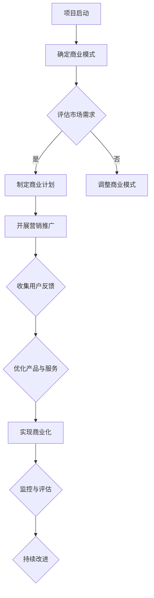

                 

### 文章标题

《程序员如何将开源项目商业化：开源与盈利的平衡》

### 关键词

- 开源项目
- 商业化
- 盈利模式
- 管理策略
- 风险评估
- 成功案例

### 摘要

本文旨在探讨程序员如何将开源项目商业化，实现开源与盈利的平衡。文章首先介绍了开源运动的历史与发展，分析了开源与商业化的关系及面临的挑战。接着，从开源项目的管理、质量控制、营销与推广以及商业模式探索等角度，提供了一系列的策略和工具。随后，通过成功案例的详细分析，展示了开源项目商业化的实际操作。最后，对开源项目的商业化风险进行了评估，并提出应对策略，展望了开源与商业化的未来趋势。程序员可通过本文的内容，更好地理解并实践开源项目商业化的过程。

### 引言

在当今快速发展的技术世界中，开源项目已经成为软件开发的一个重要组成部分。开源项目不仅为程序员提供了一个共享、学习和改进代码的平台，还为企业降低了研发成本、加快了产品迭代速度。然而，开源项目往往面临盈利难的问题，这成为许多程序员和企业的一个困惑。如何将开源项目商业化，实现开源与盈利的平衡，成为程序员和企业在探索和实践中不断思考的问题。

本文旨在解答这一问题，帮助程序员深入了解开源与商业化的关系，掌握开源项目的管理、质量控制、营销与推广以及商业模式探索等关键环节。通过分析成功案例，我们将看到开源项目商业化的具体实现路径。同时，本文还将对开源项目的商业化风险进行评估，并提出有效的应对策略。最后，我们将展望开源与商业化的未来趋势，探讨程序员在这一过程中的角色和使命。

### 第一部分：开源与商业化的基本概念

#### 第1章：开源运动的历史与发展

##### 1.1 开源运动的起源

开源运动可以追溯到20世纪80年代。当时，自由软件运动（Free Software Movement）兴起，倡导软件的源代码开放，用户可以自由地使用、复制、研究、修改和分发软件。自由软件运动的先驱是理查德·斯托曼（Richard Stallman），他创建了GNU项目，致力于开发自由软件，以替代商业软件。这一运动对后来的开源运动产生了深远的影响。

1998年，开源倡议（Open Source Initiative，OSI）成立，正式提出了开源的定义和原则。开源运动的核心是“开放协作”，即通过开放源代码，鼓励社区成员参与，共同改进软件。

##### 1.2 开源与自由软件运动的关系

开源运动和自由软件运动虽然目标相似，但理念有所不同。自由软件运动强调用户自由，即用户有权运行、研究、修改和分发软件。开源运动则更注重技术合作，强调开放源代码可以提高软件的质量和可靠性。

两者之间的关系可以理解为自由软件运动是开源运动的先驱，开源运动是自由软件运动在商业环境下的延伸。许多开源项目最初是由自由软件运动的参与者发起的，如Linux操作系统、Apache Web服务器等。

##### 1.3 开源项目的成功案例

开源项目在全球范围内取得了巨大的成功，不仅改变了软件开发的模式，也对整个技术产业产生了深远的影响。以下是几个著名的开源项目案例：

- **Linux操作系统**：Linux是由林纳斯·托瓦兹（Linus Torvalds）发起的开源操作系统，它成为了服务器、嵌入式系统和超级计算机等领域的首选操作系统。

- **Apache Web服务器**：Apache是世界上使用最广泛的Web服务器软件，由Apache软件基金会维护，它的开源特性使其能够不断改进和适应各种应用场景。

- **Mozilla Firefox浏览器**：Mozilla Firefox是由Mozilla基金会开发的一款开源网页浏览器，它以其高性能、隐私保护和扩展性而广受欢迎。

- **Kubernetes容器编排系统**：Kubernetes是一个开源的容器编排系统，它简化了容器化应用程序的部署、扩展和管理，已成为云原生应用的事实标准。

这些成功案例表明，开源项目不仅可以取得技术上的成功，还可以在商业上取得巨大的收益。

##### 1.4 商业公司参与开源的现状

随着开源项目的重要性日益凸显，越来越多的商业公司开始参与开源项目。商业公司参与开源项目的方式多种多样，包括：

- **贡献代码**：许多商业公司通过向开源项目贡献代码，提高项目的质量和技术水平。

- **雇佣开源项目开发者**：一些商业公司直接雇佣开源项目的主要开发者，以确保项目的持续发展和维护。

- **成立开源基金会**：如Red Hat公司成立了OpenShift开源基金会，旨在促进开源技术的发展和应用。

- **提供商业化服务**：商业公司通过提供基于开源项目的服务，如云服务、支持服务和技术培训等，实现盈利。

商业公司参与开源项目，不仅有助于提升公司的技术实力和市场竞争力，还可以扩大开源项目的影响力和用户群体，实现共赢。

#### 第2章：开源项目商业化概述

##### 2.1 商业化与开源的矛盾

开源项目与商业化之间存在一定的矛盾。开源项目强调自由、开放和协作，而商业化则追求盈利和市场控制。这种矛盾主要体现在以下几个方面：

- **版权和许可问题**：开源项目通常采用开源协议（如GPL、MIT等），这些协议允许用户自由使用、修改和分发代码，但可能对商业用途有一定的限制。商业公司可能担心这些协议会影响其商业利益。

- **商业机密和竞争力**：开源项目的源代码是公开的，这可能导致商业公司担心技术秘密被竞争对手获取。此外，开源项目的成功也可能引发商业公司的竞争压力。

- **开发方向和市场定位**：开源项目的开发方向和市场定位可能不完全符合商业公司的战略目标。商业公司可能需要调整开源项目的发展方向，以适应其商业需求。

##### 2.2 开源项目商业化的动机

尽管存在矛盾，但许多程序员和企业仍然选择将开源项目商业化，其主要动机包括：

- **技术创新**：通过开源项目，程序员可以尝试新的技术和方法，推动技术进步。商业公司可以通过开源项目吸引顶尖的技术人才，提升研发能力。

- **市场扩展**：开源项目可以扩大企业的市场影响力，吸引更多的用户和合作伙伴。商业公司可以通过提供基于开源项目的商业化服务，拓展市场份额。

- **品牌建设**：开源项目的成功可以提升企业的品牌形象，增强市场竞争力。商业公司可以通过参与开源项目，树立行业领导者的形象。

- **盈利模式**：开源项目可以作为商业模式的一部分，通过提供技术支持、咨询服务、付费功能等实现盈利。

##### 2.3 开源项目商业化的形式

开源项目商业化的形式多种多样，常见的包括：

- **订阅模式**：企业通过提供定期订阅服务，为用户提供技术支持、更新和维护等服务，实现盈利。

- **服务化模式**：企业基于开源项目提供定制化服务，如技术咨询、开发和部署等，根据服务内容收取费用。

- **二次开发模式**：企业对开源项目进行二次开发，添加特定功能或优化性能，然后将其商业化。

- **联合开发模式**：企业与开源项目的开发者或社区成员合作，共同开发新的产品或功能，然后进行商业化。

- **品牌授权模式**：企业通过授权其他公司使用其开源项目的品牌和技术，收取授权费用。

这些商业化的形式各有优劣，企业需要根据自身情况和市场环境选择合适的模式。

##### 2.4 开源项目商业化面临的挑战

开源项目商业化并非一帆风顺，面临着一系列挑战：

- **社区管理**：如何平衡开源社区的自由性和商业公司的控制权，确保项目的可持续发展。

- **技术更新**：如何确保开源项目的代码质量和技术更新，满足商业需求。

- **市场竞争**：如何在激烈的市场竞争中保持开源项目的优势，吸引和留住用户。

- **风险控制**：如何应对商业化过程中的法律风险、市场风险和技术风险。

为了克服这些挑战，程序员和企业需要制定全面的管理策略和风险控制措施，确保开源项目的商业成功。

### 第二部分：开源项目的管理

#### 第3章：开源项目治理

##### 3.1 开源项目治理的基本原则

开源项目治理是指对开源项目进行有效管理、决策和风险控制的一系列机制和原则。有效的治理可以确保项目的可持续发展，平衡开源社区和商业公司的利益。以下是开源项目治理的基本原则：

- **透明性**：项目治理过程应保持透明，所有决策和讨论都应公开进行，以确保社区成员的知情权和参与度。

- **社区参与**：鼓励社区成员参与项目的决策、开发和维护，充分发挥社区的智慧和创造力。

- **平等原则**：无论个人、组织还是公司，在项目中都应享有平等的权利和机会，避免权力集中和利益冲突。

- **自治性**：项目应具备一定的自治性，允许社区成员自主决策和行动，但需遵守项目的总体目标和规则。

- **持续改进**：项目应不断进行改进和优化，以适应技术发展和市场需求，保持竞争力。

##### 3.2 开源项目组织的结构

开源项目的组织结构通常采用分布式、扁平化的形式，以适应社区参与和快速决策。以下是常见的开源项目组织结构：

- **领导团队**：由核心团队成员组成，负责项目的总体规划和决策。领导团队通常由项目创始人、主要贡献者和资深开发者担任。

- **项目管理委员会**：负责项目的日常管理、协调和决策，包括发布计划、资源分配、风险管理等。项目管理委员会成员由社区成员选举产生，代表不同利益方。

- **工作小组**：根据项目需求，设立不同功能的工作小组，如开发小组、测试小组、文档小组等。工作小组负责具体的任务和活动，并向项目管理委员会汇报。

- **社区成员**：包括所有参与项目的个人和机构，他们可以通过贡献代码、提供建议和参与讨论等方式，为项目发展贡献力量。

这种组织结构强调平等和自治，使项目能够在社区的支持下，保持高效和灵活。

##### 3.3 开源项目的决策流程

开源项目的决策流程通常包括以下几个步骤：

1. **提案**：社区成员或工作小组提出项目提案，包括项目目标、需求分析、技术方案等。

2. **讨论**：项目管理委员会和社区成员对提案进行讨论，提出修改意见和建议。

3. **投票**：提案经过讨论后，提交给项目管理委员会或社区成员进行投票。投票结果通常采用多数原则决定。

4. **执行**：决策通过后，由相关工作小组负责实施，并定期向项目管理委员会和社区成员报告进展。

5. **审核**：项目执行过程中，进行定期审核，确保项目按计划进行，并根据实际情况进行调整。

这种决策流程既保证了项目的民主性，又提高了决策的效率。

##### 3.4 开源项目的风险管理

开源项目在商业化和发展过程中，面临着多种风险。以下是一些常见风险及应对策略：

- **技术风险**：项目可能面临技术难题、代码质量和性能问题。应对策略包括：建立严格的技术评审机制，定期进行代码审查和性能测试。

- **法律风险**：开源项目可能涉及版权、专利和许可等问题。应对策略包括：遵守开源协议，进行法律咨询，确保项目的合法合规。

- **市场风险**：项目可能面临市场竞争、用户流失等问题。应对策略包括：进行市场调研，了解用户需求，及时调整项目方向。

- **社区风险**：项目可能面临社区分裂、成员流失等问题。应对策略包括：建立良好的社区文化，鼓励成员参与，提高社区凝聚力。

通过有效的风险管理，开源项目可以降低风险，确保项目的可持续发展。

#### 第4章：开源项目的质量控制

##### 4.1 开源项目的代码质量

开源项目的代码质量是其成功与否的关键因素。高代码质量意味着代码的可读性、可维护性和可扩展性更强，从而提高项目的稳定性和可持续性。以下是一些提高代码质量的方法：

- **编码规范**：制定统一的编码规范，确保代码风格一致，提高可读性。

- **代码审查**：通过代码审查，发现和修复代码中的错误和缺陷，提高代码质量。

- **单元测试**：编写单元测试，确保代码功能正确，减少引入新错误的风险。

- **性能优化**：对代码进行性能优化，提高运行效率，减少资源消耗。

- **代码风格工具**：使用代码风格工具，如Prettier、ESLint等，自动格式化代码，确保代码风格一致。

##### 4.2 开源项目的测试

开源项目的测试是确保代码质量的重要环节。以下是一些常见的测试方法：

- **单元测试**：对单个函数或模块进行测试，确保其功能正确。

- **集成测试**：对整个项目进行测试，确保模块之间的交互正常。

- **性能测试**：测试项目的运行效率，发现和优化性能瓶颈。

- **安全测试**：测试项目是否存在安全漏洞，如SQL注入、XSS攻击等。

- **回归测试**：在项目更新时，对已有功能进行测试，确保没有引入新的错误。

通过全面的测试，可以确保开源项目的稳定性和可靠性。

##### 4.3 开源项目的文档

文档是开源项目的重要组成部分，它不仅帮助用户了解项目功能和使用方法，还有助于项目的维护和扩展。以下是一些编写高质量文档的方法：

- **官方文档**：编写详细的官方文档，包括项目介绍、安装指南、使用说明、API文档等。

- **README文件**：在项目的README文件中，提供简洁的项目介绍和快速入门指南。

- **代码注释**：为代码添加详细的注释，说明代码的功能、参数和实现原理。

- **示例代码**：提供丰富的示例代码，帮助用户更好地理解项目功能。

- **更新日志**：记录项目的更新历史，包括新增功能、修复问题和优化内容。

高质量的文档可以提高项目的可维护性和用户体验。

##### 4.4 开源项目的社区参与

社区参与是开源项目成功的关键因素。以下是一些促进社区参与的方法：

- **社区活动**：组织定期的社区活动，如线上会议、线下聚会等，增强社区成员之间的交流与合作。

- **贡献指南**：提供详细的贡献指南，帮助新成员了解项目的开发流程和规范。

- **激励机制**：为积极参与项目的成员提供奖励，如赞助、荣誉证书等，提高他们的积极性。

- **交流平台**：建立社区交流平台，如论坛、邮件列表、社交媒体等，方便成员之间的沟通和协作。

- **社区反馈**：重视社区成员的反馈和建议，及时处理和回复，增强社区的凝聚力。

通过以上方法，可以促进开源项目的社区参与，提高项目的可持续性。

#### 第5章：开源项目的营销与推广

##### 5.1 开源项目的品牌建设

品牌建设是开源项目成功的重要环节，它有助于提高项目的知名度和影响力。以下是一些品牌建设的策略：

- **明确项目定位**：确定项目的目标用户和核心功能，明确项目的市场定位。

- **设计独特标识**：设计具有独特性和辨识度的项目标识，如Logo、标语等，增强项目的品牌形象。

- **构建官方网站**：建立专业的官方网站，展示项目介绍、功能特点、下载链接、文档资源等，提供一站式服务。

- **发布高质量内容**：定期发布高质量的技术博客、案例研究、教程等，提高项目的权威性和专业性。

- **参与行业活动**：参加行业会议、研讨会、技术交流等活动，展示项目成果，扩大项目影响力。

##### 5.2 开源项目的市场定位

市场定位是确保开源项目能够满足市场需求、吸引目标用户的关键。以下是一些市场定位的策略：

- **分析竞争对手**：研究竞争对手的产品、优势和不足，了解市场的竞争格局。

- **确定目标用户**：明确项目的目标用户群体，如开发者、企业用户等，了解他们的需求和痛点。

- **差异化优势**：分析项目的独特优势，如性能、安全性、易用性等，突出项目的差异化特点。

- **市场细分**：根据用户需求和市场趋势，对市场进行细分，制定针对性的推广策略。

- **合作伙伴**：寻找合适的合作伙伴，如行业领导者、技术社区等，共同推广项目。

##### 5.3 开源项目的用户参与

用户参与是开源项目成功的重要保障。以下是一些促进用户参与的方法：

- **用户反馈**：重视用户反馈，及时处理和回复用户的提问和建议，增强用户满意度。

- **社区互动**：建立活跃的社区，鼓励用户参与讨论、分享经验和知识，提高社区凝聚力。

- **开发者计划**：推出开发者计划，为贡献代码的开发者提供奖励和支持，激励更多用户参与项目。

- **用户调研**：定期进行用户调研，了解用户的需求和期望，调整项目方向和功能。

- **用户培训**：提供用户培训和技术支持，帮助用户更好地使用项目，提高用户留存率。

##### 5.4 开源项目的推广策略

推广策略是提高开源项目知名度、吸引更多用户的关键。以下是一些推广策略：

- **社交媒体**：利用社交媒体平台，如Twitter、Facebook、LinkedIn等，发布项目动态、技术文章、用户案例等，扩大项目影响力。

- **技术社区**：积极参与技术社区，如GitHub、Stack Overflow、Reddit等，与社区成员互动，分享项目经验。

- **博客文章**：撰写高质量的技术博客文章，介绍项目功能、使用方法、技术原理等，提高项目权威性和知名度。

- **行业媒体**：与行业媒体合作，发布项目相关报道，扩大项目影响力。

- **线下活动**：参加线下技术活动，展示项目成果，与用户和同行交流，建立合作关系。

通过以上推广策略，开源项目可以迅速获得关注，吸引更多用户参与。

### 第三部分：开源项目的商业模式

#### 第6章：开源项目的商业模式探索

##### 6.1 订阅模式

订阅模式是一种常见的开源项目商业模式，通过向用户提供定期订阅服务，实现盈利。以下是订阅模式的关键要素：

- **订阅内容**：确定订阅内容，如技术支持、更新通知、高级功能等，根据用户需求提供不同层次的订阅服务。

- **定价策略**：制定合理的定价策略，考虑成本、市场竞争和用户价值等因素，确保订阅服务的利润空间。

- **订阅流程**：建立便捷的订阅流程，包括注册、支付、登录和订阅管理等功能，提高用户体验。

- **订阅周期**：确定订阅周期，如月度、季度、年度等，根据用户需求和业务模式进行调整。

- **服务保障**：提供优质的服务保障，如快速响应、问题解决、隐私保护等，增强用户信任。

订阅模式的优势在于稳定现金流和用户粘性，但需要关注用户留存率和订阅续费率。

##### 6.2 服务化模式

服务化模式是指通过提供基于开源项目的定制化服务，实现盈利。以下是服务化模式的关键要素：

- **服务内容**：确定服务内容，如技术咨询、开发支持、系统集成等，根据客户需求提供个性化的服务。

- **服务定价**：制定合理的服务定价策略，考虑服务成本、市场竞争和客户价值等因素。

- **服务流程**：建立规范的服务流程，包括需求分析、方案设计、实施交付、售后服务等，确保服务的质量和效率。

- **服务保障**：提供优质的服务保障，如问题响应、技术支持、质量保证等，提高客户满意度。

- **合作伙伴**：寻找合适的合作伙伴，如行业专家、技术顾问等，共同为客户提供优质服务。

服务化模式的优势在于高附加值和高客户满意度，但需要关注服务的多样性和灵活性。

##### 6.3 二次开发模式

二次开发模式是指对开源项目进行定制化开发，添加特定功能或优化性能，然后将其商业化。以下是二次开发模式的关键要素：

- **需求分析**：深入了解客户需求，确定二次开发的目标和功能，确保开发的针对性和实用性。

- **技术方案**：制定详细的技术方案，包括开发框架、技术栈、开发周期等，确保开发的可行性和效率。

- **开发流程**：建立规范的开发流程，包括需求分析、设计、开发、测试、交付等，确保开发的规范和质量。

- **质量控制**：建立严格的质量控制机制，包括代码审查、单元测试、性能测试等，确保开发的质量和性能。

- **售后服务**：提供优质的售后服务，包括问题响应、技术支持、更新和维护等，提高客户满意度。

二次开发模式的优势在于定制化和高附加值，但需要关注开发的成本和周期。

##### 6.4 联合开发模式

联合开发模式是指企业与开源项目的开发者或社区成员合作，共同开发新的产品或功能，然后进行商业化。以下是联合开发模式的关键要素：

- **合作意向**：明确合作意向，包括合作目标、范围、责任等，确保合作的顺畅和高效。

- **合作协议**：签订合作协议，明确合作双方的权益和义务，保护双方的合法权益。

- **技术方案**：制定详细的技术方案，包括开发框架、技术栈、开发周期等，确保开发的可行性和效率。

- **分工合作**：明确分工合作，根据双方的技术优势和资源，确定各自的责任和任务。

- **成果分享**：建立成果分享机制，明确项目的知识产权、利润分配等，确保合作的公平和可持续性。

联合开发模式的优势在于资源整合和协同创新，但需要关注合作的协调和管理。

#### 第7章：开源项目的盈利策略

##### 7.1 产品定价策略

产品定价策略是开源项目盈利的关键因素，合理的定价策略可以提高项目的市场竞争力，实现盈利。以下是常见的定价策略：

- **成本定价**：以项目成本为基础，加上合理的利润，确定产品价格。这种策略适用于成本较低的项目，如软件开发工具。

- **市场定价**：根据市场需求和竞争状况，确定产品价格。这种策略适用于市场需求较大的项目，如云计算服务。

- **价值定价**：根据产品的价值，即用户愿意支付的价格，确定产品价格。这种策略适用于具有独特价值的项目，如高端技术解决方案。

- **套餐定价**：提供不同层次的套餐，根据用户需求和使用量，选择合适的产品组合。这种策略适用于功能丰富的项目，如企业级软件。

定价策略的选择需要考虑项目的特点、市场需求和用户价值，以确保定价的合理性和盈利性。

##### 7.2 营销推广策略

营销推广策略是提高开源项目知名度、吸引更多用户的关键。以下是一些常见的营销推广策略：

- **内容营销**：通过发布高质量的技术博客、案例研究、教程等，提高项目的权威性和专业性，吸引潜在用户。

- **社交媒体营销**：利用社交媒体平台，如Twitter、Facebook、LinkedIn等，发布项目动态、用户案例、技术文章等，扩大项目影响力。

- **合作伙伴营销**：与行业领导者、技术社区、媒体等建立合作关系，共同推广项目，提高项目的知名度。

- **线上线下活动**：参加线上线下的技术活动，展示项目成果，与用户和同行交流，建立合作关系。

- **广告推广**：通过搜索引擎优化（SEO）、搜索引擎营销（SEM）等广告推广方式，提高项目的曝光率和访问量。

营销推广策略需要根据项目的特点和目标用户，选择合适的渠道和方式，以提高营销效果。

##### 7.3 商业合作策略

商业合作策略是开源项目实现盈利的重要手段，通过与其他企业和机构合作，可以实现资源整合和协同创新。以下是常见的商业合作策略：

- **技术合作**：与行业领先的技术公司合作，共同开发新技术或产品，提高项目的技术水平和竞争力。

- **渠道合作**：与分销商、代理商等建立渠道合作，扩大项目的市场覆盖范围，提高销售业绩。

- **品牌合作**：与知名品牌合作，共同开展品牌推广活动，提高项目的品牌知名度和影响力。

- **投资合作**：与风险投资机构、私募基金等建立投资合作，获得资金支持，推动项目的发展。

- **战略合作伙伴**：与行业领先的企业建立战略合作伙伴关系，共同推动产业的发展，实现共赢。

商业合作策略需要根据项目的特点和合作目标，选择合适的合作伙伴，建立稳定的合作关系。

##### 7.4 盈利模式分析与评估

盈利模式分析与评估是开源项目商业化的重要环节，通过对盈利模式的评估和优化，可以提高项目的盈利能力和市场竞争力。以下是盈利模式分析与评估的关键要素：

- **盈利模式评估**：分析项目的盈利模式，包括收入来源、成本结构、利润率等，评估盈利模式的可行性和可持续性。

- **市场调研**：进行市场调研，了解用户需求、市场趋势和竞争对手情况，为盈利模式优化提供数据支持。

- **竞争对手分析**：分析竞争对手的盈利模式，了解其优势和不足，为项目提供参考和借鉴。

- **盈利模式优化**：根据评估结果和市场调研数据，优化项目的盈利模式，提高盈利能力和市场竞争力。

- **风险评估**：评估项目在商业化过程中可能面临的风险，制定风险应对策略，降低风险对项目的影响。

通过盈利模式分析与评估，开源项目可以更好地实现商业化，提高盈利能力和市场竞争力。

### 第四部分：开源项目的实战案例

#### 第8章：开源项目商业化的成功案例

##### 8.1 案例一：公司A的开源项目商业化之路

公司A是一家专注于大数据分析技术的企业，其开源项目名为“SmartData”。SmartData是一个基于Hadoop和Spark的大数据平台，提供高效的数据处理和分析功能。以下是公司A开源项目商业化的具体实践：

1. **项目定位与品牌建设**：公司A明确SmartData的目标用户为大数据开发者和企业，致力于提供高效、易用的大数据解决方案。公司通过官方网站、技术博客和社交媒体等渠道，积极宣传SmartData，树立品牌形象。

2. **订阅模式**：公司A采用订阅模式，为用户提供包括技术支持、更新通知、高级功能等在内的订阅服务。订阅费用根据用户规模和使用量进行调整，确保稳定的现金流。

3. **服务化模式**：公司A提供基于SmartData的服务化解决方案，包括大数据分析咨询、开发支持、系统集成等。服务化模式为公司带来了高附加值和高客户满意度。

4. **二次开发模式**：公司A根据客户需求，对SmartData进行二次开发，添加特定功能或优化性能，为客户提供定制化解决方案。

5. **社区参与**：公司A重视社区参与，通过定期举办线上会议、技术交流和用户培训等活动，增强社区成员之间的互动和合作。

6. **风险管理**：公司A建立完善的风险管理机制，包括技术评审、法律咨询、市场调研等，确保项目的稳定性和可持续性。

通过以上实践，公司A成功将SmartData商业化，实现了开源与盈利的平衡，提高了企业的市场竞争力和盈利能力。

##### 8.2 案例二：公司B的联合开发模式实践

公司B是一家专注于人工智能技术的企业，其开源项目名为“AIFlow”。AIFlow是一个用于构建和部署机器学习模型的开源平台。以下是公司B开源项目商业化的具体实践：

1. **项目定位与品牌建设**：公司B将AIFlow的目标用户定位为机器学习开发者和企业，致力于提供简单、高效、可扩展的机器学习解决方案。公司通过官方网站、技术博客和社交媒体等渠道，积极宣传AIFlow，树立品牌形象。

2. **联合开发模式**：公司B与多家高校和研究机构合作，共同开发AIFlow。合作双方共同制定技术方案，分工合作，共享成果。通过联合开发，公司B获得了更多的技术资源和人才支持。

3. **订阅模式**：公司B为AIFlow用户提供订阅服务，包括技术支持、更新通知、高级功能等。订阅费用根据用户规模和使用量进行调整，确保稳定的现金流。

4. **服务化模式**：公司B提供基于AIFlow的服务化解决方案，包括机器学习咨询、模型开发、系统集成等。服务化模式为公司带来了高附加值和高客户满意度。

5. **品牌授权模式**：公司B授权其他企业使用AIFlow的品牌和技术，收取授权费用。品牌授权模式为公司带来了额外的收入来源。

6. **社区参与**：公司B重视社区参与，通过定期举办线上会议、技术交流和用户培训等活动，增强社区成员之间的互动和合作。

7. **风险管理**：公司B建立完善的风险管理机制，包括技术评审、法律咨询、市场调研等，确保项目的稳定性和可持续性。

通过以上实践，公司B成功将AIFlow商业化，实现了开源与盈利的平衡，提高了企业的市场竞争力和盈利能力。

##### 8.3 案例三：公司C的订阅模式运营策略

公司C是一家专注于云计算技术的企业，其开源项目名为“CloudStack”。CloudStack是一个用于构建和管理私有云的开源平台。以下是公司C开源项目商业化的具体实践：

1. **项目定位与品牌建设**：公司C将CloudStack的目标用户定位为云计算开发者和企业，致力于提供稳定、可靠、易用的私有云解决方案。公司通过官方网站、技术博客和社交媒体等渠道，积极宣传CloudStack，树立品牌形象。

2. **订阅模式**：公司C采用订阅模式，为用户提供包括技术支持、更新通知、高级功能等在内的订阅服务。订阅费用根据用户规模和使用量进行调整，确保稳定的现金流。

3. **服务化模式**：公司C提供基于CloudStack的服务化解决方案，包括云计算咨询、部署支持、系统集成等。服务化模式为公司带来了高附加值和高客户满意度。

4. **二次开发模式**：公司C根据客户需求，对CloudStack进行二次开发，添加特定功能或优化性能，为客户提供定制化解决方案。

5. **社区参与**：公司C重视社区参与，通过定期举办线上会议、技术交流和用户培训等活动，增强社区成员之间的互动和合作。

6. **风险管理**：公司C建立完善的风险管理机制，包括技术评审、法律咨询、市场调研等，确保项目的稳定性和可持续性。

通过以上实践，公司C成功将CloudStack商业化，实现了开源与盈利的平衡，提高了企业的市场竞争力和盈利能力。

##### 8.4 案例四：公司D的服务化模式探索

公司D是一家专注于区块链技术的企业，其开源项目名为“BlockChainX”。BlockChainX是一个用于构建和部署区块链应用的开源平台。以下是公司D开源项目商业化的具体实践：

1. **项目定位与品牌建设**：公司D将BlockChainX的目标用户定位为区块链开发者和企业，致力于提供简单、高效、安全的区块链解决方案。公司通过官方网站、技术博客和社交媒体等渠道，积极宣传BlockChainX，树立品牌形象。

2. **服务化模式**：公司D提供基于BlockChainX的服务化解决方案，包括区块链咨询、应用开发、系统集成等。服务化模式为公司带来了高附加值和高客户满意度。

3. **订阅模式**：公司D为BlockChainX用户提供订阅服务，包括技术支持、更新通知、高级功能等。订阅费用根据用户规模和使用量进行调整，确保稳定的现金流。

4. **联合开发模式**：公司D与多家区块链技术企业和研究机构合作，共同开发BlockChainX。通过联合开发，公司D获得了更多的技术资源和人才支持。

5. **社区参与**：公司D重视社区参与，通过定期举办线上会议、技术交流和用户培训等活动，增强社区成员之间的互动和合作。

6. **风险管理**：公司D建立完善的风险管理机制，包括技术评审、法律咨询、市场调研等，确保项目的稳定性和可持续性。

通过以上实践，公司D成功将BlockChainX商业化，实现了开源与盈利的平衡，提高了企业的市场竞争力和盈利能力。

### 第五部分：开源项目的商业化风险评估与应对

#### 第9章：开源项目的商业化风险评估与应对

##### 9.1 风险识别与评估

开源项目在商业化过程中可能面临多种风险，包括技术风险、法律风险、市场风险和社区风险。以下是对这些风险的识别与评估：

- **技术风险**：技术风险包括代码质量不稳定、技术更新不及时、技术漏洞等。为了识别技术风险，可以采用以下方法：
  - **代码审查**：定期进行代码审查，确保代码质量。
  - **性能测试**：定期进行性能测试，发现和优化性能瓶颈。
  - **安全审计**：进行安全审计，确保项目没有安全漏洞。

- **法律风险**：法律风险包括开源协议的合规性、版权问题、专利争议等。为了识别法律风险，可以采用以下方法：
  - **法律咨询**：咨询专业律师，确保项目的合法合规。
  - **协议审查**：审查开源协议，确保项目符合相关法规。

- **市场风险**：市场风险包括市场竞争、用户流失、市场需求变化等。为了识别市场风险，可以采用以下方法：
  - **市场调研**：定期进行市场调研，了解市场趋势和用户需求。
  - **竞争分析**：分析竞争对手的产品、优势和不足。

- **社区风险**：社区风险包括社区分裂、成员流失、社区管理困难等。为了识别社区风险，可以采用以下方法：
  - **社区反馈**：重视社区成员的反馈和建议，及时处理和回复。
  - **社区活动**：定期举办社区活动，增强社区凝聚力。

通过以上方法，可以识别和评估开源项目在商业化过程中可能面临的风险。

##### 9.2 风险应对策略

针对识别出的风险，开源项目需要制定相应的应对策略，以降低风险对项目的影响。以下是一些常见的风险应对策略：

- **技术风险**：为了应对技术风险，可以采取以下策略：
  - **代码审查和测试**：定期进行代码审查和测试，确保代码质量。
  - **持续集成**：采用持续集成（CI）工具，自动检测和修复代码错误。
  - **技术更新**：定期更新技术栈，采用最新技术和工具，提高项目竞争力。

- **法律风险**：为了应对法律风险，可以采取以下策略：
  - **法律咨询和培训**：聘请专业律师提供法律咨询，对项目成员进行法律培训。
  - **开源协议管理**：严格按照开源协议管理项目，确保项目合规。

- **市场风险**：为了应对市场风险，可以采取以下策略：
  - **市场调研和预测**：定期进行市场调研，预测市场趋势和用户需求。
  - **产品创新**：根据市场调研结果，进行产品创新和优化，提高用户满意度。

- **社区风险**：为了应对社区风险，可以采取以下策略：
  - **社区管理**：建立完善的社区管理机制，确保社区秩序和凝聚力。
  - **激励机制**：为社区成员提供奖励和荣誉，提高他们的积极性。

通过以上策略，可以有效地降低风险对开源项目的影响。

##### 9.3 风险管理与控制

风险管理与控制是确保开源项目在商业化过程中稳定发展的关键。以下是一些常见的风险管理方法：

- **风险识别**：定期进行风险识别，识别可能影响项目目标实现的风险。

- **风险评估**：对识别出的风险进行评估，确定风险的可能性和影响程度。

- **风险应对**：制定相应的风险应对策略，降低风险的影响。

- **风险监控**：建立风险监控机制，定期跟踪和评估风险的发展情况。

- **风险管理文档**：记录风险管理的过程和结果，确保风险管理的持续性和有效性。

通过以上方法，可以有效地管理和控制风险，确保开源项目的可持续发展。

##### 9.4 风险案例分析与总结

为了更好地理解开源项目商业化过程中可能面临的风险，以下是一个实际案例的分析：

**案例**：某开源项目在商业化过程中，由于未对代码进行充分审查和测试，导致项目中存在严重的性能瓶颈和安全漏洞。这些风险最终导致用户满意度下降，市场份额减少。

**分析**：
1. **风险识别**：在项目早期，未能充分识别技术风险，未进行全面的代码审查和性能测试。
2. **风险评估**：技术风险未被评估，未意识到性能瓶颈和安全漏洞可能对项目产生的影响。
3. **风险应对**：缺乏有效的风险应对策略，未能及时解决代码中的问题和漏洞。
4. **风险监控**：未能建立有效的风险监控机制，未能及时发现和解决技术问题。

**总结**：
该案例表明，开源项目在商业化过程中，需要重视风险的识别、评估和应对。通过建立完善的风险管理机制，可以有效地降低风险对项目的影响，确保项目的稳定发展和商业化成功。

### 第六部分：开源与商业化的未来趋势

#### 第10章：开源与商业化的未来趋势

##### 10.1 开源生态的发展趋势

开源生态正面临着快速发展和变革。以下是一些主要趋势：

- **社区参与度提高**：随着技术的进步和开源文化的普及，越来越多的程序员和开发者加入开源社区，共同推动技术进步。

- **商业公司深度参与**：商业公司积极参与开源项目，通过贡献代码、提供支持和服务等方式，扩大自身技术实力和市场影响力。

- **技术多样化**：开源项目涵盖了更多领域和场景，如云计算、大数据、人工智能、物联网等，推动了技术的多样化和创新。

- **开源治理规范化**：开源项目治理逐步规范化，通过建立完善的管理机制和流程，确保项目的可持续发展。

- **开源与商业融合**：开源与商业的界限日益模糊，开源项目成为商业公司的重要竞争力，同时商业公司也为开源项目提供了资金、资源和市场支持。

##### 10.2 商业化模式的创新

开源项目的商业化模式不断涌现和创新，以下是一些新的商业模式：

- **订阅模式**：订阅模式已经成为开源项目的主要盈利模式，通过定期订阅服务，实现稳定现金流。

- **增值服务模式**：提供基于开源项目的增值服务，如高级功能、定制化开发、技术支持等，实现高附加值。

- **平台化模式**：建立开源项目平台，汇聚多个开源项目，提供统一的集成和服务，实现规模化运营。

- **社区协作模式**：通过社区协作，激发开发者创造力，共同推进项目发展，实现共赢。

- **生态合作模式**：与其他开源项目和企业建立生态合作关系，共同推动产业发展，实现互利共赢。

这些新模式为开源项目的商业化提供了更多可能性。

##### 10.3 开源与商业化的融合发展

开源与商业化的融合发展是未来趋势。以下是一些关键点：

- **技术共享**：开源项目促进了技术的共享和传播，推动了技术的进步和普及。

- **市场拓展**：开源项目帮助企业拓展市场，吸引更多用户和合作伙伴，提升品牌影响力。

- **研发效率**：开源项目降低了研发成本，提高了研发效率，加速了产品迭代。

- **创新驱动**：开源项目激发了开发者的创新热情，推动了技术的创新和发展。

- **价值创造**：开源项目通过技术创新和市场拓展，实现了商业价值和社会价值的创造。

开源与商业化的融合发展，为企业和开发者带来了新的机遇和挑战。

##### 10.4 程序员在开源商业化中的角色与使命

在开源商业化的过程中，程序员发挥着至关重要的作用。以下是一些关键角色和使命：

- **技术领导者**：程序员是开源项目的技术领导者，负责项目的技术架构、代码质量和性能优化。

- **社区建设者**：程序员是开源社区的构建者，通过举办活动、编写文档、回答问题等方式，增强社区凝聚力。

- **商业化推动者**：程序员是开源项目商业化的推动者，通过探索商业模式、提供增值服务等方式，实现项目的商业成功。

- **创新推动者**：程序员是技术创新的推动者，通过不断尝试新技术、解决问题等方式，推动项目的创新和发展。

- **风险评估者**：程序员是开源项目风险的管理者，通过识别、评估和应对风险，确保项目的稳定性和可持续发展。

程序员在开源商业化中扮演着多重角色，承担着重要的使命，推动开源项目的成功。

### 附录

#### 附录A：开源项目的管理工具与资源

开源项目的管理需要多种工具和资源，以下是一些常用的工具和资源：

- **版本控制系统**：如Git、Mercurial等，用于代码版本控制和协作开发。

- **代码托管平台**：如GitHub、GitLab、Bitbucket等，用于托管和管理代码库。

- **持续集成工具**：如Jenkins、Travis CI等，用于自动化测试和构建。

- **文档生成工具**：如Doxygen、Sphinx等，用于生成项目文档。

- **自动化测试工具**：如JUnit、PyTest等，用于编写和执行测试用例。

- **社区交流平台**：如Discourse、Mattermost等，用于社区成员之间的交流和协作。

- **开源协议**：如GPL、MIT、Apache License等，用于规定开源项目的许可和使用方式。

- **开源社区资源**：如OSI、Open Hub、GitHub Trending等，提供开源项目的信息和趋势分析。

#### 附录B：开源与商业化的常见问题与解答

在开源与商业化的过程中，程序员和企业可能会遇到一系列问题。以下是一些常见问题及解答：

- **Q：开源项目如何盈利？**
  **A**：开源项目可以通过多种方式盈利，如订阅模式、服务化模式、增值服务、平台化模式等。关键在于找到与项目特点和市场需求的匹配的商业模式。

- **Q：开源项目商业化是否合法？**
  **A**：开源项目商业化是合法的，但需要遵守开源协议和相关法规。商业公司可以通过提供增值服务、定制化开发等方式，实现项目的商业价值。

- **Q：如何平衡开源社区和商业利益？**
  **A**：平衡开源社区和商业利益的关键在于透明、平等和自治。项目治理应保持透明，社区成员应享有平等权利，项目决策应遵循自治原则。

- **Q：开源项目如何吸引用户？**
  **A**：开源项目可以通过高质量的技术、优质的文档、活跃的社区和有效的营销推广，吸引更多用户。同时，提供有吸引力的增值服务，提高用户粘性。

- **Q：如何管理开源项目的风险？**
  **A**：开源项目需要建立完善的风险管理机制，包括风险识别、评估、应对和监控。通过定期审查、法律咨询、市场调研等方式，确保项目的稳定性和可持续发展。

#### 附录C：开源项目商业化的经典流程图与伪代码

为了更好地理解开源项目商业化的过程，以下提供了几个经典的流程图和伪代码：

**附录C.1：开源项目商业化的流程图**



**附录C.2：开源项目的盈利模式伪代码**

```python
def generate_profit_model():
    # 确定盈利模式
    profit_model = choose_profit_model()

    # 根据盈利模式进行操作
    if profit_model == "subscription":
        subscription_plan = create_subscription_plan()
        generate_revenue_from_subscription(subscription_plan)
    elif profit_model == "services":
        service_offering = create_service_offering()
        generate_revenue_from_services(service_offering)
    elif profit_model == "custom_development":
        custom_requirement = get_custom_requirement()
        generate_revenue_from_custom_development(custom_requirement)
    elif profit_model == "platform":
        platform_features = create_platform_features()
        generate_revenue_from_platform(platform_features)
    else:
        raise ValueError("Invalid profit model")

def choose_profit_model():
    # 根据项目特点和市场需求选择盈利模式
    # 例如：通过问卷调查、市场调研等方式确定
    return "subscription"

def create_subscription_plan():
    # 创建订阅计划
    # 包括订阅内容、定价策略、订阅周期等
    return subscription_plan

def generate_revenue_from_subscription(subscription_plan):
    # 根据订阅计划生成订阅收入
    # 包括订阅管理、订阅续费等
    pass

def create_service_offering():
    # 创建服务方案
    # 包括服务内容、定价策略等
    return service_offering

def generate_revenue_from_services(service_offering):
    # 根据服务方案生成服务收入
    # 包括服务管理、服务交付等
    pass

def get_custom_requirement():
    # 获取定制化需求
    return custom_requirement

def generate_revenue_from_custom_development(custom_requirement):
    # 根据定制化需求生成开发收入
    # 包括开发管理、开发交付等
    pass

def create_platform_features():
    # 创建平台特性
    # 包括平台功能、定价策略等
    return platform_features

def generate_revenue_from_platform(platform_features):
    # 根据平台特性生成平台收入
    # 包括平台管理、平台推广等
    pass
```

**附录C.3：开源项目的营销策略伪代码**

```python
def marketing_strategy():
    # 确定营销策略
    marketing_channels = choose_marketing_channels()

    # 根据营销策略进行操作
    for channel in marketing_channels:
        if channel == "content":
            content_marketing()
        elif channel == "social_media":
            social_media_marketing()
        elif channel == "event":
            event_marketing()
        elif channel == "publicity":
            publicity_marketing()
        else:
            raise ValueError("Invalid marketing channel")

def choose_marketing_channels():
    # 根据项目特点和市场需求选择营销渠道
    # 例如：通过市场调研、用户分析等方式确定
    return ["content", "social_media", "event", "publicity"]

def content_marketing():
    # 内容营销策略
    # 包括撰写技术博客、发布教程、案例研究等
    pass

def social_media_marketing():
    # 社交媒体营销策略
    # 包括发布动态、互动、广告投放等
    pass

def event_marketing():
    # 活动营销策略
    # 包括举办线上会议、技术沙龙、用户聚会等
    pass

def publicity_marketing():
    # 公关营销策略
    # 包括与媒体合作、参与行业活动、发布新闻稿等
    pass
```

**附录C.4：开源项目的风险管理伪代码**

```python
def risk_management():
    # 风险管理流程
    risks = identify_risks()
    risks = assess_risks(risks)
    strategies = define_risk_strategies(risks)
    implement_risk_management(strategies)
    monitor_risk_management()

def identify_risks():
    # 识别风险
    # 包括技术风险、法律风险、市场风险、社区风险等
    return risks

def assess_risks(risks):
    # 评估风险
    # 包括风险评估、风险优先级排序等
    return risks

def define_risk_strategies(risks):
    # 定义风险应对策略
    # 包括风险规避、风险降低、风险转移等
    return strategies

def implement_risk_management(strategies):
    # 实施风险管理
    # 包括风险监控、风险应对等
    pass

def monitor_risk_management():
    # 监控风险管理
    # 包括定期审核、风险评估更新等
    pass
```

这些流程图和伪代码为开源项目的商业化提供了具体的指导和参考，有助于程序员更好地理解和实践开源项目商业化的过程。

