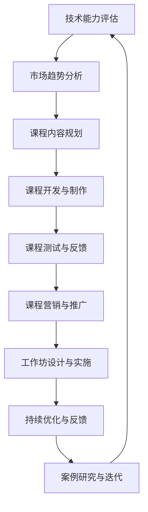

                 

### 引言

在现代信息技术快速发展的时代，程序员这一职业不仅局限于编写代码，更是技术推动者、知识分享者和行业引领者。随着在线教育市场的蓬勃发展和知识付费理念的深入人心，程序员将自身技术专长转化为在线课程和工作坊，成为一种新的职业发展途径。这不仅有助于个人品牌建设，还能实现知识变现，提升个人在行业中的影响力。

本文将围绕程序员如何将技术专长转化为在线课程和工作坊展开讨论。通过系统性的分析和逻辑推理，我们旨在为程序员提供一份全面且实用的指南，帮助他们从技术专家逐步转型为教育工作者。文章结构如下：

1. **技术专长的评估与市场分析**：探讨如何评估和定位自己的技术专长，分析市场趋势和竞争对手。
2. **课程内容规划与开发**：讲解课程目标的设定、内容的设计与组织，以及素材的准备与整合。
3. **课程开发与制作流程**：详细描述课程脚本编写、视频录制、文档编写、课程测试与反馈的流程。
4. **课程营销与推广策略**：介绍在线教育平台的选取、社交媒体营销策略、合作与联盟。
5. **工作坊设计与实施**：阐述工作坊目标与内容设定、准备、实施和反馈的步骤。
6. **持续优化与反馈**：讨论数据分析和优化、学员互动与反馈、课程更新与迭代。
7. **案例研究**：分析知名在线课程与工作坊的成功案例以及本地化案例研究。
8. **附录**：提供技术专长转化的流程图、课程开发工具与资源、常见问题与解答。

通过本文的逐步分析和详细讲解，读者将能够系统地了解程序员如何将技术专长转化为在线课程和工作坊，为自身职业发展开辟新路径。

### 关键词

- 在线课程
- 工作坊
- 技术专长
- 课程开发
- 营销策略
- 数据分析
- 教学内容规划

### 摘要

本文旨在为程序员提供一套全面且实用的指南，帮助他们将自身的技术专长转化为在线课程和工作坊。文章首先介绍了如何评估和定位技术专长，接着探讨了市场分析的重要性，并详细讲解了课程内容规划与开发、课程开发与制作流程、课程营销与推广策略、工作坊设计与实施、持续优化与反馈等关键步骤。通过成功案例分析和本地化研究，本文为程序员提供了实际操作经验和建议。通过遵循本文的步骤，程序员不仅能够实现知识变现，还能提升个人品牌和行业影响力。

### 第一部分：技术专长的评估与市场分析

要成功将技术专长转化为在线课程和工作坊，程序员首先需要对自身的技术能力进行准确的评估与定位。这一步骤不仅能够帮助程序员了解自己的优势与短板，还能为后续的课程开发提供清晰的指导。

#### 技术专长的自我评估方法

**1.1 技术能力评估工具**

自我评估的第一步是借助外部工具进行技术能力的评估。这些工具通常包括在线编程挑战平台（如LeetCode、HackerRank）、技术面试准备工具（如Cracking the Coding Interview）、以及技能评估网站（如SkillMeter、TestGorilla）。这些工具通过提供编程题目和测试，帮助程序员了解自己在数据结构、算法、编程语言和系统设计等方面的能力。

**使用方法**：程序员可以通过定期完成这些平台的练习和测试，记录自己的得分和进度。同时，这些平台通常会提供详细的分析报告，帮助程序员发现自己在哪些领域表现优异，哪些方面需要提高。

**1.2 技术项目的成果分析**

除了使用在线评估工具，程序员还可以通过分析自己参与过的技术项目来评估自己的专长。这些项目可以是公司项目、开源项目或者个人项目。以下方法可以帮助程序员进行成果分析：

- **项目回顾**：对参与过的项目进行回顾，梳理自己在项目中的角色和贡献，包括代码质量、技术难题的解决、项目进展等。
- **代码审查**：请其他有经验的技术专家对项目代码进行审查，听取他们的反馈和建议。
- **技术总结**：撰写技术总结文档，包括项目的核心技术点、遇到的问题和解决方案、技术成长等。

**使用方法**：通过这些方法，程序员可以系统地了解自己在不同技术领域的能力，识别出自己最擅长和最感兴趣的技术方向。

#### 技术市场的趋势分析

**1.3 行业热点与趋势**

了解技术市场的趋势对于程序员将技术专长转化为在线课程和工作坊至关重要。以下方法可以帮助程序员把握行业热点和趋势：

- **订阅技术博客和资讯网站**：如GitHub Trending、Medium、InfoQ等，这些平台会定期发布技术热点和趋势分析。
- **参加技术会议和研讨会**：如Google I/O、AWS re:Invent、PyCon等，这些活动通常会邀请行业专家分享最新的技术动态。
- **阅读专业书籍和论文**：关注行业顶尖书籍和论文，如《深度学习》、《算法导论》等，这些资料可以帮助程序员深入理解行业前沿技术。

**1.4 在线教育市场的规模与增长**

随着在线教育的普及，程序员可以通过以下途径了解在线教育市场的规模和增长：

- **市场研究报告**：查阅市场研究机构发布的在线教育报告，如IDC、Gartner等，这些报告提供了详细的市场数据和分析。
- **在线教育平台数据**：分析知名在线教育平台（如Coursera、Udemy、edX）的用户数据、课程数据和市场表现。
- **社交媒体分析**：通过社交媒体平台（如LinkedIn、Twitter）关注行业专家和行业动态，了解在线教育的最新趋势和用户需求。

#### 竞争对手分析

**1.5 竞争对手分析**

在课程开发之前，对竞争对手进行详细分析是非常必要的。以下方法可以帮助程序员了解竞争对手的课程内容、教学方式、学员反馈等：

- **课程内容对比**：分析竞争对手的课程大纲、课程内容、教学视频等，了解他们的课程结构和亮点。
- **学员反馈分析**：查阅竞争对手的课程评价和学员反馈，了解学员对课程的满意度、学习效果等。
- **市场定位对比**：分析竞争对手的市场定位、目标学员群体、课程价格等，了解他们的市场策略和竞争优势。

**使用方法**：通过对比分析，程序员可以找到自己的课程差异化和竞争优势，明确自己的市场定位和目标学员群体。

通过上述步骤，程序员可以全面评估和定位自己的技术专长，并深入了解技术市场的趋势和竞争对手，为后续的课程开发奠定坚实的基础。

### 第二部分：课程内容规划与开发

要将技术专长转化为在线课程和工作坊，程序员需要精心规划课程内容，确保其具备系统性和实用性。以下将详细讨论课程内容的规划与设计、教学内容的组织与呈现、以及课程素材的准备与整合。

#### 课程目标的设定与大纲设计

**2.1 课程目标的设定**

课程目标是指课程希望达成的具体学习成果。设定明确、可衡量的课程目标对于确保课程的有效性和学员的学习效果至关重要。课程目标可以分为以下几类：

- **知识目标**：学员通过课程应掌握的核心知识点，如编程语言基础、算法原理等。
- **技能目标**：学员通过课程应具备的技能，如编写高效代码、解决复杂问题等。
- **态度目标**：学员通过课程应培养的学习态度和思维方式，如自主学习、团队合作等。

**设定方法**：

1. **调研需求**：通过问卷调查、访谈等方式，了解目标学员的学习需求和兴趣点。
2. **参考市场**：分析竞争对手的课程目标，取长补短，设定具有竞争力的目标。
3. **专家评审**：邀请行业专家对课程目标进行评审，确保目标的合理性和可实现性。

**2.2 大纲设计**

课程大纲是课程内容的骨架，清晰的大纲能够帮助学员了解课程结构和学习路径。大纲设计应包括以下内容：

- **课程模块**：将课程内容划分为若干个模块，每个模块对应一个知识点或技能点。
- **模块内容**：每个模块的具体内容，包括理论讲解、案例分析、实践操作等。
- **学习路径**：学员学习每个模块的顺序和衔接方式。

**设计方法**：

1. **逻辑结构**：根据知识点之间的逻辑关系设计大纲，确保内容的连贯性和系统性。
2. **循序渐进**：课程难度应逐步递增，从基础知识到高级应用，确保学员能够逐步掌握。
3. **模块划分**：合理划分模块，每个模块内容不宜过多，以便学员集中精力学习。

#### 教学内容的组织与呈现

**2.3 内容结构化**

为了使教学内容更加清晰易懂，程序员需要将课程内容进行结构化处理。以下是一些常见的结构化方法：

- **思维导图**：使用思维导图将知识点和模块之间的逻辑关系展现出来，帮助学员整体把握课程内容。
- **模块划分**：将课程内容划分为不同的子模块，每个子模块包含一个主要知识点或技能点。
- **代码示例**：通过代码示例展示具体的技术实现，帮助学员理解抽象的理论知识。

**2.4 教学手段与方法选择**

为了提高教学效果，程序员需要灵活选择教学手段和方法。以下是一些常见的方法：

- **视频讲解**：通过视频讲解知识点，使学员能够直观地理解课程内容。
- **互动问答**：设置互动问答环节，鼓励学员提问和参与讨论，增强学习互动性。
- **案例分析**：通过案例分析，将理论知识应用到实际场景中，帮助学员理解知识的应用。
- **实践操作**：提供实践操作任务，让学员动手实践，加深对知识点的理解和掌握。

**2.5 教学内容的呈现**

教学内容的呈现方式对学员的学习效果有很大影响。以下是一些常见的呈现方式：

- **PPT演示**：使用PPT进行知识点的讲解，配合文字、图片、动画等元素，使内容更加生动有趣。
- **代码演示**：在实际操作中演示代码编写过程，让学员能够直观地看到代码的运行效果。
- **文档资料**：提供详细的文档资料，包括知识点讲解、代码示例、操作指南等，方便学员查阅和复习。
- **互动工具**：使用在线互动工具（如Quizlet、Kahoot!），增加学习趣味性，提高学员参与度。

#### 课程素材的准备与整合

**2.6 教学视频、文档、代码等素材的整理**

为了确保课程质量，程序员需要精心准备和整合各类教学素材。以下是一些关键步骤：

- **视频录制**：录制高质量的教学视频，包括知识点讲解、代码演示、案例分析等。
- **文档编写**：编写详细的课程文档，包括理论讲解、操作指南、案例分析等。
- **代码整理**：整理与课程内容相关的源代码，确保代码质量高、可读性强。

**2.7 素材的质量与优化**

高质量的教学素材能够提升课程的整体水平，以下方法可以帮助程序员提高素材质量：

- **内容审核**：对视频、文档、代码等素材进行严格审核，确保内容准确无误、逻辑清晰。
- **用户反馈**：收集学员对素材的反馈，根据反馈进行优化和调整。
- **更新迭代**：定期更新课程素材，跟踪技术发展，保持内容的时效性和实用性。

通过上述步骤，程序员可以系统地规划课程内容，确保其具备系统性和实用性，为学员提供高质量的学习体验。接下来，我们将进一步探讨课程开发与制作的流程。

### 第三部分：课程开发与制作流程

课程开发与制作是程序员将技术专长转化为在线课程和工作坊的重要环节。这一部分将详细讲解课程脚本编写、视频录制与剪辑、文档编写与排版，以及课程测试与反馈的流程，确保课程的质量和学员的学习效果。

#### 课程脚本编写

**3.1 脚本结构化**

脚本编写是课程开发的核心步骤，良好的脚本结构有助于提高教学效果。脚本结构通常包括以下几个部分：

- **开头引言**：引入课程主题，激发学员兴趣。
- **知识点讲解**：详细讲解课程知识点，配合示例和图表。
- **实践操作**：演示具体操作步骤，引导学员动手实践。
- **案例分析**：通过实际案例，讲解知识点的应用。
- **总结回顾**：总结课程重点，强化学员记忆。
- **互动环节**：设置互动问答或讨论环节，增强学员参与度。

**编写方法**：

1. **逻辑清晰**：确保脚本内容条理清晰，逻辑严密，避免混乱和不必要的重复。
2. **简洁明了**：用简洁的语言表达知识点，避免冗长和复杂的句子。
3. **易于理解**：使用易于理解的图表、示例和代码，帮助学员更好地理解抽象概念。

#### 视频录制与剪辑

**3.2 视频录制技巧**

视频录制是课程教学的重要组成部分，高质量的录制能够提高学员的学习体验。以下是一些视频录制技巧：

- **环境布置**：选择安静、光线适宜的录制环境，避免噪音和光线干扰。
- **设备选择**：使用高质量的摄像头和麦克风，确保视频和音频效果清晰。
- **讲解方式**：采用生动、自然的讲解方式，注重语速、语调和表情的变化。
- **互动设计**：在视频中加入互动元素，如提问、暂停、案例分析等，提高学员参与度。

**3.3 视频剪辑与后期制作**

视频剪辑与后期制作是提升视频质量的关键步骤。以下是一些常见技巧：

- **剪辑**：去除不必要的部分，调整视频节奏，使内容更加紧凑和流畅。
- **字幕**：为视频添加字幕，便于学员理解课程内容，提高学习效果。
- **特效**：使用简单的特效（如淡入淡出、切换效果）增强视频的视觉效果。
- **音效**：调整视频音效，确保讲解声音清晰，背景音乐适宜。

#### 文档编写与排版

**3.4 教学文档的内容安排**

教学文档是课程的重要组成部分，包括课程大纲、知识点讲解、操作指南、案例分析和总结等。以下是一些编写与排版建议：

- **内容结构**：确保文档内容结构清晰，层次分明，方便学员查阅和理解。
- **文字表述**：使用简洁、准确的文字表述知识点，避免冗长和复杂的句子。
- **图表使用**：合理使用图表和图片，帮助学员更好地理解抽象概念。
- **排版设计**：采用合理的排版设计，确保文档美观易读，提高学员的学习体验。

**3.5 排版与设计**

文档排版对于提高文档质量至关重要。以下是一些排版设计建议：

- **字体与字号**：选择易读的字体，并设置合适的字号，确保文档清晰可读。
- **段落格式**：合理设置段落间距、行距和边距，使文档布局整齐有序。
- **颜色与图标**：使用合适的颜色和图标，增加文档的视觉吸引力，提高阅读体验。

#### 课程测试与反馈

**3.6 课程试讲**

课程试讲是评估课程质量和优化教学效果的必要步骤。以下是一些试讲建议：

- **模拟环境**：选择一个模拟的教学环境，邀请同事或朋友担任学员，进行模拟试讲。
- **互动环节**：在试讲过程中，设置互动环节，观察学员的反应和参与度。
- **反馈收集**：结束后，收集学员的反馈意见，了解课程内容的可理解性、教学方法的适用性等。

**3.7 学员反馈收集与处理**

学员反馈是课程优化的重要依据。以下是一些反馈收集与处理建议：

- **定期收集**：通过问卷调查、访谈等方式，定期收集学员的反馈意见。
- **分类处理**：对学员反馈进行分类整理，分析反馈的主要问题，确定优化方向。
- **持续改进**：根据学员反馈，持续优化课程内容、教学方法和素材质量，提高课程整体水平。

通过上述步骤，程序员可以系统地开发高质量的在线课程和工作坊，确保课程的质量和学员的学习效果。接下来，我们将探讨课程营销与推广策略。

### 第四部分：课程营销与推广策略

要将在线课程和工作坊成功推向市场，吸引潜在学员，程序员需要制定一系列有效的营销与推广策略。以下将详细讨论在线教育平台的选取、社交媒体营销策略、合作与联盟，以及知识产权保护与品牌建设。

#### 在线教育平台的选取

**4.1 平台特点对比**

选择适合的在线教育平台是课程营销的第一步。以下是一些常见平台的对比：

- **Udemy**：全球最大的在线课程平台，覆盖广泛，流量大，但课程质量参差不齐。
- **Coursera**：与顶尖大学和机构合作，课程质量高，适合学术性和高难度课程。
- **edX**：类似Coursera，也由顶尖大学和机构提供课程，课程质量高，但收费模式多样。
- ** Teachable**：专注于个人和教育机构的在线课程平台，功能全面，操作简便。
- **Khan Academy**：非盈利性教育平台，课程免费，适合普及性知识教育。

**选择标准**：

1. **目标学员群体**：根据课程内容和定位，选择适合的目标学员群体所在的平台。
2. **平台特色**：选择具有特色功能的平台，如互动性强、内容丰富、支持多种教学方式等。
3. **费用与分成**：比较不同平台的费用结构和分成比例，选择性价比高的平台。

#### 社交媒体营销策略

**4.2 内容创作与发布**

社交媒体是吸引学员的重要渠道。以下是一些有效的社交媒体营销策略：

- **内容创作**：创作有价值、有吸引力的内容，如教学视频片段、知识点总结、实用技巧等。
- **发布计划**：制定定期发布计划，保持内容的连续性和更新频率。
- **互动与互动**：积极与粉丝互动，回复评论和提问，建立良好的社区氛围。

**4.3 粉丝互动与运营**

运营社交媒体账号是吸引和维护粉丝的关键。以下是一些建议：

- **问答环节**：定期举办问答活动，解答学员的疑问，增加互动性。
- **活动推广**：通过举办线上活动（如免费讲座、课程试听）吸引学员参与。
- **合作推广**：与其他博主、行业大V合作，通过联合推广增加曝光率。

#### 合作与联盟

**4.4 行业合作机会**

合作与联盟是扩大课程影响力的有效途径。以下是一些合作机会：

- **机构合作**：与教育机构、技术社区合作，开展联合培训或讲座。
- **企业合作**：与相关企业合作，提供定制化培训课程，为企业员工提供技术提升。
- **合作伙伴**：与其他在线教育平台、技术博客、社交媒体平台合作，实现资源共享和流量互换。

#### 知识产权保护与品牌建设

**4.5 知识产权保护**

保护知识产权是课程长期发展的基础。以下是一些保护措施：

- **版权声明**：在课程内容中明确版权声明，防止他人未经授权使用。
- **版权登记**：对重要课程内容进行版权登记，确保法律保护。
- **合作协议**：与合作伙伴签订知识产权保护协议，明确双方的权利和义务。

**4.6 品牌建设**

品牌建设是提升课程质量和市场认可度的重要环节。以下是一些建议：

- **专业形象**：保持课程内容的准确性、严谨性和专业性，树立良好的专业形象。
- **品牌故事**：通过讲述品牌故事，传递品牌价值观，建立情感连接。
- **品牌推广**：通过多种渠道（如社交媒体、线下活动）进行品牌推广，提高知名度。

通过上述策略，程序员可以有效推广在线课程和工作坊，吸引潜在学员，实现课程的市场化运作。接下来，我们将探讨工作坊设计与实施的关键步骤。

### 第五部分：工作坊设计与实施

工作坊作为一种互动性强的教学形式，能够帮助学员在实际操作中掌握技术知识，提升实践能力。以下将详细讨论工作坊目标与内容设定、准备、实施和反馈的步骤。

#### 工作坊目标与内容设定

**5.1 目标设定**

明确的工作坊目标能够帮助学员了解学习内容和期望成果。目标设定应考虑以下几个方面：

- **知识目标**：学员通过工作坊应掌握的核心知识，如特定编程语言、数据库管理、系统架构设计等。
- **技能目标**：学员通过工作坊应具备的技能，如编写高效代码、解决复杂问题、项目实施等。
- **能力目标**：学员通过工作坊应培养的能力，如团队合作、项目管理、创新思维等。

**设定方法**：

1. **调研需求**：通过问卷调查、访谈等方式，了解学员的学习需求和兴趣点，确保目标贴近学员实际需求。
2. **专家评审**：邀请行业专家对工作坊目标进行评审，确保目标的合理性和可实现性。
3. **市场分析**：分析市场需求和竞争对手的工作坊目标，取长补短，设定具有竞争力的目标。

**5.2 内容细化**

工作坊内容细化是确保目标实现的关键。以下方法可以帮助细化工作坊内容：

- **知识结构化**：将知识划分为若干个知识点，每个知识点对应一个具体的教学模块。
- **案例选取**：选取与知识点相关的实际案例，讲解知识点的应用场景和实现方法。
- **实践任务**：设计实践任务，让学员在操作中掌握知识点，提升实践能力。
- **互动环节**：设置互动环节，如问答、讨论、团队协作等，增强学员参与度。

#### 工作坊准备

**5.3 环境搭建**

工作坊的环境搭建是确保工作坊顺利进行的重要环节。以下是一些关键步骤：

- **硬件准备**：确保计算机、网络、投影仪等硬件设备正常运行，提供良好的操作环境。
- **软件安装**：安装必要的教学软件和开发工具，确保学员能够顺利操作。
- **资料准备**：准备与工作坊相关的教学资料，如PPT、代码示例、操作手册等。
- **场地安排**：选择合适的场地，确保座位充足、通风良好、光线适宜。

**5.4 资源准备**

工作坊的资源准备包括教学素材、设备和其他辅助资源。以下是一些建议：

- **教学素材**：包括PPT、视频、文档、代码等，确保内容丰富、质量高。
- **互动工具**：准备互动工具，如平板电脑、答题器等，增强学员参与度。
- **案例资源**：提供实际案例资源，包括案例数据、案例背景等，帮助学员更好地理解应用场景。
- **设备备份**：准备备用设备，如备用电脑、投影仪等，确保工作坊顺利进行。

#### 工作坊实施

**5.5 互动环节设计**

互动环节是工作坊的核心，以下方法可以帮助设计互动环节：

- **提问与解答**：设置提问环节，鼓励学员提问，解答学员的疑问，提高学习效果。
- **案例讨论**：通过案例讨论，引导学员分析问题、提出解决方案，培养分析能力和创新能力。
- **团队协作**：设计团队协作任务，让学员分组合作，提升团队合作能力和项目管理能力。
- **实操演示**：通过实操演示，展示具体操作步骤和技巧，帮助学员更好地掌握实践技能。

**5.6 案例分析与讨论**

案例分析与讨论是工作坊的重要环节，以下方法可以帮助进行案例分析和讨论：

- **案例选择**：选取与工作坊主题相关的实际案例，确保案例具有典型性和代表性。
- **案例分析**：分析案例背景、问题、解决方案等，帮助学员理解知识点的应用。
- **讨论引导**：引导学员进行案例讨论，提出问题、分享观点，激发思维碰撞。
- **总结反馈**：在讨论结束后，进行总结反馈，强调关键点和注意事项，巩固学习成果。

#### 工作坊反馈与改进

**5.7 学员反馈收集**

学员反馈是评估工作坊效果和改进教学的重要依据。以下方法可以帮助收集学员反馈：

- **问卷调查**：设计问卷调查，收集学员对工作坊内容的满意度、学习效果等。
- **访谈**：进行学员访谈，深入了解学员的学习体验、需求和改进建议。
- **现场观察**：观察学员在工作坊中的表现，了解学员的参与度和学习效果。

**5.8 后续改进建议**

根据学员反馈，制定后续改进建议，提升工作坊质量。以下是一些建议：

- **内容调整**：根据学员反馈，调整工作坊内容，增加或删减知识点，优化教学模块。
- **教学方法**：改进教学方法，如增加互动环节、改进案例设计等，提高教学效果。
- **资源更新**：定期更新教学资源，跟踪技术发展，保持内容的时效性和实用性。
- **反馈机制**：建立持续反馈机制，定期收集学员反馈，持续改进工作坊。

通过上述步骤，程序员可以设计并实施高质量的工作坊，帮助学员在实践操作中掌握技术知识，提升实践能力。接下来，我们将讨论如何对课程与工作坊进行持续优化与反馈。

### 第六部分：持续优化与反馈

为了确保在线课程和工作坊的长期成功，程序员需要不断进行优化与反馈。通过数据分析和课程内容调整、学员互动与反馈、以及市场动态与课程更新，程序员可以不断提升课程质量，满足学员需求，实现持续发展。

#### 数据分析与优化

**6.1 学员数据分析**

通过数据分析，程序员可以深入了解学员的学习行为和效果，从而优化课程内容和方法。以下方法可以帮助进行学员数据分析：

- **学习行为追踪**：记录学员的学习路径、学习时长、参与度等数据，分析学员的学习习惯和偏好。
- **成绩分析**：分析学员在课程测试和实践任务中的成绩，识别学习难点和薄弱环节。
- **反馈统计**：统计学员的问卷调查和访谈反馈，了解学员对课程的满意度和改进建议。

**优化方法**：

1. **内容调整**：根据数据反馈，调整课程内容，增加或删减知识点，优化教学模块。
2. **教学方法**：根据学员学习行为，改进教学方法，如增加互动环节、调整教学节奏等。
3. **资源更新**：定期更新教学资源，如视频、文档、案例等，确保内容的时效性和实用性。

#### 学员互动与反馈

**6.2 学员沟通渠道建立**

建立有效的沟通渠道是收集学员反馈和提供支持的关键。以下方法可以帮助建立沟通渠道：

- **在线论坛**：搭建在线论坛或社区，提供学员交流平台，促进学员互动和知识共享。
- **邮件列表**：建立邮件列表，定期发送课程更新、学习资源和学习提示，保持与学员的联系。
- **实时支持**：提供实时支持渠道，如在线聊天、电话咨询等，及时解决学员的问题。

**互动方法**：

1. **定期互动**：定期举办线上互动活动，如直播问答、小组讨论等，增加学员参与度。
2. **个性化支持**：根据学员的学习情况和反馈，提供个性化的学习建议和支持。
3. **反馈机制**：建立持续反馈机制，定期收集学员的反馈，及时处理学员的问题和需求。

#### 市场动态与课程更新

**6.3 技术市场趋势跟踪**

跟踪技术市场趋势可以帮助程序员及时调整课程内容，确保课程的前沿性和实用性。以下方法可以帮助进行市场趋势跟踪：

- **行业报告**：定期阅读和分析行业报告，了解技术市场的最新动态和趋势。
- **技术社区**：参与技术社区和论坛，关注行业专家的讨论和观点，掌握前沿技术发展。
- **社交媒体**：通过社交媒体平台，关注行业动态和专家观点，及时了解市场变化。

**更新方法**：

1. **课程迭代**：根据市场动态和技术发展，定期对课程内容进行迭代和更新，保持课程的时效性和前瞻性。
2. **案例更新**：更新实际案例，反映最新的技术应用和行业变化，增强课程的实用性和现实意义。
3. **资源优化**：定期检查和优化教学资源，确保资源的最新性和准确性。

通过数据分析和课程内容调整、学员互动与反馈、以及市场动态与课程更新，程序员可以不断提升课程质量，满足学员需求，实现持续发展。接下来，我们将通过成功案例分析，进一步探讨技术专长转化为在线课程和工作坊的最佳实践。

### 第七部分：成功案例分析

在技术领域，有许多成功的在线课程和工作坊案例，这些案例不仅展示了如何将技术专长转化为教育产品，还为其他程序员提供了宝贵的经验和启示。以下将介绍两个知名在线课程案例和一个本地化案例，分析其成功要素。

#### 知名在线课程案例

**7.1 Coursera上的《深度学习》课程**

《深度学习》课程由斯坦福大学教授Andrew Ng主讲，是Coursera上最受欢迎的课程之一。该课程从基础知识到高级应用，全面介绍了深度学习的原理和实践方法。

**成功要素分析**：

- **课程内容丰富且系统**：课程内容涵盖了深度学习的各个方面，从基础理论到实际应用，系统性强，便于学员逐步学习。
- **高质量的教学视频**：教学视频制作精良，讲解清晰，配以丰富的示例和动画，使抽象的概念易于理解。
- **实战性强**：课程提供了大量的编程实践任务，让学员能够将所学知识应用到实际项目中。
- **专家导师指导**：Andrew Ng作为深度学习领域的权威专家，其专业的讲解和丰富的经验对学员具有很大的吸引力。

**经验与启示**：

- 系统性的内容规划和高质量的讲解是课程成功的关键。
- 实战项目和专家指导能够提高学员的学习效果和动手能力。
- 持续更新课程内容，跟踪技术发展，保持课程的时效性和前瞻性。

#### 7.2 Udemy上的《Python编程从入门到精通》课程

《Python编程从入门到精通》课程由知名程序员Dormain Davis主讲，是Udemy上热门的编程课程之一。该课程适合初学者和有一定基础的学员，系统讲解了Python编程的各个方面。

**成功要素分析**：

- **内容循序渐进**：课程从基础语法到高级应用，逐步深入，帮助学员逐步掌握Python编程。
- **丰富的实战案例**：课程提供了大量的实战案例，涵盖Web开发、数据分析、人工智能等应用场景，使学员能够学以致用。
- **互动性强**：课程设置了互动问答环节，鼓励学员提问和参与讨论，增强了学习氛围。
- **课程更新及时**：Dormain Davis定期更新课程内容，确保与最新的Python版本和技术趋势保持同步。

**经验与启示**：

- 内容循序渐进和丰富的实战案例有助于提高学员的学习兴趣和动手能力。
- 互动环节和及时更新能够增强课程的吸引力和实用性。
- 关注学员反馈，及时调整课程内容和教学方法，提高学员满意度。

#### 本地化案例研究

**7.3 本地在线编程社区“程序员的进阶之路”**

“程序员的进阶之路”是一个本地在线编程社区，由多位本地程序员共同创建，提供高质量的编程课程和工作坊。该社区通过线上和线下相结合的方式，为本地程序员提供了丰富的学习资源和互动平台。

**成功模式借鉴**：

- **本地化特色**：社区根据本地程序员的需求，设计了具有本地特色的课程和工作坊，如面向本地企业的技术培训和项目实战。
- **线上线下结合**：线上课程和工作坊与线下活动相结合，提高了学员的参与度和学习效果。
- **社群运营**：通过建立活跃的社群，促进学员之间的交流和合作，形成了良好的学习氛围。
- **持续迭代**：社区定期收集学员反馈，不断优化课程内容和教学方法，保持课程的活力和吸引力。

**经验与启示**：

- 本地化特色能够满足学员的特定需求，提高课程的吸引力和实用性。
- 线上线下结合能够提供更加丰富和灵活的学习方式。
- 社群运营和持续迭代能够增强课程的持续性和生命力。

通过这些成功案例的分析，程序员可以借鉴其经验，结合自身专长和市场需求，打造高质量的在线课程和工作坊，实现个人品牌和职业发展。

### 附录A：技术专长转化的流程图

为了更清晰地展示程序员如何将技术专长转化为在线课程和工作坊，以下是一个简单的流程图，涵盖从技术能力评估到课程开发与营销的全过程。

#### 流程图解释

- **技术能力评估**：程序员通过工具和项目成果分析自身技术能力，确定专长领域。
- **市场趋势分析**：了解行业动态和竞争对手，为课程开发和市场定位提供依据。
- **课程内容规划**：设定课程目标，设计课程大纲和教学内容。
- **课程开发与制作**：编写脚本、录制视频、编写文档，确保内容质量和学习体验。
- **课程测试与反馈**：进行课程试讲和学员反馈收集，优化课程内容和方法。
- **课程营销与推广**：选择合适的平台，制定营销策略，推广课程。
- **工作坊设计与实施**：根据课程内容，设计互动性强的工作坊，确保实践效果。
- **持续优化与反馈**：通过数据分析和学员反馈，持续改进课程和工作坊。
- **案例研究与迭代**：分析成功案例，进行课程和内容的迭代更新。

通过遵循这个流程，程序员可以系统地转化技术专长，打造高质量的教育产品。

### 附录B：课程开发工具与资源

为了确保课程开发过程的顺利进行，程序员需要使用一系列实用的工具和资源。以下是一些常用的课程开发工具与资源，包括脚本编写工具、视频录制与剪辑软件、以及教学素材管理工具。

#### 脚本编写工具

- **Jupyter Notebook**：Jupyter Notebook 是一个交互式的编程和文档工具，特别适合编写和演示代码。它支持多种编程语言，如Python、R和Julia，并能够实时显示代码输出，非常适合课程内容讲解。
- **Visual Studio Code (VS Code)**：VS Code 是一个功能强大的开源代码编辑器，支持多种编程语言和开发框架。它具有丰富的插件和扩展，可以提高代码编写和调试的效率。

#### 视频录制与剪辑软件

- **OBS Studio**：OBS Studio 是一个免费且开源的视频录制和直播软件，支持多种视频和音频输入源。它提供了丰富的录制和直播选项，非常适合制作在线课程视频。
- **Adobe Premiere Pro**：Adobe Premiere Pro 是一个专业的视频编辑软件，适用于高端视频制作。它提供了强大的剪辑、调色、特效和音频处理功能，能够制作高质量的课程视频。

#### 教学素材管理工具

- **Google Drive**：Google Drive 是一个云存储服务，提供了便捷的文档、表格和演示文稿的存储和共享功能。它支持实时协作，方便团队成员共同编辑和管理教学素材。
- **GitHub**：GitHub 是一个流行的版本控制和代码托管平台，适用于管理课程代码、文档和资源。它支持分支、合并和协作开发，能够确保教学素材的版本控制和更新。

通过使用这些工具和资源，程序员可以高效地开发高质量的在线课程和工作坊，为学员提供更好的学习体验。

### 附录C：常见问题与解答

在将技术专长转化为在线课程和工作坊的过程中，程序员可能会遇到一系列问题。以下是一些常见问题及其解答，旨在为程序员提供实用的指导和帮助。

#### 技术问题解答

**Q1**：如何确保课程内容的专业性和准确性？

**A1**：确保课程内容专业性和准确性的关键在于以下几点：

- **深度学习**：在准备课程内容前，充分学习和掌握相关技术知识，确保对课程主题有深入的理解。
- **专家评审**：邀请行业专家对课程内容进行评审，提供专业的意见和建议，确保课程内容准确无误。
- **实践验证**：通过实际项目或案例，验证课程内容的可行性和准确性，确保课程内容具有实用性。

**Q2**：如何编写高质量的代码示例？

**A2**：编写高质量的代码示例，需要注意以下几点：

- **简洁明了**：代码示例应简洁易懂，避免冗长的代码。
- **注释详细**：为代码添加详细的注释，解释每行代码的功能和作用。
- **错误处理**：演示代码错误和错误处理方式，帮助学员理解如何应对异常情况。
- **结构清晰**：代码结构应清晰，易于阅读，方便学员理解代码逻辑。

#### 营销推广问题解答

**Q3**：如何选择合适的在线教育平台？

**A3**：选择合适的在线教育平台，应考虑以下几点：

- **目标学员群体**：根据课程内容和目标学员群体，选择覆盖面广、流量大的平台。
- **平台特点**：了解不同平台的特点和优势，选择具有特色功能的平台，如互动性强、内容丰富等。
- **费用与分成**：比较不同平台的费用结构和分成比例，选择性价比高的平台。

**Q4**：如何制定有效的社交媒体营销策略？

**A4**：制定有效的社交媒体营销策略，可以采取以下方法：

- **内容创作**：创作有价值、有吸引力的内容，如教学视频、知识点总结、实用技巧等。
- **发布计划**：制定定期发布计划，保持内容的连续性和更新频率。
- **互动与互动**：积极与粉丝互动，回复评论和提问，建立良好的社区氛围。
- **合作推广**：与其他博主、行业大V合作，通过联合推广增加曝光率。

#### 工作坊实施问题解答

**Q5**：如何设计互动性强的工作坊？

**A5**：设计互动性强的工作坊，可以采取以下方法：

- **互动环节**：设置提问、讨论、案例分析等互动环节，鼓励学员参与。
- **团队协作**：设计团队协作任务，让学员分组合作，提升团队合作能力和项目实施能力。
- **实时反馈**：提供实时反馈，如提问解答、讨论总结等，增强学员的学习效果。
- **实践任务**：设计实践任务，让学员在操作中掌握知识点，提高动手能力。

**Q6**：如何收集和处理学员反馈？

**A6**：收集和处理学员反馈，可以采取以下方法：

- **问卷调查**：设计问卷调查，收集学员对课程内容的满意度和改进建议。
- **访谈**：进行学员访谈，深入了解学员的学习体验和需求。
- **实时支持**：提供实时支持渠道，如在线聊天、电话咨询等，及时解决学员的问题。
- **反馈机制**：建立持续反馈机制，定期收集学员反馈，持续改进课程和工作坊。

通过上述解答，程序员可以更好地应对在将技术专长转化为在线课程和工作坊过程中遇到的问题，提高课程质量和学员满意度。

### 总结与展望

通过本文的详细探讨，我们系统地介绍了程序员如何将技术专长转化为在线课程和工作坊。首先，通过技术专长的评估与市场分析，程序员可以准确了解自身优势和市场需求。接着，在课程内容规划与开发、课程开发与制作流程、课程营销与推广策略、工作坊设计与实施、持续优化与反馈等各个环节，程序员可以通过系统的方法和步骤，确保课程和工作坊的高质量和学员满意度。最后，通过成功案例分析，我们提供了实际操作的经验和启示。

在这一过程中，数据分析和用户反馈起到了至关重要的作用。数据可以帮助程序员了解学员的学习行为和效果，从而优化课程内容和教学方法；用户反馈则为课程和工作坊的改进提供了直接依据。因此，程序员应高度重视数据分析和用户反馈，不断调整和优化课程，以满足学员的需求。

展望未来，随着在线教育和终身学习理念的普及，技术专长转化为在线课程和工作坊将成为程序员职业发展的重要途径。程序员不仅能够通过知识变现实现个人价值，还能在行业内树立个人品牌，提升影响力。因此，我们鼓励程序员积极投身于在线教育和工作坊的开发，不断探索和实践，为自身的职业发展开辟新的天地。

在此，感谢您对本文的关注和阅读。希望本文能为您的技术专长转化为在线课程和工作坊提供有益的指导和建议。如果您在实施过程中遇到任何问题或需要进一步的帮助，请随时联系我们。让我们共同探索技术教育的新领域，共创美好未来。

### 附录

#### 附录A：技术专长转化的流程图

#### 附录B：课程开发工具与资源

- **脚本编写工具**：
  - Jupyter Notebook
  - Visual Studio Code (VS Code)

- **视频录制与剪辑软件**：
  - OBS Studio
  - Adobe Premiere Pro

- **教学素材管理工具**：
  - Google Drive
  - GitHub

#### 附录C：常见问题与解答

**技术问题解答**：

1. **如何确保课程内容的专业性和准确性？**
   - 充分学习和掌握相关技术知识，确保对课程主题有深入的理解。
   - 邀请行业专家对课程内容进行评审，提供专业的意见和建议。
   - 通过实际项目或案例，验证课程内容的可行性和准确性。

2. **如何编写高质量的代码示例？**
   - 简洁明了，避免冗长的代码。
   - 添加详细的注释，解释每行代码的功能和作用。
   - 演示代码错误和错误处理方式，帮助学员理解如何应对异常情况。
   - 保持代码结构清晰，易于阅读，方便学员理解代码逻辑。

**营销推广问题解答**：

1. **如何选择合适的在线教育平台？**
   - 根据课程内容和目标学员群体，选择覆盖面广、流量大的平台。
   - 了解不同平台的特点和优势，选择具有特色功能的平台。
   - 比较不同平台的费用结构和分成比例，选择性价比高的平台。

2. **如何制定有效的社交媒体营销策略？**
   - 创作有价值、有吸引力的内容，如教学视频、知识点总结、实用技巧等。
   - 制定定期发布计划，保持内容的连续性和更新频率。
   - 积极与粉丝互动，回复评论和提问，建立良好的社区氛围。
   - 与其他博主、行业大V合作，通过联合推广增加曝光率。

**工作坊实施问题解答**：

1. **如何设计互动性强的工作坊？**
   - 设置提问、讨论、案例分析等互动环节，鼓励学员参与。
   - 设计团队协作任务，让学员分组合作，提升团队合作能力和项目实施能力。
   - 提供实时反馈，如提问解答、讨论总结等，增强学员的学习效果。
   - 设计实践任务，让学员在操作中掌握知识点，提高动手能力。

2. **如何收集和处理学员反馈？**
   - 设计问卷调查，收集学员对课程内容的满意度和改进建议。
   - 进行学员访谈，深入了解学员的学习体验和需求。
   - 提供实时支持渠道，如在线聊天、电话咨询等，及时解决学员的问题。
   - 建立持续反馈机制，定期收集学员反馈，持续改进课程和工作坊。

