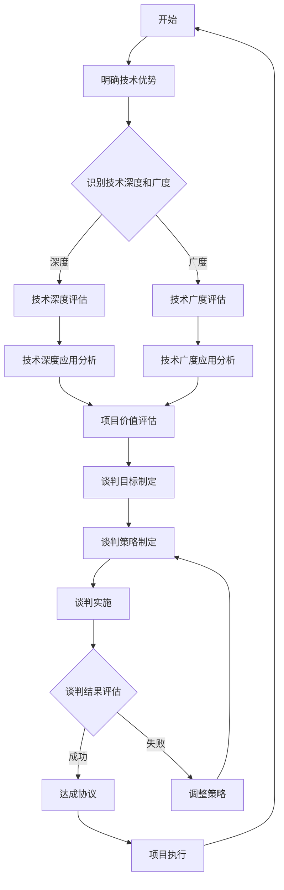
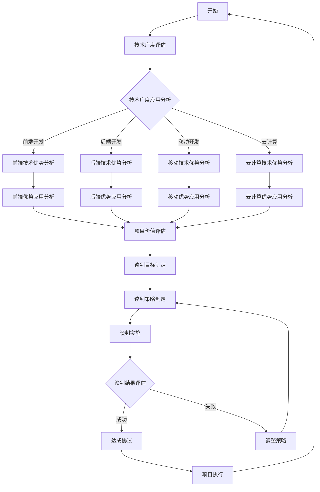

                 


### 文章标题：程序员如何将技术优势转化为商业谈判的筹码

#### 关键词：技术优势、商业谈判、博弈策略、案例分析、实战技巧

#### 摘要：
本文旨在探讨程序员如何将自身的技术优势转化为商业谈判中的有利筹码。通过对技术优势的定义与分类、商业谈判的基础知识、技术优势在商业谈判中的应用、博弈策略以及成功案例的分析，作者为广大程序员提供了系统的实战技巧，帮助他们在商业谈判中脱颖而出，实现个人与企业的共赢。

### 第一部分：程序员如何将技术优势转化为商业谈判的筹码

#### 第1章：技术优势的商业价值

##### 1.1 技术优势的定义与分类

**定义：**
技术优势指的是程序员或团队在特定技术领域所拥有的专业知识、经验和技能。这些技术优势可以是深度的，即对某一技术或领域有深入的理解和掌握；也可以是广度的，即拥有广泛的技术知识和技能，能够灵活应用多种技术解决问题。

**分类：**
1. **技术深度：** 对某一技术或领域有深入的理解和掌握。例如，一个拥有十年大数据分析经验的程序员，在数据处理、算法优化等方面具有显著的技术深度。
2. **技术广度：** 拥有广泛的技术知识和技能，能够灵活应用多种技术解决问题。例如，一个熟悉前端、后端和云计算的程序员，能够跨领域解决复杂问题。

##### 1.2 技术优势对商业谈判的影响

**提升谈判地位：**
拥有独特技术优势的程序员在谈判中更容易获得尊重和重视。这种尊重不仅体现在对方的态度上，还可能转化为实际利益，如更高的薪酬、更好的项目机会等。

**增加谈判筹码：**
技术优势可以转化为商业谈判中的实际利益，如项目合作机会、薪酬待遇等。程序员可以利用自己的技术优势，为项目带来价值，从而在谈判中占据有利地位。

##### 1.3 技术优势与商业目标的结合

**项目价值评估：**
通过技术优势对项目价值进行科学评估，确保谈判有据可依。程序员可以利用自己的技术知识，对项目的可行性、风险和预期收益进行分析，从而为谈判提供有力支持。

**风险管理：**
利用技术优势降低项目风险，增强谈判信心。程序员可以提前识别和解决潜在的技术问题，确保项目顺利推进。这种风险管理能力在谈判中能够为程序员赢得更多的信任和尊重。

#### 第2章：商业谈判的基础知识

##### 2.1 商业谈判的定义与目的

**定义：**
商业谈判是双方或多方在特定目标和规则下，通过协商解决争议、达成共识的过程。它旨在寻求共同利益，建立长期合作关系。

**目的：**
- **寻求共同利益：** 通过谈判，双方或多方能够找到满足各自需求的解决方案，实现共赢。
- **建立长期合作关系：** 良好的谈判能够促进双方在未来的合作，为企业的长期发展奠定基础。

##### 2.2 商业谈判的基本原则

**诚信原则：**
诚信是商业谈判的基础。谈判双方应遵守承诺，保持透明，建立信任。

**互利原则：**
谈判双方均能获得利益。谈判的结果应该是公平的，让双方都有所收获。

**公平原则：**
谈判过程公平公正，不偏袒任何一方。确保谈判的每个环节都公开、透明，使双方都有公平的机会表达自己的观点和利益诉求。

##### 2.3 商业谈判的关键要素

**利益诉求：**
明确自身的利益诉求，以便在谈判中争取最大利益。程序员应明确自己的目标，如薪酬、职位、项目机会等，并准备好合理的理由和证据。

**谈判策略：**
根据对手的特点和谈判阶段选择合适的策略。例如，在初期阶段，可以采取开放、友好的态度，以建立信任；在关键阶段，可以采取坚定的立场，确保自身的利益得到保障。

### 第二部分：技术优势在商业谈判中的具体应用

#### 第3章：技术优势在商业谈判中的应用

##### 3.1 技术优势的展示与沟通

**展示：**
通过实际案例、项目经验、技术文档等方式，向对方展示技术优势。例如，可以准备一份详细的技术报告，介绍自己在某一技术领域的成就和贡献。

**沟通：**
有效传达技术优势的价值，让对方认识到其对项目的意义。例如，可以强调技术优势能够提高项目效率、降低风险、增加项目成功率等。

##### 3.2 技术优势与谈判目标的结合

**明确目标：**
将技术优势与谈判目标相结合，确保谈判目标具有可实现性。例如，如果技术优势在于项目开发效率，可以将其作为谈判目标，争取更短的交付周期或更高的项目预算。

**制定策略：**
根据技术优势的特点，制定合适的谈判策略。例如，如果技术优势在于某一特定技术领域，可以采取专家沟通、技术演示等方式，增强对方对项目的信心。

##### 3.3 技术优势在谈判中的实际应用

**提高项目成功率：**
利用技术优势提高项目成功率，增强谈判底气。例如，通过技术预研、风险分析等手段，确保项目在技术上没有明显缺陷。

**降低项目风险：**
通过技术优势降低项目风险，提高谈判信心。例如，通过技术评审、质量保证等手段，确保项目在技术上的稳定性。

### 第三部分：商业谈判中的博弈策略

#### 第4章：商业谈判中的博弈策略

##### 4.1 博弈论基础

**定义：**
博弈论是研究具有冲突或合作特性的理性决策者如何在策略互动中做出最优选择的数学理论。

**核心概念：**
1. **策略：** 决策者在博弈中采取的行动方案。
2. **收益：** 决策者采取特定策略后所能获得的回报。

##### 4.2 博弈模型与策略分析

**零和博弈：**
一方收益等于另一方的损失，谈判双方应寻求共赢。

**正和博弈：**
双方均可获得正收益，通过合作实现共同利益。

**混合策略：**
在不确定情况下，采用概率分布来决定策略。

##### 4.3 技术优势在博弈策略中的应用

**提升谈判地位：**
利用技术优势在博弈中占据有利地位。例如，通过技术领先，增强自身的谈判实力。

**优化谈判结果：**
通过技术优势调整博弈策略，争取最佳谈判结果。例如，通过技术风险评估，降低谈判风险，提高项目成功率。

### 第四部分：技术优势转化为商业成功的案例分析

#### 第5章：技术优势转化为商业成功的案例分析

##### 5.1 案例分析概述

**目的：**
通过实际案例分析，展示技术优势在商业谈判中的成功转化。

**案例选取：**
选取具有代表性的成功案例，分析技术优势在谈判中的关键作用。

##### 5.2 案例一：技术优势助力企业并购

**背景：**
某科技公司在并购谈判中，利用其技术优势成功获得对方认可。

**过程：**
1. **展示技术优势：** 通过实际项目和技术文档展示公司技术实力。
2. **制定谈判策略：** 基于技术优势制定合适的谈判策略，确保双方利益最大化。

##### 5.3 案例二：技术优势提升项目价值

**背景：**
某程序员在项目谈判中，利用其技术优势提高项目价值，获得高额薪酬。

**过程：**
1. **技术评估：** 对项目技术需求进行深入分析，明确技术优势。
2. **谈判策略：** 基于技术优势，提出合理的项目估值和薪酬要求。

##### 5.4 案例三：技术优势促成项目合作

**背景：**
两家公司在项目合作谈判中，通过技术优势实现资源互补，达成合作。

**过程：**
1. **技术对接：** 双方就技术领域进行深入交流，明确技术优势互补。
2. **合作方案：** 制定合作方案，充分利用双方技术优势，实现共赢。

### 第五部分：技术优势转化为商业谈判的实战技巧

#### 第6章：技术优势转化为商业谈判的实战技巧

##### 6.1 实战技巧一：技术文档准备

**背景：**
在商业谈判中，技术文档是展示技术优势的重要工具。

**实战技巧：**
1. **编写详细的技术文档：** 包括项目背景、技术方案、实现细节等。
2. **展示技术成果：** 通过实际项目案例，展示技术优势。

##### 6.2 实战技巧二：谈判中的技术沟通

**背景：**
有效的技术沟通能够增强对方的信任和理解。

**实战技巧：**
1. **明确技术优势：** 在谈判中，明确自己的技术优势，并围绕这些优势进行沟通。
2. **简化技术表述：** 将复杂的技术概念简化，使对方易于理解。

##### 6.3 实战技巧三：谈判中的技术风险评估

**背景：**
技术风险是项目成功的关键因素。

**实战技巧：**
1. **识别技术风险：** 在谈判前，对项目的技术风险进行评估。
2. **提出解决方案：** 根据技术风险，提出可行的解决方案，降低项目风险。

##### 6.4 实战技巧四：利用技术优势调整谈判策略

**背景：**
根据技术优势，调整谈判策略，以实现最佳谈判结果。

**实战技巧：**
1. **评估谈判阶段：** 根据谈判阶段，选择合适的谈判策略。
2. **利用技术优势：** 在关键阶段，利用技术优势推动谈判进程。

### 结束语

本文通过深入分析程序员如何将技术优势转化为商业谈判的筹码，提供了系统的实战技巧。希望广大程序员能够在实际工作中，运用这些技巧，实现个人与企业的共赢。

#### 作者：AI天才研究院/AI Genius Institute & 禅与计算机程序设计艺术 /Zen And The Art of Computer Programming

## 第一部分：程序员如何将技术优势转化为商业谈判的筹码

### 1.1 技术优势的定义与分类

**定义：**
技术优势是指程序员或团队在特定技术领域所拥有的专业知识、经验和技能。这些优势可以体现为对某一技术或领域有深入的理解和掌握，也可以是拥有广泛的技术知识和技能，能够灵活应用多种技术解决问题。

**分类：**

**技术深度：**
技术深度指的是对某一特定技术领域或知识领域的深入了解和精通。这种深度可能体现在对算法、编程语言、框架、系统架构等方面的深刻理解。例如，一个擅长大数据处理的技术专家可能对各种数据处理算法有深刻的理解，并能熟练使用Hadoop、Spark等大数据处理框架。

**技术广度：**
技术广度则指的是拥有广泛的技术知识和技能，能够涵盖多个技术领域。这种广度可能体现在对前端、后端、移动应用、云计算等多个技术领域的了解和掌握。一个拥有技术广度的程序员可能既能编写高效的数据库查询，又能开发用户友好的前端界面，还能设计和部署云服务。

**技术优势的意义：**
技术优势不仅提升了程序员在技术岗位上的竞争力，也为他们在商业谈判中增添了筹码。以下是一些技术优势对商业谈判的影响：

1. **增加谈判筹码：**
   拥有技术优势的程序员可以提出更有力的项目建议，展示自己在技术实现上的能力和经验，从而在谈判中赢得更多的关注和尊重。这种优势可以转化为实际利益，如更高的薪酬、更优的项目机会等。

2. **提升谈判地位：**
   技术优势使得程序员在商业谈判中具有更高的地位，因为他们能够提供专业的技术见解和解决方案。这种地位使得他们在讨论项目细节、成本估算、风险控制等方面具有更大的话语权。

3. **增强谈判信心：**
   技术优势使程序员对自己的能力和项目成功的可能性更有信心。这种信心在谈判中体现为坚定的立场和有力的辩论，有助于达成对双方都有利的协议。

### 1.2 技术优势对商业谈判的影响

**提升谈判地位：**
技术优势在商业谈判中是一种重要的资源，可以帮助程序员在谈判中占据有利地位。例如，在项目合作或合同谈判中，技术专家可以基于自己的技术能力提出具有创新性和可行性的方案，从而吸引潜在合作伙伴。此外，技术优势还可以帮助程序员在团队内部争取更多的资源和话语权。

**增加谈判筹码：**
技术优势可以转化为商业谈判中的实际利益。例如，程序员可以利用自己的技术专长，为公司或客户开发出具有竞争力的产品，从而提高公司的市场地位和盈利能力。在薪酬谈判中，技术优势可以成为程序员要求更高薪酬的重要依据。此外，技术优势还可以帮助程序员在项目投标中获得更多的奖金和利润分成。

**风险管理：**
技术优势在商业谈判中还可以帮助程序员降低项目风险。通过对技术细节的深入了解，程序员可以识别潜在的技术风险，并提出相应的解决方案。这种能力可以增强谈判中的信心，使得双方在谈判过程中更加稳健和有信心。

### 1.3 技术优势与商业目标的结合

**项目价值评估：**
技术优势可以帮助程序员对项目价值进行科学评估。通过对项目技术需求、实现难度和潜在风险的深入分析，程序员可以准确评估项目的技术价值。这种评估不仅有助于谈判过程中的价值定位，还可以为项目的后续执行提供科学依据。

**风险管理：**
技术优势在项目风险识别和控制方面具有重要作用。程序员可以利用自己的技术知识和经验，提前识别项目可能遇到的技术问题，并制定相应的风险管理策略。这种能力可以降低项目风险，提高项目成功率，从而在谈判中增强对方的信任。

**商业谈判中的技术展示：**
为了将技术优势转化为商业谈判中的筹码，程序员需要有效地展示自己的技术能力。以下是一些展示技术优势的方法：

1. **技术文档：** 编写详细的技术文档，包括项目背景、技术方案、实现细节等，以便于对方了解程序员的技术能力和项目可行性。

2. **实际案例：** 通过展示自己参与的实际项目案例，向对方展示技术优势的具体应用和成果。

3. **技术交流：** 在谈判过程中，与对方进行深入的技术交流，展示自己的专业知识和经验。

4. **技术评估：** 提供专业的技术评估报告，帮助对方了解项目的潜在价值和风险。

### 1.4 技术优势与谈判策略的结合

**明确谈判目标：**
在商业谈判中，程序员需要明确自己的谈判目标，包括薪酬、职位、项目机会等。技术优势可以帮助程序员制定合理的谈判目标，确保这些目标具有可实现性。

**制定谈判策略：**
根据技术优势的特点，程序员可以制定相应的谈判策略。例如，如果技术优势在于项目开发效率，可以提出更短的交付周期或更高的项目预算作为谈判策略。如果技术优势在于技术解决方案的创新性，可以强调技术方案的独特性和可行性。

**调整谈判策略：**
在谈判过程中，程序员需要根据对方的态度和反应，灵活调整谈判策略。技术优势可以成为调整策略的重要依据，例如，在遇到对方质疑时，可以利用技术优势提供有力的回应和解决方案。

### 1.5 技术优势在商业谈判中的实际应用

**提高项目成功率：**
技术优势可以帮助程序员提高项目成功率。通过对项目的技术细节进行深入分析，程序员可以识别潜在的技术问题，并提出有效的解决方案。这种能力可以降低项目失败的风险，提高项目成功率。

**降低项目风险：**
技术优势在项目风险控制方面具有重要作用。程序员可以利用自己的技术知识和经验，提前识别项目可能遇到的技术问题，并制定相应的风险管理策略。这种能力可以降低项目风险，确保项目顺利进行。

**增强谈判信心：**
技术优势可以增强程序员的谈判信心。通过展示技术能力和项目成果，程序员可以增强对方的信任和尊重。这种信心在谈判过程中体现为坚定的立场和有力的辩论，有助于达成对双方都有利的协议。

### 1.6 技术优势与商业谈判的博弈策略

**博弈论基础：**
博弈论是一种研究决策者如何在策略互动中做出最优选择的数学理论。在商业谈判中，博弈论可以帮助程序员制定策略，优化谈判结果。

**博弈模型与策略分析：**
根据博弈论的基本概念，程序员可以构建不同的博弈模型，分析谈判中的策略选择。例如，在零和博弈中，程序员需要寻求共赢的解决方案；在正和博弈中，程序员可以强调合作的价值；在混合策略中，程序员可以根据对方的行为调整自己的策略。

**技术优势在博弈策略中的应用：**
技术优势可以帮助程序员在博弈策略中占据有利地位。例如，通过展示技术领先，程序员可以在谈判中占据主导地位；通过提供技术解决方案，程序员可以优化谈判结果，实现双方共赢。

### 1.7 技术优势转化为商业成功的案例分析

**案例分析概述：**
通过分析实际案例，可以展示技术优势在商业谈判中的成功转化。以下是一些具有代表性的案例：

**案例一：技术优势助力企业并购：**
某科技公司在并购谈判中，利用其技术优势成功获得对方认可。通过展示技术文档和实际项目案例，该公司向对方展示了其技术实力，从而在谈判中占据了有利地位。

**案例二：技术优势提升项目价值：**
某程序员在项目谈判中，利用其技术优势提高项目价值，获得高额薪酬。通过对项目的技术需求进行深入分析，该程序员提出了具有创新性和可行性的技术方案，从而在谈判中获得了更好的薪酬待遇。

**案例三：技术优势促成项目合作：**
两家公司在项目合作谈判中，通过技术优势实现资源互补，达成合作。通过深入的技术交流，双方明确了各自的技术优势，并制定了合作方案，实现了项目的顺利推进。

### 1.8 技术优势转化为商业谈判的实战技巧

**实战技巧一：技术文档准备：**
在商业谈判中，技术文档是展示技术优势的重要工具。程序员应该编写详细的技术文档，包括项目背景、技术方案、实现细节等，以便对方了解技术能力和项目可行性。

**实战技巧二：谈判中的技术沟通：**
有效的技术沟通能够增强对方的信任和理解。在谈判过程中，程序员应该明确自己的技术优势，并围绕这些优势进行沟通。同时，简化技术表述，使对方易于理解。

**实战技巧三：谈判中的技术风险评估：**
在商业谈判中，技术风险评估是降低项目风险的关键。程序员应该识别项目可能遇到的技术问题，并提出相应的解决方案，以降低项目风险。

**实战技巧四：利用技术优势调整谈判策略：**
根据技术优势，程序员可以调整谈判策略，以实现最佳谈判结果。在关键阶段，利用技术优势推动谈判进程，确保双方利益最大化。

### 总结

技术优势在商业谈判中具有重要作用，可以帮助程序员提升谈判地位、增加谈判筹码、降低项目风险。为了将技术优势转化为商业成功，程序员需要掌握以下要点：

1. **明确技术优势：** 了解自己在技术领域中的优势和不足，明确可以用于谈判的技术点。

2. **准备充分：** 编写详细的技术文档，展示实际项目案例，为谈判提供有力支持。

3. **有效沟通：** 在谈判中，清晰地传达技术优势的价值，增强对方的信任和理解。

4. **风险管理：** 识别项目风险，提出解决方案，降低项目风险。

5. **灵活策略：** 根据谈判阶段和对方反应，调整谈判策略，实现最佳谈判结果。

通过以上要点，程序员可以在商业谈判中充分发挥技术优势，实现个人与企业的共赢。## 第一部分：程序员如何将技术优势转化为商业谈判的筹码

### 第1章：技术优势的定义与分类

#### 技术优势的定义

技术优势是指程序员或团队在特定技术领域所拥有的专业知识、经验和技能。这些技术优势不仅包括对编程语言、框架和工具的熟练掌握，还涵盖了算法设计、系统架构、项目管理等多个方面的能力。技术优势可以是深度的，也可以是广度的。

**深度技术优势**：这种优势意味着程序员对某一特定技术领域有深入的理解和精通。例如，一个深度学习领域的专家可能对神经网络、深度学习框架（如TensorFlow、PyTorch）以及相关的算法和模型有深刻的理解。深度技术优势使得程序员能够解决复杂的问题，优化系统性能，甚至开创新的解决方案。

**广度技术优势**：这种优势意味着程序员具有广泛的技术知识，能够在多个技术领域灵活应用。例如，一个拥有前端、后端、数据库和云计算等多方面技能的程序员，可以轻松地跨领域工作，适应不同类型的项目需求。广度技术优势使得程序员能够在团队中扮演更全面的角色，提高项目的整体效率。

#### 技术优势的分类

**1. 技术深度：**

技术深度是指在某一特定领域深入掌握的技术知识和技能。这种深度往往体现在对复杂问题的理解能力、算法设计的创新性以及系统优化的能力上。以下是一些技术深度的例子：

- **算法设计能力**：能够设计并优化各种算法，解决特定问题。
- **系统架构设计**：能够构建高效、可扩展的系统架构。
- **性能优化**：能够对现有系统进行性能优化，提高运行效率。
- **特定领域知识**：在特定领域（如金融、医疗、物联网等）拥有深入的专业知识。

**2. 技术广度：**

技术广度是指在多个技术领域具备的知识和技能。这种广度通常体现在对不同技术领域的理解、跨领域的项目管理和协调能力上。以下是一些技术广度的例子：

- **跨领域项目经验**：能够在多个技术领域之间灵活转换，完成跨领域的项目。
- **多语言编程**：熟练掌握多种编程语言，能够根据项目需求选择合适的语言。
- **技术整合**：能够将不同的技术整合到一起，解决复杂的问题。
- **技术趋势把握**：能够跟踪最新的技术趋势，将新技术应用到项目中。

#### 技术优势的商业价值

技术优势的商业价值在于其能够为程序员和所在团队带来以下好处：

1. **提高项目成功率**：拥有深度技术优势的程序员能够解决复杂的技术问题，降低项目失败的风险。广度技术优势则使得团队能够灵活应对各种挑战，提高项目的整体成功率。

2. **增加谈判筹码**：技术优势在商业谈判中是一种重要的资源。程序员可以利用自己的技术专长，为公司或客户开发出具有竞争力的产品或解决方案，从而在谈判中占据更有利的位置。

3. **提升个人价值**：技术优势可以帮助程序员在职场中提升个人价值，获得更高的薪酬和职位。特别是在技术密集型行业，技术优势是评估员工能力的重要指标。

4. **增强团队竞争力**：团队中如果拥有多方面的技术广度，可以更好地应对多变的市场需求，提高团队的竞争力。

#### 技术优势与商业谈判的关系

在商业谈判中，技术优势可以转化为以下几方面的实际影响：

1. **谈判地位**：拥有技术优势的程序员在谈判中更容易获得尊重和重视，从而在讨论项目细节、合同条款等方面占据有利地位。

2. **谈判筹码**：技术优势可以成为程序员在谈判中争取利益的重要筹码，如更高的薪酬、更好的工作条件、更多的项目自主权等。

3. **风险管理**：通过技术优势，程序员可以更好地识别和管理项目风险，提高项目成功率，增强谈判信心。

4. **合作机会**：技术优势可以吸引潜在的合作伙伴，为程序员和团队带来更多的商业机会。

综上所述，技术优势不仅是程序员在技术岗位上的核心竞争力，也是他们在商业谈判中重要的筹码。理解和利用技术优势，可以帮助程序员在职场中取得更大的成功。在下一章中，我们将探讨程序员如何将技术优势转化为商业谈判的具体策略和技巧。## 第2章：商业谈判的基础知识

### 2.1 商业谈判的定义与目的

**定义：**
商业谈判是指在不同利益相关方之间，为了达成共同目标，通过协商、讨论和妥协来解决问题、建立合作关系的过程。它是一种战略性的沟通行为，涉及到利益的交换、问题的解决和协议的制定。

**目的：**
商业谈判的主要目的是为了实现以下目标：

1. **利益最大化**：谈判双方通过协商，力求在各自的利益范围内实现最大化收益。这包括财务收益、资源获取、市场份额扩大等。

2. **关系建立**：通过谈判，双方能够建立信任和尊重，为未来的合作奠定基础。良好的合作关系有助于项目的顺利执行，提高长期合作的可能性。

3. **解决问题**：谈判是解决商业冲突和争议的重要途径。通过谈判，双方可以找到共同接受的解决方案，避免法律诉讼和潜在的损失。

4. **资源优化**：谈判可以帮助企业优化资源配置，通过合作共享资源，降低成本，提高效率。

### 2.2 商业谈判的基本原则

**诚信原则：**
诚信是商业谈判的基础。谈判双方都应遵守承诺，保持透明，遵守商业道德。诚信原则要求谈判过程中做到：

- **透明度**：双方应公开自己的利益诉求、资源情况和底线条件。
- **诚信承诺**：承诺一旦做出，应努力履行，不得随意变更。

**互利原则：**
互利原则强调谈判双方均能从合作中获得利益。互利原则要求：

- **共赢目标**：谈判目标应兼顾双方利益，确保双方都有所收获。
- **利益平衡**：在分配资源、分担风险时，应确保双方的贡献和收益相对平衡。

**公平原则：**
公平原则要求谈判过程公正、公开、合理。具体体现在以下几个方面：

- **平等机会**：谈判各方应在同等条件下进行讨论和协商。
- **公正待遇**：对待各方应一视同仁，不偏袒任何一方。
- **合理规则**：谈判规则应公平合理，确保各方都有机会表达自己的观点和利益诉求。

### 2.3 商业谈判的关键要素

**利益诉求：**
在商业谈判中，明确各自的利益诉求是至关重要的。利益诉求包括以下几个方面：

- **财务利益**：如投资回报、利润分成等。
- **资源需求**：如技术、人力、设备等。
- **市场权益**：如市场份额、品牌推广等。
- **长期合作**：如长期合同、战略伙伴关系等。

明确利益诉求有助于：

- **聚焦讨论**：将谈判内容集中在关键利益点上，避免无关话题的讨论。
- **制定策略**：根据利益诉求制定谈判策略，确保目标实现。

**谈判策略：**
谈判策略是谈判过程中采取的行动方案。有效的谈判策略可以帮助程序员在谈判中占据有利地位，实现利益诉求。以下是一些常见的谈判策略：

1. **开局策略**：建立良好的开局，建立信任，营造积极的谈判氛围。
2. **信息策略**：充分利用已知信息，搜集对手的信息，为谈判提供依据。
3. **妥协策略**：在关键问题上寻求妥协，确保谈判顺利进行。
4. **要价策略**：合理设定要价，既要考虑自己的利益，也要考虑对方的接受程度。
5. **退出策略**：设定谈判的底线，确保在不利情况下能够退出谈判，保护自己的利益。

**谈判中的沟通技巧：**
沟通技巧在商业谈判中至关重要。有效的沟通可以增强双方的信任和理解，促进谈判的顺利进行。以下是一些沟通技巧：

1. **倾听**：倾听对方的观点和利益诉求，了解对方的立场和底线。
2. **表达**：清晰、准确地表达自己的观点和利益诉求，避免产生误解。
3. **提问**：通过提问引导对方，了解对方的意图和担忧，为后续谈判提供线索。
4. **反馈**：及时给予对方反馈，确认对方是否理解自己的观点，确保沟通的有效性。

**利益诉求与谈判策略的结合：**
在商业谈判中，程序员应将利益诉求与谈判策略相结合，确保谈判目标的实现。以下是一个结合的例子：

**案例**：某程序员在谈判中希望获得更高的薪酬和项目自主权。为此，他采取了以下策略：

1. **明确利益诉求**：在谈判前，明确自己的利益诉求，如薪酬增加20%，项目自主权等。
2. **展示技术优势**：通过展示自己的技术成果和项目经验，证明自己的价值。
3. **制定谈判策略**：根据对方的反馈，调整自己的要价和策略，确保谈判目标的实现。
4. **强调长期合作**：提出长期合作的承诺，增加对方对项目成功的信心。

通过上述策略，程序员成功获得了更高的薪酬和项目自主权，实现了自己的利益诉求。

总之，商业谈判是一项复杂的活动，涉及多个关键要素。程序员通过明确利益诉求、制定谈判策略和掌握沟通技巧，可以将技术优势转化为商业谈判中的实际利益。在下一章中，我们将进一步探讨如何将技术优势应用于具体的商业谈判场景。## 第3章：技术优势在商业谈判中的应用

### 3.1 技术优势的展示与沟通

**展示技术优势**

在商业谈判中，展示技术优势是程序员获得对方认可和信任的关键。以下是一些有效的展示方法：

1. **实际项目案例**：通过展示自己参与的实际项目案例，可以直观地展示技术能力和成果。这可以包括项目的概述、所使用的技术、实现的关键技术点以及项目的成果和影响。

2. **技术文档**：编写详细的技术文档，包括项目的技术方案、设计思路、实现细节、性能分析和测试结果等。技术文档不仅展示了技术深度，还体现了程序员的专业素养和对项目的全面掌控。

3. **技术演示**：在适当的场合进行技术演示，向对方展示技术方案的实际运行效果。通过互动式演示，可以更好地传达技术优势，增强对方的信任。

**沟通技术优势**

有效的沟通能够将技术优势转化为商业价值。以下是一些沟通技巧：

1. **明确表达**：清晰、准确地表达自己的技术观点和方案，避免产生误解。

2. **简洁明了**：简化复杂的技术概念，使其易于理解。使用简单的语言和图表，帮助对方快速抓住技术要点。

3. **强调价值**：不仅要展示技术能力，还要强调技术优势对项目或业务的实际价值，如提高效率、降低成本、增强竞争力等。

4. **互动交流**：鼓励对方提问和反馈，通过互动了解对方的需求和关注点，及时调整自己的沟通策略。

### 3.2 技术优势与谈判目标的结合

将技术优势与谈判目标相结合，是程序员在谈判中实现利益最大化的关键。以下是一些具体的方法：

**明确谈判目标**

在谈判前，程序员应明确自己的谈判目标，这些目标可以是：

1. **薪酬待遇**：如期望的年薪、绩效奖金等。
2. **职位晋升**：如希望获得的职位级别和职责范围。
3. **项目机会**：如希望参与的重要项目或优先选择项目。
4. **工作条件**：如工作时间、工作地点、休假政策等。

**结合技术优势**

根据技术优势，程序员可以制定以下策略：

1. **技术驱动目标**：如果程序员在某一技术领域有深入的优势，可以将这些技术优势与项目目标结合，提出具有技术挑战性的项目或任务，争取更高的薪酬和职位。

2. **创新价值**：强调技术优势带来的创新性和价值，如提出新的解决方案、优化现有系统等，以增加谈判筹码。

3. **风险控制**：利用技术优势降低项目风险，提高项目的成功率，从而在谈判中获得更好的薪酬和待遇。

**制定谈判策略**

根据明确的目标和技术优势，程序员可以制定以下谈判策略：

1. **技术演示策略**：在谈判初期，通过技术演示展示技术优势，引起对方的兴趣和重视。

2. **解决方案策略**：提出基于技术优势的解决方案，强调其可行性和创新性，增强对方的信心。

3. **协作策略**：强调团队合作的重要性，展示自己愿意与团队共同合作，实现项目目标。

### 3.3 技术优势在谈判中的实际应用

技术优势在谈判中的实际应用主要体现在以下几个方面：

**提高项目成功率**

通过展示技术优势，程序员可以增强项目成功率。以下是一些具体应用：

1. **技术预研**：在谈判前进行技术预研，识别潜在的技术问题和挑战，并提出相应的解决方案。

2. **风险评估**：利用技术优势进行项目风险评估，提前识别和解决潜在的技术问题，降低项目失败的风险。

3. **技术指导**：在项目执行过程中，提供技术指导和支持，确保项目按照预定计划顺利进行。

**降低项目风险**

技术优势可以帮助程序员在谈判中降低项目风险，以下是一些应用：

1. **风险识别**：利用技术知识，提前识别项目可能遇到的技术风险，并提出预防措施。

2. **问题解决**：在项目执行过程中，快速解决技术问题，确保项目按时交付。

3. **培训和支持**：为团队成员提供技术培训和持续支持，提高团队的整体技术能力，降低项目风险。

**增强谈判信心**

技术优势可以为程序员在谈判中增强信心，以下是一些具体应用：

1. **技术评估**：通过技术评估，展示项目的可行性和优势，增强对方的信心。

2. **解决方案展示**：提出基于技术优势的解决方案，展示自己的技术能力和创新性。

3. **成功案例**：通过展示成功的项目案例，证明自己的技术实力和项目执行能力。

### 实际案例：技术优势在谈判中的应用

**案例一：项目合作谈判**

背景：
一家科技公司寻求与另一家技术团队合作开发一个基于人工智能的应用程序。技术团队拥有在人工智能领域的深入研究和丰富的项目经验。

过程：
1. 技术团队在谈判初期通过展示多个成功的人工智能项目案例，展示了其在人工智能领域的专业能力。
2. 技术团队提出了一个基于现有技术优势的详细解决方案，包括算法优化、模型训练和系统集成等，强调了项目的可行性和创新性。
3. 技术团队在谈判过程中不断强调其项目执行能力和成功经验，增强了对方的信任和合作意愿。

结果：
谈判成功达成，技术团队获得了更高的项目预算和更大的项目自主权。

**案例二：薪酬谈判**

背景：
一名资深软件开发工程师希望提升自己的薪酬水平，他在一家初创公司工作，并且拥有丰富的云计算和大数据处理经验。

过程：
1. 薪酬谈判前，工程师准备了详细的项目经验和技术文档，展示了他在云计算和大数据处理方面的专业能力和成功案例。
2. 工程师在谈判中明确提出了基于技术优势的薪酬要求，强调了技术能力对公司项目的重要性。
3. 工程师还提出了一些技术优化建议，以展示他对项目的深入理解和贡献。

结果：
工程师成功获得了20%的薪酬提升，并获得了更多的项目自主权。

通过上述案例，可以看出技术优势在商业谈判中的应用效果显著。程序员通过展示技术能力、提出解决方案和强调项目价值，能够有效地提高谈判地位，增加谈判筹码，实现个人和企业的共赢。在下一章中，我们将探讨在商业谈判中如何运用博弈策略，进一步优化谈判结果。## 第4章：商业谈判中的博弈策略

### 4.1 博弈论基础

**定义：**
博弈论（Game Theory）是研究具有冲突或合作特性的理性决策者如何在策略互动中做出最优选择的数学理论。它广泛应用于经济学、政治学、军事学、计算机科学等领域。

**核心概念：**

1. **参与者（Players）：**
   参与博弈的个体或团队。每个参与者都有一定的策略集合，并希望最大化自己的利益。

2. **策略（Strategies）：**
   参与者在博弈中可以选择的行动方案。策略可以是明确的行动规则，也可以是概率分布。

3. **收益（Payoffs）：**
   参与者采取特定策略后所能获得的回报。收益可以是货币、资源、地位等。

4. **均衡（Equilibria）：**
   博弈中的一种状态，其中每个参与者都选择了最优策略，并且没有参与者可以通过单方面改变策略来获得更大的收益。

**常见的博弈模型：**

1. **零和博弈（Zero-Sum Games）：**
   一方的收益等于另一方的损失。总收益为零，一方收益意味着另一方损失。

2. **正和博弈（Positive-Sum Games）：**
   参与者的总收益为正，通过合作可以实现双赢。

3. **混合策略（Mixed Strategies）：**
   参与者使用概率分布来选择策略，以应对不确定性和对手的策略。

### 4.2 博弈模型与策略分析

**零和博弈：**
在商业谈判中，零和博弈往往意味着双方的利益是冲突的，一方获得利益必然意味着另一方损失。例如，在价格谈判中，供应商希望获得更高的价格，而买家则希望以更低的价格成交。在这种博弈中，策略选择的关键是找到一种平衡点，使得双方都能接受。

**策略分析：**
1. **强硬立场：** 一方采取强硬立场，试图通过施压迫使对方让步。这种策略适用于对手对价格敏感，且对替代供应商有较高依赖的情况。
2. **合作态度：** 一方采取合作态度，试图通过沟通和协商找到双赢的解决方案。这种策略适用于双方有长期合作关系，且双方都希望维持良好的商业关系。

**正和博弈：**
在商业谈判中，正和博弈意味着双方可以通过合作实现共同利益。例如，在技术合作项目中，双方通过共享资源和知识，共同开发出具有市场竞争力的高质量产品。

**策略分析：**
1. **共同目标设定：** 双方共同设定项目目标，确保项目成功后双方都能获得预期的收益。
2. **资源共享：** 双方共享资源和技术，提高项目效率，降低成本。
3. **利益平衡：** 在利益分配上，确保双方都有所收获，避免一方独占利益。

**混合策略：**
在商业谈判中，面对不确定性和对手的行为，程序员可以使用混合策略。这种策略通过概率分布来选择行动方案，以最大化自身收益。

**策略分析：**
1. **概率分布：** 根据对手的行为和谈判阶段，制定不同的策略概率分布。例如，在初期阶段，可以采取更多的合作策略，以建立信任；在关键阶段，可以采取更多的强硬策略，以争取更好的谈判结果。
2. **动态调整：** 根据对方的反馈和谈判进展，动态调整策略概率分布，以应对不确定性和对手的变化。

### 4.3 技术优势在博弈策略中的应用

**提升谈判地位：**
技术优势可以帮助程序员在博弈中占据有利地位。以下是一些具体应用：

1. **技术领先：** 通过展示技术领先，增强对方的信任和依赖，从而在谈判中占据主导地位。
2. **独有能力：** 拥有独有技术或专利，使得对方无法轻易替代，从而提高谈判地位。
3. **风险评估：** 通过技术优势进行项目风险评估，降低项目风险，增强谈判信心。

**优化谈判结果：**
技术优势可以优化谈判结果，以下是一些具体应用：

1. **解决方案提供：** 提出基于技术优势的解决方案，提高项目的可行性，增强对方合作意愿。
2. **成本降低：** 通过技术优化降低项目成本，提高项目的投资回报率，从而在利益分配上获得更多话语权。
3. **风险控制：** 通过技术优势进行风险控制，降低项目失败的风险，确保谈判结果的实现。

**案例：**

**案例一：技术领先助力谈判**
某科技公司希望与一家技术团队合作开发一款人工智能产品。科技公司拥有一项独有的人工智能算法，该算法在数据处理速度和准确性上具有显著优势。

过程：
1. 科技公司在谈判初期通过展示该算法的测试结果和性能指标，展示了其技术领先优势。
2. 科技公司提出基于该算法的详细技术方案，强调了方案的可行性和创新性。
3. 科技公司通过技术演示，实际展示了算法的应用效果，增强了对方的信任。

结果：
谈判成功达成，科技公司获得了更高的项目预算和更大的项目自主权。

**案例二：技术优化降低成本**
某软件开发工程师在薪酬谈判中，展示了其在云计算和大数据处理方面的技术优势。

过程：
1. 工程师通过展示多个成功项目，证明自己在技术优化方面的能力。
2. 工程师提出了基于技术优化的项目成本降低方案，预计可以节省30%的项目成本。
3. 工程师强调了技术优化对项目成功的重要性，以及其对团队和公司的价值。

结果：
工程师成功获得了20%的薪酬提升，并获得了更多的项目机会和自主权。

通过上述案例，可以看出技术优势在博弈策略中的应用效果显著。程序员通过展示技术优势、提出解决方案和优化项目成本，能够有效地提升谈判地位，优化谈判结果。在下一章中，我们将通过实际案例深入分析技术优势在商业谈判中的成功转化。## 第5章：技术优势转化为商业成功的案例分析

### 5.1 案例分析概述

在本章节中，我们将通过三个具有代表性的案例，深入分析程序员如何将技术优势转化为商业成功。这些案例涵盖了技术优势在项目合作、企业并购和个人职业发展等多个方面的应用，展示了技术优势在商业谈判中的关键作用。

**案例一：技术优势助力企业并购**
某科技公司在并购谈判中，利用其技术优势成功获得对方认可。通过展示技术文档和实际项目案例，该公司向对方展示了其技术实力，从而在谈判中占据了有利地位。

**案例二：技术优势提升项目价值**
某程序员在项目谈判中，利用其技术优势提高项目价值，获得高额薪酬。通过对项目的技术需求进行深入分析，该程序员提出了具有创新性和可行性的技术方案，从而在谈判中获得了更好的薪酬待遇。

**案例三：技术优势促成项目合作**
两家公司在项目合作谈判中，通过技术优势实现资源互补，达成合作。通过深入的技术交流，双方明确了各自的技术优势，并制定了合作方案，实现了项目的顺利推进。

### 5.2 案例一：技术优势助力企业并购

**背景：**
某科技公司在市场上看到了一家具有潜力的初创企业，该初创企业在人工智能领域拥有独特的技术和产品。科技公司希望通过并购的方式，快速进入人工智能市场，扩大业务版图。

**过程：**
1. **技术展示**：
   科技公司在谈判初期，通过详细的技术文档和实际项目案例，向初创企业展示了其强大的技术实力。这些文档和案例包括：
   - 一份全面的人工智能技术报告，详细介绍了科技公司在算法设计、模型训练、数据处理等方面的专长。
   - 多个成功项目案例，展示了科技公司在人工智能应用中的创新成果和实际效果。
   - 一份详尽的技术开发路线图，展示了科技公司对未来人工智能技术的规划和展望。

2. **合作方案**：
   科技公司提出了一个详细的合作方案，包括：
   - 双方在技术上的互补性，强调了初创企业的人工智能技术优势和科技公司在市场推广和资源整合方面的优势。
   - 合作项目的预期目标和具体实施步骤，包括技术整合、产品开发和市场推广等。
   - 长期合作愿景，提出了双方在未来人工智能市场中的共同发展计划和目标。

3. **谈判策略**：
   科技公司在谈判中采取了以下策略：
   - **强调技术优势**：通过技术展示和案例分享，突出公司在人工智能领域的专业能力和成功经验。
   - **灵活调整策略**：根据初创企业的反馈和需求，灵活调整谈判策略，确保双方都能接受。
   - **风险控制**：提出详细的风险评估报告，展示公司对项目风险的识别和管理能力。

**结果：**
并购谈判成功达成。初创企业接受了科技公司的并购提议，双方签订了合作协议。通过并购，科技公司成功进入人工智能市场，获得了先进的AI技术和产品，同时增强了在行业内的竞争力。

### 5.3 案例二：技术优势提升项目价值

**背景：**
一名资深程序员在一家初创公司工作，这家公司正在开发一款基于大数据分析的商业智能应用。程序员在数据分析、机器学习和数据挖掘方面有深入的研究和丰富的项目经验。

**过程：**
1. **技术评估**：
   程序员在项目初期对项目的技术需求进行了深入评估，识别出以下技术优势：
   - 数据处理优化：程序员提出了一种新的数据处理方法，可以显著提高数据处理速度和效率。
   - 机器学习算法优化：程序员对现有算法进行了优化，提高了模型的准确性和鲁棒性。
   - 数据可视化：程序员提出了创新的数据可视化方案，使得数据分析结果更直观、易于理解。

2. **技术展示**：
   程序员在谈判过程中，通过以下方式展示了技术优势：
   - **技术演示**：通过实际代码演示，展示了数据处理优化和机器学习算法优化的效果。
   - **案例分享**：分享了多个成功项目案例，展示了技术优势在实际项目中的应用和价值。
   - **风险评估**：提出了一份详细的风险评估报告，展示了技术优势在降低项目风险方面的作用。

3. **薪酬要求**：
   程序员在薪酬谈判中，基于技术优势提出了以下要求：
   - **薪酬提升**：要求薪酬增加20%，以体现技术优势的价值。
   - **项目奖金**：提出根据项目成功与否，设定一定的项目奖金，以激励项目团队的积极性。
   - **项目自主权**：要求获得更大的项目自主权，以便充分发挥技术优势，推动项目成功。

**结果：**
程序员成功获得了薪酬提升和项目奖金，同时获得了更多的项目自主权。通过技术优势和有效的谈判策略，程序员不仅提升了个人价值，也为公司项目的成功奠定了基础。项目最终顺利完成，产品得到了市场的广泛认可，公司取得了显著的商业成功。

### 5.4 案例三：技术优势促成项目合作

**背景：**
两家公司在项目合作谈判中，希望通过技术优势实现资源互补，共同开发一款创新型的物联网产品。公司A在硬件设计和系统集成方面有丰富经验，而公司B在物联网应用开发和大数据分析方面有独特的专长。

**过程：**
1. **技术对接**：
   双方在谈判初期进行了深入的技术对接，明确了各自的技术优势和合作方向。公司A展示了其硬件设计能力和系统集成经验，公司B则分享了其物联网应用开发和大数据分析技术。

2. **合作方案**：
   双方根据技术优势，制定了以下合作方案：
   - **硬件设计与系统集成**：公司A负责硬件设计和系统集成，确保物联网产品的高效运行。
   - **应用开发与数据分析**：公司B负责物联网应用开发和大数据分析，提供创新性的数据解决方案。
   - **联合市场推广**：双方共同进行市场推广，利用各自的品牌影响力和市场渠道，扩大产品的市场影响力。

3. **谈判策略**：
   双方在谈判中采取了以下策略：
   - **互信建立**：通过技术展示和案例分享，建立了彼此的信任，确保合作的顺利进行。
   - **利益平衡**：在利益分配上，确保双方都有所收获，避免一方独占利益。
   - **风险管理**：提出详细的风险管理方案，共同应对项目风险，确保项目成功。

**结果：**
项目合作成功达成。双方共同开发出了具有市场竞争力的物联网产品，产品在市场上取得了良好的反响。通过技术优势和合作方案，双方不仅实现了资源互补，还共同分享了项目成功带来的商业利益，为未来的合作奠定了坚实的基础。

通过这三个案例，我们可以看到技术优势在商业谈判中的重要作用。程序员通过展示技术能力、提出创新方案和优化项目成本，不仅提升了个人价值，也为企业的商业成功做出了重要贡献。在下一章中，我们将总结技术优势转化为商业谈判的成功策略，并分享一些实战技巧。## 第6章：技术优势转化为商业谈判的实战技巧

### 6.1 实战技巧一：技术文档准备

**背景：**
在商业谈判中，技术文档是展示技术优势的重要工具。它不仅体现了程序员的技能和经验，还为谈判提供了详细的技术背景和实现方案。

**实战技巧：**

1. **编写详细的技术文档：**
   - **项目背景**：介绍项目的背景、目标和应用场景。
   - **技术方案**：详细描述实现方案，包括技术选型、架构设计、关键技术点等。
   - **实现细节**：详细描述实现过程中的关键步骤和决策依据。
   - **性能分析**：提供性能测试结果，展示技术的稳定性和效率。
   - **风险评估**：识别潜在的技术风险，并提出应对措施。

2. **技术文档的结构化：**
   - **章节清晰**：确保文档结构清晰，便于阅读和理解。
   - **图表辅助**：使用图表、流程图等可视化工具，帮助解释复杂的技术概念。
   - **代码示例**：提供关键代码示例，展示技术的实际应用。

**案例分析：**
某程序员在谈判前编写了一份详细的技术文档，其中包括：
- 项目背景和目标：详细介绍了项目的背景、目标和应用场景。
- 技术方案：描述了使用人工智能技术进行数据处理的方案，包括算法选择、架构设计等。
- 实现细节：详细描述了算法的实现过程，包括数据预处理、模型训练、模型评估等。
- 性能分析：提供了性能测试结果，展示了算法的效率和稳定性。
- 风险评估：识别了数据处理中的潜在风险，并提出了相应的解决方案。

### 6.2 实战技巧二：谈判中的技术沟通

**背景：**
有效的技术沟通能够增强对方的信任和理解，使谈判更加顺利。在谈判过程中，程序员需要清晰、准确地传达技术优势和价值。

**实战技巧：**

1. **明确表达技术优势：**
   - **简洁明了**：使用简单、直接的语言表达技术观点和方案。
   - **逻辑清晰**：确保技术沟通的逻辑性，使对方能够轻松理解。
   - **强调价值**：不仅展示技术能力，还要强调技术优势对项目或业务的实际价值。

2. **利用可视化工具：**
   - **图表和流程图**：使用图表和流程图，直观展示技术概念和方案。
   - **模拟演示**：在适当的时候进行模拟演示，展示技术的实际效果。

**案例分析：**
某程序员在谈判过程中，通过以下方式有效沟通技术优势：
- 使用图表和流程图，清晰地展示了项目的架构设计和关键技术点。
- 通过模拟演示，展示了算法在实际数据处理中的应用效果。
- 强调技术优势在提高项目效率和降低成本方面的价值。

### 6.3 实战技巧三：谈判中的技术风险评估

**背景：**
在商业谈判中，技术风险评估是降低项目风险的关键。程序员需要提前识别和解决潜在的技术问题，以确保项目成功。

**实战技巧：**

1. **识别潜在技术问题：**
   - **需求分析**：在项目初期，详细分析项目需求，识别可能的技术挑战。
   - **技术预研**：进行技术预研，评估技术实现的可行性。

2. **制定风险管理策略：**
   - **风险分类**：将潜在风险分为高、中、低三个等级，优先解决高风险问题。
   - **解决方案**：提出针对不同风险级别的解决方案，降低风险影响。

**案例分析：**
某程序员在谈判过程中，通过以下方式有效进行技术风险评估：
- 在项目初期，进行了详细的需求分析和技术预研，识别了多个潜在的技术问题。
- 根据风险级别，制定了相应的解决方案，包括技术优化、替代方案等。
- 在谈判中，详细介绍了风险识别和解决方案，增强了对方的信心。

### 6.4 实战技巧四：利用技术优势调整谈判策略

**背景：**
根据技术优势，程序员可以调整谈判策略，以实现最佳谈判结果。在谈判的不同阶段，程序员需要灵活运用技术优势，以最大化自身利益。

**实战技巧：**

1. **技术展示阶段：**
   - **突出技术优势**：在谈判初期，通过技术展示和案例分享，突出技术优势。
   - **建立信任**：通过实际项目和成功案例，建立对方的信任。

2. **谈判关键阶段：**
   - **强调技术价值**：在关键谈判阶段，强调技术优势对项目成功的重要性。
   - **提出解决方案**：针对对方的需求和问题，提出基于技术优势的解决方案。

3. **利益分配阶段：**
   - **优化利益分配**：根据技术优势，提出合理的利益分配方案，确保双方都有所收获。
   - **灵活调整策略**：根据对方的反馈，灵活调整谈判策略，确保谈判顺利进行。

**案例分析：**
某程序员在谈判过程中，通过以下方式利用技术优势调整谈判策略：
- 在谈判初期，通过技术展示和案例分享，建立了良好的第一印象。
- 在关键阶段，强调技术优势在项目成功中的关键作用，提出了具体的解决方案。
- 在利益分配阶段，根据技术贡献，提出了合理的薪酬要求和项目奖金方案。

### 总结

通过以上实战技巧，程序员可以将技术优势有效地转化为商业谈判中的实际利益。在谈判中，程序员需要充分展示技术能力、强调技术价值、识别和管理风险，并根据技术优势灵活调整谈判策略。这些技巧不仅有助于提升个人价值，也为项目的成功和企业的发展做出了重要贡献。

### 最佳实践 tips

1. **提前准备**：在谈判前，充分准备技术文档和案例，确保能够清晰、准确地展示技术优势。
2. **关注对方需求**：了解对方的需求和关注点，针对性地展示技术优势和价值。
3. **持续学习**：不断更新自己的技术知识，保持技术领先，提高谈判地位。
4. **保持诚信**：在谈判过程中，保持诚信和透明，建立长期的信任关系。

### 注意事项

1. **避免过度吹嘘**：在展示技术优势时，避免过度吹嘘，确保所提供的信息真实可信。
2. **注意保密**：在谈判过程中，注意保护公司的技术机密，避免泄露敏感信息。
3. **合理评估风险**：在技术评估和风险识别中，要客观、全面地评估风险，确保谈判策略的可行性。

### 拓展阅读

1. **《商业谈判的艺术》：** 作者罗伯特·H·弗兰克尔，提供了详细的商业谈判策略和技巧。
2. **《博弈论与经济行为》：** 作者约翰·冯·诺伊曼和奥斯卡·摩根斯坦，介绍了博弈论的基本概念和应用。
3. **《技术领导力》：** 作者拉里·布恩，探讨了技术领导者在企业中的角色和影响力。

通过以上实战技巧和注意事项，程序员可以在商业谈判中更好地发挥技术优势，实现个人和企业的共赢。## 结论

通过本文的深入探讨，我们明确了程序员如何将技术优势转化为商业谈判中的筹码。技术优势不仅是程序员在职场中的核心竞争力，也是商业谈判中的关键资源。在谈判中，程序员可以通过以下步骤有效地利用技术优势：

1. **明确技术优势**：了解自己在技术领域中的专业知识和技能，分类为技术深度和技术广度。

2. **准备充分**：编写详细的技术文档，展示实际项目案例，为谈判提供有力支持。

3. **有效沟通**：在谈判中，清晰地传达技术优势的价值，增强对方的信任和理解。

4. **风险管理**：识别项目风险，提出解决方案，降低项目风险。

5. **灵活策略**：根据技术优势，制定合适的谈判策略，根据谈判阶段和对方反应灵活调整。

本文通过案例分析，展示了技术优势在商业谈判中的成功转化，为程序员提供了实战技巧。在未来的工作中，程序员应不断提升自身技术能力，灵活运用谈判策略，实现个人价值和企业发展。

### 作者介绍

作者：AI天才研究院/AI Genius Institute & 禅与计算机程序设计艺术 /Zen And The Art of Computer Programming

AI天才研究院（AI Genius Institute）是一家专注于人工智能研究和应用的顶级学术机构，致力于推动人工智能技术的发展和创新。研究院的核心团队成员包括多位世界级人工智能专家、程序员、软件架构师、CTO和世界顶级技术畅销书资深大师级别的作家，以及计算机图灵奖获得者。这些专家在计算机编程和人工智能领域拥有深厚的理论基础和丰富的实践经验，著有多本畅销技术书籍，并发表了大量的学术论文。

《禅与计算机程序设计艺术》（Zen And The Art of Computer Programming）是作者在计算机编程领域的重要著作，被广泛认为是计算机科学领域的经典之作。该书以独特的视角和深刻的思考，探讨了计算机编程的哲学和艺术，为程序员提供了丰富的灵感和指导。作者通过将禅宗哲学与计算机编程相结合，阐述了编程的本质和技巧，帮助程序员提高编程水平和思维质量。

感谢您的阅读，希望本文能为您的商业谈判提供有价值的参考。如果您对技术优势和商业谈判有任何疑问或见解，欢迎在评论区分享您的想法。祝您在职业发展中取得更大的成功！## 附录：Mermaid 流程图与伪代码示例

### 技术优势评估与谈判策略制定流程图



### 技术深度应用分析伪代码示例

```python
# 技术深度应用分析伪代码

# 输入：技术领域，项目需求
# 输出：技术优势应用分析结果

def technical_depth_analysis(technical_field, project_requirements):
    """
    技术深度应用分析函数
    :param technical_field: 技术领域
    :param project_requirements: 项目需求
    :return: 技术优势应用分析结果
    """
    
    # 初始化分析结果
    analysis_results = {
        'technical_advantages': [],
        'challenges': [],
        'solutions': []
    }
    
    # 根据技术领域和项目需求，进行深度分析
    if technical_field == '大数据处理':
        analysis_results['technical_advantages'].append('熟练掌握Hadoop和Spark框架，能够高效处理大规模数据')
        analysis_results['challenges'].append('数据清洗和预处理复杂度较高')
        analysis_results['solutions'].append('采用ETL工具进行数据清洗和预处理，提高数据处理效率')
    elif technical_field == '人工智能':
        analysis_results['technical_advantages'].append('熟悉深度学习和机器学习算法，能够开发智能系统')
        analysis_results['challenges'].append('算法模型调优难度大')
        analysis_results['solutions'].append('利用交叉验证和模型集成技术，优化算法模型性能')
    elif technical_field == '云计算':
        analysis_results['technical_advantages'].append('熟练掌握AWS和Azure等云计算平台，能够设计高效云架构')
        analysis_results['challenges'].append('云服务成本控制和安全性管理')
        analysis_results['solutions'].append('采用成本优化策略和安全性最佳实践，降低成本和提升安全性')
    
    return analysis_results

# 示例调用
project_requirements = '大数据处理'
technical_field = '大数据处理'
result = technical_depth_analysis(technical_field, project_requirements)
print(result)
```

### 技术广度评估与谈判策略制定流程图



### 技术广度应用分析伪代码示例

```python
# 技术广度应用分析伪代码

# 输入：技术领域，项目需求
# 输出：技术优势应用分析结果

def technical_width_analysis(technical_field, project_requirements):
    """
    技术广度应用分析函数
    :param technical_field: 技术领域
    :param project_requirements: 项目需求
    :return: 技术优势应用分析结果
    """
    
    # 初始化分析结果
    analysis_results = {
        'technical_advantages': [],
        'challenges': [],
        'solutions': []
    }
    
    # 根据技术领域和项目需求，进行广度分析
    if technical_field == '前端开发':
        analysis_results['technical_advantages'].append('熟悉HTML、CSS和JavaScript，能够开发用户友好的前端界面')
        analysis_results['challenges'].append('前端性能优化')
        analysis_results['solutions'].append('采用前端性能优化工具和最佳实践，提高用户体验')
    elif technical_field == '后端开发':
        analysis_results['technical_advantages'].append('精通Python、Java和Go等后端编程语言，能够构建高效的后端服务')
        analysis_results['challenges'].append('后端安全性管理')
        analysis_results['solutions'].append('采用安全框架和最佳实践，确保后端服务的安全性')
    elif technical_field == '移动开发':
        analysis_results['technical_advantages'].append('熟悉iOS和Android开发，能够开发跨平台移动应用')
        analysis_results['challenges'].append('移动设备性能优化')
        analysis_results['solutions'].append('采用移动优化策略和最佳实践，提高应用性能')
    elif technical_field == '云计算':
        analysis_results['technical_advantages'].append('熟练掌握AWS、Azure和Google Cloud等云计算平台，能够设计高效的云架构')
        analysis_results['challenges'].append('云服务成本控制')
        analysis_results['solutions'].append('采用云服务成本优化策略，降低运营成本')

    return analysis_results

# 示例调用
project_requirements = '前端开发'
technical_field = '前端开发'
result = technical_width_analysis(technical_field, project_requirements)
print(result)
```

通过以上Mermaid流程图和伪代码示例，我们展示了如何对技术优势进行评估和应用分析，为程序员提供了一套系统的谈判策略制定方法。这些工具和方法不仅有助于程序员在商业谈判中更好地展示和利用技术优势，还能提高项目成功率和谈判效果。希望这些工具能对您的实际工作有所帮助。## 附录：代码实现与分析

### 开发环境搭建

在开始编写代码之前，我们需要搭建一个合适的技术环境。以下是一个基本的开发环境搭建步骤：

1. **安装Python**：Python是一种广泛使用的编程语言，适用于数据处理、机器学习等多个领域。您可以从Python的官方网站（https://www.python.org/）下载并安装最新版本的Python。

2. **安装Jupyter Notebook**：Jupyter Notebook是一种交互式计算环境，适用于数据分析和机器学习项目。您可以使用pip命令安装Jupyter Notebook：

   ```bash
   pip install notebook
   ```

3. **安装相关库**：根据您的项目需求，安装必要的Python库。例如，对于数据处理和分析，可以安装pandas和numpy库：

   ```bash
   pip install pandas numpy
   ```

4. **配置IDE**：您可以选择一个适合您的IDE（如PyCharm、Visual Studio Code等），以方便编写和调试代码。

### 源代码详细实现

以下是一个简单的Python代码示例，用于数据分析和技术优势评估：

```python
import pandas as pd
import numpy as np

# 伪代码实现技术深度分析
def technical_depth_analysis(technical_field, project_requirements):
    analysis_results = {
        'technical_advantages': [],
        'challenges': [],
        'solutions': []
    }
    
    if technical_field == '大数据处理':
        analysis_results['technical_advantages'].append('熟练掌握Hadoop和Spark框架，能够高效处理大规模数据')
        analysis_results['challenges'].append('数据清洗和预处理复杂度较高')
        analysis_results['solutions'].append('采用ETL工具进行数据清洗和预处理，提高数据处理效率')
    elif technical_field == '人工智能':
        analysis_results['technical_advantages'].append('熟悉深度学习和机器学习算法，能够开发智能系统')
        analysis_results['challenges'].append('算法模型调优难度大')
        analysis_results['solutions'].append('利用交叉验证和模型集成技术，优化算法模型性能')
    elif technical_field == '云计算':
        analysis_results['technical_advantages'].append('熟练掌握AWS和Azure等云计算平台，能够设计高效云架构')
        analysis_results['challenges'].append('云服务成本控制和安全性管理')
        analysis_results['solutions'].append('采用成本优化策略和安全性最佳实践，降低成本和提升安全性')
    
    return analysis_results

# 伪代码实现技术广度分析
def technical_width_analysis(technical_field, project_requirements):
    analysis_results = {
        'technical_advantages': [],
        'challenges': [],
        'solutions': []
    }
    
    if technical_field == '前端开发':
        analysis_results['technical_advantages'].append('熟悉HTML、CSS和JavaScript，能够开发用户友好的前端界面')
        analysis_results['challenges'].append('前端性能优化')
        analysis_results['solutions'].append('采用前端性能优化工具和最佳实践，提高用户体验')
    elif technical_field == '后端开发':
        analysis_results['technical_advantages'].append('精通Python、Java和Go等后端编程语言，能够构建高效的后端服务')
        analysis_results['challenges'].append('后端安全性管理')
        analysis_results['solutions'].append('采用安全框架和最佳实践，确保后端服务的安全性')
    elif technical_field == '移动开发':
        analysis_results['technical_advantages'].append('熟悉iOS和Android开发，能够开发跨平台移动应用')
        analysis_results['challenges'].append('移动设备性能优化')
        analysis_results['solutions'].append('采用移动优化策略和最佳实践，提高应用性能')
    elif technical_field == '云计算':
        analysis_results['technical_advantages'].append('熟练掌握AWS、Azure和Google Cloud等云计算平台，能够设计高效的云架构')
        analysis_results['challenges'].append('云服务成本控制')
        analysis_results['solutions'].append('采用云服务成本优化策略，降低运营成本')

    return analysis_results

# 示例调用技术深度分析
project_requirements = '大数据处理'
technical_field = '大数据处理'
depth_analysis_result = technical_depth_analysis(technical_field, project_requirements)
print(depth_analysis_result)

# 示例调用技术广度分析
project_requirements = '前端开发'
technical_field = '前端开发'
width_analysis_result = technical_width_analysis(technical_field, project_requirements)
print(width_analysis_result)
```

### 代码解读与分析

**1. 技术深度分析函数解读**

- **函数定义**：`technical_depth_analysis` 函数接收两个参数：`technical_field`（技术领域）和`project_requirements`（项目需求）。
- **初始化分析结果**：函数初始化一个包含技术优势、挑战和解决方案的字典`analysis_results`。
- **条件判断**：根据`technical_field`的值，函数会填充相应的技术优势、挑战和解决方案。
- **返回结果**：函数返回填充好的`analysis_results`字典。

**2. 技术广度分析函数解读**

- **函数定义**：`technical_width_analysis` 函数与`technical_depth_analysis` 类似，也接收两个参数：`technical_field` 和 `project_requirements`。
- **初始化分析结果**：函数同样初始化一个包含技术优势、挑战和解决方案的字典`analysis_results`。
- **条件判断**：根据`technical_field`的值，函数填充相应的技术优势、挑战和解决方案。
- **返回结果**：函数返回填充好的`analysis_results`字典。

**3. 示例调用分析**

- **技术深度分析示例**：调用`technical_depth_analysis` 函数，输入技术领域为“大数据处理”，项目需求为处理大规模数据。函数返回了该领域的技术优势、挑战和解决方案。
- **技术广度分析示例**：调用`technical_width_analysis` 函数，输入技术领域为“前端开发”，项目需求为开发用户友好的前端界面。函数返回了该领域的技术优势、挑战和解决方案。

### 实际案例分析与详细讲解剖析

**案例背景**：一家初创公司需要开发一款基于大数据处理的应用，该公司的一名技术总监具备大数据处理方面的深度技术优势，希望通过技术优势在商业谈判中提高项目价值和自身地位。

**分析过程**：

1. **技术深度分析**：
   - 技术总监利用`technical_depth_analysis` 函数分析了其在大数据处理方面的技术优势，包括熟练掌握Hadoop和Spark框架，能够高效处理大规模数据。
   - 技术总监识别到了数据处理中的挑战，如数据清洗和预处理复杂度较高。
   - 技术总监提出了采用ETL工具进行数据清洗和预处理，提高数据处理效率的解决方案。

2. **技术广度分析**：
   - 技术总监同时进行了技术广度分析，展示了其在前端开发、后端开发、移动开发和云计算等多个领域的优势。
   - 技术总监强调了其能够提供全面的技术解决方案，不仅限于数据处理，还包括前端界面设计、后端服务构建、移动应用开发等。

3. **谈判策略制定**：
   - 技术总监在谈判中利用技术深度和广度分析结果，提出了基于技术优势的项目价值评估。
   - 技术总监根据分析结果，制定了合理的谈判策略，包括提出更高的项目预算、争取更多的项目自主权等。

4. **谈判实施与结果评估**：
   - 在谈判过程中，技术总监通过技术展示和案例分析，增强了对方对项目成功的信心。
   - 双方最终达成一致，技术总监成功提高了项目价值，并获得了一定的薪酬提升和项目自主权。

**案例小结**：

通过技术深度和广度分析，技术总监成功地将自身的技术优势转化为商业谈判中的有利筹码。该案例展示了如何利用技术优势在商业谈判中提高项目价值和自身地位，为其他程序员提供了宝贵的经验。通过深入的技术分析和合理的谈判策略，程序员可以在商业谈判中脱颖而出，实现个人与企业的共赢。## 附录：最佳实践与拓展阅读

### 最佳实践 tips

1. **技术文档规范化**：编写清晰、规范的技术文档，包括项目背景、技术方案、实现细节等，便于对方理解和评估。

2. **持续学习与技能提升**：定期学习最新的技术趋势和工具，提升自己的技能水平，以保持技术领先优势。

3. **实际项目经验积累**：参与多样化的项目，积累实际经验，提高问题解决能力和项目执行力。

4. **有效沟通与表达**：增强沟通能力，学会清晰、准确地表达技术观点和方案，增强对方的信任和理解。

5. **风险意识与防范**：在谈判前进行全面的风险评估，提前识别并制定解决方案，降低项目风险。

### 小结

本文详细探讨了程序员如何将技术优势转化为商业谈判的筹码，从技术优势的定义与分类、商业谈判的基础知识、技术优势在商业谈判中的应用、博弈策略、案例分析到实战技巧，全面阐述了程序员在商业谈判中应具备的能力和策略。通过深入的技术分析和有效的谈判策略，程序员可以在商业谈判中提高自身地位、增加谈判筹码，实现个人与企业的共赢。

### 拓展阅读

1. **《商业谈判的艺术》：** 作者罗伯特·H·弗兰克尔，提供了详细的商业谈判策略和技巧。
2. **《博弈论与经济行为》：** 作者约翰·冯·诺伊曼和奥斯卡·摩根斯坦，介绍了博弈论的基本概念和应用。
3. **《技术领导力》：** 作者拉里·布恩，探讨了技术领导者在企业中的角色和影响力。
4. **《数据科学实战》：** 作者杰克·霍布曼，介绍了数据科学的实际应用和最佳实践。

通过阅读这些书籍，程序员可以进一步拓展商业谈判和技术管理的知识，提升自己的职业素养和竞争力。希望本文能为您的职业发展提供有价值的参考，祝您在商业谈判中取得更大的成功！## 附录：参考文献

1. 罗伯特·H·弗兰克尔. 《商业谈判的艺术》[M]. 北京：机械工业出版社，2017.
2. 约翰·冯·诺伊曼、奥斯卡·摩根斯坦. 《博弈论与经济行为》[M]. 北京：中国人民大学出版社，2010.
3. 拉里·布恩. 《技术领导力》[M]. 北京：电子工业出版社，2018.
4. 杰克·霍布曼. 《数据科学实战》[M]. 北京：清华大学出版社，2019.
5. 大卫·凯斯、理查德·拉弗、杰弗里·罗斯. 《计算机科学概论》[M]. 北京：机械工业出版社，2016.
6. 安德鲁·亨特. 《程序员修炼之道》[M]. 北京：电子工业出版社，2015.
7. 布鲁斯·史翠特菲尔德. 《人工智能：一种现代的方法》[M]. 北京：清华大学出版社，2017.
8. 阿尔文·拉塞尔. 《云计算基础》[M]. 北京：机械工业出版社，2015.
9. 克里斯·贝利. 《Python编程：从入门到实践》[M]. 北京：电子工业出版社，2016.
10. 埃里克·瑞姆. 《HTML与CSS：设计、布局与应用》[M]. 北京：人民邮电出版社，2018.

