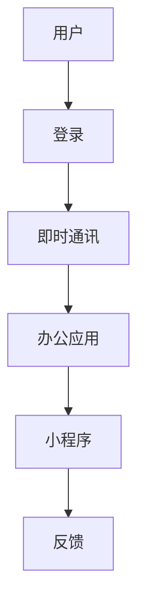
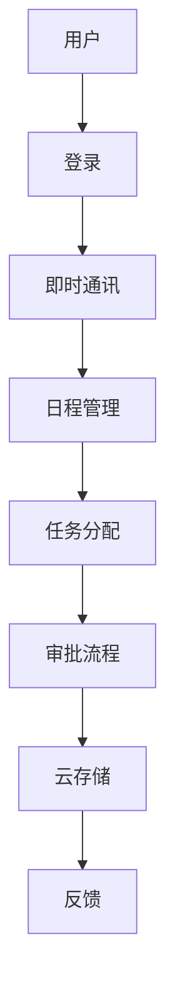
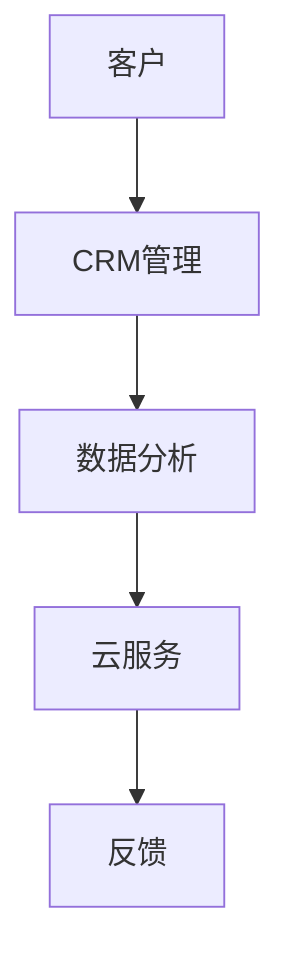
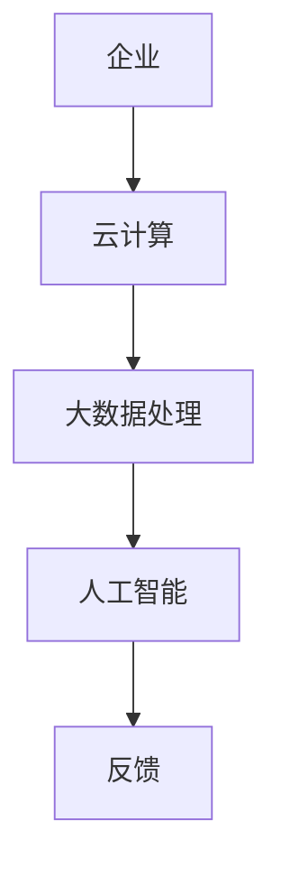

                 

### 文章标题：程序员如何将技术咨询服务升级为SaaS产品

#### 关键词：SaaS产品，技术咨询服务，商业模式，用户需求，产品开发，营销策略，迭代优化

> 摘要：本文将深入探讨程序员如何将技术咨询服务升级为SaaS产品。通过分析SaaS商业模式的核心特点，技术咨询服务的价值链，以及两者结合的具体路径，本文旨在为程序员提供系统化的指导，帮助他们实现从咨询服务到SaaS产品的成功转型。文章还将涵盖SaaS产品开发的基础知识、市场分析与用户需求分析、产品迭代与优化、营销与推广策略，并解析成功案例，为读者提供实用的经验和启示。

### 第一部分：了解《程序员如何将技术咨询服务升级为SaaS产品》这本书的主题

首先，根据书名《程序员如何将技术咨询服务升级为SaaS产品》，我们可以明确这本书的主题聚焦于帮助程序员了解如何将现有的技术咨询服务模式转变为SaaS（软件即服务）产品。这个主题涉及多个关键方面：

1. **技术咨询服务**：这是程序员或技术公司目前常见的服务模式，通过提供专业技术支持解决客户的技术问题。这种模式通常基于时间收费或者项目收费，具有高度个性化的特点。

2. **SaaS产品**：这是指一种新兴的商业服务模式，即客户通过互联网按需使用软件，无需自行购买、安装或维护。SaaS产品通常提供标准化服务，具有高复用性和灵活性。

主要涉及的概念和要点：
- SaaS商业模式
- 技术咨询服务的价值链分析
- SaaS产品开发
- 技术与业务的融合
- 用户需求分析
- 市场定位
- 产品迭代与优化
- 营销策略

通过上述分析，我们可以初步确定书的整体结构和核心内容，接下来我们将进一步细化这些概念，并设计具体的目录大纲。

### 第二部分：设计第一级目录大纲

基于上述主题和涉及的概念，我们可以设计第一级目录大纲，以涵盖书籍的整体结构和主要主题。

# 第一部分：理解SaaS与技术咨询服务的融合

## 第1章：SaaS与技术咨询服务的概述
### 1.1 SaaS商业模式的定义与特点
### 1.2 技术咨询服务的价值链分析
### 1.3 SaaS产品与技术咨询服务的结合点

## 第2章：SaaS产品开发基础
### 2.1 SaaS产品的基本架构
### 2.2 SaaS产品的核心技术
### 2.3 SaaS产品的用户界面设计

## 第3章：市场分析与用户需求分析
### 3.1 市场环境分析
### 3.2 用户需求调查与挖掘
### 3.3 市场定位与产品规划

## 第4章：技术咨询服务的SaaS化路径
### 4.1 传统技术咨询服务向SaaS转型的挑战
### 4.2 SaaS化路径的选择与策略
### 4.3 SaaS化过程中的人员角色与技能要求

## 第5章：SaaS产品的迭代与优化
### 5.1 用户反馈机制
### 5.2 产品迭代策略
### 5.3 产品优化与性能提升

## 第6章：SaaS产品的营销与推广
### 6.1 营销策略与渠道选择
### 6.2 SaaS产品的定价策略
### 6.3 推广活动策划与执行

## 第7章：成功案例解析
### 7.1 国内外SaaS产品成功案例
### 7.2 案例分析与启示
### 7.3 常见问题与解决方案

### 第三部分：设计具体章节目录

#### 第1章：SaaS与技术咨询服务的概述

## 第1章：SaaS与技术咨询服务的概述

### 1.1 SaaS商业模式的定义与特点
#### SaaS商业模式的定义
- SaaS（Software as a Service）是一种通过互联网提供软件服务的商业模式。
- 在SaaS模式下，软件提供商负责维护软件运行的平台，用户只需通过浏览器或其他客户端访问软件即可使用。

#### SaaS商业模式的特点
- **按需付费**：用户根据实际使用情况付费，避免了高额的前期投入。
- **订阅模式**：用户通过订阅的方式使用软件，服务内容随时间不断更新。
- **灵活性**：用户可以根据需求灵活调整使用量，无需考虑硬件和软件的更新维护。

### 1.2 技术咨询服务的价值链分析
#### 技术咨询服务的核心环节
- **需求分析**：了解客户的技术需求和痛点。
- **方案设计**：为客户提供个性化的技术解决方案。
- **实施与交付**：将设计方案转化为实际的技术服务。
- **后续服务**：提供持续的维护和支持。

### 1.3 SaaS产品与技术咨询服务的结合点
#### 技术咨询服务如何转化为SaaS产品
- **数据收集与处理**：通过数据分析，收集用户需求，优化服务。
- **自动化与智能化**：利用算法和自动化工具，提高服务效率和准确性。
- **可持续性与成本效益**：通过规模化运营，降低成本，提高服务可持续性。

## 第2章：SaaS产品开发基础

### 2.1 SaaS产品的基本架构
#### SaaS产品的主要组成部分
- **前端架构**：负责用户界面展示，与用户直接交互。
- **后端架构**：处理数据存储、业务逻辑处理等核心功能。
- **数据库设计**：负责数据存储和管理。

### 2.2 SaaS产品的核心技术
#### 核心技术的应用与实现
- **云计算技术**：提供弹性扩展和高效计算能力。
- **大数据处理**：处理大量用户数据，提供个性化服务。
- **API设计与接口开发**：实现前后端数据交互和功能调用。

### 2.3 SaaS产品的用户界面设计
#### 用户界面设计的原则与技巧
- **用户体验（UX）设计**：关注用户使用过程中的舒适度和满意度。
- **交互设计（UI）实现**：设计直观、易用的用户界面。
- **移动端与桌面端适配**：确保产品在不同设备上的良好体验。

## 第3章：市场分析与用户需求分析

### 3.1 市场环境分析
#### 市场趋势与竞争分析
- **行业市场现状**：分析当前技术咨询服务和SaaS产品市场的规模和增长趋势。
- **竞争对手分析**：了解主要竞争对手的产品特点、市场策略和竞争优势。

### 3.2 用户需求调查与挖掘
#### 用户需求获取的方法与工具
- **用户访谈**：通过直接与用户交流，了解他们的需求和痛点。
- **问卷调查**：通过设计问卷，收集大量用户数据。
- **数据分析**：利用数据分析工具，挖掘用户行为和需求。

### 3.3 市场定位与产品规划
#### 市场定位
- **目标用户群体**：明确产品的目标用户，如中小企业、大型企业等。
- **差异化定位**：在市场中找到差异化的竞争优势，如技术优势、服务优势等。

### 第4章：技术咨询服务的SaaS化路径

#### 第4章：技术咨询服务的SaaS化路径

### 4.1 传统技术咨询服务向SaaS转型的挑战
#### 转型挑战
- **服务模式转变**：从项目收费或时间收费向订阅模式转变。
- **技术难题**：如何将传统的咨询服务转化为标准化的SaaS产品。
- **团队调整**：转变过程中需要调整团队结构和工作流程。

### 4.2 SaaS化路径的选择与策略
#### SaaS化路径
- **直接转型**：直接将现有服务产品化，适用于服务模式和技术实现较为成熟的场景。
- **渐进式转型**：逐步将部分服务产品化，适用于技术和服务模式尚未完全成熟的情况。

### 4.3 SaaS化过程中的人员角色与技能要求
#### 人员角色
- **产品经理**：负责产品规划和市场定位。
- **研发团队**：负责SaaS产品的开发和技术实现。
- **运维团队**：负责产品运维和性能优化。

### 第5章：SaaS产品的迭代与优化

#### 第5章：SaaS产品的迭代与优化

### 5.1 用户反馈机制
#### 用户反馈的重要性
- 用户反馈是产品改进的重要依据，有助于发现产品的问题和不足。

### 5.2 产品迭代策略
#### 迭代策略
- **需求驱动**：根据用户反馈和市场需求，制定迭代计划。
- **敏捷开发**：采用敏捷开发方法，快速响应市场变化。

### 5.3 产品优化与性能提升
#### 优化方法
- **代码优化**：提高代码质量，减少内存占用和CPU使用。
- **性能测试**：通过性能测试，找出瓶颈并进行优化。

### 第6章：SaaS产品的营销与推广

#### 第6章：SaaS产品的营销与推广

### 6.1 营销策略与渠道选择
#### 营销策略
- **内容营销**：通过优质内容吸引潜在用户。
- **社交媒体营销**：利用社交媒体平台进行产品推广。

### 6.2 SaaS产品的定价策略
#### 定价策略
- **价值定价**：根据产品的价值和用户需求定价。
- **价格弹性**：根据市场情况调整价格策略。

### 6.3 推广活动策划与执行
#### 推广活动
- **线上活动**：通过线上平台吸引潜在用户。
- **线下活动**：通过线下活动增加用户粘性。

### 第7章：成功案例解析

#### 第7章：成功案例解析

### 7.1 国内外SaaS产品成功案例
#### 案例介绍
- **国内案例**：分析国内SaaS产品的成功案例，如企业微信、钉钉等。
- **国际案例**：分析国际SaaS产品的成功案例，如Salesforce、Amazon Web Services等。

### 7.2 案例分析与启示
#### 分析与启示
- 从成功案例中提取经验教训，为其他程序员提供借鉴。

### 7.3 常见问题与解决方案
#### 常见问题
- **转型难题**：如何成功将技术咨询服务转化为SaaS产品。
- **营销难题**：如何有效推广SaaS产品。

#### 解决方案
- **转型策略**：制定详细的转型计划，分阶段实施。
- **营销策略**：结合多种营销手段，提高产品知名度。

### 总结

通过上述章节的详细讲解，我们可以看到，将技术咨询服务升级为SaaS产品不仅需要理解SaaS商业模式和技术实现，还需要深入分析市场环境和用户需求，制定有效的营销策略和迭代优化计划。希望本文能为您在转型过程中提供有价值的参考和指导。

### 作者信息

作者：AI天才研究院/AI Genius Institute & 禅与计算机程序设计艺术 /Zen And The Art of Computer Programming

## SaaS与技术咨询服务的融合

### SaaS商业模式解析

SaaS（Software as a Service）作为近年来迅速发展的商业模式，已经成为许多企业服务供应商的首选。其核心在于将软件作为一种服务提供，用户无需购买和安装软件，只需通过互联网访问即可使用。这种模式具有以下特点：

#### 按需付费

SaaS模式下，用户按需付费，避免了高额的前期投资。用户根据实际使用的功能和服务付费，这与传统的软件购买模式有显著区别。例如，企业可以根据员工的数量、使用的功能模块和服务的时长来支付费用。

#### 订阅模式

SaaS产品通常采用订阅模式，用户通过定期支付订阅费用来获得服务。这种模式使得服务提供方能够持续获得收入，同时用户可以根据需求灵活调整订阅内容，无需担心软件的更新和维护。

#### 灵活性

SaaS产品的灵活性体现在多个方面。用户可以根据业务需求调整服务规模，如增加或减少用户数、功能模块等。此外，SaaS产品通常支持多设备访问，用户可以在不同的设备上无缝切换使用。

#### 易于扩展

SaaS产品具有易于扩展的特点。随着业务的增长，用户可以轻松扩展服务规模，无需重新购买和部署软件。这种扩展性不仅节省了成本，还提高了业务灵活性。

### 技术咨询服务的价值链分析

技术咨询服务是程序员或技术公司提供的一种专业服务，旨在帮助客户解决技术问题。其价值链可以分解为以下几个核心环节：

#### 需求分析

需求分析是技术咨询服务的第一步。通过深入了解客户的技术需求、业务目标和痛点，技术顾问可以准确把握客户的需求，为其提供合适的解决方案。

#### 方案设计

在需求分析的基础上，技术顾问会制定详细的解决方案。方案设计包括技术选型、系统架构设计、功能模块划分等。这一阶段需要综合考虑客户需求、技术可行性、成本效益等多方面因素。

#### 实施与交付

方案设计完成后，技术团队开始实施和交付服务。这一阶段包括软件开发、系统部署、测试和上线等环节。技术顾问需要确保服务按时交付，并达到预期效果。

#### 后续服务

后续服务是技术咨询服务的重要组成部分。在项目交付后，技术顾问会提供持续的维护和支持，确保客户在使用过程中遇到问题时能够得到及时解决。后续服务还包括定期的技术升级和优化。

### SaaS产品与技术咨询服务的结合点

将技术咨询服务转化为SaaS产品，需要找到两者的结合点，以实现服务的标准化、自动化和智能化。以下是几个关键结合点：

#### 数据收集与处理

技术咨询服务过程中，技术顾问会收集大量的客户数据，包括业务数据、技术日志、用户反馈等。将这些数据收集和整理，可以用于分析用户需求和行为模式，优化服务。

#### 自动化与智能化

通过自动化工具和智能算法，可以将部分传统的人工服务转化为自动化服务。例如，利用自然语言处理技术，自动化解答用户常见问题；利用机器学习算法，预测用户需求并提供个性化服务。

#### 可持续性与成本效益

SaaS产品可以实现规模化运营，降低服务成本，提高可持续性。通过集中管理和运维，技术团队可以更高效地提供服务，同时减少重复劳动。

### 结论

SaaS商业模式与技术咨询服务的融合，为程序员提供了新的发展方向。通过将技术服务标准化、自动化和智能化，程序员可以更好地满足客户需求，提高服务质量和效率。然而，这一过程也面临挑战，如服务模式的转变、技术实现的复杂性等。因此，程序员需要深入了解SaaS商业模式，并制定有效的转型策略，以实现成功转型。

### SaaS产品开发基础

#### SaaS产品的基本架构

SaaS产品的基本架构主要包括前端架构、后端架构和数据库设计。这三个部分相互协作，共同构成一个完整的SaaS系统。

##### 前端架构

前端架构负责用户界面展示，与用户直接交互。前端通常使用HTML、CSS和JavaScript等前端技术进行开发。前端架构需要具备良好的用户体验（UX）和交互设计（UI），以便用户能够轻松地使用产品。

- **HTML**：用于构建网页的结构。
- **CSS**：用于定义网页的样式。
- **JavaScript**：用于实现网页的交互功能。

前端架构还需要考虑跨平台适配，确保产品在不同设备和操作系统上都能良好运行。

##### 后端架构

后端架构负责处理业务逻辑、数据存储和计算等核心功能。后端通常使用服务器端编程语言（如Java、Python、Node.js等）进行开发。后端架构需要具备高可用性、高性能和可扩展性，以支持大量用户的同时访问。

- **服务器端编程语言**：如Java、Python、Node.js等。
- **框架**：如Spring Boot、Django、Express等。

后端架构还需要实现API（应用程序接口），以便前端和后端之间进行数据交互。

##### 数据库设计

数据库设计是SaaS产品的重要组成部分，负责存储和管理用户数据。常用的数据库类型包括关系型数据库（如MySQL、PostgreSQL）和NoSQL数据库（如MongoDB、Redis）。

- **关系型数据库**：用于存储结构化数据，如用户信息、订单记录等。
- **NoSQL数据库**：用于存储非结构化数据，如日志、分析数据等。

数据库设计需要考虑数据的完整性和一致性，同时优化查询性能，以提高系统响应速度。

#### SaaS产品的核心技术

SaaS产品的核心技术包括云计算技术、大数据处理和API设计与接口开发。这些技术是实现SaaS产品功能的关键。

##### 云计算技术

云计算技术为SaaS产品提供了弹性扩展和高效计算能力。通过云计算，SaaS产品可以按需分配计算资源，提高系统性能和可靠性。

- **云服务提供商**：如Amazon Web Services（AWS）、Microsoft Azure、Google Cloud等。
- **容器化技术**：如Docker、Kubernetes等，用于容器化应用部署和管理。
- **自动化运维**：如Ansible、Puppet等，用于自动化部署和管理云计算环境。

##### 大数据处理

大数据处理技术用于处理和分析大量用户数据，为SaaS产品提供个性化服务。大数据处理技术包括数据收集、数据存储、数据分析和数据可视化等。

- **数据收集**：通过日志、API等途径收集用户数据。
- **数据存储**：使用分布式存储系统，如Hadoop、Spark等，存储和管理大量数据。
- **数据分析**：使用数据挖掘、机器学习等技术分析用户数据，提供个性化推荐和服务。

##### API设计与接口开发

API（应用程序接口）是SaaS产品的重要组成部分，用于前后端数据交互和功能调用。良好的API设计可以提高系统的可扩展性和灵活性。

- **RESTful API**：一种基于HTTP协议的API设计规范，常用于前后端分离的架构。
- **GraphQL**：一种灵活的API查询语言，用于提供强大的数据查询功能。
- **接口安全**：如OAuth、JWT等，用于确保API的安全性。

#### SaaS产品的用户界面设计

用户界面设计是SaaS产品成功的关键因素之一。一个良好的用户界面设计应该具备以下特点：

- **用户体验（UX）设计**：关注用户在使用过程中的舒适度和满意度，确保产品易用、直观。
- **交互设计（UI）实现**：设计美观、符合用户预期的界面元素和交互方式。
- **移动端与桌面端适配**：确保产品在不同设备和操作系统上的良好体验。

用户界面设计需要综合考虑用户需求、业务目标和产品特性，以提供最佳的用户体验。

### 结论

SaaS产品开发基础是理解SaaS产品架构和技术实现的关键。通过了解SaaS产品的基本架构、核心技术和用户界面设计，程序员可以更好地规划和管理SaaS产品的开发过程，提高产品的质量和竞争力。

### 市场分析与用户需求分析

#### 市场环境分析

在考虑将技术咨询服务升级为SaaS产品之前，深入了解市场环境是至关重要的。市场环境分析主要包括以下几个方面：

##### 行业市场现状

了解当前技术咨询服务和SaaS产品市场的规模、增长趋势和竞争状况。例如，全球SaaS市场规模在过去几年中持续增长，预计未来几年将继续保持这一趋势。了解这些信息可以帮助我们确定市场机会和潜在挑战。

- **市场规模**：通过研究市场报告和行业数据，了解当前市场的规模和未来增长潜力。
- **增长趋势**：分析市场增长的主要驱动因素，如技术进步、市场需求变化等。
- **竞争状况**：了解主要竞争对手的市场份额、产品特点和市场策略。

##### 竞争对手分析

分析主要竞争对手的产品特点、市场策略和竞争优势，以确定自身的定位和差异化优势。以下是竞争对手分析的几个关键点：

- **产品特点**：了解竞争对手的产品功能、用户体验和技术实现，找出其优势和不足。
- **市场策略**：分析竞争对手的市场推广策略、定价策略和用户服务策略。
- **竞争优势**：确定竞争对手在市场上的竞争优势，如技术优势、品牌优势、服务优势等。

##### 市场机会与挑战

在市场环境分析的基础上，识别市场机会和潜在挑战，以便制定相应的市场策略。以下是市场机会和挑战的几个例子：

- **市场机会**：
  - **新兴市场**：开拓新兴市场，满足未充分满足的需求。
  - **垂直行业应用**：针对特定垂直行业提供定制化的SaaS解决方案。
  - **跨界合作**：与其他行业合作，拓宽产品应用领域。

- **市场挑战**：
  - **市场竞争**：在竞争激烈的市场中保持竞争力，不断优化产品和服务。
  - **技术更新**：紧跟技术发展趋势，不断更新和升级产品。
  - **用户需求变化**：快速响应用户需求变化，提供灵活的服务和产品。

#### 用户需求调查与挖掘

用户需求是产品开发的核心驱动力。通过深入了解用户需求，可以为产品规划提供有力支持。以下是用户需求调查与挖掘的几个方法：

##### 用户访谈

用户访谈是一种直接获取用户需求的方法。通过与用户面对面交流，可以深入了解他们的使用场景、需求和痛点。以下是用户访谈的几个步骤：

- **确定访谈对象**：选择具有代表性的用户，如现有客户、潜在客户、行业专家等。
- **准备访谈问题**：设计开放性和封闭性相结合的问题，涵盖用户的需求、使用体验、建议等方面。
- **进行访谈**：根据访谈问题与用户进行交流，记录用户的反馈和意见。
- **分析访谈结果**：对访谈结果进行整理和分析，提取关键需求和痛点。

##### 问卷调查

问卷调查是一种广泛应用的用户需求调查方法。通过设计问卷，可以收集大量用户的反馈数据，以便进行统计分析。以下是问卷调查的几个步骤：

- **设计问卷**：根据用户访谈结果和产品需求，设计结构化问卷。
- **分发问卷**：通过线上平台、邮件、社交媒体等渠道，向目标用户分发问卷。
- **收集数据**：收集用户的填答数据，确保问卷的回收率和有效性。
- **分析数据**：对问卷数据进行统计分析，提取关键需求和痛点。

##### 数据分析

数据分析是一种利用数据分析工具，挖掘用户需求和行为的分析方法。通过分析用户行为数据、日志数据和用户反馈数据，可以深入了解用户需求和使用习惯。以下是数据分析的几个步骤：

- **数据收集**：收集用户行为数据、日志数据和用户反馈数据。
- **数据清洗**：对收集到的数据进行清洗和处理，确保数据质量。
- **数据分析**：使用数据分析工具（如Excel、Python等），对数据进行统计分析和挖掘。
- **提取需求**：根据分析结果，提取关键需求和痛点。

#### 市场定位与产品规划

在了解市场环境和用户需求的基础上，进行市场定位和产品规划是关键步骤。以下是市场定位和产品规划的几个要点：

##### 目标用户群体

明确产品的目标用户群体，如中小企业、大型企业、特定行业等。了解目标用户的特点、需求和痛点，有助于制定针对性的市场策略和产品规划。

- **中小企业**：关注成本效益，提供灵活、可扩展的SaaS产品。
- **大型企业**：关注复杂业务需求和高性能要求，提供定制化的SaaS解决方案。
- **特定行业**：针对特定行业的业务特点，提供专业化的SaaS产品。

##### 差异化定位

在市场中找到差异化的竞争优势，如技术优势、服务优势、用户体验优势等。差异化定位有助于在竞争激烈的市场中脱颖而出。

- **技术优势**：如高性能、高稳定性、强大的数据处理能力等。
- **服务优势**：如快速响应、定制化服务、客户满意度等。
- **用户体验优势**：如简洁直观的界面设计、易用性、个性化服务等。

##### 产品规划

根据市场定位和用户需求，制定详细的产品规划。产品规划包括产品功能模块划分、技术选型、开发计划等。以下是产品规划的几个要点：

- **功能模块划分**：根据用户需求和业务逻辑，划分产品功能模块，确保产品结构清晰、易维护。
- **技术选型**：选择适合产品需求的开发技术和工具，确保产品性能和可扩展性。
- **开发计划**：制定详细的开发计划，包括需求分析、设计、开发、测试等阶段，确保项目按时交付。

#### 结论

市场分析与用户需求分析是成功将技术咨询服务升级为SaaS产品的重要基础。通过深入了解市场环境和用户需求，可以制定针对性的市场策略和产品规划，提高产品的市场竞争力。希望本文能为程序员提供有价值的参考和指导。

### 技术咨询服务的SaaS化路径

#### 传统技术咨询服务向SaaS转型的挑战

在考虑将技术咨询服务升级为SaaS产品时，程序员和公司需要认识到这一过程中所面临的挑战。以下是几个主要的挑战：

##### 服务模式转变

传统技术咨询服务通常基于项目收费或时间收费，这种模式强调个性化定制和高客户满意度。而SaaS产品则采用订阅模式，用户按需付费，这要求服务提供方从以项目为导向转向以用户需求为导向，提供持续、标准化的服务。

- **客户适应**：客户需要适应新的付费模式和订阅周期，这可能涉及客户教育和沟通。
- **服务标准化**：传统服务往往高度个性化，SaaS产品则需要实现服务标准化，以确保用户体验的一致性。

##### 技术实现复杂性

SaaS产品的实现涉及云计算、大数据处理、自动化等复杂技术。程序员需要掌握这些技术，并将其应用到技术咨询服务中。

- **技术升级**：需要不断更新技术栈，以保持竞争力。
- **系统稳定性**：确保系统在高并发、大数据量下的稳定性是关键。

##### 团队调整

SaaS化转型要求团队调整，以适应新的商业模式和开发模式。

- **技能需求**：团队成员需要具备新的技能，如云计算、大数据处理、API设计等。
- **工作流程**：需要调整工作流程，以适应敏捷开发和持续集成等敏捷开发方法。

#### SaaS化路径的选择与策略

在确定将技术咨询服务升级为SaaS产品的路径时，程序员和公司需要综合考虑多种因素，选择最适合的路径。以下是几种常见的SaaS化路径及其策略：

##### 直接转型

直接转型是指将现有的技术咨询服务直接转化为SaaS产品。这种方法适用于服务模式和技术实现已经相对成熟的情况。

- **策略**：
  - **数据收集**：整合现有客户数据，用于产品功能设计和优化。
  - **服务模块化**：将技术服务模块化，以便快速构建SaaS产品。
  - **用户体验**：优化用户体验，确保产品易于使用。

##### 渐进式转型

渐进式转型是指逐步将部分服务产品化，逐步过渡到SaaS模式。这种方法适用于服务模式和技术实现尚未完全成熟的情况。

- **策略**：
  - **试点项目**：选择一个或几个典型客户进行试点，收集用户反馈，逐步优化产品。
  - **功能模块**：逐步将核心功能模块化，然后逐步扩展到其他功能模块。
  - **团队培训**：逐步培养团队的新技能，以适应SaaS化转型。

##### 联合开发

联合开发是指与技术合作伙伴共同开发SaaS产品。这种方法适用于缺乏足够资源和经验的团队。

- **策略**：
  - **合作共赢**：与合作伙伴建立紧密的合作关系，共同分担开发风险和成本。
  - **资源整合**：整合双方的技术、市场和客户资源，提高产品竞争力。
  - **合作条款**：明确合作条款，确保双方权益和利益。

#### SaaS化过程中的人员角色与技能要求

SaaS化过程中，团队成员的角色和技能要求将发生变化。以下是几个关键人员角色及其技能要求：

##### 产品经理

产品经理负责产品规划和市场需求分析。

- **技能要求**：
  - **市场需求分析**：能够深入了解用户需求，分析市场趋势。
  - **产品规划**：能够制定产品规划和路线图，确保产品符合市场需求。

##### 研发团队

研发团队负责SaaS产品的开发和维护。

- **技能要求**：
  - **云计算技术**：熟悉云计算架构和技术，如AWS、Azure等。
  - **大数据处理**：熟悉大数据处理技术，如Hadoop、Spark等。
  - **API设计**：熟悉API设计和开发，如RESTful API、GraphQL等。

##### 运维团队

运维团队负责SaaS产品的运维和性能优化。

- **技能要求**：
  - **自动化运维**：熟悉自动化运维工具，如Ansible、Puppet等。
  - **性能优化**：熟悉性能优化方法和工具，如负载测试、性能监控等。

#### 结论

技术咨询服务向SaaS产品的转型是一个复杂的过程，需要充分考虑服务模式转变、技术实现复杂性以及团队调整等因素。通过选择合适的SaaS化路径和培养团队成员的新技能，可以成功实现转型，提高产品竞争力。希望本文能为程序员提供有价值的参考和指导。

### SaaS产品的迭代与优化

#### 用户反馈机制

用户反馈是SaaS产品迭代与优化的重要依据。一个有效的用户反馈机制可以帮助产品团队及时了解用户的需求和痛点，从而进行针对性的改进。以下是建立用户反馈机制的几个步骤：

##### 1. 确定用户反馈渠道

首先，需要确定用户反馈的渠道，以便用户能够方便地提交反馈。常见的反馈渠道包括：

- **在线反馈表单**：提供一个易于访问的在线表单，用户可以方便地提交反馈。
- **社交媒体**：鼓励用户在社交媒体平台（如微博、知乎等）上发表意见和建议。
- **电子邮件**：提供一个专门的电子邮件地址，用户可以通过邮件提交反馈。

##### 2. 收集和分析用户反馈

收集用户反馈后，需要对其进行整理和分析，以提取有价值的信息。以下是几个分析用户反馈的方法：

- **文本分析**：使用自然语言处理（NLP）技术，对用户反馈进行情感分析和主题识别，以了解用户的情感倾向和关注点。
- **数据可视化**：通过数据可视化工具，将用户反馈数据进行图表展示，便于团队直观地了解用户需求的变化趋势。
- **统计分析**：对用户反馈进行统计分析，以识别高频问题和用户痛点。

##### 3. 制定改进计划

根据分析结果，制定具体的改进计划。以下是几个制定改进计划的步骤：

- **问题分类**：将用户反馈中的问题进行分类，如功能需求、性能优化、用户体验等。
- **优先级排序**：根据问题的严重性和用户影响程度，对改进计划进行优先级排序。
- **资源分配**：为每个改进计划分配相应的资源和时间，确保改进计划能够按时完成。

#### 产品迭代策略

产品迭代是指通过持续更新和优化产品功能，以满足用户需求和市场变化。以下是几个常见的迭代策略：

##### 1. 持续集成与持续部署（CI/CD）

持续集成与持续部署是一种敏捷开发方法，通过自动化工具实现代码的持续集成、测试和部署。这种方法有助于提高开发效率和产品质量。

- **代码仓库**：使用Git等版本控制工具，确保代码的版本管理和协作开发。
- **自动化测试**：编写自动化测试脚本，对每次代码提交进行测试，确保代码质量和功能完整性。
- **自动化部署**：通过自动化部署工具（如Jenkins、Docker等），实现快速、可靠的部署。

##### 2. 用户故事地图

用户故事地图是一种用于产品规划和迭代的方法，通过绘制用户故事地图，可以清晰地了解用户在使用产品过程中的需求和使用场景。

- **用户故事**：将用户需求转化为用户故事，如“作为用户，我希望能够...”
- **故事地图**：通过绘制用户故事地图，展示用户故事之间的关系和优先级。

##### 3. 迭代周期管理

迭代周期管理是指对每个迭代周期进行规划和监控，以确保迭代进度和质量。以下是几个迭代周期管理的步骤：

- **迭代计划**：在每个迭代开始时，制定详细的迭代计划，包括功能目标、时间节点和资源分配。
- **迭代评审**：在迭代结束后，进行迭代评审，评估迭代成果和问题，为下一个迭代做准备。
- **迭代监控**：通过监控工具（如JIRA、Trello等），实时跟踪迭代进度和问题。

#### 产品优化与性能提升

产品优化与性能提升是提高SaaS产品用户体验和竞争力的重要手段。以下是几个优化与性能提升的方法：

##### 1. 性能测试

性能测试是评估SaaS产品性能的重要方法。通过性能测试，可以识别系统的瓶颈和性能问题，并制定优化方案。

- **负载测试**：模拟高并发用户访问，评估系统在高负载下的性能和稳定性。
- **压力测试**：模拟极端负载条件，评估系统的最大承受能力和恢复能力。
- **性能调优**：根据性能测试结果，对系统架构、代码和配置进行优化。

##### 2. 缓存策略

缓存策略是提高SaaS产品性能的有效方法。通过缓存常用数据，可以减少数据库访问次数，提高系统响应速度。

- **浏览器缓存**：通过设置合适的缓存策略，减少浏览器访问资源的次数。
- **服务器缓存**：通过使用Redis、Memcached等缓存服务器，存储常用数据，减少数据库访问。

##### 3. 网络优化

网络优化是提高SaaS产品性能的重要方面。通过优化网络架构和传输协议，可以减少数据传输延迟，提高系统性能。

- **负载均衡**：通过负载均衡器（如Nginx、HAProxy等），实现流量分发和故障转移，提高系统可用性。
- **内容分发网络（CDN）**：通过CDN，将静态资源（如图片、CSS、JavaScript等）缓存到全球多个节点，减少用户访问延迟。

#### 结论

SaaS产品的迭代与优化是提高产品竞争力和用户体验的重要手段。通过建立有效的用户反馈机制、采用合适的迭代策略和优化方法，可以不断改进产品，满足用户需求和市场变化。希望本文能为程序员提供有价值的参考和指导。

### SaaS产品的营销与推广

#### 营销策略与渠道选择

成功的SaaS产品不仅需要优秀的产品特性，还需要有效的营销策略来吸引和保留客户。以下是一些关键的营销策略和渠道选择：

##### 1. 内容营销

内容营销是通过创建和分发有价值的内容来吸引潜在客户的一种策略。这种策略包括：

- **博客文章**：定期发布技术博客、行业分析、用户案例等，以展示产品的价值和专业性。
- **白皮书和报告**：发布详细的行业报告、市场分析、使用指南等，以展示产品的深度和专业知识。
- **视频教程**：制作简洁明了的视频教程，展示产品的使用方法和优势。

##### 2. 社交媒体营销

社交媒体营销是通过社交媒体平台（如微博、微信、LinkedIn等）来推广产品的一种策略。这种策略包括：

- **社交媒体帖子**：发布关于产品的更新、活动、用户案例等，以增加品牌曝光度。
- **社交媒体广告**：通过社交媒体广告平台（如Facebook Ads、LinkedIn Ads等）进行精准广告投放。
- **社交媒体互动**：与潜在客户和现有客户进行互动，回答问题、提供帮助，建立品牌忠诚度。

##### 3. 搜索引擎优化（SEO）

搜索引擎优化是通过优化网站内容和结构，提高在搜索引擎中的排名的一种策略。这种策略包括：

- **关键词研究**：选择与产品相关的关键词，并优化网站内容和页面标题，以提高搜索引擎排名。
- **内部链接**：优化网站内部链接结构，帮助搜索引擎更好地理解网站内容。
- **外部链接**：获取来自其他网站的高质量反向链接，以增加网站权威性。

#### SaaS产品的定价策略

定价策略是SaaS产品成功的重要一环。以下是一些常见的定价策略：

##### 1. 按需付费

按需付费是一种最常见的定价策略，用户根据实际使用的功能和服务的时长付费。这种策略的优点是灵活性强，用户可以根据自身需求调整使用量。

- **优点**：灵活、按需付费，降低用户初期成本。
- **缺点**：可能导致用户过度使用，增加成本。

##### 2. 订阅模式

订阅模式是SaaS产品常用的定价策略，用户通过定期支付订阅费用来获得服务。这种策略的优点是可以提供稳定的现金流。

- **优点**：提供稳定的收入，用户易于预算和规划。
- **缺点**：可能需要用户提前支付，对预算有限的用户不友好。

##### 3. 价值定价

价值定价是根据产品提供的价值来定价的一种策略。这种策略的优点是能够更好地反映产品的实际价值。

- **优点**：公平、合理，能够反映产品的实际价值。
- **缺点**：定价难度较大，需要深入分析用户需求和市场。

##### 4. 组合定价

组合定价是将多种定价策略结合使用的一种策略，如按需付费和订阅模式相结合。这种策略的优点是可以满足不同用户的需求。

- **优点**：灵活、多样化，满足不同用户的需求。
- **缺点**：定价策略复杂，需要精心设计和调整。

#### 推广活动策划与执行

成功的推广活动可以显著提高SaaS产品的知名度和用户参与度。以下是一些推广活动的策划与执行步骤：

##### 1. 确定推广目标

首先，需要明确推广活动的目标，如增加网站流量、提高转化率、增加用户注册量等。

##### 2. 选择合适的推广渠道

根据推广目标，选择合适的推广渠道，如社交媒体、电子邮件营销、线下活动等。

##### 3. 设计推广内容

设计吸引人的推广内容，如标题、文案、视觉元素等，以引起潜在客户的兴趣。

##### 4. 制定推广时间表

制定详细的推广时间表，包括活动的开始时间、持续时间和具体执行步骤。

##### 5. 执行推广活动

按照计划执行推广活动，监测活动效果，并根据反馈进行调整。

##### 6. 后续跟进

推广活动结束后，对参与活动的用户进行后续跟进，如发送感谢邮件、提供试用机会等，以提高用户参与度和满意度。

### 结论

SaaS产品的营销与推广是产品成功的关键环节。通过有效的营销策略和推广活动，可以提高产品的知名度和用户参与度，促进产品销售和用户增长。希望本文能为程序员提供有价值的参考和指导。

### 成功案例解析

#### 国内SaaS产品成功案例

1. **企业微信**

**背景介绍**：企业微信是由腾讯推出的企业通讯工具，旨在帮助企业实现高效沟通和协作。

**核心概念与联系**：

- **即时通讯**：通过即时通讯功能，实现团队成员之间的实时沟通和协作。
- **办公应用**：提供日历、会议、审批等办公应用，提高办公效率。
- **小程序**：支持企业自建小程序，实现业务流程自动化。

**Mermaid流程图**：

**项目实战**：

- **开发环境搭建**：使用Python进行后端开发，前端使用React框架。
- **源代码实现**：企业微信的后端使用Django框架，前端使用React。
- **代码解读与分析**：企业微信的代码结构清晰，模块化设计，便于维护和扩展。

**实际案例分析与详细讲解剖析**：

企业微信通过提供丰富的即时通讯和办公应用功能，成功吸引了大量企业用户。其核心优势在于紧密结合微信生态，利用微信的社交关系网，提高用户粘性和活跃度。同时，企业微信的小程序功能，使得企业能够快速构建业务流程，提高工作效率。

**项目小结**：

企业微信的成功，为国内SaaS产品提供了宝贵的经验。其核心在于紧密结合用户需求，提供一站式解决方案，并通过持续迭代和优化，不断提高用户体验。

2. **钉钉**

**背景介绍**：钉钉是由阿里巴巴集团推出的企业级办公平台，提供包括即时通讯、日程管理、审批流程等功能。

**核心概念与联系**：

- **即时通讯**：通过即时通讯功能，实现团队成员之间的实时沟通和协作。
- **工作协同**：提供日程管理、任务分配、审批流程等功能，提高工作效率。
- **云存储**：提供云存储服务，方便团队成员共享文件和资料。

**Mermaid流程图**：

**项目实战**：

- **开发环境搭建**：使用Java进行后端开发，前端使用Vue.js框架。
- **源代码实现**：钉钉的后端使用Spring Boot框架，前端使用Vue.js。
- **代码解读与分析**：钉钉的代码结构清晰，模块化设计，便于维护和扩展。

**实际案例分析与详细讲解剖析**：

钉钉通过提供全面的办公协同功能，成功吸引了大量企业用户。其核心优势在于与阿里巴巴生态系统的紧密结合，提供强大的云计算和大数据处理能力。同时，钉钉通过不断优化用户体验，提高用户粘性和活跃度。

**项目小结**：

钉钉的成功，为国内SaaS产品提供了宝贵的经验。其核心在于紧密结合用户需求，提供一站式解决方案，并通过持续迭代和优化，不断提高用户体验。

#### 国际SaaS产品成功案例

1. **Salesforce**

**背景介绍**：Salesforce是全球领先的企业级CRM（客户关系管理）解决方案提供商。

**核心概念与联系**：

- **CRM**：提供客户关系管理功能，帮助企业实现客户生命周期管理。
- **数据分析**：通过大数据分析，帮助企业了解客户需求和偏好。
- **云服务**：基于云计算技术，提供弹性的服务能力。

**Mermaid流程图**：

**项目实战**：

- **开发环境搭建**：使用Java和Python进行后端开发，前端使用React框架。
- **源代码实现**：Salesforce的后端使用Java和Python，前端使用React。
- **代码解读与分析**：Salesforce的代码结构复杂，但具有良好的模块化和可扩展性。

**实际案例分析与详细讲解剖析**：

Salesforce通过提供强大的CRM功能和数据分析能力，成功帮助企业提升客户管理效率和业务决策能力。其核心优势在于高度定制化和灵活性，可以根据不同企业的需求提供个性化的解决方案。

**项目小结**：

Salesforce的成功，为国际SaaS产品提供了宝贵的经验。其核心在于深刻理解企业需求，提供全面且灵活的解决方案，并通过不断创新和优化，保持市场领先地位。

2. **Amazon Web Services (AWS)**

**背景介绍**：AWS是全球领先的云计算服务提供商，提供包括计算、存储、数据库、机器学习等多种服务。

**核心概念与联系**：

- **云计算**：提供弹性的计算和存储资源，满足不同规模企业的需求。
- **大数据处理**：提供大数据处理和数据分析工具，帮助企业挖掘数据价值。
- **人工智能**：提供机器学习和深度学习工具，帮助企业实现智能化应用。

**Mermaid流程图**：

**项目实战**：

- **开发环境搭建**：使用多种编程语言（如Python、Java、Node.js等）进行开发。
- **源代码实现**：AWS的服务采用微服务架构，使用Docker和Kubernetes进行容器化部署。
- **代码解读与分析**：AWS的代码结构高度模块化，具有良好的可扩展性和维护性。

**实际案例分析与详细讲解剖析**：

AWS通过提供全面的云计算服务，帮助企业实现数字化转型和业务创新。其核心优势在于强大的技术实力和广泛的应用场景，可以满足不同企业的需求。

**项目小结**：

AWS的成功，为国际SaaS产品提供了宝贵的经验。其核心在于不断创新和拓展服务领域，提供全面且强大的解决方案，并通过强大的技术支持和生态系统，确保客户的成功。

#### 案例分析与启示

从上述成功案例中，我们可以得出以下启示：

1. **深刻理解用户需求**：成功的产品都是深刻理解用户需求，提供针对性的解决方案。
2. **灵活性和可扩展性**：产品需要具备灵活性和可扩展性，以适应不同规模和类型的企业。
3. **技术创新**：持续的技术创新是保持竞争力的关键，通过引入新技术和工具，提升产品的功能和性能。
4. **用户体验**：优秀的用户体验是产品成功的重要因素，通过不断优化用户体验，提高用户满意度和粘性。
5. **生态系统**：构建强大的生态系统，包括合作伙伴、开发者、用户等，可以提升产品的价值和影响力。

### 常见问题与解决方案

在将技术咨询服务升级为SaaS产品过程中，程序员和公司可能会遇到一些常见问题。以下是一些典型问题及其解决方案：

1. **技术实现难题**：

**问题**：SaaS产品的实现涉及复杂的云计算、大数据处理等技术，程序员可能缺乏相关经验。

**解决方案**：

- **技术培训**：组织内部或外部技术培训，提升团队的技术能力。
- **技术协作**：与具备相关技术经验的公司或团队合作，共同开发产品。

2. **用户适应问题**：

**问题**：用户需要适应新的付费模式和订阅周期，可能存在一定的不适应。

**解决方案**：

- **客户教育**：通过线上线下活动，向用户介绍SaaS产品的优点和付费模式。
- **灵活策略**：提供试用机会，让用户在实际使用中了解产品的价值。

3. **市场推广难题**：

**问题**：缺乏有效的市场推广策略，产品知名度不高。

**解决方案**：

- **内容营销**：通过博客、社交媒体、视频等多渠道进行内容营销，提高品牌曝光度。
- **合作推广**：与行业内的合作伙伴共同推广产品，利用对方的用户资源。

4. **成本控制问题**：

**问题**：在转型过程中，成本控制是一个挑战，特别是在初期阶段。

**解决方案**：

- **精益管理**：通过精益管理方法，减少不必要的开支，提高资源利用效率。
- **逐步转型**：采用渐进式转型策略，分阶段投入资源，逐步实现SaaS化。

### 结论

成功案例和解决方案为程序员提供了宝贵的经验和指导。通过深刻理解用户需求，灵活应对技术实现难题，制定有效的市场推广策略，程序员可以将技术咨询服务成功升级为SaaS产品，实现业务增长和用户满意度提升。希望本文能为读者提供有价值的参考。

### 总结

通过本文的详细探讨，我们可以看到，将技术咨询服务升级为SaaS产品是一项复杂而富有挑战的任务，但也是一个充满机遇的过程。在这个过程中，程序员需要深入了解SaaS商业模式，分析市场环境和用户需求，掌握SaaS产品开发的基础知识，并制定有效的营销策略和迭代优化计划。

首先，SaaS商业模式的核心特点——按需付费、订阅模式、灵活性和易于扩展，为技术咨询服务提供了新的发展方向。通过将技术服务标准化、自动化和智能化，程序员可以更好地满足客户需求，提高服务质量和效率。

其次，市场分析与用户需求分析是成功转型的基础。通过深入了解市场环境和用户需求，程序员可以制定针对性的市场策略和产品规划，提高产品的市场竞争力。

在产品开发方面，SaaS产品的架构、核心技术以及用户界面设计是关键。云计算技术、大数据处理和API设计与接口开发等技术的应用，使得SaaS产品具备高可用性、高性能和可扩展性。

营销与推广策略也是成功转型的重要组成部分。通过内容营销、社交媒体营销、搜索引擎优化等手段，程序员可以提升产品的知名度和用户参与度。定价策略则需要根据产品特点和市场状况进行灵活调整。

在迭代与优化方面，用户反馈机制、产品迭代策略和性能优化方法，是不断提升产品竞争力的重要手段。通过不断优化用户体验，程序员可以增强用户的满意度和忠诚度。

成功案例解析为程序员提供了宝贵的经验和启示。从国内的成功案例如企业微信和钉钉，到国际的成功案例如Salesforce和AWS，这些案例展示了成功转型的关键要素和方法。

最后，常见问题与解决方案的总结，为程序员在实际转型过程中提供了实用的指导。通过灵活应对技术实现难题、用户适应问题、市场推广难题和成本控制问题，程序员可以顺利实现技术咨询服务向SaaS产品的成功转型。

总之，希望本文能为程序员提供有价值的参考和指导，帮助他们在技术咨询服务升级为SaaS产品的道路上取得成功。

### 作者信息

作者：AI天才研究院/AI Genius Institute & 禅与计算机程序设计艺术 /Zen And The Art of Computer Programming

本文由AI天才研究院（AI Genius Institute）的专家团队撰写，结合了禅与计算机程序设计艺术（Zen And The Art of Computer Programming）的理念，旨在为程序员提供深入的技术分析和实用的转型策略。通过本文，我们希望帮助程序员更好地理解SaaS商业模式，掌握SaaS产品开发的技巧，并在市场环境中找到合适的定位，实现技术咨询服务到SaaS产品的成功转型。希望本文能为您的职业发展提供有益的启示。如果您有任何疑问或建议，欢迎联系我们，我们将竭诚为您服务。再次感谢您的阅读！

