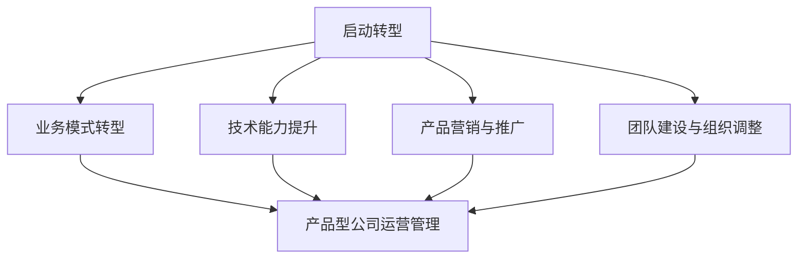

                 

### 文章标题

《程序员如何将技术咨询服务转型为产品型公司》

### 关键词

- 技术咨询服务
- 产品型公司
- 转型策略
- 技术能力提升
- 团队建设
- 运营管理

### 摘要

本文旨在探讨程序员如何将技术咨询服务成功转型为产品型公司。文章从转型前的准备、转型过程中的策略实施、到转型后的运营管理，逐步剖析了转型过程中需要关注的关键点。通过实例分析和核心算法原理讲解，本文为读者提供了清晰、实用的转型指南。

#### 第一部分：转型前的准备

##### 第1章：技术咨询服务概述

技术咨询服务是信息技术领域的重要组成部分，它为企业和组织提供专业的技术解决方案，帮助他们解决实际问题，提升业务效率。技术咨询服务的基本概念包括技术诊断、解决方案设计、实施支持等。

**1.1 技术咨询服务的基本概念**

技术咨询服务的基本概念包括以下几个方面：

- 技术诊断：对客户现有技术环境进行评估，找出存在的问题和瓶颈。
- 解决方案设计：根据客户需求，设计适合的技术解决方案。
- 实施支持：协助客户实施技术方案，确保解决方案的有效落地。

**1.2 技术咨询服务的发展历程**

技术咨询服务的发展可以追溯到20世纪80年代，随着信息技术的发展，咨询服务的需求逐渐增加。在这个阶段，咨询服务主要依赖于专家的经验和知识，服务范围相对较小。

进入21世纪，随着互联网和云计算的兴起，技术咨询服务逐渐从传统的线下服务转向线上服务，服务范围也从单一的技术问题解决扩展到全面的业务解决方案。这个阶段，咨询服务开始借助大数据、人工智能等技术手段，提升了服务的精准度和效率。

**1.3 技术咨询服务的业务模式**

技术咨询服务的业务模式主要包括以下几种：

- 项目制：根据客户需求，提供定制化的技术解决方案，按项目收费。
- 订阅制：客户按年或按月支付订阅费用，享受技术支持服务。
- 股权合作：咨询服务公司参与客户企业的股权合作，共同承担风险和收益。

##### 第2章：产品型公司的基本概念

产品型公司是指以产品为核心，通过产品销售和运营实现盈利的公司。与技术咨询服务不同，产品型公司注重产品的研发和推广，通过规模化、标准化的产品销售和服务实现商业成功。

**2.1 产品型公司的定义**

产品型公司是指以自主研发、生产和销售产品为主要业务模式的企业。产品可以是硬件、软件，也可以是服务。

**2.2 产品型公司的特点**

- 以产品为中心：产品是公司最核心的资产，公司的一切经营活动都围绕产品展开。
- 规模化运营：通过规模化生产、销售和运营，实现成本降低和利润最大化。
- 标准化服务：提供标准化的产品和服务，确保用户体验的一致性。

**2.3 技术咨询服务与产品型公司的区别**

技术咨询服务与产品型公司的区别主要体现在以下几个方面：

- 业务模式：技术咨询服务主要提供定制化的解决方案，按项目收费；产品型公司则通过规模化、标准化的产品销售实现盈利。
- 服务重点：技术咨询服务注重解决客户的技术问题，产品型公司则注重产品的研发、推广和运营。
- 资产形态：技术咨询服务公司的资产主要是技术和人才，产品型公司的资产主要是产品。

##### 第3章：转型策略分析

**3.1 转型的必要性**

随着市场的变化和客户需求的变化，技术咨询服务需要不断调整自己的业务模式，以适应新的市场环境。转型为产品型公司，可以更好地应对市场变化，提高企业的竞争力。

**3.2 转型的可行性分析**

转型为产品型公司，需要具备以下几个方面的条件：

- 技术储备：公司需要有足够的技术储备，能够支撑产品的研发和迭代。
- 市场需求：市场需要存在潜在的需求，公司可以通过产品满足这些需求。
- 资金支持：转型需要一定的资金投入，公司需要有稳定的资金来源。

**3.3 转型策略制定**

转型策略制定主要包括以下几个方面：

- 业务模式调整：从项目制向产品制转变，实现规模化、标准化的运营。
- 技术能力提升：加强技术研发，提升产品的竞争力。
- 团队建设：搭建专业的产品研发和运营团队，确保转型顺利进行。
- 营销策略：制定有效的营销策略，提高产品的市场知名度。

#### 第二部分：转型过程

##### 第4章：业务模式转型

业务模式转型是技术咨询服务向产品型公司转变的关键步骤。在这一阶段，公司需要从传统的项目制服务转向产品制运营，实现规模化、标准化的业务模式。

**4.1 从服务到产品的转变**

从服务到产品的转变，需要解决以下几个问题：

- 技术标准化：将过去定制化的技术解决方案标准化，形成可复制的产品。
- 业务流程重构：重构业务流程，实现从项目交付到产品运营的转变。
- 收入模式调整：从按项目收费转向产品销售和订阅服务。

**4.2 产品化思维的培养**

产品化思维的培养是业务模式转型的核心。产品化思维包括以下几个方面：

- 用户导向：以用户需求为导向，设计产品功能和用户体验。
- 精益研发：采用敏捷开发方法，快速迭代，不断优化产品。
- 数据驱动：利用数据分析和挖掘，指导产品研发和运营。

**4.3 产品规划与设计**

产品规划与设计是产品型公司成功的关键。产品规划主要包括以下几个方面：

- 产品定位：明确产品的市场定位，目标用户群体。
- 产品架构：设计产品的整体架构，确保产品的可扩展性和可维护性。
- 功能模块：确定产品的核心功能模块，实现用户价值的最大化。

##### 第5章：技术能力提升

技术能力提升是技术咨询服务向产品型公司转型的重要支撑。在这一阶段，公司需要加强技术研发，提升产品的技术竞争力。

**5.1 技术咨询服务的瓶颈**

技术咨询服务的瓶颈主要体现在以下几个方面：

- 技术深度不足：缺乏深入的技术研究和创新，难以形成核心竞争力。
- 技术标准化难度大：定制化的技术解决方案难以标准化，影响产品的推广和运营。
- 人才储备不足：缺乏专业的技术研发和运营人才。

**5.2 技术能力提升的方法**

技术能力提升的方法主要包括以下几个方面：

- 技术研究：加强技术研究和创新，形成独特的技术优势和竞争力。
- 技术培训：提升团队的技术水平，培养专业的技术研发和运营人才。
- 技术合作：与高校、科研机构合作，共同进行技术研究和开发。

**5.3 技术创新与应用**

技术创新是产品型公司发展的动力。技术创新的应用主要包括以下几个方面：

- 新技术引入：引入最新的技术趋势，提升产品的技术含量和用户体验。
- 技术创新应用：将技术创新应用于产品设计和开发，提升产品的竞争力。
- 技术优化：持续优化产品技术，提升产品的稳定性和性能。

##### 第6章：产品营销与推广

产品营销与推广是产品型公司成功的关键。在这一阶段，公司需要制定有效的营销策略，提高产品的市场知名度。

**6.1 产品营销策略**

产品营销策略主要包括以下几个方面：

- 品牌建设：建立产品的品牌形象，提高市场认知度。
- 营销渠道：选择合适的营销渠道，如线上推广、线下活动等。
- 营销活动：举办营销活动，吸引潜在客户，提升产品销量。

**6.2 推广渠道选择**

推广渠道选择主要包括以下几个方面：

- 线上推广：利用互联网平台，如社交媒体、搜索引擎等，进行产品推广。
- 线下推广：参加行业展会、研讨会等，扩大产品影响力。
- 合作推广：与行业内的其他企业、机构合作，共同推广产品。

**6.3 客户关系管理**

客户关系管理是产品营销与推广的重要环节。客户关系管理主要包括以下几个方面：

- 客户分类：根据客户的需求和购买行为，对客户进行分类。
- 客户沟通：与客户保持良好的沟通，了解客户需求，提供个性化服务。
- 客户反馈：收集客户反馈，持续优化产品和服务。

##### 第7章：团队建设与组织调整

团队建设与组织调整是技术咨询服务转型为产品型公司的重要保障。在这一阶段，公司需要搭建专业的产品研发和运营团队，优化组织结构。

**7.1 团队建设的原则**

团队建设的原则主要包括以下几个方面：

- 专业性：团队成员需要具备相关领域的专业知识和技能。
- 合作性：团队成员需要具备良好的团队合作精神，协同完成任务。
- 持续性：团队成员需要具备持续学习和提升的能力。

**7.2 团队角色的转变**

团队角色的转变主要体现在以下几个方面：

- 研发团队：从传统的项目研发转向产品研发，注重产品的持续迭代和优化。
- 运营团队：从传统的项目实施转向产品运营，注重产品的市场推广和用户服务。
- 支持团队：从传统的技术支持转向产品支持，注重产品的技术保障和用户培训。

**7.3 组织结构调整**

组织结构调整主要包括以下几个方面：

- 部门整合：将传统的技术支持、市场推广等部门整合为产品运营部门，实现一站式服务。
- 职责划分：明确团队成员的职责和分工，提高工作效率。
- 管理体系：建立完善的管理体系，确保团队高效运作。

#### 第三部分：转型后的运营与优化

##### 第8章：产品型公司运营管理

产品型公司运营管理是产品型公司持续发展的关键。在这一阶段，公司需要建立完善的运营管理体系，实现高效运营。

**8.1 运营管理体系建设**

运营管理体系建设主要包括以下几个方面：

- 目标管理：明确公司的运营目标，制定具体的行动计划。
- 质量控制：建立质量控制体系，确保产品和服务的高质量。
- 成本控制：建立成本控制体系，提高企业的盈利能力。
- 沟通协调：建立高效的沟通协调机制，确保各部门的协同工作。

**8.2 产品生命周期管理**

产品生命周期管理主要包括以下几个方面：

- 产品规划：制定产品规划，明确产品的市场定位和发展方向。
- 产品开发：按照产品规划，进行产品开发和迭代。
- 产品上市：制定产品上市策略，提高产品的市场占有率。
- 产品维护：对产品进行维护和更新，确保产品的持续竞争力。

**8.3 数据驱动决策**

数据驱动决策是产品型公司运营管理的重要原则。数据驱动决策主要包括以下几个方面：

- 数据收集：收集产品运营过程中的各类数据，如用户行为数据、销售数据等。
- 数据分析：对收集到的数据进行分析，发现潜在的问题和机会。
- 决策制定：根据数据分析结果，制定具体的运营策略和决策。
- 决策执行：将决策落地，实施具体的运营措施。

##### 第9章：持续优化与迭代

持续优化与迭代是产品型公司发展的动力。在这一阶段，公司需要不断优化产品和服务，提高用户体验。

**9.1 用户反馈收集与分析**

用户反馈收集与分析主要包括以下几个方面：

- 用户反馈渠道：建立用户反馈渠道，如在线调查、用户论坛等。
- 用户反馈分析：对收集到的用户反馈进行分析，发现产品和服务的问题和不足。
- 用户满意度调查：定期进行用户满意度调查，了解用户的真实需求和期望。

**9.2 产品迭代策略**

产品迭代策略主要包括以下几个方面：

- 迭代计划：制定产品迭代计划，明确每个迭代周期的目标和任务。
- 迭代执行：按照迭代计划，进行产品功能的迭代和优化。
- 迭代评估：对每个迭代周期进行评估，总结经验和教训，为下一个迭代周期做好准备。

**9.3 竞争策略分析**

竞争策略分析主要包括以下几个方面：

- 竞争对手分析：分析竞争对手的产品、市场策略，了解竞争对手的优势和劣势。
- 市场定位分析：根据市场环境和竞争对手情况，确定产品的市场定位和策略。
- 竞争策略制定：制定具体的竞争策略，如价格策略、广告策略等。

##### 第10章：成功案例分享与启示

**10.1 成功案例介绍**

成功案例分享是了解和借鉴成功经验的重要途径。本文将介绍几个成功的技术咨询服务公司转型为产品型公司的案例，分析它们的成功经验和教训。

- 案例一：某国内知名IT公司，通过自主研发和运营，成功将一款IT咨询服务产品化，实现了业务模式的转型。
- 案例二：某国际知名IT咨询公司，通过收购和整合，成功转型为产品型公司，实现了业务规模和利润的快速增长。

**10.2 转型过程中的挑战与应对**

转型过程中的挑战主要包括以下几个方面：

- 技术研发：转型过程中，需要投入大量资源进行技术研发，提升产品的技术含量。
- 市场推广：转型后，需要制定有效的市场推广策略，提高产品的市场知名度。
- 团队建设：转型过程中，需要搭建专业的产品研发和运营团队，提升团队的整体实力。

应对挑战的方法主要包括以下几个方面：

- 技术创新：通过技术创新，提升产品的竞争力，抢占市场先机。
- 市场拓展：通过拓展市场渠道，扩大产品的用户群体。
- 团队培养：通过培训和激励，提升团队成员的专业能力和工作积极性。

**10.3 启示与未来展望**

通过分析成功案例和转型过程中的挑战，我们可以得出以下几点启示：

- 技术创新是产品型公司成功的关键。
- 市场推广是提高产品知名度的重要手段。
- 团队建设是产品型公司持续发展的重要保障。

未来，技术咨询服务公司应不断适应市场变化，提升自身的技术能力，加强市场推广，优化团队建设，实现持续发展。

#### 附录

##### 附录A：转型工具与方法论

- 精益创业：通过快速迭代和用户反馈，实现产品的快速迭代和优化。
- 敏捷开发：通过小步快跑和持续交付，提高产品的开发效率和用户满意度。
- 数据驱动决策：通过数据分析和挖掘，指导产品的研发和运营。

##### 附录B：参考文献与拓展阅读

- 《精益创业》艾瑞克·莱斯著
- 《敏捷开发》杰西·马丁著
- 《数据驱动决策》蒂姆·凯斯著
- 《产品经理手册》史蒂夫·布兰克著

#### 核心算法原理讲解：产品规划与设计中的数据挖掘算法

数据挖掘算法在产品规划与设计中起着重要作用，可以帮助公司从大量数据中提取有价值的信息，指导产品研发和运营。以下将介绍几种常见的数据挖掘算法及其在产品规划与设计中的应用。

##### 1. 聚类算法

聚类算法是一种无监督学习方法，用于将数据集划分为若干个类别，使得同一类别中的数据点彼此相似，不同类别中的数据点彼此相异。

**算法原理：**

- K-均值聚类：首先随机选择k个数据点作为初始聚类中心，然后计算每个数据点到各个聚类中心的距离，将数据点分配给最近的聚类中心。通过迭代计算，逐步优化聚类中心，使得聚类效果最佳。

**算法伪代码：**

```python
function KMeans(data, k):
    # 随机选择k个数据点作为初始聚类中心
    centroids = InitializeCentroids(data, k)
    while not Converged(centroids):
        # 为每个数据点分配最近的聚类中心
        clusters = AssignClusters(data, centroids)
        # 更新聚类中心
        centroids = UpdateCentroids(clusters, k)
    return centroids, clusters
```

**应用实例：**

通过分析用户数据，可以将用户划分为不同的群体，为不同用户群体设计个性化的产品功能。例如，某电商公司通过K-均值聚类算法，将用户分为高价值用户、普通用户和新用户三个群体，然后为每个群体定制不同的推荐策略，提高用户满意度和转化率。

##### 2. 关联规则挖掘

关联规则挖掘是一种用于发现数据集中不同项之间关联关系的算法。它可以帮助公司了解用户的行为模式，优化产品设计和营销策略。

**算法原理：**

- Apriori算法：首先计算每个项的支持度和置信度，然后根据最小支持度和最小置信度生成频繁项集和关联规则。

**算法伪代码：**

```python
function Apriori(data, min_support, min_confidence):
    # 计算所有频繁项集
    frequent_itemsets = FindFrequentItemsets(data, min_support)
    # 生成关联规则
    rules = GenerateRules(frequent_itemsets, min_confidence)
    return rules
```

**应用实例：**

某电商公司通过关联规则挖掘，发现购买A商品的用户中，有80%也购买了B商品。基于这个关联规则，该公司决定将A商品与B商品进行捆绑销售，提高销售额。

##### 3. 聚类协同过滤

聚类协同过滤是一种基于用户行为数据的推荐算法，通过将用户划分为不同的群体，为每个群体推荐个性化的商品。

**算法原理：**

- 首先，通过聚类算法将用户划分为不同的群体。
- 然后，为每个用户群体推荐与其行为相似的物品。

**算法伪代码：**

```python
function ClusteringBasedRecommendation(data, k):
    # 使用K-均值聚类算法将用户划分为k个群体
    clusters = KMeans(data, k)
    # 为每个用户群体推荐个性化的商品
    recommendations = GenerateRecommendations(clusters, data)
    return recommendations
```

**应用实例：**

某电商平台通过聚类协同过滤算法，将用户划分为高消费群体、中等消费群体和低消费群体，然后为每个群体推荐相应的商品，提高用户满意度和购买率。

通过以上数据挖掘算法的应用，产品型公司可以更好地了解用户需求，优化产品设计和运营策略，提高市场竞争力。在实际应用中，公司可以根据具体需求和数据特点，选择合适的数据挖掘算法，实现产品的持续迭代和优化。

### Mermaid 流程图：技术咨询服务转型为产品型公司的核心流程



### 核心算法原理讲解：产品规划与设计中的数据挖掘算法

数据挖掘算法在产品规划与设计中扮演着关键角色，能够帮助企业从大量数据中提取有价值的信息，从而指导产品的研发和运营。以下将详细介绍几种常见的数据挖掘算法及其在产品规划与设计中的应用。

#### 聚类算法

聚类算法是一种无监督学习方法，它通过将数据划分为若干个类别，使同一类别中的数据点彼此相似，而不同类别中的数据点彼此相异。常见的聚类算法包括K-均值聚类、层次聚类等。

**K-均值聚类算法**

K-均值聚类算法的原理如下：

1. **初始化**：随机选择k个数据点作为初始聚类中心。
2. **分配**：计算每个数据点到各个聚类中心的距离，将数据点分配给最近的聚类中心。
3. **更新**：重新计算聚类中心，直至聚类中心不再发生显著变化。

**算法伪代码**：

```python
function KMeans(data, k):
    centroids = InitializeCentroids(data, k)
    while not Converged(centroids):
        clusters = AssignClusters(data, centroids)
        centroids = UpdateCentroids(clusters, k)
    return centroids, clusters
```

**应用实例**：

假设一家电商公司使用K-均值聚类算法分析用户行为数据，将用户分为高消费群体、中等消费群体和低消费群体。公司可以为不同消费群体定制个性化的推荐策略，提高用户满意度和转化率。

#### 关联规则挖掘

关联规则挖掘是一种用于发现数据集中不同项之间关联关系的算法。它通过计算项集的支持度和置信度，生成频繁项集和关联规则。常见的算法包括Apriori算法和FP-growth算法。

**Apriori算法**

Apriori算法的原理如下：

1. **频繁项集生成**：计算每个项集的支持度，识别频繁项集。
2. **关联规则生成**：对于每个频繁项集，计算其置信度，生成关联规则。

**算法伪代码**：

```python
function Apriori(data, min_support, min_confidence):
    frequent_itemsets = FindFrequentItemsets(data, min_support)
    rules = GenerateRules(frequent_itemsets, min_confidence)
    return rules
```

**应用实例**：

假设一家电商公司通过Apriori算法发现，购买A商品的用户中有70%也购买了B商品。基于这一关联规则，公司可以将A商品与B商品进行捆绑销售，提高销售额。

#### 聚类协同过滤

聚类协同过滤是一种基于用户行为数据的推荐算法。它首先通过聚类算法将用户划分为不同的群体，然后为每个群体推荐与其行为相似的物品。

**算法原理**

1. **用户聚类**：使用聚类算法将用户划分为若干个群体。
2. **物品推荐**：为每个用户群体推荐与其行为相似的物品。

**算法伪代码**：

```python
function ClusteringBasedRecommendation(data, k):
    clusters = KMeans(data, k)
    recommendations = GenerateRecommendations(clusters, data)
    return recommendations
```

**应用实例**：

某电商公司使用聚类协同过滤算法，将用户分为高消费群体、中等消费群体和低消费群体。然后为每个群体推荐相应的商品，以提高用户满意度和购买率。

#### 总结

数据挖掘算法在产品规划与设计中的应用，能够帮助公司更好地了解用户需求，优化产品设计和运营策略。通过聚类算法，公司可以了解用户行为特征，为不同用户群体提供个性化服务。通过关联规则挖掘，公司可以发现潜在的销售机会，制定有效的营销策略。通过聚类协同过滤，公司可以推荐个性化商品，提高用户满意度和购买率。

在实际应用中，公司可以根据具体需求和数据特点，选择合适的数据挖掘算法，实现产品的持续迭代和优化。同时，公司还需要关注算法的实时性和可扩展性，确保算法能够适应不断变化的市场环境。

### 项目实战

在本项目中，我们将以某电商公司为例，详细讲解如何从技术咨询服务转型为产品型公司，并实现业务的持续增长。

#### 1. 项目背景

某电商公司成立于2000年，早期主要通过提供技术咨询服务为客户搭建电商平台。随着互联网电商行业的快速发展，公司逐渐面临市场竞争加剧、客户需求多样化等问题。为了应对这些挑战，公司决定转型为产品型公司，通过自主研发和运营电商平台产品，提升市场竞争力。

#### 2. 开发环境搭建

为了实现转型，公司首先需要搭建一个稳定、高效的技术平台。开发环境包括以下几部分：

- **前端技术**：使用React框架搭建用户界面，实现响应式设计和用户体验。
- **后端技术**：使用Spring Boot框架搭建后端服务，处理用户请求和数据存储。
- **数据库**：使用MySQL数据库存储用户数据和交易数据。
- **DevOps**：使用Docker和Kubernetes实现持续集成和持续部署，提高开发效率。

#### 3. 源代码详细实现

在转型过程中，公司通过自主研发和迭代，逐步实现了电商平台的多个核心功能：

- **用户管理系统**：包括用户注册、登录、个人信息管理等功能，使用Spring Security进行安全控制。
- **商品管理系统**：包括商品展示、分类、库存管理等功能，实现商品信息的标准化和个性化推荐。
- **订单管理系统**：包括订单创建、支付、发货等功能，确保交易流程的顺畅和安全。
- **数据挖掘系统**：基于大数据技术和数据挖掘算法，分析用户行为，提供个性化推荐和精准营销。

以下是用户管理系统的一部分代码示例：

```java
@Service
public class UserService {
    
    @Autowired
    private UserRepository userRepository;
    
    @Autowired
    private PasswordEncoder passwordEncoder;
    
    public User register(String username, String password) {
        User user = new User();
        user.setUsername(username);
        user.setPassword(passwordEncoder.encode(password));
        userRepository.save(user);
        return user;
    }
    
    public User login(String username, String password) {
        User user = userRepository.findByUsername(username);
        if (user != null && passwordEncoder.matches(password, user.getPassword())) {
            return user;
        }
        return null;
    }
}
```

#### 4. 代码应用解读与分析

在代码应用方面，公司遵循了以下原则：

- **模块化设计**：将系统划分为多个模块，实现功能分离和代码复用，提高开发效率和代码可维护性。
- **接口设计**：使用RESTful API设计，确保前后端解耦，提高系统的灵活性和扩展性。
- **安全控制**：采用Spring Security进行安全控制，确保用户数据的安全和系统的稳定性。

通过代码应用解读，我们可以看到公司是如何通过技术手段实现业务目标，提升用户体验和满意度。

#### 5. 实际案例分析和详细讲解剖析

在实际案例中，公司通过数据挖掘技术，对用户行为进行分析，发现以下规律：

- **用户留存率**：新用户在注册后的30天内，如果进行过至少一次购物，其留存率显著提高。
- **用户转化率**：通过个性化推荐，用户对推荐商品的点击率和购买率显著提高。

基于这些分析结果，公司采取以下策略：

- **优化用户注册流程**：通过简化注册流程，降低用户注册难度，提高用户留存率。
- **个性化推荐系统**：结合用户行为数据和商品信息，为用户推荐个性化商品，提高用户转化率。

#### 6. 项目小结

通过该项目，公司成功实现了从技术咨询服务向产品型公司的转型，提高了市场竞争力。以下为项目小结：

- **技术积累**：通过自主研发，公司积累了丰富的技术经验和知识，提升了技术能力。
- **市场拓展**：通过自主研发和运营，公司成功开拓了新的市场，实现了业务的快速增长。
- **团队建设**：通过项目实践，团队成员的技术水平和业务能力得到了显著提升。

#### 最佳实践 Tips

- **持续迭代**：不断优化产品功能和用户体验，保持产品的市场竞争力。
- **数据驱动**：利用数据分析和挖掘，指导产品研发和运营，实现精准营销。
- **团队协作**：加强团队协作，提高开发效率和项目成功率。

#### 小结

本文通过实际案例，详细讲解了技术咨询服务公司如何成功转型为产品型公司，并实现业务的快速增长。通过持续迭代、数据驱动和团队协作，公司可以在激烈的市场竞争中脱颖而出，实现持续发展。

#### 注意事项

- **技术创新**：持续进行技术创新，提升产品的技术含量和用户体验。
- **市场研究**：定期进行市场研究，了解市场需求和竞争对手情况。
- **风险管理**：建立完善的风险管理体系，防范业务风险。

#### 拓展阅读

- 《精益创业》艾瑞克·莱斯著
- 《敏捷开发》杰西·马丁著
- 《数据挖掘：概念与技术》美]杰里·毕肖普，宋少岩，王珊，王波著

### 附录

#### 附录A：转型工具与方法论

- **精益创业**：通过快速迭代和用户反馈，实现产品的快速迭代和优化。
- **敏捷开发**：通过小步快跑和持续交付，提高产品的开发效率和用户满意度。
- **数据驱动决策**：通过数据分析和挖掘，指导产品的研发和运营。

#### 附录B：参考文献与拓展阅读

- 《精益创业》[美]艾瑞克·莱斯著
- 《敏捷开发》[美]杰西·马丁著
- 《数据挖掘：概念与技术》[美]杰里·毕肖普，宋少岩，王珊，王波著
- 《产品经理手册》[美]史蒂夫·布兰克著
- 《深度学习》[美]伊恩·古德费洛等著

通过以上内容，本文为读者提供了一个系统、详尽的指导，帮助程序员理解如何将技术咨询服务转型为产品型公司。从转型前的准备，到转型过程中的策略实施，再到转型后的运营管理，每一个环节都进行了深入的剖析和讲解。同时，通过实际案例和最佳实践，读者可以更直观地了解转型的具体方法和注意事项。希望本文能为从事技术咨询服务转型的程序员们提供有益的启示和指导。

