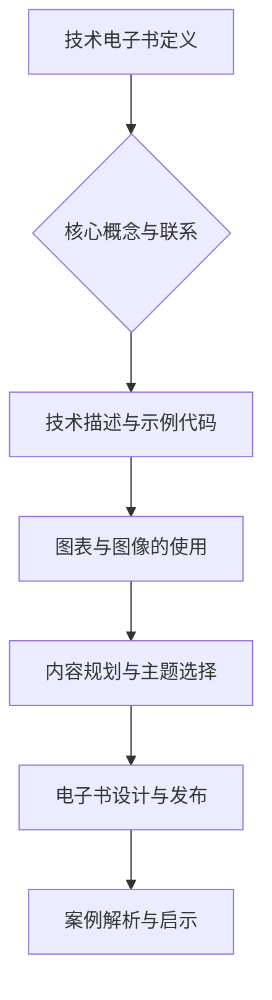

                 

### 文章标题

《程序员如何打造高质量的技术电子书》

### 关键词

- 技术电子书
- 内容创作
- 设计与发布
- 技术写作
- 读者分析
- 质量控制

### 摘要

本文将深入探讨程序员如何打造高质量的技术电子书。首先，我们定义了技术电子书的核心概念和其市场需求，分析了高质量技术电子书的特点。接着，我们详细讨论了目标读者分析与需求定位、内容规划与主题选择的方法。在内容创作部分，我们介绍了技术写作技巧、技术描述与示例代码编写、图表与图像的使用、以及审校与优化策略。最后，我们阐述了电子书设计原则、格式与优化技巧、以及发布与营销策略。通过一系列案例解析，本文提供了具体的启示与借鉴，帮助程序员打造高质量的技术电子书。本文旨在为程序员提供一套系统、实用的电子书创作指南，助力其在技术领域的知识传播和影响力提升。

---

### 《程序员如何打造高质量的技术电子书》目录大纲

#### 第一部分：高质量技术电子书的基础概念

## 第1章：技术电子书的价值与定位
### 1.1 技术电子书的定义
### 1.2 技术电子书的市场需求
### 1.3 高质量技术电子书的特点

## 第2章：目标读者分析与需求定位
### 2.1 目标读者的调研方法
### 2.2 需求分析的方法与实践
### 2.3 内容定位与读者匹配

## 第3章：内容规划与主题选择
### 3.1 主题选择的策略
### 3.2 内容规划的方法与工具
### 3.3 主题内容的优先级排序

#### 第二部分：高质量内容创作技巧

## 第4章：技术写作技巧
### 4.1 技术写作的基本原则
### 4.2 文档结构设计
### 4.3 语言表达与风格

## 第5章：技术描述与示例代码
### 5.1 技术描述的方法
### 5.2 示例代码的选择与编写
### 5.3 代码解读与分析

## 第6章：图表与图像的使用
### 6.1 图表的使用原则
### 6.2 常用图表类型
### 6.3 图像的优化与处理

## 第7章：审校与优化
### 7.1 审校流程
### 7.2 内容质量评估方法
### 7.3 优化策略与技巧

#### 第三部分：电子书设计与发布

## 第8章：电子书设计原则
### 8.1 设计理念
### 8.2 设计工具选择
### 8.3 用户界面与交互设计

## 第9章：电子书格式与优化
### 9.1 常见电子书格式
### 9.2 格式转换工具
### 9.3 优化技巧

## 第10章：电子书发布与营销
### 10.1 发布平台选择
### 10.2 营销策略
### 10.3 用户反馈与迭代

#### 附录

## 附录A：资源与工具推荐
### A.1 技术写作与编辑工具
### A.2 电子书设计与格式工具
### A.3 发布与营销平台推荐

## 附录B：参考文献与扩展阅读
### B.1 必读经典著作
### B.2 最新研究论文
### B.3 相关社区与论坛

### 第11章：高质量技术电子书案例解析
#### 11.1 案例介绍
#### 11.2 案例分析
#### 11.3 案例启示与借鉴

### 引用流程图



### 核心算法伪代码

```python
# 伪代码：算法概述
Algorithm 高质量内容创作算法
    Input: 内容主题，目标读者，需求分析
    Output: 高质量电子书

    // 初始化参数
    Set content_framework = 空框架
    Set content_library = 空库

    // 内容规划与主题选择
    content_framework = 内容规划(content_theme, reader_analysis)
    content_library = 主题选择(content_framework)

    // 技术写作与示例代码
    content_framework = 技术写作(content_library)
    content_library = 示例代码编写(content_framework)

    // 图表与图像优化
    content_framework = 图表使用(content_framework)
    content_library = 图像优化(content_library)

    // 审校与优化
    content_framework = 审校(content_framework)
    content_library = 优化(content_library)

    // 电子书设计
    ebook_design = 电子书设计(content_framework, content_library)

    // 电子书发布与营销
    ebook_publish = 电子书发布(ebook_design)
    ebook_market = 营销策略(ebook_publish)

```

接下来，我们将按照上述目录结构，逐步深入探讨每个章节的内容，通过逻辑清晰、结构紧凑、简单易懂的撰写方式，帮助程序员打造高质量的技术电子书。我们首先从第一部分：高质量技术电子书的基础概念开始。

## 第1章：技术电子书的价值与定位

### 1.1 技术电子书的定义

技术电子书，指的是以数字形式存在的，涵盖某一特定技术领域的知识、原理、实践技巧等的书籍。与传统的纸质书籍相比，技术电子书具有多种格式，如PDF、ePub、Mobi等，便于电子设备上的阅读和分享。其定义涵盖了以下几个方面：

- **内容形式**：数字文本、图表、图像、示例代码等。
- **知识领域**：计算机科学、软件开发、人工智能、网络安全、数据科学等。
- **适用对象**：程序员、技术爱好者、研究者、高校师生等。
- **传播方式**：网络发布、电子书商店、社交媒体等。

### 1.2 技术电子书的市场需求

技术电子书的市场需求主要来源于以下几个方面：

1. **信息获取便捷**：随着互联网的普及，人们获取信息的方式越来越多样化，电子书以其方便携带、快速查阅的特点，满足了程序员对技术知识的即时需求。
2. **学习成本降低**：相比于纸质书，电子书降低了购买成本和存储空间的需求，对于需要大量学习技术知识的程序员来说，是一笔可观的节省。
3. **知识更新迅速**：技术领域发展迅速，电子书可以及时更新内容，保持知识的时效性和准确性。
4. **互动性强**：电子书可以嵌入链接、音视频等多媒体元素，增强读者的互动体验。

### 1.3 高质量技术电子书的特点

高质量的技术电子书具备以下几个特点：

1. **内容专业**：覆盖领域广泛，内容深入浅出，既有理论讲解，又有实战案例。
2. **结构清晰**：章节安排合理，逻辑连贯，便于读者阅读和学习。
3. **示例丰富**：包含丰富的示例代码和图表，帮助读者更好地理解技术原理。
4. **设计精美**：排版美观，字体清晰，图像优化，提升阅读体验。
5. **更新及时**：及时更新内容，反映最新的技术发展和应用实践。

总结来说，技术电子书作为一种新兴的知识传播方式，以其便捷性、低成本、高效性等特点，受到了广大技术爱好者的青睐。程序员通过打造高质量的技术电子书，不仅能够分享自己的知识，还能提升个人品牌和市场影响力。

## 第2章：目标读者分析与需求定位

### 2.1 目标读者的调研方法

要打造高质量的技术电子书，首先需要明确目标读者群体。目标读者的调研是关键一步，以下是一些有效的调研方法：

1. **问卷调查**：通过在线问卷平台，设计针对性的问题，收集目标读者的基本信息、技术背景、学习需求和偏好。
2. **访谈**：与目标读者进行一对一或小组访谈，深入了解他们的技术水平、学习习惯和需求痛点。
3. **社交媒体分析**：分析目标读者在社交媒体上的行为和言论，了解他们的兴趣点和关注领域。
4. **社区调查**：参与相关技术社区和论坛，通过发帖、回帖和投票等方式，收集读者反馈。
5. **数据分析**：分析现有读者的阅读记录、评论和反馈，从中提取有价值的信息。

### 2.2 需求分析的方法与实践

在了解目标读者后，接下来需要分析他们的需求。以下是一些实用的需求分析方法：

1. **用户访谈**：通过用户访谈，获取他们对现有技术书籍的满意度、期望和改进意见。
2. **用户画像**：创建用户画像，明确目标读者的技术背景、学习目标和生活习惯，为内容创作提供依据。
3. **需求调查表**：设计需求调查表，收集目标读者对技术主题、内容深度、示例代码、图表和图像等方面的需求。
4. **焦点小组**：组织焦点小组讨论，让目标读者参与讨论，共同探讨技术书籍的需求和痛点。
5. **市场调研**：分析同类技术书籍的销售数据、用户评价和市场需求，借鉴成功案例和失败教训。

### 2.3 内容定位与读者匹配

在明确了目标读者和他们的需求后，下一步是进行内容定位和读者匹配：

1. **内容定位**：根据目标读者的需求和背景，确定书籍的主题、深度和覆盖范围。例如，对于初学者，可以选择基础知识和实用技能；对于高级程序员，则可以深入探讨技术原理和高级应用。
2. **读者匹配**：根据读者的技术水平和学习目标，设计不同层次的内容，确保每位读者都能找到适合自己的部分。例如，可以设置章节、小节和示例代码的难度等级，方便读者根据自己的需求选择学习。
3. **动态调整**：在书籍编写过程中，不断收集读者的反馈，根据反馈调整内容和结构，确保书籍能够满足读者的实际需求。

通过以上方法，程序员可以更好地了解目标读者，分析他们的需求，从而进行内容定位和读者匹配，打造高质量的技术电子书。

## 第3章：内容规划与主题选择

### 3.1 主题选择的策略

在开始编写技术电子书之前，选择合适的主题至关重要。以下是一些主题选择的策略：

1. **热门趋势**：选择当前热门的技术领域，如人工智能、大数据、区块链等，这些领域具有较高的市场需求和关注度。
2. **个人兴趣**：选择自己熟悉和感兴趣的领域，这样在编写过程中可以保持较高的热情和投入度。
3. **实际需求**：通过市场调研和用户访谈，了解目标读者的实际需求，选择那些对他们有实际帮助的主题。
4. **差异化和创新**：选择有差异化和创新点的主题，避免与现有书籍重复，提供新的观点和内容。
5. **实用性**：选择实用性强的主题，如解决具体问题的技术指南、最佳实践等，这类书籍更受读者欢迎。

### 3.2 内容规划的方法与工具

内容规划是确保书籍结构合理、逻辑清晰的重要环节。以下是一些内容规划的方法和工具：

1. **大纲制定**：首先编写书籍的大纲，明确每个章节的主题、内容和结构。大纲可以作为后续编写的蓝图。
2. **思维导图**：使用思维导图工具，如XMind、MindManager等，将书籍的主题、章节、小节和内容进行可视化排列，帮助梳理思路。
3. **内容模块化**：将内容分成模块，每个模块包含一个完整的概念或知识点。模块化有助于内容的灵活调整和重组。
4. **任务分解**：将整个书籍的编写任务分解成小任务，为每个任务设定截止日期，确保编写进度。
5. **版本控制**：使用版本控制工具，如Git，管理书籍的各个版本，便于追踪修改历史和协作编写。

### 3.3 主题内容的优先级排序

在内容规划过程中，主题内容的优先级排序也非常关键。以下是一些优先级排序的方法：

1. **需求优先级**：根据目标读者的需求，将需求迫切的内容放在优先级较高的位置。例如，对于初学者，基础知识和技术入门部分应优先编写。
2. **逻辑顺序**：遵循知识点的逻辑顺序，按照从简单到复杂的层次安排内容。例如，可以先介绍基本概念，再深入讲解高级应用。
3. **重要性优先级**：根据内容的重要性进行排序，将核心知识和关键技能放在优先级较高的位置。
4. **难度优先级**：根据内容的难度，将较易理解的部分放在前面，较难理解的部分放在后面。
5. **反馈迭代**：在编写过程中，不断收集读者的反馈，根据反馈调整内容的优先级，确保书籍的实用性和可读性。

通过以上策略和方法，程序员可以有效地进行内容规划与主题选择，确保技术电子书的结构合理、内容丰富、逻辑清晰，满足目标读者的需求。

## 第4章：技术写作技巧

### 4.1 技术写作的基本原则

技术写作是一项要求严谨且具有高度专业性的任务。以下是技术写作的一些基本原则：

1. **清晰性**：确保文章内容简洁明了，避免冗长的描述和模糊的表述。使用简单、直接的语句，使读者能够轻松理解技术概念和操作步骤。
2. **准确性**：准确无误地传达技术知识和信息。在编写过程中，务必核实所有的数据和代码示例，避免出现错误或误导读者。
3. **一致性**：保持全文的风格和术语的一致性。使用统一的格式和语言风格，避免读者因不同章节之间的差异而产生困惑。
4. **逻辑性**：文章的结构应具有清晰的逻辑层次，使读者能够跟随作者的思路逐步深入。确保各章节之间和各段落之间逻辑连贯，内容有条理。
5. **实用性**：内容应具有实用性，能够帮助读者解决实际问题。提供详细的步骤和示例代码，使读者能够直接应用所学知识。
6. **简洁性**：尽量减少不必要的文字和重复内容。简洁的表述不仅使文章更容易阅读，还能提高信息传递的效率。

### 4.2 文档结构设计

良好的文档结构设计是确保技术电子书易读易懂的关键。以下是文档结构设计的一些要点：

1. **标题**：使用明确的标题，概括每个章节和小节的主题。标题应简洁且具有描述性，方便读者快速找到所需内容。
2. **目录**：编写清晰的目录，列出各章节和小节的标题。目录应方便读者浏览，便于快速定位。
3. **章节划分**：将内容分成若干逻辑上独立的章节，每个章节专注于一个核心主题。章节之间应具有一定的关联性，但避免内容过于冗长。
4. **小节划分**：在章节内进一步划分小节，每个小节包含一个具体知识点或操作步骤。小节之间逻辑清晰，便于读者逐项学习和掌握。
5. **段落划分**：在每个小节内，使用清晰的段落划分，使文章层次分明。每个段落应围绕一个核心主题展开，避免内容混杂。
6. **代码块**：为示例代码设置独立的代码块，并配以适当的注释。代码块应突出显示，使读者易于查看和理解。
7. **图表和图像**：合理使用图表和图像，帮助读者更直观地理解技术概念和操作步骤。图表和图像应配有简洁明了的注释和说明。

### 4.3 语言表达与风格

语言表达和风格是技术写作的重要组成部分，以下是几点建议：

1. **专业术语**：使用专业术语，确保文章的专业性和权威性。但对于初学者，应适当解释这些术语，避免产生误解。
2. **通俗易懂**：尽量使用通俗易懂的语言，避免过于复杂的句子结构和专业术语。在解释复杂概念时，可以借助类比或实例进行说明。
3. **客观中立**：保持客观中立的态度，避免使用主观色彩强烈的语言。对于技术争议或不确定性，应明确指出并给出不同观点的引用或解释。
4. **避免模糊性**：避免使用模糊、含糊不清的语言，确保每个表述都有明确的含义和解释。避免使用“可能”、“大概”等不确定的词语。
5. **简练精准**：尽量使用简洁、精准的语言，避免冗长和啰嗦。简练的表述不仅提高文章的可读性，还能增强信息传递的效率。
6. **风格统一**：保持全文的语言风格一致，避免出现不一致的用词和表述。对于正式的技术电子书，建议使用正式、严肃的语言风格。

通过遵循以上技术写作的基本原则、文档结构设计和语言表达与风格建议，程序员可以打造出高质量、易读易懂的技术电子书，为读者提供有价值的技术知识。

## 第5章：技术描述与示例代码

### 5.1 技术描述的方法

在技术写作中，准确、清晰的技术描述至关重要。以下是几种常用的技术描述方法：

1. **步骤描述法**：通过逐步分解操作步骤，详细描述技术实现过程。这种方法适用于描述编程语言、算法设计和软件架构等。例如，在介绍一个算法时，可以按以下步骤进行描述：
   - **初始化**：初始化变量和必要的资源。
   - **输入处理**：读取输入数据并预处理。
   - **核心算法**：执行核心算法，处理数据。
   - **输出结果**：输出处理结果。

2. **流程图描述法**：使用流程图将技术实现的逻辑流程可视化。这种方法适用于描述复杂的系统架构和业务流程。通过流程图，可以清晰地展示各个步骤的先后顺序和依赖关系。

3. **图解描述法**：使用图表、图像和符号来描述技术概念和实现细节。这种方法适用于描述复杂的数据结构、算法和系统组件。例如，使用UML图描述软件架构，使用ER图描述数据库设计。

4. **代码示例法**：提供实际的代码示例，帮助读者理解技术实现。在代码示例中，可以使用注释解释关键步骤和逻辑。这种方法适用于编程语言和算法讲解。

### 5.2 示例代码的选择与编写

示例代码是技术描述的重要部分，以下是一些选择和编写的建议：

1. **简洁性**：示例代码应简洁明了，避免冗余和复杂性。简洁的代码不仅易于理解，还能突出关键逻辑和步骤。

2. **注释**：为代码添加必要的注释，解释关键变量、函数和操作。注释应清晰、准确，避免产生误导。例如：
   ```python
   # 计算两个数的和
   def add(a, b):
       return a + b
   ```

3. **可读性**：保持代码的可读性，使用有意义的变量名和函数名，避免使用缩写和难懂的命名方式。例如，使用`get_user_id()`而不是`g_uid()`。

4. **错误处理**：示例代码应包含适当的错误处理和异常处理，展示如何应对可能出现的错误和异常情况。例如，在输入处理中，可以检查输入是否为有效值，并在出现错误时给出提示。

5. **代码块**：在文档中单独呈现代码块，使用高亮显示，使其易于阅读和理解。例如，使用Markdown格式：
   ```python
   # 示例代码：计算两个数的和
   def add(a, b):
       return a + b
   ```

### 5.3 代码解读与分析

在提供示例代码后，进行代码解读与分析，帮助读者深入理解技术实现和逻辑。以下是几种代码解读与分析的方法：

1. **逐行解读**：逐行分析代码，解释每行代码的作用和意义。这种方法适用于复杂的代码片段，可以帮助读者逐步理解代码逻辑。

2. **关键代码块解析**：重点关注代码中的关键部分，详细解释其功能和实现原理。例如，在解释算法时，可以详细分析算法的核心步骤和优化策略。

3. **性能分析**：分析代码的性能表现，如时间复杂度和空间复杂度。介绍如何优化代码，提高其运行效率。

4. **应用场景**：结合实际应用场景，展示代码的实际应用效果。例如，在介绍一个数据处理算法时，可以展示如何使用该算法处理实际数据集，并对比处理结果。

5. **错误案例分析**：通过错误案例，展示如何识别和解决常见的问题和错误。这有助于提高读者的编程能力和问题解决能力。

通过以上技术描述与示例代码的选择与编写方法，程序员可以更有效地传达技术知识，帮助读者深入理解技术原理和实践。

## 第6章：图表与图像的使用

### 6.1 图表的使用原则

在技术电子书中，图表是传达信息的重要工具。合理使用图表，可以显著提高文章的可读性和信息的传递效率。以下是图表使用的一些原则：

1. **简洁性**：图表应简洁明了，避免过多的元素和复杂的设计，确保读者能够快速理解图表内容。不必要的装饰性元素应被删除。
2. **相关性**：图表应与文章内容密切相关，能够直观地传达技术概念或数据信息。避免使用与主题无关的图表，以免分散读者的注意力。
3. **清晰性**：图表的线条、标签、颜色和字体应清晰可见，确保在各种阅读设备上都能良好显示。避免使用模糊或难以辨认的图表元素。
4. **一致性**：全书中使用的图表应保持一致的样式和格式，包括颜色、字体、标记等。这种一致性有助于读者识别和理解图表。
5. **注释**：为每个图表添加简洁明了的注释或说明，解释图表的用途、数据来源和关键信息。注释应放在图表附近，便于读者查阅。

### 6.2 常用图表类型

在技术电子书中，常用的图表类型包括以下几种：

1. **柱状图**：适用于比较不同类别的数据，展示数量或比例差异。例如，可以用来比较不同编程语言的性能。
2. **折线图**：适用于展示数据的变化趋势，如时间序列数据。例如，可以用来展示算法在不同数据规模下的运行时间。
3. **饼图**：适用于展示数据的比例分布，如系统架构中各个模块的占比。例如，可以用来展示操作系统内存的使用情况。
4. **散点图**：适用于展示两个变量之间的关系，如线性回归分析。例如，可以用来展示不同编程语言的内存占用与性能。
5. **流程图**：适用于展示流程或步骤，如软件开发的流程。例如，可以用来展示一个复杂算法的实现流程。
6. **时序图**：适用于展示事件的时间顺序，如系统事件日志。例如，可以用来展示网络攻击的序列。

### 6.3 图像的优化与处理

为了确保图表和图像在电子书中的质量和可读性，优化和处理图像是非常必要的。以下是图像优化与处理的一些建议：

1. **分辨率**：确保图像的分辨率足够高，以便在各种设备上清晰显示。通常，图像分辨率应不低于72像素/英寸。
2. **格式**：选择适合的图像格式，如JPEG适用于图片，PNG适用于图标和透明背景图像。适当的格式选择可以提高图像的质量和文件大小之间的平衡。
3. **裁剪与缩放**：裁剪掉无关部分，突出关键信息。合理缩放图像，使其在页面上的显示大小适中，既不占据过多空间，也不显得太小而难以辨认。
4. **颜色调整**：调整图像的对比度、亮度和色彩平衡，使其在视觉上更加清晰和易读。避免使用过于鲜艳或刺眼的颜色，以免分散读者的注意力。
5. **压缩**：对图像进行适当的压缩，减小文件大小，以便于电子书的下载和传输。使用如PNG Crush或JPEG Mini等工具进行图像压缩，同时保持图像质量。

通过遵循上述图表使用原则和图像优化与处理建议，程序员可以确保技术电子书中的图表和图像清晰、准确，有效地传达技术知识和信息。

## 第7章：审校与优化

### 7.1 审校流程

确保技术电子书的质量是成功发布的关键。一个系统的审校流程可以帮助发现和修正内容中的错误和不足。以下是审校流程的几个步骤：

1. **内部审稿**：首先由作者或编写小组内部进行初步审稿。重点关注内容的逻辑性、结构合理性、术语的一致性和语法错误。通过多次内部审读，可以初步解决大部分问题。

2. **同行评审**：邀请同行专家或编辑进行同行评审。他们可以提供专业的意见和建议，帮助识别技术错误、逻辑漏洞和表达不清的地方。同行评审可以采用匿名方式，以确保评审的客观性。

3. **读者反馈**：将电子书草案发送给部分目标读者，收集他们的反馈。这些反馈可以帮助发现实际使用中的问题和不足，为最终版本的优化提供依据。

4. **多轮修订**：根据审稿和反馈结果，进行多轮修订。修订过程中，应重点关注技术内容的准确性、逻辑连贯性、语言表达的清晰性，以及图表和代码的准确性。

5. **最终审校**：完成修订后，进行最终的审校。这包括全面的校对和格式检查，确保没有遗漏的错误。可以使用专业的校对工具，如Grammarly或StyleWriter，帮助发现和修正语法错误。

### 7.2 内容质量评估方法

为了评估电子书的内容质量，可以采用以下方法：

1. **逻辑性评估**：检查内容的逻辑结构是否合理，知识点之间的联系是否清晰。可以使用思维导图或流程图工具，帮助梳理内容逻辑。

2. **准确性评估**：核实所有技术描述、代码示例和图表的准确性。特别关注技术术语、公式和示例代码的正确性。可以通过查阅权威资料或请教专业人士来验证。

3. **可读性评估**：评估文章的语言表达是否简洁、清晰，是否符合目标读者的阅读习惯。可以邀请非技术背景的读者进行阅读测试，收集他们的反馈。

4. **实用性评估**：检查内容是否具有实用性，是否能够帮助读者解决实际问题。可以通过实际案例分析和代码实现，验证内容的实用性。

5. **完整性评估**：确保书籍内容完整，没有遗漏关键知识点。可以通过对照大纲和目录，检查每个章节和小节的内容是否完整。

### 7.3 优化策略与技巧

在审校过程中，为了提升内容质量，可以采用以下优化策略与技巧：

1. **简化内容**：删除冗余的文字和复杂的表述，简化内容结构，使文章更加简洁明了。对于复杂的技术概念，可以使用图表、示例代码和类比进行解释。

2. **增加示例**：增加实际案例和示例代码，帮助读者更好地理解技术概念。示例应具有代表性，涵盖不同层次的知识点。

3. **调整结构**：根据审稿和反馈结果，调整内容结构，优化章节安排和段落划分。确保章节之间逻辑连贯，内容层次分明。

4. **改进语言**：使用简洁、准确的语言，避免模糊和不准确的表述。对于专业术语，应给出清晰的解释，确保读者能够理解。

5. **视觉优化**：优化图表和图像的设计，确保其在不同设备上都能良好显示。调整字体大小、颜色和排版，提升阅读体验。

6. **多语言版本**：如果条件允许，可以考虑制作多语言版本，扩大书籍的受众范围。在翻译过程中，应确保术语和表述的一致性。

通过以上审校与优化策略与技巧，程序员可以不断提升技术电子书的质量，为读者提供更加准确、清晰和实用的知识内容。

## 第8章：电子书设计原则

### 8.1 设计理念

电子书设计不仅是技术内容的展示，更是用户体验的重要组成部分。以下是一些关键设计理念：

1. **易读性**：确保文字和图表易于阅读。使用清晰、易读的字体，合理控制行间距和段落间距，避免文字密集导致视觉疲劳。
2. **一致性**：保持全书设计风格一致，包括字体、颜色、图标等。这种一致性有助于增强专业感和可读性，避免读者因设计差异而产生困惑。
3. **交互性**：增加互动元素，如搜索功能、链接、注释和互动图表，提高用户的参与度和阅读体验。
4. **响应式设计**：确保电子书在不同设备和屏幕尺寸上都能良好显示。响应式设计可以提供无缝的用户体验，无论读者使用手机、平板电脑还是电脑阅读。
5. **美观性**：美观的设计可以提升读者的阅读兴趣。使用适当的配色方案、图像和排版技巧，打造专业、舒适的阅读环境。

### 8.2 设计工具选择

选择合适的设计工具是成功打造高质量电子书的重要环节。以下是一些常用的电子书设计工具：

1. **Adobe InDesign**：专业的排版和设计工具，适用于复杂的设计需求。它可以提供丰富的排版选项、模板和交互功能，适合制作高端的电子书。
2. **Sketch**：适用于界面设计和原型制作，可以快速创建美观的设计草图和原型。
3. **Canva**：易于使用的图形设计工具，适合制作封面、图表和图像。它提供了大量模板和设计元素，方便快速制作专业的设计作品。
4. **Lucidchart**：强大的在线流程图和图表制作工具，适用于创建系统架构、业务流程和算法流程图。
5. **Markdown**：简单的标记语言，适用于编写和排版简单的电子书内容。结合Markdown编辑器和PDF导出工具，可以快速生成高质量的电子书。

### 8.3 用户界面与交互设计

用户界面（UI）和交互设计（UX）是提升电子书用户体验的关键因素。以下是一些设计要点：

1. **导航栏**：设计清晰、直观的导航栏，方便读者快速找到所需章节和内容。导航栏应包含目录、标签页和搜索功能。
2. **页眉和页脚**：在页眉和页脚中添加页码、标题和页边距，确保文本内容的整洁和统一。
3. **交互元素**：添加交互式按钮、超链接和弹出框，增强用户的互动体验。例如，在代码示例旁边添加运行按钮，或在图表上添加交互式注释。
4. **交互反馈**：为交互式元素提供清晰的反馈，如点击按钮后的动画效果或弹出提示，确保用户了解操作结果。
5. **可定制性**：提供字体大小、主题颜色等定制选项，满足不同读者的个性化需求。
6. **视觉元素**：合理使用图像、图标和颜色，增强视觉吸引力。但需注意，视觉元素应简洁、美观，不干扰阅读。

通过遵循以上设计理念和工具选择，程序员可以打造出美观、易用且专业的电子书，为读者提供优质的阅读体验。

## 第9章：电子书格式与优化

### 9.1 常见电子书格式

在电子书的制作过程中，选择合适的格式是确保书籍在不同设备和平台上良好显示的关键。以下是一些常见的电子书格式及其特点：

1. **PDF（Portable Document Format）**：PDF是一种广泛使用的电子书格式，适用于跨平台、跨设备的文档共享。它保留了原文档的版面布局和格式，但不可编辑。PDF格式适合内容复杂、版面设计要求高的书籍。
   
2. **ePub（Electronic Publication）**：ePub是一种基于XML的电子书格式，支持文本、图像、超链接等多媒体内容，可适应不同屏幕尺寸和阅读设备。ePub格式适合内容丰富、可定制性要求高的书籍。

3. **Mobi（Mobipocket）**：Mobi是一种专为Kindle设备设计的电子书格式。它支持文本、图像和音视频等多媒体内容，但不如ePub灵活。Mobi格式适合面向特定设备的书籍。

4. **HTML（Hypertext Markup Language）**：HTML是一种用于创建网页的标记语言，也可用于生成电子书。HTML格式灵活、可编辑，但显示效果依赖于浏览器的支持。

5. **RTF（Rich Text Format）**：RTF是一种文本格式，支持简单的格式化功能，如字体、颜色和段落布局。它适用于简单的电子书制作，但不支持多媒体内容。

### 9.2 格式转换工具

为了满足不同平台和设备的需求，常需要对电子书进行格式转换。以下是一些常用的格式转换工具：

1. **Calibre**：Calibre是一个免费、开源的电子书管理工具，支持多种格式的转换和编辑。它可以转换PDF、ePub、Mobi等多种格式，并提供批量处理功能。

2. **Adobe Acrobat**：Adobe Acrobat是一款专业的PDF处理工具，支持PDF与其他格式之间的转换。它提供了详细的转换选项，可以优化文档格式和内容。

3. **Online-Convert**：Online-Convert是一个在线格式转换平台，支持多种文档格式的在线转换。它提供了简单易用的界面，适合快速转换少量文件。

4. **ePubBuilder**：ePubBuilder是一个专门用于生成和编辑ePub格式的工具，提供了丰富的模板和自定义选项。它适用于专业用户和开发者，支持复杂的ePub制作需求。

5. **iLovePDF**：iLovePDF是一个在线PDF处理平台，支持PDF的转换、合并、分割和压缩等功能。它提供了方便的在线操作，适合需要快速处理PDF文件的用户。

### 9.3 优化技巧

在格式转换和电子书制作过程中，优化技巧可以显著提升书籍的质量和用户体验。以下是一些优化技巧：

1. **分辨率调整**：在转换图像时，根据电子书的用途和显示设备，调整图像的分辨率。高分辨率图像适合大屏幕设备，而低分辨率图像适合移动设备。

2. **颜色模式**：确保图像使用正确的颜色模式。对于打印和屏幕显示，通常使用CMYK颜色模式；对于Web和移动设备，使用RGB颜色模式。

3. **字体选择**：选择可读性好的字体，如Arial、Times New Roman等。避免使用过于复杂或小号的字体，以确保读者能够轻松阅读。

4. **排版优化**：调整文本的行间距、段落间距和页边距，使其在屏幕上显示更加舒适。使用适当的排版技巧，如标题、子标题和段落分隔，增强文章的可读性。

5. **代码高亮**：对于包含代码示例的电子书，使用代码高亮工具，使代码在视觉上更加突出。这有助于读者更好地理解和阅读代码。

6. **链接优化**：确保所有链接都有效且指向正确的位置。测试链接的有效性，避免出现无效链接或错误页面。

通过以上格式选择、转换工具和优化技巧，程序员可以确保电子书在不同设备和平台上都能良好显示，为读者提供优质的阅读体验。

## 第10章：电子书发布与营销

### 10.1 发布平台选择

选择合适的发布平台是确保电子书成功传播和销售的关键。以下是一些常用的电子书发布平台：

1. **亚马逊Kindle Direct Publishing（KDP）**：亚马逊KDP是最大的电子书销售平台之一，拥有庞大的读者群体。它支持多种格式（包括Mobi和ePub）的发布，并提供详细的销售数据和分析工具。

2. **苹果iBooks Store**：苹果iBooks Store是苹果公司官方的电子书平台，适用于iOS设备和Mac。它提供了丰富的多媒体内容支持和精美的设计工具，适合发布高质量、互动性强的电子书。

3. **谷歌Play Books**：谷歌Play Books是谷歌的电子书平台，支持多种格式和语言。它提供了强大的搜索功能和个性化推荐，有助于提高书籍的曝光率。

4. **Smashwords**：Smashwords是一个独立的电子书发布平台，支持多种格式和全球范围内的销售。它提供了广泛的分销渠道，包括亚马逊、苹果、Barnes & Noble等。

5. **Leanpub**：Leanpub是一个专为程序员和开发者设计的电子书发布平台，支持Markdown格式，并提供了即时发布和销售的功能。它适用于技术书籍和教程的发布，提供了灵活的定价和支付方式。

### 10.2 营销策略

有效的营销策略是提高电子书销量和知名度的重要手段。以下是一些实用的营销策略：

1. **社交媒体推广**：利用社交媒体平台（如Twitter、LinkedIn、Facebook等）发布书讯、内容摘要和读者评论，吸引潜在读者。通过互动和内容分享，增加书籍的曝光度和影响力。

2. **博客和内容营销**：创建个人或专业博客，定期发布与书籍主题相关的技术文章、案例研究和教程。通过高质量的内容，吸引读者关注，并引导他们购买书籍。

3. **广告投放**：在各大电子书销售平台、搜索引擎和社交媒体平台上进行广告投放。通过精准定位和有效的广告创意，提高书籍的点击率和转化率。

4. **合作推广**：与同行业的专家、博主、社区和论坛合作，进行书籍推广。可以邀请他们撰写书评、参与线上讲座或举办线下活动，扩大书籍的影响力。

5. **优惠促销**：在特定时间（如节假日、图书促销季）进行限时优惠促销，吸引读者购买。可以通过打折、赠品、优惠券等方式，提高销售量和读者参与度。

6. **读者互动**：建立读者微信群、QQ群或邮件列表，与读者保持密切互动。通过定期发送书讯、更新信息和问答环节，增加读者的黏性和忠诚度。

### 10.3 用户反馈与迭代

用户反馈是优化和改进电子书的重要依据。以下是一些用户反馈的方法和迭代策略：

1. **读者评论**：在电子书销售平台上积极收集读者评论，了解他们的意见和建议。针对负面评论，及时回应并改进内容。

2. **问卷调查**：通过在线问卷调查，收集读者对书籍的满意度、内容质量、阅读体验等方面的反馈。这些数据有助于识别问题并进行改进。

3. **读者社群**：建立读者社群，鼓励读者分享使用体验和建议。通过社群互动，获取更多宝贵的反馈信息。

4. **迭代更新**：根据用户反馈，定期对电子书进行更新和迭代。可以修复错误、增加新内容、优化结构，以提升书籍的质量和用户体验。

5. **持续改进**：持续关注读者反馈，不断改进书籍内容、设计和营销策略。通过不断的迭代和优化，提高书籍的市场竞争力和用户满意度。

通过选择合适的发布平台、实施有效的营销策略，以及积极收集用户反馈和持续迭代，程序员可以成功发布并推广高质量的技术电子书，实现知识传播和商业价值的双赢。

## 附录A：资源与工具推荐

### A.1 技术写作与编辑工具

1. **Markdown编辑器**：Markdown是一种轻量级标记语言，适用于快速编写和排版电子书。常用的Markdown编辑器包括：
   - **Typora**：简洁易用的Markdown编辑器，支持实时预览。
   - **MacDown**：适用于Mac的Markdown编辑器，提供了丰富的插件和扩展。
   - **ReText**：跨平台的Markdown编辑器，支持多种Markdown语法。

2. **LaTeX编辑器**：LaTeX是一种高质量的排版系统，适用于编写复杂的技术文档和论文。常用的LaTeX编辑器包括：
   - **TeXstudio**：功能全面的LaTeX编辑器，支持代码高亮和自动编译。
   - **TeXworks**：简洁的LaTeX编辑器，适用于初学者。
   - **LyX**：基于LaTeX的文本编辑器，提供了直观的界面和模板。

3. **代码编辑器**：专业的代码编辑器可以提高编程效率，适用于编写示例代码。常用的代码编辑器包括：
   - **Visual Studio Code**：跨平台的代码编辑器，支持多种编程语言和插件。
   - **Sublime Text**：轻量级但功能强大的代码编辑器。
   - **Atom**：由GitHub开发的代码编辑器，支持丰富的插件和自定义。

### A.2 电子书设计与格式工具

1. **Adobe InDesign**：专业的排版和设计工具，适用于创建复杂和高质量的电子书。
2. **Sketch**：适用于界面设计和原型制作的工具，可以快速创建美观的设计草图和原型。
3. **Canva**：图形设计工具，适用于制作封面、图表和图像，提供了大量模板和设计元素。
4. **Lucidchart**：用于创建流程图和图表的设计工具，适用于系统架构和业务流程的展示。
5. **iLovePDF**：在线PDF处理平台，支持PDF的转换、合并、分割和压缩等功能。

### A.3 发布与营销平台推荐

1. **亚马逊Kindle Direct Publishing（KDP）**：全球最大的电子书销售平台之一，支持多种格式和语言的书籍发布。
2. **苹果iBooks Store**：苹果公司官方的电子书平台，适用于iOS设备和Mac。
3. **谷歌Play Books**：谷歌的电子书平台，支持多种格式和语言，提供了强大的搜索功能和个性化推荐。
4. **Smashwords**：独立的电子书发布平台，支持多种格式和全球范围内的销售。
5. **Leanpub**：专为程序员和开发者设计的电子书发布平台，支持Markdown格式和即时发布。

通过使用这些工具和平台，程序员可以高效地完成技术电子书的写作、设计和发布，并实施有效的营销策略，提升书籍的质量和市场影响力。

## 附录B：参考文献与扩展阅读

### B.1 必读经典著作

1. **《代码大全》**（"The Art of Computer Programming"） - Donald E. Knuth
   - 描述了编程基础理论和最佳实践，对程序员编写高质量代码具有重要指导意义。

2. **《算法导论》**（"Introduction to Algorithms"） - Thomas H. Cormen, Charles E. Leiserson, Ronald L. Rivest, Clifford Stein
   - 详细介绍了算法的基本概念、设计和分析，是学习算法的经典教材。

3. **《深入理解计算机系统》**（"Computer Systems: A Programmer's Perspective"） - Randal E. Bryant, David R. O'Hallaron
   - 从程序员的角度深入探讨了计算机系统的组成和工作原理，帮助理解底层技术。

4. **《设计模式：可复用面向对象软件的基础》**（"Design Patterns: Elements of Reusable Object-Oriented Software"） - Erich Gamma, Richard Helm, Ralph Johnson, and John Vlissides
   - 介绍了面向对象编程中的设计模式，对提高代码复用性和可维护性有很大帮助。

### B.2 最新研究论文

1. **《深度学习：奠基者演讲集》**（"Deep Learning"） - Ian Goodfellow, Yoshua Bengio, Aaron Courville
   - 该书汇集了深度学习领域的奠基者们的演讲，全面介绍了深度学习的基本概念和技术。

2. **《大数据技术导论》**（"Introduction to Big Data Technologies"） - Alex Aiken, Jennifer Widom
   - 深入探讨了大数据的基础技术和应用，包括分布式计算、数据存储和处理等。

3. **《区块链：从数字货币到智能合约》**（"Blockchain: Blueprint for a New Economy"） - Melanie Swan
   - 详细介绍了区块链技术的基本原理和应用，对理解区块链的潜在影响和实际应用有重要指导意义。

4. **《网络安全实践指南》**（"Practical Guide to Computer Security"） - Mark Rhodes-Ousley
   - 提供了全面的网络安全知识和实践指南，涵盖了从网络架构到威胁防御的各个方面。

### B.3 相关社区与论坛

1. **GitHub**：全球最大的代码托管平台，程序员可以在这里找到各种开源项目和教程，学习交流编程技巧。
2. **Stack Overflow**：一个编程问答社区，程序员可以在这里提问和解答编程问题，获取专业的帮助。
3. **Reddit**：一个社交媒体网站，包含多个与编程和科技相关的子版块，程序员可以在这里获取最新的技术资讯和讨论。
4. **LinkedIn**：一个职业社交平台，程序员可以在这里建立职业网络，分享经验和寻找工作机会。
5. **Quora**：一个问答社区，程序员可以在这里提问和回答技术问题，扩展知识面和视野。

通过阅读这些经典著作、最新研究论文和参与相关社区与论坛，程序员可以不断拓展自己的知识领域，提升技术水平，为创作高质量的技术电子书奠定坚实的基础。

### 第11章：高质量技术电子书案例解析

#### 11.1 案例介绍

在本章中，我们将深入分析一个高质量的编程技术电子书案例——“深入理解计算机系统”。这本书由知名计算机科学家Randal E. Bryant和David R. O'Hallaron共同编写，被誉为计算机系统领域的经典教材。

#### 11.2 案例分析

“深入理解计算机系统”的成功，主要可以从以下几个方面进行分析：

1. **内容专业性**：本书涵盖了计算机系统的核心概念，包括硬件架构、操作系统、网络和存储等方面，内容深入浅出，既有理论讲解，又有实际操作示例。

2. **结构合理性**：书的结构设计合理，每个章节之间逻辑连贯，从基础到高级，层层递进，便于读者逐步学习和掌握。

3. **实例丰富**：书中提供了大量的实际案例和实验，如操作系统实验、网络模拟实验等，帮助读者将理论知识应用于实际操作。

4. **图表与图像使用**：书中大量使用图表和图像，清晰展示了复杂的系统架构和工作原理，提升了读者的理解和记忆效果。

5. **用户反馈**：读者反馈积极，许多读者表示这本书让他们对计算机系统有了更深入的理解，并且在实际工作中受益匪浅。

#### 11.3 案例启示与借鉴

从“深入理解计算机系统”这个案例中，我们可以得到以下几点启示：

1. **明确目标读者**：在编写技术电子书时，首先要明确目标读者群体，了解他们的需求和学习目标，从而制定合适的内容规划和结构设计。

2. **注重内容质量**：高质量的内容是成功的关键。确保所有技术描述、代码示例和图表的准确性，避免错误和误导读者。

3. **丰富实例和案例**：通过实际案例和实验，帮助读者将理论知识应用到实际操作中，提高书籍的实用性和可操作性。

4. **图表与图像优化**：合理使用图表和图像，使其能够清晰、直观地展示技术概念，增强读者的理解和记忆效果。

5. **持续更新和反馈**：及时更新书籍内容，反映最新的技术发展和应用实践。同时，积极收集读者反馈，根据反馈进行迭代和优化，提升书籍质量。

通过以上启示和借鉴，程序员可以打造出高质量、具有实际应用价值的技术电子书，为读者提供宝贵的学习资源和实践指导。

### 引用流程图


### 核心算法伪代码

```python
# 伪代码：算法概述
Algorithm 高质量内容创作算法
    Input: 内容主题，目标读者，需求分析
    Output: 高质量电子书

    // 初始化参数
    Set content_framework = 空框架
    Set content_library = 空库

    // 内容规划与主题选择
    content_framework = 内容规划(content_theme, reader_analysis)
    content_library = 主题选择(content_framework)

    // 技术写作与示例代码
    content_framework = 技术写作(content_library)
    content_library = 示例代码编写(content_framework)

    // 图表与图像优化
    content_framework = 图表使用(content_framework)
    content_library = 图像优化(content_library)

    // 审校与优化
    content_framework = 审校(content_framework)
    content_library = 优化(content_library)

    // 电子书设计
    ebook_design = 电子书设计(content_framework, content_library)

    // 电子书发布与营销
    ebook_publish = 电子书发布(ebook_design)
    ebook_market = 营销策略(ebook_publish)

```

通过上述流程图和伪代码，我们可以看到高质量技术电子书创作的过程是如何一步步进行的。这为程序员提供了一个清晰、系统的创作框架，有助于他们更好地打造高质量的技术电子书。

## 结束语

通过本文的深入探讨，我们详细解析了程序员如何打造高质量的技术电子书。从基础概念、目标读者分析、内容规划、技术写作技巧，到图表与图像的使用、审校与优化、电子书设计、格式与优化、发布与营销，再到资源与工具推荐和参考文献，我们逐步构建了一个系统、全面的电子书创作框架。

**文章标题：**《程序员如何打造高质量的技术电子书》

**作者：** AI天才研究院/AI Genius Institute & 禅与计算机程序设计艺术 /Zen And The Art of Computer Programming

本文旨在帮助程序员掌握高质量技术电子书的创作方法，提升他们的知识传播能力和市场影响力。通过明确的目标读者分析、合理的内容规划、清晰的技术描述和精美的设计，程序员可以创作出既具有学术价值，又具有实际应用价值的技术电子书。

**总结：**

1. **明确目标读者和需求**：了解目标读者的背景、需求和兴趣，是高质量电子书创作的基础。
2. **系统内容规划**：通过主题选择、内容模块化和优先级排序，确保书籍结构合理、逻辑清晰。
3. **精湛技术写作**：遵循技术写作的基本原则，保持语言表达的清晰性和一致性。
4. **图表与图像优化**：合理使用图表和图像，提升文章的可读性和信息的传递效率。
5. **严格审校与优化**：通过多轮修订和用户反馈，不断提高书籍的质量。
6. **电子书设计与发布**：选择合适的格式和发布平台，实施有效的营销策略。

最后，希望本文能为广大程序员提供有价值的指导，助力他们在技术电子书创作领域取得成功。不断学习和实践，相信每位程序员都能创作出高质量、影响广泛的技术电子书，为技术领域的知识传播和创新贡献自己的力量。祝大家创作顺利！### 回顾与总结

通过本文的详细探讨，我们从多个角度全面解析了程序员如何打造高质量的技术电子书。我们首先介绍了技术电子书的基础概念、价值与定位，明确了其在现代技术学习与传播中的重要性。接着，我们深入探讨了目标读者分析与需求定位、内容规划与主题选择的方法，确保书籍内容能够精准满足读者的需求。

在内容创作部分，我们详细阐述了技术写作技巧、技术描述与示例代码编写、图表与图像的使用、以及审校与优化策略。这些技巧和策略不仅提升了文章的专业性和可读性，还增强了读者的理解和记忆效果。此外，我们讨论了电子书的设计原则、格式与优化技巧，以及发布与营销策略，帮助程序员打造出既美观又实用的电子书。

**核心内容回顾：**

- **基础概念与定位**：技术电子书的定义、市场需求、高质量电子书的特点。
- **目标读者分析**：调研方法、需求分析、内容定位与读者匹配。
- **内容规划与主题选择**：主题选择的策略、内容规划的方法与工具、优先级排序。
- **技术写作技巧**：基本原则、文档结构设计、语言表达与风格。
- **示例代码与图表使用**：技术描述方法、代码示例选择与编写、图表使用原则。
- **审校与优化**：审校流程、内容质量评估方法、优化策略与技巧。
- **电子书设计与发布**：设计理念、工具选择、用户界面与交互设计、格式与优化技巧、发布与营销策略。

**文章目标：**

本文的目标是为程序员提供一套系统、实用的技术电子书创作指南。通过遵循上述方法和策略，程序员不仅可以提升自己的知识传播能力，还能在技术领域建立更高的影响力和市场竞争力。高质量的电子书不仅有助于个人品牌的建设，也是对技术社区的重要贡献。

**实际应用与未来展望：**

在实际应用中，程序员可以根据本文的指导，结合自身的技术专长和市场需求，逐步打造出高质量的技术电子书。未来，随着技术的不断进步和电子书市场的持续发展，程序员可以不断探索新的创作方式和内容形式，如增强现实（AR）、虚拟现实（VR）等技术的应用，为读者提供更加丰富、互动的阅读体验。

**总结与鼓励：**

通过本文的详细解析，相信程序员们已经对如何打造高质量的技术电子书有了更为清晰的认识。希望每一位程序员都能在实践中不断积累经验，提升自己的技术写作与创作能力。在未来的技术道路上，愿大家能够用高质量的电子书传递知识、分享经验，共同推动技术领域的发展和创新。祝大家在电子书创作之旅中取得丰硕的成果！### 附录

#### 附录A：资源与工具推荐

**技术写作与编辑工具：**

1. **Markdown编辑器：**
   - **Typora**：简洁易用的Markdown编辑器，支持实时预览。
   - **MacDown**：适用于Mac的Markdown编辑器，提供了丰富的插件和扩展。
   - **ReText**：跨平台的Markdown编辑器，支持多种Markdown语法。

2. **LaTeX编辑器：**
   - **TeXstudio**：功能全面的LaTeX编辑器，支持代码高亮和自动编译。
   - **TeXworks**：简洁的LaTeX编辑器，适用于初学者。
   - **LyX**：基于LaTeX的文本编辑器，提供了直观的界面和模板。

3. **代码编辑器：**
   - **Visual Studio Code**：跨平台的代码编辑器，支持多种编程语言和插件。
   - **Sublime Text**：轻量级但功能强大的代码编辑器。
   - **Atom**：由GitHub开发的代码编辑器，支持丰富的插件和自定义。

**电子书设计与格式工具：**

1. **Adobe InDesign**：专业的排版和设计工具，适用于创建复杂和高质量的电子书。
2. **Sketch**：适用于界面设计和原型制作的工具，可以快速创建美观的设计草图和原型。
3. **Canva**：图形设计工具，适用于制作封面、图表和图像，提供了大量模板和设计元素。
4. **Lucidchart**：用于创建流程图和图表的设计工具，适用于系统架构和业务流程的展示。
5. **iLovePDF**：在线PDF处理平台，支持PDF的转换、合并、分割和压缩等功能。

**发布与营销平台推荐：**

1. **亚马逊Kindle Direct Publishing（KDP）**：全球最大的电子书销售平台之一，支持多种格式和语言的书籍发布。
2. **苹果iBooks Store**：苹果公司官方的电子书平台，适用于iOS设备和Mac。
3. **谷歌Play Books**：谷歌的电子书平台，支持多种格式和语言，提供了强大的搜索功能和个性化推荐。
4. **Smashwords**：独立的电子书发布平台，支持多种格式和全球范围内的销售。
5. **Leanpub**：专为程序员和开发者设计的电子书发布平台，支持Markdown格式和即时发布。

#### 附录B：参考文献与扩展阅读

**经典著作：**

1. **《代码大全》**（"The Art of Computer Programming"） - Donald E. Knuth
2. **《算法导论》**（"Introduction to Algorithms"） - Thomas H. Cormen, Charles E. Leiserson, Ronald L. Rivest, Clifford Stein
3. **《深入理解计算机系统》**（"Computer Systems: A Programmer's Perspective"） - Randal E. Bryant, David R. O'Hallaron
4. **《设计模式：可复用面向对象软件的基础》**（"Design Patterns: Elements of Reusable Object-Oriented Software"） - Erich Gamma, Richard Helm, Ralph Johnson, John Vlissides

**最新研究论文：**

1. **《深度学习：奠基者演讲集》**（"Deep Learning"） - Ian Goodfellow, Yoshua Bengio, Aaron Courville
2. **《大数据技术导论》**（"Introduction to Big Data Technologies"） - Alex Aiken, Jennifer Widom
3. **《区块链：从数字货币到智能合约》**（"Blockchain: Blueprint for a New Economy"） - Melanie Swan
4. **《网络安全实践指南》**（"Practical Guide to Computer Security"） - Mark Rhodes-Ousley

**相关社区与论坛：**

1. **GitHub**：全球最大的代码托管平台，程序员可以在这里找到各种开源项目和教程，学习交流编程技巧。
2. **Stack Overflow**：一个编程问答社区，程序员可以在这里提问和解答编程问题，获取专业的帮助。
3. **Reddit**：一个社交媒体网站，包含多个与编程和科技相关的子版块，程序员可以在这里获取最新的技术资讯和讨论。
4. **LinkedIn**：一个职业社交平台，程序员可以在这里建立职业网络，分享经验和寻找工作机会。
5. **Quora**：一个问答社区，程序员可以在这里提问和回答技术问题，扩展知识面和视野。

