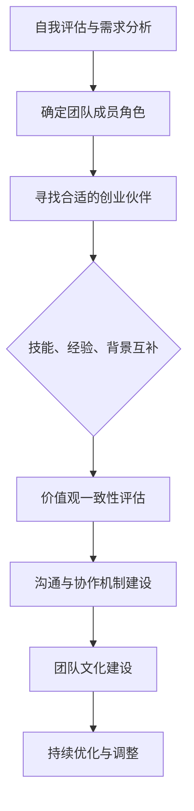
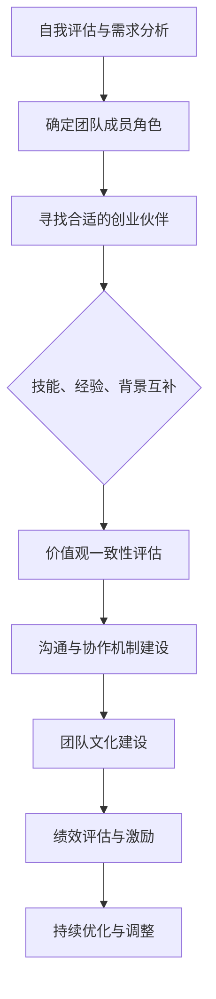
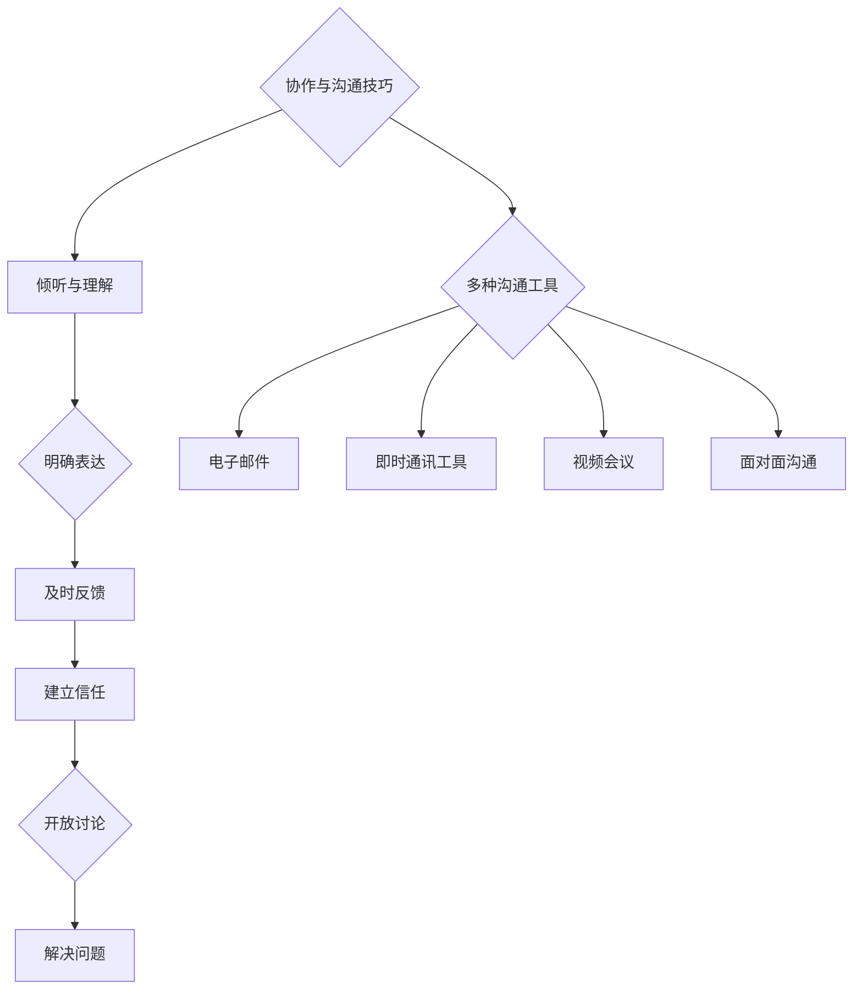
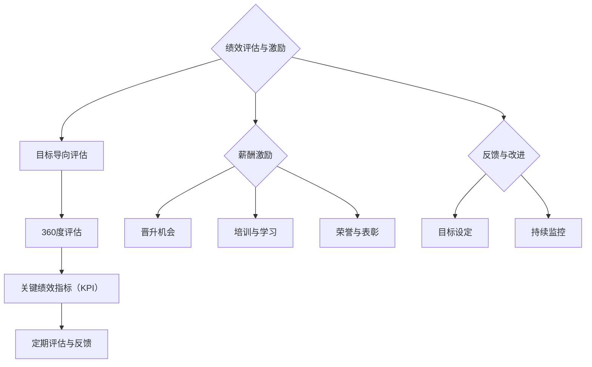

                 

## 文章标题

### 程序员如何选择创业伙伴：建立互补型团队

## 关键词

- 创业伙伴选择
- 互补型团队
- 创业成功
- 团队合作
- 沟通与协作
- 团队管理
- 创业资源

## 摘要

在技术日新月异的今天，程序员投身创业已成为一种趋势。然而，成功的创业不仅仅依赖于技术和产品，还需要一个高效互补的团队。本文将详细探讨程序员如何选择创业伙伴，如何构建一个互补型团队，以及如何通过有效的沟通与合作来推动创业项目的成功。通过分析自我评估与需求分析、互补型团队概念与原则、团队沟通与合作，再到团队运营与管理，本文将提供一系列实用的策略和案例，帮助程序员在创业道路上走得更远。

## 目录

### 第一部分：创业伙伴选择基础

1. **创业伙伴选择的重要性**  
   - 1.1 创业伙伴的重要性分析  
   - 1.2 选择创业伙伴的挑战与机遇  
   - 1.3 成功创业伙伴关系的特点

2. **自我评估与需求分析**  
   - 2.1 自我能力评估  
   - 2.2 职业目标和价值观  
   - 2.3 创业需求分析

### 第二部分：互补型团队构建

1. **互补型团队概念与原则**  
   - 3.1 互补型团队定义  
   - 3.2 互补型团队构建原则  
   - 3.3 Mermaid 流程图：互补型团队构建流程

2. **寻找互补型创业伙伴**  
   - 4.1 网络资源与社交平台  
   - 4.2 行业论坛与线下活动  
   - 4.3 参考成功创业故事与案例

3. **创业伙伴沟通与合作**  
   - 5.1 沟通的重要性  
   - 5.2 有效沟通技巧  
   - 5.3 团队协作与冲突解决

### 第三部分：互补型团队运营与管理

1. **互补型团队文化建设**  
   - 6.1 企业文化的定义与作用  
   - 6.2 团队文化建设策略  
   - 6.3 员工参与与反馈机制

2. **互补型团队绩效评估与激励**  
   - 7.1 绩效评估方法  
   - 7.2 激励机制设计  
   - 7.3 绩效改进与反馈

3. **案例分析与实战经验**  
   - 8.1 成功创业案例分享  
   - 8.2 创业失败案例分析  
   - 8.3 实战经验总结与启示

### 附录

- 附录A：创业资源与工具介绍
- 附录B：互补型团队构建流程图

### 结束语

作者：AI天才研究院/AI Genius Institute & 禅与计算机程序设计艺术/Zen And The Art of Computer Programming

## 第一部分：创业伙伴选择基础

### 第1章：创业伙伴选择的重要性

#### 1.1 创业伙伴的重要性分析

在创业过程中，选择合适的伙伴至关重要。创业伙伴不仅是你事业的合伙人，更是你在创业路上的引路人和支持者。以下是创业伙伴选择的重要性分析：

- **资源共享**：创业伙伴可以带来不同的资源，包括资金、人脉、技术和市场等。这些资源的互补可以大大提升创业成功的几率。

- **能力互补**：每个创业者都有其擅长的领域和不足。选择能力互补的伙伴，可以让团队在各个领域都具备优势，提高整体效率。

- **价值观一致性**：共同的价值观是创业伙伴之间长期合作的基础。如果价值观不一致，可能会导致创业过程中的矛盾和分歧，影响团队的稳定性。

- **心理支持**：创业是一条充满挑战的道路，需要面对各种压力和困难。一个理解和支持你的创业伙伴可以给你提供强大的心理支持，帮助你度过难关。

- **决策合力**：创业决策往往需要多方面的考虑，一个高效的团队可以在决策过程中提供不同的观点和意见，共同制定出最优的决策方案。

#### 1.2 选择创业伙伴的挑战与机遇

选择创业伙伴并非易事，其中既有机遇也有挑战：

- **机遇**：合适的创业伙伴可以带来新的思维和创意，激发团队的创新潜力。他们可以帮助你开拓新的市场，提高产品的竞争力。

- **挑战**：创业伙伴之间的合作也可能带来挑战。不同的背景、经验和思维方式可能导致意见分歧，甚至产生矛盾。如何在尊重差异的同时实现合作，是创业团队面临的挑战。

#### 1.3 成功创业伙伴关系的特点

成功的创业伙伴关系通常具备以下特点：

- **信任与尊重**：创业伙伴之间需要建立深厚的信任，相互尊重对方的意见和决策。

- **共同目标**：明确的共同目标是创业团队前进的动力。所有成员都应该围绕这一目标努力，避免个人利益冲突。

- **有效沟通**：高效的沟通是创业团队成功的关键。团队成员需要通过有效沟通来解决问题，协调行动。

- **能力互补**：每个成员都应在其擅长的领域发挥作用，共同提升团队的整体能力。

- **相互支持**：在创业过程中，成员之间需要相互支持，共同面对困难和挑战。

通过以上分析，我们可以看到选择合适的创业伙伴对于创业项目的成功至关重要。接下来，我们将深入探讨如何进行自我评估与需求分析，以更好地选择创业伙伴。

### 第2章：自我评估与需求分析

#### 2.1 自我能力评估

在创业之前，程序员首先需要对自己的能力进行全面评估。自我能力评估是选择创业伙伴的重要基础，有助于确定自己在团队中的角色和职责。

- **技术能力**：程序员需要评估自己在编程、算法、数据库、前端和后端技术等方面的能力。了解自己的技术强项和弱点，可以帮助你更准确地选择互补的创业伙伴。

- **项目管理能力**：除了技术能力，程序员还需要具备一定的项目管理能力，包括时间管理、任务分配和风险控制等。这些能力在创业过程中至关重要，能够帮助你更好地管理团队和项目进度。

- **团队协作能力**：创业往往需要高效的团队协作。程序员需要评估自己在团队中的协作能力，包括沟通技巧、合作意识和解决问题的能力。一个善于合作的程序员更容易融入团队，实现共同目标。

- **领导能力**：在某些情况下，程序员可能需要承担领导责任，带领团队前进。因此，评估自己的领导能力，包括决策能力、激励能力和团队管理能力，也非常重要。

#### 2.2 职业目标和价值观

职业目标和价值观是选择创业伙伴的重要依据。一个明确的职业目标和一致的价值观可以帮助你和创业伙伴在创业过程中保持一致，避免分歧和冲突。

- **职业目标**：程序员需要明确自己的职业目标，包括长期和短期的目标。例如，是希望创业实现财务自由，还是希望通过创业积累更多的行业经验。明确的目标可以帮助你选择与你有相同志向的创业伙伴。

- **价值观**：价值观是个人信念和行为准则的集合，对于创业伙伴的选择至关重要。程序员需要思考自己的价值观，包括对工作态度、团队合作、客户服务和道德标准的看法。选择与你有相似价值观的创业伙伴，可以减少内部矛盾，增强团队的凝聚力。

#### 2.3 创业需求分析

在自我评估和职业目标确定后，程序员需要分析创业的具体需求，包括技术需求、资源需求和市场需求等。

- **技术需求**：创业者需要根据产品定位和市场需求，分析所需的技术领域和技能。例如，如果产品需要强大的后端支持，那么团队中需要有擅长后端开发的成员。

- **资源需求**：创业初期，资源往往是一个重要限制因素。程序员需要分析创业所需的资金、人才、技术设备和市场渠道等资源，并根据这些需求来选择合适的创业伙伴。

- **市场需求**：市场需求是创业成功的关键。程序员需要分析目标市场的规模、竞争状况和潜在客户的需求，以确保创业项目具有市场前景。

通过自我评估与需求分析，程序员可以更清晰地了解自己的优势和不足，明确职业目标和创业需求，从而选择合适的创业伙伴。这一过程不仅有助于提高创业成功的几率，也有助于构建一个高效互补的团队。接下来，我们将进一步探讨互补型团队的概念与原则。

### 第3章：互补型团队概念与原则

#### 3.1 互补型团队定义

互补型团队是指在成员之间具有不同技能、经验、背景和视角的团队，通过相互补充和协作，共同实现团队目标。互补型团队的核心在于每个成员都能发挥自己的专长，同时填补其他成员的不足，形成一个完整、高效的团队。

一个典型的互补型团队可能包括以下角色：

- **技术专家**：负责产品的技术设计和开发，通常在某一技术领域有深厚的知识和经验。
- **产品经理**：负责产品规划、需求分析和市场定位，确保产品能够满足市场需求。
- **市场营销人员**：负责市场调研、推广活动和客户关系管理，帮助产品获得市场份额。
- **财务专家**：负责财务管理、预算控制和资金筹集，确保公司财务健康。
- **运营经理**：负责日常运营、团队管理和业务流程优化，提高团队效率和生产力。

#### 3.2 互补型团队构建原则

构建互补型团队需要遵循以下原则：

- **技能互补**：团队成员应具备不同的技能和专长，以确保团队在各个领域都有相应的专业支持。
- **经验互补**：团队成员应具备不同的工作经验，包括行业经验、项目管理和领导经验等，以增强团队的整体能力。
- **背景互补**：团队成员应来自不同的背景，包括教育背景、工作背景和文化背景等，以带来多样化的思维和观点。
- **视角互补**：团队成员应具备不同的视角和看待问题的角度，以促进创新和问题解决。
- **价值观一致性**：团队成员应具备相似的价值观和信念，以确保团队在目标和发展方向上保持一致。

#### 3.3 Mermaid 流程图：互补型团队构建流程

为了更好地理解互补型团队的构建过程，我们可以使用Mermaid流程图来展示。以下是一个简化的互补型团队构建流程图：

通过这个流程图，我们可以看到互补型团队的构建需要从自我评估与需求分析开始，逐步确定团队成员的角色，并确保团队成员在技能、经验、背景和价值观方面互补。同时，团队还需要建立有效的沟通与协作机制，以及持续进行团队文化的建设和优化。

### 第4章：寻找互补型创业伙伴

#### 4.1 网络资源与社交平台

在寻找互补型创业伙伴的过程中，网络资源和社交平台是一个重要的渠道。通过这些平台，程序员可以接触到不同领域的人才，扩展自己的社交网络。

- **专业社交网站**：如LinkedIn、GitHub等，这些平台汇集了大量专业人才，程序员可以通过查找感兴趣的领域和技能来寻找合适的创业伙伴。
- **技术社区和论坛**：如Stack Overflow、CSDN等，这些社区汇聚了大量技术讨论和项目合作的机会，程序员可以通过参与讨论和项目合作来结识志同道合的伙伴。
- **创业者社交活动**：如创业沙龙、创业大赛等，这些活动为程序员提供了与创业者面对面交流的机会，可以深入了解创业伙伴的背景和价值观。

#### 4.2 行业论坛与线下活动

行业论坛和线下活动是程序员寻找互补型创业伙伴的另一个重要途径。通过参加这些活动，程序员不仅可以了解行业动态，还可以结识到具有相似兴趣和目标的创业者。

- **行业论坛**：如全球软件开发大会（GDC）、互联网大会等，这些论坛通常汇集了行业内的专家和创业者，程序员可以通过听取演讲和参与讨论来扩展自己的视野。
- **创业孵化器和加速器**：如Y Combinator、Techstars等，这些机构通常提供创业培训、资源对接和融资机会，程序员可以通过参加孵化器和加速器的项目来结识潜在的创业伙伴。
- **线下聚会和沙龙**：如技术沙龙、创业分享会等，这些活动为程序员提供了一个交流和学习的机会，可以通过互动和合作来找到合适的创业伙伴。

#### 4.3 参考成功创业故事与案例

通过参考成功创业故事和案例，程序员可以了解成功的创业伙伴是如何选择和合作的，从而为自己的创业过程提供借鉴和启示。

- **成功创业故事**：如Airbnb、Uber等，这些成功的创业案例展示了互补型团队的重要性。程序员可以通过阅读这些故事，了解创业伙伴之间的合作方式和价值观。
- **创业失败案例**：创业并非一帆风顺，失败案例同样具有重要的教育意义。通过分析创业失败的原因，程序员可以避免在创业过程中重蹈覆辙。
- **学习交流**：参加创业讲座、研讨会和读书会等活动，与其他创业者交流经验和心得，可以为自己的创业之路提供宝贵的建议。

通过以上方法，程序员可以更有效地寻找互补型创业伙伴，构建一个高效、协作的团队，为创业项目的成功奠定基础。接下来，我们将深入探讨创业伙伴之间的沟通与合作。

### 第5章：创业伙伴沟通与合作

#### 5.1 沟通的重要性

在创业过程中，沟通是团队合作的核心。有效的沟通不仅能够确保团队成员之间信息流通，还能增强团队的凝聚力和协作效率。以下是沟通在创业中的重要性：

- **信息共享**：创业伙伴之间需要及时分享信息，包括项目进展、市场动态、技术难题等。只有通过有效沟通，才能确保每个成员都能了解到最新的情况。
- **减少误解**：沟通不足容易导致误解和冲突。通过定期会议和即时沟通，可以确保所有成员对项目的目标和方向保持一致。
- **激发创新**：多样化的沟通方式可以激发团队成员的创新思维。通过讨论、头脑风暴和反馈，可以集思广益，找到更好的解决方案。
- **提高效率**：有效的沟通能够减少重复工作和资源浪费，提高团队的执行效率。

#### 5.2 有效沟通技巧

为了实现高效沟通，创业伙伴需要掌握一些有效的沟通技巧：

- **倾听**：倾听是沟通的重要环节。创业伙伴应该学会倾听对方的观点和意见，而不是一味地发表自己的看法。通过倾听，可以更好地理解对方的想法，找到共同点。
- **明确表达**：在沟通时，要尽量使用简单清晰的语言，避免使用专业术语或模糊的表达。这样可以确保信息传递的准确性和有效性。
- **及时反馈**：沟通不仅仅是信息的传递，还需要及时反馈。创业伙伴应该对对方的意见和决策给予及时反馈，以便调整和改进。
- **建立信任**：建立信任是有效沟通的基础。创业伙伴之间应该相互信任，尊重对方的意见和决策，这样才能在合作中保持和谐。
- **使用多种沟通工具**：根据不同的场景和需求，可以使用会议、邮件、即时通讯工具等多种沟通方式，以确保信息传递的及时性和有效性。

#### 5.3 团队协作与冲突解决

团队协作是创业成功的关键，但协作过程中难免会出现冲突。以下是一些解决团队协作中冲突的方法：

- **识别冲突原因**：冲突往往源于误解、目标不一致或资源分配问题。创业伙伴应该积极沟通，识别冲突的根本原因。
- **开放讨论**：在解决冲突时，要鼓励开放讨论，让每个成员都能表达自己的观点。通过讨论，可以找到解决问题的最佳方案。
- **寻求第三方协助**：在某些情况下，冲突可能难以自行解决。这时，可以寻求第三方协助，如咨询顾问、法律顾问等，以中立的角度提供解决方案。
- **制定冲突解决机制**：为了预防冲突，创业伙伴可以制定一套冲突解决机制，明确处理冲突的流程和规则。这样，当冲突发生时，可以按照既定的机制进行处理。

通过有效的沟通和协作，创业伙伴可以克服困难，共同推动创业项目的成功。在接下来的章节中，我们将进一步探讨互补型团队的运营与管理。

### 第6章：互补型团队文化建设

#### 6.1 企业文化的定义与作用

企业文化是指企业在长期经营过程中形成的共同价值观、信仰、行为规范和工作方式。它是企业内部的一种软实力，对于企业的长远发展具有重要意义。

- **共同价值观**：企业文化体现了企业成员的共同价值观和信仰，是团队成员共同追求的目标和原则。共同价值观能够增强团队的凝聚力和归属感。
- **行为规范**：企业文化规范了员工的行为和沟通方式，确保团队成员在合作中保持一致，提高工作效率。
- **工作方式**：企业文化影响了企业的工作氛围和工作方式，包括决策流程、项目管理、创新思维等，有助于企业形成独特的竞争优势。

#### 6.2 团队文化建设策略

为了构建一个健康、积极的企业文化，互补型团队需要采取以下策略：

- **明确价值观**：团队需要明确自己的核心价值观，并将其贯穿于日常工作和决策中。例如，可以制定一些简单的原则，如“客户至上”、“创新为本”等。
- **领导示范**：领导层的言行举止对团队文化有重要影响。领导层应该以身作则，践行企业价值观，成为团队成员的榜样。
- **员工参与**：企业文化不仅仅是领导层的责任，每个员工都应该参与其中。可以通过员工座谈会、企业文化活动等方式，让员工参与到企业文化建设中来。
- **激励机制**：建立一套激励机制，鼓励员工践行企业文化，例如通过绩效考核、员工表彰等方式，让员工感受到企业文化的实际价值。
- **持续传播**：企业文化需要持续传播和强化。可以通过培训、内部通讯、企业文化活动等方式，不断传递企业价值观和行为规范。

#### 6.3 员工参与与反馈机制

员工参与和反馈是企业文化建设的重要组成部分。通过员工参与和反馈，企业可以更好地了解员工的感受和需求，不断优化企业文化。

- **员工参与**：企业可以设立员工参与机制，如员工代表会议、员工提案制度等，让员工在决策过程中有发言权和影响力。这样不仅能够增强员工的归属感，还能促进团队的合作和创新。
- **反馈机制**：企业需要建立有效的反馈机制，让员工能够自由表达意见和建议。可以通过员工满意度调查、定期反馈会议等方式，收集员工的反馈，并及时回应和改进。
- **开放式沟通**：企业应该营造一个开放、包容的沟通环境，鼓励员工表达自己的观点和意见。通过开放式沟通，企业可以及时发现和解决问题，增强团队的凝聚力和协作效率。

通过企业文化建设和员工参与与反馈机制，互补型团队可以形成一个积极、健康的工作氛围，提高团队的整体绩效和创业成功率。在接下来的章节中，我们将进一步探讨互补型团队的绩效评估与激励。

### 第7章：互补型团队绩效评估与激励

#### 7.1 绩效评估方法

有效的绩效评估是互补型团队管理的重要环节。通过绩效评估，团队可以了解每个成员的工作表现，发现优点和不足，并为后续的工作提供指导和改进的方向。

- **目标导向评估**：将团队和个人的工作目标明确化，并定期评估目标的完成情况。这种方法可以帮助团队成员明确自己的职责和期望，提高工作的针对性和效率。
- **360度评估**：通过收集团队成员、上级、同事和客户的反馈，对成员的工作表现进行全面评估。这种方法可以提供多角度的视角，更全面地了解成员的优势和改进空间。
- **关键绩效指标（KPI）**：根据团队和个人的工作目标，设定一系列可量化的关键绩效指标。例如，项目完成进度、代码质量、客户满意度等。通过这些指标，可以客观评估成员的工作表现。
- **定期评估与反馈**：定期进行绩效评估，并及时给予反馈。这样可以及时发现问题，帮助成员改进工作方法，提高绩效。

#### 7.2 激励机制设计

为了保持团队成员的积极性和创造力，有效的激励机制至关重要。以下是一些常见的激励机制设计方法：

- **薪酬激励**：根据团队成员的绩效表现，设定有竞争力的薪酬水平。薪酬激励可以提升成员的工作动力，增强团队凝聚力。
- **晋升机会**：为团队成员提供晋升和发展机会，让他们看到自己的职业前景。晋升激励能够激发成员的职业发展动力，提高团队的整体水平。
- **培训与学习**：为团队成员提供培训和学习机会，帮助他们提升技能和知识。培训激励不仅能够提高成员的专业水平，还能增强团队的竞争力。
- **荣誉与表彰**：定期对表现优异的团队成员进行表彰和奖励，例如颁发奖项、举行庆祝活动等。荣誉激励可以增强成员的荣誉感和归属感，提高团队士气。

#### 7.3 绩效改进与反馈

绩效改进与反馈是绩效管理的重要环节。通过持续改进和反馈，团队可以不断提升绩效，实现长期发展。

- **目标设定**：在绩效评估的基础上，与团队成员共同设定下一个阶段的工作目标。目标设定要具有挑战性，同时要确保可行。
- **持续监控**：在目标实施过程中，定期监控和评估目标的完成情况。通过监控，可以及时发现和解决问题，确保目标的顺利实现。
- **反馈与改进**：在目标完成后，及时进行绩效反馈，总结成功经验和不足之处。通过反馈，可以找到改进的方向，为下一个阶段的工作提供参考。
- **持续改进**：将绩效改进纳入团队的日常工作，通过不断优化工作流程和方法，提高团队的效率和绩效。

通过绩效评估与激励机制的建立和执行，互补型团队可以更好地发挥每个成员的优势，提高整体绩效，推动创业项目的成功。在接下来的章节中，我们将通过案例分析和实战经验，进一步探讨互补型团队构建和运营的实际应用。

### 第8章：案例分析与实战经验

#### 8.1 成功创业案例分享

在探讨互补型团队构建的过程中，参考一些成功的创业案例可以为我们提供宝贵的经验和启示。

**案例一：Airbnb**

Airbnb的创始人布莱恩·切斯基（Brian Chesky）和乔·杰比亚（Joe Gebbia）是一对互补的创业伙伴。切斯基擅长产品设计和市场推广，而杰比亚则精通技术和用户体验。他们在共同创办Airbnb之前，曾在设计公司工作，这为他们的合作奠定了坚实的基础。

- **互补型团队构建**：在团队构建过程中，Airbnb注重技能互补和价值观一致性。切斯基和杰比亚不仅在技能上互补，而且在创业理念和价值观上高度一致。
- **成功因素**：Airbnb的成功在于他们能够快速响应市场变化，不断创新和优化产品。同时，他们也非常重视用户体验，通过简洁、直观的设计和流程，赢得了大量用户。
- **经验总结**：这个案例告诉我们，创业伙伴之间的互补性是构建成功团队的关键。在价值观上保持一致，能够减少内部矛盾，提高团队的凝聚力。

**案例二：Uber**

Uber的创始人特拉维斯·卡兰尼克（Travis Kalanick）和加布·坦库尔（Garrett Camp）也是一个互补型团队。卡兰尼克擅长市场推广和商务拓展，而坦库尔则擅长技术和产品设计。

- **互补型团队构建**：Uber在团队构建过程中，注重技能互补和经验互补。卡兰尼克和坦库尔不仅在技能上互补，而且在创业经验和商业思维上各有所长。
- **成功因素**：Uber的成功在于他们抓住了共享经济的机遇，创新了出行服务模式，并通过强大的市场推广和品牌建设，迅速占领市场。
- **经验总结**：这个案例告诉我们，创业伙伴之间的互补性不仅包括技能上的互补，还包括经验上的互补。通过不同背景和经验的互补，团队可以更好地应对市场变化和挑战。

#### 8.2 创业失败案例分析

虽然成功的创业案例能为我们提供很多启示，但创业失败同样具有教育意义。以下是一些失败的创业案例，我们可以从中吸取教训。

**案例一：Color**

Color是一款试图通过自动拍摄和分享照片来改变社交互动的移动应用。然而，这款应用在市场上并未获得成功。

- **失败原因**：Color的失败在于其产品定位模糊，缺乏明确的市场目标。此外，应用的功能复杂，用户体验不佳，导致用户流失。
- **教训总结**：这个案例告诉我们，创业项目需要明确的市场定位和用户需求。只有通过深入了解市场，才能开发出用户真正需要的产品。

**案例二：Pandora**

Pandora是一个在线音乐流媒体平台，曾经一度非常受欢迎。然而，由于缺乏有效的商业模式和用户体验问题，Pandora最终走向失败。

- **失败原因**：Pandora的失败在于其商业模式不清晰，盈利模式单一，并且在用户体验方面存在缺陷，导致用户流失。
- **教训总结**：这个案例告诉我们，创业项目不仅需要有创新的技术和产品，还需要有清晰的商业模式和用户体验。只有通过这些因素的综合作用，才能实现长期成功。

#### 8.3 实战经验总结与启示

通过以上案例，我们可以总结出一些实用的经验和启示：

1. **互补型团队的重要性**：创业伙伴之间的互补性是构建成功团队的关键。通过技能互补和经验互补，团队可以更好地应对各种挑战。
2. **市场定位和用户需求**：明确的市场定位和用户需求是创业成功的基础。只有通过深入了解市场，才能开发出用户真正需要的产品。
3. **商业模式和用户体验**：清晰的商业模式和优质的用户体验是创业项目的生命力。创业项目需要在这两个方面下功夫，才能赢得用户的青睐。
4. **持续创新和优化**：市场环境和用户需求是不断变化的，创业团队需要持续创新和优化产品，以适应市场的变化和用户的需求。

通过这些实战经验和教训，程序员在创业过程中可以更好地构建互补型团队，提高创业成功率。在接下来的章节中，我们将进一步探讨互补型团队的运营与管理。

### 附录A：创业资源与工具介绍

#### A.1 创业服务平台

创业服务平台是创业者获取资源、培训和资金的重要渠道。以下是一些知名的创业服务平台：

- **Techstars**：Techstars是一家全球性的创业加速器，提供资金、导师资源和网络支持，帮助创业者加速成长。
- **Y Combinator**：Y Combinator是全球知名的创业加速器，每年挑选一批有潜力的初创企业进行投资和孵化，提供资金、指导和资源。
- **创业孵化器**：如北京创业孵化器、上海张江高科技孵化器等，这些孵化器提供办公空间、资金、技术和市场资源，帮助初创企业成长。

#### A.2 投资人与投资人关系

投资者是创业者的重要合作伙伴，建立良好的投资人关系对创业成功至关重要。以下是一些建立和维护投资人关系的策略：

- **明确沟通**：与投资人保持定期沟通，及时报告项目进展和遇到的问题。
- **尊重投资人的意见**：尊重投资人的建议和意见，即使在某些问题上存在分歧，也要保持开放的态度。
- **诚信与透明**：保持诚信，提供真实的项目数据和财务状况，建立信任基础。
- **回报投资者**：在项目成功时，合理回报投资者的投入，兑现承诺的回报。

#### A.3 创业书籍与在线课程推荐

阅读创业相关的书籍和在线课程，可以帮助创业者获取知识、经验和灵感。以下是一些推荐的创业书籍和在线课程：

- **书籍**：
  - 《创业维艰》（“Hard Things About Hard Things”）- Ben Horowitz
  - 《精益创业》（“The Lean Startup”）- Eric Ries
  - 《创业圣经》（“The Startup Owner's Manual”）- Steve Blank
  
- **在线课程**：
  - **Coursera**：提供各种创业相关课程，如“Startup Engineering”等。
  - **edX**：edX上有许多顶级大学提供的创业课程，如“Entrepreneurship: Success and Failure”等。
  - **Udemy**：提供大量的创业实战课程，适合不同层次的需求。

通过利用这些创业资源和工具，程序员可以更好地规划和管理创业项目，提高成功几率。

### 附录B：互补型团队构建流程图

#### B.1 团队建设流程图

以下是一个互补型团队构建的流程图，展示了从自我评估到团队协作的各个步骤：

#### B.2 团队协作与沟通技巧图解

以下是一个简化的团队协作与沟通技巧图解，展示了不同情境下的沟通策略：

#### B.3 团队绩效评估与激励策略图解

以下是一个简化的团队绩效评估与激励策略图解，展示了绩效评估和激励机制的设计：

通过这些图解，我们可以更直观地了解互补型团队的构建、协作和绩效管理过程。这些工具和方法不仅有助于团队成员之间的沟通与合作，还能提升团队的绩效和创业成功率。

