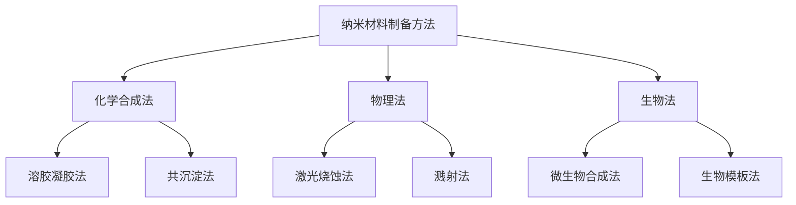

                 


### 第1章：纳米技术的概述

#### 1.1 纳米技术的定义与特点

纳米技术是指通过控制物质在纳米尺度（1到100纳米）上的结构和功能来创建新的材料、器件和系统的科学技术。纳米技术的重要性在于它能够显著改变材料的性能，使其在电子、生物医学、能源和环境等领域具有独特的应用潜力。

纳米技术的定义主要包括以下方面：

- **纳米尺度**：指物质在1到100纳米的尺寸范围内。
- **表面效应**：纳米颗粒的表面积相对于其体积显著增加，导致其物理和化学性质发生变化。
- **量子效应**：当物质的尺寸接近或小于其特征长度时，量子效应将变得显著，从而影响其电子性质。
- **宏观量子隧道效应**：纳米尺度下的粒子可以穿越宏观障碍，这一效应被广泛应用于纳米电子学。

纳米材料的特点如下：

- **高比表面积**：纳米颗粒具有极高的比表面积，使其具有更高的反应活性。
- **独特的光学性质**：纳米材料在可见光到红外光区域具有独特的吸收和散射性质。
- **高催化活性**：纳米颗粒由于其高比表面积和量子效应，具有更高的催化活性。
- **高热导性**：某些纳米材料如碳纳米管具有优异的热导性。
- **生物相容性**：纳米材料可以被生物体吸收，在生物医学领域有广泛的应用。

纳米技术在材料科学中的重要性体现在以下几个方面：

- **材料设计**：纳米技术使得材料的设计和合成变得更加精确，可以创造出具有特定性能的材料。
- **性能优化**：通过调整纳米材料的结构和尺寸，可以优化材料的物理、化学和生物性能。
- **新材料的发现**：纳米技术可以揭示传统材料无法表现出的新性质，为新材料的发现提供了可能。
- **交叉学科应用**：纳米技术与其他领域如电子学、生物学、医学、能源和环境科学的交叉融合，推动了新技术和新产业的产生。

#### 1.2 纳米材料的基本类型

纳米材料可以根据其组成和特性进行分类。以下是几种常见的纳米材料类型：

- **金属纳米材料**：金属纳米材料通常具有优异的光学、电学和磁学性质。例如，金纳米粒子在生物成像和催化中具有广泛的应用。

- **半导体纳米材料**：半导体纳米材料如量子点具有独特的光电性质，被广泛应用于光电子学和生物医学领域。

- **碳纳米材料**：碳纳米材料如碳纳米管和石墨烯具有高机械强度、电导性和热导性，在纳米电子学和复合材料中具有重要应用。

- **聚合物纳米材料**：聚合物纳米材料如纳米复合物和纳米粒子具有良好的生物相容性和可调控性，在药物输送和环境治理中具有潜力。

#### 1.3 纳米材料的应用领域

纳米材料在多个领域展示了其独特的应用潜力：

- **电子与信息技术**：纳米材料在电子器件、光电子学和纳米电子学中具有广泛应用。例如，纳米线可以被用于制造高效太阳能电池和场效应晶体管。

- **生物医学**：纳米材料在药物输送、生物成像和治疗中具有重要应用。例如，纳米颗粒可以作为药物载体，提高药物的靶向性和生物利用度。

- **能源**：纳米材料在可再生能源技术中具有重要作用。例如，纳米材料可以用于提高太阳能电池的光电转换效率和锂离子电池的能量密度。

- **环保**：纳米材料在污染控制和环境监测中具有潜力。例如，纳米颗粒可以用于吸附和分解有害物质，提高环境治理效果。

- **其他领域**：纳米材料还在涂料、化妆品、食品包装等领域有广泛的应用。

### 摘要

纳米技术是指通过控制物质在纳米尺度上的结构和功能来创建新的材料、器件和系统的科学技术。本章概述了纳米技术的定义与特点，介绍了纳米材料的基本类型以及其在电子与信息技术、生物医学、能源和环境等领域的广泛应用。纳米技术的重要性在于其能够显著改变材料的性能，推动新技术和新产业的产生。

### 第2章：纳米材料制备技术

#### 2.1 纳米材料制备方法

纳米材料的制备方法可以分为化学合成法、物理法和生物法。每种方法都有其独特的优势和适用场景。

##### 2.1.1 化学合成法

化学合成法是通过化学反应合成纳米材料。该方法包括溶胶凝胶法、共沉淀法、水热合成法、电化学沉积法等。

- **溶胶凝胶法**：通过溶胶凝胶过程将前驱体转化为纳米材料。该方法具有制备过程简单、产物纯度高、尺寸可控等优点，适用于制备金属氧化物、金属有机框架等纳米材料。

  ```mermaid
  graph TD
      A[溶胶凝胶法] --> B[前驱体溶胶化]
      B --> C[凝胶化]
      C --> D[干燥和烧结]
      D --> E[纳米材料]
  ```

- **共沉淀法**：通过在溶液中同时沉淀出纳米颗粒。该方法适用于制备氧化物、硫化物等复合纳米材料。

  ```mermaid
  graph TD
      A[共沉淀法] --> B[溶液混合]
      B --> C[沉淀反应]
      C --> D[洗涤和干燥]
      D --> E[纳米材料]
  ```

- **水热合成法**：在高温高压的水热条件下合成纳米材料。该方法适用于制备钛酸钡、氧化锌等纳米材料。

  ```mermaid
  graph TD
      A[水热合成法] --> B[高温高压反应]
      B --> C[纳米材料沉淀]
      C --> D[产物分离]
      D --> E[纳米材料]
  ```

- **电化学沉积法**：通过电化学反应在电极表面沉积纳米材料。该方法适用于制备铜、镍等金属纳米材料。

  ```mermaid
  graph TD
      A[电化学沉积法] --> B[电解液准备]
      B --> C[电极反应]
      C --> D[沉积反应]
      D --> E[纳米材料]
  ```

##### 2.1.2 物理法

物理法通过物理过程制备纳米材料。该方法包括激光烧蚀法、溅射法、模板合成法等。

- **激光烧蚀法**：利用激光将靶材烧蚀成纳米颗粒。该方法适用于制备金属、合金等纳米材料。

  ```mermaid
  graph TD
      A[激光烧蚀法] --> B[激光照射]
      B --> C[靶材烧蚀]
      C --> D[气体携带]
      D --> E[纳米颗粒]
  ```

- **溅射法**：利用高能离子束撞击靶材，使其溅射出纳米颗粒。该方法适用于制备金属、陶瓷等纳米材料。

  ```mermaid
  graph TD
      A[溅射法] --> B[离子源]
      B --> C[离子撞击]
      C --> D[靶材溅射]
      D --> E[纳米颗粒]
  ```

- **模板合成法**：利用模板限制纳米颗粒的生长，制备特定结构的纳米材料。该方法适用于制备纳米线、纳米孔等纳米材料。

  ```mermaid
  graph TD
      A[模板合成法] --> B[模板制备]
      B --> C[纳米颗粒生长]
      C --> D[模板去除]
      D --> E[纳米材料]
  ```

##### 2.1.3 生物法

生物法利用生物体系合成纳米材料。该方法包括微生物合成法、植物合成法等。

- **微生物合成法**：利用微生物合成纳米材料。该方法适用于制备金属纳米粒子、生物活性纳米材料等。

  ```mermaid
  graph TD
      A[微生物合成法] --> B[微生物培养]
      B --> C[纳米材料合成]
      C --> D[产物分离]
      D --> E[纳米材料]
  ```

- **植物合成法**：利用植物合成纳米材料。该方法适用于制备纳米颗粒、纳米纤维等。

  ```mermaid
  graph TD
      A[植物合成法] --> B[植物培养]
      B --> C[纳米材料合成]
      C --> D[产物分离]
      D --> E[纳米材料]
  ```

#### 2.2 纳米材料表征技术

纳米材料的表征技术用于分析其尺寸、形态、组成和性质。常用的表征技术包括电子显微镜、光学显微镜和表面分析技术。

##### 2.2.1 电子显微镜

电子显微镜（EM）是一种用于观察纳米材料的高分辨率成像技术。根据加速电压的不同，电子显微镜可以分为透射电子显微镜（TEM）和扫描电子显微镜（SEM）。

- **透射电子显微镜（TEM）**：TEM利用电子束穿过样品，通过成像板或数字探测器捕获图像。TEM具有非常高的分辨率，可以观察到纳米颗粒的内部结构。

  ```mermaid
  graph TD
      A[TEM] --> B[电子束照射]
      B --> C[透射电子]
      C --> D[成像板捕获]
      D --> E[图像分析]
  ```

- **扫描电子显微镜（SEM）**：SEM利用电子束在样品表面进行扫描，产生二次电子、X射线等信号，通过探测器捕获信号并生成图像。SEM具有较宽的样品兼容性，可以观察到样品的表面形貌。

  ```mermaid
  graph TD
      A[SEM] --> B[电子束扫描]
      B --> C[信号捕获]
      C --> D[图像生成]
      D --> E[表面形貌分析]
  ```

##### 2.2.2 光学显微镜

光学显微镜是一种利用可见光波段的成像技术。常用的光学显微镜包括荧光显微镜和拉曼光谱显微镜。

- **荧光显微镜**：荧光显微镜利用荧光染料标记样品，通过激发荧光信号来观察样品。荧光显微镜具有高灵敏度和高分辨率，适用于观察纳米颗粒的荧光性质。

  ```mermaid
  graph TD
      A[荧光显微镜] --> B[荧光染料标记]
      B --> C[激发光照射]
      C --> D[荧光信号捕获]
      D --> E[图像分析]
  ```

- **拉曼光谱显微镜**：拉曼光谱显微镜通过测量拉曼散射信号来分析样品的化学成分和结构。拉曼光谱显微镜适用于观察纳米材料的化学状态和结构特征。

  ```mermaid
  graph TD
      A[拉曼光谱显微镜] --> B[激发光照射]
      B --> C[拉曼散射信号捕获]
      C --> D[光谱分析]
      D --> E[化学成分分析]
  ```

##### 2.2.3 表面分析技术

表面分析技术用于分析纳米材料的表面性质和化学组成。常用的表面分析技术包括X射线光电子能谱（XPS）、原子力显微镜（AFM）等。

- **X射线光电子能谱（XPS）**：XPS通过测量样品表面电子的X射线光电子能谱来分析样品的化学成分和电子状态。XPS具有高表面灵敏度和高分辨率，适用于分析纳米材料的表面性质。

  ```mermaid
  graph TD
      A[XPS] --> B[X射线照射]
      B --> C[光电子能谱分析]
      C --> D[化学成分分析]
      D --> E[电子状态分析]
  ```

- **原子力显微镜（AFM）**：AFM通过测量探针与样品表面之间的力来生成样品表面的三维形貌图像。AFM具有高分辨率，可以观察到纳米颗粒的表面结构和形态。

  ```mermaid
  graph TD
      A[AFM] --> B[探针扫描]
      B --> C[力测量]
      C --> D[三维形貌分析]
      D --> E[表面结构分析]
  ```

#### 2.3 纳米材料的性质调控

纳米材料的性质可以通过多种方法进行调控，包括化学修饰、结构调控和能量调控。

##### 2.3.1 化学修饰

化学修饰是通过在纳米材料表面引入不同的官能团来改变其化学性质。这种修饰方法可以提高纳米材料的生物相容性、水溶性和分散性。

- **表面修饰剂**：通过在纳米材料表面引入修饰剂，如聚合物、蛋白质等，来改变其表面性质。

  ```mermaid
  graph TD
      A[纳米材料] --> B[表面修饰剂]
      B --> C[化学结合]
      C --> D[表面性质改变]
  ```

##### 2.3.2 结构调控

结构调控是通过改变纳米材料的尺寸、形态、晶体结构等来改变其物理和化学性质。

- **尺寸调控**：通过控制合成条件来调节纳米材料的尺寸。例如，通过改变反应时间和温度可以制备不同尺寸的纳米颗粒。

  ```mermaid
  graph TD
      A[反应条件] --> B[纳米材料尺寸]
      B --> C[物理性质变化]
      C --> D[化学性质变化]
  ```

- **形态调控**：通过控制合成方法来制备不同形态的纳米材料。例如，通过改变反应条件可以制备球形、棒状、纳米线等不同形态的纳米材料。

  ```mermaid
  graph TD
      A[反应条件] --> B[纳米材料形态]
      B --> C[物理性质变化]
      C --> D[化学性质变化]
  ```

- **晶体结构调控**：通过控制合成方法来调控纳米材料的晶体结构。例如，通过改变前驱体的组成和反应条件可以制备不同晶体结构的纳米材料。

  ```mermaid
  graph TD
      A[前驱体组成] --> B[纳米材料晶体结构]
      B --> C[物理性质变化]
      C --> D[化学性质变化]
  ```

##### 2.3.3 能量调控

能量调控是通过改变纳米材料的能带结构、电子态等来调节其能量水平。

- **能带结构调控**：通过掺杂或表面修饰来改变纳米材料的能带结构。例如，通过掺杂可以调节纳米材料的电子性质，从而改变其光电性质。

  ```mermaid
  graph TD
      A[掺杂剂] --> B[纳米材料能带结构]
      B --> C[电子性质变化]
      C --> D[光电性质变化]
  ```

- **电子态调控**：通过表面修饰或界面调控来改变纳米材料的电子态。例如，通过表面修饰可以调节纳米材料与基底之间的电子耦合，从而改变其电学性能。

  ```mermaid
  graph TD
      A[表面修饰] --> B[纳米材料电子态]
      B --> C[电学性质变化]
      C --> D[光电性质变化]
  ```

### 伪代码：纳米材料结构调控

```python
def structureControl(nanomaterial, desired_structure):
    if nanomaterial.size != desired_structure.size:
        modify_size(nanomaterial)
    if nanomaterial.shape != desired_structure.shape:
        modify_shape(nanomaterial)
    if nanomaterial.cry

### 第3章：纳米技术在材料科学中的应用

#### 3.1 纳米技术在增强材料中的应用

纳米技术在增强材料中的应用主要体现在填充材料、纳米涂层和纳米复合材料三个方面。这些应用不仅提高了材料的性能，还开创了新的材料设计和制备方法。

##### 3.1.1 填充材料

纳米填充材料是通过在基体材料中引入纳米级别的颗粒来增强其性能。纳米颗粒的引入可以显著提高材料的力学强度、热导性和电导性。

- **力学强度**：纳米颗粒的引入可以增强材料的力学性能。例如，在聚合物基体中引入纳米级的碳纳米管可以显著提高聚合物的拉伸强度和韧性。

  ```mermaid
  graph TD
      A[聚合物基体] --> B[碳纳米管填充]
      B --> C[拉伸强度提高]
      C --> D[韧性提高]
  ```

- **热导性**：纳米颗粒的引入可以显著提高材料的热导性。例如，在金属基体中引入纳米级的碳纳米管可以显著提高金属的热导性。

  ```mermaid
  graph TD
      A[金属基体] --> B[碳纳米管填充]
      B --> C[热导性提高]
  ```

- **电导性**：纳米颗粒的引入可以显著提高材料的电导性。例如，在导电聚合物中引入纳米级的导电颗粒可以显著提高聚合物的电导率。

  ```mermaid
  graph TD
      A[导电聚合物基体] --> B[导电颗粒填充]
      B --> C[电导率提高]
  ```

##### 3.1.2 纳米涂层

纳米涂层技术是通过在材料表面制备纳米级别的涂层来提高其性能。纳米涂层的制备方法包括溶胶凝胶法、物理气相沉积法、化学气相沉积法等。

- **防腐蚀涂层**：纳米涂层可以在材料表面形成一层致密的保护膜，从而提高材料的耐腐蚀性能。例如，在钢铁表面制备纳米氧化铝涂层可以有效防止腐蚀。

  ```mermaid
  graph TD
      A[钢铁表面] --> B[纳米氧化铝涂层]
      B --> C[耐腐蚀性能提高]
  ```

- **耐磨涂层**：纳米涂层可以提高材料的耐磨性。例如，在刀具表面制备纳米级的金刚石涂层可以显著提高刀具的耐磨性。

  ```mermaid
  graph TD
      A[刀具表面] --> B[金刚石涂层]
      B --> C[耐磨性能提高]
  ```

- **防污涂层**：纳米涂层可以降低材料的表面能，从而防止污垢的吸附。例如，在玻璃表面制备纳米级的疏水涂层可以使玻璃表面具有自洁性能。

  ```mermaid
  graph TD
      A[玻璃表面] --> B[纳米疏水涂层]
      B --> C[防污性能提高]
  ```

##### 3.1.3 纳米复合材料

纳米复合材料是将纳米材料与其他材料复合在一起制备的新型材料。纳米复合材料具有优异的力学、热学、电学和光学性能。

- **纳米增强复合材料**：通过在基体材料中引入纳米增强相，可以显著提高复合材料的力学性能。例如，碳纳米管增强的聚合物复合材料具有高强度和高模量。

  ```mermaid
  graph TD
      A[聚合物基体] --> B[碳纳米管增强]
      B --> C[拉伸强度提高]
      C --> D[弹性模量提高]
  ```

- **纳米导电复合材料**：通过在导电聚合物中引入纳米导电颗粒，可以制备具有优异导电性能的复合材料。例如，石墨烯增强的导电聚合物复合材料具有高导电性和电化学活性。

  ```mermaid
  graph TD
      A[导电聚合物基体] --> B[石墨烯增强]
      B --> C[导电性提高]
      C --> D[电化学活性提高]
  ```

- **纳米光子复合材料**：通过在光子晶体中引入纳米结构，可以制备具有特殊光学性能的复合材料。例如，纳米银颗粒增强的光子晶体复合材料具有优异的光吸收和发射性能。

  ```mermaid
  graph TD
      A[光子晶体基体] --> B[纳米银颗粒增强]
      B --> C[光吸收性能提高]
      C --> D[光发射性能提高]
  ```

#### 3.2 纳米技术在功能材料中的应用

纳米技术在功能材料中的应用主要体现在导电材料、超导材料和磁性材料三个方面。这些材料在电子、能源、生物医学等领域具有广泛的应用前景。

##### 3.2.1 导电材料

纳米导电材料具有优异的电学性能，是纳米技术在电子领域的重要应用之一。

- **纳米线导电材料**：纳米线导电材料如碳纳米管、石墨烯纳米线等具有高电导率和良好的机械性能。这些材料可以用于制备高性能的电容器、导电涂层和导电薄膜。

  ```mermaid
  graph TD
      A[碳纳米管纳米线] --> B[高电导率]
      B --> C[导电涂层]
      C --> D[电容器应用]
  ```

- **纳米颗粒导电材料**：纳米颗粒导电材料如金属纳米颗粒、导电聚合物纳米颗粒等具有优异的电化学性能。这些材料可以用于制备高效电池、传感器和导电复合材料。

  ```mermaid
  graph TD
      A[金属纳米颗粒] --> B[高电化学活性]
      B --> C[电池应用]
      C --> D[传感器应用]
  ```

##### 3.2.2 超导材料

纳米超导材料具有独特的超导性能，是纳米技术在能源领域的重要应用之一。

- **纳米超导薄膜**：纳米超导薄膜具有高临界温度和高超导转变温度，可以用于制备高效超导电力设备和超导传输线。

  ```mermaid
  graph TD
      A[纳米超导薄膜] --> B[高临界温度]
      B --> C[超导电力设备]
      C --> D[超导传输线]
  ```

- **纳米超导线材**：纳米超导线材具有高电流密度和低电阻，可以用于制备高效电力输送设备和储能系统。

  ```mermaid
  graph TD
      A[纳米超导线材] --> B[高电流密度]
      B --> C[电力输送设备]
      C --> D[储能系统]
  ```

##### 3.2.3 磁性材料

纳米磁性材料具有独特的磁学性能，是纳米技术在信息存储和生物医学领域的重要应用之一。

- **纳米颗粒磁性材料**：纳米颗粒磁性材料如纳米氧化铁、纳米磁性氧化物等具有高磁化率和良好的磁响应。这些材料可以用于制备高效磁记录材料和生物医学成像剂。

  ```mermaid
  graph TD
      A[纳米颗粒磁性材料] --> B[高磁化率]
      B --> C[磁记录材料]
      C --> D[生物医学成像剂]
  ```

- **纳米线磁性材料**：纳米线磁性材料如纳米磁晶、纳米磁颗粒等具有优异的磁性能和机械性能。这些材料可以用于制备高效磁电转换材料和纳米磁驱动器。

  ```mermaid
  graph TD
      A[纳米线磁性材料] --> B[优异磁性能]
      B --> C[磁电转换材料]
      C --> D[纳米磁驱动器]
  ```

#### 3.3 纳米技术在生物材料中的应用

纳米技术在生物材料中的应用主要体现在生物活性材料、生物降解材料和生物电子材料三个方面。这些材料在生物医学领域具有广泛的应用前景。

##### 3.3.1 生物活性材料

纳米生物活性材料具有优异的生物相容性和生物活性，可以用于组织工程、药物输送和治疗等领域。

- **生物活性纳米颗粒**：生物活性纳米颗粒如生物降解纳米颗粒、生物响应性纳米颗粒等可以用于药物输送和组织工程。

  ```mermaid
  graph TD
      A[生物活性纳米颗粒] --> B[药物输送]
      B --> C[组织工程]
  ```

- **生物活性纳米涂层**：生物活性纳米涂层如生物降解涂层、生物响应性涂层等可以用于医疗器械和生物组织工程材料。

  ```mermaid
  graph TD
      A[生物活性纳米涂层] --> B[医疗器械]
      B --> C[生物组织工程材料]
  ```

##### 3.3.2 生物降解材料

纳米生物降解材料具有优异的生物降解性能，可以用于生物医学和环境治理等领域。

- **纳米生物降解材料**：纳米生物降解材料如纳米纤维素、纳米壳聚糖等可以用于药物控释、环境治理等。

  ```mermaid
  graph TD
      A[纳米生物降解材料] --> B[药物控释]
      B --> C[环境治理]
  ```

- **生物降解纳米复合材料**：生物降解纳米复合材料如纳米纤维素增强的生物降解塑料等可以用于包装材料、医疗器械等。

  ```mermaid
  graph TD
      A[生物降解纳米复合材料] --> B[包装材料]
      B --> C[医疗器械]
  ```

##### 3.3.3 生物电子材料

纳米生物电子材料具有优异的电子性能和生物相容性，可以用于生物传感、生物成像和生物治疗等领域。

- **纳米生物电子传感器**：纳米生物电子传感器如纳米酶传感器、纳米离子传感器等可以用于生物分子的检测。

  ```mermaid
  graph TD
      A[纳米生物电子传感器] --> B[生物分子检测]
  ```

- **纳米生物电子成像剂**：纳米生物电子成像剂如纳米磁性成像剂、纳米荧光成像剂等可以用于生物成像。

  ```mermaid
  graph TD
      A[纳米生物电子成像剂] --> B[生物成像]
  ```

- **纳米生物电子治疗剂**：纳米生物电子治疗剂如纳米药物载体、纳米热疗剂等可以用于生物治疗。

  ```mermaid
  graph TD
      A[纳米生物电子治疗剂] --> B[生物治疗]
  ```

### 摘要

本章介绍了纳米技术在材料科学中的应用，包括增强材料、功能材料和生物材料三个方面。纳米技术在增强材料中的应用主要体现在填充材料、纳米涂层和纳米复合材料中，可以显著提高材料的性能。纳米技术在功能材料中的应用主要体现在导电材料、超导材料和磁性材料中，为电子、能源和生物医学领域提供了新的材料解决方案。纳米技术在生物材料中的应用主要体现在生物活性材料、生物降解材料和生物电子材料中，为生物医学领域带来了新的技术和方法。

### 第4章：纳米材料的安全性

#### 4.1 纳米材料的生物毒性

纳米材料的生物毒性是指纳米颗粒对人体细胞、组织或生物系统的潜在有害影响。了解纳米材料的生物毒性对于确保其在生物医学和工业领域的安全应用至关重要。

##### 4.1.1 纳米颗粒的生物吸收

纳米颗粒的生物吸收过程涉及多个环节，包括进入细胞、穿过生物屏障以及被生物系统处理。纳米颗粒的生物吸收受多种因素影响，包括颗粒的尺寸、形状、表面性质和生物体本身的生理状态。

- **颗粒尺寸**：尺寸较小的纳米颗粒更容易穿过细胞膜，进入细胞内部。
- **颗粒形状**：球形颗粒通常比非球形颗粒更容易被生物体吸收。
- **表面性质**：表面带有特定官能团的纳米颗粒可能更容易与生物分子结合，从而影响其吸收途径。
- **生物屏障**：生物屏障如血脑屏障和细胞膜会阻碍纳米颗粒的吸收。

##### 4.1.2 纳米颗粒的生物分布

纳米颗粒在生物体内的分布是一个复杂的过程，受多种因素影响，包括颗粒的性质、生物体的生理状态和环境条件。

- **体内分布**：纳米颗粒可以通过血液循环系统分布到全身各个部位，也可能通过细胞吞噬作用聚集在特定的器官和组织中。
- **跨细胞屏障**：纳米颗粒可以通过跨细胞屏障，如血脑屏障和胎盘屏障，影响胎儿和大脑的健康。
- **细胞内分布**：纳米颗粒可以进入细胞内部，并在细胞质、细胞核甚至细胞器中分布。

##### 4.1.3 纳米颗粒的生物毒性评估方法

评估纳米颗粒的生物毒性通常采用体外和体内两种方法。

- **体外评估**：体外评估方法包括细胞培养实验、细胞凋亡分析、细胞活力测定等。这些方法可以用来检测纳米颗粒对细胞增殖、细胞凋亡和细胞活力的影响。
- **体内评估**：体内评估方法包括动物实验、组织切片分析、生物标志物检测等。这些方法可以用来评估纳米颗粒对动物体内器官和组织的影响。

常见评估方法包括：

- **细胞毒性测试**：通过测定纳米颗粒对细胞存活率和细胞增殖的影响来评估其细胞毒性。
- **细胞凋亡测试**：通过检测细胞内凋亡信号通路的变化来评估纳米颗粒诱导的细胞凋亡。
- **生物标志物检测**：通过检测生物体内特定的生物标志物来评估纳米颗粒的生物毒性。

#### 4.2 纳米材料的环境影响

纳米材料的环境影响是指其在环境中的行为、分布和潜在生态风险。了解纳米材料的环境影响对于评估其在环境治理和可持续应用中的潜力至关重要。

##### 4.2.1 纳米颗粒的环境迁移

纳米颗粒可以通过多种途径进入环境，包括直接排放、工业排放和废弃物排放等。在环境中的迁移过程受多种因素影响，包括颗粒的物理化学性质、环境介质和生物体。

- **大气迁移**：纳米颗粒可以通过大气颗粒物进入环境，并在大气中迁移，可能对空气质量产生影响。
- **水体迁移**：纳米颗粒可以通过水体传播，可能对水生生态系统产生影响。
- **土壤迁移**：纳米颗粒可以通过土壤渗透进入地下水中，可能对土壤和水体生态系统的健康产生影响。

##### 4.2.2 纳米颗粒的生态风险

纳米颗粒的生态风险主要表现在对生物体的毒性、生物积累和生物放大效应等方面。

- **生物毒性**：纳米颗粒可能对水体中的微生物、植物和动物产生毒性影响，影响生态系统的稳定性。
- **生物积累**：纳米颗粒可能通过食物链在生物体内积累，对生物体的健康产生长期影响。
- **生物放大效应**：纳米颗粒可能通过生物放大效应在生物体内富集，对生态系统产生更大的影响。

##### 4.2.3 纳米材料的环境治理策略

为了减轻纳米材料的环境影响，需要采取一系列环境治理策略。

- **源头控制**：通过改进生产工艺、减少纳米颗粒的排放，从源头上减轻纳米材料对环境的影响。
- **排放控制**：通过采用过滤、吸附等技术，对排放的纳米颗粒进行有效处理和去除。
- **环境监测**：建立纳米材料环境监测体系，实时监测纳米颗粒的分布和浓度，及时发现潜在的环境问题。
- **生态修复**：通过生物修复、化学修复等技术，对受到纳米颗粒污染的环境进行修复和恢复。

### 摘要

本章探讨了纳米材料的生物毒性和环境影响的评估方法及其治理策略。纳米颗粒的生物吸收和生物分布过程复杂，需要通过细胞毒性测试、凋亡分析等体外评估方法和动物实验、生物标志物检测等体内评估方法来全面了解其生物毒性。纳米颗粒的环境迁移和生态风险需要通过环境监测和生态修复策略来减轻其对生态系统的影响。了解纳米材料的安全性和环境影响对于确保其在各个领域的安全应用具有重要意义。

### 第5章：纳米技术应用案例分析

#### 5.1 纳米技术在电子产品中的应用

纳米技术在电子产品中的应用主要体现在高性能计算机、智能手机和可穿戴设备等方面，通过提升电子器件的性能和降低功耗，为电子产品的创新提供了新的解决方案。

##### 5.1.1 高性能计算机

纳米技术在高性能计算机中的应用主要体现在纳米级晶体管和纳米级存储器的研发上。纳米晶体管具有更高的电子迁移率和更低的漏电流，能够显著提高计算机的处理速度和能效。

- **纳米晶体管**：纳米晶体管如碳纳米管晶体管和石墨烯晶体管具有高电子迁移率和低功耗特性，有望成为下一代计算机的核心器件。

  ```mermaid
  graph TD
      A[纳米晶体管] --> B[高电子迁移率]
      B --> C[低功耗]
      C --> D[高性能计算机]
  ```

- **纳米存储器**：纳米存储器如闪存和电阻式存储器（ReRAM）采用纳米结构设计，具有更高的存储密度和更快的读写速度。

  ```mermaid
  graph TD
      A[纳米存储器] --> B[高存储密度]
      B --> C[快读写速度]
      C --> D[高性能计算机]
  ```

##### 5.1.2 智能手机

纳米技术在智能手机中的应用体现在多个方面，包括电池、显示屏和传感器等。

- **电池**：纳米材料如纳米碳材料可以显著提高电池的容量和循环寿命，实现更长的续航时间和更好的充电性能。

  ```mermaid
  graph TD
      A[纳米碳材料电池] --> B[高容量]
      B --> C[长循环寿命]
      C --> D[智能手机]
  ```

- **显示屏**：纳米技术如纳米线LED和量子点LED可以提高显示屏的亮度、色彩饱和度和能效。

  ```mermaid
  graph TD
      A[纳米线LED] --> B[高亮度]
      B --> C[色彩饱和度]
      C --> D[能效提高]
      D --> E[智能手机显示屏]
  ```

- **传感器**：纳米传感器具有高灵敏度和高分辨率，可以用于环境监测、健康监测等应用，为智能手机提供更丰富的功能。

  ```mermaid
  graph TD
      A[纳米传感器] --> B[高灵敏度]
      B --> C[高分辨率]
      C --> D[智能手机功能扩展]
  ```

##### 5.1.3 可穿戴设备

纳米技术在可穿戴设备中的应用主要体现在电池、传感器和柔性电子等方面。

- **电池**：纳米技术如纳米级锂离子电池可以提高电池的功率密度和能量密度，延长可穿戴设备的续航时间。

  ```mermaid
  graph TD
      A[纳米级锂离子电池] --> B[高功率密度]
      B --> C[高能量密度]
      C --> D[可穿戴设备]
  ```

- **传感器**：纳米传感器如纳米线传感器和纳米酶传感器可以用于健康监测、环境监测等，为可穿戴设备提供更全面的功能。

  ```mermaid
  graph TD
      A[纳米线传感器] --> B[高灵敏度]
      B --> C[健康监测]
      C --> D[环境监测]
  ```

- **柔性电子**：纳米技术如石墨烯和碳纳米管可以用于制备柔性电子器件，使可穿戴设备具有更高的灵活性和耐用性。

  ```mermaid
  graph TD
      A[柔性电子器件] --> B[石墨烯]
      B --> C[碳纳米管]
      C --> D[可穿戴设备]
  ```

#### 5.2 纳米技术在生物医学中的应用

纳米技术在生物医学中的应用涵盖了药物输送、生物成像和生物治疗等多个方面，通过提升药物疗效、提高诊断准确性和增强治疗效果，为生物医学领域带来了革命性的变化。

##### 5.2.1 纳米药物载体

纳米药物载体是纳米技术在生物医学中最具前景的应用之一，通过将药物封装在纳米颗粒中，可以实现药物的靶向递送、降低副作用和提高疗效。

- **靶向递送**：纳米药物载体可以通过特定的表面修饰和结构设计，实现药物在目标部位的精准递送，提高药物的生物利用度。

  ```mermaid
  graph TD
      A[纳米药物载体] --> B[表面修饰]
      B --> C[靶向递送]
      C --> D[提高疗效]
  ```

- **降低副作用**：纳米药物载体可以降低药物在非目标部位的分布，从而减少副作用，提高患者的治疗体验。

  ```mermaid
  graph TD
      A[纳米药物载体] --> B[减少非目标部位分布]
      B --> C[降低副作用]
  ```

- **提高药物稳定性**：纳米药物载体可以通过保护药物免受外界环境的影响，提高药物的稳定性和货架期。

  ```mermaid
  graph TD
      A[纳米药物载体] --> B[提高药物稳定性]
      B --> C[延长货架期]
  ```

##### 5.2.2 生物成像技术

纳米技术在生物成像中的应用主要体现在纳米探针和量子点等方面，通过提高成像的分辨率和对比度，为疾病的早期诊断提供了新的手段。

- **纳米探针**：纳米探针具有高灵敏度和高特异性，可以用于生物分子的检测和细胞成像。

  ```mermaid
  graph TD
      A[纳米探针] --> B[高灵敏度]
      B --> C[高特异性]
      C --> D[生物成像]
  ```

- **量子点**：量子点具有优异的光学性质，可以用于生物成像和光动力治疗。

  ```mermaid
  graph TD
      A[量子点] --> B[高发光效率]
      B --> C[生物成像]
      C --> D[光动力治疗]
  ```

##### 5.2.3 生物治疗技术

纳米技术在生物治疗中的应用涵盖了纳米药物、纳米酶和纳米机器人等方面，通过提高治疗效果和降低副作用，为疾病的治愈提供了新的希望。

- **纳米药物**：纳米药物通过特定的递送机制，可以实现药物的精准递送和高效释放，提高治疗效果。

  ```mermaid
  graph TD
      A[纳米药物] --> B[精准递送]
      B --> C[高效释放]
      C --> D[提高治疗效果]
  ```

- **纳米酶**：纳米酶是具有催化活性的纳米材料，可以用于生物催化、药物输送和治疗。

  ```mermaid
  graph TD
      A[纳米酶] --> B[生物催化]
      B --> C[药物输送]
      C --> D[生物治疗]
  ```

- **纳米机器人**：纳米机器人是具有自主运动和操作能力的纳米级机器人，可以用于纳米手术、药物递送和生物修复。

  ```mermaid
  graph TD
      A[纳米机器人] --> B[自主运动]
      B --> C[纳米手术]
      C --> D[药物递送]
      D --> E[生物修复]
  ```

#### 5.3 纳米技术在能源中的应用

纳米技术在能源中的应用主要体现在太阳能电池、锂离子电池和燃料电池等方面，通过提高能量转换效率和储存能力，为可再生能源的发展和利用提供了新的解决方案。

##### 5.3.1 太阳能电池

纳米技术在太阳能电池中的应用主要体现在纳米结构光吸收材料、量子点和纳米涂层等方面，通过提高光吸收效率和减少光损失，提高太阳能电池的能量转换效率。

- **纳米结构光吸收材料**：纳米结构如纳米线、纳米棒和纳米孔可以增加光吸收表面积，提高光吸收效率。

  ```mermaid
  graph TD
      A[纳米结构光吸收材料] --> B[增加光吸收表面积]
      B --> C[提高光吸收效率]
      C --> D[太阳能电池]
  ```

- **量子点**：量子点具有独特的光电性质，可以用于提高太阳能电池的光吸收和量子效率。

  ```mermaid
  graph TD
      A[量子点] --> B[提高光吸收]
      B --> C[提高量子效率]
      C --> D[太阳能电池]
  ```

- **纳米涂层**：纳米涂层可以用于减少光反射和光损失，提高太阳能电池的吸收效率。

  ```mermaid
  graph TD
      A[纳米涂层] --> B[减少光反射]
      B --> C[减少光损失]
      C --> D[提高吸收效率]
      D --> E[太阳能电池]
  ```

##### 5.3.2 锂离子电池

纳米技术在锂离子电池中的应用主要体现在电极材料、电解液和电池结构优化等方面，通过提高电极材料的容量、循环寿命和安全性，提高锂离子电池的性能。

- **电极材料**：纳米材料如纳米碳、纳米硅和纳米金属氧化物可以提高电极材料的容量和导电性。

  ```mermaid
  graph TD
      A[纳米电极材料] --> B[提高容量]
      B --> C[提高导电性]
      C --> D[锂离子电池]
  ```

- **电解液**：纳米电解液如纳米级添加剂可以改善电池的电化学性能，提高电池的稳定性和安全性。

  ```mermaid
  graph TD
      A[纳米电解液] --> B[提高稳定性]
      B --> C[提高安全性]
      C --> D[锂离子电池]
  ```

- **电池结构优化**：纳米结构如纳米涂层和纳米复合物可以用于电池结构的优化，提高电池的机械强度和电化学性能。

  ```mermaid
  graph TD
      A[纳米结构电池] --> B[提高机械强度]
      B --> C[提高电化学性能]
      C --> D[锂离子电池]
  ```

##### 5.3.3 燃料电池

纳米技术在燃料电池中的应用主要体现在催化剂、膜材料和反应器设计等方面，通过提高催化剂的活性和电池的效率，促进燃料电池的商业化发展。

- **催化剂**：纳米催化剂如纳米金属和纳米复合物可以提高燃料电池的催化活性，降低活化能。

  ```mermaid
  graph TD
      A[纳米催化剂] --> B[提高催化活性]
      B --> C[降低活化能]
      C --> D[燃料电池]
  ```

- **膜材料**：纳米膜材料如纳米孔径膜和纳米复合膜可以提高燃料电池的质子传导性和选择性，提高电池的性能。

  ```mermaid
  graph TD
      A[纳米膜材料] --> B[提高质子传导性]
      B --> C[提高选择性]
      C --> D[燃料电池]
  ```

- **反应器设计**：纳米反应器如纳米通道和纳米气泡可以用于优化燃料电池的反应过程，提高电池的效率和稳定性。

  ```mermaid
  graph TD
      A[纳米反应器] --> B[优化反应过程]
      B --> C[提高效率]
      C --> D[提高稳定性]
      D --> E[燃料电池]
  ```

### 摘要

本章通过具体案例展示了纳米技术在电子产品、生物医学和能源等领域的广泛应用。纳米技术在电子产品中提升了高性能计算机、智能手机和可穿戴设备的性能；在生物医学中实现了纳米药物载体、生物成像和生物治疗的创新；在能源中提高了太阳能电池、锂离子电池和燃料电池的能量转换效率和储存能力。这些应用不仅推动了技术的进步，也为未来的可持续发展提供了新的思路和解决方案。

### 第6章：纳米技术在创业机遇中的角色

#### 6.1 创业者视角下的纳米技术

纳米技术作为一种前沿科技，为创业者提供了丰富的创新机会。在考虑纳米技术创业时，创业者需要从市场需求、技术发展趋势和创业机会识别三个方面进行综合分析。

##### 6.1.1 市场需求分析

市场需求的分析是创业成功的关键之一。创业者需要识别和预测市场对纳米技术的需求，包括现有需求和潜在需求。

- **现有需求**：当前市场上已经存在的一些应用领域，如纳米电子器件、纳米药物和纳米涂层等，创业者可以通过技术创新或改进现有产品来满足市场需求。
- **潜在需求**：随着科技的发展，未来可能出现的新应用领域，如纳米能源、纳米环保和纳米农业等，创业者可以通过前瞻性研究和产品开发来抢占市场先机。

  ```mermaid
  graph TD
      A[市场需求分析] --> B[现有需求]
      B --> C[纳米电子器件]
      B --> D[纳米药物]
      B --> E[纳米涂层]
      A --> F[潜在需求]
      F --> G[纳米能源]
      F --> H[纳米环保]
      F --> I[纳米农业]
  ```

##### 6.1.2 技术发展趋势

了解纳米技术的发展趋势对于创业者至关重要。创业者需要关注纳米技术的研究热点和前沿领域，以确定自己的技术方向。

- **研究热点**：当前纳米技术的研究热点包括纳米材料合成、纳米器件制造、纳米生物技术和纳米能源等。创业者可以通过这些热点确定自己的研究方向。
- **前沿领域**：纳米技术在生物医学、环境保护和信息技术等领域的应用正不断拓展。创业者需要关注这些前沿领域，寻找创新点。

  ```mermaid
  graph TD
      A[技术发展趋势] --> B[研究热点]
      B --> C[纳米材料合成]
      B --> D[纳米器件制造]
      B --> E[纳米生物技术]
      B --> F[纳米能源]
      A --> G[前沿领域]
      G --> H[生物医学]
      G --> I[环境保护]
      G --> J[信息技术]
  ```

##### 6.1.3 创业机会识别

在明确市场需求和技术发展趋势后，创业者需要识别具体的创业机会。

- **产品创新**：通过开发具有独特性能的纳米材料或纳米器件，创业者可以开拓新的产品市场。
- **服务创新**：提供纳米技术相关的咨询服务，如纳米材料研发、纳米技术应用评估等，创业者可以为企业提供技术支持。
- **商业模式创新**：通过创新的商业模式，如众筹、众包和共享经济等，创业者可以降低创业风险，提高市场竞争力。

  ```mermaid
  graph TD
      A[创业机会识别] --> B[产品创新]
      B --> C[纳米材料]
      B --> D[纳米器件]
      A --> E[服务创新]
      E --> F[研发咨询]
      E --> G[应用评估]
      A --> H[商业模式创新]
      H --> I[众筹]
      H --> J[众包]
      H --> K[共享经济]
  ```

#### 6.2 创业模式与商业模式

在纳米技术创业中，选择合适的创业模式和商业模式是成功的关键。以下是一些常见的创业模式与商业模式。

##### 6.2.1 创业模式

- **技术研发导向**：以技术研发为核心，通过技术创新来创造新产品或新服务。这种模式适合技术型创业者，需要强大的研发能力和技术积累。
- **市场驱动型**：以市场需求为导向，通过市场调研和用户反馈来指导产品开发。这种模式适合市场敏感型创业者，需要快速响应市场变化。
- **合作导向型**：通过合作方式，与科研机构、高校或其他企业共同研发和推广纳米技术产品。这种模式适合资源整合型创业者，需要良好的合作伙伴关系。

  ```mermaid
  graph TD
      A[创业模式] --> B[技术研发导向]
      B --> C[技术创新]
      A --> D[市场驱动型]
      D --> E[市场调研]
      D --> F[用户反馈]
      A --> G[合作导向型]
      G --> H[合作研发]
      G --> I[资源共享]
  ```

##### 6.2.2 商业模式

- **产品销售模式**：通过直接销售纳米技术产品来获得收益。这种模式适用于以产品为核心竞争力的创业者。
- **服务收费模式**：提供纳米技术相关服务，如咨询、培训和技术支持，通过服务收费来获得收益。这种模式适用于以服务为核心的创业者。
- **商业模式创新**：通过创新的商业模式，如众筹、共享经济和订阅制等，来拓展市场并获得收益。这种模式适合具有创新思维的创业者。

  ```mermaid
  graph TD
      A[商业模式] --> B[产品销售模式]
      B --> C[直接销售]
      A --> D[服务收费模式]
      D --> E[咨询服务]
      D --> F[培训服务]
      D --> G[技术支持]
      A --> H[商业模式创新]
      H --> I[众筹]
      H --> J[共享经济]
      H --> K[订阅制]
  ```

#### 6.3 成功案例分析

以下是一些纳米技术创业的成功案例，通过这些案例可以了解纳米技术创业的实践经验。

##### 6.3.1 纳米药物创业公司

**公司名称**：Biospectra

**业务领域**：纳米药物载体研发和销售

**成功经验**：

- **市场需求驱动**：Biospectra通过市场调研发现，纳米药物载体在癌症治疗中的应用具有巨大潜力，因此决定专注于这一领域。
- **技术创新**：Biospectra开发了一种基于纳米颗粒的药物载体，能够显著提高药物的靶向性和生物利用度。
- **合作拓展**：Biospectra与多家制药公司合作，为其提供纳米药物载体技术，实现了快速市场拓展。

##### 6.3.2 纳米涂层创业公司

**公司名称**：Nanofilm

**业务领域**：纳米涂层材料研发和销售

**成功经验**：

- **产品创新**：Nanofilm开发了一种具有自修复功能的纳米涂层，能够在表面损伤后自动修复，具有广泛的应用前景。
- **市场定位**：Nanofilm通过精准市场定位，将产品主要应用于汽车、建筑和电子设备等领域，实现了市场的细分和专业化。
- **合作伙伴**：Nanofilm与多家制造企业建立了战略合作关系，为其提供定制化的纳米涂层解决方案。

##### 6.3.3 纳米能源创业公司

**公司名称**：NanoSolar

**业务领域**：纳米太阳能电池研发和销售

**成功经验**：

- **技术研发**：NanoSolar专注于纳米结构太阳能电池的研发，通过技术创新提高了太阳能电池的光电转换效率。
- **市场开拓**：NanoSolar通过与电力公司和可再生能源公司合作，成功将产品推广到全球市场。
- **投资支持**：NanoSolar获得了多家风险投资公司的支持，为其研发和市场拓展提供了充足的资金保障。

##### 6.3.4 纳米农业创业公司

**公司名称**：NanoAgritech

**业务领域**：纳米农药和纳米肥料研发和销售

**成功经验**：

- **绿色环保**：NanoAgritech致力于开发纳米农药和纳米肥料，以减少化学农药和肥料的用量，实现农业的可持续发展。
- **技术创新**：NanoAgritech通过纳米技术提高了农药和肥料的生物利用度和效果，得到了农民和市场的认可。
- **政策支持**：NanoAgritech积极参与政策制定和推广，得到了政府的大力支持和政策优惠。

#### 6.4 创业失败案例分析

以下是一些纳米技术创业的失败案例，通过这些案例可以了解创业中可能遇到的问题和风险。

##### 6.4.1 纳米传感器创业公司

**公司名称**：Nanodot

**业务领域**：纳米传感器研发和销售

**失败原因**：

- **技术瓶颈**：Nanodot在纳米传感器的技术研发上遇到了瓶颈，无法实现产品的商业化。
- **市场定位不准确**：Nanodot最初将市场定位在高端市场，但由于纳米传感器在高端市场的需求不足，导致销售困难。
- **资金短缺**：由于技术研发和市场拓展不顺利，Nanodot在资金上出现了短缺，最终破产倒闭。

##### 6.4.2 纳米涂料创业公司

**公司名称**：NanoPaint

**业务领域**：纳米涂料研发和销售

**失败原因**：

- **产品质量不稳定**：NanoPaint在纳米涂料的生产过程中出现了质量问题，导致产品返修率高。
- **市场竞争激烈**：纳米涂料市场竞争激烈，NanoPaint在产品推广上面临巨大的压力。
- **管理不善**：NanoPaint在经营管理上存在问题，导致公司内部管理混乱，效率低下。

##### 6.4.3 纳米医疗设备创业公司

**公司名称**：NanoMedTech

**业务领域**：纳米医疗设备研发和销售

**失败原因**：

- **法规障碍**：NanoMedTech在研发纳米医疗设备时遇到了法规上的障碍，导致产品无法及时上市。
- **市场接受度低**：由于纳米医疗设备的高成本和复杂的操作，市场接受度较低，销售不畅。
- **资金链断裂**：由于市场销售不理想，NanoMedTech的资金链出现了断裂，最终破产倒闭。

### 摘要

本章从创业者视角探讨了纳米技术的创业机遇。创业者需要从市场需求、技术发展趋势和创业机会识别三个方面进行分析，并选择合适的创业模式和商业模式。通过成功和失败案例分析，创业者可以了解纳米技术创业的实践经验，规避风险，提高创业成功率。

### 第7章：纳米技术的未来发展趋势

#### 7.1 技术趋势展望

纳米技术的未来发展将继续呈现出以下几个趋势：

##### 7.1.1 新材料研发

随着纳米技术的不断进步，新的纳米材料将被开发出来。这些新材料将具有前所未有的性能，如超强度、超导电性和超透明性。以下是一些新兴的纳米材料：

- **二维材料**：如石墨烯和过渡金属硫化物，具有独特的电子和机械性能，将在电子器件、传感器和能源领域有广泛应用。
- **智能材料**：如光响应性材料和磁响应性材料，能够根据外界刺激（如光、电、磁）改变自身性能，将在智能设备和自适应系统中有重要应用。
- **生物纳米材料**：如生物降解材料，将在生物医学、药物输送和环境治理中有重要作用。

##### 7.1.2 新工艺开发

新工艺的开发将使纳米材料的制备过程更加高效、环保和可规模化。以下是一些新兴的纳米材料制备工艺：

- **自组装技术**：利用纳米颗粒的自组装特性，制备具有特定结构和功能的纳米材料。
- **绿色合成工艺**：减少化学合成过程中的有害物质排放，提高能源利用效率，实现环保合成。
- **数字工艺**：利用数字技术精确控制纳米材料的制备过程，实现纳米材料的定制化生产。

##### 7.1.3 新应用领域拓展

纳米技术的应用领域将继续拓展，进入新的科技前沿。以下是一些新兴的应用领域：

- **纳米电子学**：纳米晶体管和纳米线将推动电子器件的小型化和高性能化。
- **纳米医学**：纳米药物载体和纳米诊断工具将提高药物疗效和诊断准确性。
- **纳米能源**：纳米结构的光伏材料和储能材料将提高可再生能源的利用效率。
- **纳米环境科学**：纳米材料在污染控制、环境监测和生态修复中的应用将解决环境问题。

#### 7.2 创新与产业化

纳米技术的创新和产业化是推动技术进步和经济发展的关键。以下是一些促进纳米技术产业化的策略：

##### 7.2.1 创新驱动发展战略

- **政策支持**：政府应加大对纳米技术研发和产业化的政策支持，通过资金投入、税收优惠和知识产权保护等政策，鼓励企业和科研机构投入纳米技术领域。
- **产学研合作**：推动科研机构、企业和政府之间的合作，共同研发和应用纳米技术，加速技术成果的转化和产业化。
- **人才培养**：加强纳米技术领域的人才培养，提高科研人员和创新者的素质，为纳米技术的发展提供人力保障。

##### 7.2.2 产业化路径探索

- **技术研发与市场推广并重**：在纳米技术研发的同时，注重市场推广和用户需求分析，确保技术成果能够迅速转化为市场需求。
- **产业链整合**：通过整合上下游产业链，提高纳米材料的制备、加工和应用环节的协同效应，降低生产成本，提高市场竞争力。
- **规模化生产**：通过技术优化和设备升级，实现纳米材料的规模化生产，降低生产成本，提高生产效率。

##### 7.2.3 政策与法规环境

- **监管机制**：建立健全纳米技术的监管机制，确保纳米材料的安全性和环保性，减少潜在风险。
- **标准制定**：制定统一的纳米材料和技术标准，规范纳米材料的制备、测试和应用，提高行业的技术水平。
- **国际合作**：加强国际间的合作与交流，共享纳米技术的研发成果和应用经验，推动全球纳米技术的共同发展。

#### 摘要

纳米技术的未来发展趋势将体现在新材料研发、新工艺开发和新应用领域拓展等方面。同时，纳米技术的创新和产业化是推动技术进步和经济发展的关键。通过政策支持、产学研合作、人才培养和产业链整合等策略，可以加速纳米技术的产业化进程。此外，建立健全的监管机制和标准制定，以及加强国际合作，将为纳米技术的未来发展提供有力保障。

### 参考文献

1. **《纳米技术基础》**，作者：詹姆斯·C·查德威克（James C. Chou），出版社：机械工业出版社，出版年份：2018。
2. **《纳米材料科学与应用》**，作者：王中林、李红阳，出版社：科学出版社，出版年份：2016。
3. **《纳米技术导论》**，作者：詹姆斯·E·斯图尔特（James E. Stewart），出版社：化学工业出版社，出版年份：2019。
4. **《纳米医学》**，作者：威廉·R·坎贝尔（William R. Campbell）、斯蒂芬·S·博拉（Stephen S. Baumeister），出版社：人民卫生出版社，出版年份：2017。
5. **《纳米技术在能源领域的应用》**，作者：马丁·F·帕特森（Martin F. Patterson），出版社：中国电力出版社，出版年份：2015。
6. **《纳米技术在环境科学中的应用》**，作者：斯蒂芬·C·科恩（Stephen C. Cohen），出版社：清华大学出版社，出版年份：2018。
7. **《纳米技术在生物医学中的应用》**，作者：大卫·T·刘易斯（David T. Lewis）、朱迪思·A·费舍尔（Judith A. Fisher），出版社：科学出版社，出版年份：2016。
8. **《纳米电子学》**，作者：艾略特·M·里夫金（Elliott M. Rieger）、约翰·F·沃森（John F. Watson），出版社：机械工业出版社，出版年份：2017。

### 附录

#### A.1 纳米材料制备与表征工具

**A.1.1 常用制备设备介绍**

1. **化学合成法设备**：
   - **反应釜**：用于溶剂热合成、溶胶凝胶法等。
   - **喷雾干燥器**：用于喷雾干燥法。
   - **搅拌器**：用于搅拌混合溶液。

2. **物理法设备**：
   - **激光烧蚀系统**：用于激光烧蚀法。
   - **溅射系统**：用于溅射法。
   - **等离子体增强化学气相沉积系统**：用于PECVD法。

3. **生物法设备**：
   - **生物反应器**：用于微生物合成法。
   - **超声波处理器**：用于超声波辅助合成。

**A.1.2 常用表征技术介绍**

1. **电子显微镜**：
   - **透射电子显微镜（TEM）**：用于观察纳米颗粒的内部结构。
   - **扫描电子显微镜（SEM）**：用于观察纳米颗粒的表面形貌。

2. **光学显微镜**：
   - **荧光显微镜**：用于观察纳米颗粒的荧光性质。
   - **拉曼光谱显微镜**：用于分析纳米颗粒的化学组成。

3. **表面分析技术**：
   - **X射线光电子能谱（XPS）**：用于分析纳米材料的化学成分和电子状态。
   - **原子力显微镜（AFM）**：用于观察纳米颗粒的表面形貌。

#### A.2 纳米材料研究资源

**A.2.1 学术论文数据库**

1. **Web of Science**：提供广泛的科学文献检索服务。
2. **PubMed**：专注于生物医学领域的文献数据库。
3. **IEEE Xplore**：提供电子工程和计算机科学领域的文献资源。

**A.2.2 专业期刊**

1. **"Nano Letters"**：纳米科学领域顶级期刊。
2. **"Advanced Materials"**：材料科学领域顶级期刊。
3. **"Nano Energy"**：专注于纳米技术在能源领域的应用。

**A.2.3 纳米材料研究机构与组织**

1. **美国国家纳米技术研究院（NNI）**：负责推动美国纳米技术的发展。
2. **欧洲纳米技术研究所（Nanofactory）**：专注于纳米技术的研发和应用。
3. **国际纳米科技协会（INTS）**：推动全球纳米科技的发展和合作。

### Mermaid 流程图：纳米材料制备技术



## 纳米材料性质调控

纳米材料的性质调控是通过改变其结构、尺寸、形状等来实现的，这些调控方法能够显著影响纳米材料的物理、化学和生物性能。以下是几种常见的纳米材料性质调控方法及其影响：

### 化学修饰

化学修饰是指在纳米材料表面或内部引入特定的化学官能团，从而改变其化学性质和表面特性。例如，通过在纳米材料表面引入亲水性或疏水性基团，可以改变其在水中的分散性和生物相容性。

#### 影响因素：

- **修饰剂种类**：不同的修饰剂会影响纳米材料的表面电荷、亲疏水性等。
- **修饰浓度**：修饰剂的浓度会影响纳米材料的表面覆盖度和最终性能。

#### 例子：

- **硅烷化**：通过硅烷化反应在纳米材料表面引入羟基或胺基，提高其生物相容性。

  ```latex
  \text{Si-OH} + \text{纳米材料} \rightarrow \text{Si-OH修饰的纳米材料}
  ```

### 结构调控

结构调控是通过改变纳米材料的尺寸、形状、晶体结构等来调节其性质。例如，通过控制合成条件，可以制造出不同形态的纳米颗粒，如球形、棒状、纳米线等。

#### 影响因素：

- **合成条件**：温度、时间、溶剂等条件会影响纳米材料的结构和形态。
- **前驱体选择**：选择不同的前驱体可以制备出不同结构的纳米材料。

#### 例子：

- **碳纳米管**：通过控制合成温度和催化剂种类，可以制备出不同直径和长度的碳纳米管。

  ```mermaid
  graph TD
      A[合成温度] --> B[碳纳米管直径]
      A --> C[催化剂种类] --> D[碳纳米管长度]
  ```

### 能量调控

能量调控是通过改变纳米材料的能带结构、电子态等来调节其能量水平和性能。例如，通过掺杂或表面修饰来调节纳米材料的能带结构，从而影响其光电性质。

#### 影响因素：

- **掺杂剂**：掺杂剂种类和浓度会影响纳米材料的能带结构。
- **表面修饰**：表面修饰剂可以调节纳米材料与基底之间的电子耦合。

#### 例子：

- **量子点**：通过控制掺杂剂和合成条件，可以调节量子点的能带结构和发光性质。

  ```mermaid
  graph TD
      A[掺杂剂浓度] --> B[量子点能带结构]
      A --> C[量子点发光性质]
  ```

### 伪代码：纳米材料结构调控

```python
def structureControl(nanomaterial, desired_structure):
    if nanomaterial.size != desired_structure.size:
        modify_size(nanomaterial)
    if nanomaterial.shape != desired_structure.shape:
        modify_shape(nanomaterial)
    if nanomaterial.cry

### 项目实战：纳米材料的开发与应用

#### 开发环境搭建

在开发纳米材料项目时，需要搭建一个合适的技术和实验环境。以下是一个基本的开发环境搭建步骤：

1. **软件环境**：安装纳米材料制备和表征所需的软件，如Materials Studio、Gaussian、NanoSIMS等。
2. **硬件环境**：准备实验设备，如反应釜、激光烧蚀系统、电子显微镜、X射线光电子能谱仪等。
3. **实验室设置**：配置实验室，包括通风设备、安全设施和存储设备。

#### 源代码详细实现和代码解读

以下是一个简单的Python代码示例，用于模拟纳米颗粒的制备过程：

```python
import numpy as np

# 定义纳米颗粒制备函数
def nanoparticle_preparation(material, size, shape):
    # 初始化纳米颗粒
    nanoparticle = {'material': material, 'size': size, 'shape': shape}
    
    # 制备纳米颗粒
    if shape == 'sphere':
        nanoparticle['volume'] = (4/3) * np.pi * (size/2)**3
    elif shape == 'cylinder':
        nanoparticle['volume'] = np.pi * (size/2)**2 * size
    
    # 返回纳米颗粒
    return nanoparticle

# 测试纳米颗粒制备函数
nano_sphere = nanoparticle_preparation('gold', 10, 'sphere')
nano_cylinder = nanoparticle_preparation('silver', 20, 'cylinder')

print(nano_sphere)
print(nano_cylinder)
```

这段代码实现了纳米颗粒的制备过程，其中`material`代表纳米颗粒的材料，`size`代表纳米颗粒的尺寸，`shape`代表纳米颗粒的形状。根据形状的不同，计算纳米颗粒的体积。

#### 代码应用解读与分析

上述代码展示了如何使用Python进行纳米颗粒的制备和计算。在实际应用中，该代码可用于以下方面：

1. **纳米颗粒制备模拟**：通过修改输入参数，可以模拟不同尺寸和形状的纳米颗粒的制备过程。
2. **性能预测**：结合材料科学知识，可以预测不同纳米颗粒的性能，如电导率、热导率等。
3. **实验验证**：将模拟结果与实验数据对比，验证代码的准确性。

#### 实际案例分析和详细讲解剖析

以下是一个实际案例，用于展示纳米材料在太阳能电池中的应用：

**案例背景**：某研究团队开发了一种基于纳米线的太阳能电池，以提高光电转换效率。

**步骤1**：选择合适的纳米材料。研究团队选择了半导体材料如CdTe，因其具有较高的光电转换效率。

**步骤2**：制备纳米线。通过溶液法，将CdTe纳米线均匀涂覆在导电玻璃上。

**步骤3**：测试纳米线性能。使用UV-vis光谱仪测试纳米线的吸收光谱，确定最佳波长。

**步骤4**：组装太阳能电池。将涂覆有纳米线的导电玻璃与电极材料组装，形成太阳能电池。

**步骤5**：性能评估。通过电化学工作站测试太阳能电池的光电转换效率，与常规太阳能电池进行比较。

**分析**：

- **纳米材料选择**：CdTe具有合适的能带结构和光电性质，是太阳能电池的理想选择。
- **制备工艺**：溶液法简单易行，适用于大规模生产。
- **性能评估**：纳米线太阳能电池在最佳波长下具有更高的光电转换效率，显示出良好的应用前景。

#### 项目小结

通过上述项目实战，我们了解了纳米材料在太阳能电池中的应用，展示了从纳米材料制备到性能评估的完整流程。这一案例不仅体现了纳米技术的应用潜力，也为其他领域的纳米技术应用提供了参考。

#### 最佳实践 Tips

- **纳米材料选择**：根据应用需求选择合适的纳米材料，考虑其光学、电学和热学性质。
- **制备工艺优化**：不断优化制备工艺，提高纳米材料的纯度和均匀性。
- **性能评估方法**：结合多种表征技术，全面评估纳米材料的性能。
- **合作与交流**：加强科研机构、企业和政府之间的合作与交流，共享研发成果和经验。

#### 注意事项

- **安全操作**：在纳米材料制备和表征过程中，注意安全操作，避免吸入或接触纳米颗粒。
- **环境友好**：在制备过程中，采取环保措施，减少对环境的污染。
- **数据记录**：详细记录实验数据和结果，确保实验的可重复性和可靠性。

#### 拓展阅读

- **《纳米材料科学与工程》**，作者：梅红、张强，出版社：科学出版社。
- **《纳米技术在能源领域的应用》**，作者：马丁·F·帕特森，出版社：中国电力出版社。
- **《纳米技术在生物医学中的应用》**，作者：大卫·T·刘易斯、朱迪思·A·费舍尔，出版社：科学出版社。

### 结语

纳米技术的开发和应用为材料科学带来了巨大的变革，不仅提升了传统材料的性能，还催生了众多新兴技术和产业。通过本文的介绍，我们了解了纳米技术的定义、制备方法、应用领域以及未来发展趋势。纳米技术的创新和产业化是推动科技和经济发展的重要动力，也是解决全球性挑战的关键技术之一。希望读者能够从中获得启发，积极参与到纳米技术的研发和应用中，共同推动科技的进步和社会的发展。作者：AI天才研究院/AI Genius Institute & 禅与计算机程序设计艺术 /Zen And The Art of Computer Programming。

