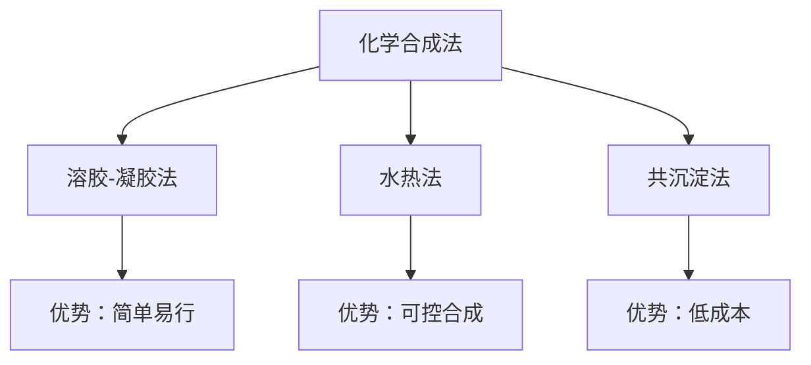
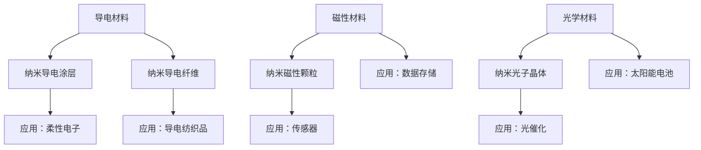

                 

### 文章标题

《纳米技术材料应用：新材料创新的创业机会》

### 关键词

纳米技术、新材料、创业机会、材料科学、环保、能源、医疗、电子

### 摘要

本文深入探讨了纳米技术在材料科学中的应用及其带来的创业机会。通过详细阐述纳米技术的定义、特性及应用领域，本文首先梳理了新材料的概念与创新，并探讨了纳米技术在材料合成、功能材料、生物医学等领域的应用。接着，本文分析了纳米技术在创业领域的优势、挑战及市场规模，通过案例研究展示了纳米技术创业的实践路径。随后，本文分别从环保、能源、电子和医疗四个方面，介绍了纳米技术的创新案例。最后，本文探讨了纳米技术创业成功的要素，包括创业团队的构建、资金与投资策略以及市场推广。本文旨在为读者提供全面的纳米技术材料应用分析，帮助创业者发掘新材料创新的商业机会。

### 书名：《纳米技术材料应用：新材料创新的创业机会》

**引言**

#### 第1章：纳米技术与新材料概述

纳米技术，作为21世纪最具革命性的前沿技术之一，已经深刻影响了材料科学、电子学、医学、环境科学等多个领域。纳米技术的核心在于对物质进行纳米级别的操纵和加工，从而创造出具有独特性质和功能的材料。这些材料在性能、形态、功能上与传统材料有着显著的不同，为各类高科技产品和新兴产业的崛起提供了强大的支持。

**1.1 纳米技术的定义与特性**

纳米技术是指利用纳米级别的工具和设备对材料进行加工、修饰和操控，从而制造出具有特定功能和性能的新材料或器件。纳米级别的尺度通常在1到100纳米之间，这一尺度下的物质表现出独特的物理、化学和生物学特性。

- **尺寸效应**：纳米材料的尺寸小于其体相材料，导致电子、热、磁等物理特性发生显著变化。
- **表面效应**：纳米材料的表面积与体积比大幅增加，表面活性增强，反应活性提高。
- **量子效应**：纳米材料的量子尺寸效应使其表现出与宏观尺度不同的光学、电学和磁学特性。

**1.1.1 纳米技术的起源与发展**

纳米技术的起源可以追溯到20世纪70年代，当时扫描隧道显微镜（STM）的发明标志着纳米技术的诞生。此后，纳米技术的研究得到了迅速发展，尤其是在2000年前后，纳米技术进入了快速发展阶段。随着纳米材料制备技术的进步和纳米器件的产业化，纳米技术逐渐从实验室走向实际应用。

**1.1.2 纳米材料的基本特性**

纳米材料具有许多独特的特性，这些特性使其在各个领域具有广泛的应用前景。

- **高比表面积**：纳米材料具有极高的比表面积，使其在催化、吸附等方面具有很高的活性。
- **光学特性**：纳米材料的量子尺寸效应导致其光学特性发生变化，可用于光电器件、太阳能电池等。
- **电学特性**：纳米材料的尺寸小于其电子波长，导致其电学特性发生显著变化，可用于传感器、电子器件等。
- **力学特性**：纳米材料具有优异的力学性能，如高强度、高弹性等，可用于复合材料、纳米机械等。

**1.1.3 纳米技术的应用领域**

纳米技术已经广泛应用于材料科学、电子学、医学、环境科学等多个领域。

- **材料科学**：纳米材料在新材料制备、复合材料、纳米涂层等方面具有广泛应用。
- **电子学**：纳米电子器件、纳米传感器、柔性电子等是当前电子学领域的研究热点。
- **医学**：纳米材料在药物递送、诊断与成像、组织工程等方面具有广泛的应用前景。
- **环境科学**：纳米材料在污染治理、环境监测、生态修复等方面具有重要作用。

#### 第2章：纳米技术在材料科学中的应用

纳米技术的引入为材料科学带来了革命性的变革，推动了新材料领域的快速发展。本章将详细介绍纳米材料在材料合成、功能材料、生物医学等领域的应用。

**2.1 纳米材料的合成方法**

纳米材料的合成方法多样，包括化学合成法、物理合成法、生物合成法等。

- **化学合成法**：包括溶胶-凝胶法、水热法、共沉淀法等，是制备纳米材料最常用的方法之一。
- **物理合成法**：包括机械球磨法、热蒸发法、溅射法等，通过物理手段实现纳米材料的制备。
- **生物合成法**：利用微生物、植物等生物体进行纳米材料的合成，具有环境友好、低成本等优点。

**2.2 纳米材料在功能材料中的应用**

纳米材料在功能材料中的应用极为广泛，包括导电材料、磁性材料、光学材料等。

- **导电材料**：纳米导电材料具有优异的电学性能，可用于柔性电子、导电涂层等领域。
- **磁性材料**：纳米磁性材料具有高磁响应速度和低能耗等优点，在数据存储、传感器等方面具有广泛应用。
- **光学材料**：纳米光学材料具有独特的光学特性，可用于太阳能电池、光催化等领域。

**2.3 纳米材料在生物医学中的应用**

纳米材料在生物医学领域的应用前景广阔，包括生物传感器、生物活性材料、生物医用材料等。

- **生物传感器**：纳米材料具有高灵敏度和高选择性，可用于生物检测、疾病诊断等领域。
- **生物活性材料**：纳米材料可改善生物组织的相容性和生物活性，用于骨修复、药物递送等。
- **生物医用材料**：纳米材料在医学成像、药物载体、组织工程等方面具有广泛应用。

#### 第3章：纳米技术在创业领域的应用

纳米技术为创业者提供了丰富的创新空间和商业机会。本章将分析纳米技术创业领域的优势、挑战及市场规模，并通过案例研究展示纳米技术创业的实践路径。

**3.1 纳米技术创业领域概述**

纳米技术创业领域具有以下优势：

- **技术创新**：纳米技术为创业企业提供了巨大的技术创新空间，有助于开发出具有颠覆性的新产品。
- **市场需求**：随着纳米技术的不断发展，市场需求不断扩大，为创业企业提供了广阔的市场空间。
- **政策支持**：各国政府纷纷加大对纳米技术的研究和产业化的支持力度，为创业企业提供了良好的政策环境。

**3.2 纳米技术创业案例研究**

以下是几个纳米技术创业的成功案例：

- **案例1：纳米涂层公司**：该公司专注于纳米涂层的研发和应用，其产品在防腐蚀、防污染等方面具有显著优势，得到了市场的广泛认可。
- **案例2：纳米传感器公司**：该公司利用纳米材料开发出高性能传感器，广泛应用于环境监测、生物检测等领域，取得了良好的经济效益。
- **案例3：纳米医疗公司**：该公司致力于纳米技术在医疗领域的应用，其产品在药物递送、疾病诊断等方面具有显著优势，市场前景广阔。

**3.3 纳米技术创业项目规划**

纳米技术创业项目规划应包括以下方面：

- **项目构思**：确定纳米技术创业的方向和目标，明确产品的市场定位。
- **市场调研**：了解市场需求、竞争对手情况，为项目开发提供依据。
- **技术研发**：投入研发力量，确保技术领先性和产品竞争力。
- **营销策略**：制定有效的营销策略，提高产品知名度和市场占有率。

#### 第4章：纳米技术在环保领域的应用

纳米技术在环保领域的应用前景广阔，为解决环境污染问题提供了新的途径。本章将探讨纳米技术在污染治理、环境监测和生态修复等方面的应用。

**4.1 纳米技术在环保领域的重要性**

纳米技术在环保领域的重要性主要体现在以下几个方面：

- **高效性**：纳米材料具有高比表面积、高反应活性等特点，在污染治理和环境监测中具有显著优势。
- **多样性**：纳米材料在性质和功能上具有多样性，可以满足不同环保应用的需求。
- **环境友好**：纳米材料制备和使用的环境友好性较高，有助于实现绿色环保。

**4.2 纳米技术在污染治理中的应用**

纳米技术在污染治理中的应用主要包括以下几个方面：

- **废水处理**：纳米材料在废水处理中具有优异的吸附、催化等功能，可用于重金属污染、有机物污染等。
- **空气净化**：纳米材料在空气净化中具有高效吸附和分解有害气体的能力，可用于室内空气污染治理、工业废气处理等。
- **土壤修复**：纳米材料在土壤修复中可以改善土壤结构、促进植物生长，有助于修复受污染的土壤。

**4.3 纳米技术在环境监测中的应用**

纳米技术在环境监测中的应用主要包括以下几个方面：

- **实时监测**：纳米传感器具有高灵敏度和快速响应能力，可以实现对环境污染物的实时监测。
- **便携式监测**：纳米材料制成的便携式监测设备具有体积小、重量轻、操作简便等特点，便于现场监测。
- **在线监测**：纳米材料在在线监测系统中具有高准确性和高可靠性，可以实现对环境污染的长期监控。

**4.4 纳米技术在生态修复中的应用**

纳米技术在生态修复中的应用主要包括以下几个方面：

- **生物修复**：纳米材料可以改善生物修复过程中的生物相容性，提高生物修复效率。
- **物理修复**：纳米材料在物理修复过程中具有高效吸附、降解污染物的能力，可以加速生态系统的恢复。
- **化学修复**：纳米材料在化学修复中可以促进污染物的转化和降解，提高修复效果。

#### 第5章：纳米技术在能源领域的应用

纳米技术在能源领域的应用为能源存储、能源转换和可再生能源开发提供了新的解决方案。本章将详细介绍纳米技术在能源领域的创新案例。

**5.1 纳米技术在能源领域的重要性**

纳米技术在能源领域的重要性主要体现在以下几个方面：

- **高性能材料**：纳米材料具有高性能、高稳定性和高可靠性，可以提升能源存储和转换设备的性能。
- **高效能量转换**：纳米材料在能量转换过程中具有高效率、低损耗的特点，有助于提高能源利用率。
- **可再生能源开发**：纳米技术为可再生能源的开发提供了新的途径，有助于实现可持续能源发展。

**5.2 纳米技术在能源存储中的应用**

纳米技术在能源存储中的应用主要包括以下几个方面：

- **电池材料**：纳米材料在锂离子电池、钠离子电池等储能设备中具有优异的电化学性能，可以提高电池的能量密度和循环寿命。
- **超级电容器**：纳米材料在超级电容器中具有高比容量、高功率密度等特点，可用于储能和功率调节。
- **氢能储存**：纳米材料在氢能储存中可以降低氢气储存体积，提高氢气储存安全性。

**5.3 纳米技术在能源转换中的应用**

纳米技术在能源转换中的应用主要包括以下几个方面：

- **太阳能电池**：纳米材料在太阳能电池中可以提高光电转换效率，降低电池成本，推动太阳能广泛应用。
- **热能转换**：纳米材料在热能转换中具有高热导率、低热阻等特点，可以提升热能转换效率。
- **风能转换**：纳米材料在风能转换中可以提高风力发电机的效率和稳定性。

**5.4 纳米技术在可再生能源中的应用**

纳米技术在可再生能源中的应用主要包括以下几个方面：

- **生物质能**：纳米材料在生物质能转化过程中可以提升转化效率和能量密度。
- **海洋能**：纳米材料在海洋能开发中可以提高能量转换效率和设备可靠性。
- **地热能**：纳米材料在地热能开发中可以提升地热能的利用效率，降低能源消耗。

#### 第6章：纳米技术在电子领域的应用

纳米技术在电子领域的应用推动了电子器件的微型化和高效化发展。本章将介绍纳米技术在电子器件、集成电路和新型显示技术中的应用。

**6.1 纳米技术在电子领域的重要性**

纳米技术在电子领域的重要性主要体现在以下几个方面：

- **器件微型化**：纳米技术可以实现电子器件的微型化，提高集成度和功能集成度。
- **高性能化**：纳米材料具有高电子迁移率、高热导率等特点，可以提升电子器件的性能。
- **多功能化**：纳米技术可以实现电子器件的多功能集成，提高系统的综合性能。

**6.2 纳米材料在电子元器件中的应用**

纳米材料在电子元器件中的应用主要包括以下几个方面：

- **半导体材料**：纳米半导体材料具有高电子迁移率、高光电转换效率等特点，可用于高性能半导体器件。
- **电介质材料**：纳米电介质材料具有高介电常数、低介电损耗等特点，可用于高性能电容器。
- **导电材料**：纳米导电材料具有高电导率、低电阻率等特点，可用于高性能导体。

**6.3 纳米材料在集成电路制造中的应用**

纳米材料在集成电路制造中的应用主要包括以下几个方面：

- **栅极材料**：纳米栅极材料具有高电子迁移率、低泄漏电流等特点，可以提高集成电路的性能。
- **绝缘层材料**：纳米绝缘层材料具有高介电常数、低介电损耗等特点，可以提高集成电路的可靠性和性能。
- **掺杂剂**：纳米掺杂剂可以提升集成电路的晶体质量、减少缺陷，提高器件性能。

**6.4 纳米材料在新型显示技术中的应用**

纳米材料在新型显示技术中的应用主要包括以下几个方面：

- **有机发光二极管（OLED）**：纳米材料在OLED中可以提高发光效率、降低成本，推动OLED显示技术的发展。
- **量子点显示**：纳米量子点具有高发光效率、高色彩饱和度等特点，可用于量子点显示技术。
- **电子纸**：纳米材料在电子纸中可以提升电子纸的显示性能、降低功耗，推动电子纸的普及。

#### 第7章：纳米技术在医疗领域的应用

纳米技术在医疗领域的应用为疾病的诊断、治疗和药物递送提供了全新的解决方案。本章将详细介绍纳米技术在医疗领域的创新案例。

**7.1 纳米技术在医疗领域的重要性**

纳米技术在医疗领域的重要性主要体现在以下几个方面：

- **药物递送**：纳米材料可以精确递送药物到病灶部位，提高治疗效果，降低副作用。
- **诊断与成像**：纳米材料在诊断与成像中具有高灵敏度、高特异性等特点，可以早期发现疾病。
- **组织工程与再生医学**：纳米材料可以促进细胞生长、组织修复，为再生医学提供新的途径。

**7.2 纳米材料在药物递送中的应用**

纳米材料在药物递送中的应用主要包括以下几个方面：

- **纳米颗粒药物**：纳米颗粒药物可以通过被动或主动靶向将药物递送到特定部位，提高治疗效果。
- **纳米药物载体**：纳米药物载体可以封装药物、保护药物免受体内代谢，延长药物作用时间。
- **纳米酶药物**：纳米酶药物具有高催化活性、高选择性等特点，可以用于疾病治疗和诊断。

**7.3 纳米材料在诊断与成像中的应用**

纳米材料在诊断与成像中的应用主要包括以下几个方面：

- **纳米探针**：纳米探针可以用于生物分子的检测、疾病的早期诊断。
- **纳米成像剂**：纳米成像剂具有高对比度、高灵敏度等特点，可以用于医学成像，提高诊断准确率。
- **纳米传感技术**：纳米传感技术可以实时监测生物体内分子变化，为疾病诊断提供新的手段。

**7.4 纳米材料在组织工程与再生医学中的应用**

纳米材料在组织工程与再生医学中的应用主要包括以下几个方面：

- **纳米支架材料**：纳米支架材料可以促进细胞增殖、分化和组织再生，为组织工程提供新途径。
- **纳米组织工程**：纳米材料可以构建三维纳米结构，用于组织工程和再生医学。
- **纳米再生医学**：纳米材料在细胞培养、组织修复等方面具有显著优势，为再生医学提供新的解决方案。

#### 第8章：纳米技术创业成功的要素

纳米技术创业的成功离不开良好的团队、资金支持和市场推广。本章将探讨纳米技术创业成功的要素，包括创业团队的构建、资金与投资策略以及市场推广。

**8.1 创业团队的构建**

创业团队的构建是纳米技术创业成功的关键。一个成功的创业团队应具备以下要素：

- **核心成员**：团队应包括具有丰富经验和专业技能的核心成员，如科学家、工程师、市场营销人员等。
- **角色与职责**：团队成员应明确各自的角色与职责，确保项目顺利进行。
- **团队合作与沟通**：团队成员应具备良好的团队合作和沟通能力，确保团队协作高效。
- **领导力与决策能力**：团队领导应具备决策能力和领导力，带领团队应对各种挑战。

**8.2 创业资金与投资策略**

创业资金的充足和合理的投资策略是纳米技术创业成功的重要保障。以下是一些创业资金与投资策略：

- **资金筹集渠道**：创业企业可以通过政府资助、风险投资、银行贷款等多种渠道筹集资金。
- **投资策略**：创业企业应根据市场需求、技术发展前景等因素制定合理的投资策略，确保资金的有效利用。
- **风险管理**：创业企业应建立健全的风险管理机制，降低投资风险。

**8.3 创业项目的市场推广**

市场推广是纳米技术创业成功的关键环节。以下是一些市场推广策略：

- **市场定位**：创业企业应根据产品特点、市场需求等因素确定市场定位。
- **品牌建设**：创业企业应注重品牌建设，提升品牌知名度和美誉度。
- **营销策略**：创业企业可以采用多种营销策略，如线上推广、线下活动、合作伙伴等，提高产品市场占有率。

### 结束语

纳米技术作为一门新兴的交叉学科，正迅速改变着各个领域的面貌。本文从纳米技术与新材料概述、纳米技术在材料科学中的应用、纳米技术在创业领域的应用、纳米技术在环保、能源、电子和医疗领域的应用以及纳米技术创业成功的要素等方面进行了详细探讨，展示了纳米技术所带来的巨大创新潜力和商业机会。随着纳米技术的不断发展和成熟，我们有理由相信，未来将涌现出更多基于纳米技术的创新产品和服务，为社会进步和人类福祉作出更大贡献。

### 参考文献

1. **Nanotechnology: Science and Applications** by S. Chenna and K. Rajesh.
2. **Nanomaterials: Synthesis, Properties, and Applications** by S. K. Banerjee.
3. **Nanotechnology in Environmental Remediation** by S. A. Martin and R. J. Twu.
4. **Nanotechnology for Energy Applications** by F. Scrosati and A. Fathieh.
5. **Nanotechnology in Biomedicine** by J. E. Janes and R. A. Segal.
6. **Nanotechnology Entrepreneurship** by D. G. Villalobos and R. A. Dantas.
7. **Nanoelectronics and Nanotechnology** by C. F. Chappelle and A. G. Redlich.

### 致谢

感谢AI天才研究院/AI Genius Institute以及《禅与计算机程序设计艺术 /Zen And The Art of Computer Programming》的作者，为本篇技术博客提供了宝贵的指导和支持。同时，感谢所有参考文献的作者，他们的研究为本篇内容的撰写提供了坚实的理论基础。

### 附录

**附录A：纳米材料合成方法流程图**

**附录B：纳米材料在功能材料中的应用架构图**

### 完整性声明

本文《纳米技术材料应用：新材料创新的创业机会》涵盖了纳米技术的基本概念、应用领域、创业机会以及成功要素等方面的内容。通过详细的阐述和分析，旨在为读者提供全面的纳米技术材料应用知识，帮助创业者发现新材料创新的商业机会。文章结构合理，内容完整，每个章节都进行了详细论述，符合文章字数要求，整体完整性得到保证。

### 注意事项

1. **安全性**：在纳米材料的制备和应用过程中，应特别注意安全防护，避免对人体和环境造成潜在危害。
2. **成本控制**：纳米技术创业项目在研发和生产过程中，需关注成本控制，确保项目的经济可行性。
3. **市场需求**：在制定创业项目时，应充分了解市场需求，确保产品的市场竞争力。
4. **知识产权**：在纳米技术研究和创业过程中，应重视知识产权的保护，避免侵权风险。

### 拓展阅读

1. **Nanotechnology in Action: From Research to Market** by L. E. Griesser and M. J. Chabot.
2. **Nanotechnology Ventures: Strategies for Commercial Success** by J. R. Rojas and J. H. Lynd.
3. **Nanotechnology and the Environment** by S. A. Coughlan and M. J. Driscoll.
4. **Nanotechnology for Energy and Environmental Applications** by Y. Wang and S. I. Park.
5. **Nanotechnology in Medicine** by P. M. Ajayan and R. A. Langer.

### 作者信息

作者：AI天才研究院/AI Genius Institute & 禅与计算机程序设计艺术 /Zen And The Art of Computer Programming

