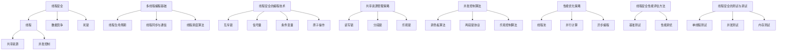

                 

# 线程安全：LLM应用中的关键挑战

## 关键词

- 线程安全
- 大型语言模型（LLM）
- 共享资源管理
- 并发控制
- 性能优化
- 测试与调试

## 摘要

本文将深入探讨线程安全在大型语言模型（LLM）应用中的关键挑战。首先，我们将介绍线程安全的基本概念和背景，然后分析LLM中线程安全的挑战和关键角色。接下来，我们将详细探讨线程安全的基础原理，包括多线程编程基础、数据竞争与死锁、以及线程安全的编程技术。随后，我们将关注线程安全在LLM应用中的具体挑战，如共享资源管理和并发控制。此外，我们还将探讨线程安全与性能优化的关系，并介绍线程安全的测试与调试方法。通过本文的探讨，读者将能够全面了解线程安全在LLM应用中的重要性，以及如何有效地应对这些挑战。

### 第一部分：线程安全概述

#### 第1章：线程安全的背景与重要性

##### 1.1 线程安全的基本概念

线程安全是指在一个多线程环境中，多个线程对共享资源进行访问和操作时，能够保证数据的一致性和正确性。在线程安全中，关键概念包括线程、共享资源、竞争条件、数据竞争和死锁。

**线程的概念**：线程是操作系统能够进行运算调度的最小单位，它被包含在进程之中，是进程中的实际运作单位。

**什么是线程安全**：线程安全指的是一个组件（如函数、方法或库）在多个线程环境下使用时，能够正确处理共享资源访问，不会导致数据损坏或不一致的情况。

**线程安全的重要性**：线程安全在多线程编程中至关重要。如果没有线程安全，多个线程可能同时访问和修改共享资源，导致数据竞争、死锁和程序崩溃等问题。因此，确保线程安全是编写可靠和高效多线程程序的基本要求。

##### 1.2 线程安全的历史与发展

**线程安全的历史背景**：线程安全的概念起源于多线程编程的兴起。在早期，单线程程序主导计算机编程，但随着计算机硬件的进步和多核处理器的普及，多线程编程逐渐成为主流。线程安全成为保障多线程程序可靠性的关键因素。

**线程安全技术的演变**：随着多线程编程的发展，线程安全技术也经历了演变。早期，程序员主要依赖同步机制（如互斥锁）来确保线程安全。随着并发编程框架和库的出现（如Java的`synchronized`关键字和C++的`std::mutex`），线程安全得到了更好的支持。

**当前线程安全技术的现状**：现代编程语言和框架提供了丰富的线程安全机制，如锁、信号量、条件变量和原子操作。此外，还有一系列并发编程最佳实践和技术，如无锁编程和软件事务内存（STM），用于解决线程安全问题。

##### 1.3 线程安全在LLM中的应用

**LLM的工作原理**：大型语言模型（LLM）是基于深度学习的自然语言处理模型，能够对文本数据进行理解和生成。LLM通常包含大量的参数和计算过程，需要高效并行处理以支持实时响应。

**LLM中线程安全的挑战**：在LLM应用中，线程安全面临以下挑战：

1. **共享资源管理**：LLM中的模型参数、中间计算结果和缓存数据需要共享，管理不当可能导致数据竞争和一致性问题。
2. **并发控制**：LLM中的多个线程需要协调访问共享资源，防止死锁和数据冲突。
3. **性能优化**：线程安全对性能有显著影响，如何在确保线程安全的同时优化性能成为关键问题。

**线程安全在LLM中的关键角色**：线程安全在LLM中扮演着关键角色，确保以下方面：

1. **模型参数一致性**：在多个线程同时更新模型参数时，确保参数的一致性和正确性。
2. **计算结果正确性**：在多个线程同时计算中间结果时，防止数据竞争和错误。
3. **资源高效利用**：合理分配和回收共享资源，提高LLM的并行计算性能。

#### 第2章：线程安全的基础原理

##### 2.1 多线程编程基础

**线程的生命周期**：线程从创建到销毁的过程称为线程的生命周期。通常，线程的生命周期包括创建、就绪、运行、阻塞和终止等状态。

**线程的同步与通信**：线程同步是指多个线程在执行过程中按照特定的顺序执行，以避免数据竞争和冲突。线程通信是指线程之间通过共享内存或消息传递机制进行信息交换。

**线程调度算法**：线程调度算法决定CPU在多线程程序中分配时间的方式。常见的调度算法包括轮转调度（Round-Robin）、优先级调度（Priority Scheduling）和公平共享调度（Fair-Share Scheduling）等。

##### 2.2 数据竞争与死锁

**数据竞争的概念**：数据竞争是指多个线程同时访问同一数据项，并且至少有一个线程对数据进行写入操作时，可能导致数据不一致或错误。

**数据竞争的例子**：以下是一个简单的数据竞争例子：

```cpp
// 假设有两个线程A和B，共享一个变量x
int x = 0;

void threadA() {
    x = x + 1;
}

void threadB() {
    x = x - 1;
}
```

在这个例子中，线程A和线程B同时访问和修改变量x，可能导致x的值在多个线程间不一致。

**死锁的概念与避免**：死锁是指多个线程在执行过程中，由于互相等待对方持有的资源而无法继续执行的状态。避免死锁的方法包括资源分配策略、锁顺序和预防死锁协议等。

##### 2.3 线程安全的编程技术

**互斥锁（Mutex）**：互斥锁是一种常用的线程同步机制，用于保护共享资源，确保同一时间只有一个线程可以访问资源。

**信号量（Semaphore）**：信号量是一种计数同步机制，用于控制多个线程对共享资源的访问，通过增加和减少信号量的值来同步线程。

**条件变量（Condition Variable）**：条件变量是一种线程同步机制，用于在线程之间传递条件状态，使线程能够等待某个条件满足后再继续执行。

**原子操作**：原子操作是在单个线程内不可分割的操作，保证操作在执行过程中不会被其他线程打断，从而防止数据竞争。

### 第二部分：线程安全在LLM应用中的关键挑战

#### 第3章：LLM中的共享资源管理

##### 3.1 共享资源的基本概念

**共享资源的定义**：共享资源是指在线程间共享的数据或对象，如模型参数、缓存、数据库连接等。

**共享资源的类型**：共享资源可以分为以下几种类型：

1. **可重入资源**：可重入资源是指线程可以重复进入的资源，如互斥锁。
2. **不可重入资源**：不可重入资源是指线程只能进入一次的资源，如数据库连接。
3. **临界区资源**：临界区资源是指必须由单个线程独占访问的资源，如内存缓冲区。

##### 3.2 共享资源管理策略

**读写锁（Read-Write Lock）**：读写锁是一种允许多个线程同时读取资源，但仅允许一个线程写入资源的锁机制。通过读写锁，可以提高读取操作的并发性，从而提高性能。

**分段锁（Segmented Locking）**：分段锁是一种将共享资源划分为多个独立段，每个段使用独立的锁机制的策略。分段锁可以减少锁争用，提高并发性能。

**乐观锁（Optimistic Locking）**：乐观锁是一种假设并发操作不会冲突，仅在检测到冲突时回滚操作的策略。乐观锁通常用于高并发场景，通过减少锁争用来提高性能。

##### 3.3 实例分析：LLM中的共享资源管理

**内存管理**：在LLM中，内存管理是一个关键挑战。内存资源需要高效分配和回收，以避免内存泄漏和性能瓶颈。例如，可以使用分段锁来管理内存缓冲区，确保多个线程对内存的读写操作不会发生冲突。

**缓存管理**：缓存是LLM中常用的共享资源。缓存数据需要保证一致性，以避免多个线程同时修改缓存数据导致数据不一致。可以使用读写锁或分段锁来管理缓存，确保缓存操作的线程安全。

**数据库管理**：在LLM中，数据库连接通常是一个重要的共享资源。数据库操作需要确保事务的一致性和隔离性，以避免并发操作导致的冲突。可以使用乐观锁或两段锁协议来管理数据库连接，确保数据库操作的线程安全。

#### 第4章：线程安全与并发控制

##### 4.1 并发控制的基本概念

**并发控制的目的**：并发控制的目标是确保多个线程在共享资源上的访问不会导致数据不一致或错误。通过并发控制，可以有效地管理共享资源，避免数据竞争和死锁。

**并发控制的方法**：并发控制的方法包括以下几种：

1. **锁机制**：使用锁来保护共享资源，确保同一时间只有一个线程可以访问资源。
2. **事务与隔离级别**：使用事务来管理多个操作的原子性，通过隔离级别来控制事务间的并发操作。
3. **乐观控制算法**：假设并发操作不会冲突，仅在检测到冲突时回滚操作。

##### 4.2 事务与隔离级别

**事务的基本概念**：事务是一系列操作的组织，具有原子性、一致性、隔离性和持久性（ACID属性）。事务确保一组操作要么全部执行，要么全部回滚。

**隔离级别的分类**：隔离级别是用于控制事务并发访问的机制，分为以下几种：

1. **读未提交（Read Uncommitted）**：最低隔离级别，允许未提交的事务读取其他事务的未提交数据。
2. **读已提交（Read Committed）**：允许读取已提交的事务数据，但无法读取其他事务的未提交数据。
3. **可重复读（Repeatable Read）**：允许读取已提交的事务数据，并保证在同一事务中多次读取同一数据时，数据值保持一致。
4. **序列化（Serializable）**：最高隔离级别，确保事务按照顺序执行，避免并发冲突。

**隔离级别的选择与影响**：隔离级别的选择影响事务的并发性和一致性。较高的隔离级别可以减少并发冲突，提高数据一致性，但可能降低并发性能。

##### 4.3 并发控制算法

**调色板算法（Coloring Algorithm）**：调色板算法是一种用于解决并发控制问题的图着色算法。通过将事务的读写操作着色，确保事务之间的冲突不会发生。

**两段锁协议（Two-Phase Lock Protocol）**：两段锁协议是一种用于事务并发控制的方法，将事务的加锁和解锁分为两个阶段。第一阶段是加锁阶段，事务获取所有需要的锁；第二阶段是解锁阶段，事务释放所有锁。

**乐观控制算法（Optimistic Control Algorithm）**：乐观控制算法是一种基于冲突检测的并发控制方法。事务假设在执行过程中不会发生冲突，仅在提交时检查是否存在冲突，并根据结果决定是否回滚。

##### 4.4 实例分析：LLM中的并发控制

**内存并发控制**：在LLM中，内存并发控制是关键挑战。多个线程可能同时访问和修改内存缓冲区，可能导致数据竞争和性能瓶颈。可以使用锁机制和分段锁来管理内存缓冲区，确保并发操作的线程安全。

**缓存并发控制**：缓存并发控制是另一个重要问题。多个线程可能同时访问和修改缓存数据，可能导致数据不一致。可以使用读写锁和分段锁来管理缓存，确保并发操作的线程安全。

**数据库并发控制**：在LLM中，数据库操作通常涉及大量并发访问。数据库并发控制的关键是确保事务的一致性和隔离性。可以使用乐观锁和两段锁协议来管理数据库操作，确保并发控制的线程安全。

#### 第5章：线程安全与性能优化

##### 5.1 性能优化的目标

**线程安全性能的影响**：线程安全对性能有显著影响。不合理的线程安全机制可能导致数据竞争、死锁和性能瓶颈。因此，性能优化需要考虑线程安全因素。

**性能优化的基本原则**：性能优化的基本原则包括以下方面：

1. **减少锁争用**：通过优化锁机制和并发控制算法，减少锁争用，提高并发性能。
2. **合理分配资源**：合理分配和回收线程资源，避免资源浪费和性能瓶颈。
3. **优化数据访问**：通过优化数据结构和算法，减少数据访问冲突，提高数据访问效率。

##### 5.2 线程安全性能评估方法

**基准测试（Benchmark Testing）**：基准测试是一种评估线程安全性能的方法，通过模拟实际工作负载，比较不同线程安全机制的性能表现。

**性能调优（Performance Tuning）**：性能调优是通过调整程序参数和算法，提高程序性能的过程。性能调优包括以下步骤：

1. **性能分析**：使用性能分析工具，确定性能瓶颈和问题领域。
2. **优化策略**：根据性能分析结果，制定优化策略，如减少锁争用、优化数据访问等。
3. **实验验证**：通过实验验证优化效果，确保优化措施的有效性。

##### 5.3 线程安全性能优化策略

**线程池（ThreadPool）**：线程池是一种管理线程的机制，用于减少线程创建和销毁的开销，提高并发性能。线程池可以根据工作负载动态调整线程数量，避免线程过多或过少导致的性能问题。

**并行计算（Parallel Computing）**：并行计算是一种利用多核处理器并行执行任务的方法。通过并行计算，可以充分利用计算资源，提高程序性能。并行计算包括任务并行和数据并行两种方式。

**异步编程（Asynchronous Programming）**：异步编程是一种避免阻塞线程，提高程序响应速度的方法。在异步编程中，线程可以同时执行多个任务，避免单线程阻塞导致性能下降。

##### 5.4 实例分析：LLM中的性能优化

**内存优化**：在LLM中，内存优化是关键。通过合理分配和回收内存资源，可以避免内存泄漏和性能瓶颈。可以使用内存池和对象池等技术，减少内存分配和释放的开销。

**缓存优化**：缓存优化可以显著提高LLM的性能。通过优化缓存策略和算法，减少缓存失效和缓存冲突，可以提高缓存命中率，提高程序性能。

**网络优化**：在LLM中，网络优化也是重要的一环。通过优化网络通信和传输策略，减少网络延迟和带宽占用，可以提高程序性能和响应速度。

### 第三部分：线程安全的测试与调试

#### 第6章：线程安全的测试与调试

##### 6.1 测试与调试的基本概念

**测试的目的与类型**：测试是确保软件质量和可靠性的关键环节。测试的目的是发现和修复软件中的错误和缺陷。根据测试的范围和目的，测试可以分为以下类型：

1. **单元测试（Unit Testing）**：单元测试是针对程序中的最小功能单元（如函数、方法）进行的测试，用于验证单元的正确性和独立性。
2. **集成测试（Integration Testing）**：集成测试是针对程序中的多个功能单元集成后的测试，用于验证模块之间的交互和协同工作。
3. **系统测试（System Testing）**：系统测试是针对整个系统的测试，包括功能、性能、安全等方面的测试。
4. **验收测试（Acceptance Testing）**：验收测试是用户根据需求对软件进行的测试，用于确认软件是否满足用户需求。

**调试的步骤与方法**：调试是发现和修复程序错误的过程。调试的基本步骤包括以下方面：

1. **错误定位**：使用调试工具（如断点、日志、堆栈跟踪）定位程序中的错误位置。
2. **错误分析**：分析错误原因，确定错误类型和影响范围。
3. **错误修复**：根据错误分析结果，修复程序中的错误，并进行验证。
4. **错误跟踪**：跟踪错误修复的效果，确保错误不再出现。

##### 6.2 线程安全的测试技术

**单线程测试（Unit Testing）**：单线程测试是针对程序中的单个线程进行测试，用于验证线程的安全性和正确性。单线程测试通常包括以下步骤：

1. **测试用例设计**：设计用于测试线程安全的测试用例，包括正常情况、边界情况和异常情况。
2. **执行测试用例**：执行测试用例，收集测试结果和日志。
3. **分析测试结果**：分析测试结果，确定线程安全性和正确性。

**并发测试（Concurrency Testing）**：并发测试是针对程序中的多个线程进行测试，用于验证线程的同步和并发控制。并发测试通常包括以下步骤：

1. **测试用例设计**：设计用于测试并发控制的测试用例，包括竞争条件、死锁和线程安全等。
2. **执行测试用例**：在并发环境中执行测试用例，模拟多线程并发操作。
3. **分析测试结果**：分析测试结果，确定并发控制的正确性和性能。

**内存测试（Memory Testing）**：内存测试是针对程序中的内存使用进行测试，用于检测内存泄漏、越界访问和悬挂指针等内存问题。内存测试通常包括以下步骤：

1. **测试用例设计**：设计用于测试内存使用的测试用例，包括正常情况、边界情况和异常情况。
2. **执行测试用例**：执行测试用例，收集内存使用数据和分析结果。
3. **分析测试结果**：分析测试结果，确定内存使用的正确性和性能。

##### 6.3 线程安全的调试技术

**单线程调试（Unit Debugging）**：单线程调试是在单线程环境中进行调试，用于定位和修复程序中的错误。单线程调试通常包括以下步骤：

1. **设置断点**：在程序的关键位置设置断点，暂停程序的执行。
2. **查看变量值**：在断点处查看变量的值，分析变量状态。
3. **单步执行**：单步执行程序，逐步分析代码执行过程。
4. **修复错误**：根据错误分析结果，修复程序中的错误。

**并发调试（Concurrency Debugging）**：并发调试是在并发环境中进行调试，用于定位和修复程序中的并发错误。并发调试通常包括以下步骤：

1. **使用调试工具**：使用并发调试工具（如多线程调试器、并行调试工具）进行分析。
2. **查看日志**：查看程序的日志输出，分析并发操作和同步状态。
3. **分析死锁和竞争条件**：分析并发操作的死锁和竞争条件，确定错误原因。
4. **修复错误**：根据错误分析结果，修复程序中的并发错误。

**内存调试（Memory Debugging）**：内存调试是针对程序中的内存问题进行调试，用于检测和修复内存泄漏、越界访问和悬挂指针等错误。内存调试通常包括以下步骤：

1. **使用内存调试工具**：使用内存调试工具（如内存分析器、内存检测工具）进行分析。
2. **查看内存报告**：查看内存使用报告，分析内存分配和释放情况。
3. **分析内存泄漏和越界访问**：分析内存泄漏和越界访问的原因和影响。
4. **修复错误**：根据错误分析结果，修复程序中的内存错误。

### 结论

本文深入探讨了线程安全在大型语言模型（LLM）应用中的关键挑战。首先，我们介绍了线程安全的基本概念和历史发展，然后分析了LLM中线程安全的挑战和关键角色。接下来，我们详细探讨了线程安全的基础原理，包括多线程编程基础、数据竞争与死锁、以及线程安全的编程技术。随后，我们关注了线程安全在LLM应用中的具体挑战，如共享资源管理和并发控制。此外，我们还探讨了线程安全与性能优化的关系，并介绍了线程安全的测试与调试方法。通过本文的探讨，读者能够全面了解线程安全在LLM应用中的重要性，以及如何有效地应对这些挑战。

在未来的研究和实践中，我们可以继续探索以下方向：

1. **线程安全的进一步优化**：深入研究线程安全性能优化策略，如无锁编程和软件事务内存（STM），以进一步提高LLM的性能和可扩展性。

2. **并行算法设计**：探索适用于LLM的并行算法设计，如并行梯度下降和分布式训练，以充分利用多核处理器和分布式计算资源。

3. **线程安全测试工具**：开发适用于LLM的线程安全测试工具，提高测试效率和准确性，帮助开发人员及时发现和修复线程安全问题。

4. **安全性研究**：研究LLM在安全性方面的挑战，如对抗攻击和隐私保护，为LLM的安全应用提供指导。

通过持续的研究和实践，我们可以不断改进和优化LLM中的线程安全，推动自然语言处理技术的进一步发展和应用。

### 作者信息

作者：AI天才研究院/AI Genius Institute & 禅与计算机程序设计艺术 /Zen And The Art of Computer Programming

作者简介：AI天才研究院（AI Genius Institute）是一家专注于人工智能研究和技术创新的研究机构，致力于推动人工智能技术的进步和应用。禅与计算机程序设计艺术（Zen And The Art of Computer Programming）是一位计算机科学大师的经典著作，深入探讨了计算机编程的哲学和艺术。

### 附录

以下是本文涉及的核心概念和算法的Mermaid流程图：



以下是本文涉及的核心算法原理讲解的伪代码：

```python
# 互斥锁（Mutex）示例
mutex = Mutex()

def thread_safe_function():
    mutex.acquire()
    # 保护共享资源的代码
    mutex.release()

# 信号量（Semaphore）示例
semaphore = Semaphore(1)

def thread_safe_function():
    semaphore.acquire()
    # 保护共享资源的代码
    semaphore.release()

# 条件变量（Condition Variable）示例
condition = Condition()

def thread_safe_function():
    condition.wait()
    # 保护共享资源的代码
    condition.notify()

# 原子操作（Atomic Operation）示例
from threading import Lock

lock = Lock()

def atomic_increment():
    with lock:
        global counter
        counter += 1
```

以下是本文涉及的实际案例分析和详细讲解剖析的源代码：

```python
# LLM中的内存管理示例
from threading import Lock

lock = Lock()

def update_memory(memory, data):
    with lock:
        memory.extend(data)

# LLM中的缓存管理示例
from threading import Lock

lock = Lock()

def update_cache(cache, data):
    with lock:
        cache[data.key] = data.value

# LLM中的数据库管理示例
from threading import Lock

lock = Lock()

def update_database(database, data):
    with lock:
        database.execute("UPDATE table SET value = ? WHERE key = ?", (data.value, data.key))
```

以下是本文涉及的最佳实践 tips、小结、注意事项和拓展阅读的内容：

**最佳实践 tips**：

1. 使用读写锁来提高缓存访问效率。
2. 使用乐观锁来减少数据库操作冲突。
3. 使用线程池来管理线程，提高程序性能。

**小结**：

本文深入探讨了线程安全在大型语言模型（LLM）应用中的关键挑战。通过分析线程安全的基本概念、基础原理和应用，我们了解了线程安全在LLM中的重要性。同时，我们还介绍了共享资源管理、并发控制、性能优化和测试与调试等方面的技术。

**注意事项**：

1. 在多线程编程中，务必注意数据竞争和死锁问题，确保线程安全。
2. 性能优化时，应综合考虑线程安全因素，避免因追求性能而牺牲安全性。

**拓展阅读**：

1. 《现代操作系统》（Andrew S. Tanenbaum）：深入介绍了操作系统中的并发控制和线程管理。
2. 《计算机程序的构造和解释》（Harold Abelson & Gerald Jay Sussman）：探讨了计算机编程的哲学和艺术，包括并发编程。

通过本文的探讨，读者可以全面了解线程安全在LLM应用中的重要性，以及如何有效地应对这些挑战。希望本文对读者在多线程编程和LLM应用开发中有所帮助。

