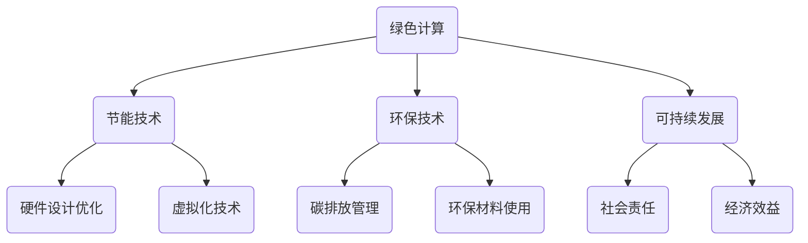

                 

### 文章标题

《绿色计算：环保与高效的IT解决方案》

### 关键词

绿色计算、环保、节能、高效、IT解决方案

### 摘要

随着信息技术的飞速发展，数据中心能耗和碳排放问题日益严峻。本文旨在探讨绿色计算的定义、核心原则、技术发展历程、关键技术与实践、法律法规与政策推动，以及未来的发展趋势。通过对绿色计算全方位的剖析，本文旨在为读者提供环保与高效的IT解决方案，助力企业实现可持续发展。

---

## 《绿色计算：环保与高效的IT解决方案》

### 第一部分：绿色计算概述

#### 1.1 绿色计算的定义与重要性

#### 1.1.1 绿色计算的定义

绿色计算是指通过采用节能、环保、可持续的技术和方法，降低IT基础设施的能耗和碳排放，同时提高IT系统的性能和效率。绿色计算不仅仅关注硬件的节能，还包括软件优化、虚拟化、云计算等多种技术手段的综合应用。

#### 1.1.2 绿色计算的重要性

随着信息技术的快速发展，数据中心的能耗和碳排放问题日益突出。绿色计算不仅有助于缓解能源危机，降低运营成本，还能提高企业的社会责任形象，具有重大的经济、社会和环境价值。

#### 1.1.3 绿色计算的发展趋势

随着人工智能、云计算、大数据等技术的不断进步，绿色计算将在未来得到更广泛的应用。未来绿色计算的发展趋势包括更高效的硬件设计、更优化的软件算法、更完善的政策法规等。

Mermaid流程图：绿色计算的核心概念与联系

### 1.2 绿色计算的核心原则

#### 1.2.1 节能降耗

节能降耗是绿色计算的首要原则，通过优化硬件设计、采用节能软件、提升数据中心能效等手段，实现能耗的降低。

#### 1.2.2 环境友好

环境友好原则要求在IT基础设施的设计、制造、使用和处置过程中，尽量减少对环境的影响，包括减少碳排放、减少废弃物排放等。

#### 1.2.3 可持续发展

可持续发展原则强调在满足当前需求的同时，不损害后代满足自身需求的能力，实现经济、社会和环境的平衡发展。

### 1.3 绿色计算的发展历程

#### 1.3.1 绿色计算1.0时代

绿色计算1.0时代主要关注硬件节能，如采用更高效的处理器、更优化的存储系统等。

#### 1.3.2 绿色计算2.0时代

绿色计算2.0时代开始关注软件优化和虚拟化技术，通过优化软件算法和数据中心资源利用率，进一步降低能耗。

#### 1.3.3 绿色计算3.0时代

绿色计算3.0时代将聚焦于人工智能、大数据等新兴技术的融合应用，实现更高效的能源管理和环境保护。

---

### 1.4 绿色计算与可持续发展

绿色计算与可持续发展密不可分。通过采用绿色计算技术，企业不仅可以降低能耗和碳排放，还能提高资源利用效率，实现经济、社会和环境的协调发展。绿色计算的发展，将为实现全球可持续发展目标提供有力支撑。

---

### 1.5 绿色计算的挑战与机遇

在绿色计算的发展过程中，面临着诸多挑战，如技术、政策、社会等方面的挑战。同时，绿色计算也带来了巨大的机遇，包括技术革新、市场拓展、政策支持等。只有积极应对挑战，把握机遇，才能实现绿色计算的可持续发展。

---

### 1.6 结论

绿色计算是环保与高效的IT解决方案，对企业的可持续发展具有重要意义。本文从多个角度对绿色计算进行了全面剖析，包括定义、核心原则、发展历程、关键技术与实践、法律法规与政策推动等。希望通过本文的阐述，为读者提供有益的参考和启示，共同推动绿色计算的发展。

---

**作者：AI天才研究院/AI Genius Institute & 禅与计算机程序设计艺术 /Zen And The Art of Computer Programming**## 第二部分：绿色计算的技术与实践

### 2.1 绿色计算的关键技术

绿色计算的实现离不开一系列关键技术的支持。这些技术涵盖了硬件、软件和数据中心管理等多个方面，共同构成了绿色计算的技术体系。

#### 2.1.1 节能硬件技术

节能硬件技术是绿色计算的基础。通过采用更高效的处理器、更低功耗的存储设备、更智能的电源管理系统等，可以有效降低硬件层面的能耗。

- **高效处理器**：采用多核处理器、低功耗设计等，提高计算效率，降低能耗。
- **低功耗存储**：采用固态硬盘（SSD）等低功耗存储设备，减少能源消耗。
- **智能电源管理**：通过智能电源管理系统，根据负载需求自动调整电源供应，实现节能。

#### 2.1.2 虚拟化技术

虚拟化技术是绿色计算的重要手段之一。通过虚拟化，可以优化资源利用率，降低能耗。

- **服务器虚拟化**：通过虚拟化技术，将多台物理服务器整合成一台虚拟服务器，提高资源利用率。
- **存储虚拟化**：通过虚拟化技术，将多个物理存储设备整合成一个逻辑存储池，提高存储资源利用率。
- **网络虚拟化**：通过虚拟化技术，将多个物理网络设备整合成一个逻辑网络，提高网络资源利用率。

#### 2.1.3 绿色软件技术

绿色软件技术是实现绿色计算的重要环节。通过优化软件算法、提高软件能效等，可以降低软件层面的能耗。

- **优化算法**：采用更高效的算法，减少计算时间和资源消耗。
- **能效管理**：通过能效管理软件，监测和管理计算机系统的能耗，实现节能。
- **绿色应用**：开发绿色应用，如使用更节能的办公软件、优化网站加载速度等。

### 2.2 绿色计算的应用场景

绿色计算技术在多个领域得到了广泛应用，以下是几个典型的应用场景。

#### 2.2.1 云计算

云计算是绿色计算的重要应用场景。通过云计算，企业可以实现资源的按需分配，降低能耗。

- **云服务器**：使用云计算服务，可以根据实际需求灵活调整计算资源，降低能耗。
- **云存储**：通过云存储，可以实现数据的分布式存储和管理，提高资源利用率。
- **云网络**：通过云网络，可以实现网络资源的按需调配，降低能耗。

#### 2.2.2 大数据

大数据处理对能耗需求巨大。绿色计算技术在大数据领域有着广泛的应用。

- **分布式计算**：通过分布式计算，可以将大数据处理任务分配到多台服务器上，提高计算效率，降低能耗。
- **存储优化**：通过存储优化技术，如去重、压缩等，降低存储能耗。
- **数据处理优化**：通过优化数据处理算法，提高数据处理效率，降低能耗。

#### 2.2.3 物联网

物联网设备数量庞大，能耗问题不容忽视。绿色计算技术在物联网领域有着重要的应用。

- **能效管理**：通过能效管理技术，对物联网设备的功耗进行监控和管理，降低能耗。
- **数据压缩**：通过数据压缩技术，降低物联网数据的传输能耗。
- **设备休眠**：通过设备休眠技术，降低物联网设备在非工作状态下的功耗。

#### 2.2.4 人工智能

人工智能是绿色计算的重要应用领域。通过绿色计算技术，可以实现人工智能的高效运行。

- **高效算法**：采用高效的人工智能算法，提高计算效率，降低能耗。
- **优化硬件**：采用绿色硬件技术，如高效GPU，提高人工智能计算性能。
- **能耗管理**：通过能耗管理技术，对人工智能系统进行能耗监控和管理，降低能耗。

### 2.3 绿色计算项目的实施

绿色计算项目的实施需要系统性的规划和科学的评估。以下是绿色计算项目实施的一般步骤。

#### 2.3.1 项目规划

项目规划是绿色计算项目实施的第一步。主要包括确定项目目标、预算、时间表等。

- **确定项目目标**：明确绿色计算项目的主要目标，如降低能耗、提高效率等。
- **制定预算**：根据项目目标，制定项目预算，确保项目实施的可行性。
- **规划时间表**：制定项目的时间表，确保项目按计划进行。

#### 2.3.2 项目评估

项目评估是绿色计算项目实施的重要环节。主要包括评估项目的成本效益、环境影响等。

- **成本效益分析**：通过成本效益分析，评估绿色计算项目是否具有经济效益。
- **环境影响评估**：通过环境影响评估，评估绿色计算项目对环境的影响。

#### 2.3.3 项目实施与优化

项目实施与优化是绿色计算项目实施的关键步骤。主要包括硬件升级、软件优化、能效管理系统的实施等。

- **硬件升级**：根据项目规划，升级硬件设备，采用更节能的硬件。
- **软件优化**：优化软件系统，采用更高效的算法，提高能效。
- **能效管理系统**：实施能效管理系统，对数据中心的能耗进行实时监控和管理。

#### 2.3.4 项目监控与评估

项目监控与评估是绿色计算项目实施后的重要工作。主要包括对项目实施效果进行监控和评估，确保项目目标的实现。

- **能耗监控**：通过能耗监控系统，实时监控数据中心的能耗情况。
- **性能评估**：对系统的性能进行定期评估，确保系统的高效运行。
- **持续优化**：根据监控和评估结果，持续优化系统的性能和能耗。

### 2.4 绿色计算项目的成功案例

绿色计算项目在全球范围内取得了显著的成果。以下是几个成功的绿色计算项目案例。

#### 2.4.1 企业案例

- **谷歌数据中心的绿色计算**：谷歌通过采用先进的绿色计算技术，如高效处理器、智能电源管理系统等，将数据中心的能耗降低了40%。
- **微软的云服务**：微软通过云服务，实现了资源的按需分配，降低了能耗和运营成本。

#### 2.4.2 政府案例

- **美国的绿色数据中心项目**：美国政府启动了绿色数据中心项目，通过采用绿色计算技术，降低了数据中心的能耗和碳排放。
- **欧盟的绿色计算倡议**：欧盟推出了绿色计算倡议，鼓励成员国采用绿色计算技术，降低能耗和碳排放。

### 2.5 绿色计算的未来展望

绿色计算在未来将继续发展，面临新的机遇和挑战。

- **技术创新**：随着人工智能、大数据等技术的不断发展，绿色计算技术将得到进一步的提升。
- **政策推动**：各国政府将加大对绿色计算的政策支持，推动绿色计算的发展。
- **社会参与**：绿色计算将吸引更多社会力量的参与，形成政府、企业、社会共同推动的绿色计算生态系统。

---

在绿色计算的技术与实践方面，我们需要不断地探索和创新，以实现环保与高效的IT解决方案。通过技术优化、应用拓展和政策推动，绿色计算将为实现全球可持续发展目标做出重要贡献。希望本文能够为读者提供有益的参考和启示，共同推动绿色计算的发展。

---

**作者：AI天才研究院/AI Genius Institute & 禅与计算机程序设计艺术 /Zen And The Art of Computer Programming**## 第三部分：绿色计算的法律与政策

### 3.1 绿色计算相关的法律法规

#### 3.1.1 国际法规

绿色计算在国际上受到多部重要法规的约束，这些法规旨在推动可持续发展和减少碳排放。

- **《巴黎协定》**：2015年，《巴黎协定》正式生效，明确了全球应对气候变化的长期目标，包括将全球平均气温较工业化前水平升高控制在2摄氏度以内，并努力将升温控制在1.5摄氏度以内。绿色计算作为减少碳排放的重要手段，在该协定中得到了强调。
- **《欧洲绿色协议》**：欧洲委员会于2019年提出了《欧洲绿色协议》，旨在实现碳中和目标。该协议涉及多个领域，包括能源、交通、建筑、工业等，绿色计算被纳入其中，以减少数据中心的能耗。
- **《欧盟通用数据保护条例》（GDPR）**：GDPR不仅关注个人数据的保护，还规定了数据处理者的环保责任，如数据中心的能耗管理。

#### 3.1.2 国家法规

各国政府也在积极制定和实施绿色计算相关的法律法规，以推动绿色计算的发展。

- **《中华人民共和国环境保护法》**：中国环境保护法明确规定，国家采取有利于环境保护的政策，包括能源节约和资源综合利用。绿色计算作为节能环保的重要措施，在该法律中得到了支持。
- **《中华人民共和国节约能源法》**：节约能源法明确了节能是国家发展的一项重要政策，鼓励采用先进的节能技术，绿色计算作为节能技术的代表，受到了法律的鼓励。
- **《日本绿色IT战略》**：日本政府发布了《绿色IT战略》，旨在通过推广绿色计算技术，实现数据中心的能耗降低和碳排放减少。

#### 3.1.3 地方法规

地方政府的法规和条例也为绿色计算的实施提供了具体指导。

- **《加利福尼亚州数据中心能耗管理法》**：加利福尼亚州通过立法，要求数据中心实施能耗管理措施，包括能效评估和节能改造，以减少能源消耗和碳排放。
- **《中国北京市绿色数据中心行动计划》**：北京市发布了绿色数据中心行动计划，旨在通过实施一系列措施，降低数据中心的能耗和碳排放，推动绿色计算的发展。

### 3.2 绿色计算的政策推动

#### 3.2.1 国家政策

国家层面的政策对于绿色计算的发展具有重要推动作用。

- **《国家信息化发展战略》**：中国《国家信息化发展战略》明确提出，要推动信息技术和绿色计算的结合，实现信息化和可持续发展的有机融合。
- **《“十三五”国家战略性新兴产业发展规划》**：规划中强调了新兴产业发展的重要性，其中包括绿色计算技术，政府将通过政策扶持和资金投入，推动绿色计算技术的发展。
- **《美国国家数据战略》**：美国发布了《国家数据战略》，旨在通过数据创新和绿色计算技术，推动经济和社会的发展。

#### 3.2.2 行业政策

不同行业也制定了针对绿色计算的具体政策，以推动行业的可持续发展。

- **《中国互联网行业绿色行动计划》**：中国互联网行业发布了绿色行动计划，旨在通过节能、减排等措施，推动行业的可持续发展。
- **《欧洲电信运营商绿色行动计划》**：欧洲电信运营商联盟发布了绿色行动计划，要求成员公司采取节能措施，减少数据中心的能耗和碳排放。
- **《美国金融行业绿色计算倡议》**：美国金融行业推出了绿色计算倡议，鼓励金融机构采用绿色计算技术，降低能耗和碳排放。

#### 3.2.3 企业政策

企业层面的政策对于绿色计算的实施也具有重要影响。

- **《谷歌绿色计算承诺》**：谷歌承诺到2030年实现全球运营的碳中和，通过采用绿色计算技术和可再生能源，降低数据中心的能耗。
- **《微软绿色计算倡议》**：微软推出了绿色计算倡议，通过技术优化和可再生能源使用，降低数据中心的能耗和碳排放。
- **《阿里巴巴绿色计算计划》**：阿里巴巴发布了绿色计算计划，通过技术升级和能源优化，实现数据中心的能耗降低。

### 3.3 绿色计算的实施效果与挑战

#### 3.3.1 实施效果

绿色计算的政策推动取得了显著效果。

- **能耗降低**：通过采用绿色计算技术，数据中心的能耗显著降低，如谷歌数据中心的能耗降低了40%。
- **碳排放减少**：绿色计算技术的应用使得数据中心的碳排放减少，有助于全球应对气候变化的目标。
- **经济效益**：绿色计算不仅具有环保效益，还能带来经济效益，如通过提高资源利用率，降低运营成本。

#### 3.3.2 挑战

绿色计算在实施过程中也面临一些挑战。

- **技术挑战**：绿色计算技术仍需不断优化，以实现更高的能效和性能。
- **政策挑战**：政策的制定和执行需要进一步完善，以提供更有力的支持和指导。
- **社会挑战**：公众对绿色计算的认识和接受程度有待提高，需要加强宣传教育。

### 3.4 绿色计算的可持续发展策略

#### 3.4.1 技术创新策略

通过持续技术创新，提高绿色计算技术的能效和性能。

- **研发投入**：加大对绿色计算技术的研发投入，推动技术进步。
- **合作研发**：企业、研究机构和政府部门合作，共同推进绿色计算技术的发展。

#### 3.4.2 政策支持策略

制定和实施有力的政策，推动绿色计算的发展。

- **法规完善**：完善相关法律法规，提供明确的法律保障。
- **政策扶持**：通过税收优惠、资金支持等措施，鼓励企业采用绿色计算技术。

#### 3.4.3 社会参与策略

加强社会参与，提高公众对绿色计算的认识和接受程度。

- **宣传教育**：通过媒体、教育和培训等途径，加强绿色计算的宣传和教育。
- **公众参与**：鼓励公众参与绿色计算的相关活动，如节能活动、环保志愿活动等。

### 3.5 绿色计算的国际合作

绿色计算是全球性的挑战，需要国际合作。

- **技术交流**：加强绿色计算技术的国际交流，促进技术进步。
- **政策协调**：通过国际间的政策协调，推动全球绿色计算的发展。
- **项目合作**：开展国际间的绿色计算项目合作，共同应对绿色计算挑战。

### 3.6 结论

绿色计算的法律与政策对推动绿色计算的发展具有重要意义。通过国际、国家和地方法规的约束，以及国家、行业和企业政策的推动，绿色计算将逐步实现可持续发展。我们期待在未来，通过技术创新、政策支持和公众参与，绿色计算能够为全球的可持续发展做出更大的贡献。

---

**作者：AI天才研究院/AI Genius Institute & 禅与计算机程序设计艺术 /Zen And The Art of Computer Programming**## 第四部分：绿色计算的未来展望

### 4.1 绿色计算的未来趋势

#### 4.1.1 技术创新

绿色计算的未来发展趋势将集中在技术创新上。随着人工智能、物联网、大数据等新兴技术的发展，绿色计算技术将迎来新的突破。例如，通过人工智能算法优化，可以实现更智能的能耗管理；物联网技术的普及，将使得设备的能效管理更加精准；大数据分析将帮助预测和优化能耗。

- **智能能耗管理**：利用人工智能和机器学习技术，实现能耗的实时监控和动态调整，提高能源利用效率。
- **物联网能效管理**：通过物联网技术，实现设备的远程监控和智能调度，优化能源使用。
- **大数据能效预测**：利用大数据分析，预测未来能耗趋势，提前采取优化措施。

#### 4.1.2 应用拓展

绿色计算的应用领域将不断拓展，从数据中心到边缘计算，从传统行业到新兴产业，绿色计算都将发挥重要作用。

- **数据中心优化**：随着云计算和大数据技术的发展，数据中心将成为绿色计算的重要应用场景。通过虚拟化、分布式计算等技术，提高数据中心的能源利用效率。
- **边缘计算**：在物联网和5G时代，边缘计算将成为重要趋势。通过在边缘设备上实现数据处理和决策，减少数据传输和中心处理的能耗。
- **传统行业绿色转型**：制造业、交通运输等行业通过采用绿色计算技术，实现生产过程的节能降耗，推动绿色转型。

#### 4.1.3 社会责任

绿色计算的发展离不开企业和社会的责任。企业将更加注重环境保护和可持续发展，而社会也将更加关注绿色计算技术的应用。

- **企业社会责任**：企业将通过采用绿色计算技术，降低能耗和碳排放，履行社会责任。同时，企业也将积极参与绿色计算相关的技术研发和推广。
- **公众参与**：社会公众将通过参与绿色计算相关的活动，提高对绿色计算的认识，推动绿色计算的发展。例如，通过节能宣传活动、环保志愿活动等，提高公众的环保意识。

### 4.2 绿色计算面临的挑战与机遇

#### 4.2.1 技术挑战

绿色计算在技术方面面临诸多挑战，需要不断创新和突破。

- **能效提升**：如何进一步提高硬件和软件的能效，实现更高的能源利用率，是绿色计算需要解决的关键问题。
- **系统集成**：如何将各种绿色计算技术整合到一起，实现协同效应，是一个技术难题。
- **稳定性与可靠性**：绿色计算技术在提高能效的同时，不能牺牲系统的稳定性和可靠性。

#### 4.2.2 政策挑战

绿色计算在政策方面也面临挑战，需要进一步完善和落实相关政策。

- **法规完善**：现有的法律法规需要进一步完善，以适应绿色计算的发展需求。
- **政策执行**：政策的有效执行是绿色计算发展的关键。如何确保政策得到有效落实，是一个重要问题。

#### 4.2.3 社会挑战

绿色计算在社会方面也面临挑战，需要提高公众的环保意识和参与度。

- **公众认知**：如何提高公众对绿色计算的认识，是推动绿色计算发展的重要问题。
- **社会参与**：如何鼓励和引导公众参与绿色计算相关的活动，提高社会的环保意识，是绿色计算发展的重要一环。

#### 4.2.4 机遇

尽管面临挑战，但绿色计算也带来了巨大的机遇。

- **市场机遇**：随着绿色计算技术的发展和应用拓展，市场对绿色计算产品和服务的需求将持续增长。
- **技术突破**：绿色计算技术的不断创新，将推动相关领域的技术突破，为经济社会发展注入新动力。
- **社会责任**：绿色计算是履行社会责任的重要途径，企业通过绿色计算，可以提升企业形象，赢得公众信任。

### 4.3 绿色计算的可持续发展策略

为了实现绿色计算的可持续发展，需要从技术创新、政策支持和公众参与等多个方面采取综合措施。

#### 4.3.1 技术创新策略

- **研发投入**：加大对绿色计算技术的研发投入，推动技术进步。
- **产学研合作**：鼓励产学研合作，推动绿色计算技术的研发和应用。
- **国际交流**：加强国际间的技术交流与合作，吸收先进技术，促进技术突破。

#### 4.3.2 政策支持策略

- **法规完善**：完善绿色计算相关的法律法规，为绿色计算的发展提供法律保障。
- **政策扶持**：通过税收优惠、资金支持等措施，鼓励企业采用绿色计算技术。
- **国际合作**：推动国际间的政策协调，共同应对绿色计算挑战。

#### 4.3.3 企业合作策略

- **行业联盟**：成立绿色计算行业联盟，促进企业之间的合作与交流。
- **共同研发**：鼓励企业共同研发绿色计算技术，实现技术共享和协同创新。
- **市场拓展**：共同开拓绿色计算市场，推动绿色计算技术的应用和推广。

#### 4.3.4 公众参与策略

- **宣传教育**：通过媒体、教育和培训等途径，加强绿色计算的宣传和教育。
- **公众参与**：鼓励公众参与绿色计算相关的活动，提高公众的环保意识。
- **社区合作**：与社区合作，开展绿色计算相关的公益活动，推动绿色计算的发展。

### 4.4 绿色计算的国际合作

绿色计算是全球性的挑战，需要国际合作。

- **技术交流**：加强绿色计算技术的国际交流，促进技术进步。
- **政策协调**：通过国际间的政策协调，推动全球绿色计算的发展。
- **项目合作**：开展国际间的绿色计算项目合作，共同应对绿色计算挑战。

### 4.5 结论

绿色计算的未来充满机遇和挑战。通过技术创新、政策支持和公众参与，绿色计算将实现可持续发展。我们期待在未来，通过全球合作，共同推动绿色计算的发展，为全球的可持续发展做出贡献。

---

**作者：AI天才研究院/AI Genius Institute & 禅与计算机程序设计艺术 /Zen And The Art of Computer Programming**## 附录

### 附录 A：绿色计算相关的资源与工具

#### A.1 绿色计算标准与规范

绿色计算的标准和规范对于指导绿色计算技术的发展具有重要意义。以下是一些重要的绿色计算标准和规范：

- **ISO/IEC 26000**：这是国际标准化组织（ISO）和国际电工委员会（IEC）共同发布的《环境管理——组织碳排放计算方法》标准，提供了计算组织碳排放的方法和框架。
- **能源之星（Energy Star）**：这是由美国环保署推出的能源效率标志计划，旨在通过制定能效标准，推动计算机设备和数据中心的节能。
- **绿色网格（Green Grid）**：绿色网格是一个行业组织，致力于提高数据中心的能源效率。它发布了多个有关数据中心能耗管理的标准和指南。

#### A.2 绿色计算技术论文与报告

绿色计算技术论文和报告是了解绿色计算最新研究进展的重要资源。以下是一些代表性的论文和报告：

- **《数据中心能效管理：挑战与对策》**：这是一篇关于数据中心能效管理的研究论文，详细分析了数据中心能耗管理的关键挑战和对策。
- **《绿色计算技术综述》**：这是一篇关于绿色计算技术的综述文章，介绍了绿色计算的主要技术手段和应用场景。
- **《绿色计算与可持续发展》**：这是一篇关于绿色计算对可持续发展影响的报告，探讨了绿色计算在社会、经济和环境方面的贡献。

#### A.3 绿色计算技术手册与教程

绿色计算技术手册与教程是学习和掌握绿色计算技术的重要资料。以下是一些常用的绿色计算手册和教程：

- **《绿色数据中心设计指南》**：这是一本关于数据中心设计的指南，详细介绍了如何通过设计优化实现绿色数据中心的构建。
- **《虚拟化技术教程》**：这是一本关于虚拟化技术的教程，涵盖了虚拟化技术的原理、应用和实现方法。
- **《绿色软件设计指南》**：这是一本关于软件设计优化的指南，提供了多种降低软件能耗的方法和技巧。

#### A.4 绿色计算相关的在线课程和资源

随着绿色计算技术的普及，越来越多的在线课程和资源提供绿色计算的学习机会。以下是一些推荐的在线课程和资源：

- **Coursera**：Coursera提供了多门与绿色计算相关的在线课程，包括《数据中心管理》、《可持续IT》等。
- **edX**：edX平台上有多个关于绿色计算和可持续能源的在线课程，如《可持续能源系统》、《数据中心能效管理》等。
- **LinkedIn Learning**：LinkedIn Learning提供了丰富的绿色计算相关课程，包括《数据中心设计》、《虚拟化技术》等。

#### A.5 绿色计算相关的社区和论坛

绿色计算相关的社区和论坛是交流绿色计算技术和经验的重要平台。以下是一些活跃的绿色计算社区和论坛：

- **绿色网格社区**：绿色网格社区的成员可以交流关于数据中心能效管理、绿色计算技术等方面的经验。
- **绿色计算论坛**：这是一个专门讨论绿色计算技术和应用的论坛，提供了丰富的讨论主题和资源。
- **Reddit**：Reddit上有多个关于绿色计算和能源效率的子版块，如“r/greencol

### 附录 B：绿色计算技术论文与报告

#### B.1 《数据中心能效管理：挑战与对策》

**摘要**：本文分析了数据中心能效管理面临的挑战，包括能耗评估、能效优化和能耗监控等方面的难点。同时，提出了相应的对策，如采用智能能耗管理系统、优化数据中心设计和运行策略等。

**论文结构**：

1. **引言**：介绍数据中心能效管理的重要性和现状。
2. **挑战分析**：详细分析数据中心能效管理面临的挑战。
3. **对策探讨**：提出解决数据中心能效管理挑战的对策。
4. **实验与验证**：通过实验验证提出的对策的有效性。
5. **结论**：总结研究成果和未来研究方向。

#### B.2 《绿色计算技术综述》

**摘要**：本文对绿色计算技术进行了全面综述，包括节能硬件技术、虚拟化技术、绿色软件技术和能效管理技术等。分析了这些技术的原理、应用和优势，并对未来绿色计算技术发展趋势进行了展望。

**论文结构**：

1. **引言**：介绍绿色计算技术的背景和意义。
2. **绿色计算技术概述**：详细介绍绿色计算技术的主要类型。
3. **技术原理分析**：分析各类绿色计算技术的原理和实现方法。
4. **应用场景**：探讨绿色计算技术在不同领域的应用。
5. **优势与挑战**：总结绿色计算技术的优势和面临的挑战。
6. **未来展望**：展望绿色计算技术的发展趋势和前景。

#### B.3 《绿色计算与可持续发展》

**摘要**：本文探讨了绿色计算对可持续发展的影响，包括经济、社会和环境三个方面。分析了绿色计算在降低碳排放、提高资源利用效率和推动可持续发展方面的作用，并对未来绿色计算与可持续发展相结合的路径进行了探讨。

**论文结构**：

1. **引言**：介绍绿色计算与可持续发展的关系。
2. **绿色计算与可持续发展的影响**：分析绿色计算对经济、社会和环境的影响。
3. **绿色计算的优势**：阐述绿色计算在可持续发展中的优势。
4. **挑战与对策**：讨论绿色计算在可持续发展中面临的挑战和对策。
5. **案例分析**：通过实际案例展示绿色计算在可持续发展中的应用。
6. **结论**：总结绿色计算与可持续发展的关系和未来发展方向。

### 附录 C：绿色计算技术手册与教程

#### C.1 《绿色数据中心设计指南》

**简介**：这是一本针对数据中心设计者的指南，提供了从规划到实施的全面指导。内容包括数据中心选址、基础设施设计、能耗优化和运营管理等方面。

**章节结构**：

1. **引言**：介绍绿色数据中心设计的重要性和原则。
2. **数据中心选址**：讨论数据中心的地理位置、气候条件等因素。
3. **基础设施设计**：介绍数据中心的基础设施设计，包括电力、冷却和网络等。
4. **能耗优化**：探讨如何通过设计优化降低能耗。
5. **运营管理**：介绍数据中心的运营管理策略，包括能耗监控、维护和优化等。
6. **案例分析**：通过实际案例展示绿色数据中心的设计和应用。

#### C.2 《虚拟化技术教程》

**简介**：这是一本针对虚拟化技术的教程，从基础概念到高级应用进行全面讲解。内容包括虚拟化原理、虚拟化平台、虚拟机管理等方面。

**章节结构**：

1. **引言**：介绍虚拟化技术的基本概念和重要性。
2. **虚拟化原理**：详细解释虚拟化技术的原理和工作机制。
3. **虚拟化平台**：介绍常见的虚拟化平台和工具。
4. **虚拟机管理**：讲解虚拟机的创建、配置和管理。
5. **虚拟化应用**：探讨虚拟化技术在数据中心、云计算等领域的应用。
6. **实战案例**：通过实际案例展示虚拟化技术的应用和实现。

#### C.3 《绿色软件设计指南》

**简介**：这是一本针对软件开发者的指南，提供了在软件设计过程中考虑能效优化的方法和技巧。内容包括能效评估、性能优化、代码优化等方面。

**章节结构**：

1. **引言**：介绍绿色软件设计的重要性和原则。
2. **能效评估**：讲解如何评估软件的能耗和性能。
3. **性能优化**：介绍如何通过性能优化降低软件的能耗。
4. **代码优化**：提供代码优化的技巧和方法。
5. **能效管理**：介绍能效管理工具和策略。
6. **案例分析**：通过实际案例展示绿色软件设计的方法和应用。

### 附录 D：绿色计算相关的在线课程和资源

#### D.1 Coursera上的绿色计算课程

- **《数据中心管理》**：由斯坦福大学提供，介绍数据中心的设计、构建和管理，包括能耗优化和绿色计算技术。
- **《可持续IT》**：由纽约大学提供，探讨信息技术对环境的影响，以及如何通过绿色计算实现可持续发展。

#### D.2 edX上的绿色计算课程

- **《可持续能源系统》**：由马德里理工大学提供，介绍可持续能源系统的基础知识，包括可再生能源和绿色计算。
- **《数据中心能效管理》**：由卡内基梅隆大学提供，讲解数据中心能效管理的原理和实践。

#### D.3 LinkedIn Learning上的绿色计算课程

- **《数据中心设计》**：介绍数据中心的设计原则、基础设施和能效管理。
- **《虚拟化技术》**：讲解虚拟化技术的原理、应用和实践。

### 附录 E：绿色计算相关的社区和论坛

#### E.1 绿色网格社区（Green Grid Community）

- **介绍**：绿色网格社区是一个专注于数据中心能效管理的在线社区，提供最新的行业动态、技术文档和论坛讨论。
- **链接**：[绿色网格社区](https://www.greengrid.org/)

#### E.2 绿色计算论坛（Green Computing Forum）

- **介绍**：绿色计算论坛是一个关于绿色计算技术讨论的在线论坛，涵盖绿色计算的理论和实践。
- **链接**：[绿色计算论坛](https://www.greencomputingforum.org/)

#### E.3 Reddit上的绿色计算板块

- **介绍**：Reddit上的绿色计算板块是一个讨论绿色计算技术、政策和应用的社区。
- **链接**：[Reddit绿色计算板块](https://www.reddit.com/r/greencomputing/)

