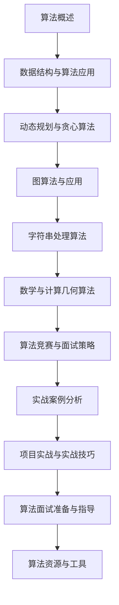

                 

### 文章标题

《网易2025届校招面试高频算法题解析》

---

### 关键词

- 校招面试
- 算法题解析
- 动态规划
- 图算法
- 字符串处理
- 数学与计算几何
- 实战案例分析

---

### 摘要

本文将针对网易2025届校招面试中高频出现的算法题进行深入解析。通过对算法基础、数据结构与算法应用、动态规划与贪心算法、图算法、字符串处理算法、数学与计算几何算法、算法竞赛与面试策略等章节的详细阐述，帮助读者掌握面试中的关键知识点，提高算法解题能力。此外，还将通过实战案例分析，让读者了解实际应用中的算法技巧，为应对校招面试做好充分准备。

---

### 《网易2025届校招面试高频算法题解析》目录大纲

#### 第一部分：算法基础

#### 第1章：算法概述
1.1 算法的基本概念
1.2 算法分析与复杂性
1.3 常见算法设计模式
1.4 算法思维培养

#### 第2章：数据结构与算法应用
2.1 数据结构基础
2.2 链表算法
2.3 栈和队列算法
2.4 树与图算法
2.5 查找算法
2.6 排序算法

#### 第3章：动态规划与贪心算法
3.1 动态规划原理
3.2 动态规划解题思路
3.3 贪心算法原理
3.4 贪心算法解题思路
3.5 动态规划与贪心算法综合应用

#### 第4章：图算法与应用
4.1 图的基本概念
4.2 深度优先搜索（DFS）
4.3 广度优先搜索（BFS）
4.4 最短路径算法
4.5 最小生成树算法
4.6 网络流算法

#### 第5章：字符串处理算法
5.1 字符串基本操作
5.2 字符串匹配算法
5.3 前缀树（Trie）算法
5.4 字符串变换与压缩算法

#### 第6章：数学与计算几何算法
6.1 数学基础知识
6.2 整数与浮点数运算优化
6.3 计算几何基本算法
6.4 几何问题求解

#### 第7章：算法竞赛与面试策略
7.1 算法竞赛介绍
7.2 面试算法题型分析
7.3 面试准备与策略
7.4 常见面试题解析

#### 第二部分：实战案例分析

#### 第8章：网易校招面试算法题实战
8.1 经典算法题解析
8.2 校招面试真题实战
8.3 算法题解法总结与拓展

#### 第9章：项目实战与实战技巧
9.1 项目实战介绍
9.2 项目实战代码实现
9.3 实战技巧与经验分享

#### 第10章：算法面试准备与指导
10.1 面试准备流程
10.2 常见面试问题汇总
10.3 面试指导与技巧

#### 附录：算法资源与工具
11.1 算法学习资源推荐
11.2 常用算法工具介绍
11.3 算法学习社区与论坛
11.4 算法竞赛平台介绍

---

### 附录 A：核心概念与联系

#### Mermaid 流程图



---

### 附录 B：核心算法原理讲解

#### 动态规划原理

**动态规划（Dynamic Programming，简称 DP）** 是一种在数学、管理科学、计算机科学、经济学和生物信息学中使用的，通过把原问题分解为相对简单的子问题的方式求解复杂问题的方法。动态规划常常用于求解优化问题。

**基本思想：**
1. **将原问题分解为子问题。**
2. **从最简单的子问题开始，自底向上或自顶向下依次求解子问题。**
3. **在子问题求解的过程中，保存子问题的解，避免重复计算。**

**状态转移方程：**
设 `dp[i][j]` 表示求解子问题时第 `i` 个元素和第 `j` 个元素的关系。

**递推关系：**
- **状态转移方程通常写成递推关系，例如：`dp[i] = dp[i-1] + dp[i-2]`**
- **状态转移方程需要满足无后效性，即当前状态只与相邻的前一个状态有关。**

**伪代码示例：**

```plaintext
for i from 1 to n do:
    for j from 1 to n do:
        dp[i][j] = 状态转移方程
```

---

### 附录 C：数学模型与公式

#### 最短路径算法中的距离公式

$$
d(u, v) = \min\left(\sum_{i=1}^{n} w_i, \sum_{i=1}^{n} w_i \cdot \frac{d(u, v)}{l}\right)
$$

其中，$u$ 和 $v$ 表示顶点，$w_i$ 表示从 $u$ 到 $v$ 的权值，$l$ 表示路径长度。

---

### 附录 D：代码实际案例

#### 暴力破解最大子序列和问题

```python
def maxSubArray(nums):
    n = len(nums)
    max_sum = float('-inf')
    for i in range(n):
        for j in range(i, n):
            curr_sum = 0
            for k in range(i, j+1):
                curr_sum += nums[k]
            max_sum = max(max_sum, curr_sum)
    return max_sum
```

---

### 作者信息

**作者：AI天才研究院/AI Genius Institute & 禅与计算机程序设计艺术 /Zen And The Art of Computer Programming**

