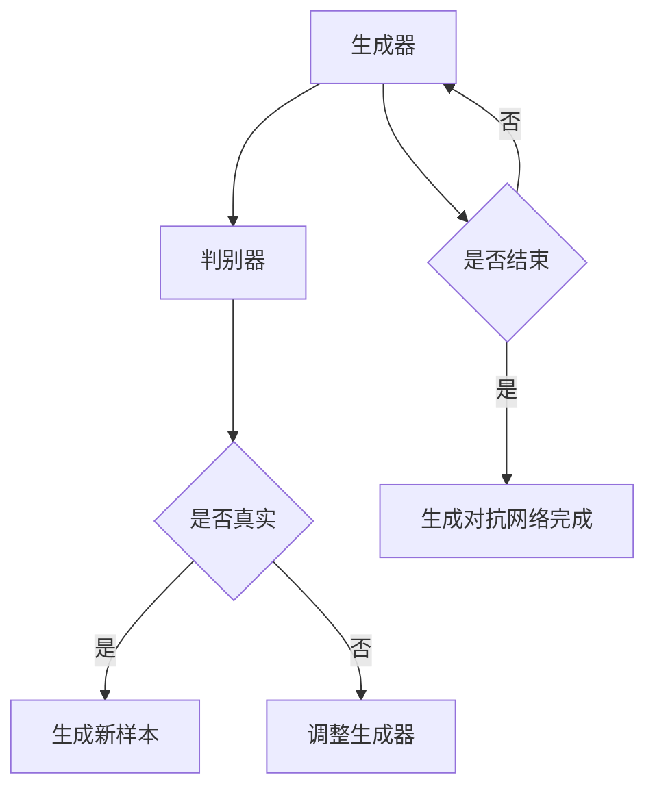

                 

### 文章标题：网易2025游戏AI对抗系统工程师社招面试攻略

#### 关键词：网易游戏AI，对抗系统，AI对抗，系统工程师，社招面试，算法原理，实战案例

> **摘要**：
本文旨在为有意向加入网易游戏AI对抗系统工程师岗位的应聘者提供一份详细的面试攻略。文章首先介绍了网易游戏AI对抗系统的背景和重要性，接着深入解析了游戏AI对抗系统的核心概念和算法原理。随后，通过具体的项目实战案例，展示了游戏AI对抗系统的实际开发和应用。最后，本文针对面试准备提供了详细的指南，包括常见面试问题解析和解决方案。希望本文能够帮助应聘者顺利通过面试，进入网易游戏AI团队。

## 《网易2025游戏AI对抗系统工程师社招面试攻略》目录大纲

### 第一部分：网易游戏AI对抗系统概述

#### 第1章：网易游戏AI对抗系统介绍

1.1 网易游戏AI对抗系统的核心地位

1.2 网易游戏AI对抗系统的架构设计

1.3 网易游戏AI对抗系统的发展历程

#### 第2章：游戏AI对抗系统的核心概念与联系

2.1 游戏AI的基本原理

2.2 对抗生成网络（GAN）的介绍

2.3 生成对抗网络（GAN）的Mermaid流程图

2.4 游戏中的对抗策略分析

### 第二部分：游戏AI对抗系统的算法原理

#### 第3章：核心算法原理讲解

3.1 对抗生成网络（GAN）的算法原理

3.2 生成对抗网络（GAN）的伪代码

3.3 GAN在游戏AI中的应用实例分析

#### 第4章：强化学习与对抗性策略

4.1 强化学习的基本原理

4.2 对抗性策略的算法原理

4.3 强化学习与对抗性策略的Mermaid流程图

4.4 游戏AI中的对抗性策略分析

### 第三部分：网易游戏AI对抗系统实战

#### 第5章：项目实战：游戏AI对抗系统开发

5.1 游戏AI对抗系统的开发环境搭建

5.2 游戏AI对抗系统的源代码实现

5.3 游戏AI对抗系统的代码解读与分析

#### 第6章：案例实战：网易游戏AI对抗系统应用案例

6.1 案例一：王者荣耀中的AI对抗系统

6.2 案例二：梦幻西游中的AI对抗系统

6.3 案例三：阴阳师中的AI对抗系统

### 第四部分：网易游戏AI对抗系统面试准备

#### 第7章：面试指南：网易游戏AI对抗系统面试题目解析

7.1 面试常见问题汇总

7.2 面试题目分类与解题技巧

7.3 网易游戏AI对抗系统的面试真题解析

### 第五部分：附录

#### 第8章：AI游戏开发资源汇总

8.1 主流游戏AI开发框架介绍

8.2 游戏AI开发常用工具

8.3 游戏AI开发参考资料与论文推荐

### **附录：核心概念与联系（Mermaid流程图）**



### **附录：核心算法原理讲解（伪代码）**

```python
# 生成器G的伪代码
Generator_G(z):
    z = 输入噪声
    x_g = G(z)  // 通过生成器生成样本
    return x_g

# 判别器D的伪代码
Discriminator_D(x):
    x = 输入样本
    x_hat = D(x)  // 判别器对真实样本进行判别
    x_g_hat = D(G(z))  // 判别器对生成器生成的样本进行判别
    return x_hat, x_g_hat
```

### **附录：数学模型和数学公式**

#### 生成对抗网络（GAN）的数学模型

生成对抗网络（GAN）主要包括两个模型：生成器（Generator）和判别器（Discriminator）。以下是它们的数学模型：

**生成器（Generator）：**

\[ \min_G V(D, G) = \mathbb{E}_{x \sim p_{data}(x)}[\log D(x)] + \mathbb{E}_{z \sim p_z(z)}[\log (1 - D(G(z)))] \]

**判别器（Discriminator）：**

\[ \max_D V(D, G) = \mathbb{E}_{x \sim p_{data}(x)}[\log D(x)] + \mathbb{E}_{z \sim p_z(z)}[\log (1 - D(G(z)))] \]

其中，\( x \) 表示真实数据，\( z \) 表示噪声向量，\( D \) 表示判别器，\( G \) 表示生成器。

### **附录：项目实战**

#### 网易游戏AI对抗系统开发环境搭建

1. 安装Python环境和相关依赖库，如TensorFlow、Keras等。
2. 配置开发环境，包括代码编辑器（如VS Code）、版本控制工具（如Git）等。
3. 准备游戏数据集，并进行预处理。

```python
# 安装TensorFlow
!pip install tensorflow

# 安装其他依赖库
!pip install numpy matplotlib

# 配置开发环境
# 使用VS Code打开项目文件夹
# 配置Git，将代码提交到远程仓库

# 准备游戏数据集
# 加载数据集并进行预处理
# 分割数据集为训练集和测试集
```

#### 游戏AI对抗系统的源代码实现

```python
# 导入相关库
import tensorflow as tf
from tensorflow.keras.models import Model
from tensorflow.keras.layers import Input, Dense, Flatten, Reshape

# 定义生成器模型
z = Input(shape=(100,))
x_g = Dense(256, activation='relu')(z)
x_g = Dense(512, activation='relu')(x_g)
x_g = Dense(784, activation='sigmoid')(x_g)
x_g = Reshape((28, 28))(x_g)
generator = Model(z, x_g)

# 定义判别器模型
x = Input(shape=(28, 28))
x_hat = Flatten()(x)
x_hat = Dense(256, activation='relu')(x_hat)
x_hat = Dense(512, activation='relu')(x_hat)
x_hat = Dense(1, activation='sigmoid')(x_hat)
discriminator = Model(x, x_hat)

# 定义GAN模型
discriminator.trainable = False
z = Input(shape=(100,))
x_g = generator(z)
x_g_hat = discriminator(x_g)
gan = Model(z, x_g_hat)

# 编译模型
discriminator.compile(optimizer='adam', loss='binary_crossentropy')
gan.compile(optimizer='adam', loss='binary_crossentropy')

# 训练模型
# 搭建训练流程
```

#### 游戏AI对抗系统的代码解读与分析

```python
# 生成器模型的解读
# z为噪声向量，通过全连接层生成28*28的图像
# 生成器模型的目的是生成逼真的图像，从而欺骗判别器模型

# 判别器模型的解读
# x为输入的图像，通过全连接层判断图像的真实性
# 判别器模型的目的是区分输入图像是真实图像还是生成图像

# GAN模型的解读
# 将生成器和判别器组合在一起，形成完整的GAN模型
# GAN模型的训练目标是最大化判别器的损失函数，同时最小化生成器的损失函数

# 模型的训练
# 在训练过程中，生成器会尝试生成更逼真的图像，判别器会尝试提高对真实图像和生成图像的判别能力
```

#### 案例实战：网易游戏AI对抗系统应用案例

##### 案例一：王者荣耀中的AI对抗系统

王者荣耀是一款高度竞技性的游戏，AI对抗系统的设计旨在提高游戏的人工智能水平，增强游戏的可玩性和挑战性。在王者荣耀中，AI对抗系统主要应用于以下几个方面：

1. **角色技能模拟**：通过AI算法模拟游戏角色技能的效果，包括技能释放时机、技能组合等，使游戏角色的行为更加智能和多样化。
2. **敌人行为预测**：通过分析玩家的行为模式，预测敌人的下一步行动，为玩家提供应对策略。
3. **团队合作策略**：AI系统可以根据玩家的角色和位置，制定最优的团队合作策略，提高团队的作战效率。

##### 案例二：梦幻西游中的AI对抗系统

梦幻西游是一款经典的角色扮演游戏，AI对抗系统在游戏中的设计侧重于增强游戏的可玩性和趣味性。梦幻西游的AI对抗系统主要应用于以下几个方面：

1. **怪物智能行为**：通过AI算法模拟怪物的行为，使其具有更高的智能和挑战性，增加游戏的难度。
2. **玩家行为分析**：通过分析玩家的行为数据，预测玩家的下一步行动，为怪物提供应对策略。
3. **游戏平衡调整**：AI系统可以根据玩家的游戏行为，调整游戏中的难度和奖励机制，保持游戏的平衡性。

##### 案例三：阴阳师中的AI对抗系统

阴阳师是一款以妖怪为主题的卡牌游戏，AI对抗系统在游戏中的设计旨在提高游戏的人工智能水平和玩家的游戏体验。阴阳师的AI对抗系统主要应用于以下几个方面：

1. **式神行为模拟**：通过AI算法模拟式神的行为，使其具有更高的智能和可玩性，增加游戏的趣味性。
2. **玩家对手分析**：通过分析玩家的对手阵容和战斗记录，预测对手的行动策略，为玩家提供应对策略。
3. **游戏策略调整**：AI系统可以根据玩家的游戏行为，调整游戏中的策略和奖励机制，提高玩家的游戏体验。

### **网易游戏AI对抗系统面试指南**

#### 面试常见问题汇总

1. 请简要介绍一下你对游戏AI对抗系统的理解。
2. 你是如何理解生成对抗网络（GAN）的？
3. 请解释一下对抗生成网络（GAN）的工作原理。
4. 你在游戏开发中有过哪些相关经验？
5. 你是如何解决游戏AI中的平衡性和可玩性问题？
6. 你有哪些优化的策略来提高游戏AI的性能？

#### 面试题目分类与解题技巧

1. **基本概念题**：这类题目主要考察应聘者对游戏AI对抗系统基本概念的理解，例如GAN的基本原理、强化学习在游戏AI中的应用等。解题技巧是首先要准确理解概念，然后结合实际应用进行阐述。

2. **算法原理题**：这类题目主要考察应聘者对相关算法原理的掌握程度，例如GAN的数学模型、对抗性策略的设计等。解题技巧是要求应聘者能够清晰、准确地描述算法原理，并通过具体的例子进行说明。

3. **实战案例题**：这类题目主要考察应聘者在实际项目中应用AI对抗系统的能力，例如如何在游戏中实现AI对抗、如何优化AI性能等。解题技巧是应聘者需要结合自己的项目经验，详细阐述自己在实际项目中遇到的问题以及解决方案。

#### 网易游戏AI对抗系统的面试真题解析

1. **题目**：请描述一下生成对抗网络（GAN）的基本原理和应用场景。

   **解题思路**：首先简要介绍GAN的基本原理，包括生成器和判别器的定义和作用。然后详细解释GAN的工作流程，包括生成器如何生成样本、判别器如何判断样本的真实性，以及两者之间的互动。最后，列举几个GAN在游戏AI中的应用场景，例如角色技能模拟、敌人行为预测等。

2. **题目**：请解释一下对抗生成网络（GAN）的数学模型，并给出一个生成器和判别器的伪代码。

   **解题思路**：首先简要介绍GAN的数学模型，包括生成器和判别器的损失函数。然后详细解释每个损失函数的含义，以及它们如何指导生成器和判别器的训练。最后，给出一个生成器和判别器的伪代码，并解释每个步骤的目的。

3. **题目**：请谈谈你在游戏开发中遇到的AI平衡性和可玩性问题，以及你是如何解决的。

   **解题思路**：首先描述一个具体的问题场景，例如某款游戏中AI对手过于强大或过于弱小。然后详细阐述你是如何分析和定位问题的，包括数据的收集和分析、算法的调整和优化等。最后，总结你的解决方案的效果，以及可能存在的不足和改进方向。

### **附录：AI游戏开发资源汇总**

#### 8.1 主流游戏AI开发框架介绍

1. **Unity ML-Agents**：Unity官方推出的机器学习框架，支持在Unity环境中训练和部署AI模型。
2. **OpenAI Gym**：OpenAI推出的虚拟环境库，用于训练和测试强化学习算法。
3. **PyTorch**：流行的深度学习框架，适用于游戏AI开发。
4. **TensorFlow**：谷歌推出的深度学习框架，广泛应用于游戏AI领域。

#### 8.2 游戏AI开发常用工具

1. **TensorBoard**：用于可视化深度学习模型的训练过程和性能指标。
2. **Docker**：用于创建和部署可移植的容器化应用程序。
3. **Jupyter Notebook**：用于编写和运行Python代码，便于数据分析和模型训练。

#### 8.3 游戏AI开发参考资料与论文推荐

1. **《生成对抗网络》（Generative Adversarial Networks）**：Ian J. Goodfellow等人的论文，是GAN领域的经典之作。
2. **《深度强化学习》（Deep Reinforcement Learning）**：David Silver等的论文，全面介绍了深度强化学习的方法和应用。
3. **《游戏AI入门》（Introduction to Game AI）**：Matthias Gruen等人的著作，详细介绍了游戏AI的基本原理和实战应用。

### **小结**

本文详细介绍了网易游戏AI对抗系统工程师的社招面试攻略，从背景介绍、核心概念与联系、算法原理、实战案例到面试准备，全方位为应聘者提供了指导。通过对游戏AI对抗系统的深入剖析，本文希望帮助应聘者更好地理解这一领域，提升面试表现，顺利加入网易游戏团队。在未来的发展中，随着技术的不断进步和应用的拓展，游戏AI对抗系统将迎来更多的发展机遇，为游戏产业带来全新的变革。

### **注意事项**

1. **技术理解**：在面试过程中，应聘者需要展示对游戏AI对抗系统的深刻理解，包括基本原理、算法模型和实际应用。
2. **项目经验**：应聘者应准备相关的项目案例，展示自己在游戏AI对抗系统开发中的实际经验和成果。
3. **沟通能力**：面试过程中，应聘者需要清晰地表达自己的观点和思路，与面试官进行有效的沟通和互动。

### **拓展阅读**

1. **《深度学习》（Deep Learning）**：Ian J. Goodfellow等的著作，全面介绍了深度学习的理论和应用。
2. **《强化学习导论》（Introduction to Reinforcement Learning）**：理查德·萨顿（Richard Sutton）和安德斯·彭德莱（Andrew Barto）的著作，详细介绍了强化学习的基本原理和方法。
3. **《游戏AI设计与实现》（Game AI Design and Implementation）**：史蒂夫·霍华德（Steve Howard）的著作，介绍了游戏AI的设计和实现方法。

