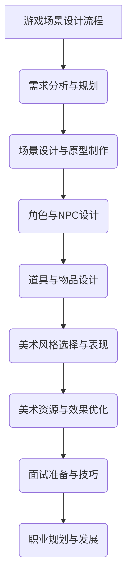

                 

### 引言

#### 《网易2025社招游戏场景设计师面试题汇总》的背景与目的

随着游戏行业的迅猛发展，网易作为中国领先的游戏开发与运营公司之一，其游戏设计岗位的需求逐年增长。为了吸引并留住优秀的人才，网易在2025年的社会招聘中特别重视对游戏场景设计师的选拔。游戏场景设计作为游戏开发的重要环节，直接影响到玩家的游戏体验和整体游戏质量。

本篇文章的目的在于为广大有志于加入网易游戏设计团队的人才提供一个宝贵的面试题汇总资源。通过梳理和解析网易2025年社招中的游戏场景设计师面试题，本文将帮助读者：

1. **了解游戏场景设计师的岗位职责与要求**：通过对面试题的分析，帮助读者了解游戏场景设计师所需掌握的核心技能和知识结构。
2. **掌握面试准备技巧**：为读者提供面试准备的建议和策略，使他们在面试中能够更加自信和从容地应对各类问题。
3. **提升游戏设计能力**：通过对面试题的详细解析，深入探讨游戏设计原理、技巧和最佳实践，助力读者提升自身的游戏设计水平。

本文将分四个部分进行详细阐述。第一部分将介绍游戏设计的基础知识和面试技巧；第二部分将深入探讨游戏场景设计的原理和流程；第三部分将解析游戏场景元素的设计方法；第四部分将针对具体的面试题目进行实战演练和技巧提升。通过这一步步的分析和讲解，读者将能够系统地掌握游戏场景设计的核心要点，为应对网易2025年的社招面试做好充分准备。

#### 网易游戏行业的社招趋势

近年来，随着游戏市场的不断壮大和技术的迅猛发展，网易游戏行业的社会招聘趋势呈现出一些显著特点。首先，网易对游戏设计岗位的招聘需求持续增长，特别是在游戏场景设计师这一职位上。这反映了网易对游戏品质和用户体验的高度重视，以及其对创新型设计人才的渴求。

一方面，游戏行业的竞争愈发激烈，各大游戏公司都在努力提升自身产品的核心竞争力。优秀的游戏场景设计师能够通过独特的创意和精湛的技术，创造出令人耳目一新的游戏场景，从而吸引和留住玩家。因此，网易在招聘中更加关注设计师的创新能力和实际操作能力。

另一方面，游戏技术的快速发展也对设计师提出了更高的要求。例如，虚拟现实（VR）和增强现实（AR）技术的应用，要求设计师具备更强的跨学科知识和技能，能够融合多种技术手段创造出沉浸式的游戏体验。因此，网易在社招过程中，不仅看重候选人的设计能力，还注重其对新兴技术的掌握和运用。

此外，网易在社招中还注重候选人的团队合作和沟通能力。游戏开发是一个高度协作的过程，设计师需要与程序员、美术师、音效师等多个岗位的同事紧密合作，共同推进项目的进展。因此，在面试中，网易会通过设计题目、团队合作模拟等方式，考察候选人的沟通协调能力和团队协作精神。

总的来说，网易游戏行业的社招趋势不仅反映了行业的发展和变化，也为广大求职者提供了广阔的机遇。通过深入了解这些趋势和要求，求职者可以更有针对性地进行面试准备，提升自己的竞争力，争取在网易的游戏设计团队中找到一席之地。

### 面试准备与技巧

#### 游戏设计基础

在准备游戏场景设计师的面试时，了解游戏设计的基础是至关重要的。游戏设计包括多个核心要素，如游戏玩法、故事情节、角色设定、场景设计等。以下将详细探讨这些要素及其在设计过程中的重要性。

1. **游戏玩法**：游戏玩法的核心是吸引玩家并使其保持兴趣。一个成功的游戏玩法设计应该具备以下特点：
   - **趣味性**：游戏玩法应当有趣且新颖，能够引发玩家的兴趣和好奇心。
   - **挑战性**：适当的挑战能够激发玩家的竞争心理，使玩家不断尝试和进步。
   - **可重复性**：游戏玩法应当具有可重复性，使玩家可以在不同的情境和挑战下体验游戏。

2. **故事情节**：故事情节是游戏的重要组成部分，能够为游戏增加深度和情感。一个优秀的游戏故事应当具备以下特点：
   - **连贯性**：故事情节应当连贯且逻辑清晰，使玩家能够顺畅地理解并沉浸其中。
   - **吸引力**：故事情节应当富有吸引力，能够激发玩家的探索欲望。
   - **情感共鸣**：通过故事情节，设计师可以与玩家建立情感联系，使玩家产生共鸣。

3. **角色设定**：角色是游戏世界的重要组成部分，能够为游戏增添色彩和真实性。以下是角色设定的关键要点：
   - **个性鲜明**：每个角色都应当有独特的个性和背景故事，使玩家能够对角色产生深刻的印象。
   - **互动性**：角色之间应当有互动和冲突，增强游戏的沉浸感和戏剧性。
   - **成长性**：角色应当具备成长性，使玩家能够在游戏中体验到角色的发展和变化。

4. **场景设计**：场景设计是游戏设计中不可或缺的一部分，它直接影响玩家的游戏体验。以下是场景设计的关键要点：
   - **氛围营造**：通过色彩、光影、声音等手段，创造出不同的场景氛围，增强玩家的沉浸感。
   - **互动性**：场景中的元素应当与玩家的互动紧密相连，使玩家能够在游戏中体验到丰富的交互性。
   - **故事性**：场景设计应当与故事情节紧密结合，为玩家提供丰富的视觉和故事体验。

在游戏设计过程中，这些核心要素并不是孤立存在的，而是相互关联、相互促进的。例如，游戏玩法的挑战性可以驱动玩家探索故事情节，而角色设定则可以增强玩家与游戏世界的情感联系。因此，设计师在设计和实施游戏时，需要综合考虑这些要素，确保它们在游戏中能够和谐共存、相互提升。

综上所述，掌握游戏设计的基础要素对于成为一名优秀的游戏场景设计师至关重要。这不仅有助于设计师在面试中展现出扎实的专业能力，还能在实际工作中创造出高质量的、深受玩家喜爱的游戏作品。

#### 游戏玩法设计的方法论

在游戏设计中，游戏玩法设计占据着至关重要的地位。一个成功的游戏玩法不仅能够吸引玩家，还能让他们在游戏中保持高度的参与感和乐趣。以下将详细探讨游戏玩法设计的方法论，包括设计原则、核心概念和实际案例。

1. **设计原则**
   - **简洁性**：游戏玩法应当简单明了，使玩家容易上手和理解。复杂的规则和机制不仅会增加玩家的学习成本，还可能导致玩家流失。
   - **挑战性**：游戏玩法应当具有一定的挑战性，以激发玩家的探索欲望和成就感。挑战不应过于困难，以免让玩家感到沮丧，也不应过于简单，以免失去趣味性。
   - **多样性**：游戏玩法应当多样化，提供多种不同的游戏体验。这不仅可以延长游戏的生命周期，还能满足不同玩家的需求。
   - **适应性**：游戏玩法应当能够适应不同玩家的能力和喜好。例如，通过调整难度、增加隐藏关卡等方式，使游戏对所有人都有吸引力。

2. **核心概念**
   - **目标**：每个游戏都应当有一个明确的目标，引导玩家前进。这个目标可以是击败敌人、完成任务、获得高分等。
   - **规则**：游戏规则是玩家进行游戏的基础，应当明确且公平。规则的设定应当有助于实现游戏目标，并确保游戏的可玩性。
   - **反馈**：游戏应当及时给予玩家反馈，让他们了解自己的进展和成绩。反馈可以是视觉、听觉或者文本提示，目的是让玩家感到自己在游戏中取得进展。
   - **奖励**：奖励是激励玩家继续游戏的重要手段。奖励可以是虚拟货币、道具、等级提升等，使玩家在达成目标后获得成就感和满足感。

3. **实际案例**
   - **《塞尔达传说：荒野之息》**：这款游戏以其开放世界和高度自由的游戏玩法而闻名。玩家可以在广阔的塞尔达世界中自由探索，完成任务，与NPC互动。游戏的目标是拯救塞尔达王国，规则简单明了，但游戏中的各种机制和谜题提供了丰富的挑战性。游戏通过多种反馈和奖励机制，如收集物品、提升技能和探索新区域，使玩家始终保持兴趣。
   - **《英雄联盟》**：这款竞技游戏以其复杂的游戏玩法和团队合作而著称。玩家需要选择英雄，组建团队，在游戏中与其他玩家竞争。游戏的目标是摧毁对方的主基地，规则包括不同的游戏模式和限制。游戏通过多种反馈和奖励机制，如经验值、金币和装备，鼓励玩家在游戏中不断进步和提升。

通过上述设计原则和实际案例，我们可以看出，游戏玩法设计不仅需要考虑玩家的体验，还要结合游戏的核心目标和其他设计要素。设计师在制定游戏玩法时，应当综合考虑这些因素，确保游戏既有趣又具有挑战性，从而吸引并留住玩家。

#### 面试准备与技巧

在准备游戏场景设计师的面试时，掌握一些关键的技巧和策略是至关重要的。这不仅有助于你在面试中表现出色，还能增强你的自信心和面试官对你的好感。以下将详细介绍面试官期望的游戏设计能力、常见面试题型及应对策略，帮助你更好地应对面试挑战。

1. **面试官期望的游戏设计能力**
   - **创意思维**：面试官往往期待你能展现出独特的创意思维，能够提出新颖的游戏玩法和场景设计。
   - **技术理解**：除了创意，面试官还会考察你对游戏引擎、编程语言和工具的熟悉程度，以及你在实现游戏设计时的技术能力。
   - **沟通能力**：游戏设计是一个团队合作的过程，面试官会关注你的沟通能力和团队协作精神。
   - **实践经验**：面试官希望看到你过去在游戏设计方面所取得的实际成果，包括项目经验、设计作品和参与的项目。
   - **问题解决能力**：面试官会通过设计题或技术问题，考察你面对复杂问题时的分析能力和解决策略。

2. **常见面试题型及应对策略**
   - **设计题**：这类题目通常要求你根据某个主题或需求，设计一个游戏场景或玩法。应对策略包括：
     - **快速构思**：在短时间内快速列出设计思路，包括核心玩法、角色设定、场景布局等。
     - **逻辑清晰**：在设计过程中，确保你的思路逻辑清晰，能够清楚地表达你的设计理念和思路。
     - **突出亮点**：在设计中突出亮点，展示你的创意和独特的视角。
   - **技术问题**：这类题目主要考察你对游戏开发相关技术的理解。应对策略包括：
     - **基础知识**：确保你掌握了游戏开发的基础知识，如数据结构、算法、游戏引擎等。
     - **实际应用**：结合实际项目经验，展示你在技术问题上的实际应用能力。
     - **问题分析**：在面对复杂问题时，能够迅速分析问题，提出合理的解决方案。

3. **模拟面试与自我评估**
   - **模拟面试**：找朋友或同事进行模拟面试，模拟真实的面试环境，帮助你在实际面试中更加自信和从容。
   - **自我评估**：在模拟面试和实际面试后，进行自我评估，分析自己在哪些方面做得好，哪些方面需要改进。

通过上述策略和技巧，你将能够更好地准备游戏场景设计师的面试，提升自己的面试表现，从而在激烈的招聘竞争中脱颖而出。

### 游戏场景设计原理

#### 游戏场景设计的基本原则

游戏场景设计是游戏设计中至关重要的一环，它直接影响玩家的沉浸感和游戏体验。为了创造出富有吸引力和互动性的游戏场景，设计师需要遵循一些基本原则。

1. **氛围营造**：氛围是游戏场景的灵魂，通过色彩、光影、声音等元素，可以营造出不同的情感和氛围。例如，使用明亮的色彩和温暖的光线可以营造出轻松愉快的氛围，而阴暗的光线和深沉的色彩则可以营造出紧张刺激的氛围。氛围的营造不仅增强了游戏的视觉和听觉体验，还能与玩家的情感产生共鸣。

2. **互动性**：游戏场景中的互动性是提升玩家体验的关键。设计师需要在场景中设计多种互动元素，如可交互的道具、动态的NPC（非玩家角色）和可探索的区域。这些互动元素可以激发玩家的探索欲望，增加游戏的可玩性。此外，互动性还可以通过玩家的行为产生反馈，进一步增强玩家的参与感。

3. **故事性**：游戏场景应当与游戏的故事情节紧密结合，通过场景的设计和互动，传达故事的核心内容和情感。故事性的设计不仅增加了游戏的深度，还能让玩家更加投入游戏世界。设计师可以通过布局、道具和NPC的设定来增强场景的故事性，使玩家在游戏中感受到连贯且引人入胜的故事情节。

4. **功能性**：游戏场景的设计不仅要追求美观和互动性，还需要具备功能性。功能性指的是场景在游戏中的实际作用，如战斗场景、任务场景、休息场景等。不同功能性的场景设计需要满足特定的游戏需求，使玩家能够顺利完成任务，体验游戏的不同阶段。

5. **沉浸感**：沉浸感是游戏场景设计的最终目标，通过逼真的视觉效果、生动的音效和丰富的互动性，使玩家仿佛置身于游戏世界中。设计师需要从多个方面考虑如何增强玩家的沉浸感，如真实的物理模拟、细致的角色建模、真实的音效和互动机制等。

6. **平衡性**：在设计游戏场景时，需要保持平衡性，确保场景的各个元素之间相互协调，不偏不倚。平衡性包括难度平衡、任务平衡和角色平衡等。合理的平衡性可以使玩家在游戏中获得持续的挑战和乐趣，避免因难度过高或过低而失去兴趣。

通过遵循这些基本原则，设计师可以创造出富有魅力和互动性的游戏场景，提升玩家的游戏体验，使他们在游戏世界中流连忘返。

#### 游戏场景设计的流程

游戏场景设计的流程是一个系统化、层次分明的过程，涉及多个阶段，每个阶段都有其特定的目标和任务。以下将详细介绍游戏场景设计的流程，包括需求分析与规划、场景设计与原型制作等关键步骤。

1. **需求分析与规划**
   - **需求收集**：在开始设计之前，首先需要明确游戏的整体需求和目标，这通常涉及游戏类型、主题、目标玩家群体和核心玩法等。通过市场调研、玩家反馈和游戏策划团队的需求讨论，收集到详细的需求文档。
   - **需求分析**：对收集到的需求进行深入分析，明确每个场景的设计目标、功能和交互需求。分析过程中需要考虑玩家的行为模式、情感需求和游戏的整体节奏，确保每个场景都能为游戏目标做出贡献。
   - **规划场景**：根据需求分析的结果，对游戏中的各个场景进行初步规划，包括场景的类型、布局、互动元素和故事情节等。这一阶段需要制作详细的场景列表和原型，确保设计团队对每个场景有清晰的认识。

2. **场景设计与原型制作**
   - **初步设计**：在规划阶段结束后，开始进入具体的场景设计阶段。这一阶段包括场景的视觉设计、交互设计和故事情节设计。视觉设计关注场景的视觉效果和氛围营造，交互设计关注场景中的可交互元素和行为逻辑，故事情节设计则确保场景与游戏故事紧密相连。
   - **原型制作**：在设计过程中，制作初步的原型，以便设计团队和策划团队进行评估和反馈。原型可以是低 fidelity 的草图或高 fidelity 的3D模型，具体选择取决于项目需求和开发周期。通过原型制作，可以直观地展示场景的设计思路和效果，便于调整和优化。
   - **反馈与迭代**：在原型制作完成后，设计团队将原型展示给策划团队和其他相关利益方进行评估。根据反馈，对原型进行多次迭代和优化，确保场景设计满足需求并符合整体游戏设计。迭代过程中需要密切关注玩家的反馈，确保设计符合玩家期望。

3. **场景测试与优化**
   - **测试**：在完成初步设计后，对游戏场景进行严格的测试，包括功能测试、交互测试和情感测试等。功能测试确保场景中的所有元素都能正常工作，交互测试验证玩家的操作和场景的反馈是否合理，情感测试则评估场景是否能够引起玩家的情感共鸣。
   - **优化**：根据测试结果，对场景进行优化，解决发现的问题和不足。优化包括视觉调整、交互优化和故事情节的微调等。这一阶段需要反复测试和调整，确保场景设计在视觉、交互和情感方面都达到最佳效果。

通过上述流程，设计师可以系统地完成游戏场景的设计工作，确保每个场景都能为游戏的整体体验做出贡献。从需求分析到原型制作，再到测试和优化，每个阶段都有其特定的任务和目标，通过科学的方法和精细的管理，最终创造出高质量的游戏场景。

#### 场景中的角色与NPC设计

角色与NPC（非玩家角色）的设计是游戏场景设计中的一个重要环节，直接影响到玩家的游戏体验和沉浸感。以下将详细探讨角色设定的要点和NPC行为的多样化设计。

1. **角色设定的要点**
   - **个性鲜明**：每个角色都应具有独特的个性和背景故事，使玩家能够对其产生深刻的印象。个性可以通过角色外貌、性格特点、行为习惯等方面进行塑造。例如，一个勇敢的战士可能外表粗犷，性格坚毅，而一个聪明的法师则可能外表文雅，思维敏捷。
   - **角色关系**：角色之间的关系是游戏故事的重要推动力。通过设定角色之间的关系，如朋友、敌人、盟友等，可以增加游戏的戏剧性和情感深度。角色之间的互动和冲突能够激发玩家的兴趣和情感共鸣。
   - **角色成长**：角色的成长性是提升玩家沉浸感的关键。通过角色的技能提升、装备升级和故事发展，玩家能够感受到角色的变化和成长，从而增强对角色的情感投入。
   - **角色目标**：每个角色都应有明确的目标和动机，使玩家能够理解他们的行为和决策。角色的目标应与游戏整体故事和玩法相一致，确保角色的行为逻辑性和合理性。

2. **NPC行为的多样化设计**
   - **行为模式**：NPC的行为模式应多样化，以避免角色刻板化和游戏体验的单调。可以通过设定不同的行为策略和决策树，使NPC在游戏中表现出不同的行为。例如，某些NPC可能具有防御性，而另一些则可能具有攻击性。
   - **动态交互**：NPC的动态交互是提升游戏沉浸感的重要手段。可以通过语音对话、动作反应和任务互动等方式，使NPC与玩家之间产生真实的互动。例如，玩家在完成任务时，NPC可能会提供帮助、提出问题或给予奖励。
   - **情感表达**：NPC的情感表达可以增强游戏的故事性和情感共鸣。通过角色表情、动作和对话的设置，使NPC显得更加生动和真实。例如，一个悲伤的NPC可能会低头叹息，一个愤怒的NPC可能会挥舞拳头。
   - **随机性**：为了增加游戏的可玩性和不确定性，可以设计一些随机事件和NPC行为。这些随机性可以激发玩家的探索欲望和惊喜感，使游戏体验更加丰富和有趣。例如，某个NPC可能在特定时间出现或消失，或者在某些条件满足时触发特定事件。

通过上述要点和设计方法，游戏设计师可以创造出丰富多彩的角色和NPC，提升玩家的游戏体验和沉浸感。无论是主角还是NPC，每个角色都应具有独特性和深度，使玩家能够在游戏中感受到真实和有趣的世界。

#### 场景中的道具与物品设计

在游戏场景中，道具与物品的设计不仅是提升游戏丰富度和趣味性的关键，更是增强玩家互动体验的重要组成部分。以下将详细探讨道具的分类与功能、以及物品系统的设计原则。

1. **道具的分类与功能**
   - **主要道具**：这些是游戏中最核心的道具，通常与游戏的主要玩法和目标紧密相关。例如，在角色扮演游戏中，主要道具可能包括武器、防具、魔法卷轴等，这些道具直接影响角色的战斗力、生存能力或者技能释放。
   - **辅助道具**：这类道具虽然不直接参与战斗，但能够提高玩家在游戏中的便利性。例如，恢复类道具（如药品）、增益类道具（如食物）和道具盒等，可以帮助玩家在关键时刻恢复体力或获得额外的游戏优势。
   - **特殊道具**：这些道具通常具有独特的功能，可能是一次性的，也可能具备特殊的效果。例如，传送道具可以快速移动玩家到特定的地图位置，而隐藏任务道具则可能触发一些隐藏剧情或奖励。
   - **环境道具**：这些道具主要用于增强游戏场景的互动性和沉浸感。例如，可互动的家具、装饰品、陷阱等，能够使游戏场景更加丰富和生动。

2. **物品系统的设计原则**
   - **功能性**：每个道具都应该具备明确的功能和用途，使玩家在使用时能够迅速理解其作用和价值。设计过程中需要确保道具的功能合理且易于理解，避免玩家产生困惑或使用不当。
   - **平衡性**：物品系统需要保持平衡，确保不同道具之间不会相互干扰，同时也要考虑到游戏的整体难度和玩家的体验。例如，过强或过弱的道具都可能导致游戏体验失衡，影响玩家的游戏感受。
   - **多样性**：道具的设计应具备多样性，以满足不同玩家的需求和喜好。通过多样化的道具，不仅可以提升游戏的趣味性和挑战性，还能延长游戏的生命周期，使玩家在长时间的游戏过程中保持新鲜感。
   - **成长性**：物品系统应具备成长性，使玩家在游戏过程中能够不断获得新的道具，体验到角色的成长和进步。这可以通过道具的升级、特殊道具的解锁等方式实现，使玩家在游戏中不断追求更高的成就。
   - **收集性**：一些道具可以设计为需要收集或寻找的，这可以增加游戏的探索元素和成就感。例如，隐藏在游戏世界中的稀有道具，玩家需要通过完成任务或探索特定地点才能获得。
   - **情感共鸣**：道具的设计应考虑与玩家情感上的共鸣，通过有趣的故事背景、独特的造型设计或功能上的巧妙设计，使玩家产生情感投入，进一步加深对游戏的喜爱。

通过遵循上述设计原则，游戏设计师可以创造出丰富多样且具有吸引力的道具和物品系统，提升玩家的游戏体验和互动感，使游戏更加引人入胜。

### 游戏场景美术风格

#### 美术风格的选择与表现

在游戏场景设计中，美术风格的选择与表现至关重要，它不仅决定了游戏的整体视觉效果，还直接影响到玩家的沉浸感和游戏体验。不同的美术风格各有特点，适用于不同的游戏类型和主题。以下将详细探讨美术风格的选择、表现及其在游戏设计中的重要性。

1. **美术风格的选择**
   - **写实风格**：写实风格以其逼真的视觉效果著称，力求在游戏中再现现实世界的细节和质感。这种风格通常适用于模拟类游戏和高端的开放世界游戏，如《塞尔达传说：荒野之息》和《刺客信条》系列。写实风格要求高度精细的建模、光影效果和材质表现，需要较大的计算资源和美术投入。
   - **卡通风格**：卡通风格以其简洁、明快的视觉效果和独特的艺术感而受到许多游戏的青睐。这种风格通过夸张的造型、鲜艳的色彩和简洁的线条，创造出一种独特的艺术氛围，使游戏显得更加生动和有趣。卡通风格适用于面向年轻玩家或儿童的游戏，如《宝可梦》系列和《超级马里奥》系列。
   - **复古风格**：复古风格则追求怀旧感，通过模仿经典游戏时代的艺术风格和设计元素，营造一种复古的游戏体验。这种风格通常适用于重制版游戏、独立游戏或复古主题的游戏，如《银河战士：黑暗之魂》和《复古未来：太空海盗》。
   - **像素风格**：像素风格以其独特的像素化视觉效果和复古的游戏体验而受到许多独立游戏开发者的喜爱。这种风格通过简化的像素图形和鲜艳的色彩，创造出一种独特的视觉美感，同时营造出一种怀旧和复古的游戏氛围。像素风格适用于独立游戏和复古主题的游戏，如《森林》和《空洞骑士》。

2. **美术风格的表现**
   - **视觉效果**：美术风格的表现首先体现在视觉效果上。设计师需要通过色彩、光线、纹理和阴影等手段，创造出符合所选风格的整体视觉效果。例如，在写实风格中，强调真实的阴影和高光效果；在卡通风格中，使用鲜艳的色彩和夸张的光影来增强视觉效果。
   - **角色设计**：角色设计是美术风格表现的重要方面。设计师需要根据所选风格，设计出具有独特特征和表情的角色。例如，在卡通风格中，角色可能具有夸张的外貌和表情；在写实风格中，角色则可能更加逼真和细腻。
   - **场景设计**：场景设计同样需要根据美术风格进行表现。场景中的建筑、环境、道具等元素都需要符合所选风格，以确保整体视觉效果的协调和统一。例如，在复古风格中，场景可能采用复古的建筑和装饰元素；在像素风格中，场景则通过简化的像素图形来呈现。
   - **氛围营造**：美术风格的表现还体现在氛围的营造上。通过色彩、光影、声音等手段，创造出符合风格的游戏氛围。例如，在写实风格中，通过逼真的光影和音效，营造出真实感强烈的游戏环境；在卡通风格中，通过明亮的色彩和欢快的音效，营造出轻松愉快的游戏氛围。

3. **风格一致性在游戏设计中的重要性**
   - **增强沉浸感**：风格一致性有助于增强玩家的沉浸感，使玩家更容易投入到游戏世界中。当玩家看到角色和环境都符合某一特定的美术风格时，他们会更容易相信这是真实存在的游戏世界，从而提高游戏体验。
   - **提升视觉美感**：一致的风格有助于提升游戏的视觉美感，使游戏看起来更加专业和精致。不同的美术风格各有特点，但只有保持风格一致性，才能使这些特点得到充分发挥，创造出独特的视觉艺术效果。
   - **降低设计复杂度**：风格一致性有助于降低设计的复杂度，使设计师能够更专注于某一特定风格的设计和实现。避免了在多个不同风格之间来回切换，降低了设计难度和时间成本。
   - **品牌建设**：对于游戏公司来说，统一的美术风格有助于建立品牌形象，使游戏具有独特的识别度和记忆点。这不仅可以吸引玩家，还能提升公司的市场竞争力。

综上所述，美术风格的选择与表现是游戏场景设计中至关重要的一环。通过选择合适的美术风格，并确保风格的一致性，设计师可以创造出独特的游戏世界，提升玩家的沉浸感和游戏体验，从而打造出高质量的游戏作品。

#### 美术资源与效果优化

在游戏场景设计过程中，美术资源的制作与管理是确保游戏视觉效果和性能的重要环节。高效的美术资源制作和管理不仅能够提升游戏的整体质量，还能优化游戏性能，减少开发成本。以下将详细探讨美术资源制作与管理的具体方法以及游戏画面效果的优化策略。

1. **美术资源制作与管理**

   - **资源制作方法**：
     - **3D建模**：3D建模是游戏场景设计的基础，通过使用如Blender、Maya或3ds Max等建模软件，设计师可以创建出逼真的角色、环境和道具。在建模过程中，需要关注细节和精度，确保最终效果符合游戏风格和视觉需求。
     - **纹理与贴图**：纹理和贴图用于赋予3D模型表面细节和质感。通过使用Substance Painter或Substance Designer等贴图工具，设计师可以创建出高质量的纹理，为角色和环境增添逼真效果。
     - **动画与特效**：动画和特效是提升游戏动态表现力的关键。通过使用如Blender或Unity自身动画系统，设计师可以创建出流畅的角色动画和粒子特效，增强游戏视觉效果。
     - **光照与渲染**：光照和渲染是决定游戏视觉效果的关键因素。使用Unity或Unreal Engine等游戏引擎的光照和渲染系统，设计师可以设置场景的光照效果、阴影和反射等，创造出逼真的游戏环境。

   - **资源管理方法**：
     - **资源组织**：为了便于管理和查找，美术资源应按照统一的命名规范和目录结构进行组织。例如，角色资源可以按照角色类型、场景资源可以按照场景类型进行分类存放。
     - **版本控制**：使用版本控制系统（如Git）对美术资源进行管理，可以确保资源的版本一致性，避免资源冲突和丢失。
     - **资源优化**：为了提高游戏性能，对美术资源进行优化是必不可少的。通过使用如Optitex或ZBrush等优化工具，设计师可以减少资源的大小，提高加载速度和渲染效率。

2. **游戏画面效果的优化策略**

   - **纹理优化**：纹理是游戏场景中最重要的元素之一，但高分辨率的纹理会增加GPU负担。设计师可以通过减少纹理分辨率、使用Mipmap技术或采用LOD（细节层次）技术，来优化纹理资源，提高渲染效率。
   - **光照与阴影优化**：光照和阴影的效果直接影响游戏的视觉效果，但也会增加计算负担。通过降低阴影质量、使用烘焙光照或减少动态光源的数量，可以在保持视觉效果的前提下，提高渲染性能。
   - **材质优化**：材质是决定物体外观和效果的关键因素。通过简化材质的复杂性、使用合理的贴图组合或优化材质的计算方法，可以降低GPU的计算负担，提高渲染效率。
   - **LOD技术**：LOD技术用于在不同距离下显示不同细节的模型。通过为角色和环境创建多个不同细节层次的模型，可以在保持视觉质量的同时，降低加载和渲染的时间。
   - **资源预加载**：为了减少加载时间，设计师可以采用资源预加载策略。通过在游戏运行过程中提前加载必要的美术资源，避免游戏在运行时频繁加载资源，提高游戏流畅度。

通过上述方法，设计师可以高效地制作和管理工作美术资源，同时采取优化策略来提升游戏画面效果，确保游戏在视觉效果和性能之间达到最佳平衡，为玩家提供高质量的游戏体验。

### 面试题分类与解析

#### 技术面试题解析

在游戏场景设计师的面试中，技术面试题往往占据重要位置，这些题目主要考察应聘者的技术能力和对游戏开发相关领域的理解。以下将详细解析两类常见的技术面试题：游戏引擎相关问题和算法与数据结构问题。

1. **游戏引擎相关问题**

   - **Q1. 什么是游戏引擎？请列举几个常见的游戏引擎及其特点。**
     - **回答**：游戏引擎是一种软件开发工具，用于创建和管理游戏世界，提供图形渲染、物理模拟、音频处理等核心功能。常见的游戏引擎包括：
       - **Unity**：适用于各种类型游戏开发，具有强大的跨平台能力和丰富的插件生态系统。
       - **Unreal Engine**：以其高质量的视觉效果和高性能渲染能力著称，常用于开发大型开放世界游戏。
       - **Cocos2d-x**：轻量级、跨平台的游戏引擎，适用于2D游戏的快速开发。
       - **Godot**：开源、免费的游戏引擎，支持多平台，易于学习和使用。
     - **解析**：这道题目旨在考察应聘者对游戏引擎的基本了解。应聘者应能够列出常见的游戏引擎，并简要描述其特点和应用场景。

   - **Q2. 请解释一下渲染管线的工作原理。**
     - **回答**：渲染管线是游戏引擎中负责图形渲染的一系列处理步骤，其工作原理包括：
       - **顶点处理**：对模型顶点进行变换和着色。
       - **几何处理**：对模型进行裁剪和裁减，处理几何数据。
       - **光栅化**：将三维模型转换为二维图像。
       - **着色**：应用材质和纹理，计算光照效果。
       - **后期处理**：进行模糊、反走样、阴影等效果的处理。
     - **解析**：这道题目考察应聘者对渲染过程的理解。应聘者需要能够清晰描述渲染管线的各个阶段及其功能。

   - **Q3. 请解释一下什么是物理引擎，以及它在游戏开发中的作用。**
     - **回答**：物理引擎是一种用于模拟物理现象的软件库，它在游戏开发中的作用包括：
       - **碰撞检测**：检测物体之间的碰撞，计算碰撞响应。
       - **运动模拟**：模拟物体的运动轨迹，包括刚体运动、流体运动等。
       - **物理效果**：模拟重力、摩擦力、弹力等物理效果，增强游戏的真实感。
     - **解析**：这道题目考察应聘者对物理引擎的基本了解和其在游戏开发中的应用。

2. **算法与数据结构问题**

   - **Q4. 请解释一下什么是哈希表，并给出一个简单的哈希表实现。**
     - **回答**：
       ```python
       class HashTable:
           def __init__(self):
               self.size = 1000
               self.table = [None] * self.size

           def hash_function(self, key):
               return key % self.size

           def put(self, key, value):
               index = self.hash_function(key)
               if self.table[index] is None:
                   self.table[index] = [(key, value)]
               else:
                   for k, v in self.table[index]:
                       if k == key:
                           v = value
                           break
                   self.table[index].append((key, value))

           def get(self, key):
               index = self.hash_function(key)
               if self.table[index] is None:
                   return None
               for k, v in self.table[index]:
                   if k == key:
                       return v
               return None
       ```
     - **解析**：这道题目考察应聘者对哈希表的理解和实现能力。哈希表是一种基于哈希函数的数据结构，用于快速查找和存储键值对。应聘者需要能够描述哈希表的工作原理，并给出一个简单的实现。

   - **Q5. 请解释一下什么是二叉搜索树，并给出一个简单的实现。**
     - **回答**：
       ```python
       class TreeNode:
           def __init__(self, value):
               self.value = value
               self.left = None
               self.right = None

       class BinarySearchTree:
           def __init__(self):
               self.root = None

           def insert(self, value):
               if self.root is None:
                   self.root = TreeNode(value)
               else:
                   self._insert(self.root, value)

           def _insert(self, node, value):
               if value < node.value:
                   if node.left is None:
                       node.left = TreeNode(value)
                   else:
                       self._insert(node.left, value)
               else:
                   if node.right is None:
                       node.right = TreeNode(value)
                   else:
                       self._insert(node.right, value)

           def search(self, value):
               return self._search(self.root, value)

           def _search(self, node, value):
               if node is None:
                   return False
               if value == node.value:
                   return True
               elif value < node.value:
                   return self._search(node.left, value)
               else:
                   return self._search(node.right, value)
       ```
     - **解析**：这道题目考察应聘者对二叉搜索树的理解和实现能力。二叉搜索树是一种自平衡的二叉树，用于快速查找、插入和删除元素。应聘者需要能够描述二叉搜索树的工作原理，并给出一个简单的实现。

通过上述技术面试题的解析，我们可以看到，技术面试题不仅考察应聘者的基础知识，还注重其实际应用能力和解决问题的能力。应聘者需要通过具体的实现和例子，展示自己在游戏开发相关领域的技术水平。

#### 设计面试题解析

在设计面试中，面试官通常会通过设计题目来考察应聘者的创意思维、设计能力以及实际操作经验。以下将详细解析两类常见的设计面试题：游戏玩法设计和角色与场景设计。

1. **游戏玩法设计**

   - **Q1. 请设计一个简单的游戏玩法，并说明其核心机制和目标。**
     - **回答示例**：
       - **游戏名称**：贪吃蛇大作战
       - **核心机制**：玩家控制一条贪吃蛇，通过吃掉地图上的食物来增加长度和得分。同时，地图上随机出现障碍物和敌对蛇，玩家需要避免碰到障碍物和敌对蛇，以免游戏失败。
       - **目标**：在限定时间内，获得尽可能高的分数。
     - **解析**：这道题目旨在考察应聘者对游戏玩法设计的理解和创新能力。应聘者需要能够提出一个简单的游戏概念，并详细说明其核心机制和目标，展示其在设计玩法时的逻辑思维和创意。

   - **Q2. 请设计一个角色扮演游戏中的任务系统，包括任务类型、任务流程和奖励机制。**
     - **回答示例**：
       - **任务类型**：探索任务、解谜任务、战斗任务和收集任务。
       - **任务流程**：
         1. 探索任务：玩家在地图上发现线索，跟随线索找到隐藏的宝藏或重要地点。
         2. 解谜任务：玩家需要解决一系列谜题，如拼图、密码锁等，以解锁下一步的任务。
         3. 战斗任务：玩家与敌对角色进行战斗，通过战斗获得经验和装备。
         4. 收集任务：玩家在地图上收集特定的物品，完成任务目标。
       - **奖励机制**：完成任务后，玩家可以获得经验值、金币、装备和技能点。高级任务还会提供独特的奖励，如稀有道具或特殊技能。
     - **解析**：这道题目考察应聘者对角色扮演游戏任务系统的设计能力。应聘者需要能够提出多种任务类型，并设计合理的任务流程和奖励机制，展示其在任务设计方面的全面性和逻辑性。

2. **角色与场景设计**

   - **Q3. 请设计一个游戏中的主要角色，包括外观、技能和故事背景。**
     - **回答示例**：
       - **角色名称**：火焰剑士艾尔文
       - **外观**：艾尔文是一名高大威猛的战士，身穿红色铠甲，手持一把巨大的火焰长剑。他的头发和胡须呈红色，眼睛深邃有力。
       - **技能**：
         1. 火焰斩：向前方挥剑，造成大面积火焰伤害。
         2. 烈火护盾：在自身周围形成一层火焰护盾，吸收一定量的伤害。
         3. 火山爆发：聚集能量，引发一次大规模的火山爆发，对周围敌人造成巨大伤害。
       - **故事背景**：艾尔文是一名勇敢的战士，曾率领军队保卫家园，击退入侵者。在一次战斗中，他获得了神秘的火焰力量，成为了火焰剑士。
     - **解析**：这道题目考察应聘者对游戏角色设计的理解和创造力。应聘者需要设计一个具有独特外观、技能和故事背景的角色，展示其在角色设定方面的创意和深入思考。

   - **Q4. 请设计一个游戏中的场景，包括场景主题、布局和互动元素。**
     - **回答示例**：
       - **场景名称**：神秘的森林
       - **场景主题**：神秘的森林中隐藏着各种宝藏和危险，玩家需要勇敢地探索并解开谜题。
       - **布局**：场景中心是一个古老的祭坛，周围分布着各种树木和藤蔓，还有一些隐藏的路径和陷阱。
       - **互动元素**：
         1. 可互动的树：玩家可以砍伐树木获得木材，或解开隐藏在树中的谜题。
         2. 陷阱：地面上设置陷阱，玩家如果不小心踩到会触发爆炸或落入深渊。
         3. 隐藏路径：一些路径是隐藏的，玩家需要找到线索并解开谜题才能进入。
       - **解析**：这道题目考察应聘者对游戏场景设计的理解和创意。应聘者需要设计一个具有独特主题和布局的场景，并添加各种互动元素，展示其在场景设计方面的全面性和创新性。

通过解析这些设计面试题，我们可以看到，设计面试题不仅考察应聘者的创意思维和设计能力，还注重其实际操作经验和解决问题的能力。应聘者需要通过详细的设计方案和具体的实现思路，展示自己在游戏设计领域的专业水平和创新能力。

### 面试题模拟演练

为了帮助读者更好地准备游戏场景设计师的面试，本文将提供一些模拟面试题，并提供详细的解题步骤和参考答案。通过这些模拟演练，读者可以熟悉不同类型面试题的解题思路，提升自己的面试技巧。

#### 模拟面试题1：游戏玩法设计

**题目描述**：请设计一个策略类游戏玩法，描述其核心机制、目标以及如何保持游戏的可玩性和挑战性。

**解题步骤**：

1. **理解题目要求**：明确题目要求设计一个策略类游戏玩法，并需要描述核心机制、目标以及如何保持游戏的可玩性和挑战性。
2. **确定核心机制**：思考策略类游戏的核心机制，如资源管理、战术决策、策略组合等。
3. **设定游戏目标**：明确游戏的目标，例如获得最高分数、完成特定任务、击败对手等。
4. **保持可玩性和挑战性**：考虑如何设计游戏机制，使其既有趣又具有挑战性。

**参考答案**：

**核心机制**：资源管理、战术决策、策略组合
- **资源管理**：玩家需要收集资源，如木材、金币等，用于建造和升级设施。
- **战术决策**：玩家需要根据对手的行动和地形，做出相应的战术决策，如防守、进攻或撤退。
- **策略组合**：玩家可以通过组合不同的策略，例如防守+进攻，资源积累+扩张，来应对各种情况。

**游戏目标**：在限定时间内，击败对手并取得最高分数。

**保持可玩性和挑战性**：
- **动态变化**：游戏中的地图、对手和资源分布应该不断变化，增加游戏的不确定性和挑战性。
- **多种策略选择**：提供多种策略选择，玩家可以根据自己的喜好和对手的行动来调整策略。
- **难易平衡**：游戏的难度应该适中，既能保持游戏的趣味性，又能提供足够的挑战。

#### 模拟面试题2：角色与NPC设计

**题目描述**：请设计两个游戏角色和一个NPC，包括他们的外观、技能和背景故事。

**解题步骤**：

1. **理解题目要求**：明确题目要求设计两个游戏角色和一个NPC，并需要描述他们的外观、技能和背景故事。
2. **设计角色外观**：为角色选择适当的外观，使其具有独特的个性和特点。
3. **设定技能**：为角色设定独特的技能，使其在游戏中具备不同的优势和特点。
4. **编写背景故事**：为角色和NPC编写背景故事，使其具有深度和吸引力。

**参考答案**：

**角色1：战士艾瑞克**
- **外观**：高大威猛，身穿黑色铠甲，手持长剑。
- **技能**：近战攻击强、高防御、冲锋。
- **背景故事**：艾瑞克是王国的守护者，曾经是皇家骑士团的一员，因忠诚和勇敢而闻名。

**角色2：法师艾琳**
- **外观**：纤细柔弱，身穿白色长袍，手持魔法棒。
- **技能**：远程攻击、强大的魔法攻击、召唤法阵。
- **背景故事**：艾琳是天生的魔法天才，在魔法学院中展现出非凡的天赋，被选中成为预言者。

**NPC：村民汤姆**
- **外观**：普通农民，身穿简单布衣，手持锄头。
- **技能**：提供任务、交换物品、提供信息。
- **背景故事**：汤姆是村庄的长者，知识丰富，乐于助人，是村庄的重要成员。

#### 模拟面试题3：场景设计

**题目描述**：请设计一个游戏场景，包括场景主题、布局和互动元素。

**解题步骤**：

1. **理解题目要求**：明确题目要求设计一个游戏场景，并需要描述场景主题、布局和互动元素。
2. **确定场景主题**：选择一个具有吸引力的主题，如神秘的森林、古老的城堡或繁华的城镇。
3. **设计场景布局**：设计场景中的建筑、道路、植被等布局，使其符合场景主题。
4. **添加互动元素**：设计场景中的可交互元素，如道具、NPC、陷阱等，增加游戏的可玩性。

**参考答案**：

**场景主题**：神秘的森林
- **布局**：中心是一个古老的祭坛，周围是高大的树木和藤蔓，还有一些隐藏的路径和陷阱。
- **互动元素**：
  - **可互动的树**：玩家可以砍伐树木获得木材，或解开隐藏在树中的谜题。
  - **陷阱**：地面上设置陷阱，玩家如果不小心踩到会触发爆炸或落入深渊。
  - **隐藏路径**：一些路径是隐藏的，玩家需要找到线索并解开谜题才能进入。

通过这些模拟面试题的演练，读者可以熟悉面试题的类型和解题方法，提升自己的面试技巧和自信心。在真实的面试中，读者可以根据这些步骤和参考答案，灵活运用自己的创意和设计思路，展示出自己的专业能力和潜力。

### 面试技巧提升

#### 面试中的沟通技巧

在游戏场景设计师的面试中，沟通技巧是至关重要的一环。良好的沟通能力不仅能帮助你更好地表达自己的设计理念和创意，还能使面试官对你留下深刻印象。以下是一些关键的沟通技巧，帮助你提升面试表现：

1. **清晰表达**：在面试过程中，确保你的回答清晰、简洁且具有逻辑性。避免使用过于复杂或模糊的语言，使面试官难以理解你的想法。可以通过使用简单明了的词汇和句子结构，确保你的表达准确无误。

2. **使用例子**：在回答问题时，尽量使用具体的例子来支持你的观点。例子可以直观地展示你的设计思路和经验，使面试官更容易理解。例如，当你描述一个游戏玩法设计时，可以提到一个实际项目中类似的设计，并解释它是如何实现的。

3. **积极倾听**：面试过程中，积极倾听面试官的问题和反馈。这不仅是对面试官尊重的体现，还能帮助你更好地理解问题的核心，从而给出更有针对性的回答。在回答完毕后，可以适当提问，以进一步澄清面试官的意图。

4. **展示热情**：面试中展示出对游戏设计和项目的热情，可以使你显得更具吸引力和专业性。可以提及一些你喜欢的游戏或设计项目，并解释为什么你对它们感到兴奋。这种热情可以传递给面试官，增强你的面试表现。

5. **应对困难问题**：在面试中，可能会遇到一些棘手或困难的问题。遇到这种情况，不要慌乱，保持冷静。首先，思考一下问题的主要考点是什么，然后有条理地回答。如果你不确定答案，可以诚实地表达自己的不确定，并解释你将如何进一步学习和提升。

6. **练习模拟面试**：在面试前，找朋友或同事进行模拟面试，可以帮助你熟悉面试流程和常见的面试问题。通过模拟面试，你可以练习如何清晰表达、使用例子和积极倾听，从而在实际面试中更加自信和从容。

#### 面试官心理分析

理解面试官的心理是提升面试表现的关键。以下是一些关于面试官心理的分析和策略，帮助你更好地应对面试：

1. **了解面试官的背景和兴趣**：在面试前，通过公司官网、LinkedIn等渠道了解面试官的背景和兴趣。了解他们的专业领域和项目经验，可以帮助你更有针对性地准备面试内容和问题回答。

2. **展示匹配性**：面试官通常喜欢与自身背景和兴趣相匹配的候选人。在面试中，可以通过提及自己与面试官相似的项目经验、技术技能或兴趣爱好，来展示自己的匹配性。

3. **了解面试官的期望**：在面试开始时，注意面试官提出的问题和反馈，从中了解他们的期望和要求。通过观察面试官的态度和语气，可以判断他们对哪些方面更感兴趣，从而更有针对性地回答问题。

4. **建立良好的关系**：面试过程中，建立良好的关系有助于消除面试官的疑虑和紧张情绪。可以通过适当的幽默和互动来拉近与面试官的距离，使面试更加轻松和自然。

5. **展示解决问题的能力**：面试官通常看重候选人的问题解决能力。在面试中，通过给出具体的问题解决方案和案例，展示你面对挑战时的冷静和机智。

6. **诚实和自信**：在回答问题时，保持诚实和自信。诚实可以帮助你树立良好的形象，而自信则可以增强你的说服力。避免过度夸大自己的能力或经验，诚实地表达自己的优势和能力。

通过上述策略，你可以在面试中更好地应对面试官的心理，提升自己的面试表现，从而增加获得职位的机会。

### 求职策略与简历优化

#### 游戏行业求职策略

在竞争激烈的就业市场中，成功进入游戏行业并非易事。以下是一些具体的求职策略，帮助你在这场竞争中脱颖而出：

1. **深入了解行业动态**：游戏行业是一个高度动态的领域，不断有新的技术和游戏类型出现。为了更好地准备求职，你需要关注游戏行业的最新动态，包括新兴的游戏类型、热门游戏公司的最新项目和技术趋势。通过阅读行业报告、参加游戏展会和关注游戏媒体，你可以获得第一手的信息，为自己的求职策略提供支持。

2. **选择合适的求职渠道**：在游戏行业中，有许多招聘渠道可供选择，如游戏公司官网、招聘网站、游戏开发者论坛和专业招聘活动。了解这些渠道的特点和优势，可以帮助你更有效地寻找合适的职位。例如，官网招聘通常提供最准确和最新的职位信息，而招聘网站则提供了广泛的职位选择。此外，参加专业招聘活动可以让你直接与游戏公司的人力资源部门和行业专家面对面交流，增加求职机会。

3. **构建个人品牌**：在竞争激烈的求职市场中，个人品牌可以成为你的竞争优势。你可以通过社交媒体平台（如LinkedIn、微博、微信公众号）分享自己的游戏设计作品、设计理念和参与的项目经验，展示你的专业能力和热情。此外，参与游戏社区和开源项目，可以增加你在行业内的知名度和认可度，从而提高求职成功率。

4. **精准定位求职目标**：在求职过程中，明确自己的职业目标非常重要。你需要根据自身的兴趣、技能和职业规划，选择最适合你的职位和公司。可以通过分析行业中的热门职位和公司，了解他们的招聘要求和职位描述，从而有针对性地准备求职材料和面试技巧。

5. **积极参与实习和项目**：实习和项目经验是提升求职竞争力的重要途径。通过参与实习，你可以获得实际工作经验，了解游戏开发的流程和需求。此外，参与开源项目或个人项目，可以锻炼你的设计能力和团队合作精神，为简历增添亮点。这些经验不仅有助于你在求职中脱颖而出，还能帮助你更好地适应未来的工作环境。

6. **准备充分**：在求职过程中，准备充分是成功的关键。在面试前，你需要详细了解应聘公司的背景、文化和产品线，准备好可能被问到的问题，并准备好展示自己的设计作品和项目经验。此外，保持良好的沟通技巧和积极的态度，可以使你在面试中表现出色，增加获得职位的可能性。

通过上述策略，你将能够更好地应对游戏行业的求职挑战，提高自己的求职成功率，迈向游戏设计师的职业道路。

#### 简历制作与优化

简历是求职过程中最重要的自我展示工具，一份优秀的简历可以在众多候选人中脱颖而出，提高求职成功率。以下是一些关于简历制作和优化的具体要点：

1. **格式与结构**：
   - **清晰简洁**：简历应保持简洁明了的结构，避免过多的文字和复杂的排版。理想长度为一页，确保信息完整且不冗长。
   - **专业设计**：使用简洁、专业的设计模板，避免使用过于花哨或混乱的布局。确保简历的字体清晰易读，通常采用无衬线字体如Arial或Helvetica，字号保持在10-12pt。

2. **内容与要点**：
   - **个人信息**：包括姓名、联系方式、个人邮箱和LinkedIn等社交媒体链接。
   - **职业目标**：在简历开头简短地陈述你的职业目标和求职意向，突出你的专业方向和期望职位。
   - **教育背景**：列出你的学历信息，包括学校名称、专业、入学和毕业年份。如果与应聘职位相关，可以强调相关课程或项目。
   - **工作经验**：详细描述你的工作经验，包括公司名称、职位、工作时间和工作内容。使用具体数据和成就来展示你的工作成果，如完成的重大项目、提升的效率或解决的问题。
   - **项目经验**：展示你在游戏设计或相关领域的项目经验，包括项目名称、角色、技术工具和项目成果。强调你在项目中的贡献和取得的成就，如设计的新玩法、改进的用户体验或优化后的性能。
   - **技能与证书**：列出与应聘职位相关的技能，如游戏引擎（Unity、Unreal Engine等）、编程语言（C++、Python等）、3D建模软件（Blender、Maya等）等。如果获得相关证书或奖项，也应在此部分列出。

3. **优化与突出**：
   - **关键词优化**：在简历中使用与应聘职位相关的关键词，如“游戏设计”、“3D建模”、“用户体验”等。这些关键词有助于简历在招聘系统的筛选过程中被识别。
   - **突出成就**：在描述工作经验和项目经验时，突出你的成就和亮点，如提升的性能、获得的奖项或解决的问题。使用量化的数据来支持你的成就，例如“提升了20%的游戏性能”或“设计的新玩法获得玩家好评率提高30%”。
   - **个性化**：根据不同公司的特点和职位要求，个性化地调整你的简历。在突出与你应聘公司相关的项目经验或技能时，可以更详细地描述相关内容。

4. **注意事项**：
   - **避免错别字和语法错误**：在提交简历前，仔细检查拼写、语法和格式错误。这些小错误可能会给面试官留下不专业的印象。
   - **保持更新**：定期更新你的简历，确保所有信息的准确性和时效性。在获得新项目经验或技能时，及时添加到简历中。
   - **附加作品**：如果你的设计作品或项目案例可以在线展示，可以在简历中附上链接，以便面试官查看。

通过上述简历制作与优化的方法，你可以制作出一份专业且具备吸引力的简历，提高在游戏行业求职中的竞争力。

### 职业规划与发展

#### 初级设计师到高级设计师的晋升路径

成为一名游戏场景设计师，通常需要从初级设计师逐步晋升到高级设计师，这一过程不仅要求不断提高设计技能，还需要在职业素养和领导能力方面进行提升。以下将详细介绍初级设计师到高级设计师的晋升路径和所需的能力发展。

1. **初级设计师**
   - **职责**：初级设计师的主要职责是参与游戏场景的设计和制作，协助高级设计师完成具体任务。这包括角色和道具的设计、场景布局和美术资源的制作等。
   - **能力要求**：初级设计师需要掌握基本的设计工具（如3D建模软件、游戏引擎等），具备一定的美术基础和创意思维。此外，良好的沟通能力和团队合作精神是必不可少的，因为初级设计师需要与程序员、美术师和其他设计师紧密协作。
   - **发展建议**：在这一阶段，初级设计师应专注于提升自己的设计技能，通过参与各种项目积累经验。同时，可以参加培训课程和研讨会，学习最新的设计技术和行业趋势。

2. **中级设计师**
   - **职责**：中级设计师开始承担更多独立的设计任务，可以负责部分场景的完整设计，包括需求分析、设计方案和原型制作等。
   - **能力要求**：中级设计师需要具备较强的设计能力和项目管理能力，能够独立完成设计任务并保证质量。此外，对游戏引擎和编程语言有更深入的理解，能够解决设计过程中遇到的技术问题。
   - **发展建议**：在这一阶段，中级设计师应注重提升自己的项目管理和沟通能力，学会如何有效地协调团队成员的工作，确保项目进度和质量。同时，通过参与更复杂的项目，不断扩展自己的设计视野和技能。

3. **高级设计师**
   - **职责**：高级设计师负责指导和管理整个游戏场景的设计工作，从需求分析到最终实现，都需要他们的参与和决策。他们还需要与其他高级设计师和项目经理合作，确保整体设计方向的正确性。
   - **能力要求**：高级设计师需要具备深厚的专业知识和丰富的实践经验，能够独立解决设计中的复杂问题。此外，良好的领导能力和团队管理能力是高级设计师必备的素质，他们需要能够激励团队，带领团队高效完成任务。
   - **发展建议**：在这一阶段，高级设计师应专注于提升自己的领导能力和战略思维。通过参与公司内部培训和外部交流，学习先进的管理理念和设计方法，同时积极参与行业论坛和研讨会，扩大自己在行业内的知名度。

#### 跨部门与跨行业的发展机会

在游戏行业中，跨部门和跨行业的发展为设计师提供了更广阔的职业空间。以下是一些跨部门与跨行业发展机会及其优势：

1. **跨部门发展**
   - **角色设计师**：从游戏场景设计师转向角色设计师，可以在角色外观、动作设计和故事情节方面发挥创意。这种转变可以让你在角色创作领域获得更多经验，拓宽设计视野。
   - **关卡设计师**：关卡设计是游戏设计的重要组成部分，可以让你从场景设计转向关卡设计，专注于游戏流程和玩家体验的设计。这种转变可以提高你的整体设计能力和策略思维。
   - **项目管理**：通过担任项目经理或团队领导，可以在跨部门合作中提升管理能力和沟通技巧。这种转变可以让你在项目管理、团队协作和项目执行方面积累宝贵经验。

2. **跨行业发展**
   - **影视动画行业**：游戏设计师可以转向影视动画行业，利用自己在游戏设计中的技能和经验，参与电影、电视剧或动画的制作。这种转变可以让你在视觉设计和动画制作方面获得更多经验。
   - **VR/AR行业**：随着VR/AR技术的发展，游戏设计师可以转向这一新兴领域，利用虚拟现实和增强现实技术，创造出更加沉浸式的游戏体验。这种转变可以让你在新兴技术领域获得更多机会。
   - **教育行业**：游戏设计师可以转向教育行业，利用自己的设计经验和创意思维，开发教育游戏和互动教学工具。这种转变可以让你在教育领域发挥创意，为社会做出贡献。

通过跨部门和跨行业的发展，设计师可以不断拓宽自己的职业道路，提升自己的综合能力和竞争力。无论选择何种发展路径，持续学习、积极实践和不断提升都是关键。

### 附录A：游戏行业相关资源与链接

在游戏设计领域，了解和利用相关资源对于提升技能、扩展视野和获取行业信息至关重要。以下是一些重要的游戏设计相关网站、论坛以及求职工具的推荐，这些资源将帮助你更好地准备面试和职业发展。

1. **游戏设计相关网站**：
   - **GameDev.net**：这是一个面向游戏开发者的社区网站，提供游戏设计、编程、美术等多方面的资源和讨论论坛。
   - **Gamasutra**：全球知名的游戏开发社区，提供深入的技术文章、行业新闻和招聘信息。
   - **Polygon**：专注于游戏行业新闻和分析的媒体网站，涵盖游戏开发、市场动态和游戏文化等内容。

2. **论坛与社区**：
   - **Reddit的游戏开发板块**（r/gamedev）：Reddit上的游戏开发社区，用户可以分享项目经验、讨论技术问题。
   - **Stack Overflow**：编程问题解答社区，对于游戏开发中的技术难题，这里通常有详细的解决方案和讨论。

3. **求职工具**：
   - **LinkedIn**：专业的职业社交平台，可以用来建立职业网络和寻找职位机会。
   - **Indeed**：全球最大的在线招聘网站之一，提供丰富的游戏行业职位信息。
   - **GameIndustry.biz**：提供游戏行业的招聘信息和职业机会，是游戏设计师寻找工作的好去处。

4. **技术教程与教程网站**：
   - **Unity官方文档**：Unity引擎的官方文档，是学习Unity开发的重要资源。
   - **Unreal Engine Documentation**：Unreal Engine的官方文档，包括详细的教程和开发指南。
   - **Pluralsight**：提供各种游戏开发和编程相关的在线课程，适合自我学习和技能提升。

通过利用这些资源和链接，你可以不断更新自己的知识库，扩展自己的设计视野，并为职业生涯的每一个阶段做好准备。

### 附录B：面试题答案与解析

在本附录中，我们将对书中的部分面试题进行详细解答与说明，帮助读者更好地理解和应用这些面试题的解题思路和策略。

#### 面试题1：游戏玩法设计

**题目**：请设计一个简单的游戏玩法，并说明其核心机制、目标以及如何保持游戏的可玩性和挑战性。

**答案**：

**游戏名称**：贪吃蛇大作战

**核心机制**：
- **资源收集**：玩家控制一条贪吃蛇，通过吃掉地图上的食物来增加长度和得分。
- **障碍物与敌对蛇**：地图上随机出现障碍物和敌对蛇，玩家需要避免碰到这些障碍物和敌对蛇，以免游戏失败。
- **技能升级**：玩家可以通过收集特殊道具来升级蛇的技能，如加速、临时隐身等。

**目标**：
- 在限定时间内，获得尽可能高的分数。

**保持可玩性和挑战性**：
- **动态变化**：地图上的障碍物和敌对蛇的分布是动态变化的，增加了游戏的不确定性和挑战性。
- **多种策略选择**：玩家可以根据敌对蛇的行动和障碍物的位置，调整自己的策略，例如加速通过狭窄通道或使用技能进行躲避。
- **难易平衡**：游戏难度适中，既能保持游戏的趣味性，又能提供足够的挑战。

**解析**：
这道题目旨在考察应聘者的游戏玩法设计能力。通过设计一个贪吃蛇大作战的游戏玩法，应聘者展示了其理解游戏核心机制、设定目标和保持游戏平衡的能力。答案中详细说明了游戏的核心机制、目标以及如何通过动态变化、策略选择和难易平衡来保持游戏的可玩性和挑战性。

#### 面试题2：角色与NPC设计

**题目**：请设计两个游戏角色和一个NPC，包括他们的外观、技能和背景故事。

**答案**：

**角色1：战士艾瑞克**
- **外观**：高大威猛，身穿黑色铠甲，手持长剑。
- **技能**：近战攻击强、高防御、冲锋。
- **背景故事**：艾瑞克是王国的守护者，曾经是皇家骑士团的一员，因忠诚和勇敢而闻名。

**角色2：法师艾琳**
- **外观**：纤细柔弱，身穿白色长袍，手持魔法棒。
- **技能**：远程攻击、强大的魔法攻击、召唤法阵。
- **背景故事**：艾琳是天生的魔法天才，在魔法学院中展现出非凡的天赋，被选中成为预言者。

**NPC：村民汤姆**
- **外观**：普通农民，身穿简单布衣，手持锄头。
- **技能**：提供任务、交换物品、提供信息。
- **背景故事**：汤姆是村庄的长者，知识丰富，乐于助人，是村庄的重要成员。

**解析**：
这道题目旨在考察应聘者的角色设计能力和创意思维。通过设计两个游戏角色和一个NPC，应聘者展示了其在角色外观、技能设定和背景故事方面的设计能力。每个角色和NPC都有独特的个性和功能，使游戏世界更加丰富和有层次。

#### 面试题3：场景设计

**题目**：请设计一个游戏场景，包括场景主题、布局和互动元素。

**答案**：

**场景名称**：神秘的森林

**场景主题**：神秘的森林中隐藏着各种宝藏和危险，玩家需要勇敢地探索并解开谜题。

**布局**：
- **中心**：一个古老的祭坛，周围是高大的树木和藤蔓。
- **道路**：环绕祭坛的路径，有些路径是隐藏的。
- **互动元素**：
  - **树木**：玩家可以砍伐树木获得木材，或解开隐藏在树中的谜题。
  - **陷阱**：地面上设置陷阱，玩家如果不小心踩到会触发爆炸或落入深渊。
  - **隐藏路径**：一些路径是隐藏的，玩家需要找到线索并解开谜题才能进入。

**解析**：
这道题目旨在考察应聘者的场景设计能力。通过设计一个神秘的森林场景，应聘者展示了其对场景主题、布局和互动元素的掌握。场景中的布局和互动元素使玩家在探索过程中充满挑战和乐趣，提升了游戏的可玩性。

#### 面试题4：渲染管线

**题目**：请解释一下渲染管线的工作原理。

**答案**：
渲染管线是游戏引擎中负责图形渲染的一系列处理步骤，其工作原理包括：
1. **顶点处理**：顶点处理将3D模型转换成二维图像。模型顶点经过变换矩阵变换，确定其在屏幕上的位置。
2. **几何处理**：几何处理包括裁剪和裁减。裁剪用于去除不在屏幕范围内的三角形，裁减用于进一步细化三角形，以减少渲染开销。
3. **光栅化**：光栅化将三角形转换为像素。这个过程将每个三角形的光照和纹理信息应用到像素上。
4. **着色**：着色阶段计算每个像素的颜色。这包括应用材质、纹理和光照效果。
5. **后期处理**：后期处理阶段包括添加模糊、反走样、阴影等效果，以提高视觉效果。

**解析**：
这道题目旨在考察应聘者对渲染管线的理解和知识。通过详细解释渲染管线的工作原理，应聘者展示了其对图形渲染过程的深入理解。这个答案不仅描述了渲染管线的各个阶段，还涉及了每个阶段的核心内容和功能。

通过上述面试题的详细解答与解析，读者可以更清晰地理解每个问题的考点和回答思路，从而在实际面试中更加自信和从容。

### 附录：Mermaid 流程图

以下是一个用于展示游戏场景设计流程的Mermaid流程图：



这个流程图展示了从游戏场景设计的基础到最终职业规划的各个阶段，每个阶段都有其特定的目标和任务。通过这样的流程图，读者可以更清晰地理解游戏场景设计的整体流程和各个阶段的相互关系。

### 附录：数学公式与伪代码

**数学公式**：

$$
f(x) = 2x + 1
$$

**伪代码**：

```
function calculate_result(x):
    result = 2 * x + 1
    return result
```

数学公式展示了简单的线性函数，而伪代码则描述了一个计算该函数结果的简单函数。这些内容有助于读者更好地理解和应用相关的数学和编程知识。

### 附录：项目实战

#### 第10章：游戏场景设计项目实战

**10.1 项目背景与需求**

**项目名称**：梦幻森林探险

**项目背景**：梦幻森林探险是一款以森林探险为主题的角色扮演游戏。玩家将扮演一名勇敢的探险家，进入神秘的梦幻森林，完成一系列探险任务，解开森林中的谜题，与森林中的生物互动，最终拯救被诅咒的森林。

**项目目标**：
- 创建一个沉浸感强的虚拟森林环境。
- 设计丰富的角色和NPC，提供有趣的互动体验。
- 实现多样化的道具和任务系统，增加游戏的可玩性和挑战性。

**10.2 项目实战流程**

**需求分析与规划**：
- **用户需求分析**：通过问卷调查和玩家访谈，了解玩家的期望和需求，确定游戏的核心玩法和主题。
- **场景规划**：根据用户需求，设计森林的不同区域，如森林入口、河流、瀑布、神秘森林深处等。
- **角色与NPC设定**：设计主要角色和NPC，包括他们的外观、技能和背景故事，确保角色与游戏主题相符合。

**场景设计与原型制作**：
- **视觉设计**：使用3D建模软件创建森林场景，包括树木、河流、瀑布等，并添加适当的纹理和光影效果。
- **交互设计**：设计场景中的互动元素，如可互动的道具、NPC和隐藏的路径。确保这些元素与游戏玩法紧密相关。
- **原型制作**：创建初步的原型，展示场景布局和交互设计。通过原型验证设计，收集反馈并进行调整。

**代码实现与解读**：

**游戏引擎配置与搭建**：
- 选择Unity引擎作为游戏开发平台，配置必要的开发环境和工具。
- 创建Unity项目，设置场景、角色和NPC的初始状态。

```csharp
// Unity脚本示例：角色移动
public class CharacterMovement : MonoBehaviour
{
    public float moveSpeed = 5.0f;

    void Update()
    {
        float horizontal = Input.GetAxis("Horizontal");
        float vertical = Input.GetAxis("Vertical");

        Vector3 direction = new Vector3(horizontal, 0, vertical);
        transform.Translate(direction * moveSpeed * Time.deltaTime);
    }
}
```

**源代码详细实现**：
- 实现游戏场景的渲染和交互逻辑，包括角色移动、道具收集、NPC互动等。
- 编写脚本，处理角色和NPC的行为逻辑，如路径规划、碰撞检测等。

```csharp
// Unity脚本示例：NPC行为
public class NPCBehavior : MonoBehaviour
{
    public GameObject player;
    public float followDistance = 5.0f;

    void Update()
    {
        float distance = Vector3.Distance(player.transform.position, transform.position);
        
        if (distance > followDistance)
        {
            // 跟随玩家
            transform.position = Vector3.MoveTowards(transform.position, player.transform.position, followDistance * Time.deltaTime);
        }
        else
        {
            // 执行特定动作
            // ...
        }
    }
}
```

**代码解读与分析**：
- 分析角色移动脚本，理解Unity中的向量运算和更新机制。
- 解读NPC行为脚本，了解如何通过向量计算实现角色的跟随和交互。

**10.3 项目小结**

梦幻森林探险项目通过系统化的需求分析、场景设计和代码实现，成功创建了一个富有沉浸感和互动性的游戏场景。以下是项目小结：

**成功点**：
- 通过用户需求分析，确保游戏设计符合玩家的期望。
- 使用Unity引擎提供的强大工具，实现了高效的场景渲染和交互逻辑。
- 角色和NPC的设计与游戏主题紧密相关，增强了游戏的趣味性和沉浸感。

**不足与改进**：
- 在项目早期，场景细节设计不够完善，影响了游戏体验。未来可以增加更多细节和互动元素。
- NPC的行为逻辑可以进一步优化，提高NPC的智能化和互动性。
- 通过测试和反馈，持续改进游戏设计，提升整体质量。

通过梦幻森林探险项目，读者可以了解游戏场景设计项目的整体流程和实现方法，提升自己的项目管理和设计能力。

### 附录：面试题实战项目

#### 11.1 面试题项目背景

本面试题项目背景设定为开发一款多人在线角色扮演游戏（MMORPG），玩家将进入一个虚构的世界，通过完成任务、探险和战斗来提升角色等级和技能。面试题将围绕游戏核心玩法设计、角色与场景设计等方面展开，旨在考察应聘者的设计能力和创新能力。

#### 11.2 面试题项目实战

**题目1：游戏玩法设计**

**任务**：设计一个独特的游戏玩法，包括核心机制、目标以及如何保持游戏的可玩性和挑战性。

**实现思路**：
- **核心机制**：设计一个基于探险和谜题解开的玩法。玩家需要通过探索地图、解开谜题来获取宝藏和提升技能。
- **目标**：在限定时间内，找到并解开最复杂的谜题，获得最高分数。
- **保持可玩性和挑战性**：
  - **动态变化**：谜题的难度和布局应动态变化，使每次游戏体验都有新挑战。
  - **多种策略选择**：玩家可以通过不同的策略（如快速解开简单谜题，优先解决复杂谜题）来应对各种情况。

**代码实现（伪代码）**：

```
// 探险游戏核心机制
class AdventureGame {
    List<Puzzle> puzzles;
    int timeLimit;

    void generatePuzzles() {
        // 生成不同难度的谜题
    }

    void startGame() {
        timeLimit = 60; // 设置游戏时间限制
        generatePuzzles();
        displayPuzzles();
    }

    void solvePuzzle(Puzzle puzzle) {
        if (puzzle.isSolved()) {
            addScore(puzzle.getDifficulty());
        }
    }

    void addScore(int difficulty) {
        // 计算并添加分数
    }
}
```

**代码解读**：
- `generatePuzzles()`方法用于生成不同难度的谜题。
- `startGame()`方法启动游戏，设置时间限制并展示谜题。
- `solvePuzzle(Puzzle puzzle)`方法用于玩家解开谜题，并根据谜题的难度计算分数。

**面试官心理分析**：
面试官通过这个题目考察应聘者的创意思维和设计能力。他们关注应聘者如何设计一个具有吸引力和挑战性的游戏玩法，以及如何通过代码实现这些机制。此外，面试官会通过询问细节和假设情况来评估应聘者的逻辑思维和问题解决能力。

**题目2：角色与NPC设计**

**任务**：设计两个主要角色和一个NPC，包括他们的外观、技能和背景故事。

**实现思路**：
- **角色1**：战士角色，外观威武，拥有强大的近战能力和防御技能，背景故事为保护家园的勇士。
- **角色2**：法师角色，外观神秘，擅长远程攻击和魔法技能，背景故事为寻求力量的修行者。
- **NPC**：商人，外观普通，拥有丰富的商品和任务，背景故事为旅行商人，提供交易和任务机会。

**代码实现（伪代码）**：

```
// 角色类
class Character {
    string name;
    string appearance;
    List<Skill> skills;

    void equipSkill(Skill skill) {
        skills.Add(skill);
    }

    void useSkill(Skill skill) {
        // 使用技能
    }
}

// 技能类
class Skill {
    string name;
    int damage;
    int range;
}

// NPC类
class NPC {
    string name;
    string appearance;
    List<Task> tasks;

    void offerTask(Task task) {
        tasks.Add(task);
    }

    void completeTask(Task task) {
        // 完成任务
    }
}

// 任务类
class Task {
    string description;
    int reward;
}

// 战士角色
Character warrior = new Character("战士", "威武的铠甲", new List<Skill>{new Skill("重击", 30, 1), new Skill("盾击", 10, 2)});

// 法师角色
Character mage = new Character("法师", "神秘的斗篷", new List<Skill>{new Skill("火球术", 50, 3), new Skill("冰霜箭", 20, 4)});

// 商人NPC
NPC merchant = new NPC("商人", "普通商贩", new List<Task>{new Task("购买物品", 50), new Task("交付任务", 100)});
```

**代码解读**：
- `Character`类定义了角色的基本信息和技能。
- `Skill`类定义了技能的属性。
- `NPC`类定义了NPC的基本信息和任务。
- `Task`类定义了任务的描述和奖励。

**面试官心理分析**：
面试官通过这个题目考察应聘者的角色设计能力。他们关注应聘者如何为角色和NPC设定外观、技能和故事背景，以及如何通过代码实现这些设计。此外，面试官会通过询问具体的实现细节和逻辑来评估应聘者的编程能力。

通过这些面试题项目实战，应聘者可以展示自己在游戏设计、编程和解决问题的能力，从而在面试中脱颖而出。

### 附录：开发环境搭建与工具使用

#### 开发环境搭建

在游戏场景设计项目中，搭建一个高效、稳定的开发环境是项目成功的关键。以下是搭建开发环境的详细步骤，以及针对不同工具的使用教程。

1. **安装Unity游戏引擎**：

   - **步骤**：
     1. 访问Unity官网（https://unity.com/），注册并登录账号。
     2. 下载Unity Hub（Unity的集成开发环境管理器）。
     3. 运行Unity Hub，点击“Install Unity”按钮，选择合适的Unity版本进行安装。
   - **教程**：
     - Unity Hub提供了直观的界面，用户可以方便地安装、更新和管理Unity版本。
     - 安装过程中，请确保选择适合项目的版本，例如Unity 2021 LTS或Unity 2022 LTS。

2. **安装Blender 3D建模软件**：

   - **步骤**：
     1. 访问Blender官网（https://www.blender.org/），下载适用于操作系统的版本。
     2. 运行安装程序，按照提示完成安装。
   - **教程**：
     - Blender提供了丰富的文档和教程，新手可以通过官方文档和YouTube教程快速上手。
     - 安装后，用户可以创建新项目，通过操作界面进行3D建模和动画制作。

3. **安装Substance Painter纹理工具**：

   - **步骤**：
     1. 访问Substance Painter官网（https://www.allegorithmic.com/substance-painter），下载试用版。
     2. 运行安装程序，按照提示完成安装。
   - **教程**：
     - Substance Painter提供了详细的用户手册和在线教程，用户可以参考这些资源学习如何制作高质量的纹理。
     - 安装后，用户可以通过导入3D模型，使用各种工具进行纹理绘制和编辑。

4. **安装Visual Studio Code（VS Code）代码编辑器**：

   - **步骤**：
     1. 访问VS Code官网（https://code.visualstudio.com/），下载适用于操作系统的版本。
     2. 运行安装程序，按照提示完成安装。
   - **教程**：
     - VS Code提供了丰富的插件和扩展，用户可以通过扩展市场安装用于游戏开发的插件，如Unity插件、C#插件等。
     - 安装后，用户可以创建Unity项目，并通过VS Code进行代码编写和调试。

#### 工具使用教程

1. **Unity引擎的基本使用**：

   - **项目创建**：
     1. 打开Unity Hub，点击“New Project”按钮。
     2. 选择合适的模板（例如3D游戏）并输入项目名称，创建新项目。
   - **场景编辑**：
     1. 在Unity编辑器中，点击“Scene”窗口，添加新的场景或打开现有场景。
     2. 使用“Hierarchy”窗口和“Inspector”窗口，添加和配置游戏对象和组件。
   - **游戏调试**：
     1. 使用“Game”窗口进行游戏预览和调试。
     2. 使用“Console”窗口查看输出日志和调试信息。

2. **Blender 3D建模软件的基本使用**：

   - **模型创建**：
     1. 打开Blender，选择“Mesh”选项卡，使用“Create”菜单创建新的模型类型（如“Cube”、“Cylinder”等）。
     2. 使用“Edit”选项卡进行模型编辑，如移动、旋转和缩放。
   - **纹理绘制**：
     1. 使用“Texture”选项卡，创建或导入纹理贴图。
     2. 使用“UV Editor”工具，编辑模型的纹理坐标。
   - **动画制作**：
     1. 选择“Animation”选项卡，设置动画关键帧和时间线。
     2. 使用“Dope Sheet”或“Graph Editor”进行动画编辑。

3. **Substance Painter纹理工具的基本使用**：

   - **项目导入**：
     1. 在Substance Painter中，导入已经创建的3D模型。
     2. 配置模型材质和纹理，使用各种绘画工具进行纹理绘制。
   - **贴图优化**：
     1. 使用“Output”选项卡，导出优化的纹理贴图。
     2. 调整贴图分辨率和压缩设置，优化文件大小和加载性能。

4. **Visual Studio Code（VS Code）代码编辑器的基本使用**：

   - **项目配置**：
     1. 在VS Code中，创建一个新的Unity项目文件夹。
     2. 打开项目文件夹，配置Unity编辑器和VS Code的集成开发环境。
   - **代码编写**：
     1. 使用VS Code编写C#脚本，控制游戏对象的行为。
     2. 使用Unity插件，如“Unity Debugger”进行代码调试和性能分析。
   - **版本控制**：
     1. 使用Git插件，管理项目的版本控制和代码同步。

通过以上步骤和教程，开发者可以搭建一个高效的游戏场景设计开发环境，并熟练使用相关工具进行项目开发。在实际操作过程中，开发者可以根据项目需求和工具特性，不断优化和调整开发流程，提高工作效率和项目质量。

