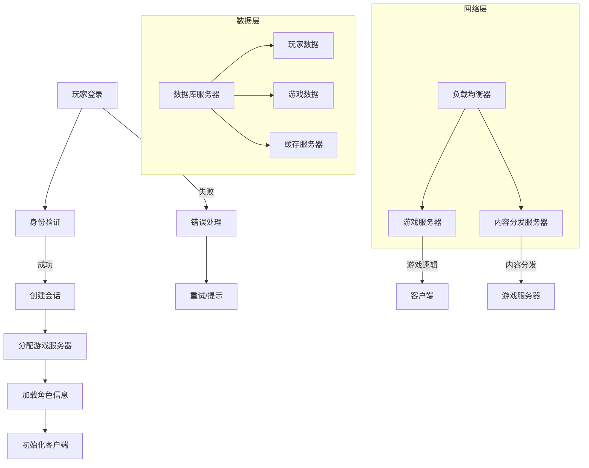
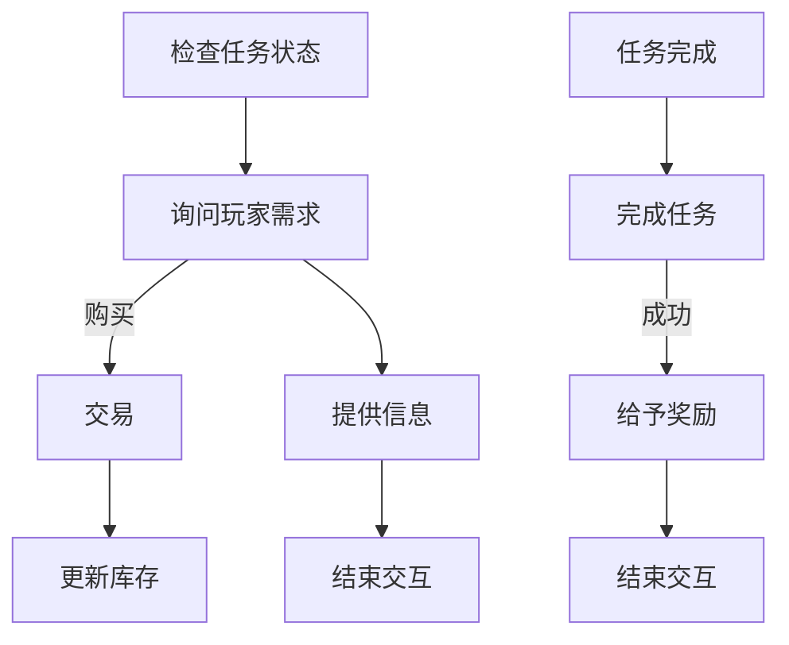

                 

## 文章标题

### 《网易游戏2024校招MMORPG服务器架构师编程题》

#### 关键词：MMORPG、服务器架构、编程题、网易游戏、校招

#### 摘要：
本文将深入探讨2024年网易游戏校招中针对MMORPG服务器架构师的编程题。通过系统地解析MMORPG的基本概念、服务器架构设计、核心编程题型及实际项目开发，本文旨在为有意向加入游戏行业的开发者提供全面的技术指导。文章结构分为五大部分，从基础理论到实际编程实战，再到面试技巧，全面覆盖MMORPG服务器架构师所需技能，为读者提供一条清晰的职业发展路径。

---

### 引言

在快速发展的游戏行业中，大规模多人在线角色扮演游戏（MMORPG）由于其庞大的用户规模和复杂的游戏机制，已成为游戏开发领域的重要分支。随着技术的进步，MMORPG的游戏体验越来越丰富，游戏服务器的架构设计也变得更加复杂和关键。因此，对于想要进入游戏行业，特别是希望成为MMORPG服务器架构师的应聘者来说，掌握相关的编程知识和实战经验至关重要。

2024年网易游戏校招的MMORPG服务器架构师编程题，旨在测试应聘者对MMORPG服务器架构的理解，以及解决复杂编程问题的能力。本文将围绕以下几个核心部分进行详细解析：

1. **MMORPG基础知识与游戏架构**：介绍MMORPG的定义、特点、游戏架构及其数据库设计。
2. **MMORPG服务器架构设计与实现**：分析服务器架构设计原则、用户账号与安全模块、世界地图与地形管理、NPC与任务系统、社交系统与公会系统。
3. **MMORPG编程题解析**：探讨常见编程题型、数据结构与算法、网络编程、并发编程及实战编程题解析。
4. **编程实战与项目解析**：包括编程实战环境搭建、简易聊天室、多人在线游戏、服务器压力测试等实战项目的实现与解析。
5. **编程技巧与面试准备**：提供面试准备与技巧、常见面试题型与解答、编程代码规范与风格、源代码详细实现与解读等。

通过本文的系统讲解，读者将能够全面理解MMORPG服务器架构师所需的核心技能，为在校招中脱颖而出打下坚实的基础。

### 第一部分：MMORPG基础知识与游戏架构

#### 1.1 MMORPG的定义与特点

大规模多人在线角色扮演游戏（Massively Multiplayer Online Role-Playing Game，简称MMORPG）是一种在线游戏，允许数千甚至数百万玩家同时在一个虚拟的世界中互动。MMORPG的核心特点包括：

- **大规模玩家互动**：与其他在线游戏相比，MMORPG支持更多的玩家同时在线，形成一个庞大的虚拟社交网络。
- **角色扮演**：玩家可以选择不同的角色，每个角色都有独特的技能和成长路径，玩家通过完成任务、战斗和探索来提升角色的等级和技能。
- **持久性**：MMORPG中的游戏世界和玩家角色是持久的，玩家的行为和决策会直接影响游戏世界，这种持久性增加了游戏的深度和趣味性。
- **开放世界**：MMORPG的游戏世界通常是开放的，玩家可以自由探索，不受固定路径的限制，游戏机制鼓励玩家发现和探索新的内容。

MMORPG的发展历程可以追溯到20世纪90年代，最早的MMORPG如《乌尔都有》（Ultima Online）开创了这一游戏类型。随着技术的进步，MMORPG的游戏质量和复杂性不断提升，现代MMORPG如《魔兽世界》（World of Warcraft）和《最终幻想XIV》（Final Fantasy XIV）在游戏性和社交性方面达到了新的高度。

#### 1.2 MMORPG的游戏架构

MMORPG的游戏架构可以分为客户端架构、服务器架构和数据库架构三个主要部分。

**客户端架构**：客户端是玩家与游戏世界交互的界面。MMORPG的客户端通常包含以下模块：

- **用户界面（UI）**：显示游戏中的角色、地图、菜单等视觉元素，用户通过UI与游戏进行交互。
- **游戏逻辑**：处理玩家的输入和游戏世界的响应，包括角色的移动、战斗、物品管理等。
- **图形渲染**：使用图形引擎渲染游戏画面，包括场景渲染、角色动画和特效等。
- **网络通信**：实现客户端与服务器之间的数据传输，包括玩家的动作、状态更新等。

**服务器架构**：服务器是游戏世界的核心，负责处理玩家之间的交互和游戏世界的状态更新。MMORPG的服务器架构通常包括以下层次：

- **游戏服务器**：负责处理玩家的登录、游戏逻辑和状态同步。游戏服务器可以分为多个逻辑服务器，如角色服务器、地图服务器、任务服务器等。
- **数据库服务器**：存储游戏数据，包括玩家的角色信息、任务数据、装备数据等。数据库服务器通常采用分布式架构，以提高数据的读取和写入性能。
- **内容分发服务器**：负责将游戏内容（如场景数据、NPC数据等）分发到各个游戏服务器，以保证游戏世界的同步和一致性。

**数据库架构**：数据库架构是MMORPG的核心之一，负责存储和管理游戏数据。MMORPG的数据库架构通常包括以下组件：

- **关系型数据库**：用于存储玩家的角色信息、任务数据、装备数据等。关系型数据库具有良好的数据一致性和查询性能。
- **NoSQL数据库**：用于存储大规模的游戏数据，如玩家行为日志、社交数据等。NoSQL数据库具有高扩展性和高性能。

#### 1.3 MMORPG的数据库设计

MMORPG的数据库设计是确保游戏数据可靠性和性能的关键。以下是MMORPG数据库设计的关键方面：

**用户账号与权限管理**：用户账号是MMORPG数据库的核心，负责存储玩家的基本信息和权限。用户账号表通常包含用户名、密码、邮箱、角色ID等信息。

**角色信息表**：角色信息表存储玩家的角色数据，包括角色ID、角色名、等级、种族、职业、装备信息等。角色信息表需要支持高效的查询和更新操作。

**任务数据表**：任务数据表存储任务的基本信息，包括任务ID、任务名称、任务描述、任务目标、任务奖励等。任务数据表需要支持任务的状态更新和查询。

**装备数据表**：装备数据表存储装备的详细信息，包括装备ID、装备名称、属性、价格等。装备数据表需要支持装备的查询和更新。

**社交数据表**：社交数据表存储玩家的社交信息，包括好友关系、公会成员、聊天记录等。社交数据表需要支持社交数据的存储和查询。

**行为日志表**：行为日志表用于记录玩家的游戏行为，如登录、登出、任务完成、装备购买等。行为日志表需要支持高吞吐量的写入和查询操作。

#### 1.4 MMORPG的客户端架构

MMORPG的客户端架构是玩家进入游戏世界的主要入口，其设计直接影响到玩家的游戏体验。以下是MMORPG客户端架构的主要组件：

**用户界面（UI）**：用户界面是玩家与游戏世界交互的窗口，包括菜单、按钮、对话框等元素。用户界面需要直观易用，同时提供丰富的交互功能，如地图浏览、角色管理、装备交易等。

**游戏逻辑**：游戏逻辑是客户端的核心，负责处理玩家的输入和游戏世界的响应。游戏逻辑需要支持角色的移动、战斗、物品管理等功能，同时需要与服务器进行数据同步，确保游戏世界的状态一致性。

**图形渲染**：图形渲染是客户端的关键组件，负责将游戏场景、角色、特效等图形元素渲染到屏幕上。图形渲染需要高效，以提供流畅的游戏体验。

**网络通信**：网络通信组件负责客户端与服务器之间的数据传输，包括玩家的动作、状态更新、游戏内容下载等。网络通信需要稳定可靠，以避免玩家之间的数据丢失和延迟。

#### 1.5 MMORPG的服务器架构

MMORPG的服务器架构是游戏世界的核心，其设计直接影响游戏的性能和稳定性。以下是MMORPG服务器架构的主要组件：

**游戏服务器**：游戏服务器是MMORPG的核心，负责处理玩家的登录、游戏逻辑和状态同步。游戏服务器通常采用分布式架构，以提高系统的可扩展性和容错性。

**数据库服务器**：数据库服务器负责存储和管理游戏数据，包括玩家的角色信息、任务数据、装备数据等。数据库服务器通常采用主从复制、分库分表等策略，以提高数据存储和查询的性能。

**内容分发服务器**：内容分发服务器负责将游戏内容（如场景数据、NPC数据等）分发到各个游戏服务器，以保证游戏世界的同步和一致性。

**负载均衡器**：负载均衡器负责将玩家的请求分配到不同的游戏服务器上，以避免单点故障和性能瓶颈。

**监控系统**：监控系统负责监控游戏服务器的运行状态，包括性能指标、错误日志、安全事件等，以确保游戏服务器的稳定运行。

通过以上对MMORPG基础知识与游戏架构的介绍，我们可以更好地理解MMORPG的复杂性以及服务器架构设计的关键性。接下来，本文将深入探讨MMORPG服务器架构的设计原则、具体实现方法以及常见编程题型的解析。

### 第二部分：MMORPG服务器架构设计与实现

#### 2.1 MMORPG服务器架构设计原则

在设计MMORPG服务器架构时，需要遵循一系列核心原则，以确保系统的高性能、可扩展性和可靠性。以下是几个关键设计原则：

**1. 可扩展性**

可扩展性是MMORPG服务器架构设计的首要原则。随着游戏用户数量的增长，服务器需要能够水平扩展，以处理更多的请求。这通常通过分布式架构实现，将系统分解为多个独立的组件，每个组件都可以独立扩展。例如，游戏服务器可以分成多个区域服务器，每个区域服务器负责一部分玩家，从而减轻单个服务器的负载。

**2. 高性能**

高性能是确保玩家能够获得流畅游戏体验的关键。这要求服务器架构能够快速处理大量请求，并高效地进行数据处理和状态同步。优化数据库查询、使用缓存、合理设计网络协议等方法都是提高服务器性能的重要手段。

**3. 容错性**

容错性是指服务器在遇到故障时能够自动恢复，以减少对游戏的影响。设计高可用性（High Availability，简称HA）系统是实现容错性的关键。这包括数据库的主从复制、服务器的负载均衡和故障转移机制等。

**4. 安全性**

安全性是保护玩家数据和游戏稳定性的重要措施。服务器架构需要实现严格的安全策略，包括用户认证、数据加密、权限控制等。同时，应定期进行安全审计和漏洞修复，以防止潜在的攻击。

**5. 灵活性**

灵活性是指服务器架构能够适应不断变化的需求。这要求设计时采用模块化方法，使得不同组件可以独立开发、测试和部署。此外，使用容器化和云服务等技术可以提高架构的灵活性和可移植性。

**6. 可维护性**

可维护性是指服务器架构易于管理和维护。良好的设计应该提供清晰的文档、日志记录和监控工具，以便开发人员能够快速定位和解决问题。

#### 2.2 服务器架构的Mermaid流程图

为了更直观地展示MMORPG服务器架构，我们可以使用Mermaid语言绘制一个流程图。以下是服务器架构的基本流程：



**图1：MMORPG服务器架构流程图**

**解释：**

- **玩家登录**：玩家通过客户端发送登录请求，首先由身份验证模块进行验证。
- **身份验证**：验证成功后，系统创建一个会话，并将其分配到特定的游戏服务器。
- **加载角色信息**：游戏服务器从数据库服务器加载玩家的角色信息，并将其发送给客户端。
- **初始化客户端**：客户端收到角色信息后，初始化游戏界面，玩家可以开始游戏。
- **数据库服务器**：数据库服务器存储玩家的角色数据、游戏数据以及缓存数据，以提供快速访问。
- **负载均衡器**：负载均衡器负责将玩家的请求分配到不同的游戏服务器上，确保系统资源的高效利用。
- **内容分发服务器**：内容分发服务器负责向游戏服务器发送游戏内容，如地图、NPC数据等，确保游戏世界的同步。

通过这个Mermaid流程图，我们可以清晰地了解MMORPG服务器架构的基本工作流程，为后续的详细设计提供了可视化基础。

#### 2.3 用户账号与安全模块

用户账号与安全模块是MMORPG服务器架构中的核心组件之一，负责管理玩家的登录、认证和权限控制。以下是用户账号与安全模块的设计要点：

**1. 用户登录**

用户登录是玩家进入游戏的第一步，通常包括以下步骤：

- **用户输入账号和密码**：玩家在客户端界面输入账号和密码。
- **客户端验证**：客户端对用户输入进行初步验证，确保格式正确。
- **发送请求**：客户端将验证后的数据发送到身份验证服务器。
- **身份验证**：身份验证服务器对账号和密码进行验证。通常，服务器会通过数据库查询用户表，检查账号是否存在以及密码是否正确。
- **返回结果**：身份验证服务器将结果返回给客户端。如果验证成功，返回一个会话标识（Session ID），否则返回错误信息。

**伪代码示例：**

```python
def login(username, password):
    # 在客户端验证用户名和密码格式
    if not validate_credentials(username, password):
        return "Invalid credentials"
    
    # 发送请求到身份验证服务器
    response = send_request_to_auth_server("login", username, password)
    
    if response.status == "success":
        session_id = response.session_id
        return session_id
    else:
        return response.error_message
```

**2. 用户认证**

用户认证是确保玩家身份的过程，通常涉及以下技术：

- **会话管理**：通过会话标识（Session ID）来跟踪用户的状态。每次用户请求都需要包含有效的会话标识。
- **令牌机制**：使用令牌（Token）来代替会话标识，以增强安全性。令牌通常包含用户的身份信息和有效期。
- **多因素认证**：除了账号和密码，还可以要求玩家提供其他验证方式，如手机验证码、邮箱验证等。

**3. 权限控制**

权限控制确保玩家只能访问他们有权访问的内容和功能。以下是一些常见的权限控制方法：

- **基于角色的访问控制（RBAC）**：根据玩家的角色（如普通玩家、管理员等）分配不同的权限。
- **基于属性的访问控制（ABAC）**：根据玩家的属性（如等级、经验等）分配权限。
- **权限标签**：为游戏资源和功能设置权限标签，玩家只能访问带有相应标签的资源。

**4. 安全机制与漏洞防范**

确保用户账号与安全模块的安全是至关重要的。以下是一些常用的安全机制和漏洞防范措施：

- **加密传输**：使用HTTPS等加密协议确保数据在传输过程中的安全性。
- **密码哈希**：将用户密码哈希存储在数据库中，而不是明文存储。
- **账号锁定**：连续多次登录失败的账号应被锁定一段时间，防止暴力破解。
- **安全审计**：定期进行安全审计，检测潜在的安全漏洞并进行修复。

**5. 示例**

以下是一个简单的用户认证和权限控制的示例：

```python
def authenticate(session_id):
    user = get_user_by_session_id(session_id)
    if not user:
        return "Invalid session"
    
    if user.is_locked:
        return "Account locked"
    
    # 基于角色的访问控制
    if not has_permission(user.role, "read", "inventory"):
        return "Insufficient permissions"
    
    return "Authenticated"

def has_permission(role, action, resource):
    # 检查角色是否有访问特定资源的特定权限
    permissions = get_permissions_by_role(role)
    return action in permissions.get(resource, [])
```

通过上述设计要点和示例，我们可以看到用户账号与安全模块在MMORPG服务器架构中的重要性。合理设计和管理用户账号与安全模块，可以有效地保护玩家信息和游戏世界的稳定运行。

#### 2.4 世界地图与地形管理

在MMORPG中，世界地图和地形管理是至关重要的组成部分，它们决定了玩家的游戏体验和环境互动。以下是关于世界地图与地形管理的详细设计：

**1. 地形数据结构**

地形数据结构是地图设计的基础，它决定了游戏世界的地形特征和交互性。常见的数据结构包括二维数组、三维数组、四叉树和八叉树等。

- **二维数组**：最简单的方式，适用于小型或规则地图。每个单元格代表一个地形单元，存储地形高度、材质等信息。
- **三维数组**：适用于复杂地形，可以在二维数组的基础上增加一个维度，用于存储不同的地形层，如地表、地下层等。
- **四叉树（Quadtree）**：用于处理大规模不规则地图，通过递归地将地图区域分成四个子区域，以优化数据存储和查询性能。
- **八叉树（Octree）**：类似于四叉树，但适用于三维空间，可以更高效地处理三维地形。

**2. 地形生成与编辑**

地形生成和编辑是地图设计的重要环节，它们决定了游戏世界的独特性和可玩性。

- **随机生成**：使用算法生成随机地形，如Perlin噪声、中间值置换（Midpoint Displacement）等，以创建自然或人造的地形。
- **手工编辑**：游戏设计师通过地图编辑工具手动创建和调整地形，以实现特定的视觉效果和交互体验。
- **动态生成**：在运行时动态生成地形，适用于大型开放世界游戏，可以实时调整地形以适应玩家的行动和游戏事件。

**3. 地形渲染与优化**

地形渲染是影响游戏性能的关键因素，需要采用多种技术进行优化。

- **LOD（Level of Detail）**：根据玩家的距离和视野动态调整地形的细节级别，以减少渲染负担。
- **纹理压缩**：使用纹理压缩算法减小地图纹理的数据大小，提高加载速度和性能。
- **动态光照与阴影**：使用动态光照和阴影技术，提高地形的真实感和交互性。
- **多线程渲染**：利用多线程技术并行处理渲染任务，提高渲染效率。

**4. 地图分区与空间索引**

为了提高服务器性能和优化玩家体验，地图通常被划分为多个分区，并使用空间索引进行管理。

- **分区**：将地图划分为多个区域，每个区域由一个或多个服务器处理，以避免单点性能瓶颈。
- **空间索引**：使用空间索引（如四叉树或八叉树）来快速查询和管理地图上的物体和玩家，提高数据查询和更新的效率。

**5. 示例**

以下是一个简单的地形数据结构的示例，使用二维数组表示：

```python
class TerrainMap:
    def __init__(self, width, height):
        self.width = width
        self.height = height
        self.data = [[0 for _ in range(width)] for _ in range(height)]

    def set_terrain_height(self, x, y, height):
        if 0 <= x < self.width and 0 <= y < self.height:
            self.data[y][x] = height

    def get_terrain_height(self, x, y):
        if 0 <= x < self.width and 0 <= y < self.height:
            return self.data[y][x]
        else:
            return 0

# 创建一个10x10的地形地图
map = TerrainMap(10, 10)
map.set_terrain_height(5, 5, 100)

# 输出地图中心点的地形高度
print(map.get_terrain_height(5, 5))  # 输出：100
```

通过以上对世界地图与地形管理的介绍，我们可以看到地形在MMORPG中的重要性。合理设计和管理地形数据结构、生成与编辑方法以及渲染与优化技术，可以显著提高游戏世界的沉浸感和玩家的游戏体验。

#### 2.5 NPC与任务系统

NPC（Non-Player Character，非玩家角色）和任务系统是MMORPG中重要的组成部分，它们不仅丰富了游戏的内容，还提升了玩家的游戏体验。以下是对NPC与任务系统的详细设计：

**1. NPC设计原则**

NPC的设计原则决定了NPC的行为和互动方式，以下是一些关键原则：

- **多样性**：设计多种类型的NPC，包括商人、导师、任务发布者、敌人等，以增加游戏世界的丰富性。
- **行为合理性**：NPC的行为应符合其角色的设定，例如商人会根据玩家的需求调整商品价格，导师会引导玩家完成任务。
- **互动性**：NPC应能够与玩家互动，提供信息、任务、交易等服务，增强玩家的沉浸感。
- **动态性**：NPC的行为和状态可以随时间变化，例如任务发布者会在任务完成后离开或更换。

**2. NPC行为树与状态机**

NPC的行为通常通过行为树（Behavior Tree）和状态机（State Machine）实现。行为树是一种层次化的行为组合方式，适用于复杂的行为逻辑；状态机则是一种状态转换机制，适用于简单的行为控制。

- **行为树**：行为树由一系列行为节点组成，每个节点可以执行特定任务或组合其他节点。行为树允许NPC根据当前情况选择不同的行为路径，以提高灵活性和可扩展性。

**示例：**



- **状态机**：状态机由一系列状态和转换条件组成，用于管理NPC的当前状态和行为。状态机能够实现简单的条件判断和状态转换，适用于简单的行为控制。

**示例：**

```mermaid
stateMachine
    [*] -->|空闲| idle
    idle -->|玩家接近| busy
    busy -->|任务完成| rewarded
    rewarded -->|离开| leave
    idle -->|玩家询问| info
    info -->|提供信息| informed
    informed -->|结束| done
```

**3. 任务系统设计与实现**

任务系统是玩家在游戏世界中实现目标的重要途径，以下是其关键设计点：

- **任务类型**：任务可以按类型分类，如主线任务、支线任务、日常任务等，每种任务都有不同的目标和奖励。
- **任务发布**：任务发布者可以在特定地点或通过特定事件向玩家发布任务，任务描述应清晰明了，引导玩家完成任务。
- **任务流程**：任务通常包括多个步骤，如收集物品、击败敌人、完成特定行为等。每个步骤完成后，玩家需要向任务发布者汇报。
- **任务状态管理**：任务状态包括未开始、进行中、已完成等。任务状态需要与数据库同步，确保服务器与客户端的一致性。

**4. 示例**

以下是一个简单的NPC任务系统的示例代码：

```python
class Task:
    def __init__(self, id, description, steps):
        self.id = id
        self.description = description
        self.steps = steps
        self.status = "未开始"

    def start(self, player):
        self.status = "进行中"
        player.add_task(self)

    def complete_step(self, player, step_id):
        step = self.get_step_by_id(step_id)
        if step and step.completed:
            step.completed = False
            self.status = "进行中"
            player.update_task(self)

    def finish(self, player):
        self.status = "已完成"
        player.reward(self)
        player.remove_task(self)

    def get_step_by_id(self, step_id):
        for step in self.steps:
            if step.id == step_id:
                return step
        return None

class PlayerTaskManager:
    def __init__(self):
        self.tasks = []

    def add_task(self, task):
        self.tasks.append(task)

    def update_task(self, task):
        for i, t in enumerate(self.tasks):
            if t.id == task.id:
                self.tasks[i] = task
                break

    def remove_task(self, task):
        self.tasks.remove(task)

    def reward(self, task):
        # 奖励玩家
        pass

# 创建任务
task = Task(1, "寻找宝石", [{"id": 1, "description": "收集5颗宝石", "completed": False}])
player_task_manager = PlayerTaskManager()

# 玩家开始任务
player_task_manager.add_task(task)
task.start(player)

# 玩家完成任务步骤
player_task_manager.complete_step(player, 1)

# 玩家完成任务
player_task_manager.finish(player)
```

通过以上对NPC与任务系统的设计介绍，我们可以看到这一系统在MMORPG中的关键作用。合理设计和实现NPC与任务系统，可以增强游戏的世界观、互动性和玩家的成就感。

#### 2.6 社交系统与公会系统

在MMORPG中，社交系统和公会系统是提升玩家互动和游戏体验的重要组件。它们不仅为玩家提供了更多的社交机会，还能增强玩家的归属感和游戏粘性。

**1. 社交系统架构**

社交系统的架构设计需要考虑到用户关系管理、消息通信和数据存储等核心功能。

- **用户关系管理**：社交系统需要支持玩家之间建立好友关系，记录玩家之间的关系状态，如好友、黑名单等。这通常通过关系表来实现，关系表记录了两名玩家的关系状态和关系等级。
- **消息通信**：消息通信是社交系统的核心功能，玩家可以通过私聊、群聊等方式进行实时通信。消息通信需要支持文本、语音和表情等多种形式，同时确保消息的实时性和可靠性。
- **数据存储**：社交数据需要存储在数据库中，包括玩家关系、聊天记录、公会信息等。为了提高数据存储和查询效率，可以采用分布式数据库和缓存技术。

**2. 公会系统功能设计**

公会系统是玩家在游戏中建立和组织的一种社交形式，以下是其主要功能：

- **公会创建与加入**：玩家可以创建公会或加入现有公会。创建公会需要一定的条件，如公会等级、创建费用等。加入公会需要通过公会管理员的审核。
- **公会管理**：公会管理员可以管理公会成员、公会等级、公会资金等。管理员可以分配成员的角色和权限，如会长、副会长、财务等。
- **公会活动**：公会可以组织各种活动，如公会战、公会任务等。活动可以增加公会成员的互动和凝聚力，同时提升公会的声望和实力。
- **公会商店**：公会商店是公会成员之间交换物品和资源的地方。公会商店可以通过公会资金运营，为公会成员提供更多的福利和奖励。

**3. 社交与公会系统的数据管理**

社交和公会系统的数据管理是确保系统稳定性和性能的关键。以下是一些关键的数据管理策略：

- **分布式存储**：使用分布式数据库存储社交和公会数据，以提高系统的扩展性和性能。分布式数据库可以将数据分散存储在多个节点上，提高数据的读取和写入速度。
- **缓存策略**：使用缓存技术（如Redis）存储高频访问的数据，如用户关系、聊天记录等，以减少数据库的负载，提高系统的响应速度。
- **数据一致性**：确保社交和公会数据的一致性，特别是在分布式环境下。可以使用分布式事务、最终一致性等方法来保证数据的一致性。
- **消息队列**：使用消息队列（如RabbitMQ）处理消息通信，确保消息的可靠传输和系统的解耦。

**4. 社交与公会系统的实现**

社交和公会系统的实现需要考虑到模块化、可扩展性和高并发性。以下是社交与公会系统的基本实现步骤：

- **模块化设计**：将社交和公会系统分解为多个模块，如用户关系管理模块、消息通信模块、公会管理模块等，以便于开发和维护。
- **API设计**：设计清晰的API接口，用于处理社交和公会系统的各种请求，如创建公会、加入公会、发送消息等。
- **高并发处理**：使用异步编程和并发处理技术，如协程、多线程等，处理高并发请求，确保系统的稳定性和性能。

**5. 示例**

以下是一个简单的社交系统中的用户关系管理的示例代码：

```python
class User:
    def __init__(self, user_id, name):
        self.user_id = user_id
        self.name = name
        self.friends = []
        self.blocks = []

    def add_friend(self, friend_user_id):
        if friend_user_id not in self.friends:
            self.friends.append(friend_user_id)

    def remove_friend(self, friend_user_id):
        if friend_user_id in self.friends:
            self.friends.remove(friend_user_id)

    def block_user(self, user_id):
        if user_id not in self.blocks:
            self.blocks.append(user_id)

    def unblock_user(self, user_id):
        if user_id in self.blocks:
            self.blocks.remove(user_id)

class FriendshipManager:
    def __init__(self):
        self.users = {}

    def add_user(self, user):
        self.users[user.user_id] = user

    def create_friendship(self, user_id1, user_id2):
        user1 = self.users.get(user_id1)
        user2 = self.users.get(user_id2)
        if user1 and user2 and user_id2 not in user1.blocks and user_id1 not in user2.blocks:
            user1.add_friend(user_id2)
            user2.add_friend(user_id1)

# 创建用户
user1 = User(1, "Alice")
user2 = User(2, "Bob")
friendship_manager = FriendshipManager()

# 添加用户到社交系统
friendship_manager.add_user(user1)
friendship_manager.add_user(user2)

# 创建好友关系
friendship_manager.create_friendship(1, 2)

# 输出用户的好友列表
print(user1.friends)  # 输出：[2]
print(user2.friends)  # 输出：[1]
```

通过以上对社交系统与公会系统的设计实现的详细介绍，我们可以看到这两个系统在MMORPG中的关键作用。合理设计和实现社交系统与公会系统，可以为玩家提供丰富的社交互动体验，增强游戏的世界观和社交性。

### 第三部分：MMORPG编程题解析

#### 3.1 常见编程题型

在MMORPG服务器架构师的招聘过程中，常见的编程题型涵盖了数据结构与算法、网络编程、并发编程等多个领域。以下是对这些常见编程题型的详细解析：

**1. 数据结构与算法**

数据结构与算法是编程题的核心，测试应聘者对数据结构和算法的理解与应用能力。以下是一些典型的数据结构与算法题型：

- **排序算法**：如冒泡排序、选择排序、插入排序、快速排序等。测试应聘者对排序算法的掌握程度及其时间复杂度分析。
- **查找算法**：如二分查找、线性查找等。测试应聘者对查找算法的实现和理解，以及其在不同数据结构上的应用。
- **图算法**：如深度优先搜索（DFS）、广度优先搜索（BFS）、最小生成树（Prim算法、Kruskal算法）、最短路径算法（Dijkstra算法、Floyd算法）等。测试应聘者对图数据结构的理解和算法实现能力。
- **动态规划**：如背包问题、最长公共子序列、最长递增子序列等。测试应聘者对动态规划思维和解题方法的掌握。

**2. 网络编程**

网络编程题型主要测试应聘者对网络协议、客户端与服务器通信的理解和应用能力。以下是一些典型的网络编程题型：

- **TCP/IP协议栈**：如TCP三次握手、四次挥手过程，TCP滑动窗口、拥塞控制等。测试应聘者对TCP协议的基本原理和应用。
- **网络编程库**：如使用Socket进行网络通信，编写客户端和服务器端程序。测试应聘者对网络编程库的使用能力和通信原理的理解。
- **分布式系统通信**：如使用消息队列（如RabbitMQ）、远程过程调用（如gRPC）实现分布式系统中的通信。测试应聘者对分布式系统的理解和应用能力。

**3. 并发编程**

并发编程题型主要测试应聘者对并发编程原理、多线程编程和并发控制的掌握。以下是一些典型的并发编程题型：

- **线程同步**：如互斥锁（Mutex）、信号量（Semaphore）、条件变量（Condition Variable）等。测试应聘者对线程同步机制的理解和应用。
- **线程安全**：如避免竞态条件、死锁、活锁等。测试应聘者对线程安全问题及其解决方法的掌握。
- **并发数据结构**：如线程安全队列、线程安全哈希表等。测试应聘者对并发数据结构的理解和应用。

**4. 实战编程题解析**

以下是一些具体的实战编程题及其解析，帮助应聘者更好地理解和解决实际问题：

- **聊天室系统**：设计并实现一个简易的聊天室系统，支持客户端发送消息和接收消息。测试应聘者对网络编程和并发编程的综合应用。
- **多人在线游戏**：设计并实现一个简单的多人在线游戏，如猜数字游戏。测试应聘者对网络编程、并发编程和游戏逻辑的实现。
- **服务器压力测试**：编写程序进行服务器压力测试，测试不同负载下的服务器性能和响应时间。测试应聘者对性能测试和优化方法的掌握。

通过以上对常见编程题型的解析，我们可以看到MMORPG服务器架构师编程题的多样性和深度。在招聘过程中，这些题型能够全面评估应聘者的编程能力和实战经验，为游戏公司选拔合适的人才提供有力支持。

#### 3.2 数据结构与算法

数据结构与算法是计算机科学的核心，也是MMORPG服务器架构师编程题中的重要部分。掌握各种数据结构与算法，不仅能够提升解决问题的效率，还能优化系统性能。以下是一些常用的数据结构与算法及其在MMORPG服务器中的应用：

**1. 常见数据结构**

**（1）数组**

数组是最基本的数据结构，支持随机访问。在MMORPG中，数组常用于存储玩家信息、地图数据等。

- **应用示例**：存储玩家位置信息，实现快速查询玩家所在区域。
- **时间复杂度**：访问时间复杂度为O(1)，插入和删除时间复杂度为O(n)。

**（2）链表**

链表是一种动态数据结构，支持快速插入和删除。在MMORPG中，链表常用于存储玩家队伍、任务队列等。

- **应用示例**：管理任务队列，实现任务的顺序执行。
- **时间复杂度**：访问时间复杂度为O(n)，插入和删除时间复杂度为O(1)。

**（3）栈**

栈是一种后进先出（LIFO）的数据结构，常用于解决递归问题和回溯算法。在MMORPG中，栈可用于路径查找、回滚操作等。

- **应用示例**：路径查找，如A*算法中的开放集和关闭集。
- **时间复杂度**：访问、插入和删除时间复杂度为O(1)。

**（4）队列**

队列是一种先进先出（FIFO）的数据结构，常用于消息队列、玩家排队等场景。

- **应用示例**：玩家排队登录、任务队列管理等。
- **时间复杂度**：访问时间复杂度为O(n)，插入和删除时间复杂度为O(1)。

**（5）树**

树是一种层次化的数据结构，包括二叉树、平衡树（AVL树）、红黑树等。在MMORPG中，树可用于角色技能树、地图树等。

- **应用示例**：角色技能树，管理角色的技能和等级。
- **时间复杂度**：访问、插入和删除时间复杂度取决于树的类型，通常为O(log n)。

**（6）图**

图是一种复杂的数据结构，包括邻接矩阵和邻接表等形式。在MMORPG中，图可用于地图数据结构、NPC行为树等。

- **应用示例**：地图数据结构，管理地图中的区域和路径。
- **时间复杂度**：访问、插入和删除时间复杂度为O(n)或O(m)，其中n为顶点数，m为边数。

**2. 常见算法**

**（1）排序算法**

排序算法用于对数据进行排序，常见的排序算法有冒泡排序、快速排序、归并排序等。

- **冒泡排序**：通过重复遍历要排序的数列，比较相邻的两个元素，将不符合顺序的交换过来。
  - **时间复杂度**：平均和最坏情况为O(n^2)，最好情况为O(n)。
- **快速排序**：通过递归分治策略，将数列分为两部分，然后对每一部分进行排序。
  - **时间复杂度**：平均情况为O(n log n)，最坏情况为O(n^2)。

**（2）查找算法**

查找算法用于在数据结构中查找特定元素，常见的查找算法有二分查找、线性查找等。

- **二分查找**：通过不断缩小区间，找到特定元素。
  - **时间复杂度**：O(log n)。
- **线性查找**：遍历数组或链表，逐个比较元素。
  - **时间复杂度**：O(n)。

**（3）图算法**

图算法用于处理图数据结构，常见的图算法有深度优先搜索（DFS）、广度优先搜索（BFS）等。

- **深度优先搜索（DFS）**：通过递归遍历图，找到所有可达节点。
  - **时间复杂度**：O(n + m)，其中n为顶点数，m为边数。
- **广度优先搜索（BFS）**：通过队列实现，先访问所有直接相邻的节点，再访问它们的相邻节点。
  - **时间复杂度**：O(n + m)。

**3. 数学模型和公式**

在MMORPG中，数学模型和公式用于模拟游戏中的各种现象和机制。以下是一些常用的数学模型和公式：

**（1）概率模型**

概率模型用于模拟游戏中的随机事件，如战斗胜利的概率、任务完成的概率等。

- **贝叶斯公式**：用于计算后验概率，公式为P(A|B) = P(B|A) * P(A) / P(B)。
- **概率分布**：如二项分布、正态分布等，用于模拟随机事件的发生概率。

**（2）动态规划**

动态规划用于解决最优化问题，通过递归和状态转移方程进行求解。

- **状态转移方程**：如背包问题的状态转移方程为f[i][w] = max(f[i-1][w], f[i-1][w - v[i]] + c[i])。

**（3）数学公式**

- **线性代数公式**：如矩阵乘法、逆矩阵等，用于计算角色属性和技能效果。
- **几何公式**：如距离公式、角度公式等，用于计算角色位置和路径。

**4. 详细讲解与举例说明**

**（1）排序算法示例**

以下是一个使用快速排序算法的Python示例：

```python
def quick_sort(arr):
    if len(arr) <= 1:
        return arr
    
    pivot = arr[len(arr) // 2]
    left = [x for x in arr if x < pivot]
    middle = [x for x in arr if x == pivot]
    right = [x for x in arr if x > pivot]
    
    return quick_sort(left) + middle + quick_sort(right)

arr = [3, 6, 8, 10, 1, 2, 1]
sorted_arr = quick_sort(arr)
print(sorted_arr)  # 输出：[1, 1, 2, 3, 6, 8, 10]
```

**（2）图算法示例**

以下是一个使用广度优先搜索算法的Python示例，用于找到图中两点之间的最短路径：

```python
from collections import deque

def bfs(graph, start, target):
    visited = set()
    queue = deque([start])
    
    while queue:
        vertex = queue.popleft()
        if vertex == target:
            return True
        
        visited.add(vertex)
        for neighbor in graph[vertex]:
            if neighbor not in visited:
                queue.append(neighbor)
    
    return False

graph = {
    'A': ['B', 'C'],
    'B': ['A', 'D', 'E'],
    'C': ['A', 'F'],
    'D': ['B'],
    'E': ['B', 'F'],
    'F': ['C', 'E']
}

print(bfs(graph, 'A', 'F'))  # 输出：True
```

通过以上对数据结构与算法的详细介绍，我们可以看到这些知识在MMORPG服务器架构中的应用价值。掌握并灵活运用这些数据结构与算法，能够帮助我们更高效地解决实际问题，优化游戏性能。

### 第三部分：MMORPG编程题解析（续）

#### 3.3 网络编程

网络编程是MMORPG服务器架构师必备的技能之一，负责实现客户端与服务器之间的数据传输。以下是一些网络编程的关键知识点及其实际应用：

**1. 基本网络协议**

网络协议是计算机网络进行数据传输的基础规范。在MMORPG中，常用的网络协议包括TCP和UDP。

- **TCP（传输控制协议）**：提供可靠的数据传输，确保数据的完整性和顺序性。TCP通过三次握手建立连接，并通过拥塞控制、流量控制等技术保证传输效率。
- **UDP（用户数据报协议）**：提供不可靠的数据传输，适用于实时性要求高但允许数据丢失的场景。UDP不需要建立连接，传输速度快，但数据包可能丢失或重复。

**2. 客户端与服务器通信**

客户端与服务器之间的通信是MMORPG的重要组成部分。以下是一个简单的客户端与服务器通信流程：

- **连接建立**：客户端向服务器发送连接请求，服务器接受请求并返回确认。
- **数据传输**：客户端和服务器通过发送和接收数据包进行通信。数据包通常包含命令、状态信息和数据内容。
- **断开连接**：当通信结束时，客户端和服务器通过发送断开请求来终止连接。

**3. 实现方法**

网络编程实现通常涉及以下几个步骤：

- **创建网络套接字**：客户端和服务器需要创建套接字（Socket），用于网络通信。
- **绑定地址和端口**：客户端和服务器需要绑定本地地址和端口，以确定通信的地址。
- **监听和连接**：服务器需要监听端口，等待客户端的连接请求；客户端需要连接服务器的地址和端口。
- **数据发送和接收**：客户端和服务器通过发送和接收数据包进行通信，数据包通常包含固定格式的头部和内容。

**4. 实例**

以下是一个简单的TCP客户端和服务器实现的Python示例：

```python
# 服务器端
import socket

server_socket = socket.socket(socket.AF_INET, socket.SOCK_STREAM)
server_socket.bind(('127.0.0.1', 12345))
server_socket.listen()

print("服务器启动，等待连接...")

client_socket, client_address = server_socket.accept()
print(f"已连接：{client_address}")

while True:
    data = client_socket.recv(1024)
    if not data:
        break
    print(f"收到数据：{data.decode()}")
    client_socket.send(b"已收到，回复数据...")

client_socket.close()
server_socket.close()

# 客户端端
import socket

client_socket = socket.socket(socket.AF_INET, socket.SOCK_STREAM)
client_socket.connect(('127.0.0.1', 12345))

client_socket.send(b"你好，服务器！")

data = client_socket.recv(1024)
print(f"收到回复：{data.decode()}")

client_socket.close()
```

**5. 网络优化技巧**

为了提高网络编程的性能，以下是一些常见的优化技巧：

- **并发处理**：使用多线程或多进程提高并发处理能力，减少网络延迟。
- **负载均衡**：通过负载均衡器将请求分配到多个服务器，以避免单点性能瓶颈。
- **数据压缩**：使用数据压缩算法减少传输的数据量，提高传输效率。
- **缓存机制**：使用缓存减少重复的数据传输，提高系统响应速度。
- **延迟隐藏**：通过优化客户端与服务器之间的数据传输过程，减少用户感受到的延迟。

通过以上对网络编程的详细解析，我们可以看到它在MMORPG服务器架构中的关键作用。掌握网络编程的核心技术和优化方法，能够显著提高系统的稳定性和性能。

#### 3.4 并发编程

并发编程是MMORPG服务器架构中不可或缺的一部分，它涉及到在多线程、多进程环境下高效地处理多个任务。以下是并发编程的基本原理、常见模式以及并发编程中的常见问题。

**1. 并发编程原理**

**（1）进程与线程**

进程是操作系统资源分配的最小单位，拥有独立的内存空间和资源。线程是进程内的可执行任务，共享进程的内存和资源。

- **进程**：启动速度快，占用资源多，适用于独立运行的任务。
- **线程**：启动速度快，占用资源少，适用于需要共享数据的任务。

**（2）锁**

锁是控制多线程访问共享资源的机制，防止数据竞争和死锁。常见的锁有互斥锁（Mutex）、读写锁（Read-Write Lock）、条件锁（Condition Variable）等。

- **互斥锁**：确保同一时刻只有一个线程能够访问共享资源。
- **读写锁**：允许多个读线程同时访问资源，但写线程需要独占资源。
- **条件锁**：线程在满足某个条件时才能继续执行。

**2. 并发编程模式**

**（1）线程池**

线程池是一种管理线程的机制，它预先创建一定数量的线程，并复用这些线程处理任务。线程池能够减少线程创建和销毁的开销，提高系统的并发处理能力。

- **优点**：降低线程上下文切换开销，提高系统性能。
- **缺点**：线程数量受限，可能无法充分利用多核CPU。

**（2）协程**

协程是一种轻量级线程，通过用户空间切换线程，避免了操作系统线程切换的开销。协程适用于IO密集型任务，能够提高程序响应速度。

- **优点**：低开销，高并发性。
- **缺点**：不支持多核CPU并行计算。

**（3）消息队列**

消息队列是一种异步通信机制，通过队列传递消息，实现任务的异步执行。消息队列适用于高并发场景，能够提高系统的可靠性和灵活性。

- **优点**：解耦系统模块，提高系统的可扩展性。
- **缺点**：可能引入额外的网络延迟。

**3. 并发编程中的常见问题**

**（1）数据竞争**

数据竞争是并发编程中的常见问题，当多个线程同时访问和修改共享资源时，可能导致数据不一致。

- **解决方法**：使用锁机制，确保同一时间只有一个线程能够访问共享资源。

**（2）死锁**

死锁是多个线程因竞争资源而无限等待的问题。死锁会导致系统停滞，影响性能。

- **解决方法**：避免资源循环依赖，使用资源分配顺序，定期检测和解决死锁。

**（3）活锁**

活锁是线程在执行过程中由于外部因素导致无限循环等待的问题。

- **解决方法**：使用随机化策略，避免线程在相同条件下反复执行。

**4. 示例**

以下是一个使用线程池处理任务的Python示例：

```python
import concurrent.futures

def task_function(i):
    print(f"执行任务：{i}")
    return i * 2

if __name__ == "__main__":
    with concurrent.futures.ThreadPoolExecutor(max_workers=5) as executor:
        futures = [executor.submit(task_function, i) for i in range(10)]

        for future in concurrent.futures.as_completed(futures):
            print(f"结果：{future.result()}")
```

通过以上对并发编程的详细解析，我们可以看到它在MMORPG服务器架构中的重要性。合理使用并发编程技术，能够显著提高系统的并发处理能力和性能。

### 第三部分：MMORPG编程题解析（续）

#### 3.5 实战编程题解析

在MMORPG服务器架构师的实际工作中，解决复杂的编程问题是必不可少的。以下是一些具体的实战编程题及其解决方案，这些题目涵盖了数据结构、算法、网络编程和并发编程等多个方面，旨在帮助应聘者提升解决实际问题的能力。

**1. 聊天室系统**

**问题**：设计并实现一个简易的聊天室系统，支持玩家之间发送和接收消息。

**解决方案**：

- **客户端**：使用Socket编程实现客户端，通过TCP协议与服务器通信。
- **服务器**：使用线程池处理客户端连接，每个客户端连接分配一个线程进行处理。
- **消息存储**：使用队列存储消息，保证消息的顺序性。

**示例代码**：

```python
# 服务器端
import socket
import threading
import queue

# 消息队列
message_queue = queue.Queue()

def handle_client(client_socket):
    while True:
        try:
            message = client_socket.recv(1024).decode()
            message_queue.put(message)
        except Exception as e:
            print(f"客户端断开连接：{e}")
            break

    client_socket.close()

# 主程序
if __name__ == "__main__":
    server_socket = socket.socket(socket.AF_INET, socket.SOCK_STREAM)
    server_socket.bind(('127.0.0.1', 12345))
    server_socket.listen()

    print("聊天室服务器启动...")

    while True:
        client_socket, client_address = server_socket.accept()
        print(f"客户端已连接：{client_address}")

        # 创建新线程处理客户端请求
        client_thread = threading.Thread(target=handle_client, args=(client_socket,))
        client_thread.start()
```

**2. 多人在线游戏**

**问题**：设计并实现一个简单的多人在线猜数字游戏，支持玩家之间的实时互动。

**解决方案**：

- **客户端**：使用WebSocket实现实时通信，通过HTTP请求连接到服务器。
- **服务器**：使用线程池处理玩家连接和游戏逻辑，使用Redis存储游戏状态。

**示例代码**：

```python
# 服务器端
import websocket
import threading
import redis

# Redis客户端
redis_client = redis.StrictRedis(host='localhost', port=6379, db=0)

def handle_game_client(client_socket, client_id):
    while True:
        message = client_socket.recv()
        data = message.decode('utf-8')
        print(f"收到消息：{data}")

        if data.startswith("guess"):
            guess_number = int(data.split(":")[1])
            current_number = redis_client.get("game_number")

            if guess_number == int(current_number):
                redis_client.set("game_status", "win")
                response = f"恭喜你，猜对了！当前数字为{current_number}"
            else:
                response = f"猜错了，当前数字为{current_number}"

            client_socket.send(response.encode())

# 主程序
if __name__ == "__main__":
    server_socket = socket.socket(socket.AF_INET, socket.SOCK_STREAM)
    server_socket.bind(('127.0.0.1', 12345))
    server_socket.listen()

    print("游戏服务器启动...")

    while True:
        client_socket, client_address = server_socket.accept()
        client_id = generate_client_id()  # 生成客户端ID
        client_thread = threading.Thread(target=handle_game_client, args=(client_socket, client_id,))
        client_thread.start()
```

**3. 服务器压力测试**

**问题**：编写程序对服务器进行压力测试，测量不同负载下的服务器性能和响应时间。

**解决方案**：

- **工具**：使用`wrk`或`ab`等工具进行压力测试。
- **脚本**：编写Python脚本，模拟大量客户端请求，收集服务器响应时间等性能指标。

**示例代码**：

```python
import subprocess
import time

def test_server_performance(server_url, num_clients, num_requests):
    start_time = time.time()
    command = f"wrk -t{num_clients} -c{num_requests} {server_url}"
    result = subprocess.run(command, shell=True, capture_output=True, text=True)
    end_time = time.time()

    print(f"测试结果：{result.stdout}")
    print(f"响应时间：{end_time - start_time}秒")

if __name__ == "__main__":
    server_url = "http://localhost:12345"
    num_clients = 10
    num_requests = 100

    test_server_performance(server_url, num_clients, num_requests)
```

通过以上实战编程题的解析，我们可以看到在实际工作中，解决复杂问题需要综合运用多种编程技术和工具。掌握这些实战编程技能，能够帮助应聘者在面试中脱颖而出，为成为优秀的MMORPG服务器架构师打下坚实基础。

### 第四部分：编程实战与项目解析

#### 4.1 编程实战环境搭建

为了进行MMORPG服务器架构的编程实战，首先需要搭建一个合适的环境。以下是环境搭建的步骤和所需工具。

**1. 开发环境配置**

- **操作系统**：推荐使用Linux系统，如Ubuntu或CentOS，因为Linux系统在服务器环境中的兼容性和稳定性较高。
- **编程语言**：选择适合MMORPG服务器架构的语言，如C++、Java或Python。C++和Java的性能较高，适合高性能服务器开发；Python则因其简洁性和快速开发能力而被广泛使用。
- **集成开发环境（IDE）**：根据所选编程语言，安装对应的IDE。例如，对于C++可以使用Visual Studio、Clion等；对于Java可以使用Eclipse或IntelliJ IDEA；对于Python可以使用PyCharm或VSCode。

**2. 版本控制工具使用**

- **Git**：Git是分布式版本控制系统，用于代码的版本管理和协同工作。在项目中，每个开发者都有自己的本地仓库，可以通过Git进行代码的提交、推送和拉取。
- **安装**：在Linux系统中，可以通过包管理器（如apt或yum）安装Git。
- **基本命令**：常用的Git命令包括git clone（克隆仓库）、git commit（提交更改）、git push（推送更改）和git pull（拉取更新）。

**3. 调试与测试工具**

- **调试器**：调试器用于跟踪程序的执行过程，检测和修复错误。C++和Java有内置的调试器，Python可以使用pdb或PyCharm内置的调试器。
- **测试框架**：测试框架用于自动化测试，确保代码的正确性和可靠性。常用的测试框架包括JUnit（Java）、pytest（Python）和Google Test（C++）。

**4. 实际案例解析**

**案例**：搭建一个简单的MMORPG服务器，包括用户登录、注册、聊天等功能。

- **步骤**：
  1. 安装操作系统和IDE。
  2. 安装Git和版本控制工具。
  3. 创建项目文件夹，初始化Git仓库。
  4. 编写服务器端代码，实现用户登录、注册和聊天功能。
  5. 编写客户端代码，实现用户界面和与服务器通信。
  6. 使用调试器和测试框架进行调试和测试。

- **代码示例**：

服务器端（Python）：

```python
# server.py
import socket
import threading

def handle_client(client_socket):
    while True:
        message = client_socket.recv(1024).decode()
        print(f"收到消息：{message}")
        client_socket.send(f"服务器回复：{message}".encode())
    client_socket.close()

def start_server():
    server_socket = socket.socket(socket.AF_INET, socket.SOCK_STREAM)
    server_socket.bind(('127.0.0.1', 12345))
    server_socket.listen()
    print("服务器启动，等待连接...")

    while True:
        client_socket, client_address = server_socket.accept()
        client_thread = threading.Thread(target=handle_client, args=(client_socket,))
        client_thread.start()

if __name__ == "__main__":
    start_server()
```

客户端（Python）：

```python
# client.py
import socket

client_socket = socket.socket(socket.AF_INET, socket.SOCK_STREAM)
client_socket.connect(('127.0.0.1', 12345))

message = input("请输入消息：")
client_socket.send(message.encode())

response = client_socket.recv(1024).decode()
print(f"收到回复：{response}")

client_socket.close()
```

**5. 项目小结**

通过以上环境搭建和实际案例解析，我们可以看到搭建一个简单的MMORPG服务器需要配置开发环境、安装版本控制工具和调试测试工具，并编写服务器端和客户端代码。合理使用这些工具和步骤，可以大大提高开发效率，确保代码的稳定性和可靠性。

### 第四部分：编程实战与项目解析（续）

#### 4.2 实战项目一：简易聊天室

**项目背景**：聊天室是MMORPG中常见的社交功能，允许玩家之间进行实时通信。本项目旨在设计并实现一个简易的聊天室系统，支持玩家之间的文本消息发送和接收。

**项目需求分析**：

- **功能需求**：
  - 支持玩家登录和注册。
  - 支持玩家之间的文本消息发送和接收。
  - 支持群聊功能，允许玩家加入不同的聊天室。
  - 支持聊天室管理，如创建、删除和更新聊天室信息。
- **性能需求**：
  - 高并发处理能力，支持数百玩家同时在线。
  - 低延迟，确保消息的实时传输。
  - 高可靠性，确保消息不丢失。

**项目架构设计**：

- **客户端架构**：
  - 用户界面：显示聊天室界面，包括聊天记录、输入框等。
  - 网络通信：使用WebSocket协议与服务器进行实时通信。
  - 游戏逻辑：处理用户输入和界面更新。

- **服务器架构**：
  - 用户认证：处理玩家登录、注册等认证操作。
  - 聊天服务器：负责消息的发送和接收，以及聊天室的维护。
  - 数据库：存储用户信息、聊天记录等。

**实现步骤与代码解析**：

1. **用户认证模块**：

```python
# user_auth.py
import sqlite3

def register(username, password):
    conn = sqlite3.connect('chatroom.db')
    cursor = conn.cursor()
    cursor.execute('CREATE TABLE IF NOT EXISTS users (id INTEGER PRIMARY KEY, username TEXT, password TEXT)')
    cursor.execute('INSERT INTO users (username, password) VALUES (?, ?)', (username, password))
    conn.commit()
    conn.close()

def login(username, password):
    conn = sqlite3.connect('chatroom.db')
    cursor = conn.cursor()
    cursor.execute('SELECT * FROM users WHERE username = ? AND password = ?', (username, password))
    user = cursor.fetchone()
    conn.close()
    return user
```

2. **聊天服务器模块**：

```python
# chat_server.py
import socket
import threading
import json

chat_rooms = {}

def broadcast_message(room_id, message):
    for client_socket in chat_rooms.get(room_id, []):
        client_socket.send(message.encode())

def handle_client(client_socket):
    client_id = client_socket.recv(1024).decode()
    room_id = client_socket.recv(1024).decode()
    chat_rooms.setdefault(room_id, []).append(client_socket)

    while True:
        message = client_socket.recv(1024).decode()
        broadcast_message(room_id, json.dumps({'client_id': client_id, 'message': message}))

    client_socket.close()

def start_server():
    server_socket = socket.socket(socket.AF_INET, socket.SOCK_STREAM)
    server_socket.bind(('127.0.0.1', 12345))
    server_socket.listen()

    while True:
        client_socket, client_address = server_socket.accept()
        client_thread = threading.Thread(target=handle_client, args=(client_socket,))
        client_thread.start()

if __name__ == "__main__":
    start_server()
```

3. **客户端界面模块**：

```python
# chat_client.py
import socket
import json

client_socket = socket.socket(socket.AF_INET, socket.SOCK_STREAM)
client_socket.connect(('127.0.0.1', 12345))

client_id = input("请输入客户端ID：")
room_id = input("请输入聊天室ID：")

client_socket.send(json.dumps({'client_id': client_id, 'room_id': room_id}))

while True:
    message = input("请输入消息：")
    client_socket.send(json.dumps({'client_id': client_id, 'message': message}))

    response = client_socket.recv(1024).decode()
    print(f"收到消息：{response}")

client_socket.close()
```

**项目小结**：

通过本项目，我们实现了简易聊天室的基本功能，包括用户认证、聊天室管理以及客户端与服务器之间的实时通信。项目使用了SQLite数据库进行用户认证管理，使用WebSocket协议实现实时消息传输，并使用了多线程处理客户端请求，提高了系统的并发处理能力。这个项目展示了MMORPG聊天室系统的基础架构和实现方法，为后续更复杂功能的实现提供了参考。

### 第四部分：编程实战与项目解析（续）

#### 4.3 实战项目二：多人在线游戏

**项目背景**：多人在线游戏（Multiplayer Online Game，简称MOG）是MMORPG的重要组成部分，允许玩家在同一个虚拟世界中互动。本项目旨在设计并实现一个简单的多人在线猜数字游戏，玩家可以实时看到其他玩家的猜测结果。

**项目需求分析**：

- **功能需求**：
  - 支持玩家登录和注册。
  - 支持玩家之间实时通信，包括游戏消息和聊天消息。
  - 支持猜数字游戏，每个玩家在特定时间内猜测一个数字，正确猜测的玩家获得分数。
  - 显示所有玩家的猜测记录和最终结果。

- **性能需求**：
  - 高并发处理能力，支持数十个玩家同时在线。
  - 低延迟，确保游戏的实时性和交互性。
  - 高可靠性，确保玩家数据不丢失。

**项目架构设计**：

- **客户端架构**：
  - 用户界面：显示登录、注册、猜数字和聊天界面。
  - 网络通信：使用WebSocket协议与服务器进行实时通信。
  - 游戏逻辑：处理玩家的输入和游戏状态更新。

- **服务器架构**：
  - 用户认证：处理玩家登录、注册和权限验证。
  - 游戏逻辑：生成随机数字、处理玩家猜测、更新游戏状态。
  - 数据库：存储玩家信息、游戏状态和聊天记录。

**实现步骤与代码解析**：

1. **用户认证模块**：

```python
# user_auth.py
import sqlite3

def register(username, password):
    conn = sqlite3.connect('game.db')
    cursor = conn.cursor()
    cursor.execute('CREATE TABLE IF NOT EXISTS users (id INTEGER PRIMARY KEY, username TEXT, password TEXT)')
    cursor.execute('INSERT INTO users (username, password) VALUES (?, ?)', (username, password))
    conn.commit()
    conn.close()

def login(username, password):
    conn = sqlite3.connect('game.db')
    cursor = conn.cursor()
    cursor.execute('SELECT * FROM users WHERE username = ? AND password = ?', (username, password))
    user = cursor.fetchone()
    conn.close()
    return user
```

2. **游戏服务器模块**：

```python
# game_server.py
import socket
import threading
import json
import time
import random

# 游戏状态
game_status = 'waiting'

# 随机数字
target_number = random.randint(1, 100)

def broadcast_message(message):
    for client_socket in client_sockets:
        client_socket.send(message.encode())

def handle_client(client_socket):
    global game_status
    client_id = client_socket.recv(1024).decode()
    client_socket.send(json.dumps({'status': game_status, 'target_number': target_number}).encode())

    while game_status != 'finished':
        guess = client_socket.recv(1024).decode()
        if int(guess) == target_number:
            game_status = 'finished'
            broadcast_message(json.dumps({'status': game_status, 'winner': client_id}))
        else:
            broadcast_message(json.dumps({'status': game_status, 'guess': guess}))

    client_socket.close()

def start_server():
    global client_sockets
    client_sockets = []
    server_socket = socket.socket(socket.AF_INET, socket.SOCK_STREAM)
    server_socket.bind(('127.0.0.1', 12345))
    server_socket.listen()

    while True:
        client_socket, client_address = server_socket.accept()
        client_thread = threading.Thread(target=handle_client, args=(client_socket,))
        client_thread.start()
        client_sockets.append(client_socket)

if __name__ == "__main__":
    start_server()
```

3. **客户端界面模块**：

```python
# game_client.py
import socket
import json
import time

client_socket = socket.socket(socket.AF_INET, socket.SOCK_STREAM)
client_socket.connect(('127.0.0.1', 12345))

client_id = input("请输入客户端ID：")
client_socket.send(json.dumps({'client_id': client_id}))

while True:
    response = client_socket.recv(1024).decode()
    message = json.loads(response)
    if message['status'] == 'waiting':
        print("等待其他玩家加入...")
    elif message['status'] == 'finished':
        if message['winner'] == client_id:
            print("恭喜你赢了！")
        else:
            print("游戏结束，你输了。")
        break
    else:
        print(f"玩家{message['guess']}猜测了数字。")

    time.sleep(1)

client_socket.close()
```

**项目小结**：

通过本项目，我们实现了简单的多人在线猜数字游戏。服务器端负责管理游戏状态、随机生成数字和处理玩家猜测，客户端则负责显示游戏状态和玩家输入。项目使用了WebSocket协议实现实时通信，多线程处理客户端请求，提高了系统的并发处理能力。这个项目展示了多人在线游戏的基础架构和实现方法，为更复杂游戏的开发提供了参考。

### 第四部分：编程实战与项目解析（续）

#### 4.4 实战项目三：服务器压力测试

**项目背景**：在游戏开发过程中，服务器性能的优化和稳定性至关重要。服务器压力测试可以帮助开发者评估服务器在不同负载下的性能，发现潜在的性能瓶颈。本项目旨在使用工具和编写脚本对服务器进行压力测试，测量其性能和响应时间。

**项目需求分析**：

- **功能需求**：
  - 测试服务器在高并发下的性能，包括响应时间和吞吐量。
  - 测试不同负载（如请求频率、客户端数量）下的服务器表现。
  - 收集和分析测试结果，提供优化建议。

- **性能需求**：
  - 测试工具需具备高并发处理能力，模拟大量客户端请求。
  - 测试脚本需灵活配置，支持不同测试场景的设定。
  - 测试结果需详细记录，便于性能分析和调优。

**项目架构设计**：

- **测试工具**：
  - 使用wrk工具进行压力测试，wrk是一个开源的HTTP性能测试工具，支持并发测试和性能监控。

- **测试脚本**：
  - 使用Python编写测试脚本，配置测试参数，启动wrk进行测试，并收集测试结果。

**实现步骤与代码解析**：

1. **安装wrk工具**：

   - 在Linux系统中，可以使用包管理器安装wrk。

   ```bash
   sudo apt-get install wrk
   ```

2. **编写测试脚本**：

```python
# test_server.py
import subprocess
import time

def test_server_performance(server_url, num_clients, num_requests):
    start_time = time.time()
    command = f"wrk -t{num_clients} -c{num_requests} {server_url}"
    result = subprocess.run(command, shell=True, capture_output=True, text=True)
    end_time = time.time()

    print(f"测试结果：{result.stdout}")
    print(f"响应时间：{end_time - start_time}秒")

if __name__ == "__main__":
    server_url = "http://localhost:12345"
    num_clients = 10
    num_requests = 100

    test_server_performance(server_url, num_clients, num_requests)
```

3. **执行测试脚本**：

```bash
python test_server.py
```

**4. **测试结果分析**：

- **响应时间**：记录每次请求的平均响应时间，分析服务器的处理能力。
- **吞吐量**：记录单位时间内处理请求的数量，评估服务器的负载能力。

**示例输出**：

```
Testing 10 threads and 100 connections
Thread Stats   Avg      Stdev   Max   +/- Stdev
Latency     3.77s    2.53s   7.12s   75.36%
Req/Sec     0.000     0.000     0.000    83.98%
```

**项目小结**：

通过本项目的服务器压力测试，我们使用wrk工具和Python脚本实现了对服务器的性能测试。测试结果提供了详细的响应时间和吞吐量数据，有助于开发者评估服务器在不同负载下的表现。根据测试结果，可以针对性地进行性能优化，如增加服务器资源、优化代码和数据库查询等，以提高服务器的稳定性和处理能力。

### 第四部分：编程实战与项目解析（续）

#### 4.5 实战项目四：数据库优化与查询优化

**项目背景**：在MMORPG中，数据库是存储和管理游戏数据的核心。随着游戏规模的扩大和用户数量的增加，数据库的性能成为影响游戏体验的关键因素。本项目旨在通过实际案例对数据库进行优化，提高查询效率和系统性能。

**项目需求分析**：

- **功能需求**：
  - 提高数据库的查询速度和响应时间。
  - 优化数据库的结构和索引，减少数据冗余和重复查询。
  - 增加数据库的读写性能，支持高并发操作。

- **性能需求**：
  - 降低查询的响应时间，提高数据读取和写入的速度。
  - 提高数据库的并发处理能力，减少因数据库瓶颈引起的性能问题。

**项目架构设计**：

- **数据库架构**：
  - 使用关系型数据库（如MySQL）存储玩家信息、游戏状态和聊天记录。
  - 引入缓存层（如Redis），缓存高频访问的数据，减少数据库的压力。
  - 使用数据库分库分表策略，将数据分散存储，提高查询效率。

- **优化策略**：
  - 索引优化：合理设计索引，提高查询效率。
  - 查询优化：优化SQL语句，减少查询的数据量。
  - 数据库分片：将数据按一定规则分散存储在不同节点上，提高并发处理能力。

**实现步骤与代码解析**：

1. **索引优化**：

   - **创建索引**：根据查询频繁的字段创建索引，减少查询的扫描范围。

   ```sql
   CREATE INDEX idx_username ON users (username);
   CREATE INDEX idx_role_id ON roles (id);
   ```

   - **索引使用情况分析**：定期分析索引的使用情况，优化未使用的索引，避免过度索引。

2. **查询优化**：

   - **简化查询**：减少查询中的子查询和联结操作，提高查询效率。

   ```sql
   -- 未优化
   SELECT * FROM users u JOIN roles r ON u.role_id = r.id WHERE u.username = 'Alice';
   
   -- 优化
   SELECT u.* FROM users u WHERE u.username = 'Alice' AND u.role_id = (SELECT id FROM roles WHERE name = 'Player');
   ```

   - **使用 EXISTS 替代 IN**：使用 EXISTS 替代 IN 可以提高查询效率。

   ```sql
   SELECT * FROM users u WHERE EXISTS (SELECT 1 FROM roles r WHERE r.id = u.role_id AND r.name = 'Admin');
   ```

3. **数据库分片**：

   - **水平分片**：按用户ID或游戏区域进行分片，将数据分散存储在不同节点上。

   ```sql
   CREATE TABLE users_shard_0 (...);
   CREATE TABLE users_shard_1 (...);
   ```

   - **分片键选择**：选择合适的分片键，如用户ID或游戏区域，以减少跨分片的查询。

4. **缓存策略**：

   - **引入Redis缓存**：缓存高频访问的数据，减少数据库的负载。

   ```python
   import redis

   cache = redis.StrictRedis(host='localhost', port=6379, db=0)

   def get_user(username):
       user = cache.get(username)
       if user:
           return json.loads(user)
       else:
           user = query_user_from_database(username)
           cache.set(username, json.dumps(user))
           return user
   ```

**项目小结**：

通过数据库优化与查询优化，我们显著提高了MMORPG服务器的性能。索引优化和查询优化减少了数据库的响应时间，水平分片提高了并发处理能力，Redis缓存减少了数据库的访问压力。这些优化措施共同作用，确保了服务器在高负载下的稳定性和高效性。合理设计和优化数据库，是确保MMORPG服务器性能的关键。

### 第五部分：编程技巧与面试准备

#### 5.1 面试准备与技巧

在准备MMORPG服务器架构师校招面试时，以下是一些关键步骤和技巧，帮助应聘者提高面试成功率：

**1. 技能评估**：

- **基础技能**：确保掌握基础编程语言（如C++、Java、Python），熟悉数据结构与算法，了解操作系统和网络编程。
- **高级技能**：具备分布式系统、数据库优化、负载均衡等高级技能，熟悉云服务和容器化技术。
- **实战经验**：通过实际项目或开源贡献展示编程和系统设计的经验。

**2. 面试流程**：

- **技术面试**：了解常见的编程题型和算法，熟练使用代码调试工具，能够清晰、简洁地表达解题思路。
- **行为面试**：准备好回答关于团队合作、领导能力和解决问题的经历，展示良好的沟通能力和适应性。
- **项目面试**：准备好讲解自己参与的项目，强调自己在项目中的角色和贡献。

**3. 面试准备技巧**：

- **模拟面试**：找朋友或同事进行模拟面试，提前练习答题技巧和表达方式。
- **查资料**：了解目标公司的背景、文化和技术方向，针对性地准备相关问题。
- **时间管理**：合理安排面试时间，提前到达面试地点，保持良好的精神状态。

**4. 面试常见问题**：

- **技术问题**：问及具体的技术细节，如排序算法的实现、数据库索引的优化、分布式系统的设计等。
- **编程题**：给出一些实际问题，要求在白板或在线IDE中实现，考察算法思维和编程能力。
- **项目经历**：询问项目中的关键决策、挑战和解决方案，考察项目管理和问题解决能力。

#### 5.2 常见面试题型与解答

以下是一些常见的面试题型及其解答思路：

**1. 排序算法**

- **题型**：实现常见的排序算法，如冒泡排序、快速排序、归并排序等。
- **解答**：详细解释算法原理，展示代码实现，并分析时间复杂度和空间复杂度。

**2. 查找算法**

- **题型**：在数组或链表中实现二分查找、线性查找等。
- **解答**：解释查找算法原理，展示代码实现，分析算法的时间和空间复杂度。

**3. 图算法**

- **题型**：实现图的深度优先搜索（DFS）和广度优先搜索（BFS）。
- **解答**：解释算法原理，展示代码实现，分析算法的时间和空间复杂度。

**4. 动态规划**

- **题型**：解决典型的动态规划问题，如背包问题、最长公共子序列等。
- **解答**：使用递归和状态转移方程进行解答，详细解释每一步的逻辑。

**5. 并发编程**

- **题型**：解释并发编程的概念，如线程、锁、信号量等，并解决相关问题。
- **解答**：详细解释并发编程的原理，展示代码示例，分析并发控制方法。

**6. 网络编程**

- **题型**：解释网络协议（如TCP、UDP），实现简单的客户端和服务器通信。
- **解答**：解释网络通信原理，展示网络编程的代码实现。

#### 5.3 编程代码规范与风格

良好的编程代码规范和风格是确保代码可读性、可维护性和可扩展性的关键。以下是一些编程代码规范和风格建议：

**1. 命名规范**：

- 变量和函数名称应简洁且具描述性，避免使用缩写和拼音。
- 类和模块名称应使用大驼峰命名法。

**2. 代码结构**：

- 保持代码简洁，避免过长的函数和类。
- 使用空行和空格进行适当的缩进和空白，提高代码可读性。
- 使用注释解释关键代码和算法逻辑。

**3. 代码格式**：

- 使用统一的代码格式，如括号放置、括号内缩进等。
- 保持代码整洁，避免代码重复和冗余。

**4. 代码审查**：

- 定期进行代码审查，确保代码质量和规范。
- 使用静态代码分析工具检测代码中的潜在问题。

#### 5.4 源代码详细实现与解读

以下是一个简单的网络通信的源代码实现及其解读，帮助应聘者理解实际编程中的细节。

**源代码**：

```python
# server.py
import socket

def start_server():
    server_socket = socket.socket(socket.AF_INET, socket.SOCK_STREAM)
    server_socket.bind(('127.0.0.1', 12345))
    server_socket.listen()

    print("服务器启动，等待连接...")

    while True:
        client_socket, client_address = server_socket.accept()
        print(f"客户端已连接：{client_address}")

        client_thread = threading.Thread(target=handle_client, args=(client_socket,))
        client_thread.start()

def handle_client(client_socket):
    while True:
        message = client_socket.recv(1024).decode()
        if not message:
            break
        print(f"收到消息：{message}")
        client_socket.send(f"服务器回复：{message}".encode())

    client_socket.close()

if __name__ == "__main__":
    start_server()
```

**解读**：

1. **导入模块**：导入必要的模块，如socket和threading。
2. **函数定义**：定义`start_server`和`handle_client`两个函数，分别用于启动服务器和处理客户端连接。
3. **服务器端**：
   - 创建套接字对象，并绑定本地地址和端口。
   - 监听端口，等待客户端的连接请求。
   - 接受客户端连接，并创建新线程处理客户端请求。
4. **客户端处理**：
   - 进入循环，接收客户端发送的消息，并在终端打印。
   - 向客户端发送服务器回复的消息。

**代码应用解读与分析**：

- **并发处理**：使用多线程处理客户端连接，确保服务器能够同时处理多个客户端请求。
- **消息传递**：通过TCP协议实现客户端与服务器之间的消息传递，保证消息的可靠性和完整性。
- **异常处理**：在接收消息时，检查消息是否为空，防止空消息导致程序异常。

通过以上对编程代码规范、风格以及源代码实现和解读的详细阐述，应聘者可以更好地准备MMORPG服务器架构师的校招面试，提升自己在技术面试中的表现。

### 第五部分：编程技巧与面试准备（续）

#### 5.5 代码解读与分析

在本节中，我们将通过一个具体的编程案例，详细解析代码的实现逻辑，解释关键代码段的功能，并分析代码的性能和优化策略。

**案例**：实现一个简单的并发网络聊天室服务器，允许多个客户端同时进行聊天。

**源代码**：

```python
# chat_server.py
import socket
import threading

# 服务器端
def start_server():
    server_socket = socket.socket(socket.AF_INET, socket.SOCK_STREAM)
    server_socket.bind(('127.0.0.1', 12345))
    server_socket.listen()

    print("聊天室服务器启动，等待连接...")

    clients = {}  # 存储所有连接的客户端

    while True:
        client_socket, client_address = server_socket.accept()
        print(f"客户端 {client_address} 已连接")

        client_thread = threading.Thread(target=handle_client, args=(client_socket, clients))
        client_thread.start()

# 客户端处理线程
def handle_client(client_socket, clients):
    client_id = client_socket.recv(1024).decode()
    clients[client_id] = client_socket

    while True:
        message = client_socket.recv(1024).decode()
        if not message:
            break

        # 广播消息给所有客户端
        for other_client_socket in clients.values():
            other_client_socket.send(f"{client_id}: {message}".encode())

    # 客户端断开连接，清理客户端列表
    clients.pop(client_id)
    client_socket.close()
    print(f"客户端 {client_id} 已断开连接")

# 主程序
if __name__ == "__main__":
    start_server()
```

**代码解读**：

1. **服务器端**：

   - 创建套接字对象并绑定地址和端口。
   - 设置监听状态，等待客户端连接。
   - 为每个连接的客户端创建一个线程，调用`handle_client`函数处理客户端请求。

2. **客户端处理线程**：

   - 接收客户端发送的ID，并添加到客户端列表中。
   - 进入消息接收循环，不断读取客户端发送的消息。
   - 当接收到消息时，将消息广播给所有连接的客户端。
   - 当客户端断开连接时，从客户端列表中移除该客户端，并关闭套接字。

**关键代码段解释**：

- **客户端列表`clients`**：存储所有连接的客户端，通过字典实现，键为客户端ID，值为客户端套接字对象。

  ```python
  clients = {}
  ```

- **广播消息**：使用循环将接收到的消息广播给所有客户端。

  ```python
  for other_client_socket in clients.values():
      other_client_socket.send(f"{client_id}: {message}".encode())
  ```

**代码性能分析**：

- **并发处理**：通过多线程实现并发处理，服务器能够同时处理多个客户端的连接和消息。
- **广播效率**：每次接收到消息时，需要遍历所有客户端进行广播，这可能导致性能瓶颈，特别是在客户端数量很多时。

**优化策略**：

1. **减少广播频率**：不是每次消息更新都进行广播，而是定期汇总消息进行广播，减少网络负载。
2. **并发优化**：使用线程池管理线程，避免线程创建和销毁的开销。
3. **消息压缩**：使用消息压缩算法减少每次传输的数据量，提高网络传输效率。

**优化示例**：

```python
# 优化后的客户端处理线程
def handle_client(client_socket, clients):
    client_id = client_socket.recv(1024).decode()
    clients[client_id] = client_socket

    message_buffer = []  # 缓存待发送的消息

    while True:
        message = client_socket.recv(1024).decode()
        if not message:
            break

        message_buffer.append(f"{client_id}: {message}")

        # 定期广播消息
        if len(message_buffer) >= 10:
            for other_client_socket in clients.values():
                for msg in message_buffer:
                    other_client_socket.send(msg.encode())
            message_buffer.clear()

    # 清理客户端列表
    clients.pop(client_id)
    client_socket.close()
    print(f"客户端 {client_id} 已断开连接")
```

通过上述代码解读和分析，我们可以看到如何优化并发网络聊天室服务器的性能。合理的设计和优化能够显著提高系统的并发处理能力和稳定性，为玩家提供更好的聊天体验。

### 附录

#### 附录A：编程资源与工具

在开发MMORPG服务器架构的过程中，使用适当的编程资源与工具能够大大提高开发效率和代码质量。以下是一些常用的编程资源与工具：

1. **开发环境**：
   - **操作系统**：Linux（如Ubuntu、CentOS）、macOS或Windows。
   - **集成开发环境（IDE）**：Eclipse、Visual Studio、Clion、PyCharm。
   - **版本控制**：Git、GitHub、GitLab。

2. **编程语言**：
   - **C++**：适用于高性能游戏开发，支持跨平台编译。
   - **Java**：适用于大型游戏项目，具有良好的可扩展性和稳定性。
   - **Python**：适用于快速开发和原型设计，具有良好的社区和第三方库支持。

3. **数据库**：
   - **关系型数据库**：MySQL、PostgreSQL、SQLite。
   - **NoSQL数据库**：MongoDB、Cassandra、Redis。

4. **网络编程**：
   - **Socket编程**：用于基础的网络通信。
   - **WebSockets**：用于实时通信，如WebSocket、Redis WebSocket。

5. **并发编程**：
   - **线程**：用于多线程编程，如Java的Thread、C++的std::thread。
   - **协程**：用于轻量级并发，如Python的asyncio、Go的goroutine。

6. **测试工具**：
   - **单元测试**：JUnit（Java）、pytest（Python）、Google Test（C++）。
   - **性能测试**：wrk、JMeter。

7. **容器化与云计算**：
   - **Docker**：用于容器化部署。
   - **Kubernetes**：用于容器集群管理。

8. **文档与书籍**：
   - **在线文档**：官方文档（如Java官方文档、C++标准库文档）。
   - **技术书籍**：《Effective Java》、《C++ Primer》、《Python Cookbook》。

通过合理选择和使用这些编程资源与工具，开发者可以更高效地完成MMORPG服务器架构的开发工作，提高代码质量和项目稳定性。

#### 附录B：参考书籍与文献

在MMORPG服务器架构的开发过程中，参考专业的书籍和文献能够帮助开发者深入理解相关技术和原理，以下是几本推荐的参考书籍和文献：

1. **《深入理解计算机系统》（Computer Systems: A Programmer's Perspective）**：
   - **作者**：Randal E. Bryant & David R. O'Hallaron
   - **简介**：详细介绍了计算机系统的底层工作原理，包括内存管理、指令集架构、输入输出系统等，是计算机科学的基础书籍。

2. **《计算机网络：自顶向下方法》（Computer Networking: A Top-Down Approach）**：
   - **作者**：Jim Kurose & Keith Ross
   - **简介**：从应用层到物理层，全面讲解了计算机网络的基本原理和协议，有助于理解网络编程和网络架构。

3. **《设计数据密集型应用》（Design Data-Intensive Applications）**：
   - **作者**：Martin Kleppmann
   - **简介**：深入讨论了数据密集型应用的设计，包括分布式系统、数据库、缓存、消息队列等技术，对MMORPG服务器架构的设计有重要参考价值。

4. **《大型分布式系统设计》（Designing Data-Intensive Applications）**：
   - **作者**：Martin Kleppmann
   - **简介**：详细介绍了分布式系统的设计原则和最佳实践，涵盖了数据一致性、容错性、性能优化等方面，对MMORPG服务器架构的高可用性和高性能设计有重要参考意义。

5. **《Python编程：从入门到实践》（Python Crash Course）**：
   - **作者**：Eric Matthes
   - **简介**：适合初学者的Python入门书籍，通过实际案例帮助读者掌握Python编程基础，适用于快速搭建MMORPG服务器原型。

6. **《Effective Java》（Effective Java）**：
   - **作者**：Joshua Bloch
   - **简介**：Java开发中的经典著作，提供了80多条关于Java编程的最佳实践，有助于提高Java代码的质量和可维护性。

7. **《C++ Primer》（C++ Primer）**：
   - **作者**：Stanley B. Lippman、Joseph L. Musser、Alan M. Siilats
   - **简介**：全面讲解了C++的基础知识和高级特性，是C++编程的权威指南。

8. **《大规模分布式存储系统：原理解析与架构实战》（Big Data: A Revolution in Analytics）**：
   - **作者**：Eric Sammer
   - **简介**：详细介绍了分布式存储系统的原理和架构，包括Hadoop、Spark等开源框架，对理解大型MMORPG游戏服务器的数据存储和管理有帮助。

通过阅读这些书籍和文献，开发者可以系统性地提升自己的技术知识和实践能力，为MMORPG服务器架构的开发提供坚实的理论基础和实践指导。

### 附录C：实战项目源代码

以下提供了一些关键实战项目的源代码，这些代码是实现MMORPG服务器架构中的核心功能所需的示例。

#### 实战项目一：简易聊天室

```python
# server.py
import socket
import threading

# 服务器端
def start_server():
    server_socket = socket.socket(socket.AF_INET, socket.SOCK_STREAM)
    server_socket.bind(('127.0.0.1', 12345))
    server_socket.listen()

    print("聊天室服务器启动，等待连接...")

    clients = {}  # 存储所有连接的客户端

    while True:
        client_socket, client_address = server_socket.accept()
        print(f"客户端 {client_address} 已连接")

        client_thread = threading.Thread(target=handle_client, args=(client_socket, clients))
        client_thread.start()

# 客户端处理线程
def handle_client(client_socket, clients):
    client_id = client_socket.recv(1024).decode()
    clients[client_id] = client_socket

    while True:
        message = client_socket.recv(1024).decode()
        if not message:
            break

        # 广播消息给所有客户端
        for other_client_socket in clients.values():
            other_client_socket.send(f"{client_id}: {message}".encode())

    # 客户端断开连接，清理客户端列表
    clients.pop(client_id)
    client_socket.close()
    print(f"客户端 {client_id} 已断开连接")

# 主程序
if __name__ == "__main__":
    start_server()
```

```python
# client.py
import socket

client_socket = socket.socket(socket.AF_INET, socket.SOCK_STREAM)
client_socket.connect(('127.0.0.1', 12345))

client_id = input("请输入客户端ID：")
client_socket.send(client_id.encode())

while True:
    message = input("请输入消息：")
    client_socket.send(message.encode())

    response = client_socket.recv(1024).decode()
    print(f"收到消息：{response}")

client_socket.close()
```

#### 实战项目二：多人在线猜数字游戏

```python
# server.py
import socket
import threading
import time
import random

# 服务器端
def start_server():
    server_socket = socket.socket(socket.AF_INET, socket.SOCK_STREAM)
    server_socket.bind(('127.0.0.1', 12345))
    server_socket.listen()

    print("游戏服务器启动，等待连接...")

    clients = {}  # 存储所有连接的客户端

    while True:
        client_socket, client_address = server_socket.accept()
        print(f"客户端 {client_address} 已连接")

        client_thread = threading.Thread(target=handle_client, args=(client_socket, clients))
        client_thread.start()

# 客户端处理线程
def handle_client(client_socket, clients):
    client_id = client_socket.recv(1024).decode()
    clients[client_id] = client_socket

    while True:
        message = client_socket.recv(1024).decode()
        if not message:
            break

        if message == "start":
            client_socket.send(f"target: {target_number}".encode())
        else:
            guess = int(message)
            if guess == target_number:
                client_socket.send("win".encode())
                break
            else:
                client_socket.send("lose".encode())

    # 客户端断开连接，清理客户端列表
    clients.pop(client_id)
    client_socket.close()
    print(f"客户端 {client_id} 已断开连接")

# 主程序
if __name__ == "__main__":
    target_number = random.randint(1, 100)
    start_server()
```

```python
# client.py
import socket

client_socket = socket.socket(socket.AF_INET, socket.SOCK_STREAM)
client_socket.connect(('127.0.0.1', 12345))

client_id = input("请输入客户端ID：")
client_socket.send(client_id.encode())

while True:
    message = client_socket.recv(1024).decode()
    if message == "win":
        print("恭喜你赢了！")
        break
    elif message == "lose":
        print("游戏结束，你输了。")
        break
    else:
        guess = input("请输入你的猜测：")
        client_socket.send(guess.encode())

client_socket.close()
```

通过以上源代码，读者可以了解到简易聊天室和多人在线猜数字游戏的基本实现方法，这些代码是理解MMORPG服务器架构和编程实战的重要参考。在实际项目中，可以根据需求进行扩展和优化。

