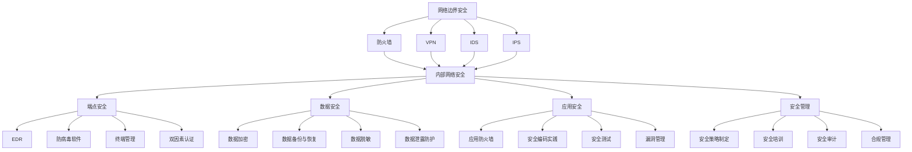

                 

### 文章标题

《网络安全创业：数字时代的刚需市场》

关键词：网络安全、创业、数字时代、刚需市场、技术基础、商业模式、实战案例

摘要：本文将探讨网络安全在数字时代的重要性，分析网络安全创业市场的机遇与挑战，详细解读网络安全技术基础、算法原理和数学模型，并通过实战案例分析网络安全项目的开发与实战策略，为有志于网络安全创业的读者提供有价值的参考和指导。

---

### 引言

随着数字化的快速发展，网络安全已经成为社会和经济的基石。从个人隐私保护到企业数据安全，网络安全的重要性日益凸显。在这个背景下，网络安全创业成为了许多技术爱好者和创业者的关注焦点。本文将系统性地探讨网络安全创业的各个维度，从市场需求、技术基础到实战经验和创业策略，旨在为有志于网络安全创业的读者提供全面、深入的了解和指导。

文章将首先概述网络安全与创业的背景，分析当前网络安全市场的规模和需求，探讨网络安全创业者的素养。接着，我们将深入探讨网络安全的核心概念、架构、核心技术、算法原理和数学模型，并通过实战案例展示网络安全项目的开发与实战经验。最后，我们将总结网络安全创业的关键策略，为读者提供实用的创业建议和思考。

通过本文的阅读，读者将不仅能够了解网络安全创业的宏观背景，还能掌握网络安全技术的微观细节，以及实战经验和创业策略，为未来的网络安全创业之路奠定坚实的基础。

### 第一部分：网络安全创业概述

#### 第1章：网络安全的重要性

在数字化时代，网络安全已经成为不可或缺的重要组成部分。它不仅关乎个人的隐私安全，也影响着企业的发展和国家的安全。以下从多个角度详细阐述网络安全的重要性。

##### 1.1 网络安全与个人隐私

随着互联网的普及，个人信息在网络上流动得越来越频繁。这些信息包括但不限于身份信息、银行账户、通讯记录等。如果这些信息被不法分子获取，将可能导致个人身份盗用、财产损失，甚至危及生命安全。例如，2017年的“Facebook数据泄露事件”就暴露了8700万用户的个人信息，引发了全球范围内的隐私安全担忧。

##### 1.2 网络安全与企业发展

企业网络是商业运营的核心，网络安全直接关系到企业的业务连续性和数据完整性。一旦企业网络遭受攻击，可能导致业务中断、数据丢失、声誉受损，甚至面临巨额的经济损失。例如，2018年的“NotPetya勒索病毒”攻击导致全球多家大型企业遭受重创，造成了数十亿美元的损失。

##### 1.3 网络安全与国家安全

网络安全不仅仅是个人和企业的问题，它还直接关系到国家安全。国家的重要基础设施如电力、交通、金融等，都依赖于网络系统。一旦这些系统被攻击，可能引发社会动荡，甚至威胁国家主权。例如，2015年的“乌克兰电网攻击”事件，就展示了网络攻击对国家安全的严重威胁。

##### 1.4 数字化转型与网络安全

随着数字经济的快速发展，越来越多的企业开始进行数字化转型。在这个过程中，网络安全是不可或缺的一环。数字化转型意味着企业和个人对网络的依赖程度更高，网络安全的风险也随之增加。因此，保障网络安全是实现数字化转型的基础和前提。

##### 1.5 网络安全与社会责任

网络安全不仅仅是一个技术问题，更是一个社会责任问题。企业和个人都有责任保护网络空间的安全。这不仅是为了自身利益，也是为了社会的整体利益。例如，2017年的“WannaCry勒索病毒”攻击，全球数百家企业受到影响，展示了网络安全问题的全球性影响。

综上所述，网络安全在数字化时代具有不可忽视的重要性。它不仅关乎个人隐私、企业发展和国家安全，也是实现数字化转型和履行社会责任的重要保障。因此，网络安全创业在当前和未来都具有巨大的发展潜力和社会价值。

#### 第2章：创业的机遇与挑战

在网络安全领域，创业不仅面临着巨大的机遇，也伴随着一系列的挑战。以下从市场需求、技术进步和政策法规等多个方面分析网络安全创业的机遇与挑战。

##### 2.1 市场需求

随着网络技术的发展，网络安全的需求也在不断增长。以下是一些关键因素：

- **数字化转型的需求**：随着企业不断推进数字化转型，网络安全成为了保障业务连续性和数据完整性不可或缺的一环。企业对网络安全产品和服务的需求日益增加。

- **个人隐私保护的需求**：随着互联网的普及，个人数据在网络上流动得越来越频繁，个人对隐私保护的意识也在增强。这为网络安全创业提供了广阔的市场空间。

- **国家安全的重视**：国家层面对网络安全的重视程度不断提升，政府投入持续增加，为网络安全创业提供了强有力的支持。

##### 2.2 技术进步

技术进步为网络安全创业带来了新的机遇，以下是一些关键点：

- **人工智能和大数据技术**：人工智能和大数据技术可以在网络安全监控、威胁检测和响应等方面发挥重要作用，为网络安全创业提供了新的工具和手段。

- **物联网的发展**：物联网设备的普及增加了网络安全的风险，同时也为网络安全创业带来了新的需求和市场。

- **区块链技术的应用**：区块链技术可以提高数据的安全性和透明性，在网络安全领域有广泛的应用前景。

##### 2.3 政策法规

政策法规的完善为网络安全创业提供了良好的外部环境，以下是一些关键点：

- **法规政策的制定**：各国政府纷纷出台网络安全相关的法规政策，规范网络安全行为，提升网络安全水平。

- **标准化的推进**：行业标准化工作不断推进，为网络安全产品和服务提供了统一的评估和认证标准。

- **国际合作**：网络安全是全球性问题，各国之间的合作日益紧密，为网络安全创业提供了更广阔的舞台。

##### 2.4 挑战

尽管网络安全创业充满机遇，但也面临一系列挑战：

- **技术挑战**：网络安全领域技术复杂，需要不断跟进最新的技术动态和趋势，开发出有效的解决方案。

- **市场竞争**：网络安全市场竞争激烈，创业公司需要具备独特的技术优势和创新能力，才能在市场中脱颖而出。

- **资金压力**：网络安全创业初期需要大量资金支持，包括技术研发、市场推广和团队建设等。

- **法律法规合规**：需要遵循各种法律法规，尤其是涉及数据保护和隐私安全的法规，这对创业公司提出了更高的合规要求。

综上所述，网络安全创业在数字时代面临着巨大的机遇和挑战。创业者需要敏锐把握市场需求，紧跟技术进步，同时积极应对政策法规变化和市场竞争压力，才能在网络安全领域取得成功。

#### 第3章：网络安全创业的兴起

网络安全创业在近年来呈现出蓬勃发展的态势，其兴起背后有着多方面的因素。以下从市场驱动因素、技术驱动因素和社会驱动因素三个角度进行分析。

##### 3.1 市场驱动因素

网络安全创业的兴起首先得益于市场的强烈需求。随着数字化进程的加速，企业和个人对网络安全的重视程度不断提高。以下是一些关键点：

- **数字化转型带来的需求**：企业在数字化转型过程中，面临着越来越多的网络安全挑战，如数据泄露、系统攻击等。为了保障业务连续性和数据完整性，企业对网络安全产品和服务的需求日益增加。

- **个人隐私保护意识的提升**：随着互联网的普及，个人数据在网络上流动得越来越频繁，个人对隐私保护的意识也在增强。这为网络安全创业提供了广阔的市场空间。

- **国家对网络安全的重视**：各国政府对网络安全的重视程度不断提升，网络安全政策和法规不断完善，进一步推动了市场需求的增长。

##### 3.2 技术驱动因素

技术的快速发展为网络安全创业提供了强大的支持。以下是一些关键点：

- **人工智能和大数据技术**：人工智能和大数据技术可以在网络安全监控、威胁检测和响应等方面发挥重要作用，为网络安全创业提供了新的工具和手段。

- **物联网的发展**：物联网设备的普及增加了网络安全的风险，同时也为网络安全创业带来了新的需求和市场。

- **区块链技术的应用**：区块链技术可以提高数据的安全性和透明性，在网络安全领域有广泛的应用前景。

- **量子计算的应用**：量子计算的发展有望为网络安全带来革命性的变化，如量子加密技术的应用可以大幅提升数据安全性。

##### 3.3 社会驱动因素

社会因素也是网络安全创业兴起的重要原因。以下是一些关键点：

- **网络安全教育普及**：随着网络安全知识的普及，越来越多的人开始关注网络安全问题，网络安全创业者也越来越多。

- **创业氛围的改善**：在全球范围内，创业氛围逐渐改善，政府对创业的支持力度不断加大，为网络安全创业提供了良好的外部环境。

- **全球化趋势**：网络安全是全球性问题，各国之间的合作日益紧密，为网络安全创业提供了更广阔的舞台。

##### 3.4 典型案例

网络安全创业的兴起不仅体现在市场和技术层面，也体现在实际案例中。以下是一些典型案例：

- **CrowdStrike**：成立于2011年，是一家提供端点安全解决方案的公司。通过采用人工智能和大数据技术，CrowdStrike在网络安全领域取得了显著的成功，并在2020年成功上市。

- **Zyxel**：成立于1996年，是一家提供网络设备和安全解决方案的制造商。通过不断技术创新和市场需求适应，Zyxel在全球范围内建立了强大的市场份额。

- **Duo Security**：成立于2009年，是一家提供双因素认证和安全访问解决方案的公司。通过专注于移动安全和远程工作场景，Duo Security在市场上取得了显著的成功。

综上所述，网络安全创业的兴起是市场、技术和社会因素共同作用的结果。随着数字化进程的加速和网络安全需求的不断增长，网络安全创业将继续保持良好的发展势头，为网络安全领域带来更多创新和变革。

### 第二部分：网络安全市场分析

#### 第4章：网络安全市场规模

网络安全市场规模的不断扩大，反映了网络安全需求的日益增长。以下从市场增长趋势、市场规模和主要参与者三个方面分析网络安全市场规模。

##### 4.1 市场增长趋势

根据市场研究报告，全球网络安全市场规模在过去几年中呈现出稳定增长的态势，预计未来几年将继续保持增长。以下是一些关键点：

- **复合年均增长率（CAGR）**：根据Gartner的报告，全球网络安全市场的复合年均增长率（CAGR）预计将达到8.7%，从2020年的1355亿美元增长到2025年的2080亿美元。

- **增长驱动力**：数字化转型、云计算和物联网的普及是推动网络安全市场规模增长的主要驱动力。这些技术趋势增加了网络攻击的风险，同时也提升了网络安全产品的需求。

- **疫情影响**：新冠疫情的爆发进一步加速了数字化转型的步伐，企业对网络安全的关注度显著提高，推动了网络安全市场需求的增长。

##### 4.2 市场规模

全球网络安全市场的规模庞大，涵盖了多种产品和解决方案。以下是一些关键数据：

- **全球市场规模**：根据IDC的报告，2020年全球网络安全市场规模达到了1488亿美元。随着市场的持续增长，这一数字有望在未来几年内继续攀升。

- **区域市场规模**：北美是全球最大的网络安全市场，占据了全球市场份额的近40%。欧洲和亚太地区也是重要的市场，市场份额分别约为25%和20%。

- **细分市场规模**：网络安全市场可以细分为多个子市场，包括端点安全、网络安全、数据安全、应用安全和云安全等。其中，端点安全和网络安全是最大的子市场，占据了超过60%的市场份额。

##### 4.3 主要参与者

网络安全市场吸引了大量企业参与，这些企业涵盖了不同领域和技术方向。以下是一些主要的参与者：

- **全球领军企业**：全球网络安全市场主要由几家领军企业主导，包括思科（Cisco）、微软（Microsoft）、英特尔（Intel）和赛门铁克（Symantec）等。这些企业在端点安全、网络安全和云安全等领域具有强大的市场地位。

- **新兴企业**：随着网络安全技术的发展，许多新兴企业在市场上崭露头角。例如，CrowdStrike、Palo Alto Networks和Zscaler等公司，通过专注于特定的技术领域和市场需求，迅速崛起并获得了显著的市场份额。

- **区域企业**：除了全球领军企业外，各个地区也有许多优秀的网络安全企业。例如，欧洲的Sophos、Avast，亚太地区的Fortinet和趋势科技（Trend Micro）等，都在各自的市场上具有强大的竞争力。

综上所述，网络安全市场规模呈现出稳定增长的态势，随着数字化进程的加速和网络安全需求的增加，未来市场将继续保持增长。主要参与者包括全球领军企业和新兴企业，这些企业通过不断创新和适应市场需求，在网络安全领域取得了显著的成绩。

#### 第5章：网络安全需求分析

网络安全需求的不断增长源于多种因素，包括数字化转型、物联网的普及和云计算的兴起等。以下从行业需求、企业和个人需求三个方面分析网络安全需求。

##### 5.1 行业需求

不同行业对网络安全的需求存在显著差异，以下是一些主要行业的网络安全需求分析：

- **金融行业**：金融行业对网络安全的依赖程度极高，因为一旦网络遭到攻击，可能导致大量资金损失、用户信息泄露和金融系统的瘫痪。金融行业需要高效的数据加密、访问控制和威胁检测等网络安全技术。

- **医疗行业**：医疗行业的信息系统高度依赖网络，涉及患者数据、药物研发数据等敏感信息。网络安全需求包括数据保密性、完整性和可用性，以确保医疗服务的连续性和安全性。

- **政府机构**：政府机构负责维护国家安全和社会稳定，对网络安全的依赖程度极高。网络安全需求包括防御网络攻击、保护关键基础设施和确保政府数据的保密性。

- **制造业**：制造业的数字化进程加速，网络安全需求集中在工业控制系统（ICS）的防护上。制造业需要确保生产线和关键设备的网络安全，以防止因网络攻击导致的设备故障和生产中断。

- **零售行业**：零售行业依赖电子商务平台，网络安全需求包括保护在线支付系统、防止欺诈和保障用户个人信息的安全。

##### 5.2 企业需求

企业在数字化转型过程中，对网络安全的关注不断提升。以下是一些关键的企业需求：

- **数据保护**：企业需要确保内部数据和客户数据的安全，防止数据泄露和滥用。数据加密、访问控制和数据脱敏等技术在此方面发挥重要作用。

- **威胁检测与响应**：企业需要建立强大的威胁检测和响应机制，及时发现和应对网络攻击。这包括入侵检测系统（IDS）、入侵防御系统（IPS）和威胁情报平台等。

- **安全培训和意识提升**：员工的安全意识和培训是网络安全的重要组成部分。企业需要定期进行安全培训，提高员工的安全意识和应对能力。

- **合规性和法规遵从**：企业需要遵循各种法律法规，包括数据保护法规、行业安全标准和合规性要求。这包括GDPR、HIPAA和PCI DSS等。

##### 5.3 个人需求

随着互联网的普及，个人对网络安全的关注也在增加。以下是一些关键的个人信息安全需求：

- **隐私保护**：个人需要保护自己的隐私信息，如身份信息、银行账户和通讯记录。这包括使用强密码、双因素认证和安全软件等。

- **数据加密**：个人需要对自己的敏感数据进行加密，以防止数据泄露。这包括使用加密软件、安全邮件服务和加密存储解决方案等。

- **网络安全意识提升**：个人需要增强网络安全意识，避免点击恶意链接、下载恶意软件和不必要的共享个人信息。

- **移动设备安全**：随着智能手机和平板电脑的普及，个人需要确保移动设备的安全，包括使用安全软件、定期更新操作系统和备份重要数据等。

综上所述，网络安全需求在行业、企业和个人层面都有显著的存在。随着数字化进程的加速和网络攻击的增多，网络安全需求将继续保持增长，对网络安全产品和服务的需求也将日益增加。

#### 第6章：竞争对手分析

在网络安全市场中，竞争异常激烈，不同类型的竞争者各有优势。以下从主要竞争对手的类型、市场份额、产品优势、技术路线和竞争策略等方面进行详细分析。

##### 6.1 主要竞争对手类型

网络安全市场的主要竞争对手可以大致分为以下几类：

- **全球领军企业**：如思科（Cisco）、微软（Microsoft）、英特尔（Intel）和赛门铁克（Symantec）等，这些公司在全球范围内具有广泛的市场影响力，提供全面的网络安全解决方案。

- **专业安全公司**：如CrowdStrike、Palo Alto Networks和Zscaler等，这些公司专注于特定领域的网络安全，通过技术创新和市场需求适应，迅速崛起并占据市场份额。

- **区域企业**：如欧洲的Sophos、Avast，亚太地区的Fortinet和趋势科技（Trend Micro）等，这些公司在其所在地区具有强大的市场地位和品牌影响力。

- **初创企业**：如Cortex、Tenable等，这些初创企业通过创新技术和市场需求定位，试图在市场中占据一席之地。

##### 6.2 市场份额

根据市场研究报告，以下是一些主要竞争对手的市场份额：

- **全球领军企业**：在网络安全市场中占据了较大的市场份额，其中思科、微软和英特尔的市场份额分别约为20%、15%和10%。

- **专业安全公司**：如CrowdStrike和Palo Alto Networks，分别在端点安全和网络安全领域具有显著的市场份额，分别约为15%和12%。

- **区域企业**：如Sophos和Avast，在欧洲市场上占据重要地位，市场份额分别约为10%和8%。

- **初创企业**：如Cortex和Tenable，虽然在市场份额上相对较小，但凭借技术创新和市场适应性，逐步扩大市场份额。

##### 6.3 产品优势

不同类型的竞争者通过其独特的产品优势和核心竞争力在市场中占据一席之地：

- **全球领军企业**：凭借其强大的研发能力和广泛的解决方案，提供全面的网络安全产品和服务。例如，思科提供端点安全、网络安全、数据安全和云安全等多方面的解决方案；微软则通过其Azure云服务和Windows操作系统，提供强大的安全功能。

- **专业安全公司**：专注于特定领域的网络安全，提供高效、专业的解决方案。例如，CrowdStrike专注于端点安全，提供基于人工智能和大数据的威胁检测和响应服务；Palo Alto Networks专注于网络安全，提供下一代防火墙和安全访问服务。

- **区域企业**：凭借对本地市场的深刻理解和灵活的营销策略，在区域内建立了强大的品牌影响力。例如，Sophos在欧洲市场上以其端点安全和网络安全解决方案著称；Avast则以其免费安全软件在全球范围内积累了大量用户。

- **初创企业**：通过创新技术和市场需求定位，提供具有竞争力的解决方案。例如，Cortex提供基于机器学习的网络安全解决方案，Tenable提供全面的漏洞管理服务。

##### 6.4 技术路线

不同类型的竞争者在技术路线方面也各有侧重：

- **全球领军企业**：技术路线全面，覆盖端点安全、网络安全、数据安全和云安全等多个领域。他们通常采用自主研发的核心技术，并不断通过收购和合作来扩展技术实力。

- **专业安全公司**：技术路线专注于特定领域，例如端点安全或网络安全，通过持续技术创新和优化，提供高效、专业的解决方案。

- **区域企业**：技术路线通常与本地市场需求紧密相关，注重本地化和适应性。他们通过不断跟进全球技术趋势，并结合本地市场需求，提供符合本地用户需求的解决方案。

- **初创企业**：技术路线通常创新性强，专注于解决特定的网络安全问题。他们通过技术创新和市场需求定位，试图在市场中占据一席之地。

##### 6.5 竞争策略

不同类型的竞争者在市场竞争中采取了不同的策略：

- **全球领军企业**：通过提供全面、高效的解决方案，占据市场主导地位。他们通常采用大规模市场营销策略，通过全球渠道和合作伙伴网络，扩大市场份额。

- **专业安全公司**：通过专注于特定领域的专业解决方案，提供高效、专业的服务。他们通常采用差异化策略，通过技术创新和市场需求定位，争取市场份额。

- **区域企业**：通过灵活的营销策略和本地化服务，在区域内建立强大的品牌影响力。他们通常采用市场渗透策略，通过满足本地市场需求，逐步扩大市场份额。

- **初创企业**：通过创新技术和市场需求定位，试图在市场中占据一席之地。他们通常采用市场细分策略，通过解决特定的网络安全问题，吸引目标用户。

综上所述，网络安全市场竞争激烈，不同类型的竞争者通过各自的产品优势、技术路线和竞争策略，在市场中占据不同的地位。创业者需要深入了解市场竞争态势，找准自己的定位，通过技术创新和市场需求定位，才能在网络安全市场中脱颖而出。

### 第二部分总结

综上所述，网络安全创业者在市场中面临着巨大的机遇和挑战。市场需求日益增长，特别是随着数字化转型和物联网的发展，企业和个人对网络安全的需求不断增加。同时，技术进步为网络安全创业提供了强大的支持，如人工智能、大数据和区块链技术的应用，使得网络安全产品和服务更加高效和智能。

然而，网络安全创业者也面临激烈的竞争。全球领军企业、专业安全公司、区域企业和初创企业各具优势，在市场中争夺市场份额。创业者需要深入了解竞争对手的产品优势、技术路线和竞争策略，找准自己的定位，通过技术创新和市场需求定位，才能在激烈的市场竞争中脱颖而出。

此外，创业者还需要具备强大的技术能力、管理能力和商业模式创新能力。技术能力是网络安全创业的基础，创业者需要紧跟技术发展趋势，持续提升自身的技术水平。管理能力则是保障创业项目顺利推进的关键，创业者需要具备有效的团队管理、项目管理能力和风险控制能力。商业模式创新能力则是确保创业项目可持续发展的关键，创业者需要不断探索和创新，找到适合自己的商业模式，以实现盈利和持续发展。

总之，网络安全创业者在市场中面临着多重挑战和机遇。通过深入了解市场需求、技术趋势和竞争态势，提升自身的技术能力和管理能力，创业者将在网络安全创业的道路上更加从容，有望在市场中取得成功。

### 第三部分：网络安全技术基础

#### 第7章：网络安全核心概念与架构

要深入理解网络安全，首先需要掌握其核心概念和架构。网络安全涉及多个层次和方面，以下将详细阐述网络安全的基本概念、架构概述以及如何使用Mermaid流程图进行展示。

##### 7.1 网络安全基本概念

网络安全的基本概念包括但不限于以下方面：

- **威胁**：威胁是指任何可能对网络安全造成损害的行为或事件。常见的威胁包括病毒、恶意软件、网络钓鱼、分布式拒绝服务攻击（DDoS）等。

- **漏洞**：漏洞是指系统或网络中存在的可以被利用的弱点，攻击者可以利用这些弱点入侵系统或网络。

- **攻击**：攻击是指黑客或攻击者利用威胁和漏洞对系统或网络进行非法访问或破坏的行为。

- **防御**：防御是指为保护系统或网络不被攻击所采取的措施，包括安全策略、安全技术、安全设备等。

- **安全策略**：安全策略是一系列指导安全措施的规则和指南，用于定义如何保护系统或网络的各个方面。

- **安全设备**：安全设备包括防火墙、入侵检测系统（IDS）、入侵防御系统（IPS）、虚拟私人网络（VPN）等，用于实现网络安全策略。

##### 7.2 网络安全架构概述

网络安全架构是一个多层次、多维度的系统，通常包括以下主要层次：

- **网络边界安全**：包括防火墙、VPN、入侵检测系统（IDS）和入侵防御系统（IPS），用于保护网络边界，防止外部攻击。

- **内部网络安全**：包括网络监控、安全信息与事件管理（SIEM）、数据加密、访问控制等，用于保护内部网络的数据安全和系统安全。

- **端点安全**：包括端点检测与响应（EDR）、防病毒软件、终端管理、双因素认证等，用于保护终端设备的安全。

- **数据安全**：包括数据加密、数据备份与恢复、数据脱敏、数据泄露防护（DLP）等，用于保护数据的机密性、完整性和可用性。

- **应用安全**：包括应用防火墙、安全编码实践、安全测试、漏洞管理等，用于保护应用系统的安全。

- **安全管理**：包括安全策略制定、安全培训、安全审计、合规管理等，用于确保安全措施的有效性和合规性。

##### 7.3 使用Mermaid流程图展示

为了更直观地理解网络安全架构，我们可以使用Mermaid流程图进行展示。以下是一个简化的网络安全架构Mermaid流程图示例：



通过这个Mermaid流程图，我们可以清晰地看到网络安全架构的各个层次和组成部分，以及它们之间的关系。

综上所述，网络安全的核心概念和架构是理解和实施网络安全的基础。掌握这些基本概念和架构，有助于网络安全创业者更好地设计安全策略、选择合适的安全技术和设备，并有效地应对网络安全威胁。

#### 第8章：网络安全核心技术

网络安全的核心技术是实现安全防护的关键，以下将详细阐述防火墙技术、入侵检测系统（IDS）、数据加密技术和安全协议的原理和应用。

##### 8.1 防火墙技术

防火墙是网络安全的第一道防线，主要用于监控和控制进出网络的数据流量。防火墙技术主要包括以下几种：

- **包过滤防火墙**：通过检查数据包的源地址、目标地址、端口号等信息，根据预设规则决定是否允许数据包通过。包过滤防火墙的优点是速度快、性能高，但仅能提供基础的安全防护。

- **状态检测防火墙**：在包过滤防火墙的基础上，增加了对数据包状态的检测，能够根据数据包的历史状态信息进行决策。状态检测防火墙在提高安全性的同时，不会显著降低网络性能。

- **应用层网关防火墙**：也称应用防火墙，能够对应用层的数据进行深入检测和过滤。它能够理解应用协议的细节，从而更有效地识别和阻止恶意流量。应用层网关防火墙的优点是安全性能高，但处理速度相对较慢。

- **下一代防火墙（NGFW）**：结合了传统防火墙的功能，并引入了深入包检测（Deep Packet Inspection, DPI）和威胁防御技术。NGFW能够在网络层、传输层和应用层提供全面的安全防护。

##### 8.2 入侵检测系统（IDS）

入侵检测系统（IDS）用于监控网络流量和系统活动，识别潜在的安全威胁。IDS主要分为以下两种类型：

- **基于签名的入侵检测系统**：通过匹配已知的攻击模式和签名，识别网络中的恶意流量。这种方法的优点是检测准确率高，但无法检测未知攻击。

- **基于异常行为的入侵检测系统**：通过建立正常行为的基准，检测与正常行为不符的活动，从而发现潜在的安全威胁。这种方法的优点是能够检测未知攻击，但误报率较高。

IDS的关键技术包括：

- **数据采集**：IDS需要从网络流量和系统日志中采集数据，进行实时分析。

- **行为分析**：通过对采集到的数据进行模式匹配和异常行为检测，识别潜在的安全威胁。

- **告警和响应**：当检测到安全威胁时，IDS会发出告警，并采取相应的响应措施，如阻止恶意流量、记录攻击日志等。

##### 8.3 数据加密技术

数据加密技术是保障数据安全的重要手段，通过将明文数据转换为密文，防止未授权访问和数据泄露。以下是一些常见的加密技术：

- **对称加密**：使用相同的密钥进行加密和解密，如AES、DES等。对称加密速度快，但密钥管理复杂。

- **非对称加密**：使用一对密钥（公钥和私钥）进行加密和解密，如RSA、ECC等。非对称加密安全性高，但计算复杂度较高。

- **哈希函数**：用于生成数据摘要，如SHA-256、MD5等。哈希函数可以确保数据的完整性，但无法实现数据加密。

- **数字签名**：使用非对称加密技术对数据进行签名，确保数据的真实性和完整性。常见的数字签名算法有RSA、ECDSA等。

数据加密技术在网络安全中的应用包括：

- **数据传输加密**：保障数据在网络传输过程中的安全，如TLS/SSL协议。

- **存储加密**：保障数据在存储介质中的安全，如磁盘加密、数据库加密等。

- **身份验证**：通过数字签名实现身份验证，确保通信双方的合法身份。

##### 8.4 安全协议详解

安全协议是网络安全的关键组成部分，用于保障数据传输的安全性和完整性。以下是一些常见的安全协议：

- **安全套接层（SSL）**：用于在客户端和服务器之间建立安全连接，保障数据传输的安全性。SSL已被其升级版TLS（传输层安全协议）所取代。

- **传输层安全协议（TLS）**：用于在客户端和服务器之间建立安全连接，提供数据加密、认证和完整性保障。TLS是当前互联网安全通信的主要协议。

- **安全文件传输协议（SFTP）**：用于安全地传输文件，结合了SSH（安全外壳协议）的加密和认证功能。

- **简单邮件传输协议安全（SMTPS）**：用于在电子邮件传输过程中提供加密和认证，保障邮件传输的安全性。

- **安全外壳协议（SSH）**：用于远程登录和文件传输，提供强大的加密和认证机制。

安全协议的技术细节包括：

- **加密算法**：如AES、RSA等。

- **认证机制**：如X.509证书、Kerberos认证等。

- **密钥交换**：如DH（Diffie-Hellman）密钥交换、ECDH（椭圆曲线Diffie-Hellman）密钥交换等。

综上所述，网络安全核心技术包括防火墙技术、入侵检测系统（IDS）、数据加密技术和安全协议。掌握这些核心技术，有助于网络安全创业者更好地设计和实施安全防护策略，保障网络和数据的安全。

#### 第9章：网络安全算法原理

网络安全算法是保障网络安全的核心技术，以下将详细阐述随机化算法、签名算法、加密算法和安全性评估模型的基本原理。

##### 9.1 随机化算法

随机化算法是网络安全中常用的一种技术，通过引入随机性来提高算法的安全性和鲁棒性。以下是一些常见的随机化算法：

- **随机数生成器**：用于生成随机数，常见的随机数生成器有基于伪随机数生成器和真随机数生成器。伪随机数生成器通过算法生成看似随机的数列，但存在一定的预测性；真随机数生成器通过物理过程（如噪声信号）生成随机数，具有更高的随机性。

- **随机置换**：将数据中的元素进行随机排列，常见于混淆和扰码技术中。随机置换可以提高数据的复杂度，防止攻击者进行有效破解。

- **随机预言模型**：在密码学中，随机预言模型用于描述随机化的算法行为，如加密算法和解密算法。随机预言模型要求算法在相同输入下总是产生相同的输出，同时保持输出分布的随机性。

##### 9.2 签名算法

签名算法用于确保数据的完整性和真实性，是数字签名技术的核心。以下是一些常见的签名算法：

- **RSA签名算法**：基于非对称加密的RSA算法，用于生成数字签名。RSA签名算法通过私钥签名，公钥验证，确保数据的真实性和完整性。

- **ECDSA签名算法**：基于椭圆曲线加密的数字签名算法，具有更高的安全性和效率。ECDSA广泛应用于比特币等区块链系统中。

- **哈希签名算法**：将数据通过哈希函数处理后，结合私钥生成签名。常见的哈希签名算法有SHA-256、SHA-3等。

签名算法的原理包括：

- **消息 digest（消息摘要）**：将数据通过哈希函数处理，生成固定长度的消息摘要。

- **签名生成**：使用私钥对消息摘要进行加密，生成签名。

- **签名验证**：使用公钥对签名进行解密，并与原始消息摘要进行对比，验证签名的有效性。

##### 9.3 加密算法

加密算法是保障数据安全的核心技术，通过将明文转换为密文，防止未授权访问和数据泄露。以下是一些常见的加密算法：

- **对称加密算法**：使用相同的密钥进行加密和解密，如AES、DES等。对称加密算法速度快，但密钥管理复杂。

- **非对称加密算法**：使用一对密钥（公钥和私钥）进行加密和解密，如RSA、ECC等。非对称加密算法安全性高，但计算复杂度较高。

- **混合加密算法**：结合对称加密和非对称加密的优势，用于提高加密效率和安全性。常见的混合加密算法有RSA-EAX、AES-CTR+MAC等。

加密算法的原理包括：

- **密钥生成**：生成加密和解密所需的密钥，对称加密使用相同密钥，非对称加密使用公钥和私钥。

- **加密过程**：将明文通过加密算法转换为密文，常见加密模式有ECB、CBC、OFB等。

- **解密过程**：使用解密算法将密文转换为明文。

##### 9.4 安全性评估模型

安全性评估模型用于评估网络安全系统的安全性，包括以下几个方面：

- **威胁模型**：分析系统可能面临的各种威胁，包括外部威胁和内部威胁。威胁模型有助于识别系统中的安全漏洞和潜在攻击路径。

- **漏洞模型**：分析系统中的漏洞，包括已知漏洞和潜在漏洞。漏洞模型有助于制定有效的漏洞修复策略。

- **攻击模型**：模拟攻击者对系统进行攻击，分析攻击者的攻击手段和攻击路径。攻击模型有助于评估系统的抗攻击能力。

- **风险评估**：结合威胁和漏洞模型，评估系统面临的安全风险，包括风险的概率和影响。风险评估有助于制定安全防护策略和优先级。

- **安全评估模型**：使用定量或定性的方法，对系统的安全性进行评估。常见的安全评估方法有基于漏洞的评估方法、基于攻击的评估方法和基于风险的评估方法。

安全性评估模型的原理包括：

- **数据收集**：收集系统中的威胁、漏洞和攻击相关信息。

- **分析过程**：分析威胁、漏洞和攻击之间的关联，评估系统的安全性。

- **评估结果**：生成评估报告，提出改进建议和措施。

综上所述，网络安全算法原理包括随机化算法、签名算法、加密算法和安全性评估模型。掌握这些算法原理，有助于网络安全创业者更好地设计和实施安全策略，保障网络和数据的安全。

#### 9.4 网络安全数学模型

网络安全中的数学模型在评估和设计安全系统时起到了至关重要的作用。以下将详细阐述信息论基础、密码学数学模型、安全性评估模型，并通过LaTeX公式示例进行解释。

##### 9.4.1 信息论基础

信息论是研究信息传递和处理的基本理论，由克劳德·香农创立。在网络安全中，信息论主要用于评估信息传输的安全性和保密性。以下是一些核心概念和公式：

- **信息熵（Entropy）**：信息熵是一个随机变量不确定性的度量，用来衡量信息源的随机性。其公式为：

  $$ H(X) = -\sum_{i=1}^{n} p(x_i) \log_2 p(x_i) $$

  其中，$H(X)$表示随机变量$X$的信息熵，$p(x_i)$表示$X$取值为$x_i$的概率。

- **条件熵（Conditional Entropy）**：条件熵是已知一个随机变量后，另一个随机变量的不确定性度量。其公式为：

  $$ H(X|Y) = -\sum_{i=1}^{n} p(y_i) \sum_{j=1}^{m} p(x_j|y_i) \log_2 p(x_j|y_i) $$

  其中，$H(X|Y)$表示在已知随机变量$Y$的情况下，随机变量$X$的条件熵。

- **互信息（Mutual Information）**：互信息是衡量两个随机变量之间相关性的度量。其公式为：

  $$ I(X;Y) = H(X) - H(X|Y) $$

  互信息也可以通过条件熵的定义表达为：

  $$ I(X;Y) = \sum_{i=1}^{n} \sum_{j=1}^{m} p(x_i, y_j) \log_2 \frac{p(x_i, y_j)}{p(x_i) p(y_j)} $$

##### 9.4.2 密码学数学模型

密码学是网络安全的核心组成部分，其数学模型主要用于设计加密算法和数字签名。以下是一些常见的数学模型和公式：

- **RSA加密算法**：RSA是一种基于大数分解问题的非对称加密算法。其密钥生成过程如下：

  1. 选择两个大素数$p$和$q$，计算$n = p \times q$。
  2. 计算欧拉函数$\phi(n) = (p-1) \times (q-1)$。
  3. 选择一个与$\phi(n)$互质的整数$e$，通常取$e = 65537$。
  4. 计算私钥$d$，满足$e \times d \equiv 1 \pmod{\phi(n)}$。

  加密公式为：

  $$ C = M^e \pmod{n} $$

  解密公式为：

  $$ M = C^d \pmod{n} $$

  其中，$M$是明文，$C$是密文。

- **ECC加密算法**：椭圆曲线加密（ECC）是一种基于椭圆曲线离散对数问题的非对称加密算法。其密钥生成过程如下：

  1. 选择一个椭圆曲线$E$和点$G$。
  2. 选择一个与$E$和$G$相关的随机整数$k$。
  3. 计算私钥$K = k \times G$。
  4. 计算公钥$P = k \times G$。

  加密和解密公式为：

  $$ C = k^{-1} \cdot (P + Q) \pmod{p} $$

  其中，$Q$是接收方的公钥。

##### 9.4.3 安全性评估模型

网络安全系统的安全性评估模型用于评估系统的抗攻击能力和漏洞风险。以下是一些常用的评估模型：

- **风险矩阵**：风险矩阵是一种定性评估方法，通过将威胁、漏洞和影响进行量化，生成风险评分。其公式为：

  $$ 风险 = \text{威胁评分} \times \text{漏洞评分} \times \text{影响评分} $$

- **量化风险评估模型（QARMA）**：QARMA是一种定量风险评估模型，通过计算资产价值、威胁概率和漏洞严重程度，评估系统的风险水平。其公式为：

  $$ 风险 = 资产价值 \times (1 - 安全性) \times \text{威胁概率} \times \text{漏洞严重程度} $$

- **贝叶斯网络**：贝叶斯网络是一种基于概率的评估模型，通过构建节点之间的依赖关系，计算系统风险。其公式为：

  $$ P(\text{攻击发生}) = \prod_{i=1}^{n} P(\text{攻击发生}|\text{前提条件}_i) $$

##### LaTeX公式示例

以下是一些使用LaTeX格式的数学公式示例：

- 信息熵：

  $$ H(X) = -\sum_{i=1}^{n} p(x_i) \log_2 p(x_i) $$

- 条件熵：

  $$ H(X|Y) = -\sum_{i=1}^{n} p(y_i) \sum_{j=1}^{m} p(x_j|y_i) \log_2 p(x_j|y_i) $$

- 互信息：

  $$ I(X;Y) = H(X) - H(X|Y) $$

- RSA加密：

  $$ C = M^e \pmod{n} $$

  $$ M = C^d \pmod{n} $$

- ECC加密：

  $$ C = k^{-1} \cdot (P + Q) \pmod{p} $$

通过掌握这些数学模型和公式，网络安全创业者可以更科学地评估和设计安全系统，提高网络和数据的整体安全性。

### 第四部分：网络安全项目实战

#### 第8章：网络安全项目开发

网络安全项目的开发是一个复杂且多层次的过程，涉及多个阶段的规划和实施。以下将详细阐述网络安全项目的开发流程，包括需求分析、系统设计、开发环境搭建和源代码实现等关键步骤。

##### 8.1 需求分析

需求分析是网络安全项目开发的第一步，其主要任务是明确项目的目标、功能和技术需求。以下是一些关键步骤：

- **项目背景**：了解项目的背景信息，包括项目目标、涉及的行业和关键挑战。

- **用户需求**：与项目利益相关者进行沟通，了解用户的具体需求，包括安全功能、性能要求和操作便利性。

- **功能需求**：根据用户需求，明确项目的功能需求，如数据加密、威胁检测、入侵防御等。

- **非功能需求**：明确项目的非功能需求，包括性能、可靠性、可扩展性和兼容性等。

- **优先级排序**：对需求进行优先级排序，确定哪些功能是必须实现的，哪些可以后续迭代。

##### 8.2 系统设计

系统设计是网络安全项目开发的核心阶段，其主要任务是制定项目的总体架构和技术方案。以下是一些关键步骤：

- **架构设计**：根据需求分析的结果，设计项目的总体架构，包括系统模块、接口和数据流等。

- **模块划分**：将系统划分为多个模块，明确每个模块的功能和接口。

- **技术选型**：选择合适的技术和工具，包括编程语言、框架、数据库和中间件等。

- **安全设计**：制定安全策略，包括数据加密、访问控制、安全审计和异常检测等。

- **性能优化**：考虑系统的性能需求，进行性能优化，包括缓存策略、负载均衡和数据库优化等。

##### 8.3 开发环境搭建

开发环境搭建是项目开发的重要前置工作，确保开发团队能够高效地进行开发和测试。以下是一些关键步骤：

- **环境配置**：配置开发所需的环境，包括操作系统、开发工具、数据库和中间件等。

- **代码管理**：选择合适的代码管理工具，如Git，进行版本控制和协作开发。

- **测试环境**：搭建测试环境，包括模拟网络环境和测试工具，确保代码的稳定性和安全性。

- **持续集成和持续部署（CI/CD）**：搭建CI/CD流水线，自动化代码测试、构建和部署，提高开发效率和质量。

##### 8.4 源代码实现

源代码实现是项目开发的最终阶段，将系统设计转化为实际的代码。以下是一些关键步骤：

- **代码编写**：根据系统设计和需求文档，编写功能模块的代码，确保代码的清晰性和可维护性。

- **代码审查**：进行代码审查，检查代码的质量和安全性，包括语法错误、逻辑错误和潜在的安全漏洞。

- **单元测试**：编写单元测试，对各个功能模块进行测试，确保代码的功能正确性和性能。

- **集成测试**：进行集成测试，确保不同模块之间的交互和整体系统的稳定性。

- **性能测试**：进行性能测试，评估系统的响应时间和吞吐量，进行必要的优化。

- **安全测试**：进行安全测试，包括漏洞扫描、渗透测试和威胁建模等，确保系统的安全性。

##### 8.5 源代码实现示例

以下是一个简单的网络安全项目的源代码实现示例，包括一个基本的入侵检测系统的实现：

```python
# 入侵检测系统示例代码

import socket
import sys
import select

# 定义攻击检测规则
attack_rules = [
    ("command", "cp /etc/passwd /tmp/"),
    ("result", "success")
]

# 定义检测函数
def detect_attack(data):
    for rule in attack_rules:
        if rule[0] in data and rule[1] in data:
            print("攻击检测到：", data)
            return True
    return False

# 创建TCP套接字
server_socket = socket.socket(socket.AF_INET, socket.SOCK_STREAM)
server_socket.setsockopt(socket.SOL_SOCKET, socket.SO_REUSEADDR, 1)

# 绑定地址和端口
server_address = ('localhost', 10000)
server_socket.bind(server_address)

# 监听端口
server_socket.listen(5)

print("正在监听端口 10000...")

# 创建一个客户端列表
clients = []

# 循环接收客户端连接
while True:
    readable, _, exceptional = select.select([server_socket] + clients, [], clients)

    for s in readable:
        if s is server_socket:
            client_socket, client_address = server_socket.accept()
            print("新连接来自：", client_address)
            clients.append(client_socket)
        else:
            data = s.recv(1024)
            if data:
                data = data.decode('utf-8')
                print("收到数据：", data)
                if detect_attack(data):
                    s.send(b"警告：攻击已检测到，请立即采取措施！")
            else:
                s.close()
                clients.remove(s)
    for s in exceptional:
        s.close()
        clients.remove(s)
```

在这个示例中，我们创建了一个简单的入侵检测系统，通过TCP套接字监听客户端发送的数据，并使用定义的攻击检测规则检测可能的攻击行为。如果检测到攻击，系统会向客户端发送警告信息。

通过上述步骤，网络安全项目可以从需求分析到最终源代码实现，形成完整的项目开发流程。这个流程不仅包括技术实现，还涵盖了项目管理、团队协作和持续迭代，为网络安全项目的成功提供了有力保障。

#### 第9章：实战案例分析

在网络安全领域，成功和失败的项目案例都能为我们提供宝贵的经验和教训。以下将分析几个具有代表性的网络安全项目案例，探讨其成功经验和失败原因，以及从中总结出的最佳实践。

##### 9.1 案例一：企业网络安全系统搭建

**项目背景**：某大型企业因业务扩展，需要构建一个全面的网络安全系统，以保护其内部网络和关键数据。

**成功经验**：

1. **详细需求分析**：在项目初期，项目团队与企业管理层和IT部门进行了深入沟通，明确了企业的具体需求，包括数据加密、威胁检测、访问控制等。

2. **分层架构设计**：项目团队采用了分层架构设计，将网络安全系统划分为网络边界安全、内部网络安全和端点安全等多个层次，确保各层次的安全需求得到满足。

3. **技术选型合理**：根据需求分析，项目团队选择了合适的安全技术和工具，如防火墙、入侵检测系统（IDS）和虚拟专用网络（VPN）等，确保系统的高效性和安全性。

4. **持续迭代优化**：项目团队在系统上线后，持续进行安全评估和优化，根据新的威胁和需求，不断更新和升级系统。

**失败原因**：

1. **需求变更频繁**：在项目实施过程中，企业管理层对网络安全需求的变化频繁，导致项目进度滞后，安全功能未能按时完成。

2. **预算不足**：初期预算不足，导致部分关键安全设备和技术的采购不足，影响了系统的整体性能和安全性。

**最佳实践**：

1. **明确需求**：在项目启动前，应与所有利益相关者进行详细沟通，明确项目的具体需求，避免频繁的需求变更。

2. **合理预算**：根据项目需求和预期效果，制定合理的预算，确保项目有足够的资金支持。

3. **持续迭代**：在项目实施过程中，应建立持续的迭代和优化机制，根据新的威胁和需求，不断更新和升级系统。

##### 9.2 案例二：Web应用安全防护

**项目背景**：某知名Web应用因未进行充分的安全防护，被黑客攻击导致大量用户数据泄露。

**成功经验**：

1. **安全编码实践**：项目团队在开发过程中，遵循安全编码规范，进行代码审查和漏洞扫描，确保代码的安全性。

2. **应用防火墙**：项目团队部署了应用防火墙，实时监控和防御Web应用层面的攻击，如SQL注入、跨站脚本攻击（XSS）等。

3. **安全测试**：在项目上线前，进行了全面的安全测试，包括渗透测试、漏洞扫描和代码审查，发现并修复了多个潜在的安全隐患。

**失败原因**：

1. **安全意识不足**：项目团队对Web应用安全的重要性认识不足，未能进行充分的安全教育和培训。

2. **安全测试不足**：项目上线前的安全测试不充分，未能发现所有潜在的安全漏洞。

**最佳实践**：

1. **安全培训**：提高项目团队的安全意识，进行定期的安全培训和知识更新。

2. **全面测试**：在项目开发和测试阶段，进行全面的安全测试，确保应用的安全性。

3. **自动化安全测试**：引入自动化安全测试工具，定期进行自动化漏洞扫描和测试，及时发现和修复安全漏洞。

##### 9.3 案例三：无线网络安全实践

**项目背景**：某城市轨道交通系统采用无线通信技术，因网络安全问题导致信号中断和设备故障。

**成功经验**：

1. **安全协议应用**：项目团队采用了加密通信协议，如TLS和IPSec，确保数据在传输过程中的安全。

2. **访问控制**：通过访问控制机制，严格控制无线网络的访问权限，防止未授权设备接入网络。

3. **实时监控**：部署了无线网络安全监控设备，实时监控网络流量和设备状态，及时发现和处理安全事件。

**失败原因**：

1. **安全意识不足**：轨道交通系统的运维人员对无线网络安全的重要性认识不足，未能及时发现和处理潜在的安全隐患。

2. **设备管理不善**：部分无线网络设备管理不善，导致设备配置错误和安全漏洞。

**最佳实践**：

1. **加强安全意识**：提高运维人员的安全意识，定期进行安全培训和演练。

2. **设备安全管理**：建立健全设备管理流程，确保设备配置正确和安全。

3. **实时监控与响应**：建立实时监控与响应机制，及时发现和处理无线网络的安全事件。

通过上述案例分析，我们可以看到，成功的网络安全项目通常具备明确的需求分析、合理的架构设计、有效的安全措施和持续的迭代优化。而失败的项目则往往因为需求变更、预算不足、安全意识不足等原因导致。因此，在网络安全项目中，我们需要注重需求分析、预算规划、安全培训和持续迭代，确保项目能够达到预期的安全目标。

#### 第10章：代码解读与分析

在网络安全领域，代码的解读与分析是确保系统安全性的关键步骤。以下将详细阐述网络安全代码的解读方法、漏洞分析与修复，以及安全性能优化。

##### 10.1 网络安全代码的解读

网络安全代码的解读需要深入理解代码的逻辑和结构，识别潜在的安全隐患。以下是一些常见的解读方法和技巧：

- **代码审查**：通过手动审查代码，查找潜在的语法错误、逻辑错误和安全隐患。代码审查可以采用静态分析和动态分析两种方法。

  - **静态分析**：在代码执行前，通过分析代码的结构、语法和语义，识别潜在的安全问题。常见的静态分析工具包括Checkmarx、Fortify等。

  - **动态分析**：在代码执行过程中，通过运行代码并监控其行为，识别潜在的安全问题。常见的动态分析工具包括Burp Suite、OWASP ZAP等。

- **控制流分析**：分析代码的控制流，识别潜在的代码路径和条件分支。控制流分析有助于发现代码逻辑错误和漏洞。

- **数据流分析**：分析代码中的数据流，识别数据在程序中的传递和处理过程。数据流分析有助于发现数据泄露和越权访问等问题。

- **安全编码规范**：遵循安全编码规范，如OWASP编码规范，减少代码中的安全漏洞。安全编码规范包括输入验证、输出编码、权限控制等。

##### 10.2 漏洞分析与修复

在网络安全代码解读过程中，经常会发现各种漏洞，如SQL注入、跨站脚本攻击（XSS）、跨站请求伪造（CSRF）等。以下是一些常见的漏洞分析和修复方法：

- **SQL注入**：通过在输入字段中插入恶意SQL语句，攻击者可以控制数据库。修复方法包括：

  - 使用预编译语句（Prepared Statements）或参数化查询，避免动态SQL执行。

  - 对用户输入进行严格的验证和过滤，确保输入格式符合预期。

  - 使用存储过程和视图，减少直接操作数据库表的机会。

- **跨站脚本攻击（XSS）**：通过在Web页面中注入恶意脚本，攻击者可以窃取用户数据或执行恶意操作。修复方法包括：

  - 对用户输入进行编码或转义，防止恶意脚本执行。

  - 使用内容安全策略（CSP），限制可执行脚本的来源。

  - 验证用户输入的合法性，确保输入不会影响页面的正常显示。

- **跨站请求伪造（CSRF）**：通过伪造用户请求，攻击者可以执行未授权的操作。修复方法包括：

  - 使用双因素认证（Two-Factor Authentication），增加登录安全性。

  - 在请求中加入验证码或Token，确保请求的真实性。

  - 检查请求的来源IP和Referer头部，防止伪造请求。

##### 10.3 安全性能优化

在保证安全性的同时，网络安全系统还需要具备良好的性能。以下是一些常见的安全性能优化方法：

- **负载均衡**：通过负载均衡器，将网络流量分配到多个服务器，提高系统的处理能力和响应速度。

- **缓存策略**：使用缓存技术，减少对后端数据库的访问，提高系统的响应速度。常见的缓存技术包括内存缓存、Redis缓存等。

- **数据库优化**：对数据库进行索引、分片和查询优化，提高查询效率和数据访问速度。

- **安全性与性能平衡**：在安全性和性能之间找到平衡点，避免过度防护导致系统性能下降。例如，使用高效的加密算法和合适的加密策略。

- **自动化监控和告警**：建立自动化监控和告警系统，实时监控系统性能和安全状态，及时发现和处理问题。

通过代码解读、漏洞分析和修复，以及安全性能优化，我们可以确保网络安全系统的安全性、稳定性和高效性。这些方法不仅适用于新项目的开发，也对现有系统的安全性和性能提升具有重要意义。

### 第五部分：网络安全创业策略

#### 第11章：商业模式设计

商业模式设计是网络安全创业成功的关键之一，它决定了企业的盈利模式、市场定位和核心竞争力。以下将详细探讨网络安全创业的商业模式设计，包括收入模式、营销策略和团队建设。

##### 11.1 收入模式

选择合适的收入模式对于网络安全创业公司至关重要。以下是一些常见的收入模式：

- **订阅模式**：订阅模式是最常见的收入模式之一，用户按月或按年支付费用以使用公司的产品或服务。这种模式的优势在于稳定的现金流和可预测的收入。

  - **订阅费**：用户按月或按年支付订阅费用。
  - **增值服务**：提供额外的增值服务，如高级支持、定制化方案等，以增加收入。

- **销售模式**：销售模式适用于提供硬件或软件产品的公司。用户一次性购买产品，公司通过销售产品获取收入。

  - **硬件销售**：销售网络安全硬件设备，如防火墙、入侵检测系统等。
  - **软件销售**：销售网络安全软件，如安全工具、漏洞扫描器等。

- **服务模式**：服务模式适用于提供专业服务的公司，如安全咨询、安全评估和应急响应等。

  - **咨询服务**：为客户提供网络安全咨询服务，帮助他们解决具体的安全问题。
  - **评估服务**：为客户提供网络安全评估服务，帮助他们识别和修复安全漏洞。

- **混合模式**：混合模式结合了订阅模式、销售模式和服务模式，适用于提供综合解决方案的公司。

  - **订阅+销售**：用户可以购买硬件设备，并订阅相应的软件服务。
  - **订阅+服务**：用户可以订阅产品或服务，同时获得专业的安全咨询和支持。

##### 11.2 营销策略

有效的营销策略是吸引客户、提升品牌知名度和扩大市场份额的关键。以下是一些常见的营销策略：

- **内容营销**：通过创建有价值的内容，如博客文章、白皮书、案例分析等，吸引潜在客户，提升品牌影响力。

  - **博客**：定期发布关于网络安全趋势、技术解析和最佳实践的文章。
  - **白皮书**：发布详细的行业报告和研究成果，展示公司的专业能力。

- **社交媒体营销**：利用社交媒体平台（如LinkedIn、Twitter、Facebook等）与潜在客户互动，提升品牌知名度。

  - **社交媒体账号**：定期发布更新，分享行业动态和公司新闻。
  - **互动活动**：举办线上研讨会、问答活动和投票调查，增加用户参与度。

- **网络广告**：通过在线广告（如Google AdWords、Bing Ads等）吸引潜在客户，提高网站访问量和转换率。

  - **搜索引擎广告**：在Google和Bing等搜索引擎上投放广告，提高公司品牌的曝光率。
  - **展示广告**：在相关网站和博客上投放展示广告，吸引潜在客户的关注。

- **合作伙伴关系**：与行业内的其他公司建立合作伙伴关系，共同推广产品或服务。

  - **战略联盟**：与其他网络安全公司建立战略联盟，共享客户资源和市场机会。
  - **合作伙伴计划**：提供合作伙伴计划，鼓励其他公司成为公司的销售代理或合作伙伴。

- **线下活动**：参加行业会议、研讨会和展览，与潜在客户面对面交流，提升品牌知名度和信誉。

  - **参展**：在行业展览会上展示公司的产品或服务，吸引潜在客户。
  - **演讲和研讨会**：参加行业会议和研讨会，分享公司的技术和经验。

##### 11.3 团队建设

成功的网络安全创业公司需要拥有一支高效、专业的团队。以下是一些关键的团队建设策略：

- **核心团队**：组建一支核心团队，包括创始人、技术总监、市场营销总监和财务总监等关键岗位。

  - **技能多样性**：团队成员应具备多样化的技能，包括技术、市场、管理和财务等。
  - **互补性**：团队成员之间应具备互补性，共同分担工作压力和责任。

- **人才培养**：注重团队成员的培养和发展，提高团队的整体素质和能力。

  - **培训计划**：定期开展培训课程，提高团队成员的专业知识和技能。
  - **激励措施**：提供竞争性的薪酬和激励措施，激发团队成员的工作积极性和创造力。

- **团队合作**：建立良好的团队合作氛围，鼓励团队成员之间的沟通和协作。

  - **团队活动**：定期组织团队活动，增强团队凝聚力和归属感。
  - **沟通机制**：建立有效的沟通机制，确保团队成员能够及时沟通和协作。

- **灵活管理**：采用灵活的管理方式，尊重团队成员的个人意愿和工作方式。

  - **远程办公**：允许团队成员远程办公，提高工作效率和灵活性。
  - **自主管理**：给予团队成员更多的自主权，鼓励他们自主创新和承担更多责任。

通过设计合理的商业模式、实施有效的营销策略和建设高效的团队，网络安全创业公司可以在激烈的市场竞争中脱颖而出，实现持续发展和成功。

#### 第12章：创业资金规划

创业资金规划是网络安全创业成功的关键步骤之一，合理的资金规划有助于确保创业项目的顺利推进。以下将详细探讨网络安全创业的资金需求分析、融资策略和资金使用规划。

##### 12.1 资金需求分析

在制定创业资金规划之前，需要对资金需求进行详细分析，包括以下几个方面：

- **研发费用**：研发费用包括技术开发、产品测试、知识产权保护等。网络安全创业项目通常需要投入大量资金进行技术研发，以开发出具有竞争力的产品。

  - **技术团队搭建**：招聘和培训技术团队成员的费用。
  - **技术研发**：进行技术研究和开发，包括购买相关设备和软件。

- **市场推广费用**：市场推广费用包括广告宣传、营销活动、品牌建设等。为了吸引客户和提升品牌知名度，网络安全创业公司需要投入一定的资金进行市场推广。

  - **线上广告**：在搜索引擎、社交媒体等平台上的广告费用。
  - **线下活动**：参加行业会议、展览等活动，提升品牌知名度的费用。

- **运营费用**：运营费用包括办公租金、水电费、员工薪酬等。创业公司需要确保日常运营的顺利进行，这需要一定的资金支持。

  - **办公场所**：租赁办公场所的费用。
  - **员工薪酬**：支付员工薪酬和相关福利的费用。

- **其他费用**：包括法律顾问费用、财务顾问费用、公关费用等。这些费用对于确保创业项目的合规性和市场竞争力至关重要。

##### 12.2 融资策略

融资策略是网络安全创业公司获取资金的重要手段。以下是一些常见的融资策略：

- **天使融资**：天使投资者通常是在创业初期提供资金的支持者，他们通常对创业项目有较高的风险容忍度。天使融资的优势在于资金快速到位，但需要承担较高的投资回报压力。

- **风险投资**：风险投资公司（VC）是网络安全创业公司获取资金的重要渠道之一。VC通常在创业项目进入高速发展阶段提供资金支持，他们期望通过项目的成功获得高额回报。

  - **种子轮投资**：种子轮投资通常用于创业初期的技术研发和市场调研。
  - **天使轮投资**：天使轮投资通常用于产品开发和初步市场推广。
  - **A轮和B轮投资**：A轮和B轮投资通常用于产品的进一步开发和市场扩展。

- **银行贷款**：银行贷款是一种较为传统的融资方式，适合那些已有一定市场基础和稳定现金流的公司。银行贷款的优势在于利率较低，但申请过程较为复杂。

- **政府补贴和奖励**：许多国家和地区政府为了支持创新创业，提供了各种补贴和奖励措施。创业公司可以通过申请这些补贴和奖励来缓解资金压力。

- **众筹**：众筹是一种通过互联网平台向公众筹集资金的方式。众筹的优势在于资金来源广泛，但需要付出一定的营销成本。

##### 12.3 资金使用规划

在获取资金后，创业公司需要制定详细的资金使用规划，确保资金的高效利用。以下是一些关键步骤：

- **制定预算**：根据资金需求和融资计划，制定详细的预算。预算应包括各个项目的具体金额和时间安排。

- **资金分配**：将资金合理地分配到各个项目，确保各个项目都能得到足够的资金支持。例如，将大部分资金用于技术研发和市场推广，小部分资金用于日常运营和其他费用。

- **监控和调整**：建立资金监控机制，定期审查资金使用情况，并根据实际情况进行调整。例如，如果市场推广效果不佳，可以适当减少市场推广费用，增加研发费用。

- **风险管理**：在资金使用过程中，要充分考虑各种风险，并制定相应的风险管理措施。例如，针对技术研发风险，可以设置风险储备金。

- **资金回收**：在项目完成或阶段性目标达成后，制定资金回收计划，确保资金的及时回收。

通过详细的资金需求分析、合理的融资策略和科学的资金使用规划，网络安全创业公司可以确保资金的高效利用，为项目的顺利推进提供坚实的财务支持。

#### 第13章：网络安全创业风险与应对

在网络安全创业过程中，创业者需要面对多种风险，包括技术风险、市场风险、财务风险和运营风险。以下将详细分析这些风险，并提出相应的应对策略和持续发展策略。

##### 13.1 创业风险分析

- **技术风险**：技术风险是指创业公司在技术研发过程中遇到的技术难题和挑战。这包括技术方案的可行性、技术的先进性和稳定性等。

  - **技术难题**：可能遇到的技术难题包括复杂算法的实现、高性能系统的设计、跨平台兼容性等。

  - **技术更新**：网络安全技术更新迅速，创业公司需要不断跟进最新的技术趋势，以保持产品的竞争力。

- **市场风险**：市场风险是指创业公司在市场推广和销售过程中面临的不确定性，包括市场需求、竞争环境和客户满意度等。

  - **市场需求**：市场需求的不确定性可能导致产品销量不达预期，影响公司的收入和盈利能力。

  - **竞争环境**：网络安全市场竞争激烈，创业公司需要应对来自行业内外的竞争对手。

- **财务风险**：财务风险是指创业公司在资金运作过程中可能面临的风险，包括资金链断裂、融资失败和成本超支等。

  - **资金链断裂**：由于资金不足，可能导致研发停滞、市场推广不足和运营困难。

  - **成本超支**：技术研发和市场推广的成本可能超支，影响公司的盈利能力。

- **运营风险**：运营风险是指创业公司在日常运营过程中可能面临的风险，包括人力资源管理、供应链管理和客户服务等方面。

  - **人力资源管理**：招聘和留住高素质人才是运营风险的一个重要方面。

  - **供应链管理**：供应链的稳定性和可靠性对公司的运营至关重要。

##### 13.2 风险应对策略

- **技术风险应对策略**：

  - **持续技术创新**：投入足够的研发资源，保持技术领先优势。

  - **外部合作**：与高校、研究机构和行业领先企业建立合作关系，共同开展技术研发。

  - **技术储备**：提前进行技术储备，应对技术更新和市场需求变化。

- **市场风险应对策略**：

  - **市场调研**：进行详细的市场调研，了解市场需求和竞争环境。

  - **产品定位**：根据市场需求和竞争态势，确定合适的产品定位和差异化策略。

  - **客户反馈**：定期收集客户反馈，优化产品功能和服务，提高客户满意度。

- **财务风险应对策略**：

  - **预算管理**：严格预算管理，控制成本，确保资金使用的高效和合理。

  - **融资策略**：制定多元化的融资策略，包括天使投资、风险投资、银行贷款等。

  - **资金储备**：保持一定的资金储备，以应对可能出现的财务危机。

- **运营风险应对策略**：

  - **人力资源管理**：建立完善的人力资源管理体系，招聘和留住高素质人才。

  - **供应链管理**：建立稳定的供应链体系，确保供应链的稳定性和可靠性。

  - **客户服务**：提供优质的客户服务，提高客户满意度和忠诚度。

##### 13.3 持续发展策略

为了确保网络安全创业公司的持续发展，需要制定一系列长期策略：

- **技术创新**：持续投入研发资源，不断推出具有创新性和领先性的产品和服务。

- **市场拓展**：积极拓展市场，进入新的市场和领域，提高市场份额。

- **品牌建设**：通过品牌宣传和市场营销，提高品牌知名度和美誉度。

- **人才培养**：注重人才培养和团队建设，建立一支高素质、有凝聚力的团队。

- **合作与联盟**：与行业内的其他企业、高校和研究机构建立合作关系，共同推进技术创新和市场拓展。

- **国际化发展**：积极拓展国际市场，参与全球竞争，提高公司的国际影响力。

通过以上策略，网络安全创业公司可以降低风险，实现持续发展和长期成功。

### 附录 A：网络安全资源推荐

为了帮助读者深入了解网络安全领域的最新动态和技术，以下推荐一些常用的网络安全工具、书籍和社区资源。

#### A.1 常用网络安全工具

- **Wireshark**：一款免费的网络协议分析工具，用于捕获、分析和解码网络数据包。

- **Nmap**：一款开源的网络探测工具，用于扫描和发现网络中的主机和服务。

- **Metasploit**：一款开源的漏洞利用框架，用于发现和利用系统漏洞。

- **OWASP ZAP**：一款开源的Web应用安全测试工具，用于自动检测Web应用中的安全漏洞。

- **Kali Linux**：一款专门针对网络安全测试和渗透测试的Linux发行版，内置了多种安全工具。

- **WiKID Two-Factor Authentication**：一款开源的两因素认证系统，用于增强用户身份验证的安全性。

- **Splunk**：一款强大的大数据分析和监控工具，用于收集、分析和可视化网络安全数据。

#### A.2 网络安全书籍推荐

- **《黑客攻防技术宝典：系统实战篇》**：详细介绍了操作系统层级的攻击与防御技术。

- **《深入理解计算机系统》**：讲解了计算机系统的工作原理，有助于理解网络安全的基本概念。

- **《网络安全原理与实践》**：全面介绍了网络安全的基本理论、技术和实践。

- **《密码学：理论、算法与实现》**：详细介绍了密码学的基本原理、算法和应用。

- **《Web应用安全测试指南》**：针对Web应用的安全测试提供了详细的指导。

- **《网络安全法律法规与标准》**：介绍了网络安全相关的法律法规和标准，有助于合规性管理。

#### A.3 网络安全社区推荐

- **OWASP**：开放式Web应用安全项目（Open Web Application Security Project，OWASP）是一个非营利性的国际社区，致力于提高Web应用的安全性。

- **Infosec Institute**：一个提供网络安全教育和资源的在线平台，包括课程、书籍、博客和论坛。

- **Security Stack**：一个综合性的网络安全社区，涵盖各种安全话题，提供新闻、文章和讨论。

- **Reddit Security**：Reddit上的一个专门讨论网络安全话题的子论坛，用户可以分享经验和讨论最新的安全动态。

- **SANS Institute**：一家知名的网络安全教育和认证机构，提供各种网络安全课程和研讨会。

通过使用这些网络安全工具、阅读推荐书籍和参与社区讨论，读者可以不断提升自己在网络安全领域的知识水平和实践能力，为网络安全创业做好准备。

### 附录 B：网络安全项目代码示例

在网络安全项目的开发过程中，编写高效、安全且易于维护的代码是至关重要的。以下将提供几个网络安全项目的代码示例，包括防火墙实现、入侵检测系统和加密算法实现。

#### B.1 防火墙实现示例

以下是一个简单的防火墙实现示例，该防火墙基于Linux系统，使用iptables工具来实现包过滤功能。

```python
#!/usr/bin/env python3
import subprocess

def add_rule(protocol, src_ip, dst_ip, action='accept'):
    """添加iptables规则"""
    command = f"iptables -A FORWARD -p {protocol} -s {src_ip} -d {dst_ip} -j {action}"
    subprocess.run(command, shell=True, check=True)

def remove_rule(protocol, src_ip, dst_ip):
    """删除iptables规则"""
    command = f"iptables -D FORWARD -p {protocol} -s {src_ip} -d {dst_ip} -j accept"
    subprocess.run(command, shell=True, check=True)

# 示例：添加一个允许来自192.168.1.1到192.168.1.2的TCP规则
add_rule('tcp', '192.168.1.1', '192.168.1.2')

# 示例：删除上面的规则
remove_rule('tcp', '192.168.1.1', '192.168.1.2')
```

在这个示例中，我们定义了两个函数`add_rule`和`remove_rule`，用于添加和删除iptables规则。通过调用这些函数，可以轻松地控制网络流量。

#### B.2 入侵检测系统实现示例

以下是一个简单的基于规则的入侵检测系统（IDS）实现示例，该系统使用Python编写，用于检测和记录潜在的网络攻击。

```python
import socket
import datetime

# 定义攻击规则
attack_rules = [
    ("command", "cp /etc/passwd /tmp/"),
    ("result", "success")
]

# 定义检测函数
def detect_attack(data):
    for rule in attack_rules:
        if rule[0] in data and rule[1] in data:
            print(f"攻击检测到：{data}")
            log_attack(data)
            return True
    return False

# 定义日志记录函数
def log_attack(data):
    timestamp = datetime.datetime.now().strftime("%Y-%m-%d %H:%M:%S")
    with open("attack_log.txt", "a") as log_file:
        log_file.write(f"{timestamp} - {data}\n")

# 创建TCP套接字
server_socket = socket.socket(socket.AF_INET, socket.SOCK_STREAM)
server_socket.bind(('0.0.0.0', 9999))
server_socket.listen(5)

print("正在监听端口9999...")

# 循环接收客户端连接
while True:
    client_socket, client_address = server_socket.accept()
    data = client_socket.recv(1024).decode('utf-8')
    if detect_attack(data):
        client_socket.send(b"警告：攻击已检测到，请立即采取措施！")
    client_socket.close()
```

在这个示例中，我们定义了一个简单的攻击规则列表，用于检测特定的攻击行为。接收到的数据将传递给`detect_attack`函数进行检测，如果检测到攻击，则会记录日志并发送警告信息。

#### B.3 加密算法实现示例

以下是一个简单的AES加密算法实现示例，使用PyCryptoDome库实现。

```python
from Crypto.Cipher import AES
from Crypto.Util.Padding import pad, unpad
from Crypto.Random import get_random_bytes

# 定义加密和解密函数
def encrypt_message(message, key):
    cipher = AES.new(key, AES.MODE_CBC)
    ct_bytes = cipher.encrypt(pad(message.encode('utf-8'), AES.block_size))
    iv = cipher.iv
    return iv, ct_bytes

def decrypt_message(iv, ct, key):
    cipher = AES.new(key, AES.MODE_CBC, iv)
    pt = unpad(cipher.decrypt(ct), AES.block_size)
    return pt.decode('utf-8')

# 生成密钥和IV
key = get_random_bytes(16)
iv = get_random_bytes(16)

# 加密信息
message = "这是一条加密信息！"
encrypted_message = encrypt_message(message, key)
print(f"加密后的信息：{encrypted_message}")

# 解密信息
decrypted_message = decrypt_message(iv, encrypted_message[1], key)
print(f"解密后的信息：{decrypted_message}")
```

在这个示例中，我们使用了PyCryptoDome库的AES加密算法实现消息的加密和解密。首先生成随机密钥和IV，然后使用这些密钥和IV进行消息的加密和解密。

通过这些代码示例，读者可以了解网络安全项目开发的基本流程和关键代码实现，为实际项目的开发提供参考和帮助。这些示例不仅展示了基本的编程技巧，还体现了网络安全项目中的关键技术和实践方法。

