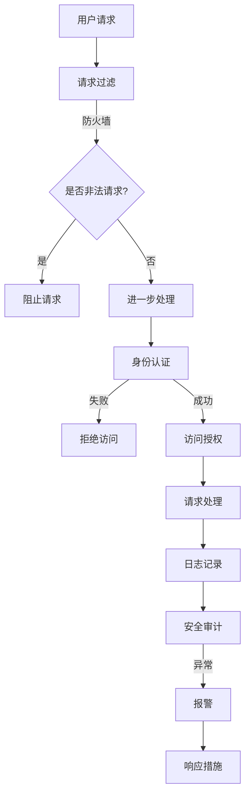

                 

### 《网络安全：技术创业者的责任与机遇》

关键词：网络安全、技术创业者、责任、机遇、防护策略、案例分析

摘要：随着互联网技术的飞速发展，网络安全已经成为企业和个人无法忽视的重要问题。技术创业者作为创新的推动者，不仅需要关注产品的商业价值，更应对网络安全负起责任，把握网络安全带来的新机遇。本文将从网络安全的重要性、基本概念、防护策略、创业中的角色、具体应用以及创业案例分析等方面，系统探讨技术创业者在网络安全领域的责任与机遇，帮助创业者构建全面的网络安全意识，实现安全与发展的双赢。

### 第一部分：网络安全基础

#### 第1章：网络安全概述

##### 1.1 网络安全的重要性

网络安全是保障信息系统正常运作和数据安全的关键。对于技术创业者来说，网络安全的重要性体现在以下几个方面：

- **数据保护**：随着互联网应用的普及，数据已经成为企业的核心资产。网络安全可以有效防止数据泄露、篡改等行为，保护企业利益。
- **业务连续性**：网络安全问题可能导致服务中断、系统瘫痪，影响企业的业务运营和客户体验，进而损害企业的声誉和商业价值。
- **法律法规遵守**：随着全球网络安全法律法规的不断完善，技术创业者需要确保其产品和服务符合相关法规要求，避免法律风险。

##### 1.2 网络安全的基本概念

网络安全涉及多个核心概念，包括但不限于：

- **安全威胁**：指对信息系统及其资源可能造成损害的潜在因素，如病毒、恶意软件、网络攻击等。
- **安全攻击**：指攻击者通过恶意行为对信息系统进行破坏、窃取、篡改等行为。
- **安全防护**：指通过技术和管理手段，防止安全威胁和攻击对信息系统造成损害的一系列措施。

##### 1.3 网络安全威胁类型

网络安全威胁类型多种多样，常见的包括：

- **网络病毒与恶意软件**：通过网络传播，感染计算机系统，导致系统崩溃、数据丢失等。
- **网络钓鱼与欺诈**：通过伪装成合法网站或邮件，骗取用户个人信息，进行非法交易。
- **DDoS攻击与分布式攻击**：通过大量恶意请求，使目标系统瘫痪，影响正常业务。
- **数据泄露与隐私侵犯**：通过网络攻击、内部泄露等方式，导致用户数据泄露，引发隐私问题。

##### 1.4 网络安全法律法规

网络安全法律法规是规范网络安全行为的重要工具。国内外主要的网络安全法律法规包括：

- **《中华人民共和国网络安全法》**：明确了网络运营者的安全责任，加强了对网络信息安全的保护。
- **《通用数据保护条例》（GDPR）**：欧盟推出的数据保护法规，对个人数据的收集、处理和存储提出了严格的要求。
- **《网络安全等级保护条例》**：我国针对信息系统安全保护制定的法规，明确了不同等级的安全保护要求。

#### 第2章：网络安全架构

##### 2.1 网络安全架构概述

网络安全架构是确保信息系统安全的关键。一个完善的网络安全架构应包括以下几个方面：

- **防御层**：通过防火墙、入侵检测系统等防护措施，阻止外部攻击。
- **监控层**：通过安全审计、日志分析等手段，监控系统运行状态，发现潜在威胁。
- **响应层**：在威胁发生时，能够迅速响应，采取应急措施，减少损失。
- **恢复层**：在系统受到攻击后，能够快速恢复，保障业务连续性。

##### 2.2 防火墙技术

防火墙是网络安全架构的核心组件之一，其作用是阻止未授权的访问，保护内部网络。防火墙技术包括：

- **包过滤防火墙**：根据IP地址、端口号等包信息进行过滤。
- **状态检测防火墙**：通过跟踪数据包的状态，实现更细粒度的访问控制。
- **应用层防火墙**：根据应用层协议，如HTTP、FTP等，进行过滤。

##### 2.3 入侵检测与防御系统

入侵检测与防御系统（IDS/IPS）是网络安全架构中的关键组件，用于实时监控网络流量，检测和阻止入侵行为。其工作原理包括：

- **签名匹配**：通过比对已知的攻击签名，识别攻击行为。
- **异常检测**：通过分析网络流量和行为特征，识别异常行为。
- **实时响应**：在检测到入侵行为时，自动采取阻止措施。

##### 2.4 安全审计与日志管理

安全审计与日志管理是网络安全的重要环节，通过记录和分析系统运行日志，可以及时发现和应对安全事件。其内容包括：

- **日志收集**：收集系统、网络、应用的日志信息。
- **日志分析**：通过分析日志，发现安全事件和异常行为。
- **日志归档**：对日志信息进行归档，以备后续审计和分析。

### 第二部分：网络安全技术在创业中的应用

#### 第3章：网络安全防护策略

##### 3.1 防护策略概述

网络安全防护策略是确保信息系统安全的关键。一个有效的防护策略应包括以下几个方面：

- **风险分析**：评估系统面临的威胁和风险，确定防护重点。
- **安全设计**：在设计阶段考虑安全因素，确保系统具备良好的安全特性。
- **安全配置**：根据安全策略，配置系统参数，确保系统运行在安全状态。
- **安全监控**：实时监控系统运行状态，及时发现和处理安全事件。

##### 3.2 身份认证与访问控制

身份认证与访问控制是保障信息系统安全的基础。其内容包括：

- **身份认证**：验证用户身份，确保只有授权用户可以访问系统。
- **访问控制**：根据用户身份和权限，限制用户对系统资源的访问。

常用的身份认证技术包括：

- **密码认证**：通过用户名和密码进行认证。
- **双因素认证**：结合密码和短信验证码、硬件令牌等多种认证方式，提高认证安全性。

##### 3.3 数据加密技术

数据加密技术是保障数据安全的重要手段。其内容包括：

- **对称加密**：使用相同的密钥进行加密和解密，如AES算法。
- **非对称加密**：使用公钥和私钥进行加密和解密，如RSA算法。
- **数字签名**：用于验证数据完整性和来源，如SHA算法。

##### 3.4 安全策略与安全意识培训

安全策略是指导系统安全管理的指南。其内容包括：

- **安全策略制定**：根据业务需求和风险评估，制定安全策略。
- **安全策略实施**：将安全策略落实到实际操作中。
- **安全意识培训**：提高员工的安全意识和技能，降低人为因素导致的安全风险。

#### 第4章：网络安全技术在创业中的角色

##### 4.1 创业者面临的网络安全挑战

技术创业者面临以下网络安全挑战：

- **资金和资源有限**：创业初期，资金和人力资源有限，难以投入足够的网络安全防护。
- **安全意识不足**：创业者可能缺乏网络安全知识和经验，对安全问题的重视程度不够。
- **业务变化快**：创业项目的业务变化快，系统架构和数据处理方式可能频繁调整，导致安全风险。

##### 4.2 网络安全在创业中的价值

网络安全在创业中的价值体现在以下几个方面：

- **保护核心资产**：确保企业的数据、知识产权等核心资产安全，防止泄露和损失。
- **提升竞争力**：具备良好的网络安全能力，可以提升企业的竞争力，赢得客户信任。
- **减少风险**：降低因网络安全问题导致的法律风险、业务中断风险等。

##### 4.3 创业者如何规划网络安全

创业者可以从以下几个方面规划网络安全：

- **制定安全策略**：根据业务需求和风险分析，制定符合实际的安全策略。
- **投入必要资源**：尽管资金有限，但应确保投入足够的资源进行网络安全防护。
- **加强安全培训**：提高员工的安全意识和技能，降低人为因素导致的安全风险。
- **持续监控与改进**：定期进行安全检查和风险评估，根据实际情况调整安全策略。

### 第三部分：网络安全创业案例分析

#### 第5章：网络安全技术在创业中的具体应用

##### 5.1 云计算与网络安全

云计算已经成为创业者的首选基础设施，但其也带来了新的网络安全挑战。创业者需要关注以下几个方面：

- **云安全**：了解云服务商的安全措施和责任范围，确保数据安全。
- **访问控制**：使用强认证和访问控制策略，防止未授权访问。
- **数据加密**：对敏感数据进行加密，防止数据泄露。

##### 5.2 移动应用与网络安全

移动应用的普及带来了新的网络安全问题。创业者需要关注以下几个方面：

- **应用安全**：确保应用代码安全，防止恶意攻击。
- **数据安全**：对用户数据进行加密和存储，防止泄露。
- **用户认证**：使用强认证机制，防止未经授权的访问。

##### 5.3 物联网安全

物联网设备的广泛应用带来了新的网络安全挑战。创业者需要关注以下几个方面：

- **设备安全**：确保设备具备安全防护能力，防止被攻击。
- **数据安全**：对传输和存储的数据进行加密，防止泄露。
- **网络隔离**：使用隔离技术，防止物联网设备受到网络攻击。

##### 5.4 区块链安全

区块链技术具有去中心化、不可篡改等特点，但在区块链应用中也存在安全风险。创业者需要关注以下几个方面：

- **智能合约安全**：确保智能合约代码安全，防止恶意攻击。
- **数据隐私**：保护用户数据隐私，防止泄露。
- **网络攻击防护**：防止区块链网络受到分布式拒绝服务攻击。

#### 第6章：网络安全创业案例分析

##### 6.1 成功案例分享

成功案例1：某创业公司通过引入先进的安全防护技术，有效保护了其核心数据，赢得了客户的信任，业务得到快速发展。

成功案例2：某创业公司利用区块链技术，实现了数据安全和隐私保护，为金融行业提供了可靠的数据解决方案，获得了市场的认可。

##### 6.2 失败案例教训

失败案例1：某创业公司在发展过程中，因忽视网络安全，导致客户数据泄露，企业声誉受到严重损害，最终被迫关闭。

失败案例2：某创业公司在区块链项目中，因智能合约存在漏洞，导致大量资金被盗，项目失败，创业者面临巨额赔偿。

##### 6.3 案例分析

通过对成功和失败案例的分析，可以得出以下结论：

- **重视网络安全**：网络安全是创业成功的关键因素之一，创业者应高度重视网络安全问题。
- **技术选型**：选择合适的安全技术，如云计算、区块链等，可以提高网络安全防护能力。
- **风险管理**：建立完善的风险管理机制，及时发现和处理安全风险。
- **持续改进**：网络安全形势不断变化，创业者需要持续关注网络安全动态，不断优化安全防护措施。

#### 第7章：网络安全创业者的责任与机遇

##### 7.1 创业者责任

网络安全创业者的责任包括：

- **保护用户数据**：确保用户数据安全，防止泄露和滥用。
- **遵守法律法规**：遵守国内外网络安全法律法规，确保业务合规。
- **建立安全文化**：提高员工安全意识，培养安全文化，降低安全风险。

##### 7.2 网络安全创业机遇

随着网络安全意识的提高，网络安全创业领域呈现出以下机遇：

- **技术创新**：不断出现新的安全技术，为创业者提供了丰富的创新空间。
- **市场潜力**：随着网络应用的普及，网络安全市场需求持续增长。
- **政策支持**：全球范围内，政府对网络安全产业的支持力度不断加大。

##### 7.3 创业者如何抓住机遇

创业者可以从以下几个方面抓住网络安全创业机遇：

- **技术创新**：紧跟网络安全技术发展趋势，开发具有竞争力的产品和服务。
- **市场需求**：深入了解市场需求，为客户提供有针对性的解决方案。
- **合作共赢**：与行业内的合作伙伴建立合作关系，共同推动网络安全产业发展。

### 第四部分：网络安全创业实战

#### 第8章：网络安全创业实战

##### 8.1 创业实战概述

网络安全创业实战主要包括以下几个阶段：

- **项目规划**：明确创业目标，分析市场需求，制定详细的项目规划。
- **技术研发**：开发具有创新性和竞争力的网络安全产品或服务。
- **市场推广**：通过线上线下渠道，推广产品或服务，拓展市场份额。
- **运营管理**：建立完善的运营管理体系，确保业务的持续发展和稳定运行。

##### 8.2 项目规划与实施

项目规划与实施主要包括以下步骤：

- **需求分析**：深入了解市场需求，确定创业项目的核心功能和目标用户。
- **技术选型**：选择合适的技术路线，确保项目的安全性和可行性。
- **团队组建**：组建专业的团队，明确分工，确保项目顺利推进。
- **研发实施**：按照项目计划，进行技术研发和产品开发。
- **测试与优化**：对产品进行严格测试，优化性能，确保产品质量。

##### 8.3 风险管理与应对

网络安全创业过程中，风险管理与应对至关重要。主要包括以下几个方面：

- **风险评估**：定期进行风险评估，识别项目面临的各种风险。
- **风险控制**：制定风险控制措施，降低风险发生的概率和影响。
- **应急预案**：制定应急预案，确保在风险发生时，能够迅速响应和处置。
- **持续改进**：根据风险管理和应对情况，不断优化风险控制措施。

##### 8.4 成功创业案例分析

成功案例1：某创业公司通过技术创新，成功开发了一款具有自主知识产权的网络安全产品，在市场上获得了广泛认可，实现了快速发展。

成功案例2：某创业公司通过深入了解市场需求，为客户提供定制化的网络安全解决方案，赢得了大量客户，业务规模持续扩大。

### 附录

#### 附录A：网络安全工具与资源

##### A.1 网络安全工具介绍

网络安全工具是保障网络安全的重要手段，主要包括以下几类：

- **防火墙**：用于过滤网络流量，防止未授权访问。
- **入侵检测系统（IDS）**：用于实时监控网络流量，检测入侵行为。
- **入侵防御系统（IPS）**：用于实时响应入侵行为，阻止攻击。
- **安全审计工具**：用于记录和分析系统运行日志，发现安全事件。
- **漏洞扫描工具**：用于扫描系统漏洞，评估安全风险。

##### A.2 网络安全资源推荐

以下是一些推荐的网络安全资源：

- **安全论坛**：如FreeBuf、安全客等，提供丰富的安全资讯和讨论。
- **安全社区**：如XSS.cn、乌云等，汇聚了大量安全专业人士和爱好者。
- **安全报告**：如IBM X-Force、火绒安全报告等，提供行业安全态势分析。
- **安全工具**：如Nmap、Wireshark等，提供强大的网络安全检测和分析功能。

##### A.3 网络安全开源项目介绍

网络安全开源项目为创业者提供了丰富的技术资源和创新空间。以下是一些知名的网络安全开源项目：

- **OpenVAS**：一款开源的漏洞扫描和安全管理工具。
- **Metasploit**：一款开源的漏洞利用框架，用于测试和验证系统漏洞。
- **OWASP ZAP**：一款开源的网络应用程序安全测试工具。
- **CISecurity**：一款开源的安全配置管理工具，提供多种操作系统和应用程序的安全配置建议。

作者：AI天才研究院/AI Genius Institute & 禅与计算机程序设计艺术 /Zen And The Art of Computer Programming

在撰写关于网络安全的技术博客时，我们不仅需要传递核心概念和原理，还需要通过图表和代码示例来增强文章的可读性和理解度。以下是一个示例，展示如何使用Mermaid流程图和伪代码来阐述网络安全的核心概念。

### 网络安全威胁分析流程图



#### 入侵检测系统工作原理伪代码

```python
# 定义入侵检测系统类
class IntrusionDetectionSystem:
    def __init__(self):
        self.signature_database = load_signature_database()
        self.anomaly Detector = load_anomaly_detector()

    def monitor_traffic(self, traffic_packet):
        # 检查签名匹配
        if self.signature_database.matches_signature(traffic_packet):
            self.handle_invasion(traffic_packet)
        
        # 检查异常行为
        elif self.anomaly Detector.detects_anomaly(traffic_packet):
            self.handle_invasion(traffic_packet)
        
        # 正常流量
        else:
            pass

    def handle_invasion(self, traffic_packet):
        # 记录入侵事件
        log_invasion(traffic_packet)
        # 发送警报
        send_alarm(traffic_packet)
        # 实施响应措施
        apply_response_measures(traffic_packet)
```

#### 数据加密算法伪代码示例

```python
# 对数据进行加密
def encrypt_data(data, key):
    # 使用AES加密算法
    cipher = AES.new(key, AES.MODE_EAX)
    ciphertext, tag = cipher.encrypt_and_digest(data)
    return ciphertext, tag

# 对数据解密
def decrypt_data(ciphertext, tag, key):
    # 使用AES解密算法
    cipher = AES.new(key, AES.MODE_EAX, nonce=cipher.nonce)
    try:
        data = cipher.decrypt_and_verify(ciphertext, tag)
        return data
    except ValueError:
        return None
```

通过图表和代码示例，我们可以更直观地理解网络安全的核心概念和技术原理。这些工具不仅有助于提高文章的质量，还能帮助读者更好地掌握网络安全的知识和技能。

### 最佳实践 Tips

1. **定期进行安全审计**：定期进行安全审计可以帮助发现潜在的安全漏洞，及时进行修复，确保系统的安全性。

2. **加强员工安全培训**：提高员工的安全意识和技能，降低人为因素导致的安全风险。定期组织安全培训，让员工了解最新的安全威胁和防护措施。

3. **采用多层次防护策略**：结合使用多种安全技术和策略，如防火墙、入侵检测系统、数据加密等，形成多层次的安全防护体系。

4. **关注安全漏洞和补丁更新**：及时关注安全漏洞和补丁更新，确保系统和应用的及时更新，防止被攻击者利用漏洞进行攻击。

5. **建立应急响应机制**：制定详细的应急响应计划，确保在发生安全事件时，能够迅速响应和处置，减少损失。

### 小结

网络安全是技术创业者不可忽视的重要领域。本文通过详细阐述网络安全的基础知识、防护策略、创业中的角色以及案例分析，帮助创业者了解网络安全的重要性和具体应用。创业者应充分认识到网络安全的责任与机遇，积极采取有效措施，确保企业数据安全和业务连续性。通过不断学习和实践，创业者可以在这个快速发展的领域取得成功。

### 注意事项

1. **法律法规遵守**：在创业过程中，务必遵守国内外网络安全法律法规，确保业务的合法合规。
2. **风险评估**：定期进行风险评估，识别潜在的安全威胁和风险，制定相应的防护措施。
3. **数据保护**：确保用户数据安全，遵循数据保护的最佳实践，防止数据泄露和滥用。

### 拓展阅读

- **《黑客攻防技术宝典》**：详细介绍了黑客攻击手段和防御策略。
- **《网络安全法实战》**：解读《中华人民共和国网络安全法》，为企业提供安全合规指南。
- **《区块链安全指南》**：介绍区块链技术的安全性和潜在风险。

通过不断学习和实践，技术创业者可以在网络安全领域取得长足发展，为企业和个人提供更加安全可靠的技术和服务。

