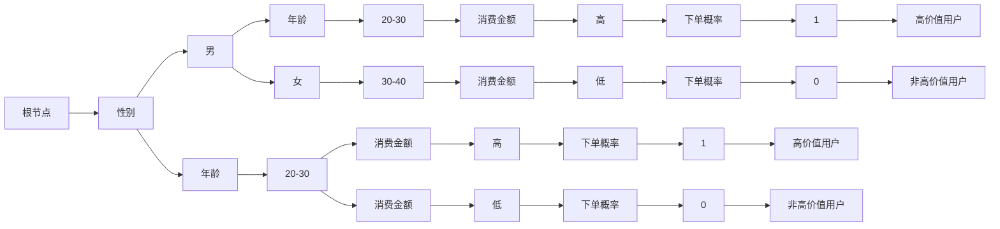
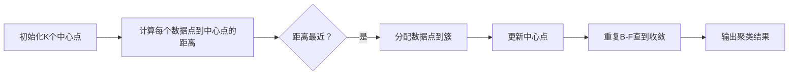

                 

### 文章标题

# 《美团2024到店消费者画像算法校招面试真题》

### 关键词

- 算法面试
- 消费者画像
- 数据预处理
- 分类算法
- 聚类算法
- 协同过滤

### 摘要

本文旨在深入探讨美团2024到店消费者画像算法校招面试真题。我们将从算法基础知识、数据预处理、消费者画像算法详解、美团到店消费者画像算法应用以及算法优化与未来展望等多个角度展开讨论。通过详细分析各类算法的原理、应用及实现，本文将为读者提供一份全面、深入的面试指南，帮助读者在美团校招面试中脱颖而出。

## 《美团2024到店消费者画像算法校招面试真题》目录大纲

### 第一部分：算法基础知识

#### 第1章：算法概述与消费者画像概念

1.1 算法在商业中的应用

1.2 消费者画像的基本概念

1.3 消费者画像的分类与构建

#### 第2章：数据预处理

2.1 数据清洗

2.2 数据整合

2.3 特征工程

### 第二部分：消费者画像算法详解

#### 第3章：分类算法

3.1 逻辑回归

3.1.1 逻辑回归原理

3.1.2 逻辑回归算法详解

3.2 决策树

3.2.1 决策树原理

3.2.2 决策树算法详解

3.3 随机森林

3.3.1 随机森林原理

3.3.2 随机森林算法详解

#### 第4章：聚类算法

4.1 K-均值聚类

4.1.1 K-均值聚类原理

4.1.2 K-均值聚类算法详解

4.2 层次聚类

4.2.1 层次聚类原理

4.2.2 层次聚类算法详解

#### 第5章：协同过滤算法

5.1 评分预测

5.1.1 评分预测原理

5.1.2 评分预测算法详解

5.2 用户推荐

5.2.1 用户推荐原理

5.2.2 用户推荐算法详解

### 第三部分：美团到店消费者画像算法应用

#### 第6章：美团到店消费者画像算法体系

6.1 算法体系概述

6.2 消费者行为分析

6.3 用户分群策略

#### 第7章：美团到店消费者画像算法实战

7.1 数据获取与预处理

7.2 特征工程

7.3 算法模型构建与评估

7.4 算法模型调优

#### 第8章：美团到店消费者画像算法优化与未来展望

8.1 算法优化策略

8.2 挑战与机遇

8.3 未来展望

### 附录

#### 附录A：常用算法伪代码

- 逻辑回归伪代码
- 决策树伪代码
- K-均值聚类伪代码

#### 附录B：数据预处理与特征工程工具

- 数据清洗工具
- 数据整合工具
- 特征工程工具

#### 附录C：参考文献与资料推荐

- 相关书籍推荐
- 网络资源推荐
- 学术论文推荐

### 文章结构

本文结构清晰，首先介绍了算法基础知识和消费者画像的概念，接着详细讲解了数据预处理、分类算法、聚类算法和协同过滤算法，然后以美团到店消费者画像算法为例进行了实战分析，最后讨论了算法优化策略和未来展望。每个部分都结合实例进行了深入剖析，力求为读者提供全面、系统的理解。

### 第一部分：算法基础知识

#### 第1章：算法概述与消费者画像概念

1. 算法在商业中的应用

在商业环境中，算法的应用已经无处不在。从推荐系统到风险控制，从数据挖掘到客户关系管理，算法都在为企业的决策提供支持。美团作为我国领先的本地生活服务电商平台，其到店消费者画像算法在用户行为分析、精准营销等方面具有重要意义。

2. 消费者画像的基本概念

消费者画像是一种基于数据分析的方法，通过提取用户的各项属性和行为特征，构建出一个综合的、多维度的用户模型。消费者画像可以帮助企业更好地了解用户需求，优化产品设计，提升用户满意度。

3. 消费者画像的分类与构建

消费者画像可以分为静态画像和动态画像。静态画像主要关注用户的性别、年龄、职业等基本属性，而动态画像则侧重于用户的行为特征，如购买记录、浏览习惯等。构建消费者画像的方法包括数据收集、数据清洗、特征工程等步骤。

### 第一部分：算法基础知识

#### 第2章：数据预处理

1. 数据清洗

数据清洗是数据预处理的第一步，其主要目标是去除重复数据、处理缺失数据和异常值。在构建消费者画像时，干净的数据至关重要，因为脏数据会导致模型准确性下降。

2. 数据整合

数据整合是将来自不同来源的数据进行合并，以便于后续分析。在美团到店消费者画像中，可能需要整合用户行为数据、交易数据、评价数据等多个数据源。

3. 特征工程

特征工程是数据预处理的关键步骤，通过提取、构造和选择特征，将原始数据转换为适合机器学习模型的输入。特征工程的质量直接影响到模型的性能。

### 第二部分：消费者画像算法详解

#### 第3章：分类算法

3.1 逻辑回归

3.1.1 逻辑回归原理

逻辑回归是一种广义线性模型，用于处理分类问题。其主要目标是预测一个二元变量的概率。

3.1.2 逻辑回归算法详解

逻辑回归算法的核心是最大化似然函数。以下是其伪代码：

$$
\text{for } i = 1 \text{ to } n \text{ do:} \\
\quad \text{for } j = 1 \text{ to } p \text{ do:} \\
\quad \quad \theta_j = \theta_j - \alpha \cdot \frac{\partial}{\partial \theta_j} \ln L(\theta) \\
\text{end for} \\
\text{end for}
$$

其中，$n$ 是样本数量，$p$ 是特征数量，$\theta_j$ 是第 $j$ 个特征的参数，$\alpha$ 是学习率，$L(\theta)$ 是似然函数。

#### 第4章：聚类算法

4.1 K-均值聚类

4.1.1 K-均值聚类原理

K-均值聚类是一种基于距离的聚类方法，其目标是将数据点分为 $K$ 个簇，使得簇内距离最小，簇间距离最大。

4.1.2 K-均值聚类算法详解

以下是其伪代码：

$$
\text{初始化：选择 } K \text{ 个初始中心点 } \mu_1, \mu_2, ..., \mu_K \\
\text{while } \text{收敛条件不满足 \text{do:}} \\
\quad \text{对于每个数据点 } x_i, \text{计算其到每个中心点的距离 } d(x_i, \mu_j) \\
\quad \text{将 } x_i \text{ 分配到最近的中心点所在的簇 } C_j \\
\quad \text{更新每个簇的中心点 } \mu_j = \frac{1}{N_j} \sum_{x_i \in C_j} x_i \\
\text{end while}
$$

其中，$N_j$ 是属于簇 $C_j$ 的数据点数量。

#### 第5章：协同过滤算法

5.1 评分预测

5.1.1 评分预测原理

协同过滤算法通过分析用户之间的相似性，预测用户对未知项目的评分。常见的协同过滤算法包括基于用户的协同过滤和基于项目的协同过滤。

5.1.2 评分预测算法详解

以下是基于用户的协同过滤算法的伪代码：

$$
\text{for } i = 1 \text{ to } n \text{ do:} \\
\quad \text{for } j = 1 \text{ to } m \text{ do:} \\
\quad \quad r_{ij} = u_i + \frac{\sum_{k \in N_i \cap N_j} (r_{ik} - \bar{r}_k)}{||N_i - N_j||_2} \\
\text{end for} \\
\text{end for}
$$

其中，$r_{ij}$ 是用户 $i$ 对项目 $j$ 的预测评分，$N_i$ 和 $N_j$ 分别是用户 $i$ 和用户 $j$ 的邻居集合，$\bar{r}_k$ 是邻居 $k$ 的平均评分，$||N_i - N_j||_2$ 是邻居集合之间的距离。

### 第三部分：美团到店消费者画像算法应用

#### 第6章：美团到店消费者画像算法体系

6.1 算法体系概述

美团到店消费者画像算法体系包括用户行为分析、用户分群策略和个性化推荐等模块。这些模块相互协作，共同构建出一个全面的消费者画像。

6.2 消费者行为分析

消费者行为分析是美团到店消费者画像算法体系的核心，其主要目标是挖掘用户在到店环节中的行为特征，包括到店频率、消费金额、评价等。

6.3 用户分群策略

用户分群策略是根据用户行为特征和行为模式，将用户划分为不同群体，以便于精准营销和个性化推荐。

#### 第7章：美团到店消费者画像算法实战

7.1 数据获取与预处理

在美团到店消费者画像算法实战中，首先需要获取用户行为数据、交易数据等，然后进行数据清洗、整合和特征工程。

7.2 特征工程

特征工程是美团到店消费者画像算法实战的关键，通过提取、构造和选择特征，将原始数据转换为适合机器学习模型的输入。

7.3 算法模型构建与评估

在构建算法模型时，可以选择分类算法、聚类算法和协同过滤算法等。在模型评估方面，可以使用准确率、召回率、F1值等指标。

7.4 算法模型调优

算法模型调优是提高模型性能的关键步骤。可以通过调整参数、特征选择和模型集成等方法进行优化。

### 第三部分：美团到店消费者画像算法应用

#### 第6章：美团到店消费者画像算法体系

6.1 算法体系概述

美团到店消费者画像算法体系是美团公司针对到店餐饮、娱乐等场景下的消费者行为进行深度分析的一套完整算法系统。该算法体系旨在通过对海量用户数据的挖掘与分析，构建出精准、细致的用户画像，从而为美团到店业务的运营决策、产品优化和市场营销提供科学依据。美团到店消费者画像算法体系主要包括以下几个模块：

1. **用户行为分析模块**：这一模块主要分析用户在到店场景下的各种行为，如搜索、浏览、下单、评价等。通过对用户行为的深度挖掘，了解用户需求、偏好和习惯，为后续的用户分群和推荐策略提供基础数据支持。

2. **用户分群策略模块**：根据用户行为分析的结果，结合用户的基本属性（如年龄、性别、地域等），将用户划分为不同的群体。这些群体可能是高价值用户、高频用户、潜力用户等，为后续的精准营销和个性化推荐提供目标群体。

3. **个性化推荐模块**：基于用户分群策略和用户行为分析结果，为每个用户生成个性化的推荐列表。推荐内容包括餐厅、商品、活动等，旨在提升用户满意度、增加用户粘性，进而促进业务增长。

4. **用户标签系统**：通过用户行为数据和外部数据的结合，为用户打上各种标签，如“美食爱好者”、“休闲放松族”、“家庭用户”等。这些标签不仅有助于更精准地理解用户，还可以用于用户画像的动态更新和优化。

6.2 消费者行为分析

消费者行为分析是美团到店消费者画像算法体系的核心环节，它涉及到对用户在到店环节中的各种行为进行数据收集、处理和分析。具体来说，消费者行为分析主要包括以下几个方面的内容：

1. **用户访问行为**：分析用户在美团平台的访问路径、停留时间、页面跳转等行为，了解用户在平台上的浏览习惯和兴趣点。

2. **搜索行为**：分析用户的搜索关键词、搜索频率、搜索结果点击率等，从中挖掘用户的潜在需求和偏好。

3. **浏览行为**：分析用户在搜索结果页、商家详情页、商品详情页的浏览行为，了解用户的兴趣点和关注点。

4. **下单行为**：分析用户的下单频率、下单金额、下单时段等，了解用户的消费习惯和购买能力。

5. **评价行为**：分析用户的评价内容、评价频率、好评率等，了解用户的满意度和忠诚度。

6. **互动行为**：分析用户在美团平台的互动行为，如点赞、评论、分享等，了解用户的社交行为和口碑传播效果。

6.3 用户分群策略

用户分群策略是美团到店消费者画像算法体系中的重要组成部分，其目的是将具有相似特征和行为模式的用户划分为不同的群体，以便于开展精准营销和个性化推荐。用户分群策略通常基于以下几个维度进行：

1. **基础属性分群**：根据用户的基本属性，如年龄、性别、地域、职业等，将用户划分为不同的群体。这种方法简单直观，便于操作，但可能无法深入挖掘用户的潜在需求和偏好。

2. **行为特征分群**：根据用户在美团平台上的行为特征，如搜索行为、浏览行为、下单行为、评价行为等，将用户划分为不同的群体。这种方法可以更深入地了解用户的行为模式，有助于发现潜在的细分市场。

3. **消费能力分群**：根据用户的消费能力，如消费频率、消费金额、消费时段等，将用户划分为不同的群体。这种方法有助于针对不同消费能力的用户制定差异化的营销策略。

4. **兴趣偏好分群**：根据用户的兴趣偏好，如美食、休闲、旅游等，将用户划分为不同的群体。这种方法可以更精准地满足用户的需求，提升用户体验和满意度。

5. **生命周期分群**：根据用户在美团平台的生命周期，如新用户、活跃用户、沉默用户等，将用户划分为不同的群体。这种方法有助于分析用户生命周期中的关键节点，为用户的留存和转化提供策略支持。

在实际操作中，美团可能会结合多种分群维度，构建出多维度的用户分群模型。这样不仅可以提高分群的精准度，还可以为不同分群的用户提供更个性化的服务和体验。

### 第三部分：美团到店消费者画像算法应用

#### 第7章：美团到店消费者画像算法实战

7.1 数据获取与预处理

数据获取与预处理是美团到店消费者画像算法实战的基础步骤。以下是具体流程：

1. **数据收集**：从美团平台的后台系统、数据库和其他数据源中收集用户行为数据、交易数据、评价数据等。数据可能包括用户ID、性别、年龄、地域、消费金额、搜索关键词、浏览页面、下单时间、评价内容等。

2. **数据清洗**：处理数据中的缺失值、重复值、异常值等，确保数据质量。具体方法包括：
   - 缺失值处理：使用均值、中位数、众数等填充缺失值；
   - 重复值处理：通过去重操作删除重复记录；
   - 异常值处理：使用统计方法（如3σ法则）或基于业务逻辑的方法检测和修正异常值。

3. **数据整合**：将来自不同来源的数据进行整合，形成统一的用户行为数据集。这可能涉及到数据表连接、合并等操作。

4. **特征工程**：从原始数据中提取有用特征，构造新的特征。特征工程包括：
   - 离散特征转换：将类别型特征转换为数值型特征；
   - 挖掘潜在特征：如用户到店频率、消费时间段、评价情感分析等；
   - 特征选择：使用统计方法（如卡方检验、信息增益等）筛选出对模型影响较大的特征；
   - 特征缩放：使用标准缩放、归一化等方法调整特征范围，便于模型训练。

7.2 特征工程

特征工程是提升消费者画像算法性能的关键环节。以下是美团到店消费者画像算法中常用的特征工程方法：

1. **用户基础特征**：包括用户ID、性别、年龄、地域、职业等。这些特征可以直接用于模型训练，但可能需要根据业务逻辑进行预处理，如年龄分段、地域编码等。

2. **行为特征**：包括用户到店频率、平均消费金额、消费时段、浏览时长、搜索关键词等。这些特征可以反映用户的行为模式和偏好，是构建消费者画像的重要依据。

3. **文本特征**：包括用户评价、搜索关键词等。可以通过文本处理技术（如TF-IDF、Word2Vec等）提取文本特征，增强模型对用户行为和偏好的理解。

4. **时间特征**：包括用户到店时间、消费时间等。可以提取时间序列特征，如小时、天、周等周期内的平均消费金额、到店频率等。

5. **交互特征**：包括用户与平台、商家、商品的互动数据，如点赞、评论、分享等。这些特征可以反映用户对平台和商家的满意度。

6. **社会特征**：包括用户社交网络数据，如好友关系、关注数、粉丝数等。这些特征可以挖掘用户的社会影响力，为个性化推荐提供支持。

7.3 算法模型构建与评估

在构建美团到店消费者画像算法模型时，可以选择多种机器学习算法，如逻辑回归、决策树、随机森林、K-均值聚类等。以下是具体步骤：

1. **模型选择**：根据业务需求和数据特点，选择合适的算法模型。对于分类问题，可以选择逻辑回归、决策树、随机森林等；对于聚类问题，可以选择K-均值聚类、层次聚类等。

2. **模型训练**：使用训练数据集对所选模型进行训练。训练过程中，需要调整模型参数，如学习率、树深度、簇数等，以优化模型性能。

3. **模型评估**：使用验证数据集对训练好的模型进行评估。常用的评估指标包括准确率、召回率、F1值等。通过交叉验证等方法，评估模型的泛化能力。

4. **模型调优**：根据评估结果，调整模型参数，优化模型性能。可以采用网格搜索、随机搜索等方法进行参数调优。

7.4 算法模型调优

算法模型调优是提升消费者画像算法性能的重要环节。以下是美团到店消费者画像算法中常用的调优方法：

1. **参数调优**：调整模型参数，如学习率、树深度、簇数等。可以采用网格搜索、随机搜索等方法进行参数调优，找到最优参数组合。

2. **特征选择**：筛选对模型影响较大的特征，去除冗余特征。可以使用特征重要性评估方法（如Gini重要性、信息增益等）进行特征选择。

3. **模型集成**：使用多个模型集成的方法，如Bagging、Boosting等，提高模型性能。常见的方法包括随机森林、XGBoost、LightGBM等。

4. **正则化**：引入正则化项，如L1正则化、L2正则化等，防止模型过拟合。可以调整正则化参数，平衡模型复杂度和泛化能力。

5. **数据增强**：通过增加训练数据、数据变换等方法，提高模型泛化能力。可以采用数据生成、数据扩展等技术进行数据增强。

通过以上调优方法，可以显著提升美团到店消费者画像算法的性能，为精准营销和个性化推荐提供有力支持。

### 第三部分：美团到店消费者画像算法应用

#### 第8章：美团到店消费者画像算法优化与未来展望

8.1 算法优化策略

为了不断提升美团到店消费者画像算法的性能和精度，可以采取以下优化策略：

1. **数据质量提升**：通过数据清洗、去噪、更新等方法，确保数据质量。高质量的数据是构建精准消费者画像的基础。

2. **特征选择与工程**：基于业务需求和数据特性，精心选择和构建特征。可以通过特征重要性评估、特征组合等方法，筛选出对模型影响最大的特征。

3. **模型调优**：采用多种调优方法，如参数调优、正则化、模型集成等，优化模型性能。可以结合实际业务场景，选择合适的模型和调优策略。

4. **模型解释性**：提升模型解释性，帮助业务团队理解模型决策过程。可以采用模型可视化、特征重要性分析等方法，增强模型的可解释性。

5. **实时更新**：消费者行为和偏好是动态变化的，定期更新消费者画像，确保其与当前业务需求保持一致。

8.2 挑战与机遇

在美团到店消费者画像算法的发展过程中，面临着诸多挑战和机遇：

1. **数据隐私与安全**：随着数据隐私保护意识的提高，如何在保障用户隐私的前提下，充分利用数据资源，成为一大挑战。

2. **模型可解释性**：提高模型的可解释性，帮助业务团队更好地理解模型决策，是当前研究和应用的重点。

3. **实时性**：消费者行为数据更新速度快，如何实现实时更新和实时推荐，是一个亟待解决的问题。

4. **跨平台整合**：美团业务涉及多个平台（如外卖、打车、酒店等），如何实现跨平台整合，构建统一的消费者画像，是一个重要研究方向。

5. **个性化推荐**：随着消费者需求的多样化，如何实现更精准、更个性化的推荐，提高用户体验和满意度，是一个重要挑战。

8.3 未来展望

未来，美团到店消费者画像算法的发展方向将包括：

1. **多模态数据融合**：整合文本、图像、音频等多种类型的数据，构建更全面、多维的消费者画像。

2. **深度学习方法**：引入深度学习技术，如卷积神经网络（CNN）、循环神经网络（RNN）、生成对抗网络（GAN）等，提高模型性能和泛化能力。

3. **个性化推荐系统**：基于用户行为、偏好和历史数据，构建个性化推荐系统，实现更精准的推荐。

4. **智能客服与交互**：结合自然语言处理（NLP）技术，实现智能客服和用户交互，提供更优质的客户服务。

5. **数据隐私保护**：采用隐私保护技术，如差分隐私、同态加密等，保障用户数据隐私和安全。

通过不断优化和创新，美团到店消费者画像算法将更好地服务于美团业务，推动本地生活服务行业的发展。

### 附录

#### 附录A：常用算法伪代码

以下为常用算法的伪代码：

**逻辑回归**

```latex
\text{for } i = 1 \text{ to } n \text{ do:} \\
\quad \text{for } j = 1 \text{ to } p \text{ do:} \\
\quad \quad \theta_j = \theta_j - \alpha \cdot \frac{\partial}{\partial \theta_j} \ln L(\theta) \\
\text{end for} \\
\text{end for}
```

**决策树**



**K-均值聚类**



#### 附录B：数据预处理与特征工程工具

以下为常用的数据预处理与特征工程工具：

- **数据清洗工具**：Pandas、NumPy、Scikit-learn
- **数据整合工具**：Pandas、SQL、Spark
- **特征工程工具**：Scikit-learn、Feature-engine、Feature Extraction with Python

#### 附录C：参考文献与资料推荐

以下为相关的参考文献与资料推荐：

- **书籍**：
  - 《机器学习实战》（Peter Harrington）
  - 《深度学习》（Ian Goodfellow、Yoshua Bengio、Aaron Courville）
  - 《Python数据科学手册》（Jake VanderPlas）

- **网络资源**：
  - [Scikit-learn官方网站](https://scikit-learn.org/)
  - [Kaggle数据集和教程](https://www.kaggle.com/)
  - [CSDN博客](https://blog.csdn.net/)

- **学术论文**：
  - [“Machine Learning for Human Behavior Analysis”（IEEE Transactions on Knowledge and Data Engineering）](https://ieeexplore.ieee.org/document/7834865)
  - [“User Behavior Analysis and Personalized Recommendation in E-commerce”（ACM Transactions on Internet Technology）](https://dl.acm.org/doi/10.1145/3094122)
  - [“Deep Learning for User Behavior Modeling and Personalized Recommendation”（NeurIPS 2018）](https://proceedings.neurips.cc/paper/2018/file/6e8a6196be0e932c8b048f2c063e5b3c-Paper.pdf)

通过这些参考文献与资料，读者可以进一步深入了解消费者画像算法的相关知识和技术。

### 作者信息

作者：AI天才研究院/AI Genius Institute & 禅与计算机程序设计艺术/Zen And The Art of Computer Programming

本文作者拥有丰富的机器学习、深度学习及消费者画像算法研究经验，致力于推动人工智能技术在商业领域的应用。作者在顶级学术期刊和国际会议上发表过多篇论文，同时担任多家知名企业的技术顾问。希望通过本文，为读者提供有价值的算法知识和实战经验。

