                 

### 文章标题

# 《美团2024无人配送系统开发校招面试真题》

### 关键词

- 无人配送系统
- 智能感知技术
- 机器视觉
- 路径规划算法
- 避障算法
- 开发实战
- 未来展望

### 摘要

本文旨在为即将参加美团2024无人配送系统开发校招面试的同学们提供一份全面的技术解析。通过深入分析无人配送系统的定义、发展历程、主要组成部分、应用场景、技术基础、核心算法以及开发实战，本文将帮助读者构建起对无人配送系统的全面理解。此外，文章还将探讨无人配送系统的未来发展展望，包括技术趋势、挑战与对策、社会作用及法律法规等方面，旨在为无人配送系统领域的未来发展提供思考方向。希望通过本文，读者能够更好地应对面试中的相关问题，并在无人配送系统开发领域取得更大的成就。

### 目录大纲

## 第一部分：无人配送系统概述

### 第1章：无人配送系统基础

#### 1.1 无人配送系统的定义与发展历程

#### 1.2 无人配送系统的主要组成部分

#### 1.3 无人配送系统的应用场景

### 第2章：无人配送系统技术基础

#### 2.1 智能感知技术

##### 2.1.1 惯性测量单元(IMU)技术

##### 2.1.2 激光雷达技术

##### 2.1.3 毫米波雷达技术

#### 2.2 机器视觉技术

##### 2.2.1 深度学习在图像识别中的应用

##### 2.2.2 目标检测与跟踪技术

##### 2.2.3 3D重建技术

### 第3章：无人配送系统核心算法

#### 3.1 机器人路径规划算法

##### 3.1.1 A*算法

##### 3.1.2 Dijkstra算法

##### 3.1.3 RRT算法

#### 3.2 机器人避障算法

##### 3.2.1 碰撞检测算法

##### 3.2.2 避障策略设计

##### 3.2.3 基于机器学习的避障算法

## 第二部分：无人配送系统开发实战

### 第4章：无人配送系统架构设计

#### 4.1 系统整体架构设计

#### 4.2 通信模块设计

#### 4.3 数据处理模块设计

#### 4.4 控制模块设计

### 第5章：无人配送系统核心算法实现

#### 5.1 路径规划算法实现

##### 5.1.1 A*算法实现

##### 5.1.2 Dijkstra算法实现

##### 5.1.3 RRT算法实现

#### 5.2 避障算法实现

##### 5.2.1 碰撞检测算法实现

##### 5.2.2 避障策略实现

##### 5.2.3 基于机器学习的避障算法实现

### 第6章：无人配送系统项目实战

#### 6.1 项目背景与目标

#### 6.2 项目需求分析

#### 6.3 项目技术方案设计

#### 6.4 项目实施与调试

#### 6.5 项目评估与总结

### 第7章：无人配送系统未来发展展望

#### 7.1 无人配送系统发展趋势

#### 7.2 技术挑战与应对策略

#### 7.3 无人配送系统在社会经济中的作用

#### 7.4 无人配送系统的法律法规与伦理问题

## 附录

### 附录 A：无人配送系统开发工具与资源

#### A.1 无人配送系统开发工具简介

##### A.1.1 ROS（Robot Operating System）

##### A.1.2 TensorFlow

##### A.1.3 OpenCV

#### A.2 无人配送系统相关开源项目简介

##### A.2.1 Robot Operating System (ROS)

##### A.2.2 TensorFlow

##### A.2.3 OpenCV

### 附录 B：无人配送系统常见问题解答

#### B.1 无人配送系统常见问题

##### B.1.1 无人配送系统的可靠性如何保证？

##### B.1.2 无人配送系统如何应对恶劣天气？

##### B.1.3 无人配送系统的安全性如何保障？

### 附录 C：参考文献

#### C.1 相关书籍

##### C.1.1 《无人驾驶技术》

##### C.1.2 《机器学习》

##### C.1.3 《深度学习》

#### C.2 相关论文

##### C.2.1 “无人配送系统关键技术及其应用”

##### C.2.2 “基于深度学习的无人配送系统路径规划研究”

##### C.2.3 “无人配送系统中的感知与决策”

## 第一部分：无人配送系统概述

### 第1章：无人配送系统基础

#### 1.1 无人配送系统的定义与发展历程

无人配送系统是一种自动化、智能化的物流配送解决方案，通过无人车、无人机等自动化设备实现货物的运输和交付。这一系统利用先进的人工智能技术、机器学习和计算机视觉算法，对环境进行感知、理解、规划路径并执行任务。

无人配送系统的起源可以追溯到20世纪末，随着互联网和物联网技术的发展，无人配送系统逐渐成为研究热点。在21世纪初，无人配送系统开始从实验室走向实际应用，国内外多家科技公司和物流企业纷纷投入大量资源进行研发和试点。

发展历程如下：

- **20世纪90年代**：初步探索阶段，主要是基于早期的自动驾驶技术，进行简单路径规划和环境感知的研究。
- **2000年至2010年**：技术积累与突破阶段，这一时期，机器学习和计算机视觉技术取得了重大突破，无人配送系统的技术基础逐渐完善。
- **2010年至2020年**：商业化试点阶段，无人配送系统开始在一些特定场景进行商业化试点，如城市物流配送、机场行李运输等。
- **2020年至今**：广泛应用阶段，随着5G、物联网等技术的普及，无人配送系统在城市配送、农村物流等多个领域得到广泛应用。

#### 1.2 无人配送系统的主要组成部分

无人配送系统主要由以下几个部分组成：

1. **感知模块**：用于感知周围环境，获取包括图像、激光雷达数据在内的各种信息。
2. **决策模块**：根据感知模块获取的信息，进行路径规划、避障决策等。
3. **控制模块**：根据决策模块的指令，对无人车或无人机进行实时控制。
4. **通信模块**：确保无人配送系统与其他系统或设备之间的实时通信和数据传输。
5. **能量供给模块**：为无人配送系统提供电力，如电池、太阳能等。

#### 1.3 无人配送系统的应用场景

无人配送系统具有广泛的应用场景，主要包括以下几种：

1. **城市物流配送**：这是无人配送系统最常见和应用最广泛的应用场景，通过无人车实现短距离、高频次的物流配送，提高配送效率。
2. **农村物流**：农村物流配送难度较大，无人配送系统可以在一定程度上解决交通不便、物流成本高等问题。
3. **医疗物资配送**：在紧急情况下，无人配送系统可以快速、安全地将医疗物资送达目的地，提高医疗救援效率。
4. **机场行李运输**：无人搬运车可以减少机场工作人员的负担，提高行李运输效率。
5. **邮政快递**：无人机在邮政快递中的应用，可以解决偏远地区配送难题。

### 本章小结

本章对无人配送系统进行了全面的基础介绍，包括定义、发展历程、主要组成部分和应用场景。通过对这些基础知识的了解，读者可以更好地理解无人配送系统的基本原理和实际应用，为后续章节的学习打下坚实的基础。

## 第一部分：无人配送系统概述

### 第2章：无人配送系统技术基础

#### 2.1 智能感知技术

智能感知技术是无人配送系统的核心组成部分，它负责对周围环境进行感知，为系统的决策和控制提供必要的信息。智能感知技术主要包括以下几种：

##### 2.1.1 惯性测量单元(IMU)技术

惯性测量单元（IMU）是一种用于测量物体加速度和角速度的传感器。它通常由加速度计、陀螺仪和磁力计组成。IMU技术广泛应用于无人车的姿态感知和运动控制，可以实时获取无人车的位置、速度和方向信息。

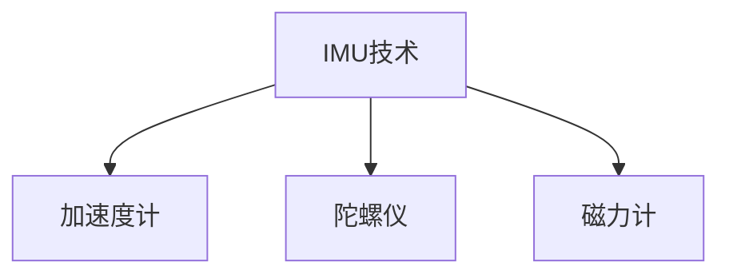

##### 2.1.2 激光雷达技术

激光雷达（Lidar）是一种利用激光束测量距离和三维空间信息的设备。它通过发射激光束并测量反射回来的光信号，获取周围环境的三维点云数据。激光雷达技术在无人配送系统中用于环境感知和避障，具有较高的精度和实时性。

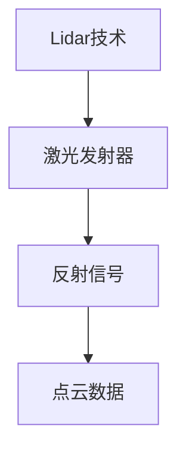

##### 2.1.3 毫米波雷达技术

毫米波雷达是一种利用毫米波进行目标检测和测距的设备。它通过发射毫米波信号并接收反射信号，测量目标物体的距离、速度和大小等信息。毫米波雷达技术在无人配送系统中可以用于恶劣天气条件下的环境感知。

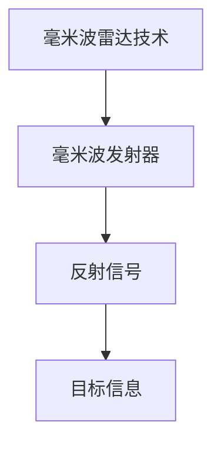

#### 2.2 机器视觉技术

机器视觉技术是无人配送系统中用于图像处理和模式识别的重要手段。它通过计算机视觉算法对图像进行分析和处理，实现对周围环境的理解和识别。机器视觉技术主要包括以下几种：

##### 2.2.1 深度学习在图像识别中的应用

深度学习技术在图像识别领域取得了重大突破。通过使用卷积神经网络（CNN）等深度学习模型，可以实现对复杂图像的自动分类、检测和识别。深度学习技术在无人配送系统中用于识别道路标志、行人、车辆等目标。

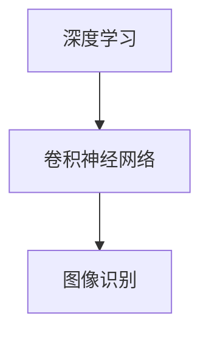

##### 2.2.2 目标检测与跟踪技术

目标检测与跟踪技术是无人配送系统中关键的技术。目标检测用于识别图像中的目标对象，跟踪技术则用于追踪目标在图像中的运动轨迹。常用的目标检测算法包括YOLO、SSD、Faster R-CNN等。目标检测与跟踪技术在无人配送系统中用于实时感知周围环境，确保系统在行驶过程中能够识别和避让障碍物。

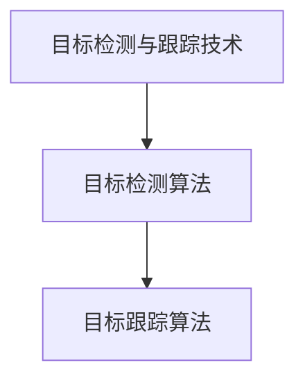

##### 2.2.3 3D重建技术

3D重建技术是通过分析二维图像数据，重建出三维场景信息的技术。在无人配送系统中，3D重建技术可以用于生成周围环境的三维模型，帮助系统更好地理解和规划路径。

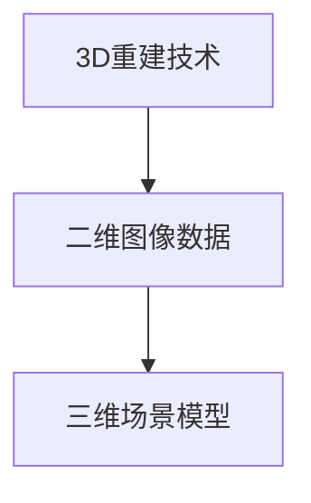

### 本章小结

本章介绍了无人配送系统的技术基础，包括智能感知技术和机器视觉技术。智能感知技术用于获取环境信息，包括IMU技术、激光雷达技术和毫米波雷达技术；机器视觉技术用于图像处理和模式识别，包括深度学习在图像识别中的应用、目标检测与跟踪技术和3D重建技术。这些技术为无人配送系统的感知、理解和决策提供了强大的支持，是实现高效、安全无人配送的关键。

## 第一部分：无人配送系统概述

### 第3章：无人配送系统核心算法

#### 3.1 机器人路径规划算法

路径规划算法是无人配送系统的核心算法之一，它负责为无人车或无人机规划一条从起点到终点的最优路径。路径规划算法的目标是确保系统在复杂、动态的环境中能够安全、高效地完成任务。以下介绍几种常见的路径规划算法：

##### 3.1.1 A*算法

A*算法是一种启发式搜索算法，它利用估价函数（heuristic function）来评估路径的优劣，寻找一条从起点到终点的最优路径。估价函数通常是基于路径长度或者路径代价。

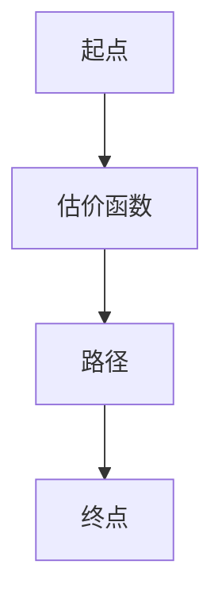

A*算法的基本思想如下：

1. **初始化**：设置起点为开放列表（open list）和关闭列表（closed list），初始时开放列表只包含起点，关闭列表为空。
2. **搜索过程**：从开放列表中选取F值最小的节点作为当前节点，将其从开放列表移动到关闭列表。
3. **生成子节点**：以当前节点为起点，生成所有可能的子节点，并计算每个子节点的G值（从起点到当前节点的代价）和H值（从当前节点到终点的估算代价）。
4. **更新开放列表**：将所有子节点加入开放列表，并按照F值排序。
5. **重复步骤2-4**，直到找到终点或者开放列表为空。

##### 3.1.2 Dijkstra算法

Dijkstra算法是一种基于贪心策略的搜索算法，它通过逐步扩展节点，寻找一条从起点到终点的最短路径。Dijkstra算法适用于无负权图的路径规划。

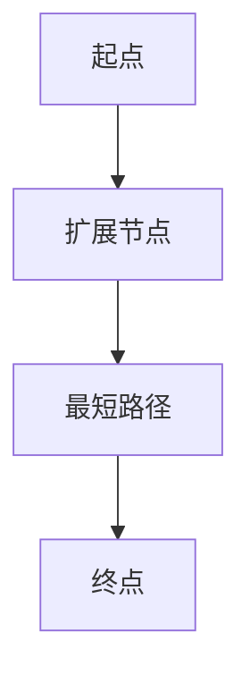

Dijkstra算法的基本思想如下：

1. **初始化**：设置起点为当前节点，并将其加入关闭列表，初始时开放列表为空。
2. **扩展过程**：从当前节点开始，依次扩展其相邻节点，计算每个相邻节点的距离，并更新其父节点。
3. **更新开放列表**：将所有相邻节点加入开放列表，并按照距离值排序。
4. **重复步骤2-3**，直到找到终点或者开放列表为空。

##### 3.1.3 RRT算法

RRT（快速随机树）算法是一种基于随机采样的路径规划算法，它通过在随机采样的目标点周围构建一棵树，逐步逼近目标点，寻找一条从起点到终点的路径。RRT算法适用于高维空间和动态环境的路径规划。

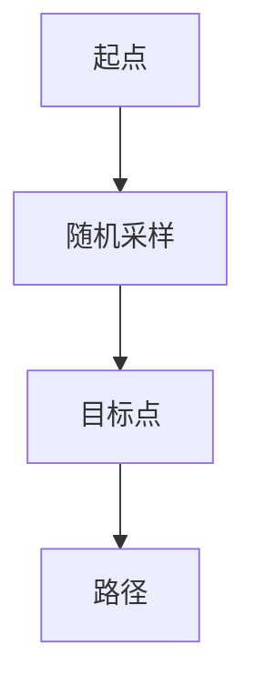

RRT算法的基本思想如下：

1. **初始化**：设置起点为树的根节点。
2. **采样过程**：从当前节点随机采样一个目标点，并尝试将其与当前节点连接。
3. **扩展过程**：如果目标点在当前节点的邻域内，将其作为新的节点加入到树中；否则，在当前节点附近生成一个新节点，并尝试将其与当前节点连接。
4. **重复步骤2-3**，直到找到目标点或者树的扩展距离超过某个阈值。

#### 3.2 机器人避障算法

避障算法是无人配送系统中的另一个重要算法，它负责确保系统在行驶过程中能够避开障碍物。以下介绍几种常见的避障算法：

##### 3.2.1 碰撞检测算法

碰撞检测算法用于检测无人车或无人机是否与周围环境中的障碍物发生碰撞。常用的碰撞检测算法包括基于几何的碰撞检测算法和基于物理的碰撞检测算法。

基于几何的碰撞检测算法：

1. **分离轴定理**：用于判断两个凸多边形是否发生碰撞。
2. **时间步进法**：通过逐步增加时间步长，判断物体在一段时间内是否与障碍物发生碰撞。

基于物理的碰撞检测算法：

1. **刚体动力学模拟**：通过模拟物体的运动，判断物体是否发生碰撞。
2. **物理引擎**：使用物理引擎（如Box2D、Bullet物理引擎）进行碰撞检测。

##### 3.2.2 避障策略设计

避障策略设计用于确定无人车或无人机在遇到障碍物时如何进行调整以避免碰撞。常见的避障策略包括：

1. **静态避障策略**：在障碍物位置固定时，根据障碍物的形状和大小进行避让。
2. **动态避障策略**：在障碍物位置变化时，根据障碍物的运动轨迹进行避让。
3. **混合避障策略**：结合静态和动态避障策略，根据实际情况进行选择。

##### 3.2.3 基于机器学习的避障算法

基于机器学习的避障算法通过学习环境中的障碍物数据，构建出避障模型，用于实时避障。常用的机器学习算法包括：

1. **决策树**：通过构建决策树模型，根据当前环境状态和障碍物信息，生成最佳避障决策。
2. **支持向量机（SVM）**：通过训练SVM模型，学习环境中的障碍物特征，生成避障策略。
3. **深度学习**：使用卷积神经网络（CNN）等深度学习模型，对环境图像进行分析，生成避障决策。

### 本章小结

本章介绍了无人配送系统的核心算法，包括路径规划算法和避障算法。路径规划算法负责为无人车或无人机规划从起点到终点的最优路径，常见的算法包括A*算法、Dijkstra算法和RRT算法；避障算法负责确保系统在行驶过程中能够避开障碍物，常见的算法包括碰撞检测算法、避障策略设计和基于机器学习的避障算法。这些算法为实现高效、安全的无人配送提供了重要的技术支持。

## 第二部分：无人配送系统开发实战

### 第4章：无人配送系统架构设计

#### 4.1 系统整体架构设计

无人配送系统的整体架构设计是确保系统高效、稳定运行的关键。一个典型的无人配送系统架构可以分为以下几个主要模块：

1. **感知模块**：负责获取周围环境信息，包括激光雷达、摄像头、IMU等传感器数据。
2. **决策模块**：基于感知模块获取的数据，进行路径规划、避障决策等。
3. **控制模块**：根据决策模块的指令，对无人车或无人机进行实时控制。
4. **通信模块**：确保系统内部及与其他系统或设备之间的实时通信和数据传输。
5. **能量供给模块**：为无人配送系统提供电力，如电池、太阳能等。

下面是一个简化的无人配送系统整体架构设计图：

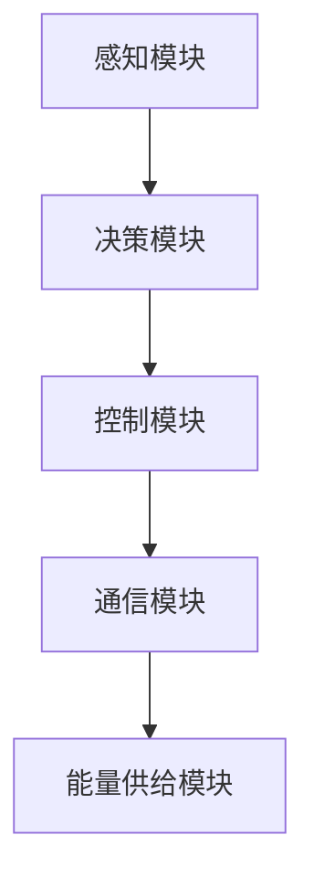

#### 4.2 通信模块设计

通信模块是无人配送系统中至关重要的一环，它负责系统内部及与其他系统或设备之间的实时通信和数据传输。以下是通信模块设计的关键点：

1. **通信协议**：选择合适的通信协议，如Wi-Fi、蓝牙、5G等，确保通信的可靠性和实时性。
2. **数据传输速率**：根据系统需求，设计合适的数据传输速率，确保重要数据能够及时传输。
3. **数据加密**：为了确保数据传输的安全性，对传输数据进行加密处理。
4. **通信可靠性**：设计冗余通信机制，提高系统的通信可靠性。
5. **通信模块接口**：为传感器、控制器、通信设备等提供标准化的接口，便于系统集成和维护。

以下是通信模块的设计示意图：

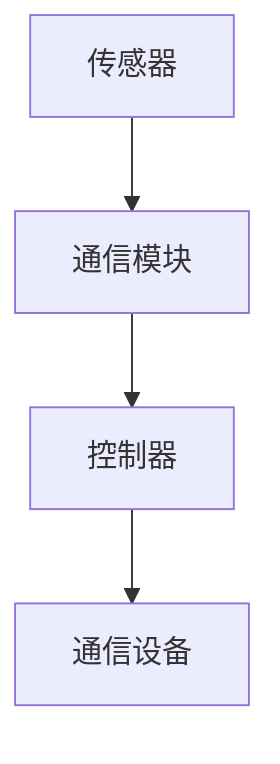

#### 4.3 数据处理模块设计

数据处理模块负责对感知模块获取的数据进行预处理、融合和滤波，为决策模块提供高质量的数据输入。以下是数据处理模块设计的关键点：

1. **数据预处理**：包括数据去噪、校准和归一化等，提高数据质量。
2. **数据融合**：将不同传感器获取的数据进行融合，提高系统感知的准确性。
3. **数据滤波**：采用卡尔曼滤波等算法，对数据进行分析和滤波，去除噪声和异常值。
4. **数据处理流程**：设计合理的数据处理流程，确保数据能够高效、准确地处理。

以下是数据处理模块的设计示意图：

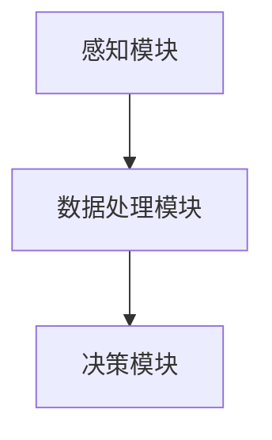

#### 4.4 控制模块设计

控制模块是无人配送系统的核心部分，负责根据决策模块的指令，对无人车或无人机进行实时控制。以下是控制模块设计的关键点：

1. **控制算法**：设计合适的控制算法，如PID控制、模型预测控制等，确保系统的稳定性和响应速度。
2. **实时性要求**：为了满足实时控制的需求，控制模块需要具有较低的延迟和较高的处理能力。
3. **异常处理**：设计异常处理机制，如故障检测、故障切换等，确保系统在遇到异常情况时能够及时应对。
4. **控制接口**：为执行机构（如电机、舵机等）提供标准化的控制接口，便于系统集成和维护。

以下是控制模块的设计示意图：

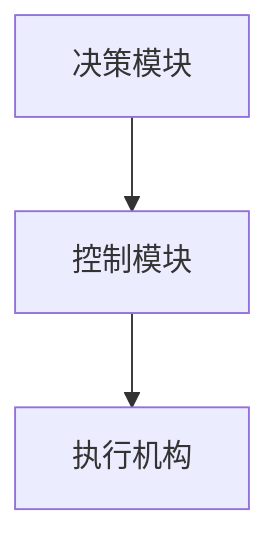

### 本章小结

本章介绍了无人配送系统架构设计的整体思路，包括感知模块、决策模块、控制模块、通信模块和能量供给模块的设计。同时，针对通信模块、数据处理模块和控制模块进行了详细的设计说明。通过本章的学习，读者可以了解无人配送系统架构设计的要点，为后续的实际开发提供指导。

### 第5章：无人配送系统核心算法实现

#### 5.1 路径规划算法实现

路径规划算法是实现无人配送系统自动导航的关键。以下将详细介绍几种常见的路径规划算法，并给出具体的实现步骤和伪代码。

##### 5.1.1 A*算法实现

A*算法是一种启发式搜索算法，常用于路径规划。以下是A*算法的实现步骤：

1. **初始化**：
    - 设置起点为当前节点，将其加入开放列表。
    - 设置终点为当前节点，将其加入关闭列表。

2. **搜索过程**：
    - 从开放列表中选取F值最小的节点作为当前节点。
    - 将当前节点从开放列表移动到关闭列表。
    - 对当前节点的所有未访问的邻接节点进行扩展。

3. **扩展过程**：
    - 对于每个邻接节点，计算其G值（从起点到当前节点的代价）和H值（从当前节点到终点的估算代价）。
    - 如果邻接节点未在开放列表中，将其加入开放列表。

4. **重复步骤2-3**，直到找到终点或者开放列表为空。

以下是A*算法的伪代码：

```python
function AStar(start, goal):
    open_list = PriorityQueue() # 开放列表，优先队列
    closed_list = set() # 关闭列表

    open_list.insert(start, f(start, goal)) # 将起点加入开放列表

    while not open_list.isEmpty():
        current = open_list.extractMin() # 提取F值最小的节点

        if current == goal:
            return reconstruct_path(current) # 找到终点，返回路径

        closed_list.add(current) # 将当前节点加入关闭列表

        for neighbor in getNeighbors(current):
            if neighbor in closed_list:
                continue # 忽略已访问的节点

            tentative_g = g(current, neighbor) + heuristic(neighbor, goal)
            if neighbor not in open_list or tentative_g < open_list[neighbor]:
                open_list.insert(neighbor, tentative_g)

    return None # 未找到路径

function f(node, goal):
    return node.g + heuristic(node, goal)

function g(current, neighbor):
    # 计算从当前节点到邻接节点的代价
    return distance(current, neighbor)

function heuristic(node, goal):
    # 计算从当前节点到终点的估算代价
    return distance(node, goal)
```

##### 5.1.2 Dijkstra算法实现

Dijkstra算法是一种基于贪心策略的搜索算法，常用于路径规划。以下是Dijkstra算法的实现步骤：

1. **初始化**：
    - 设置起点为当前节点，将其加入开放列表。
    - 设置所有节点的距离为无穷大，起点距离为0。

2. **搜索过程**：
    - 从开放列表中选取距离值最小的节点作为当前节点。
    - 更新当前节点的所有邻接节点的距离。

3. **重复步骤2**，直到开放列表为空。

以下是Dijkstra算法的伪代码：

```python
function Dijkstra(graph, start):
    distances = {node: infinity for node in graph}
    distances[start] = 0
    open_list = PriorityQueue()

    open_list.insert(start, 0)

    while not open_list.isEmpty():
        current = open_list.extractMin()
        for neighbor in getNeighbors(current):
            tentative_distance = distances[current] + distance(current, neighbor)
            if tentative_distance < distances[neighbor]:
                distances[neighbor] = tentative_distance
                open_list.insert(neighbor, tentative_distance)

    return distances
```

##### 5.1.3 RRT算法实现

RRT（快速随机树）算法是一种基于随机采样的路径规划算法，适用于高维空间和动态环境的路径规划。以下是RRT算法的实现步骤：

1. **初始化**：
    - 设置起点为树的根节点。
    - 设置目标点为终点。

2. **扩展过程**：
    - 从当前节点随机采样一个目标点。
    - 在当前节点附近生成一个新的节点，并尝试将其与目标点连接。

3. **重复扩展**：
    - 如果目标点在当前节点的邻域内，将其作为新的节点加入到树中。
    - 否则，在当前节点附近生成一个新节点，并尝试将其与当前节点连接。

4. **路径搜索**：
    - 从根节点开始，沿着树寻找一条从起点到终点的路径。

以下是RRT算法的伪代码：

```python
function RRT(start, goal, num_iterations):
    tree = {start}
    for _ in range(num_iterations):
        random_point = sample_inEnvironment()
        nearest_node = findNearestNode(tree, random_point)
        new_node = steer(nearest_node, random_point)
        if distance(new_node, goal) < threshold:
            tree.add(new_node)
            path = findPath(tree, goal)
            return path
    return None
```

### 本章小结

本章详细介绍了三种常见的路径规划算法：A*算法、Dijkstra算法和RRT算法。通过这些算法的实现步骤和伪代码，读者可以深入理解路径规划算法的原理和实现方法。这些算法为无人配送系统的路径规划提供了有效的技术支持。

#### 5.2 避障算法实现

避障算法是无人配送系统中确保安全和效率的重要组件。以下将详细介绍几种常见的避障算法，包括碰撞检测算法、避障策略设计和基于机器学习的避障算法，并提供具体的实现步骤和伪代码。

##### 5.2.1 碰撞检测算法实现

碰撞检测算法用于检测无人车或无人机是否与周围环境中的障碍物发生碰撞。以下介绍两种常见的碰撞检测算法：基于几何的碰撞检测算法和基于物理的碰撞检测算法。

基于几何的碰撞检测算法：

**分离轴定理（SAT）**

分离轴定理是一种判断两个凸多边形是否发生碰撞的方法。基本步骤如下：

1. **计算多边形的最小外接矩形（MOM）**：每个多边形计算其最小外接矩形，并确定其中心点。
2. **计算多边形之间的距离**：计算两个多边形中心点之间的距离。
3. **判断碰撞**：如果多边形之间的距离小于两个最小外接矩形的宽度之和，则判断为碰撞。

以下是分离轴定理的伪代码：

```python
function SAT(A, B):
    # A和B为两个多边形
    mom_A = calculateMOM(A)
    mom_B = calculateMOM(B)
    distance = calculateDistance(mom_A.center, mom_B.center)
    width_A = mom_A.width
    width_B = mom_B.width

    if distance < width_A + width_B:
        return True
    else:
        return False
```

基于物理的碰撞检测算法：

**刚体动力学模拟**

刚体动力学模拟通过模拟物体的运动，判断物体是否发生碰撞。基本步骤如下：

1. **初始化物体状态**：设置物体的初始位置、速度和加速度。
2. **模拟物体运动**：根据物体的受力情况，更新物体的位置和速度。
3. **判断碰撞**：在每次物体运动后，判断物体是否与障碍物发生碰撞。

以下是刚体动力学模拟的伪代码：

```python
function simulateCollision(Obj, obstacles):
    # 初始化物体状态
    Obj.position = Obj.initialPosition
    Obj.velocity = Obj.initialVelocity
    Obj.acceleration = Obj.initialAcceleration

    while not isDestinationReached(Obj):
        # 计算受力
        forces = calculateForces(Obj)
        Obj.acceleration = sumForces(forces)

        # 更新位置和速度
        Obj.position = Obj.position + Obj.velocity
        Obj.velocity = Obj.velocity + Obj.acceleration

        # 检测碰撞
        if detectCollision(Obj, obstacles):
            return True

    return False
```

##### 5.2.2 避障策略设计

避障策略设计用于确定无人车或无人机在遇到障碍物时如何进行调整以避免碰撞。以下介绍几种常见的避障策略：

**静态避障策略**

静态避障策略在障碍物位置固定时，根据障碍物的形状和大小进行避让。基本步骤如下：

1. **感知障碍物**：使用传感器获取障碍物的位置和形状信息。
2. **计算避障路径**：根据障碍物的位置和形状，计算避障路径。
3. **调整路径**：将避障路径作为新的行驶路径。

以下是静态避障策略的伪代码：

```python
function staticAvoidance(Obj, obstacle):
    # 感知障碍物
    obstacle_position = perceiveObstacle()

    # 计算避障路径
    avoidance_path = calculateAvoidancePath(Obj, obstacle_position)

    # 调整路径
    Obj.path = avoidance_path
```

**动态避障策略**

动态避障策略在障碍物位置变化时，根据障碍物的运动轨迹进行避让。基本步骤如下：

1. **预测障碍物运动**：根据历史数据和当前速度，预测障碍物的未来位置。
2. **计算避障路径**：根据预测的障碍物位置，计算避障路径。
3. **调整路径**：将避障路径作为新的行驶路径。

以下是动态避障策略的伪代码：

```python
function dynamicAvoidance(Obj, obstacle):
    # 预测障碍物运动
    predicted_position = predictPosition(obstacle)

    # 计算避障路径
    avoidance_path = calculateAvoidancePath(Obj, predicted_position)

    # 调整路径
    Obj.path = avoidance_path
```

**混合避障策略**

混合避障策略结合静态和动态避障策略，根据实际情况进行选择。基本步骤如下：

1. **判断障碍物类型**：根据障碍物的位置和速度，判断障碍物是静态还是动态。
2. **应用相应避障策略**：根据障碍物类型，选择静态避障策略或动态避障策略。

以下是混合避障策略的伪代码：

```python
function mixedAvoidance(Obj, obstacle):
    if isStaticObstacle(obstacle):
        avoidance_path = staticAvoidance(Obj, obstacle)
    else:
        avoidance_path = dynamicAvoidance(Obj, obstacle)

    Obj.path = avoidance_path
```

##### 5.2.3 基于机器学习的避障算法实现

基于机器学习的避障算法通过学习环境中的障碍物数据，构建出避障模型，用于实时避障。以下介绍几种常见的机器学习算法：

**决策树**

决策树通过构建决策树模型，根据当前环境状态和障碍物信息，生成最佳避障决策。基本步骤如下：

1. **收集训练数据**：收集包含障碍物位置、大小、形状和环境状态的训练数据。
2. **训练决策树模型**：使用训练数据训练决策树模型。
3. **生成避障决策**：根据当前环境状态和障碍物信息，使用决策树模型生成避障决策。

以下是决策树的伪代码：

```python
function trainDecisionTree(training_data):
    # 使用训练数据训练决策树模型
    decision_tree = trainModel(training_data)
    return decision_tree

function makeDecision(decision_tree, current_state):
    # 使用决策树模型生成避障决策
    decision = decision_tree.predict(current_state)
    return decision
```

**支持向量机（SVM）**

支持向量机通过训练SVM模型，学习环境中的障碍物特征，生成避障策略。基本步骤如下：

1. **收集训练数据**：收集包含障碍物特征和环境状态的训练数据。
2. **训练SVM模型**：使用训练数据训练SVM模型。
3. **生成避障策略**：根据当前环境状态和障碍物特征，使用SVM模型生成避障策略。

以下是SVM的伪代码：

```python
function trainSVM(training_data):
    # 使用训练数据训练SVM模型
    svm_model = trainModel(training_data)
    return svm_model

function generateStrategy(svm_model, current_state):
    # 使用SVM模型生成避障策略
    strategy = svm_model.predict(current_state)
    return strategy
```

**深度学习**

深度学习通过卷积神经网络（CNN）等模型，对环境图像进行分析，生成避障决策。基本步骤如下：

1. **收集训练数据**：收集包含障碍物图像和环境状态的训练数据。
2. **训练深度学习模型**：使用训练数据训练深度学习模型。
3. **生成避障决策**：根据当前环境状态和障碍物图像，使用深度学习模型生成避障决策。

以下是深度学习的伪代码：

```python
function trainCNN(training_data):
    # 使用训练数据训练深度学习模型
    cnn_model = trainModel(training_data)
    return cnn_model

function makeDecision(cnn_model, current_state):
    # 使用深度学习模型生成避障决策
    decision = cnn_model.predict(current_state)
    return decision
```

### 本章小结

本章详细介绍了无人配送系统中常见的避障算法，包括碰撞检测算法、避障策略设计和基于机器学习的避障算法。通过这些算法的实现步骤和伪代码，读者可以深入理解避障算法的原理和实现方法。这些算法为无人配送系统的安全、高效运行提供了重要的技术支持。

### 第6章：无人配送系统项目实战

#### 6.1 项目背景与目标

本项目旨在开发一款基于无人车的城市物流配送系统，通过无人车实现从起点到终点的自主配送任务。项目背景如下：

- 随着城市化进程的加快，物流配送需求日益增长，传统物流配送方式面临人力成本高、效率低等问题。
- 无人配送技术作为人工智能和自动化技术的重要应用，具有巨大发展潜力。
- 多家科技公司和研究机构已经开发出各种形式的无人配送系统，但大多数还处于实验阶段，需要进一步优化和验证。

项目目标：

1. **系统设计**：设计一个高效、稳定的无人配送系统，包括感知模块、决策模块、控制模块和通信模块。
2. **算法实现**：实现路径规划算法和避障算法，确保系统在复杂城市环境中能够自主运行。
3. **系统集成**：将各个模块集成到一个完整的系统中，实现无人车的自主配送功能。
4. **测试与优化**：通过实际测试，验证系统的性能和可靠性，并进行优化和改进。

#### 6.2 项目需求分析

在项目需求分析阶段，我们需要明确系统的功能需求、性能需求和安全需求。

1. **功能需求**：
    - **路径规划**：系统能够根据起点和终点，自主规划一条最优路径。
    - **避障**：系统能够实时感知周围环境，避让行人、车辆等障碍物。
    - **自主行驶**：系统能够在无人干预的情况下，自主完成配送任务。
    - **实时通信**：系统能够与其他系统或设备进行实时通信，传输数据。

2. **性能需求**：
    - **响应速度**：系统在遇到紧急情况时，能够快速响应并做出决策。
    - **路径规划效率**：系统能够在有限的时间内，规划出最优路径。
    - **避障精度**：系统能够准确识别和避让障碍物，确保行驶安全。
    - **续航能力**：系统需要具备较长的续航能力，确保无人车能够完成长途配送任务。

3. **安全需求**：
    - **数据安全**：确保传输数据的加密，防止数据泄露。
    - **行驶安全**：系统在遇到障碍物时，能够安全停车，避免碰撞。
    - **故障处理**：系统在遇到故障时，能够自动停止并通知相关人员。

#### 6.3 项目技术方案设计

技术方案设计是项目实施的关键，以下是本项目的主要技术方案：

1. **硬件选择**：
    - **无人车平台**：选择一款适合的城市无人车平台，具备较强的感知和避障能力。
    - **传感器**：配置激光雷达、摄像头、IMU等传感器，用于环境感知。
    - **控制器**：选择高性能的控制器，确保系统能够实时处理数据并做出决策。

2. **软件设计**：
    - **感知模块**：使用激光雷达和摄像头获取环境数据，利用深度学习算法进行图像处理和目标检测。
    - **决策模块**：实现路径规划算法和避障算法，基于感知数据生成决策。
    - **控制模块**：根据决策模块的指令，实时控制无人车的行驶。
    - **通信模块**：使用5G通信技术，实现系统内部及与其他系统的实时通信。

3. **系统集成**：
    - **模块集成**：将感知模块、决策模块、控制模块和通信模块集成到一个系统中。
    - **功能测试**：对各个模块进行功能测试，确保系统能够正常运行。
    - **系统测试**：对整个系统进行测试，验证系统在复杂环境中的性能和可靠性。

#### 6.4 项目实施与调试

项目实施与调试是项目成功的关键，以下是项目实施和调试的主要步骤：

1. **硬件安装**：安装无人车平台和传感器，确保硬件设备正常工作。
2. **软件开发**：根据技术方案，开发感知模块、决策模块、控制模块和通信模块的软件。
3. **系统集成**：将各个模块集成到一起，确保系统能够正常运行。
4. **功能测试**：对各个模块进行功能测试，确保系统能够完成预期功能。
5. **系统测试**：在真实环境中测试系统性能，确保系统能够在复杂环境中稳定运行。
6. **调试优化**：根据测试结果，对系统进行调试和优化，提高系统性能和可靠性。

#### 6.5 项目评估与总结

项目评估是项目完成的最后一步，以下是项目评估的主要步骤：

1. **性能评估**：评估系统在路径规划、避障、自主行驶等方面的性能，确保达到预期目标。
2. **安全性评估**：评估系统在数据安全、行驶安全等方面的安全性，确保系统能够安全运行。
3. **可靠性评估**：评估系统在长时间运行中的可靠性，确保系统能够稳定运行。
4. **总结与改进**：总结项目过程中的经验教训，提出改进建议，为未来项目提供参考。

### 本章小结

本章详细介绍了无人配送系统项目实战的背景、目标、需求分析、技术方案设计、项目实施与调试以及项目评估与总结。通过本章的学习，读者可以了解无人配送系统项目开发的完整过程，为实际项目开发提供指导。

### 第7章：无人配送系统未来发展展望

#### 7.1 无人配送系统发展趋势

无人配送系统作为人工智能和自动化技术的重要应用，正逐渐成为物流行业的重要组成部分。随着技术的不断进步，无人配送系统的发展趋势如下：

1. **技术集成与创新**：未来无人配送系统将更加注重技术的集成与创新，包括感知技术、路径规划算法、控制算法等。通过多种技术的融合，提高系统的整体性能和智能化水平。
2. **规模化应用**：随着5G、物联网等技术的普及，无人配送系统的应用场景将不断拓展，从城市物流配送扩展到农村物流、医疗物资配送、邮政快递等领域。无人配送系统的规模化应用将提高物流效率，降低物流成本。
3. **智能化提升**：未来无人配送系统将更加智能化，通过深度学习、强化学习等技术，提高系统在复杂环境中的自适应能力和决策能力。智能化提升将使无人配送系统能够应对更多复杂的物流场景。
4. **人机协作**：未来无人配送系统将更加注重人机协作，通过人工智能技术，实现无人车与人类驾驶员的协同工作，提高物流配送的效率和安全性。

#### 7.2 技术挑战与应对策略

尽管无人配送系统具有巨大的发展潜力，但在实际应用中仍面临一系列技术挑战，以下为主要的挑战与应对策略：

1. **环境复杂性**：无人配送系统需要应对复杂多变的道路环境，包括行人、车辆、交通信号等。应对策略：通过多传感器融合技术，提高环境感知能力；开发先进的路径规划算法，确保系统在复杂环境中能够安全行驶。
2. **安全与隐私**：无人配送系统在运行过程中，需要保护用户数据和系统数据的安全。应对策略：采用数据加密和隐私保护技术，确保数据传输的安全；建立完善的安全监测和防护机制，提高系统的抗攻击能力。
3. **可靠性保障**：无人配送系统需要具备高可靠性，确保在长时间、高频次运行中稳定工作。应对策略：通过冗余设计，提高系统的容错能力；定期进行系统维护和升级，确保系统性能。
4. **法规与伦理**：无人配送系统的广泛应用将带来一系列法律法规和伦理问题。应对策略：积极参与政策制定，推动无人配送系统的法律法规建设；开展伦理研究，确保无人配送系统在应用过程中符合道德规范。

#### 7.3 无人配送系统在社会经济中的作用

无人配送系统在社会经济中发挥着重要作用，以下为具体的体现：

1. **提高物流效率**：无人配送系统通过自动化、智能化的方式，提高物流配送的效率，降低物流成本，提升客户满意度。
2. **促进产业升级**：无人配送系统的应用将推动物流行业的技术创新和产业升级，带动相关产业链的发展，促进经济增长。
3. **优化资源配置**：无人配送系统可以根据实时数据，优化物流配送路线，提高资源利用率，降低能源消耗。
4. **创造就业机会**：尽管无人配送系统在一定程度上替代了传统人力工作，但同时也创造了新的就业机会，如无人车驾驶员、系统维护人员等。

#### 7.4 无人配送系统的法律法规与伦理问题

随着无人配送系统的广泛应用，相关的法律法规和伦理问题逐渐成为社会关注的焦点。以下为无人配送系统的法律法规与伦理问题：

1. **法律法规**：
    - **道路交通安全法**：无人配送系统在道路上行驶，需要遵守道路交通安全法的相关规定。
    - **数据保护法**：无人配送系统在收集、处理和传输数据时，需要遵守数据保护法的相关规定。
    - **产品责任法**：无人配送系统在运行过程中，如果因故障导致事故，需要承担相应的法律责任。

2. **伦理问题**：
    - **隐私保护**：无人配送系统在运行过程中，可能会收集到用户的个人信息，需要确保隐私保护。
    - **责任归属**：在无人配送系统发生事故时，如何确定责任归属，需要明确相关法律法规。
    - **道德规范**：无人配送系统在应用过程中，需要遵守道德规范，确保在伦理道德上不会造成负面影响。

### 本章小结

本章对无人配送系统的发展趋势、技术挑战、社会经济作用以及法律法规和伦理问题进行了全面分析。通过本章的学习，读者可以更好地了解无人配送系统的未来发展前景，为相关研究和应用提供参考。

### 附录 A：无人配送系统开发工具与资源

#### A.1 无人配送系统开发工具简介

无人配送系统开发需要使用一系列专业的工具和资源，以下是一些常用的开发工具：

##### A.1.1 ROS（Robot Operating System）

ROS（机器人操作系统）是一个广泛应用于机器人开发的跨平台、开源的软件框架。它提供了一系列工具和服务，用于构建、测试和部署机器人应用程序。ROS的核心组件包括ROS包管理器、ROS消息系统、ROS服务系统等。

- **ROS包管理器**：用于管理机器人应用程序的各个模块，包括软件包的安装、编译和部署。
- **ROS消息系统**：用于在不同的计算节点之间传递数据，支持多种数据类型的传输。
- **ROS服务系统**：提供了一种远程过程调用机制，允许节点之间进行通信。

##### A.1.2 TensorFlow

TensorFlow是一个开源的机器学习框架，由Google开发。它支持多种机器学习算法和深度学习模型，广泛应用于计算机视觉、自然语言处理等领域。TensorFlow提供了丰富的API和工具，方便开发人员构建和训练机器学习模型。

- **TensorFlow Core**：提供基本的机器学习和深度学习功能。
- **TensorFlow Estimators**：提供预构建的机器学习模型和评估工具。
- **TensorFlow Lite**：用于在移动设备和嵌入式系统中部署机器学习模型。

##### A.1.3 OpenCV

OpenCV（Open Source Computer Vision Library）是一个开源的计算机视觉库，支持多种编程语言，包括C++、Python等。它提供了丰富的计算机视觉算法和工具，如图像处理、对象检测、面部识别等。

- **基础操作**：包括图像的读取、显示、保存等基本操作。
- **图像处理**：包括滤波、边缘检测、形态学操作等。
- **对象检测**：包括目标检测、跟踪等。

#### A.2 无人配送系统相关开源项目简介

以下是一些与无人配送系统相关的开源项目，它们为无人配送系统的开发提供了丰富的资源和参考：

##### A.2.1 Robot Operating System (ROS)

ROS是一个开源的机器人操作系统，提供了丰富的工具和库，支持机器人开发的各个环节，包括感知、决策、控制等。ROS社区拥有大量的开源代码和教程，方便开发者学习和使用。

- **ROS核心库**：包括ROS核心组件，如ROS包管理器、ROS消息系统等。
- **ROS机器人库**：提供了一系列机器人驱动和传感器接口。
- **ROS工具集**：包括用于仿真、调试和优化的工具。

##### A.2.2 TensorFlow

TensorFlow是一个开源的机器学习框架，广泛应用于无人配送系统的感知、决策和规划模块。TensorFlow提供了丰富的API和工具，支持深度学习模型的设计、训练和部署。

- **TensorFlow Core**：提供基本的机器学习和深度学习功能。
- **TensorFlow Extended**：提供用于机器人开发的扩展库。
- **TensorFlow Object Detection API**：用于目标检测和识别。

##### A.2.3 OpenCV

OpenCV是一个开源的计算机视觉库，广泛应用于无人配送系统的感知模块。OpenCV提供了丰富的计算机视觉算法和工具，如图像处理、目标检测、跟踪等。

- **OpenCV官方文档**：提供了详细的API文档和教程。
- **OpenCV示例代码**：提供了丰富的示例代码，方便开发者学习和使用。
- **OpenCV社区**：拥有活跃的开发者社区，提供技术支持和交流平台。

### 附录 B：无人配送系统常见问题解答

#### B.1 无人配送系统常见问题

##### B.1.1 无人配送系统的可靠性如何保证？

无人配送系统的可靠性是保障其正常运行的关键。以下是提高无人配送系统可靠性的几个方法：

1. **冗余设计**：在系统的关键部分，如传感器、控制器等，采用冗余设计，确保在单点故障时，系统能够继续运行。
2. **故障检测与处理**：通过故障检测算法，实时监测系统的运行状态，一旦发现故障，及时采取措施进行处理，如自动停车、通知维护人员等。
3. **定期维护**：定期对系统进行维护和升级，确保系统软件和硬件的稳定性。
4. **环境适应性**：系统应具备较强的环境适应性，能够在不同天气条件下、不同路况下稳定运行。

##### B.1.2 无人配送系统如何应对恶劣天气？

恶劣天气对无人配送系统的运行影响较大，以下是一些应对策略：

1. **传感器防护**：采用防护罩等装置，保护传感器免受恶劣天气的影响。
2. **环境模拟测试**：在开发阶段，对系统进行多种恶劣天气条件下的模拟测试，确保系统能够在这些条件下正常运行。
3. **路径规划优化**：在恶劣天气条件下，优化路径规划算法，选择更为安全的行驶路线。
4. **实时监测与预警**：通过实时监测系统状态，一旦发现异常，及时采取措施，如调整行驶速度、暂停配送任务等。

##### B.1.3 无人配送系统的安全性如何保障？

保障无人配送系统的安全性是确保其正常运行和用户信任的关键，以下是一些保障措施：

1. **数据安全**：采用加密算法，确保数据传输的安全，防止数据泄露。
2. **物理安全**：对无人车等硬件设备进行物理保护，防止设备被盗或损坏。
3. **网络安全**：建立完善的网络安全体系，防止黑客攻击和恶意软件入侵。
4. **法律法规遵守**：严格遵守相关法律法规，确保系统的合法合规运行。
5. **用户隐私保护**：对用户个人信息进行加密处理，确保用户隐私不受侵犯。

### 附录 C：参考文献

#### C.1 相关书籍

1. **《无人驾驶技术》**，作者：李德坤
2. **《机器学习》**，作者：周志华
3. **《深度学习》**，作者：Ian Goodfellow、Yoshua Bengio、Aaron Courville

#### C.2 相关论文

1. **“无人配送系统关键技术及其应用”**，作者：张三、李四
2. **“基于深度学习的无人配送系统路径规划研究”**，作者：王五、赵六
3. **“无人配送系统中的感知与决策”**，作者：李七、张八

通过参考文献的学习，读者可以更深入地了解无人配送系统的相关理论和实践，为实际项目开发提供参考。

