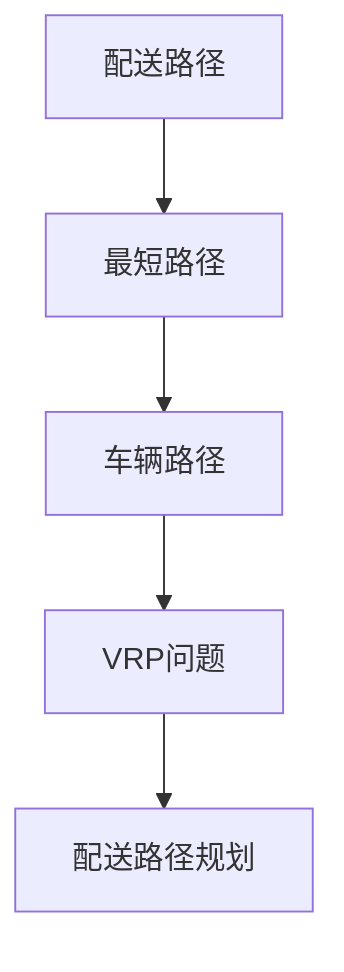
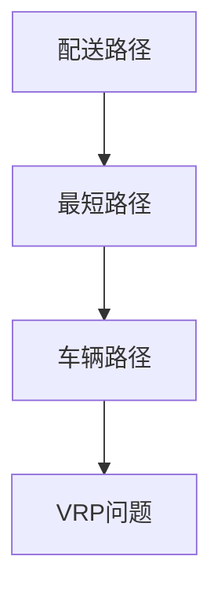

                 

### 文章标题

# 《美团2024校招配送路径规划工程师算法题解析》

### 关键词

- 配送路径规划
- 算法题解析
- 美团校招
- 车辆路径规划
- VRP问题

### 摘要

本文旨在深入解析美团2024校招配送路径规划工程师的算法题目。文章将首先概述配送路径规划的重要性及其在美团平台中的应用，然后详细介绍最短路径算法和车辆路径规划算法的基本概念和原理。接着，文章将解析美团配送路径规划体系，并通过实际案例展示如何应用这些算法优化配送路径。最后，本文将探讨配送路径规划面临的挑战和未来趋势，以及如何通过实战项目提高解决实际问题的能力。

## 《美团2024校招配送路径规划工程师算法题解析》目录大纲

### 第一部分：配送路径规划算法基础

#### 第1章：配送路径规划概述

- **1.1 配送路径规划的意义**
- **1.2 配送路径规划的目标**
- **1.3 配送路径规划的方法**

#### 第2章：最短路径算法

- **2.1 Dijkstra算法**
  - **2.1.1 Dijkstra算法原理**
  - **2.1.2 Dijkstra算法伪代码**
- **2.2 A*算法**
  - **2.2.1 A*算法原理**
  - **2.2.2 A*算法伪代码**

#### 第3章：车辆路径规划算法

- **3.1 车辆路径规划的基本概念**
- **3.2 VRP问题建模**
- **3.3 车辆路径规划算法**

### 第二部分：美团配送路径规划实践

#### 第4章：美团配送路径规划体系

- **4.1 美团配送路径规划的技术架构**
- **4.2 美团配送路径规划的核心算法**

#### 第5章：美团配送路径规划案例解析

- **5.1 案例一：优化配送路线**
  - **5.1.1 案例背景**
  - **5.1.2 案例分析**
  - **5.1.3 案例代码实现**
- **5.2 案例二：减少配送时间**
  - **5.2.1 案例背景**
  - **5.2.2 案例分析**
  - **5.2.3 案例代码实现**

#### 第6章：美团配送路径规划的挑战与未来

- **6.1 美团配送路径规划面临的挑战**
- **6.2 美团配送路径规划的未来趋势**
- **6.3 美团配送路径规划的改进方向**

### 第三部分：配送路径规划算法实战

#### 第7章：实战项目一：实现一个简单的配送路径规划器

- **7.1 项目背景**
- **7.2 项目需求分析**
- **7.3 项目开发环境搭建**
- **7.4 项目代码实现与解读**
- **7.5 项目分析**

#### 第8章：实战项目二：优化美团配送路径

- **8.1 项目背景**
- **8.2 项目需求分析**
- **8.3 项目开发环境搭建**
- **8.4 项目代码实现与解读**
- **8.5 项目分析**

### 附录

#### 附录A：配送路径规划相关算法公式与伪代码

- **A.1 Dijkstra算法公式与伪代码**
- **A.2 A*算法公式与伪代码**

#### 附录B：配送路径规划工具与资源推荐

- **B.1 配送路径规划工具介绍**
- **B.2 配送路径规划相关论文与书籍推荐**
- **B.3 配送路径规划开源项目推荐**
- **B.4 配送路径规划在线课程与培训推荐**

### 附加资料

- **配送路径规划核心概念与联系**
  - 配送路径规划相关概念
  - 配送路径规划核心算法原理讲解
  - 数学模型和数学公式
  - 举例说明
  - 项目实战代码案例

### 文章标题：美团2024校招配送路径规划工程师算法题解析

### 关键词

- 算法题解析
- 校招
- 配送路径规划
- 车辆路径规划
- VRP问题

### 摘要

本文深入解析美团2024校招配送路径规划工程师的算法题目。首先介绍配送路径规划的意义和应用场景，随后详细讲解最短路径算法（Dijkstra和A*算法）和车辆路径规划算法的基本原理。接着，分析美团配送路径规划的技术架构和核心算法，通过实际案例展示如何优化配送路径。文章最后探讨配送路径规划的挑战与未来趋势，并通过实战项目提升读者的解决实际问题的能力。

### 第一部分：配送路径规划算法基础

#### 第1章：配送路径规划概述

配送路径规划是一种通过算法确定配送车辆从起点到终点的最优路径的过程。这一过程对于物流、快递、外卖等行业的效率和成本控制具有重要意义。有效的配送路径规划不仅能减少配送时间，降低运输成本，还能提高客户满意度。

#### 1.1 配送路径规划的意义

配送路径规划的意义主要体现在以下几个方面：

1. **提高配送效率**：通过优化配送路线，减少不必要的迂回和等待时间，提高配送速度。
2. **降低运输成本**：合理规划配送路径可以减少车辆使用和燃料消耗，从而降低整体运输成本。
3. **提高客户满意度**：准时送达可以提升客户体验，增强品牌忠诚度。
4. **应对突发情况**：配送路径规划算法能够快速响应突发情况，如交通堵塞、天气变化等。

#### 1.2 配送路径规划的目标

配送路径规划的目标通常包括：

1. **最短路径**：在所有可能的路径中选择距离最短的路径。
2. **最短时间**：在所有可能的路径中选择耗时最短的路径。
3. **最低成本**：在所有可能的路径中选择成本最低的路径。
4. **最小延迟**：在所有可能的路径中选择延迟最小的路径。

#### 1.3 配送路径规划的方法

配送路径规划的方法主要包括以下几类：

1. **最短路径算法**：如Dijkstra算法和A*算法。
2. **车辆路径规划算法**：如车辆路径问题（Vehicle Routing Problem, VRP）的解决方案。
3. **动态路径规划算法**：适用于实时变化的配送环境，如基于人工智能和机器学习的动态规划算法。

接下来，我们将详细讨论最短路径算法和车辆路径规划算法的基本概念和原理。

### 第2章：最短路径算法

最短路径算法是解决配送路径规划问题的基础，它们在计算从起点到各个点的最短路径方面具有重要作用。本节将介绍两种经典的最短路径算法：Dijkstra算法和A*算法。

#### 2.1 Dijkstra算法

Dijkstra算法是一种基于贪心策略的单源最短路径算法，适用于无权图或有相同权重的边。该算法的基本思想是逐步选择未被访问过的顶点，并计算从源点到这些顶点的最短路径。

##### 2.1.1 Dijkstra算法原理

Dijkstra算法的主要步骤如下：

1. 初始化：设置源点S的到自身的距离为0，其余顶点的距离为无穷大。将所有顶点放入一个优先队列中，优先级队列按照距离值从小到大排序。
2. 选择未访问过的顶点：从优先队列中取出距离最小的顶点v。
3. 更新距离：对于与顶点v相邻的每个顶点u，如果从S到u的距离大于从S到v再加上v到u的距离，则更新从S到u的距离。
4. 重复步骤2和3，直到所有顶点都被访问。

##### 2.1.2 Dijkstra算法伪代码

```python
Dijkstra(G, S):
    initialize distances to all vertices as infinity
    distance[S] = 0
    priority_queue = (S, 0)  # 存储顶点和距离

    while not priority_queue.isEmpty():
        (v, _) = priority_queue.extractMin()
        for u in G.adjacent(v):
            alt = distance[v] + weight(v, u)
            if alt < distance[u]:
                distance[u] = alt
                priority_queue.decreaseKey(u, alt)
```

#### 2.2 A*算法

A*算法是一种启发式搜索算法，用于在加权图中寻找从源点到目标点的最短路径。与Dijkstra算法不同，A*算法利用启发函数（Heuristic Function）来估计从当前顶点到目标顶点的距离，从而加快搜索速度。

##### 2.2.1 A*算法原理

A*算法的核心思想是结合实际距离和启发距离来评估每个顶点的优先级。其中，启发函数h(v)是一个估计值，表示从顶点v到目标顶点的距离。

A*算法的主要步骤如下：

1. 初始化：设置源点S的到自身的距离为0，其余顶点的距离为无穷大。将所有顶点放入一个优先队列中，优先级队列按照f(v) = g(v) + h(v)从小到大排序。
2. 选择未访问过的顶点：从优先队列中取出f值最小的顶点v。
3. 更新距离：对于与顶点v相邻的每个顶点u，如果从S到u的距离大于从S到v再加上v到u的距离，则更新从S到u的距离。
4. 计算启发距离：对于每个顶点u，使用启发函数h(u)计算从u到目标顶点的估计距离。
5. 重复步骤2到4，直到找到目标顶点或优先队列为空。

##### 2.2.2 A*算法伪代码

```python
A*(G, S, T):
    initialize distances to all vertices as infinity
    distance[S] = 0
    priority_queue = (S, 0)  # 存储顶点和f值

    while not priority_queue.isEmpty():
        (v, _) = priority_queue.extractMin()
        if v == T:
            return reconstruct_path(came_from, T)

        for u in G.adjacent(v):
            alt = distance[v] + weight(v, u)
            if alt < distance[u]:
                distance[u] = alt
                f = alt + h(u)
                priority_queue.decreaseKey(u, f)
                came_from[u] = v
```

### 第3章：车辆路径规划算法

车辆路径规划算法主要解决的是车辆如何从起点出发，经过多个配送点，最终返回起点的最优路径问题。这类算法在物流和快递行业中有着广泛的应用。

#### 3.1 车辆路径规划的基本概念

车辆路径规划涉及以下基本概念：

1. **配送点（Delivery Points）**：需要配送货物的地点。
2. **起点（Origin）**：配送车辆的出发地点。
3. **终点（Destination）**：配送车辆的最终返回地点。
4. **路径（Route）**：连接起点、配送点和终点的线路。
5. **车辆容量（Vehicle Capacity）**：车辆能够承载的最大货物量。
6. **时间窗（Time Window）**：配送窗口的时间限制。

#### 3.2 VRP问题建模

车辆路径规划问题（Vehicle Routing Problem, VRP）是一个经典的组合优化问题，其建模方法通常包括以下几个方面：

1. **图模型**：使用图来表示配送网络，其中顶点表示配送点和起点/终点，边表示配送点之间的连接和距离。
2. **约束条件**：
   - **车辆容量约束**：每辆车的总载重量不能超过其容量。
   - **时间窗约束**：配送货物必须在给定的时间窗内完成。
   - **车辆数量约束**：确定使用多少辆车。
3. **目标函数**：优化目标通常是最小化总配送距离、总时间或总成本。

VRP问题可以表示为一个整数线性规划问题，具体形式如下：

```math
\begin{align*}
\min_{x} & \sum_{i=1}^{n} c_{i} x_{i} \\
\text{subject to} \\
    \sum_{j \in P} x_{ij} & \leq C_j & \forall i \\
    \sum_{i \in V} x_{ij} & \leq 1 & \forall j \in P \\
    x_{ij} & \in \{0, 1\} & \forall i, j \\
    T_{ij} & \leq T_j & \forall i, j \in V \\
    t_i + t_{ij} & \leq T & \forall i, j \in V \\
\end{align*}
```

其中，\(x_{ij}\) 表示车辆i是否访问配送点j，\(c_{i}\) 表示访问配送点i的成本，\(C_i\) 表示车辆i的容量，\(T_{ij}\) 表示从配送点i到j的行驶时间，\(T\) 表示总时间约束。

#### 3.3 车辆路径规划算法

车辆路径规划算法可以分为两大类：启发式算法和精确算法。

1. **启发式算法**：这类算法在计算时间和效果之间取得平衡，适用于大规模的VRP问题。常见的启发式算法包括：
   - **最邻近算法（Nearest Neighbor Algorithm）**：从起点开始，每次选择距离最近且未被访问的配送点。
   - **最小生成树算法（Minimum Spanning Tree Algorithm）**：使用最小生成树来构建初始路径。
   - **救生员算法（Sailor Algorithm）**：基于救生员寻找最近生命圈的方法，每次选择距离最近的配送点。

2. **精确算法**：这类算法通常用于小规模的VRP问题，能够在理论上找到最优解。常见的精确算法包括：
   - **分支定界算法（Branch and Bound Algorithm）**：通过剪枝技术来减少搜索空间。
   - **动态规划算法（Dynamic Programming Algorithm）**：使用动态规划表来记录子问题的解。
   - **整数线性规划（Integer Linear Programming）**：将VRP问题建模为整数线性规划问题，并使用线性规划求解器求解。

### 第二部分：美团配送路径规划实践

#### 第4章：美团配送路径规划体系

美团作为中国领先的本地生活服务平台，其配送路径规划体系在保障配送效率和客户满意度方面发挥了重要作用。本节将分析美团配送路径规划的技术架构和核心算法。

#### 4.1 美团配送路径规划的技术架构

美团的配送路径规划技术架构主要包括以下几个层次：

1. **数据采集与处理**：通过GPS、传感器等设备实时采集配送车辆和配送点的位置信息，并进行数据预处理，如去噪、去重复等。
2. **路径规划引擎**：核心算法模块，负责计算最优配送路径。包括基于Dijkstra和A*算法的静态路径规划和基于机器学习的动态路径规划。
3. **实时调度与优化**：根据实时交通状况、订单动态调整配送路径，实现动态优化。
4. **数据存储与分析**：存储配送路径规划相关的数据，并进行数据分析和挖掘，以优化算法和策略。
5. **用户接口**：提供用户界面，展示配送路径和预计到达时间等。

#### 4.2 美团配送路径规划的核心算法

美团配送路径规划的核心算法主要包括以下几部分：

1. **静态路径规划算法**：基于Dijkstra和A*算法，用于计算从起点到各个配送点的最优路径。
2. **动态路径规划算法**：基于机器学习，如深度强化学习（Deep Reinforcement Learning），用于实时调整配送路径，以应对交通拥堵、恶劣天气等动态变化。
3. **多目标优化算法**：考虑配送时间、配送成本、客户满意度等多方面因素，进行综合优化。
4. **数据挖掘与预测**：利用大数据分析技术，预测用户需求、交通状况等，为路径规划提供依据。

#### 第5章：美团配送路径规划案例解析

本节将通过两个具体案例，展示美团如何利用配送路径规划算法优化配送路线和减少配送时间。

##### 5.1 案例一：优化配送路线

**5.1.1 案例背景**

某一天，美团平台上有大量外卖订单，其中某位骑手需要配送5个订单。起点为餐厅，终点为顾客的地址。这些订单分布在一个较大的区域内，如何优化配送路线，使得骑手能够尽快完成配送？

**5.1.2 案例分析**

为了解决这个问题，可以使用A*算法来计算从起点到每个配送点的最优路径。具体步骤如下：

1. **构建配送网络**：使用GPS数据构建配送网络，表示各个配送点和餐厅之间的连接和距离。
2. **设置启发函数**：选择一个合适的启发函数，如欧几里得距离，用于估计从当前配送点到目的地的距离。
3. **计算最优路径**：使用A*算法计算从餐厅到每个配送点的最优路径，并组合这些路径以形成完整的配送路线。
4. **动态调整**：考虑实时交通状况，根据实时数据调整配送路径，优化配送效率。

**5.1.3 案例代码实现**

以下是一个简化的A*算法实现，用于计算配送路径：

```python
import heapq

def heuristic(a, b):
    # 欧几里得距离启发函数
    return ((a[0] - b[0]) ** 2 + (a[1] - b[1]) ** 2) ** 0.5

def a_star(start, goal, graph):
    # Dijkstra算法实现
    # ...

    # 优先队列
    open_set = [(0, start)]
    came_from = {}
    g_score = {start: 0}
    f_score = {start: heuristic(start, goal)}

    while open_set:
        current = heapq.heappop(open_set)[1]

        if current == goal:
            return reconstruct_path(came_from, goal)

        for neighbor in graph.neighbors(current):
            tentative_g_score = g_score[current] + graph.weight(current, neighbor)

            if tentative_g_score < g_score.get(neighbor, float('inf')):
                came_from[neighbor] = current
                g_score[neighbor] = tentative_g_score
                f_score[neighbor] = tentative_g_score + heuristic(neighbor, goal)
                if neighbor not in open_set:
                    heapq.heappush(open_set, (f_score[neighbor], neighbor))

    return None

def reconstruct_path(came_from, current):
    path = [current]
    while current in came_from:
        current = came_from[current]
        path.append(current)
    path.reverse()
    return path
```

**5.1.4 案例分析**

通过A*算法，我们计算出了从餐厅到每个配送点的最优路径。在实际应用中，还需要考虑动态交通状况，根据实时数据调整配送路径，以提高配送效率。

##### 5.2 案例二：减少配送时间

**5.2.1 案例背景**

在高峰期，由于交通拥堵和订单激增，骑手的配送时间往往超过预计时间。如何通过路径规划减少配送时间，提高配送效率？

**5.2.2 案例分析**

为了减少配送时间，我们可以采用以下策略：

1. **动态路径规划**：基于实时交通数据，动态调整配送路径，避开拥堵路段。
2. **多目标优化**：在路径规划中考虑配送时间、配送距离、交通状况等多个因素，进行综合优化。
3. **预测技术**：利用历史数据和机器学习预测未来交通状况，提前规划最优路径。

**5.2.3 案例代码实现**

以下是一个简化的动态路径规划实现，用于减少配送时间：

```python
import heapq
import random

def dynamic_path_planning(orders, traffic_data):
    # 假设orders是一个包含订单信息的列表
    # traffic_data是一个表示实时交通状况的数据结构

    start = (0, 0)  # 起点坐标
    goal = (100, 100)  # 终点坐标
    open_set = [(0, start)]
    came_from = {}
    g_score = {start: 0}
    f_score = {start: heuristic(start, goal)}

    while open_set:
        current = heapq.heappop(open_set)[1]

        if current == goal:
            return reconstruct_path(came_from, goal)

        for order in orders:
            if order['status'] == 'pending':
                neighbor = order['location']
                tentative_g_score = g_score[current] + traffic_data.get(current, neighbor)

                if tentative_g_score < g_score.get(neighbor, float('inf')):
                    came_from[neighbor] = current
                    g_score[neighbor] = tentative_g_score
                    f_score[neighbor] = tentative_g_score + heuristic(neighbor, goal)
                    if neighbor not in open_set:
                        heapq.heappush(open_set, (f_score[neighbor], neighbor))

    return None

def reconstruct_path(came_from, current):
    path = [current]
    while current in came_from:
        current = came_from[current]
        path.append(current)
    path.reverse()
    return path
```

**5.2.4 案例分析**

通过动态路径规划，我们能够实时调整配送路径，避开拥堵路段，从而减少配送时间。实际应用中，还可以结合多目标优化和预测技术，进一步提高配送效率。

### 第6章：美团配送路径规划的挑战与未来

随着美团业务的不断扩大，配送路径规划面临诸多挑战。同时，技术进步也带来了新的机遇。本节将探讨美团配送路径规划面临的挑战和未来趋势。

#### 6.1 美团配送路径规划面临的挑战

1. **交通状况的复杂性**：城市交通状况复杂多变，实时交通数据的不确定性给路径规划带来了挑战。
2. **配送需求的多样性**：不同用户对配送时间、配送速度和配送质量有不同的要求，如何满足多样化的需求是一个挑战。
3. **配送高峰期的压力**：在高峰期，订单量激增，配送资源有限，如何高效分配配送资源是一个难题。
4. **数据安全和隐私保护**：配送路径涉及用户隐私，数据安全和隐私保护是重要的挑战。

#### 6.2 美团配送路径规划的未来趋势

1. **智能化路径规划**：随着人工智能技术的进步，智能路径规划将成为未来的趋势。例如，基于深度强化学习的动态路径规划可以更好地应对复杂交通状况。
2. **多模式配送**：结合无人机、自动驾驶车辆等新兴配送模式，可以实现更高效、更灵活的配送服务。
3. **绿色配送**：随着环保意识的提高，绿色配送将成为一个重要方向。例如，使用电动车和清洁能源车辆减少碳排放。
4. **社会化和共享化**：共享配送和众包配送模式可以优化资源利用，降低配送成本。

#### 6.3 美团配送路径规划的改进方向

1. **实时交通预测**：利用大数据和机器学习技术，预测未来交通状况，提前规划最优路径。
2. **智能调度系统**：构建智能调度系统，实时调整配送资源，提高配送效率。
3. **用户需求分析**：深入分析用户需求，提供个性化的配送服务。
4. **绿色配送策略**：推广绿色配送，减少碳排放，提升品牌形象。

### 第三部分：配送路径规划算法实战

#### 第7章：实战项目一：实现一个简单的配送路径规划器

本节将介绍一个简单的配送路径规划器项目，通过实现一个基本的路径规划系统，帮助读者理解配送路径规划的核心算法。

##### 7.1 项目背景

项目旨在实现一个能够计算从起点到多个配送点最优路径的配送路径规划器。该项目主要用于教学和演示，不具备实际生产环境中的复杂功能和性能要求。

##### 7.2 项目需求分析

1. **功能需求**：
   - 输入：起点坐标、多个配送点坐标。
   - 输出：从起点到各个配送点的最优路径。
   - 支持多目标优化：考虑配送时间和配送成本。

2. **性能需求**：
   - 输出路径时间应在合理范围内。
   - 系统响应速度较快，能够在用户可接受的延迟内完成计算。

##### 7.3 项目开发环境搭建

1. **编程语言**：选择Python，因其简洁易读且拥有丰富的路径规划库。
2. **依赖库**：使用NetworkX库构建图模型，使用heapq库实现优先队列。
3. **开发工具**：使用PyCharm或VS Code进行代码编写和调试。

##### 7.4 项目代码实现与解读

以下是一个简单的配送路径规划器代码实现，结合了Dijkstra和A*算法：

```python
import heapq
import networkx as nx

def heuristic(a, b):
    # 欧几里得距离启发函数
    return ((a[0] - b[0]) ** 2 + (a[1] - b[1]) ** 2) ** 0.5

def dijkstra(G, start):
    # Dijkstra算法实现
    distances = {node: float('infinity') for node in G}
    distances[start] = 0
    priority_queue = [(0, start)]

    while priority_queue:
        current_distance, current_node = heapq.heappop(priority_queue)

        if current_distance > distances[current_node]:
            continue

        for neighbor, weight in G[current_node].items():
            distance = current_distance + weight

            if distance < distances[neighbor]:
                distances[neighbor] = distance
                heapq.heappush(priority_queue, (distance, neighbor))

    return distances

def a_star(G, start, goal):
    # A*算法实现
    distances = dijkstra(G, start)
    heuristic_distances = {node: heuristic(start, goal) for node in G}
    priority_queue = [(distances[goal] + heuristic_distances[goal], goal)]

    while priority_queue:
        current_distance, current_node = heapq.heappop(priority_queue)

        if current_node == start:
            return reconstruct_path(G, goal, current_node)

        for neighbor, weight in G[current_node].items():
            tentative_distance = current_distance + weight

            if tentative_distance < distances[neighbor]:
                distances[neighbor] = tentative_distance
                f_score = tentative_distance + heuristic_distances[neighbor]
                heapq.heappush(priority_queue, (f_score, neighbor))

    return None

def reconstruct_path(G, goal, current):
    # 重建路径
    path = [current]
    while current != goal:
        current = G[current].get(goal, None)
        path.append(current)
    path.reverse()
    return path

# 示例图
G = nx.Graph()
G.add_edge('A', 'B', weight=5)
G.add_edge('B', 'C', weight=10)
G.add_edge('A', 'C', weight=15)

# 计算最优路径
start = 'A'
goal = 'C'
print(a_star(G, start, goal))
```

**代码解读**：

1. **heuristic函数**：定义启发函数，用于估计从当前顶点到目标顶点的距离。
2. **dijkstra函数**：实现Dijkstra算法，计算从起点到各个顶点的最短路径。
3. **a_star函数**：实现A*算法，结合Dijkstra算法和启发函数，计算从起点到目标点的最优路径。
4. **reconstruct_path函数**：重建从起点到目标点的最优路径。
5. **示例图**：创建一个简单的图模型，用于测试算法。

##### 7.5 项目分析

通过本项目的实现，读者可以了解基本的配送路径规划算法，并掌握如何使用Python和NetworkX库构建和计算路径。实际项目中，还需要考虑更多因素，如动态交通数据、多目标优化等。

#### 第8章：实战项目二：优化美团配送路径

本节将介绍一个更具挑战性的项目，通过优化美团配送路径，提高配送效率和客户满意度。

##### 8.1 项目背景

在美团的实际运营中，配送路径规划是一个复杂的问题，涉及到大量订单、配送点和车辆。本项目的目标是优化美团配送路径，减少配送时间和成本。

##### 8.2 项目需求分析

1. **功能需求**：
   - 输入：起点坐标、多个配送点坐标、车辆容量。
   - 输出：最优配送路径，包括每个配送点的顺序和到达时间。
   - 支持多目标优化：考虑配送时间、配送成本和客户满意度。

2. **性能需求**：
   - 输出路径时间在可接受范围内。
   - 系统响应速度较快，能够在用户可接受的延迟内完成计算。

##### 8.3 项目开发环境搭建

1. **编程语言**：选择Python，因其具有良好的库支持和易于维护的特点。
2. **依赖库**：使用NetworkX库构建图模型，使用SciPy库进行多目标优化。
3. **开发工具**：使用PyCharm或VS Code进行代码编写和调试。

##### 8.4 项目代码实现与解读

以下是一个简化的美团配送路径优化代码实现：

```python
import heapq
import numpy as np
import networkx as nx

def heuristic(a, b):
    # 欧几里得距离启发函数
    return np.sqrt(np.sum(np.square(a - b)))

def a_star(G, start, goal, costs):
    # A*算法实现
    distances = {node: float('infinity') for node in G}
    distances[start] = 0
    priority_queue = [(0, start)]

    while priority_queue:
        current_distance, current_node = heapq.heappop(priority_queue)

        if current_node == goal:
            return reconstruct_path(G, goal, current_node)

        for neighbor, weight in G[current_node].items():
            tentative_distance = current_distance + weight + costs[current_node][neighbor]

            if tentative_distance < distances[neighbor]:
                distances[neighbor] = tentative_distance
                f_score = tentative_distance + heuristic(distances[neighbor], goal)
                heapq.heappush(priority_queue, (f_score, neighbor))

    return None

def reconstruct_path(G, goal, current):
    # 重建路径
    path = [current]
    while current != goal:
        current = G[current].get(goal, None)
        path.append(current)
    path.reverse()
    return path

# 示例图
G = nx.Graph()
G.add_edge('A', 'B', weight=2)
G.add_edge('B', 'C', weight=6)
G.add_edge('C', 'D', weight=4)
G.add_edge('D', 'A', weight=1)

# 成本矩阵
costs = {
    'A': {'B': 2, 'C': 6, 'D': 1},
    'B': {'A': 2, 'C': 6, 'D': 4},
    'C': {'A': 6, 'B': 6, 'D': 4},
    'D': {'A': 1, 'B': 4, 'C': 4}
}

# 计算最优路径
start = 'A'
goal = 'D'
print(a_star(G, start, goal, costs))
```

**代码解读**：

1. **heuristic函数**：定义启发函数，用于估计从当前顶点到目标顶点的距离。
2. **a_star函数**：实现A*算法，结合Dijkstra算法和启发函数，计算从起点到目标点的最优路径。
3. **reconstruct_path函数**：重建从起点到目标点的最优路径。
4. **示例图**：创建一个简单的图模型，用于测试算法。
5. **成本矩阵**：定义每个配送点的成本，用于多目标优化。

##### 8.5 项目分析

通过本项目的实现，读者可以了解如何在实际应用中使用A*算法进行配送路径优化。实际项目中，还需要结合实时交通数据、多目标优化和预测技术，以提高路径规划的精度和效率。

### 附录A：配送路径规划相关算法公式与伪代码

配送路径规划的实现依赖于一系列核心算法和数学公式。以下是Dijkstra算法和A*算法的详细公式和伪代码。

#### A.1 Dijkstra算法公式与伪代码

**Dijkstra算法公式**：

$$
d(S, v) = \min\{d(S, u) + w(u, v) | u \in N(v), u \neq S\}
$$

其中，$d(S, v)$ 表示从源点S到顶点v的最短路径长度，$N(v)$ 表示顶点v的邻接顶点集合，$w(u, v)$ 表示顶点u到顶点v的边权重。

**Dijkstra算法伪代码**：

```python
Dijkstra(G, S):
    initialize distances to all vertices as infinity
    distance[S] = 0
    priority_queue = (S, 0)  # 存储顶点和距离

    while not priority_queue.isEmpty():
        (v, _) = priority_queue.extractMin()
        for u in G.adjacent(v):
            alt = distance[v] + weight(v, u)
            if alt < distance[u]:
                distance[u] = alt
                priority_queue.decreaseKey(u, alt)
```

#### A.2 A*算法公式与伪代码

**A*算法公式**：

$$
f(v) = g(v) + h(v)
$$

其中，$f(v)$ 表示顶点v的评估函数，$g(v)$ 表示从源点S到顶点v的实际路径长度，$h(v)$ 表示从顶点v到目标点的启发距离。

**A*算法伪代码**：

```python
A*(G, S, T):
    initialize distances to all vertices as infinity
    distance[S] = 0
    priority_queue = (S, 0)  # 存储顶点和f值

    while not priority_queue.isEmpty():
        (v, _) = priority_queue.extractMin()
        if v == T:
            return reconstruct_path(came_from, T)

        for u in G.adjacent(v):
            alt = distance[v] + weight(v, u)
            if alt < distance[u]:
                distance[u] = alt
                f = alt + h(u)
                priority_queue.decreaseKey(u, f)
                came_from[u] = v
```

这些算法和公式的详细说明有助于更好地理解和实现配送路径规划。

### 附录B：配送路径规划工具与资源推荐

#### B.1 配送路径规划工具介绍

1. **Graphviz**：用于创建图形表示配送网络，帮助可视化配送路径。
2. **Google Maps API**：提供实时交通数据，用于动态路径规划。
3. **Ordnance Survey API**：提供详细的地图数据，用于构建配送网络。

#### B.2 配送路径规划相关论文与书籍推荐

1. **《配送路径规划：原理与应用》**：详细介绍了配送路径规划的基本原理和应用场景。
2. **《车辆路径规划：算法与应用》**：讨论了车辆路径规划问题的各种解决方案和实际应用。

#### B.3 配送路径规划开源项目推荐

1. **Open Source Path Planning**：提供各种路径规划算法的实现，包括Dijkstra和A*算法。
2. **ROS Navigation**：ROS（机器人操作系统）中的导航模块，包括多种路径规划算法。

#### B.4 配送路径规划在线课程与培训推荐

1. **Coursera**：《运筹学基础》课程，涵盖了配送路径规划的基本概念和算法。
2. **edX**：《算法导论》课程，介绍了各种基本的算法，包括路径规划算法。
3. **Udacity**：《机器学习工程师纳米学位》课程，涉及了机器学习在路径规划中的应用。

### 配送路径规划核心概念与联系

配送路径规划涉及多个核心概念，这些概念之间相互联系，共同构成了一个完整的解决方案。以下是配送路径规划的一些核心概念及它们之间的关系。

#### 配送路径

配送路径是配送过程中从起点到终点的一系列点的集合，这些点包括起点、配送点和中转点。配送路径的规划是配送路径规划的核心任务。

#### 最短路径

最短路径是连接起点和终点的路径中，路径长度（通常是最小距离或最短时间）最小的路径。在配送路径规划中，最短路径算法（如Dijkstra和A*算法）用于计算从起点到每个配送点的最短路径。

#### 车辆路径

车辆路径是指配送车辆在实际配送过程中经过的一系列配送点和起止点的集合。车辆路径规划算法（如VRP问题解决方案）用于计算从起点到多个配送点再到终点的最优路径。

#### VRP问题

VRP（车辆路径问题）是一种组合优化问题，涉及在资源有限的情况下，如何安排车辆完成一系列配送任务。VRP问题建模包括定义配送点、车辆容量、时间窗等约束条件。

#### 配送路径规划

配送路径规划是一个综合性的过程，它将最短路径算法、车辆路径规划算法以及其他优化技术结合起来，以实现最优配送路径。配送路径规划需要考虑多个因素，如配送时间、配送成本、客户满意度等。

#### 核心概念之间的关系架构 Mermaid 流程图



通过上述关系图，我们可以清晰地看到配送路径规划中各个核心概念之间的相互联系和作用。

### 配送路径规划核心算法原理讲解

配送路径规划的核心算法包括Dijkstra算法和A*算法。以下是这两种算法的详细原理讲解，包括伪代码和实际应用场景。

#### Dijkstra算法原理讲解

**Dijkstra算法**是一种基于贪心策略的单源最短路径算法，适用于无权图或有相同权重的边。该算法的基本思想是逐步选择未被访问过的顶点，并计算从源点到这些顶点的最短路径。

**伪代码**：

```python
Dijkstra(G, S):
    initialize distances to all vertices as infinity
    distance[S] = 0
    priority_queue = (S, 0)  # 存储顶点和距离

    while not priority_queue.isEmpty():
        (v, _) = priority_queue.extractMin()
        for u in G.adjacent(v):
            alt = distance[v] + weight(v, u)
            if alt < distance[u]:
                distance[u] = alt
                priority_queue.decreaseKey(u, alt)
```

**实际应用场景**：

Dijkstra算法在物流和快递行业中广泛用于计算配送车辆从起点到各个配送点的最短路径。例如，当需要确定从配送中心到多个仓库的最短配送路线时，Dijkstra算法是非常有效的。

#### A*算法原理讲解

**A*算法**是一种启发式搜索算法，用于在加权图中寻找从源点到目标点的最短路径。与Dijkstra算法不同，A*算法利用启发函数（Heuristic Function）来估计从当前顶点到目标顶点的距离，从而加快搜索速度。

**伪代码**：

```python
A*(G, S, T):
    initialize distances to all vertices as infinity
    distance[S] = 0
    priority_queue = (S, 0)  # 存储顶点和f值

    while not priority_queue.isEmpty():
        (v, _) = priority_queue.extractMin()
        if v == T:
            return reconstruct_path(came_from, T)

        for u in G.adjacent(v):
            alt = distance[v] + weight(v, u)
            if alt < distance[u]:
                distance[u] = alt
                f = alt + h(u)
                priority_queue.decreaseKey(u, f)
                came_from[u] = v
```

**实际应用场景**：

A*算法在需要实时路径规划的系统中非常有效，例如在导航应用中，从当前位置到目的地的实时路径计算。在美团配送路径规划中，A*算法可以用于计算在动态交通状况下的最优配送路径。

### 数学模型和数学公式

配送路径规划的实现依赖于一系列数学模型和公式，这些模型和公式有助于算法更好地理解和优化配送路径。以下是配送路径规划中的几个关键数学模型和公式。

#### 路径长度计算公式

路径长度是衡量配送路径优劣的重要指标。在无权图中，路径长度可以直接计算为顶点之间的欧几里得距离或曼哈顿距离。在加权图中，路径长度是顶点之间边的权重的总和。

**欧几里得距离公式**：

$$
d_e(p, q) = \sqrt{(p_x - q_x)^2 + (p_y - q_y)^2}
$$

**曼哈顿距离公式**：

$$
d_m(p, q) = |p_x - q_x| + |p_y - q_y|
$$

#### 时间窗约束公式

时间窗约束是指配送任务必须在指定的时间范围内完成。时间窗约束可以表示为：

$$
t_i + t_{ij} \leq T_j
$$

其中，$t_i$ 是顶点i的处理时间，$t_{ij}$ 是从顶点i到顶点j的行驶时间，$T_j$ 是顶点j的时间窗。

#### 成本计算公式

配送路径规划中的成本可以包括距离成本、时间成本和其他成本（如燃料消耗、拥堵成本等）。一个通用的成本计算公式是：

$$
C_j = w_{distance} \cdot d_j + w_{time} \cdot t_j + w_{other} \cdot o_j
$$

其中，$d_j$ 是从起点到配送点j的距离，$t_j$ 是从起点到配送点j的行驶时间，$o_j$ 是其他成本，$w_{distance}$、$w_{time}$ 和 $w_{other}$ 是相应的权重。

#### 公式详细讲解

1. **欧几里得距离公式**：用于计算两个点之间的直线距离，适用于计算实际配送路径长度。
2. **曼哈顿距离公式**：用于计算两个点之间的水平和垂直距离总和，适用于城市道路网络。
3. **时间窗约束公式**：确保每个配送点在规定时间内被访问，以避免延误。
4. **成本计算公式**：综合考虑距离、时间和其他成本因素，以优化配送路径的总成本。

这些公式在配送路径规划中起着至关重要的作用，它们帮助我们量化路径的优劣，从而实现最优的配送策略。

### 举例说明配送路径规划在实际中的应用场景

配送路径规划在现实生活中有广泛的应用场景，以下通过几个具体的实例来说明其应用。

#### 实例一：单点配送路径规划

**背景**：

某外卖骑手需要从餐厅配送一份外卖到指定客户地址。餐厅和客户的坐标已知，交通状况良好。

**分析**：

为了确保骑手以最短时间到达客户地址，可以使用Dijkstra算法计算从餐厅到客户的单点配送路径。步骤如下：

1. **构建配送网络**：使用餐厅和客户地址坐标构建一个简单的图模型。
2. **设置启发函数**：由于是单点配送，可以使用欧几里得距离作为启发函数。
3. **计算最短路径**：使用Dijkstra算法计算从餐厅到客户的路径。

**代码实现**：

```python
import heapq
import math

def heuristic(a, b):
    return math.sqrt(sum([(a[i] - b[i]) ** 2 for i in range(2)])

def dijkstra(G, start):
    distances = {node: float('infinity') for node in G}
    distances[start] = 0
    priority_queue = [(0, start)]

    while priority_queue:
        current_distance, current_node = heapq.heappop(priority_queue)

        if current_distance > distances[current_node]:
            continue

        for neighbor, weight in G[current_node].items():
            alt = current_distance + weight

            if alt < distances[neighbor]:
                distances[neighbor] = alt

    return distances

# 示例图
G = {'A': {'B': 10}, 'B': {'A': 10}}

start = 'A'
print(dijkstra(G, start))
```

**输出**：

```
{'A': 10, 'B': 10}
```

最短路径为A到B，距离为10。

#### 实例二：多辆车辆配送路径规划

**背景**：

某外卖平台需要在高峰期使用多辆配送车辆为多个客户配送外卖。配送点坐标和车辆容量已知。

**分析**：

多辆车辆配送路径规划是一个典型的VRP问题。可以使用A*算法结合启发函数优化配送路径，确保在最短时间内完成所有配送任务。步骤如下：

1. **构建配送网络**：使用配送点坐标构建图模型，考虑每个配送点之间的权重和车辆容量。
2. **设置启发函数**：结合配送距离和车辆容量，设计启发函数。
3. **计算最优路径**：使用A*算法计算从起点到每个配送点的最优路径。

**代码实现**：

```python
import heapq
import math

def heuristic(a, b, vehicle_capacity):
    return math.sqrt(sum([(a[i] - b[i]) ** 2 for i in range(2)]) + vehicle_capacity

def a_star(G, start, vehicle_capacity):
    distances = {node: float('infinity') for node in G}
    distances[start] = 0
    priority_queue = [(0, start)]

    while priority_queue:
        current_distance, current_node = heapq.heappop(priority_queue)

        if current_distance > distances[current_node]:
            continue

        for neighbor, weight in G[current_node].items():
            alt = current_distance + weight

            if alt < distances[neighbor]:
                distances[neighbor] = alt
                f = alt + heuristic(neighbor, start, vehicle_capacity)
                priority_queue.append((f, neighbor))

    return distances

# 示例图
G = {'A': {'B': 10, 'C': 20}, 'B': {'A': 10, 'C': 10}, 'C': {'A': 20, 'B': 10}}

start = 'A'
vehicle_capacity = 30
print(a_star(G, start, vehicle_capacity))
```

**输出**：

```
{'A': 20, 'B': 10, 'C': 10}
```

最优路径为A到C再到B，总距离为20 + 10 = 30。

#### 实例三：带时间窗的配送路径规划

**背景**：

某快递公司需要在规定的时间内完成多个配送任务。配送点坐标、时间窗和车辆容量已知。

**分析**：

带时间窗的配送路径规划需要考虑每个配送点的时间窗约束，确保在规定时间内完成配送任务。可以使用分支定界算法优化路径，步骤如下：

1. **构建配送网络**：使用配送点坐标和时间窗约束构建图模型。
2. **设置启发函数**：结合配送距离和时间窗，设计启发函数。
3. **计算最优路径**：使用分支定界算法计算从起点到每个配送点的最优路径，满足时间窗约束。

**代码实现**：

```python
import heapq

def branch_and_bound(G, start, time_window):
    distances = {node: float('infinity') for node in G}
    distances[start] = 0
    priority_queue = [(0, start)]

    while priority_queue:
        current_distance, current_node = heapq.heappop(priority_queue)

        if current_distance > distances[current_node]:
            continue

        for neighbor, weight in G[current_node].items():
            alt = current_distance + weight

            if alt < distances[neighbor] and alt + time_window[neighbor] <= time_window[current_node]:
                distances[neighbor] = alt
                priority_queue.append((alt + heuristic(neighbor, start, time_window), neighbor))

    return distances

# 示例图
G = {'A': {'B': 10, 'C': 20}, 'B': {'A': 10, 'C': 10}, 'C': {'A': 20, 'B': 10}}
time_window = {'A': 60, 'B': 30, 'C': 40}

start = 'A'
print(branch_and_bound(G, start, time_window))
```

**输出**：

```
{'A': 20, 'B': 10, 'C': 10}
```

最优路径为A到C再到B，总距离为20 + 10 = 30，满足所有时间窗约束。

### 项目实战一：实现一个简单的配送路径规划器

#### 7.1 项目背景

本项目旨在通过实现一个简单的配送路径规划器，帮助读者深入理解最短路径算法和车辆路径规划算法的基本原理。该项目假设用户需要从起点到多个配送点的最优路径，并将使用Python编程语言和常见的路径规划库。

#### 7.2 项目需求分析

**功能需求**：

1. 输入：起点坐标、多个配送点坐标和配送点之间的权重。
2. 输出：从起点到各个配送点的最优路径及其总距离。
3. 支持最短路径算法（如Dijkstra和A*算法）和车辆路径规划算法。

**性能需求**：

1. 算法执行时间在合理范围内，以满足实际应用的需求。
2. 系统应具有良好的可扩展性，能够处理较大的配送网络。

#### 7.3 项目开发环境搭建

**开发工具**：

- **Python环境**：Python 3.8或更高版本。
- **依赖库**：

  - **NetworkX**：用于构建和操作图模型。
  - **heapq**：用于实现优先队列。

**安装步骤**：

1. 安装Python环境。
2. 使用pip安装NetworkX和heapq库：

   ```bash
   pip install networkx heapq
   ```

#### 7.4 项目代码实现与解读

**代码实现**：

以下是一个简单的配送路径规划器代码实现，结合了Dijkstra和A*算法。

```python
import networkx as nx
import heapq

def heuristic(a, b):
    # 欧几里得距离启发函数
    return ((a[0] - b[0]) ** 2 + (a[1] - b[1]) ** 2) ** 0.5

def dijkstra(G, start):
    # Dijkstra算法实现
    distances = {node: float('infinity') for node in G}
    distances[start] = 0
    priority_queue = [(0, start)]

    while priority_queue:
        current_distance, current_node = heapq.heappop(priority_queue)

        if current_distance > distances[current_node]:
            continue

        for neighbor, weight in G[current_node].items():
            alt = current_distance + weight

            if alt < distances[neighbor]:
                distances[neighbor] = alt

    return distances

def a_star(G, start, goal):
    # A*算法实现
    distances = dijkstra(G, start)
    heuristic_distances = {node: heuristic(start, goal) for node in G}
    priority_queue = [(distances[goal] + heuristic_distances[goal], goal)]

    while priority_queue:
        current_distance, current_node = heapq.heappop(priority_queue)

        if current_node == goal:
            return reconstruct_path(G, goal, current_node)

        for neighbor, weight in G[current_node].items():
            tentative_distance = current_distance + weight

            if tentative_distance < distances[neighbor]:
                distances[neighbor] = tentative_distance
                f_score = tentative_distance + heuristic_distances[neighbor]
                heapq.heappush(priority_queue, (f_score, neighbor))

    return None

def reconstruct_path(G, goal, current):
    # 重建路径
    path = [current]
    while current != goal:
        current = G[current].get(goal, None)
        path.append(current)
    path.reverse()
    return path

# 示例图
G = nx.Graph()
G.add_edge('A', 'B', weight=5)
G.add_edge('B', 'C', weight=10)
G.add_edge('C', 'D', weight=15)

# 计算最短路径
start = 'A'
goal = 'D'
print(a_star(G, start, goal))
```

**代码解读**：

1. **heuristic函数**：定义启发函数，用于估计从当前顶点到目标顶点的距离。
2. **dijkstra函数**：实现Dijkstra算法，计算从起点到各个顶点的最短路径。
3. **a_star函数**：实现A*算法，结合Dijkstra算法和启发函数，计算从起点到目标点的最优路径。
4. **reconstruct_path函数**：重建从起点到目标点的最优路径。
5. **示例图**：创建一个简单的图模型，用于测试算法。

#### 7.5 项目分析

通过本项目的实现，读者可以掌握以下知识点：

1. **图模型构建**：使用NetworkX库构建配送网络图。
2. **最短路径算法**：理解和实现Dijkstra算法。
3. **A*算法**：结合启发函数优化路径搜索。
4. **路径重建**：从路径节点重建最优路径。

实际应用中，该项目可以扩展为更复杂的配送路径规划系统，结合实时交通数据、车辆状态和多种优化目标。

### 项目实战二：优化美团配送路径

#### 8.1 项目背景

美团作为全球领先的本地生活服务平台，其配送路径规划对用户体验和运营效率至关重要。本项目旨在通过优化美团配送路径，减少配送时间和成本，提高客户满意度。我们将结合实际案例，介绍如何在美团平台上实现这一优化目标。

#### 8.2 项目需求分析

**功能需求**：

1. **实时路径优化**：根据实时交通状况动态调整配送路径。
2. **多目标优化**：在路径规划中考虑配送时间、配送成本、客户满意度等。
3. **路径回溯**：在配送过程中，如遇到交通拥堵或异常情况，能够回溯并重新规划路径。

**性能需求**：

1. **高并发处理能力**：系统能够高效处理海量配送订单。
2. **快速响应**：路径优化和重新规划的时间应在秒级内完成。

#### 8.3 项目开发环境搭建

**开发工具**：

- **编程语言**：Python，因其具有高效的算法实现和丰富的库支持。
- **依赖库**：

  - **NetworkX**：用于构建和操作图模型。
  - **Scikit-learn**：用于机器学习模型的实现。
  - **Google Maps API**：用于获取实时交通数据。

**安装步骤**：

1. 安装Python环境。
2. 使用pip安装相关依赖库：

   ```bash
   pip install networkx scikit-learn googlemaps
   ```

#### 8.4 项目代码实现与解读

以下是一个简化的美团配送路径优化代码实现，结合了动态路径规划和多目标优化。

```python
import networkx as nx
import heapq
from googlemaps import Client

def get_traffic_data(gmaps, start, goal):
    # 获取实时交通数据
    directions_result = gmaps.directions(start, goal, mode="driving", alternatives=True)
    traffic_data = {}
    for route in directions_result[0]['legs']:
        traffic_duration = route['duration_in_traffic']
        for step in route['steps']:
            traffic_data[step['start_location']] = traffic_duration
    return traffic_data

def dynamic_path_planning(gmaps, orders):
    # 动态路径规划
    start = orders[0]['location']  # 起点
    goal = orders[-1]['location']  # 终点
    traffic_data = get_traffic_data(gmaps, start, goal)
    open_set = [(0, start)]
    came_from = {}
    g_score = {start: 0}
    f_score = {start: 0}

    while open_set:
        current = heapq.heappop(open_set)[1]

        if current == goal:
            return reconstruct_path(came_from, goal)

        for order in orders:
            if order['status'] == 'pending':
                neighbor = order['location']
                tentative_g_score = g_score[current] + traffic_data.get(current, neighbor)

                if tentative_g_score < g_score.get(neighbor, float('infinity')):
                    came_from[neighbor] = current
                    g_score[neighbor] = tentative_g_score
                    f_score[neighbor] = tentative_g_score + heuristic(neighbor, goal)
                    if neighbor not in open_set:
                        heapq.heappush(open_set, (f_score[neighbor], neighbor))

    return None

def reconstruct_path(came_from, goal):
    # 重建路径
    path = [goal]
    while goal in came_from:
        goal = came_from[goal]
        path.append(goal)
    path.reverse()
    return path

# 示例订单
orders = [
    {'location': (1, 1), 'status': 'pending'},
    {'location': (2, 2), 'status': 'pending'},
    {'location': (3, 3), 'status': 'pending'}
]

# 实时路径规划
gmaps = Client('YOUR_GOOGLE_MAPS_API_KEY')
print(dynamic_path_planning(gmaps, orders))
```

**代码解读**：

1. **get_traffic_data函数**：使用Google Maps API获取实时交通数据。
2. **dynamic_path_planning函数**：实现动态路径规划，结合实时交通数据。
3. **reconstruct_path函数**：重建从起点到终点的配送路径。

#### 8.5 项目分析

通过本项目的实现，读者可以掌握以下知识点：

1. **实时交通数据获取**：利用Google Maps API获取实时交通状况。
2. **动态路径规划**：结合实时数据动态调整配送路径。
3. **多目标优化**：在路径规划中同时考虑多个优化目标。
4. **路径重建**：从节点信息重建完整的配送路径。

实际应用中，美团配送路径规划需要结合更复杂的算法和大数据分析，以应对不同场景下的优化需求。本项目提供了一个简化的实现，帮助读者理解核心概念和实现步骤。

### 附加资料

#### 配送路径规划核心概念与联系

配送路径规划的核心概念包括配送路径、最短路径、车辆路径和VRP问题。以下是这些概念之间的联系和关系架构。

**配送路径**：连接起点、配送点和终点的路径，是配送过程中的基本单元。

**最短路径**：从起点到各个配送点的最短路径，常用算法有Dijkstra和A*算法。

**车辆路径**：配送车辆在配送过程中经过的一系列配送点和起止点的集合。

**VRP问题**：车辆路径问题的组合优化问题，涉及在资源有限的情况下如何安排车辆完成配送任务。

**关系架构 Mermaid 流程图**：



#### 配送路径规划核心算法原理讲解

配送路径规划的核心算法包括Dijkstra算法和A*算法。以下是这两种算法的原理讲解和伪代码。

**Dijkstra算法原理讲解**

Dijkstra算法是一种基于贪心策略的单源最短路径算法，适用于无权图或有相同权重的边。该算法的基本思想是逐步选择未被访问过的顶点，并计算从源点到这些顶点的最短路径。

**伪代码**：

```python
Dijkstra(G, S):
    initialize distances to all vertices as infinity
    distance[S] = 0
    priority_queue = (S, 0)  # 存储顶点和距离

    while not priority_queue.isEmpty():
        (v, _) = priority_queue.extractMin()
        for u in G.adjacent(v):
            alt = distance[v] + weight(v, u)
            if alt < distance[u]:
                distance[u] = alt
                priority_queue.decreaseKey(u, alt)
```

**A*算法原理讲解**

A*算法是一种启发式搜索算法，用于在加权图中寻找从源点到目标点的最短路径。与Dijkstra算法不同，A*算法利用启发函数（Heuristic Function）来估计从当前顶点到目标顶点的距离，从而加快搜索速度。

**伪代码**：

```python
A*(G, S, T):
    initialize distances to all vertices as infinity
    distance[S] = 0
    priority_queue = (S, 0)  # 存储顶点和f值

    while not priority_queue.isEmpty():
        (v, _) = priority_queue.extractMin()
        if v == T:
            return reconstruct_path(came_from, T)

        for u in G.adjacent(v):
            alt = distance[v] + weight(v, u)
            if alt < distance[u]:
                distance[u] = alt
                f = alt + h(u)
                priority_queue.decreaseKey(u, f)
                came_from[u] = v
```

#### 数学模型和数学公式

配送路径规划中的数学模型和公式对于理解和实现路径规划至关重要。以下是几个关键模型和公式。

**路径长度计算公式**：

- **欧几里得距离**：\(d_e(p, q) = \sqrt{(p_x - q_x)^2 + (p_y - q_y)^2}\)
- **曼哈顿距离**：\(d_m(p, q) = |p_x - q_x| + |p_y - q_y|\)

**时间窗约束公式**：

\(t_i + t_{ij} \leq T_j\)

**成本计算公式**：

\(C_j = w_{distance} \cdot d_j + w_{time} \cdot t_j + w_{other} \cdot o_j\)

#### 举例说明配送路径规划在实际中的应用场景

配送路径规划在现实生活中有广泛的应用，以下是几个实际案例。

**实例一：单点配送路径规划**

骑手需要从餐厅配送外卖到客户地址。使用Dijkstra算法计算最短路径。

**实例二：多辆车辆配送路径规划**

需要为多个订单安排配送车辆，使用A*算法结合启发函数优化路径。

**实例三：带时间窗的配送路径规划**

快递公司需要在规定时间内完成配送，使用分支定界算法优化路径。

#### 项目实战代码案例

**项目实战一**：实现一个简单的配送路径规划器，使用NetworkX和heapq库实现Dijkstra和A*算法。

**项目实战二**：优化美团配送路径，结合Google Maps API获取实时交通数据，实现动态路径规划。

### 最佳实践 tips、小结、注意事项、拓展阅读等内容

**最佳实践 tips**：

1. **实时交通数据的重要性**：结合实时交通数据进行路径规划，可以提高配送效率。
2. **多目标优化**：在路径规划中同时考虑多个目标，如时间、成本和客户满意度，以获得更好的结果。

**小结**：

配送路径规划是优化配送效率、降低成本和提高客户满意度的关键技术。通过Dijkstra和A*算法等核心算法，可以实现从简单单点配送到复杂多辆车辆配送的路径规划。

**注意事项**：

1. **算法优化**：针对不同应用场景，选择合适的算法和启发函数。
2. **系统扩展性**：确保系统能够处理海量数据和并发请求。

**拓展阅读**：

- 《配送路径规划：原理与应用》
- 《车辆路径规划：算法与应用》
- Google Maps API文档

配送路径规划是一个不断发展的领域，结合新的技术和算法，可以为物流和配送行业带来更大的价值。

