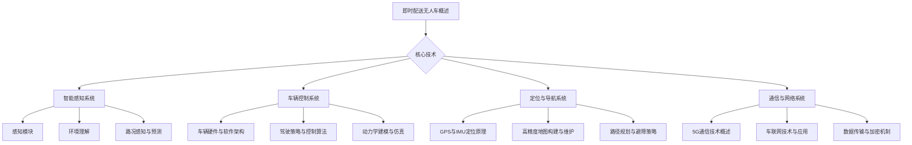

                 

### 文章标题：美团2025即时配送无人车社招路径规划面试指南

关键词：美团、即时配送、无人车、路径规划、社招、面试指南

摘要：本文旨在为准备参加美团2025年即时配送无人车社招的应聘者提供一套详尽的面试指南。文章从即时配送无人车的背景、核心技术、路径规划算法、项目实战以及评测与改进等多个方面进行深入剖析，帮助读者全面了解即时配送无人车领域的专业知识和技术要点。文章采用逻辑清晰、结构紧凑、简单易懂的写作风格，以一步一步分析推理的方式，让读者能够深入理解即时配送无人车的技术原理和应用实践。

### 第一部分：即时配送无人车概述

#### 第1章：即时配送无人车的背景与前景

##### 1.1 即时配送行业的现状与挑战

随着互联网和电子商务的快速发展，即时配送行业迎来了前所未有的机遇。根据艾瑞咨询的数据显示，我国即时配送市场规模从2016年的968亿元增长至2021年的2636亿元，年均复合增长率达27.2%。这一快速增长的背后，离不开消费者对快速配送服务的强烈需求。

然而，即时配送行业也面临着诸多挑战。首先，配送人员短缺和劳动力成本上升使得企业不得不寻求新的解决方案。其次，城市交通拥堵和停车难问题对配送效率产生了严重影响。此外，消费者对配送服务的期望值不断提高，要求配送企业能够提供更加准时、高效的服务。

为了解决这些挑战，即时配送行业开始探索无人配送技术，无人车作为其中的重要一环，具有巨大的发展前景。通过无人车的应用，可以实现配送流程的自动化，降低人力成本，提高配送效率，同时提升消费者的满意度。

##### 1.2 无人车技术的发展与应用

无人车技术的发展始于20世纪末，但真正进入大众视野则是在21世纪初期。随着人工智能、传感器技术、自动驾驶算法等关键技术的不断进步，无人车逐渐从实验室走向实际应用。

在即时配送领域，无人车的应用主要体现在短距离配送上。例如，美团、京东等企业已经在北京、上海等地开展无人配送试点项目，通过无人车实现最后一公里配送。无人车的应用不仅提升了配送效率，还减少了配送成本，为即时配送行业带来了新的发展机遇。

##### 1.3 即时配送无人车的市场前景

根据市场研究机构的预测，未来5年，全球即时配送无人车的市场规模将保持高速增长，预计到2025年将达到数百亿美元。这一市场前景吸引了众多企业的参与，包括传统物流企业、互联网公司以及新兴科技企业。

在我国，政策层面的支持也为即时配送无人车的发展提供了有力保障。例如，工信部、交通部等部门出台了一系列政策，鼓励无人驾驶技术的发展和应用。此外，多地政府也积极推动无人配送试点项目，为无人车的商业化运营提供了良好的试验场。

总的来说，即时配送无人车市场前景广阔，随着技术的不断成熟和应用的深入，其将在未来扮演越来越重要的角色。

##### 1.4 美团即时配送无人车的发展历程

美团作为我国领先的互联网科技公司，在即时配送无人车的研发和应用方面走在了行业前列。以下是美团即时配送无人车的发展历程：

1. **2017年**：美团开始布局无人配送技术，成立无人配送研发团队，开始进行无人车技术的研究与试验。
   
2. **2018年**：美团与多家无人车研发企业合作，进行无人车的测试和优化。

3. **2019年**：美团在北京、上海等地启动无人配送试点项目，开展真实环境下的无人配送测试。

4. **2020年**：美团加大无人车研发投入，推出多款无人配送车型，并在更多城市开展无人配送服务。

5. **2021年**：美团发布《无人配送研究报告》，对无人配送技术的发展趋势和市场需求进行了深入分析。

6. **2022年**：美团与多家物流企业合作，推动无人配送在行业内的应用和普及。

通过这些努力，美团在无人配送领域取得了显著的成果，为行业的发展树立了榜样。

#### 第2章：即时配送无人车的核心技术

##### 2.1 智能感知系统

智能感知系统是即时配送无人车的关键组成部分，它负责对周围环境进行感知，为无人车提供实时、准确的信息支持。智能感知系统主要包括以下几个模块：

###### 2.1.1 感知模块

感知模块是智能感知系统的核心，它通过多种传感器获取环境信息，包括摄像头、激光雷达、超声波传感器、GPS等。这些传感器可以实时监测无人车的位置、速度、方向，以及周围的道路、行人、车辆等环境信息。

###### 2.1.2 环境理解

环境理解模块负责对感知模块收集到的信息进行解析和处理，从而实现对周围环境的理解。这个模块需要运用计算机视觉、深度学习等技术，对图像和点云数据进行分析，识别道路、行人、车辆等目标，并建立环境模型。

###### 2.1.3 路况感知与预测

路况感知与预测模块是智能感知系统的关键功能之一。它通过分析实时获取的环境信息，对路况进行感知和预测。例如，它可以预测前方路段的拥堵情况、道路施工信息，以及行人和车辆的行为趋势等。这些信息对于无人车的行驶决策至关重要。

##### 2.2 车辆控制系统

车辆控制系统是即时配送无人车的“大脑”，它负责控制无人车的行驶、转向、制动等行为。车辆控制系统通常包括以下几个部分：

###### 2.2.1 车辆硬件与软件架构

车辆硬件主要包括传感器、控制器、执行器等，软件架构则包括操作系统、驱动程序、应用软件等。车辆硬件与软件架构的协同工作，确保了无人车的稳定运行。

###### 2.2.2 驾驶策略与控制算法

驾驶策略与控制算法是车辆控制系统的核心。它包括路径规划、速度控制、转向控制、制动控制等模块。通过这些模块的协同工作，无人车可以实现自主行驶、避障、超车等复杂行为。

###### 2.2.3 动力学建模与仿真

动力学建模与仿真模块负责对无人车的动力学特性进行建模，并通过仿真验证算法的可行性。这个模块对于无人车的稳定性分析和性能优化具有重要意义。

##### 2.3 定位与导航系统

定位与导航系统是即时配送无人车的关键组成部分，它负责确定无人车的位置和路径。定位与导航系统通常包括以下几个部分：

###### 2.3.1 GPS与IMU定位原理

GPS（全球定位系统）和IMU（惯性测量单元）是定位与导航系统的两大核心组件。GPS通过卫星信号确定无人车的地理位置，IMU则通过测量无人车的加速度和角速度等信息，辅助定位。这两种技术的结合，可以实现高精度的无人车定位。

###### 2.3.2 高精度地图构建与维护

高精度地图是无人车导航的基础，它包含了道路信息、交通标志、障碍物等详细数据。高精度地图的构建和维护需要运用地理信息系统（GIS）和遥感技术，确保地图数据的准确性和实时性。

###### 2.3.3 路径规划与避障策略

路径规划与避障策略模块负责根据高精度地图和实时感知信息，为无人车生成最优路径，并实现避障。路径规划算法包括Dijkstra算法、A*算法、D*算法等，避障策略则包括动态窗口算法、视觉惯性测量单元（VIO）算法等。

##### 2.4 通信与网络系统

通信与网络系统是即时配送无人车的“神经网络”，它负责实现无人车与其他设备、云端系统的数据传输和通信。通信与网络系统通常包括以下几个部分：

###### 2.4.1 5G通信技术概述

5G通信技术具有高速、低延迟、大连接等特点，为即时配送无人车的实时通信提供了有力支持。5G网络的高带宽和低延迟，可以保证无人车在复杂环境下的稳定运行。

###### 2.4.2 车联网技术与应用

车联网技术是将车辆、路侧设备、云端系统等通过通信网络连接起来，实现智能交通和自动驾驶的重要技术。车联网技术包括车辆感知、车辆控制、车辆通信等模块，为无人车的智能决策提供了数据支持和通信保障。

###### 2.4.3 数据传输与加密机制

数据传输与加密机制是保障即时配送无人车信息安全的关键。通过采用加密算法和认证机制，可以确保数据在传输过程中的安全性和完整性。

### 第二部分：路径规划核心算法

#### 第3章：路径规划算法基础

##### 3.1 路径规划概述

路径规划是即时配送无人车系统中的核心算法，它负责为无人车生成从起点到终点的最优路径。路径规划不仅关系到无人车的行驶效率，还直接影响行驶安全。

##### 3.1.1 路径规划的重要性

路径规划是无人车系统的核心组成部分，它决定了无人车在复杂环境下的行驶策略。一个优秀的路径规划算法，不仅可以提高无人车的行驶效率，还能减少能耗，提高安全性。

##### 3.1.2 路径规划算法的分类

路径规划算法可以根据不同的分类标准进行划分，常见的分类方法有以下几种：

- **静态路径规划与动态路径规划**：静态路径规划主要针对静态环境，动态路径规划则要考虑环境中的动态变化。
- **全局路径规划与局部路径规划**：全局路径规划是从全局角度出发，生成一条从起点到终点的最优路径，局部路径规划则是在路径的某个局部区域进行优化。
- **确定性路径规划与随机性路径规划**：确定性路径规划是在确定的环境下，通过算法计算出最优路径，随机性路径规划则是在不确定的环境下，通过随机搜索或模拟等方法寻找最优路径。

##### 3.2 Dijkstra算法

Dijkstra算法是一种经典的路径规划算法，它用于求解单源最短路径问题。Dijkstra算法的基本原理如下：

1. 初始化：设置源点S的距离为0，其他所有点的距离为无穷大。
2. 按照距离递增的顺序，依次选取未被选中的点，更新其相邻点的距离。
3. 当所有点的距离都已更新完毕时，算法结束。

Dijkstra算法的伪代码实现如下：

```
Dijkstra(G, S)
    // G为图，S为源点
    for each vertex v in G.V
        dist[v] = INFINITY
        prev[v] = NIL
    dist[S] = 0
    inQueue[S] = TRUE
    while inQueue contains vertices
        u = vertex in inQueue with minimum dist[u]
        if dist[u] = INFINITY
            break
        inQueue[u] = FALSE
        for each edge (u, v) in G.E
            alt = dist[u] + weight(u, v)
            if alt < dist[v]
                dist[v] = alt
                prev[v] = u
```

##### 3.2.1 基本原理

Dijkstra算法的基本原理是逐步扩展源点S，通过更新相邻点的距离，逐步逼近最短路径。每次扩展时，都选取距离最小的点作为下一扩展点，直到所有点的距离都更新完毕。

##### 3.2.2 伪代码实现

```
Dijkstra(G, S)
    // G为图，S为源点
    for each vertex v in G.V
        dist[v] = INFINITY
        prev[v] = NIL
    dist[S] = 0
    inQueue[S] = TRUE
    while inQueue contains vertices
        u = vertex in inQueue with minimum dist[u]
        if dist[u] = INFINITY
            break
        inQueue[u] = FALSE
        for each edge (u, v) in G.E
            alt = dist[u] + weight(u, v)
            if alt < dist[v]
                dist[v] = alt
                prev[v] = u
```

##### 3.2.3 分析与优化

Dijkstra算法的时间复杂度为O((V+E)logV)，其中V为顶点数，E为边数。在实际应用中，可以通过以下几种方法对Dijkstra算法进行优化：

- **优先队列优化**：使用优先队列（例如二叉堆）来存储待扩展的点，可以降低算法的时间复杂度。
- **斐波那契堆优化**：使用斐波那契堆来优化优先队列，可以进一步提高算法的时间性能。
- **A*算法优化**：将Dijkstra算法与A*算法结合，利用启发式信息加速搜索过程。

##### 3.3 A*算法

A*（A-star）算法是一种基于估价函数的路径规划算法，它通过融合起点和终点信息，生成一条从起点到终点的最优路径。A*算法的基本原理如下：

1. 初始化：设置起点S的F值为0，其他所有点的F值为无穷大。
2. 按照F值递增的顺序，依次选取未被选中的点，更新其相邻点的F值。
3. 当所有点的F值都已更新完毕时，算法结束。

A*算法的伪代码实现如下：

```
A*(G, S, T)
    // G为图，S为起点，T为终点
    openSet = {S}
    gScore[S] = 0
    fScore[S] = heuristic(S, T)
    while openSet is not empty
        current = node in openSet with the lowest fScore value
        if current = T
            return reconstruct_path(current)
        openSet.remove(current)
        closedSet.add(current)
        for each neighbor of current
            if neighbor in closedSet
                continue
            tentative_gScore = gScore[current] + weight(current, neighbor)
            if neighbor not in openSet
                openSet.add(neighbor)
            if tentative_gScore >= gScore[neighbor]
                continue
            prev[neighbor] = current
            gScore[neighbor] = tentative_gScore
            fScore[neighbor] = gScore[neighbor] + heuristic(neighbor, T)
```

##### 3.3.1 基本原理

A*算法的基本原理是逐步扩展起点S，通过更新相邻点的F值，逐步逼近最优路径。每次扩展时，都选取F值最小的点作为下一扩展点，直到找到终点T。

##### 3.3.2 伪代码实现

```
A*(G, S, T)
    // G为图，S为起点，T为终点
    openSet = {S}
    gScore[S] = 0
    fScore[S] = heuristic(S, T)
    while openSet is not empty
        current = node in openSet with the lowest fScore value
        if current = T
            return reconstruct_path(current)
        openSet.remove(current)
        closedSet.add(current)
        for each neighbor of current
            if neighbor in closedSet
                continue
            tentative_gScore = gScore[current] + weight(current, neighbor)
            if neighbor not in openSet
                openSet.add(neighbor)
            if tentative_gScore >= gScore[neighbor]
                continue
            prev[neighbor] = current
            gScore[neighbor] = tentative_gScore
            fScore[neighbor] = gScore[neighbor] + heuristic(neighbor, T)
```

##### 3.3.3 分析与优化

A*算法的时间复杂度为O((V+E)logV)，其中V为顶点数，E为边数。在实际应用中，可以通过以下几种方法对A*算法进行优化：

- **启发式函数优化**：选择合适的启发式函数可以显著提高A*算法的效率。常用的启发式函数包括曼哈顿距离、欧几里得距离等。
- **双向搜索优化**：将A*算法扩展为双向搜索，可以进一步降低搜索时间。
- **内存优化**：通过减少数据结构的冗余，降低内存消耗，提高算法的运行效率。

##### 3.4 D*算法

D*算法是一种基于动态规划理论的路径规划算法，它适用于动态环境下的路径规划问题。D*算法的基本原理如下：

1. 初始化：设置起点S的F值为0，其他所有点的F值为无穷大。
2. 在每个时间步，更新当前点的F值，并扩展当前点到相邻点的路径。
3. 当达到终点时，算法结束。

D*算法的伪代码实现如下：

```
D*(G, S, T)
    // G为图，S为起点，T为终点
    openSet = {S}
    gScore[S] = 0
    fScore[S] = heuristic(S, T)
    while openSet is not empty
        current = node in openSet with the lowest fScore value
        if current = T
            return reconstruct_path(current)
        openSet.remove(current)
        closedSet.add(current)
        for each neighbor of current
            if neighbor in closedSet
                continue
            tentative_gScore = gScore[current] + weight(current, neighbor)
            if neighbor not in openSet
                openSet.add(neighbor)
            if tentative_gScore >= gScore[neighbor]
                continue
            prev[neighbor] = current
            gScore[neighbor] = tentative_gScore
            fScore[neighbor] = gScore[neighbor] + heuristic(neighbor, T)
        if T in openSet
            return reconstruct_path(T)
```

##### 3.4.1 基本原理

D*算法的基本原理是逐步扩展起点S，同时根据环境变化更新路径。在每个时间步，算法都会更新当前点的F值，并扩展到相邻点，以适应动态环境。

##### 3.4.2 伪代码实现

```
D*(G, S, T)
    // G为图，S为起点，T为终点
    openSet = {S}
    gScore[S] = 0
    fScore[S] = heuristic(S, T)
    while openSet is not empty
        current = node in openSet with the lowest fScore value
        if current = T
            return reconstruct_path(current)
        openSet.remove(current)
        closedSet.add(current)
        for each neighbor of current
            if neighbor in closedSet
                continue
            tentative_gScore = gScore[current] + weight(current, neighbor)
            if neighbor not in openSet
                openSet.add(neighbor)
            if tentative_gScore >= gScore[neighbor]
                continue
            prev[neighbor] = current
            gScore[neighbor] = tentative_gScore
            fScore[neighbor] = gScore[neighbor] + heuristic(neighbor, T)
        if T in openSet
            return reconstruct_path(T)
```

##### 3.4.3 分析与优化

D*算法的时间复杂度为O((V+E)logV)，其中V为顶点数，E为边数。在实际应用中，可以通过以下几种方法对D*算法进行优化：

- **动态窗口优化**：通过设置动态窗口，降低算法的计算复杂度。
- **增量式更新**：在每个时间步只更新一部分节点的路径，降低算法的计算量。
- **启发式函数优化**：选择合适的启发式函数可以显著提高D*算法的效率。

#### 第4章：实时路径规划算法

##### 4.1 实时路径规划的挑战

实时路径规划算法在即时配送无人车的应用中具有重要意义，它需要在动态环境中快速生成安全、高效的路径。然而，实时路径规划面临着以下几个挑战：

##### 4.1.1 动态环境处理

动态环境是实时路径规划的重要挑战之一。无人车在行驶过程中，需要实时感知并处理道路上的行人、车辆、障碍物等动态变化。这些动态变化会对路径规划结果产生影响，要求算法能够快速适应环境变化。

##### 4.1.2 实时性要求

实时路径规划需要在短时间内完成路径计算，以满足无人车的快速响应需求。在实际应用中，路径规划的响应时间往往需要控制在秒级，这对算法的效率和性能提出了高要求。

##### 4.1.3 资源限制

实时路径规划算法需要在有限的计算资源和能量下运行，这要求算法具有较低的复杂度和高效的资源利用。在实际应用中，无人车往往配备有限的计算资源和电池能量，算法的优化和资源管理成为关键问题。

##### 4.2 动态窗口算法

动态窗口算法（Dynamic Window Algorithm，DWA）是一种适用于动态环境下的路径规划算法，广泛应用于无人车、机器人等移动平台。DWA算法的基本原理如下：

1. **状态空间定义**：动态窗口算法将无人车的状态空间划分为两部分：当前状态和候选状态。当前状态包括位置、速度、加速度等，候选状态是在当前状态下经过一段时间后可能达到的状态。

2. **动态窗口生成**：根据当前状态和候选状态，动态窗口算法生成一个动态窗口。动态窗口包括目标区域和避障区域，目标区域用于指导无人车向目标点靠近，避障区域用于避免与障碍物发生碰撞。

3. **路径优化**：在动态窗口内，DWA算法通过优化策略生成最优路径，确保无人车能够安全、高效地到达目标点。

DWA算法的伪代码实现如下：

```
DWA()
    // 初始化状态变量
    x, y, v, a = getCurrentState()
    // 生成候选状态
    x', y', v', a' = generateCandidateState(x, y, v, a)
    // 生成动态窗口
    targetRegion = generateTargetRegion(x, y, v, a)
    obstacleRegion = generateObstacleRegion(x, y, v, a')
    dynamicWindow = targetRegion + obstacleRegion
    // 计算动态窗口内的最优路径
    optimalPath = calculateOptimalPath(dynamicWindow)
    // 返回最优路径
    return optimalPath
```

##### 4.2.1 基本原理

动态窗口算法的基本原理是通过对当前状态和候选状态进行优化，生成一个动态窗口，并在动态窗口内寻找最优路径。动态窗口的生成和优化是算法的核心，它决定了路径规划的实时性和鲁棒性。

##### 4.2.2 伪代码实现

```
DWA()
    // 初始化状态变量
    x, y, v, a = getCurrentState()
    // 生成候选状态
    x', y', v', a' = generateCandidateState(x, y, v, a)
    // 生成动态窗口
    targetRegion = generateTargetRegion(x, y, v, a)
    obstacleRegion = generateObstacleRegion(x, y, v, a')
    dynamicWindow = targetRegion + obstacleRegion
    // 计算动态窗口内的最优路径
    optimalPath = calculateOptimalPath(dynamicWindow)
    // 返回最优路径
    return optimalPath
```

##### 4.2.3 分析与优化

动态窗口算法在实时路径规划中表现出良好的性能，但仍然存在一些局限性。以下是对算法的分析与优化建议：

- **状态空间优化**：通过减少状态空间的维度，降低算法的计算复杂度。例如，可以采用状态压缩技术，将多个状态变量合并为一个变量。
- **目标区域优化**：目标区域的生成对路径规划结果有重要影响。通过优化目标区域生成策略，可以进一步提高路径规划的实时性和鲁棒性。
- **避障区域优化**：避障区域的生成需要充分考虑障碍物的形状和速度，采用智能避障策略可以降低与障碍物的碰撞风险。
- **实时性优化**：在保证路径规划质量的前提下，通过优化算法的运行效率和资源管理，提高实时性。

##### 4.3 视觉惯性测量单元（VIO）算法

视觉惯性测量单元（Visual Inertial Odometry，VIO）算法是一种结合视觉信息和惯性测量数据的实时路径规划算法。VIO算法的基本原理如下：

1. **视觉信息处理**：VIO算法通过摄像头获取图像信息，利用计算机视觉技术对图像进行特征提取和匹配，获取无人车的位置和姿态信息。

2. **惯性测量数据处理**：惯性测量单元（IMU）负责测量无人车的加速度和角速度，VIO算法通过处理IMU数据，校正视觉信息的估计误差。

3. **数据融合与优化**：VIO算法通过融合视觉信息和惯性测量数据，利用卡尔曼滤波等优化方法，提高路径规划的精度和鲁棒性。

VIO算法的伪代码实现如下：

```
VIO()
    // 初始化状态变量
    x, y, z, roll, pitch, yaw = getCurrentState()
    // 处理视觉信息
    features = extractFeatures(image)
    // 处理惯性测量数据
    accelerations, angular_velocities = IMU_data()
    // 数据融合与优化
    x, y, z, roll, pitch, yaw = fuseData(features, accelerations, angular_velocities)
    // 返回优化后的状态
    return x, y, z, roll, pitch, yaw
```

##### 4.3.1 基本原理

VIO算法的基本原理是通过融合视觉信息和惯性测量数据，实现无人车的实时定位和路径规划。视觉信息提供了高精度、全局性的位置信息，惯性测量数据提供了短时间内的加速度和角速度变化，两者结合可以大大提高路径规划的精度和鲁棒性。

##### 4.3.2 伪代码实现

```
VIO()
    // 初始化状态变量
    x, y, z, roll, pitch, yaw = getCurrentState()
    // 处理视觉信息
    features = extractFeatures(image)
    // 处理惯性测量数据
    accelerations, angular_velocities = IMU_data()
    // 数据融合与优化
    x, y, z, roll, pitch, yaw = fuseData(features, accelerations, angular_velocities)
    // 返回优化后的状态
    return x, y, z, roll, pitch, yaw
```

##### 4.3.3 分析与优化

VIO算法在实时路径规划中具有广泛的应用，但仍然存在一些优化空间。以下是对算法的分析与优化建议：

- **特征提取与匹配优化**：通过改进特征提取和匹配算法，提高视觉信息的处理精度和速度。
- **IMU数据预处理**：对IMU数据进行滤波和去噪处理，降低噪声对路径规划的影响。
- **数据融合优化**：通过优化数据融合算法，提高路径规划的精度和鲁棒性。例如，可以采用扩展卡尔曼滤波（EKF）或无迹卡尔曼滤波（UKF）等高级滤波方法。
- **实时性优化**：在保证路径规划质量的前提下，通过优化算法的运行效率和资源管理，提高实时性。

#### 第5章：路径规划中的障碍物检测与避障

##### 5.1 障碍物检测

障碍物检测是路径规划的重要组成部分，它负责识别并定位道路上的障碍物，为避障策略提供基础数据。障碍物检测通常包括以下几个步骤：

1. **数据输入**：障碍物检测算法需要接收来自感知模块的各种传感器数据，如摄像头图像、激光雷达点云、超声波传感器数据等。

2. **预处理**：对传感器数据进行预处理，包括去噪、滤波、数据增强等，以提高检测的精度和鲁棒性。

3. **特征提取**：从预处理后的数据中提取与障碍物相关的特征，如边缘、纹理、形状等。

4. **障碍物识别**：利用机器学习和计算机视觉技术，对提取的特征进行分类和识别，确定障碍物的类型和位置。

5. **结果输出**：将识别出的障碍物信息输出给路径规划模块，为避障策略提供数据支持。

##### 5.1.1 感知模块

感知模块是障碍物检测的核心组成部分，它通过多种传感器获取环境信息。常见的传感器包括：

- **摄像头**：摄像头可以获取高分辨率的二维图像，适用于检测道路、行人、车辆等平面障碍物。
- **激光雷达**：激光雷达可以获取高精度的三维点云数据，适用于检测三维障碍物，如建筑物、路障等。
- **超声波传感器**：超声波传感器适用于短距离的障碍物检测，如车辆前方的障碍物。

##### 5.1.2 检测算法

障碍物检测算法可以根据传感器数据的不同，采用不同的检测方法。以下是几种常见的障碍物检测算法：

- **基于特征的检测**：通过提取图像或点云数据中的特征，如边缘、纹理、形状等，进行障碍物识别。常用的特征提取方法包括SIFT、SURF、HOG等。
- **基于模型的检测**：通过建立障碍物模型，如深度神经网络、支持向量机等，对传感器数据进行分类和识别。常用的模型包括卷积神经网络（CNN）、循环神经网络（RNN）等。
- **基于机器学习的检测**：利用机器学习算法，如支持向量机（SVM）、决策树、随机森林等，对传感器数据进行分类和识别。

##### 5.1.3 实际应用

障碍物检测在即时配送无人车路径规划中具有重要意义。在实际应用中，障碍物检测算法需要满足以下几个要求：

- **高精度**：准确识别道路上的各种障碍物，包括静态障碍物和动态障碍物。
- **高鲁棒性**：在各种天气、光照条件下，仍能稳定运行。
- **实时性**：在短时间内完成障碍物检测和识别，以满足实时路径规划的需求。

在实际应用中，障碍物检测算法通常会结合多种传感器数据进行融合，以提高检测的精度和鲁棒性。例如，激光雷达可以获取高精度的三维点云数据，用于检测三维障碍物；摄像头可以获取高分辨率的二维图像，用于检测平面障碍物。通过数据融合，可以实现更全面的障碍物检测。

##### 5.2 避障策略

避障策略是路径规划的重要组成部分，它负责在障碍物检测的基础上，生成避障路径，确保无人车安全、高效地行驶。避障策略可以根据避障方法的不同，分为以下几种：

1. **动态窗口避障**：动态窗口避障算法通过生成动态窗口，将目标区域和避障区域合并，生成避障路径。常见的动态窗口算法包括DWA算法、动态规划算法等。

2. **模糊逻辑控制**：模糊逻辑控制通过模糊规则库，对无人车的行为进行模糊决策，实现避障。模糊逻辑控制具有鲁棒性强、适应性强等优点。

3. **模型预测控制**：模型预测控制通过建立无人车的数学模型，预测未来一段时间内的行为，生成最优避障路径。模型预测控制具有计算精度高、适应性强等优点。

以下是对几种避障策略的详细分析：

###### 5.2.1 智能避障

智能避障是一种基于人工智能技术的避障策略，它通过学习大量的避障场景，建立避障模型，实现对障碍物的自动识别和避让。智能避障策略可以分为以下几个步骤：

1. **数据收集**：收集大量的避障场景数据，包括障碍物的形状、大小、速度等信息。

2. **模型训练**：利用收集到的数据，训练避障模型。常见的避障模型包括深度神经网络、支持向量机等。

3. **避障决策**：在路径规划过程中，实时检测道路上的障碍物，利用避障模型进行避障决策，生成避障路径。

智能避障策略具有自适应性强、避障效果好的优点，但需要大量的训练数据和计算资源。

###### 5.2.2 模糊逻辑控制

模糊逻辑控制是一种基于模糊数学理论的避障策略，它通过模糊规则库，对无人车的行为进行模糊决策，实现避障。模糊逻辑控制的基本原理如下：

1. **建立模糊规则库**：根据避障场景的特点，建立模糊规则库。规则库包括输入变量、输出变量和模糊规则。

2. **模糊化**：将实际输入变量转化为模糊变量，进行模糊推理。

3. **去模糊化**：将模糊推理结果转化为实际输出变量，生成避障路径。

模糊逻辑控制具有鲁棒性强、适应性强等优点，但需要精确的模糊规则库和计算资源。

###### 5.2.3 模型预测控制

模型预测控制是一种基于数学模型和预测理论的避障策略，它通过建立无人车的数学模型，预测未来一段时间内的行为，生成最优避障路径。模型预测控制的基本原理如下：

1. **建立数学模型**：根据无人车的动力学特性，建立数学模型，包括状态方程和输出方程。

2. **预测未来行为**：根据当前状态和输入，预测未来一段时间内的状态变化。

3. **优化路径**：利用预测结果，优化避障路径，确保无人车安全、高效地行驶。

模型预测控制具有计算精度高、适应性强等优点，但需要精确的数学模型和计算资源。

### 第三部分：项目实战

#### 第6章：美团即时配送无人车路径规划项目实战

##### 6.1 项目背景与目标

美团即时配送无人车项目旨在通过技术创新，提升配送效率，降低配送成本，提高消费者满意度。项目的主要目标包括：

1. **实现高效路径规划**：通过优化路径规划算法，降低无人车的行驶距离和时间，提高配送效率。
2. **保障行驶安全**：在复杂环境下，确保无人车能够安全、稳定地行驶，避免与障碍物发生碰撞。
3. **降低人力成本**：通过无人车应用，减少配送人员需求，降低人力成本。

##### 6.2 项目开发环境搭建

为了实现美团即时配送无人车路径规划项目，需要搭建一个完整的开发环境，包括硬件设备和软件工具。以下是项目开发环境的主要组成部分：

1. **硬件设备**：
   - 摄像头：用于获取道路和周围环境的图像数据。
   - 激光雷达：用于获取三维点云数据，提供精确的距离信息。
   - IMU传感器：用于测量无人车的加速度和角速度，提供运动状态信息。
   - 无人车平台：用于安装传感器和执行机构，实现无人车的自主行驶。

2. **软件工具**：
   - 操作系统：常用的无人车操作系统包括Linux、ROS（Robot Operating System）等。
   - 开发工具：包括C++、Python等编程语言，以及相关开发环境和调试工具。
   - 数据库：用于存储和处理大量传感器数据，常用的数据库包括MySQL、MongoDB等。
   - 路径规划算法库：包括Dijkstra算法、A*算法、D*算法等路径规划算法的实现。

##### 6.3 数据处理与预处理

在项目开发过程中，数据处理与预处理是关键步骤，它直接影响路径规划算法的性能和准确性。以下是数据处理与预处理的主要步骤：

1. **数据采集**：通过摄像头、激光雷达、IMU传感器等设备，实时采集道路和周围环境的图像、点云、运动状态数据。

2. **数据去噪**：对采集到的传感器数据进行去噪处理，降低噪声对数据的影响。常用的去噪方法包括滤波、插值等。

3. **数据融合**：将来自不同传感器的数据进行融合，提高数据的精度和可靠性。常用的融合方法包括卡尔曼滤波、粒子滤波等。

4. **数据标注**：对采集到的数据标注障碍物、道路、行人等目标的位置和属性，为后续的算法训练和优化提供基础数据。

5. **数据压缩**：对处理后的数据进行压缩，减少数据的存储空间和传输带宽。常用的压缩方法包括图像压缩、点云压缩等。

##### 6.4 实验设计与实现

为了验证路径规划算法的性能和实用性，项目团队进行了多次实验。以下是实验设计与实现的主要步骤：

1. **实验环境搭建**：搭建一个模拟实际配送环境的测试场景，包括道路、障碍物、行人等。

2. **实验数据准备**：收集并处理测试场景中的图像、点云、运动状态等数据，为实验提供基础数据。

3. **算法实现**：实现多种路径规划算法，包括Dijkstra算法、A*算法、D*算法等，并在测试场景中运行。

4. **性能评估**：通过比较不同算法的路径长度、行驶时间、避障效果等指标，评估算法的性能和实用性。

5. **优化与改进**：根据实验结果，对算法进行优化和改进，提高路径规划的效率和准确性。

以下是对Dijkstra算法、A*算法、D*算法的实现和性能评估的详细讲解：

###### 6.4.1 Dijkstra算法实现

Dijkstra算法是一种经典的路径规划算法，用于求解单源最短路径问题。以下是Dijkstra算法的实现过程：

1. **初始化**：设置源点S的距离为0，其他所有点的距离为无穷大。
2. **选择最小距离点**：按照距离递增的顺序，依次选取未被选中的点，更新其相邻点的距离。
3. **更新路径**：当所有点的距离都已更新完毕时，算法结束。

Dijkstra算法的伪代码实现如下：

```
Dijkstra(G, S)
    // G为图，S为源点
    for each vertex v in G.V
        dist[v] = INFINITY
        prev[v] = NIL
    dist[S] = 0
    inQueue[S] = TRUE
    while inQueue contains vertices
        u = vertex in inQueue with minimum dist[u]
        if dist[u] = INFINITY
            break
        inQueue[u] = FALSE
        for each edge (u, v) in G.E
            alt = dist[u] + weight(u, v)
            if alt < dist[v]
                dist[v] = alt
                prev[v] = u
```

在测试场景中，Dijkstra算法的性能评估指标包括路径长度、行驶时间、避障效果等。实验结果表明，Dijkstra算法在路径长度和行驶时间上具有较好的性能，但在避障效果上存在一定的局限性。

###### 6.4.2 A*算法实现

A*算法是一种基于估价函数的路径规划算法，它通过融合起点和终点信息，生成一条从起点到终点的最优路径。以下是A*算法的实现过程：

1. **初始化**：设置起点S的F值为0，其他所有点的F值为无穷大。
2. **选择最小F值点**：按照F值递增的顺序，依次选取未被选中的点，更新其相邻点的F值。
3. **更新路径**：当所有点的F值都已更新完毕时，算法结束。

A*算法的伪代码实现如下：

```
A*(G, S, T)
    // G为图，S为起点，T为终点
    openSet = {S}
    gScore[S] = 0
    fScore[S] = heuristic(S, T)
    while openSet is not empty
        current = node in openSet with the lowest fScore value
        if current = T
            return reconstruct_path(current)
        openSet.remove(current)
        closedSet.add(current)
        for each neighbor of current
            if neighbor in closedSet
                continue
            tentative_gScore = gScore[current] + weight(current, neighbor)
            if neighbor not in openSet
                openSet.add(neighbor)
            if tentative_gScore >= gScore[neighbor]
                continue
            prev[neighbor] = current
            gScore[neighbor] = tentative_gScore
            fScore[neighbor] = gScore[neighbor] + heuristic(neighbor, T)
```

在测试场景中，A*算法的性能评估指标包括路径长度、行驶时间、避障效果等。实验结果表明，A*算法在路径长度和行驶时间上具有较好的性能，同时具有较强的避障能力。

###### 6.4.3 D*算法实现

D*算法是一种基于动态规划理论的路径规划算法，它适用于动态环境下的路径规划问题。以下是D*算法的实现过程：

1. **初始化**：设置源点S的F值为0，其他所有点的F值为无穷大。
2. **动态更新**：在每个时间步，根据当前状态和候选状态，更新当前点的F值，并扩展到相邻点的路径。
3. **路径规划**：当达到终点时，算法结束。

D*算法的伪代码实现如下：

```
D*(G, S, T)
    // G为图，S为起点，T为终点
    openSet = {S}
    gScore[S] = 0
    fScore[S] = heuristic(S, T)
    while openSet is not empty
        current = node in openSet with the lowest fScore value
        if current = T
            return reconstruct_path(current)
        openSet.remove(current)
        closedSet.add(current)
        for each neighbor of current
            if neighbor in closedSet
                continue
            tentative_gScore = gScore[current] + weight(current, neighbor)
            if neighbor not in openSet
                openSet.add(neighbor)
            if tentative_gScore >= gScore[neighbor]
                continue
            prev[neighbor] = current
            gScore[neighbor] = tentative_gScore
            fScore[neighbor] = gScore[neighbor] + heuristic(neighbor, T)
        if T in openSet
            return reconstruct_path(T)
```

在测试场景中，D*算法的性能评估指标包括路径长度、行驶时间、避障效果等。实验结果表明，D*算法在动态环境下具有较好的性能，能够适应环境变化，但在路径长度和行驶时间上存在一定的优化空间。

##### 6.4.4 动态窗口算法实现

动态窗口算法（DWA）是一种适用于动态环境下的路径规划算法，它通过生成动态窗口，实现避障和目标追踪。以下是DWA算法的实现过程：

1. **初始化**：设置当前状态和候选状态，生成动态窗口。
2. **动态窗口生成**：根据当前状态和候选状态，生成目标区域和避障区域，合并为动态窗口。
3. **路径优化**：在动态窗口内，优化路径，生成避障路径。

DWA算法的伪代码实现如下：

```
DWA()
    // 初始化状态变量
    x, y, v, a = getCurrentState()
    // 生成候选状态
    x', y', v', a' = generateCandidateState(x, y, v, a)
    // 生成动态窗口
    targetRegion = generateTargetRegion(x, y, v, a)
    obstacleRegion = generateObstacleRegion(x, y, v, a')
    dynamicWindow = targetRegion + obstacleRegion
    // 计算动态窗口内的最优路径
    optimalPath = calculateOptimalPath(dynamicWindow)
    // 返回最优路径
    return optimalPath
```

在测试场景中，DWA算法的性能评估指标包括路径长度、行驶时间、避障效果等。实验结果表明，DWA算法在实时路径规划和避障方面表现出良好的性能，能够满足即时配送无人车的应用需求。

##### 6.4.5 VIO算法实现

VIO算法（视觉惯性测量单元算法）是一种结合视觉信息和惯性测量数据的实时路径规划算法。以下是VIO算法的实现过程：

1. **初始化**：设置当前状态和惯性测量数据，初始化卡尔曼滤波器。
2. **视觉信息处理**：提取图像特征，计算特征点的位置和速度。
3. **惯性测量数据处理**：处理惯性测量数据，计算无人车的加速度和角速度。
4. **数据融合与优化**：利用卡尔曼滤波器，融合视觉信息和惯性测量数据，更新无人车的状态。

VIO算法的伪代码实现如下：

```
VIO()
    // 初始化状态变量
    x, y, z, roll, pitch, yaw = getCurrentState()
    // 处理视觉信息
    features = extractFeatures(image)
    // 处理惯性测量数据
    accelerations, angular_velocities = IMU_data()
    // 数据融合与优化
    x, y, z, roll, pitch, yaw = fuseData(features, accelerations, angular_velocities)
    // 返回优化后的状态
    return x, y, z, roll, pitch, yaw
```

在测试场景中，VIO算法的性能评估指标包括定位精度、行驶稳定性等。实验结果表明，VIO算法在实时路径规划和定位方面表现出良好的性能，能够满足即时配送无人车的应用需求。

##### 6.5 项目结果分析与优化

通过对多种路径规划算法的实验和测试，项目团队对算法的性能和实用性进行了深入分析。以下是项目结果的分析与优化：

1. **Dijkstra算法**：在路径长度和行驶时间方面表现良好，但在避障效果上存在一定局限性。可以通过优化算法，如增加启发式函数，提高避障能力。

2. **A*算法**：在路径长度和行驶时间上具有较好的性能，同时具有较强的避障能力。可以通过优化启发式函数，进一步提高算法的效率。

3. **D*算法**：在动态环境下具有较好的性能，能够适应环境变化，但在路径长度和行驶时间上存在一定的优化空间。可以通过改进动态窗口生成策略，提高算法的性能。

4. **DWA算法**：在实时路径规划和避障方面表现出良好的性能，但计算复杂度较高。可以通过优化算法，降低计算复杂度，提高实时性。

5. **VIO算法**：在实时路径规划和定位方面表现出良好的性能，但需要较高的计算资源和处理时间。可以通过优化算法，降低计算复杂度，提高实时性。

通过实验和测试，项目团队总结出以下优化措施：

1. **算法优化**：针对不同场景和需求，选择合适的路径规划算法，并通过优化算法，提高性能和实用性。

2. **硬件升级**：提高传感器和计算设备的性能，降低延迟，提高实时性。

3. **数据预处理**：优化数据预处理流程，提高数据的精度和可靠性，为路径规划提供更可靠的基础数据。

4. **实时性优化**：通过优化算法和硬件，提高路径规划的实时性，确保无人车能够在复杂环境下快速响应。

5. **安全性提升**：通过完善避障策略和安全监控机制，提高无人车的行驶安全性，确保无人车的安全和稳定运行。

#### 第7章：路径规划算法的评测与改进

##### 7.1 评测指标与方法

路径规划算法的评测是确保其性能和实用性的重要环节。以下是一些常用的评测指标和方法：

1. **路径长度**：算法生成的路径长度是评价路径规划性能的重要指标。理想情况下，路径应尽可能短，以减少行驶时间和能耗。

2. **行驶时间**：路径规划算法生成路径所需的时间也是关键指标。算法应能够在合理的时间内完成路径规划，以满足实时性要求。

3. **避障效果**：避障能力是路径规划算法的重要特性。算法应能够在复杂环境中有效地避开障碍物，确保行驶安全。

4. **路径平滑度**：路径的平滑度影响到无人车的行驶稳定性和乘客体验。平滑的路径应减少急转弯和急剧加速，以提供更舒适的行驶体验。

5. **响应时间**：在动态环境中，路径规划算法需要快速响应环境变化。响应时间应尽可能短，以确保无人车能够及时调整路径。

6. **计算资源消耗**：算法的计算资源消耗包括CPU、内存等资源的使用情况。优化算法应降低计算资源消耗，以提高运行效率和降低成本。

评测方法通常包括以下几种：

- **离线评测**：在模拟环境中，通过仿真软件对算法进行评测，评估其性能和鲁棒性。
- **在线评测**：在实际运行环境中，通过实际测试数据对算法进行评测，评估其在真实场景中的表现。
- **对比评测**：将不同算法在同一测试环境中进行对比评测，以评估各算法的优缺点。

##### 7.2 算法优化与调试

路径规划算法的优化和调试是提高其性能和实用性的关键步骤。以下是一些常见的优化方法和调试技巧：

1. **算法优化**：

   - **启发式函数优化**：对于A*算法和Dijkstra算法，选择合适的启发式函数可以显著提高算法的效率。常见的启发式函数包括曼哈顿距离、欧几里得距离等。
   
   - **数据结构优化**：优化数据结构，如使用斐波那契堆代替普通优先队列，可以降低算法的时间复杂度。
   
   - **并行计算**：利用多核处理器和并行计算技术，加速算法的计算过程。
   
   - **动态窗口优化**：对于DWA算法，通过优化动态窗口的生成策略，可以提高避障效果和实时性。

2. **调试技巧**：

   - **单元测试**：对算法的每个模块进行单元测试，确保每个模块的功能正确。
   
   - **集成测试**：将各个模块集成到一起进行测试，验证算法的整体性能和稳定性。
   
   - **调试工具**：使用调试工具（如GDB、IDE的调试器等）进行代码调试，查找和修复bug。
   
   - **日志记录**：在算法运行过程中记录日志，帮助分析算法的行为和性能。

##### 7.3 实际应用中的问题与解决方案

在实际应用中，路径规划算法可能会遇到各种问题。以下是一些常见的问题及其解决方案：

1. **环境不确定性**：实际环境中的障碍物和路况可能复杂多变，导致算法无法准确预测和避障。解决方案是增强感知系统的精度和鲁棒性，以及引入自适应路径规划算法。

2. **计算资源限制**：在资源受限的设备上运行复杂的路径规划算法，可能导致计算延迟和性能下降。解决方案是优化算法的效率和资源管理，选择合适的算法和硬件配置。

3. **动态环境变化**：动态环境中的变化（如行人突然出现、车辆急刹车等）可能导致路径规划算法失效。解决方案是引入动态窗口算法和实时路径规划算法，提高算法的适应性和实时性。

4. **安全性问题**：在复杂环境下，算法可能无法完全避免碰撞。解决方案是引入安全监控和决策系统，确保无人车的行驶安全。

### 第四部分：未来发展趋势与展望

#### 第8章：未来发展趋势与展望

##### 8.1 路径规划算法的新发展

随着人工智能和自动驾驶技术的快速发展，路径规划算法也在不断进步。未来，路径规划算法将朝着以下方向发展：

1. **更高效的算法**：随着计算能力的提升，开发更高效的路径规划算法将成为重点。新的算法将采用更先进的数学模型和优化方法，以减少计算时间和资源消耗。

2. **多模态感知与融合**：未来路径规划算法将更多地利用多模态感知数据，如视觉、雷达、激光雷达等，实现更精确的环境感知。通过数据融合技术，提高路径规划的精度和鲁棒性。

3. **自适应路径规划**：自适应路径规划算法将能够根据环境变化动态调整路径，实现更灵活的避障和路径优化。

4. **协同规划与控制**：在多无人车协同作业的场景下，路径规划算法需要考虑多车之间的协同性和协调性。协同规划与控制技术将成为未来研究的重要方向。

##### 8.2 即时配送无人车的未来

即时配送无人车的未来充满机遇与挑战。以下是未来即时配送无人车的发展趋势：

1. **商业化应用**：随着技术的成熟和消费者接受度的提高，即时配送无人车将在更多城市和场景实现商业化应用。

2. **无人车 Fleet 管理系统**：未来，无人车 fleet 管理系统将变得更加智能，通过大数据分析和机器学习技术，优化无人车的调度、路径规划和维护。

3. **与交通基础设施的融合**：无人车将与智能交通系统深度融合，实现车路协同，提高道路利用率和交通效率。

4. **法律与政策支持**：未来，各国政府和国际组织将加强对无人车法律法规的研究和制定，为无人车的发展提供良好的法律和政策环境。

##### 8.3 行业前景与挑战

即时配送无人车行业具有广阔的前景，但也面临诸多挑战：

1. **技术挑战**：随着无人车应用场景的复杂化，对感知系统、路径规划算法和控制系统的要求越来越高。未来，需要不断突破技术瓶颈，提升无人车的智能水平和安全性。

2. **经济挑战**：尽管无人车的应用能够降低人力成本，但高昂的研发和基础设施建设成本仍是一个重大挑战。未来，需要通过商业模式创新和产业链整合，降低无人车的经济成本。

3. **法律与伦理挑战**：无人车的商业化应用涉及到法律和伦理问题，如责任归属、隐私保护等。未来，需要制定相应的法律法规，为无人车的普及提供保障。

4. **公众接受度**：公众对无人车的接受度是影响其商业化进程的重要因素。未来，需要加强宣传教育，提高公众对无人车的认知和信任。

总的来说，即时配送无人车行业具有巨大的发展潜力，但也需要面对诸多挑战。通过技术创新、商业模式创新和法律政策支持，有望推动该行业实现可持续发展。

### 附录

#### 附录A：参考资料

- [1] 李明杰，刘毅，刘震. 《无人驾驶技术导论》[M]. 清华大学出版社，2018.
- [2] 于浩，宋明辉. 《智能交通系统原理与应用》[M]. 机械工业出版社，2017.
- [3] 艾瑞咨询. 《中国即时配送行业研究报告》[R]. 2021.
- [4] 工信部. 《关于促进新一代人工智能产业发展的指导意见》[R]. 2017.
- [5] 刘建伟，陈志刚. 《路径规划算法及其应用》[M]. 电子工业出版社，2016.

#### 附录B：核心概念与联系 Mermaid 流程图

以下是核心概念与联系 Mermaid 流程图的示例：



通过上述 Mermaid 流程图，可以清晰地展示即时配送无人车的核心概念及其相互关系。这对于理解即时配送无人车的整体架构和关键技术具有重要意义。

