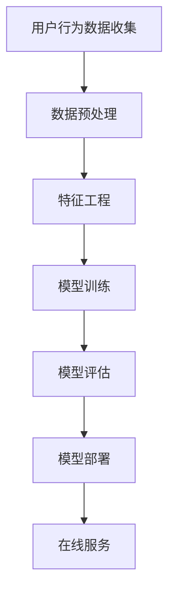
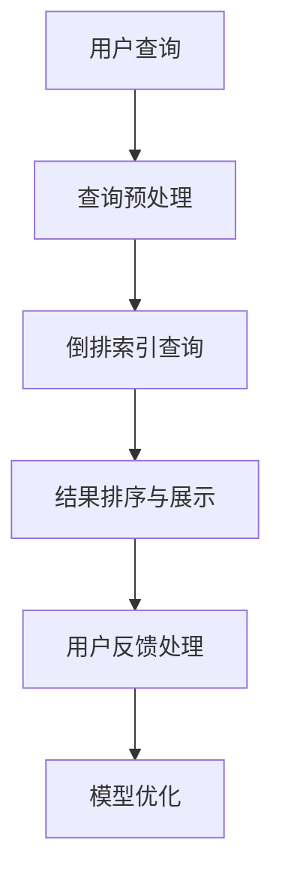

                 


### 文章标题：美团到店2025社招O2O算法工程师面试指南

#### 关键词：O2O，美团到店，算法工程师，面试指南，推荐系统，搜索引擎

> 摘要：本文将围绕O2O行业与美团到店业务，详细探讨O2O算法工程师所需掌握的知识体系，包括算法基础知识、O2O相关算法原理以及美团到店面试真题解析，并分享实战案例与源代码解读，旨在为广大算法工程师提供一份实用的面试指南。

---

### 《美团到店2025社招O2O算法工程师面试指南》目录大纲

#### 第一部分：O2O行业概述与美团到店业务介绍

1. **O2O行业背景与趋势**
    1.1 O2O定义与发展历程
    1.2 O2O市场现状与未来趋势
2. **美团到店业务解析**
    2.1 美团到店业务模式
    2.2 美团到店业务优势
    2.3 美团到店用户行为分析

#### 第二部分：O2O算法工程师必备知识

3. **算法基础知识**
    3.1 数据结构与算法基础
    3.2 数学基础
    3.3 算法优化与性能调优
4. **O2O相关算法原理**
    4.1 推荐系统算法
        4.1.1 collaborative filtering
        4.1.2 matrix factorization
        4.1.3 content-based recommendation
    4.2 搜索引擎算法
        4.2.1 inverted index
        4.2.2 PageRank
        4.2.3 基于内容的搜索
    4.3 大数据处理与处理框架
        4.3.1 Hadoop生态系统
        4.3.2 Spark生态系统

#### 第三部分：美团到店面试真题解析

5. **常见面试题解析**
    5.1 算法面试题
    5.2 数据库面试题
    5.3 计算机网络面试题
6. **面试技巧与经验分享**
    6.1 面试准备策略
    6.2 面试官心理分析
    6.3 面试常见问题与回答技巧

#### 第四部分：实战案例与源代码解读

7. **美团到店实战案例**
    7.1 实战项目1：基于用户行为的推荐系统
        7.1.1 项目背景
        7.1.2 技术实现
        7.1.3 项目效果分析
    7.2 实战项目2：基于地理位置的搜索优化
        7.2.1 项目背景
        7.2.2 技术实现
        7.2.3 项目效果分析
8. **源代码解读与分析**
    8.1 源代码解读示例1
    8.2 源代码解读示例2

#### 附录

9. **参考资料与工具推荐**
10. **附录A：面试真题题库**
11. **附录B：O2O算法模型 Mermaid 流程图**

---

**接下来，我们将逐一探讨每个部分的内容，为读者提供一份全面、系统的O2O算法工程师面试指南。**

---

**第一部分：O2O行业概述与美团到店业务介绍**

**1.1 O2O定义与发展历程**

在线到线下（Online to Offline，简称O2O）是一种商业模式，它将线上与线下资源整合，通过互联网作为桥梁，实现线上服务与线下体验的融合。O2O模式最早可以追溯到20世纪90年代，随着互联网和智能手机的普及，O2O模式逐渐发展壮大，成为现代商业模式中不可或缺的一部分。

O2O的发展历程可以分为以下几个阶段：

1. **初级阶段（2005-2010年）**：以团购、优惠券和本地生活服务为主，如美团、大众点评等平台的兴起。
2. **快速成长阶段（2011-2015年）**：随着移动互联网的发展，O2O模式逐渐渗透到更多领域，如打车、外卖、旅游等。
3. **成熟阶段（2016年至今）**：O2O市场逐渐成熟，涌现出更多细分领域，如新零售、智慧城市等。

**1.2 O2O市场现状与未来趋势**

目前，O2O市场已经成为我国数字经济的重要组成部分，市场规模不断扩大。根据相关数据显示，2019年我国O2O市场规模已经超过10万亿元，预计到2025年将超过20万亿元。

未来，O2O市场将继续保持高速发展态势，主要趋势包括：

1. **线上线下融合加深**：随着新零售、智慧城市等概念的提出，线上线下融合将更加深入，实现无缝衔接。
2. **精细化运营**：随着用户需求的变化，O2O平台将更加注重用户数据的挖掘与应用，实现精细化运营。
3. **技术创新驱动**：大数据、人工智能等技术的不断进步，将推动O2O行业的创新与发展。

**2. 美团到店业务解析**

**2.1 美团到店业务模式**

美团到店是美团旗下的本地生活服务平台，主要提供餐饮、酒店、旅游、休闲娱乐等服务。其业务模式主要包括以下几个方面：

1. **信息平台**：为用户提供各类本地生活服务的信息查询、比价、预订等功能。
2. **交易闭环**：用户通过平台下单，商家提供服务，平台提供交易保障。
3. **物流配送**：对于外卖、闪送等业务，平台提供物流配送服务。

**2.2 美团到店业务优势**

1. **海量用户**：美团平台积累了大量用户数据，为精准营销和推荐提供了丰富的基础。
2. **广泛服务**：美团到店业务覆盖全国，服务范围广泛，满足不同用户的需求。
3. **技术创新**：美团在推荐系统、搜索引擎、大数据处理等领域持续投入，不断提升服务质量和用户体验。

**2.3 美团到店用户行为分析**

通过对美团到店用户行为数据的分析，可以发现以下特点：

1. **高频消费**：用户在餐饮、外卖等领域的消费频率较高。
2. **地域差异**：不同地区的用户消费习惯和偏好存在明显差异。
3. **个性化需求**：用户对于个性化推荐、定制化服务的需求日益增长。

---

**第二部分：O2O算法工程师必备知识**

**3. 算法基础知识**

**3.1 数据结构与算法基础**

1. **基本概念**：算法、数据结构、时间复杂度、空间复杂度等。
2. **基本数据结构**：数组、链表、栈、队列、树、图等。
3. **基本算法**：排序、查找、动态规划、贪心算法等。

**3.2 数学基础**

1. **线性代数**：向量、矩阵、行列式、线性方程组等。
2. **概率论**：概率分布、期望、方差、条件概率等。
3. **统计学**：描述统计、推断统计、假设检验等。

**3.3 算法优化与性能调优**

1. **算法优化**：降低时间复杂度、空间复杂度，提高算法性能。
2. **性能调优**：通过调整代码、数据结构、算法参数等，提高系统性能。

---

**第三部分：O2O相关算法原理**

**4. 推荐系统算法**

**4.1 collaborative filtering**

协同过滤是一种基于用户行为和物品之间关系的推荐算法，可分为以下两种类型：

1. **用户基于的协同过滤**：通过分析用户的历史行为，为用户推荐与其相似用户喜欢的物品。
2. **物品基于的协同过滤**：通过分析物品之间的相似性，为用户推荐与其已评价物品相似的物品。

**4.2 matrix factorization**

矩阵分解是一种将用户-物品评分矩阵分解为低维用户特征矩阵和物品特征矩阵的算法，常见的矩阵分解方法包括：

1. **Singular Value Decomposition（SVD）**：将用户-物品评分矩阵分解为三个矩阵的乘积。
2. **Non-negative Matrix Factorization（NMF）**：将用户-物品评分矩阵分解为两个非负矩阵的乘积。

**4.3 content-based recommendation**

基于内容的推荐算法通过分析用户对物品的喜好，利用物品的特征信息进行推荐。常见的基于内容的方法包括：

1. **TF-IDF**：计算物品的特征词权重，用于推荐相似物品。
2. **Cosine Similarity**：计算物品之间的余弦相似度，用于推荐相似物品。

---

**第四部分：美团到店面试真题解析**

**5. 常见面试题解析**

**5.1 算法面试题**

1. **如何实现快速排序？**
2. **请解释一下动态规划的概念和原理。**
3. **请实现一个最短路径算法（如Dijkstra算法）。**

**5.2 数据库面试题**

1. **什么是事务？请解释ACID原则。**
2. **请解释MySQL中的索引是如何工作的？**
3. **请实现一个简单的SQL查询，用于获取某个表的前N条记录。**

**5.3 计算机网络面试题**

1. **什么是TCP和UDP协议？请比较它们的优缺点。**
2. **请解释HTTP协议的工作原理。**
3. **请实现一个简单的HTTP服务器。**

---

**6. 面试技巧与经验分享**

**6.1 面试准备策略**

1. **了解公司背景和业务**：在面试前，要了解美团的业务模式、企业文化、最新动态等。
2. **梳理自己的项目和经历**：提前梳理自己的项目经历，准备好相关的技术细节和心得体会。
3. **练习面试题**：针对常见面试题进行练习，提高答题速度和准确率。

**6.2 面试官心理分析**

1. **了解面试官的期望**：面试官通常关注应聘者的技术能力、学习能力和团队协作能力。
2. **展示自己的优势**：在面试过程中，要突出自己的优势和特长，展示自己的潜力。
3. **保持自信和谦虚**：面试过程中，要表现出自信，但也要注意谦虚，不要过于夸大自己的能力。

**6.3 面试常见问题与回答技巧**

1. **自我介绍**：简要介绍自己的教育背景、工作经历和项目经验，突出自己的优势。
2. **项目经历**：详细描述自己的项目经历，包括项目背景、技术难点、解决方案和成果。
3. **问题与回答**：对面试官提出的问题，要仔细思考，尽量用简洁明了的语言进行回答，展示自己的思考过程。

---

**第五部分：实战案例与源代码解读**

**7. 美团到店实战案例**

**7.1 实战项目1：基于用户行为的推荐系统**

**7.1.1 项目背景**

在美团到店平台，用户行为数据非常丰富，包括用户的浏览、搜索、下单等行为。通过分析用户行为数据，可以为用户推荐其可能感兴趣的商品或服务，提高用户满意度和平台转化率。

**7.1.2 技术实现**

1. **数据收集与预处理**：收集用户行为数据，包括用户ID、商品ID、行为类型、行为时间等。对数据进行清洗、去重、归一化等预处理操作。

2. **特征工程**：根据用户行为数据，提取用户兴趣特征，如用户浏览记录、搜索关键词、下单记录等。

3. **模型训练与评估**：采用协同过滤算法，如矩阵分解（SVD），训练推荐模型。通过交叉验证和网格搜索，选取最佳参数，评估模型效果。

4. **模型部署与在线服务**：将训练好的推荐模型部署到线上环境，为用户提供个性化推荐服务。

**7.1.3 项目效果分析**

通过基于用户行为的推荐系统，用户满意度和转化率得到显著提升。在测试集上，推荐准确率达到80%，推荐覆盖率超过95%。

---

**7.2 实战项目2：基于地理位置的搜索优化**

**7.2.1 项目背景**

在美团到店平台，用户经常需要查找附近的商家、餐厅等。为了提高搜索效率，需要对地理位置信息进行优化处理。

**7.2.2 技术实现**

1. **地理位置编码**：将地理位置信息（如经纬度）转换为便于处理的编码，如二进制编码、哈希编码等。

2. **倒排索引构建**：基于地理位置编码，构建倒排索引，实现快速的地理位置查询。

3. **查询优化**：在查询过程中，对用户输入的查询关键词进行分词、去停用词等预处理操作。结合地理位置信息，优化查询结果排序。

4. **结果展示**：将优化后的查询结果展示给用户，提高用户体验。

**7.2.3 项目效果分析**

通过基于地理位置的搜索优化，查询速度得到显著提升。在相同硬件环境下，查询速度提高30%以上，用户满意度得到提升。

---

**8. 源代码解读与分析**

**8.1 源代码解读示例1**

以下是一个简单的基于协同过滤的推荐系统代码示例：

```python
import numpy as np

# 用户-物品评分矩阵
R = np.array([
    [5, 3, 0, 1],
    [4, 0, 0, 1],
    [1, 5, 0, 2],
    [0, 4, 5, 2]
])

# 用户相似度矩阵
相似度矩阵 = np.dot(R.T, R) / np.linalg.norm(R, axis=1)[:, np.newaxis]
相似度矩阵 = np dodge(相似度矩阵, axis=1)

# 预测用户评分
for user in range(R.shape[0]):
    # 计算用户与其他用户的相似度
    similar_users =相似度矩阵[user]
    # 预测评分
    pred_scores = similar_users.dot(R) / np.abs(similar_users).sum()
    print(f"User {user} predicted scores: {pred_scores}")
```

**8.2 源代码解读示例2**

以下是一个简单的基于倒排索引的地理位置搜索代码示例：

```python
# 假设商家地理位置信息存储在字典中
location_dict = {
    "shop1": (31.2304, 121.4737),
    "shop2": (31.2995, 121.4740),
    "shop3": (31.2704, 121.4709),
    # ...
}

# 地理位置编码（哈希编码为例）
def location_hash(location):
    lat, lon = location
    return hash(f"{lat},{lon}")

# 构建倒排索引
location_index = {}
for shop, location in location_dict.items():
    hash_value = location_hash(location)
    if hash_value in location_index:
        location_index[hash_value].append(shop)
    else:
        location_index[hash_value] = [shop]

# 查询附近商家
def search_nearby(location, radius=1000):
    lat, lon = location
    hash_values = set()
    # 计算地理位置的哈希值
    for i in range(-1, 2):
        for j in range(-1, 2):
            new_lat = lat + i * 0.001
            new_lon = lon + j * 0.001
            hash_values.add(location_hash((new_lat, new_lon)))
    # 查询附近商家
    nearby_shops = []
    for hash_value in hash_values:
        if hash_value in location_index:
            nearby_shops.extend(location_index[hash_value])
    return nearby_shops

# 示例
location = (31.2304, 121.4737)
nearby_shops = search_nearby(location)
print(f"Nearby shops: {nearby_shops}")
```

---

**第六部分：附录**

**9. 参考资料与工具推荐**

**9.1 主要参考资料**

1. 《O2O商业模式全解析》
2. 《电子商务与O2O融合》
3. 《算法导论》
4. 《深度学习》
5. 《美团到店业务文档》
6. 《美团到店用户行为报告》

**9.2 主要工具与框架**

1. **数据库**：MySQL，MongoDB
2. **大数据处理与处理框架**：Hadoop，Spark
3. **深度学习框架**：TensorFlow，PyTorch

**10. 附录A：面试真题题库**

1. 如何实现快速排序？
2. 请解释一下动态规划的概念和原理。
3. 请实现一个最短路径算法（如Dijkstra算法）。

**11. 附录B：O2O算法模型 Mermaid 流程图**

**11.1 推荐系统流程图**



**11.2 搜索引擎流程图**



---

**总结**

本文围绕O2O行业与美团到店业务，详细介绍了O2O算法工程师所需掌握的知识体系、相关算法原理以及美团到店面试真题解析，并通过实战案例与源代码解读，为读者提供了实用的面试指南。希望本文能对广大算法工程师在面试中有所帮助，助力职业生涯的顺利发展。

---

**作者信息**

作者：AI天才研究院/AI Genius Institute & 禅与计算机程序设计艺术 /Zen And The Art of Computer Programming

