                 

# 文章标题

《2025美团校招编程面试题精选与解答》

> 关键词：美团校招、编程面试、面试题、解答、数据结构、算法、系统设计

> 摘要：本文精选了2025年美团校招编程面试中的高频面试题，涵盖了数据结构与算法、系统设计、操作系统、网络等多个领域。通过对这些面试题的详细解析，读者可以深入了解美团校招编程面试的考点，掌握面试技巧，提高编程能力。

## 第一部分：编程面试基础知识

### 第1章：编程语言基础

#### 1.1 C语言基础

C语言是计算机编程的基础，掌握C语言对于理解和学习其他编程语言具有重要意义。本章将介绍C语言的基本数据类型、变量、运算符、表达式、控制流程、函数和数组。

#### 1.1.1 数据类型和变量

C语言支持多种数据类型，包括整型、浮点型、字符型等。变量是存储数据的基本单位，C语言中的变量分为局部变量和全局变量。

**核心概念与联系：**

- 数据类型：用于定义变量的类型，如整型（int）、浮点型（float）等。
- 变量：用于存储数据，分为局部变量（函数内部）和全局变量（函数外部）。

**Mermaid流程图：**

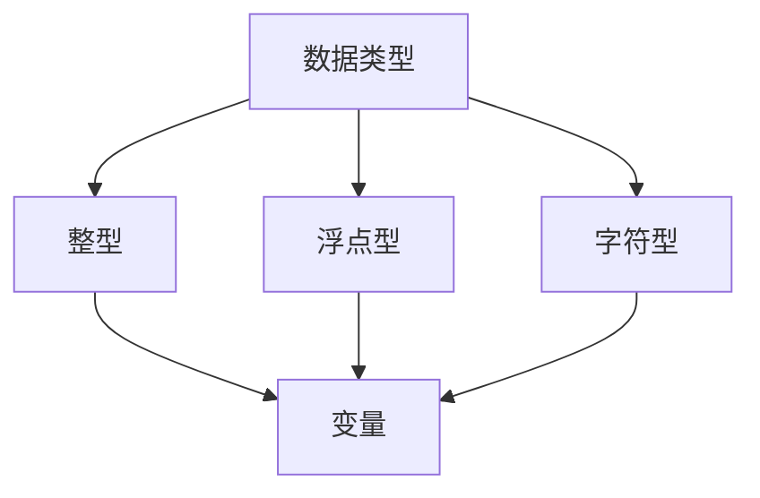

#### 1.1.2 运算符和表达式

C语言提供了丰富的运算符，包括算术运算符、逻辑运算符、位运算符等。表达式是由运算符和变量组成的式子，用于计算和操作数据。

**核心概念与联系：**

- 运算符：用于对变量进行操作，如加法（+）、减法（-）等。
- 表达式：由运算符和变量组成，用于计算和操作数据。

**Mermaid流程图：**

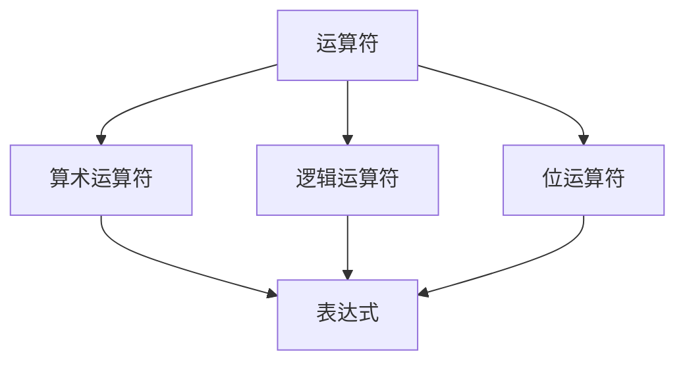

#### 1.1.3 控制流程

控制流程用于指导程序的执行顺序，包括条件语句和循环语句。

**核心概念与联系：**

- 条件语句：用于根据条件选择执行不同的代码段，如if语句、if-else语句等。
- 循环语句：用于重复执行某段代码，如for循环、while循环等。

**Mermaid流程图：**

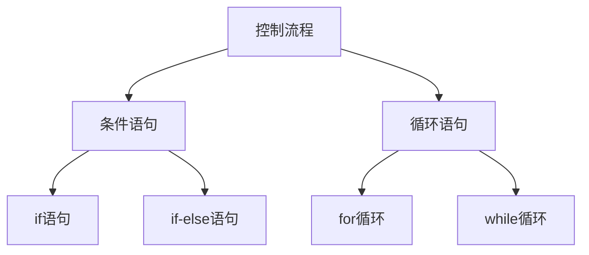

#### 1.1.4 函数和数组

函数是C语言的基本组成部分，用于封装代码块，提高程序的可重用性。数组是一种数据结构，用于存储一系列相同类型的元素。

**核心概念与联系：**

- 函数：用于封装代码块，实现特定的功能。
- 数组：用于存储一系列相同类型的元素。

**Mermaid流程图：**

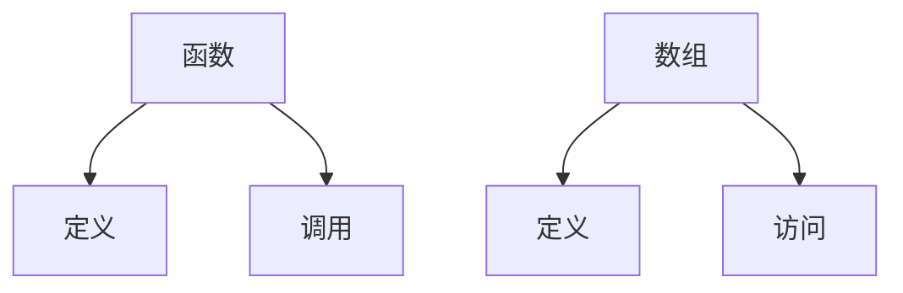

#### 1.2 Java语言基础

Java是一种面向对象的编程语言，具有跨平台、安全性等优点。本章将介绍Java的基本概念、类和对象、面向对象编程、异常处理和集合框架。

#### 1.2.1 类和对象

类是Java语言的基本组成部分，用于封装数据和行为。对象是类的实例，可以通过对象访问类中的成员变量和成员方法。

**核心概念与联系：**

- 类：用于封装数据和行为。
- 对象：类的实例，可以通过对象访问类中的成员变量和成员方法。

**Mermaid流程图：**

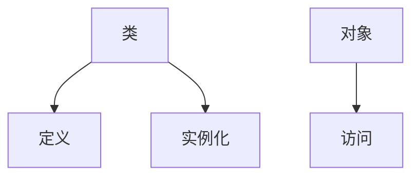

#### 1.2.2 面向对象编程

面向对象编程是一种编程范式，以对象为核心，通过封装、继承、多态等机制提高程序的可维护性和可扩展性。

**核心概念与联系：**

- 封装：将数据和行为封装在一起，提高程序的可维护性。
- 继承：通过继承关系复用代码，提高程序的可扩展性。
- 多态：通过多态性实现方法的动态绑定，提高程序的灵活性。

**Mermaid流程图：**

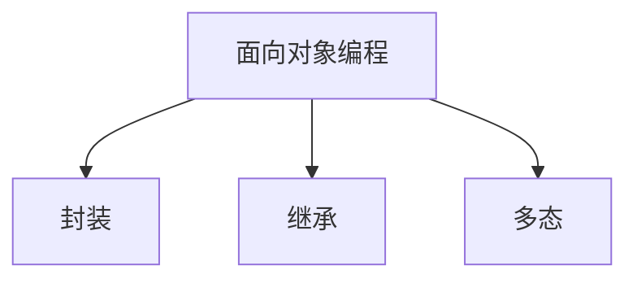

#### 1.2.3 异常处理

异常处理是一种机制，用于处理程序在运行过程中出现的错误和异常情况。

**核心概念与联系：**

- 异常：程序在运行过程中出现的错误和异常情况。
- 异常处理：通过try-catch语句捕获和处理异常。

**Mermaid流程图：**

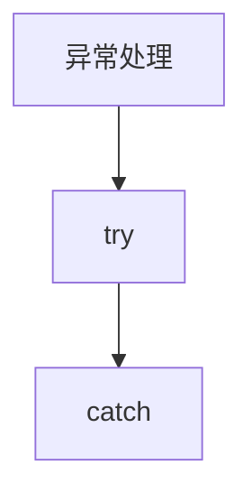

#### 1.2.4 集合框架

Java集合框架是一种用于处理集合数据类型的工具，包括List、Set、Map等接口和实现。

**核心概念与联系：**

- 集合：用于存储一系列相同类型的元素。
- List：有序集合，允许重复元素，包括ArrayList、LinkedList等实现。
- Set：无序集合，不允许重复元素，包括HashSet、TreeSet等实现。
- Map：键值对映射，包括HashMap、TreeMap等实现。

**Mermaid流程图：**

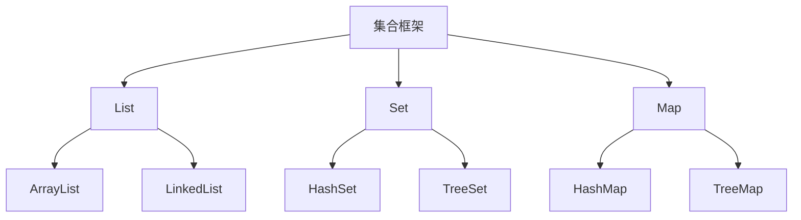

## 第2章：数据结构与算法

### 2.1 基本数据结构

数据结构是计算机科学中的重要概念，用于组织和存储数据。本章将介绍基本数据结构，包括顺序表、链表、栈、队列、树、图等。

#### 2.1.1 顺序表和链表

顺序表是一种基于数组的数据结构，用于存储一系列相同类型的元素。链表是一种基于节点的数据结构，通过指针连接实现。

**核心概念与联系：**

- 顺序表：基于数组实现，支持随机访问，但插入和删除操作较慢。
- 链表：基于节点实现，支持快速插入和删除，但随机访问较慢。

**Mermaid流程图：**

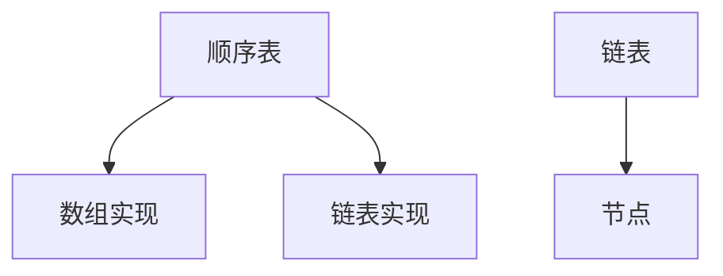

#### 2.1.2 栈和队列

栈是一种后进先出（LIFO）的数据结构，队列是一种先进先出（FIFO）的数据结构。

**核心概念与联系：**

- 栈：后进先出，适用于解决递归、回溯等问题。
- 队列：先进先出，适用于解决排队、缓冲等问题。

**Mermaid流程图：**

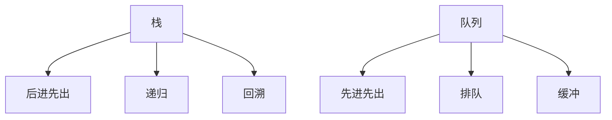

#### 2.1.3 树和二叉树

树是一种多层次的数据结构，用于表示具有层次关系的数据。二叉树是一种特殊的树，每个节点最多有两个子节点。

**核心概念与联系：**

- 树：表示具有层次关系的数据。
- 二叉树：每个节点最多有两个子节点，适用于解决排序、查找等问题。

**Mermaid流程图：**

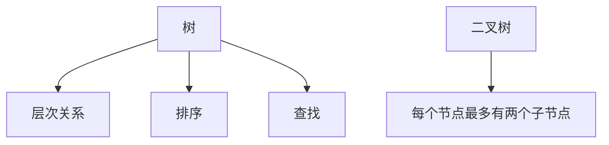

#### 2.1.4 图

图是一种用于表示复杂关系的抽象数据结构，由节点和边组成。

**核心概念与联系：**

- 节点：表示图中的元素。
- 边：表示节点之间的关系。

**Mermaid流程图：**

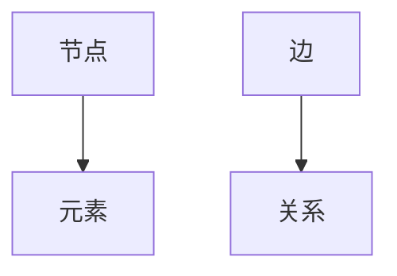

### 2.2 算法基础

算法是解决问题的步骤和方法。本章将介绍排序算法、搜索算法、分治算法和动态规划算法等。

#### 2.2.1 排序算法

排序算法用于将一组元素按照特定顺序排列。常见的排序算法包括冒泡排序、选择排序、插入排序、快速排序等。

**核心概念与联系：**

- 冒泡排序：通过重复遍历待排序列，比较相邻元素并交换，实现排序。
- 选择排序：每次选择未排序部分的最小（或最大）元素，将其放到已排序部分的末尾。
- 插入排序：通过逐步将未排序部分的数据插入到已排序部分的合适位置，实现排序。
- 快速排序：通过一趟排序将待排序列划分为已排序部分和未排序部分，然后递归对未排序部分进行快速排序。

**伪代码：**

```java
// 快速排序
public void quickSort(int[] arr, int low, int high) {
    if (low < high) {
        int pivot = partition(arr, low, high);
        quickSort(arr, low, pivot - 1);
        quickSort(arr, pivot + 1, high);
    }
}

public int partition(int[] arr, int low, int high) {
    int pivot = arr[high];
    int i = low - 1;
    for (int j = low; j < high; j++) {
        if (arr[j] < pivot) {
            i++;
            swap(arr, i, j);
        }
    }
    swap(arr, i + 1, high);
    return i + 1;
}
```

#### 2.2.2 搜索算法

搜索算法用于在数据结构中查找特定元素。常见的搜索算法包括线性搜索、二分搜索等。

**核心概念与联系：**

- 线性搜索：从数据结构的第一个元素开始，逐个比较，直到找到目标元素或结束。
- 二分搜索：在有序数据结构中，通过不断将中间元素与目标元素比较，逐步缩小搜索范围，实现高效查找。

**伪代码：**

```java
// 二分搜索
public int binarySearch(int[] arr, int target) {
    int low = 0;
    int high = arr.length - 1;
    while (low <= high) {
        int mid = (low + high) / 2;
        if (arr[mid] == target) {
            return mid;
        } else if (arr[mid] < target) {
            low = mid + 1;
        } else {
            high = mid - 1;
        }
    }
    return -1;
}
```

#### 2.2.3 分治算法

分治算法将问题划分为较小的子问题，递归解决子问题，然后合并子问题的解，求解原问题。

**核心概念与联系：**

- 分治算法：将问题划分为较小的子问题，递归解决子问题，然后合并子问题的解。

**伪代码：**

```java
// 分治算法
public int divideAndConquer(int[] arr, int low, int high) {
    if (low == high) {
        return arr[low];
    }
    int mid = (low + high) / 2;
    int leftMax = divideAndConquer(arr, low, mid);
    int rightMax = divideAndConquer(arr, mid + 1, high);
    return Math.max(leftMax, rightMax);
}
```

#### 2.2.4 动态规划算法

动态规划算法通过将问题分解为重叠子问题，并利用子问题的解来求解原问题，从而实现优化。

**核心概念与联系：**

- 动态规划：将问题分解为重叠子问题，并利用子问题的解来求解原问题。

**伪代码：**

```java
// 动态规划
public int fibonacci(int n) {
    int[] dp = new int[n + 1];
    dp[0] = 0;
    dp[1] = 1;
    for (int i = 2; i <= n; i++) {
        dp[i] = dp[i - 1] + dp[i - 2];
    }
    return dp[n];
}
```

## 第3章：算法进阶

### 3.1 贪心算法

贪心算法是一种在每一步选择最优解的策略，旨在求解最优化问题。

#### 3.1.1 贪心算法原理

贪心算法通过局部最优解推导全局最优解。每一步选择都是当前状态下最优的选择，最终结果为全局最优解。

**核心概念与联系：**

- 贪心算法：每一步选择都是当前状态下最优的选择。

**伪代码：**

```java
// 贪心算法
public int maxProfit(int[] prices) {
    int maxProfit = 0;
    for (int i = 1; i < prices.length; i++) {
        if (prices[i] > prices[i - 1]) {
            maxProfit += prices[i] - prices[i - 1];
        }
    }
    return maxProfit;
}
```

#### 3.1.2 贪心算法应用实例

贪心算法广泛应用于图论、动态规划、网络流等领域。

- 图论中的应用：最小生成树、最短路径等。
- 动态规划中的应用：背包问题、区间调度问题等。
- 网络流中的应用：最大流、最小费用流等。

### 3.2 背包问题

背包问题是计算机科学中经典的最优化问题之一，主要研究如何将一定数量的物品装入背包，使得背包的总重量不超过限制，同时使物品的总价值最大化。

#### 3.2.1 背包问题原理

背包问题可分为多种类型，如01背包问题、完全背包问题、多重背包问题等。

- 01背包问题：每个物品只能选择一次或不选择。
- 完全背包问题：每个物品可以选择多次或一次不选择。
- 多重背包问题：每个物品可以选择多次，但有限制。

**核心概念与联系：**

- 背包问题：在一定重量限制下，选择若干物品使总价值最大化。
- 01背包问题：每个物品只能选择一次或不选择。
- 完全背包问题：每个物品可以选择多次或一次不选择。
- 多重背包问题：每个物品可以选择多次，但有限制。

**Mermaid流程图：**

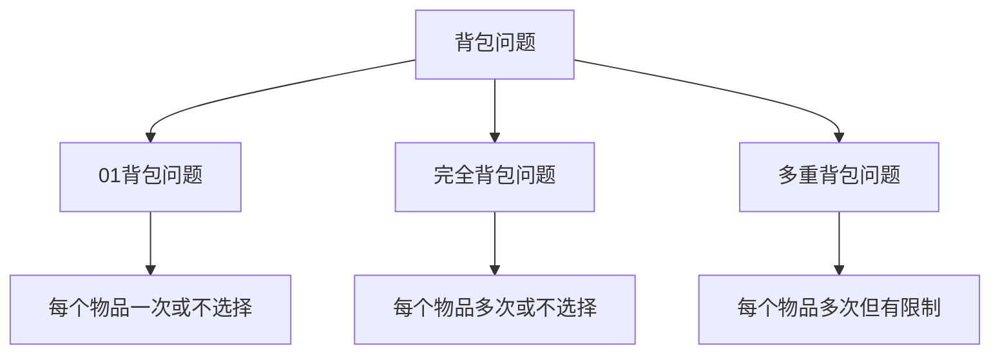

#### 3.2.2 01背包问题解法

01背包问题是最简单的背包问题，可以通过动态规划求解。

**核心概念与联系：**

- 动态规划：通过状态转移方程求解最优解。

**伪代码：**

```java
// 01背包问题
public int knapsack(int[] weights, int[] values, int capacity) {
    int[][] dp = new int[weights.length + 1][capacity + 1];
    for (int i = 1; i <= weights.length; i++) {
        for (int j = 1; j <= capacity; j++) {
            if (weights[i - 1] <= j) {
                dp[i][j] = Math.max(dp[i - 1][j], dp[i - 1][j - weights[i - 1]] + values[i - 1]);
            } else {
                dp[i][j] = dp[i - 1][j];
            }
        }
    }
    return dp[weights.length][capacity];
}
```

#### 3.2.3 完全背包问题解法

完全背包问题可以通过动态规划求解。

**核心概念与联系：**

- 动态规划：通过状态转移方程求解最优解。

**伪代码：**

```java
// 完全背包问题
public int knapsack(int[] weights, int[] values, int capacity) {
    int[][] dp = new int[weights.length + 1][capacity + 1];
    for (int i = 1; i <= weights.length; i++) {
        for (int j = 1; j <= capacity; j++) {
            dp[i][j] = dp[i - 1][j];
            for (int k = 1; k * weights[i - 1] <= j; k++) {
                dp[i][j] = Math.max(dp[i][j], dp[i - 1][j - k * weights[i - 1]] + k * values[i - 1]);
            }
        }
    }
    return dp[weights.length][capacity];
}
```

#### 3.2.4 多重背包问题解法

多重背包问题可以通过动态规划求解。

**核心概念与联系：**

- 动态规划：通过状态转移方程求解最优解。

**伪代码：**

```java
// 多重背包问题
public int knapsack(int[] weights, int[] values, int[] numbers, int capacity) {
    int[][] dp = new int[numbers.length + 1][capacity + 1];
    for (int i = 1; i <= numbers.length; i++) {
        for (int j = 1; j <= capacity; j++) {
            dp[i][j] = dp[i - 1][j];
            for (int k = 1; k <= numbers[i - 1]; k++) {
                if (k * weights[i - 1] <= j) {
                    dp[i][j] = Math.max(dp[i][j], dp[i - 1][j - k * weights[i - 1]] + k * values[i - 1]);
                }
            }
        }
    }
    return dp[numbers.length][capacity];
}
```

## 第4章：系统设计能力

### 4.1 分布式系统基础

分布式系统是由多个节点组成的系统，各节点通过通信协议协同工作，共同完成某个任务。

#### 4.1.1 分布式系统概念

分布式系统具有以下特点：

- 节点自治：各节点独立运行，具有自治性。
- 通信网络：节点通过通信网络进行信息交换。
- 并行计算：多个节点可以同时处理多个任务。
- 一致性：分布式系统需要保持数据一致性。

**核心概念与联系：**

- 分布式系统：由多个节点组成的系统，具有自治性、通信网络、并行计算和一致性等特点。

**Mermaid流程图：**

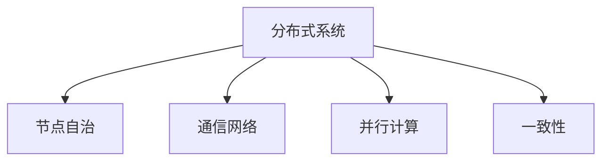

#### 4.1.2 分布式一致性

分布式一致性是指分布式系统中各节点对同一份数据的视图保持一致。

- 强一致性：分布式系统中所有节点在同一时间看到相同的数据。
- 最终一致性：分布式系统中所有节点最终看到相同的数据，但可能存在短暂的视图不一致。

**核心概念与联系：**

- 强一致性：所有节点在同一时间看到相同的数据。
- 最终一致性：所有节点最终看到相同的数据。

**Mermaid流程图：**

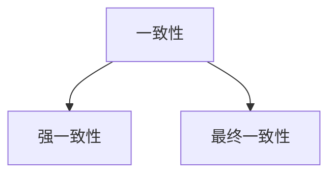

#### 4.1.3 分布式事务

分布式事务是指涉及多个节点的数据库操作，需要保证所有操作要么全部成功，要么全部失败。

- 两阶段提交（2PC）：分布式事务处理协议，分为预备阶段和提交阶段。
- 三阶段提交（3PC）：改进的两阶段提交协议，增加预提交阶段。

**核心概念与联系：**

- 两阶段提交：预备阶段和提交阶段。
- 三阶段提交：预备阶段、预提交阶段和提交阶段。

**Mermaid流程图：**

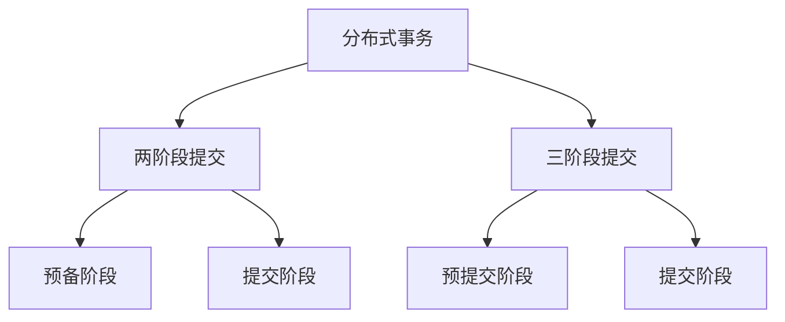

### 4.2 缓存系统设计

缓存系统是分布式系统中的重要组件，用于提高数据访问速度，降低数据库负载。

#### 4.2.1 缓存概念和作用

缓存是一种临时存储数据的技术，用于提高数据访问速度。

**核心概念与联系：**

- 缓存：临时存储数据，提高数据访问速度。

**Mermaid流程图：**

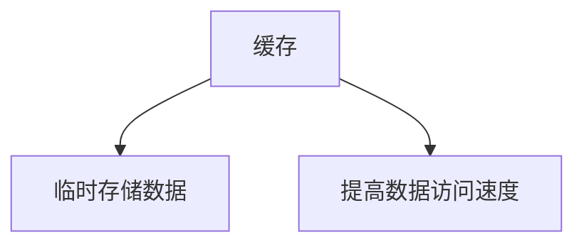

#### 4.2.2 缓存一致性

缓存一致性是指分布式系统中各节点的缓存数据保持一致。

- 强缓存一致性：所有节点的缓存数据在同一时间保持一致。
- 最终缓存一致性：所有节点的缓存数据最终保持一致，但可能存在短暂的视图不一致。

**核心概念与联系：**

- 强缓存一致性：所有节点的缓存数据在同一时间保持一致。
- 最终缓存一致性：所有节点的缓存数据最终保持一致。

**Mermaid流程图：**

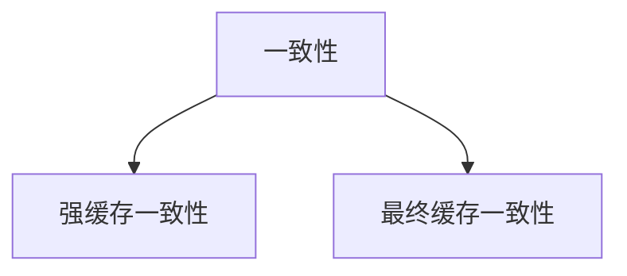

#### 4.2.3 缓存淘汰算法

缓存淘汰算法用于确定哪些数据应该被淘汰出缓存，常见的淘汰算法包括：

- LRU（Least Recently Used）：最近最少使用算法，淘汰最久未使用的缓存数据。
- LFU（Least Frequently Used）：最少使用次数算法，淘汰使用次数最少的缓存数据。
- FIFO（First In First Out）：先进先出算法，淘汰最先进入缓存的数据。

**核心概念与联系：**

- LRU：淘汰最久未使用的缓存数据。
- LFU：淘汰使用次数最少的缓存数据。
- FIFO：淘汰最先进入缓存的数据。

**Mermaid流程图：**

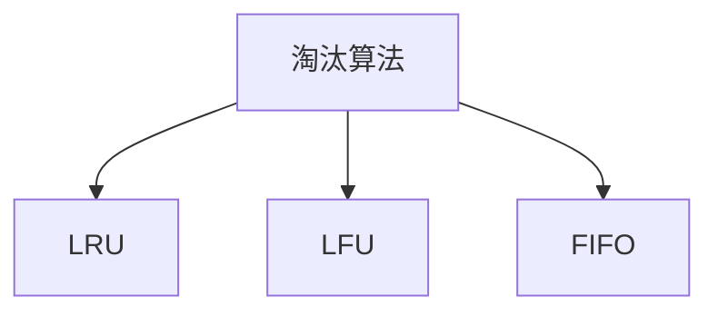

### 4.3 负载均衡策略

负载均衡是将请求分配到多个服务器，实现流量均衡和资源优化。

#### 4.3.1 负载均衡概念

负载均衡的目标是提高系统的吞吐量和稳定性。

**核心概念与联系：**

- 负载均衡：将请求分配到多个服务器，实现流量均衡和资源优化。

**Mermaid流程图：**

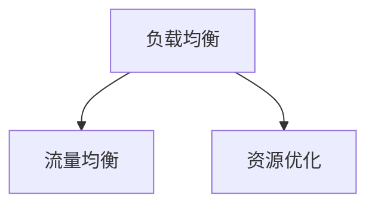

#### 4.3.2 常见负载均衡算法

常见的负载均衡算法包括轮询、随机、最小连接数等。

- 轮询：按照顺序将请求分配到各个服务器。
- 随机：随机将请求分配到各个服务器。
- 最小连接数：将请求分配到当前连接数最少的服务器。

**核心概念与联系：**

- 轮询：按照顺序分配请求。
- 随机：随机分配请求。
- 最小连接数：分配到当前连接数最少的服务器。

**Mermaid流程图：**

```mermaid
graph TD
A[负载均衡算法] --> B[轮询]
A --> C[随机]
A --> D[最小连接数]
```

#### 4.3.3 负载均衡实践

负载均衡实践包括负载均衡器的配置、监控和优化。

**核心概念与联系：**

- 负载均衡器：用于实现负载均衡的设备或软件。
- 监控：实时监控系统性能，分析负载均衡效果。
- 优化：根据监控数据调整负载均衡策略，提高系统性能。

**Mermaid流程图：**

```mermaid
graph TD
A[负载均衡实践] --> B[负载均衡器配置]
A --> C[监控]
A --> D[优化]
```

## 第5章：数据库原理与应用

### 5.1 关系型数据库

关系型数据库是一种基于表格结构存储数据的方法，通过SQL进行数据查询和管理。

#### 5.1.1 SQL基础

SQL（Structured Query Language）是一种用于数据库查询、操作和管理的数据语言。

**核心概念与联系：**

- SQL：用于数据库查询、操作和管理的语言。

**Mermaid流程图：**

```mermaid
graph TD
A[SQL] --> B[查询]
A --> C[操作]
A --> D[管理]
```

#### 5.1.2 数据库设计

数据库设计是指设计数据库的结构，包括表、字段、索引等。

**核心概念与联系：**

- 数据库设计：设计数据库的结构。

**Mermaid流程图：**

```mermaid
graph TD
A[数据库设计] --> B[表设计]
A --> C[字段设计]
A --> D[索引设计]
```

#### 5.1.3 索引和优化

索引是一种提高数据查询效率的技术，通过创建索引可以加快数据查询速度。

**核心概念与联系：**

- 索引：提高数据查询效率。

**Mermaid流程图：**

```mermaid
graph TD
A[索引] --> B[查询优化]
A --> C[更新优化]
```

### 5.2 非关系型数据库

非关系型数据库是一种不基于表格结构存储数据的方法，具有高扩展性和灵活性。

#### 5.2.1 NoSQL概述

NoSQL（Not Only SQL）是一种非关系型数据库的统称，包括多种数据存储模型，如键值存储、文档存储、列存储等。

**核心概念与联系：**

- NoSQL：非关系型数据库的统称。

**Mermaid流程图：**

```mermaid
graph TD
A[NoSQL] --> B[键值存储]
A --> C[文档存储]
A --> D[列存储]
```

#### 5.2.2 MongoDB应用

MongoDB是一种流行的NoSQL数据库，采用文档存储模型。

**核心概念与联系：**

- MongoDB：文档存储模型的NoSQL数据库。

**Mermaid流程图：**

```mermaid
graph TD
A[MongoDB] --> B[文档存储]
A --> C[高扩展性]
A --> D[灵活性]
```

#### 5.2.3 Redis应用

Redis是一种流行的开源NoSQL数据库，采用键值存储模型。

**核心概念与联系：**

- Redis：键值存储模型的NoSQL数据库。

**Mermaid流程图：**

```mermaid
graph TD
A[Redis] --> B[键值存储]
A --> C[高性能]
A --> D[实时性]
```

## 第6章：操作系统原理

### 6.1 进程管理

进程管理是操作系统中核心的功能之一，包括进程的创建、调度、同步、终止等。

#### 6.1.1 进程概念

进程是计算机中正在运行的程序实例，具有独立的地址空间、资源集合和执行状态。

**核心概念与联系：**

- 进程：正在运行的程序实例。

**Mermaid流程图：**

```mermaid
graph TD
A[进程] --> B[地址空间]
A --> C[资源集合]
A --> D[执行状态]
```

#### 6.1.2 进程调度

进程调度是指操作系统按照某种策略将CPU时间分配给各个进程。

**核心概念与联系：**

- 进程调度：按照策略分配CPU时间。

**Mermaid流程图：**

```mermaid
graph TD
A[进程调度] --> B[时间片轮转]
A --> C[优先级调度]
A --> D[多级反馈队列]
```

#### 6.1.3 进程同步

进程同步是指多个进程在共享资源时保持协调和一致。

**核心概念与联系：**

- 进程同步：共享资源时的协调和一致。

**Mermaid流程图：**

```mermaid
graph TD
A[进程同步] --> B[互斥锁]
A --> C[条件变量]
A --> D[信号量]
```

### 6.2 内存管理

内存管理是操作系统的重要组成部分，负责管理计算机的内存资源。

#### 6.2.1 内存分配

内存分配是指操作系统将内存空间分配给进程。

**核心概念与联系：**

- 内存分配：将内存空间分配给进程。

**Mermaid流程图：**

```mermaid
graph TD
A[内存分配] --> B[静态分配]
A --> C[动态分配]
```

#### 6.2.2 内存保护

内存保护是指操作系统对内存访问权限进行控制。

**核心概念与联系：**

- 内存保护：控制内存访问权限。

**Mermaid流程图：**

```mermaid
graph TD
A[内存保护] --> B[访问控制]
A --> C[内存隔离]
```

#### 6.2.3 页面置换算法

页面置换算法是指操作系统根据某种策略替换内存中的页面。

**核心概念与联系：**

- 页面置换算法：根据策略替换内存中的页面。

**Mermaid流程图：**

```mermaid
graph TD
A[页面置换算法] --> B[先进先出（FIFO）]
A --> C[最近最少使用（LRU）]
A --> D[随机替换（Random）]
```

### 6.3 文件系统

文件系统是操作系统中用于管理和存储文件的数据结构。

#### 6.3.1 文件系统概念

文件系统是操作系统用于管理和存储文件的体系结构。

**核心概念与联系：**

- 文件系统：用于管理和存储文件的体系结构。

**Mermaid流程图：**

```mermaid
graph TD
A[文件系统] --> B[文件管理]
A --> C[文件存储]
A --> D[目录结构]
```

#### 6.3.2 文件管理

文件管理是指操作系统对文件进行创建、删除、读写等操作。

**核心概念与联系：**

- 文件管理：对文件进行创建、删除、读写等操作。

**Mermaid流程图：**

```mermaid
graph TD
A[文件管理] --> B[文件创建]
A --> C[文件删除]
A --> D[文件读写]
```

#### 6.3.3 文件系统优化

文件系统优化是指通过调整文件系统参数和策略，提高文件系统性能。

**核心概念与联系：**

- 文件系统优化：提高文件系统性能。

**Mermaid流程图：**

```mermaid
graph TD
A[文件系统优化] --> B[缓存优化]
A --> C[碎片整理]
A --> D[文件系统监控]
```

## 第7章：网络基础

### 7.1 网络协议

网络协议是计算机网络中用于数据传输和通信的标准和规范。

#### 7.1.1 TCP/IP模型

TCP/IP模型是一种网络协议分层模型，包括应用层、传输层、网络层和链路层。

**核心概念与联系：**

- TCP/IP模型：网络协议分层模型。

**Mermaid流程图：**

```mermaid
graph TD
A[TCP/IP模型] --> B[应用层]
A --> C[传输层]
A --> D[网络层]
A --> E[链路层]
```

#### 7.1.2 HTTP协议

HTTP协议（HyperText Transfer Protocol）是一种用于Web应用的请求-响应协议。

**核心概念与联系：**

- HTTP协议：请求-响应协议。

**Mermaid流程图：**

```mermaid
graph TD
A[HTTP协议] --> B[请求]
A --> C[响应]
```

#### 7.1.3 HTTPS协议

HTTPS协议（HyperText Transfer Protocol Secure）是一种基于SSL/TLS加密的HTTP协议。

**核心概念与联系：**

- HTTPS协议：基于SSL/TLS加密的HTTP协议。

**Mermaid流程图：**

```mermaid
graph TD
A[HTTPS协议] --> B[SSL/TLS加密]
A --> C[HTTP协议]
```

### 7.2 网络安全

网络安全是指保护网络系统和数据不受未授权访问、篡改和破坏的措施。

#### 7.2.1 网络安全基本概念

网络安全包括多种技术和措施，如加密技术、认证技术、访问控制等。

**核心概念与联系：**

- 网络安全：保护网络系统和数据不受未授权访问、篡改和破坏。

**Mermaid流程图：**

```mermaid
graph TD
A[网络安全] --> B[加密技术]
A --> C[认证技术]
A --> D[访问控制]
```

#### 7.2.2 加密技术

加密技术用于保护数据的机密性和完整性。

**核心概念与联系：**

- 加密技术：保护数据的机密性和完整性。

**Mermaid流程图：**

```mermaid
graph TD
A[加密技术] --> B[对称加密]
A --> C[非对称加密]
```

#### 7.2.3 安全协议

安全协议是用于网络通信的安全机制，如SSL/TLS、IPSec等。

**核心概念与联系：**

- 安全协议：用于网络通信的安全机制。

**Mermaid流程图：**

```mermaid
graph TD
A[安全协议] --> B[SSL/TLS]
A --> C[IPSec]
```

## 第二部分：美团校招编程面试题精选与解答

### 第8章：数据结构与算法面试题

#### 8.1 链表问题

链表是一种常见的数据结构，用于存储一系列相同类型的元素。

#### 8.1.1 反转链表

反转链表是指将链表中的节点按照相反的顺序排列。

**核心概念与联系：**

- 反转链表：将链表中的节点按照相反的顺序排列。

**Mermaid流程图：**

```mermaid
graph TD
A[反转链表] --> B[遍历链表]
A --> C[修改节点指针]
```

**伪代码：**

```java
public ListNode reverseList(ListNode head) {
    ListNode prev = null;
    ListNode curr = head;
    while (curr != null) {
        ListNode nextTemp = curr.next;
        curr.next = prev;
        prev = curr;
        curr = nextTemp;
    }
    return prev;
}
```

#### 8.1.2 合并两个有序链表

合并两个有序链表是指将两个有序链表合并为一个有序链表。

**核心概念与联系：**

- 合并两个有序链表：将两个有序链表合并为一个有序链表。

**Mermaid流程图：**

```mermaid
graph TD
A[合并两个有序链表] --> B[遍历链表]
A --> C[比较节点值]
A --> D[合并节点]
```

**伪代码：**

```java
public ListNode mergeTwoLists(ListNode l1, ListNode l2) {
    if (l1 == null) return l2;
    if (l2 == null) return l1;
    ListNode dummy = new ListNode(0);
    ListNode curr = dummy;
    while (l1 != null && l2 != null) {
        if (l1.val <= l2.val) {
            curr.next = l1;
            l1 = l1.next;
        } else {
            curr.next = l2;
            l2 = l2.next;
        }
        curr = curr.next;
    }
    curr.next = (l1 != null) ? l1 : l2;
    return dummy.next;
}
```

#### 8.1.3 环形链表

环形链表是一种特殊类型的链表，其最后一个节点的指针指向链表中的某个节点。

**核心概念与联系：**

- 环形链表：最后一个节点的指针指向链表中的某个节点。

**Mermaid流程图：**

```mermaid
graph TD
A[环形链表] --> B[链表节点]
A --> C[循环指针]
```

**伪代码：**

```java
public boolean hasCycle(ListNode head) {
    ListNode slow = head;
    ListNode fast = head;
    while (fast != null && fast.next != null) {
        slow = slow.next;
        fast = fast.next.next;
        if (slow == fast) {
            return true;
        }
    }
    return false;
}
```

### 8.2 树与图问题

树和图是计算机科学中重要的数据结构，用于表示具有层次关系或复杂关系的数据。

#### 8.2.1 二叉树的遍历

二叉树的遍历是指遍历二叉树中的所有节点。

**核心概念与联系：**

- 二叉树的遍历：遍历二叉树中的所有节点。

**Mermaid流程图：**

```mermaid
graph TD
A[二叉树遍历] --> B[前序遍历]
A --> C[中序遍历]
A --> D[后序遍历]
```

**伪代码：**

```java
// 前序遍历
public void preorderTraversal(TreeNode root) {
    if (root != null) {
        System.out.print(root.val + " ");
        preorderTraversal(root.left);
        preorderTraversal(root.right);
    }
}

// 中序遍历
public void inorderTraversal(TreeNode root) {
    if (root != null) {
        inorderTraversal(root.left);
        System.out.print(root.val + " ");
        inorderTraversal(root.right);
    }
}

// 后序遍历
public void postorderTraversal(TreeNode root) {
    if (root != null) {
        postorderTraversal(root.left);
        postorderTraversal(root.right);
        System.out.print(root.val + " ");
    }
}
```

#### 8.2.2 图的遍历

图的遍历是指遍历图中的所有节点。

**核心概念与联系：**

- 图的遍历：遍历图中的所有节点。

**Mermaid流程图：**

```mermaid
graph TD
A[图遍历] --> B[深度优先搜索（DFS）]
A --> C[广度优先搜索（BFS）]
```

**伪代码：**

```java
// 深度优先搜索
public void dfs(int[][] graph, boolean[] visited, int node) {
    if (visited[node]) {
        return;
    }
    visited[node] = true;
    for (int neighbor : graph[node]) {
        dfs(graph, visited, neighbor);
    }
}

// 广度优先搜索
public void bfs(int[][] graph, int start) {
    boolean[] visited = new boolean[graph.length];
    Queue<Integer> queue = new LinkedList<>();
    queue.offer(start);
    visited[start] = true;
    while (!queue.isEmpty()) {
        int node = queue.poll();
        System.out.print(node + " ");
        for (int neighbor : graph[node]) {
            if (!visited[neighbor]) {
                queue.offer(neighbor);
                visited[neighbor] = true;
            }
        }
    }
}
```

#### 8.2.3 最短路径算法

最短路径算法是指求解图中两点之间的最短路径。

**核心概念与联系：**

- 最短路径算法：求解图中两点之间的最短路径。

**Mermaid流程图：**

```mermaid
graph TD
A[最短路径算法] --> B[Dijkstra算法]
A --> C[Bellman-Ford算法]
A --> D[Floyd-Warshall算法]
```

**伪代码：**

```java
// Dijkstra算法
public int[] dijkstra(int[][] graph, int start) {
    int n = graph.length;
    int[] dist = new int[n];
    Arrays.fill(dist, Integer.MAX_VALUE);
    dist[start] = 0;
    PriorityQueue<int[]> pq = new PriorityQueue<>(Comparator.comparingInt(a -> a[1]));
    pq.offer(new int[]{start, 0});
    while (!pq.isEmpty()) {
        int[] curr = pq.poll();
        int node = curr[0];
        int distance = curr[1];
        if (distance != dist[node]) {
            continue;
        }
        for (int neighbor : graph[node]) {
            int nextNode = neighbor[0];
            int nextDistance = neighbor[1] + distance;
            if (nextDistance < dist[nextNode]) {
                dist[nextNode] = nextDistance;
                pq.offer(new int[]{nextNode, nextDistance});
            }
        }
    }
    return dist;
}

// Bellman-Ford算法
public int[] bellmanFord(int[][] graph, int start) {
    int n = graph.length;
    int[] dist = new int[n];
    Arrays.fill(dist, Integer.MAX_VALUE);
    dist[start] = 0;
    for (int i = 0; i < n - 1; i++) {
        for (int[] edge : graph) {
            int u = edge[0];
            int v = edge[1];
            int weight = edge[2];
            if (dist[u] != Integer.MAX_VALUE && dist[u] + weight < dist[v]) {
                dist[v] = dist[u] + weight;
            }
        }
    }
    return dist;
}

// Floyd-Warshall算法
public int[][] floydWarshall(int[][] graph) {
    int n = graph.length;
    int[][] dist = new int[n][n];
    for (int i = 0; i < n; i++) {
        for (int j = 0; j < n; j++) {
            dist[i][j] = graph[i][j];
        }
    }
    for (int k = 0; k < n; k++) {
        for (int i = 0; i < n; i++) {
            for (int j = 0; j < n; j++) {
                if (dist[i][k] != Integer.MAX_VALUE && dist[k][j] != Integer.MAX_VALUE && dist[i][k] + dist[k][j] < dist[i][j]) {
                    dist[i][j] = dist[i][k] + dist[k][j];
                }
            }
        }
    }
    return dist;
}
```

### 8.3 排序与查找问题

排序与查找是计算机科学中常见的操作，用于对数据进行排序和查找。

#### 8.3.1 快速排序

快速排序是一种高效的排序算法，采用分治策略。

**核心概念与联系：**

- 快速排序：采用分治策略的高效排序算法。

**Mermaid流程图：**

```mermaid
graph TD
A[快速排序] --> B[分治策略]
A --> C[递归排序]
```

**伪代码：**

```java
public void quickSort(int[] arr, int low, int high) {
    if (low < high) {
        int pivot = partition(arr, low, high);
        quickSort(arr, low, pivot - 1);
        quickSort(arr, pivot + 1, high);
    }
}

public int partition(int[] arr, int low, int high) {
    int pivot = arr[high];
    int i = low;
    for (int j = low; j < high; j++) {
        if (arr[j] < pivot) {
            swap(arr, i, j);
            i++;
        }
    }
    swap(arr, i, high);
    return i;
}
```

#### 8.3.2 二分查找

二分查找是一种高效的查找算法，适用于有序数组。

**核心概念与联系：**

- 二分查找：适用于有序数组的高效查找算法。

**Mermaid流程图：**

```mermaid
graph TD
A[二分查找] --> B[有序数组]
A --> C[递归查找]
```

**伪代码：**

```java
public int binarySearch(int[] arr, int target) {
    int low = 0;
    int high = arr.length - 1;
    while (low <= high) {
        int mid = (low + high) / 2;
        if (arr[mid] == target) {
            return mid;
        } else if (arr[mid] < target) {
            low = mid + 1;
        } else {
            high = mid - 1;
        }
    }
    return -1;
}
```

#### 8.3.3 堆排序

堆排序是一种基于堆数据结构的高效排序算法。

**核心概念与联系：**

- 堆排序：基于堆数据结构的高效排序算法。

**Mermaid流程图：**

```mermaid
graph TD
A[堆排序] --> B[堆数据结构]
A --> C[构建堆]
A --> D[排序]
```

**伪代码：**

```java
public void heapify(int[] arr, int n, int i) {
    int largest = i;
    int left = 2 * i + 1;
    int right = 2 * i + 2;
    if (left < n && arr[left] > arr[largest]) {
        largest = left;
    }
    if (right < n && arr[right] > arr[largest]) {
        largest = right;
    }
    if (largest != i) {
        swap(arr, i, largest);
        heapify(arr, n, largest);
    }
}

public void heapSort(int[] arr) {
    int n = arr.length;
    for (int i = n / 2 - 1; i >= 0; i--) {
        heapify(arr, n, i);
    }
    for (int i = n - 1; i > 0; i--) {
        swap(arr, 0, i);
        heapify(arr, i, 0);
    }
}
```

### 第9章：系统设计与架构面试题

#### 9.1 分布式系统设计

分布式系统设计是系统设计中的重要方面，包括负载均衡、分布式锁、分布式事务等。

#### 9.1.1 负载均衡

负载均衡是将请求分配到多个服务器，实现流量均衡和资源优化。

**核心概念与联系：**

- 负载均衡：实现流量均衡和资源优化。

**Mermaid流程图：**

```mermaid
graph TD
A[负载均衡] --> B[流量均衡]
A --> C[资源优化]
```

**伪代码：**

```java
public int loadBalance(int[] servers, int request) {
    int minLoad = Integer.MAX_VALUE;
    int minLoadServer = -1;
    for (int i = 0; i < servers.length; i++) {
        if (servers[i] < minLoad) {
            minLoad = servers[i];
            minLoadServer = i;
        }
    }
    servers[minLoadServer]++;
    return minLoadServer;
}
```

#### 9.1.2 分布式锁

分布式锁是用于在分布式系统中保证数据一致性的锁机制。

**核心概念与联系：**

- 分布式锁：保证数据一致性。

**Mermaid流程图：**

```mermaid
graph TD
A[分布式锁] --> B[数据一致性]
```

**伪代码：**

```java
public boolean distributedLock(String lockKey) {
    // 尝试获取锁
    if (tryLock(lockKey)) {
        // 成功获取锁，执行业务逻辑
        doBusiness();
        // 释放锁
        unlock(lockKey);
        return true;
    }
    return false;
}

public boolean tryLock(String lockKey) {
    // 尝试获取锁，成功返回true，失败返回false
    // 实现逻辑根据具体锁实现而定
}

public void unlock(String lockKey) {
    // 释放锁
    // 实现逻辑根据具体锁实现而定
}

public void doBusiness() {
    // 执行业务逻辑
}
```

#### 9.1.3 分布式事务

分布式事务是涉及多个节点的数据库操作，需要保证所有操作要么全部成功，要么全部失败。

**核心概念与联系：**

- 分布式事务：保证操作要么全部成功，要么全部失败。

**Mermaid流程图：**

```mermaid
graph TD
A[分布式事务] --> B[两阶段提交（2PC）]
A --> C[三阶段提交（3PC）]
```

**伪代码：**

```java
// 两阶段提交（2PC）
public void twoPhaseCommit(Transaction[] transactions) {
    for (Transaction transaction : transactions) {
        transaction.prepare();
    }
    boolean allPrepared = true;
    for (Transaction transaction : transactions) {
        if (!transaction.isPrepared()) {
            allPrepared = false;
            break;
        }
    }
    if (allPrepared) {
        for (Transaction transaction : transactions) {
            transaction.commit();
        }
    } else {
        for (Transaction transaction : transactions) {
            transaction.rollback();
        }
    }
}

// 三阶段提交（3PC）
public void threePhaseCommit(Transaction[] transactions) {
    for (Transaction transaction : transactions) {
        transaction.prepare();
    }
    boolean allPrepared = true;
    for (Transaction transaction : transactions) {
        if (!transaction.isPrepared()) {
            allPrepared = false;
            break;
        }
    }
    if (allPrepared) {
        for (Transaction transaction : transactions) {
            transaction.commit();
        }
    } else {
        for (Transaction transaction : transactions) {
            transaction.rollback();
        }
    }
}
```

#### 9.2 缓存系统设计

缓存系统设计是系统设计中重要的方面，包括缓存一致性、缓存命中率、缓存失效策略等。

#### 9.2.1 缓存一致性

缓存一致性是分布式系统中各节点的缓存数据保持一致。

**核心概念与联系：**

- 缓存一致性：各节点的缓存数据保持一致。

**Mermaid流程图：**

```mermaid
graph TD
A[缓存一致性] --> B[强缓存一致性]
A --> C[最终缓存一致性]
```

**伪代码：**

```java
public void updateCache(String key, Object value) {
    // 更新缓存
    cache.put(key, value);
    // 通知其他节点更新缓存
    notifyOtherNodes(key, value);
}

public void notifyOtherNodes(String key, Object value) {
    // 实现根据具体缓存一致性协议而定
    // 例如，使用消息队列、分布式锁等方式通知其他节点
}
```

#### 9.2.2 缓存命中率

缓存命中率是指缓存命中的次数与总访问次数的比值。

**核心概念与联系：**

- 缓存命中率：缓存命中的次数与总访问次数的比值。

**Mermaid流程图：**

```mermaid
graph TD
A[缓存命中率] --> B[缓存命中次数]
A --> C[总访问次数]
```

**伪代码：**

```java
public double calculateHitRate(int hitCount, int totalCount) {
    return (double) hitCount / totalCount;
}
```

#### 9.2.3 缓存失效策略

缓存失效策略是决定缓存数据何时失效的策略。

**核心概念与联系：**

- 缓存失效策略：决定缓存数据何时失效。

**Mermaid流程图：**

```mermaid
graph TD
A[缓存失效策略] --> B[定时过期]
A --> C[访问过期]
A --> D[基于时间的过期]
```

**伪代码：**

```java
public void expireCacheAfterTime(String key, long timeInMillis) {
    // 设置缓存过期时间
    cache.expire(key, timeInMillis);
}

public void expireCacheAfterAccess(String key, int accessCount) {
    // 设置缓存过期条件
    cache.expire(key, accessCount);
}
```

#### 9.3 数据库设计

数据库设计是系统设计中的重要方面，包括数据库范式、分库分表、数据库优化等。

#### 9.3.1 数据库范式

数据库范式是数据库设计中的重要原则，用于减少数据冗余和保证数据一致性。

**核心概念与联系：**

- 数据库范式：减少数据冗余和保证数据一致性。

**Mermaid流程图：**

```mermaid
graph TD
A[数据库范式] --> B[第一范式（1NF）]
A --> C[第二范式（2NF）]
A --> D[第三范式（3NF）]
A --> E[巴斯-科德范式（BCNF）]
A --> F[第四范式（4NF）]
A --> G[第五范式（5NF）]
```

#### 9.3.2 分库分表

分库分表是将数据库拆分为多个库或表，实现水平或垂直拆分。

**核心概念与联系：**

- 分库分表：将数据库拆分为多个库或表。

**Mermaid流程图：**

```mermaid
graph TD
A[分库分表] --> B[水平拆分]
A --> C[垂直拆分]
```

**伪代码：**

```java
// 水平拆分
public void horizontalSplit(Database[] databases, int threshold) {
    for (Database database : databases) {
        int partitionCount = database.getTables().length;
        for (int i = 0; i < partitionCount; i++) {
            Table table = database.getTables()[i];
            int dataSize = table.getDataSize();
            int partitions = (int) Math.ceil((double) dataSize / threshold);
            for (int j = 0; j < partitions; j++) {
                Table newTable = new Table();
                newTable.setName(table.getName() + "_" + j);
                newTable.setData(table.getData().substring(j * threshold, (j + 1) * threshold));
                database.addTable(newTable);
            }
        }
    }
}

// 垂直拆分
public void verticalSplit(Database[] databases, int columnThreshold) {
    for (Database database : databases) {
        int partitionCount = database.getTables().length;
        for (int i = 0; i < partitionCount; i++) {
            Table table = database.getTables()[i];
            int columnCount = table.getColumnCount();
            for (int j = 0; j < columnCount; j++) {
                if (j < columnThreshold) {
                    Table newTable = new Table();
                    newTable.setName(table.getName() + "_" + j);
                    newTable.addColumn(table.getColumns()[j]);
                    database.addTable(newTable);
                }
            }
        }
    }
}
```

#### 9.3.3 数据库优化

数据库优化是提高数据库性能和稳定性的重要手段。

**核心概念与联系：**

- 数据库优化：提高数据库性能和稳定性。

**Mermaid流程图：**

```mermaid
graph TD
A[数据库优化] --> B[查询优化]
A --> C[索引优化]
A --> D[存储优化]
```

**伪代码：**

```java
// 查询优化
public void optimizeQuery(Database database, String query) {
    // 根据查询语句分析结果进行优化
    // 例如，添加索引、优化查询计划等
}

// 索引优化
public void optimizeIndex(Database database) {
    // 分析表索引使用情况
    // 根据使用情况调整索引策略
}

// 存储优化
public void optimizeStorage(Database database) {
    // 调整存储配置
    // 例如，增加存储空间、优化I/O性能等
}
```

### 第10章：操作系统与网络面试题

#### 10.1 进程与线程

进程和线程是操作系统中核心的概念，用于表示并发执行的单元。

#### 10.1.1 进程与线程的区别

进程和线程是操作系统中用于表示并发执行的单元，具有不同的特性。

**核心概念与联系：**

- 进程：操作系统中的执行单元，具有独立的地址空间、资源集合和执行状态。
- 线程：进程中的执行单元，共享进程的地址空间和资源，但具有独立的执行状态。

**Mermaid流程图：**

```mermaid
graph TD
A[进程] --> B[独立地址空间]
A --> C[独立资源集合]
A --> D[独立执行状态]
E[线程] --> F[共享地址空间]
E --> G[共享资源集合]
E --> H[独立执行状态]
```

#### 10.1.2 进程调度算法

进程调度算法是指操作系统根据某种策略将CPU时间分配给各个进程。

**核心概念与联系：**

- 进程调度算法：根据策略分配CPU时间。

**Mermaid流程图：**

```mermaid
graph TD
A[进程调度算法] --> B[时间片轮转]
A --> C[优先级调度]
A --> D[多级反馈队列]
```

**伪代码：**

```java
// 时间片轮转
public void roundRobin(Process[] processes, int timeSlice) {
    while (hasProcesses(processes)) {
        for (Process process : processes) {
            if (process.getState() == ProcessState.RUNNABLE) {
                process.execute(timeSlice);
                if (process.isCompleted()) {
                    removeProcess(process);
                }
            }
        }
    }
}

// 优先级调度
public void priorityScheduling(Process[] processes) {
    while (hasProcesses(processes)) {
        Process highestPriorityProcess = null;
        for (Process process : processes) {
            if (process.getState() == ProcessState.RUNNABLE && (highestPriorityProcess == null || process.getPriority() > highestPriorityProcess.getPriority())) {
                highestPriorityProcess = process;
            }
        }
        if (highestPriorityProcess != null) {
            highestPriorityProcess.execute();
            if (highestPriorityProcess.isCompleted()) {
                removeProcess(highestPriorityProcess);
            }
        }
    }
}

// 多级反馈队列
public void multiLevelFeedbackQueueScheduling(Process[] processes) {
    while (hasProcesses(processes)) {
        for (Process process : processes) {
            if (process.getState() == ProcessState.RUNNABLE) {
                int queueIndex = getQueueIndex(process.getArrivalTime());
                process.execute(queueIndex);
                if (process.isCompleted()) {
                    removeProcess(process);
                }
            }
        }
    }
}

public int getQueueIndex(int arrivalTime) {
    // 根据到达时间计算队列索引
    // 实现细节根据具体调度算法而定
}
```

#### 10.1.3 线程池

线程池是用于管理线程的集合，可以提高程序的并发性能。

**核心概念与联系：**

- 线程池：用于管理线程的集合。

**Mermaid流程图：**

```mermaid
graph TD
A[线程池] --> B[线程管理]
A --> C[并发性能]
```

**伪代码：**

```java
public class ThreadPool {
    private final List<Thread> threads;
    private final BlockingQueue<Runnable> taskQueue;

    public ThreadPool(int numberOfThreads) {
        threads = new ArrayList<>(numberOfThreads);
        taskQueue = new ArrayBlockingQueue<>(numberOfThreads);

        for (int i = 0; i < numberOfThreads; i++) {
            threads.add(new Thread(() -> {
                while (true) {
                    try {
                        Runnable task = taskQueue.take();
                        task.run();
                    } catch (InterruptedException e) {
                        break;
                    }
                }
            }));
            threads.get(i).start();
        }
    }

    public void submit(Runnable task) {
        taskQueue.offer(task);
    }
}
```

#### 10.2 内存管理

内存管理是操作系统中负责管理内存资源的重要部分。

#### 10.2.1 内存分配策略

内存分配策略是指操作系统如何分配内存给进程。

**核心概念与联系：**

- 内存分配策略：分配内存给进程。

**Mermaid流程图：**

```mermaid
graph TD
A[内存分配策略] --> B[首次分配]
A --> C[首次适配]
A --> D[最佳适配]
A --> E[最差适配]
```

**伪代码：**

```java
public void firstFitMemoryAllocation(Process[] processes, Memory memory) {
    for (Process process : processes) {
        if (process.getSize() <= memory.getAvailableSpace()) {
            memory.allocate(process);
            break;
        }
    }
}

public void bestFitMemoryAllocation(Process[] processes, Memory memory) {
    for (Process process : processes) {
        int bestFitIndex = -1;
        int bestFitSize = Integer.MAX_VALUE;
        for (int i = 0; i < memory.getFrames().length; i++) {
            if (memory.getFrames()[i].getStatus() == FrameStatus.FREE && process.getSize() <= memory.getFrames()[i].getSize() && process.getSize() < bestFitSize) {
                bestFitIndex = i;
                bestFitSize = process.getSize();
            }
        }
        if (bestFitIndex != -1) {
            memory.allocate(process, bestFitIndex);
            break;
        }
    }
}
```

#### 10.2.2 内存回收算法

内存回收算法是指操作系统如何回收内存。

**核心概念与联系：**

- 内存回收算法：回收内存。

**Mermaid流程图：**

```mermaid
graph TD
A[内存回收算法] --> B[标记-清除]
A --> C[复制算法]
A --> D[优化回收算法]
```

**伪代码：**

```java
public void markSweepMemoryReclamation(Memory memory) {
    memory.markAllFramesAsUnallocated();
    for (Process process : processes) {
        memory.allocate(process);
    }
    memory.sweep();
}

public void copyingMemoryReclamation(Memory memory) {
    Memory newMemory = new Memory(memory.getTotalSize());
    for (Process process : processes) {
        newMemory.allocate(process);
    }
    memory.swapWith(newMemory);
}

public void optimizedMemoryReclamation(Memory memory) {
    // 根据具体优化算法实现细节而定
}
```

#### 10.2.3 内存溢出与内存泄漏

内存溢出和内存泄漏是内存管理中的常见问题。

**核心概念与联系：**

- 内存溢出：内存使用超过系统限制。
- 内存泄漏：内存分配后未被释放。

**Mermaid流程图：**

```mermaid
graph TD
A[内存溢出] --> B[系统限制]
A --> C[内存泄漏]
C --> D[资源浪费]
```

#### 10.3 网络协议

网络协议是计算机网络中用于数据传输和通信的标准和规范。

#### 10.3.1 TCP/IP协议

TCP/IP协议是计算机网络中最常用的协议族。

**核心概念与联系：**

- TCP/IP协议：计算机网络中最常用的协议族。

**Mermaid流程图：**

```mermaid
graph TD
A[TCP/IP协议] --> B[应用层]
A --> C[传输层]
A --> D[网络层]
A --> E[链路层]
```

**伪代码：**

```java
public void tcpIpCommunication(String host, int port) {
    Socket socket = new Socket(host, port);
    OutputStream outputStream = socket.getOutputStream();
    InputStream inputStream = socket.getInputStream();
    // 发送数据
    outputStream.write("Hello, world!".getBytes());
    // 接收数据
    byte[] buffer = new byte[1024];
    int bytesRead = inputStream.read(buffer);
    String receivedData = new String(buffer, 0, bytesRead);
    System.out.println("Received: " + receivedData);
    socket.close();
}
```

#### 10.3.2 HTTP协议

HTTP协议（HyperText Transfer Protocol）是用于Web应用的请求-响应协议。

**核心概念与联系：**

- HTTP协议：请求-响应协议。

**Mermaid流程图：**

```mermaid
graph TD
A[HTTP协议] --> B[请求]
A --> C[响应]
```

**伪代码：**

```java
public void httpCommunication(String host, int port) {
    try {
        URL url = new URL("http://" + host + ":" + port + "/");
        HttpURLConnection connection = (HttpURLConnection) url.openConnection();
        connection.setRequestMethod("GET");
        connection.connect();
        int responseCode = connection.getResponseCode();
        System.out.println("Response Code: " + responseCode);
        BufferedReader reader = new BufferedReader(new InputStreamReader(connection.getInputStream()));
        String line;
        StringBuilder response = new StringBuilder();
        while ((line = reader.readLine()) != null) {
            response.append(line);
        }
        reader.close();
        connection.disconnect();
        System.out.println("Response: " + response.toString());
    } catch (MalformedURLException e) {
        e.printStackTrace();
    } catch (IOException e) {
        e.printStackTrace();
    }
}
```

#### 10.3.3 HTTPS协议

HTTPS协议（HyperText Transfer Protocol Secure）是基于SSL/TLS加密的HTTP协议。

**核心概念与联系：**

- HTTPS协议：基于SSL/TLS加密的HTTP协议。

**Mermaid流程图：**

```mermaid
graph TD
A[HTTPS协议] --> B[SSL/TLS加密]
A --> C[HTTP协议]
```

**伪代码：**

```java
public void httpsCommunication(String host, int port) {
    try {
        URL url = new URL("https://" + host + ":" + port + "/");
        HttpsURLConnection connection = (HttpsURLConnection) url.openConnection();
        connection.setRequestMethod("GET");
        connection.setSSLSocketFactory(new CustomSSLSocketFactory());
        connection.connect();
        int responseCode = connection.getResponseCode();
        System.out.println("Response Code: " + responseCode);
        BufferedReader reader = new BufferedReader(new InputStreamReader(connection.getInputStream()));
        String line;
        StringBuilder response = new StringBuilder();
        while ((line = reader.readLine()) != null) {
            response.append(line);
        }
        reader.close();
        connection.disconnect();
        System.out.println("Response: " + response.toString());
    } catch (MalformedURLException e) {
        e.printStackTrace();
    } catch (IOException e) {
        e.printStackTrace();
    }
}
```

## 作者信息

作者：AI天才研究院/AI Genius Institute & 禅与计算机程序设计艺术 /Zen And The Art of Computer Programming

本文由AI天才研究院/AI Genius Institute与禅与计算机程序设计艺术/Zen And The Art of Computer Programming联合撰写，旨在为读者提供高质量、易于理解的编程面试题解析和系统设计指导。作者拥有丰富的编程和系统设计经验，对计算机科学和人工智能领域有深刻的理解和独到的见解。希望通过本文，帮助读者在编程面试中取得优异的成绩，为未来的职业生涯打下坚实的基础。

