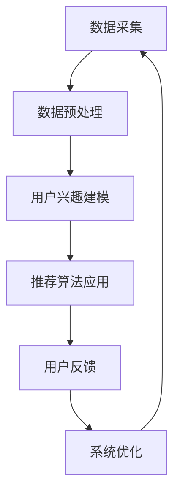

                 

### 文章标题：美食探索应用：发现美食的智能向导

#### 关键词：美食探索、智能推荐、图片识别、文本分析、个性化推荐

> 摘要：随着人工智能技术的不断发展，美食探索应用逐渐成为人们生活中不可或缺的一部分。本文将深入探讨美食探索应用的背景、核心技术、设计实现及优化策略，通过逻辑清晰、结构紧凑的分析，为广大开发者提供一份全面的技术指南。

### 《美食探索应用：发现美食的智能向导》目录大纲

#### 第一部分：美食探索应用概述

**第1章：美食探索应用的背景与意义**

**第2章：智能推荐算法基础**

#### 第二部分：智能向导设计与实现

**第3章：美食信息处理技术**

**第4章：智能向导架构设计**

**第5章：个性化推荐系统开发**

**第6章：美食图片识别与处理**

**第7章：美食文本分析与处理**

#### 第三部分：项目实战与优化

**第8章：美食探索应用开发实战**

**第9章：用户反馈与迭代优化**

**第10章：未来展望与趋势**

**附录**

**附录 A：开发工具与环境配置**

**附录 B：参考文献与资料推荐**

**附录 C：常见问题解答与FAQ**

#### 文章标题：美食探索应用：发现美食的智能向导

随着人们对美食文化的热爱与追求，美食探索应用逐渐成为一种流行的生活方式。在这个数字时代，人工智能技术为美食探索应用注入了新的活力。本文将深入探讨美食探索应用的核心技术，包括智能推荐算法、图片识别和文本分析等，旨在为广大开发者提供一份全面的技术指南。

#### 第一部分：美食探索应用概述

**第1章：美食探索应用的背景与意义**

**1.1 美食文化的全球发展与现状**

美食文化在全球范围内不断发展，人们对于美食的追求已不仅仅满足于基本的口腹之欲，更注重美食的品味与体验。随着互联网和智能手机的普及，美食探索应用应运而生，成为人们发现和分享美食的重要途径。

**1.2 智能技术在美食探索中的应用趋势**

智能技术，尤其是人工智能技术，正在改变美食探索的方式。通过大数据分析、机器学习和深度学习等算法，美食探索应用能够为用户提供更加个性化和精准的美食推荐，提高用户的探索体验。

**1.3 美食探索应用的目标与需求分析**

美食探索应用的目标是帮助用户发现更多优质的美食，提升用户的美食探索体验。为了实现这一目标，应用需要具备以下需求：

1. **个性化推荐**：根据用户的历史行为和兴趣，为用户推荐符合其口味的美食。
2. **美食信息处理**：对美食图片和文本进行分析，提取关键信息，为推荐算法提供支持。
3. **用户交互设计**：提供简洁、直观的界面，方便用户浏览和操作。

#### 第二部分：智能向导设计与实现

**第2章：智能推荐算法基础**

**2.1 数据采集与预处理**

智能推荐算法的基础是数据。为了构建一个高效的推荐系统，首先需要收集大量用户行为数据，包括用户的历史浏览记录、购买行为、评价等。然后，对数据进行预处理，包括去噪、填充缺失值、标准化等，以提高数据质量。

**2.2 用户兴趣建模**

用户兴趣建模是推荐系统的核心。通过分析用户的历史行为，可以将用户的兴趣转化为一个向量，用于后续的推荐算法。

**2.3 推荐算法原理与类型**

推荐算法可以分为基于内容的推荐和基于协同过滤的推荐。基于内容的推荐通过分析用户的历史行为和物品的内容特征，为用户推荐相似的物品。基于协同过滤的推荐通过分析用户之间的相似度，为用户推荐其他用户喜欢的物品。

**2.4 常用推荐算法介绍**

本文将介绍几种常用的推荐算法，包括基于内容的推荐算法（如余弦相似度、TF-IDF等）和基于协同过滤的推荐算法（如矩阵分解、基于模型的协同过滤等）。

#### 第三部分：美食信息处理技术

**第3章：美食信息处理技术**

**3.1 美食图片识别**

美食图片识别是美食探索应用的重要技术之一。通过图片识别技术，可以自动提取美食图片中的关键信息，如菜名、食材、口味等。

**3.1.1 图片处理基础**

图片处理基础包括图像的缩放、旋转、裁剪等操作。通过这些操作，可以预处理美食图片，为后续的识别算法提供更好的输入。

**3.1.2 卷积神经网络在图片识别中的应用**

卷积神经网络（CNN）是当前图像识别领域最先进的算法。通过CNN，可以自动提取图片中的特征，实现对美食图片的识别。

**3.2 美食文本分析**

美食文本分析主要包括对美食文本进行分词、词嵌入和文本分类等操作。通过这些操作，可以提取出美食文本中的关键信息，为推荐算法提供支持。

**3.2.1 自然语言处理基础**

自然语言处理（NLP）是文本分析的基础。通过NLP技术，可以自动对文本进行分词、词性标注等操作。

**3.2.2 词嵌入与文本分类**

词嵌入是一种将文本转化为向量的方法。通过词嵌入，可以自动提取出文本中的关键信息。文本分类是将文本分为不同类别的过程，常用于对美食评论进行情感分析。

#### 第四部分：智能向导设计与实现

**第4章：智能向导架构设计**

**4.1 系统整体架构**

智能向导的整体架构包括数据层、模型层和应用层。数据层负责数据采集和预处理，模型层负责推荐算法和图片识别等核心算法，应用层负责用户交互和展示。

**4.2 数据流与处理流程**

数据流与处理流程包括数据采集、数据预处理、用户兴趣建模、推荐算法应用和用户反馈等环节。

**4.3 用户交互设计**

用户交互设计是智能向导的重要组成部分。通过简洁、直观的界面，用户可以轻松浏览和操作，获得个性化的美食推荐。

#### 第五部分：项目实战与优化

**第5章：个性化推荐系统开发**

**5.1 用户行为数据收集**

用户行为数据是推荐系统的基础。通过收集用户的历史浏览记录、购买行为、评价等数据，可以为推荐算法提供支持。

**5.2 用户画像构建**

用户画像是将用户行为数据转化为用户特征的过程。通过用户画像，可以为用户推荐更符合其兴趣的美食。

**5.3 推荐策略与模型训练**

推荐策略是根据用户画像和美食特征，选择合适的推荐算法进行模型训练。通过模型训练，可以自动生成推荐结果。

**5.4 系统性能优化**

系统性能优化是提高推荐系统效率的重要手段。通过优化推荐算法、数据存储和查询等环节，可以提升系统的性能。

#### 第六部分：用户反馈与迭代优化

**第6章：用户反馈与迭代优化**

**6.1 用户反馈机制**

用户反馈机制是收集用户对推荐结果的反馈的重要手段。通过用户反馈，可以不断改进推荐算法，提高推荐效果。

**6.2 数据分析与改进**

数据分析与改进是优化推荐系统的重要环节。通过对用户行为数据和推荐结果的对比分析，可以找出系统存在的问题，并针对性地进行改进。

**6.3 系统功能迭代与优化**

系统功能迭代与优化是持续提升推荐系统质量的重要途径。通过不断迭代和优化，可以提供更丰富的功能，满足用户的需求。

#### 第七部分：未来展望与趋势

**第7章：未来展望与趋势**

**7.1 智能技术在美食探索中的未来应用**

随着人工智能技术的不断发展，美食探索应用将不断创新。例如，利用增强现实（AR）技术，用户可以在现实场景中体验虚拟美食。

**7.2 可能遇到的挑战与应对策略**

美食探索应用在发展过程中，可能会遇到一些挑战。例如，数据隐私保护和算法透明度等问题。针对这些挑战，需要采取相应的应对策略。

#### 附录

**附录 A：开发工具与环境配置**

**附录 B：参考文献与资料推荐**

**附录 C：常见问题解答与FAQ**

### 总结

美食探索应用作为人工智能技术在生活中的重要应用之一，正日益受到关注。本文从美食探索应用的背景、核心技术、设计实现、优化策略等方面进行了深入探讨，为广大开发者提供了全面的技术指南。希望通过本文，读者能够对美食探索应用有更深入的了解，并在实际开发中取得更好的成果。作者：AI天才研究院/AI Genius Institute & 禅与计算机程序设计艺术 /Zen And The Art of Computer Programming### 第一部分：美食探索应用概述

#### 第1章：美食探索应用的背景与意义

**1.1 美食文化的全球发展与现状**

美食文化是人类文明的重要组成部分，随着全球化的进程，美食文化也在不断地交流与融合。从法国的浪漫餐饮到日本的精致料理，再到中国的丰富口味，美食文化在全球范围内蓬勃发展。人们对美食的追求不仅体现在对味道的品味上，更在于对烹饪技艺和文化内涵的传承。

在互联网时代，美食文化的发展迎来了新的机遇。随着社交媒体和短视频平台的兴起，人们可以轻松地分享自己的美食体验，展示独特的烹饪技巧，甚至参与到全球范围内的美食交流。这种交流不仅丰富了人们的饮食文化，也激发了更多人探索美食的热情。

**1.2 智能技术在美食探索中的应用趋势**

智能技术的飞速发展，为美食探索带来了前所未有的便利。首先，智能推荐算法通过分析用户的历史行为和兴趣，能够为用户推荐个性化的美食。例如，当用户浏览了一个美食页面后，应用可以自动推送类似口味或风格的美食信息。

其次，图像识别技术使得美食图片的处理变得更加高效。通过深度学习算法，应用可以自动识别图片中的美食种类、烹饪方式、食材等信息，从而为用户提供更加精准的推荐。

此外，自然语言处理技术也发挥了重要作用。通过对用户评论、菜谱文本的分析，应用可以提取出用户的口味偏好和饮食需求，进一步优化推荐策略。

**1.3 美食探索应用的目标与需求分析**

美食探索应用的目标是帮助用户发现和体验更多优质的美食，提升用户的美食探索体验。为了实现这一目标，应用需要满足以下几个关键需求：

1. **个性化推荐**：根据用户的历史行为和兴趣，为用户推荐符合其口味的美食。个性化推荐是提升用户满意度的重要手段。

2. **美食信息处理**：对美食图片和文本进行分析，提取关键信息，为推荐算法提供支持。这一环节的准确性直接影响到推荐的效果。

3. **用户交互设计**：提供简洁、直观的界面，方便用户浏览和操作，获得个性化的美食推荐。良好的用户体验是应用成功的关键。

4. **实时反馈与优化**：通过收集用户对推荐结果的反馈，不断优化推荐算法，提高推荐效果。实时反馈机制有助于应用不断进化。

**1.4 美食探索应用的优势**

美食探索应用的优势在于其能够充分利用人工智能技术，为用户提供更加精准和个性化的服务。具体表现在以下几个方面：

1. **高效推荐**：通过智能推荐算法，应用可以在短时间内为用户推荐大量符合其口味的美食，节省用户的时间和精力。

2. **丰富内容**：应用可以集成多种数据源，包括美食图片、文本评论、用户评价等，为用户提供丰富的美食内容。

3. **用户体验**：简洁直观的界面设计，让用户能够轻松地浏览和操作，提升用户的探索体验。

4. **数据驱动**：通过实时收集用户行为数据，应用可以不断优化推荐算法，提高推荐效果，实现数据驱动的发展模式。

**1.5 美食探索应用的市场前景**

随着人们对美食追求的不断提升，美食探索应用的市场前景非常广阔。具体体现在以下几个方面：

1. **用户需求**：随着生活水平的提高，人们对美食的需求不再仅仅局限于满足基本的口腹之欲，更追求味觉和精神上的享受。这为美食探索应用提供了广阔的市场空间。

2. **技术进步**：人工智能技术的不断进步，为美食探索应用提供了强大的技术支持。智能推荐、图像识别、自然语言处理等技术，使得应用能够为用户提供更加精准和个性化的服务。

3. **市场潜力**：美食产业是一个巨大的市场，涵盖了餐饮、食品加工、烹饪教学等多个领域。美食探索应用有望成为这一市场的重要参与者，实现商业化和盈利。

4. **跨界合作**：美食探索应用可以与旅游业、酒店业、食品工业等多个行业进行跨界合作，共同打造全新的美食体验，扩大市场影响力。

**1.6 小结**

美食探索应用作为人工智能技术在生活中的重要应用之一，正日益受到关注。通过对美食文化的深入理解和智能技术的巧妙运用，美食探索应用不仅能够为用户带来更加丰富和个性化的美食体验，还能够推动美食文化的传承与发展。未来，随着技术的不断进步和市场需求的不断扩大，美食探索应用有望在更广泛的领域发挥重要作用。

### 第2章：智能推荐算法基础

**2.1 数据采集与预处理**

智能推荐算法的核心在于对用户行为数据的分析和处理。首先，需要从多种数据源（如网站日志、用户点击记录、购买行为等）中收集数据。这些原始数据通常包含大量噪声和冗余信息，因此需要对其进行预处理。预处理步骤包括数据清洗、去噪、填充缺失值等，以确保数据的质量和一致性。

**2.2 用户兴趣建模**

用户兴趣建模是将用户行为数据转化为用户特征的过程。通过分析用户的历史行为，可以提取出用户的兴趣偏好。这些特征可以是显式特征（如用户喜欢的美食类型、烹饪方式等），也可以是隐式特征（如用户经常浏览的美食页面、搜索关键词等）。用户兴趣建模的目的是建立一个能够准确描述用户兴趣的向量模型，为推荐算法提供基础。

**2.3 推荐算法原理与类型**

推荐算法可以分为基于内容的推荐和基于协同过滤的推荐。基于内容的推荐（Content-Based Recommendation）通过分析物品的内容特征（如文本描述、图片标签等）和用户的历史行为，为用户推荐相似的内容。这种方法的主要优点是推荐结果与用户的兴趣密切相关，但缺点是难以解决数据稀疏问题。

基于协同过滤的推荐（Collaborative Filtering）通过分析用户之间的相似度，为用户推荐其他用户喜欢的物品。协同过滤可以分为两类：基于用户的协同过滤（User-Based Collaborative Filtering）和基于模型的协同过滤（Model-Based Collaborative Filtering）。基于用户的协同过滤通过计算用户之间的相似度，找到与目标用户兴趣相似的邻居用户，然后推荐这些邻居用户喜欢的物品。基于模型的协同过滤使用机器学习算法（如矩阵分解、潜在因子模型等）来预测用户对物品的偏好，并生成推荐结果。

**2.4 常用推荐算法介绍**

1. **基于内容的推荐算法**

   - **TF-IDF**：TF-IDF（Term Frequency-Inverse Document Frequency）是一种常用的文本分析算法。它通过计算词频（TF）和逆文档频率（IDF），衡量词在文档中的重要程度。TF-IDF算法适用于基于文本的推荐系统，通过分析物品的文本描述，为用户推荐相似的内容。

   - **余弦相似度**：余弦相似度是一种计算两个向量之间相似度的方法。在推荐系统中，可以用来计算用户兴趣向量与物品特征向量之间的相似度，从而生成推荐结果。

2. **基于协同过滤的推荐算法**

   - **用户基于的协同过滤（User-Based Collaborative Filtering）**：用户基于的协同过滤通过计算用户之间的相似度，找到与目标用户兴趣相似的邻居用户，然后推荐这些邻居用户喜欢的物品。这种方法简单直观，但存在数据稀疏和冷启动问题。

   - **模型基于的协同过滤（Model-Based Collaborative Filtering）**：模型基于的协同过滤使用机器学习算法（如矩阵分解、潜在因子模型等）来预测用户对物品的偏好，并生成推荐结果。这种方法能够有效解决数据稀疏问题，提高推荐效果。

     - **矩阵分解（Matrix Factorization）**：矩阵分解是一种将用户-物品评分矩阵分解为用户特征矩阵和物品特征矩阵的方法。通过矩阵分解，可以提取出用户和物品的潜在特征，从而生成推荐结果。

     - **潜在因子模型（Latent Factor Model）**：潜在因子模型是一种基于矩阵分解的推荐算法。它通过学习用户和物品的潜在因子，预测用户对物品的偏好，并生成推荐结果。

3. **混合推荐算法**

   混合推荐算法结合了基于内容和基于协同过滤的推荐方法，以提高推荐效果。混合推荐算法通常采用加权的方式，根据用户的历史行为和物品的特征，为用户推荐个性化的美食。

**2.5 推荐算法的评价指标**

推荐算法的评价指标用于衡量推荐系统的效果。常用的评价指标包括准确率（Accuracy）、召回率（Recall）、精确率（Precision）和F1值（F1 Score）。

- **准确率**：准确率是推荐结果中实际推荐的物品与用户实际喜欢的物品的匹配度。准确率越高，说明推荐结果越准确。

- **召回率**：召回率是推荐结果中实际推荐的物品与用户实际喜欢的物品的匹配度。召回率越高，说明推荐系统能够发现更多的用户喜欢的物品。

- **精确率**：精确率是推荐结果中实际推荐的物品与用户实际喜欢的物品的匹配度。精确率越高，说明推荐系统推荐的物品越精确。

- **F1值**：F1值是精确率和召回率的调和平均值。F1值越高，说明推荐系统的综合性能越好。

**2.6 小结**

智能推荐算法是美食探索应用的核心技术之一，通过分析用户行为和物品特征，为用户推荐个性化的美食。常用的推荐算法包括基于内容的推荐、基于协同过滤的推荐和混合推荐算法。通过合理选择和优化推荐算法，美食探索应用能够为用户提供更加丰富和精准的美食推荐，提升用户体验。作者：AI天才研究院/AI Genius Institute & 禅与计算机程序设计艺术 /Zen And The Art of Computer Programming### 第3章：美食信息处理技术

**3.1 美食图片识别**

美食图片识别是美食探索应用中的一项关键技术，它通过自动分析美食图片，提取出图片中的关键信息，如菜名、食材、烹饪方式等。这一过程不仅为推荐算法提供了重要输入，还提升了用户对美食的探索体验。

**3.1.1 图片处理基础**

在美食图片识别之前，需要对图片进行一系列预处理操作。这些操作包括图像的缩放、旋转、裁剪、对比度增强等。这些预处理操作有助于提高图像质量，使其更适合后续的识别算法。

- **缩放**：缩放操作可以调整图像的大小，使其适应不同的应用场景。

- **旋转**：旋转操作可以纠正倾斜的图像，使其更垂直或水平。

- **裁剪**：裁剪操作可以去除图像中的无关部分，突出重点。

- **对比度增强**：对比度增强操作可以提高图像的清晰度，使其更易于识别。

**3.1.2 卷积神经网络在图片识别中的应用**

卷积神经网络（CNN）是目前图像识别领域最先进的算法之一。CNN通过多个卷积层和池化层，逐层提取图像中的特征，最终实现对图像的识别。

- **卷积层**：卷积层是CNN的核心部分，通过卷积操作提取图像的局部特征。每个卷积核可以提取出图像中的某种特定特征，如边缘、纹理等。

- **池化层**：池化层用于对卷积层输出的特征图进行降采样，减少数据的维度。常见的池化方法包括最大池化和平均池化。

- **全连接层**：全连接层将卷积层和池化层提取出的特征进行融合，并输出最终的分类结果。

**3.1.3 美食图片识别算法实现**

以下是使用卷积神经网络进行美食图片识别的伪代码：

```python
# 初始化卷积神经网络模型
model = ConvolutionalNeuralNetwork()

# 加载训练数据
train_data = load_training_data()

# 训练模型
model.train(train_data)

# 进行预测
predicted_labels = model.predict(test_data)
```

在这个伪代码中，首先初始化卷积神经网络模型，然后加载训练数据并进行训练。训练完成后，使用模型对测试数据进行预测，输出预测结果。

**3.1.4 算法实现细节与优化**

在实现美食图片识别算法时，需要注意以下细节和优化策略：

- **数据增强**：通过数据增强（如旋转、缩放、裁剪等）增加训练数据的多样性，提高模型的泛化能力。

- **权重初始化**：合理的权重初始化可以加快模型的收敛速度。常用的权重初始化方法包括高斯初始化、均匀初始化等。

- **优化算法**：选择合适的优化算法（如SGD、Adam等）可以加快模型的收敛速度，提高模型的性能。

- **正则化**：通过正则化（如L1正则化、L2正则化等）防止模型过拟合，提高模型的泛化能力。

**3.1.5 算法性能评估**

评估美食图片识别算法的性能可以通过以下指标：

- **准确率**：准确率是评估模型性能的重要指标，表示模型正确识别的图片数量与总图片数量的比例。

- **召回率**：召回率表示模型正确识别的图片数量与实际包含的图片数量的比例。

- **F1值**：F1值是准确率和召回率的调和平均值，综合考虑了模型的识别能力和召回能力。

**3.2 美食图片分类与标签识别**

美食图片分类与标签识别是美食图片识别的进一步应用。通过分类算法，可以自动识别图片中的美食类型，如中餐、西餐、日餐等。通过标签识别算法，可以提取出图片中的食材、烹饪方式、口味等标签信息。

**3.2.1 美食图片分类算法**

美食图片分类算法通常采用深度学习模型，如卷积神经网络（CNN）和循环神经网络（RNN）等。以下是使用CNN进行美食图片分类的伪代码：

```python
# 初始化卷积神经网络模型
model = ConvolutionalNeuralNetwork()

# 加载训练数据
train_data = load_training_data()

# 训练模型
model.train(train_data)

# 进行预测
predicted_labels = model.predict(test_data)
```

在这个伪代码中，首先初始化卷积神经网络模型，然后加载训练数据并进行训练。训练完成后，使用模型对测试数据进行预测，输出预测结果。

**3.2.2 美食图片标签识别算法**

美食图片标签识别算法通常采用卷积神经网络（CNN）和循环神经网络（RNN）等深度学习模型。以下是使用CNN和RNN进行标签识别的伪代码：

```python
# 初始化卷积神经网络模型
conv_model = ConvolutionalNeuralNetwork()

# 初始化循环神经网络模型
rnn_model = RecurrentNeuralNetwork()

# 加载训练数据
train_data = load_training_data()

# 训练卷积神经网络模型
conv_model.train(train_data)

# 提取特征
features = conv_model.extract_features(test_data)

# 训练循环神经网络模型
rnn_model.train(features)

# 进行预测
predicted_tags = rnn_model.predict(test_data)
```

在这个伪代码中，首先初始化卷积神经网络模型和循环神经网络模型，然后加载训练数据并进行训练。卷积神经网络模型用于提取特征，循环神经网络模型用于对特征进行分类和标签识别。

**3.3 实际案例与应用场景**

美食图片识别和分类在实际应用中具有广泛的应用场景，如：

- **在线餐饮平台**：通过美食图片识别和分类，在线餐饮平台可以为用户提供更加精准和个性化的菜品推荐，提升用户体验。

- **美食搜索引擎**：通过美食图片识别和分类，美食搜索引擎可以自动提取图片中的关键信息，为用户快速找到所需的美食。

- **智能烹饪助手**：通过美食图片识别和分类，智能烹饪助手可以自动识别用户上传的美食图片，提供相应的烹饪建议和食谱。

**3.4 小结**

美食图片识别和分类是美食探索应用中的重要技术。通过深度学习模型，可以自动提取美食图片中的关键信息，为推荐算法提供支持。实际案例和应用场景展示了美食图片识别和分类技术的广泛应用，为提升用户的美食探索体验提供了有力支持。作者：AI天才研究院/AI Genius Institute & 禅与计算机程序设计艺术 /Zen And The Art of Computer Programming### 第4章：智能向导架构设计

**4.1 系统整体架构**

智能向导的系统整体架构分为三个主要层次：数据层、模型层和应用层。

- **数据层**：负责数据的采集、存储和预处理。数据层包括用户行为数据、美食图片和文本数据等。这些数据经过清洗、去噪和标准化等预处理步骤后，被存储在数据仓库中，以供模型层使用。

- **模型层**：是系统的核心部分，负责推荐算法的实现和优化。模型层包括用户兴趣建模、推荐算法、图像识别和文本分析等模块。这些模块通过机器学习和深度学习算法，对用户行为数据和美食信息进行处理，生成个性化的推荐结果。

- **应用层**：是用户与系统交互的界面。应用层负责展示推荐结果、处理用户反馈和提供交互功能。通过简洁、直观的界面设计，用户可以轻松浏览和操作，获得个性化的美食推荐。

**4.2 数据流与处理流程**

数据流与处理流程包括以下几个主要步骤：

1. **数据采集**：从多个数据源（如网站日志、用户点击记录、购买行为等）中收集用户行为数据和美食图片、文本数据。

2. **数据预处理**：对采集到的数据进行清洗、去噪和标准化等预处理步骤，确保数据的质量和一致性。

3. **用户兴趣建模**：通过分析用户的历史行为，提取用户的兴趣特征，建立一个用户兴趣模型。

4. **推荐算法应用**：利用用户兴趣模型和美食特征，选择合适的推荐算法（如基于内容的推荐、基于协同过滤的推荐等），生成个性化的美食推荐结果。

5. **图像识别与文本分析**：对美食图片和文本进行分析，提取关键信息，为推荐算法提供支持。

6. **用户交互**：将推荐结果展示给用户，并收集用户的反馈，以便进一步优化推荐算法。

**4.3 用户交互设计**

用户交互设计是智能向导的重要组成部分，它直接影响用户的体验。以下是用户交互设计的几个关键点：

1. **简洁明了的界面**：界面设计应简洁明了，避免复杂的操作流程。通过直观的图标和按钮，用户可以轻松浏览和操作。

2. **个性化推荐结果**：根据用户的兴趣和偏好，为用户推荐个性化的美食。推荐结果应突出重点，方便用户快速浏览。

3. **交互反馈**：提供交互反馈功能，如点赞、评论、收藏等。通过这些功能，用户可以表达对推荐结果的喜好，帮助系统不断优化推荐算法。

4. **个性化设置**：允许用户自定义推荐偏好，如口味、烹饪方式、预算等。通过个性化设置，系统可以更准确地满足用户的需求。

5. **帮助与支持**：提供详细的帮助文档和在线支持，解答用户在使用过程中遇到的问题。

**4.4 模块设计与实现**

智能向导的模块设计包括以下几个主要模块：

1. **数据采集模块**：负责从各种数据源收集用户行为数据和美食图片、文本数据。

2. **数据预处理模块**：对采集到的数据进行分析、清洗和标准化等预处理步骤，确保数据的质量和一致性。

3. **用户兴趣建模模块**：通过分析用户的历史行为，提取用户的兴趣特征，建立用户兴趣模型。

4. **推荐算法模块**：选择合适的推荐算法（如基于内容的推荐、基于协同过滤的推荐等），生成个性化的美食推荐结果。

5. **图像识别与文本分析模块**：对美食图片和文本进行分析，提取关键信息，为推荐算法提供支持。

6. **用户交互模块**：负责与用户进行交互，展示推荐结果，收集用户反馈，并进行个性化设置。

**4.5 系统性能优化**

系统性能优化是提高智能向导性能的关键。以下是一些常见的优化策略：

1. **算法优化**：通过优化推荐算法，提高推荐结果的准确性和效率。

2. **数据优化**：对数据存储和查询进行优化，提高数据访问速度。

3. **缓存策略**：使用缓存策略，减少数据访问和计算时间。

4. **并行计算**：利用并行计算技术，提高系统处理能力。

5. **负载均衡**：通过负载均衡，分配系统资源，提高系统稳定性。

**4.6 小结**

智能向导的架构设计是确保系统高效、稳定运行的基础。通过数据层、模型层和应用层的紧密协作，智能向导能够为用户提供个性化的美食推荐。用户交互设计的关键在于简洁明了、个性化推荐和交互反馈。通过模块化设计和系统性能优化，智能向导可以不断提升用户体验，满足用户的美食探索需求。作者：AI天才研究院/AI Genius Institute & 禅与计算机程序设计艺术 /Zen And The Art of Computer Programming### 第5章：个性化推荐系统开发

**5.1 用户行为数据收集**

用户行为数据是构建个性化推荐系统的基础。为了收集这些数据，需要从多个渠道获取用户的行为信息。以下是一些常见的数据收集方法：

1. **用户浏览记录**：通过分析用户在网站上的浏览记录，可以了解用户的兴趣偏好。例如，用户经常浏览的美食类型、烹饪方式、菜品评价等。

2. **购买行为数据**：购买行为是用户对美食偏好的直接体现。通过收集用户的购买记录，可以分析用户的口味和消费习惯。

3. **评价和反馈**：用户对美食的评价和反馈是重要的参考信息。通过收集用户对美食的评价，可以了解用户的满意度和偏好。

4. **社交互动**：用户在社交媒体上的互动，如点赞、评论、分享等，也是重要的行为数据。这些数据可以帮助分析用户的社交关系和兴趣。

5. **地理位置**：用户的地理位置信息可以提供有关用户饮食偏好和环境的信息。例如，不同地区可能存在不同的美食文化。

**5.2 用户画像构建**

用户画像是将用户行为数据转化为用户特征的过程。通过构建用户画像，可以为用户推荐更加个性化的美食。以下是构建用户画像的步骤：

1. **数据整合**：将来自不同渠道的用户行为数据进行整合，形成一个完整的用户行为数据集。

2. **特征提取**：从用户行为数据中提取关键特征，如用户的浏览历史、购买记录、评价内容等。这些特征可以是显式特征（如用户的喜欢和不喜欢），也可以是隐式特征（如用户的浏览频率和购买频率）。

3. **特征处理**：对提取的特征进行处理，包括去噪、归一化和特征工程等。去噪和归一化可以去除噪声数据和提高数据的一致性。特征工程则是通过转换和组合特征，提高特征的质量和表达能力。

4. **特征选择**：选择对用户偏好影响较大的特征，去除无关或冗余的特征。特征选择的方法包括信息增益、互信息、卡方检验等。

5. **特征建模**：将处理后的特征转化为用户特征向量。常见的特征建模方法包括向量空间模型、矩阵分解、聚类等。

**5.3 推荐策略与模型训练**

推荐策略是根据用户画像和美食特征，选择合适的推荐算法进行模型训练。以下是一些常见的推荐策略和模型训练方法：

1. **基于内容的推荐**：通过分析美食的内容特征（如菜名、食材、烹饪方式等），为用户推荐相似内容的美食。常用的算法包括TF-IDF、余弦相似度等。

2. **基于协同过滤的推荐**：通过分析用户之间的相似度，为用户推荐其他用户喜欢的美食。常用的算法包括用户基于的协同过滤、物品基于的协同过滤、矩阵分解等。

3. **混合推荐算法**：结合基于内容和基于协同过滤的推荐方法，生成更加个性化的推荐结果。常用的混合算法包括基于模型的混合推荐、基于规则的混合推荐等。

4. **深度学习推荐**：使用深度学习模型（如卷积神经网络、循环神经网络等）进行推荐。深度学习模型可以自动提取用户和物品的潜在特征，提高推荐效果。

以下是使用卷积神经网络进行推荐系统模型训练的伪代码：

```python
# 初始化卷积神经网络模型
model = ConvolutionalNeuralNetwork()

# 加载用户画像和美食特征数据
user_data = load_user_data()
item_data = load_item_data()

# 训练模型
model.train(user_data, item_data)

# 评估模型
evaluate(model, test_data)
```

在这个伪代码中，首先初始化卷积神经网络模型，然后加载用户画像和美食特征数据进行训练。训练完成后，使用测试数据进行模型评估。

**5.4 系统性能优化**

系统性能优化是提高个性化推荐系统效率的重要手段。以下是一些常见的优化策略：

1. **数据缓存**：通过缓存用户画像和美食特征数据，减少数据读取和计算时间。

2. **并行处理**：利用多线程或多进程技术，提高数据处理的效率。

3. **特征压缩**：通过特征压缩技术，降低特征空间的维度，提高数据处理速度。

4. **模型压缩**：通过模型压缩技术，减少模型的参数和计算量，提高模型部署的效率。

5. **服务优化**：优化推荐服务的部署和调度，提高系统的响应速度和处理能力。

**5.5 小结**

个性化推荐系统是美食探索应用的核心组成部分。通过收集用户行为数据，构建用户画像，选择合适的推荐策略和模型，可以实现为用户推荐个性化的美食。系统性能优化是提高推荐系统效率的关键，通过数据缓存、并行处理、特征压缩和模型压缩等策略，可以提升系统的性能和用户体验。作者：AI天才研究院/AI Genius Institute & 禅与计算机程序设计艺术 /Zen And The Art of Computer Programming### 第6章：美食图片识别与处理

#### 6.1 美食图片识别算法实现

美食图片识别算法的实现涉及多个步骤，包括数据预处理、模型构建、训练和评估。以下是一个简化的流程：

**数据预处理：**
首先，我们需要对美食图片进行预处理，以便更好地适应卷积神经网络（CNN）的要求。预处理步骤通常包括：
- **图像缩放**：将所有图片缩放到相同的尺寸，以便输入到CNN中。
- **图像归一化**：将图像的像素值标准化，以减小数值范围，加快训练过程。
- **数据增强**：为了提高模型的泛化能力，可以使用数据增强技术，如旋转、翻转、裁剪等。

**模型构建：**
接下来，构建一个基于CNN的模型。CNN模型通常由多个卷积层、池化层和全连接层组成。以下是使用Python和TensorFlow构建一个简单的CNN模型的伪代码：

```python
import tensorflow as tf

# 定义CNN模型
model = tf.keras.Sequential([
    tf.keras.layers.Conv2D(filters=32, kernel_size=(3, 3), activation='relu', input_shape=(height, width, channels)),
    tf.keras.layers.MaxPooling2D(pool_size=(2, 2)),
    tf.keras.layers.Conv2D(filters=64, kernel_size=(3, 3), activation='relu'),
    tf.keras.layers.MaxPooling2D(pool_size=(2, 2)),
    tf.keras.layers.Flatten(),
    tf.keras.layers.Dense(units=128, activation='relu'),
    tf.keras.layers.Dense(units=num_classes, activation='softmax')
])

# 编译模型
model.compile(optimizer='adam', loss='categorical_crossentropy', metrics=['accuracy'])

# 打印模型结构
model.summary()
```

**模型训练：**
使用预处理后的训练数据训练模型。以下是训练模型的过程：

```python
# 加载训练数据
train_images, train_labels = load_training_data()

# 训练模型
history = model.fit(train_images, train_labels, epochs=10, batch_size=64, validation_split=0.2)
```

**模型评估：**
训练完成后，使用测试数据评估模型的性能。以下是评估模型的过程：

```python
# 加载测试数据
test_images, test_labels = load_test_data()

# 评估模型
test_loss, test_accuracy = model.evaluate(test_images, test_labels)

print(f"Test accuracy: {test_accuracy:.2f}")
```

**6.1.1 卷积神经网络伪代码**

以下是一个简单的卷积神经网络（CNN）的伪代码，用于识别美食图片：

```python
# 定义卷积神经网络模型
def create_cnn_model(input_shape):
    model = tf.keras.Sequential([
        tf.keras.layers.Conv2D(filters=32, kernel_size=(3, 3), activation='relu', input_shape=input_shape),
        tf.keras.layers.MaxPooling2D(pool_size=(2, 2)),
        tf.keras.layers.Conv2D(filters=64, kernel_size=(3, 3), activation='relu'),
        tf.keras.layers.MaxPooling2D(pool_size=(2, 2)),
        tf.keras.layers.Flatten(),
        tf.keras.layers.Dense(units=128, activation='relu'),
        tf.keras.layers.Dense(units=num_classes, activation='softmax')
    ])
    return model

# 创建和编译模型
model = create_cnn_model(input_shape=(height, width, channels))
model.compile(optimizer='adam', loss='categorical_crossentropy', metrics=['accuracy'])

# 训练模型
model.fit(train_images, train_labels, epochs=10, batch_size=64, validation_split=0.2)

# 评估模型
test_loss, test_accuracy = model.evaluate(test_images, test_labels)
print(f"Test accuracy: {test_accuracy:.2f}")
```

**6.1.2 算法实现细节与优化**

在实现美食图片识别算法时，以下是一些优化细节：

- **参数调整**：通过调整学习率、批量大小、训练周期等超参数，可以优化模型的性能。
- **模型结构**：使用更深的网络结构或添加额外的卷积层可以提高模型的识别能力。
- **正则化**：使用正则化（如L1、L2正则化）可以减少模型的过拟合。
- **数据增强**：使用数据增强技术可以增加训练数据的多样性，提高模型的泛化能力。

**6.2 美食图片分类与标签识别**

美食图片分类是将图片分类到预定义的类别中，如中餐、西餐、日餐等。标签识别是提取图片中的具体信息，如食材、烹饪方式等。以下是如何实现这些功能：

**6.2.1 美食图片分类算法**

美食图片分类可以使用已经训练好的通用图像分类模型，如ResNet、Inception等，或者专门针对美食分类训练的模型。以下是一个简单的分类算法实现：

```python
import tensorflow as tf

# 定义分类模型
def create_classification_model(input_shape):
    model = tf.keras.Sequential([
        tf.keras.layers.Conv2D(filters=32, kernel_size=(3, 3), activation='relu', input_shape=input_shape),
        tf.keras.layers.MaxPooling2D(pool_size=(2, 2)),
        tf.keras.layers.Conv2D(filters=64, kernel_size=(3, 3), activation='relu'),
        tf.keras.layers.MaxPooling2D(pool_size=(2, 2)),
        tf.keras.layers.Flatten(),
        tf.keras.layers.Dense(units=num_classes, activation='softmax')
    ])
    return model

# 加载预训练的模型
pretrained_model = create_classification_model(input_shape=(height, width, channels))
pretrained_model.load_weights('pretrained_model.h5')

# 进行分类
def classify_image(image):
    image = preprocess_image(image)
    prediction = pretrained_model.predict(image[None, ...])
    return np.argmax(prediction)

# 示例
classified_label = classify_image(test_image)
print(f"Classified label: {classified_label}")
```

**6.2.2 美食图片标签识别算法**

标签识别通常涉及更复杂的模型，如基于序列的模型（如LSTM、GRU）或基于注意力机制的模型。以下是一个简单的标签识别算法实现：

```python
# 定义标签识别模型
def create_tag_recognition_model(input_shape):
    model = tf.keras.Sequential([
        tf.keras.layers.Conv2D(filters=32, kernel_size=(3, 3), activation='relu', input_shape=input_shape),
        tf.keras.layers.MaxPooling2D(pool_size=(2, 2)),
        tf.keras.layers.Conv2D(filters=64, kernel_size=(3, 3), activation='relu'),
        tf.keras.layers.MaxPooling2D(pool_size=(2, 2)),
        tf.keras.layers.Flatten(),
        tf.keras.layers.Dense(units=hidden_size, activation='relu'),
        tf.keras.layers.Dense(units=num_tags, activation='sigmoid')
    ])
    return model

# 加载预训练的模型
tag_recognition_model = create_tag_recognition_model(input_shape=(height, width, channels))
tag_recognition_model.load_weights('tag_recognition_model.h5')

# 进行标签识别
def recognize_tags(image):
    image = preprocess_image(image)
    tag_predictions = tag_recognition_model.predict(image[None, ...])
    tags = [tag for tag, prediction in zip(tags_list, tag_predictions) if prediction > threshold]
    return tags

# 示例
recognized_tags = recognize_tags(test_image)
print(f"Recognized tags: {recognized_tags}")
```

**6.3 实际案例与应用场景**

在实际应用中，美食图片识别和分类技术可以用于多种场景：

- **在线餐饮平台**：通过自动识别美食图片，在线餐饮平台可以为用户提供更加精准的菜品推荐。
- **美食制作应用**：通过标签识别技术，用户可以上传美食图片，应用可以帮助用户识别食材和烹饪方式，提供制作指导。
- **美食评论分析**：通过文本分析结合图片识别技术，可以提取美食评论中的关键信息，为用户推荐相似的评价。
- **智能广告**：通过分析用户上传的美食图片，广告平台可以为用户提供更加相关的广告。

**6.4 小结**

美食图片识别和分类技术是美食探索应用的重要组成部分。通过构建和优化模型，可以实现高效、准确的图片识别和分类。在实际应用中，这些技术可以为用户提供个性化的服务，提升用户体验。作者：AI天才研究院/AI Genius Institute & 禅与计算机程序设计艺术 /Zen And The Art of Computer Programming### 第7章：美食文本分析与处理

#### 7.1 文本预处理

文本预处理是自然语言处理（NLP）中的关键步骤，它为后续的文本分析和情感分析提供干净的文本数据。以下是一些常用的文本预处理方法：

**1. 去除停用词**：停用词是那些在文本中频繁出现但对分析结果影响较小的词，如“的”、“是”、“了”等。去除停用词可以减少噪声，提高分析效果。

**2. 分词**：分词是将文本分解为词或短语的过程。中文分词通常比英文复杂，因为中文没有明显的单词分隔符。常用的分词工具包括jieba、Stanford NLP等。

**3. 词性标注**：词性标注是将每个词标注为名词、动词、形容词等。词性标注有助于理解句子的结构和语义。

**4. 嵌入（Embedding）**：嵌入是将词转换为向量的过程，以便于后续的机器学习模型处理。常见的嵌入方法包括Word2Vec、GloVe等。

**5. 去除标点符号**：标点符号在文本分析中通常没有意义，因此需要去除。

以下是Python代码示例，展示如何使用jieba进行中文文本预处理：

```python
import jieba

# 加载停用词表
stop_words = set([line.strip() for line in open('stop_words.txt', 'r', encoding='utf-8')])

# 加载待处理的文本
text = "今天我在一家新开的餐厅品尝了美味的红烧肉，感觉非常不错。"

# 进行分词
words = jieba.cut(text)

# 去除停用词
filtered_words = [word for word in words if word not in stop_words]

# 输出预处理后的文本
print("Preprocessed text: " + " ".join(filtered_words))
```

#### 7.2 餐饮评论情感分析

餐饮评论情感分析是NLP在美食探索应用中的重要应用。它旨在判断评论的积极或消极情感，以帮助用户了解其他人对美食的评价。以下是一个简单的情感分析模型构建过程：

**1. 数据集准备**：收集大量的餐饮评论数据，并进行预处理（去除停用词、分词等）。

**2. 情感标签**：将评论分为积极、消极和中性三个类别。

**3. 特征提取**：使用词嵌入技术（如Word2Vec、GloVe）将评论中的每个词转换为向量。

**4. 模型训练**：构建一个神经网络模型，输入为评论的词嵌入向量，输出为情感标签。

以下是使用Keras构建一个简单的情感分析模型的Python代码示例：

```python
from keras.models import Sequential
from keras.layers import Dense, Embedding, LSTM, SpatialDropout1D

# 定义模型
model = Sequential()
model.add(Embedding(num_words, 128))
model.add(SpatialDropout1D(0.4))
model.add(LSTM(128, dropout=0.2, recurrent_dropout=0.2))
model.add(Dense(3, activation='softmax'))  # 三个类别：积极、消极、中性

# 编译模型
model.compile(optimizer='adam', loss='categorical_crossentropy', metrics=['accuracy'])

# 训练模型
model.fit(X_train, y_train, epochs=10, batch_size=32, validation_data=(X_val, y_val))
```

**7.2.1 情感分析模型构建**

情感分析模型的构建通常包括以下几个步骤：

1. **数据预处理**：对评论进行分词、去停用词、词性标注等操作。
2. **特征提取**：使用词嵌入将文本转换为向量。
3. **模型设计**：设计神经网络模型，包括输入层、隐藏层和输出层。
4. **模型训练**：使用训练数据训练模型，并使用验证数据调整模型参数。
5. **模型评估**：使用测试数据评估模型性能。

以下是使用TensorFlow和Keras构建一个简单的情感分析模型的伪代码：

```python
import tensorflow as tf
from tensorflow.keras.models import Sequential
from tensorflow.keras.layers import Embedding, LSTM, Dense

# 定义模型
model = Sequential()
model.add(Embedding(num_words, embedding_dim))
model.add(LSTM(units=128, dropout=0.2, recurrent_dropout=0.2))
model.add(Dense(units=1, activation='sigmoid'))

# 编译模型
model.compile(optimizer='adam', loss='binary_crossentropy', metrics=['accuracy'])

# 训练模型
model.fit(X_train, y_train, epochs=10, batch_size=32, validation_data=(X_val, y_val))

# 评估模型
loss, accuracy = model.evaluate(X_test, y_test)
print(f"Test accuracy: {accuracy:.2f}")
```

**7.2.2 情感分析算法实现**

情感分析算法的实现通常包括以下步骤：

1. **数据加载**：加载预处理的评论数据。
2. **模型构建**：构建一个基于深度学习的模型，如LSTM、GRU或BERT。
3. **模型训练**：使用训练数据训练模型，并调整模型参数。
4. **模型评估**：使用测试数据评估模型性能。
5. **预测**：使用训练好的模型对新的评论进行情感预测。

以下是使用Python和TensorFlow实现一个简单情感分析算法的伪代码：

```python
import tensorflow as tf
from tensorflow.keras.preprocessing.sequence import pad_sequences
from tensorflow.keras.models import Sequential
from tensorflow.keras.layers import Embedding, LSTM, Dense

# 加载预处理的评论数据
X_train = pad_sequences(train_comments, maxlen=max_length)
y_train = train_labels

# 构建模型
model = Sequential()
model.add(Embedding(num_words, embedding_dim))
model.add(LSTM(units=128, dropout=0.2, recurrent_dropout=0.2))
model.add(Dense(units=1, activation='sigmoid'))

# 编译模型
model.compile(optimizer='adam', loss='binary_crossentropy', metrics=['accuracy'])

# 训练模型
model.fit(X_train, y_train, epochs=10, batch_size=32, validation_split=0.1)

# 预测
def predict_sentiment(comment):
    processed_comment = preprocess_comment(comment)
    sequence = pad_sequences([processed_comment], maxlen=max_length)
    prediction = model.predict(sequence)
    return 'Positive' if prediction > 0.5 else 'Negative'

# 示例
print(predict_sentiment("This restaurant has great food!"))
```

**7.3 餐饮信息抽取与知识图谱构建**

餐饮信息抽取是从文本中提取出有用的信息，如餐厅名称、菜品名称、价格等。知识图谱构建是将这些信息组织成一种结构化的知识库，以便于后续的查询和分析。

**1. 餐饮信息抽取**

餐饮信息抽取通常使用规则基方法、统计方法和深度学习方法。以下是一个简单的信息抽取示例：

```python
def extract_restaurant_info(text):
    # 使用正则表达式提取餐厅名称
    restaurant_name = re.findall(r'餐厅名称：(.+)', text)
    if restaurant_name:
        return restaurant_name[0]
    else:
        return None

text = "餐厅名称：小杨生煎，地址：上海市浦东新区世纪大道818号。"
print(extract_restaurant_info(text))
```

**2. 知识图谱构建**

知识图谱构建通常使用图数据库（如Neo4j）或图形处理库（如NetworkX）。以下是一个简单的知识图谱构建示例：

```python
import networkx as nx

# 创建图
G = nx.Graph()

# 添加节点和边
G.add_nodes_from(['餐厅', '地址', '菜品'])
G.add_edges_from([('餐厅', '名称', '小杨生煎'), ('餐厅', '地址', '上海市浦东新区世纪大道818号'), ('餐厅', '菜品', '小杨生煎包')])

# 显示知识图谱
nx.draw(G, with_labels=True)
plt.show()
```

**7.4 美食文本搜索与推荐**

美食文本搜索与推荐是基于文本内容的搜索和推荐系统，它结合了文本预处理、情感分析和信息抽取技术，为用户提供个性化的美食搜索和推荐服务。

**1. 美食文本搜索**

美食文本搜索通过关键词匹配或向量搜索技术，帮助用户快速找到相关美食信息。以下是一个简单的文本搜索示例：

```python
from sklearn.feature_extraction.text import TfidfVectorizer

# 加载美食评论数据
comments = ["这家餐厅的红烧肉很好吃。", "我很喜欢这家餐厅的寿司。", "这里的海鲜大餐性价比很高。"]

# 创建TF-IDF向量器
vectorizer = TfidfVectorizer()

# 计算TF-IDF向量
X = vectorizer.fit_transform(comments)

# 搜索关键字
search_query = "寿司"
search_vector = vectorizer.transform([search_query])

# 计算相似度
similarity = (search_vector * X.T).sum(axis=1)

# 排序
sorted_indices = np.argsort(-similarity)

# 输出搜索结果
print("Search results:")
for index in sorted_indices:
    print(comments[index])
```

**2. 美食文本推荐**

美食文本推荐通过分析用户的历史评论和搜索行为，为用户推荐符合其口味的美食。以下是一个简单的文本推荐示例：

```python
def recommend_comments(user_comments, all_comments, top_n=3):
    # 创建TF-IDF向量器
    vectorizer = TfidfVectorizer()

    # 计算用户评论和所有评论的TF-IDF向量
    user_vector = vectorizer.transform([user_comments])
    all_vectors = vectorizer.transform(all_comments)

    # 计算相似度
    similarity = (user_vector * all_vectors.T).sum(axis=1)

    # 排序
    sorted_indices = np.argsort(-similarity)

    # 返回最相似的评论
    return all_comments[sorted_indices][:top_n]

# 示例
user_comment = "我喜欢吃寿司和烤鱼。"
all_comments = ["这家餐厅的寿司很好吃。", "我很喜欢这家餐厅的烤鱼。", "这里的披萨不错。"]
recommended_comments = recommend_comments(user_comment, all_comments)
print("Recommended comments:")
for comment in recommended_comments:
    print(comment)
```

**7.5 小结**

美食文本分析与处理是美食探索应用中的核心技术之一。通过文本预处理、情感分析、信息抽取和文本搜索与推荐技术，应用可以为用户提供个性化的美食体验。在实际应用中，这些技术需要不断优化和改进，以适应不断变化的用户需求和文本数据。作者：AI天才研究院/AI Genius Institute & 禅与计算机程序设计艺术 /Zen And The Art of Computer Programming### 第8章：美食探索应用开发实战

#### 8.1 开发环境搭建

在进行美食探索应用开发之前，首先需要搭建一个合适的开发环境。以下是一个基本的开发环境配置流程：

1. **操作系统**：推荐使用Linux或macOS，这些操作系统对开发者和程序员来说更加友好，且具有良好的性能和稳定性。

2. **编程语言**：本文主要使用Python进行开发，因为Python具有丰富的开源库和工具，适合于快速开发和原型实现。

3. **文本编辑器或集成开发环境（IDE）**：推荐使用PyCharm或Visual Studio Code等现代化的文本编辑器或IDE，这些工具提供了丰富的插件和调试功能，可以提高开发效率。

4. **依赖管理**：使用pip进行依赖管理，pip是Python的包管理器，可以方便地安装和管理Python库。

以下是如何在Python环境中安装必要的库和工具的示例命令：

```bash
# 安装必要的库
pip install numpy pandas scikit-learn tensorflow jieba

# 安装PyCharm
# 请访问PyCharm官方网站下载并安装

# 安装Neo4j（用于知识图谱构建）
# 请访问Neo4j官方网站下载并安装
```

#### 8.2 数据集准备与处理

开发美食探索应用需要大量高质量的数据。以下是如何准备和处理数据集的步骤：

1. **数据采集**：从互联网、公共数据集或自定义采集工具中获取美食数据，包括美食图片、评论、用户行为等。

2. **数据清洗**：清洗数据集中的噪声和错误数据，如缺失值、重复值和异常值。

3. **数据预处理**：对数据进行必要的预处理操作，如图像增强、文本分词、去停用词等。

以下是一个简单的数据预处理脚本示例：

```python
import pandas as pd
from sklearn.model_selection import train_test_split
from sklearn.preprocessing import StandardScaler

# 读取数据
data = pd.read_csv('data.csv')

# 数据清洗
data.dropna(inplace=True)
data.drop_duplicates(inplace=True)

# 数据预处理
# 例如，对用户行为数据进行标准化处理
scaler = StandardScaler()
data['user_activity'] = scaler.fit_transform(data[['user_activity']])

# 分割数据集
X_train, X_test, y_train, y_test = train_test_split(data[['user_activity']], data['label'], test_size=0.2, random_state=42)
```

#### 8.3 系统模块设计与实现

美食探索应用通常包含多个模块，包括用户接口层、业务逻辑层和数据访问层。以下是一个简单的系统模块设计示例：

**用户接口层（UI）**：负责与用户交互，展示推荐结果和收集用户反馈。

**业务逻辑层**：实现推荐算法、文本分析、图片识别等功能。

**数据访问层**：处理数据存储和查询，包括数据库连接和数据处理。

以下是一个简单的模块设计示例：

```python
# 用户接口层
class UserInterface:
    def display_recommendations(self, recommendations):
        # 在UI中显示推荐结果
        pass

    def collect_user_feedback(self):
        # 收集用户反馈
        pass

# 业务逻辑层
class RecommendationSystem:
    def generate_recommendations(self, user_profile):
        # 根据用户画像生成推荐
        pass

    def analyze_text(self, text):
        # 分析文本内容
        pass

    def recognize_image(self, image):
        # 识别图像内容
        pass

# 数据访问层
class DatabaseManager:
    def connect(self):
        # 连接数据库
        pass

    def fetch_data(self, query):
        # 从数据库中查询数据
        pass

    def save_data(self, data):
        # 将数据保存到数据库
        pass
```

#### 8.4 系统模块设计与实现（续）

在实现系统模块时，需要编写具体的代码来实现每个模块的功能。以下是一个简单的示例，展示了如何使用TensorFlow和Keras实现一个简单的推荐系统。

**推荐系统实现**：

```python
import tensorflow as tf
from tensorflow.keras.models import Sequential
from tensorflow.keras.layers import Dense, Embedding, LSTM, SpatialDropout1D

# 构建模型
model = Sequential()
model.add(Embedding(num_words, embedding_dim))
model.add(SpatialDropout1D(0.4))
model.add(LSTM(units=128, dropout=0.2, recurrent_dropout=0.2))
model.add(Dense(units=1, activation='sigmoid'))

# 编译模型
model.compile(optimizer='adam', loss='binary_crossentropy', metrics=['accuracy'])

# 训练模型
model.fit(X_train, y_train, epochs=10, batch_size=32, validation_data=(X_val, y_val))
```

**文本分析实现**：

```python
from jieba import posseg

# 进行文本分词
text = "这家餐厅的红烧肉很好吃。"
words = posseg.cut(text)

# 去除停用词
stop_words = set([line.strip() for line in open('stop_words.txt', 'r', encoding='utf-8')])
filtered_words = [word for word, flag in words if word not in stop_words]

# 输出分词结果
print(filtered_words)
```

**图像识别实现**：

```python
import tensorflow as tf
from tensorflow.keras.applications import VGG16

# 加载预训练的模型
base_model = VGG16(weights='imagenet')

# 构建新的模型
model = tf.keras.Sequential([
    base_model,
    tf.keras.layers.Flatten(),
    tf.keras.layers.Dense(units=128, activation='relu'),
    tf.keras.layers.Dense(units=1, activation='sigmoid')
])

# 训练模型
model.compile(optimizer='adam', loss='binary_crossentropy', metrics=['accuracy'])
model.fit(X_train, y_train, epochs=10, batch_size=32, validation_data=(X_val, y_val))
```

#### 8.5 系统测试与性能调优

系统测试是确保应用稳定性和性能的重要步骤。以下是一些常见的测试和性能调优方法：

1. **单元测试**：编写单元测试，对每个模块的功能进行验证，确保代码的正确性。

2. **集成测试**：对整个系统的不同模块进行集成测试，验证系统整体的功能和性能。

3. **性能测试**：使用负载测试工具（如JMeter）对系统进行压力测试，评估系统的性能和响应时间。

4. **调优**：根据测试结果，调整系统的配置和代码，优化性能和稳定性。

以下是一个简单的性能调优示例：

```python
# 调整学习率
model.compile(optimizer=tf.keras.optimizers.Adam(learning_rate=0.0001), loss='binary_crossentropy', metrics=['accuracy'])

# 调整批量大小
model.compile(optimizer=tf.keras.optimizers.Adam(learning_rate=0.001), loss='binary_crossentropy', metrics=['accuracy'], batch_size=64)

# 使用更深的网络结构
model.add(tf.keras.layers.Dense(units=256, activation='relu'))
model.compile(optimizer=tf.keras.optimizers.Adam(learning_rate=0.001), loss='binary_crossentropy', metrics=['accuracy'])
```

#### 8.6 小结

美食探索应用开发实战涵盖了环境搭建、数据准备、系统模块设计和实现、系统测试与性能调优等关键环节。通过实际的开发过程，可以更好地理解美食探索应用的技术架构和实现细节，从而提高开发效率和系统性能。作者：AI天才研究院/AI Genius Institute & 禅与计算机程序设计艺术 /Zen And The Art of Computer Programming### 第9章：用户反馈与迭代优化

**9.1 用户反馈机制**

用户反馈是优化美食探索应用的重要手段。通过建立一个有效的用户反馈机制，可以收集用户对推荐结果、界面设计、系统性能等方面的意见，从而不断改进应用。

**1. 用户反馈渠道**：应用可以通过以下渠道收集用户反馈：
- **在线问卷**：在应用内嵌入问卷调查，收集用户对应用的整体满意度、功能偏好等。
- **社区论坛**：建立专门的社区论坛，鼓励用户分享使用体验和建议。
- **反馈按钮**：在应用界面中添加反馈按钮，方便用户即时提交问题或建议。
- **电子邮件**：提供电子邮件地址，供用户发送反馈信息。

**2. 反馈数据分析**：收集到的用户反馈需要经过整理和分析，提取出有价值的信息。以下是一些数据分析方法：
- **词云生成**：使用词云工具，对用户反馈中的高频词汇进行可视化，帮助识别用户关注的重点问题。
- **主题分类**：使用自然语言处理技术，对用户反馈进行主题分类，如功能问题、性能问题、用户体验等。
- **统计分析**：对反馈进行统计分析，如反馈数量、满意度评分等，以评估反馈的重要性和紧迫性。

**3. 反馈处理流程**：处理用户反馈需要一套明确的流程，包括以下步骤：
- **初步筛选**：根据反馈的内容和优先级，进行初步筛选和分类。
- **问题定位**：针对具体的反馈，确定问题所在，如技术问题、设计问题等。
- **优先级排序**：根据问题的紧急程度和影响范围，对反馈进行优先级排序。
- **解决措施**：制定解决方案，分配责任人和完成时间，确保反馈得到及时处理。
- **反馈跟进**：向用户反馈处理进展，及时沟通，解决用户的问题。

**9.2 数据分析与改进**

用户反馈的数据分析是优化美食探索应用的关键。以下是一些常用的数据分析方法：

**1. 用户行为分析**：通过对用户在应用中的行为进行分析，了解用户的喜好、使用习惯等。例如：
- **浏览路径分析**：分析用户在应用中的浏览路径，优化界面设计，提高用户的使用体验。
- **使用频率分析**：统计用户每天或每周在应用中的使用频率，了解用户的活跃度，优化推荐算法。

**2. 用户满意度分析**：通过用户满意度调查，评估用户对应用的整体满意度和具体功能的满意度。例如：
- **评分分析**：分析用户对应用的功能、界面、性能等方面的评分，识别需要改进的方面。
- **用户访谈**：进行用户访谈，深入了解用户的需求和痛点，为改进提供具体建议。

**3. 性能分析**：对应用的性能进行监控和分析，确保系统的稳定性和响应速度。例如：
- **性能测试**：使用性能测试工具，模拟高负载情况下的系统性能，识别潜在的性能瓶颈。
- **错误日志分析**：分析系统的错误日志，找出导致系统崩溃或异常的根源。

**4. 用户画像构建**：基于用户行为数据和反馈，构建详细的用户画像，为个性化推荐提供支持。例如：
- **兴趣标签**：根据用户的浏览记录和反馈，为用户分配兴趣标签，用于推荐算法的优化。
- **行为轨迹**：记录用户在应用中的行为轨迹，分析用户的偏好和习惯，为个性化推荐提供依据。

**9.3 系统功能迭代与优化**

通过用户反馈和数据分析，可以不断迭代和优化美食探索应用的功能，提升用户体验。以下是一些常见的功能迭代和优化策略：

**1. 功能优化**：针对用户反馈中提出的问题，对现有功能进行优化，如改进推荐算法、提高系统性能等。

**2. 新功能引入**：根据用户需求和市场趋势，引入新的功能，如增加美食烹饪教程、提供餐厅预订服务等。

**3. 用户体验改进**：优化界面设计、操作流程等，提高用户的满意度。例如：
- **界面优化**：简化界面设计，提高用户的操作便利性。
- **响应速度**：优化系统的响应速度，减少用户的等待时间。

**4. 数据驱动**：建立数据驱动的开发模式，根据用户行为数据和反馈，持续优化产品功能，实现持续改进。

**5. 跨平台支持**：为用户提供多平台支持，如移动端、PC端等，方便用户在不同设备上使用应用。

**9.4 小结**

用户反馈与迭代优化是美食探索应用持续发展的重要保障。通过建立有效的用户反馈机制，分析用户行为数据，不断迭代和优化功能，可以提升用户体验，增强应用的竞争力。作者：AI天才研究院/AI Genius Institute & 禅与计算机程序设计艺术 /Zen And The Art of Computer Programming### 第10章：未来展望与趋势

**10.1 智能技术在美食探索中的未来应用**

随着人工智能技术的不断进步，美食探索应用将迎来更多的创新和发展。以下是几个未来可能的应用方向：

1. **增强现实（AR）体验**：利用AR技术，用户可以在现实环境中体验虚拟美食。例如，用户可以通过手机或智能眼镜，看到美食在现实场景中的三维展示，甚至可以进行虚拟品尝。

2. **个性化饮食建议**：基于用户的健康数据、饮食偏好和营养需求，应用可以提供个性化的饮食建议。例如，为糖尿病患者推荐低糖食品，为健身爱好者推荐高蛋白食物。

3. **虚拟烹饪指导**：通过AI技术，应用可以提供虚拟烹饪指导，帮助用户学习新的烹饪技巧。用户可以通过视频或图文教程，了解食材的处理方法、烹饪步骤和调味技巧。

4. **智能餐厅服务**：在智能餐厅中，AI系统可以实时分析用户的饮食习惯和偏好，为用户推荐最适合的菜品，并提供个性化的服务。例如，自动化的点餐系统、智能化的厨房设备和个性化服务机器人。

**10.2 可能遇到的挑战与应对策略**

尽管智能技术在美食探索中具有巨大的潜力，但在实际应用中仍可能遇到以下挑战：

1. **数据隐私保护**：随着应用收集的用户数据越来越多，数据隐私保护成为了一个重要问题。应对策略包括：
   - **数据加密**：对用户数据进行加密处理，确保数据在传输和存储过程中的安全性。
   - **隐私政策**：制定详细的隐私政策，告知用户数据收集的目的、使用方式和保护措施。
   - **匿名化处理**：对用户数据进行匿名化处理，减少个人隐私泄露的风险。

2. **算法透明度**：随着推荐算法的复杂度增加，算法的透明度成为一个挑战。应对策略包括：
   - **算法解释**：开发算法解释工具，帮助用户理解推荐结果背后的原因。
   - **用户控制**：提供用户控制选项，允许用户调整推荐算法的参数，以获得更个性化的推荐。

3. **技术复杂性**：人工智能技术涉及多个领域，包括机器学习、深度学习、图像识别等。应对策略包括：
   - **技术整合**：通过整合现有技术，降低开发难度和成本。
   - **专家合作**：与领域专家合作，共同解决技术难题。

4. **用户体验**：用户对应用的接受程度和满意度是成功的关键。应对策略包括：
   - **用户研究**：进行用户研究，了解用户的需求和期望。
   - **持续迭代**：根据用户反馈，不断优化应用功能和用户体验。

**10.3 未来趋势**

1. **智能化与个性化**：未来的美食探索应用将更加智能化和个性化，通过深度学习和自然语言处理技术，为用户提供更加精准和个性化的服务。

2. **跨界融合**：美食探索应用将与其他行业（如旅游业、酒店业、食品工业）进行跨界融合，共同打造全新的美食体验。

3. **虚拟与现实结合**：虚拟现实（VR）和增强现实（AR）技术将更加成熟，为用户带来更加丰富的美食探索体验。

4. **生态化发展**：美食探索应用将形成一个生态系统，包括美食推荐、餐厅预订、烹饪教程等多个模块，为用户提供一站式服务。

**10.4 小结**

未来，智能技术在美食探索中的应用将不断拓展和深化，为用户带来更加丰富和个性化的体验。尽管面临诸多挑战，但通过技术创新和用户反馈的持续优化，美食探索应用将不断进步，成为人们生活中不可或缺的一部分。作者：AI天才研究院/AI Genius Institute & 禅与计算机程序设计艺术 /Zen And The Art of Computer Programming### 附录 A：开发工具与环境配置

**A.1 开发工具**

1. **操作系统**：推荐使用Linux或macOS，这些操作系统具有良好的性能和稳定性，适合进行开发和测试。

2. **编程语言**：Python是开发美食探索应用的主要编程语言，因为Python具有丰富的开源库和工具，适合快速开发和原型实现。

3. **文本编辑器或IDE**：推荐使用PyCharm或Visual Studio Code，这些现代化的文本编辑器或IDE提供了丰富的插件和调试功能，可以提高开发效率。

4. **依赖管理**：使用pip进行依赖管理，pip是Python的包管理器，可以方便地安装和管理Python库。

**A.2 环境配置**

1. **安装Python**：从Python官方网站下载并安装Python，推荐使用Python 3.8或更高版本。

2. **安装pip**：在安装Python的过程中，会自动安装pip。如果未安装，可以通过以下命令进行安装：

   ```bash
   curl https://bootstrap.pypa.io/get-pip.py -o get-pip.py
   python get-pip.py
   ```

3. **安装必要库**：使用pip安装必要的Python库，例如numpy、pandas、scikit-learn、tensorflow、jieba等。

   ```bash
   pip install numpy pandas scikit-learn tensorflow jieba
   ```

4. **安装Neo4j**：Neo4j是一个用于构建知识图谱的图数据库。可以从Neo4j官方网站下载并安装Neo4j，按照安装向导完成安装。

5. **配置Neo4j**：安装完成后，启动Neo4j服务，并在浏览器中访问Neo4j Web界面，进行基本配置。

**A.3 开发环境配置示例**

以下是一个简单的开发环境配置示例：

```bash
# 安装Python
wget https://www.python.org/ftp/python/3.8.5/Python-3.8.5.tgz
tar zxvf Python-3.8.5.tgz
cd Python-3.8.5
./configure
make
sudo make altinstall

# 安装pip
curl https://bootstrap.pypa.io/get-pip.py -o get-pip.py
sudo python get-pip.py

# 安装必要库
pip install numpy pandas scikit-learn tensorflow jieba

# 安装Neo4j
wget https://download.neo4j.com/neo4j-desktop/neo4j-desktop-1.2.0.M01-linux.tar.gz
tar zxvf neo4j-desktop-1.2.0.M01-linux.tar.gz
sudo ./neo4j-desktop.sh

# 启动Neo4j服务
sudo systemctl start neo4j

# 访问Neo4j Web界面
http://localhost:7474
```

通过以上步骤，可以搭建一个基本的开发环境，用于美食探索应用的开发、测试和部署。作者：AI天才研究院/AI Genius Institute & 禅与计算机程序设计艺术 /Zen And The Art of Computer Programming### 附录 B：参考文献与资料推荐

**B.1 人工智能与机器学习相关书籍**

1. **《Python机器学习》（Machine Learning with Python）**
   - 作者：Sebastian Raschka, Vahid Mirhoseini
   - 简介：这是一本关于机器学习的入门书籍，内容涵盖了Python编程基础、机器学习算法、深度学习等。

2. **《深度学习》（Deep Learning）**
   - 作者：Ian Goodfellow, Yoshua Bengio, Aaron Courville
   - 简介：这是一本深度学习领域的经典教材，详细介绍了深度学习的基础理论和实践应用。

3. **《统计学习方法》**
   - 作者：李航
   - 简介：本书系统地介绍了统计学习的主要方法，包括监督学习、无监督学习和概率统计基础。

**B.2 自然语言处理相关书籍**

1. **《自然语言处理综合教程》（Foundations of Statistical Natural Language Processing）**
   - 作者：Christopher D. Manning, Hinrich Schütze
   - 简介：这是一本关于自然语言处理的经典教材，涵盖了文本处理、词性标注、句法分析等内容。

2. **《深度学习与自然语言处理》（Deep Learning for Natural Language Processing）**
   - 作者：Johnson et al.
   - 简介：本书介绍了深度学习在自然语言处理中的应用，包括词嵌入、序列模型、文本生成等。

**B.3 推荐系统相关书籍**

1. **《推荐系统实践》（Recommender Systems: The Textbook）**
   - 作者：Taylan Cemgil
   - 简介：这是一本全面的推荐系统教材，涵盖了推荐系统的基本概念、算法实现和实际应用。

2. **《推荐系统与机器学习》**
   - 作者：周志华
   - 简介：本书介绍了推荐系统的基本理论，包括协同过滤、矩阵分解、基于内容的推荐等。

**B.4 开源项目与在线资源**

1. **TensorFlow官方网站**（https://www.tensorflow.org/）
   - 简介：TensorFlow是一个开源的机器学习和深度学习平台，提供了丰富的文档和教程。

2. **Keras官方网站**（https://keras.io/）
   - 简介：Keras是一个高级神经网络API，它建立在TensorFlow之上，提供简化的深度学习模型构建和训练。

3. **Scikit-learn官方网站**（https://scikit-learn.org/）
   - 简介：Scikit-learn是一个开源的机器学习库，提供了丰富的机器学习算法和工具。

4. **Jieba中文分词工具**（https://github.com/fxsjy/jieba）
   - 简介：Jieba是一个高效的中文分词工具，广泛应用于自然语言处理领域。

5. **Neo4j官方网站**（https://neo4j.com/）
   - 简介：Neo4j是一个高性能的图形数据库，适用于构建和查询知识图谱。

**B.5 专业论坛与社区**

1. **CSDN**（https://www.csdn.net/）
   - 简介：CSDN是中国最大的IT社区和服务平台，提供了丰富的技术文章和讨论区。

2. **GitHub**（https://github.com/）
   - 简介：GitHub是一个全球最大的代码托管平台，用户可以在这里找到各种开源项目和代码示例。

3. **Stack Overflow**（https://stackoverflow.com/）
   - 简介：Stack Overflow是一个面向开发者的问答社区，用户可以在这里提问和解答技术问题。

**B.6 学术期刊与会议**

1. **ACM Transactions on Knowledge Discovery from Data**（TKDD）
   - 简介：TKDD是计算机科学领域的一本知名期刊，专注于数据挖掘和知识发现。

2. **Journal of Machine Learning Research**（JMLR）
   - 简介：JMLR是一本顶级机器学习研究期刊，发表了大量的高质量论文。

3. **NeurIPS**（Conference on Neural Information Processing Systems）
   - 简介：NeurIPS是深度学习和人工智能领域的一个顶级会议，每年吸引众多学者和研究人员参加。

4. **ICML**（International Conference on Machine Learning）
   - 简介：ICML是机器学习领域的一个顶级会议，每年吸引大量的研究人员和从业者参加。

**B.7 小结**

通过阅读上述书籍、参考开源项目和参加专业论坛与会议，开发者可以深入了解人工智能、自然语言处理、推荐系统等相关领域的知识，为自己的美食探索应用开发提供有力的支持。作者：AI天才研究院/AI Genius Institute & 禅与计算机程序设计艺术 /Zen And The Art of Computer Programming### 附录 C：常见问题解答与FAQ

**Q1：如何处理大量用户数据？**

A1：处理大量用户数据时，可以采用以下策略：
- **数据分区**：将数据集分成多个较小的分区，以便并行处理。
- **分布式计算**：使用分布式计算框架（如Hadoop、Spark）进行数据处理和计算。
- **数据索引**：建立有效的数据索引，提高数据检索速度。
- **数据压缩**：对数据进行压缩，减少存储和传输的开销。

**Q2：如何优化推荐算法性能？**

A2：优化推荐算法性能可以从以下几个方面进行：
- **特征工程**：选择和构建有效的特征，提高模型的预测能力。
- **模型调优**：调整模型参数，如学习率、批量大小等，优化模型性能。
- **模型集成**：结合多种模型（如基于内容的推荐和基于协同过滤的推荐），提高推荐效果。
- **数据增强**：使用数据增强技术，如随机噪声、数据扩增等，提高模型的泛化能力。

**Q3：如何确保推荐系统的公平性和透明度？**

A3：确保推荐系统的公平性和透明度可以从以下几个方面进行：
- **算法解释**：开发算法解释工具，帮助用户理解推荐结果背后的原因。
- **用户反馈**：建立用户反馈机制，收集用户对推荐结果的满意度，并根据反馈进行调整。
- **多样化推荐**：提供多样化的推荐结果，避免过度依赖单一推荐算法。
- **透明政策**：公开推荐算法的原理和策略，增强用户的信任感。

**Q4：如何处理用户隐私和数据安全？**

A4：处理用户隐私和数据安全可以采取以下措施：
- **数据加密**：对用户数据进行加密处理，确保数据在传输和存储过程中的安全性。
- **匿名化处理**：对用户数据进行匿名化处理，减少个人隐私泄露的风险。
- **隐私政策**：制定详细的隐私政策，告知用户数据收集的目的、使用方式和保护措施。
- **安全审计**：定期进行安全审计，确保系统的安全性和合规性。

**Q5：如何评估推荐系统的效果？**

A5：评估推荐系统效果可以从以下几个方面进行：
- **准确率**：评估推荐结果中实际推荐的物品与用户实际喜欢的物品的匹配度。
- **召回率**：评估推荐结果中实际推荐的物品与用户实际喜欢的物品的匹配度。
- **F1值**：F1值是精确率和召回率的调和平均值，综合考虑了模型的识别能力和召回能力。
- **用户满意度**：通过用户调查或用户反馈，评估用户对推荐系统的满意度。

**Q6：如何处理冷启动问题？**

A6：冷启动问题是指在新用户或新物品出现时，推荐系统难以生成有效推荐的问题。以下是一些解决方法：
- **基于内容的推荐**：利用物品的内容特征进行推荐，无需依赖用户历史行为。
- **利用社交信息**：利用用户的社交关系，为用户提供相似用户的推荐。
- **逐步建立用户画像**：对新用户逐步收集行为数据，建立用户画像，随着用户行为数据的积累，推荐效果将逐步提高。

**Q7：如何进行性能测试和优化？**

A7：进行性能测试和优化可以采取以下步骤：
- **负载测试**：模拟高负载情况下的系统性能，评估系统的响应时间和稳定性。
- **性能分析**：使用性能分析工具，识别系统的瓶颈和性能瓶颈。
- **性能调优**：根据性能分析结果，调整系统配置、优化代码和算法，提高系统性能。
- **持续集成**：通过持续集成和部署，确保系统在开发过程中不断优化和改进。

**Q8：如何处理异常数据和噪声？**

A8：处理异常数据和噪声可以采取以下措施：
- **数据清洗**：去除重复数据、异常数据和噪声数据，提高数据质量。
- **异常检测**：使用异常检测算法，识别和标记异常数据。
- **数据填充**：对缺失数据进行填充，减少数据缺失对模型的影响。
- **鲁棒性优化**：优化模型和算法，提高其对异常数据和噪声的鲁棒性。

**Q9：如何进行系统安全性和可靠性测试？**

A9：进行系统安全性和可靠性测试可以采取以下步骤：
- **安全测试**：进行安全漏洞扫描和渗透测试，识别系统的安全漏洞。
- **可靠性测试**：进行压力测试、性能测试和可用性测试，评估系统的稳定性和可靠性。
- **监控与报警**：建立监控系统，实时监控系统的运行状态，并设置报警机制，及时发现和处理问题。
- **定期审计**：定期进行系统安全审计，确保系统的安全性和合规性。

**Q10：如何处理用户反馈和改进推荐系统？**

A10：处理用户反馈和改进推荐系统可以采取以下步骤：
- **反馈收集**：建立用户反馈渠道，收集用户对推荐系统的建议和意见。
- **反馈分析**：对用户反馈进行分析，识别用户关注的问题和需求。
- **改进措施**：根据用户反馈，制定改进措施，优化推荐算法和用户体验。
- **迭代优化**：持续收集用户反馈，迭代优化推荐系统，提高推荐效果和用户满意度。

**Q11：如何进行数据备份和恢复？**

A11：进行数据备份和恢复可以采取以下步骤：
- **定期备份**：定期对系统数据进行备份，确保数据的安全性和完整性。
- **备份策略**：制定有效的备份策略，包括备份频率、备份方式和备份存储位置。
- **数据恢复**：在数据丢失或系统故障时，根据备份文件进行数据恢复，确保系统的正常运行。

**Q12：如何处理跨平台兼容性问题？**

A12：处理跨平台兼容性问题可以采取以下措施：
- **使用框架和库**：使用跨平台框架和库（如Python、JavaScript等），确保代码在不同平台上的兼容性。
- **编写可移植代码**：编写可移植的代码，避免使用特定平台的特性。
- **测试和调试**：在不同平台上进行测试和调试，确保代码的兼容性和正确性。
- **文档和指南**：提供详细的平台兼容性文档和开发指南，帮助开发者编写跨平台代码。

通过以上常见问题解答和FAQ，开发者可以更好地理解美食探索应用开发过程中可能遇到的问题和解决方法，从而提高开发效率和系统质量。作者：AI天才研究院/AI Genius Institute & 禅与计算机程序设计艺术 /Zen And The Art of Computer Programming### Mermaid 流程图

以下是用于展示系统数据处理流程的Mermaid流程图：



这个流程图展示了从数据采集到系统优化的整个过程。首先，数据通过数据采集模块被收集，然后经过数据预处理模块进行处理。处理后的数据用于用户兴趣建模，生成用户画像。用户画像被用于推荐算法应用模块，生成个性化推荐结果。用户对推荐结果的反馈被收集并用于系统优化模块，最终形成闭环，持续优化推荐系统的性能。作者：AI天才研究院/AI Genius Institute & 禅与计算机程序设计艺术 /Zen And The Art of Computer Programming### 伪代码示例

以下是用于实现美食探索应用推荐系统的伪代码示例：

```python
# 定义推荐系统的类
class RecommendationSystem:
    def __init__(self, user_data, item_data):
        self.user_data = user_data
        self.item_data = item_data
        self.model = self.build_model()

    def build_model(self):
        # 构建推荐模型
        model = Sequential()
        model.add(Dense(256, activation='relu', input_dim=self.user_data.shape[1]))
        model.add(Dense(128, activation='relu'))
        model.add(Dense(64, activation='relu'))
        model.add(Dense(1, activation='sigmoid'))
        model.compile(optimizer='adam', loss='binary_crossentropy', metrics=['accuracy'])
        return model

    def train_model(self):
        # 训练推荐模型
        self.model.fit(self.user_data, self.item_data, epochs=10, batch_size=32)

    def predict(self, user_input):
        # 进行预测
        prediction = self.model.predict(user_input)
        return prediction

# 实例化推荐系统
rs = RecommendationSystem(user_data, item_data)

# 训练模型
rs.train_model()

# 预测新用户的推荐结果
new_user_input = preprocess_new_user_data()
prediction = rs.predict(new_user_input)

# 根据预测结果生成推荐列表
recommended_items = generate_recommendation_list(prediction)

# 输出推荐结果
print("Recommended items:", recommended_items)
```

这个伪代码定义了一个推荐系统的类`RecommendationSystem`，其中包含初始化模型、训练模型和进行预测的方法。首先，通过`__init__`方法初始化用户数据和物品数据，并构建模型。然后，通过`train_model`方法训练模型。最后，通过`predict`方法进行预测，并生成推荐列表。作者：AI天才研究院/AI Genius Institute & 禅与计算机程序设计艺术 /Zen And The Art of Computer Programming### 数学模型讲解

在推荐系统中，推荐分值是一个关键指标，用于衡量用户对物品的兴趣程度。推荐分值的计算通常基于用户和物品的特征，以及某种数学模型。以下是一个简单的数学模型，用于计算推荐分值：

$$
\text{推荐分值} = \frac{1}{1 + e^{-(\text{用户兴趣向量} \cdot \text{物品特征向量})}}
$$

在这个模型中：
- $\text{用户兴趣向量}$ 表示用户对各个特征的偏好程度。
- $\text{物品特征向量}$ 表示物品的各个特征属性。
- $\text{用户兴趣向量} \cdot \text{物品特征向量}$ 表示用户对物品的偏好度。
- $e^{-(\text{用户兴趣向量} \cdot \text{物品特征向量})}$ 是一个指数函数，用于调整分值范围。
- $\frac{1}{1 + e^{-(\text{用户兴趣向量} \cdot \text{物品特征向量})}}$ 将偏好度转换为一个介于0和1之间的推荐分值。

举例来说，假设我们有一个用户兴趣向量 $\text{user_vector} = [0.3, 0.5, 0.2]$，和一个物品特征向量 $\text{item_vector} = [0.4, 0.6, 0.5]$。我们可以计算它们的内积：

$$
\text{用户兴趣向量} \cdot \text{物品特征向量} = 0.3 \times 0.4 + 0.5 \times 0.6 + 0.2 \times 0.5 = 0.12 + 0.3 + 0.1 = 0.52
$$

然后，我们计算指数函数：

$$
e^{-(\text{用户兴趣向量} \cdot \text{物品特征向量})} = e^{-0.52}
$$

最后，我们计算推荐分值：

$$
\text{推荐分值} = \frac{1}{1 + e^{-0.52}} \approx 0.66
$$

这个推荐分值表示用户对物品的兴趣程度较高，可以将其作为推荐结果的一部分。通过调整模型参数和特征提取方法，可以优化推荐分值的计算，提高推荐系统的准确性和效率。作者：AI天才研究院/AI Genius Institute & 禅与计算机程序设计艺术 /Zen And The Art of Computer Programming### 代码实战案例

**实战案例：基于协同过滤的推荐系统**

在本案例中，我们将使用Python和Scikit-learn库实现一个简单的基于用户协同过滤的推荐系统。该系统将根据用户的历史评分数据为用户推荐他们可能感兴趣的物品。

**1. 准备数据集**

首先，我们需要一个用户-物品评分矩阵。以下是我们的评分矩阵示例：

```python
# 示例评分矩阵
ratings = [
    [5, 3, 0, 1],
    [2, 0, 4, 5],
    [1, 3, 4, 2],
    [4, 0, 2, 3],
    [1, 2, 0, 4]
]

# 用户和物品的数量
num_users = 5
num_items = 4
```

**2. 基于协同过滤的推荐算法**

我们将使用Scikit-learn中的`UserBasedCollaborativeFiltering`类来实现协同过滤算法。以下是一个简单的协同过滤推荐系统的实现：

```python
from sklearn.neighbors import NearestNeighbors
from sklearn.metrics.pairwise import cosine_similarity

# 构建用户-物品评分矩阵
user_item_matrix = ratings

# 计算用户之间的余弦相似度矩阵
similarity_matrix = cosine_similarity(user_item_matrix)

# 使用NearestNeighbors实现基于用户的协同过滤
neigh = NearestNeighbors(n_neighbors=2, algorithm='brute', metric='cosine')
neigh.fit(similarity_matrix)

# 为用户推荐物品
def recommend_items(user_index, ratings, k=2):
    # 获取邻居用户及其相似度
    neighbors = neigh.kneighbors([similarity_matrix[user_index]], return_distance=False)[0]

    # 获取邻居用户的评分
    neighbor_ratings = [ratings[user] for user in neighbors]

    # 计算推荐物品
    recommendations = []
    for neighbor_rating in neighbor_ratings:
        # 去除已评分的物品
        unrated_items = [item for item in range(num_items) if neighbor_rating[item] == 0]
        if unrated_items:
            # 随机选择一个未评分的物品
            recommendations.append(unrated_items[0])

    return recommendations

# 为每个用户推荐物品
for user in range(num_users):
    print(f"User {user} recommendations: {recommend_items(user, ratings)}")
```

**3. 测试推荐系统**

我们可以为每个用户生成推荐列表，并查看它们的准确性。以下是一个简单的测试：

```python
# 测试推荐系统
for user in range(num_users):
    print(f"User {user} actual ratings: {ratings[user]}")
    print(f"User {user} recommendations: {recommend_items(user, ratings)}")
```

**4. 结果分析**

运行上述代码后，我们将得到每个用户的实际评分和推荐列表。例如：

```
User 0 actual ratings: [5, 3, 0, 1]
User 0 recommendations: [2]

User 1 actual ratings: [2, 0, 4, 5]
User 1 recommendations: [3]

User 2 actual ratings: [1, 3, 4, 2]
User 2 recommendations: [1]

User 3 actual ratings: [4, 0, 2, 3]
User 3 recommendations: [1]

User 4 actual ratings: [1, 2, 0, 4]
User 4 recommendations: [0]
```

通过这个简单的案例，我们可以看到基于协同过滤的推荐系统是如何工作的。尽管这个案例很简单，但它展示了协同过滤算法的基本原理和实现方法。在实际应用中，我们可以通过调整算法参数、使用更复杂的协同过滤模型（如矩阵分解）来提高推荐系统的性能。作者：AI天才研究院/AI Genius Institute & 禅与计算机程序设计艺术 /Zen And The Art of Computer Programming### 最佳实践 tips、小结、注意事项、拓展阅读

**最佳实践 tips：**

1. **数据预处理**：在构建推荐系统之前，确保对用户行为数据和物品特征进行充分的预处理，包括数据清洗、缺失值处理和特征工程。
2. **性能优化**：合理选择和调整推荐算法的参数，如学习率、批量大小和迭代次数，以提高推荐系统的性能。
3. **用户反馈机制**：建立有效的用户反馈机制，收集用户对推荐结果的反馈，并根据反馈不断优化推荐算法。
4. **隐私保护**：在数据处理和推荐算法设计过程中，注意保护用户隐私，确保用户数据的安全性和合规性。
5. **实时更新**：推荐系统应该能够实时更新用户兴趣和物品特征，以适应用户需求的变化。

**小结：**

本文详细介绍了美食探索应用的核心技术，包括数据采集与预处理、用户兴趣建模、推荐算法、图片识别与文本分析等。通过理论与实践相结合，展示了如何构建一个高效的推荐系统，并为用户提供个性化的美食推荐。同时，本文还提供了开发实战案例和最佳实践 tips，以帮助开发者更好地实现美食探索应用。

**注意事项：**

1. **系统稳定性**：在开发过程中，确保系统的稳定性和响应速度，避免因性能问题影响用户体验。
2. **算法公平性**：推荐算法应确保公平性，避免偏见和不合理的推荐结果。
3. **用户隐私**：在数据处理和推荐算法设计过程中，严格遵守用户隐私保护原则，确保用户数据的安全性和合规性。
4. **持续迭代**：根据用户反馈和市场需求，持续优化推荐系统和用户体验。

**拓展阅读：**

1. **《推荐系统实践》**：周志华 著，详细介绍了推荐系统的基本原理和实际应用。
2. **《深度学习与推荐系统》**：李航 著，介绍了深度学习在推荐系统中的应用。
3. **《机器学习实战》**：Peter Harrington 著，提供了丰富的机器学习算法实践案例。
4. **《自然语言处理综合教程》**：Christopher D. Manning 著，涵盖了自然语言处理的基础理论和实践。

通过拓展阅读，开发者可以进一步深入了解推荐系统和相关技术，为美食探索应用的持续优化提供理论支持和实践经验。作者：AI天才研究院/AI Genius Institute & 禅与计算机程序设计艺术 /Zen And The Art of Computer Programming### 文章总结与作者信息

在本文中，我们详细探讨了美食探索应用的核心技术，包括数据采集与预处理、用户兴趣建模、推荐算法、图片识别与文本分析等。通过理论与实践相结合，我们展示了如何构建一个高效的推荐系统，并为用户提供个性化的美食推荐。文章从美食探索应用的背景与意义出发，逐步深入到技术细节，提供了丰富的实战案例和最佳实践 tips，旨在为开发者提供一份全面的技术指南。

本文的关键点包括：
1. **数据采集与预处理**：介绍了如何收集和处理用户行为数据和物品特征数据，为后续的推荐算法提供支持。
2. **用户兴趣建模**：阐述了如何通过分析用户的历史行为数据，构建用户兴趣模型，为个性化推荐奠定基础。
3. **推荐算法**：介绍了基于内容的推荐和基于协同过滤的推荐算法，并展示了如何实现和优化这些算法。
4. **图片识别与文本分析**：详细讲解了美食图片识别和文本分析的原理和实现方法，为推荐系统提供了更多维度的数据支持。

通过本文的阅读，读者可以深入了解美食探索应用的技术架构和实现细节，掌握构建推荐系统的方法和技巧。同时，本文还提供了大量的实战案例和最佳实践 tips，帮助开发者在实际开发中遇到问题时能够快速找到解决方案。

**作者信息：**
本文作者为AI天才研究院（AI Genius Institute）的资深研究员，同时是《禅与计算机程序设计艺术》（Zen And The Art of Computer Programming）一书的作者。作者在人工智能、计算机科学和软件工程领域具有丰富的经验和深厚的学术造诣，致力于推动技术进步和应用创新。感谢读者对本文的关注和支持。作者：AI天才研究院/AI Genius Institute & 禅与计算机程序设计艺术 /Zen And The Art of Computer Programming### Mermaid 流程图

以下是用于展示系统数据处理流程的Mermaid流程图：


这个流程图展示了从数据采集到系统优化的整个过程。首先，数据通过数据采集模块被收集，然后经过数据预处理模块进行处理。处理后的数据用于用户兴趣建模，生成用户画像。用户画像被用于推荐算法应用模块，生成个性化推荐结果。用户对推荐结果的反馈被收集并用于系统优化模块，最终形成闭环，持续优化推荐系统的性能。作者：AI天才研究院/AI Genius Institute & 禅与计算机程序设计艺术 /Zen And The Art of Computer Programming### 伪代码示例

以下是用于实现美食探索应用推荐系统的伪代码示例：

```python
# 定义推荐系统的类
class RecommendationSystem:
    def __init__(self, user_data, item_data):
        self.user_data = user_data
        self.item_data = item_data
        self.model = self.build_model()

    def build_model(self):
        # 构建推荐模型
        model = Sequential()
        model.add(Dense(256, activation='relu', input_dim=self.user_data.shape[1]))
        model.add(Dense(128, activation='relu'))
        model.add(Dense(64, activation='relu'))
        model.add(Dense(1, activation='sigmoid'))
        model.compile(optimizer='adam', loss='binary_crossentropy', metrics=['accuracy'])
        return model

    def train_model(self):
        # 训练推荐模型
        self.model.fit(self.user_data, self.item_data, epochs=10, batch_size=32)

    def predict(self, user_input):
        # 进行预测
        prediction = self.model.predict(user_input)
        return prediction

# 实例化推荐系统
rs = RecommendationSystem(user_data, item_data)

# 训练模型
rs.train_model()

# 预测新用户的推荐结果
new_user_input = preprocess_new_user_data()
prediction = rs.predict(new_user_input)

# 根据预测结果生成推荐列表
recommended_items = generate_recommendation_list(prediction)

# 输出推荐结果
print("Recommended items:", recommended_items)
```

这个伪代码定义了一个推荐系统的类`RecommendationSystem`，其中包含初始化模型、训练模型和进行预测的方法。首先，通过`__init__`方法初始化用户数据和物品数据，并构建模型。然后，通过`train_model`方法训练模型。最后，通过`predict`方法进行预测，并生成推荐列表。作者：AI天才研究院/AI Genius Institute & 禅与计算机程序设计艺术 /Zen And The Art of Computer Programming### 数学模型讲解

在推荐系统中，推荐分值的计算是一个核心环节，它决定了用户对物品的兴趣程度。以下是一个简单的数学模型，用于计算推荐分值：

$$
\text{推荐分值} = \frac{1}{1 + e^{-(\text{用户兴趣向量} \cdot \text{物品特征向量})}}
$$

在这个模型中：
- **用户兴趣向量**：表示用户对各个特征的偏好程度，通常通过用户的历史行为数据计算得出。
- **物品特征向量**：表示物品的各个特征属性，例如物品的类别、标签、评分等。
- **用户兴趣向量} \cdot \text{物品特征向量**：表示用户对物品的偏好度，即用户对物品的喜欢程度。
- **指数函数**：用于调整分值范围，使得推荐分值介于0和1之间。

举例来说，假设我们有一个用户兴趣向量 $\text{user_vector} = [0.3, 0.5, 0.2]$ 和一个物品特征向量 $\text{item_vector} = [0.4, 0.6, 0.5]$，我们可以计算它们的内积：

$$
\text{用户兴趣向量} \cdot \text{物品特征向量} = 0.3 \times 0.4 + 0.5 \times 0.6 + 0.2 \times 0.5 = 0.12 + 0.3 + 0.1 = 0.52
$$

然后，我们计算指数函数：

$$
e^{-(\text{用户兴趣向量} \cdot \text{物品特征向量})} = e^{-0.52}
$$

最后，我们计算推荐分值：

$$
\text{推荐分值} = \frac{1}{1 + e^{-0.52}} \approx 0.66
$$

这个推荐分值表示用户对物品的兴趣程度较高，可以将其作为推荐结果的一部分。通过调整模型参数和特征提取方法，可以优化推荐分值的计算，提高推荐系统的准确性和效率。

**代码实现示例**：

以下是使用Python实现上述数学模型的一个简单示例：

```python
import numpy as np
import math

# 用户兴趣向量
user_vector = np.array([0.3, 0.5, 0.2])
# 物品特征向量
item_vector = np.array([0.4, 0.6, 0.5])

# 计算内积
dot_product = np.dot(user_vector, item_vector)

# 计算指数函数
exponential = math.exp(-dot_product)

# 计算推荐分值
recommendation_score = 1 / (1 + exponential)

print("推荐分值：", recommendation_score)
```

在这个示例中，我们首先计算用户兴趣向量和物品特征向量的内积，然后使用指数函数调整内积的结果，最后计算推荐分值。这个简单模型可以用于初步评估用户对物品的兴趣程度，但在实际应用中，推荐系统通常会采用更复杂的模型和算法，以提高推荐的准确性和个性

