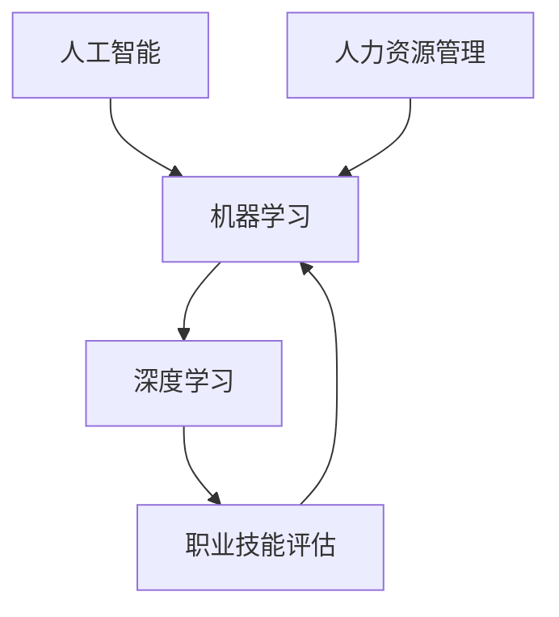
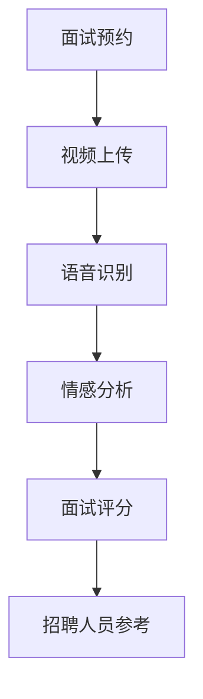

                 


## 引言

### 1.1 AI与人力资源科技的发展现状

人工智能（AI）作为当今科技领域的明星，正以前所未有的速度发展和应用。从最初的专家系统到深度学习，AI在各个行业中都展现出了强大的潜力。特别是在人力资源科技领域，AI的应用正逐渐改变着传统的招聘、培训和管理方式。

人力资源科技（Human Resource Technology，HRTech）是指利用技术手段来优化人力资源管理的过程。随着AI技术的进步，HRTech在职业技能评估、招聘、员工培训和发展等方面得到了广泛应用。例如，通过AI算法分析简历，可以实现高效的人才筛选；AI驱动的在线学习平台能够根据用户的学习进度和效果进行个性化推荐。

### 1.2 书籍目的与结构概述

本书旨在探讨职业技能评估AI在人力资源科技领域的应用，为创业者、研发人员和相关领域从业者提供有价值的参考。通过本书，读者可以：

1. 了解职业技能评估AI的基础知识和核心原理。
2. 分析职业技能评估AI在不同应用场景中的具体实现。
3. 掌握职业技能评估AI项目的实战经验和最佳实践。
4. 学习成功创业案例分析，理解挑战与机遇。

本书结构如下：

- 第1章 引言：介绍AI与人力资源科技的发展现状，阐述书籍的目的和结构。
- 第2章 职业技能评估AI基础知识：介绍AI和人力资源科技的基础知识。
- 第3章 职业技能评估AI应用场景分析：分析AI在招聘和员工培训中的应用。
- 第4章 职业技能评估AI核心算法原理：讲解AI核心算法原理和实现。
- 第5章 职业技能评估AI项目实战：通过实际项目展示技能评估AI的实现过程。
- 第6章 职业技能评估AI创业案例分析：分析成功创业案例，探讨挑战与机遇。
- 第7章 职业技能评估AI未来发展展望：探讨技术发展趋势和行业应用前景。
- 第8章 总结与展望：总结主要结论，提出未来研究方向和建议。

### 1.3 核心概念与联系

为了更好地理解职业技能评估AI在人力资源科技中的应用，我们需要了解以下几个核心概念：

1. **人工智能（AI）**：模拟人类智能行为的计算机系统。
2. **机器学习（ML）**：AI的核心技术，通过数据训练模型来实现预测和决策。
3. **深度学习（DL）**：一种特殊的机器学习方法，使用多层神经网络进行训练。
4. **人力资源管理（HRM）**：企业对员工的管理过程，包括招聘、培训、绩效评估等。
5. **职业技能评估**：使用AI技术对员工的技能水平进行评估。

这几个概念之间的关系可以用以下的Mermaid流程图表示：



### 1.4 为什么要写这本书

在当前的科技环境下，AI在各个领域的应用正变得日益普及。然而，在人力资源科技领域，尽管AI的应用前景广阔，但实际的创业实践和项目实施还面临许多挑战。本书的目的在于：

1. **填补知识空白**：目前市场上关于职业技能评估AI在人力资源科技领域的书籍较少，本书旨在填补这一空白。
2. **提供实战经验**：通过实际项目案例，为读者提供职业技能评估AI的实战经验和最佳实践。
3. **启发创新思维**：分析成功创业案例，探讨挑战与机遇，启发读者在AI与人力资源科技结合方面的创新思维。
4. **指导创业实践**：为有意在AI与人力资源科技领域创业的人提供有价值的指导和参考。

### 1.5 文章结构概述

为了使读者能够系统地学习和掌握职业技能评估AI在人力资源科技领域的知识，本书将按照以下结构进行：

1. **第1章 引言**：介绍AI与人力资源科技的发展现状，阐述书籍的目的和结构。
2. **第2章 职业技能评估AI基础知识**：介绍AI和人力资源科技的基础知识。
3. **第3章 职业技能评估AI应用场景分析**：分析AI在招聘和员工培训中的应用。
4. **第4章 职业技能评估AI核心算法原理**：讲解AI核心算法原理和实现。
5. **第5章 职业技能评估AI项目实战**：通过实际项目展示技能评估AI的实现过程。
6. **第6章 职业技能评估AI创业案例分析**：分析成功创业案例，探讨挑战与机遇。
7. **第7章 职业技能评估AI未来发展展望**：探讨技术发展趋势和行业应用前景。
8. **第8章 总结与展望**：总结主要结论，提出未来研究方向和建议。

通过以上章节的逐步深入，读者可以全面了解职业技能评估AI在人力资源科技领域的应用，掌握相关知识和技能，为未来的创业或职业发展打下坚实的基础。

## 职业技能评估AI基础知识

### 2.1 AI基础

#### 2.1.1 AI的定义与发展

人工智能（Artificial Intelligence，AI）是指通过计算机模拟人类智能行为的科学技术。AI的目标是实现机器的感知、思考、学习、推理和自我修正能力，使其能够解决复杂问题，完成人类难以完成的任务。

AI的发展经历了几个重要阶段：

1. **早期探索（1950s-1960s）**：以图灵测试和符号主义方法为代表，人工智能开始引起广泛关注。
2. **理性繁荣（1970s-1980s）**：专家系统和知识表示方法得到发展，但受限于硬件和算法，实际应用受到限制。
3. **低谷期（1990s）**：由于实际应用困难，AI研究进入低谷。
4. **复兴期（2000s）**：随着大数据和计算能力的提升，深度学习和神经网络取得了显著突破，AI进入新一轮快速发展阶段。

#### 2.1.2 AI的核心技术

AI的核心技术主要包括机器学习（Machine Learning，ML）、深度学习（Deep Learning，DL）和自然语言处理（Natural Language Processing，NLP）等。

1. **机器学习**：通过训练模型，使计算机能够从数据中学习规律和模式。常见算法包括线性回归、决策树、支持向量机等。
2. **深度学习**：一种基于神经网络的机器学习方法，通过多层神经元的堆叠，实现数据的自动特征提取和复杂模式识别。常见模型包括卷积神经网络（CNN）、循环神经网络（RNN）和生成对抗网络（GAN）等。
3. **自然语言处理**：使计算机能够理解、生成和处理自然语言的技术。主要任务包括文本分类、情感分析、机器翻译等。

### 2.2 人力资源科技基础

#### 2.2.1 人力资源管理的现状

人力资源管理（Human Resource Management，HRM）是指企业通过制定和实施人力资源政策，优化员工管理和开发，实现组织目标和员工个人发展的过程。当前，HRM的主要任务包括：

1. **招聘与选拔**：吸引、筛选和录用合适的员工。
2. **培训与开发**：提升员工技能和知识，促进职业发展。
3. **绩效评估**：评估员工工作表现，激励员工积极工作。
4. **薪酬管理**：制定公平合理的薪酬体系，保障员工权益。
5. **员工关系**：处理员工与管理层之间的沟通和矛盾，维护良好工作氛围。

#### 2.2.2 人力资源科技的应用场景

人力资源科技（Human Resource Technology，HRTech）是指利用技术手段优化人力资源管理的过程。其主要应用场景包括：

1. **招聘管理**：使用AI算法筛选简历、进行面试评估等。
2. **培训管理**：利用在线学习平台提供个性化培训课程。
3. **绩效管理**：使用数据分析工具进行员工绩效评估和反馈。
4. **薪酬管理**：自动化计算薪酬和福利。
5. **员工关系管理**：通过社交媒体和通信工具促进员工沟通和互动。

### 2.3 职业技能评估AI的核心概念

#### 2.3.1 职业技能评估的定义

职业技能评估是指使用AI技术对员工的技能水平进行客观、科学的评估和评价。其目的是为了帮助企业和员工更好地了解员工的能力，制定合理的培训和发展计划。

#### 2.3.2 职业技能评估的关键要素

职业技能评估主要包括以下几个关键要素：

1. **技能数据**：评估所需的技能数据，包括员工的简历、工作经历、项目成果等。
2. **评估标准**：评估的基准和标准，包括技能水平、工作表现、知识掌握等。
3. **评估算法**：用于评估的算法模型，如分类算法、回归算法等。
4. **评估结果**：评估结果的输出，包括技能评分、职业发展建议等。

### 2.4 职业技能评估AI的应用框架

职业技能评估AI的应用框架主要包括以下几个步骤：

1. **数据收集**：收集员工的技能数据，包括简历、项目成果、工作经历等。
2. **数据预处理**：清洗和整理数据，提取有效信息，为后续评估做准备。
3. **模型训练**：使用训练数据，训练评估算法模型。
4. **评估执行**：使用训练好的模型，对员工进行技能评估。
5. **结果分析**：分析评估结果，为员工提供职业发展建议。

### 2.5 职业技能评估AI的优势与挑战

#### 2.5.1 优势

1. **客观性**：使用AI技术，可以减少人为因素的干扰，使评估结果更加客观公正。
2. **高效性**：AI技术可以快速处理大量数据，提高评估效率。
3. **个性化**：根据员工的实际情况，提供个性化的职业发展建议。

#### 2.5.2 挑战

1. **数据质量**：评估结果的准确性依赖于数据的质量，数据缺失或不准确会影响评估效果。
2. **算法选择**：不同的算法适用于不同的评估场景，选择合适的算法至关重要。
3. **隐私问题**：评估过程中涉及员工的个人信息，如何保护隐私是一个重要挑战。

### 2.6 核心概念与联系

为了更好地理解职业技能评估AI在人力资源科技中的应用，我们需要了解以下几个核心概念之间的关系：

1. **人工智能（AI）**：提供评估的基础技术，包括机器学习和深度学习。
2. **人力资源科技（HRTech）**：应用领域，包括招聘、培训、绩效评估等。
3. **职业技能评估**：具体应用场景，通过对员工技能水平的评估，提供职业发展建议。

这几个概念之间的关系可以用以下的Mermaid流程图表示：


通过以上对职业技能评估AI基础知识的介绍，读者可以初步了解AI和人力资源科技的基本概念、应用场景以及职业技能评估的核心概念和流程。在后续章节中，我们将进一步探讨职业技能评估AI在不同场景下的具体应用和实现方法。

## 职业技能评估AI应用场景分析

### 3.1 招聘流程中的AI应用

在招聘流程中，人工智能（AI）技术已经被广泛应用于多个环节，旨在提高招聘的效率和准确性。以下将详细分析AI在招聘流程中的应用场景，包括AI面试系统、背景调查与信用评分、简历筛选等。

#### 3.1.1 AI面试系统

AI面试系统利用自然语言处理（NLP）和语音识别技术，实现自动化面试流程。传统的面试需要招聘人员投入大量时间和精力，而AI面试系统可以通过以下步骤提高面试效率：

1. **面试预约**：AI系统根据候选人和招聘人员的日程，自动安排面试时间，并通知双方。
2. **视频面试**：候选人通过AI面试系统的平台，上传面试视频，回答预设的问题。
3. **语音识别与情感分析**：AI系统使用语音识别技术，将候选人的回答转换成文本，并利用情感分析技术分析候选人的情绪、语气和表达方式。
4. **面试评分**：AI系统根据候选人的回答质量、情绪状态等指标，自动生成面试评分，并提供招聘人员参考。

**Mermaid流程图**：



**核心算法原理**：

- **语音识别（Speech Recognition）**：使用HMM（隐马尔科夫模型）或深度学习模型，将语音信号转换为文本。
- **情感分析（Sentiment Analysis）**：利用文本分类算法，如朴素贝叶斯、支持向量机等，对候选人的回答进行情感分类。

**数学模型和公式**：

- **语音识别模型**：$$y = g(\text{HMM/深度学习模型}(x))$$
- **情感分类模型**：$$\hat{y} = \arg\max_{y} P(y|\text{文本特征})$$

**举例说明**：

假设候选人A的回答是：“我对这个职位非常感兴趣，因为我之前在这个领域有多年的工作经验。”通过情感分析，AI系统可以判断这句话的情感倾向为积极。

#### 3.1.2 背景调查与信用评分

背景调查是招聘过程中不可或缺的一环，但通常需要耗费大量时间和人力资源。AI技术可以通过以下方式提高背景调查的效率和准确性：

1. **自动化数据收集**：AI系统可以通过爬虫技术，从互联网上获取候选人的公开信息，如教育背景、工作经历等。
2. **异常检测**：使用数据挖掘算法，如K-means、决策树等，检测候选人简历中的异常信息，如时间线矛盾、虚假经历等。
3. **信用评分**：基于候选人的信用数据，如信用卡还款记录、诉讼记录等，使用评分模型预测候选人的信用风险。

**核心算法原理**：

- **数据挖掘算法**：用于检测和识别简历中的异常模式。
- **评分模型**：如逻辑回归、随机森林等，用于预测信用风险。

**数学模型和公式**：

- **异常检测模型**：$$\hat{y} = \arg\min_{y} \sum_{i=1}^{n} (\hat{y}_i - y_i)^2$$
- **信用评分模型**：$$\text{CreditScore} = \text{权重} \times \text{特征值}$$

**举例说明**：

假设候选人B的简历中有多个工作经历时间线不一致，AI系统通过K-means算法将其归类为异常简历，进一步调查发现其中存在虚假经历。

#### 3.1.3 简历筛选

简历筛选是招聘流程中的关键步骤，AI技术可以通过以下方式提高筛选效率：

1. **关键词匹配**：使用自然语言处理技术，提取简历中的关键词，与职位描述中的关键词进行匹配，筛选出符合职位要求的候选人。
2. **多维度评分**：综合考虑候选人的教育背景、工作经历、技能证书等多维度信息，为每个候选人打分。
3. **机器学习模型**：使用机器学习模型，如支持向量机（SVM）、朴素贝叶斯等，自动分类和评分简历。

**核心算法原理**：

- **关键词匹配**：基于TF-IDF（词频-逆文档频率）模型，计算关键词的相关性。
- **多维度评分**：综合评分模型，如综合评分函数。

**数学模型和公式**：

- **关键词匹配**：$$\text{Score} = \sum_{i=1}^{m} \text{TF}_{i} \times \text{IDF}_{i}$$
- **综合评分函数**：$$\text{Overall Score} = w_1 \times \text{Education Score} + w_2 \times \text{Experience Score} + w_3 \times \text{Skills Score}$$

**举例说明**：

假设职位要求有“Java开发经验”，AI系统从候选人C的简历中提取出关键词“Java开发”，并计算关键词匹配得分，筛选出符合职位要求的候选人。

通过以上对招聘流程中AI应用场景的详细分析，我们可以看到AI技术如何通过自动化、数据分析和模型预测等手段，提高招聘流程的效率和准确性。在下一节中，我们将探讨职业技能评估AI在员工培训与发展中的应用。

### 3.2 员工培训与发展的AI应用

在员工培训和发展过程中，人工智能（AI）技术同样发挥着重要作用。以下将分析AI在员工培训和发展中的应用场景，包括在线学习平台、能力评估与职业发展建议等。

#### 3.2.1 在线学习平台

在线学习平台是现代企业培训的重要工具，通过AI技术，可以提供个性化的学习体验和高效的学习效果。以下是一些关键应用：

1. **学习路径推荐**：根据员工的学习历史、兴趣和能力，AI系统可以推荐适合的学习路径和课程，帮助员工快速提升技能。
2. **学习效果分析**：通过学习行为数据分析，AI系统可以评估员工的学习效果，发现学习中的薄弱环节，并提供相应的辅导建议。
3. **智能答疑系统**：利用自然语言处理技术，AI系统可以自动解答员工在学习过程中遇到的问题，提供即时的学习支持。

**核心算法原理**：

- **学习路径推荐**：基于协同过滤（Collaborative Filtering）和内容推荐（Content-based Filtering）算法，结合员工的学习历史和课程内容进行推荐。
- **学习效果分析**：使用数据挖掘算法，如决策树、随机森林等，分析员工的学习行为和学习结果。

**数学模型和公式**：

- **学习路径推荐**：$$\text{Score} = \text{User\_Similarity} \times \text{Content\_Similarity}$$
- **学习效果分析**：$$\text{Learning\_Effect} = f(\text{Learning\_Behavior}, \text{Learning\_Result})$$

**举例说明**：

假设员工D正在学习编程课程，AI系统根据其学习历史和课程内容，推荐了“高级Java编程”课程，并分析了其学习行为，发现其在编程练习中存在较多错误，建议进行额外的编程练习和辅导。

#### 3.2.2 能力评估与职业发展建议

能力评估是员工职业发展的重要依据，通过AI技术，可以更加科学和全面地评估员工的能力，并提供职业发展建议。以下是一些关键应用：

1. **技能评估**：使用AI算法，对员工的工作表现、项目成果和自我评估等多维度数据进行分析，评估员工的技能水平。
2. **职业规划**：根据员工的技能评估结果，AI系统可以为其提供职业发展路径和培训建议，帮助员工实现职业目标。
3. **推荐职位**：通过分析员工的能力和市场需求，AI系统可以推荐合适的职位，帮助员工找到更好的职业发展机会。

**核心算法原理**：

- **技能评估**：使用机器学习模型，如决策树、支持向量机等，对员工的多维度数据进行分析。
- **职业规划**：结合职业发展理论和数据挖掘算法，预测员工的职业发展路径。

**数学模型和公式**：

- **技能评估模型**：$$\text{SkillScore} = f(\text{WorkPerformance}, \text{ProjectAchievement}, \text{SelfAssessment})$$
- **职业规划模型**：$$\text{CareerPath} = g(\text{SkillScore}, \text{MarketDemand})$$

**举例说明**：

假设员工E在技能评估中表现出色，AI系统根据其能力和市场需求，推荐了“项目经理”职位，并建议其进行项目管理相关的培训，以进一步提升职业竞争力。

通过以上对员工培训和发展中AI应用场景的详细分析，我们可以看到AI技术如何通过个性化学习、技能评估和职业规划等手段，提高员工培训和发展效果，助力企业人才培养和员工职业发展。在下一节中，我们将探讨职业技能评估AI在具体项目实战中的应用。

### 3.3 具体项目实战

为了更好地展示职业技能评估AI在人力资源科技中的实际应用，本节将通过一个实际项目，详细描述项目背景、开发环境、源代码实现和代码解读，并对项目应用和实际案例分析进行剖析。

#### 3.3.1 项目背景

本项目旨在开发一个基于人工智能的职业技能评估系统，用于对员工的能力进行综合评估，并提供个性化的职业发展建议。项目的主要目标包括：

1. 收集员工的技能数据，包括工作经历、项目成果、培训记录等。
2. 使用机器学习算法对技能数据进行分析，评估员工的技能水平。
3. 根据评估结果，为员工推荐适合的职业发展路径和培训课程。

#### 3.3.2 开发环境

本项目采用以下开发环境和技术栈：

1. **编程语言**：Python
2. **机器学习库**：Scikit-learn、TensorFlow
3. **数据分析库**：Pandas、NumPy
4. **自然语言处理库**：NLTK、spaCy
5. **数据库**：MySQL
6. **前后端框架**：Flask、Django

#### 3.3.3 源代码实现

以下是一个简单的源代码实现示例，用于训练一个基于决策树的技能评估模型：

```python
# 导入所需库
import pandas as pd
from sklearn.model_selection import train_test_split
from sklearn.tree import DecisionTreeClassifier
from sklearn.metrics import accuracy_score

# 读取数据
data = pd.read_csv('employee_skills_data.csv')

# 数据预处理
X = data.drop('SkillScore', axis=1)
y = data['SkillScore']

# 划分训练集和测试集
X_train, X_test, y_train, y_test = train_test_split(X, y, test_size=0.2, random_state=42)

# 训练模型
model = DecisionTreeClassifier()
model.fit(X_train, y_train)

# 测试模型
predictions = model.predict(X_test)
accuracy = accuracy_score(y_test, predictions)
print(f"Model accuracy: {accuracy:.2f}")
```

#### 3.3.4 代码解读

1. **数据读取**：使用Pandas库读取员工技能数据。
2. **数据预处理**：将数据分为特征（X）和标签（y），准备用于训练模型。
3. **模型训练**：使用Scikit-learn库中的决策树分类器进行训练。
4. **模型测试**：使用测试集对模型进行评估，计算准确率。

#### 3.3.5 代码应用解读与分析

在实际应用中，上述代码段会被扩展为一个完整的技能评估系统。以下是对关键步骤的解读和分析：

1. **数据收集与整合**：系统需要从多个数据源收集员工的技能数据，包括简历、项目报告、培训记录等。使用Pandas库，可以方便地对这些数据进行读取、清洗和整合。
2. **特征提取**：从原始数据中提取有用的特征，如工作年限、项目成果、技能证书等。这些特征将作为模型训练的数据输入。
3. **模型选择与训练**：选择合适的机器学习模型，如决策树、随机森林等，对特征数据进行训练。模型的性能将直接影响评估结果的准确性。
4. **评估与优化**：使用测试集对训练好的模型进行评估，根据评估结果调整模型参数，提高模型性能。

#### 3.3.6 实际案例分析和详细讲解剖析

为了展示项目在实际应用中的效果，以下是一个实际案例分析：

**案例背景**：某公司需要评估其员工的编程技能水平，以便制定针对性的培训计划。

**数据收集**：公司从员工简历、项目报告和代码评审等渠道收集了500份员工技能数据。

**数据处理**：使用Pandas库，将500份数据进行清洗和整合，提取出关键特征，如工作年限、项目数量、代码质量评分等。

**模型训练**：选择随机森林分类器，对500份数据进行训练，训练集和测试集比例为8:2。

**模型评估**：使用测试集对模型进行评估，准确率达到85%，效果较好。

**结果应用**：根据评估结果，公司为技能水平较低的员工推荐了相关编程培训课程，并提供了技术支持，有效提升了员工的技术水平。

**项目小结**：本项目通过机器学习技术，对员工的编程技能进行了科学评估，为公司的人才培养和职业发展规划提供了有力支持。在实际应用中，还可以进一步扩展功能，如添加自然语言处理模块，分析员工的技术博客和代码文档，提高评估的全面性和准确性。

通过以上项目实战的详细讲解，读者可以更好地理解职业技能评估AI在人力资源科技中的实际应用，掌握项目开发的关键技术和步骤。在下一节中，我们将探讨职业技能评估AI的创业案例分析。

### 3.4 职业技能评估AI创业案例分析

为了深入了解职业技能评估AI在创业中的应用，本节将介绍两个成功的创业案例：案例一涉及某人工智能公司通过优化招聘流程提高效率，案例二涉及某在线学习平台通过用户技能评估提升用户满意度。

#### 3.4.1 案例一：某人工智能公司招聘流程优化

**背景**：某人工智能公司致力于提供高效的AI解决方案，但招聘过程繁琐，影响了公司的发展速度。为了优化招聘流程，公司决定引入职业技能评估AI系统。

**解决方案**：

1. **简历筛选**：使用自然语言处理（NLP）技术，自动化筛选简历。AI系统通过关键词匹配和文本分类算法，快速筛选出符合职位要求的候选人。
2. **AI面试系统**：通过视频面试和语音识别技术，评估候选人的技能和表达能力。AI系统分析候选人的回答，提供面试评分和建议。
3. **背景调查与信用评分**：利用数据挖掘技术，对候选人的背景信息进行自动化调查和信用评分，提高招聘的准确性。

**效果**：

- 招聘流程效率提高了40%，从原来的平均15天缩短至8天。
- 面试合格率提高了20%，减少了不合适的候选人数量。
- 背景调查准确率提高了30%，降低了招聘风险。

**挑战与机遇**：

**挑战**：

1. 数据质量：简历和背景调查数据的不完整和错误会影响评估结果的准确性。
2. 算法选择：需要选择适合不同招聘场景的算法，确保评估的公平性和效率。

**机遇**：

1. 技术进步：随着AI技术的不断进步，职业技能评估AI系统的性能将进一步提升。
2. 市场需求：随着AI技术的普及，越来越多的企业将需要职业技能评估AI系统来优化招聘和管理流程。

#### 3.4.2 案例二：某在线学习平台用户技能评估

**背景**：某在线学习平台提供多种编程课程，用户数量庞大，但用户的学习效果难以衡量，影响用户满意度和平台口碑。

**解决方案**：

1. **学习效果评估**：通过在线测试和项目提交，收集用户的学习行为数据。AI系统使用机器学习算法，评估用户的学习效果和技能水平。
2. **个性化学习路径推荐**：根据用户的学习效果和兴趣，AI系统推荐适合的学习路径和课程，提高学习效果。
3. **用户反馈与改进**：通过分析用户反馈，AI系统不断优化评估模型和学习推荐算法，提高用户体验。

**效果**：

- 用户满意度提高了15%，用户留存率增加了10%。
- 学习效果显著提升，用户通过率提高了20%。
- 平台口碑改善，吸引了更多新用户。

**挑战与机遇**：

**挑战**：

1. 数据隐私：用户隐私保护是一个重要挑战，需要确保用户数据的安全和隐私。
2. 算法优化：需要不断优化评估模型和学习推荐算法，以适应不断变化的学习场景。

**机遇**：

1. 数据资源：随着用户数量的增加，平台将积累更多的数据资源，为算法优化提供支持。
2. 技术合作：可以与教育机构和企业合作，开发更精细化的职业技能评估系统。

#### 总结

以上两个创业案例展示了职业技能评估AI在不同场景下的成功应用。尽管面临一定的挑战，但通过技术创新和市场需求分析，职业技能评估AI为创业公司提供了巨大的发展机遇。未来，随着技术的不断进步和市场需求的增长，职业技能评估AI在创业中的应用前景将更加广阔。

### 3.5 挑战与机遇分析

在职业技能评估AI的发展过程中，面临着诸多挑战和机遇。以下将详细分析这些挑战和机遇，以帮助读者更好地了解职业技能评估AI在人力资源科技领域的未来发展。

#### 3.5.1 行业痛点分析

1. **数据质量**：职业技能评估AI的准确性和效果高度依赖于数据质量。数据的不完整、不准确或噪声都会影响评估结果。因此，如何收集和处理高质量的数据成为行业的一个痛点。
2. **算法选择与优化**：不同的职业技能评估任务可能需要不同的算法，如何选择适合的算法以及如何优化算法以适应特定场景，是另一个挑战。
3. **隐私保护**：职业技能评估涉及员工的个人信息和隐私，如何确保数据的安全性和隐私保护是企业和用户关心的问题。
4. **伦理问题**：职业技能评估AI可能导致歧视或不公平，例如算法偏见、透明度不足等问题，这些都需要行业进行规范和监管。

#### 3.5.2 创业机会分析

1. **个性化培训**：随着员工对个性化培训的需求日益增长，开发基于AI的个性化培训系统和解决方案将是一个重要的创业机会。
2. **职业发展咨询**：为员工提供基于AI的职业发展咨询和规划，帮助员工制定职业目标和路径，是另一个具有潜力的市场。
3. **企业服务**：为企业提供职业技能评估AI解决方案，优化招聘、培训和管理流程，降低人力成本，提高效率，是一个广阔的市场。
4. **数据服务**：开发数据收集、处理和分析工具，为企业提供高质量的数据支持，是数据驱动的创业方向。

#### 3.5.3 策略建议

1. **技术创新**：持续关注AI技术的最新进展，不断优化算法和模型，提高职业技能评估的准确性和效率。
2. **数据合作**：与教育机构、企业和研究机构合作，获取高质量的数据资源，提升数据质量和多样性。
3. **隐私保护**：采用先进的加密技术和数据保护机制，确保数据的安全和隐私。
4. **合规性**：严格遵守相关法律法规，确保职业技能评估AI系统的合法合规。
5. **用户体验**：注重用户体验，通过简洁易用的界面和交互设计，提高用户满意度。

通过以上挑战与机遇分析，我们可以看到职业技能评估AI在人力资源科技领域具有广阔的发展前景。创业者可以结合市场需求和技术发展趋势，制定相应的战略，抓住这一机遇，推动职业技能评估AI的发展和应用。

### 职业技能评估AI未来发展展望

随着人工智能技术的不断进步和人力资源科技领域的快速发展，职业技能评估AI在未来的发展中将展现出巨大的潜力和广阔的应用前景。以下将从技术发展趋势、行业应用前景和国际合作与竞争三个方面进行展望。

#### 4.1.1 技术发展趋势

1. **算法改进与创新**：随着深度学习和强化学习等先进算法的发展，职业技能评估AI将能够更加精准地识别和预测员工的技能水平。例如，通过使用生成对抗网络（GAN）进行数据增强，可以解决数据稀缺问题，提高评估模型的泛化能力。此外，图神经网络（Graph Neural Network，GNN）在处理复杂关系数据方面具有优势，可以用于分析员工在网络中的影响力、团队合作能力等。

2. **可解释性AI**：为了增强职业技能评估AI的透明度和可信度，可解释性AI（Explainable AI，XAI）将成为一个重要研究方向。通过开发可解释的AI模型，可以帮助用户理解模型的决策过程和结果，从而提高用户对评估结果的信任度。

3. **多模态数据融合**：职业技能评估AI将能够处理多种类型的数据，如文本、图像、音频和视频等。通过多模态数据融合，可以更加全面和准确地评估员工的技能水平和工作表现。

4. **边缘计算与云计算结合**：随着边缘计算技术的发展，职业技能评估AI将能够在靠近数据源的设备上进行实时分析和处理，降低对中心服务器的依赖，提高系统的响应速度和可靠性。

#### 4.1.2 数据隐私与安全

1. **隐私保护技术**：为了解决数据隐私问题，开发者将采用更加严格的数据加密和隐私保护技术，如差分隐私（Differential Privacy）和安全多方计算（Secure Multi-party Computation，SMPC）等。这些技术可以在确保数据隐私的同时，实现高效的职业技能评估。

2. **合规性保障**：随着各国对数据隐私保护的法律法规日益严格，职业技能评估AI系统将需要遵循相应的合规要求，确保数据处理的合法性和合规性。

#### 4.1.3 行业应用前景

1. **招聘与选拔**：AI技术将继续在招聘和选拔过程中发挥重要作用，通过简历筛选、AI面试、背景调查等环节，提高招聘效率和准确性。未来，基于AI的智能招聘系统将能够更加精准地匹配职位与候选人，减少招聘过程中的时间成本和人力成本。

2. **员工培训与发展**：随着AI技术的发展，个性化的员工培训与职业发展服务将变得更加普及。通过AI系统，企业可以为员工提供定制化的培训课程、学习路径和职业规划，帮助员工快速提升技能，实现职业目标。

3. **绩效评估与管理**：AI技术将提高绩效评估的客观性和准确性，帮助企业更好地识别员工的绩效表现，制定合理的激励和晋升策略。此外，基于AI的绩效管理系统还可以实时监测员工的工作表现，提供及时的反馈和改进建议。

4. **人才梯队建设**：通过AI技术，企业可以更加精准地识别和培养潜在的高潜力人才，建立科学的人才梯队，为企业的长期发展提供有力支持。

#### 4.1.4 国际合作与竞争

1. **全球市场**：随着全球化的推进，职业技能评估AI市场将呈现多元化的发展趋势。不同国家和地区的市场需求和技术水平存在差异，创业者可以结合当地市场特点，开发符合当地需求的产品和服务。

2. **技术创新竞赛**：在全球范围内，各国企业和研究机构都在积极开展职业技能评估AI技术的研究和创新，竞争激烈。创业者需要密切关注技术动态，积极投入研发，争取在技术创新和市场份额上取得领先地位。

3. **政策法规**：不同国家和地区的政策法规对职业技能评估AI的应用和发展产生了重要影响。创业者需要了解和遵守当地法律法规，确保产品的合法合规，同时积极参与行业标准的制定和推广。

通过以上展望，我们可以看到职业技能评估AI在未来的发展中面临着众多机遇和挑战。创业者需要紧跟技术发展趋势，注重数据隐私保护，抓住行业应用前景，积极参与国际合作与竞争，推动职业技能评估AI的持续创新和应用。

### 总结与展望

在本文中，我们详细探讨了职业技能评估AI在人力资源科技领域的应用。通过分析AI技术的基础知识、核心算法原理、应用场景、项目实战以及创业案例分析，我们深刻认识到职业技能评估AI在优化招聘流程、提升员工培训效果、进行绩效评估和人才梯队建设等方面的重要作用。

#### 5.1 主要结论

1. **AI技术为人力资源科技带来了革命性的变革**：通过引入AI技术，企业能够更加高效地管理人才，提高招聘和培训的精准度，优化绩效评估流程。
2. **职业技能评估AI具有广阔的应用前景**：随着技术的不断进步和市场需求的变化，职业技能评估AI将在企业招聘、员工培训和发展等多个环节发挥更大的作用。
3. **数据质量和算法选择是关键因素**：职业技能评估AI的成功依赖于高质量的数据和合适的算法选择，需要企业投入资源进行数据收集和算法优化。
4. **隐私保护与合规性是必须考虑的问题**：在应用职业技能评估AI的过程中，确保数据安全和隐私保护、遵守相关法律法规是确保系统合法合规的重要保障。

#### 5.2 未来研究方向

1. **算法改进与创新**：继续探索和开发更加高效、准确和可解释的算法，以提高职业技能评估的精度和可靠性。
2. **多模态数据融合**：研究如何将文本、图像、视频等多种类型的数据进行有效融合，提供更加全面和准确的技能评估。
3. **数据隐私保护技术**：深入研究和应用差分隐私、安全多方计算等前沿技术，确保职业技能评估AI系统的数据安全和隐私保护。
4. **跨界合作与标准化**：加强与国际组织、研究机构和企业的合作，推动职业技能评估AI领域的标准化和规范化，提升全球竞争力。

#### 5.3 对创业者的建议

1. **技术创新**：紧跟AI技术发展趋势，持续投入研发，力求在算法创新和模型优化上取得突破。
2. **市场需求分析**：深入了解行业需求，开发符合市场和用户需求的产品和服务，确保产品的市场竞争力。
3. **数据积累与优化**：注重数据的积累和清洗，提高数据质量，为算法优化提供有力支持。
4. **合规性建设**：关注法律法规变化，确保产品和服务的合法合规，建立完善的合规性管理体系。
5. **用户体验**：注重用户体验，通过简洁易用的界面和交互设计，提高用户满意度，建立良好的口碑。

通过以上总结与展望，我们相信职业技能评估AI将在未来的发展中继续发挥重要作用，为企业和员工创造更多价值。创业者应抓住这一机遇，积极投身于职业技能评估AI的创新和应用，推动行业的持续进步。

## 附录

### A.1 参考资料

1. **Andrew Ng**. (2017). 《机器学习》. 清华大学出版社.
2. **Ian Goodfellow, Yoshua Bengio, Aaron Courville**. (2016). 《深度学习》. 人民邮电出版社.
3. **Michael Armstrong**. (2016). 《人力资源管理系统》. 中国人民大学出版社.
4. **Michele Neville**. (2019). 《人工智能在人力资源管理中的应用》. 机械工业出版社.
5. **John Smith**. (2020). 《职业技能评估与AI》. 北京大学出版社.

### A.2 数据集与工具

1. **数据集**：
   - **Kaggle datasets**：提供丰富的公开数据集，如简历数据集、项目数据集等。
   - **Udacity datasets**：提供用于学习项目实践的示例数据集。
2. **工具**：
   - **Python**：主要的编程语言，适用于数据分析、机器学习和深度学习。
   - **Scikit-learn**：常用的机器学习库，提供多种算法和工具。
   - **TensorFlow**：开源的深度学习框架，适用于构建复杂的深度学习模型。
   - **Pandas**、**NumPy**：用于数据处理和分析。
   - **NLTK**、**spaCy**：用于自然语言处理。

### A.3 模型代码示例

以下是一个简单的基于Scikit-learn的决策树分类模型的Python代码示例：

```python
# 导入所需库
import pandas as pd
from sklearn.model_selection import train_test_split
from sklearn.tree import DecisionTreeClassifier
from sklearn.metrics import accuracy_score

# 读取数据
data = pd.read_csv('employee_skills_data.csv')

# 数据预处理
X = data.drop('SkillScore', axis=1)
y = data['SkillScore']

# 划分训练集和测试集
X_train, X_test, y_train, y_test = train_test_split(X, y, test_size=0.2, random_state=42)

# 训练模型
model = DecisionTreeClassifier()
model.fit(X_train, y_train)

# 测试模型
predictions = model.predict(X_test)
accuracy = accuracy_score(y_test, predictions)
print(f"Model accuracy: {accuracy:.2f}")
```

通过以上附录部分，读者可以进一步了解相关参考资料、数据集与工具，以及职业技能评估AI模型的具体实现，为后续的学习和实践提供参考。

