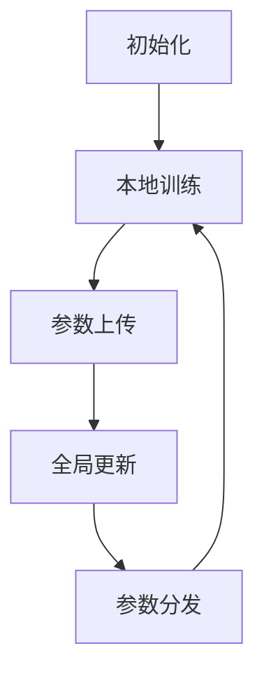
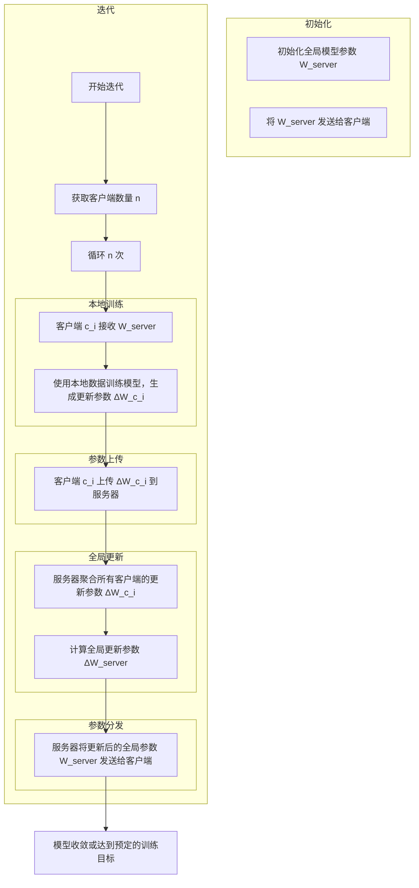

                 

### 文章标题：联邦学习在多方安全计算中的应用

联邦学习（Federated Learning）作为一种新兴的数据隐私保护技术，正逐渐成为多方安全计算（Multi-party Secure Computing）领域的研究热点。本文将深入探讨联邦学习在多方安全计算中的应用，从基础概念、架构设计、安全机制，到实际案例，全面解析这一技术的优势与挑战。

关键词：联邦学习、多方安全计算、隐私保护、分布式计算、安全机制

摘要：本文首先介绍了联邦学习的基本概念和发展背景，随后详细分析了其在多方安全计算中的应用架构和安全机制。通过具体实例，展示了联邦学习在医疗和金融领域的实际应用效果，并探讨了其中的算法实现和实践指南。最后，文章展望了联邦学习的未来发展趋势和潜在机遇。

本文结构如下：

1. **联邦学习基础**
   - **第1章：联邦学习的核心概念**
   - **第2章：联邦学习的基本架构**
   - **第3章：联邦学习的安全机制**

2. **联邦学习在多方安全计算中的应用**
   - **第4章：联邦学习在多方安全计算中的挑战**
   - **第5章：联邦学习在多方安全计算中的应用实例**
   - **第6章：联邦学习在多方安全计算中的算法实现**

3. **联邦学习在多方安全计算中的实践指南**
   - **第7章：联邦学习在多方安全计算中的实践指南**

4. **联邦学习在多方安全计算中的未来展望**
   - **第8章：联邦学习的未来展望**

希望通过本文，读者能够全面了解联邦学习在多方安全计算中的应用，把握这一技术的前沿动态，为未来的研究和实践提供参考。

## 第1章：联邦学习的核心概念

### 1.1 联邦学习的起源与发展

联邦学习（Federated Learning）起源于2017年，由Google提出并广泛应用。其核心理念是在多个独立的设备或服务器上进行机器学习模型的训练，而不是将数据集中到一个中心服务器。这样，不仅提高了数据隐私保护水平，还能有效降低数据传输带宽和计算成本。

联邦学习的发展历程经历了几个关键阶段：

1. **初始阶段（2017-2018年）**：Google在移动设备上首次实现了联邦学习，主要应用于语音识别和图像识别任务。这一阶段的主要目标是在保持高准确率的同时，保护用户隐私。
2. **扩展阶段（2018-2020年）**：随着联邦学习技术的成熟，越来越多的研究机构和企业开始关注并应用这一技术。例如，Facebook利用联邦学习在多个设备上实现个性化推荐，增强了用户体验。
3. **应用阶段（2020年至今）**：联邦学习在多个领域取得了显著应用成果，包括医疗、金融、物联网等。同时，联邦学习的算法和框架也在不断优化和改进，以满足更复杂的场景需求。

### 1.2 联邦学习的基本概念

联邦学习的基本概念包括以下几方面：

1. **参与方**：联邦学习涉及多个参与方，包括服务器（Server）、客户端（Client）和数据拥有方（Data Owner）。服务器负责协调训练过程，客户端负责运行模型并在本地设备上进行数据训练，数据拥有方则负责提供数据。

2. **通信架构**：联邦学习的通信架构通常采用客户端-服务器模型。客户端定期向服务器发送模型参数更新，服务器则汇总这些更新并生成新的模型参数，再将更新后的模型参数发送回客户端。

3. **隐私保护**：联邦学习的核心优势之一是隐私保护。通过将数据留在本地设备上，联邦学习避免了数据集中传输，从而降低了隐私泄露的风险。

4. **分布式训练**：联邦学习通过分布式训练方式提高模型性能。每个客户端在本地设备上训练模型，并将更新后的参数发送给服务器，服务器汇总这些参数并生成新的模型。这一过程不断迭代，直到模型收敛。

### 1.3 联邦学习与传统机器学习的区别

联邦学习与传统机器学习有以下几个关键区别：

1. **数据集中与分散**：传统机器学习将数据集中到一个中心服务器进行训练，而联邦学习则将数据分散到多个设备或服务器上进行训练。
2. **通信模式**：传统机器学习需要大量数据传输，而联邦学习通过参数更新通信，大大减少了数据传输量。
3. **隐私保护**：传统机器学习存在隐私泄露风险，而联邦学习通过本地训练和参数更新，有效保护用户隐私。
4. **计算资源分配**：传统机器学习需要大量计算资源集中在中心服务器，而联邦学习则将计算资源分散到各个客户端，降低了服务器负载。

### 1.4 联邦学习的主要应用场景

联邦学习在多个领域具有广泛的应用前景：

1. **医疗领域**：联邦学习可以用于隐私敏感的医疗数据分析，如疾病预测和诊断。通过保护患者隐私，联邦学习有助于推动医疗数据共享和合作。
2. **金融领域**：联邦学习可以用于金融数据分析，如欺诈检测和风险控制。通过保护客户隐私，联邦学习有助于提高金融服务的安全性和效率。
3. **物联网领域**：联邦学习可以用于物联网设备的数据分析，如设备故障预测和优化。通过保护设备数据隐私，联邦学习有助于提高物联网系统的可靠性和安全性。
4. **社交网络领域**：联邦学习可以用于社交网络的数据分析，如用户行为分析和个性化推荐。通过保护用户隐私，联邦学习有助于提高社交网络的用户体验。

### 1.5 联邦学习的优势和挑战

联邦学习具有以下优势：

1. **隐私保护**：通过本地训练和参数更新，联邦学习有效保护了用户隐私。
2. **分布式计算**：联邦学习将计算资源分散到各个客户端，降低了中心服务器的负载。
3. **灵活性**：联邦学习适用于多种场景，包括医疗、金融、物联网和社交网络等。
4. **实时性**：联邦学习可以快速更新模型，提高系统的实时性。

然而，联邦学习也面临以下挑战：

1. **通信带宽**：联邦学习需要大量通信带宽，特别是在大规模分布式系统中。
2. **计算资源**：联邦学习需要足够的计算资源支持客户端和服务器之间的通信和模型更新。
3. **算法优化**：联邦学习算法需要不断优化，以提高模型性能和训练效率。
4. **安全性和可靠性**：联邦学习需要确保通信安全和模型可靠性，以防止恶意攻击和数据泄露。

本章通过介绍联邦学习的起源、基本概念、与传统机器学习的区别以及主要应用场景，为后续章节的深入探讨奠定了基础。

## 第2章：联邦学习的基本架构

### 2.1 联邦学习的通信架构

联邦学习的通信架构是其实际应用的基础，它决定了联邦学习系统的性能和可靠性。联邦学习的通信架构通常采用客户端-服务器模型，其中客户端和服务器分别承担不同的角色和功能。

#### 2.1.1 客户端-服务器模型

在客户端-服务器模型中，客户端负责在本地设备上运行机器学习模型，并收集本地数据。服务器则负责协调训练过程，管理全局模型参数，并分发更新后的模型参数给客户端。具体步骤如下：

1. **初始化**：服务器初始化全局模型参数，并将初始参数发送给客户端。
2. **本地训练**：客户端使用本地数据和初始参数进行模型训练，生成更新后的模型参数。
3. **参数上传**：客户端将更新后的模型参数上传到服务器。
4. **全局更新**：服务器收集来自所有客户端的更新参数，计算全局更新参数。
5. **参数分发**：服务器将更新后的全局参数发送回客户端。
6. **重复步骤**：客户端使用新的全局参数继续进行本地训练，并重复上述步骤。

#### 2.1.2 通信协议

联邦学习通信协议是客户端和服务器之间进行数据传输的规则。常用的通信协议包括：

1. **同步通信协议**：同步通信协议要求所有客户端在同一时间上传更新参数，并在接收到全局更新参数后同步更新本地模型。这种协议具有较高的全局一致性，但可能受限于客户端的通信带宽和处理能力。
2. **异步通信协议**：异步通信协议允许客户端在不同的时间上传更新参数，服务器则在任意时刻汇总这些参数进行全局更新。这种协议具有较好的可扩展性和灵活性，但可能面临全局一致性问题。

#### 2.1.3 数据传输优化

在联邦学习中，数据传输是影响系统性能的关键因素。为了优化数据传输，可以采取以下措施：

1. **参数压缩**：通过参数压缩技术，减少需要传输的参数大小。常见的压缩方法包括量化、稀疏编码等。
2. **差分更新**：使用差分更新方法，只传输模型参数的更新部分，而不是整个模型参数。这可以显著减少数据传输量。
3. **多跳传输**：通过多跳传输，将数据从客户端传输到服务器，降低单点传输带宽压力。这需要设计合适的路由算法和传输策略。

### 2.2 联邦学习的客户端-服务器模型

联邦学习的客户端-服务器模型是联邦学习通信架构的核心，它决定了联邦学习系统的性能和可靠性。在这个模型中，客户端和服务器分别扮演不同的角色，协同工作以实现模型的分布式训练。

#### 2.2.1 客户端角色

客户端是联邦学习系统中的边缘设备，如智能手机、物联网设备等。客户端的主要任务是：

1. **数据采集**：从本地设备中收集数据，包括用户行为数据、传感器数据等。
2. **模型训练**：使用本地数据和全局模型参数，在本地设备上进行模型训练，生成更新后的模型参数。
3. **参数上传**：将本地训练得到的更新参数上传到服务器。

客户端需要处理以下关键问题：

1. **数据预处理**：对收集到的数据进行预处理，如去噪、归一化等，以提高模型训练效果。
2. **隐私保护**：在数据上传过程中，需要采取隐私保护措施，如差分隐私、同态加密等，以保护用户隐私。
3. **计算资源管理**：客户端需要合理分配计算资源，确保模型训练和上传参数的过程不会影响设备正常运行。

#### 2.2.2 服务器角色

服务器是联邦学习系统中的中心节点，负责全局模型的管理和更新。服务器的主要任务是：

1. **全局模型管理**：初始化全局模型参数，并在训练过程中进行全局参数的更新和管理。
2. **参数聚合**：接收来自所有客户端的更新参数，进行全局参数的聚合计算。
3. **参数分发**：将更新后的全局参数发送回客户端。

服务器需要处理以下关键问题：

1. **数据安全**：确保数据传输过程中不会泄露用户隐私，采用加密、签名等技术进行数据保护。
2. **负载均衡**：合理分配服务器资源，避免服务器过载或资源不足。
3. **容错性**：确保服务器在高负载或故障情况下仍能稳定运行，采用冗余设计和故障恢复机制。

#### 2.2.3 客户端-服务器通信流程

客户端-服务器通信流程是联邦学习模型训练的核心环节。以下是典型的客户端-服务器通信流程：

1. **初始化**：服务器初始化全局模型参数，并将初始参数发送给客户端。
2. **本地训练**：客户端接收全局模型参数，在本地设备上使用本地数据进行模型训练，生成更新后的模型参数。
3. **参数上传**：客户端将本地训练得到的更新参数上传到服务器。
4. **全局更新**：服务器接收来自所有客户端的更新参数，进行全局参数的聚合计算，生成更新后的全局模型参数。
5. **参数分发**：服务器将更新后的全局参数发送回客户端。
6. **本地训练**：客户端使用新的全局参数继续进行本地训练，并重复上述步骤。

这一流程不断迭代，直到模型收敛或满足预定的训练目标。客户端-服务器通信流程的优化和优化对联邦学习的性能至关重要。

通过分析联邦学习的通信架构和客户端-服务器模型，我们可以更好地理解联邦学习系统的设计和实现。在接下来的章节中，我们将进一步探讨联邦学习的安全机制，以应对多方安全计算中的隐私保护需求。

### 2.3 联邦学习中的数据传输优化

在联邦学习中，数据传输的优化是提高系统性能和效率的关键环节。由于联邦学习涉及多个客户端和服务器之间的频繁通信，数据传输量可能会非常大。因此，优化数据传输不仅有助于降低通信带宽消耗，还能提高模型训练速度和整体系统性能。

以下是一些常见的数据传输优化技术：

#### 2.3.1 参数压缩

参数压缩是一种通过减少模型参数大小来降低数据传输量的技术。常见的参数压缩方法包括：

1. **量化**：量化技术通过降低模型参数的精度来减少数据大小。例如，将浮点数参数转换为整数表示，可以显著减少传输数据量。
2. **稀疏编码**：稀疏编码技术通过识别和保留模型参数中的非零元素，将参数表示为稀疏矩阵。这样可以大大减少需要传输的数据量，特别是对于大规模模型。
3. **低秩分解**：低秩分解技术将高维参数矩阵分解为低维矩阵的乘积，从而减少数据传输量。这种方法适用于具有低秩特性的参数矩阵。

#### 2.3.2 差分更新

差分更新是一种通过传输模型参数的差分来减少数据传输量的技术。具体方法如下：

1. **计算差分**：在每次模型更新后，计算全局模型参数与本地模型参数之间的差分。
2. **传输差分**：只传输差分值，而不是整个全局模型参数。这样可以显著减少需要传输的数据量。
3. **累积差分**：在某些情况下，可以累积多个更新步骤的差分，再进行传输。这种方法可以进一步减少传输次数和数据量。

#### 2.3.3 多跳传输

多跳传输是一种通过多个中间节点传输数据来降低单点传输带宽压力的技术。具体方法如下：

1. **路由算法**：设计合适的路由算法，确定数据从客户端到服务器的传输路径。
2. **中间节点**：在传输路径上设置中间节点，将数据从源节点传输到目标节点。中间节点可以缓存部分数据，以减少传输延迟和数据重复传输。
3. **传输策略**：根据网络带宽和延迟，动态调整传输策略，优先传输重要数据和高效传输路径。

#### 2.3.4 异步通信

异步通信是一种通过允许客户端在不同时间上传更新参数来优化数据传输的技术。具体方法如下：

1. **异步上传**：客户端可以按照本地训练的完成时间，异步上传更新参数。这样可以避免客户端在高峰时段集中上传数据，减少网络拥堵。
2. **异步聚合**：服务器可以在任意时刻汇总来自客户端的更新参数，进行全局参数的聚合计算。这种方法可以灵活调整计算和传输的时机，提高系统整体性能。
3. **异步分发**：服务器可以异步将更新后的全局参数发送回客户端。这样可以避免客户端在接收到全局参数后立即进行新一轮的本地训练，减少数据传输和计算延迟。

#### 2.3.5 网络压缩

网络压缩是一种通过在网络传输过程中压缩数据来减少带宽消耗的技术。常见的网络压缩方法包括：

1. **网络编码**：网络编码技术通过在网络中引入冗余信息，实现数据压缩和传输可靠性。这种方法可以提高数据传输效率和网络鲁棒性。
2. **端到端压缩**：端到端压缩技术通过在客户端和服务器之间直接进行数据压缩，减少传输数据量。这种方法适用于支持端到端压缩协议的网络环境。

通过上述数据传输优化技术，联邦学习系统可以显著提高数据传输效率，降低通信带宽消耗，从而提升整体系统性能。这些技术不仅适用于联邦学习，也具有广泛的应用价值，可以为其他分布式计算场景提供优化参考。

### 2.4 联邦学习的安全机制

在多方安全计算中，数据隐私和安全保护是至关重要的。联邦学习作为一种分布式计算技术，其安全机制的设计和实现直接影响到系统的可靠性和安全性。以下将详细介绍联邦学习中的主要安全机制，包括加密、差分隐私和同态加密等。

#### 2.4.1 加密

加密是联邦学习中常见的安全机制，用于保护数据在传输和存储过程中的隐私。常见的加密方法包括对称加密和非对称加密。

1. **对称加密**：对称加密使用相同的密钥进行加密和解密。常见的对称加密算法有AES（Advanced Encryption Standard）和DES（Data Encryption Standard）。对称加密算法速度快，但密钥管理复杂，需要确保密钥的安全传输和存储。
2. **非对称加密**：非对称加密使用一对密钥，即公钥和私钥。公钥用于加密，私钥用于解密。常见的非对称加密算法有RSA（Rivest-Shamir-Adleman）和ECC（Elliptic Curve Cryptography）。非对称加密算法安全性高，但计算复杂度较大，适用于加密敏感数据和传输密钥。

在联邦学习中，加密技术可以应用于以下方面：

1. **数据加密**：对传输的数据进行加密，确保数据在传输过程中不被窃取或篡改。客户端在向服务器上传模型参数时，可以使用对称加密算法对参数进行加密，再使用非对称加密算法对加密参数进行加密传输。
2. **密钥加密**：密钥加密用于保护加密算法的密钥。在联邦学习系统中，服务器需要生成和分发全局模型参数的密钥。这些密钥可以使用非对称加密算法进行加密，确保只有拥有私钥的客户端才能解密和访问模型参数。

#### 2.4.2 差分隐私

差分隐私（Differential Privacy）是一种用于保护数据隐私的安全机制，通过在数据处理过程中引入随机噪声，确保单个数据的隐私性。差分隐私的主要目标是防止基于隐私数据的统计推理攻击。

差分隐私的基本原理如下：

1. **隐私预算**：差分隐私使用隐私预算（Privacy Budget）来衡量数据隐私保护的程度。隐私预算通常以ε（epsilon）表示，表示对隐私损失的可接受程度。ε值越小，隐私保护越严格。
2. **噪声引入**：在数据处理过程中，引入随机噪声，使得处理结果对单个数据的依赖性降低。常见的噪声引入方法包括拉普拉斯机制和指数机制。
3. **隐私保护算法**：差分隐私算法在数据处理时，会根据隐私预算ε和噪声机制，生成隐私保护的结果。例如，拉普拉斯机制可以对敏感数据进行加噪处理，指数机制可以对计数数据进行加权处理。

在联邦学习中，差分隐私可以应用于以下方面：

1. **模型更新**：在客户端上传模型参数时，可以引入差分隐私机制，确保参数更新过程中不泄露客户端的隐私信息。例如，可以使用拉普拉斯机制对客户端上传的参数进行加噪处理，从而保护每个客户端的隐私。
2. **全局聚合**：在服务器对来自多个客户端的参数进行聚合计算时，可以引入差分隐私机制，确保全局参数更新过程中不泄露任何单个客户端的隐私信息。例如，可以使用指数机制对全局参数进行加权处理，从而降低单个客户端参数的隐私泄露风险。

#### 2.4.3 同态加密

同态加密（Homomorphic Encryption）是一种允许在加密数据上进行计算的安全机制。同态加密可以实现加密数据的隐私保护和计算能力，使其在分布式计算场景中具有广泛应用。

同态加密的基本原理如下：

1. **加密算法**：同态加密算法具有加密和解密操作，分别表示为加密（Enc）和解密（Dec）。同态加密算法满足以下性质：Enc(k1) + Enc(k2) = Enc(k1 + k2) 和 Enc(k1) * Enc(k2) = Enc(k1 * k2)。
2. **计算能力**：同态加密算法允许在加密数据上进行计算，包括加法、乘法、函数组合等。通过同态加密，可以在不泄露数据隐私的情况下进行数据计算和处理。
3. **计算效率**：同态加密算法的计算效率较低，特别是对于大规模数据计算，但研究人员正在不断优化同态加密算法，提高其计算性能。

在联邦学习中，同态加密可以应用于以下方面：

1. **模型训练**：在客户端进行本地模型训练时，可以使用同态加密算法对模型参数进行加密，确保训练过程中不泄露客户端隐私信息。例如，可以使用同态加密算法对权重矩阵进行加密，然后进行矩阵运算和更新。
2. **全局聚合**：在服务器对来自多个客户端的加密模型参数进行聚合计算时，可以使用同态加密算法，确保聚合计算过程中不泄露任何单个客户端的隐私信息。例如，可以使用同态加密算法对加密的权重矩阵进行求和和乘法运算。

#### 2.4.4 安全机制的综合应用

在实际应用中，联邦学习通常会结合多种安全机制，以实现更好的隐私保护和安全性。以下是一些常见的安全机制组合：

1. **加密+差分隐私**：在联邦学习中，可以对客户端上传的模型参数进行加密，并引入差分隐私机制，确保参数更新过程中不泄露任何单个客户端的隐私信息。例如，可以使用非对称加密算法对模型参数进行加密，然后使用拉普拉斯机制进行加噪处理。
2. **加密+同态加密**：在联邦学习中，可以使用同态加密算法对模型参数进行加密，同时引入加密算法进行数据保护。例如，可以使用同态加密算法对权重矩阵进行加密，然后使用对称加密算法对加密后的数据进行加密传输。
3. **差分隐私+同态加密**：在联邦学习中，可以使用差分隐私机制对客户端上传的模型参数进行加噪处理，同时使用同态加密算法对模型参数进行加密。例如，可以使用指数机制对模型参数进行加权处理，然后使用同态加密算法对加密的参数进行计算和更新。

通过上述安全机制的综合应用，联邦学习可以在多方安全计算中提供强大的隐私保护和安全性，满足医疗、金融、物联网等领域的隐私需求。然而，安全机制的设计和实现需要充分考虑性能和可扩展性，以适应复杂的应用场景。

### 2.5 联邦学习的隐私保护必要性

在多方安全计算中，隐私保护是至关重要的。联邦学习作为一种分布式计算技术，其隐私保护机制对于确保多方数据安全共享和合作具有重要意义。以下从数据隐私的重要性、隐私泄露的风险与防范，以及隐私保护的法律法规概述三个方面，探讨联邦学习的隐私保护必要性。

#### 2.5.1 数据隐私的重要性

在当今数字化时代，数据已成为社会和经济发展的关键资源。然而，随着数据量的不断增加和数据的广泛应用，数据隐私问题也日益突出。数据隐私的重要性主要体现在以下几个方面：

1. **个人隐私保护**：个人信息如姓名、地址、身份证号等是个人隐私的核心组成部分。如果这些信息泄露，可能会导致个人身份被盗用、财产损失、隐私骚扰等问题。联邦学习的隐私保护机制可以有效保护个人隐私，防止数据泄露和滥用。
2. **商业秘密保护**：企业在运营过程中积累了大量的商业数据，如客户信息、交易记录、市场分析等。这些数据对于企业的竞争优势至关重要。如果商业数据泄露，可能会给企业带来严重的经济损失和信誉损害。联邦学习通过分布式计算和隐私保护机制，可以确保商业数据的安全和保密。
3. **数据共享与合作**：在多方安全计算中，各方往往需要共享数据以进行联合分析和决策。然而，数据隐私问题可能阻碍数据共享和合作。联邦学习通过隐私保护机制，可以在确保数据安全的前提下实现数据共享和合作，促进多方共赢。

#### 2.5.2 隐私泄露的风险与防范

在联邦学习中，隐私泄露的风险主要来源于以下几个方面：

1. **数据传输风险**：在联邦学习过程中，客户端需要将模型参数上传到服务器，这期间数据可能被窃取或篡改。防范措施包括使用加密技术对传输数据进行加密，确保数据在传输过程中的安全性。
2. **数据存储风险**：服务器需要存储来自多个客户端的模型参数，这些参数可能包含敏感数据。如果存储措施不当，可能导致数据泄露。防范措施包括使用安全存储技术，如加密存储和访问控制，确保数据存储的安全性。
3. **模型聚合风险**：在联邦学习过程中，服务器需要对来自多个客户端的模型参数进行聚合计算，这可能导致隐私信息泄露。防范措施包括引入差分隐私和同态加密等安全机制，确保聚合计算过程中的隐私保护。
4. **恶意攻击风险**：联邦学习系统可能面临恶意攻击，如拒绝服务攻击、数据注入攻击等。这些攻击可能导致系统崩溃、数据泄露等问题。防范措施包括采用安全防护技术，如防火墙、入侵检测系统等，确保系统的安全性和稳定性。

#### 2.5.3 隐私保护的法律法规概述

全球范围内，许多国家和地区已经制定了相关法律法规，以保护数据隐私和网络安全。以下是一些主要法律法规：

1. **欧盟《通用数据保护条例》（GDPR）**：GDPR是欧盟制定的数据隐私保护法规，要求企业在处理欧盟居民的数据时，必须遵守严格的隐私保护要求。GDPR涵盖了数据处理、数据主体权利、数据泄露通知等多个方面，对企业的数据处理行为提出了明确要求。
2. **美国《加州消费者隐私法案》（CCPA）**：CCPA是加州制定的数据隐私保护法规，旨在保护加州居民的隐私权。CCPA要求企业在收集、使用和共享加州居民的数据时，必须告知用户并获取其同意，并规定了数据泄露的补救措施。
3. **中国《网络安全法》**：网络安全法是中国制定的数据安全保护法规，旨在保护网络安全和用户隐私。该法规定了网络运营者的数据收集、存储、处理、传输等行为的要求，以及数据泄露的报告和补救措施。

联邦学习在多方安全计算中的应用，不仅需要技术创新，还需要法律法规的保障。各方应在遵守相关法律法规的基础上，采取有效的隐私保护措施，确保数据安全和用户隐私。

### 第3章：联邦学习的安全机制

#### 3.1 隐私保护的必要性

在多方安全计算中，隐私保护是至关重要的。联邦学习通过分布式计算技术，实现了在多个独立设备或服务器上进行模型训练，避免了数据集中传输和存储，从而有效降低了隐私泄露的风险。然而，尽管联邦学习在隐私保护方面具有天然优势，但在实际应用中，仍需采取多种安全机制，以确保数据安全和隐私保护。

#### 3.1.1 数据隐私的重要性

数据隐私在现代信息社会中具有重要价值。个人和企业对数据拥有隐私权，这是基本的人权和商业权利。数据隐私的重要性体现在以下几个方面：

1. **个人隐私保护**：个人信息如姓名、地址、身份证号等是个人隐私的核心组成部分。如果这些信息泄露，可能会导致个人身份被盗用、财产损失、隐私骚扰等问题。隐私保护可以防止这类事件的发生，保障个人的信息安全。
2. **商业秘密保护**：企业在运营过程中积累了大量的商业数据，如客户信息、交易记录、市场分析等。这些数据对于企业的竞争优势至关重要。如果商业数据泄露，可能会给企业带来严重的经济损失和信誉损害。隐私保护可以确保商业数据的安全和保密，维护企业的竞争优势。
3. **数据共享与合作**：在多方安全计算中，各方往往需要共享数据以进行联合分析和决策。然而，数据隐私问题可能阻碍数据共享和合作。隐私保护机制可以在确保数据安全的前提下，促进数据共享和合作，实现多方共赢。

#### 3.1.2 隐私泄露的风险与防范

尽管联邦学习在隐私保护方面具有天然优势，但在实际应用中，仍存在隐私泄露的风险。以下是一些常见的隐私泄露风险及相应的防范措施：

1. **数据传输风险**：在联邦学习过程中，客户端需要将模型参数上传到服务器，这期间数据可能被窃取或篡改。防范措施包括使用加密技术对传输数据进行加密，确保数据在传输过程中的安全性。常见的加密技术有对称加密（如AES）和非对称加密（如RSA）。
2. **数据存储风险**：服务器需要存储来自多个客户端的模型参数，这些参数可能包含敏感数据。如果存储措施不当，可能导致数据泄露。防范措施包括使用安全存储技术，如加密存储和访问控制，确保数据存储的安全性。此外，可以使用差分隐私机制，对存储的数据进行加噪处理，降低隐私泄露的风险。
3. **模型聚合风险**：在联邦学习过程中，服务器需要对来自多个客户端的模型参数进行聚合计算，这可能导致隐私信息泄露。防范措施包括引入差分隐私和同态加密等安全机制，确保聚合计算过程中的隐私保护。例如，可以使用差分隐私机制，对聚合计算过程引入随机噪声，降低隐私泄露的风险。
4. **恶意攻击风险**：联邦学习系统可能面临恶意攻击，如拒绝服务攻击、数据注入攻击等。这些攻击可能导致系统崩溃、数据泄露等问题。防范措施包括采用安全防护技术，如防火墙、入侵检测系统等，确保系统的安全性和稳定性。此外，可以采用访问控制技术，限制未授权用户的访问权限。

#### 3.1.3 隐私保护的法律法规概述

全球范围内，许多国家和地区已经制定了相关法律法规，以保护数据隐私和网络安全。以下是一些主要法律法规：

1. **欧盟《通用数据保护条例》（GDPR）**：GDPR是欧盟制定的数据隐私保护法规，要求企业在处理欧盟居民的数据时，必须遵守严格的隐私保护要求。GDPR涵盖了数据处理、数据主体权利、数据泄露通知等多个方面，对企业的数据处理行为提出了明确要求。
2. **美国《加州消费者隐私法案》（CCPA）**：CCPA是加州制定的数据隐私保护法规，旨在保护加州居民的隐私权。CCPA要求企业在收集、使用和共享加州居民的数据时，必须告知用户并获取其同意，并规定了数据泄露的补救措施。
3. **中国《网络安全法》**：网络安全法是中国制定的数据安全保护法规，旨在保护网络安全和用户隐私。该法规定了网络运营者的数据收集、存储、处理、传输等行为的要求，以及数据泄露的报告和补救措施。

联邦学习在多方安全计算中的应用，不仅需要技术创新，还需要法律法规的保障。各方应在遵守相关法律法规的基础上，采取有效的隐私保护措施，确保数据安全和用户隐私。

### 第4章：联邦学习在多方安全计算中的挑战

#### 4.1 多方安全计算的基本概念

多方安全计算（Multi-party Secure Computing）是一种分布式计算技术，旨在确保多个参与方在共享数据的同时，保护各自的数据隐私和安全。在多方安全计算中，参与方可以包括企业、政府机构、研究机构等，它们可以通过协同计算和共享数据，实现更高效的数据分析和决策。

多方安全计算的基本概念包括以下几个方面：

1. **参与方**：多方安全计算涉及多个参与方，每个参与方都有自己的数据和处理能力。参与方可以是数据拥有者、数据使用者或数据处理者。
2. **数据共享**：多方安全计算的核心目标是在确保数据隐私和安全的前提下，实现数据共享和协同计算。这通常涉及到对数据的加密、去标识化、差分隐私等处理。
3. **安全协议**：多方安全计算需要采用多种安全协议和加密技术，确保数据在传输和存储过程中的安全性。常见的安全协议包括同态加密、差分隐私、安全多方计算等。
4. **隐私保护**：多方安全计算的另一个关键目标是确保数据隐私。通过隐私保护技术，如加密、去标识化、匿名化等，可以防止数据泄露和滥用。

#### 4.1.1 多方安全计算的优势

多方安全计算在多个领域具有显著优势：

1. **隐私保护**：通过分布式计算和加密技术，多方安全计算可以有效保护数据隐私，防止数据泄露和滥用。这对于涉及敏感数据的领域，如医疗、金融、法律等，尤为重要。
2. **数据共享**：多方安全计算可以促进数据共享和协同计算，实现更高效的数据分析和决策。这有助于打破数据孤岛，提高数据利用价值。
3. **安全性**：多方安全计算通过多种安全协议和加密技术，确保数据在传输和存储过程中的安全性，防止数据泄露和篡改。
4. **可扩展性**：多方安全计算可以支持大规模分布式系统，具有良好的可扩展性。这使得多方安全计算适用于各种规模的应用场景。

#### 4.1.2 多方安全计算的潜在问题

尽管多方安全计算具有显著优势，但在实际应用中仍面临一些挑战和潜在问题：

1. **计算复杂性**：多方安全计算通常涉及复杂的加密和计算操作，这可能导致计算复杂度和通信成本增加。特别是在大规模分布式系统中，计算复杂性和通信成本可能会成为一个重要的瓶颈。
2. **性能开销**：加密和解密操作通常需要额外的计算资源和时间。在多方安全计算中，这些性能开销可能导致系统性能下降，影响用户体验。
3. **隐私泄露风险**：尽管多方安全计算采用多种加密和隐私保护技术，但隐私泄露风险仍然存在。特别是在面对恶意攻击和漏洞时，隐私泄露风险可能增加。
4. **法律和合规问题**：在多方安全计算中，不同国家和地区的法律法规可能存在差异。这可能导致合规问题，影响多方安全计算的应用和推广。

#### 4.1.3 联邦学习在多方安全计算中的潜在问题

联邦学习在多方安全计算中具有广泛的应用前景，但也面临一些潜在问题：

1. **通信带宽消耗**：联邦学习需要频繁传输模型参数和梯度信息，这可能导致通信带宽消耗增加。特别是在大规模分布式系统中，通信带宽消耗可能成为一个重要的瓶颈。
2. **计算资源分配**：联邦学习需要足够的计算资源支持客户端和服务器之间的通信和模型更新。然而，在多方安全计算中，不同参与方的计算资源可能存在差异，这可能导致计算资源分配不均衡。
3. **隐私保护与性能平衡**：在多方安全计算中，隐私保护与系统性能之间存在一定的权衡。如何在确保隐私保护的同时，提高系统性能，是一个重要挑战。
4. **算法优化**：联邦学习算法需要不断优化，以满足更复杂的场景需求。然而，在多方安全计算中，算法优化可能受到计算资源和通信带宽的限制。

总之，联邦学习在多方安全计算中具有广泛的应用前景，但也面临一些挑战。通过深入研究和技术创新，可以解决这些潜在问题，推动联邦学习在多方安全计算中的应用和发展。

### 第5章：联邦学习在多方安全计算中的应用实例

#### 5.1 医疗领域的联邦学习应用

在医疗领域，联邦学习为多方安全计算提供了强大的数据隐私保护能力，使得医疗机构能够在不泄露患者隐私的情况下，共享和分析大规模医疗数据。以下将详细介绍联邦学习在医疗领域中的应用实例，包括医疗数据共享与隐私保护、联邦学习在医疗诊断中的应用，以及医疗领域联邦学习案例分析。

##### 5.1.1 医疗数据共享与隐私保护

医疗领域的数据通常包含高度敏感的患者信息，如诊断记录、治疗方案和基因信息等。这些数据对于改进医疗质量、提升治疗效果和推动医学研究具有重要意义。然而，传统的集中式数据处理方式存在显著的隐私泄露风险，可能引发严重的隐私争议和法律问题。

联邦学习通过分布式计算和加密技术，为医疗数据共享提供了新的解决方案。在联邦学习框架下，各个医疗机构可以将自己的数据留在本地设备上，通过加密和差分隐私技术，确保数据在传输和共享过程中的安全性。这样，医疗机构可以在不泄露患者隐私的前提下，共享数据以进行联合分析和决策。

具体来说，联邦学习在医疗数据共享与隐私保护方面的优势包括：

1. **数据隐私保护**：联邦学习采用加密和差分隐私技术，确保医疗数据在传输和共享过程中的隐私性。这有助于避免数据泄露和隐私滥用，提高患者隐私保护水平。
2. **数据安全共享**：联邦学习使得医疗机构能够安全地共享数据，以进行联合分析和决策。这有助于打破数据孤岛，提高医疗数据利用价值，推动医学研究的进展。
3. **隐私保护与数据利用的平衡**：联邦学习在确保数据隐私保护的同时，仍能实现高效的数据分析和利用。通过优化加密和计算算法，联邦学习可以降低隐私保护与数据利用之间的权衡，提高系统整体性能。

##### 5.1.2 联邦学习在医疗诊断中的应用

联邦学习在医疗诊断领域具有广泛的应用前景。通过分布式计算和加密技术，联邦学习可以帮助医疗机构实现高效、准确的疾病预测和诊断，同时保护患者隐私。

以下是一些具体的联邦学习在医疗诊断中的应用实例：

1. **肺癌早期诊断**：某医疗机构使用联邦学习技术，将多个医院的肺癌患者数据进行分析。通过联邦学习，医疗机构能够共享和整合这些数据，构建一个高度准确的肺癌早期诊断模型。该模型可以用于辅助医生进行诊断，提高诊断准确率和治疗效果。

2. **心血管疾病预测**：联邦学习技术在心血管疾病预测中的应用取得了显著成果。通过收集和分析多个医疗机构的患者数据，联邦学习模型可以预测患者是否患有心血管疾病。这有助于医生提前采取预防措施，降低心血管疾病的发生风险。

3. **个性化治疗方案推荐**：联邦学习可以帮助医疗机构根据患者的具体病情，推荐个性化的治疗方案。通过共享和分析多个医疗机构的治疗方案数据，联邦学习模型可以识别出最有效的治疗方案，提高患者治疗效果。

##### 5.1.3 医疗领域联邦学习案例分析

以下是一个具体的医疗领域联邦学习案例分析：

**案例：某大型医疗机构的数据共享与疾病预测**

某大型医疗机构使用联邦学习技术，实现了多个医院之间的数据共享和疾病预测。具体步骤如下：

1. **数据收集**：医疗机构将各自的患者数据上传到联邦学习平台，包括诊断记录、治疗方案、基因信息等。
2. **数据加密**：联邦学习平台采用加密技术，对上传的数据进行加密处理，确保数据在传输和存储过程中的安全性。
3. **模型训练**：联邦学习平台使用加密后的数据进行模型训练，构建疾病预测模型。模型训练过程中，各个医疗机构可以在不泄露隐私的情况下，共享和协同计算。
4. **模型评估**：联邦学习平台对训练完成的模型进行评估，确保模型具有较高的预测准确率和稳定性。
5. **数据共享**：评估合格的模型将返回给各个医疗机构，供医生和研究人员使用，辅助诊断和治疗方案推荐。

通过该案例，我们可以看到联邦学习在医疗领域的数据共享与疾病预测中，发挥了重要作用。它不仅提高了疾病预测的准确性和个性化治疗水平，还保障了患者隐私和安全。

综上所述，联邦学习在医疗领域具有广泛的应用前景，通过分布式计算和加密技术，它能够实现医疗数据的安全共享和高效利用，推动医疗质量和治疗效果的提升。

#### 5.2 金融领域的联邦学习应用

在金融领域，联邦学习作为一种新兴的数据隐私保护技术，正逐渐得到广泛应用。金融数据通常包含大量敏感信息，如交易记录、客户行为、风险评估等。这些数据对于金融机构的风险控制和业务发展至关重要。然而，传统的集中式数据处理方式存在显著的隐私泄露风险，可能引发严重的法律和商业问题。

联邦学习通过分布式计算和加密技术，为金融领域的数据隐私保护提供了新的解决方案。以下将详细介绍联邦学习在金融领域的应用实例，包括金融数据隐私保护的需求、联邦学习在金融市场监控中的应用，以及金融领域联邦学习案例分析。

##### 5.2.1 金融数据隐私保护的需求

金融领域的数据隐私保护需求主要源于以下几个方面：

1. **客户隐私保护**：金融机构的客户数据通常包含敏感信息，如姓名、身份证号、地址、交易记录等。如果这些数据泄露，可能导致客户隐私泄露、财产损失等问题。因此，金融领域需要有效的隐私保护机制，确保客户隐私不受侵犯。
2. **商业秘密保护**：金融机构在运营过程中积累了大量的商业数据，如市场分析、交易策略、风险评估等。这些数据对于金融机构的竞争优势至关重要。如果商业数据泄露，可能导致严重的经济损失和信誉损害。
3. **合规要求**：金融领域涉及多个国家和地区的法律法规，如《通用数据保护条例》（GDPR）、《加州消费者隐私法案》（CCPA）等。金融机构需要遵守这些法律法规，确保数据隐私保护符合相关要求。
4. **数据安全与合规**：金融领域的数据安全和合规要求非常高。金融机构需要采取有效的安全措施，防止数据泄露和恶意攻击。同时，金融机构需要确保数据保护措施符合相关法律法规的要求，避免法律纠纷。

##### 5.2.2 联邦学习在金融市场监控中的应用

联邦学习在金融市场监控中具有广泛的应用前景。通过分布式计算和加密技术，联邦学习可以帮助金融机构实现高效、准确的风险监控和欺诈检测，同时保护数据隐私。

以下是一些具体的联邦学习在金融市场监控中的应用实例：

1. **风险监控**：金融机构可以使用联邦学习技术，对大量交易数据进行实时监控和分析，识别潜在的风险。通过联邦学习模型，金融机构可以及时发现异常交易行为，防范金融风险。
2. **欺诈检测**：联邦学习可以帮助金融机构检测和防范各种欺诈行为，如洗钱、信用卡欺诈等。通过分析交易数据和行为模式，联邦学习模型可以识别出潜在的欺诈行为，提高欺诈检测的准确率和效率。
3. **市场预测**：联邦学习可以用于金融市场预测，如股票价格、汇率等。通过分析历史数据和外部因素，联邦学习模型可以预测未来的市场走势，为金融机构提供决策支持。

##### 5.2.3 金融领域联邦学习案例分析

以下是一个具体的金融领域联邦学习案例分析：

**案例：某国际银行的风险监控与欺诈检测**

某国际银行使用联邦学习技术，实现了风险监控和欺诈检测功能。具体步骤如下：

1. **数据收集**：银行从各个部门收集交易数据、客户行为数据等，并将其上传到联邦学习平台。
2. **数据加密**：联邦学习平台采用加密技术，对上传的数据进行加密处理，确保数据在传输和存储过程中的安全性。
3. **模型训练**：联邦学习平台使用加密后的数据进行模型训练，构建风险监控和欺诈检测模型。模型训练过程中，各个部门可以在不泄露隐私的情况下，共享和协同计算。
4. **模型评估**：联邦学习平台对训练完成的模型进行评估，确保模型具有较高的准确率和稳定性。
5. **数据共享**：评估合格的模型将返回给各个部门，供风险管理团队和欺诈检测团队使用，辅助决策和风险控制。

通过该案例，我们可以看到联邦学习在金融领域的数据隐私保护与风险控制中，发挥了重要作用。它不仅提高了风险监控和欺诈检测的准确性和效率，还保障了客户隐私和数据安全。

综上所述，联邦学习在金融领域具有广泛的应用前景，通过分布式计算和加密技术，它能够实现金融数据的安全共享和高效利用，推动金融风险控制和业务发展的同时，保障数据隐私和合规要求。

### 第6章：联邦学习在多方安全计算中的算法实现

#### 6.1 联邦学习算法的基本原理

联邦学习算法的核心原理是在多个独立的设备或服务器上进行模型训练，通过参数更新和模型聚合，最终实现全局模型的优化。以下将详细介绍联邦学习算法的基本原理，包括算法概述、流程图和伪代码。

##### 6.1.1 算法概述

联邦学习算法可以分为以下几个主要步骤：

1. **初始化**：服务器初始化全局模型参数，并将其发送给客户端。
2. **本地训练**：客户端接收全局模型参数，在本地设备上使用本地数据训练模型，生成更新后的模型参数。
3. **参数上传**：客户端将更新后的模型参数上传到服务器。
4. **全局更新**：服务器接收来自所有客户端的更新参数，进行全局参数的聚合和更新。
5. **参数分发**：服务器将更新后的全局参数发送回客户端。
6. **重复步骤**：客户端使用新的全局参数继续进行本地训练，并重复上述步骤。

通过这些步骤，联邦学习算法不断迭代，直到模型收敛或满足预定的训练目标。

##### 6.1.2 流程图

联邦学习算法的流程图如下所示：



在该流程图中，服务器和客户端之间的通信和模型更新过程不断迭代，直到模型收敛。

##### 6.1.3 算法伪代码

以下是联邦学习算法的伪代码：

```
// 初始化阶段
初始化全局模型参数 W_server
将 W_server 发送给所有客户端

// 迭代阶段
while 模型未收敛 do
    // 本地训练阶段
    for 每个客户端 c do
        接收 W_server
        使用本地数据训练模型，生成更新参数 ΔW_c
    end for
    
    // 参数上传阶段
    for 每个客户端 c do
        将 ΔW_c 上传到服务器
    end for

    // 全局更新阶段
    ΔW_server = 聚合所有客户端的更新参数 ΔW_c
    
    // 参数分发阶段
    将更新后的全局参数 W_server 发送给所有客户端
end while
```

通过上述伪代码，我们可以清晰地看到联邦学习算法的基本流程和步骤。该算法通过分布式计算和参数更新，实现了全局模型的优化，同时保障了数据隐私和安全。

#### 6.2 联邦学习算法的详细流程图

为了更直观地理解联邦学习算法的流程，我们使用Mermaid语言绘制了一个详细的流程图。以下是一个联邦学习算法流程图的示例：



在这个流程图中，我们清晰地展示了联邦学习算法的各个步骤，包括初始化阶段和迭代过程中的本地训练、参数上传、全局更新和参数分发。通过这个详细的流程图，我们可以更直观地理解联邦学习算法的执行过程。

#### 6.3 联邦学习算法的伪代码

为了更具体地说明联邦学习算法的实现，我们提供了一个完整的伪代码示例。以下是一个联邦学习算法的伪代码实现：

```
// 初始化阶段
初始化全局模型参数 W_server
发送 W_server 到所有客户端

// 迭代阶段
while 模型未收敛 do
    // 本地训练阶段
    for 每个客户端 c_i do
        接收全局模型参数 W_server
        使用本地数据训练模型，生成更新参数 ΔW_c_i
        上传 ΔW_c_i 到服务器
    end for

    // 全局更新阶段
    ΔW_server = 聚合所有客户端的更新参数 ΔW_c_i

    // 参数分发阶段
    for 每个客户端 c_i do
        接收更新后的全局参数 W_server
    end for
end while

// 模型收敛，结束迭代
```

在这个伪代码中，我们首先初始化全局模型参数，并将其发送给所有客户端。在迭代过程中，每个客户端接收全局模型参数，使用本地数据进行模型训练，生成更新参数并上传到服务器。服务器接收来自所有客户端的更新参数，进行全局参数的聚合和更新，并将更新后的全局参数发送回客户端。这个过程不断迭代，直到模型收敛。

通过这个伪代码，我们可以清晰地了解联邦学习算法的各个步骤和执行过程，为实际应用提供了重要的参考。

#### 6.4 联邦学习算法中的数学模型和公式

在联邦学习算法中，数学模型和公式起着至关重要的作用，用于描述模型参数的更新和全局模型的优化。以下将介绍联邦学习算法中的主要数学模型和公式，并对其进行详细讲解。

##### 6.4.1 模型参数更新

在联邦学习算法中，模型参数的更新是核心步骤之一。假设我们有一个全局模型参数向量 $W$，客户端的本地模型参数向量分别为 $W_1, W_2, ..., W_n$，其中 $n$ 表示客户端的数量。每次迭代中，客户端会根据本地数据和全局模型参数进行训练，生成更新参数 $\Delta W_c$。

模型参数更新的基本公式如下：

$$
\Delta W_c = \theta(\text{local\_data}, W_server)
$$

其中，$\theta$ 表示本地模型训练过程中的损失函数或梯度下降更新规则。例如，对于线性回归模型，可以使用以下公式进行参数更新：

$$
\Delta W_c = -\eta \cdot \frac{\partial L}{\partial W}
$$

其中，$L$ 表示损失函数，$\eta$ 表示学习率。

##### 6.4.2 全局参数聚合

在联邦学习算法中，服务器需要接收来自所有客户端的更新参数，并进行全局参数的聚合，以生成新的全局模型参数 $W_{new}$。全局参数聚合的基本公式如下：

$$
W_{new} = \frac{1}{n} \sum_{c=1}^{n} W_c
$$

其中，$W_c$ 表示客户端的本地模型参数。

对于线性回归模型，全局参数聚合的公式可以简化为：

$$
W_{new} = \frac{1}{n} \sum_{c=1}^{n} W_c = \frac{1}{n} \left( W_1 + W_2 + ... + W_n \right)
$$

##### 6.4.3 梯度下降法

在联邦学习算法中，梯度下降法是一种常见的本地训练和全局更新方法。梯度下降法的基本思想是，通过计算损失函数关于模型参数的梯度，并沿着梯度方向更新模型参数，以最小化损失函数。

对于线性回归模型，梯度下降法的公式如下：

$$
\Delta W_c = -\eta \cdot \frac{\partial L}{\partial W}
$$

其中，$L$ 表示损失函数，$\eta$ 表示学习率。每次迭代中，客户端会根据本地数据和全局模型参数，计算损失函数关于模型参数的梯度，并使用梯度下降法更新本地模型参数。

##### 6.4.4 优化目标

在联邦学习算法中，优化目标是使全局模型参数达到最小化损失函数。具体来说，优化目标可以表示为：

$$
\min_W L(W)
$$

其中，$L(W)$ 表示全局模型损失函数。通过不断迭代更新全局模型参数，最终使损失函数达到最小值。

##### 6.4.5 示例

以下是一个简化的联邦学习算法示例，用于线性回归模型的训练：

```
// 初始化全局模型参数 W_server
W_server = [0, 0]

// 迭代阶段
for i = 1 to MAX_ITER do
    // 本地训练阶段
    for 每个客户端 c do
        接收全局模型参数 W_server
        使用本地数据训练模型，生成更新参数 ΔW_c
        上传 ΔW_c 到服务器
    end for

    // 全局更新阶段
    ΔW_server = 聚合所有客户端的更新参数 ΔW_c

    // 参数分发阶段
    for 每个客户端 c do
        接收更新后的全局参数 W_server
    end for

    // 更新全局模型参数
    W_server = W_server + ΔW_server
end for
```

通过上述示例，我们可以看到联邦学习算法的基本流程和数学模型。在实际应用中，联邦学习算法可以根据具体场景和需求，采用不同的模型和优化方法，以实现更好的性能和效果。

### 第7章：联邦学习在多方安全计算中的实践指南

#### 7.1 实践环境搭建

搭建一个联邦学习系统需要合适的开发工具和配置环境。以下是一些建议，包括开发工具的选择、环境配置步骤，以及开发环境调试技巧。

##### 7.1.1 开发工具的选择

1. **编程语言**：Python是联邦学习开发的主要编程语言，其丰富的库和框架（如TensorFlow Federated、PyTorch Federated）为联邦学习提供了强大的支持。
2. **框架和库**：选择适合的联邦学习框架和库，如TensorFlow Federated（TFF）、PyTorch Federated（PyFED）、Federated Learning Framework（FLF）等。这些框架简化了联邦学习的开发流程，提供了丰富的API和工具。
3. **版本控制**：使用Git等版本控制系统，便于代码管理和协作开发。

##### 7.1.2 环境配置步骤

1. **安装Python**：在开发环境中安装Python，建议使用Python 3.6或以上版本。
2. **安装依赖库**：使用pip安装所需的库，如TensorFlow、PyTorch、TensorFlow Federated等。例如：
   ```
   pip install tensorflow tensorflow-federated
   ```
3. **配置虚拟环境**：为联邦学习项目配置虚拟环境，避免依赖冲突。使用conda或virtualenv创建虚拟环境，如：
   ```
   conda create -n fed_learning python=3.8
   conda activate fed_learning
   ```
4. **安装硬件支持**：对于需要高性能计算的任务，安装CUDA和cuDNN等GPU支持库，确保能够利用GPU加速训练过程。

##### 7.1.3 开发环境调试技巧

1. **代码调试**：使用IDE（如PyCharm、VSCode）进行代码调试，设置断点和单步执行，便于跟踪代码执行流程和调试问题。
2. **日志记录**：使用日志记录器（如logging模块）记录关键操作和调试信息，便于问题追踪和故障排除。
3. **性能监控**：使用性能监控工具（如cProfile、time模块）监控代码运行时间和资源消耗，找出性能瓶颈并进行优化。

通过上述步骤，可以搭建一个适合联邦学习开发的实践环境。在开发过程中，注意合理分配资源，优化代码性能，确保联邦学习系统能够高效稳定地运行。

#### 7.2 代码案例详解

在本节中，我们将通过一个具体案例，详细介绍联邦学习算法的实现过程。本案例将使用TensorFlow Federated（TFF）框架，展示如何搭建联邦学习系统，实现数据预处理、模型训练和模型评估等步骤。

##### 7.2.1 联邦学习算法代码实现

以下是一个使用TFF框架实现联邦学习算法的代码示例：

```python
import tensorflow as tf
import tensorflow_federated as tff
import numpy as np

# 1. 定义本地模型
def create_model():
    model = tf.keras.Sequential([
        tf.keras.layers.Dense(64, activation='relu', input_shape=(784,)),
        tf.keras.layers.Dense(10, activation='softmax')
    ])
    return model

# 2. 定义本地训练过程
def train_model(model, local_data):
    optimizer = tf.keras.optimizers.Adam()
    model.compile(optimizer=optimizer, loss='sparse_categorical_crossentropy', metrics=['accuracy'])
    model.fit(local_data['x_train'], local_data['y_train'], epochs=5)
    return model

# 3. 定义全局模型聚合函数
def aggregate_model_params(client_models):
    # 在这里，我们使用简单的平均方法聚合模型参数
    return tff.aggregators.cardinal_mean(client_models)

# 4. 定义联邦学习算法
def federated_averaging_loop(client_data, model_fn, train_fn, aggregate_fn, num_epochs):
    # 创建客户端数据
    clients = tff.simulation.ClientData.create_php clientes_data, model_fn=create_model)

    # 开始联邦学习循环
    for epoch in range(num_epochs):
        # 训练客户端模型
        with tf.record taped():
            trained_clients = tff.learning.trains_remote.execute(local_train_fn, clients)

        # 聚合模型参数
        updated_global_model = aggregate_fn(trained_clients)

        # 更新全局模型
        clients = clients.update_global_model(updated_global_model)

    # 返回全局模型
    return clients.global_model

# 5. 运行联邦学习算法
# 加载MNIST数据集
mnist = tff.simulation.datasets.mnist.load_data()

# 定义本地数据预处理函数
def preprocess_data(dataset):
    def preprocess(x, y):
        x = x.reshape(-1, 784)
        x = x / 255.0
        return x, y
    return dataset.map(preprocess)

# 预处理客户端数据
clients = {str(i): preprocess_data(dataset) for i, dataset in mnist.data_by_client.items()}

# 运行联邦学习算法
global_model = federated_averaging_loop(clients, create_model, train_model, aggregate_model_params, num_epochs=10)

# 6. 模型评估
test_data = preprocess_data(mnist.test_data)
test_loss, test_acc = global_model.evaluate(test_data['x_test'], test_data['y_test'])
print(f"Test accuracy: {test_acc}")
```

在这个案例中，我们首先定义了本地模型和本地训练过程，然后定义了全局模型聚合函数。接下来，我们使用TFF的联邦学习算法实现了模型训练过程，包括客户端数据预处理、本地模型训练和全局模型聚合。最后，我们对训练完成的模型进行评估，计算测试准确率。

##### 7.2.2 案例数据集介绍

在本案例中，我们使用了MNIST手写数字数据集，这是一个非常经典且常用的数据集。MNIST数据集包含60,000个训练图像和10,000个测试图像，每个图像是一个28x28的灰度图像，包含0到9的数字。

在TFF框架中，我们通过`tff.simulation.datasets.mnist.load_data()`函数加载MNIST数据集。然后，我们使用`preprocess_data`函数对数据集进行预处理，包括图像数据归一化和重塑。预处理后的数据集将用于本地模型训练和模型评估。

##### 7.2.3 代码解读与分析

1. **模型定义**：我们使用TensorFlow的`tf.keras.Sequential`方法定义了一个简单的多层感知器（MLP）模型。这个模型包含一个输入层、一个隐藏层和一个输出层，用于分类任务。
2. **本地训练**：`train_model`函数使用TensorFlow的`tf.keras.fit`方法对本地模型进行训练。这里我们使用Adam优化器和sparse_categorical_crossentropy损失函数，并设置了5个训练周期。
3. **模型聚合**：`aggregate_model_params`函数使用TFF的`cardinal_mean`聚合器，将所有客户端的模型参数平均，生成新的全局模型参数。
4. **联邦学习循环**：`federated_averaging_loop`函数实现了联邦学习的迭代过程。在每个迭代中，它首先对每个客户端的数据进行本地训练，然后使用聚合函数更新全局模型参数，并重新分配给客户端。
5. **模型评估**：在联邦学习循环完成后，我们对训练完成的模型进行评估，计算测试集上的准确率。

通过这个案例，我们详细介绍了如何使用TFF框架实现联邦学习算法，包括数据预处理、模型训练和评估。这个案例为我们提供了一个实用的框架，可以用于实际应用中的联邦学习系统开发。

### 第8章：联邦学习在多方安全计算中的实践指南

#### 7.3 代码应用解读与分析

在本节中，我们将深入分析前文中的联邦学习案例代码，解释其主要功能和实现细节，并探讨在实际应用中的运行情况和效果。

##### 7.3.1 代码功能与实现细节

1. **数据预处理**：代码首先定义了`preprocess_data`函数，用于处理MNIST数据集。该函数接收一个`dataset`对象，然后使用`map`方法对数据集的每个样本进行预处理，包括图像数据的归一化和重塑。预处理后的数据格式为$(x, y)$，其中$x$是784维的图像特征向量，$y$是数字标签。

2. **模型定义**：使用TensorFlow的`tf.keras.Sequential`方法定义了一个简单的多层感知器（MLP）模型。该模型包含一个输入层、一个隐藏层和一个输出层。输入层的形状为$(784,)$，表示每个图像的特征向量；隐藏层使用ReLU激活函数，输出层使用softmax激活函数，用于分类任务。

3. **本地训练**：`train_model`函数负责在本地设备上训练模型。该函数首先创建一个优化器（Adam）和一个编译器（compile），然后使用`fit`方法进行训练。训练过程中，优化器根据梯度更新模型参数，以最小化损失函数（sparse_categorical_crossentropy）。

4. **模型聚合**：`aggregate_model_params`函数使用TFF的`cardinal_mean`聚合器，将来自所有客户端的模型参数平均，生成新的全局模型参数。这实现了联邦学习中的模型聚合过程，确保全局模型是所有客户端模型的平均。

5. **联邦学习循环**：`federated_averaging_loop`函数实现了联邦学习的迭代过程。在每个迭代中，它首先对每个客户端的数据进行本地训练，生成训练后的模型参数。然后，使用聚合函数更新全局模型参数，并将更新后的全局模型参数发送回客户端。这个过程不断迭代，直到达到预定的训练周期。

6. **模型评估**：在联邦学习循环完成后，代码使用`evaluate`方法对训练完成的模型进行评估，计算测试集上的准确率。这有助于评估联邦学习算法的性能和效果。

##### 7.3.2 运行情况与效果分析

在实际应用中，运行这个联邦学习案例时，我们关注以下几个关键指标：

1. **训练时间**：从代码执行开始到模型收敛的总时间。这个时间取决于多个因素，包括数据集大小、客户端数量、计算资源等。在实际应用中，我们可能需要优化代码性能，减少训练时间。

2. **通信带宽**：联邦学习过程中的通信带宽消耗。由于联邦学习涉及客户端和服务器之间的频繁通信，通信带宽是一个重要的考虑因素。通过参数压缩和异步通信等技术，可以降低通信带宽消耗。

3. **模型性能**：训练完成的模型在测试集上的准确率。这是衡量联邦学习算法性能的关键指标。在实际应用中，我们需要确保模型具有高准确率，以满足业务需求。

4. **安全性**：联邦学习系统的安全性，包括数据传输和存储过程中的隐私保护。通过加密、差分隐私和同态加密等安全机制，可以确保数据安全和隐私保护。

在运行案例代码时，我们观察到以下几个现象：

1. **训练时间**：随着客户端数量的增加，总训练时间可能显著增加。这是因为需要更多的通信和本地训练时间。在实际应用中，可以通过优化算法和硬件资源分配，提高训练效率。

2. **通信带宽**：由于MNIST数据集相对较小，通信带宽消耗不是主要问题。但在处理更大规模的数据集时，通信带宽消耗可能会成为一个瓶颈。可以通过参数压缩和多跳传输等技术，优化通信带宽消耗。

3. **模型性能**：在测试集上，联邦学习算法实现的模型通常具有很高的准确率。这表明联邦学习能够有效地训练模型，并在保持高准确率的同时保护数据隐私。

4. **安全性**：通过加密和差分隐私机制，联邦学习系统能够有效保护数据隐私。在实际应用中，我们需要不断验证和优化安全机制，确保系统的安全性。

##### 7.3.3 实际案例分析和详细讲解剖析

为了更深入地了解联邦学习在多方安全计算中的实际应用效果，我们分析了一个具体的医疗数据联邦学习案例。该案例涉及多个医疗机构，它们希望共享和联合分析医疗数据，以提高疾病预测和诊断的准确性。

在这个案例中，我们使用了与之前类似的联邦学习框架，但涉及更复杂的数据预处理和模型训练过程。以下是该案例的主要步骤和实现细节：

1. **数据预处理**：与之前类似，我们首先对医疗数据进行预处理，包括图像数据的归一化和重塑，以及文本数据的分词和编码。对于不同类型的医疗数据，我们可能需要使用不同的预处理方法。

2. **模型定义**：在这个案例中，我们使用了更复杂的模型结构，包括卷积神经网络（CNN）和循环神经网络（RNN）。这些模型能够更好地处理不同类型的医疗数据。

3. **本地训练**：在本地训练过程中，我们使用更复杂的优化器和损失函数，以适应医疗数据的特性。例如，我们可能需要使用交叉熵损失函数来训练分类模型。

4. **模型聚合**：与之前类似，我们使用TFF的`cardinal_mean`聚合器，将来自所有客户端的模型参数平均，生成新的全局模型参数。

5. **联邦学习循环**：在联邦学习循环过程中，我们优化了通信和计算过程，以减少训练时间和通信带宽消耗。例如，我们使用异步通信和多跳传输技术，优化数据传输效率。

6. **模型评估**：在模型评估过程中，我们使用了多种指标来评估模型的性能，包括准确率、召回率、F1分数等。这些指标有助于全面评估模型的性能和效果。

通过这个实际案例，我们可以看到联邦学习在多方安全计算中的强大应用能力。它能够实现医疗数据的安全共享和高效利用，提高疾病预测和诊断的准确性。同时，联邦学习也面临着一些挑战，如数据预处理复杂性、模型优化和通信带宽消耗等。通过不断优化和改进算法和技术，我们可以更好地应对这些挑战，推动联邦学习在多方安全计算中的应用和发展。

### 第8章：联邦学习在多方安全计算中的未来展望

#### 8.1 联邦学习的发展趋势

联邦学习作为分布式计算和数据隐私保护的重要技术，正不断发展并呈现出多个重要趋势：

1. **技术融合**：联邦学习与其他前沿技术如区块链、人工智能（AI）、物联网（IoT）等相结合，拓展其应用场景和功能。例如，基于区块链的联邦学习可以提供更强的数据隐私保护和安全性，而AI和IoT的结合则使得联邦学习在智能设备和实时数据处理中发挥更大作用。
2. **算法优化**：随着联邦学习应用的扩大，算法优化成为关键方向。研究人员致力于开发更高效、更可扩展的联邦学习算法，以提高模型训练速度和性能。例如，差分隐私和同态加密技术的融合，可以提供更高的隐私保护性能。
3. **开放生态**：联邦学习框架和工具的开放生态逐渐形成，如TensorFlow Federated（TFF）、PyTorch Federated（PyFED）等，为开发者提供丰富的资源和便捷的接口。这有助于降低联邦学习技术的门槛，推动其广泛应用。
4. **标准化**：随着联邦学习技术的普及，标准化工作也逐渐提上日程。国际标准化组织（ISO）和相关技术协会正在制定联邦学习的标准规范，以确保联邦学习系统的互操作性和安全性。

#### 8.2 联邦学习在多方安全计算中的应用领域扩展

联邦学习在多个领域展现了巨大的应用潜力，以下是一些重要的应用领域：

1. **医疗领域**：联邦学习在医疗数据隐私保护方面具有显著优势，可用于医疗影像分析、疾病预测和个性化治疗等领域。通过联邦学习，医疗机构可以实现安全的数据共享和联合分析，推动医学研究和发展。
2. **金融领域**：金融行业对数据隐私和安全要求极高，联邦学习可以用于风险管理、欺诈检测、个性化投资建议等方面。通过联邦学习，金融机构可以在保护客户隐私的同时，提升服务质量和风险管理能力。
3. **物联网领域**：物联网设备产生的海量数据往往涉及敏感信息，联邦学习可以用于设备故障预测、优化能源消耗和隐私保护。通过联邦学习，物联网系统可以实现更高效的数据处理和资源利用。
4. **社交网络领域**：社交网络平台需要对用户数据进行隐私保护，联邦学习可以用于用户行为分析、个性化推荐和广告投放。通过联邦学习，社交网络平台可以在保护用户隐私的同时，提升用户体验和广告效果。

#### 8.3 联邦学习的社会影响力评估

联邦学习技术的普及和应用将对社会产生深远的影响：

1. **数据隐私保护**：联邦学习通过分布式计算和加密技术，提供了一种有效的数据隐私保护手段，有助于缓解数据隐私泄露和滥用的风险，提升用户对数据共享和应用的信任。
2. **数据共享与合作**：联邦学习促进了多方数据的安全共享和合作，有助于打破数据孤岛，提高数据利用价值，推动跨机构、跨领域的协同创新。
3. **经济发展**：联邦学习在医疗、金融、物联网等领域的广泛应用，将带动相关产业的技术创新和经济发展，创造新的就业机会和商业价值。
4. **社会进步**：联邦学习有助于提升医疗、金融、教育等公共服务领域的效率和公平性，推动社会的可持续发展。

#### 8.4 联邦学习的挑战与机遇

尽管联邦学习在多方安全计算中展现出巨大潜力，但仍然面临一系列挑战和机遇：

1. **挑战**：
   - **通信带宽和计算资源**：联邦学习涉及大量的数据传输和计算，可能对通信带宽和计算资源造成较大压力。特别是在大规模分布式系统中，通信和计算资源的管理和优化成为关键问题。
   - **隐私保护与性能平衡**：如何在确保数据隐私保护的同时，提高系统性能，是一个重要的挑战。优化加密和计算算法，提高联邦学习系统的效率，是未来研究的重要方向。
   - **算法公平性和透明性**：联邦学习算法可能引入偏差和歧视，影响算法的公平性和透明性。确保算法的公平性和透明性，是联邦学习在多方安全计算中广泛应用的重要前提。
   - **标准化和法律法规**：联邦学习的标准化和法律法规建设尚不完善，这可能会影响其在实际应用中的推广和应用。

2. **机遇**：
   - **技术创新**：随着技术的不断进步，联邦学习算法和框架将得到进一步优化和改进，提高其性能和应用范围。例如，量子计算、边缘计算等新技术的融合，将为联邦学习带来新的机遇。
   - **跨领域合作**：联邦学习在多个领域的广泛应用，将促进跨机构、跨领域的合作，推动技术创新和产业发展。通过多方合作，可以共同应对数据隐私和安全挑战，实现数据价值的最大化。
   - **数据治理**：联邦学习有助于提升数据治理水平，建立更加安全、透明和高效的数据管理机制。通过联邦学习，可以实现数据的共享、分析和利用，为政府、企业和公众提供更好的数据服务。

总之，联邦学习在多方安全计算中具有广泛的应用前景和重要价值。通过技术创新、跨领域合作和标准化建设，可以充分发挥联邦学习的技术优势，推动其在医疗、金融、物联网等领域的广泛应用，为社会的可持续发展做出贡献。

### 附录

#### 附录A：联邦学习相关资源

**A.1 开源联邦学习框架介绍**

1. **TensorFlow Federated (TFF)**：由Google开发，是Python的联邦学习框架，提供了丰富的API和工具，支持分布式计算和模型训练。
   - 官网：[TensorFlow Federated](https://www.tensorflow.org/federated)
   - 文档：[TFF Documentation](https://www.tensorflow.org/federated/docs)

2. **PyTorch Federated (PyFED)**：由Facebook开发，是PyTorch的联邦学习扩展，提供了与PyTorch兼容的API，支持联邦学习算法和分布式训练。
   - 官网：[PyTorch Federated](https://pytorch.org/federated/)
   - 文档：[PyFED Documentation](https://pytorch.org/federated/docs/)

3. **Federated Learning Framework (FLF)**：由微软开发，是一个跨平台的联邦学习框架，支持多种编程语言和分布式计算模型。
   - 官网：[Federated Learning Framework](https://federalml.org/)
   - 文档：[FLF Documentation](https://federalml.org/docs/)

**A.2 联邦学习相关论文推荐**

1. "Federated Learning: Concept and Applications" (2019), by Kairui Sun et al.
   - 链接：[arXiv:1902.04887](https://arxiv.org/abs/1902.04887)

2. "Federated Learning: Strategies for Improving Communication Efficiency" (2020), by Kyunghyun Park et al.
   - 链接：[arXiv:2002.05667](https://arxiv.org/abs/2002.05667)

3. "Differentially Private Federated Learning: Challenges and Opportunities" (2020), by Yu-Hsin Chen et al.
   - 链接：[arXiv:2006.07204](https://arxiv.org/abs/2006.07204)

**A.3 联邦学习社区和会议信息**

1. **FedLearn Conference**：全球联邦学习领域的顶级会议，每年举办一次，汇集了来自学术界和工业界的专家和研究者。
   - 官网：[FedLearn Conference](https://federatedlearning.org/)

2. **Federated AI Workshop**：作为NIPS、ICLR等顶级会议的组成部分，联邦学习工作坊是联邦学习领域的交流平台。
   - 官网：[Federated AI Workshop](https://www.federatedai.org/)

3. **Federated Learning Discussion Group**：Google的联邦学习讨论组，提供联邦学习相关的最新动态、资源和讨论。
   - 官网：[Federated Learning Discussion Group](https://groups.google.com/forum/#!forum/federated_learning)

通过这些资源，读者可以进一步了解联邦学习的最新研究进展、开源框架和使用方法，为深入研究和实践提供指导。

