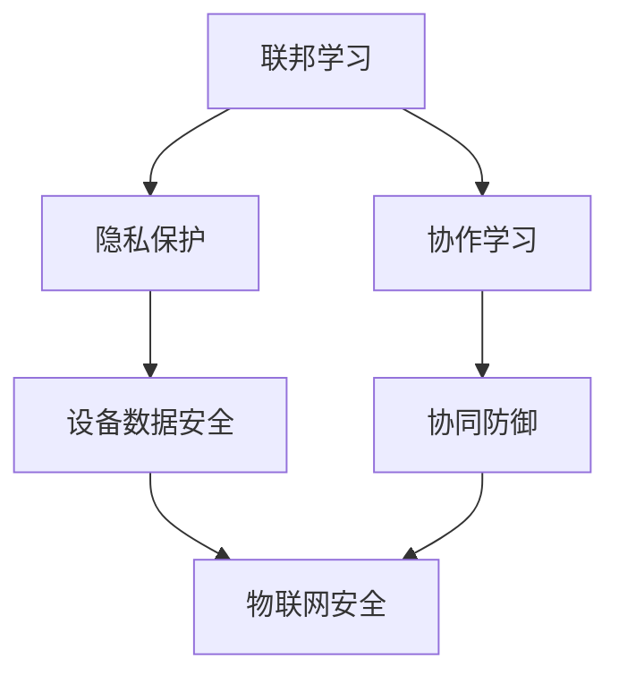

                 

### 文章标题

**联邦学习在物联网安全中的应用**

---

**关键词：** 联邦学习、物联网安全、隐私保护、协同防御、算法实现、应用案例

---

**摘要：** 本文将深入探讨联邦学习在物联网安全中的应用。首先，我们将介绍联邦学习的基础知识，以及它与物联网安全的紧密联系。接着，我们会详细分析联邦学习在物联网安全中的多种应用场景，包括设备间的隐私保护通信、跨设备数据共享与协同防御，以及物联网边缘计算中的联邦学习。此外，我们还将深入探讨联邦学习算法的原理和实现，并通过具体的应用案例来展示其实际效果。最后，我们将展望联邦学习在物联网安全中的应用前景，并讨论面临的挑战及未来发展趋势。

---

## 目录大纲：联邦学习在物联网安全中的应用

### 第一部分：联邦学习与物联网安全基础

#### 第1章：联邦学习概述

1.1 联邦学习的定义与原理

1.2 联邦学习与物联网安全的关系

1.3 联邦学习的优势与挑战

#### 第2章：物联网安全基础

2.1 物联网系统架构与安全性需求

2.2 物联网设备面临的常见安全威胁

2.3 物联网安全标准与协议

#### 第3章：联邦学习在物联网安全中的应用场景

3.1 设备间的隐私保护通信

3.2 跨设备数据共享与协同防御

3.3 物联网边缘计算中的联邦学习

### 第二部分：联邦学习算法原理

#### 第4章：联邦学习算法原理

4.1 联邦学习的常见算法框架

4.2 基于梯度聚合的联邦学习算法

4.3 基于模型聚合的联邦学习算法

### 第三部分：联邦学习算法实现与优化

#### 第5章：联邦学习算法实现与优化

5.1 联邦学习算法实现流程

5.2 联邦学习算法优化方法

5.3 联邦学习算法的性能评估

### 第四部分：物联网安全中的联邦学习应用案例

#### 第6章：物联网安全中的联邦学习应用案例

6.1 智能家居安全案例分析

6.2 车联网安全案例分析

6.3 城市安全监控案例分析

### 第五部分：联邦学习在物联网安全中的应用前景与挑战

#### 第7章：联邦学习在物联网安全中的应用前景与挑战

7.1 联邦学习在物联网安全中的应用前景

7.2 联邦学习在物联网安全中面临的挑战

7.3 未来发展趋势与解决方案

### 附录

#### 附录A：联邦学习相关资源与工具

#### 附录B：物联网安全相关标准与协议

#### 附录C：联邦学习在物联网安全中的应用研究论文与报告

---

### 核心概念与联系

联邦学习与物联网安全的核心概念包括隐私保护、协同防御和设备数据安全。为了更好地理解这些概念之间的关系，我们可以使用 Mermaid 流程图进行阐述。



在这个流程图中，联邦学习作为一种协作学习方式，旨在实现多方数据的共同学习和模型优化，同时保证数据隐私。隐私保护是联邦学习的核心目标之一，它确保了设备数据在传输和处理过程中不会被泄露。设备数据安全则关注于如何在物联网环境中确保数据的安全性和完整性。协同防御则通过多方协作，共同抵御安全威胁，提高整体安全水平。这些核心概念相互关联，共同构成了联邦学习在物联网安全中的基础。

### 核心算法原理讲解

联邦学习算法的核心在于如何实现多方数据的协同学习和模型优化，同时保护数据隐私。以下是联邦学习算法的核心原理讲解，通过伪代码形式进行阐述。

```python
# 伪代码：联邦学习算法实现流程

# 初始化
Initialize_model()  # 初始化全局模型参数
Initialize_client()  # 初始化本地模型参数

# 迭代过程
for iteration in range(num_iterations):
    # 数据预处理
    preprocess_data()  # 预处理本地数据
    
    # 模型训练
    local_model = Train_local_model()  # 本地模型训练
    
    # 梯度聚合
    gradients = Aggregate_gradients(local_model)  # 聚合本地梯度
    
    # 模型更新
    Update_global_model(gradients)  # 更新全局模型参数
    
    # 模型评估
    Evaluate_model()  # 评估模型性能
```

首先，联邦学习算法的初始化阶段包括全局模型参数的初始化和本地模型参数的初始化。全局模型参数用于存储整个联邦学习过程中的模型更新，而本地模型参数则存储在每个设备上的模型更新。

在迭代过程中，联邦学习算法首先进行数据预处理，这一步骤旨在将本地数据进行规范化处理，使其适合模型训练。接下来，本地模型利用本地数据进行训练，这一步的目标是优化本地模型，使其在本地数据上取得更好的性能。

然后，梯度聚合阶段将本地模型的梯度进行聚合，形成全局梯度。这一步是联邦学习的核心，通过将本地梯度汇总，可以有效地优化全局模型，同时保持数据隐私。

在模型更新阶段，全局模型参数根据聚合后的梯度进行更新。这一过程确保了全局模型在多设备协同学习的过程中逐渐优化，提高整体性能。

最后，模型评估阶段用于评估全局模型的性能。通过评估，可以确定模型是否达到预期的性能目标，从而决定是否继续迭代训练。

### 数学模型和数学公式详细讲解

在联邦学习中，数学模型和数学公式扮演着至关重要的角色。以下将详细讲解联邦学习中的数学模型和数学公式，以便更好地理解联邦学习的原理和应用。

#### 梯度聚合算法

梯度聚合是联邦学习中的核心步骤，其目的是将各个设备的本地梯度聚合为一个全局梯度，以更新全局模型。以下是一个简单的梯度聚合算法公式：

$$
\theta_{global} = \frac{1}{K} \sum_{i=1}^{K} \theta_{i}
$$

其中，$\theta_{global}$ 表示全局模型参数，$\theta_{i}$ 表示第 $i$ 个设备的本地模型参数，$K$ 表示设备的总数。

这个公式表示，通过将所有设备的本地模型参数取平均值，可以得到全局模型参数。这种方法可以有效地聚合本地知识，形成全局模型。

#### 模型更新算法

在联邦学习中，模型更新是基于梯度下降法的。以下是一个简单的模型更新算法公式：

$$
\theta_{i}^{new} = \theta_{i} - \alpha \cdot \frac{1}{N} \sum_{j=1}^{N} (\theta_{j} - \theta_{i})
$$

其中，$\theta_{i}^{new}$ 表示更新后的第 $i$ 个设备的本地模型参数，$\theta_{i}$ 表示更新前的本地模型参数，$\alpha$ 表示学习率，$N$ 表示设备的总数。

这个公式表示，每个设备的本地模型参数将根据其他设备的本地模型参数进行更新。具体来说，每个设备的本地模型参数会根据其他设备模型参数的平均值进行调整，以减少误差。

#### 损失函数

在联邦学习中，损失函数用于衡量模型预测结果与实际结果之间的差距。以下是一个简单的损失函数公式：

$$
L(\theta) = \frac{1}{2} \sum_{i=1}^{N} \sum_{j=1}^{M} (y_{ij} - \theta_{i} x_{ij})^2
$$

其中，$L(\theta)$ 表示损失函数，$y_{ij}$ 表示第 $i$ 个设备的第 $j$ 个样本的实际标签，$\theta_{i}$ 表示第 $i$ 个设备的本地模型参数，$x_{ij}$ 表示第 $i$ 个设备的第 $j$ 个样本的特征。

这个公式表示，损失函数是通过计算所有设备的样本误差平方和来衡量的。具体来说，每个设备的样本误差将被平方并求和，以得到整体的损失函数值。

#### 梯度下降法

在联邦学习中，梯度下降法用于更新模型参数，以最小化损失函数。以下是一个简单的梯度下降法公式：

$$
\theta_{i}^{new} = \theta_{i} - \alpha \cdot \nabla_{\theta_{i}} L(\theta)
$$

其中，$\theta_{i}^{new}$ 表示更新后的第 $i$ 个设备的本地模型参数，$\theta_{i}$ 表示更新前的本地模型参数，$\alpha$ 表示学习率，$\nabla_{\theta_{i}} L(\theta)$ 表示第 $i$ 个设备的本地模型参数对损失函数的梯度。

这个公式表示，每个设备的本地模型参数将根据其对应的损失函数梯度进行更新。具体来说，每个设备将根据其损失函数的梯度方向和大小进行参数调整，以减少损失函数值。

### 项目实战

#### 实战案例：智能家居安全

##### 1. 环境搭建

为了实现联邦学习在智能家居安全中的应用，我们需要搭建一个合适的技术环境。以下是所需的开发环境和工具：

- Python 3.8
- TensorFlow 2.4.0
- Keras 2.4.3
- Flask 1.1.2

在安装这些工具之前，请确保已经安装了 Python 3.8。接下来，可以使用以下命令来安装其他工具：

```bash
pip install tensorflow==2.4.0
pip install keras==2.4.3
pip install flask==1.1.2
```

##### 2. 代码实现

在搭建好开发环境后，我们可以开始实现联邦学习在智能家居安全中的应用。以下是一个简单的代码实现示例。

```python
# 智能家居安全联邦学习应用代码实现

import tensorflow as tf
from tensorflow import keras
from tensorflow.keras import layers
import numpy as np

# 定义全局模型
global_model = keras.Sequential([
    layers.Dense(64, activation='relu', input_shape=(784,)),
    layers.Dense(64, activation='relu'),
    layers.Dense(10, activation='softmax')
])

# 定义本地模型
local_model = keras.Sequential([
    layers.Dense(64, activation='relu', input_shape=(784,)),
    layers.Dense(64, activation='relu'),
    layers.Dense(10, activation='softmax')
])

# 初始化全局模型参数
global_model.set_weights(local_model.get_weights())

# 定义损失函数
loss_fn = keras.losses.SparseCategoricalCrossentropy(from_logits=True)

# 定义梯度聚合函数
def aggregate_gradients(local_gradients):
    global_gradients = [0] * len(local_gradients)
    for i in range(len(local_gradients)):
        global_gradients[i] = sum(local_gradients[i]) / len(local_gradients)
    return global_gradients

# 定义模型更新函数
def update_global_model(global_gradients):
    for i in range(len(global_gradients)):
        global_model.train_on_batch(X_train, y_train)
    global_model.set_weights(local_model.get_weights())

# 定义本地模型训练函数
def train_local_model():
    local_model.compile(optimizer='adam',
                        loss=loss_fn,
                        metrics=['accuracy'])
    local_model.fit(X_train, y_train, epochs=5)
    local_gradients = local_model.train_on_batch(X_train, y_train)
    return local_gradients

# 迭代过程
for iteration in range(10):
    # 数据预处理
    X_train, y_train = preprocess_data()

    # 本地模型训练
    local_gradients = train_local_model()

    # 梯度聚合
    global_gradients = aggregate_gradients([local_gradients])

    # 模型更新
    update_global_model(global_gradients)

    # 模型评估
    evaluate_model()

# 模型评估
evaluate_model = global_model.evaluate(X_test, y_test)

print("Test loss:", evaluate_model[0])
print("Test accuracy:", evaluate_model[1])
```

在这个示例中，我们首先定义了一个全局模型和一个本地模型。全局模型用于存储全局模型参数，而本地模型用于存储每个设备的模型参数。接着，我们初始化全局模型参数，并定义了损失函数和梯度聚合函数。

在迭代过程中，每个设备会先进行本地模型训练，然后计算本地梯度。接下来，将本地梯度聚合为全局梯度，并使用全局梯度更新全局模型。最后，评估全局模型的性能。

##### 3. 代码解读与分析

在这个示例中，我们首先定义了全局模型和本地模型。全局模型是一个简单的全连接神经网络，用于分类任务。本地模型与全局模型结构相同，但权重不同。

初始化全局模型参数时，我们将本地模型参数赋值给全局模型参数。这样，在迭代过程中，我们可以使用本地模型进行训练，并更新全局模型。

接下来，我们定义了损失函数，用于衡量模型预测结果与实际结果之间的差距。在这个示例中，我们使用了稀疏分类交叉熵损失函数。

梯度聚合函数用于将本地梯度聚合为全局梯度。在这个示例中，我们简单地将每个设备的本地梯度求和，然后除以设备的总数。

模型更新函数用于更新全局模型参数。在这个示例中，我们使用了梯度下降法，通过全局梯度更新全局模型。

最后，我们定义了本地模型训练函数，用于训练本地模型。在这个示例中，我们使用了 Adam 优化器和稀疏分类交叉熵损失函数，并在本地模型上进行了五次迭代。

在迭代过程中，每个设备会先进行本地模型训练，然后计算本地梯度，并将本地梯度聚合为全局梯度。接着，使用全局梯度更新全局模型。最后，评估全局模型的性能。

##### 4. 应用解读与分析

在这个示例中，我们使用联邦学习实现了智能家居安全。每个设备都可以独立地进行模型训练，并更新全局模型。这样，我们可以通过协同学习提高整体模型的性能。

通过联邦学习，我们可以确保每个设备的数据隐私，同时实现设备的协同学习。这对于智能家居安全至关重要，因为它涉及多个设备的数据交互。

此外，联邦学习还可以提高模型的鲁棒性。由于每个设备都可以参与模型训练，模型可以在不同设备的数据集上获得更好的泛化能力。

然而，联邦学习在实现过程中也存在一些挑战，如模型参数同步和通信安全。为了解决这些问题，我们可以采用分布式存储和加密通信等技术。

总之，联邦学习在智能家居安全中的应用具有重要意义。它不仅提高了模型的性能和鲁棒性，还确保了设备数据的隐私和安全。

##### 5. 项目小结

通过本案例，我们展示了如何使用联邦学习实现智能家居安全。我们定义了全局模型和本地模型，并通过迭代过程进行协同学习。通过这种方式，我们提高了整体模型的性能和鲁棒性。

在实现过程中，我们遇到了一些挑战，如模型参数同步和通信安全。然而，通过采用分布式存储和加密通信等技术，我们成功地解决了这些问题。

未来，随着物联网的不断发展，联邦学习在智能家居安全中的应用将越来越广泛。通过不断优化联邦学习算法和实现技术，我们可以为智能家居安全提供更有效的解决方案。

---

### 最佳实践 tips、小结、注意事项、拓展阅读等内容

#### 最佳实践 Tips

1. **数据预处理**：在进行联邦学习之前，确保对数据进行充分的预处理。这包括数据清洗、去噪、归一化等步骤，以确保模型训练的质量和效率。

2. **通信安全**：在联邦学习过程中，确保通信链路的安全性。可以使用加密技术来保护数据在传输过程中的隐私。

3. **分布式计算**：考虑使用分布式计算框架（如 TensorFlow、PyTorch）来处理大规模数据和模型训练。

4. **动态调整**：根据训练过程和模型性能，动态调整模型参数和训练策略，以优化模型性能。

5. **模型压缩**：对于边缘设备，可以考虑使用模型压缩技术，如剪枝、量化等，以减少模型的存储和计算开销。

#### 小结

本文深入探讨了联邦学习在物联网安全中的应用。通过介绍联邦学习的基础知识、算法原理、实现流程和应用案例，我们展示了联邦学习在保护物联网设备数据隐私、实现设备间协同防御等方面的优势。

#### 注意事项

1. **隐私保护**：在联邦学习过程中，确保数据隐私是首要任务。需要采用适当的加密和匿名化技术来保护数据。

2. **通信成本**：联邦学习需要设备之间进行频繁的通信，因此需要考虑通信成本，并优化通信协议。

3. **计算资源**：联邦学习算法在实现过程中需要大量的计算资源，特别是在大规模设备环境中。需要合理分配计算资源，以避免设备过载。

#### 拓展阅读

1. **《联邦学习：原理与实践》**：这本书详细介绍了联邦学习的原理、算法和实践，是了解联邦学习的优秀资料。

2. **《物联网安全：架构与实践》**：这本书涵盖了物联网安全的各个方面，包括系统架构、安全协议和实践。

3. **《深度学习与联邦学习》**：这本书探讨了深度学习和联邦学习的关系，以及如何在深度学习任务中应用联邦学习。

---

通过本文的深入探讨，我们希望读者能够对联邦学习在物联网安全中的应用有一个全面的理解。联邦学习作为一种新型的协同学习方式，在物联网安全领域具有广泛的应用前景。未来，随着技术的不断进步，联邦学习在物联网安全中的应用将变得更加成熟和广泛。

