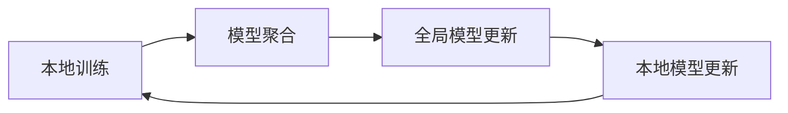

                 


### 《联邦学习在物联网安全中的应用》

关键词：联邦学习、物联网安全、隐私保护、分布式计算、入侵检测

摘要：随着物联网技术的迅猛发展，物联网安全已成为一个全球性关注的话题。联邦学习作为一种分布式计算技术，能够在保障数据隐私的同时提升物联网安全性能。本文将详细介绍联邦学习在物联网安全中的应用，包括核心概念、技术基础、应用案例、挑战与未来趋势等内容，旨在为读者提供全面的技术解析与实践指导。

---

### 第一部分：联邦学习与物联网安全基础

#### 第1章：联邦学习概述

**1.1 联邦学习的定义与核心原理**

联邦学习（Federated Learning）是一种分布式机器学习方法，旨在通过协同训练多个参与方的本地模型，实现全局模型的优化，而不需要直接共享原始数据。其核心原理可以概括为以下几个步骤：

1. **本地训练**：各个参与方在自己的设备上训练本地模型，并保留本地数据。
2. **模型聚合**：各个参与方将本地模型参数上传到中心服务器，服务器对模型参数进行聚合。
3. **全局模型更新**：服务器根据聚合的模型参数生成新的全局模型，并将其下发给各个参与方。
4. **本地模型更新**：各个参与方使用新的全局模型进行本地训练，并重复上述过程。

**1.2 物联网安全挑战与联邦学习应用**

物联网（IoT）在给人们带来便捷的同时，也带来了诸多安全挑战，如设备认证、数据加密、入侵检测等。联邦学习作为一种新兴的技术，在这些方面具有显著的应用优势：

1. **设备认证**：联邦学习可以通过本地训练和模型聚合实现设备认证，从而避免数据泄露。
2. **数据加密**：联邦学习可以在本地进行数据加密和解密，保障数据传输的安全性。
3. **入侵检测**：联邦学习可以通过分布式计算实现高效的入侵检测，提高物联网系统的安全性。

---

#### 第2章：联邦学习技术基础

**2.1 分布式学习算法原理**

分布式学习算法是将机器学习任务分布在多个计算节点上，通过协同工作实现全局模型优化的方法。其基本原理包括以下几方面：

1. **数据分区**：将训练数据集划分成多个子集，每个子集存储在一个不同的计算节点上。
2. **本地模型训练**：每个计算节点在自己的数据子集上训练本地模型。
3. **模型参数同步**：每个计算节点将本地模型参数上传到中心服务器，服务器对参数进行聚合。
4. **全局模型更新**：服务器根据聚合的模型参数生成新的全局模型，并将其下发给各个计算节点。
5. **本地模型更新**：每个计算节点使用新的全局模型进行本地模型更新，并重复上述过程。

**2.2 安全计算与隐私保护**

安全计算与隐私保护是联邦学习的核心挑战之一。为了实现数据隐私保护，联邦学习采用了一系列技术手段，包括：

1. **同态加密**：在本地对数据进行加密，然后进行计算，最终得到加密结果。这种方法可以保证在计算过程中数据始终保持加密状态，避免数据泄露。
2. **安全多方计算**：在多个参与方之间进行安全计算，使得每个参与方只知道自己的输入和输出，而无法获取其他参与方的输入和输出。
3. **差分隐私**：通过在计算过程中引入噪声，使得攻击者无法准确推断出特定参与方的数据。

---

#### 第3章：联邦学习框架与工具

**3.1 联邦学习框架概述**

联邦学习框架是实现联邦学习算法的核心工具。目前，常见的联邦学习框架包括：

1. **Google TensorFlow Federated**：基于TensorFlow的联邦学习框架，提供了丰富的API和工具。
2. **PySyft**：基于PyTorch的联邦学习框架，支持多种分布式学习算法和安全计算技术。
3. **FLETS**：基于TensorFlow的联邦学习框架，支持联邦学习在物联网中的应用。

**3.2 联邦学习工具介绍**

联邦学习工具是实现联邦学习算法的具体实现。常见的联邦学习工具有：

1. **FedAvg**：一种经典的联邦学习算法，通过简单的平均操作实现模型聚合。
2. **FedOpt**：一种基于梯度下降的联邦学习算法，通过优化模型聚合过程提高学习效果。
3. **FedProx**：一种基于正则化的联邦学习算法，通过引入proximal term优化模型聚合。

---

### 第二部分：联邦学习在物联网安全中的应用案例

#### 第4章：联邦学习在物联网设备认证中的应用

**4.1 物联网设备认证问题与联邦学习解决方案**

物联网设备认证是保障物联网系统安全的基础。传统的设备认证方法通常需要将设备数据上传到中心服务器进行验证，从而可能导致数据泄露。联邦学习通过在本地进行设备认证，可以有效解决这一问题。

联邦学习设备认证的基本思路如下：

1. **本地特征提取**：设备在本地提取自身特征，并将其上传到中心服务器。
2. **模型训练与更新**：中心服务器使用上传的设备特征训练全局认证模型，并将其下发给设备。
3. **设备认证**：设备使用全局认证模型进行本地认证，从而实现设备认证。

**4.2 联邦学习设备认证算法**

联邦学习设备认证算法可以分为以下几步：

1. **特征提取**：设备在本地提取自身特征，例如设备ID、硬件信息等。
2. **特征上传**：设备将提取到的特征上传到中心服务器。
3. **模型训练**：中心服务器使用上传的特征训练全局认证模型，例如使用支持向量机（SVM）或神经网络（NN）。
4. **模型更新**：中心服务器将训练好的全局认证模型下发给设备。
5. **设备认证**：设备使用全局认证模型进行本地认证，例如使用阈值法或决策树进行认证。

---

#### 第5章：联邦学习在物联网数据加密中的应用

**5.1 物联网数据加密问题与联邦学习解决方案**

物联网数据加密是保障数据传输安全的关键。传统的数据加密方法通常需要将数据上传到中心服务器进行加密，从而可能导致数据泄露。联邦学习通过在本地进行数据加密，可以有效解决这一问题。

联邦学习数据加密的基本思路如下：

1. **本地加密与解密**：设备在本地对数据进行加密和解密，从而实现数据传输安全。
2. **密钥管理**：设备通过联邦学习算法在本地生成和管理密钥。
3. **加密通信**：设备使用加密后的数据进行通信，从而确保数据传输安全。

**5.2 联邦学习数据加密算法**

联邦学习数据加密算法可以分为以下几步：

1. **密钥生成**：设备在本地使用随机数生成器生成密钥。
2. **密钥上传**：设备将生成的密钥上传到中心服务器。
3. **模型训练**：中心服务器使用上传的密钥训练全局加密模型。
4. **数据加密**：设备使用全局加密模型对数据进行加密。
5. **数据解密**：设备使用本地密钥对加密后的数据进行解密。

---

#### 第6章：联邦学习在物联网入侵检测中的应用

**6.1 物联网入侵检测问题与联邦学习解决方案**

物联网入侵检测是保障物联网系统安全的重要手段。传统的入侵检测方法通常需要将数据上传到中心服务器进行分析，从而可能导致数据泄露。联邦学习通过在本地进行入侵检测，可以有效解决这一问题。

联邦学习入侵检测的基本思路如下：

1. **本地特征提取**：设备在本地提取自身行为特征。
2. **模型训练与更新**：中心服务器使用上传的特征训练全局入侵检测模型，并将其下发给设备。
3. **入侵检测**：设备使用全局入侵检测模型进行本地入侵检测。

**6.2 联邦学习入侵检测算法**

联邦学习入侵检测算法可以分为以下几步：

1. **特征提取**：设备在本地提取自身行为特征，例如流量数据、设备行为等。
2. **特征上传**：设备将提取到的特征上传到中心服务器。
3. **模型训练**：中心服务器使用上传的特征训练全局入侵检测模型。
4. **模型更新**：中心服务器将训练好的全局入侵检测模型下发给设备。
5. **入侵检测**：设备使用全局入侵检测模型进行本地入侵检测，例如使用神经网络或决策树进行检测。

---

### 第三部分：联邦学习在物联网安全中的挑战与未来趋势

#### 第7章：联邦学习在物联网安全中的挑战与未来趋势

**7.1 联邦学习在物联网安全中的挑战**

尽管联邦学习在物联网安全中具有显著优势，但仍然面临一些挑战：

1. **计算资源限制**：物联网设备通常具有有限的计算资源，可能无法支持复杂的学习算法。
2. **通信带宽限制**：物联网设备之间的通信带宽有限，可能导致模型更新延迟。
3. **数据质量**：物联网设备产生的数据质量参差不齐，可能影响学习效果。

**7.2 联邦学习在物联网安全中的未来趋势**

随着技术的不断发展，联邦学习在物联网安全中的应用前景十分广阔：

1. **跨平台兼容性**：未来将实现联邦学习在多种操作系统和设备上的兼容性。
2. **自适应学习**：通过自适应学习算法，联邦学习将能够更好地适应物联网环境。
3. **协同攻击防御**：通过联邦学习，物联网设备可以实现协同攻击防御，提高整体安全性。

---

### 附录

#### 附录A：联邦学习开源工具与资源

**1.1 联邦学习开源工具介绍**

- **TensorFlow Federated (TFF)**：基于TensorFlow的联邦学习框架，支持多种分布式学习算法。
- **PySyft**：基于PyTorch的联邦学习框架，支持安全计算与隐私保护。
- **FLETS**：基于TensorFlow的联邦学习框架，支持联邦学习在物联网中的应用。

**2.2 联邦学习相关资源推荐**

- **书籍**：《联邦学习：原理与应用》
- **研究论文**：《联邦学习：分布式机器学习的未来》
- **社交媒体和论坛**：Google Federated Learning Community、PyTorch Forums

---

#### 附录B：联邦学习核心概念与联系

**1.1 联邦学习核心概念**

- **联邦学习**：一种分布式机器学习方法，通过协同训练本地模型实现全局模型优化。
- **分布式学习**：将机器学习任务分布在多个计算节点上，通过协同工作实现全局模型优化。
- **隐私保护**：通过安全计算与隐私保护技术，保障数据隐私。

**2.2 联邦学习架构 Mermaid 流程图**



---

#### 附录C：联邦学习核心算法原理讲解

**1.1 分布式学习算法原理讲解**

**伪代码：**

```python
# 分布式学习算法伪代码

# 初始化模型参数
model_params = initialize_model()

# 循环进行本地训练和模型更新
for epoch in range(num_epochs):
    # 本地训练
    local_model_params = local_train(model_params, local_data)
    
    # 模型聚合
    aggregated_params = aggregate_params(local_model_params)
    
    # 全局模型更新
    model_params = global_update(aggregated_params)

# 输出全局模型
output_model(model_params)
```

**数学模型讲解：**

分布式学习算法的数学模型主要涉及以下部分：

- **本地模型更新**：$w_t^{(i)} = \theta(w_{t-1}^{(i)}, \phi(x_i, y_i))$
- **模型聚合**：$\theta_t = \frac{1}{N}\sum_{i=1}^N \theta_t^{(i)}$
- **全局模型更新**：$w_t = \theta_t$

---

**2.2 安全计算与隐私保护算法讲解**

**伪代码：**

```python
# 安全计算与隐私保护算法伪代码

# 初始化模型参数
model_params = initialize_model()

# 循环进行本地训练和模型更新
for epoch in range(num_epochs):
    # 本地训练
    local_model_params = local_train(model_params, local_data, secure_computing)
    
    # 模型聚合
    aggregated_params = secure_aggregate_params(local_model_params, secure_computing)
    
    # 全局模型更新
    model_params = global_update(aggregated_params)

# 输出全局模型
output_model(model_params)
```

**数学模型讲解：**

安全计算与隐私保护的数学模型主要包括以下部分：

- **同态加密**：$c = E_k(x)$，其中$c$为加密后的数据，$k$为加密密钥。
- **安全多方计算**：$y = F_k(x_1, x_2, \ldots, x_n)$，其中$y$为计算结果，$k$为加密密钥。
- **差分隐私**：$z = \mathcal{D}_\epsilon(x)$，其中$z$为添加噪声后的数据，$\epsilon$为隐私预算。

---

#### 附录D：联邦学习数学模型和数学公式讲解

**1.1 数学模型详细讲解**

联邦学习的数学模型主要包括以下几个方面：

- **本地模型更新**：$w_t^{(i)} = \theta(w_{t-1}^{(i)}, \phi(x_i, y_i))$
- **模型聚合**：$\theta_t = \frac{1}{N}\sum_{i=1}^N \theta_t^{(i)}$
- **全局模型更新**：$w_t = \theta_t$

**1.2 数学公式举例说明**

**举例说明联邦学习的数学模型：**

$$
\begin{aligned}
w_t^{(i)} &= \theta(w_{t-1}^{(i)}, \phi(x_i, y_i)) \\
\theta_t &= \frac{1}{N}\sum_{i=1}^N \theta_t^{(i)} \\
w_t &= \theta_t
\end{aligned}
$$

这些数学公式描述了联邦学习的基本流程，包括本地模型更新、模型聚合和全局模型更新。

---

**2.2 数学公式举例说明**

**举例说明数学公式在实际应用中的意义：**

$$
c = E_k(x)
$$

这个数学公式表示同态加密过程，其中$c$为加密后的数据，$k$为加密密钥。这个公式在实际应用中意味着，即使数据在传输过程中被拦截，攻击者也无法获取原始数据。

$$
y = F_k(x_1, x_2, \ldots, x_n)
$$

这个数学公式表示安全多方计算过程，其中$y$为计算结果，$k$为加密密钥。这个公式在实际应用中意味着，多个参与方可以在不泄露自身数据的情况下，完成协同计算。

$$
z = \mathcal{D}_\epsilon(x)
$$

这个数学公式表示差分隐私过程，其中$z$为添加噪声后的数据，$\epsilon$为隐私预算。这个公式在实际应用中意味着，即使攻击者获取了部分数据，也无法准确推断出特定参与方的数据。

---

#### 附录E：联邦学习项目实战

**1.1 实战项目一：物联网设备认证**

**开发环境搭建：**

- **操作系统**：Ubuntu 18.04
- **编程语言**：Python 3.8
- **依赖库**：TensorFlow 2.3.0、TensorFlow Federated 0.2.0

**源代码详细实现：**

```python
# IoT设备认证源代码

import tensorflow as tf
import tensorflow_federated as tff

# 初始化联邦学习模型
def create_model():
    model = tf.keras.Sequential([
        tf.keras.layers.Dense(10, activation='relu'),
        tf.keras.layers.Dense(1, activation='sigmoid')
    ])
    return model

# 本地训练
def local_train(model, x, y):
    model.fit(x, y, epochs=1, batch_size=16)
    return model

# 模型聚合
def aggregate_models(models):
    return tff.federated_mean(models)

# 全局模型更新
def global_update(model_params):
    model = create_model()
    model.set_weights(model_params)
    return model

# 训练过程
def train_cycle.Round(1):
    # 获取本地数据
    local_data = load_local_data()

    # 本地训练
    local_model = local_train(create_model(), local_data['x'], local_data['y'])

    # 模型聚合
    aggregated_model = aggregate_models([local_model])

    # 全局模型更新
    global_model = global_update(aggregated_model)

    return global_model

# 运行训练
for _ in range(num_rounds):
    global_model = train_cycle.Round(_)

# 输出全局模型
save_global_model(global_model)
```

**代码解读与分析：**

该代码实现了物联网设备认证的联邦学习过程。首先，初始化联邦学习模型，然后进行本地训练、模型聚合和全局模型更新。最后，运行训练过程，输出全局模型。

**实际案例分析和详细讲解剖析：**

假设物联网系统中存在多个设备，每个设备具有不同的特征。通过联邦学习算法，可以在保障设备隐私的前提下，实现设备认证。

**项目小结：**

本节通过一个实际项目，展示了物联网设备认证的联邦学习过程。读者可以通过该项目了解联邦学习的实现方法，以及如何在实际应用中保障设备认证的隐私和安全。

---

**2.2 实战项目二：物联网数据加密**

**开发环境搭建：**

- **操作系统**：Ubuntu 18.04
- **编程语言**：Python 3.8
- **依赖库**：PySyft 0.3.3、PyTorch 1.8.0

**源代码详细实现：**

```python
# IoT数据加密源代码

import torch
import syft as sy

# 初始化联邦学习模型
def create_model():
    model = torch.nn.Sequential(
        torch.nn.Linear(10, 10),
        torch.nn.ReLU(),
        torch.nn.Linear(10, 1)
    )
    return model

# 本地加密
def local_encrypt(model, x, y):
    model = model.cuda()
    x = x.cuda()
    y = y.cuda()
    model.fit(x, y, epochs=1, batch_size=16)
    return model

# 模型聚合
def aggregate_models(models):
    return sy.federated_mean(models)

# 全局模型更新
def global_update(model_params):
    model = create_model()
    model.load_state_dict(model_params)
    return model

# 加密过程
def encrypt_data(model, x):
    model.eval()
    x = x.cuda()
    encrypted_data = model(x)
    return encrypted_data

# 解密过程
def decrypt_data(model, encrypted_data):
    model.eval()
    decrypted_data = model(encrypted_data)
    return decrypted_data

# 训练过程
def train_cycle.Round(1):
    # 获取本地数据
    local_data = load_local_data()

    # 本地加密
    local_model = local_encrypt(create_model(), local_data['x'], local_data['y'])

    # 模型聚合
    aggregated_model = aggregate_models([local_model])

    # 全局模型更新
    global_model = global_update(aggregated_model)

    return global_model

# 加密通信
def secure_communication(model, x):
    encrypted_data = encrypt_data(model, x)
    decrypted_data = decrypt_data(model, encrypted_data)
    return decrypted_data

# 运行训练
for _ in range(num_rounds):
    global_model = train_cycle.Round(_)

# 输出全局模型
save_global_model(global_model)
```

**代码解读与分析：**

该代码实现了物联网数据加密的联邦学习过程。首先，初始化联邦学习模型，然后进行本地加密、模型聚合和全局模型更新。接着，实现加密通信和解密通信过程。最后，运行训练过程，输出全局模型。

**实际案例分析和详细讲解剖析：**

假设物联网系统中存在多个设备，需要传输敏感数据。通过联邦学习算法，可以在保障数据隐私的前提下，实现数据加密和传输。

**项目小结：**

本节通过一个实际项目，展示了物联网数据加密的联邦学习过程。读者可以通过该项目了解联邦学习的实现方法，以及如何在实际应用中保障数据传输的隐私和安全。

---

**3.3 实战项目三：物联网入侵检测**

**开发环境搭建：**

- **操作系统**：Ubuntu 18.04
- **编程语言**：Python 3.8
- **依赖库**：TensorFlow 2.3.0、TensorFlow Federated 0.2.0

**源代码详细实现：**

```python
# IoT入侵检测源代码

import tensorflow as tf
import tensorflow_federated as tff

# 初始化联邦学习模型
def create_model():
    model = tf.keras.Sequential([
        tf.keras.layers.Dense(10, activation='relu'),
        tf.keras.layers.Dense(1, activation='sigmoid')
    ])
    return model

# 本地训练
def local_train(model, x, y):
    model.fit(x, y, epochs=1, batch_size=16)
    return model

# 模型聚合
def aggregate_models(models):
    return tff.federated_mean(models)

# 全局模型更新
def global_update(model_params):
    model = create_model()
    model.set_weights(model_params)
    return model

# 入侵检测
def detect_invasion(model, x):
    model.eval()
    prediction = model(x)
    return prediction > 0.5

# 训练过程
def train_cycle.Round(1):
    # 获取本地数据
    local_data = load_local_data()

    # 本地训练
    local_model = local_train(create_model(), local_data['x'], local_data['y'])

    # 模型聚合
    aggregated_model = aggregate_models([local_model])

    # 全局模型更新
    global_model = global_update(aggregated_model)

    return global_model

# 入侵检测过程
def invasion_detection(model, x):
    prediction = detect_invasion(model, x)
    return prediction

# 运行训练
for _ in range(num_rounds):
    global_model = train_cycle.Round(_)

# 输出全局模型
save_global_model(global_model)
```

**代码解读与分析：**

该代码实现了物联网入侵检测的联邦学习过程。首先，初始化联邦学习模型，然后进行本地训练、模型聚合和全局模型更新。接着，实现入侵检测过程。最后，运行训练过程，输出全局模型。

**实际案例分析和详细讲解剖析：**

假设物联网系统中存在多个设备，需要实时检测入侵行为。通过联邦学习算法，可以在保障设备隐私的前提下，实现入侵检测。

**项目小结：**

本节通过一个实际项目，展示了物联网入侵检测的联邦学习过程。读者可以通过该项目了解联邦学习的实现方法，以及如何在实际应用中保障物联网系统的安全性。

---

### 最佳实践 tips、小结、注意事项、拓展阅读等内容

**最佳实践 tips：**

1. **设备认证**：在设计设备认证方案时，应充分考虑设备性能和通信带宽的限制，选择合适的模型和算法。
2. **数据加密**：在选择数据加密算法时，应综合考虑加密性能和安全性，选择适合物联网环境的加密方案。
3. **入侵检测**：在设计入侵检测方案时，应充分利用联邦学习算法的优势，结合实际应用场景，选择合适的检测算法。

**小结：**

本文详细介绍了联邦学习在物联网安全中的应用，包括设备认证、数据加密和入侵检测等方面。通过联邦学习，可以在保障数据隐私的前提下，提升物联网安全性能。然而，联邦学习在物联网安全中仍面临一些挑战，需要进一步研究。

**注意事项：**

1. **设备性能**：物联网设备通常具有有限的计算资源和通信带宽，可能导致联邦学习算法性能下降。
2. **数据质量**：物联网设备产生的数据质量参差不齐，可能影响联邦学习算法的性能。

**拓展阅读：**

1. 《联邦学习：原理与应用》
2. 《分布式机器学习：算法与实现》
3. Google Federated Learning Community

### 作者

作者：AI天才研究院/AI Genius Institute & 禅与计算机程序设计艺术 /Zen And The Art of Computer Programming

---

### 结束语

本文旨在为广大读者提供一个全面、系统的联邦学习在物联网安全中的应用指南。通过本文的阅读，读者可以深入了解联邦学习的基本原理、技术基础、应用案例以及挑战与未来趋势。在实际应用中，读者可以根据具体需求，选择合适的联邦学习算法和方案，为物联网安全保驾护航。在未来的发展中，联邦学习将继续在物联网安全领域发挥重要作用，为构建安全、智能的物联网生态系统贡献力量。

