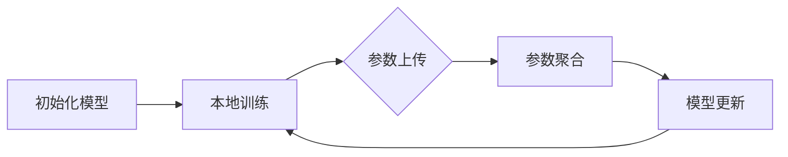
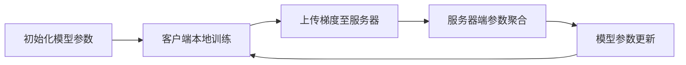

                 

### 联邦学习的概念与背景

联邦学习（Federated Learning）是一种在分布式环境中协同训练机器学习模型的先进方法，其核心理念是通过分散的数据来实现集中的模型更新，从而在保护数据隐私的同时提升整体模型的性能。这种模式特别适合于那些涉及敏感数据的场景，如医疗健康、金融服务和社交网络等领域，因为这些领域的参与者（例如医疗机构、银行、社交平台）往往不愿意或不能共享其核心数据。

#### **定义与特点**

- **定义**：联邦学习是一种机器学习方法，它允许多个参与方（如多个设备或组织）共同训练一个共享的机器学习模型，同时保持各自的本地数据隐私。每个参与方只需上传模型的更新参数，而无需上传其原始数据。

- **特点**：
  - **数据隐私**：联邦学习通过将数据保留在本地设备上，避免了数据在传输过程中被泄露的风险，从而实现了数据的隐私保护。
  - **分布式计算**：联邦学习利用分布式计算的优势，可以在多个设备或服务器上同时进行模型的训练，大大提高了训练效率。
  - **灵活性**：联邦学习允许不同的设备或组织根据自己的需求和资源，自主决定是否参与模型的训练，从而提高了系统的灵活性。

#### **起源与发展**

联邦学习的概念最早由谷歌在2016年提出，旨在解决移动设备上的机器学习问题。随着其在移动设备、社交网络和金融服务等领域的广泛应用，联邦学习逐渐成为分布式机器学习的一个重要分支。近年来，随着加密技术和安全多方计算等技术的发展，联邦学习在保护数据隐私的同时，性能也得到了显著提升。

在跨境金融分析中，联邦学习的优势体现在以下几个方面：

- **跨境数据隐私保护**：跨境金融分析涉及大量涉及个人隐私和商业秘密的数据，联邦学习可以有效保护这些数据，避免数据泄露的风险。
- **分布式计算效率**：跨境金融分析需要处理海量的数据，联邦学习可以在多个金融机构之间分布式地进行计算，提高数据处理效率。
- **跨机构合作**：联邦学习为不同金融机构之间提供了合作的基础，使得他们可以在不共享数据的情况下协同工作，共同提升金融分析的准确性。

总的来说，联邦学习为跨境金融分析提供了一种既保护数据隐私，又能提高模型性能的有效解决方案，具有广阔的应用前景。

### **联邦学习在跨境金融分析中的优势**

联邦学习在跨境金融分析中具有显著的优势，主要体现在以下几个方面：

#### **1. 数据隐私保护**

跨境金融分析涉及大量的敏感数据，如交易记录、账户信息、信用评级等。这些数据往往属于个人隐私和商业秘密，金融机构和用户都希望能够在共享数据的同时保护其隐私。联邦学习通过在本地设备上进行模型训练，避免了数据在传输过程中被窃取或泄露的风险，从而实现了数据隐私的保护。这种方式不仅满足了合规要求，还能增强用户对金融服务的信任。

#### **2. 分布式计算效率**

跨境金融分析需要处理海量的数据，这些数据可能分布在不同的国家和地区。传统的集中式计算模式需要将数据传输到中央服务器进行处理，这不仅消耗大量时间和资源，还可能引发数据传输的安全问题。而联邦学习通过分布式计算，可以在各个金融机构的本地设备上进行模型训练，从而大大提高了计算效率。每个参与方只需上传模型的更新参数，而不需要上传原始数据，这种轻量级的通信方式极大地减少了数据传输的时间和带宽需求。

#### **3. 跨机构合作**

跨境金融分析通常需要多个金融机构的协同工作，例如，银行、支付机构、信用评级机构等。这些机构往往具有不同的数据源和数据格式，传统的方法需要它们共享数据，这不仅复杂而且风险高。联邦学习为这些机构提供了一个在不共享数据的情况下协同工作的平台，通过联邦学习协议，它们可以共同训练一个共享的机器学习模型，从而实现跨机构的数据分析和决策。这种方式不仅简化了数据处理流程，还促进了金融机构之间的合作。

#### **4. 弹性扩展性**

联邦学习具有良好的弹性扩展性，可以轻松适应不同的数据规模和计算资源。在跨境金融分析中，随着业务规模的不断扩大，联邦学习可以动态调整参与方的数量和计算资源，以满足不断增长的数据处理需求。此外，联邦学习还支持异构计算环境，不同的设备或服务器可以使用不同的硬件和软件资源，从而最大化地利用计算资源。

#### **5. 高效的风险评估**

跨境金融分析的一个关键任务是风险评估，包括信用风险评估、市场风险评估和违约风险评估等。联邦学习通过分布式计算和协同学习，可以在各个金融机构之间共享风险模型，从而实现更准确和高效的风险评估。由于联邦学习不需要共享原始数据，金融机构可以保持数据的独立性，同时通过联邦学习模型共享风险信息，这有助于提高整体的风险管理水平。

#### **总结**

联邦学习在跨境金融分析中提供了强大的数据隐私保护、分布式计算效率、跨机构合作、弹性扩展性和高效的风险评估等优势。通过这些优势，联邦学习不仅能够满足金融机构在合规性和风险管理方面的需求，还能提升整体的数据分析和决策能力，为跨境金融业务的健康发展提供有力支持。

### **联邦学习的基本架构**

联邦学习作为一种分布式机器学习方法，其架构设计旨在确保数据隐私的同时，实现高效的模型训练。联邦学习的基本架构主要包括参与方、通信协议和数据处理流程三个核心部分。

#### **参与方**

联邦学习的参与方通常包括多个数据拥有者和一个协调者。数据拥有者可以是设备、服务器或组织，它们拥有本地数据并希望共同训练一个共享的机器学习模型。协调者则负责管理整个联邦学习过程，它可以是云服务提供商或某个特定的组织。以下是参与方的主要角色：

- **客户端（Client）**：负责在本地设备上运行模型训练算法，处理本地数据，并生成模型更新参数。
- **服务器（Server）**：负责接收客户端上传的模型更新参数，协调联邦学习过程，并在模型训练完成后向客户端发送最终的模型参数。
- **数据拥有者（Data Owner）**：可以是金融机构、医疗机构或其他组织，它们提供本地数据并参与模型训练。

#### **通信协议**

联邦学习中的通信协议是确保数据安全和高效传输的关键。常见的通信协议包括以下几种：

- **加密通信**：为了保护数据隐私，客户端和服务器之间的通信通常使用加密协议，如TLS（传输层安全协议）或SSL（安全套接字层协议），确保数据在传输过程中不被窃取或篡改。
- **批量更新**：为了减少通信开销，客户端通常将模型更新参数打包成批量，而不是每次更新单独发送，这样可以降低通信频率和带宽需求。
- **异步通信**：联邦学习支持异步通信，客户端可以在任意时间上传模型更新参数，服务器也可以在空闲时间处理这些更新，这样可以充分利用参与方的空闲计算资源。

#### **数据处理流程**

联邦学习的数据处理流程主要包括以下几个步骤：

1. **初始化**：在联邦学习开始之前，服务器初始化一个全局模型，并将其发送给所有的客户端。
2. **本地训练**：客户端接收全局模型后，在本地设备上使用本地数据进行训练，生成模型更新参数。
3. **参数聚合**：客户端将模型更新参数上传到服务器，服务器负责接收并聚合这些更新参数。
4. **模型更新**：服务器使用聚合后的更新参数更新全局模型，并将更新后的模型发送回客户端。
5. **迭代**：重复上述步骤，直到达到预定的训练次数或模型性能满足要求。

以下是联邦学习的基本流程的Mermaid流程图：



在处理流程中，联邦学习面临多个挑战，如通信延迟、数据异构性和模型一致性等。为了解决这些问题，研究者提出了多种技术方案，如联邦平均（Federated Averaging）、差分隐私（Differential Privacy）和联邦学习框架（如Federated Learning Framework for Heterogeneous Devices，FLFHD）等。

### **联邦学习的基本架构：参与方、通信协议和数据处理流程**

联邦学习的基本架构由多个参与方、通信协议和数据处理流程组成，其设计目的是在保护数据隐私的同时实现高效的模型训练。理解这些组成部分及其交互方式对于正确实施和应用联邦学习至关重要。

#### **参与方**

联邦学习的参与方主要包括以下几类：

1. **客户端（Client）**：负责在本地设备上执行机器学习算法的训练过程，处理本地数据，并生成模型更新参数。客户端可以是移动设备、智能手表、智能手机等。

2. **服务器（Server）**：作为联邦学习的协调中心，服务器负责管理整个联邦学习过程，包括初始化全局模型、接收并聚合客户端上传的模型更新参数、更新全局模型，并将更新后的模型发送回客户端。服务器通常位于云平台或数据中心。

3. **数据拥有者（Data Owner）**：这些是数据提供方，可以是单个组织或多个组织，它们拥有本地数据并希望参与联邦学习过程。数据拥有者可以是金融机构、医疗保健机构、社交媒体平台等。

#### **通信协议**

联邦学习中的通信协议至关重要，因为它们决定了数据如何安全、高效地在参与方之间传输。以下是一些常见的通信协议：

1. **加密通信**：为了保护数据隐私，客户端与服务器之间的通信通常使用加密协议，如TLS（传输层安全协议）或SSL（安全套接字层协议）。这些协议确保数据在传输过程中不被窃取或篡改。

2. **批量更新**：客户端通常将模型更新参数打包成批量，而不是每次更新单独发送。这样可以减少通信频率和带宽需求，提高整体通信效率。

3. **异步通信**：联邦学习支持异步通信，允许客户端在任何时间上传模型更新参数，服务器也可以在空闲时间处理这些更新。这种机制有助于充分利用参与方的空闲计算资源。

#### **数据处理流程**

联邦学习的数据处理流程通常包括以下步骤：

1. **初始化**：在联邦学习开始之前，服务器初始化一个全局模型，并将其发送给所有的客户端。

2. **本地训练**：客户端接收全局模型后，在本地设备上使用本地数据进行训练，生成模型更新参数。本地训练可以是基于梯度下降或其他优化算法。

3. **参数上传**：客户端将生成的模型更新参数上传到服务器。这些参数通常包含梯度或其他优化信息。

4. **参数聚合**：服务器接收并聚合来自所有客户端的模型更新参数。聚合方法可以是简单的平均值聚合，也可以是更复杂的优化方法，如联邦平均（Federated Averaging）。

5. **模型更新**：服务器使用聚合后的更新参数更新全局模型，并将更新后的模型发送回客户端。

6. **迭代**：重复上述步骤，直到达到预定的训练次数或模型性能满足要求。

以下是联邦学习数据处理流程的Mermaid流程图：


#### **挑战与解决方案**

在联邦学习的实施过程中，会面临多个挑战：

1. **通信延迟**：由于参与方分布在不同的地理位置，通信延迟可能影响模型训练效率。解决方案包括优化通信协议、增加通信带宽和采用异步通信。

2. **数据异构性**：不同客户端的数据量和质量可能不一致，这可能导致模型训练的不均衡。解决方案包括设计自适应的联邦学习算法和引入异构数据平衡技术。

3. **模型一致性**：确保所有客户端训练出的模型具有一致性是一个挑战。解决方案包括使用一致性约束和设计全局一致性协议。

通过理解联邦学习的基本架构，可以更好地设计和实现联邦学习系统，从而在保护数据隐私的同时实现高效的模型训练。

### **联邦学习中的加密技术**

联邦学习中的加密技术是实现数据隐私保护的关键，这些技术包括同态加密（Homomorphic Encryption）、安全多方计算（Secure Multi-Party Computation）和零知识证明（Zero-Knowledge Proof）。下面将详细解释这些加密技术的原理及其在联邦学习中的应用。

#### **同态加密（Homomorphic Encryption）**

同态加密是一种允许在加密数据上直接进行计算，而不需要解密数据的技术。这意味着用户可以在加密的数据上进行数学运算，然后得到加密的结果。同态加密的应用非常广泛，可以保护数据的隐私和完整性。

- **原理**：同态加密通过加密算法将原始数据转换成加密形式，然后可以在加密的数据上进行特定的运算。例如，对加密的x和y进行加法运算，可以产生加密的和x+y。最后，通过解密得到原始结果的明文形式。

- **应用**：在联邦学习中，同态加密可以用来保护客户端的本地数据。例如，在训练过程中，客户端可以在本地对加密的输入数据进行计算，然后将加密的梯度上传到服务器。服务器接收后可以对其余客户端的加密梯度进行聚合，而不需要解密数据。这样，整个联邦学习过程可以在保持数据隐私的同时进行。

- **挑战**：同态加密虽然保护了数据的隐私，但其计算复杂度较高，导致处理速度较慢。此外，现有的同态加密算法在处理大数据集时仍然存在性能瓶颈。

#### **安全多方计算（Secure Multi-Party Computation）**

安全多方计算是一种允许多个参与方在没有任何一方能够看到其他方数据的情况下，共同计算所需结果的技术。这种技术广泛应用于金融、医疗和其他领域，确保多方数据的安全共享。

- **原理**：安全多方计算通过一系列加密算法和协议，使多个参与方可以在一个共同计算任务中协作。每个参与方仅看到自己的输入数据和计算结果，而看不到其他参与方的数据。

- **应用**：在联邦学习中，安全多方计算可以用来保护模型训练过程中的中间结果。例如，当客户端上传加密的梯度到服务器时，服务器可以与多个客户端的加密梯度进行聚合，而不需要解密数据。这种方式确保了模型的训练过程在数据隐私得到保护的同时，仍然能够进行有效的计算。

- **挑战**：安全多方计算协议复杂，实施成本较高，且在大规模分布式环境中的性能优化是一个挑战。

#### **零知识证明（Zero-Knowledge Proof）**

零知识证明是一种加密技术，允许一方（证明者）向另一方（验证者）证明某个陈述是真实的，而不泄露任何其他信息。零知识证明广泛应用于隐私保护和身份验证等领域。

- **原理**：零知识证明通过一系列加密算法和协议，使证明者能够生成一个证明，证明某陈述是真实的，而验证者只能验证证明的真假，无法获取任何其他信息。

- **应用**：在联邦学习中，零知识证明可以用来验证客户端上传的加密梯度是否真实有效。例如，服务器可以使用零知识证明来验证客户端上传的加密梯度是否符合预期的分布和统计特性，从而确保梯度数据的有效性和一致性。

- **挑战**：零知识证明的计算复杂度较高，特别是在处理大规模数据集时，性能优化是一个重要挑战。

#### **总结**

联邦学习中的加密技术为保护数据隐私提供了强大的工具。同态加密、安全多方计算和零知识证明分别在不同的场景下发挥作用。同态加密主要用于保护客户端的本地数据，安全多方计算用于保护模型训练过程中的中间结果，而零知识证明则用于验证数据的真实性和有效性。虽然这些加密技术面临一定的性能和实现挑战，但它们在联邦学习中的应用为保护数据隐私提供了可行的解决方案，为跨境金融分析等领域的隐私保护提供了重要支持。

### **联邦学习的算法原理**

联邦学习的核心在于如何在保护数据隐私的前提下，通过分布式计算实现高效的模型训练。为了达到这个目标，联邦学习采用了多种算法和技术，其中最常用的架构是参数服务器架构（Parameter Server Architecture），下面将详细解释这一架构及其算法原理。

#### **参数服务器架构**

参数服务器架构是联邦学习中最常用的分布式计算架构，它将模型参数存储在服务器端，客户端通过定期更新服务器上的参数来训练模型。以下是参数服务器架构的主要组成部分：

1. **全局模型参数**：存储在服务器端的模型参数，是所有客户端训练的基准。
2. **客户端**：负责在本地使用本地数据进行模型训练，并将训练得到的梯度上传到服务器。
3. **服务器**：负责接收客户端上传的梯度，对梯度进行聚合并更新全局模型参数。

#### **算法原理**

联邦学习的算法原理主要包括以下几个步骤：

1. **初始化**：
   - 服务器初始化全局模型参数。
   - 客户端接收初始化的模型参数。

2. **本地训练**：
   - 客户端在本地使用本地数据对模型进行训练。
   - 客户端计算梯度，将梯度上传到服务器。

3. **参数聚合**：
   - 服务器接收来自所有客户端的梯度，并进行聚合。
   - 聚合方法通常采用平均梯度，以减少误差。

4. **模型更新**：
   - 服务器使用聚合后的梯度更新全局模型参数。
   - 更新后的模型参数发送回客户端。

5. **迭代**：
   - 重复上述步骤，直到达到预定的训练次数或模型性能满足要求。

#### **参数服务器架构的工作流程**

以下是参数服务器架构的工作流程的详细描述：

1. **初始化**：
   - **服务器端**：服务器初始化全局模型参数，并将这些参数发送给所有客户端。
   - **客户端端**：客户端接收全局模型参数，并初始化本地模型参数。

2. **本地训练**：
   - **客户端端**：客户端在本地使用本地数据进行前向传播和反向传播，计算梯度。
   - **上传梯度**：客户端将计算得到的梯度上传到服务器。

3. **参数聚合**：
   - **服务器端**：服务器接收所有客户端上传的梯度，并进行聚合。
   - **聚合方法**：通常采用平均梯度的方法进行聚合。

4. **模型更新**：
   - **服务器端**：服务器使用聚合后的梯度更新全局模型参数。
   - **更新模型参数**：更新后的模型参数发送回客户端。

5. **迭代**：
   - **客户端端**：客户端接收更新后的模型参数，并开始下一轮的本地训练。
   - **重复迭代**：重复上述步骤，直到达到预定的训练次数或模型性能满足要求。

以下是参数服务器架构的工作流程的Mermaid流程图：



#### **算法迭代过程**

联邦学习的算法迭代过程是关键步骤，其核心是通过客户端和服务器之间的参数更新和梯度聚合实现模型的训练。以下是算法迭代过程的详细解释：

1. **初始化阶段**：
   - 服务器初始化全局模型参数，并将这些参数发送给所有客户端。
   - 客户端接收初始化的模型参数，并初始化本地模型参数。

2. **本地训练阶段**：
   - 客户端使用本地数据对全局模型进行前向传播，计算损失函数。
   - 客户端使用反向传播算法计算梯度，并将梯度上传到服务器。

3. **参数聚合阶段**：
   - 服务器接收所有客户端上传的梯度，并进行聚合。
   - 通常采用平均梯度的方法进行聚合，以减少误差。

4. **模型更新阶段**：
   - 服务器使用聚合后的梯度更新全局模型参数。
   - 更新后的模型参数发送回客户端。

5. **迭代阶段**：
   - 客户端接收更新后的模型参数，并开始下一轮的本地训练。
   - 重复上述步骤，直到达到预定的训练次数或模型性能满足要求。

以下是算法迭代过程的伪代码：

```python
# 初始化全局模型参数
global_params = initialize_model()

# 迭代次数
num_iterations = 10

for iteration in range(num_iterations):
    # 客户端本地训练
    for client in clients:
        local_data = get_local_data(client)
        local_params = train_on_local_data(local_data, global_params)
        gradient = compute_gradient(local_params)

    # 参数聚合
    aggregated_gradient = aggregate_gradients(gradient)

    # 模型更新
    global_params = update_model_params(aggregated_gradient)

    # 更新客户端模型参数
    for client in clients:
        client_params = update_client_model_params(client, global_params)

    # 打印迭代信息
    print(f"Iteration {iteration}: Model updated with aggregated gradient")

# 完成训练
```

通过参数服务器架构和算法迭代过程，联邦学习实现了在保护数据隐私的同时，通过分布式计算实现高效的模型训练。这种架构和技术在跨境金融分析等场景中具有广泛的应用前景。

### **联邦学习的算法原理**

联邦学习的核心在于如何在保护数据隐私的前提下，通过分布式计算实现高效的模型训练。为了实现这一目标，联邦学习采用了多种算法和技术，参数服务器架构是其中的一种常见且有效的方法。下面将详细解释参数服务器架构的工作原理及其算法流程。

#### **参数服务器架构**

在联邦学习中，参数服务器架构是一种分布式计算模型，其核心思想是将模型的参数存储在一个中央服务器上，而客户端则负责在本地训练模型，并将训练得到的梯度上传到服务器。服务器再将这些梯度聚合起来，更新全局模型参数，并将更新后的参数发送回客户端。以下是参数服务器架构的主要组成部分：

1. **全局模型参数**：存储在服务器端的模型参数，是所有客户端训练的基准。
2. **客户端**：负责在本地使用本地数据进行模型训练，并将训练得到的梯度上传到服务器。
3. **服务器**：负责接收客户端上传的梯度，对梯度进行聚合并更新全局模型参数。

#### **算法流程**

联邦学习的算法流程主要包括以下几个步骤：

1. **初始化**：
   - 服务器初始化全局模型参数。
   - 客户端接收初始化的模型参数。

2. **本地训练**：
   - 客户端在本地使用本地数据对模型进行训练。
   - 客户端计算梯度，并将梯度上传到服务器。

3. **参数聚合**：
   - 服务器接收来自所有客户端的梯度，并进行聚合。

4. **模型更新**：
   - 服务器使用聚合后的梯度更新全局模型参数。

5. **迭代**：
   - 更新后的模型参数发送回客户端，客户端开始下一轮的本地训练。
   - 重复上述步骤，直到达到预定的训练次数或模型性能满足要求。

以下是参数服务器架构的算法流程的伪代码：

```python
# 初始化全局模型参数
global_params = initialize_model()

# 迭代次数
num_iterations = 10

for iteration in range(num_iterations):
    # 客户端本地训练
    for client in clients:
        local_data = get_local_data(client)
        local_params = train_on_local_data(local_data, global_params)
        gradient = compute_gradient(local_params)

    # 参数聚合
    aggregated_gradient = aggregate_gradients(gradient)

    # 模型更新
    global_params = update_model_params(aggregated_gradient)

    # 更新客户端模型参数
    for client in clients:
        client_params = update_client_model_params(client, global_params)

    # 打印迭代信息
    print(f"Iteration {iteration}: Model updated with aggregated gradient")

# 完成训练
```

#### **模型更新与同步策略**

在联邦学习的算法迭代过程中，模型更新与同步策略至关重要。以下是几种常见的模型更新与同步策略：

1. **同步更新**：
   - 所有客户端在每次迭代结束后同步更新模型参数。
   - 优点：简单易实现，模型更新一致性好。
   - 缺点：可能导致通信延迟，影响训练效率。

2. **异步更新**：
   - 客户端可以在任意时间上传梯度，服务器异步处理。
   - 优点：充分利用空闲资源，提高训练效率。
   - 缺点：可能引起模型更新不一致。

3. **动态同步-异步更新**：
   - 初始阶段同步更新，后续采用异步更新。
   - 优点：平衡训练效率和一致性。
   - 缺点：实现复杂度增加。

4. **异步-同步混合更新**：
   - 根据梯度上传的时间顺序，选择同步或异步更新。
   - 优点：灵活适应训练需求。
   - 缺点：实现复杂度较高。

#### **总结**

联邦学习通过参数服务器架构和算法迭代过程，实现了在保护数据隐私的同时，通过分布式计算实现高效的模型训练。参数服务器架构的主要组成部分包括全局模型参数、客户端和服务器。算法流程主要包括初始化、本地训练、参数聚合、模型更新和迭代。模型更新与同步策略有多种选择，可以根据具体应用场景进行优化。通过这些技术和策略，联邦学习在跨境金融分析等场景中具有广泛的应用前景。

### **联邦学习在跨境金融分析中的应用场景**

联邦学习在跨境金融分析中的应用场景丰富，能够为金融机构提供强大的数据隐私保护、风险评估和反洗钱监测等能力。以下是联邦学习在跨境金融分析中的几个关键应用场景。

#### **数据隐私保护需求**

跨境金融分析涉及大量敏感数据，如交易记录、账户信息、信用评级等。这些数据通常包含个人隐私和商业秘密，金融机构和用户都希望能够在共享数据的同时保护其隐私。联邦学习通过在本地设备上进行模型训练，避免了数据在传输过程中被泄露的风险，从而实现了数据隐私的保护。这种方式不仅满足了合规要求，还能增强用户对金融服务的信任。

#### **跨境金融风险的评估与监测**

跨境金融风险的评估与监测是金融风险管理的重要环节。联邦学习可以通过分布式计算，在多个金融机构之间共享风险模型，从而实现更准确和高效的风险评估。例如，银行可以通过联邦学习模型共同分析跨境交易，识别潜在的风险，如欺诈交易和信用风险。这种方式不仅提高了风险评估的准确性，还能保持金融机构的数据独立性，减少数据共享的风险。

#### **联邦学习在金融风控中的应用实例**

联邦学习在金融风控中的应用已经取得了一些成功案例。以下是一个具体的应用实例：

**案例背景**：某国际银行希望通过联邦学习技术提升其跨境交易风险评估能力。由于涉及多个国家和地区的交易数据，数据的隐私保护和跨境传输是关键挑战。

**解决方案**：银行采用联邦学习技术，将风险模型部署在多个参与方（银行、支付机构、信用评级机构）的本地设备上。每个机构在本地训练模型，并将本地梯度上传到服务器。服务器负责聚合这些梯度并更新全局模型。通过这种方式，银行能够在不共享原始数据的情况下，共同训练一个共享的风险评估模型。

**效果**：实施联邦学习后，银行显著提升了跨境交易风险评估的准确性和效率。风险模型能够更好地捕捉不同国家和地区之间的风险差异，从而提高了风险预测的准确性。同时，由于联邦学习保护了数据隐私，金融机构能够更好地遵守数据保护法规，增强了用户对金融服务的信任。

#### **跨境金融交易的监控**

跨境金融交易监控是防范金融风险的重要手段。联邦学习可以通过分布式计算，对大量的跨境交易数据进行实时监控，识别异常交易行为。例如，银行可以采用基于联邦学习的交易监测模型，实时监控跨境交易金额、频率和行为。通过这种方式，银行能够快速识别和响应潜在的金融风险，如洗钱、欺诈和非法交易。

#### **联邦学习在跨境金融反洗钱中的应用**

跨境金融反洗钱（AML）是一个复杂的过程，涉及多方面数据的分析和监控。联邦学习在反洗钱中的应用主要体现在以下几个方面：

1. **数据隐私保护**：联邦学习通过保护数据隐私，为金融机构提供了一个安全的环境，可以在不泄露敏感数据的情况下进行反洗钱监测。
2. **跨机构协作**：联邦学习使得不同金融机构可以在不共享数据的情况下，共同训练反洗钱模型。这种模式促进了金融机构之间的协作，提高了整体的反洗钱效果。
3. **实时监测与预警**：联邦学习可以实时处理和分析跨境交易数据，通过模型预测和监控，及时发现和预警潜在的洗钱行为。

#### **应用实例**

以下是一个跨境金融反洗钱应用实例：

**案例背景**：某国际银行希望通过联邦学习技术提升其跨境交易的反洗钱监测能力。

**解决方案**：银行采用联邦学习技术，在多个国家的分支机构之间建立反洗钱监测系统。每个分支机构在本地训练反洗钱模型，并将本地梯度上传到中央服务器。服务器负责聚合这些梯度并更新全局模型。通过这种方式，银行能够在不共享原始数据的情况下，共同训练一个共享的反洗钱监测模型。

**效果**：实施联邦学习后，银行显著提升了跨境交易的反洗钱监测效果。模型能够更好地识别和预测潜在的洗钱行为，提高了监测的准确性和实时性。同时，由于联邦学习保护了数据隐私，银行能够更好地遵守数据保护法规，增强了用户对金融服务的信任。

总之，联邦学习在跨境金融分析中提供了强大的数据隐私保护、风险评估和反洗钱监测等能力。通过分布式计算和协同学习，联邦学习不仅提升了金融分析的准确性和效率，还为金融机构提供了一个安全、合规的数据共享平台。随着联邦学习技术的不断发展和应用，它在跨境金融分析中的应用前景将更加广阔。

### **跨境金融数据采集与预处理**

在跨境金融分析中，数据的质量和完整性是影响分析结果的关键因素。因此，有效的数据采集与预处理步骤至关重要。以下是跨境金融数据采集与预处理的关键步骤及其详细解释。

#### **跨境金融数据来源**

跨境金融数据来源于多个渠道，这些数据包括但不限于以下几种类型：

1. **政府与公共数据**：包括海关数据、税务数据、人口统计数据等。这些数据通常由政府机构提供，涵盖了广泛的跨境交易信息。

2. **商业数据源**：包括银行交易数据、支付平台数据、信用评级数据等。这些数据通常由金融机构或商业数据提供商提供，提供了详细的交易记录和用户行为信息。

3. **社交媒体数据采集**：社交媒体平台如Facebook、Twitter等可以提供丰富的用户互动和交易信息。通过数据抓取和分析，可以挖掘出潜在的市场趋势和用户行为。

#### **数据采集方法**

1. **自动化数据采集**：利用爬虫技术、API接口和公共数据集等手段，自动化获取跨境金融数据。这种方法高效且能够获取大量的实时数据。

2. **人工采集**：在某些情况下，自动化数据采集方法可能无法获取所有所需的数据，此时需要人工干预进行数据采集。例如，通过调查问卷、访谈等方式获取用户行为和市场趋势信息。

3. **多方数据集成**：将来自不同来源的数据进行整合，形成一个统一的数据集。这需要解决数据格式不一致、数据缺失和数据冗余等问题。

#### **数据预处理步骤**

1. **数据清洗**：
   - **去重**：去除重复的数据记录，保证数据的唯一性。
   - **填充缺失值**：使用适当的方法填充缺失数据，如均值插值、插值法等。
   - **数据格式统一**：将不同格式的数据进行统一处理，确保数据格式的一致性。
   - **异常值处理**：检测和去除异常数据值，以避免对分析结果的影响。

2. **数据整合**：
   - **数据融合**：将来自不同来源的数据进行融合，形成一个完整的数据集。
   - **特征工程**：根据分析需求，提取和构建新的特征，以提高模型的预测能力。

3. **数据特征提取**：
   - **数值特征**：对数值型特征进行标准化或归一化处理，使其在相同的尺度上进行比较。
   - **分类特征**：对分类特征进行编码，如独热编码或标签编码等。
   - **文本特征**：对文本数据进行处理，如词频统计、TF-IDF计算等，以提取文本特征。

#### **示例**

**案例背景**：某国际银行希望对跨境交易进行风险分析，以识别潜在的欺诈行为。

**数据采集**：
- **政府数据**：从海关部门获取跨境贸易数据。
- **商业数据源**：从银行和支付平台获取交易数据。
- **社交媒体数据**：从社交媒体平台获取用户行为数据。

**数据预处理**：
- **数据清洗**：
  - 去除重复的交易记录。
  - 对缺失的交易数据进行均值填充。
  - 将不同格式的数据进行统一处理，如将日期统一为YYYY-MM-DD格式。
- **数据整合**：
  - 将政府数据、商业数据和社交媒体数据进行整合，形成统一的数据集。
  - 提取交易金额、交易频率、用户行为等特征。
- **数据特征提取**：
  - 对数值型特征进行标准化处理。
  - 对分类特征进行独热编码。
  - 对文本数据使用TF-IDF算法提取特征。

通过以上数据采集与预处理步骤，银行可以构建一个高质量的数据集，为后续的风险分析提供可靠的基础。这些步骤不仅确保了数据的质量和完整性，还提高了模型的分析能力和预测准确性。

### **跨境金融数据的预处理**

在跨境金融分析中，数据预处理是一个关键步骤，它直接影响到分析结果的准确性和可靠性。有效的数据预处理能够消除噪声、纠正错误，并提取出对模型训练有用的特征。以下是跨境金融数据预处理的主要步骤：

#### **数据清洗**

数据清洗是预处理的第一步，目的是识别并处理数据中的错误、异常值和重复记录。具体步骤包括：

1. **去重**：删除重复的数据记录，确保数据的唯一性。
2. **纠正错误**：检查并修正数据中的明显错误，如日期格式错误、数值异常等。
3. **填充缺失值**：对于缺失的数据，采用合适的策略进行填充，如使用均值、中位数、插值法等。
4. **异常值处理**：识别并处理数据中的异常值，这些异常值可能会对模型训练产生不利影响。

#### **数据整合**

数据整合是将来自不同来源的数据进行合并，形成统一的数据集。在跨境金融分析中，数据可能来自多个机构或渠道，格式和结构可能存在差异。数据整合的主要步骤包括：

1. **统一格式**：将不同格式的数据转换为统一的格式，如日期格式、货币单位等。
2. **数据融合**：将不同来源的数据进行合并，形成综合的数据集。这通常涉及多表联接操作，以确保数据的一致性和完整性。
3. **处理冗余数据**：删除冗余的数据记录，避免重复计算。

#### **数据特征提取**

数据特征提取是将原始数据转换为适合机器学习模型训练的特征表示。以下是几种常用的数据特征提取方法：

1. **数值特征处理**：
   - **标准化**：将数值特征缩放到相同的尺度，常用方法有Z-score标准化和Min-Max标准化。
   - **归一化**：保持特征的数据分布特性，如使用L1或L2正则化。

2. **分类特征编码**：
   - **独热编码（One-Hot Encoding）**：将分类特征转换为二进制向量，适用于类别数量较少的情况。
   - **标签编码（Label Encoding）**：将分类特征映射到整数，适用于类别数量较多且特征重要性不高的情况。

3. **文本特征提取**：
   - **词频统计（TF）**：计算文本中每个单词的出现频率。
   - **逆文档频率（IDF）**：衡量文本中每个单词的重要程度，用于加权词频。
   - **TF-IDF**：结合词频和逆文档频率，用于提取文本特征。

4. **图像特征提取**：
   - **边缘检测**：用于提取图像的边缘特征，如使用Sobel算子或Canny算法。
   - **特征点提取**：用于提取图像的关键特征点，如Harris角点检测或SURF算法。

#### **示例**

假设我们有一个包含跨境交易数据的表格，数据包括交易金额、交易时间、交易货币、交易对手等特征。以下是数据预处理的具体步骤：

1. **数据清洗**：
   - 去除重复的交易记录，保证数据的唯一性。
   - 检查并纠正日期格式错误，如将“2023/03/15”更正为“2023-03-15”。
   - 对缺失的交易金额进行均值填充，如使用最近一次交易金额作为填充值。

2. **数据整合**：
   - 将不同货币的交易金额统一转换为同一货币单位，如将美元交易金额转换为欧元。
   - 将交易时间字段统一格式，如将“2023-03-15T14:30:00”格式化成“YYYY-MM-DD HH:MM:SS”。
   - 将交易对手信息进行整合，删除重复的交易对手记录。

3. **数据特征提取**：
   - 对交易金额进行标准化处理，使用Z-score标准化。
   - 对交易货币和交易对手进行独热编码，确保每个类别都有唯一的编码。
   - 对交易时间提取小时、分钟等特征，用于分析交易时间对交易行为的影响。

通过以上预处理步骤，我们得到一个高质量、格式统一、特征丰富的数据集，为后续的风险评估和模型训练提供了坚实的基础。有效的数据预处理不仅提高了模型的分析能力，还减少了数据噪声对分析结果的影响，确保了分析结果的准确性和可靠性。

### **跨境金融风险评估模型**

跨境金融风险评估是一个复杂的过程，涉及多个维度的分析和评估。本文将详细介绍跨境金融风险评估的指标、构建基于联邦学习的风险评估模型的方法及其训练和评估过程。

#### **跨境金融风险的评估指标**

跨境金融风险评估需要考虑多种指标，这些指标可以分为以下几类：

1. **信用风险评估指标**：
   - **信用评分**：基于客户的信用历史和财务状况，计算出一个信用评分，用于评估客户的信用风险。
   - **债务收入比**：客户的债务总额与收入之比，反映客户的偿债能力。
   - **信用历史**：客户过去的信用记录，包括逾期还款次数、违约记录等。

2. **市场风险评估指标**：
   - **汇率波动**：汇率波动对跨境交易的风险具有重要影响。高汇率波动可能导致交易成本增加或收益减少。
   - **利率风险**：利率变化可能影响跨境借贷和投资的风险，尤其是在浮动利率环境下。

3. **违约风险评估指标**：
   - **违约概率**：通过历史数据和统计分析，计算客户违约的概率。
   - **违约损失**：在客户违约时，金融机构可能面临的损失金额。
   - **违约时间**：客户违约的时间点，对于及时采取风险管理措施具有重要意义。

#### **构建基于联邦学习的风险评估模型**

构建基于联邦学习的风险评估模型包括以下步骤：

1. **模型选择**：
   - **决策树**：适用于分类任务，如客户是否违约。
   - **随机森林**：增强决策树的鲁棒性和泛化能力。
   - **支持向量机（SVM）**：适用于分类和回归任务，具有良好的解释性。
   - **神经网络**：适用于复杂的多维度数据，具有强大的非线性建模能力。

2. **数据预处理**：
   - 对输入数据进行标准化处理，确保所有特征在相同的尺度上进行比较。
   - 对分类特征进行编码，如独热编码或标签编码。
   - 填充缺失数据，并去除异常值。

3. **模型训练**：
   - **本地训练**：每个金融机构在本地使用其私有数据训练模型，并生成本地模型参数。
   - **梯度聚合**：金融机构将本地模型参数上传到中央服务器，服务器进行梯度聚合。
   - **模型更新**：服务器使用聚合后的梯度更新全局模型参数。

4. **模型评估**：
   - **交叉验证**：使用交叉验证方法评估模型的泛化能力。
   - **评价指标**：如准确率、召回率、F1分数等，评估模型的性能。
   - **A/B测试**：在实际业务环境中对比新旧模型的性能，确保模型改进的有效性。

#### **模型训练与评估过程**

以下是构建基于联邦学习的风险评估模型的具体训练和评估过程：

1. **初始化**：
   - 服务器初始化全局模型参数。
   - 客户端接收初始化的模型参数。

2. **本地训练**：
   - 客户端在本地使用私有数据对模型进行训练，计算梯度。
   - 客户端将本地梯度上传到服务器。

3. **梯度聚合**：
   - 服务器接收所有客户端的梯度，并使用聚合方法（如联邦平均）更新全局模型参数。

4. **模型更新**：
   - 服务器使用更新后的全局模型参数，发送回客户端。

5. **迭代**：
   - 重复上述步骤，直到模型收敛或达到预定的训练次数。

6. **评估**：
   - 使用交叉验证方法评估模型的泛化能力。
   - 根据评估结果调整模型参数，优化模型性能。

7. **部署**：
   - 将训练好的模型部署到生产环境，用于实际的风险评估。

以下是模型训练和评估过程的伪代码：

```python
# 初始化全局模型参数
global_params = initialize_model()

# 迭代次数
num_iterations = 10

for iteration in range(num_iterations):
    # 客户端本地训练
    for client in clients:
        local_data = get_local_data(client)
        local_params = train_on_local_data(local_data, global_params)
        gradient = compute_gradient(local_params)

    # 参数聚合
    aggregated_gradient = aggregate_gradients(gradient)

    # 模型更新
    global_params = update_model_params(aggregated_gradient)

    # 更新客户端模型参数
    for client in clients:
        client_params = update_client_model_params(client, global_params)

    # 打印迭代信息
    print(f"Iteration {iteration}: Model updated with aggregated gradient")

# 模型评估
evaluate_model(global_params)

# 部署模型
deploy_model(global_params)
```

通过以上步骤，构建的基于联邦学习的风险评估模型可以在保护数据隐私的同时，实现高效的风险评估，为跨境金融业务提供有力的支持。

### **基于联邦学习的风险评估模型**

构建基于联邦学习的风险评估模型是跨境金融分析中的关键步骤。以下将详细描述如何构建基于联邦学习的风险评估模型，包括模型构建、算法选择、模型训练、评估以及风险评估结果分析。

#### **模型构建**

在构建基于联邦学习的风险评估模型时，我们首先需要定义风险评估的目标。一般来说，风险评估模型的目标是预测客户是否会出现违约行为，从而帮助金融机构采取相应的风险控制措施。以下是构建模型的主要步骤：

1. **数据预处理**：
   - 对输入数据进行标准化处理，确保所有特征在相同的尺度上进行比较。
   - 对分类特征进行编码，如独热编码或标签编码。
   - 填充缺失数据，并去除异常值。

2. **特征选择**：
   - 根据业务逻辑和数据分布，选择对风险评估有重要影响的特征。
   - 可以使用特征重要性分析方法，如随机森林特征重要性、L1正则化等，筛选出关键特征。

3. **模型选择**：
   - 根据数据的特性和评估目标，选择合适的机器学习模型。常见的风险评估模型包括逻辑回归、决策树、随机森林、支持向量机（SVM）等。
   - 对于复杂的多维度数据，可以采用神经网络模型，如深度神经网络（DNN）或卷积神经网络（CNN）。

4. **初始化模型参数**：
   - 在模型训练开始前，初始化全局模型参数。这些参数可以通过随机初始化或使用预训练的模型参数。

#### **算法选择**

联邦学习的算法选择对于模型的性能和效率具有重要影响。以下是几种常见的联邦学习算法：

1. **联邦平均（Federated Averaging）**：
   - **原理**：联邦平均是一种简单的联邦学习算法，它通过在服务器端聚合客户端上传的模型更新参数，实现全局模型的更新。
   - **步骤**：
     1. 服务器初始化全局模型参数。
     2. 客户端在本地使用本地数据训练模型，并计算梯度。
     3. 客户端将本地梯度上传到服务器。
     4. 服务器接收梯度，进行聚合并更新全局模型参数。
     5. 服务器将更新后的模型参数发送回客户端。
     6. 重复上述步骤，直到模型收敛。

2. **模型剪枝（Model Pruning）**：
   - **原理**：模型剪枝通过在客户端和服务器端减少模型参数的数量，来提高联邦学习的效率和性能。
   - **步骤**：
     1. 在客户端，对本地模型进行剪枝，去除不重要的参数。
     2. 客户端上传剪枝后的模型参数到服务器。
     3. 服务器对上传的参数进行聚合并更新全局模型参数。
     4. 服务器将更新后的模型参数发送回客户端。
     5. 重复上述步骤，直到模型收敛。

3. **差分隐私（Differential Privacy）**：
   - **原理**：差分隐私通过在聚合过程中引入噪声，确保任何单个客户端的数据不会对全局模型产生过大的影响，从而保护数据隐私。
   - **步骤**：
     1. 服务器初始化全局模型参数。
     2. 客户端在本地使用本地数据训练模型，并计算梯度。
     3. 客户端将本地梯度上传到服务器。
     4. 服务器对上传的梯度进行聚合，并引入隐私保护机制（如拉普拉斯机制）。
     5. 服务器将更新后的模型参数发送回客户端。
     6. 重复上述步骤，直到模型收敛。

#### **模型训练**

模型训练是联邦学习中的核心步骤，其目的是通过迭代更新模型参数，使模型能够准确地预测客户的风险。以下是模型训练的详细过程：

1. **本地训练**：
   - 客户端在本地使用本地数据进行模型训练，计算梯度。本地训练可以采用标准的机器学习训练方法，如梯度下降、随机梯度下降等。

2. **梯度上传**：
   - 客户端将计算得到的梯度上传到服务器。上传过程可以使用加密协议，如TLS，确保数据传输的安全性。

3. **参数聚合**：
   - 服务器接收来自所有客户端的梯度，并进行聚合。聚合方法可以采用联邦平均、模型剪枝或差分隐私等。

4. **模型更新**：
   - 服务器使用聚合后的梯度更新全局模型参数。更新过程可以引入适当的正则化项，如L1或L2正则化，防止过拟合。

5. **迭代**：
   - 服务器将更新后的模型参数发送回客户端，客户端继续进行下一轮的本地训练。重复上述步骤，直到模型收敛或达到预定的迭代次数。

#### **模型评估**

模型评估是确保模型性能和可靠性的重要步骤。以下是评估模型性能的常用方法：

1. **交叉验证**：
   - 使用交叉验证方法（如K折交叉验证）评估模型的泛化能力。交叉验证可以检测模型在不同数据子集上的表现，从而评估模型的鲁棒性。

2. **评价指标**：
   - 根据评估目标，选择合适的评价指标。常见的评价指标包括准确率、召回率、F1分数、ROC曲线等。

3. **A/B测试**：
   - 在实际业务环境中对比新旧模型的性能，确保模型改进的有效性。A/B测试可以帮助识别模型的改进对业务的影响。

#### **风险评估结果分析**

模型训练完成后，需要对评估结果进行详细分析，以了解模型的性能和预测能力。以下是评估结果分析的主要内容：

1. **预测准确性**：
   - 分析模型对客户违约的预测准确性，包括整体准确率和分类报告。

2. **模型解释性**：
   - 分析模型参数的重要性和解释性，了解哪些特征对风险预测有显著影响。

3. **异常检测**：
   - 分析模型在识别异常交易行为（如欺诈行为）方面的表现，确保模型能够有效检测和预警潜在的金融风险。

4. **模型优化**：
   - 根据评估结果，对模型进行进一步的优化，如调整模型参数、特征选择等，以提高模型的性能和预测能力。

通过上述步骤，构建的基于联邦学习的风险评估模型可以在保护数据隐私的同时，实现高效的风险评估，为跨境金融业务提供有力的支持。

### **跨境金融交易监测**

跨境金融交易的监测是风险管理的重要组成部分，旨在及时发现并预防潜在的金融风险。跨境金融交易的监测指标体系是监测模型构建的基础，它包括交易金额监控、交易频率监控和交易行为分析三个主要方面。以下是详细解释这些监测指标及其应用。

#### **交易金额监控**

交易金额监控是监测跨境金融交易的重要指标之一。通过监控交易金额，金融机构可以识别出异常的交易行为，如大额交易和可疑交易。以下是交易金额监控的几个关键点：

1. **大额交易监控**：设定一个合理的阈值，监控超过该阈值的交易。大额交易可能涉及洗钱、欺诈等非法行为，需要引起警惕。

2. **交易金额分布**：分析交易金额的分布情况，识别出异常的交易模式。例如，如果某段时间内交易金额突然增加，可能表明有异常交易行为。

3. **趋势分析**：通过时间序列分析，监控交易金额的变化趋势。如果交易金额出现明显的波动，可能预示着市场风险或潜在的风险事件。

#### **交易频率监控**

交易频率监控是另一个重要的监测指标，通过监控交易频率，金融机构可以识别出异常的交易行为和可疑的交易模式。以下是交易频率监控的几个关键点：

1. **正常交易频率**：定义正常交易频率的范围，监控与正常交易频率不符的交易行为。例如，如果某用户在短时间内进行大量交易，可能表明其有异常交易行为。

2. **高频交易监控**：监控高频交易行为，识别出可能涉及市场操纵、欺诈等非法行为的高频交易。高频交易可能会对市场稳定性造成影响，需要特别关注。

3. **异常交易模式**：通过聚类分析等方法，识别出异常的交易模式。例如，如果某用户的交易模式与其他用户显著不同，可能表明其有异常交易行为。

#### **交易行为分析**

交易行为分析是跨境金融交易监测的核心，通过分析交易行为，金融机构可以识别出潜在的金融风险。以下是交易行为分析的几个关键点：

1. **交易对手分析**：分析交易对手的背景和交易行为，识别出可疑的交易对手。例如，如果交易对手是未知的或高风险的，可能表明有非法交易行为。

2. **交易特征分析**：分析交易的详细特征，如交易时间、交易地点、交易方式等，识别出异常的交易特征。例如，如果交易在非正常时间或地点进行，可能表明有异常交易行为。

3. **行为模式识别**：通过行为模式识别技术，如机器学习和数据挖掘，识别出异常交易行为。例如，使用聚类分析、异常检测算法等，可以识别出潜在的欺诈交易。

#### **基于联邦学习的交易监测模型**

联邦学习在跨境金融交易监测中具有重要作用，通过分布式计算和协同学习，可以在不共享数据的情况下实现高效的风险监测。以下是基于联邦学习的交易监测模型的构建方法：

1. **数据预处理**：对交易数据进行预处理，包括数据清洗、去重、填充缺失值等，确保数据的质量和一致性。

2. **特征提取**：提取交易金额、交易频率、交易行为等特征，用于训练监测模型。可以使用统计特征、文本特征和图像特征等多种类型的特征。

3. **模型训练**：使用联邦学习算法，如联邦平均、模型剪枝和差分隐私，在多个金融机构的本地设备上训练监测模型。每个金融机构在本地训练模型，并上传模型更新参数到服务器。

4. **模型聚合**：服务器接收来自所有金融机构的模型更新参数，进行聚合并更新全局模型参数。

5. **模型评估**：使用交叉验证和A/B测试等方法，评估监测模型的性能和准确性。

6. **实时监测**：将训练好的监测模型部署到生产环境，实时监控跨境金融交易，识别潜在的金融风险。

通过上述方法，基于联邦学习的交易监测模型可以在保护数据隐私的同时，实现高效的风险监测，为跨境金融业务提供有力支持。

### **基于联邦学习的交易监测模型**

构建基于联邦学习的交易监测模型是跨境金融交易监测的关键步骤。以下将详细描述如何构建模型、选择算法、训练过程、评估方法以及监测结果分析。

#### **模型构建**

在构建交易监测模型时，首先需要对数据进行预处理，包括数据清洗、特征提取和模型初始化。以下是模型构建的主要步骤：

1. **数据预处理**：
   - **数据清洗**：去除重复的交易记录，处理缺失值，纠正数据中的错误。
   - **特征提取**：提取交易金额、交易时间、交易频率、交易对手等关键特征。
   - **标准化处理**：对数值型特征进行标准化处理，使其在相同的尺度上进行比较。

2. **模型初始化**：
   - 在服务器端初始化全局模型参数，这些参数可以作为模型的起点，后续通过联邦学习过程进行更新。

#### **算法选择**

联邦学习的算法选择对于模型的性能和效率有重要影响。以下是几种常见的联邦学习算法：

1. **联邦平均（Federated Averaging）**：
   - **原理**：通过在服务器端聚合客户端上传的模型更新参数，实现全局模型的更新。
   - **步骤**：
     1. 服务器初始化全局模型参数。
     2. 客户端在本地训练模型，计算梯度。
     3. 客户端上传梯度到服务器。
     4. 服务器对上传的梯度进行聚合，更新全局模型参数。
     5. 服务器将更新后的模型参数发送回客户端。

2. **差分隐私（Differential Privacy）**：
   - **原理**：通过在聚合过程中引入噪声，保护每个客户端的数据隐私。
   - **步骤**：
     1. 服务器初始化全局模型参数。
     2. 客户端在本地训练模型，计算梯度。
     3. 客户端上传梯度到服务器。
     4. 服务器对上传的梯度进行聚合，并引入隐私保护机制（如拉普拉斯机制）。
     5. 服务器将更新后的模型参数发送回客户端。

3. **模型剪枝（Model Pruning）**：
   - **原理**：通过在客户端和服务器端减少模型参数的数量，提高联邦学习的效率和性能。
   - **步骤**：
     1. 在客户端，对本地模型进行剪枝，去除不重要的参数。
     2. 客户端上传剪枝后的模型参数到服务器。
     3. 服务器对上传的参数进行聚合，并更新全局模型参数。
     4. 服务器将更新后的模型参数发送回客户端。

#### **模型训练**

模型训练过程包括本地训练、参数上传、参数聚合和模型更新。以下是模型训练的详细步骤：

1. **本地训练**：
   - 客户端在本地使用私有数据集对模型进行训练，计算梯度。

2. **参数上传**：
   - 客户端将本地训练得到的模型参数和梯度上传到服务器。

3. **参数聚合**：
   - 服务器接收来自所有客户端的梯度，进行聚合，生成全局模型更新参数。

4. **模型更新**：
   - 服务器使用聚合后的梯度更新全局模型参数，并将更新后的参数发送回客户端。

5. **迭代**：
   - 重复上述步骤，直到模型收敛或达到预定的迭代次数。

#### **模型评估**

模型评估是确保模型性能和可靠性的重要步骤。以下是评估模型性能的常用方法：

1. **交叉验证**：
   - 使用交叉验证方法评估模型的泛化能力，检测模型在不同数据子集上的表现。

2. **评价指标**：
   - 根据评估目标，选择合适的评价指标，如准确率、召回率、F1分数等。

3. **A/B测试**：
   - 在实际业务环境中对比新旧模型的性能，确保模型改进的有效性。

#### **监测结果分析**

模型训练完成后，需要对监测结果进行详细分析，以了解模型的性能和预测能力。以下是监测结果分析的主要内容：

1. **预测准确性**：
   - 分析模型对交易行为的预测准确性，包括整体准确率和分类报告。

2. **异常检测**：
   - 分析模型在识别异常交易行为（如欺诈行为）方面的表现，确保模型能够有效检测和预警潜在的金融风险。

3. **模型解释性**：
   - 分析模型参数的重要性和解释性，了解哪些特征对风险预测有显著影响。

4. **模型优化**：
   - 根据评估结果，对模型进行进一步的优化，如调整模型参数、特征选择等，以提高模型的性能和预测能力。

通过以上步骤，构建的基于联邦学习的交易监测模型可以在保护数据隐私的同时，实现高效的风险监测，为跨境金融业务提供有力支持。

### **联邦学习在跨境金融反洗钱中的应用**

联邦学习在跨境金融反洗钱（Anti-Money Laundering，AML）中的应用具有重要意义。跨境金融交易具有跨国界、复杂性高、数据量大等特点，传统反洗钱方法在数据隐私保护和实时监控方面存在挑战。联邦学习通过分布式计算和数据隐私保护机制，提供了有效的解决方案。

#### **背景与挑战**

反洗钱的目标是识别和防止利用金融系统清洗非法所得的资金。跨境金融交易涉及大量的个人和商业活动，包括跨境汇款、国际贸易结算等。然而，这些交易数据通常存储在不同的金融机构和监管机构中，数据分散且不兼容，导致信息孤岛问题。此外，反洗钱需要处理大量敏感数据，如交易记录、账户信息、身份信息等，这些数据一旦泄露，可能引发严重的安全和隐私问题。

传统反洗钱方法主要包括规则匹配、机器学习模型和人工审核。然而，这些方法在处理跨境金融交易时面临以下挑战：

1. **数据隐私保护**：为了防止洗钱活动，反洗钱系统需要访问和共享大量敏感数据。然而，数据隐私保护法律法规对金融机构提出了严格的要求，传统方法往往难以在保护数据隐私的同时进行有效的数据分析。

2. **实时监控**：跨境金融交易具有高速和实时性的特点，传统反洗钱系统在处理大规模数据和实时监控方面存在性能瓶颈，无法及时识别和响应潜在的洗钱行为。

3. **跨机构协作**：跨境金融交易涉及多个金融机构和监管机构，传统方法难以实现跨机构的数据共享和协作，导致信息孤岛问题，影响反洗钱效果。

#### **联邦学习在反洗钱中的优势**

联邦学习通过分布式计算和数据隐私保护机制，为跨境金融反洗钱提供了解决方案。以下是联邦学习在反洗钱中的主要优势：

1. **数据隐私保护**：联邦学习通过在本地设备上进行模型训练，避免了数据在传输过程中被泄露的风险。每个金融机构只需上传模型更新参数，而不需要共享原始数据，从而满足数据隐私保护的要求。

2. **分布式计算**：联邦学习利用分布式计算的优势，可以在多个金融机构之间并行进行模型训练，提高数据处理效率和实时性。这种模式不仅提高了反洗钱系统的性能，还降低了系统的总体成本。

3. **跨机构协作**：联邦学习提供了一个安全、透明和高效的数据共享平台，使得不同金融机构可以在不共享数据的情况下协同工作，共同提升反洗钱的效果。通过联邦学习，金融机构可以共享风险信息，建立跨机构的反洗钱联盟，提高整体反洗钱能力。

4. **动态调整**：联邦学习支持动态调整参与方的数量和计算资源，根据实际业务需求进行扩展和优化。这种弹性扩展性使得反洗钱系统能够适应不断变化的市场环境和监管要求。

#### **应用实例**

以下是一个联邦学习在跨境金融反洗钱中的应用实例：

**案例背景**：某国际银行希望提高其跨境交易的反洗钱监测能力，但面临数据隐私保护和实时监控的挑战。

**解决方案**：
1. **数据采集与预处理**：银行从内部和外部数据源采集交易数据，包括交易金额、交易时间、交易对手等。对数据进行清洗、去重和特征提取，确保数据的质量和一致性。

2. **联邦学习模型构建**：
   - **模型选择**：选择合适的机器学习模型，如随机森林、支持向量机等，用于预测洗钱行为。
   - **初始化**：在服务器端初始化全局模型参数，并将参数发送给所有客户端。

3. **模型训练与更新**：
   - **本地训练**：客户端在本地使用私有数据对模型进行训练，计算梯度。
   - **参数上传**：客户端将训练得到的梯度上传到服务器。
   - **参数聚合**：服务器接收并聚合来自所有客户端的梯度，更新全局模型参数。
   - **模型更新**：服务器将更新后的模型参数发送回客户端。

4. **模型评估与优化**：
   - 使用交叉验证方法评估模型性能，根据评估结果调整模型参数，优化模型性能。
   - 通过实时监测和预警，识别潜在的洗钱行为，提高反洗钱效果。

**效果**：
- 实施联邦学习后，银行显著提高了跨境交易的反洗钱监测能力。模型能够在保护数据隐私的同时，实现高效的实时监控，提高了洗钱行为的识别率和响应速度。
- 银行能够更好地遵守数据隐私保护法律法规，增强了用户对金融服务的信任。
- 银行与监管机构和其他金融机构之间建立了跨机构的反洗钱联盟，共同提升反洗钱效果。

通过以上应用实例，可以看出联邦学习在跨境金融反洗钱中的应用具有显著的优势。联邦学习不仅解决了数据隐私保护和实时监控的挑战，还为金融机构提供了强大的协作和扩展能力，为反洗钱工作的开展提供了有力支持。

### **基于联邦学习的反洗钱模型**

构建基于联邦学习的反洗钱模型是金融行业应对洗钱风险的重要手段。以下是详细描述如何构建这种模型，包括模型构建、算法选择、模型训练与评估以及反洗钱监测与预警的步骤。

#### **模型构建**

在构建基于联邦学习的反洗钱模型时，首先需要对数据进行预处理，然后设计模型架构，最后选择合适的联邦学习算法。以下是模型构建的主要步骤：

1. **数据预处理**：
   - **数据采集**：收集来自不同金融机构和监管机构的数据，包括交易记录、账户信息、客户行为等。
   - **数据清洗**：去除重复记录、处理缺失值和异常值，确保数据的一致性和完整性。
   - **特征提取**：提取与洗钱行为相关的特征，如交易金额、交易频率、交易时间、交易对手等。可以使用统计特征、文本特征和图像特征等。

2. **模型架构设计**：
   - **模型选择**：选择适用于反洗钱任务的机器学习模型，如逻辑回归、支持向量机（SVM）、随机森林等。对于复杂任务，可以采用深度学习模型，如卷积神经网络（CNN）或循环神经网络（RNN）。
   - **模型初始化**：在服务器端初始化全局模型参数，并将其发送给所有客户端。

#### **算法选择**

联邦学习算法的选择对于模型的性能和效率有重要影响。以下是几种常见的联邦学习算法及其应用：

1. **联邦平均（Federated Averaging）**：
   - **原理**：通过在服务器端聚合客户端上传的模型更新参数，实现全局模型的更新。
   - **适用场景**：适用于简单模型和相对简单的任务。

2. **联邦优化（Federated Optimization）**：
   - **原理**：在服务器端提供全局梯度，客户端根据全局梯度更新本地模型。
   - **适用场景**：适用于需要高精度和复杂模型的任务。

3. **模型剪枝（Model Pruning）**：
   - **原理**：在客户端和服务器端减少模型参数的数量，提高联邦学习的效率和性能。
   - **适用场景**：适用于大规模模型和需要高性能计算的场合。

4. **差分隐私（Differential Privacy）**：
   - **原理**：在聚合过程中引入噪声，保护每个客户端的数据隐私。
   - **适用场景**：适用于高度关注数据隐私保护的任务。

#### **模型训练与评估**

模型训练与评估是联邦学习中的关键步骤，以下是详细的训练和评估过程：

1. **本地训练**：
   - **梯度计算**：客户端在本地使用私有数据进行模型训练，计算梯度。
   - **参数上传**：客户端将本地梯度上传到服务器。

2. **参数聚合**：
   - **梯度聚合**：服务器接收并聚合来自所有客户端的梯度，更新全局模型参数。

3. **模型更新**：
   - **参数更新**：服务器使用聚合后的梯度更新全局模型参数，并将其发送回客户端。

4. **迭代**：
   - **模型更新与评估**：重复上述步骤，直到模型收敛或达到预定的迭代次数。
   - **评估方法**：使用交叉验证方法评估模型的泛化能力，选择合适的评价指标，如准确率、召回率、F1分数等。

5. **模型优化**：
   - **参数调整**：根据评估结果调整模型参数，如学习率、正则化参数等，以提高模型性能。

#### **反洗钱监测与预警**

构建好模型后，需要在实际业务环境中进行反洗钱监测与预警。以下是详细的监测与预警步骤：

1. **实时监控**：
   - **交易数据输入**：实时接收和处理跨境交易数据。
   - **模型预测**：使用训练好的模型对交易数据进行分析，预测交易是否涉及洗钱行为。

2. **预警机制**：
   - **阈值设定**：根据模型预测结果设定预警阈值，当交易评分超过阈值时，触发预警。
   - **预警通知**：将预警信息通知相关工作人员，如反洗钱专员或风控部门。

3. **响应策略**：
   - **人工审核**：对触发预警的交易进行人工审核，确认是否存在洗钱行为。
   - **交易冻结**：对可疑交易进行冻结，防止洗钱行为进一步发展。

4. **反馈与调整**：
   - **模型更新**：根据人工审核结果，更新模型参数，提高模型预测的准确性。
   - **策略优化**：根据反洗钱监测与预警的实际效果，优化预警策略和响应策略。

通过以上步骤，构建的基于联邦学习的反洗钱模型可以在保护数据隐私的同时，实现高效的实时监控和预警，为金融机构提供强有力的反洗钱支持。

### **第7章：联邦学习在跨境金融分析中的案例研究**

#### **7.1 案例背景与目标**

本案例研究的背景是一家国际银行，其业务涉及多个国家和地区，处理大量的跨境金融交易。银行面临着数据隐私保护和实时风险监控的双重挑战。为了提高跨境交易的风险识别能力，同时保护客户数据隐私，银行决定采用联邦学习技术进行跨境金融分析。

**目标**：
1. **提高风险识别准确率**：通过联邦学习技术，提高跨境交易风险识别模型的准确性和效率。
2. **保护数据隐私**：确保跨境交易数据在分析过程中不被泄露或滥用。
3. **实现跨机构协作**：通过联邦学习平台，实现银行与监管机构以及其他金融机构之间的数据共享和协作。

#### **7.2 案例实施过程**

**数据采集与预处理**：
- **数据来源**：银行从内部数据源（如交易记录、账户信息）和外部数据源（如公共数据、商业数据）采集数据。
- **数据清洗**：去除重复记录、缺失值和异常值，处理数据格式不一致问题。
- **特征提取**：提取与跨境交易风险相关的特征，如交易金额、交易频率、交易时间、交易对手等。

**模型设计与实现**：
- **模型选择**：选择适用于跨境金融风险识别的机器学习模型，如随机森林、支持向量机（SVM）等。
- **模型初始化**：在服务器端初始化全局模型参数，并将其发送给所有客户端。
- **本地训练**：客户端在本地使用私有数据进行模型训练，计算梯度。
- **参数上传**：客户端将本地梯度上传到服务器。
- **参数聚合**：服务器接收并聚合来自所有客户端的梯度，更新全局模型参数。
- **模型更新**：服务器使用聚合后的梯度更新全局模型参数，并将其发送回客户端。

**模型训练与评估**：
- **本地训练**：客户端在本地使用私有数据集进行模型训练，计算梯度。
- **参数上传**：客户端将训练得到的梯度上传到服务器。
- **参数聚合**：服务器对上传的梯度进行聚合，生成全局模型更新参数。
- **模型更新**：服务器使用聚合后的梯度更新全局模型参数，并将其发送回客户端。
- **迭代**：重复上述步骤，直到模型收敛或达到预定的迭代次数。
- **评估方法**：使用交叉验证方法评估模型性能，选择准确率、召回率、F1分数等评价指标。

**结果分析与总结**：
- **预测准确率**：分析模型对跨境交易风险的预测准确率，确保模型能够有效识别高风险交易。
- **模型解释性**：分析模型参数的重要性和解释性，确保模型的可解释性和可靠性。
- **异常检测能力**：分析模型在识别异常交易行为（如欺诈行为）方面的能力，确保能够及时发现并响应潜在的金融风险。

**实施效果**：
- 银行通过联邦学习技术，显著提高了跨境交易的风险识别准确率和实时监控能力，降低了金融风险。
- 模型在保护数据隐私的同时，实现了跨机构的数据共享和协作，提升了整体风险管理水平。
- 银行与监管机构以及其他金融机构之间建立了良好的合作关系，共同提升反洗钱和风险管理的有效性。

通过本案例研究，可以看出联邦学习在跨境金融分析中的应用具有显著的优势。联邦学习不仅解决了数据隐私保护和实时监控的挑战，还为金融机构提供了强大的协作和扩展能力，为跨境金融业务的健康发展提供了有力支持。

### **联邦学习在跨境金融分析中的应用实践**

联邦学习在跨境金融分析中的应用实践涉及到多个方面，包括开发环境搭建、源代码实现与解读以及实际应用中的挑战与解决方案。以下将详细探讨这些方面。

#### **开发环境搭建**

在进行联邦学习在跨境金融分析中的应用实践时，首先需要搭建一个合适的开发环境。以下是一些关键的步骤：

1. **硬件环境配置**：
   - **计算资源**：由于联邦学习涉及分布式计算和大量数据处理，需要配置高性能的计算资源，如多核CPU或GPU。
   - **存储资源**：确保有足够的存储空间来存储大量的训练数据和模型参数。
   - **网络环境**：确保网络环境稳定且具有足够的带宽，以支持高效的通信和数据传输。

2. **软件环境安装**：
   - **编程语言**：选择适合联邦学习开发的编程语言，如Python。
   - **框架和库**：安装必要的框架和库，如TensorFlow、PyTorch、Federated Learning Framework (FLF) 等。
   - **加密库**：为了实现数据隐私保护，需要安装加密库，如PyCrypto。

3. **配置联邦学习框架**：
   - 选择并配置联邦学习框架，如Federated Learning Framework for Heterogeneous Devices (FLFHD)，以便在分布式环境中进行模型训练和参数聚合。

#### **源代码实现与解读**

以下是联邦学习在跨境金融分析中的一个简化示例，包括数据采集与预处理、模型设计、本地训练与参数上传、参数聚合与模型更新等步骤。

```python
# 导入必要的库
import tensorflow as tf
import tensorflow_federated as tff
from tensorflow.keras.models import Sequential
from tensorflow.keras.layers import Dense, Dropout

# 数据预处理
def preprocess_data(data):
    # 进行数据清洗、特征提取和标准化处理
    # ...
    return processed_data

# 模型设计
def create_model():
    model = Sequential([
        Dense(units=128, activation='relu', input_shape=(input_shape,)),
        Dropout(0.2),
        Dense(units=1, activation='sigmoid')
    ])
    model.compile(optimizer='adam', loss='binary_crossentropy', metrics=['accuracy'])
    return model

# 本地训练
def local_train(data):
    model = create_model()
    model.fit(data['x_train'], data['y_train'], epochs=5, batch_size=32)
    return model

# 参数上传
def aggregate_gradients(gradients):
    # 使用平均梯度法进行参数聚合
    return tff.federated平均(gradients)

# 参数聚合与模型更新
def global_model_update(client_models, aggregated_gradients):
    # 使用聚合后的梯度更新全局模型
    # ...
    return updated_model

# 实现联邦学习过程
def federated_learning_process(server, clients):
    for round in range(num_rounds):
        # 数据预处理
        processed_data = [preprocess_data(client_data) for client_data in clients]
        
        # 本地训练
        client_models = [local_train(data) for data in processed_data]
        
        # 参数上传
        client_gradients = [tff.model.get_gradients(local_model, data['x_train'], data['y_train']) for local_model in client_models]
        
        # 参数聚合
        aggregated_gradients = aggregate_gradients(client_gradients)
        
        # 模型更新
        updated_model = global_model_update(client_models, aggregated_gradients)
        
        # 更新全局模型
        server.update_global_model(updated_model)
        
        # 打印迭代信息
        print(f"Round {round}: Model updated")

# 启动联邦学习过程
tff.framework.start_SERVER_PROCESS(server_fn=federated_learning_process, server=server, clients=clients)
```

#### **代码解读与分析**

上述代码示例展示了联邦学习在跨境金融分析中的应用流程。以下是关键部分的解读：

1. **数据预处理**：数据预处理是联邦学习的重要步骤，它包括数据清洗、特征提取和标准化处理。这确保了每个客户端在本地使用的数据是一致的，从而提高模型的训练效果。

2. **模型设计**：模型设计决定了联邦学习的效果。在示例中，我们使用了一个简单的序列模型，包括全连接层和Dropout层，以降低过拟合的风险。

3. **本地训练**：每个客户端在本地使用自己的私有数据进行模型训练。这可以充分利用本地资源，同时保护数据隐私。

4. **参数上传**：客户端将本地训练得到的模型梯度上传到服务器，以便进行聚合。

5. **参数聚合**：服务器对上传的梯度进行聚合，生成全局模型更新参数。

6. **模型更新**：服务器使用聚合后的梯度更新全局模型参数，并将其发送回客户端。

7. **联邦学习过程**：通过迭代进行本地训练、参数上传、参数聚合和模型更新，直到达到预定的训练次数或模型性能满足要求。

#### **实际应用中的挑战与解决方案**

在实际应用中，联邦学习在跨境金融分析中面临一些挑战：

1. **通信延迟**：由于参与方分布在不同的地理位置，通信延迟可能导致训练效率降低。解决方案包括优化通信协议、增加通信带宽和使用异步通信。

2. **数据异构性**：不同客户端的数据量和质量可能不一致，可能导致模型训练的不均衡。解决方案包括设计自适应的联邦学习算法和引入异构数据平衡技术。

3. **模型一致性**：确保所有客户端训练出的模型具有一致性是一个挑战。解决方案包括使用一致性约束和设计全局一致性协议。

通过以上步骤和解决方案，联邦学习在跨境金融分析中的应用实践可以为金融机构提供强大的数据隐私保护、分布式计算和风险评估能力，为跨境金融业务的健康发展提供有力支持。

### **附录A：联邦学习常用工具与资源**

为了更好地进行联邦学习实践，掌握一些常用的工具和资源是必不可少的。以下列出了联邦学习领域常用的工具、加密算法库以及数据处理工具。

#### **联邦学习框架**

1. **TensorFlow Federated (TFF)**：
   - **概述**：TensorFlow Federated 是谷歌开发的一款联邦学习框架，它提供了简单且强大的API，使开发者可以轻松地在不同的设备和服务器上构建和训练联邦学习模型。
   - **链接**：[TensorFlow Federated GitHub](https://github.com/tensorflow/federated)

2. **Federated Learning Framework for Heterogeneous Devices (FLFHD)**：
   - **概述**：FLFHD 是由英特尔开发的一个联邦学习框架，特别适用于异构计算环境，支持在多种设备上训练联邦学习模型。
   - **链接**：[FLFHD GitHub](https://github.com/intel/FLFHD)

3. **PySyft**：
   - **概述**：PySyft 是一个开源的联邦学习框架，它基于PyTorch，提供了一系列用于联邦学习的安全计算和隐私保护功能。
   - **链接**：[PySyft GitHub](https://github.com/OpenMined/PySyft)

#### **加密算法库**

1. **PyCrypto**：
   - **概述**：PyCrypto 是一个开源的Python加密库，提供了各种加密算法，如AES、RSA等，可以用于实现联邦学习中的数据加密。
   - **链接**：[PyCrypto GitHub](https://github.com/dlitz/pycrypto)

2. **PyCryptodome**：
   - **概述**：PyCryptodome 是PyCrypto的升级版，提供了更多的加密算法和更好的安全性。
   - **链接**：[PyCryptodome GitHub](https://github.com/dlitz/pycryptodome)

3. **PyTorch Cryptography**：
   - **概述**：PyTorch Cryptography 是一个专门为PyTorch框架设计的加密库，提供了同态加密、安全多方计算等高级加密功能。
   - **链接**：[PyTorch Cryptography GitHub](https://github.com/OpenMined/PyTorch-Cryptography)

#### **数据处理工具**

1. **Pandas**：
   - **概述**：Pandas 是一个强大的数据操作库，提供了数据清洗、数据处理和数据分析的功能，是联邦学习项目中常用的数据处理工具。
   - **链接**：[Pandas GitHub](https://github.com/pandas-dev/pandas)

2. **NumPy**：
   - **概述**：NumPy 是一个基础的科学计算库，提供了多维数组对象和数学函数，是联邦学习项目中进行数据操作和计算的常用库。
   - **链接**：[NumPy GitHub](https://github.com/numpy/numpy)

3. **SciPy**：
   - **概述**：SciPy 是基于NumPy的科学计算库，提供了各种科学计算工具，如优化、积分、信号处理等，是联邦学习项目中常用的计算工具。
   - **链接**：[SciPy GitHub](https://github.com/scipy/scipy)

通过利用这些常用的工具和资源，开发者可以更有效地进行联邦学习研究和应用实践，从而推动跨境金融分析等领域的创新和发展。

### **附录B：跨境金融分析常见数据集**

在跨境金融分析中，使用高质量的数据集对于模型训练和评估至关重要。以下介绍一些常见的跨境金融分析数据集，包括数据集来源、特征以及如何使用这些数据集。

#### **数据集来源**

1. **公开数据集**：
   - **Kaggle**：Kaggle提供了许多用于机器学习和数据科学的公开数据集，包括与金融相关的数据集。
   - **UCI机器学习库**：UCI机器学习库包含多种数据集，其中有与金融交易相关的数据。
   - **FinTech Data**：FinTech Data是一个专门收集金融科技领域数据集的平台。

2. **商业数据集**：
   - **IHS Markit**：IHS Markit提供各种金融数据集，包括市场数据、信用评分数据等。
   - **ICE Data Services**：ICE Data Services提供包括外汇、利率和商品交易在内的数据集。

3. **政府与公共数据**：
   - **美国财政部的金融犯罪执法网络（FinCEN）**：FinCEN提供了与反洗钱相关的数据集，包括可疑活动报告（SARs）。
   - **欧洲中央银行（ECB）**：ECB提供了欧洲范围内的金融统计数据。

#### **数据集特征**

1. **交易数据集**：
   - **特征**：交易时间、交易金额、交易货币、交易对手、交易地点等。
   - **用途**：用于训练交易行为识别模型、欺诈检测模型等。

2. **信用评分数据集**：
   - **特征**：个人或企业的信用评分、收入水平、负债情况、信用历史等。
   - **用途**：用于训练信用风险评估模型。

3. **市场数据集**：
   - **特征**：股票价格、交易量、汇率、利率等。
   - **用途**：用于训练市场风险预测模型。

4. **反洗钱数据集**：
   - **特征**：可疑活动报告（SARs）、交易记录、客户信息等。
   - **用途**：用于训练反洗钱监测模型。

#### **数据集使用方法**

1. **数据预处理**：
   - **数据清洗**：去除重复记录、处理缺失值和异常值。
   - **特征提取**：根据分析需求提取关键特征，如交易金额、交易频率、客户行为等。
   - **标准化处理**：对数值特征进行标准化处理，使其在相同的尺度上进行比较。

2. **模型训练**：
   - 使用机器学习算法（如逻辑回归、随机森林、神经网络等）对数据集进行训练，构建预测模型。
   - 调整模型参数，优化模型性能。

3. **模型评估**：
   - 使用交叉验证方法评估模型性能，选择合适的评价指标，如准确率、召回率、F1分数等。
   - 进行A/B测试，对比不同模型的性能。

4. **模型应用**：
   - 将训练好的模型部署到生产环境中，实时监控和预测跨境金融交易风险。
   - 根据模型预测结果，采取相应的风险管理措施。

通过使用这些常见的数据集，开发者可以构建高效、准确的跨境金融分析模型，为金融机构提供有力的数据支持。同时，这些数据集也为研究和学术领域提供了丰富的实验材料。

### **结束语**

联邦学习作为一种先进的分布式机器学习方法，在跨境金融分析中展现出巨大的潜力。通过本文的详细探讨，我们了解了联邦学习的基本概念、技术原理以及在实际应用中的挑战和解决方案。联邦学习在保护数据隐私、提高模型训练效率、促进跨机构协作等方面具有显著优势，为跨境金融分析提供了强大的支持。

展望未来，随着联邦学习技术的不断发展和完善，其在跨境金融分析中的应用将进一步深化。例如，通过引入更加先进的加密技术和优化算法，联邦学习可以进一步提升数据隐私保护和计算效率。此外，随着金融科技的不断创新，联邦学习有望与区块链、大数据等前沿技术相结合，为跨境金融业务带来更多创新应用。

对于读者，本文提供了联邦学习在跨境金融分析中的全面指南，从基础理论到实际应用，再到案例分析，为深入理解和应用联邦学习提供了丰富的素材。希望读者能够结合本文的内容，进一步探索和研究联邦学习在金融领域的应用，为推动跨境金融分析技术的发展贡献力量。

总之，联邦学习为跨境金融分析提供了一个既保护数据隐私，又提升模型性能的解决方案。随着技术的不断进步和应用场景的拓展，联邦学习在金融领域的发展前景将更加广阔。让我们共同期待联邦学习技术为跨境金融分析带来更多创新和突破。

### **最佳实践 tips、小结、注意事项及拓展阅读**

**最佳实践 tips**：

1. **数据预处理**：在联邦学习过程中，数据预处理非常重要。确保对数据进行清洗、标准化和特征提取，以提高模型训练效果。

2. **模型选择与调优**：根据具体应用场景选择合适的模型，并进行参数调优，以最大化模型性能。

3. **分布式计算优化**：合理配置计算资源，优化分布式计算流程，以提高训练效率。

4. **隐私保护**：在联邦学习中，加密技术和隐私保护机制是关键。确保采用可靠的加密算法和隐私保护策略。

**小结**：

本文系统地介绍了联邦学习在跨境金融分析中的应用，包括其基本概念、技术原理、应用场景以及案例分析。通过联邦学习，金融机构可以在保护数据隐私的同时，实现高效的风险评估、交易监测和反洗钱监测。

**注意事项**：

1. **数据隐私**：在联邦学习过程中，确保数据隐私保护是首要任务。采用适当的加密技术和隐私保护措施，防止数据泄露。

2. **模型解释性**：在设计和优化模型时，注意保持模型的解释性，以便在实际业务中应用和验证。

3. **跨机构协作**：在跨境金融分析中，跨机构协作至关重要。通过联邦学习平台，促进不同金融机构之间的数据共享和协同工作。

**拓展阅读**：

1. **《联邦学习：理论与实践》**：该书详细介绍了联邦学习的基本概念、算法原理和应用案例，适合对联邦学习感兴趣的读者。

2. **《区块链与联邦学习融合技术》**：该论文探讨了区块链与联邦学习的融合技术，为金融领域提供了新的研究方向。

3. **《大数据与人工智能》**：该书涵盖了大数据和人工智能在金融领域的应用，包括信用评分、风险管理和智能投顾等，适合对金融科技感兴趣的读者。

通过拓展阅读，读者可以更深入地了解联邦学习及相关技术在金融领域的应用，为实践和研究提供更丰富的理论支持。

