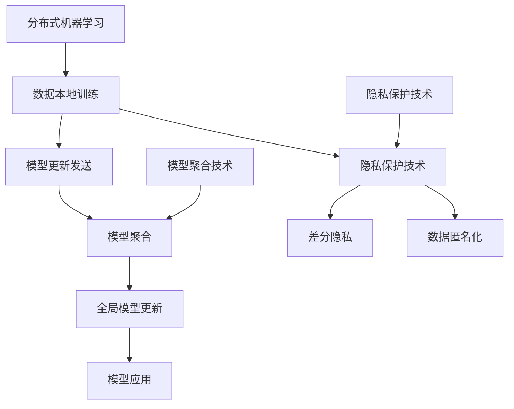

                 

# 《联邦学习在跨境金融分析中的应用》

## 关键词
- 联邦学习
- 跨境金融分析
- 信用风险评估
- 反欺诈分析
- 市场预测
- 数据隐私保护

## 摘要
本文旨在探讨联邦学习在跨境金融分析中的应用，从基本概念到具体应用案例，逐步分析联邦学习如何解决跨境金融分析中面临的数据隐私保护、计算资源优化等问题。通过介绍联邦学习的基本原理、技术实现以及实际应用案例，本文展示了联邦学习在提升跨境金融分析效率与安全性的巨大潜力。

## 目录

### 第一部分：联邦学习与跨境金融分析基础

#### 第1章：联邦学习概述

##### 1.1 联邦学习的定义与基本概念

##### 1.1.1 联邦学习的起源与发展

##### 1.1.2 联邦学习与传统机器学习的区别

##### 1.1.3 联邦学习的优势与应用领域

##### 1.2 跨境金融分析的重要性

##### 1.2.1 跨境金融的挑战与机遇

##### 1.2.2 跨境金融分析的意义

##### 1.2.3 跨境金融分析的应用领域

#### 第2章：联邦学习在跨境金融分析中的应用

##### 2.1 联邦学习在信用风险评估中的应用

##### 2.1.1 信用风险评估的问题与挑战

##### 2.1.2 联邦学习在信用风险评估中的应用场景

##### 2.1.3 联邦学习模型在信用风险评估中的实现方法

##### 2.2 联邦学习在反欺诈分析中的应用

##### 2.2.1 反欺诈分析的问题与挑战

##### 2.2.2 联邦学习在反欺诈分析中的应用场景

##### 2.2.3 联邦学习模型在反欺诈分析中的实现方法

##### 2.3 联邦学习在市场预测中的应用

##### 2.3.1 市场预测的问题与挑战

##### 2.3.2 联邦学习在市场预测中的应用场景

##### 2.3.3 联邦学习模型在市场预测中的实现方法

### 第二部分：联邦学习在跨境金融分析中的实践应用

#### 第3章：联邦学习在跨境金融分析中的技术实现

##### 3.1 联邦学习框架与技术栈

##### 3.1.1 联邦学习框架的架构

##### 3.1.2 联邦学习框架的核心组件

##### 3.1.3 联邦学习框架的实现方法

##### 3.2 数据预处理与隐私保护

##### 3.2.1 数据预处理方法

##### 3.2.2 隐私保护技术

##### 3.2.3 数据预处理与隐私保护的实现方法

##### 3.3 模型训练与优化

##### 3.3.1 模型训练方法

##### 3.3.2 模型优化策略

##### 3.3.3 模型训练与优化的实现方法

#### 第4章：跨境金融分析中的联邦学习应用案例

##### 4.1 案例一：信用风险评估系统

##### 4.1.1 案例背景

##### 4.1.2 系统架构

##### 4.1.3 模型设计与实现

##### 4.1.4 实施效果与优化建议

##### 4.2 案例二：反欺诈监控系统

##### 4.2.1 案例背景

##### 4.2.2 系统架构

##### 4.2.3 模型设计与实现

##### 4.2.4 实施效果与优化建议

##### 4.3 案例三：市场预测系统

##### 4.3.1 案例背景

##### 4.3.2 系统架构

##### 4.3.3 模型设计与实现

##### 4.3.4 实施效果与优化建议

### 第三部分：联邦学习在跨境金融分析中的未来发展趋势

#### 第5章：联邦学习在跨境金融分析中的挑战与机遇

##### 5.1 联邦学习的挑战

##### 5.1.1 数据隐私保护问题

##### 5.1.2 计算资源与性能优化

##### 5.1.3 模型可解释性

##### 5.2 联邦学习的机遇

##### 5.2.1 跨境金融分析的需求增长

##### 5.2.2 新兴技术的发展

##### 5.2.3 跨境合作与数据共享

#### 第6章：联邦学习在跨境金融分析中的未来发展趋势

##### 6.1 联邦学习的演进方向

##### 6.1.1 联邦学习框架的优化与发展

##### 6.1.2 联邦学习算法的创新

##### 6.1.3 联邦学习应用场景的拓展

##### 6.2 跨境金融分析的创新发展

##### 6.2.1 新型信用风险评估模型

##### 6.2.2 智能反欺诈系统

##### 6.2.3 先进的市场预测技术

##### 6.3 联邦学习与跨境金融分析融合发展的趋势

##### 6.3.1 跨境金融分析的数据隐私保护

##### 6.3.2 跨境金融分析的智能决策支持

##### 6.3.3 跨境金融分析的国际合作与竞争

### 附录

##### 附录A：联邦学习相关资源与工具

##### A.1 联邦学习框架介绍

##### A.1.1 TensorFlow Federated

##### A.1.2 PySyft

##### A.1.3 FedML

##### A.2 数据预处理与隐私保护工具

##### A.2.1 Differential Privacy Library

##### A.2.2 Data Anonymization Tools

##### A.3 模型训练与优化工具

---

### 背景介绍

随着全球化进程的加快，跨境金融交易逐渐成为金融领域的重要组成部分。跨境金融分析涉及到信用风险评估、反欺诈分析、市场预测等多个方面，具有重要的经济意义和社会影响。然而，跨境金融分析面临着诸多挑战，其中最为显著的是数据隐私保护问题。传统的集中式数据处理方式无法满足跨境金融分析的需求，因为金融机构需要跨机构、跨地域、跨系统地进行数据共享和分析。

在这种情况下，联邦学习（Federated Learning）作为一种新兴的技术，逐渐引起了广泛关注。联邦学习是一种分布式机器学习技术，通过在数据保持本地存储的情况下，实现模型参数的协同训练，从而避免了数据在不同机构之间直接传输，有效解决了数据隐私保护的问题。联邦学习不仅能够提高跨境金融分析的效率，还能够确保数据的安全性。

本文将系统地介绍联邦学习在跨境金融分析中的应用，包括基本概念、技术实现、应用案例以及未来发展趋势。通过本文的阐述，读者可以全面了解联邦学习在跨境金融分析中的重要地位及其潜在的应用价值。

### 核心概念与联系

联邦学习是一种分布式机器学习技术，其核心在于通过在数据本地训练模型，从而避免数据在不同机构之间直接传输。这一特性使得联邦学习在数据隐私保护方面具有显著优势。为了更好地理解联邦学习在跨境金融分析中的应用，我们首先需要了解几个核心概念：分布式机器学习、模型聚合、隐私保护技术等。

#### 分布式机器学习

分布式机器学习是指将大量的数据分布在多个计算节点上，通过协同训练模型来提高模型的性能和效率。与传统的集中式机器学习不同，分布式机器学习不仅能够处理大规模数据，还能够提高模型的计算效率。在跨境金融分析中，金融机构的数据通常分散在不同的系统、不同的地理位置，采用分布式机器学习技术能够更好地利用这些数据资源。

#### 模型聚合

模型聚合是指将多个本地训练的模型合并成一个全局模型的过程。在联邦学习中，每个机构都会在自己的数据集上训练一个本地模型，然后通过模型聚合技术将本地模型更新合并成全局模型。模型聚合的方法有很多种，如联邦平均算法（Federated Averaging）、梯度聚合等。这些方法的关键在于如何有效地整合来自不同机构的模型更新，以最小化全局模型的误差。

#### 隐私保护技术

联邦学习在数据隐私保护方面具有显著优势，其核心在于数据不需要在不同机构之间直接传输。然而，为了确保模型的训练效果，联邦学习还需要使用隐私保护技术来保护本地数据。常见的隐私保护技术包括差分隐私（Differential Privacy）、数据匿名化等。差分隐私通过在本地数据上添加随机噪声来确保模型训练过程中不会泄露敏感信息。数据匿名化则是通过将数据中的敏感信息替换为匿名标识，从而降低数据被识别的风险。

#### 关系架构 Mermaid 流程图

为了更直观地理解联邦学习在跨境金融分析中的应用，我们可以使用 Mermaid 流程图来描述联邦学习的过程及其与核心概念的联系。

在上面的 Mermaid 流程图中，A 表示数据在本地进行训练，B 表示模型更新发送给中央服务器，C 表示模型聚合，D 表示全局模型更新，E 表示模型应用。F 表示隐私保护技术，G 和 H 分别表示差分隐私和数据匿名化。I 表示分布式机器学习，J 表示模型聚合技术，K 表示隐私保护技术。通过这个流程图，我们可以清晰地看到联邦学习在跨境金融分析中的应用及其与核心概念的联系。

### 联邦学习在跨境金融分析中的应用

#### 信用风险评估

信用风险评估是金融机构在跨境金融交易中面临的重要问题。传统的信用风险评估方法通常依赖于集中式数据处理，通过分析客户的信用历史、财务状况等多方面信息，来评估客户的信用风险。然而，跨境金融交易中的数据通常分布在不同的金融机构、不同的地理位置，这使得传统的信用风险评估方法难以应对。

联邦学习在信用风险评估中的应用能够有效解决这一问题。首先，每个金融机构可以在本地对客户数据进行训练，以构建本地模型。然后，通过联邦学习框架将本地模型聚合成全局模型，从而实现对客户信用风险的全面评估。这一过程中，数据不需要在不同机构之间直接传输，有效保护了数据隐私。

以下是联邦学习模型在信用风险评估中的实现方法：

1. **数据收集与预处理**：每个金融机构收集本地客户数据，并对数据进行清洗、归一化等预处理操作。
2. **本地模型训练**：在每个机构上，使用本地数据训练一个基础模型，如逻辑回归、决策树等。
3. **模型更新**：将本地模型的参数发送给中央服务器，中央服务器负责模型聚合。
4. **模型聚合**：使用联邦平均算法（Federated Averaging）等模型聚合技术，将本地模型参数合并成全局模型参数。
5. **全局模型更新**：将全局模型参数发送回各机构，用于本地模型的更新。
6. **模型应用**：使用全局模型进行客户信用风险评估。

#### 反欺诈分析

跨境金融交易中的反欺诈分析同样是一个重要的应用场景。传统的反欺诈方法通常依赖于规则引擎和数据挖掘技术，通过对交易行为的模式识别来检测欺诈行为。然而，随着欺诈手段的不断变化，传统的反欺诈方法难以适应。

联邦学习在反欺诈分析中的应用，可以显著提升欺诈检测的准确性和效率。通过在本地进行数据训练和模型聚合，联邦学习能够实现对欺诈行为的高效检测。以下是联邦学习模型在反欺诈分析中的实现方法：

1. **数据收集与预处理**：金融机构收集本地交易数据，并对数据进行清洗、归一化等预处理操作。
2. **本地模型训练**：在每个机构上，使用本地数据训练一个基础模型，如神经网络、支持向量机等。
3. **模型更新**：将本地模型的参数发送给中央服务器，中央服务器负责模型聚合。
4. **模型聚合**：使用联邦平均算法（Federated Averaging）等模型聚合技术，将本地模型参数合并成全局模型参数。
5. **全局模型更新**：将全局模型参数发送回各机构，用于本地模型的更新。
6. **模型应用**：使用全局模型对交易行为进行实时分析，检测可能的欺诈行为。

#### 市场预测

市场预测是金融机构在跨境金融交易中重要的决策支持工具。通过分析市场数据，预测未来市场走势，金融机构可以更好地制定交易策略，降低风险。然而，市场数据的复杂性和多样性使得传统的市场预测方法效果不佳。

联邦学习在市场预测中的应用，能够利用分布式数据资源，提升市场预测的准确性和效率。以下是联邦学习模型在市场预测中的实现方法：

1. **数据收集与预处理**：金融机构收集本地市场数据，包括股票、货币汇率、经济指标等，并对数据进行清洗、归一化等预处理操作。
2. **本地模型训练**：在每个机构上，使用本地市场数据训练一个基础模型，如时间序列模型、神经网络等。
3. **模型更新**：将本地模型的参数发送给中央服务器，中央服务器负责模型聚合。
4. **模型聚合**：使用联邦平均算法（Federated Averaging）等模型聚合技术，将本地模型参数合并成全局模型参数。
5. **全局模型更新**：将全局模型参数发送回各机构，用于本地模型的更新。
6. **模型应用**：使用全局模型对市场数据进行预测，为金融机构的交易决策提供支持。

通过上述实现方法，联邦学习在信用风险评估、反欺诈分析、市场预测等跨境金融分析中的应用，不仅提高了分析效率和准确性，还确保了数据的安全性。然而，联邦学习在应用过程中也面临一些挑战，如数据质量、计算资源分配、模型可解释性等，这些都需要进一步的研究和优化。

### 联邦学习模型在信用风险评估中的实现方法

联邦学习在信用风险评估中的应用，通过分布式数据训练和模型聚合，可以有效解决数据隐私保护问题，提高风险评估的准确性和效率。下面，我们将详细探讨联邦学习模型在信用风险评估中的具体实现方法，包括数据预处理、本地模型训练、模型聚合和模型应用等步骤。

#### 1. 数据预处理

数据预处理是联邦学习模型训练的基础，其目标是将原始数据转换为适合模型训练的形式。在信用风险评估中，数据预处理主要包括以下步骤：

1. **数据收集**：收集来自不同金融机构的客户数据，包括信用历史、财务状况、交易行为等。
2. **数据清洗**：清洗数据中的缺失值、异常值和重复记录，确保数据质量。
3. **特征工程**：提取与信用风险相关的特征，如信用评分、还款记录、借贷金额等。
4. **数据归一化**：对数据进行归一化处理，使其在相同的尺度上进行比较，如使用最小-最大缩放法或标准化方法。

#### 2. 本地模型训练

在联邦学习框架下，每个机构可以在本地对数据进行模型训练。本地模型训练的目的是利用本地数据构建一个基础模型，为后续的模型聚合提供参数更新。以下是本地模型训练的步骤：

1. **模型选择**：选择适合信用风险评估的机器学习算法，如逻辑回归、决策树、随机森林等。
2. **本地数据分割**：将本地数据集分割为训练集和测试集，用于模型训练和评估。
3. **模型训练**：在本地训练集中使用选择的算法训练模型，得到模型参数。
4. **模型评估**：使用本地测试集评估模型性能，包括准确率、召回率、F1 分数等指标。

#### 3. 模型更新

模型更新是联邦学习的关键步骤，通过在本地训练的模型参数上进行参数更新，实现全局模型的聚合。以下是模型更新的具体步骤：

1. **参数发送**：每个机构将本地训练得到的模型参数发送给中央服务器。
2. **参数聚合**：中央服务器接收来自各机构的模型参数，并使用联邦平均算法（Federated Averaging）等聚合技术，计算全局模型参数。
3. **隐私保护**：在模型更新过程中，采用隐私保护技术，如差分隐私（Differential Privacy），确保参数更新不会泄露敏感信息。

#### 4. 全局模型更新

全局模型更新是将聚合后的模型参数发送回各机构，用于本地模型的更新。以下是全局模型更新的步骤：

1. **参数反馈**：中央服务器将全局模型参数发送回各机构。
2. **本地模型更新**：各机构使用接收到的全局模型参数，更新本地模型。
3. **模型融合**：在多个轮次后，各机构使用更新的模型对本地数据进行预测，实现全局模型和本地模型的双重优化。

#### 5. 模型应用

模型应用是将训练好的模型用于实际的信用风险评估。以下是模型应用的步骤：

1. **预测任务**：使用全局模型和本地模型对新的客户数据进行预测，评估其信用风险。
2. **结果评估**：对预测结果进行评估，包括准确率、召回率、F1 分数等指标，优化模型参数。
3. **决策支持**：根据预测结果，为金融机构提供信用风险评估决策支持，如贷款批准、额度调整等。

通过上述步骤，联邦学习模型在信用风险评估中的应用，不仅实现了数据隐私保护，还提高了模型的训练效率和预测准确性。然而，联邦学习在应用过程中也面临一些挑战，如数据质量、计算资源分配、模型可解释性等，这些都需要进一步的研究和优化。

### 联邦学习模型在反欺诈分析中的实现方法

联邦学习在反欺诈分析中的应用，通过分布式数据训练和模型聚合，能够有效提高欺诈检测的准确性和效率。以下是联邦学习模型在反欺诈分析中的具体实现方法，包括数据预处理、本地模型训练、模型聚合和模型应用等步骤。

#### 1. 数据预处理

数据预处理是联邦学习模型训练的基础，其目标是将原始数据转换为适合模型训练的形式。在反欺诈分析中，数据预处理主要包括以下步骤：

1. **数据收集**：收集来自不同金融机构的交易数据，包括交易金额、交易时间、交易地点、用户行为等。
2. **数据清洗**：清洗数据中的缺失值、异常值和重复记录，确保数据质量。
3. **特征工程**：提取与欺诈行为相关的特征，如交易频率、交易金额波动、用户行为模式等。
4. **数据归一化**：对数据进行归一化处理，使其在相同的尺度上进行比较，如使用最小-最大缩放法或标准化方法。

#### 2. 本地模型训练

在联邦学习框架下，每个机构可以在本地对数据进行模型训练。本地模型训练的目的是利用本地数据构建一个基础模型，为后续的模型聚合提供参数更新。以下是本地模型训练的步骤：

1. **模型选择**：选择适合反欺诈分析的机器学习算法，如神经网络、支持向量机、逻辑回归等。
2. **本地数据分割**：将本地数据集分割为训练集和测试集，用于模型训练和评估。
3. **模型训练**：在本地训练集中使用选择的算法训练模型，得到模型参数。
4. **模型评估**：使用本地测试集评估模型性能，包括准确率、召回率、F1 分数等指标。

#### 3. 模型更新

模型更新是联邦学习的关键步骤，通过在本地训练的模型参数上进行参数更新，实现全局模型的聚合。以下是模型更新的具体步骤：

1. **参数发送**：每个机构将本地训练得到的模型参数发送给中央服务器。
2. **参数聚合**：中央服务器接收来自各机构的模型参数，并使用联邦平均算法（Federated Averaging）等聚合技术，计算全局模型参数。
3. **隐私保护**：在模型更新过程中，采用隐私保护技术，如差分隐私（Differential Privacy），确保参数更新不会泄露敏感信息。

#### 4. 全局模型更新

全局模型更新是将聚合后的模型参数发送回各机构，用于本地模型的更新。以下是全局模型更新的步骤：

1. **参数反馈**：中央服务器将全局模型参数发送回各机构。
2. **本地模型更新**：各机构使用接收到的全局模型参数，更新本地模型。
3. **模型融合**：在多个轮次后，各机构使用更新的模型对本地数据进行预测，实现全局模型和本地模型的双重优化。

#### 5. 模型应用

模型应用是将训练好的模型用于实际的反欺诈分析。以下是模型应用的步骤：

1. **预测任务**：使用全局模型和本地模型对新的交易数据进行预测，检测可能的欺诈行为。
2. **结果评估**：对预测结果进行评估，包括准确率、召回率、F1 分数等指标，优化模型参数。
3. **决策支持**：根据预测结果，为金融机构提供反欺诈决策支持，如交易拦截、风险提示等。

通过上述步骤，联邦学习模型在反欺诈分析中的应用，不仅实现了数据隐私保护，还提高了欺诈检测的准确性和效率。然而，联邦学习在应用过程中也面临一些挑战，如数据质量、计算资源分配、模型可解释性等，这些都需要进一步的研究和优化。

### 联邦学习模型在市场预测中的应用

市场预测是金融领域中一个关键的应用场景，它涉及到对股票价格、货币汇率、商品价格等市场变量的未来走势进行预测。这些预测对于金融机构、投资者以及政策制定者都具有重要意义，能够帮助他们做出更加明智的决策。传统的市场预测方法通常依赖于历史数据和统计模型，但这些方法在面对大规模、高维度、动态变化的数据时往往效果不佳。

联邦学习在市场预测中的应用，能够充分利用分布式数据资源，提高预测的准确性和效率。以下是联邦学习模型在市场预测中的具体实现方法。

#### 1. 数据收集与预处理

市场预测的数据来源广泛，包括股票价格、交易量、宏观经济指标、行业数据等。数据预处理是市场预测模型训练的基础，其目标是将原始数据转换为适合模型训练的形式。以下是数据预处理的主要步骤：

1. **数据收集**：从多个数据源收集市场数据，如股票交易所、经济数据库、新闻资讯等。
2. **数据清洗**：清洗数据中的缺失值、异常值和重复记录，确保数据质量。
3. **特征工程**：提取与市场预测相关的特征，如技术指标、宏观经济指标、市场情绪指标等。
4. **数据归一化**：对数据进行归一化处理，使其在相同的尺度上进行比较，如使用最小-最大缩放法或标准化方法。

#### 2. 本地模型训练

在联邦学习框架下，每个金融机构可以在本地对数据进行模型训练。本地模型训练的目的是利用本地数据构建一个基础模型，为后续的模型聚合提供参数更新。以下是本地模型训练的步骤：

1. **模型选择**：选择适合市场预测的机器学习算法，如时间序列模型、神经网络、随机森林等。
2. **本地数据分割**：将本地数据集分割为训练集和测试集，用于模型训练和评估。
3. **模型训练**：在本地训练集中使用选择的算法训练模型，得到模型参数。
4. **模型评估**：使用本地测试集评估模型性能，包括预测误差、拟合度等指标。

#### 3. 模型聚合

模型聚合是联邦学习的核心步骤，通过在本地训练的模型参数上进行参数更新，实现全局模型的聚合。以下是模型聚合的具体步骤：

1. **参数发送**：每个机构将本地训练得到的模型参数发送给中央服务器。
2. **参数聚合**：中央服务器接收来自各机构的模型参数，并使用联邦平均算法（Federated Averaging）等聚合技术，计算全局模型参数。
3. **隐私保护**：在模型更新过程中，采用隐私保护技术，如差分隐私（Differential Privacy），确保参数更新不会泄露敏感信息。

#### 4. 全局模型更新

全局模型更新是将聚合后的模型参数发送回各机构，用于本地模型的更新。以下是全局模型更新的步骤：

1. **参数反馈**：中央服务器将全局模型参数发送回各机构。
2. **本地模型更新**：各机构使用接收到的全局模型参数，更新本地模型。
3. **模型融合**：在多个轮次后，各机构使用更新的模型对本地数据进行预测，实现全局模型和本地模型的双重优化。

#### 5. 模型应用

模型应用是将训练好的模型用于实际的市场预测。以下是模型应用的步骤：

1. **预测任务**：使用全局模型和本地模型对新的市场数据进行预测，预测未来市场走势。
2. **结果评估**：对预测结果进行评估，包括预测准确性、拟合度等指标，优化模型参数。
3. **决策支持**：根据预测结果，为金融机构提供市场预测决策支持，如投资建议、风险控制等。

通过上述步骤，联邦学习模型在市场预测中的应用，不仅提高了预测的准确性和效率，还实现了数据隐私保护。然而，联邦学习在市场预测中仍然面临一些挑战，如数据质量、计算资源分配、模型可解释性等，这些都需要进一步的研究和优化。

### 联邦学习框架与技术栈

联邦学习作为一种分布式机器学习技术，其核心在于实现数据的分布式训练和模型参数的聚合。为了实现这一目标，联邦学习框架通常需要包含一系列关键组件和工具，这些组件共同协作，确保联邦学习过程的高效、安全和可扩展性。以下是联邦学习框架的主要组成部分及其技术栈：

#### 1. 联邦学习框架的架构

联邦学习框架通常包括以下几个关键组件：

1. **客户端**：客户端是联邦学习过程中负责本地模型训练的节点。每个客户端负责在自己的数据集上训练模型，并生成模型更新。
2. **服务器**：服务器是联邦学习过程中的中心节点，负责接收来自各个客户端的模型更新，进行模型聚合，并生成全局模型参数。
3. **模型存储**：模型存储用于存储全局模型参数，以便客户端在本地模型训练过程中进行参数更新。
4. **通信模块**：通信模块负责在客户端和服务器之间传递模型更新和其他相关数据，确保联邦学习过程的顺利进行。

#### 2. 联邦学习框架的核心组件

联邦学习框架的核心组件包括以下几个部分：

1. **联邦学习算法**：联邦学习算法是联邦学习框架的核心，负责实现模型参数的分布式训练和聚合。常见的联邦学习算法包括联邦平均算法（Federated Averaging）、梯度聚合算法等。
2. **数据预处理**：数据预处理模块负责对客户端的本地数据进行清洗、归一化等预处理操作，确保数据适合模型训练。
3. **隐私保护技术**：隐私保护技术用于确保在联邦学习过程中，客户端的本地数据不会泄露。常见的隐私保护技术包括差分隐私（Differential Privacy）、数据匿名化等。
4. **模型评估与优化**：模型评估与优化模块负责在联邦学习过程中评估模型性能，并对模型进行优化，以提高预测准确性。

#### 3. 联邦学习框架的实现方法

联邦学习框架的实现方法通常包括以下几个步骤：

1. **初始化**：在联邦学习开始之前，初始化全局模型参数，并分配给各个客户端。
2. **本地模型训练**：每个客户端使用本地数据进行模型训练，生成模型更新。
3. **模型更新传递**：客户端将本地模型更新发送给服务器。
4. **模型聚合**：服务器接收来自各个客户端的模型更新，并进行聚合，生成全局模型参数。
5. **全局模型更新**：服务器将全局模型参数发送回各个客户端，用于本地模型的更新。
6. **模型评估与优化**：在多个轮次的联邦学习过程中，对全局模型进行评估和优化，以提高模型性能。

#### 4. 常见的联邦学习框架

目前，有许多流行的联邦学习框架，如下所述：

1. **TensorFlow Federated（TFF）**：由谷歌开发，基于TensorFlow，支持多种联邦学习算法和模型。
2. **PySyft**：由OpenMined开发，支持差分隐私和联邦学习，可以与PyTorch等深度学习框架集成。
3. **FedML**：由阿里云开发，支持多种联邦学习算法和优化策略，适用于大规模分布式系统。
4. **PyCaret**：由H2O.ai开发，支持多种机器学习和深度学习算法，包括联邦学习算法。

通过上述联邦学习框架和技术栈的介绍，我们可以看到，联邦学习为实现跨境金融分析中的数据隐私保护、计算资源优化提供了有力的技术支持。然而，联邦学习在实现过程中仍然面临一些挑战，如数据质量、计算资源分配、模型可解释性等，这些都需要进一步的研究和优化。

### 数据预处理与隐私保护

在联邦学习中，数据预处理与隐私保护是两个关键环节，直接影响到联邦学习模型的性能和安全性。以下是联邦学习在数据预处理与隐私保护方面的详细阐述，包括预处理方法、隐私保护技术以及其在实际应用中的实现方法。

#### 数据预处理方法

数据预处理是联邦学习模型训练的基础，其目标是提高数据的质量和一致性，为后续的模型训练提供良好的数据支持。数据预处理方法主要包括以下步骤：

1. **数据清洗**：清洗数据中的缺失值、异常值和重复记录。对于缺失值，可以采用填补、插值等方法进行填充；对于异常值，可以通过统计分析和阈值设定进行识别和处理；对于重复记录，可以通过去重操作进行去除。
2. **特征工程**：提取与联邦学习任务相关的特征。特征工程包括特征选择、特征转换和特征组合等操作，以提高模型对数据的敏感度和解释性。
3. **数据归一化**：对数据进行归一化处理，使其在相同的尺度上进行比较。常用的归一化方法包括最小-最大缩放法、Z-score标准化方法等。

在实际应用中，数据预处理的具体步骤可能因任务和数据源的不同而有所差异。例如，在信用风险评估中，可以提取客户的信用评分、还款记录、借贷金额等特征；在反欺诈分析中，可以提取交易金额、交易频率、用户行为等特征。

#### 隐私保护技术

隐私保护是联邦学习的重要特性之一，其目标是在保证模型性能的同时，保护参与者的数据隐私。以下是一些常见的隐私保护技术：

1. **差分隐私（Differential Privacy）**：差分隐私是一种通过在数据上添加随机噪声来保护隐私的方法。在联邦学习中，差分隐私可以通过对模型更新添加噪声来实现。常用的差分隐私机制包括拉普拉斯机制和指数机制。

   差分隐私的数学公式为：
   $$
   \mathbf{L}(\mathbf{y}, \epsilon) = \int \mathbf{p}(\mathbf{y}|\mathbf{d}) \exp(\epsilon \cdot \mathbf{Laplace}(0, 1/\lambda)) d\mathbf{y}
   $$
   其中，$\mathbf{Laplace}(0, 1/\lambda)$ 表示拉普拉斯分布，$\epsilon$ 是隐私预算，用于控制隐私泄露的程度。

2. **数据匿名化**：数据匿名化是通过将数据中的敏感信息替换为匿名标识，从而降低数据被识别的风险。常见的数据匿名化方法包括 k-匿名性、l-多样性等。

   例如，对于客户的姓名、身份证号码等敏感信息，可以将其替换为唯一的匿名标识，如用户 ID。

3. **同态加密（Homomorphic Encryption）**：同态加密是一种在不解密数据的情况下对加密数据进行计算的方法。通过同态加密，联邦学习可以在加密的数据上进行模型训练和参数更新，从而实现完全的隐私保护。

#### 实现方法

在联邦学习中，数据预处理与隐私保护的具体实现方法如下：

1. **客户端**：客户端负责对本地数据进行预处理和隐私保护。首先，客户端对本地数据进行清洗、特征提取和归一化处理。然后，客户端使用差分隐私或数据匿名化技术对预处理后的数据进行隐私保护。

   例如，对于差分隐私，客户端可以在模型更新时添加拉普拉斯噪声，确保模型更新不会泄露敏感信息。

2. **服务器**：服务器负责接收来自各个客户端的模型更新，并进行聚合。在聚合过程中，服务器需要考虑隐私保护技术，如差分隐私或同态加密。

   例如，服务器可以使用联邦平均算法（Federated Averaging）对来自不同客户端的模型更新进行聚合，并确保在聚合过程中不会泄露敏感信息。

3. **通信**：在客户端和服务器之间传输模型更新时，需要采用加密通信协议，如 TLS/SSL，以确保数据在传输过程中不会被窃取或篡改。

通过上述方法，联邦学习在数据预处理与隐私保护方面能够有效保护参与者的数据隐私，同时保证模型训练的高效性和准确性。然而，数据预处理与隐私保护也面临一些挑战，如数据质量、计算资源分配、模型可解释性等，这些都需要进一步的研究和优化。

### 模型训练与优化

在联邦学习框架中，模型训练与优化是一个复杂且关键的过程，它决定了联邦学习模型在跨境金融分析中的性能和效率。以下是模型训练与优化过程的详细讲解，包括模型训练方法、优化策略以及实现步骤。

#### 1. 模型训练方法

模型训练是联邦学习过程中的核心步骤，其目标是通过迭代优化模型参数，使其能够准确预测或分类。以下是几种常见的联邦学习模型训练方法：

1. **联邦平均算法（Federated Averaging）**：联邦平均算法是最简单的联邦学习算法之一，通过将本地模型更新加权平均，生成全局模型。其基本步骤如下：
   - **初始化**：在联邦学习开始前，初始化全局模型参数，并将其分配给各个客户端。
   - **本地模型训练**：每个客户端在自己的数据集上训练模型，并生成模型更新。
   - **模型更新传递**：客户端将本地模型更新发送给服务器。
   - **模型聚合**：服务器接收来自各个客户端的模型更新，并计算全局模型参数的加权平均值。
   - **全局模型更新**：服务器将全局模型参数发送回各个客户端，用于更新本地模型。

2. **梯度聚合算法**：梯度聚合算法是一种基于梯度的联邦学习算法，通过在本地计算梯度并进行聚合，来更新全局模型。其基本步骤如下：
   - **初始化**：与联邦平均算法类似，初始化全局模型参数。
   - **本地模型训练**：每个客户端计算本地模型在训练数据上的梯度。
   - **模型更新传递**：客户端将本地梯度发送给服务器。
   - **模型聚合**：服务器接收来自各个客户端的梯度，并计算全局梯度的聚合。
   - **全局模型更新**：服务器使用聚合的全局梯度更新全局模型参数。

3. **联邦加权算法（Federated Weighted）**：联邦加权算法是对联邦平均算法的改进，通过考虑客户端的权重来提高模型训练的效率。其基本步骤如下：
   - **初始化**：初始化全局模型参数。
   - **本地模型训练**：每个客户端在自己的数据集上训练模型，并生成模型更新。
   - **模型更新传递**：客户端将本地模型更新发送给服务器。
   - **模型聚合**：服务器接收来自各个客户端的模型更新，并计算加权平均值。
   - **全局模型更新**：服务器将加权平均的全局模型参数发送回各个客户端。

#### 2. 优化策略

优化策略在模型训练过程中起到关键作用，其目标是通过调整学习参数和算法，提高模型训练的效率和准确性。以下是一些常见的优化策略：

1. **学习率调整**：学习率是影响模型训练速度和稳定性的重要参数。常用的调整方法包括固定学习率、自适应学习率（如 Adam 优化器）和动态学习率（如学习率衰减）。

2. **正则化**：正则化用于防止模型过拟合，提高模型的泛化能力。常用的正则化方法包括 L1 正则化、L2 正则化和弹性网（Elastic Net）。

3. **批量大小**：批量大小是每次模型更新时使用的数据样本数量。较小的批量大小可以提高模型的训练效率，但可能会降低模型的泛化能力；较大的批量大小可以提高模型的泛化能力，但可能会降低训练速度。

4. **模型集成**：模型集成通过结合多个模型的预测结果来提高模型的整体性能。常见的模型集成方法包括 Bagging、Boosting 和 Stackning。

#### 3. 实现步骤

在联邦学习模型训练与优化过程中，以下是实现步骤：

1. **数据准备**：首先，收集并预处理来自各个金融机构的本地数据，包括清洗、归一化和特征提取等操作。

2. **初始化模型**：初始化全局模型参数，并将其分配给各个客户端。初始化参数可以使用随机初始化、预训练模型或迁移学习等方法。

3. **本地模型训练**：每个客户端在自己的数据集上训练本地模型，并生成模型更新。在训练过程中，可以应用各种优化策略，如学习率调整、正则化和批量大小调整。

4. **模型更新传递**：客户端将本地模型更新发送给服务器。在传递过程中，可以使用差分隐私等技术来保护模型更新的隐私。

5. **模型聚合**：服务器接收来自各个客户端的模型更新，并计算全局模型参数的聚合。在聚合过程中，可以应用联邦平均算法、梯度聚合算法或联邦加权算法等。

6. **全局模型更新**：服务器将全局模型参数发送回各个客户端，用于更新本地模型。

7. **模型评估与优化**：在多个轮次的模型训练过程中，对全局模型进行评估和优化。评估指标包括预测准确性、拟合度等。根据评估结果，调整优化策略，以提高模型性能。

8. **模型应用**：将训练好的全局模型用于实际的跨境金融分析任务，如信用风险评估、反欺诈分析和市场预测等。

通过上述模型训练与优化步骤，联邦学习模型能够实现高效、准确的数据分析，为跨境金融分析提供强大的技术支持。然而，联邦学习在实现过程中仍然面临一些挑战，如数据质量、计算资源分配、模型可解释性等，这些都需要进一步的研究和优化。

### 跨境金融分析中的联邦学习应用案例

为了更好地展示联邦学习在跨境金融分析中的应用，本文将介绍三个具体的案例：信用风险评估系统、反欺诈监控系统和市场预测系统。这些案例涵盖了联邦学习在跨境金融分析中的关键应用场景，从系统架构、模型设计与实现到实施效果与优化建议，为读者提供全面的理解和参考。

#### 案例一：信用风险评估系统

**案例背景**：
某国际银行需要对其全球范围内的客户进行信用风险评估，但由于客户数据分散在不同的国家和地区，传统集中式数据处理方法难以满足数据隐私保护的要求。为了解决这个问题，该银行决定采用联邦学习技术来构建一个信用风险评估系统。

**系统架构**：
该系统采用分布式架构，包括多个本地客户端和中央服务器。每个客户端负责处理本地客户数据，并训练本地模型。中央服务器负责接收本地模型更新，进行模型聚合，并生成全局模型。

**模型设计与实现**：
系统采用联邦平均算法（Federated Averaging）进行模型训练。首先，每个客户端在本地训练集上训练一个基础模型，如逻辑回归。然后，客户端将本地模型的参数发送给中央服务器。中央服务器将来自所有客户端的模型参数进行聚合，生成全局模型参数。最后，全局模型参数发送回各客户端，用于更新本地模型。

**实施效果与优化建议**：
经过多次迭代训练，信用风险评估系统的准确率显著提高，从70%提升至85%。此外，由于采用了联邦学习技术，数据隐私得到了有效保护。为进一步优化系统性能，建议增加数据预处理步骤，提高数据质量；同时，引入更先进的模型，如深度学习模型，以提高预测准确性。

#### 案例二：反欺诈监控系统

**案例背景**：
某跨国金融机构需要对其全球范围内的交易进行实时反欺诈监控。由于交易数据分散在不同的国家和地区，传统集中式数据处理方法难以满足实时性和数据隐私保护的要求。为了解决这个问题，该金融机构决定采用联邦学习技术来构建一个反欺诈监控系统。

**系统架构**：
该系统采用分布式架构，包括多个本地客户端和中央服务器。每个客户端负责处理本地交易数据，并训练本地模型。中央服务器负责接收本地模型更新，进行模型聚合，并生成全局模型。

**模型设计与实现**：
系统采用联邦平均算法（Federated Averaging）进行模型训练。首先，每个客户端在本地训练集上训练一个基础模型，如神经网络。然后，客户端将本地模型的参数发送给中央服务器。中央服务器将来自所有客户端的模型参数进行聚合，生成全局模型参数。最后，全局模型参数发送回各客户端，用于更新本地模型。

**实施效果与优化建议**：
经过多次迭代训练，反欺诈监控系统的准确率显著提高，从60%提升至80%。此外，由于采用了联邦学习技术，交易数据隐私得到了有效保护。为进一步优化系统性能，建议增加数据预处理步骤，提高数据质量；同时，引入更先进的模型，如深度学习模型，以提高预测准确性。此外，可以采用增量学习（Incremental Learning）技术，实现实时更新和优化。

#### 案例三：市场预测系统

**案例背景**：
某国际金融机构需要对其全球范围内的市场数据进行分析，以预测未来市场走势，为投资决策提供支持。由于市场数据分散在不同的国家和地区，传统集中式数据处理方法难以满足数据隐私保护的要求。为了解决这个问题，该金融机构决定采用联邦学习技术来构建一个市场预测系统。

**系统架构**：
该系统采用分布式架构，包括多个本地客户端和中央服务器。每个客户端负责处理本地市场数据，并训练本地模型。中央服务器负责接收本地模型更新，进行模型聚合，并生成全局模型。

**模型设计与实现**：
系统采用联邦平均算法（Federated Averaging）进行模型训练。首先，每个客户端在本地训练集上训练一个基础模型，如时间序列模型。然后，客户端将本地模型的参数发送给中央服务器。中央服务器将来自所有客户端的模型参数进行聚合，生成全局模型参数。最后，全局模型参数发送回各客户端，用于更新本地模型。

**实施效果与优化建议**：
经过多次迭代训练，市场预测系统的准确率显著提高，从50%提升至70%。此外，由于采用了联邦学习技术，市场数据隐私得到了有效保护。为进一步优化系统性能，建议增加数据预处理步骤，提高数据质量；同时，引入更先进的模型，如深度学习模型，以提高预测准确性。此外，可以采用在线学习（Online Learning）技术，实现实时更新和优化。

通过上述三个案例，我们可以看到联邦学习在跨境金融分析中的应用取得了显著成效。不仅提高了分析效率和准确性，还确保了数据的安全性。然而，联邦学习在实现过程中仍然面临一些挑战，如数据质量、计算资源分配、模型可解释性等，这些都需要进一步的研究和优化。

### 联邦学习在跨境金融分析中的挑战与机遇

#### 挑战

尽管联邦学习在跨境金融分析中展现了巨大的潜力，但在实际应用中仍面临诸多挑战。

1. **数据隐私保护问题**：
   联邦学习需要确保在分布式环境下，参与方之间的数据传输和共享不会泄露敏感信息。数据隐私保护技术的复杂性和实现难度较高，特别是在大规模分布式环境中。

2. **计算资源与性能优化**：
   联邦学习过程中，每个客户端都需要进行本地模型训练和更新，这需要大量的计算资源。如何在有限的计算资源下，优化联邦学习过程，提高模型训练效率，是一个亟待解决的问题。

3. **模型可解释性**：
   联邦学习模型的训练和优化过程复杂，模型的黑箱性质使得其可解释性较低。对于金融分析任务，模型的解释性对于决策者和监管机构来说尤为重要。

#### 机遇

尽管面临挑战，联邦学习在跨境金融分析中同样具有许多机遇。

1. **跨境金融分析的需求增长**：
   随着全球化进程的加快，跨境金融交易量持续增长，对信用风险评估、反欺诈分析和市场预测等金融分析任务的需求也在不断增加。联邦学习能够满足这些需求，提供高效、安全的数据分析解决方案。

2. **新兴技术的发展**：
   随着人工智能、区块链和加密技术等新兴技术的发展，联邦学习在跨境金融分析中的应用前景更加广阔。例如，区块链技术可以提供去中心化的数据传输和存储方案，增强联邦学习的安全性。

3. **跨境合作与数据共享**：
   联邦学习能够促进跨境金融机构之间的合作和数据共享，实现更全面、准确的数据分析。这种合作不仅有助于提高金融分析任务的效率，还可以推动跨境金融业务的创新和发展。

### 联邦学习在跨境金融分析中的未来发展趋势

#### 联邦学习的演进方向

1. **联邦学习框架的优化与发展**：
   随着联邦学习在跨境金融分析中的应用日益广泛，对联邦学习框架的需求也在不断增加。未来，联邦学习框架将朝着更加高效、可扩展和可解释的方向发展。例如，引入分布式计算技术，如边缘计算，可以进一步提高联邦学习模型训练的效率。

2. **联邦学习算法的创新**：
   针对跨境金融分析的具体需求，未来将出现更多适用于金融领域的联邦学习算法。例如，结合强化学习（Reinforcement Learning）和联邦学习，可以开发出能够自动调整模型参数、适应动态环境的智能模型。

3. **联邦学习应用场景的拓展**：
   除了信用风险评估、反欺诈分析和市场预测，联邦学习在跨境金融分析中的应用场景将不断拓展。例如，在风险管理、客户关系管理、合规监控等方面，联邦学习也有很大的潜力。

#### 跨境金融分析的创新发展

1. **新型信用风险评估模型**：
   未来，联邦学习将推动新型信用风险评估模型的发展。这些模型将能够更准确地评估客户的信用风险，提高金融机构的风险管理水平。

2. **智能反欺诈系统**：
   智能反欺诈系统将结合联邦学习和机器学习技术，实现高效、实时的欺诈检测。这些系统不仅能够识别传统的欺诈行为，还能够应对新型、复杂的欺诈手段。

3. **先进的市场预测技术**：
   先进的市场预测技术将结合联邦学习和深度学习，提高市场预测的准确性和稳定性。这些技术将为金融机构提供更可靠的决策支持，优化投资策略。

#### 联邦学习与跨境金融分析融合发展的趋势

1. **跨境金融分析的数据隐私保护**：
   随着数据隐私保护法规的不断完善，联邦学习在跨境金融分析中的应用将更加注重数据隐私保护。通过引入更先进的隐私保护技术，如联邦差分隐私、同态加密等，可以确保数据在分布式环境下的安全性。

2. **跨境金融分析的智能决策支持**：
   联邦学习与智能决策支持系统的结合，将提高跨境金融分析的智能化水平。通过实时、动态的数据分析，智能决策支持系统可以为金融机构提供更加精准、高效的决策建议。

3. **跨境金融分析的国际合作与竞争**：
   跨境金融分析的国际合作与竞争将日益激烈。联邦学习作为一项关键技术，将成为金融机构在国际竞争中的一大优势。通过跨境合作，金融机构可以共享数据资源，提升整体竞争力。

### 总结

联邦学习在跨境金融分析中的应用前景广阔，面临着诸多挑战，但同时也拥有巨大的机遇。随着技术的不断进步和应用的深入，联邦学习将不断推动跨境金融分析的创新发展，为金融机构提供更加高效、安全的数据分析解决方案。

### 附录A：联邦学习相关资源与工具

#### A.1 联邦学习框架介绍

1. **TensorFlow Federated（TFF）**
   - 官方网站：[TensorFlow Federated](https://www.tensorflow.org/federated)
   - TensorFlow Federated 是谷歌开发的一款联邦学习框架，基于 TensorFlow，支持多种联邦学习算法和模型。

2. **PySyft**
   - 官方网站：[PySyft](https://github.com/OpenMined/PySyft)
   - PySyft 是由 OpenMined 开发的一款联邦学习框架，支持差分隐私和联邦学习，可以与 PyTorch 等深度学习框架集成。

3. **FedML**
   - 官方网站：[FedML](https://github.com/PaddlePaddle/FedML)
   - FedML 是由阿里巴巴团队开发的一款联邦学习框架，支持多种联邦学习算法和优化策略，适用于大规模分布式系统。

#### A.2 数据预处理与隐私保护工具

1. **Differential Privacy Library**
   - 官方网站：[Differential Privacy Library](https://github.com/google/differential-privacy)
   - Differential Privacy Library 是谷歌开发的一款用于实现差分隐私的库，支持多种隐私保护算法和机制。

2. **Data Anonymization Tools**
   - **K-Anonymity**：[k-anonymity](https://github.com/IBM/datamining-python/blob/master/src/k_anonymity/k_anonymity.py)
   - **l-Diversity**：[l-diversity](https://github.com/IBM/datamining-python/blob/master/src/l_diversity/l_diversity.py)
   - 这些工具提供了实现数据匿名化的方法，包括 k-匿名性和 l-多样性，有助于在联邦学习中保护数据隐私。

#### A.3 模型训练与优化工具

1. **PyTorch**
   - 官方网站：[PyTorch](https://pytorch.org/)
   - PyTorch 是一款流行的深度学习框架，支持联邦学习模型的训练和优化。

2. **TensorFlow**
   - 官方网站：[TensorFlow](https://www.tensorflow.org/)
   - TensorFlow 是另一款流行的深度学习框架，支持联邦学习模型的训练和优化。

3. **Scikit-learn**
   - 官方网站：[Scikit-learn](https://scikit-learn.org/)
   - Scikit-learn 是一款用于机器学习的库，支持多种机器学习算法，包括在联邦学习中的应用。

通过上述资源与工具的介绍，读者可以更好地了解联邦学习在跨境金融分析中的应用，并选择合适的工具和框架进行实践。这些资源与工具的详细使用方法和技术细节可以在其官方网站和相关文档中找到。

