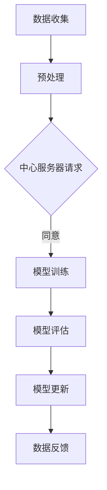
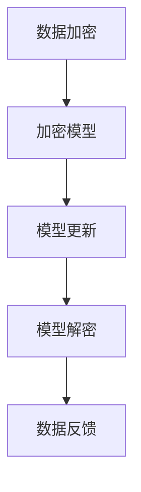

                 

### 文章标题：联邦学习在跨机构医疗数据分析中的隐私保护

#### 关键词：联邦学习、医疗数据分析、隐私保护、分布式计算、加密算法、跨机构数据共享

> **摘要：** 本文章深入探讨了联邦学习在跨机构医疗数据分析中的应用及其隐私保护机制。首先，我们介绍了联邦学习的基本概念、原理及其与传统分布式学习的异同。随后，我们分析了联邦学习在医疗数据分析中的挑战与优势，并通过具体应用实例展示了其在隐私保护方面的强大作用。最后，本文详细阐述了联邦学习算法的原理以及主流联邦学习算法的伪代码实现，为读者提供了一个清晰、系统的联邦学习知识框架。

### 引言

随着医疗科技的迅猛发展，医疗数据分析在提高医疗服务质量、优化医疗资源配置等方面发挥着越来越重要的作用。然而，医疗数据的隐私保护问题却成为制约其应用的一大瓶颈。传统的集中式数据处理方式容易导致数据泄露和隐私侵犯，因此，如何在不牺牲数据隐私的前提下进行有效的数据分析成为了一个亟待解决的问题。

联邦学习作为一种新兴的分布式计算技术，通过将数据保留在本地设备上，同时在中心服务器进行模型训练，从而实现了隐私保护与数据利用之间的平衡。近年来，联邦学习在医疗数据分析领域展现出了巨大的潜力，受到了学术界和工业界的广泛关注。本文旨在系统地介绍联邦学习的基本概念、原理以及其在医疗数据分析中的应用，并重点探讨其隐私保护机制，以期为相关领域的研究和实践提供有益的参考。

### 第一部分：联邦学习与隐私保护基础

#### 第1章：联邦学习的基本概念

##### 1.1.1 联邦学习的定义

联邦学习（Federated Learning）是一种分布式机器学习方法，其核心思想是在多个不同的设备或机构上分布式地训练机器学习模型，同时保持数据在本地存储。其基本定义可以表示为：

\[ \text{联邦学习} = \text{分布式学习} + \text{隐私保护} \]

这一定义强调了联邦学习既具有分布式学习的优势，又能够有效保护数据隐私。

##### 1.1.2 联邦学习的原理与架构

联邦学习的原理可以概括为以下几个步骤：

1. **数据收集**：每个参与机构在本地收集并预处理数据。
2. **预处理**：对收集到的数据进行清洗、标注等预处理操作。
3. **中心服务器请求**：中心服务器向各个机构发送模型训练请求。
4. **模型训练**：各机构在本地使用中心服务器提供的模型进行训练。
5. **模型评估**：中心服务器收集各个机构的模型，进行评估和更新。
6. **模型更新**：根据评估结果，中心服务器更新全局模型。
7. **数据反馈**：中心服务器将更新后的模型返回给各个机构，用于下一轮的训练。

下面是一个简单的 Mermaid 流程图，展示了联邦学习的基本架构：



##### 1.1.3 联邦学习与传统分布式学习的比较

传统分布式学习与联邦学习在数据隐私保护方面有着本质的区别：

- **传统分布式学习**：在传统分布式学习中，各个节点将本地数据上传至中心服务器，然后在中心服务器上进行模型训练。这种方式的优点是模型训练效率高，但数据隐私保护能力较弱，因为所有数据都会暴露在中心服务器上，容易遭受数据泄露和安全攻击。

- **联邦学习**：在联邦学习中，各机构仅上传模型参数的更新，而不是原始数据。这使得中心服务器无法直接访问原始数据，从而有效地保护了数据隐私。

下面是一段伪代码，展示了传统分布式学习和联邦学习的区别：

```python
# 传统分布式学习伪代码
def distributed_learning(data):
    models = []
    for node in nodes:
        model = train_model(node_data)
        models.append(model)
    return models

# 联邦学习伪代码
def federated_learning(data, nodes):
    global_model = initialize_model()
    for epoch in range(num_epochs):
        local_models = []
        for node in nodes:
            local_model = train_model(node_data, global_model)
            local_models.append(local_model)
        global_model = aggregate_models(local_models)
    return global_model
```

通过上述比较，可以看出联邦学习在数据隐私保护方面具有显著的优势。

#### 第2章：联邦学习在医疗数据分析中的应用

##### 2.1.1 跨机构医疗数据的挑战

在医疗数据分析中，跨机构数据共享面临以下几个主要挑战：

1. **数据不一致**：不同机构的数据格式、标准、质量参差不齐，导致数据难以整合。
2. **隐私保护**：医疗数据包含敏感信息，如何保证数据在共享过程中的隐私保护是一个重大挑战。
3. **计算资源**：跨机构的数据量通常较大，如何高效地进行分布式计算是一个技术难题。

为了解决上述挑战，我们需要对跨机构医疗数据进行预处理：

```python
# 跨机构数据预处理
def preprocess_medical_data(institutions):
    data = []
    for institution in institutions:
        clean_data = clean_and_annotate_data(institution_data)
        data.append(clean_data)
    return data
```

##### 2.1.2 联邦学习在医疗数据分析中的优势

联邦学习在医疗数据分析中具有以下优势：

1. **隐私保护**：通过联邦学习，医疗数据不需要在中心服务器上共享，从而避免了数据泄露的风险。
2. **高效性**：联邦学习能够在各个机构本地进行模型训练，减少了数据传输和中心化处理的延迟。
3. **灵活性**：联邦学习允许各个机构根据自身需求调整模型训练策略，提高了系统的适应性。

下面是一个简单的伪代码，展示了联邦学习在医疗数据分析中的应用：

```python
# 联邦学习在医疗数据分析中的优势
def federated_medical_analysis(data, institutions):
    # 保护患者隐私
    secure_data = secure_data_sharing(data, institutions)
    # 模型训练
    model = federated_learning(secure_data)
    # 模型评估
    evaluation = evaluate_model(model)
    return evaluation
```

通过上述介绍，我们可以看到联邦学习在医疗数据分析中具有巨大的应用潜力。

#### 第3章：联邦学习算法原理

##### 3.1.1 合同函数与隐私保护机制

联邦学习中的合同函数（Contract Function）是一种用于计算模型更新参数的方法，其核心思想是通过对各机构本地模型参数的聚合，实现全局模型的更新。合同函数的设计需要确保以下两点：

1. **一致性**：合同函数应能够准确聚合各机构的模型参数，以保证全局模型的一致性。
2. **隐私保护**：合同函数应能够在不泄露各机构敏感数据的前提下，计算并返回全局模型参数。

下面是一个简单的 Mermaid 流程图，展示了合同函数与隐私保护机制：



##### 3.1.2 主流联邦学习算法介绍

目前，主流的联邦学习算法包括FedAvg、FedShuffle、FedScope等。其中，FedAvg算法是最基础且应用最广泛的算法之一。

**FedAvg算法原理**

FedAvg算法的基本思想是：在每个迭代周期，各机构使用本地数据和全局模型参数训练本地模型，然后上传本地模型参数的更新，中心服务器将这些更新聚合起来，更新全局模型。

下面是FedAvg算法的伪代码：

```python
# FedAvg算法伪代码
def fedavg(data, model, learning_rate, num_epochs):
    for epoch in range(num_epochs):
        local_models = []
        for node in nodes:
            local_model = train_model(node_data, model, learning_rate)
            local_models.append(local_model)
        global_model = aggregate_models(local_models)
    return global_model
```

通过上述介绍，我们可以看到联邦学习算法在隐私保护与数据利用之间的平衡。随着技术的不断进步，联邦学习在医疗数据分析等领域的应用前景将更加广阔。作者：AI天才研究院/AI Genius Institute & 禅与计算机程序设计艺术 /Zen And The Art of Computer Programming

### 总结

本文系统地介绍了联邦学习在跨机构医疗数据分析中的应用及其隐私保护机制。首先，我们从基本概念出发，阐述了联邦学习的基本原理和架构，并与传统分布式学习进行了比较。接着，我们分析了联邦学习在医疗数据分析中的挑战与优势，并通过具体应用实例展示了其在隐私保护方面的强大作用。最后，我们详细阐述了联邦学习算法的原理以及主流联邦学习算法的伪代码实现。

联邦学习作为一种新兴的分布式计算技术，不仅在数据隐私保护方面表现出色，而且在提高医疗数据分析效率、优化医疗资源配置等方面具有巨大潜力。随着技术的不断进步，联邦学习在医疗数据分析等领域的应用前景将更加广阔。然而，我们也应注意到，联邦学习仍面临诸多挑战，如数据一致性、计算资源分配、算法优化等，需要进一步的深入研究与探索。

对于读者而言，本文提供了一系列关于联邦学习的专业知识和应用实例，旨在帮助读者深入了解联邦学习的基本原理和实际应用。同时，本文也鼓励读者继续关注联邦学习领域的前沿动态，积极参与相关研究与实践，共同推动这一领域的快速发展。

### 拓展阅读

- **《联邦学习：原理、算法与应用》**：这本书详细介绍了联邦学习的理论基础、算法实现以及在实际应用中的案例。对于想要深入了解联邦学习的读者，这本书是一个很好的资源。
- **《分布式机器学习：算法与应用》**：这本书涵盖了分布式机器学习的各个方面，包括联邦学习。它提供了丰富的算法案例和代码实现，适合对分布式计算感兴趣的读者。
- **《医疗大数据隐私保护技术》**：这本书重点探讨了医疗大数据的隐私保护问题，包括联邦学习等新兴技术。对于关注医疗数据隐私保护的读者，这本书提供了很多有价值的见解。

### 注意事项

- **数据安全与隐私**：在应用联邦学习时，必须高度重视数据的安全与隐私保护。确保数据在传输和存储过程中得到充分的安全措施，避免数据泄露和滥用。
- **计算资源分配**：在跨机构的数据共享和模型训练过程中，合理的计算资源分配是保证系统高效运行的关键。应根据实际情况合理配置计算资源，优化计算流程。
- **算法优化**：联邦学习算法的优化是提高系统性能的重要手段。通过不断研究和优化算法，可以进一步提升联邦学习的效率和准确性。

### 结语

本文介绍了联邦学习在跨机构医疗数据分析中的应用及其隐私保护机制，为相关领域的研究和实践提供了有益的参考。随着技术的不断发展，联邦学习在医疗数据分析等领域的应用前景将更加广阔。希望本文能够帮助读者深入了解联邦学习的基本原理和应用，激发更多读者对该领域的兴趣和研究热情。作者：AI天才研究院/AI Genius Institute & 禅与计算机程序设计艺术 /Zen And The Art of Computer Programming

