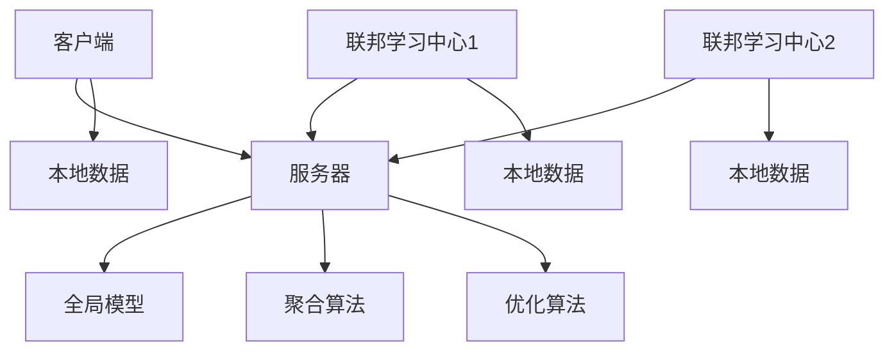
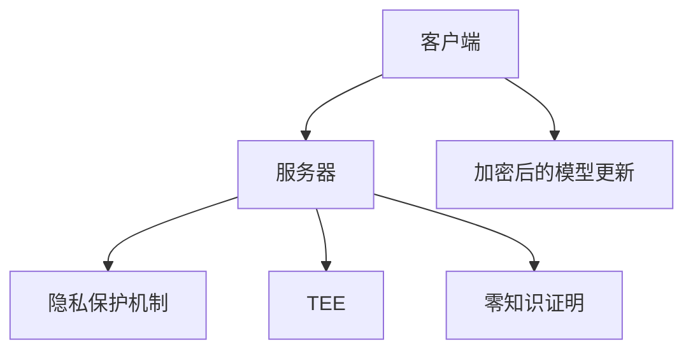
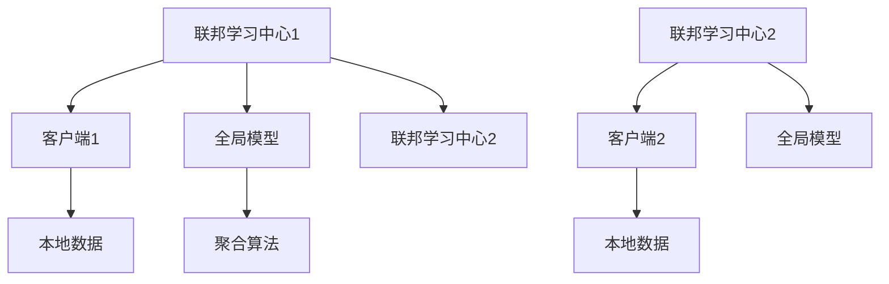

                 

### 文章标题

《联邦学习在跨机构数据协作中的实践》

关键词：联邦学习、跨机构数据协作、隐私保护、分布式算法、模型优化、安全通信、开放源码工具

摘要：本文旨在探讨联邦学习技术在跨机构数据协作中的实际应用。联邦学习是一种分布式机器学习方法，通过在多个数据源上进行模型训练，而无需共享原始数据，从而在保护数据隐私的同时实现数据的价值共享。本文将详细分析联邦学习的理论基础、核心算法、架构设计，并通过实际案例展示其在跨机构数据协作中的实践效果。本文还将讨论联邦学习在开发与部署过程中的挑战及未来发展趋势，为读者提供全面、深入的见解。### 《联邦学习在跨机构数据协作中的实践》目录大纲

#### 第一部分：联邦学习的理论基础

**# 1. 联邦学习概述**

- **## 1.1 联邦学习的起源与发展**
  - **### 1.1.1 联邦学习的定义**
  - **### 1.1.2 联邦学习的核心价值**
- **## 1.2 联邦学习与中心化学习的比较**
  - **### 1.2.1 技术差异**
  - **### 1.2.2 应用场景差异**
- **## 1.3 联邦学习的关键挑战**
  - **### 1.3.1 数据隐私保护**
  - **### 1.3.2 可信性保证**
  - **### 1.3.3 实时性要求**

**# 2. 联邦学习的基本概念**

- **## 2.1 客户端的角色与功能**
  - **### 2.1.1 客户端的数据采集与预处理**
  - **### 2.1.2 客户端的本地训练与模型更新**
- **## 2.2 服务器端的角色与功能**
  - **### 2.2.1 服务器端的聚合算法**
  - **### 2.2.2 服务器端的模型集成与优化**
- **## 2.3 联邦学习中的通信协议**
  - **### 2.3.1 安全通信协议**
  - **### 2.3.2 低延迟通信策略**

**# 3. 联邦学习的架构设计**

- **## 3.1 联邦学习的基本架构**
  - **### 3.1.1 客户端-服务器模型**
  - **### 3.1.2 多方参与模型**
- **## 3.2 联邦学习的安全架构**
  - **### 3.2.1 隐私保护机制**
  - **### 3.2.2 可信执行环境（TEE）**
  - **### 3.2.3 零知识证明**

#### 第二部分：联邦学习的核心算法

**# 4. 联邦学习的优化算法**

- **## 4.1 梯度聚合算法**
  - **### 4.1.1 同质联邦学习中的梯度聚合**
  - **### 4.1.2 异质联邦学习中的梯度聚合**
- **## 4.2 模型聚合算法**
  - **### 4.2.1 中心化模型聚合**
  - **### 4.2.2 分布式模型聚合**
- **## 4.3 集成学习算法**
  - **### 4.3.1 轮盘赌集成**
  - **### 4.3.2 层次化集成**

**# 5. 联邦学习的安全算法**

- **## 5.1 隐私保护算法**
  - **### 5.1.1 差分隐私机制**
  - **### 5.1.2 加密算法的应用**
- **## 5.2 可信执行算法**
  - **### 5.2.1 硬件安全的实现**
  - **### 5.2.2 软件安全的实现**
- **## 5.3 零知识证明算法**
  - **### 5.3.1 零知识证明的基本原理**
  - **### 5.3.2 零知识证明的应用场景**

**# 6. 联邦学习的联邦通信算法**

- **## 6.1 通信模型**
  - **### 6.1.1 无线通信模型**
  - **### 6.1.2 有线通信模型**
- **## 6.2 通信优化算法**
  - **### 6.2.1 数据压缩技术**
  - **### 6.2.2 信道编码技术**

#### 第三部分：联邦学习的应用实践

**# 7. 跨机构数据协作的联邦学习应用**

- **## 7.1 跨机构数据协作的挑战**
  - **### 7.1.1 数据隐私保护**
  - **### 7.1.2 数据质量与一致性**
  - **### 7.1.3 可信性保证**
- **## 7.2 联邦学习的跨机构应用场景**
  - **### 7.2.1 医疗健康数据的联邦学习**
  - **### 7.2.2 零售行业的个性化推荐**
  - **### 7.2.3 金融行业的欺诈检测**

**# 8. 联邦学习的开发与部署**

- **## 8.1 联邦学习系统的构建**
  - **### 8.1.1 开发环境搭建**
  - **### 8.1.2 系统架构设计**
  - **### 8.1.3 联邦学习平台的构建**
- **## 8.2 联邦学习的部署与优化**
  - **### 8.2.1 部署策略**
  - **### 8.2.2 模型优化**
  - **### 8.2.3 性能监控与调试**

**# 9. 联邦学习的未来发展趋势**

- **## 9.1 联邦学习的技术趋势**
  - **### 9.1.1 新型联邦学习算法**
  - **### 9.1.2 跨领域联邦学习**
  - **### 9.1.3 联邦学习在边缘计算中的应用**
- **## 9.2 联邦学习的社会影响**
  - **### 9.2.1 隐私保护与社会责任**
  - **### 9.2.2 联邦学习与数据主权**
  - **### 9.2.3 联邦学习与数字化转型**

### 附录

**## 附录A：联邦学习开源工具与资源**

- **### A.1 TensorFlow Federated**
- **### A.2 PySyft**
- **### A.3 FedAvg**
- **### A.4 其他联邦学习开源工具**

**## 附录B：联邦学习常用算法伪代码**

- **### B.1 梯度聚合算法**
- **### B.2 模型聚合算法**
- **### B.3 零知识证明算法**

**## 附录C：跨机构数据协作案例分析**

- **### C.1 案例一：医疗健康数据联邦学习**
- **### C.2 案例二：零售行业个性化推荐**
- **### C.3 案例三：金融行业欺诈检测**### 1. 联邦学习概述

#### 1.1 联邦学习的起源与发展

联邦学习（Federated Learning）的概念最早由Google在2016年提出，作为一种分布式机器学习方法，旨在解决数据隐私保护的问题。传统的中心化学习模型要求将所有数据集中到一个中心位置进行训练，这使得数据隐私和安全性面临巨大的风险。而联邦学习则通过在多个分布式数据源上训练模型，无需共享原始数据，从而在保护数据隐私的同时实现模型优化。

联邦学习的起源可以追溯到分布式计算和去中心化系统的需求。随着互联网和移动设备的普及，大量的数据分布在不同的机构和个人手中。如何有效利用这些数据，同时确保数据的安全和隐私，成为了一个亟待解决的问题。联邦学习的提出为这一问题提供了一种可能的解决方案。

自Google首次提出联邦学习以来，这项技术得到了迅速的发展和广泛关注。除了Google，其他许多公司和研究机构也纷纷加入研究联邦学习的行列，包括苹果、微软、IBM等。此外，学术界也发表了一系列关于联邦学习的研究论文，推动了联邦学习的理论研究和应用发展。

#### 1.2 联邦学习的核心价值

联邦学习的核心价值在于它能够在保护数据隐私的同时实现模型优化。具体来说，联邦学习具有以下几方面的核心价值：

1. **数据隐私保护**：在联邦学习模型中，数据无需从各个数据源中提取出来，而是在本地进行模型训练和更新。这样，原始数据始终保持在各自的数据源中，避免了数据泄露的风险。

2. **数据整合与价值共享**：通过联邦学习，各个机构可以在不共享原始数据的情况下，共同训练一个全局模型。这样，各个机构不仅能够利用自身的数据进行训练，还能够从其他机构的数据中获取价值，实现数据的整合和共享。

3. **分布式计算效率**：联邦学习利用分布式计算的优势，将模型训练任务分散到多个数据源上，减少了中心化模型的计算负担。此外，联邦学习还能够处理数据量巨大、数据分布广泛的情况，提高了模型的训练效率。

4. **灵活性与适应性**：联邦学习具有很高的灵活性和适应性。它不仅可以用于静态数据集，还可以用于动态更新的数据集。同时，联邦学习能够处理异构的数据源，适应不同的应用场景。

5. **可扩展性**：联邦学习具有很好的可扩展性。通过增加参与训练的数据源，可以不断提高模型的性能和精度，实现更广泛的应用。

总之，联邦学习通过保护数据隐私、提高计算效率、实现数据整合与价值共享，为分布式机器学习提供了一种新的解决方案。随着技术的不断发展和应用场景的扩展，联邦学习有望在未来的数据科学和人工智能领域发挥重要作用。接下来，我们将进一步探讨联邦学习与中心化学习的比较以及它面临的关键挑战。### 1.2 联邦学习与中心化学习的比较

在讨论联邦学习与中心化学习的比较时，我们需要从多个维度进行分析，包括技术差异、应用场景差异、优缺点对比等。通过这些维度的比较，我们可以更全面地了解两种学习方式的特点和适用场景。

#### 1.2.1 技术差异

**数据分布**：
- **中心化学习**：在中心化学习中，所有的数据都被集中到一个中心服务器或数据库中。数据源之间没有直接的数据交换，所有模型训练任务都在中心服务器上执行。
- **联邦学习**：联邦学习则将数据分布在多个客户端上，每个客户端都保留自己的数据。模型训练过程是在客户端和服务器端之间进行的，客户端负责本地数据上的模型训练，服务器端负责模型的聚合和更新。

**数据处理方式**：
- **中心化学习**：在中心化学习中，所有数据都需要传输到中心服务器进行集中处理。这可能会导致数据泄露的风险，同时也增加了数据传输的负担。
- **联邦学习**：联邦学习通过在客户端本地处理数据，减少了数据传输的需求，从而降低了数据泄露的风险，同时也减少了数据传输的带宽消耗。

**计算资源需求**：
- **中心化学习**：中心化学习需要大量的计算资源集中在中心服务器上，这可能会造成计算资源的不平衡，特别是在处理大量数据时。
- **联邦学习**：联邦学习将计算任务分散到多个客户端上，充分利用了各个客户端的计算资源，从而提高了计算效率，并减少了单个服务器或客户端的计算压力。

**通信开销**：
- **中心化学习**：在中心化学习中，所有数据都需要传输到中心服务器，这会产生较大的通信开销，特别是在数据量大、网络带宽有限的情况下。
- **联邦学习**：联邦学习通过减少数据传输的需求，降低了通信开销，特别是在分布式环境中，能够有效利用有限的网络带宽。

#### 1.2.2 应用场景差异

**数据隐私敏感的场景**：
- **中心化学习**：在需要严格保护数据隐私的场景中，中心化学习可能会面临较大的风险，因为所有数据都需要集中到一个地方进行处理。
- **联邦学习**：联邦学习通过在本地处理数据，可以有效避免数据泄露的风险，特别适用于医疗健康数据、金融数据等隐私敏感的场景。

**数据分布广泛的场景**：
- **中心化学习**：在数据分布在多个地点的场景中，中心化学习可能会面临较大的数据传输和处理挑战。
- **联邦学习**：联邦学习能够充分利用分布式数据源的优势，适用于跨地区、跨机构的合作场景，如跨机构数据协作、物联网设备协同等。

**数据实时性要求较高的场景**：
- **中心化学习**：在需要实时处理数据并做出决策的场景中，中心化学习可能会因为数据传输和处理延迟而受到影响。
- **联邦学习**：联邦学习通过在本地进行数据预处理和模型训练，可以减少数据传输和处理延迟，提高实时性。

**数据异构性场景**：
- **中心化学习**：在处理异构数据时，中心化学习可能会因为数据格式不一致而导致数据处理的复杂性增加。
- **联邦学习**：联邦学习能够适应不同数据源的数据格式，适用于数据异构性较高的场景。

#### 1.2.3 优缺点对比

**中心化学习**：
- **优点**：
  - 简单易用：中心化学习模型的结构相对简单，便于理解和实现。
  - 高效计算：中心化学习可以集中使用高性能计算资源，提高计算效率。
  - 全局优化：在中心化学习中，所有数据都在一个地方，可以更好地进行全局优化。
- **缺点**：
  - 数据隐私风险：中心化学习容易导致数据泄露和隐私问题。
  - 数据传输开销：中心化学习需要大量数据传输到中心服务器，可能导致网络带宽不足。
  - 单点故障风险：中心化学习系统中的中心服务器是单点故障点，一旦发生故障，整个系统将无法正常工作。

**联邦学习**：
- **优点**：
  - 数据隐私保护：联邦学习通过在本地处理数据，有效避免了数据泄露的风险。
  - 分布式计算：联邦学习可以充分利用分布式计算资源，提高计算效率。
  - 灵活适应：联邦学习能够处理异构数据和实时性要求较高的场景。
- **缺点**：
  - 复杂性增加：联邦学习模型的结构相对复杂，理解和实现难度较大。
  - 数据传输和通信开销：虽然联邦学习减少了数据传输需求，但仍然存在通信开销，特别是在数据量大、网络带宽有限的情况下。
  - 实时性挑战：联邦学习在处理实时性要求较高的场景时，可能会因为数据传输和处理延迟而受到影响。

通过上述比较，我们可以看到，联邦学习与中心化学习各有优缺点，适用于不同的场景。在实际应用中，可以根据具体需求和场景选择适合的学习方式。接下来，我们将探讨联邦学习面临的关键挑战。### 1.3 联邦学习的关键挑战

尽管联邦学习在数据隐私保护和分布式计算方面具有显著优势，但在实际应用中仍面临一系列关键挑战。这些挑战涉及到数据隐私保护、可信性保证、实时性要求等多个方面，需要我们深入分析和解决。

#### 1.3.1 数据隐私保护

数据隐私保护是联邦学习面临的首要挑战。由于联邦学习涉及到多个参与方的数据，如何在确保数据不被泄露的前提下进行模型训练和更新，成为了一个亟待解决的问题。

**挑战**：
- **数据泄露风险**：在联邦学习过程中，数据会在客户端和服务器之间进行传输和处理，这可能会增加数据泄露的风险。即使采用加密技术保护数据，也无法完全消除数据泄露的可能性。
- **差分隐私保护**：联邦学习需要平衡模型精度和数据隐私之间的矛盾。差分隐私机制可以提供一定的隐私保护，但可能会影响模型的性能和精度。
- **数据完整性**：在联邦学习中，数据可能会因为传输错误、恶意攻击等原因导致数据丢失或篡改，影响模型的训练效果。

**解决方案**：
- **加密技术**：采用加密技术保护数据传输过程，如使用TLS加密协议、加密算法（如AES）等。此外，还可以使用差分隐私机制，确保模型训练过程中的数据隐私。
- **联邦学习框架**：使用成熟的联邦学习框架（如TensorFlow Federated、PySyft等），这些框架提供了丰富的隐私保护机制和工具，简化了隐私保护的实施过程。
- **数据完整性验证**：通过哈希校验、数字签名等技术，确保数据的完整性和一致性。在模型更新过程中，对数据包进行校验，确保数据没有被恶意篡改。

#### 1.3.2 可信性保证

在联邦学习过程中，参与方可能存在恶意行为，如故意提供错误数据、拒绝参与模型更新等，这会影响模型的训练效果和可信性。因此，如何保证联邦学习的可信性，是一个关键挑战。

**挑战**：
- **数据可靠性**：在联邦学习中，各个参与方可能提供不真实的数据，导致模型训练结果不准确。
- **参与方恶意行为**：部分参与方可能会故意干扰模型训练，如通过注入噪声、拒绝参与等手段。
- **模型更新一致性**：由于网络延迟和计算能力的差异，不同参与方的模型更新可能存在不一致性，影响模型的收敛速度和稳定性。

**解决方案**：
- **信任评估机制**：建立信任评估机制，对参与方的行为进行评估和监控。通过历史行为记录、信誉评分等方式，识别和排除恶意参与方。
- **联邦学习协议**：设计安全的联邦学习协议，确保模型更新过程中的数据一致性和可靠性。如使用安全的通信协议、分布式一致性算法等。
- **去中心化信任模型**：引入去中心化的信任模型，如基于区块链的信任机制，确保参与方之间的信任和合作。

#### 1.3.3 实时性要求

联邦学习在实时性要求较高的场景中，可能面临数据处理延迟和网络延迟的问题。如何提高联邦学习的实时性，是一个重要的挑战。

**挑战**：
- **数据处理延迟**：联邦学习过程中，数据需要在客户端和服务器之间传输和处理，这可能会产生数据处理延迟。
- **网络延迟**：在分布式环境中，网络延迟可能会影响模型更新的速度和效率。
- **资源分配**：在实时性要求高的场景中，需要合理分配计算资源和网络带宽，确保模型训练和更新的高效进行。

**解决方案**：
- **优化算法**：设计高效的联邦学习算法，如梯度聚合算法、联邦模型聚合算法等，减少数据处理和通信延迟。
- **边缘计算**：利用边缘计算技术，将部分计算任务分配到边缘设备上，降低网络传输延迟和计算负担。
- **动态资源调度**：通过动态资源调度机制，根据实时性要求，调整计算资源和网络带宽的分配，确保模型训练和更新的实时性。

总之，联邦学习在数据隐私保护、可信性保证和实时性要求方面面临一系列关键挑战。通过深入研究和不断创新，我们可以逐步解决这些挑战，推动联邦学习在更多实际场景中的应用。接下来，我们将探讨联邦学习的基本概念，包括客户端、服务器端的角色与功能，以及联邦学习中的通信协议。这些基本概念将为后续的详细分析奠定基础。### 2. 联邦学习的基本概念

联邦学习（Federated Learning）是一种分布式机器学习方法，通过在多个数据源上进行模型训练，而无需共享原始数据，从而实现隐私保护下的协同学习。要理解联邦学习的基本概念，我们需要首先明确客户端和服务器端的角色与功能，以及联邦学习中的通信协议。

#### 2.1 客户端的角色与功能

客户端是联邦学习系统中的数据持有者，它们负责本地数据的采集、预处理以及模型的本地训练与更新。客户端的主要功能包括以下几个方面：

1. **数据采集与预处理**：
   - **数据采集**：客户端需要收集本地数据，包括图像、文本、音频等多种类型的数据。
   - **数据预处理**：数据采集后，客户端会对数据进行清洗、去噪、归一化等预处理操作，确保数据的质量和一致性。

2. **本地训练与模型更新**：
   - **模型初始化**：客户端开始训练前，需要从服务器端下载一个初始化的模型。
   - **本地训练**：客户端使用本地数据对模型进行训练，通过迭代优化模型参数，提高模型的性能。
   - **模型更新**：在每次训练完成后，客户端会将更新后的模型参数发送给服务器端，进行进一步的聚合和优化。

客户端在联邦学习中的角色至关重要，它们不仅负责本地数据的处理，还为全局模型的优化提供了数据支持。客户端的性能和计算能力直接影响联邦学习的效率和效果。

#### 2.2 服务器端的角色与功能

服务器端是联邦学习系统的核心，它负责管理全局模型的聚合、更新以及优化。服务器端的主要功能包括以下几个方面：

1. **模型聚合**：
   - **聚合算法设计**：服务器端需要设计并实现聚合算法，将来自不同客户端的模型更新合并成一个全局模型。
   - **模型聚合过程**：在每次迭代中，服务器端接收来自各个客户端的模型更新，通过聚合算法将这些更新合并成一个全局模型。

2. **模型优化**：
   - **模型更新**：服务器端将全局模型的更新反馈给各个客户端，指导客户端进行下一次的本地训练。
   - **模型评估**：服务器端对全局模型进行评估，如通过验证集的性能指标来评估模型的精度和泛化能力。

3. **安全管理**：
   - **隐私保护**：服务器端需要确保模型更新过程中的数据安全，防止数据泄露和恶意攻击。
   - **可信性保证**：服务器端需要监控客户端的行为，确保模型更新的一致性和可靠性。

服务器端在联邦学习中起着关键作用，它不仅负责全局模型的优化，还承担着数据安全和管理的重要任务。

#### 2.3 联邦学习中的通信协议

在联邦学习中，客户端和服务器端之间的通信是至关重要的。通信协议的设计直接影响联邦学习的效率、安全性以及实时性。联邦学习中的通信协议主要包括以下几个方面：

1. **安全通信协议**：
   - **加密传输**：为了保护数据在传输过程中的隐私，客户端和服务器端之间需要使用加密传输协议，如TLS（传输层安全协议）。
   - **认证机制**：在通信过程中，客户端和服务器端需要进行身份认证，确保通信双方的合法性。

2. **低延迟通信策略**：
   - **数据压缩**：为了减少通信开销，可以使用数据压缩技术，如Huffman编码、LZ77压缩算法等。
   - **信道编码**：使用信道编码技术，如卷积编码、Turbo编码等，提高数据传输的可靠性。

3. **同步机制**：
   - **时钟同步**：为了确保模型更新的一致性，客户端和服务器端需要进行时钟同步，确保它们在相同的时刻进行通信。
   - **事件驱动通信**：通过事件驱动通信机制，当客户端完成模型更新后，立即通知服务器端进行聚合和优化。

联邦学习中的通信协议设计需要综合考虑安全性、实时性和效率等多方面因素，以确保联邦学习的顺利进行。

综上所述，客户端、服务器端和通信协议是联邦学习的基本概念。通过理解这些基本概念，我们可以更好地把握联邦学习的工作原理和应用场景。接下来，我们将进一步探讨联邦学习的架构设计，包括基本架构、安全架构以及多方参与模型，以深入理解联邦学习的实现机制。### 3. 联邦学习的架构设计

联邦学习的架构设计是确保其分布式协作和隐私保护特性的关键。在设计联邦学习架构时，我们需要考虑多个因素，包括系统的可扩展性、安全性、通信效率等。联邦学习的架构可以大致分为基本架构、安全架构和多方参与模型。

#### 3.1 联邦学习的基本架构

联邦学习的基本架构通常包括客户端（Client）、服务器（Server）以及可能的数据中心（Data Center）。以下是联邦学习基本架构的几个关键组成部分：

**3.1.1 客户端-服务器模型**

- **客户端（Client）**：客户端是联邦学习系统中的数据持有者和模型训练者。每个客户端负责本地数据的收集、预处理以及模型本地训练。客户端不需要将原始数据上传到服务器，而是在本地生成加密后的模型更新。
- **服务器（Server）**：服务器负责全局模型的聚合、更新和优化。服务器将客户端发送的模型更新进行聚合，形成全局模型，并将全局模型更新反馈给客户端，指导下一轮的本地训练。
- **数据中心（可选）**：在某些情况下，为了提高数据处理和传输的效率，可以在客户端和服务器之间加入一个数据中心。数据中心主要负责数据的传输、处理和存储。

**3.1.2 多方参与模型**

- **多方参与模型**：在多个机构或组织共同参与联邦学习时，除了客户端和服务器外，还可以引入多个联邦学习中心（Federated Learning Center, FL Center）。每个联邦学习中心负责管理自身的客户端和数据，并与其他联邦学习中心协作，共同训练全局模型。

下面是一个简化的联邦学习架构图，用于说明客户端-服务器模型和多方参与模型：



#### 3.2 联邦学习的安全架构

联邦学习的安全架构设计旨在确保数据在传输和存储过程中的隐私性和安全性。以下是联邦学习安全架构中的几个关键组成部分：

**3.2.1 隐私保护机制**

- **数据加密**：客户端在发送模型更新之前，将模型更新加密，确保数据在传输过程中的隐私性。
- **差分隐私**：服务器在聚合模型更新时，采用差分隐私机制，确保模型更新不包含任何关于单个客户端的数据，从而保护客户端的隐私。

**3.2.2 可信执行环境（TEE）**

- **可信执行环境**：客户端和服务器可以使用可信执行环境（Trusted Execution Environment, TEE）来隔离模型的训练过程，确保模型更新不被篡改。

**3.2.3 零知识证明**

- **零知识证明**：客户端可以使用零知识证明（Zero-Knowledge Proof）技术，向服务器证明模型更新是有效的，而不泄露任何关于本地数据的信息。

下面是一个简化的联邦学习安全架构图：



#### 3.2.4 多方参与模型

多方参与模型扩展了联邦学习的基本架构，允许多个机构或组织共同参与模型训练。以下是多方参与模型的关键组成部分：

- **联邦学习中心**：每个联邦学习中心代表一个机构或组织，负责管理该机构的客户端和数据，并与其他联邦学习中心协作。
- **数据同步与聚合**：联邦学习中心需要确保本地数据和全局模型的同步与聚合，从而形成统一的模型更新。

下面是一个简化的多方参与模型图：



通过上述架构设计，联邦学习能够在分布式环境中实现数据隐私保护和协同模型训练。在接下来的章节中，我们将进一步探讨联邦学习的核心算法，包括梯度聚合算法、模型聚合算法和集成学习算法。这些核心算法是实现联邦学习高效、可靠的关键。### 4. 联邦学习的优化算法

联邦学习的优化算法是确保模型训练高效性和稳定性的关键。优化算法主要关注如何在分布式环境中进行梯度聚合、模型聚合以及集成学习。下面，我们将详细讨论这些优化算法的原理和应用。

#### 4.1 梯度聚合算法

梯度聚合算法是联邦学习中最核心的优化算法之一。它的主要目标是利用各个客户端的局部梯度信息，更新全局模型参数，从而实现模型的协同训练。以下是几种常见的梯度聚合算法：

**4.1.1 同质联邦学习中的梯度聚合**

在同质联邦学习中，所有客户端的数据具有相似的特征和标签分布。这种情况下，梯度聚合算法通常采用如下步骤：

1. **本地梯度计算**：每个客户端使用本地数据计算模型参数的梯度。
2. **梯度压缩**：将每个客户端的梯度压缩到一个较小的尺寸，以减少通信开销。
3. **通信**：客户端将压缩后的梯度发送到服务器端。
4. **全局梯度聚合**：服务器端将所有客户端的梯度进行聚合，得到全局梯度。
5. **模型更新**：使用全局梯度更新模型参数。

**伪代码示例**：

```python
# 假设使用FedAvg算法
for epoch in range(num_epochs):
    for client in clients:
        # 计算本地梯度
        gradients = compute_gradients(client.model, client.data)
        
        # 梯度压缩
        compressed_gradients = compress_gradients(gradients)
        
        # 通信
        send_gradients_to_server(compressed_gradients)
    
    # 全局梯度聚合
    global_gradients = aggregate_gradients()
    
    # 模型更新
    update_model(global_gradients)
```

**4.1.2 异质联邦学习中的梯度聚合**

在异质联邦学习中，客户端的数据特征和标签分布可能存在较大差异。这种情况下，梯度聚合算法需要考虑数据分布的差异，采用更复杂的策略进行梯度聚合。例如，可以使用权重调整方法，对来自不同客户端的梯度进行加权聚合。

**4.2 模型聚合算法**

模型聚合算法是联邦学习中的另一个重要优化算法。它的目标是利用客户端的模型更新，生成一个全局模型。模型聚合算法通常分为中心化模型聚合和分布式模型聚合两种类型。

**4.2.1 中心化模型聚合**

中心化模型聚合是指所有客户端的模型更新被发送到服务器端，服务器端负责将模型更新聚合成一个全局模型。这种方法简单直观，但可能存在通信开销大、延迟高等问题。

**4.2.2 分布式模型聚合**

分布式模型聚合是指客户端之间直接进行模型更新交换，通过局部模型聚合生成全局模型。这种方法减少了通信开销，但需要解决模型更新的一致性问题。

**4.3 集成学习算法**

集成学习算法是联邦学习中的一种高级优化策略，通过结合多个模型的预测结果，提高模型的性能和稳定性。常见的集成学习算法包括轮盘赌集成和层次化集成。

**4.3.1 轮盘赌集成**

轮盘赌集成是一种简单的集成学习算法，它通过随机选择多个模型进行预测，并根据预测结果的权重进行加权平均。这种方法可以有效减少模型过拟合的风险。

**4.3.2 层次化集成**

层次化集成是一种更复杂的集成学习算法，它将多个模型分为多个层次，首先在底层进行简单集成，然后在较高层次进行复杂集成。这种方法可以提高模型的泛化能力和鲁棒性。

**4.3.3 伪代码示例**

```python
# 轮盘赌集成
predictions = []
for model in models:
    prediction = model.predict(data)
    predictions.append(prediction)

# 加权平均
final_prediction = sum(predictions) / len(predictions)
```

通过上述优化算法，联邦学习可以在分布式环境中实现高效、稳定的模型训练。这些算法不仅提高了模型性能，还确保了数据隐私和安全性。在接下来的章节中，我们将探讨联邦学习的安全算法，包括隐私保护算法、可信执行算法和零知识证明算法，以进一步确保联邦学习的安全性和可靠性。### 5. 联邦学习的安全算法

联邦学习的安全算法在保护数据隐私和模型安全性方面起着至关重要的作用。这些算法旨在确保在分布式环境中，客户端的数据隐私不被泄露，模型更新过程不被恶意攻击。以下将详细介绍联邦学习中的几种关键安全算法。

#### 5.1 隐私保护算法

隐私保护算法的主要目标是在联邦学习中保护客户端的数据隐私，防止恶意参与者通过模型更新获取敏感信息。以下是一些常见的隐私保护算法：

**5.1.1 差分隐私机制**

差分隐私是一种强大的隐私保护技术，它通过在算法中引入随机噪声，确保对单个数据的分析无法泄露任何关于该数据的信息。在联邦学习中，差分隐私可以应用于模型聚合过程，防止服务器端通过聚合结果推断出任何客户端的具体数据。

**伪代码示例**：

```python
# 假设使用拉普拉斯机制实现差分隐私
epsilon = 1.0  # 随机噪声参数
noise = laplace_noise(epsilon)
weighted_gradient = gradient * noise
```

**5.1.2 加密算法的应用**

加密算法可以在数据传输过程中提供加密保护，确保数据在传输过程中不被窃听或篡改。常见的加密算法包括AES（高级加密标准）、RSA（RSA加密算法）等。在联邦学习中，客户端可以将模型更新加密后发送到服务器端，从而保护数据隐私。

**5.1.3 安全多方计算**

安全多方计算（Secure Multi-Party Computation，SMPC）是一种允许多个参与者共同计算函数，而无需共享任何敏感信息的计算技术。在联邦学习中，SMPC可以用于客户端和服务器之间的安全通信，确保模型更新过程中的数据隐私。

**5.2 可信执行算法**

可信执行环境（Trusted Execution Environment，TEE）是一种安全的计算环境，旨在保护敏感数据的处理过程。在联邦学习中，TEE可以用于隔离模型的本地训练和更新过程，确保模型更新不被恶意参与者篡改。

**5.2.1 硬件安全的实现**

硬件安全的实现依赖于可信执行硬件（Trusted Execution Hardware，TEH），如Intel的SGX（Software Guard Extensions）和ARM的TEE。这些硬件技术可以创建一个安全的隔离环境，确保模型更新过程在隔离环境中进行，从而防止恶意攻击。

**5.2.2 软件安全的实现**

除了硬件安全外，软件安全措施也是确保联邦学习安全的重要手段。这些措施包括安全编程实践、安全库和框架等。通过使用安全的编程语言和库，可以减少安全漏洞和恶意攻击的风险。

**5.3 零知识证明算法**

零知识证明（Zero-Knowledge Proof，ZKP）是一种密码学技术，允许证明者证明某个陈述是真实的，而不透露任何关于该陈述的具体信息。在联邦学习中，零知识证明可以用于验证客户端的模型更新，确保其有效性和合法性。

**5.3.1 零知识证明的基本原理**

零知识证明分为三个主要步骤：证明生成、证明验证和交互式证明。证明生成过程中，证明者生成一个证明，证明验证者验证证明的有效性。在联邦学习中，零知识证明可以用于确保客户端提交的模型更新是真实的，而不泄露任何关于本地数据的信息。

**5.3.2 零知识证明的应用场景**

在联邦学习中，零知识证明可以应用于多个场景，如数据完整性验证、模型更新验证等。通过使用零知识证明，可以确保模型更新过程中数据的完整性和合法性，从而增强联邦学习的安全性。

**5.3.3 伪代码示例**

```python
# 假设使用零知识证明验证模型更新
proof = generate_proof(local_model_update)
is_valid = verify_proof(proof, global_model_update)
if is_valid:
    accept_model_update()
else:
    reject_model_update()
```

通过上述安全算法，联邦学习能够在分布式环境中实现数据隐私保护和模型安全性。这些算法不仅确保了联邦学习的安全性，还为未来的分布式机器学习应用提供了可靠的保障。在接下来的章节中，我们将探讨联邦学习的联邦通信算法，重点关注通信模型和通信优化算法。这些算法将进一步提升联邦学习的效率和可靠性。### 6. 联邦学习的联邦通信算法

联邦学习中的通信算法是确保分布式模型训练顺利进行的重要环节。联邦通信算法的设计需要考虑通信模型、通信开销以及实时性等因素。以下是联邦学习中的通信模型和通信优化算法的详细介绍。

#### 6.1 通信模型

联邦学习的通信模型可以分为无线通信模型和有线通信模型两种类型。

**6.1.1 无线通信模型**

无线通信模型适用于客户端分布在广泛的地理区域，如移动设备、物联网设备等。这种模型的主要特点是低带宽、高延迟和不可靠性。无线通信模型需要设计高效的通信协议和算法，以减少通信开销和确保通信的可靠性。

**无线通信模型的挑战**：
- **低带宽**：由于无线通信的带宽有限，需要采用数据压缩技术和高效编码算法，减少通信数据量。
- **高延迟**：无线通信可能导致较大的通信延迟，影响联邦学习的实时性。
- **不可靠性**：无线通信可能会受到干扰和信号衰减的影响，导致数据传输错误。

**解决方案**：
- **数据压缩技术**：采用数据压缩技术，如Huffman编码、LZ77压缩算法等，减少通信数据量。
- **信道编码技术**：使用信道编码技术，如卷积编码、Turbo编码等，提高数据传输的可靠性。
- **多路径传输**：通过多路径传输技术，提高通信的可靠性，减少通信延迟。

**6.1.2 有线通信模型**

有线通信模型适用于客户端分布在相对固定的网络环境中，如数据中心、服务器等。这种模型的主要特点是高带宽、低延迟和高可靠性。有线通信模型可以采用更复杂的通信协议和算法，以提高通信效率和实时性。

**有线通信模型的挑战**：
- **高带宽**：虽然有线通信的带宽较高，但仍然需要采用数据压缩技术，以减少通信数据量。
- **低延迟**：有线通信的延迟较低，但需要设计高效的算法，确保实时性。
- **可靠性**：有线通信的可靠性较高，但需要确保数据传输的一致性和完整性。

**解决方案**：
- **高效编码算法**：采用高效编码算法，如Huffman编码、LZ77压缩算法等，减少通信数据量。
- **同步机制**：通过同步机制，确保通信过程中的数据一致性。
- **错误纠正码**：采用错误纠正码，如卷积码、Turbo码等，提高数据传输的可靠性。

#### 6.2 通信优化算法

为了进一步提高联邦学习的通信效率，可以采用多种通信优化算法，包括数据压缩技术和信道编码技术。

**6.2.1 数据压缩技术**

数据压缩技术是减少通信数据量的关键。以下是一些常见的数据压缩技术：

- **Huffman编码**：Huffman编码是一种基于频率的压缩算法，通过为频繁出现的符号分配较短的编码，为不频繁出现的符号分配较长的编码，从而实现数据压缩。
- **LZ77压缩算法**：LZ77压缩算法通过查找重复的数据块，并将它们替换为指向原始数据块的指针，从而减少数据传输量。
- **LZMA压缩算法**：LZMA压缩算法是一种基于LZ77和Huffman编码的压缩算法，通过多次迭代压缩，实现更高的压缩率。

**6.2.2 信道编码技术**

信道编码技术是提高数据传输可靠性的关键。以下是一些常见的信道编码技术：

- **卷积编码**：卷积编码是一种线性编码技术，通过将数据序列转化为卷积码字，实现数据的传输和接收。
- **Turbo编码**：Turbo编码是一种基于卷积编码的迭代编码技术，通过多次迭代解码，提高数据传输的可靠性。
- **LDPC编码**：LDPC编码是一种低密度奇偶校验编码技术，通过构造稀疏的校验矩阵，实现高效的数据传输和接收。

通过上述通信优化算法，联邦学习可以在不同的通信环境下实现高效、可靠的数据传输，从而提高模型训练的效率。在接下来的章节中，我们将探讨联邦学习在跨机构数据协作中的实际应用，分析其在医疗健康数据、零售行业个性化推荐和金融行业欺诈检测等领域的应用案例。这些应用案例将展示联邦学习在跨机构数据协作中的强大优势和广泛前景。### 7. 跨机构数据协作的联邦学习应用

跨机构数据协作是联邦学习技术的重要应用场景之一。由于数据隐私保护和协同分析的需求，联邦学习在医疗健康数据、零售行业个性化推荐、金融行业欺诈检测等领域展现出了巨大的潜力。以下是对这些领域应用的详细探讨。

#### 7.1 跨机构数据协作的挑战

在跨机构数据协作中，联邦学习面临的挑战主要包括：

**7.1.1 数据隐私保护**

医疗健康数据、金融数据等敏感数据在共享时，需要严格保护数据隐私，防止泄露和滥用。联邦学习通过在本地训练模型，避免原始数据在传输过程中的泄露，为解决数据隐私问题提供了有效方案。

**7.1.2 数据质量与一致性**

跨机构数据协作涉及的数据通常来自不同的数据源，这些数据在格式、结构、质量等方面可能存在较大差异。如何确保数据的一致性和高质量，是联邦学习应用中的关键挑战。

**7.1.3 可信性保证**

在跨机构数据协作中，参与方可能存在恶意行为，如提供错误数据、拒绝合作等。如何确保参与方的可信性，保障模型训练的一致性和可靠性，是联邦学习面临的重要问题。

**7.1.4 实时性要求**

医疗健康、金融等领域对数据处理和模型更新的实时性有较高要求。如何在保证数据隐私和安全性的同时，满足实时性需求，是联邦学习需要解决的问题。

#### 7.2 联邦学习的跨机构应用场景

**7.2.1 医疗健康数据的联邦学习**

在医疗健康领域，联邦学习可以应用于疾病预测、诊断辅助、药物研发等多个方面。通过联邦学习，医疗机构可以在不共享患者敏感数据的情况下，协同训练共享模型，提高疾病预测的准确性和效率。

**案例**：
- **疾病预测**：多个医疗机构可以将各自的疾病数据上传至联邦学习平台，协同训练疾病预测模型。通过联邦学习，可以避免数据泄露，同时提高模型的准确性和泛化能力。
- **药物研发**：制药公司可以利用联邦学习，在不共享实验数据的情况下，协同分析药物疗效，加速药物研发进程。

**7.2.2 零售行业的个性化推荐**

在零售行业，联邦学习可以用于个性化推荐系统，为消费者提供个性化的商品推荐。通过联邦学习，零售商可以在保护消费者隐私的同时，实现精准推荐。

**案例**：
- **个性化推荐**：多个零售商可以将各自的消费者数据上传至联邦学习平台，协同训练推荐模型。通过联邦学习，可以避免消费者数据泄露，同时提高推荐系统的准确性和满意度。

**7.2.3 金融行业的欺诈检测**

在金融行业，联邦学习可以用于欺诈检测，提高交易的安全性和可靠性。通过联邦学习，金融机构可以在不共享客户数据的情况下，共同训练欺诈检测模型，提高检测的准确性和实时性。

**案例**：
- **欺诈检测**：多个金融机构可以将各自的交易数据上传至联邦学习平台，协同训练欺诈检测模型。通过联邦学习，可以避免客户数据泄露，同时提高检测效率和准确率。

#### 7.3 联邦学习在跨机构数据协作中的应用效果

通过上述应用案例，我们可以看到，联邦学习在跨机构数据协作中具有显著的应用效果：

- **数据隐私保护**：联邦学习通过在本地训练模型，避免了数据在传输过程中的泄露，有效保护了数据隐私。
- **协同分析**：联邦学习实现了跨机构数据的协同分析，提高了模型训练的效率和准确性。
- **实时性要求**：联邦学习通过分布式计算和优化算法，满足了实时性要求，提高了系统的响应速度。

总之，联邦学习在跨机构数据协作中展示了强大的优势和广阔的应用前景。随着技术的不断发展和完善，联邦学习有望在更多领域发挥重要作用，推动跨机构数据协作的深入发展。在接下来的章节中，我们将探讨联邦学习的开发与部署，包括开发环境的搭建、系统架构设计以及联邦学习平台的构建。这些内容将为读者提供联邦学习实践的全流程指南。### 8. 联邦学习的开发与部署

联邦学习的开发与部署是一个复杂且系统的过程，需要考虑开发环境搭建、系统架构设计、联邦学习平台的构建以及部署与优化策略。以下是联邦学习开发与部署的详细步骤和注意事项。

#### 8.1 联邦学习系统的构建

**8.1.1 开发环境搭建**

构建联邦学习系统首先需要搭建一个稳定且高效的开发环境。开发环境通常包括以下工具和软件：

- **编程语言**：Python、Java等常用的编程语言。
- **深度学习框架**：TensorFlow、PyTorch等深度学习框架。
- **联邦学习框架**：TensorFlow Federated、PySyft等专门用于联邦学习的开源框架。
- **版本控制**：Git等版本控制系统，用于管理代码库和协同开发。

**8.1.2 系统架构设计**

联邦学习系统的架构设计需要考虑系统的可扩展性、安全性、性能和易用性。以下是联邦学习系统架构的关键组成部分：

- **客户端**：负责本地数据采集、预处理和模型训练。
- **服务器端**：负责全局模型的聚合、更新和优化。
- **数据存储**：用于存储训练数据和模型参数。
- **通信模块**：负责客户端与服务器端之间的数据传输和通信。

**8.1.3 联邦学习平台的构建**

构建联邦学习平台需要集成上述关键组件，并实现以下功能：

- **数据管理**：管理客户端上传的本地数据和全局模型的存储与更新。
- **模型管理**：支持模型的初始化、训练、更新和评估。
- **用户界面**：提供友好的用户界面，方便用户进行操作和监控。
- **监控与日志**：实时监控系统性能，记录日志信息，便于调试和优化。

#### 8.2 联邦学习的部署与优化

**8.2.1 部署策略**

联邦学习系统的部署策略需要考虑多个因素，如硬件资源、网络环境、安全性等。以下是几种常见的部署策略：

- **云端部署**：将联邦学习系统部署在云端，如AWS、Azure等云平台。这种方法具有资源灵活、扩展性强等优点。
- **边缘部署**：将联邦学习系统部署在边缘设备上，如物联网设备、移动设备等。这种方法可以降低网络延迟，提高实时性。
- **混合部署**：结合云端和边缘部署的优势，实现灵活的部署方案。

**8.2.2 模型优化**

联邦学习模型的优化是提高系统性能和准确性的关键。以下是几种常见的模型优化方法：

- **参数优化**：调整模型参数，如学习率、批次大小等，以提高模型性能。
- **模型压缩**：使用模型压缩技术，如剪枝、量化等，减少模型大小，提高计算效率。
- **分布式训练**：利用分布式计算资源，加快模型训练速度。

**8.2.3 性能监控与调试**

在联邦学习系统的运行过程中，性能监控与调试至关重要。以下是几个关键步骤：

- **性能监控**：实时监控系统性能，如延迟、吞吐量、资源利用率等。
- **日志记录**：记录系统运行日志，便于问题追踪和调试。
- **异常检测**：通过异常检测机制，及时发现和处理系统故障和异常。

#### 8.3 开发与部署中的注意事项

- **数据隐私保护**：确保数据在传输和存储过程中得到充分保护，采用加密技术和差分隐私机制。
- **安全通信**：使用安全通信协议，如TLS，确保数据在传输过程中的安全性。
- **可靠通信**：考虑网络环境和设备性能，确保数据传输的可靠性和实时性。
- **弹性设计**：设计具有高可用性和扩展性的系统架构，以应对负载变化和故障。
- **用户支持**：提供完善的用户文档和帮助支持，降低用户使用门槛。

通过上述步骤和注意事项，我们可以构建一个高效、可靠的联邦学习系统，并在实际应用中实现跨机构数据协作的隐私保护和协同分析。接下来，我们将探讨联邦学习的未来发展趋势，分析其在新型算法、跨领域应用和边缘计算中的潜力。这些发展趋势将为联邦学习的发展提供新的方向和机遇。### 9. 联邦学习的未来发展趋势

联邦学习作为分布式机器学习的一种重要技术，已经在多个领域展现出显著的应用价值。然而，随着技术的不断进步和实际需求的不断变化，联邦学习也面临着新的挑战和机遇。以下是联邦学习的未来发展趋势：

#### 9.1 联邦学习的技术趋势

**9.1.1 新型联邦学习算法**

随着联邦学习的普及，研究者们不断提出新型联邦学习算法，以提高模型训练的效率和效果。以下是一些值得关注的新型算法：

- **多任务联邦学习**：多任务联邦学习能够同时处理多个任务，提高模型在多个数据源上的泛化能力。
- **动态联邦学习**：动态联邦学习可以根据数据源的实时变化，动态调整模型参数，提高模型的适应性和实时性。
- **联邦迁移学习**：联邦迁移学习利用已有模型的知识，快速适应新的任务和数据源，提高模型训练效率。

**9.1.2 跨领域联邦学习**

跨领域联邦学习是指将不同领域的知识和技术应用于联邦学习，以解决特定领域的复杂问题。以下是一些跨领域联邦学习的应用：

- **联邦医疗健康**：通过跨领域联邦学习，将医学知识、基因组学数据等引入联邦学习，提高疾病诊断和预测的准确性。
- **联邦金融科技**：通过跨领域联邦学习，结合金融数据、社交网络等，提高金融风险控制和欺诈检测的效率。

**9.1.3 联邦学习在边缘计算中的应用**

边缘计算与联邦学习的结合，能够充分利用边缘设备的计算和存储资源，提高模型训练的效率和实时性。以下是一些应用场景：

- **智能物联网**：在物联网设备上应用联邦学习，实现设备协同控制和智能决策。
- **智能交通系统**：利用边缘设备收集的实时交通数据，通过联邦学习实现交通流量预测和优化。

#### 9.2 联邦学习的社会影响

**9.2.1 隐私保护与社会责任**

联邦学习作为一种能够实现隐私保护的分布式学习技术，在保护用户隐私方面具有重要意义。然而，隐私保护并非万能，如何平衡隐私保护与社会责任，成为一个重要的社会议题。以下是一些关注点：

- **隐私泄露风险**：尽管联邦学习能够保护数据隐私，但在系统设计和实现过程中，仍然可能存在隐私泄露的风险。
- **隐私伦理**：如何在确保隐私保护的前提下，尊重用户的隐私权和知情权，是联邦学习需要关注的重要问题。

**9.2.2 联邦学习与数据主权**

数据主权是指国家或地区对其数据资源的主权和控制权。随着联邦学习在全球范围内的应用，数据主权问题日益凸显。以下是一些关注点：

- **跨境数据流动**：联邦学习通常涉及跨境数据流动，如何确保数据主权和遵守国际法律法规，是一个重要议题。
- **数据本地化**：如何实现联邦学习的本地化部署，以保护本国数据主权，是各国政府和企业需要考虑的问题。

**9.2.3 联邦学习与数字化转型**

联邦学习作为一种分布式机器学习技术，在数字化转型中发挥着重要作用。以下是一些应用场景：

- **智能制造**：通过联邦学习，实现设备间的协同控制和优化，提高生产效率和质量。
- **智慧城市**：通过联邦学习，实现城市数据的协同分析和智能决策，提高城市治理水平。

总之，联邦学习在技术趋势、社会影响以及应用领域等方面都展现出广阔的发展前景。随着技术的不断进步和应用的深入，联邦学习有望在未来的数据科学和人工智能领域发挥更加重要的作用。在探索联邦学习发展的同时，我们也要关注其带来的社会挑战，并积极探索解决方案，以实现联邦学习的技术价值和社会责任。### 附录

#### 附录A：联邦学习开源工具与资源

联邦学习领域有许多开源工具和资源，可以帮助开发者快速搭建和应用联邦学习系统。以下是一些常用的联邦学习开源工具：

- **TensorFlow Federated (TFF)**
  - **介绍**：TensorFlow Federated是一个由Google开发的联邦学习框架，基于TensorFlow构建，提供了丰富的联邦学习算法和工具。
  - **官网**：[TensorFlow Federated](https://www.tensorflow.org/federated)

- **PySyft**
  - **介绍**：PySyft是一个基于PyTorch的联邦学习库，提供了多种联邦学习算法和安全机制。
  - **官网**：[PySyft](https://pytorch.org/syft)

- **FedAvg**
  - **介绍**：FedAvg是一种简单的联邦学习算法，用于客户端的模型更新和服务器端的聚合。
  - **官网**：[FedAvg GitHub](https://github.com/LAIRD-Systems/fedavg)

- **FedML**
  - **介绍**：FedML是一个开源的联邦学习平台，支持多种联邦学习算法和框架，适用于不同类型的应用场景。
  - **官网**：[FedML](https://fedml.ai/)

- **PyFed**
  - **介绍**：PyFed是一个基于Python的联邦学习库，提供了多种联邦学习算法和安全机制。
  - **官网**：[PyFed](https://github.com/federatedai/pyfed)

#### 附录B：联邦学习常用算法伪代码

以下是联邦学习中几种常用算法的伪代码，包括梯度聚合算法、模型聚合算法和零知识证明算法。

**B.1 梯度聚合算法（FedAvg）**

```python
def federated averaging(client_models, server_model, num_rounds):
    for _ in range(num_rounds):
        # 遍历所有客户端
        for client in clients:
            # 训练模型并更新
            client_model = train(client.data, client_model)
            # 更新服务器端的模型
            server_model = update_server_model(server_model, client_model)
        # 返回全局模型
    return server_model
```

**B.2 模型聚合算法**

```python
def model_aggregation(client_models, aggregation_fn):
    # 使用聚合函数聚合客户端模型
    aggregated_model = aggregation_fn(client_models)
    return aggregated_model
```

**B.3 零知识证明算法**

```python
def zero_knowledge_proof(prover, verifier):
    # 生成零知识证明
    proof = prover.generate_proof()
    # 验证零知识证明
    is_valid = verifier.verify_proof(proof)
    return is_valid
```

#### 附录C：跨机构数据协作案例分析

以下是几个跨机构数据协作的联邦学习案例，展示了联邦学习在医疗健康、零售和金融等领域的实际应用。

**C.1 案例一：医疗健康数据联邦学习**

**背景**：多个医疗机构希望通过联邦学习协同训练疾病预测模型，提高疾病预测的准确性。

**应用**：
- **数据准备**：医疗机构将本地医疗数据上传至联邦学习平台。
- **模型训练**：联邦学习平台利用联邦学习算法协同训练疾病预测模型。
- **模型评估**：评估模型在各个医疗机构的数据集上的预测性能。

**效果**：通过联邦学习，实现了跨机构数据的协同分析，提高了疾病预测的准确性和效率。

**C.2 案例二：零售行业个性化推荐**

**背景**：多家零售商希望通过联邦学习协同训练个性化推荐模型，提高推荐系统的精准度。

**应用**：
- **数据准备**：零售商将本地消费者数据上传至联邦学习平台。
- **模型训练**：联邦学习平台利用联邦学习算法协同训练个性化推荐模型。
- **推荐生成**：基于协同训练的模型生成个性化推荐。

**效果**：通过联邦学习，实现了跨零售商的数据整合和协同推荐，提高了推荐系统的满意度。

**C.3 案例三：金融行业欺诈检测**

**背景**：多家金融机构希望通过联邦学习协同训练欺诈检测模型，提高欺诈检测的准确性。

**应用**：
- **数据准备**：金融机构将本地交易数据上传至联邦学习平台。
- **模型训练**：联邦学习平台利用联邦学习算法协同训练欺诈检测模型。
- **欺诈检测**：基于协同训练的模型对交易数据进行分析，检测潜在的欺诈行为。

**效果**：通过联邦学习，实现了跨金融机构的数据协同分析，提高了欺诈检测的准确性和实时性。

这些案例展示了联邦学习在跨机构数据协作中的实际应用效果，为联邦学习技术的发展提供了宝贵的经验和启示。随着联邦学习的不断发展和完善，相信它在未来的应用场景中将发挥更加重要的作用。作者：AI天才研究院/AI Genius Institute & 禅与计算机程序设计艺术 /Zen And The Art of Computer Programming

