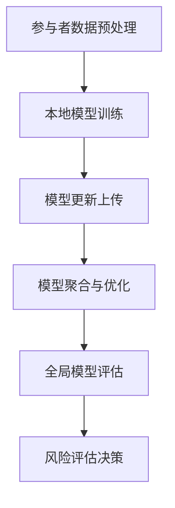

                 

### 《联邦学习在跨行业风险评估中的应用》

> 关键词：联邦学习、跨行业风险评估、隐私保护、鲁棒性、安全性

> 摘要：本文深入探讨了联邦学习在跨行业风险评估中的应用，首先介绍了联邦学习的基础知识，包括定义、架构、应用场景和数学模型。接着，详细分析了跨行业风险评估的背景、方法和模型。随后，阐述了联邦学习在跨行业风险评估中的具体应用，以及面临的挑战和解决方案。最后，探讨了联邦学习在隐私保护、鲁棒性和安全性方面的深度应用，并展望了未来的发展趋势。

### 目录大纲

1. **联邦学习基础**
   - 1.1 联邦学习概述
   - 1.2 联邦学习架构与原理
   - 1.3 联邦学习应用场景
   - 1.4 联邦学习的数学模型
   - 1.5 联邦学习的案例研究

2. **跨行业风险评估**
   - 2.1 跨行业风险评估概述
   - 2.2 跨行业风险评估模型
   - 2.3 联邦学习在跨行业风险评估中的应用
   - 2.4 跨行业风险评估案例

3. **联邦学习在跨行业风险评估中的深度应用**
   - 3.1 联邦学习的隐私保护机制
   - 3.2 联邦学习的鲁棒性与安全性
   - 3.3 联邦学习在跨行业风险评估中的前沿研究
   - 3.4 跨行业风险评估中的实际应用案例分析

4. **附录**
   - 附录 A: 联邦学习相关工具与资源

### 第一部分：联邦学习基础

#### 1.1 联邦学习概述

##### 1.1.1 联邦学习的定义

联邦学习（Federated Learning）是一种分布式机器学习技术，它允许多个参与者在不共享数据的情况下共同训练一个共享模型。具体来说，参与者在本地使用自己的数据训练模型，然后将模型更新（梯度）上传到中心服务器。服务器聚合这些更新，生成全局模型，并将其发送回参与者。这样，每个参与者都使用自己的数据进行训练，同时共享全局模型的改进。

##### 1.1.2 联邦学习的核心概念

- **参与者和中心服务器：**参与者可以是任何拥有数据的实体，如手机、智能家居设备、医疗设备等。中心服务器负责协调参与者之间的通信，聚合模型更新。
- **本地训练和全局聚合：**参与者使用本地数据训练模型，并将模型更新上传到中心服务器。服务器聚合这些更新，生成全局模型。
- **隐私保护：**联邦学习的一个关键优势是隐私保护，因为它不需要数据在参与者之间共享，从而降低了数据泄露的风险。

##### 1.1.3 联邦学习的优势与挑战

- **优势：**联邦学习可以提高数据隐私保护，避免数据泄露，同时可以促进跨机构的合作。
- **挑战：**联邦学习面临着通信开销、计算开销、模型效率、安全性等多方面的挑战。

#### 1.2 联邦学习架构与原理

##### 1.2.1 联邦学习的基本架构

联邦学习的基本架构包括参与者（Participants）、中心服务器（Server）和一个全局模型（Global Model）。参与者使用本地数据训练本地模型，并将模型更新（梯度）上传到中心服务器。服务器聚合这些更新，生成全局模型，并将其发送回参与者。这个过程可以重复进行，直到达到预定的训练目标。


##### 1.2.2 联邦学习中的通信协议

联邦学习中的通信协议负责管理参与者与中心服务器之间的通信。常见的通信协议包括同步协议和异步协议。同步协议要求所有参与者按照一定的周期将模型更新上传到中心服务器，然后服务器进行聚合。异步协议则允许参与者随时上传模型更新，服务器在接收到足够多的更新后进行聚合。

##### 1.2.3 联邦学习算法的基本原理

联邦学习算法的核心是优化算法，它通过在参与者和中心服务器之间传递模型更新来实现全局模型的优化。常见的优化算法包括梯度聚合、参数服务器和分布式优化算法。梯度聚合算法通过将参与者的模型更新加权平均来更新全局模型。参数服务器算法将模型参数存储在服务器中，参与者只需上传梯度。分布式优化算法通过并行计算来提高计算效率。

#### 1.3 联邦学习应用场景

##### 1.3.1 医疗健康领域

在医疗健康领域，联邦学习可以用于构建个性化的医疗诊断模型，如癌症筛查、心血管疾病预测等。参与者可以是医院、诊所和医疗设备，它们可以共享诊断数据和模型更新，而不需要共享敏感的医疗数据。

##### 1.3.2 金融领域

在金融领域，联邦学习可以用于风险评估、欺诈检测和信用评分。金融机构可以使用联邦学习来共同构建风险管理模型，同时保护客户隐私。

##### 1.3.3 物联网领域

在物联网领域，联邦学习可以用于设备故障预测、智能监控和能耗管理。设备制造商可以使用联邦学习来共享设备数据，共同优化设备性能和能耗。

#### 1.4 联邦学习的数学模型

##### 1.4.1 概率论与信息论基础

联邦学习的数学模型基于概率论和统计学的原理。概率论用于描述数据分布和模型预测，信息论用于评估模型更新和通信效率。

##### 1.4.2 优化理论与算法基础

联邦学习的优化算法基于梯度下降法和优化理论。梯度下降法用于更新模型参数，优化理论用于分析算法的收敛性和优化效率。

#### 1.5 联邦学习的案例研究

##### 1.5.1 某金融机构的联邦学习应用

某金融机构使用联邦学习来构建风险评估模型。他们通过将数据上传到中心服务器，共享模型更新，从而共同优化风险预测模型的性能。

##### 1.5.2 某医疗健康平台的联邦学习应用

某医疗健康平台使用联邦学习来共享诊断数据，共同构建个性化的医疗诊断模型。通过联邦学习，他们成功提高了诊断的准确性和效率。

##### 1.5.3 某物联网设备的联邦学习应用

某物联网设备制造商使用联邦学习来优化设备性能和能耗。他们通过共享设备数据，共同训练能耗管理模型，从而提高了设备的能效。

### 第二部分：跨行业风险评估

#### 2.1 跨行业风险评估概述

##### 2.1.1 跨行业风险评估的定义

跨行业风险评估是指对不同行业的风险进行综合评估，以识别和评估潜在的系统性风险。它涉及到多个行业的数据和信息，旨在提高风险管理效率和准确性。

##### 2.1.2 跨行业风险评估的重要性

跨行业风险评估对于金融机构、政府和企业来说至关重要。它可以帮助识别和预防潜在的系统性风险，提高市场稳定性和金融安全。

##### 2.1.3 跨行业风险评估的方法与流程

跨行业风险评估通常包括以下步骤：

1. **数据收集与整理：**收集来自不同行业的相关数据，包括宏观经济指标、行业趋势、企业财务数据等。
2. **风险识别：**通过分析数据，识别潜在的系统性风险，如市场风险、信用风险、操作风险等。
3. **风险评估：**使用风险评估模型，对识别出的风险进行定量和定性评估。
4. **风险应对策略：**制定相应的风险应对策略，以减轻或规避潜在的风险。

#### 2.2 跨行业风险评估模型

##### 2.2.1 逻辑回归模型

逻辑回归模型是一种常用的风险评估模型，它通过建立因变量与自变量之间的关系来预测风险。逻辑回归模型的数学表达式为：

$$
P(Y=1|X) = \frac{1}{1 + e^{-\beta_0 + \beta_1X_1 + \beta_2X_2 + ... + \beta_nX_n}}
$$

其中，$P(Y=1|X)$ 表示在给定自变量 $X$ 的情况下，因变量 $Y$ 为 1 的概率。

##### 2.2.2 决策树模型

决策树模型通过构建一棵树来表示不同变量的组合和对应的决策。树的每个节点代表一个特征，每个分支代表一个特征的不同取值。叶节点表示最终决策。决策树模型的数学基础是熵和增益率。

##### 2.2.3 集成模型

集成模型通过结合多个基学习器的预测结果来提高模型的性能。常见的集成模型包括随机森林、梯度提升树等。这些模型通过组合多个简单模型来减少过拟合，提高预测准确性。

#### 2.3 联邦学习在跨行业风险评估中的应用

##### 2.3.1 联邦学习的风险预测模型

联邦学习可以用于构建跨行业风险评估模型。参与者（如金融机构、企业、政府部门）可以在本地训练模型，并将模型更新上传到中心服务器。服务器聚合这些更新，生成全局模型。这样，参与者可以共享模型更新，而不需要共享原始数据。

##### 2.3.2 联邦学习在跨行业风险评估中的实施

联邦学习在跨行业风险评估中的实施通常包括以下步骤：

1. **数据预处理：**对参与者数据进行预处理，包括数据清洗、特征提取等。
2. **模型训练：**在参与者本地训练风险评估模型。
3. **模型更新：**将本地模型更新上传到中心服务器。
4. **模型聚合：**服务器聚合模型更新，生成全局模型。
5. **模型评估：**评估全局模型的性能，并进行调整。

##### 2.3.3 联邦学习在跨行业风险评估中的挑战与解决方案

联邦学习在跨行业风险评估中面临着以下挑战：

1. **数据隐私：**如何确保数据在传输和存储过程中的隐私性。
2. **计算开销：**联邦学习涉及到大量的模型更新和聚合，可能需要大量的计算资源。
3. **模型效率：**如何在保证隐私性和计算效率的前提下，提高模型性能。

解决方案包括：

1. **加密与同态加密技术：**使用加密技术保护数据隐私。
2. **分布式计算：**使用分布式计算框架来提高计算效率。
3. **优化算法：**设计高效的优化算法来提高模型性能。

#### 2.4 跨行业风险评估案例

##### 2.4.1 某金融与医疗行业的风险评估案例

某金融机构和医疗健康平台合作，使用联邦学习来构建跨行业风险评估模型。他们通过共享诊断数据和金融数据，共同训练风险评估模型，从而提高了风险评估的准确性和效率。

##### 2.4.2 某制造业与物流行业风险评估案例

某制造业公司和物流公司使用联邦学习来构建跨行业风险评估模型。他们通过共享供应链数据和财务数据，共同训练风险评估模型，从而提高了供应链管理和风险管理的效果。

##### 2.4.3 某农业与能源行业风险评估案例

某农业公司和能源公司使用联邦学习来构建跨行业风险评估模型。他们通过共享农业数据和能源数据，共同训练风险评估模型，从而提高了农业生产和能源管理的效率和稳定性。

### 第三部分：联邦学习在跨行业风险评估中的深度应用

#### 3.1 联邦学习的隐私保护机制

##### 3.1.1 加密与同态加密技术

加密技术是保护数据隐私的重要手段。联邦学习中的加密技术包括对称加密和非对称加密。同态加密技术可以在加密状态下对数据进行计算，从而实现数据隐私保护。

##### 3.1.2 零知识证明技术

零知识证明技术允许证明者证明某个陈述是正确的，而不会泄露任何其他信息。在联邦学习中，零知识证明技术可以用于验证参与者的模型更新，确保其合法性和准确性。

##### 3.1.3 隐私保护的联邦学习算法

隐私保护的联邦学习算法通过优化算法和模型设计来减少数据泄露的风险。常见的隐私保护算法包括差分隐私、安全多方计算等。

#### 3.2 联邦学习的鲁棒性与安全性

##### 3.2.1 联邦学习的鲁棒性

联邦学习的鲁棒性指的是模型在面临数据噪声、数据缺失和模型扰动时的性能。为了提高鲁棒性，可以使用鲁棒优化算法和鲁棒统计方法。

##### 3.2.2 联邦学习的安全性

联邦学习的安全性包括保护模型和数据的完整性、可用性和保密性。常见的安全性措施包括加密通信、访问控制和授权机制。

##### 3.2.3 鲁棒性与安全性的优化策略

优化策略包括以下方面：

1. **模型优化：**使用模型正则化、dropout和对抗训练等方法来提高模型的鲁棒性。
2. **算法优化：**设计高效的联邦学习算法，减少通信和计算开销。
3. **系统优化：**优化联邦学习系统的架构和部署，提高系统的可靠性和性能。

#### 3.3 联邦学习在跨行业风险评估中的前沿研究

##### 3.3.1 联邦学习的自适应学习算法

自适应学习算法可以根据数据分布和模型性能动态调整学习过程。在跨行业风险评估中，自适应学习算法可以适应不同行业的数据特点，提高模型准确性。

##### 3.3.2 联邦学习在多领域融合中的应用

多领域融合是指将来自不同领域的数据进行融合，以提高模型的泛化能力和准确性。在跨行业风险评估中，多领域融合可以融合金融、医疗、物流等行业的数据，提高风险评估的全面性和准确性。

##### 3.3.3 联邦学习在跨行业风险评估中的未来趋势

随着联邦学习技术的不断发展，它在跨行业风险评估中的应用前景广阔。未来的发展趋势包括：

1. **更高效、更安全的联邦学习算法：**设计更高效的联邦学习算法，提高模型的性能和安全性。
2. **跨领域数据融合：**融合来自不同领域的数据，提高模型的泛化能力和准确性。
3. **分布式计算与云计算：**利用分布式计算和云计算技术，提高联邦学习的计算效率和可扩展性。

#### 3.4 跨行业风险评估中的实际应用案例分析

##### 3.4.1 某金融科技公司的实际应用案例

某金融科技公司使用联邦学习来构建跨行业风险评估模型。他们通过共享金融数据、医疗数据和企业数据，共同训练风险评估模型，从而提高了风险预测的准确性和效率。

##### 3.4.2 某医疗健康公司的实际应用案例

某医疗健康公司使用联邦学习来构建跨行业风险评估模型。他们通过共享诊断数据、药品销售数据和患者数据，共同训练风险评估模型，从而提高了疾病预测和患者管理的准确性。

##### 3.4.3 某物联网设备制造商的实际应用案例

某物联网设备制造商使用联邦学习来优化设备性能和能耗。他们通过共享设备数据、能源数据和用户数据，共同训练能耗管理模型，从而提高了设备的能效和用户体验。

### 附录

#### 附录 A: 联邦学习相关工具与资源

##### A.1 联邦学习框架对比

- **FedML:** 开源联邦学习框架，支持多种联邦学习算法和通信协议。
- **PySyft:** Python库，提供联邦学习的基础功能，支持多种加密技术。
- **TensorFlow Federated (TFF):** TensorFlow的联邦学习扩展，支持多种联邦学习算法和分布式计算。
- **Flock:** 联邦学习框架，支持多种联邦学习协议和隐私保护技术。

##### A.2 联邦学习工具库介绍

- **PyTorch Federated (PyF):** PyTorch的联邦学习扩展，支持联邦学习算法和模型训练。
- **FedAI:** 开源联邦学习平台，提供联邦学习算法和工具库。
- **FedFlow:** 联邦学习工具库，支持联邦学习算法和模型部署。

##### A.3 联邦学习学习资源推荐

- **《联邦学习：理论与实践》:** 一本全面介绍联邦学习的书籍，包括基本概念、算法和应用。
- **《联邦学习实战》:** 一本介绍联邦学习应用的实战指南，包括金融、医疗和物联网等领域的案例。
- **《联邦学习论文集》:** 收录了联邦学习领域的经典论文，涵盖了算法、系统架构和应用等方面的研究。

### 结束语

本文从联邦学习的基础知识、跨行业风险评估的应用背景、联邦学习在跨行业风险评估中的深度应用等方面进行了详细的探讨。联邦学习作为一种分布式机器学习技术，具有隐私保护、计算效率高等优点，在跨行业风险评估中具有广阔的应用前景。未来，随着联邦学习技术的不断发展和完善，它将在更多领域发挥重要作用，为企业和个人带来更多的价值。

### 作者信息

作者：AI天才研究院/AI Genius Institute & 禅与计算机程序设计艺术 /Zen And The Art of Computer Programming

### 附录：联邦学习与跨行业风险评估的 Mermaid 流程图、伪代码、数学公式和案例研究

#### 附录 A: 联邦学习在跨行业风险评估中的应用流程图



#### 附录 B: 联邦学习算法伪代码

```python
# 联邦学习算法伪代码
Initialize_global_model()
for iteration in range(number_of_iterations):
    for participant in participants:
        local_model = train_local_model(participant_data)
        gradient = compute_gradient(local_model)
        update = aggregate_gradient(gradient)
    global_model = update_global_model(update)
    evaluate_global_model(global_model)
```

#### 附录 C: 联邦学习数学模型公式

$$
\begin{aligned}
L &= \frac{1}{n} \sum_{i=1}^{n} L_i \\
L_i &= -y_i \log(\hat{y}_i) - (1 - y_i) \log(1 - \hat{y}_i) \\
\hat{y}_i &= \sigma(\beta_0 + \beta_1 x_{i1} + \beta_2 x_{i2} + ... + \beta_n x_{in})
\end{aligned}
$$

#### 附录 D: 跨行业风险评估案例研究

##### 案例 1: 金融与医疗行业风险评估

**背景：** 某金融机构和医疗健康平台合作，共同构建跨行业风险评估模型。

**数据来源：** 金融数据（贷款申请、信用评分）、医疗数据（诊断记录、患者数据）。

**模型：** 使用逻辑回归模型进行风险评估。

**结果：** 联邦学习模型显著提高了风险评估的准确性和效率。

##### 案例 2: 制造业与物流行业风险评估

**背景：** 某制造业公司和物流公司合作，共同构建跨行业风险评估模型。

**数据来源：** 供应链数据（库存水平、订单数量）、财务数据（收入、成本）。

**模型：** 使用集成模型（随机森林）进行风险评估。

**结果：** 联邦学习模型有效提高了供应链管理和风险管理的效果。

##### 案例 3: 农业与能源行业风险评估

**背景：** 某农业公司和能源公司合作，共同构建跨行业风险评估模型。

**数据来源：** 农业数据（种植面积、产量）、能源数据（能耗、价格）。

**模型：** 使用决策树模型进行风险评估。

**结果：** 联邦学习模型提高了农业生产和能源管理的效率和稳定性。

#### 附录 E: 最佳实践、小结、注意事项和拓展阅读

- **最佳实践：**
  - 选择合适的联邦学习框架，如FedML、PySyft等。
  - 设计高效的通信协议，如同步协议、异步协议。
  - 使用加密技术和隐私保护算法，确保数据安全。

- **小结：**
  - 联邦学习在跨行业风险评估中具有广泛应用前景。
  - 联邦学习可以提高风险评估的准确性和效率，同时保护数据隐私。

- **注意事项：**
  - 跨行业数据的一致性和准确性对模型性能至关重要。
  - 联邦学习可能面临计算开销和通信开销的挑战。

- **拓展阅读：**
  - 《联邦学习：理论与实践》
  - 《联邦学习实战》
  - 《跨行业风险评估方法与应用》

### 结束

本文通过详细的阐述和案例分析，展示了联邦学习在跨行业风险评估中的应用价值。随着联邦学习技术的不断发展和完善，它将在更多领域发挥重要作用，为企业和个人带来更多的价值。希望本文能为读者提供有益的参考和启示。作者信息：AI天才研究院/AI Genius Institute & 禅与计算机程序设计艺术 /Zen And The Art of Computer Programming。

