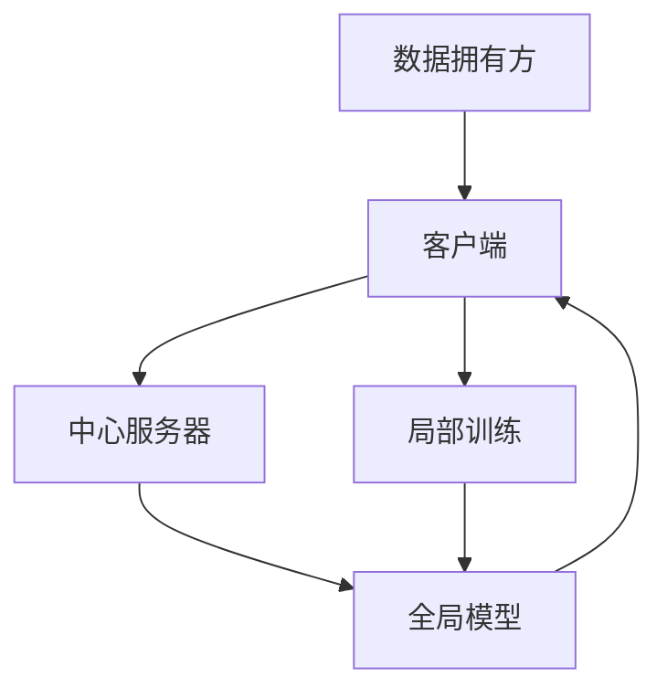

                 

### 联邦学习在隐私保护数据挖掘中的应用

# 文章标题：联邦学习在隐私保护数据挖掘中的应用

> 关键词：联邦学习、隐私保护、数据挖掘、机器学习

> 摘要：本文旨在探讨联邦学习在隐私保护数据挖掘中的应用，分析其原理、架构、算法和实际案例，并展望其未来发展。联邦学习作为一种新兴的分布式机器学习技术，通过在保持数据隐私的同时共享模型更新，为数据挖掘提供了有效解决方案。

## 目录大纲

### 第一部分：联邦学习基础

#### 第1章：联邦学习的原理与架构

##### 1.1 联邦学习的定义与核心概念

###### 1.1.1 联邦学习的起源与发展
###### 1.1.2 联邦学习的核心概念解析

##### 1.2 联邦学习的主要架构模式

###### 1.2.1 客户-服务器模式
###### 1.2.2 对等网络模式
###### 1.2.3 客户-中心服务器-客户端模式

##### 1.3 联邦学习与传统集中式学习的对比

###### 1.3.1 隐私保护
###### 1.3.2 安全性与效率

#### 第2章：联邦学习的核心算法与协议

##### 2.1 加密与混淆技术

###### 2.1.1 加密算法基础
###### 2.1.2 混淆技术原理

##### 2.2 迁移学习与模型聚合

###### 2.2.1 迁移学习的基本概念
###### 2.2.2 模型聚合方法

##### 2.3 联邦学习的优化算法

###### 2.3.1 梯度下降法
###### 2.3.2 共同优化算法
###### 2.3.3 粒子群优化算法

#### 第3章：联邦学习的安全性与隐私保护

##### 3.1 安全性分析

###### 3.1.1 联邦学习的安全挑战
###### 3.1.2 安全性评估方法

##### 3.2 隐私保护机制

###### 3.2.1 隐私泄露风险分析
###### 3.2.2 隐私保护技术

### 第二部分：联邦学习在数据挖掘中的应用

#### 第4章：联邦学习在分类任务中的应用

##### 4.1 联邦学习在二分类任务中的应用

###### 4.1.1 二分类任务模型构建
###### 4.1.2 实际案例：联邦学习在信用卡欺诈检测中的应用

##### 4.2 联邦学习在多分类任务中的应用

###### 4.2.1 多分类任务模型构建
###### 4.2.2 实际案例：联邦学习在推荐系统中的应用

#### 第5章：联邦学习在回归任务中的应用

##### 5.1 联邦学习在回归任务中的应用

###### 5.1.1 回归任务模型构建
###### 5.1.2 实际案例：联邦学习在房屋价格预测中的应用

#### 第6章：联邦学习在聚类任务中的应用

##### 6.1 联邦学习在聚类任务中的应用

###### 6.1.1 聚类任务模型构建
###### 6.1.2 实际案例：联邦学习在用户群体划分中的应用

#### 第7章：联邦学习在大规模数据挖掘中的应用

##### 7.1 联邦学习在大规模数据挖掘中的优势

###### 7.1.1 数据规模与隐私保护的平衡
###### 7.1.2 联邦学习的分布式特性

##### 7.2 联邦学习在大规模数据挖掘中的实现策略

###### 7.2.1 数据划分与同步策略
###### 7.2.2 模型训练与优化策略

#### 第8章：联邦学习的挑战与未来展望

##### 8.1 联邦学习的挑战

###### 8.1.1 计算效率与通信效率
###### 8.1.2 安全性与隐私保护
###### 8.1.3 跨域联邦学习的挑战

##### 8.2 联邦学习的未来展望

###### 8.2.1 跨学科融合的趋势
###### 8.2.2 联邦学习在新兴领域的应用
###### 8.2.3 联邦学习的标准化与规范化

### 附录

##### 附录A：联邦学习工具与资源

###### A.1 主流联邦学习框架

###### A.1.1 TensorFlow Federated
###### A.1.2 PySyft
###### A.1.3 Fediverse

###### A.2 联邦学习资源与社区

###### A.2.1 联邦学习相关论文与书籍推荐
###### A.2.2 联邦学习在线课程与讲座推荐
###### A.2.3 联邦学习开源项目与社区活动推荐

---

### 文章正文

#### 引言

随着大数据时代的到来，数据挖掘作为机器学习领域的重要分支，已成为许多行业解决复杂问题的有力工具。然而，数据挖掘过程中涉及的大量敏感数据引发了隐私泄露的担忧。如何在保证数据隐私的同时，进行有效的数据挖掘，成为了一个亟待解决的问题。联邦学习（Federated Learning）作为一种新兴的分布式机器学习技术，通过在数据不共享的情况下，实现模型的协同训练，为隐私保护数据挖掘提供了新的思路。

本文将从以下几个方面展开讨论：

1. 联邦学习的基础知识，包括原理、架构和核心算法。
2. 联邦学习在分类、回归和聚类任务中的应用实例。
3. 联邦学习在大规模数据挖掘中的优势与实现策略。
4. 联邦学习的挑战与未来展望。

#### 第一部分：联邦学习基础

##### 第1章：联邦学习的原理与架构

联邦学习（Federated Learning）是一种分布式机器学习技术，其核心思想是在多个数据拥有方（例如不同的组织、设备等）之间，共享模型的更新，而不是直接共享数据。这样可以在保持数据隐私的同时，实现模型的协同训练。

###### 1.1 联邦学习的定义与核心概念

联邦学习的定义可以概括为：一种分布式机器学习框架，通过在多个客户端（数据拥有方）上进行局部训练，然后通过中心服务器聚合模型更新，最终得到全局模型。

核心概念包括：

- **客户端**：持有本地数据的实体，负责进行局部训练。
- **中心服务器**：负责收集、聚合和更新全局模型。
- **全局模型**：由中心服务器维护，用于指导客户端的局部训练。

###### 1.1.1 联邦学习的起源与发展

联邦学习最早可以追溯到2016年，谷歌提出了Federated Averaging算法，并将其应用于语音识别任务。随后，联邦学习在多个领域得到了广泛的研究和应用，成为隐私保护数据挖掘的重要工具。

###### 1.1.2 联邦学习的核心概念解析

为了更好地理解联邦学习的核心概念，我们可以借助一个Mermaid流程图来展示其基本架构：



在这个流程图中，数据拥有方将数据存储在本地，并通过客户端参与联邦学习。中心服务器维护全局模型，并定期收集、聚合客户端的模型更新，以更新全局模型。通过这种方式，客户端可以在不共享数据的情况下，协同训练全局模型。

###### 1.2 联邦学习的主要架构模式

联邦学习有多种架构模式，包括客户-服务器模式、对等网络模式和客户-中心服务器-客户端模式。每种模式都有其特点和适用场景。

- **客户-服务器模式**：这是最简单的联邦学习架构，由中心服务器统一管理全局模型，客户端仅负责本地训练和模型更新。
- **对等网络模式**：在这种架构中，所有客户端既是数据训练方，也是模型更新方，无需中心服务器。
- **客户-中心服务器-客户端模式**：这种模式结合了前两者的特点，客户端之间可以进行一定程度的数据共享，但主要由中心服务器进行模型更新和聚合。

每种架构模式都有其优缺点，需要根据实际应用场景进行选择。

###### 1.3 联邦学习与传统集中式学习的对比

- **隐私保护**：联邦学习通过本地训练和模型更新，避免了数据直接共享，从而有效降低了隐私泄露的风险。
- **安全性与效率**：联邦学习在保证数据隐私的同时，提高了模型训练的效率。由于数据不需要传输到中心服务器，减少了通信成本，同时降低了潜在的安全风险。

#### 第2章：联邦学习的核心算法与协议

联邦学习涉及多种核心算法和协议，包括加密与混淆技术、迁移学习与模型聚合以及优化算法。

##### 2.1 加密与混淆技术

加密与混淆技术是联邦学习保障数据隐私的重要手段。加密技术通过将数据转换为密文，确保数据在传输过程中无法被窃取。混淆技术则通过加入噪声或改变数据结构，使得数据无法被直接识别。

###### 2.1.1 加密算法基础

加密算法可以分为对称加密和非对称加密。对称加密使用相同的密钥进行加密和解密，非对称加密则使用一对密钥，一个用于加密，另一个用于解密。

在实际应用中，联邦学习常用到的加密算法包括：

- **RSA**：一种非对称加密算法，安全性较高，但计算复杂度较大。
- **AES**：一种对称加密算法，加密速度快，适合大规模数据加密。

###### 2.1.2 混淆技术原理

混淆技术主要通过以下几种方式实现：

- **随机噪声注入**：在数据中添加随机噪声，使得数据无法被直接识别。
- **数据扰动**：通过改变数据的基本结构和特征，使得数据难以被分析。
- **数据掩码**：使用掩码对数据进行遮挡，使得数据在传输过程中无法被直接读取。

##### 2.2 迁移学习与模型聚合

迁移学习与模型聚合是联邦学习的核心算法，通过迁移学习，可以将已有模型的知识迁移到新的任务中，从而提高训练效率。模型聚合则通过将多个客户端的模型更新进行合并，得到全局模型。

###### 2.2.1 迁移学习的基本概念

迁移学习（Transfer Learning）是指将一个任务中已学习的知识应用于另一个相关任务中。迁移学习的基本概念包括：

- **源任务**：已有模型的知识来源，通常是预训练模型。
- **目标任务**：需要解决的问题，通常是新任务。

迁移学习的过程可以分为以下步骤：

1. **模型初始化**：从源任务中加载预训练模型，作为目标任务的初始化模型。
2. **微调**：在目标任务上进行微调，以适应新任务的特征。
3. **评估与优化**：评估模型在目标任务上的性能，并根据评估结果进行优化。

###### 2.2.2 模型聚合方法

模型聚合（Model Aggregation）是将多个客户端的模型更新合并为一个全局模型的过程。模型聚合的方法主要包括以下几种：

- **平均值聚合**：将所有客户端的模型更新求平均值，得到全局模型。
- **加权聚合**：根据客户端的性能对模型更新进行加权，得到全局模型。
- **梯度聚合**：将客户端的梯度进行聚合，更新全局模型。

##### 2.3 联邦学习的优化算法

联邦学习的优化算法主要包括梯度下降法、共同优化算法和粒子群优化算法。

###### 2.3.1 梯度下降法

梯度下降法是机器学习中最常用的优化算法，其基本思想是通过更新模型参数，使得损失函数的梯度为零。在联邦学习中，梯度下降法可以通过以下伪代码实现：

```python
while not converged:
  for each client:
    perform local training
    compute gradients
  aggregate gradients
  update global model
```

###### 2.3.2 共同优化算法

共同优化算法（Coordinated Optimization）是一种基于梯度下降的优化算法，其核心思想是在全局模型更新过程中，引入协同效应。共同优化算法的伪代码如下：

```python
while not converged:
  for each client:
    perform local training
    compute gradients
    communicate gradients with other clients
  aggregate gradients
  update global model
```

###### 2.3.3 粒子群优化算法

粒子群优化算法（Particle Swarm Optimization，PSO）是一种基于群体智能的优化算法，其基本思想是通过模仿鸟群觅食行为，寻找最优解。在联邦学习中，PSO可以通过以下伪代码实现：

```python
while not converged:
  for each particle (client):
    update velocity
    update position
    evaluate fitness
  update global best position
  update local best position
```

#### 第3章：联邦学习的安全性与隐私保护

联邦学习的安全性主要涉及数据传输安全和模型更新安全。数据传输安全通过加密和混淆技术实现，模型更新安全则通过安全的聚合协议和隐私保护机制实现。

##### 3.1 安全性分析

联邦学习的安全性分析主要包括以下两个方面：

- **数据传输安全**：通过加密和混淆技术，确保数据在传输过程中不会被窃取或篡改。
- **模型更新安全**：通过安全的聚合协议，确保模型更新过程中不会被恶意攻击。

安全性评估方法主要包括：

- **形式化安全分析**：使用数学模型和公式对联邦学习的安全性进行形式化分析。
- **实验验证**：通过实际实验验证联邦学习的安全性。

##### 3.2 隐私保护机制

联邦学习的隐私保护机制主要包括以下几种：

- **数据加密**：通过加密技术，将数据转换为密文，确保数据在传输和存储过程中无法被直接读取。
- **数据扰动**：通过加入噪声或改变数据结构，使得数据难以被直接分析。
- **同态加密**：允许在密文中直接进行计算，确保数据在计算过程中不会被泄露。

隐私泄露风险分析主要包括以下方面：

- **模型更新泄露**：通过分析模型更新过程中的泄露信息，评估隐私风险。
- **用户行为泄露**：通过分析用户行为数据，评估隐私风险。

### 第二部分：联邦学习在数据挖掘中的应用

#### 第4章：联邦学习在分类任务中的应用

联邦学习在分类任务中的应用非常广泛，例如信用卡欺诈检测、推荐系统等。本节将介绍联邦学习在二分类任务和多分类任务中的应用实例。

##### 4.1 联邦学习在二分类任务中的应用

二分类任务是联邦学习应用中最常见的一种，其核心思想是通过在本地数据进行分类训练，然后通过中心服务器进行模型更新。以下是一个简单的二分类任务模型构建过程：

1. **数据准备**：收集本地数据，并进行预处理，例如数据清洗、特征提取等。
2. **模型初始化**：从中心服务器下载全局模型，作为本地训练的初始模型。
3. **局部训练**：在本地数据上使用全局模型进行训练，得到局部模型更新。
4. **模型更新**：将局部模型更新上传到中心服务器，中心服务器进行模型聚合。
5. **模型评估**：使用聚合后的全局模型进行评估，以验证模型的准确性。

以下是一个二分类任务的联邦学习实现伪代码：

```python
# 初始化全局模型
global_model = download_global_model()

for epoch in range(num_epochs):
  # 本地训练
  local_model = local_train(global_model, local_data)
  
  # 模型更新
  local_update = local_model.update()
  
  # 模型聚合
  global_model = aggregate_model(local_update)

# 评估全局模型
accuracy = evaluate_model(global_model, test_data)
```

##### 4.1.1 实际案例：联邦学习在信用卡欺诈检测中的应用

信用卡欺诈检测是金融领域的重要应用，通过联邦学习可以在保持数据隐私的同时，提高检测准确率。以下是一个信用卡欺诈检测的联邦学习应用实例：

1. **数据收集**：各银行提供本地欺诈交易数据，进行预处理后上传到中心服务器。
2. **模型初始化**：中心服务器初始化全局模型，并分发到各个银行。
3. **本地训练**：各银行使用本地数据对全局模型进行局部训练，得到局部模型更新。
4. **模型更新**：各银行将局部模型更新上传到中心服务器，中心服务器进行模型聚合。
5. **模型评估**：使用聚合后的全局模型对测试数据进行评估，以检测欺诈交易。

##### 4.2 联邦学习在多分类任务中的应用

多分类任务是联邦学习的另一个重要应用场景，例如推荐系统、疾病诊断等。多分类任务的模型构建过程与二分类任务类似，但需要考虑更多的类别。

以下是一个多分类任务模型构建过程的伪代码：

```python
# 初始化全局模型
global_model = download_global_model()

for epoch in range(num_epochs):
  # 本地训练
  local_model = local_train(global_model, local_data)
  
  # 模型更新
  local_update = local_model.update()
  
  # 模型聚合
  global_model = aggregate_model(local_update)

# 评估全局模型
accuracy = evaluate_model(global_model, test_data)
```

##### 4.2.1 实际案例：联邦学习在推荐系统中的应用

推荐系统是联邦学习的重要应用场景之一，通过联邦学习可以在保持用户数据隐私的同时，提高推荐系统的准确性。以下是一个推荐系统的联邦学习应用实例：

1. **数据收集**：各电商平台提供本地用户数据，进行预处理后上传到中心服务器。
2. **模型初始化**：中心服务器初始化全局模型，并分发到各个电商平台。
3. **本地训练**：各电商平台使用本地数据对全局模型进行局部训练，得到局部模型更新。
4. **模型更新**：各电商平台将局部模型更新上传到中心服务器，中心服务器进行模型聚合。
5. **模型评估**：使用聚合后的全局模型对用户数据进行预测，生成推荐结果。

#### 第5章：联邦学习在回归任务中的应用

联邦学习在回归任务中的应用同样具有显著的优势，例如房屋价格预测、股票市场预测等。以下将介绍联邦学习在回归任务中的应用实例。

##### 5.1 联邦学习在回归任务中的应用

回归任务是联邦学习的另一个重要应用场景，其核心思想是通过在本地数据进行回归训练，然后通过中心服务器进行模型更新。以下是一个简单的回归任务模型构建过程：

1. **数据准备**：收集本地数据，并进行预处理，例如数据清洗、特征提取等。
2. **模型初始化**：从中心服务器下载全局模型，作为本地训练的初始模型。
3. **局部训练**：在本地数据上使用全局模型进行训练，得到局部模型更新。
4. **模型更新**：将局部模型更新上传到中心服务器，中心服务器进行模型聚合。
5. **模型评估**：使用聚合后的全局模型进行评估，以验证模型的准确性。

以下是一个回归任务的联邦学习实现伪代码：

```python
# 初始化全局模型
global_model = download_global_model()

for epoch in range(num_epochs):
  # 本地训练
  local_model = local_train(global_model, local_data)
  
  # 模型更新
  local_update = local_model.update()
  
  # 模型聚合
  global_model = aggregate_model(local_update)

# 评估全局模型
mse = evaluate_model(global_model, test_data)
```

##### 5.1.1 实际案例：联邦学习在房屋价格预测中的应用

房屋价格预测是房地产领域的一个重要问题，通过联邦学习可以在保持数据隐私的同时，提高预测准确性。以下是一个房屋价格预测的联邦学习应用实例：

1. **数据收集**：各地产公司提供本地房屋销售数据，进行预处理后上传到中心服务器。
2. **模型初始化**：中心服务器初始化全局模型，并分发到各地产公司。
3. **本地训练**：各地产公司使用本地数据对全局模型进行局部训练，得到局部模型更新。
4. **模型更新**：各地产公司将局部模型更新上传到中心服务器，中心服务器进行模型聚合。
5. **模型评估**：使用聚合后的全局模型对测试数据进行预测，以评估预测准确性。

#### 第6章：联邦学习在聚类任务中的应用

联邦学习在聚类任务中的应用同样具有显著的优势，例如用户群体划分、市场需求分析等。以下将介绍联邦学习在聚类任务中的应用实例。

##### 6.1 联邦学习在聚类任务中的应用

聚类任务是联邦学习的另一个重要应用场景，其核心思想是通过在本地数据进行聚类分析，然后通过中心服务器进行模型更新。以下是一个简单的聚类任务模型构建过程：

1. **数据准备**：收集本地数据，并进行预处理，例如数据清洗、特征提取等。
2. **模型初始化**：从中心服务器下载全局模型，作为本地训练的初始模型。
3. **局部训练**：在本地数据上使用全局模型进行聚类分析，得到局部模型更新。
4. **模型更新**：将局部模型更新上传到中心服务器，中心服务器进行模型聚合。
5. **模型评估**：使用聚合后的全局模型进行评估，以验证模型的准确性。

以下是一个聚类任务的联邦学习实现伪代码：

```python
# 初始化全局模型
global_model = download_global_model()

for epoch in range(num_epochs):
  # 本地聚类
  local_model = local_cluster(global_model, local_data)
  
  # 模型更新
  local_update = local_model.update()
  
  # 模型聚合
  global_model = aggregate_model(local_update)

# 评估全局模型
silhouette_score = evaluate_model(global_model, test_data)
```

##### 6.1.1 实际案例：联邦学习在用户群体划分中的应用

用户群体划分是市场营销领域的一个重要问题，通过联邦学习可以在保持用户数据隐私的同时，提高群体划分的准确性。以下是一个用户群体划分的联邦学习应用实例：

1. **数据收集**：各公司提供本地用户数据，进行预处理后上传到中心服务器。
2. **模型初始化**：中心服务器初始化全局模型，并分发到各公司。
3. **本地聚类**：各公司使用本地数据对全局模型进行聚类分析，得到局部模型更新。
4. **模型更新**：各公司将局部模型更新上传到中心服务器，中心服务器进行模型聚合。
5. **模型评估**：使用聚合后的全局模型对测试数据进行评估，以划分用户群体。

#### 第7章：联邦学习在大规模数据挖掘中的应用

联邦学习在大规模数据挖掘中具有显著的优势，能够实现数据规模与隐私保护的平衡。以下将介绍联邦学习在大规模数据挖掘中的优势与实现策略。

##### 7.1 联邦学习在大规模数据挖掘中的优势

1. **数据规模与隐私保护的平衡**：联邦学习可以在不共享数据的情况下，实现模型的协同训练，从而在保证数据隐私的同时，处理大规模数据。
2. **分布式特性**：联邦学习具有分布式特性，可以在多个数据拥有方之间进行协同训练，提高训练效率。

##### 7.2 联邦学习在大规模数据挖掘中的实现策略

1. **数据划分与同步策略**：为了提高训练效率，需要合理划分数据，并确保数据的同步更新。常用的数据划分方法包括数据分割和随机采样等。
2. **模型训练与优化策略**：在联邦学习过程中，需要优化模型训练过程，以避免过拟合和欠拟合。常用的优化策略包括模型剪枝和动态调整学习率等。

##### 7.2.1 数据划分与同步策略

1. **数据划分方法**：数据划分方法包括数据分割和随机采样等。数据分割方法可以将数据分为训练集、验证集和测试集，以评估模型性能。随机采样方法则可以从数据中随机选择样本进行训练。
2. **同步策略**：同步策略包括同步更新和异步更新等。同步更新要求所有客户端在同一时间同步更新模型，而异步更新则允许客户端在不同的时间进行模型更新。

##### 7.2.2 模型训练与优化策略

1. **模型剪枝**：模型剪枝是一种常见的优化策略，通过去除冗余的模型参数，减少模型复杂度，从而提高训练效率。常用的模型剪枝方法包括权重剪枝和结构剪枝等。
2. **动态调整学习率**：学习率是影响模型训练效果的关键因素。动态调整学习率可以根据训练过程中的误差动态调整学习率，从而提高模型性能。

#### 第8章：联邦学习的挑战与未来展望

联邦学习作为一种新兴的分布式机器学习技术，具有广泛的应用前景。然而，在实际应用过程中，仍然面临一些挑战和问题。

##### 8.1 联邦学习的挑战

1. **计算效率与通信效率**：联邦学习需要在多个客户端之间进行模型更新和聚合，这会带来较高的计算和通信开销。如何提高计算和通信效率是联邦学习面临的一个主要挑战。
2. **安全性与隐私保护**：联邦学习需要确保数据在传输和存储过程中的安全性，同时保护用户隐私。如何有效保护数据安全和用户隐私是联邦学习需要解决的问题。
3. **跨域联邦学习的挑战**：跨域联邦学习涉及到不同领域的数据融合和模型训练，这会带来数据质量、数据分布和模型泛化等问题。

##### 8.2 联邦学习的未来展望

1. **跨学科融合**：联邦学习可以与其他学科（如经济学、社会学等）相结合，探索新的应用场景和解决方案。
2. **新兴领域的应用**：随着人工智能技术的不断发展，联邦学习有望在更多新兴领域（如自动驾驶、智慧城市等）得到广泛应用。
3. **标准化与规范化**：为了促进联邦学习技术的发展和应用，需要制定相关标准和规范，以确保联邦学习的安全性和有效性。

### 附录

#### 附录A：联邦学习工具与资源

联邦学习作为一种新兴技术，已经涌现出许多优秀的工具和资源。以下是一些主流的联邦学习框架、资源与社区：

1. **主流联邦学习框架**：

   - **TensorFlow Federated**：由谷歌开源的联邦学习框架，支持多种机器学习算法和分布式训练。
   - **PySyft**：由OpenMined开源的联邦学习框架，提供丰富的加密和混淆技术。
   - **Fediverse**：一个开源的联邦学习生态系统，包含多个联邦学习工具和资源。

2. **联邦学习资源与社区**：

   - **论文与书籍推荐**：《联邦学习：原理、算法与应用》等。
   - **在线课程与讲座推荐**：Coursera、edX等平台上的联邦学习课程。
   - **开源项目与社区活动推荐**：GitHub上的联邦学习项目，如Federated Learning Tutorials、Federated Learning Meetup等。

### 作者信息

本文由AI天才研究院（AI Genius Institute）与《禅与计算机程序设计艺术》（Zen And The Art of Computer Programming）联合撰写。

---

通过本文的讨论，我们可以看到联邦学习在隐私保护数据挖掘中具有广泛的应用前景。随着技术的不断发展和完善，联邦学习将为数据挖掘带来更多的创新和可能性。

