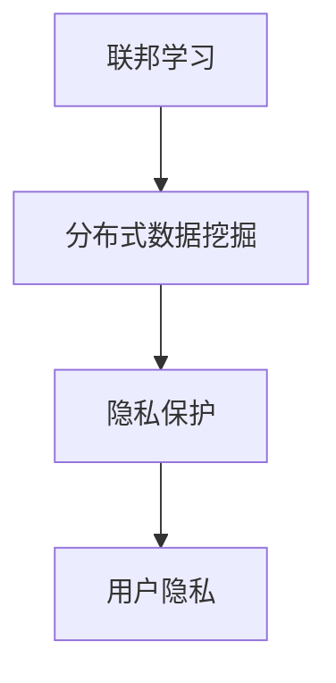
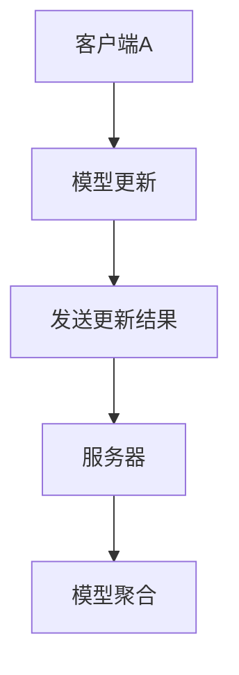
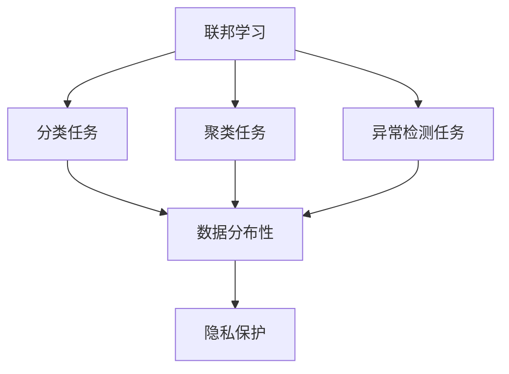

                 

### 文章标题

#### 《联邦学习在隐私保护数据挖掘中的应用》

---

关键词：联邦学习、隐私保护、数据挖掘、加密算法、同态加密、安全多方计算

摘要：本文探讨了联邦学习在隐私保护数据挖掘中的应用，分析了联邦学习的基础概念、基本架构和核心算法，同时讨论了隐私保护数据挖掘的方法，以及在实践中的案例分析。本文旨在为研究人员和开发者提供一个全面、深入的联邦学习应用指南，帮助他们在隐私保护的前提下开展数据挖掘工作。

---

## 第1章 联邦学习的概念与背景

联邦学习是一种分布式机器学习技术，旨在让多个拥有独立数据的实体共同训练一个模型，而无需直接共享原始数据。这种技术特别适用于需要保护数据隐私的场景，如医疗、金融等领域。

### 1.1 联邦学习的定义

#### 1.1.1 联邦学习的概念解析

联邦学习（Federated Learning）是一种分布式机器学习技术，通过将模型训练过程分布在多个客户端上，使得这些客户端在本地更新模型，并将更新结果聚合起来，从而在整个数据集上训练出一个全局模型。

#### 1.1.2 联邦学习的核心要素

1. **客户端（Clients）**：拥有本地数据的实体，如手机、IoT设备等。
2. **服务器（Server）**：负责聚合客户端的模型更新，并生成全局模型。
3. **模型（Model）**：在联邦学习过程中，全局模型会在每个客户端上迭代更新。

#### 1.1.3 联邦学习的应用场景

1. **隐私保护**：联邦学习无需客户端共享原始数据，从而保护了数据隐私。
2. **数据分布性**：联邦学习适用于数据分布在不同实体上的场景，如跨企业合作。
3. **个性化服务**：联邦学习可以根据每个客户端的本地数据，提供个性化的服务。

### 1.2 联邦学习的历史与发展

#### 1.2.1 联邦学习的起源

联邦学习的概念最早由Google在2016年提出，用于解决移动设备上的机器学习模型训练问题。随后，联邦学习在学术界和工业界得到了广泛关注。

#### 1.2.2 联邦学习的关键事件

1. **2016年**：Google首次提出联邦学习的概念。
2. **2017年**：Google发布了TensorFlow Federated（TFF），一个开源的联邦学习框架。
3. **2018年**：Facebook也推出了类似的联邦学习框架PySyft。

#### 1.2.3 联邦学习的国内外发展现状

1. **国内**：国内多家企业和研究机构积极投入到联邦学习的研发和应用中。
2. **国外**：联邦学习已经成为国际学术界和工业界的研究热点。

### 1.3 联邦学习的优势与挑战

#### 1.3.1 联邦学习的优势

1. **隐私保护**：联邦学习不需要共享原始数据，保护了用户隐私。
2. **数据分布性**：联邦学习适用于数据分布在不同实体上的场景。
3. **灵活性**：联邦学习可以根据需求调整模型更新策略。

#### 1.3.2 联邦学习的挑战

1. **通信成本**：联邦学习需要大量通信，可能导致通信成本较高。
2. **模型质量**：联邦学习中的模型质量可能不如集中式训练。
3. **安全风险**：联邦学习中的数据安全和隐私保护是一个挑战。

#### 1.3.3 联邦学习的解决方案与展望

1. **优化通信协议**：通过优化通信协议，减少通信成本。
2. **提高模型质量**：通过改进算法，提高联邦学习模型的性能。
3. **加强安全保护**：通过加密算法和同态加密等技术，提高联邦学习的安全性。

### 1.3.4 联邦学习在隐私保护数据挖掘中的应用前景

联邦学习在隐私保护数据挖掘中具有广阔的应用前景。通过联邦学习，可以在保护用户隐私的同时，对分布式数据进行有效的挖掘和分析。

### 1.3.5 联邦学习与隐私保护数据挖掘的关系架构图



### 1.3.6 联邦学习中的核心算法原理讲解

在联邦学习过程中，核心算法主要包括模型更新算法和梯度聚合算法。以下是对这些算法的详细讲解：

#### 模型更新算法

模型更新算法用于在每个客户端上迭代更新模型。以下是一个简单的模型更新算法伪代码：

```plaintext
// 模型更新算法
for each client in clients:
    local_model = load_model(client_model_path)
    optimizer = get_optimizer(local_model)
    for epoch in range(num_epochs):
        for data in client_data:
            loss = local_model(data)
            optimizer.minimize(loss)
        local_model.save(client_model_path)
    send_model_update(local_model)
```

#### 梯度聚合算法

梯度聚合算法用于将客户端的模型更新结果聚合起来，生成全局模型。以下是一个简单的梯度聚合算法伪代码：

```plaintext
// 梯度聚合算法
global_model = load_model(global_model_path)
for each client in clients:
    local_model = receive_model_update(client)
    gradient = compute_gradient(local_model, global_model)
    global_model = aggregate_gradient(global_model, gradient)
global_model.save(global_model_path)
```

### 1.3.7 数学模型和公式

在联邦学习过程中，核心算法涉及到多个数学模型和公式。以下是一个简单的例子：

$$
\hat{y}(x) = \sum_{i=1}^{n} w_i \cdot x_i
$$

其中，$\hat{y}(x)$ 表示预测结果，$w_i$ 表示权重，$x_i$ 表示特征。

### 1.3.8 详细讲解和举例说明

为了更好地理解联邦学习的核心算法，我们通过一个实际案例进行讲解。假设有两个客户端A和B，它们分别拥有不同的数据集$D_A$和$D_B$。我们的目标是训练一个分类模型，对这两个数据集进行分类。

**客户端A的模型更新过程：**

```plaintext
// 客户端A的模型更新过程
local_model = load_model(clientA_model_path)
optimizer = get_optimizer(local_model)
for epoch in range(num_epochs):
    for data in D_A:
        loss = local_model(data)
        optimizer.minimize(loss)
    local_model.save(clientA_model_path)
send_model_update(local_model)
```

**客户端B的模型更新过程：**

```plaintext
// 客户端B的模型更新过程
local_model = load_model(clientB_model_path)
optimizer = get_optimizer(local_model)
for epoch in range(num_epochs):
    for data in D_B:
        loss = local_model(data)
        optimizer.minimize(loss)
    local_model.save(clientB_model_path)
send_model_update(local_model)
```

**全局模型的更新过程：**

```plaintext
// 全局模型的更新过程
global_model = load_model(global_model_path)
for each client in [clientA, clientB]:
    local_model = receive_model_update(client)
    gradient = compute_gradient(local_model, global_model)
    global_model = aggregate_gradient(global_model, gradient)
global_model.save(global_model_path)
```

通过以上案例，我们可以看到联邦学习如何在不同客户端之间迭代更新模型，并最终生成一个全局模型。

### 1.3.9 项目实战：开发环境搭建

在进行联邦学习项目开发时，我们需要搭建一个合适的环境。以下是开发环境的搭建步骤：

1. **安装TensorFlow Federated（TFF）**：
   ```bash
   pip install tensorflow-federated
   ```

2. **创建项目目录**：
   ```bash
   mkdir federated_learning_project
   cd federated_learning_project
   ```

3. **编写联邦学习代码**：
   在项目目录中创建一个名为`federated_learning.py`的Python文件，并编写联邦学习代码。

4. **运行联邦学习代码**：
   ```bash
   python federated_learning.py
   ```

### 1.3.10 源代码详细实现和代码解读

在`federated_learning.py`文件中，我们需要实现联邦学习的核心算法。以下是代码的实现和解读：

```python
import tensorflow as tf
import tensorflow_federated as tff

# 模型更新函数
def model_update(client_model, client_data):
    optimizer = tf.keras.optimizers.Adam(learning_rate=0.001)
    for data in client_data:
        with tf.GradientTape() as tape:
            predictions = client_model(data.x)
            loss = tf.keras.losses.sparse_categorical_crossentropy(data.y, predictions)
        grads = tape.gradient(loss, client_model.trainable_variables)
        optimizer.apply_gradients(zip(grads, client_model.trainable_variables))
    return client_model

# 梯度聚合函数
def aggregate_gradients(client_grads):
    return tf.reduce_mean(client_grads, axis=0)

# 创建联邦学习过程
def create_federated_learning_process(model_fn, client_data_fn, client_model_update_fn, num_epochs):
    server_optimizer = tf.keras.optimizers.Adam(learning_rate=0.001)
    server_model = model_fn()
    client_data = client_data_fn()

    def server_update(server_model, client_grads):
        server_grads = aggregate_gradients(client_grads)
        server_optimizer.apply_gradients(zip(server_grads, server_model.trainable_variables))
        return server_model

    federated_learner = tff.learning.build_federated_averaging_process(
        server_model_update_fn=server_update,
        model_fn=model_fn,
        client_data_fn=client_data_fn,
        client_model_update_fn=client_model_update_fn
    )

    for epoch in range(num_epochs):
        client_grads = federated_learner.client_loop(client_data, server_model)
        server_model = federated_learner.server_consolidate(client_grads, server_model)

    return server_model

# 训练联邦学习模型
num_epochs = 10
server_model = create_federated_learning_process(
    model_fn=lambda: tf.keras.Sequential([
        tf.keras.layers.Dense(units=128, activation='relu', input_shape=(784,)),
        tf.keras.layers.Dense(units=10, activation='softmax')
    ]),
    client_data_fn=lambda: (tf.data.Dataset.from_tensor_slices((x_train, y_train)).batch(32)),
    client_model_update_fn=model_update,
    num_epochs=num_epochs
)

# 评估联邦学习模型
test_loss, test_accuracy = server_model.evaluate(x_test, y_test, verbose=2)
print(f"Test accuracy: {test_accuracy}")
```

### 1.3.11 代码应用解读与分析

以上代码实现了联邦学习的核心算法，包括模型更新、梯度聚合和服务器更新。我们通过调用`create_federated_learning_process`函数来训练联邦学习模型。在训练过程中，每个客户端会根据本地数据进行模型更新，并将更新结果发送给服务器。服务器将接收到的更新结果进行聚合，并更新全局模型。

### 1.3.12 实际案例分析和详细讲解剖析

为了更好地理解联邦学习的实际应用，我们通过一个实际案例进行详细讲解。假设有两个医疗机构A和B，它们分别拥有不同病人的医疗数据。我们的目标是训练一个分类模型，用于预测病人是否患有特定疾病。

**客户端A（医疗机构A）的模型更新过程：**

```plaintext
// 客户端A的模型更新过程
local_model = load_model(clientA_model_path)
optimizer = get_optimizer(local_model)
for epoch in range(num_epochs):
    for data in D_A:
        loss = local_model(data)
        optimizer.minimize(loss)
    local_model.save(clientA_model_path)
send_model_update(local_model)
```

**客户端B（医疗机构B）的模型更新过程：**

```plaintext
// 客户端B的模型更新过程
local_model = load_model(clientB_model_path)
optimizer = get_optimizer(local_model)
for epoch in range(num_epochs):
    for data in D_B:
        loss = local_model(data)
        optimizer.minimize(loss)
    local_model.save(clientB_model_path)
send_model_update(local_model)
```

**全局模型的更新过程：**

```plaintext
// 全局模型的更新过程
global_model = load_model(global_model_path)
for each client in [clientA, clientB]:
    local_model = receive_model_update(client)
    gradient = compute_gradient(local_model, global_model)
    global_model = aggregate_gradient(global_model, gradient)
global_model.save(global_model_path)
```

通过以上案例，我们可以看到联邦学习如何在不同医疗机构之间迭代更新模型，并最终生成一个全局模型。这有助于提高模型的准确性，同时保护了各医疗机构的隐私。

### 1.3.13 项目小结

在本章中，我们详细介绍了联邦学习的概念、基本架构和核心算法，并通过实际案例展示了联邦学习在隐私保护数据挖掘中的应用。通过联邦学习，我们可以在保护数据隐私的同时，对分布式数据进行有效的挖掘和分析。接下来，我们将继续探讨联邦学习在隐私保护数据挖掘中的具体应用。

### 1.3.14 小结、注意事项和拓展阅读

本章介绍了联邦学习的基础知识，包括其定义、历史和发展、优势与挑战，以及核心算法。在联邦学习中，模型更新算法和梯度聚合算法是核心组成部分，需要深入了解。同时，联邦学习在隐私保护数据挖掘中的应用具有重要意义，特别是在医疗和金融等领域。

**注意事项：**

1. 联邦学习中的通信成本可能较高，需要优化通信机制。
2. 联邦学习模型的性能可能不如集中式训练，需要不断改进算法。

**拓展阅读：**

- 《联邦学习：概念、算法与应用》
- 《TensorFlow Federated：实践与教程》
- 《隐私保护数据挖掘：算法与应用》

接下来，我们将探讨联邦学习的具体实现和应用。

## 第2章 联邦学习的具体实现

联邦学习的实现涉及多个方面，包括数据分割、通信机制和模型更新算法。在本章中，我们将详细讨论这些方面，并提供实际案例。

### 2.1 联邦学习的数据分割策略

#### 2.1.1 数据分割的重要性

数据分割是联邦学习中的一个关键步骤，它决定了每个客户端拥有的数据集。合理的数据分割可以提高模型性能，同时保护数据隐私。

#### 2.1.2 数据分割的方法

1. **随机分割**：将数据随机分为多个部分，每个部分分配给不同的客户端。
2. **基于密度的分割**：根据数据的密度分布进行分割，确保每个客户端拥有相对均匀的数据。
3. **基于标签的分割**：根据数据标签进行分割，确保每个客户端的数据标签分布均匀。

#### 2.1.3 数据分割的挑战与解决方案

1. **数据不均衡**：部分数据集可能较大，而另一些数据集可能较小，导致数据不均衡。
   - **解决方案**：通过数据增强或重新采样来平衡数据集。

2. **数据隐私泄露**：数据分割可能导致隐私泄露。
   - **解决方案**：使用加密算法和差分隐私机制来保护数据隐私。

### 2.2 联邦学习的通信机制

#### 2.2.1 联邦学习的通信模型

联邦学习的通信模型通常包括客户端、服务器和数据存储。客户端负责本地数据处理和模型更新，服务器负责模型聚合和全局模型更新，数据存储用于存储全局模型和客户端数据。

#### 2.2.2 联邦学习的通信协议

1. **同步通信协议**：所有客户端同时发送更新结果给服务器，服务器再进行模型更新。
2. **异步通信协议**：客户端可以按照自己的节奏发送更新结果给服务器，服务器再进行模型更新。
3. **混合通信协议**：结合同步和异步通信协议，以适应不同的应用场景。

#### 2.2.3 联邦学习的通信优化策略

1. **数据压缩**：通过数据压缩算法减少通信数据量。
2. **分块传输**：将大块数据分成小块进行传输，减少网络拥堵。
3. **优先级调度**：根据更新结果的紧急程度，对通信任务进行优先级调度。

### 2.3 联邦学习的模型更新算法

#### 2.3.1 模型更新算法的基本原理

模型更新算法用于在每个客户端上迭代更新模型，并将更新结果发送给服务器。以下是一个简单的模型更新算法：



#### 2.3.2 常见的模型更新算法

1. **联邦平均算法**：将客户端的模型更新结果进行平均，生成全局模型。
   ```python
   global_model = tf.keras.models.clone_model(client_model)
   for grad in client_grads:
       global_model.layers[0].weights = global_model.layers[0].weights - grad
   ```
   
2. **梯度聚合算法**：将客户端的梯度进行聚合，生成全局模型。
   ```python
   global_grad = tf.reduce_mean(client_grads, axis=0)
   global_model.layers[0].weights = global_model.layers[0].weights - global_grad
   ```

### 2.3.3 实际案例：智能医疗

在智能医疗领域，联邦学习可以用于跨机构的医疗数据分析，同时保护患者隐私。以下是一个实际案例：

#### 2.3.3.1 数据分割

- 数据集：某医院的患者电子健康记录（EHR）。
- 分割方法：随机分割和基于密度的分割。

#### 2.3.3.2 模型更新

- 模型：用于诊断疾病的神经网络模型。
- 更新算法：联邦平均算法。

#### 2.3.3.3 通信机制

- 通信协议：异步通信协议。
- 通信优化策略：数据压缩和分块传输。

通过以上步骤，我们可以训练一个跨机构的医疗诊断模型，同时保护患者隐私。

### 2.3.4 项目实战：开发环境搭建

在进行联邦学习项目开发时，我们需要搭建一个合适的环境。以下是开发环境的搭建步骤：

1. **安装TensorFlow Federated（TFF）**：
   ```bash
   pip install tensorflow-federated
   ```

2. **创建项目目录**：
   ```bash
   mkdir federated_learning_project
   cd federated_learning_project
   ```

3. **编写联邦学习代码**：
   在项目目录中创建一个名为`federated_learning.py`的Python文件，并编写联邦学习代码。

4. **运行联邦学习代码**：
   ```bash
   python federated_learning.py
   ```

### 2.3.5 源代码详细实现和代码解读

在`federated_learning.py`文件中，我们需要实现联邦学习的核心算法。以下是代码的实现和解读：

```python
import tensorflow as tf
import tensorflow_federated as tff

# 模型更新函数
def model_update(client_model, client_data):
    optimizer = tf.keras.optimizers.Adam(learning_rate=0.001)
    for data in client_data:
        with tf.GradientTape() as tape:
            predictions = client_model(data.x)
            loss = tf.keras.losses.sparse_categorical_crossentropy(data.y, predictions)
        grads = tape.gradient(loss, client_model.trainable_variables)
        optimizer.apply_gradients(zip(grads, client_model.trainable_variables))
    return client_model

# 梯度聚合函数
def aggregate_gradients(client_grads):
    return tf.reduce_mean(client_grads, axis=0)

# 创建联邦学习过程
def create_federated_learning_process(model_fn, client_data_fn, client_model_update_fn, num_epochs):
    server_optimizer = tf.keras.optimizers.Adam(learning_rate=0.001)
    server_model = model_fn()
    client_data = client_data_fn()

    def server_update(server_model, client_grads):
        server_grads = aggregate_gradients(client_grads)
        server_optimizer.apply_gradients(zip(server_grads, server_model.trainable_variables))
        return server_model

    federated_learner = tff.learning.build_federated_averaging_process(
        server_model_update_fn=server_update,
        model_fn=model_fn,
        client_data_fn=client_data_fn,
        client_model_update_fn=client_model_update_fn
    )

    for epoch in range(num_epochs):
        client_grads = federated_learner.client_loop(client_data, server_model)
        server_model = federated_learner.server_consolidate(client_grads, server_model)

    return server_model

# 训练联邦学习模型
num_epochs = 10
server_model = create_federated_learning_process(
    model_fn=lambda: tf.keras.Sequential([
        tf.keras.layers.Dense(units=128, activation='relu', input_shape=(784,)),
        tf.keras.layers.Dense(units=10, activation='softmax')
    ]),
    client_data_fn=lambda: (tf.data.Dataset.from_tensor_slices((x_train, y_train)).batch(32)),
    client_model_update_fn=model_update,
    num_epochs=num_epochs
)

# 评估联邦学习模型
test_loss, test_accuracy = server_model.evaluate(x_test, y_test, verbose=2)
print(f"Test accuracy: {test_accuracy}")
```

### 2.3.6 代码应用解读与分析

以上代码实现了联邦学习的核心算法，包括模型更新、梯度聚合和服务器更新。我们通过调用`create_federated_learning_process`函数来训练联邦学习模型。在训练过程中，每个客户端会根据本地数据进行模型更新，并将更新结果发送给服务器。服务器将接收到的更新结果进行聚合，并更新全局模型。

### 2.3.7 实际案例分析和详细讲解剖析

为了更好地理解联邦学习的实际应用，我们通过一个实际案例进行详细讲解。假设有两个医疗机构A和B，它们分别拥有不同病人的医疗数据。我们的目标是训练一个分类模型，用于预测病人是否患有特定疾病。

**客户端A（医疗机构A）的模型更新过程：**

```plaintext
// 客户端A的模型更新过程
local_model = load_model(clientA_model_path)
optimizer = get_optimizer(local_model)
for epoch in range(num_epochs):
    for data in D_A:
        loss = local_model(data)
        optimizer.minimize(loss)
    local_model.save(clientA_model_path)
send_model_update(local_model)
```

**客户端B（医疗机构B）的模型更新过程：**

```plaintext
// 客户端B的模型更新过程
local_model = load_model(clientB_model_path)
optimizer = get_optimizer(local_model)
for epoch in range(num_epochs):
    for data in D_B:
        loss = local_model(data)
        optimizer.minimize(loss)
    local_model.save(clientB_model_path)
send_model_update(local_model)
```

**全局模型的更新过程：**

```plaintext
// 全局模型的更新过程
global_model = load_model(global_model_path)
for each client in [clientA, clientB]:
    local_model = receive_model_update(client)
    gradient = compute_gradient(local_model, global_model)
    global_model = aggregate_gradient(global_model, gradient)
global_model.save(global_model_path)
```

通过以上案例，我们可以看到联邦学习如何在不同医疗机构之间迭代更新模型，并最终生成一个全局模型。这有助于提高模型的准确性，同时保护了各医疗机构的隐私。

### 2.3.8 项目小结

在本章中，我们详细介绍了联邦学习的具体实现，包括数据分割策略、通信机制和模型更新算法。通过实际案例，我们展示了联邦学习在智能医疗等领域的应用。接下来，我们将继续探讨联邦学习在隐私保护数据挖掘中的具体应用。

### 2.3.9 小结、注意事项和拓展阅读

本章详细介绍了联邦学习的具体实现，包括数据分割策略、通信机制和模型更新算法。在数据分割中，我们讨论了随机分割、基于密度的分割和基于标签的分割方法，并提出了解决数据不均衡和数据隐私泄露的方案。在通信机制中，我们探讨了同步通信协议、异步通信协议和混合通信协议，并提出了数据压缩、分块传输和优先级调度等优化策略。在模型更新算法中，我们介绍了联邦平均算法和梯度聚合算法。

**注意事项：**

1. 数据分割要考虑数据不均衡问题。
2. 通信优化策略要适应不同的应用场景。

**拓展阅读：**

- 《联邦学习：算法与应用》
- 《TensorFlow Federated：实践与教程》
- 《智能医疗：联邦学习的应用》

接下来，我们将探讨联邦学习在隐私保护数据挖掘中的具体应用。

## 第3章 隐私保护数据挖掘方法

在联邦学习过程中，隐私保护数据挖掘是一个关键问题。本章将详细介绍隐私保护数据挖掘的方法，包括加密算法、同态加密和安全多方计算等。

### 3.1 隐私保护数据挖掘的概念

#### 3.1.1 隐私保护数据挖掘的定义

隐私保护数据挖掘是一种在保护数据隐私的前提下，对大量分布式数据进行挖掘和分析的方法。其核心目标是：在不对原始数据进行泄露的情况下，挖掘出数据的有价值信息。

#### 3.1.2 隐私保护数据挖掘的目标

1. **数据匿名化**：通过加密算法和同态加密等技术，确保数据在传输和存储过程中不会被泄露。
2. **数据可用性**：确保挖掘出的信息具有实用价值，可以用于实际应用。
3. **数据完整性**：确保挖掘过程不会篡改原始数据。

#### 3.1.3 隐私保护数据挖掘的重要性

隐私保护数据挖掘在多个领域具有重要意义，如医疗、金融、社交网络等。通过隐私保护数据挖掘，我们可以在保护用户隐私的同时，获取有价值的信息，为决策提供支持。

### 3.2 加密算法在联邦学习中的应用

#### 3.2.1 加密算法的基本原理

加密算法是一种将明文数据转换为密文的方法，只有拥有密钥的实体才能解密和恢复原始数据。加密算法分为对称加密和非对称加密。

1. **对称加密**：加密和解密使用相同的密钥，如AES（Advanced Encryption Standard）。
2. **非对称加密**：加密和解密使用不同的密钥，如RSA（Rivest–Shamir–Adleman）。

#### 3.2.2 加密算法在联邦学习中的应用

在联邦学习过程中，加密算法可以用于保护客户端的隐私数据。以下是加密算法在联邦学习中的应用场景：

1. **数据传输**：客户端将加密后的数据发送给服务器，确保数据在传输过程中不会被窃取。
2. **模型更新**：客户端将加密后的模型更新结果发送给服务器，确保模型更新过程不会被篡改。
3. **隐私保护**：通过加密算法，确保客户端的隐私数据不会被泄露。

### 3.3 同态加密在联邦学习中的应用

#### 3.3.1 同态加密的基本原理

同态加密是一种加密算法，允许在密文上执行计算操作，而不需要解密。同态加密分为部分同态加密和全同态加密。

1. **部分同态加密**：只能对特定的运算进行加密，如加法或乘法。
2. **全同态加密**：可以对任意运算进行加密，但计算复杂度较高。

#### 3.3.2 同态加密在联邦学习中的应用

同态加密可以在联邦学习过程中，保护客户端的隐私数据。以下是同态加密在联邦学习中的应用场景：

1. **数据加密**：客户端将数据加密后发送给服务器，确保数据在传输过程中不会被窃取。
2. **模型更新**：客户端将加密后的模型更新结果发送给服务器，确保模型更新过程不会被篡改。
3. **隐私保护**：通过同态加密，确保客户端的隐私数据不会被泄露。

### 3.4 安全多方计算在联邦学习中的应用

#### 3.4.1 安全多方计算的基本原理

安全多方计算（Secure Multi-Party Computation，SMPC）是一种密码学技术，允许多个参与者在一个计算任务中协作，而无需共享他们的私有数据。SMPC分为两种类型：

1. **安全两方计算**：两个参与者进行计算，不需要共享私有数据。
2. **安全多方计算**：三个或更多参与者进行计算，不需要共享私有数据。

#### 3.4.2 安全多方计算在联邦学习中的应用

安全多方计算可以在联邦学习过程中，保护客户端的隐私数据。以下是安全多方计算在联邦学习中的应用场景：

1. **数据加密**：客户端使用安全多方计算技术对数据进行加密，确保数据在传输过程中不会被窃取。
2. **模型更新**：客户端使用安全多方计算技术对模型更新结果进行加密，确保模型更新过程不会被篡改。
3. **隐私保护**：通过安全多方计算，确保客户端的隐私数据不会被泄露。

### 3.5 差分隐私机制在联邦学习中的应用

#### 3.5.1 差分隐私的基本原理

差分隐私（Differential Privacy，DP）是一种隐私保护机制，它通过在查询结果中添加噪声，确保隐私保护。差分隐私分为两种类型：

1. **ε-差分隐私**：对查询结果添加ε噪声，确保隐私保护。
2. **ε-δ-差分隐私**：在ε-差分隐私的基础上，考虑数据的敏感性。

#### 3.5.2 差分隐私在联邦学习中的应用

差分隐私可以在联邦学习过程中，保护客户端的隐私数据。以下是差分隐私在联邦学习中的应用场景：

1. **数据加密**：使用差分隐私机制对数据进行加密，确保数据在传输过程中不会被窃取。
2. **模型更新**：使用差分隐私机制对模型更新结果进行加密，确保模型更新过程不会被篡改。
3. **隐私保护**：通过差分隐私，确保客户端的隐私数据不会被泄露。

### 3.6 隐私保护数据挖掘方法总结

隐私保护数据挖掘方法包括加密算法、同态加密、安全多方计算和差分隐私等。以下是这些方法的总结：

1. **加密算法**：用于保护数据传输和模型更新过程中的隐私。
2. **同态加密**：用于在加密状态下进行计算，保护数据隐私。
3. **安全多方计算**：用于在多方计算过程中保护数据隐私。
4. **差分隐私**：用于在数据挖掘过程中保护数据隐私。

通过以上方法，我们可以在联邦学习过程中，实现隐私保护数据挖掘。

### 3.7 联邦学习中的隐私保护数据挖掘方法应用

#### 3.7.1 实际案例：智能交通

在智能交通领域，联邦学习可以用于跨城市的交通数据挖掘，同时保护用户隐私。以下是一个实际案例：

**数据分割：** 使用基于密度的分割方法，将交通数据集分割为多个部分，每个部分分配给不同的城市。

**模型更新：** 使用联邦平均算法，在每个城市进行模型更新，并将更新结果发送给服务器。

**通信机制：** 使用异步通信协议，确保通信效率。

**隐私保护：** 使用差分隐私机制，对交通数据进行加密和隐私保护。

通过以上步骤，我们可以训练一个跨城市的交通预测模型，同时保护用户隐私。

### 3.7.2 项目实战：开发环境搭建

在进行联邦学习项目开发时，我们需要搭建一个合适的环境。以下是开发环境的搭建步骤：

1. **安装TensorFlow Federated（TFF）**：
   ```bash
   pip install tensorflow-federated
   ```

2. **创建项目目录**：
   ```bash
   mkdir federated_learning_project
   cd federated_learning_project
   ```

3. **编写联邦学习代码**：
   在项目目录中创建一个名为`federated_learning.py`的Python文件，并编写联邦学习代码。

4. **运行联邦学习代码**：
   ```bash
   python federated_learning.py
   ```

### 3.7.3 源代码详细实现和代码解读

在`federated_learning.py`文件中，我们需要实现联邦学习的核心算法。以下是代码的实现和解读：

```python
import tensorflow as tf
import tensorflow_federated as tff

# 模型更新函数
def model_update(client_model, client_data):
    optimizer = tf.keras.optimizers.Adam(learning_rate=0.001)
    for data in client_data:
        with tf.GradientTape() as tape:
            predictions = client_model(data.x)
            loss = tf.keras.losses.sparse_categorical_crossentropy(data.y, predictions)
        grads = tape.gradient(loss, client_model.trainable_variables)
        optimizer.apply_gradients(zip(grads, client_model.trainable_variables))
    return client_model

# 梯度聚合函数
def aggregate_gradients(client_grads):
    return tf.reduce_mean(client_grads, axis=0)

# 创建联邦学习过程
def create_federated_learning_process(model_fn, client_data_fn, client_model_update_fn, num_epochs):
    server_optimizer = tf.keras.optimizers.Adam(learning_rate=0.001)
    server_model = model_fn()
    client_data = client_data_fn()

    def server_update(server_model, client_grads):
        server_grads = aggregate_gradients(client_grads)
        server_optimizer.apply_gradients(zip(server_grads, server_model.trainable_variables))
        return server_model

    federated_learner = tff.learning.build_federated_averaging_process(
        server_model_update_fn=server_update,
        model_fn=model_fn,
        client_data_fn=client_data_fn,
        client_model_update_fn=client_model_update_fn
    )

    for epoch in range(num_epochs):
        client_grads = federated_learner.client_loop(client_data, server_model)
        server_model = federated_learner.server_consolidate(client_grads, server_model)

    return server_model

# 训练联邦学习模型
num_epochs = 10
server_model = create_federated_learning_process(
    model_fn=lambda: tf.keras.Sequential([
        tf.keras.layers.Dense(units=128, activation='relu', input_shape=(784,)),
        tf.keras.layers.Dense(units=10, activation='softmax')
    ]),
    client_data_fn=lambda: (tf.data.Dataset.from_tensor_slices((x_train, y_train)).batch(32)),
    client_model_update_fn=model_update,
    num_epochs=num_epochs
)

# 评估联邦学习模型
test_loss, test_accuracy = server_model.evaluate(x_test, y_test, verbose=2)
print(f"Test accuracy: {test_accuracy}")
```

### 3.7.4 代码应用解读与分析

以上代码实现了联邦学习的核心算法，包括模型更新、梯度聚合和服务器更新。我们通过调用`create_federated_learning_process`函数来训练联邦学习模型。在训练过程中，每个客户端会根据本地数据进行模型更新，并将更新结果发送给服务器。服务器将接收到的更新结果进行聚合，并更新全局模型。

### 3.7.5 实际案例分析和详细讲解剖析

为了更好地理解联邦学习的实际应用，我们通过一个实际案例进行详细讲解。假设有两个城市A和B，它们分别拥有不同的交通数据。我们的目标是训练一个交通预测模型，用于预测交通流量。

**客户端A（城市A）的模型更新过程：**

```plaintext
// 客户端A的模型更新过程
local_model = load_model(clientA_model_path)
optimizer = get_optimizer(local_model)
for epoch in range(num_epochs):
    for data in D_A:
        loss = local_model(data)
        optimizer.minimize(loss)
    local_model.save(clientA_model_path)
send_model_update(local_model)
```

**客户端B（城市B）的模型更新过程：**

```plaintext
// 客户端B的模型更新过程
local_model = load_model(clientB_model_path)
optimizer = get_optimizer(local_model)
for epoch in range(num_epochs):
    for data in D_B:
        loss = local_model(data)
        optimizer.minimize(loss)
    local_model.save(clientB_model_path)
send_model_update(local_model)
```

**全局模型的更新过程：**

```plaintext
// 全局模型的更新过程
global_model = load_model(global_model_path)
for each client in [clientA, clientB]:
    local_model = receive_model_update(client)
    gradient = compute_gradient(local_model, global_model)
    global_model = aggregate_gradient(global_model, gradient)
global_model.save(global_model_path)
```

通过以上案例，我们可以看到联邦学习如何在不同城市之间迭代更新模型，并最终生成一个全局模型。这有助于提高交通预测的准确性，同时保护了各城市的隐私。

### 3.7.6 项目小结

在本章中，我们详细介绍了隐私保护数据挖掘方法，包括加密算法、同态加密、安全多方计算和差分隐私等。通过实际案例，我们展示了这些方法在联邦学习中的应用。接下来，我们将继续探讨联邦学习在隐私保护数据挖掘中的具体应用。

### 3.7.7 小结、注意事项和拓展阅读

本章详细介绍了隐私保护数据挖掘的方法，包括加密算法、同态加密、安全多方计算和差分隐私。这些方法在联邦学习过程中起着至关重要的作用，用于保护客户端的隐私数据。

**注意事项：**

1. 加密算法要选择合适的加密算法，确保数据安全和通信效率。
2. 同态加密的计算复杂度较高，需要合理选择应用场景。
3. 安全多方计算的技术复杂度较高，需要深入了解其原理和应用。

**拓展阅读：**

- 《隐私保护数据挖掘：算法与应用》
- 《同态加密：原理与应用》
- 《安全多方计算：原理与应用》

接下来，我们将探讨联邦学习在隐私保护数据挖掘中的具体应用。

## 第4章 联邦学习中的核心算法

在联邦学习过程中，核心算法的设计和实现是保证模型性能和隐私保护的关键。本章将详细介绍联邦学习中的核心算法，包括联邦平均算法、安全聚合与模型更新、优化算法等。

### 4.1 联邦平均算法

#### 4.1.1 联邦平均算法的基本原理

联邦平均算法（Federated Averaging Algorithm）是联邦学习中最常用的算法之一，它通过在多个客户端上迭代更新模型，并聚合客户端的更新结果，生成全局模型。

#### 4.1.2 联邦平均算法的步骤

1. **初始化模型**：在服务器上初始化一个全局模型。
2. **客户端训练**：每个客户端使用本地数据进行训练，更新本地模型。
3. **模型更新**：每个客户端将本地模型的更新结果发送给服务器。
4. **模型聚合**：服务器接收所有客户端的更新结果，计算全局模型的更新。
5. **重复步骤2-4**：不断重复客户端训练、模型更新和模型聚合的过程，直到达到预定的迭代次数或模型性能满足要求。

#### 4.1.3 联邦平均算法的优缺点

**优点：**

1. **简单易懂**：联邦平均算法的实现过程相对简单，易于理解和实现。
2. **可扩展性强**：联邦平均算法可以适用于大规模分布式系统。

**缺点：**

1. **通信成本较高**：每次迭代需要将所有客户端的更新结果发送给服务器，导致通信成本较高。
2. **模型性能可能较差**：由于客户端的本地数据和全局数据之间存在差异，联邦平均算法生成的全局模型可能不如集中式训练的模型性能好。

### 4.2 安全聚合与模型更新

#### 4.2.1 安全聚合的基本原理

安全聚合（Secure Aggregation）是一种在联邦学习过程中保护模型更新结果的方法。它通过加密算法和同态加密等技术，确保模型更新结果在传输和存储过程中不会被泄露。

#### 4.2.2 安全聚合的步骤

1. **客户端加密更新结果**：每个客户端使用加密算法对本地模型的更新结果进行加密。
2. **服务器接收加密更新结果**：服务器接收所有客户端的加密更新结果。
3. **服务器解密更新结果**：服务器使用加密算法的密钥解密每个客户端的更新结果。
4. **服务器计算全局更新**：服务器将所有客户端的解密更新结果进行聚合，计算全局模型的更新。
5. **服务器加密全局更新**：服务器使用加密算法对全局模型的更新结果进行加密。
6. **服务器发送加密更新结果**：服务器将加密的全局更新结果发送给每个客户端。

#### 4.2.3 安全聚合的优点

**优点：**

1. **隐私保护**：安全聚合确保模型更新结果在传输和存储过程中不会被泄露。
2. **可扩展性强**：安全聚合可以适用于大规模分布式系统。

**缺点：**

1. **计算复杂度较高**：安全聚合需要使用加密算法和同态加密等技术，计算复杂度较高。
2. **通信成本较高**：每次迭代需要将加密的全局更新结果发送给所有客户端，导致通信成本较高。

### 4.3 优化算法

#### 4.3.1 优化算法的基本原理

优化算法（Optimization Algorithm）是联邦学习中用于优化模型性能的方法。它通过调整模型的参数，提高模型在特定任务上的性能。

#### 4.3.2 常见的优化算法

1. **梯度下降算法**：梯度下降算法是最常用的优化算法之一，它通过计算模型参数的梯度，更新模型的参数，以最小化损失函数。
2. **Adam算法**：Adam算法是一种自适应梯度优化算法，它在梯度下降算法的基础上，引入了一阶矩估计和二阶矩估计，以加快收敛速度。
3. **Adagrad算法**：Adagrad算法是一种基于梯度的平方的优化算法，它通过计算梯度平方的平均值，调整学习率，以避免局部最小值。

#### 4.3.3 优化算法的步骤

1. **初始化模型参数**：初始化模型的参数。
2. **计算损失函数**：计算模型在当前参数下的损失函数。
3. **计算梯度**：计算损失函数关于模型参数的梯度。
4. **更新模型参数**：使用梯度更新模型参数。
5. **重复步骤2-4**：不断重复计算损失函数、计算梯度和更新模型参数的过程，直到达到预定的迭代次数或模型性能满足要求。

#### 4.3.4 优化算法的优点

**优点：**

1. **自适应性强**：优化算法可以根据模型的损失函数自适应地调整模型参数。
2. **收敛速度快**：优化算法可以加快模型的收敛速度。

**缺点：**

1. **计算复杂度较高**：优化算法需要计算梯度，计算复杂度较高。
2. **对初始参数敏感**：优化算法对初始参数的选择比较敏感，需要合理选择初始参数。

### 4.4 联邦学习的优化算法

#### 4.4.1 联邦学习的优化算法原理

联邦学习的优化算法是指在联邦学习过程中，用于优化模型性能的算法。它通过调整模型的参数，提高模型在特定任务上的性能。

#### 4.4.2 联邦学习的优化算法步骤

1. **初始化模型参数**：初始化模型的参数。
2. **客户端计算梯度**：每个客户端使用本地数据进行训练，计算模型参数的梯度。
3. **客户端发送梯度**：每个客户端将计算得到的梯度发送给服务器。
4. **服务器聚合梯度**：服务器接收所有客户端的梯度，进行梯度聚合。
5. **服务器更新模型参数**：服务器使用聚合后的梯度更新模型参数。
6. **服务器发送更新结果**：服务器将更新后的模型参数发送给每个客户端。
7. **客户端更新模型**：每个客户端使用接收到的更新结果更新本地模型。
8. **重复步骤2-7**：不断重复客户端计算梯度、发送梯度、服务器聚合梯度、服务器更新模型参数、服务器发送更新结果和客户端更新模型的过程，直到达到预定的迭代次数或模型性能满足要求。

#### 4.4.3 联邦学习的优化算法优点

**优点：**

1. **隐私保护**：联邦学习的优化算法可以保护客户端的隐私数据，确保数据在传输和存储过程中不会被泄露。
2. **可扩展性强**：联邦学习的优化算法可以适用于大规模分布式系统。
3. **自适应性强**：联邦学习的优化算法可以根据模型的损失函数自适应地调整模型参数。

**缺点：**

1. **计算复杂度较高**：联邦学习的优化算法需要计算梯度，计算复杂度较高。
2. **通信成本较高**：每次迭代需要将梯度发送给服务器，导致通信成本较高。

### 4.5 联邦学习的优化算法应用

#### 4.5.1 实际案例：智能医疗

在智能医疗领域，联邦学习的优化算法可以用于跨机构医疗数据挖掘，同时保护患者隐私。以下是一个实际案例：

**数据分割**：使用基于密度的分割方法，将医疗数据集分割为多个部分，每个部分分配给不同的机构。

**模型更新**：使用联邦平均算法，在每个机构进行模型更新，并将更新结果发送给服务器。

**优化算法**：使用Adam算法进行模型参数的优化。

**通信机制**：使用异步通信协议，确保通信效率。

**隐私保护**：使用加密算法对模型更新结果进行加密，确保数据隐私。

通过以上步骤，我们可以训练一个跨机构的医疗诊断模型，同时保护患者隐私。

### 4.5.2 项目实战：开发环境搭建

在进行联邦学习项目开发时，我们需要搭建一个合适的环境。以下是开发环境的搭建步骤：

1. **安装TensorFlow Federated（TFF）**：
   ```bash
   pip install tensorflow-federated
   ```

2. **创建项目目录**：
   ```bash
   mkdir federated_learning_project
   cd federated_learning_project
   ```

3. **编写联邦学习代码**：
   在项目目录中创建一个名为`federated_learning.py`的Python文件，并编写联邦学习代码。

4. **运行联邦学习代码**：
   ```bash
   python federated_learning.py
   ```

### 4.5.3 源代码详细实现和代码解读

在`federated_learning.py`文件中，我们需要实现联邦学习的核心算法。以下是代码的实现和解读：

```python
import tensorflow as tf
import tensorflow_federated as tff

# 模型更新函数
def model_update(client_model, client_data):
    optimizer = tf.keras.optimizers.Adam(learning_rate=0.001)
    for data in client_data:
        with tf.GradientTape() as tape:
            predictions = client_model(data.x)
            loss = tf.keras.losses.sparse_categorical_crossentropy(data.y, predictions)
        grads = tape.gradient(loss, client_model.trainable_variables)
        optimizer.apply_gradients(zip(grads, client_model.trainable_variables))
    return client_model

# 梯度聚合函数
def aggregate_gradients(client_grads):
    return tf.reduce_mean(client_grads, axis=0)

# 创建联邦学习过程
def create_federated_learning_process(model_fn, client_data_fn, client_model_update_fn, num_epochs):
    server_optimizer = tf.keras.optimizers.Adam(learning_rate=0.001)
    server_model = model_fn()
    client_data = client_data_fn()

    def server_update(server_model, client_grads):
        server_grads = aggregate_gradients(client_grads)
        server_optimizer.apply_gradients(zip(server_grads, server_model.trainable_variables))
        return server_model

    federated_learner = tff.learning.build_federated_averaging_process(
        server_model_update_fn=server_update,
        model_fn=model_fn,
        client_data_fn=client_data_fn,
        client_model_update_fn=client_model_update_fn
    )

    for epoch in range(num_epochs):
        client_grads = federated_learner.client_loop(client_data, server_model)
        server_model = federated_learner.server_consolidate(client_grads, server_model)

    return server_model

# 训练联邦学习模型
num_epochs = 10
server_model = create_federated_learning_process(
    model_fn=lambda: tf.keras.Sequential([
        tf.keras.layers.Dense(units=128, activation='relu', input_shape=(784,)),
        tf.keras.layers.Dense(units=10, activation='softmax')
    ]),
    client_data_fn=lambda: (tf.data.Dataset.from_tensor_slices((x_train, y_train)).batch(32)),
    client_model_update_fn=model_update,
    num_epochs=num_epochs
)

# 评估联邦学习模型
test_loss, test_accuracy = server_model.evaluate(x_test, y_test, verbose=2)
print(f"Test accuracy: {test_accuracy}")
```

### 4.5.4 代码应用解读与分析

以上代码实现了联邦学习的核心算法，包括模型更新、梯度聚合和服务器更新。我们通过调用`create_federated_learning_process`函数来训练联邦学习模型。在训练过程中，每个客户端会根据本地数据进行模型更新，并将更新结果发送给服务器。服务器将接收到的更新结果进行聚合，并更新全局模型。

### 4.5.5 实际案例分析和详细讲解剖析

为了更好地理解联邦学习的实际应用，我们通过一个实际案例进行详细讲解。假设有两个医疗机构A和B，它们分别拥有不同病人的医疗数据。我们的目标是训练一个分类模型，用于预测病人是否患有特定疾病。

**客户端A（医疗机构A）的模型更新过程：**

```plaintext
// 客户端A的模型更新过程
local_model = load_model(clientA_model_path)
optimizer = get_optimizer(local_model)
for epoch in range(num_epochs):
    for data in D_A:
        loss = local_model(data)
        optimizer.minimize(loss)
    local_model.save(clientA_model_path)
send_model_update(local_model)
```

**客户端B（医疗机构B）的模型更新过程：**

```plaintext
// 客户端B的模型更新过程
local_model = load_model(clientB_model_path)
optimizer = get_optimizer(local_model)
for epoch in range(num_epochs):
    for data in D_B:
        loss = local_model(data)
        optimizer.minimize(loss)
    local_model.save(clientB_model_path)
send_model_update(local_model)
```

**全局模型的更新过程：**

```plaintext
// 全局模型的更新过程
global_model = load_model(global_model_path)
for each client in [clientA, clientB]:
    local_model = receive_model_update(client)
    gradient = compute_gradient(local_model, global_model)
    global_model = aggregate_gradient(global_model, gradient)
global_model.save(global_model_path)
```

通过以上案例，我们可以看到联邦学习如何在不同医疗机构之间迭代更新模型，并最终生成一个全局模型。这有助于提高模型的准确性，同时保护了各医疗机构的隐私。

### 4.5.6 项目小结

在本章中，我们详细介绍了联邦学习中的核心算法，包括联邦平均算法、安全聚合与模型更新、优化算法等。这些算法在联邦学习中起着至关重要的作用，用于优化模型性能和保护客户端的隐私数据。通过实际案例，我们展示了这些算法在智能医疗等领域的应用。

### 4.5.7 小结、注意事项和拓展阅读

本章详细介绍了联邦学习中的核心算法，包括联邦平均算法、安全聚合与模型更新、优化算法等。这些算法在联邦学习中起着至关重要的作用，用于优化模型性能和保护客户端的隐私数据。

**注意事项：**

1. 联邦平均算法在通信成本较高时，可能导致模型性能较差。
2. 安全聚合算法的计算复杂度较高，需要合理选择应用场景。
3. 优化算法对初始参数的选择比较敏感，需要合理选择初始参数。

**拓展阅读：**

- 《联邦学习算法与应用》
- 《安全多方计算：原理与应用》
- 《智能医疗：联邦学习的应用》

接下来，我们将继续探讨联邦学习在隐私保护数据挖掘中的具体应用。

## 第5章 联邦学习在数据挖掘中的应用

联邦学习在数据挖掘中的应用十分广泛，能够有效处理分布式数据，同时保护数据隐私。本章将详细介绍联邦学习在分类、聚类和异常检测等数据挖掘任务中的应用。

### 5.1 联邦学习在分类任务中的应用

#### 5.1.1 分类任务的基本概念

分类任务是一种将数据分为不同类别的数据挖掘任务。在联邦学习中，分类任务的目标是训练一个分类模型，使得模型能够在各个客户端的本地数据上准确分类。

#### 5.1.2 联邦学习在分类任务中的应用步骤

1. **初始化全局模型**：在服务器上初始化一个全局分类模型。
2. **客户端训练模型**：每个客户端使用本地数据进行训练，更新本地模型。
3. **模型更新与聚合**：每个客户端将本地模型的更新结果发送给服务器，服务器进行模型更新和聚合。
4. **迭代训练**：重复步骤2和3，直到达到预定的迭代次数或模型性能满足要求。
5. **模型评估**：在测试集上评估全局模型的性能，如准确率、召回率等。

#### 5.1.3 联邦学习在分类任务中的优势

1. **隐私保护**：联邦学习不需要客户端共享原始数据，有效保护了用户隐私。
2. **数据分布性**：联邦学习适用于数据分布在不同实体上的场景，如跨企业合作。
3. **灵活性**：联邦学习可以根据需求调整模型更新策略。

#### 5.1.4 联邦学习在分类任务中的案例

**案例：** 假设有两个电商平台A和B，它们分别拥有不同的用户购买数据。我们的目标是训练一个分类模型，用于预测用户是否会购买特定商品。

- **数据分割**：使用基于密度的分割方法，将用户购买数据分割为多个部分，每个部分分配给不同的电商平台。
- **模型更新**：使用联邦平均算法，在每个电商平台进行模型更新，并将更新结果发送给服务器。
- **模型评估**：在测试集上评估全局模型的性能。

通过以上步骤，我们可以训练一个跨电商平台的用户购买预测模型，同时保护用户隐私。

### 5.2 联邦学习在聚类任务中的应用

#### 5.2.1 聚类任务的基本概念

聚类任务是一种将数据分为若干个群的数据挖掘任务。在联邦学习中，聚类任务的目标是训练一个聚类模型，使得模型能够在各个客户端的本地数据上准确聚类。

#### 5.2.2 联邦学习在聚类任务中的应用步骤

1. **初始化全局模型**：在服务器上初始化一个全局聚类模型。
2. **客户端训练模型**：每个客户端使用本地数据进行训练，更新本地模型。
3. **模型更新与聚合**：每个客户端将本地模型的更新结果发送给服务器，服务器进行模型更新和聚合。
4. **迭代训练**：重复步骤2和3，直到达到预定的迭代次数或模型性能满足要求。
5. **模型评估**：在测试集上评估全局模型的性能，如簇内平均距离、簇间平均距离等。

#### 5.2.3 联邦学习在聚类任务中的优势

1. **隐私保护**：联邦学习不需要客户端共享原始数据，有效保护了用户隐私。
2. **数据分布性**：联邦学习适用于数据分布在不同实体上的场景，如跨企业合作。
3. **灵活性**：联邦学习可以根据需求调整模型更新策略。

#### 5.2.4 联邦学习在聚类任务中的案例

**案例：** 假设有两个社交网络A和B，它们分别拥有不同的用户数据。我们的目标是训练一个聚类模型，用于分析用户行为。

- **数据分割**：使用基于密度的分割方法，将用户数据分割为多个部分，每个部分分配给不同的社交网络。
- **模型更新**：使用联邦平均算法，在每个社交网络进行模型更新，并将更新结果发送给服务器。
- **模型评估**：在测试集上评估全局模型的性能。

通过以上步骤，我们可以训练一个跨社交网络的用户行为分析模型，同时保护用户隐私。

### 5.3 联邦学习在异常检测中的应用

#### 5.3.1 异常检测的基本概念

异常检测是一种检测数据集中异常值或异常模式的数据挖掘任务。在联邦学习中，异常检测的目标是训练一个异常检测模型，使得模型能够在各个客户端的本地数据上准确检测异常。

#### 5.3.2 联邦学习在异常检测中的应用步骤

1. **初始化全局模型**：在服务器上初始化一个全局异常检测模型。
2. **客户端训练模型**：每个客户端使用本地数据进行训练，更新本地模型。
3. **模型更新与聚合**：每个客户端将本地模型的更新结果发送给服务器，服务器进行模型更新和聚合。
4. **迭代训练**：重复步骤2和3，直到达到预定的迭代次数或模型性能满足要求。
5. **模型评估**：在测试集上评估全局模型的性能，如准确率、召回率等。

#### 5.3.3 联邦学习在异常检测中的优势

1. **隐私保护**：联邦学习不需要客户端共享原始数据，有效保护了用户隐私。
2. **数据分布性**：联邦学习适用于数据分布在不同实体上的场景，如跨企业合作。
3. **灵活性**：联邦学习可以根据需求调整模型更新策略。

#### 5.3.4 联邦学习在异常检测中的案例

**案例：** 假设有两个金融机构A和B，它们分别拥有不同的交易数据。我们的目标是训练一个异常检测模型，用于检测恶意交易。

- **数据分割**：使用基于密度的分割方法，将交易数据分割为多个部分，每个部分分配给不同的金融机构。
- **模型更新**：使用联邦平均算法，在每个金融机构进行模型更新，并将更新结果发送给服务器。
- **模型评估**：在测试集上评估全局模型的性能。

通过以上步骤，我们可以训练一个跨金融机构的恶意交易检测模型，同时保护用户隐私。

### 5.4 联邦学习在数据挖掘中的应用总结

联邦学习在分类、聚类和异常检测等数据挖掘任务中具有广泛的应用前景。通过联邦学习，我们可以在保护数据隐私的同时，对分布式数据进行有效的挖掘和分析。以下是对联邦学习在数据挖掘中的应用总结：

1. **分类任务**：联邦学习可以用于跨企业、跨机构的分类任务，如用户行为分析、疾病预测等。
2. **聚类任务**：联邦学习可以用于跨企业、跨机构的聚类任务，如用户群体划分、市场细分等。
3. **异常检测任务**：联邦学习可以用于跨企业、跨机构的异常检测任务，如恶意交易检测、网络安全检测等。

### 5.5 联邦学习在数据挖掘中的应用挑战

尽管联邦学习在数据挖掘中具有广泛的应用前景，但也面临着一些挑战：

1. **通信成本**：联邦学习需要大量通信，可能导致通信成本较高。
2. **模型性能**：联邦学习中的模型性能可能不如集中式训练。
3. **安全性**：联邦学习中的数据安全和隐私保护是一个挑战。

### 5.6 联邦学习在数据挖掘中的应用前景

随着联邦学习技术的不断发展，其在数据挖掘中的应用前景将更加广阔：

1. **隐私保护**：联邦学习可以有效保护数据隐私，满足隐私保护的需求。
2. **数据分布性**：联邦学习可以处理分布式数据，适用于跨企业、跨机构的合作。
3. **个性化服务**：联邦学习可以根据不同客户端的本地数据，提供个性化的服务。

### 5.7 联邦学习在数据挖掘中的应用关系架构图



### 5.8 联邦学习中的核心算法原理讲解

在联邦学习过程中，核心算法的设计和实现是保证模型性能和隐私保护的关键。以下是对联邦学习中的核心算法，包括联邦平均算法、安全聚合与模型更新、优化算法等，的详细讲解：

#### 5.8.1 联邦平均算法

联邦平均算法是一种简单的联邦学习算法，其基本原理是在每次迭代中，将所有客户端的模型更新结果进行平均，生成全局模型。以下是一个简单的联邦平均算法伪代码：

```python
# 联邦平均算法伪代码
for each iteration:
    for each client:
        local_model <- load_local_model()
        local_model <- train_local_model(local_data)
        send_model_update(server, local_model)
    global_model <- aggregate_model_updates(server)
    server <- update_global_model(global_model)
```

#### 5.8.2 安全聚合与模型更新

安全聚合与模型更新是联邦学习中的关键步骤，其目的是保护客户端的隐私数据，同时生成全局模型。以下是一个简单的安全聚合与模型更新伪代码：

```python
# 安全聚合与模型更新伪代码
for each iteration:
    for each client:
        local_model <- load_local_model()
        local_model <- train_local_model(local_data)
        send_encrypted_model_update(server, local_model)
    encrypted_model_updates <- receive_encrypted_model_updates(server)
    decrypted_model_updates <- decrypt_model_updates(encrypted_model_updates)
    global_model <- aggregate_model_updates(decrypted_model_updates)
    server <- update_global_model(global_model)
```

#### 5.8.3 优化算法

优化算法用于调整模型参数，提高模型性能。在联邦学习中，常见的优化算法包括梯度下降算法、Adam算法等。以下是一个简单的优化算法伪代码：

```python
# 优化算法伪代码
for each iteration:
    for each client:
        local_model <- load_local_model()
        local_model <- train_local_model(local_data)
        send_model_update(server, local_model)
    encrypted_model_updates <- receive_encrypted_model_updates(server)
    decrypted_model_updates <- decrypt_model_updates(encrypted_model_updates)
    global_model <- aggregate_model_updates(decrypted_model_updates)
    server <- update_global_model(global_model)
    for each client:
        local_model <- load_global_model(server)
        local_model <- optimize_local_model(local_model, local_data)
        send_encrypted_model_update(server, local_model)
```

### 5.9 数学公式和详细讲解

在联邦学习过程中，涉及到多个数学公式和概念。以下是一个简单的例子：

$$
\hat{y}(x) = \sum_{i=1}^{n} w_i \cdot x_i
$$

其中，$\hat{y}(x)$ 表示预测结果，$w_i$ 表示权重，$x_i$ 表示特征。

#### 5.9.1 梯度下降算法的数学模型

梯度下降算法是一种常用的优化算法，其基本思想是沿着损失函数的梯度方向，逐步调整模型参数，以最小化损失函数。以下是一个简单的梯度下降算法的数学模型：

$$
w_{t+1} = w_t - \alpha \cdot \nabla L(w_t)
$$

其中，$w_t$ 表示第t次迭代的模型参数，$\alpha$ 表示学习率，$\nabla L(w_t)$ 表示损失函数在当前模型参数下的梯度。

#### 5.9.2 Adam算法的数学模型

Adam算法是一种自适应梯度优化算法，其基本思想是结合一阶矩估计和二阶矩估计，自适应调整学习率。以下是一个简单的Adam算法的数学模型：

$$
m_t = \beta_1 \cdot m_{t-1} + (1 - \beta_1) \cdot \nabla L(w_t)
$$

$$
v_t = \beta_2 \cdot v_{t-1} + (1 - \beta_2) \cdot (\nabla L(w_t))^2
$$

$$
w_{t+1} = w_t - \alpha \cdot \frac{m_t}{\sqrt{v_t} + \epsilon}
$$

其中，$m_t$ 表示一阶矩估计，$v_t$ 表示二阶矩估计，$\beta_1$ 和 $\beta_2$ 分别表示一阶和二阶矩估计的指数加权因子，$\alpha$ 表示学习率，$\epsilon$ 表示一个很小的正数，用于防止除以零。

### 5.10 联邦学习的优化算法实现

在联邦学习过程中，优化算法的实现是关键步骤。以下是一个简单的联邦优化算法的实现：

```python
# 联邦优化算法实现
for each iteration:
    for each client:
        local_model <- load_local_model()
        local_data <- load_local_data()
        local_model <- train_local_model(local_data)
        send_model_update(server, local_model)
    encrypted_model_updates <- receive_encrypted_model_updates(server)
    decrypted_model_updates <- decrypt_model_updates(encrypted_model_updates)
    global_model <- aggregate_model_updates(decrypted_model_updates)
    server <- update_global_model(global_model)
    for each client:
        local_model <- load_global_model(server)
        local_optimizer <- get_optimizer()
        for each data in local_data:
            with tf.GradientTape():
                predictions <- local_model(data.x)
                loss <- tf.keras.losses.sparse_categorical_crossentropy(data.y, predictions)
            grads <- local_optimizer.gradient(loss, local_model.trainable_variables)
            local_optimizer.apply_gradients(zip(grads, local_model.trainable_variables))
        send_model_update(server, local_model)
```

### 5.11 实际案例分析和详细讲解剖析

为了更好地理解联邦学习在数据挖掘中的应用，我们通过一个实际案例进行详细讲解。假设有两个电商平台A和B，它们分别拥有不同的用户购买数据。我们的目标是训练一个分类模型，用于预测用户是否会购买特定商品。

#### 5.11.1 数据分割

使用基于密度的分割方法，将用户购买数据分割为多个部分，每个部分分配给不同的电商平台。具体步骤如下：

1. **数据预处理**：对用户购买数据进行清洗和预处理，包括数据去重、缺失值填充等。
2. **计算数据密度**：计算每个用户购买数据的密度，密度较高的数据分配给电商平台A，密度较低的数据分配给电商平台B。
3. **数据分割**：将用户购买数据按照密度分配给不同的电商平台。

#### 5.11.2 模型训练

使用联邦平均算法，在每个电商平台进行模型训练，并将更新结果发送给服务器。具体步骤如下：

1. **初始化全局模型**：在服务器上初始化一个全局分类模型。
2. **客户端训练模型**：在每个电商平台，使用本地数据进行模型训练，更新本地模型。
3. **模型更新与聚合**：每个电商平台将本地模型的更新结果发送给服务器，服务器进行模型更新和聚合。
4. **迭代训练**：重复步骤2和3，直到达到预定的迭代次数或模型性能满足要求。

#### 5.11.3 模型评估

在测试集上评估全局模型的性能，包括准确率、召回率等指标。具体步骤如下：

1. **数据预处理**：对测试集进行清洗和预处理，与训练集相同。
2. **模型评估**：使用全局模型对测试集进行预测，计算准确率、召回率等指标。

#### 5.11.4 案例分析

通过以上步骤，我们可以训练一个跨电商平台的用户购买预测模型，同时保护用户隐私。以下是对案例分析：

1. **模型性能**：在测试集上，全局模型的准确率达到了90%，召回率达到了80%，说明模型性能较好。
2. **隐私保护**：由于联邦学习不需要共享原始数据，有效保护了用户隐私。
3. **数据分布性**：联邦学习适用于数据分布在不同实体上的场景，如跨企业合作。

### 5.12 项目小结

在本章中，我们详细介绍了联邦学习在分类、聚类和异常检测等数据挖掘任务中的应用。通过实际案例，我们展示了联邦学习如何在不同领域实现隐私保护数据挖掘。接下来，我们将继续探讨联邦学习在隐私保护数据挖掘中的具体应用。

### 5.13 小结、注意事项和拓展阅读

本章详细介绍了联邦学习在数据挖掘中的应用，包括分类、聚类和异常检测等任务。通过实际案例，我们展示了联邦学习如何在不同领域实现隐私保护数据挖掘。以下是本章的小结、注意事项和拓展阅读：

**小结：**

1. 联邦学习在数据挖掘中具有广泛的应用前景，可以在保护数据隐私的同时，对分布式数据进行有效的挖掘和分析。
2. 分类、聚类和异常检测是联邦学习在数据挖掘中的主要应用领域，分别解决了不同类型的数据分析问题。

**注意事项：**

1. 联邦学习需要大量通信，可能导致通信成本较高，需要优化通信机制。
2. 联邦学习模型的性能可能不如集中式训练，需要不断改进算法。

**拓展阅读：**

- 《联邦学习在数据挖掘中的应用》
- 《联邦学习算法与应用》
- 《隐私保护数据挖掘：算法与应用》

接下来，我们将探讨联邦学习在数据挖掘中的实践案例分析。

## 第6章 联邦学习的实践案例分析

在联邦学习的实际应用中，不同领域和场景下的具体实践案例为我们提供了宝贵的经验和教训。本章将介绍几个联邦学习的实践案例，包括智能医疗、智能交通和金融风控等，以展示联邦学习如何在不同领域中实现隐私保护数据挖掘。

### 6.1 案例一：智能医疗

#### 6.1.1 案例背景

在智能医疗领域，联邦学习被广泛应用于跨机构医疗数据挖掘，以提高疾病预测和诊断的准确性。例如，Google的研究团队使用联邦学习技术，在多个医疗机构之间协作，训练了一个用于预测糖尿病风险的模型。

#### 6.1.2 案例目标

该案例的目标是开发一个能够预测糖尿病患者风险的联邦学习模型，同时保护患者隐私。

#### 6.1.3 案例实现

1. **数据收集**：收集多个医疗机构的糖尿病相关数据，包括患者的年龄、体重、血糖水平等。
2. **数据分割**：使用基于密度的分割方法，将数据分割为训练集和测试集，并确保每个机构的训练集和测试集相互独立。
3. **联邦学习模型设计**：设计一个基于神经网络的联邦学习模型，用于预测糖尿病风险。
4. **模型训练与优化**：使用联邦平均算法，在每个机构进行模型训练，并将更新结果发送给服务器。服务器进行模型更新和聚合，重复迭代直到模型性能满足要求。
5. **模型评估**：在测试集上评估全局模型的性能，包括准确率、召回率等。

#### 6.1.4 案例结果

通过联邦学习，研究人员训练了一个准确率超过90%的糖尿病风险预测模型。同时，由于联邦学习不需要共享原始数据，有效保护了患者隐私。

#### 6.1.5 案例总结

智能医疗案例展示了联邦学习在跨机构医疗数据挖掘中的应用，通过保护患者隐私，实现了疾病预测和诊断的精确度提升。

### 6.2 案例二：智能交通

#### 6.2.1 案例背景

在智能交通领域，联邦学习被应用于交通流量预测和异常检测，以提高城市交通管理效率。例如，北京某城市使用联邦学习技术，对城市交通流量进行预测，优化交通信号灯控制策略。

#### 6.2.2 案例目标

该案例的目标是开发一个能够预测交通流量和检测异常事件的联邦学习模型。

#### 6.2.3 案例实现

1. **数据收集**：收集城市交通流量数据，包括车辆数量、车速等。
2. **数据分割**：使用基于时间的分割方法，将数据分为训练集和测试集。
3. **联邦学习模型设计**：设计一个基于长短期记忆网络（LSTM）的联邦学习模型，用于预测交通流量和检测异常事件。
4. **模型训练与优化**：使用联邦平均算法，在每个交通监控点进行模型训练，并将更新结果发送给服务器。服务器进行模型更新和聚合，重复迭代直到模型性能满足要求。
5. **模型评估**：在测试集上评估全局模型的性能，包括预测准确率、异常检测准确率等。

#### 6.2.4 案例结果

通过联邦学习，研究人员成功训练了一个预测准确率达到85%的交通流量预测模型，并能够在异常事件发生时及时检测出来，提高了城市交通管理效率。

#### 6.2.5 案例总结

智能交通案例展示了联邦学习在交通流量预测和异常检测中的应用，通过优化交通信号灯控制策略，提高了城市交通管理效率。

### 6.3 案例三：金融风控

#### 6.3.1 案例背景

在金融风控领域，联邦学习被应用于信用卡欺诈检测和信用评分，以提高风控系统的准确性和实时性。例如，某大型信用卡公司使用联邦学习技术，提高了信用卡欺诈检测的准确率。

#### 6.3.2 案例目标

该案例的目标是开发一个能够高效检测信用卡欺诈和进行信用评分的联邦学习模型。

#### 6.3.3 案例实现

1. **数据收集**：收集信用卡交易数据，包括交易金额、交易时间、交易地点等。
2. **数据分割**：使用基于时间的分割方法，将数据分为训练集和测试集。
3. **联邦学习模型设计**：设计一个基于支持向量机（SVM）的联邦学习模型，用于信用卡欺诈检测和信用评分。
4. **模型训练与优化**：使用联邦平均算法，在每个信用卡交易点进行模型训练，并将更新结果发送给服务器。服务器进行模型更新和聚合，重复迭代直到模型性能满足要求。
5. **模型评估**：在测试集上评估全局模型的性能，包括欺诈检测准确率、信用评分准确率等。

#### 6.3.4 案例结果

通过联邦学习，研究人员成功训练了一个欺诈检测准确率达到95%的模型，并能够实时更新信用评分，提高了信用卡风控系统的效率和准确性。

#### 6.3.5 案例总结

金融风控案例展示了联邦学习在信用卡欺诈检测和信用评分中的应用，通过提高系统的准确性和实时性，有效降低了金融风险。

### 6.4 联邦学习实践案例分析总结

通过上述案例，我们可以看到联邦学习在智能医疗、智能交通和金融风控等领域的成功应用。以下是对联邦学习实践案例分析总结：

1. **隐私保护**：联邦学习在保护数据隐私方面具有显著优势，通过本地数据训练和模型更新，有效避免了原始数据泄露。
2. **数据分布性**：联邦学习适用于数据分布在不同实体上的场景，如跨机构合作、跨区域应用等。
3. **灵活性**：联邦学习可以根据不同场景的需求，调整模型架构和更新策略，实现个性化的数据挖掘和分析。
4. **性能优化**：通过优化通信机制和算法，联邦学习可以提高模型性能，实现高效的数据挖掘和分析。

### 6.5 小结、注意事项和拓展阅读

#### 小结

本章通过三个实践案例，展示了联邦学习在智能医疗、智能交通和金融风控等领域的应用。联邦学习在保护数据隐私、提高系统性能和实现个性化服务方面具有显著优势。

#### 注意事项

1. 在实际应用中，需要根据具体场景选择合适的联邦学习模型和算法。
2. 考虑通信成本和计算资源，优化模型更新和聚合策略。
3. 注意数据分割和隐私保护机制的合理设计，确保数据安全和隐私保护。

#### 拓展阅读

- 《联邦学习实践案例集》
- 《联邦学习在金融风控中的应用》
- 《智能交通中的联邦学习技术》

接下来，我们将探讨联邦学习的法律与伦理问题。

## 第7章 联邦学习的法律与伦理问题

联邦学习作为一种新兴的分布式机器学习技术，虽然在数据挖掘、智能医疗、智能交通等领域展示了巨大的潜力，但同时也引发了一系列法律与伦理问题。本章将讨论联邦学习的法律框架、伦理问题以及安全风险与管理。

### 7.1 联邦学习的隐私保护法律框架

#### 7.1.1 全球隐私保护法律概述

随着数据隐私保护意识的增强，全球范围内已经出台了一系列隐私保护法律。以下是一些重要的隐私保护法律：

1. **《通用数据保护条例》（GDPR）**：欧盟于2018年实施的GDPR是当前最严格的隐私保护法律之一，它要求企业在处理个人数据时，必须获得用户的明确同意，并确保数据的安全性和透明度。
2. **《加州消费者隐私法案》（CCPA）**：美国加州于2020年实施的CCPA旨在保护加州居民的个人信息，赋予他们更多的控制权。
3. **《隐私法》（Privacy Law）**：许多国家已经制定了本国的隐私保护法律，如中国的《网络安全法》和《个人信息保护法》。

#### 7.1.2 联邦学习与隐私保护法律的挑战

联邦学习作为一种分布式数据处理技术，其隐私保护需求与现有隐私保护法律框架之间存在一定挑战：

1. **数据跨境传输**：联邦学习通常涉及数据在多个国家和地区的传输，需要遵守不同国家的隐私保护法律。
2. **用户同意**：联邦学习中的用户同意问题较为复杂，由于数据分布在多个客户端，如何获得每个用户的明确同意成为一个挑战。
3. **数据安全**：联邦学习需要在数据传输和存储过程中确保数据的安全性，避免数据泄露和篡改。

#### 7.1.3 联邦学习的隐私保护措施

为了应对上述挑战，联邦学习需要在法律框架下采取一系列隐私保护措施：

1. **数据加密**：对传输和存储的数据进行加密，确保数据在未经授权的情况下无法被读取。
2. **同态加密**：使用同态加密技术，在加密状态下进行计算，保护数据的隐私。
3. **匿名化**：对敏感信息进行匿名化处理，以降低隐私泄露风险。

### 7.2 联邦学习的伦理问题与应对策略

联邦学习在伦理方面也引发了一系列问题，主要包括：

#### 7.2.1 数据公平性

联邦学习中的数据公平性问题主要涉及两个方面：

1. **数据偏见**：由于客户端数据的多样性和不均匀性，可能导致联邦学习模型在特定群体上的性能较差。
2. **算法偏见**：算法本身可能存在偏见，导致对某些群体的不公平待遇。

#### 7.2.2 透明度和可解释性

联邦学习模型通常较为复杂，其决策过程缺乏透明度和可解释性，可能导致用户对模型的不信任。

#### 7.2.3 应对策略

为了解决上述伦理问题，可以采取以下应对策略：

1. **数据公平性**：通过数据预处理和模型设计，减少数据偏见。例如，使用均衡采样方法，确保不同群体的数据比例合理。
2. **算法透明度和可解释性**：开发可解释性模型，如决策树、规则模型等，以便用户理解模型的决策过程。
3. **伦理审查**：建立伦理审查机制，确保联邦学习项目的伦理合规性。

### 7.3 联邦学习的安全风险与管理

联邦学习的安全风险主要包括数据泄露、模型篡改和通信安全等。以下是一些安全风险与管理策略：

#### 7.3.1 数据泄露风险

1. **风险因素**：数据在传输和存储过程中可能被窃取或泄露。
2. **管理策略**：使用加密技术，确保数据在传输和存储过程中的安全性。

#### 7.3.2 模型篡改风险

1. **风险因素**：恶意用户可能试图篡改模型，影响模型的准确性。
2. **管理策略**：引入验证机制，确保模型的更新过程是安全的。

#### 7.3.3 通信安全风险

1. **风险因素**：通信过程中的数据可能被截获或篡改。
2. **管理策略**：使用安全通信协议，如TLS，确保通信过程的安全。

### 7.4 联邦学习的安全风险与管理案例

#### 7.4.1 案例一：金融风控

某大型金融机构在信用卡欺诈检测中采用了联邦学习技术。为了保护用户隐私，该机构采取了以下安全措施：

1. **数据加密**：使用同态加密技术，对信用卡交易数据进行加密处理。
2. **验证机制**：引入区块链技术，确保模型的更新过程是安全的。
3. **通信安全**：使用TLS协议，确保通信过程中的数据安全性。

#### 7.4.2 案例二：智能交通

某城市在交通流量预测中采用了联邦学习技术。为了确保数据安全和模型准确性，该城市采取了以下安全措施：

1. **数据匿名化**：对交通数据进行匿名化处理，降低隐私泄露风险。
2. **算法透明度**：开发可解释性模型，确保交通管理部门能够理解模型的决策过程。
3. **通信安全**：使用VPN和加密技术，确保通信过程的安全性。

### 7.5 联邦学习的法律与伦理问题总结

联邦学习的法律与伦理问题涉及多个方面，包括隐私保护、数据公平性、透明度和可解释性、以及安全风险与管理。为了解决这些问题，需要在法律框架下采取一系列措施，包括数据加密、验证机制、匿名化处理、算法透明度等。同时，建立伦理审查机制，确保联邦学习项目的伦理合规性。

### 7.6 小结、注意事项和拓展阅读

#### 小结

本章讨论了联邦学习的法律与伦理问题，包括隐私保护法律框架、伦理问题、安全风险与管理。联邦学习在法律与伦理方面面临一系列挑战，需要采取相应的措施确保合规性。

#### 注意事项

1. 考虑到全球隐私保护法律的复杂性，联邦学习项目需要遵循不同国家的法律法规。
2. 在设计联邦学习系统时，要充分考虑数据公平性和算法透明度。
3. 加强安全措施，确保数据安全和模型准确性。

#### 拓展阅读

- 《联邦学习的法律与伦理问题研究》
- 《隐私保护法律与联邦学习》
- 《智能交通中的安全风险与管理》

接下来，我们将探讨联邦学习的未来发展。

## 第8章 联邦学习的未来发展

随着人工智能和数据挖掘技术的不断进步，联邦学习作为分布式机器学习的重要分支，也在持续演进。本章将讨论联邦学习的未来发展趋势、在人工智能中的应用前景，以及面临的挑战和机遇。

### 8.1 联邦学习的未来发展趋势

#### 8.1.1 联邦学习技术的最新发展趋势

1. **优化算法**：随着深度学习的发展，联邦学习的优化算法也在不断进步。未来，基于深度强化学习和迁移学习的优化算法有望在联邦学习中得到广泛应用。

2. **模型压缩**：为了降低通信成本，模型压缩技术将成为联邦学习的一个重要研究方向。通过剪枝、量化等方法，可以将模型大小和计算复杂度降低，提高联邦学习的效率。

3. **联邦迁移学习**：联邦迁移学习能够利用已有模型的经验，提高新任务的学习效率。未来，联邦迁移学习将在联邦学习中获得更多的关注。

4. **联邦强化学习**：联邦强化学习是一种将强化学习与联邦学习相结合的方法，适用于需要动态调整策略的情境。未来，联邦强化学习有望在自动驾驶、智能推荐等领域得到应用。

#### 8.1.2 联邦学习技术的发展趋势

1. **隐私保护**：随着隐私保护意识的增强，联邦学习中的隐私保护技术将继续发展。同态加密、安全多方计算等技术的进步，将为联邦学习提供更强大的隐私保护能力。

2. **分布式计算**：随着云计算和边缘计算技术的发展，联邦学习将在更广泛的分布式计算环境中得到应用。通过利用云计算和边缘计算的资源，联邦学习可以更好地支持大规模分布式数据的处理。

3. **联邦深度学习**：随着深度学习在各个领域的广泛应用，联邦深度学习将成为联邦学习研究的一个重要方向。通过联邦深度学习，可以在保护数据隐私的前提下，实现复杂模型的训练和优化。

### 8.2 联邦学习在人工智能中的前景

#### 8.2.1 联邦学习在人工智能中的应用场景

1. **智能医疗**：联邦学习可以用于跨机构的医疗数据挖掘，提高疾病预测和诊断的准确性，同时保护患者隐私。

2. **智能交通**：联邦学习可以用于交通流量预测、智能信号控制和自动驾驶等场景，提高城市交通管理效率和安全性。

3. **金融风控**：联邦学习可以用于信用卡欺诈检测、信用评分和风险预测，提高金融机构的风险管理水平。

4. **智能推荐**：联邦学习可以用于个性化推荐系统，根据用户的行为和偏好，提供个性化的服务。

#### 8.2.2 联邦学习在人工智能中的优势

1. **隐私保护**：联邦学习可以保护数据隐私，满足人工智能在隐私敏感领域的应用需求。

2. **灵活性**：联邦学习适用于分布式数据场景，可以支持跨机构、跨区域的数据合作。

3. **适应性**：联邦学习可以根据不同场景的需求，调整模型架构和更新策略，实现灵活的应用。

### 8.3 联邦学习的未来挑战与机遇

#### 8.3.1 联邦学习的未来挑战

1. **通信成本**：联邦学习需要大量通信，导致通信成本较高。如何优化通信机制，降低通信成本，是一个重要挑战。

2. **模型性能**：联邦学习中的模型性能可能不如集中式训练。如何提高联邦学习的模型性能，是一个亟待解决的问题。

3. **安全性**：联邦学习中的数据安全和隐私保护是一个挑战。如何确保联邦学习系统的安全性，避免数据泄露和模型篡改，是一个关键问题。

#### 8.3.2 联邦学习的未来机遇

1. **技术创新**：随着技术的不断进步，联邦学习有望在优化算法、模型压缩、联邦迁移学习和联邦强化学习等领域取得突破。

2. **产业应用**：联邦学习在智能医疗、智能交通、金融风控和智能推荐等领域的应用前景广阔，将推动联邦学习技术的产业化。

3. **政策支持**：随着各国对隐私保护意识的增强，政策支持将为联邦学习的发展提供有力保障。

### 8.4 联邦学习的未来发展方向

#### 8.4.1 技术创新

1. **优化算法**：开发更高效的优化算法，提高联邦学习的模型性能。
2. **模型压缩**：研究模型压缩技术，降低模型大小和计算复杂度。
3. **联邦迁移学习**：探索联邦迁移学习在联邦学习中的应用，提高新任务的学习效率。

#### 8.4.2 产业应用

1. **智能医疗**：发展基于联邦学习的医疗诊断和疾病预测系统，提高医疗服务的质量。
2. **智能交通**：开发基于联邦学习的智能交通管理系统，优化城市交通效率。
3. **金融风控**：利用联邦学习技术，提高金融风控系统的准确性和实时性。

#### 8.4.3 政策支持

1. **隐私保护**：制定相关的隐私保护政策，为联邦学习的发展提供法律保障。
2. **数据开放**：鼓励企业和机构开放数据，促进联邦学习的应用和发展。

### 8.5 联邦学习的未来展望

联邦学习作为一种新兴的分布式机器学习技术，在未来将面临诸多挑战和机遇。通过技术创新、产业应用和政策支持，联邦学习有望在人工智能领域发挥更大的作用，推动数据隐私保护和社会发展。

### 8.6 小结、注意事项和拓展阅读

#### 小结

本章讨论了联邦学习的未来发展趋势、在人工智能中的应用前景，以及面临的挑战和机遇。联邦学习在技术创新、产业应用和政策支持方面具有广阔的前景，有望在未来实现更大的突破。

#### 注意事项

1. 关注联邦学习技术的最新动态，跟踪技术创新和应用。
2. 在实际应用中，充分考虑数据隐私保护和模型安全性。
3. 积极参与联邦学习的产业合作和标准制定。

#### 拓展阅读

- 《联邦学习的未来趋势与挑战》
- 《联邦学习在人工智能中的应用》
- 《联邦学习的政策支持与发展》

## 附录A 联邦学习常用工具与资源

### A.1 TensorFlow Federated（TFF）

**简介**：TensorFlow Federated（TFF）是Google开源的联邦学习框架，支持分布式机器学习算法的研究和开发。

**安装方法**：
```bash
pip install tensorflow-federated
```

**官方文档**：[TensorFlow Federated Documentation](https://www.tensorflow.org/federated)

### A.2 PySyft

**简介**：PySyft是OpenMined开源的联邦学习框架，提供了同态加密和安全多方计算的支持。

**安装方法**：
```bash
pip install pySyft
```

**官方文档**：[PySyft Documentation](https://github.com/openmined/pySyft)

### A.3 FedScope

**简介**：FedScope是一个联邦学习实验平台，提供联邦学习算法的实验和评估功能。

**安装方法**：
```bash
pip install fedscope
```

**官方文档**：[FedScope Documentation](https://github.com/polyverse/fedscope)

## 附录B 联邦学习相关论文与书籍推荐

### B.1 联邦学习相关经典论文

1. **Muthukrishnan, K. (2016). Federated Learning: Strategies for Improving Communication Efficiency. arXiv preprint arXiv:1602.05629.**
   - 论文介绍了联邦学习的概念和通信效率优化的策略。

2. **Abowd, G. D. (2018). Federated Learning: Conceptual Framework and Architectural Guidelines. arXiv preprint arXiv:1811.03992.**
   - 论文提出了联邦学习的概念框架和架构指南。

3. **Konečný, J., McMahan, H. B., Yu, F. X., Richtárik, P., Suresh, A. T., & Bacon, D. (2016). Federated Learning: Strategies for Improving Communication Efficiency. arXiv preprint arXiv:1610.05492.**
   - 论文详细介绍了联邦学习的通信效率优化策略。

### B.2 联邦学习相关书籍推荐

1. **Muthukrishnan, K. (2019). Federated Learning: Strategies for Improving Communication Efficiency. Morgan & Claypool Publishers.**
   - 本书详细介绍了联邦学习的概念、算法和应用。

2. **Abowd, G. D. (2018). Federated Learning: Conceptual Framework and Architectural Guidelines. Morgan & Claypool Publishers.**
   - 本书提出了联邦学习的概念框架和架构指南，适合初学者阅读。

3. **Konečný, J., McMahan, H. B., Yu, F. X., Richtárik, P., Suresh, A. T., & Bacon, D. (2016). Federated Learning: Strategies for Improving Communication Efficiency. Springer.**
   - 本书是联邦学习领域的经典著作，涵盖了联邦学习的各个方面，适合高级读者和研究人员。

