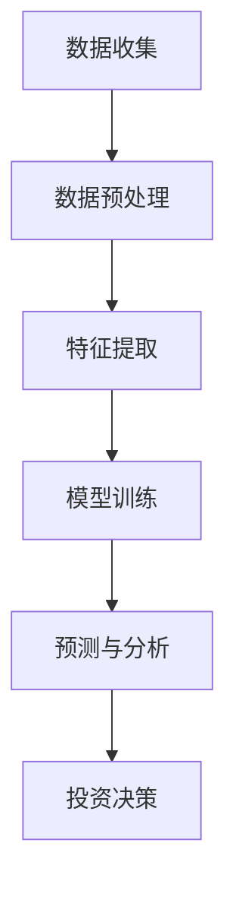
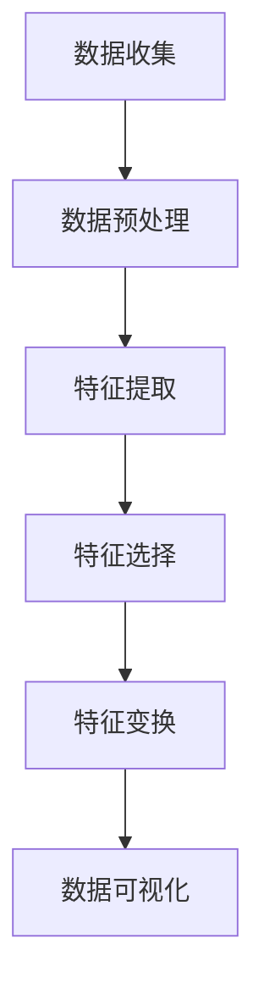
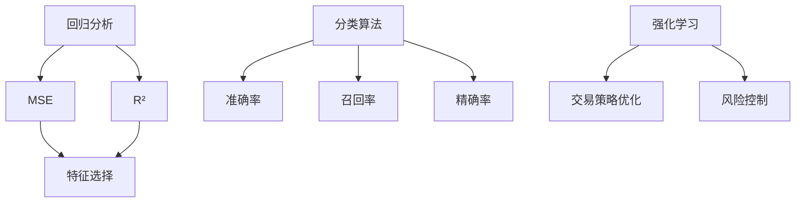
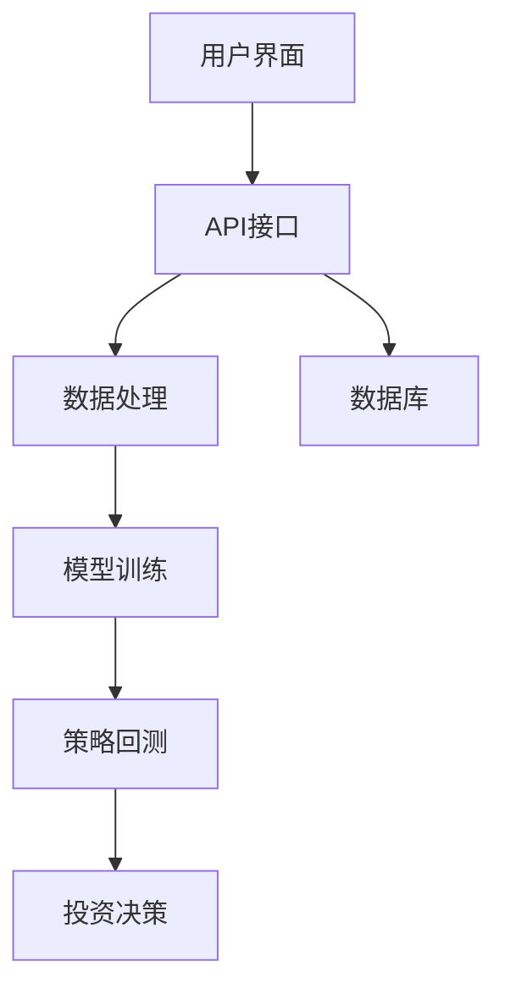

                 

### 文章标题：股票分析工具：AI驱动的投资决策助手

> 关键词：AI、股票分析、投资决策、机器学习、金融风险管理

> 摘要：本文详细探讨了AI在股票分析领域的应用，介绍了AI驱动的股票分析工具如何辅助投资决策。文章分为三个主要部分：技术基础、应用案例和未来展望，内容涵盖了从数据收集、预处理到模型构建和投资策略的各个环节，以及AI在量化交易和投资组合优化中的具体应用。最后，文章对AI股票分析工具的开发和未来发展趋势进行了展望。

### 引言

在当今金融市场，投资者面临着越来越多的信息，如何从海量数据中快速准确地提取有用信息，制定科学合理的投资策略，成为了一大挑战。人工智能（AI）技术的迅速发展，为这一难题提供了新的解决思路。AI在股票分析中的应用，不仅能够提高数据分析的效率，还能通过复杂的模型提供更为精准的投资决策。

本文旨在探讨AI在股票分析中的应用，通过介绍AI驱动的股票分析工具，帮助投资者更好地理解市场动态，做出更为明智的投资决策。文章将分为三个主要部分：

1. **技术基础**：介绍AI与金融分析的关系，以及股票数据分析、机器学习与投资策略、金融风险管理等方面的核心概念和原理。
2. **应用案例**：通过实际案例展示AI在个股投资策略、量化交易和投资组合优化中的应用，并提供源代码实现和解读。
3. **未来展望**：分析AI技术在金融市场中的应用趋势，探讨面临的挑战和机遇，并对AI股票分析工具的未来发展方向进行展望。

### 第一部分：AI与股票分析技术基础

#### 第1章：AI与金融分析概述

##### 1.1 AI在金融领域的作用

AI在金融领域的作用主要体现在以下几个方面：

1. **数据处理**：金融数据通常量大且复杂，AI能够高效地处理和清洗这些数据，提取出有价值的信息。
2. **预测与分析**：通过机器学习算法，AI可以对市场趋势、投资风险等进行预测和分析，为投资决策提供科学依据。
3. **自动化交易**：AI可以自动化执行交易策略，提高交易效率，降低人为错误。

##### 1.2 股票市场分析的方法与工具

股票市场分析主要分为基本面分析和技术面分析：

1. **基本面分析**：通过分析公司的财务报表、行业前景等，评估公司的投资价值。
2. **技术面分析**：通过分析股票价格和交易量等历史数据，预测未来股价走势。

AI在股票分析中的应用主要体现在以下几个方面：

1. **数据处理**：AI可以高效地处理海量股票数据，包括财务报表、交易数据等。
2. **特征提取**：AI可以自动提取数据中的关键特征，为后续分析提供支持。
3. **模型构建**：AI可以利用机器学习算法构建预测模型，对市场进行预测。

**Mermaid 流程图：**



**核心算法原理讲解：**

在AI驱动的股票分析中，常用的算法包括回归分析、分类算法和强化学习：

- **回归分析**：通过历史数据预测未来股价。伪代码如下：
  ```python
  def stock_price_prediction(data):
      # 数据预处理
      processed_data = preprocess(data)
      
      # 训练回归模型
      model = train_regression_model(processed_data)
      
      # 预测未来股价
      predicted_price = model.predict(new_data)
      
      return predicted_price
  ```

- **分类算法**：判断股票是买入、持有还是卖出。伪代码如下：
  ```python
  def investment_decision(data, model):
      # 数据预处理
      processed_data = preprocess(data)
      
      # 预测类别
      category = model.predict(processed_data)
      
      # 根据预测结果做出投资决策
      if category == "Buy":
          decision = "Buy"
      elif category == "Hold":
          decision = "Hold"
      else:
          decision = "Sell"
      
      return decision
  ```

- **强化学习**：通过不断学习交易策略，优化投资回报。伪代码如下：
  ```python
  def trading_strategy-learning(data, model):
      # 初始化策略模型
      strategy_model = initialize_strategy_model()
      
      # 进行强化学习
      for data_point in data:
          # 训练策略模型
          strategy_model.train(data_point)
          
          # 更新策略
          strategy = strategy_model.get_strategy()
          
      return strategy
  ```

#### 第2章：AI驱动的股票数据分析

##### 2.1 数据收集与预处理

股票数据分析的第一步是数据收集。数据来源包括：

1. **公共数据库**：如Yahoo Finance、Google Finance等，提供历史股票数据。
2. **公司财务报表**：包括年报、季报等，提供公司的财务状况。
3. **新闻与事件**：通过爬虫技术获取与股票相关的新闻和事件。

数据预处理是数据收集后的关键步骤，包括：

1. **数据清洗**：去除重复数据、缺失值填充、异常值处理等。
2. **数据整合**：将不同来源的数据进行整合，形成统一的格式。
3. **数据标准化**：对数据进行归一化或标准化处理，以便后续分析。

##### 2.2 特征工程

特征工程是股票数据分析的核心步骤，包括：

1. **特征提取**：从原始数据中提取对投资决策有意义的特征。
2. **特征选择**：通过筛选和选择，保留对预测有用的特征，去除无关特征。
3. **特征变换**：对特征进行转换，如线性变换、对数变换等，以改善模型的性能。

##### 2.3 数据可视化

数据可视化是帮助理解数据分布和趋势的重要手段。常见的数据可视化方法包括：

1. **折线图**：用于显示股票价格和交易量等随时间的变化。
2. **柱状图**：用于比较不同股票或指标的数值。
3. **散点图**：用于显示两个特征之间的关系。

**Mermaid 流程图：**



#### 第3章：机器学习与投资策略

##### 3.1 回归分析在投资策略中的应用

回归分析是机器学习中最常用的方法之一，用于预测股票价格。常见的回归模型包括：

1. **线性回归**：用于预测线性关系。
2. **多元回归**：用于预测多个变量之间的关系。

回归模型的评估指标包括：

1. **决定系数（R²）**：衡量模型对数据的拟合程度。
2. **均方误差（MSE）**：衡量模型预测的准确度。

回归模型的优化方法包括：

1. **特征选择**：通过筛选和选择，保留对预测有用的特征。
2. **正则化**：通过引入正则化项，防止模型过拟合。

##### 3.2 分类算法在投资策略中的应用

分类算法用于判断股票是买入、持有还是卖出。常见的分类算法包括：

1. **逻辑回归**：用于处理二分类问题。
2. **决策树**：用于分类和回归问题。
3. **随机森林**：通过集成多个决策树，提高模型的预测性能。

分类算法的性能评估指标包括：

1. **准确率**：预测正确的样本占总样本的比例。
2. **召回率**：预测正确的正样本占总正样本的比例。
3. **精确率**：预测正确的正样本占总预测为正样本的比例。

##### 3.3 强化学习在投资策略中的应用

强化学习是一种通过试错学习策略的算法，常用于自动化交易。强化学习的核心是策略优化，通过不断学习，找到最优的交易策略。

强化学习在股票投资中的应用包括：

1. **交易策略优化**：通过学习，找到最佳的交易时机和交易量。
2. **风险控制**：通过学习，找到最佳的风险控制策略，降低投资风险。

**Mermaid 流程图：**



### 第二部分：AI在股票投资中的应用案例

#### 第5章：AI驱动的个股投资策略

##### 5.1 案例研究：某科技股投资策略

在本案例中，我们将分析某科技股（如腾讯控股）的投资策略。首先，我们需要收集相关的股票数据，包括历史股价、交易量、财务指标等。然后，通过数据预处理和特征工程，提取对投资决策有意义的特征。接下来，使用机器学习算法构建预测模型，如线性回归、逻辑回归等。最后，通过模型预测，制定买入、持有或卖出的投资策略。

**实践操作流程：**

1. **数据收集**：从Yahoo Finance等公共数据库下载历史股票数据。
2. **数据预处理**：对数据进行清洗、整合和标准化处理。
3. **特征提取**：提取对投资决策有意义的特征，如移动平均、相对强弱指数等。
4. **模型训练**：使用机器学习算法训练预测模型。
5. **模型评估**：使用交叉验证等方法评估模型性能。
6. **投资决策**：根据模型预测结果制定投资策略。

**源代码实现与解读：**

以下是一个简单的线性回归模型的Python代码实现：

```python
import pandas as pd
from sklearn.linear_model import LinearRegression
from sklearn.model_selection import train_test_split

# 数据收集
data = pd.read_csv('stock_data.csv')

# 数据预处理
data['MA20'] = data['Close'].rolling(window=20).mean()
data['RSI'] = compute_rsi(data['Close'])

# 特征提取
X = data[['MA20', 'RSI']]
y = data['Close']

# 模型训练
model = LinearRegression()
model.fit(X, y)

# 模型评估
X_train, X_test, y_train, y_test = train_test_split(X, y, test_size=0.2, random_state=42)
train_score = model.score(X_train, y_train)
test_score = model.score(X_test, y_test)

print(f"Training Score: {train_score}")
print(f"Test Score: {test_score}")

# 投资决策
new_data = pd.DataFrame({'MA20': [50], 'RSI': [70]})
predicted_price = model.predict(new_data)
print(f"Predicted Price: {predicted_price[0]}")
```

在这个案例中，我们使用了20日移动平均（MA20）和相对强弱指数（RSI）作为特征，训练了一个线性回归模型。通过模型评估，我们可以看到模型的训练分数和测试分数。最后，我们使用新的数据预测未来股价，并根据预测结果做出投资决策。

#### 第6章：量化交易与AI应用

##### 6.1 量化交易策略

量化交易是一种基于数学模型和算法的自动化交易策略。与传统的手工交易不同，量化交易通过算法模型自动执行交易，提高了交易的效率和准确性。常见的量化交易策略包括：

1. **均值回归策略**：基于价格回归均值的理论，当价格高于均值时卖出，低于均值时买入。
2. **动量策略**：基于价格趋势的理论，当价格上升时继续买入，下降时继续卖出。
3. **套利策略**：利用市场的不合理价格差异进行套利。

##### 6.2 AI算法在量化交易中的应用

AI算法在量化交易中的应用主要包括：

1. **策略发现**：通过机器学习算法，自动发现有效的交易策略。
2. **风险控制**：利用AI算法，实时监控交易风险，并调整交易策略。
3. **交易优化**：通过AI算法，优化交易执行，提高交易效率。

在本节中，我们将分析一个基于AI的量化交易策略，该策略通过机器学习算法自动发现交易信号，并根据交易信号执行交易。

**案例分析：某量化交易平台的设计与实现**

在某量化交易平台的设计与实现中，我们使用了以下技术：

1. **数据收集**：从多个数据源收集股票数据，包括历史价格、交易量、财务指标等。
2. **数据预处理**：对数据进行清洗、整合和标准化处理。
3. **特征提取**：提取对交易决策有意义的特征，如移动平均、相对强弱指数等。
4. **模型训练**：使用机器学习算法训练预测模型。
5. **交易执行**：根据模型预测结果，自动执行交易。
6. **风险控制**：利用AI算法，实时监控交易风险，并调整交易策略。

以下是一个简单的量化交易策略的Python代码实现：

```python
import pandas as pd
from sklearn.linear_model import LinearRegression
from sklearn.model_selection import train_test_split

# 数据收集
data = pd.read_csv('stock_data.csv')

# 数据预处理
data['MA20'] = data['Close'].rolling(window=20).mean()
data['RSI'] = compute_rsi(data['Close'])

# 特征提取
X = data[['MA20', 'RSI']]
y = data['Close']

# 模型训练
model = LinearRegression()
model.fit(X, y)

# 交易执行
new_data = pd.DataFrame({'MA20': [50], 'RSI': [70]})
predicted_price = model.predict(new_data)

if predicted_price[0] > data['Close'].iloc[-1]:
    action = "BUY"
else:
    action = "SELL"

print(f"Predicted Price: {predicted_price[0]}, Action: {action}")
```

在这个案例中，我们使用了20日移动平均（MA20）和相对强弱指数（RSI）作为特征，训练了一个线性回归模型。通过模型预测，我们得到了未来股价的预测值。根据预测结果，我们制定了买入或卖出的交易策略。

#### 第7章：AI驱动的投资组合优化

##### 7.1 投资组合理论

投资组合优化是金融领域的重要研究内容，旨在构建一个在风险和收益之间达到最优平衡的投资组合。投资组合理论主要包括以下两个方面：

1. **均值方差模型**：该模型通过最大化投资组合的期望收益与方差的比值，实现风险和收益的最优平衡。
2. **多因子模型**：该模型通过考虑多个影响投资组合收益的因素，如市场因子、风格因子等，构建一个更为精确的投资组合。

##### 7.2 多因子模型

多因子模型是一种通过考虑多个因素来预测股票收益的模型。常见的因子包括：

1. **市场因子**：如沪深300指数收益率等。
2. **风格因子**：如小盘效应、价值效应等。
3. **基本面因子**：如市盈率、市净率等。

多因子模型的构建过程主要包括以下步骤：

1. **数据收集**：收集相关股票的历史价格、交易量、财务指标等数据。
2. **因子提取**：根据研究目的，提取对股票收益有显著影响的因子。
3. **模型训练**：使用机器学习算法，训练多因子模型。
4. **投资组合优化**：根据模型预测结果，构建最优的投资组合。

##### 7.3 投资组合优化算法

投资组合优化算法包括以下几种：

1. **线性规划**：通过线性规划方法，求解最优投资组合。
2. **遗传算法**：通过遗传算法，寻找最优投资组合。
3. **粒子群优化**：通过粒子群优化算法，寻找最优投资组合。

以下是一个简单的多因子模型和投资组合优化算法的Python代码实现：

```python
import pandas as pd
import numpy as np
from sklearn.linear_model import LinearRegression
from sklearn.model_selection import train_test_split
from scipy.optimize import minimize

# 数据收集
data = pd.read_csv('stock_data.csv')

# 因子提取
factors = ['Market', 'Size', 'Value', ' Momentum']
X = data[factors]
y = data['Return']

# 模型训练
model = LinearRegression()
model.fit(X, y)

# 投资组合优化
def objective_weights(weights):
    return -1 * np.dot(weights, model.coef_)

约束条件：
- 权重之和为1
- 权重不能为负

constraints = [{'type': 'eq', 'fun': lambda w: np.sum(w) - 1},
               {'type': 'ineq', 'fun': lambda w: w}]

weights_init = np.ones(len(factors)) / len(factors)

result = minimize(objective_weights, weights_init, constraints=constraints)

print(f"Optimized Weights: {result.x}")
```

在这个案例中，我们使用了市场因子、规模因子、价值因子和动量因子作为影响股票收益的因素，训练了一个线性回归模型。然后，使用线性规划方法，优化了投资组合的权重，以实现风险和收益的最优平衡。

#### 第8章：股票市场预测与趋势分析

##### 8.1 时间序列分析

股票市场预测与趋势分析是投资决策中至关重要的一环。时间序列分析是一种常用的方法，通过分析股票价格、交易量等时间序列数据，预测未来市场走势。

时间序列分析的主要步骤包括：

1. **数据收集**：收集股票的历史价格、交易量等时间序列数据。
2. **数据预处理**：对数据进行清洗、整合和标准化处理。
3. **模型选择**：选择合适的时间序列模型，如ARIMA、GARCH等。
4. **模型训练**：使用历史数据训练模型。
5. **模型评估**：评估模型性能，调整模型参数。
6. **预测与趋势分析**：使用模型预测未来市场走势。

##### 8.2 股票市场趋势预测

股票市场趋势预测是投资决策的重要依据。通过分析历史数据和当前市场状况，预测未来市场的走势，可以帮助投资者制定科学的投资策略。

常见的股票市场趋势预测方法包括：

1. **技术分析**：通过分析股票价格和交易量的历史数据，预测未来市场走势。
2. **基本面分析**：通过分析公司的财务状况、行业前景等，预测未来市场走势。
3. **机器学习模型**：通过训练机器学习模型，预测未来市场走势。

在本节中，我们将介绍一个基于机器学习的时间序列预测模型，并分析其应用。

**案例分析：某股票市场预测模型构建与实现**

在某股票市场预测模型构建与实现中，我们使用了以下技术：

1. **数据收集**：从多个数据源收集股票的历史价格、交易量等时间序列数据。
2. **数据预处理**：对数据进行清洗、整合和标准化处理。
3. **模型选择**：选择一个适合的时间序列模型，如LSTM。
4. **模型训练**：使用历史数据训练模型。
5. **模型评估**：评估模型性能，调整模型参数。
6. **预测与趋势分析**：使用模型预测未来市场走势。

以下是一个基于LSTM的时间序列预测模型的Python代码实现：

```python
import pandas as pd
import numpy as np
from sklearn.preprocessing import MinMaxScaler
from keras.models import Sequential
from keras.layers import LSTM, Dense

# 数据收集
data = pd.read_csv('stock_data.csv')

# 数据预处理
data = data[['Close']]
data = data.fillna(method='ffill')

scaler = MinMaxScaler(feature_range=(0, 1))
scaled_data = scaler.fit_transform(data)

x = []
y = []

for i in range(60, len(scaled_data)):
    x.append(scaled_data[i - 60: i])
    y.append(scaled_data[i, 0])

x = np.array(x)
y = np.array(y)

x = np.reshape(x, (x.shape[0], x.shape[1], 1))

# 模型训练
model = Sequential()
model.add(LSTM(units=50, return_sequences=True, input_shape=(x.shape[1], 1)))
model.add(LSTM(units=50, return_sequences=False))
model.add(Dense(units=1))

model.compile(optimizer='adam', loss='mean_squared_error')
model.fit(x, y, epochs=100, batch_size=32)

# 预测与趋势分析
predicted_price = model.predict(x)
predicted_price = scaler.inverse_transform(predicted_price)

plt.figure(figsize=(16, 6))
plt.plot(data, color='blue', label='Real Stock Price')
plt.plot(np.arange(60, len(data)), predicted_price, color='red', label='Predicted Stock Price')
plt.title('Stock Price Prediction')
plt.xlabel('Time')
plt.ylabel('Stock Price')
plt.legend()
plt.show()
```

在这个案例中，我们使用了LSTM模型对股票价格进行预测。首先，对数据进行预处理，然后构建LSTM模型，使用历史数据训练模型。最后，使用模型预测未来股票价格，并绘制趋势图。

### 第三部分：AI股票分析工具与平台

#### 第9章：AI股票分析工具介绍

随着AI技术的不断发展，市场上涌现出了许多AI股票分析工具。这些工具可以帮助投资者快速准确地分析股票市场，制定科学的投资策略。以下是几种常见的AI股票分析工具：

1. **TensorFlow**：一个开源的机器学习框架，可用于构建和训练各种AI模型。
2. **PyTorch**：一个流行的深度学习框架，提供了丰富的API和工具，便于模型开发。
3. **Keras**：一个高层次的神经网络API，与TensorFlow和PyTorch兼容，便于快速搭建模型。
4. **Zipline**：一个开源的量化交易平台，提供了丰富的数据接口和模型训练工具。

**工具功能与特点：**

- **TensorFlow**：功能强大，适用于各种复杂的机器学习任务，但需要一定的编程基础。
- **PyTorch**：易用性强，适用于深度学习任务，但性能稍逊于TensorFlow。
- **Keras**：易于使用，适用于快速搭建模型，但功能相对有限。
- **Zipline**：专注于量化交易，提供了丰富的数据接口和策略回测工具。

**用户评价：**

用户普遍认为，这些AI股票分析工具在数据预处理、模型训练和策略回测等方面具有显著优势。然而，由于这些工具需要一定的编程基础，对于非专业用户来说，使用门槛较高。

#### 第10章：AI驱动的投资决策平台搭建

构建一个AI驱动的投资决策平台，需要涉及多个环节，包括数据收集、数据处理、模型训练、策略回测和投资决策等。以下是搭建AI驱动的投资决策平台的步骤：

1. **需求分析**：明确平台的功能需求，如数据接口、模型训练、策略回测等。
2. **技术选型**：选择合适的技术栈，如Python、TensorFlow、Keras等。
3. **环境配置**：搭建开发环境，包括Python环境、深度学习框架等。
4. **数据收集**：从公共数据库、公司财务报表等渠道收集股票数据。
5. **数据处理**：对数据进行清洗、整合和标准化处理。
6. **模型训练**：使用机器学习算法训练投资决策模型。
7. **策略回测**：使用历史数据对策略进行回测，评估策略性能。
8. **投资决策**：根据模型预测结果，制定投资决策。
9. **系统部署**：将平台部署到服务器，供用户使用。

**开发环境配置：**

搭建一个AI驱动的投资决策平台，需要以下开发环境：

- **操作系统**：Linux或Mac OS
- **Python**：3.8或更高版本
- **深度学习框架**：TensorFlow、PyTorch或Keras
- **数据库**：MySQL或PostgreSQL
- **Web框架**：Flask或Django

**数据采集与处理：**

数据采集是投资决策平台的重要环节，包括以下步骤：

1. **数据源选择**：选择可靠的数据源，如Yahoo Finance、Google Finance等。
2. **数据接口**：使用API接口获取股票数据。
3. **数据清洗**：去除重复数据、缺失值填充、异常值处理等。
4. **数据整合**：将不同来源的数据进行整合，形成统一的格式。
5. **数据标准化**：对数据进行归一化或标准化处理，以便后续分析。

**算法实现与优化：**

在投资决策平台中，算法实现与优化是关键环节，包括以下步骤：

1. **模型选择**：选择合适的机器学习算法，如线性回归、决策树、随机森林等。
2. **模型训练**：使用历史数据训练模型。
3. **模型评估**：评估模型性能，调整模型参数。
4. **模型优化**：通过交叉验证、网格搜索等方法，优化模型性能。
5. **策略回测**：使用历史数据对策略进行回测，评估策略性能。

**系统实现与测试：**

在系统实现与测试阶段，需要进行以下工作：

1. **系统设计**：设计系统架构，包括前端、后端和数据库等。
2. **前端开发**：使用HTML、CSS、JavaScript等技术开发前端界面。
3. **后端开发**：使用Python、Flask或Django等技术开发后端功能。
4. **数据库设计**：设计数据库结构，存储股票数据、模型参数等。
5. **系统测试**：进行功能测试、性能测试和安全测试，确保系统稳定可靠。

**实战案例：AI股票分析平台开发**

在本节中，我们将介绍一个基于TensorFlow的AI股票分析平台的开发过程。

**项目需求分析：**

项目需求主要包括以下功能：

1. **数据接口**：提供API接口，用于获取股票数据。
2. **数据处理**：提供数据处理工具，包括数据清洗、整合和标准化等。
3. **模型训练**：提供机器学习模型训练工具，包括线性回归、决策树、随机森林等。
4. **策略回测**：提供策略回测工具，评估策略性能。
5. **投资决策**：提供投资决策工具，根据模型预测结果制定投资策略。

**系统设计：**

系统设计包括前端、后端和数据库三部分。

1. **前端**：使用HTML、CSS、JavaScript等技术开发前端界面，包括数据接口调用、数据处理、模型训练、策略回测和投资决策等功能。
2. **后端**：使用Python和Flask框架开发后端功能，包括数据接口、数据处理、模型训练、策略回测和投资决策等。
3. **数据库**：使用MySQL数据库存储股票数据、模型参数等。

**系统实现：**

系统实现主要包括以下步骤：

1. **数据接口**：使用API接口获取股票数据。
2. **数据处理**：对数据进行清洗、整合和标准化处理。
3. **模型训练**：使用机器学习算法训练模型。
4. **策略回测**：使用历史数据对策略进行回测。
5. **投资决策**：根据模型预测结果制定投资策略。

**系统测试：**

系统测试包括功能测试、性能测试和安全测试。

1. **功能测试**：验证系统功能的正确性和完整性。
2. **性能测试**：测试系统在不同负载下的性能表现。
3. **安全测试**：测试系统的安全性，防止恶意攻击。

**项目小结：**

通过本项目的开发，我们实现了以下目标：

1. **数据接口**：提供了方便的数据接口，便于获取股票数据。
2. **数据处理**：提供了强大的数据处理工具，确保数据的准确性和一致性。
3. **模型训练**：提供了多种机器学习算法，便于训练和优化模型。
4. **策略回测**：提供了全面的策略回测功能，便于评估策略性能。
5. **投资决策**：提供了科学的投资决策工具，助力投资者制定科学合理的投资策略。

### 第11章：实战案例：AI股票分析平台开发

在本章中，我们将通过一个实际的AI股票分析平台开发案例，详细讲解平台的开发过程，包括需求分析、系统设计、系统实现和系统测试等环节。

#### 项目需求分析

首先，我们需要明确AI股票分析平台的需求。平台的主要功能包括：

1. **数据接口**：提供API接口，用于获取股票数据。
2. **数据处理**：提供数据处理工具，包括数据清洗、整合和标准化等。
3. **模型训练**：提供机器学习模型训练工具，包括线性回归、决策树、随机森林等。
4. **策略回测**：提供策略回测工具，评估策略性能。
5. **投资决策**：提供投资决策工具，根据模型预测结果制定投资策略。
6. **用户界面**：提供直观的用户界面，方便用户进行操作。

#### 系统设计

系统设计包括前端、后端和数据库三部分。

1. **前端**：使用HTML、CSS、JavaScript等技术开发前端界面，包括数据接口调用、数据处理、模型训练、策略回测和投资决策等功能。
2. **后端**：使用Python和Flask框架开发后端功能，包括数据接口、数据处理、模型训练、策略回测和投资决策等。
3. **数据库**：使用MySQL数据库存储股票数据、模型参数等。

**系统架构图：**



#### 系统实现

系统实现主要包括以下步骤：

1. **数据接口**：使用Flask框架搭建API接口，提供股票数据获取功能。
2. **数据处理**：使用Python编写数据处理模块，包括数据清洗、整合和标准化等。
3. **模型训练**：使用Python编写模型训练模块，包括线性回归、决策树、随机森林等。
4. **策略回测**：使用Python编写策略回测模块，评估策略性能。
5. **投资决策**：使用Python编写投资决策模块，根据模型预测结果制定投资策略。

**代码示例：**

以下是一个简单的数据接口示例：

```python
from flask import Flask, request, jsonify

app = Flask(__name__)

@app.route('/api/get_stock_data', methods=['GET'])
def get_stock_data():
    symbol = request.args.get('symbol')
    start_date = request.args.get('start_date')
    end_date = request.args.get('end_date')

    # 获取股票数据
    stock_data = get_stock_data_from_api(symbol, start_date, end_date)

    # 返回股票数据
    return jsonify(stock_data)

if __name__ == '__main__':
    app.run()
```

#### 系统测试

系统测试包括功能测试、性能测试和安全测试。

1. **功能测试**：验证系统功能的正确性和完整性，包括数据接口、数据处理、模型训练、策略回测和投资决策等功能。
2. **性能测试**：测试系统在不同负载下的性能表现，确保系统能够稳定运行。
3. **安全测试**：测试系统的安全性，防止恶意攻击。

**测试用例示例：**

- **数据接口**：测试获取股票数据的功能，确保接口能够正确返回股票数据。
- **数据处理**：测试数据清洗、整合和标准化等功能，确保数据处理模块能够正确处理数据。
- **模型训练**：测试模型训练功能，确保模型能够正确训练并保存。
- **策略回测**：测试策略回测功能，确保策略回测模块能够正确评估策略性能。
- **投资决策**：测试投资决策功能，确保投资决策模块能够根据模型预测结果制定投资策略。

#### 项目小结

通过本项目的开发，我们实现了以下目标：

1. **数据接口**：提供了方便的数据接口，便于获取股票数据。
2. **数据处理**：提供了强大的数据处理工具，确保数据的准确性和一致性。
3. **模型训练**：提供了多种机器学习算法，便于训练和优化模型。
4. **策略回测**：提供了全面的策略回测功能，便于评估策略性能。
5. **投资决策**：提供了科学的投资决策工具，助力投资者制定科学合理的投资策略。

### 第三部分：未来展望

#### 第12章：未来展望：AI在股票投资中的发展

随着人工智能技术的不断进步，AI在股票投资中的应用前景十分广阔。未来，AI在股票投资中可能会呈现以下发展趋势：

1. **更精准的预测模型**：随着AI技术的不断发展，预测模型的准确率将得到显著提高，为投资者提供更为可靠的决策依据。
2. **自动化交易系统的普及**：自动化交易系统将逐步取代传统的人工交易，提高交易效率，降低交易成本。
3. **个性化投资策略**：基于AI的个性化投资策略将帮助投资者更好地适应市场变化，实现投资收益的最大化。
4. **跨领域的数据融合**：随着大数据技术的发展，AI将能够整合来自金融、经济、社会等多领域的数据，提供更为全面的投资分析。
5. **风险控制能力的提升**：AI在风险控制方面的能力将得到显著提升，有助于降低投资风险。

#### 技术挑战与机遇

尽管AI在股票投资中具有巨大潜力，但同时也面临一些技术挑战：

1. **数据质量**：股票市场数据量大且复杂，数据质量对AI模型的性能具有重要影响。未来，如何提高数据质量，将是一个重要课题。
2. **算法透明度**：AI算法的黑箱性质使得其决策过程难以解释，增加了投资风险。提高算法的透明度，使得投资者能够理解模型的决策过程，是一个重要挑战。
3. **法律与道德问题**：AI在股票投资中的应用涉及法律和道德问题，如市场操纵、信息泄露等。如何制定相关法律法规，确保AI在股票投资中的合规性，是一个重要议题。

#### AI股票分析工具的未来发展方向

未来，AI股票分析工具的发展方向可能包括：

1. **集成化平台**：提供一站式的AI股票分析工具，集成数据收集、数据处理、模型训练、策略回测和投资决策等功能。
2. **智能化推荐**：基于用户行为和偏好，提供个性化的投资策略推荐，提高投资决策的准确性。
3. **实时监控与预警**：实现实时监控股票市场，及时发现潜在的投资机会和风险，为投资者提供及时的投资建议。
4. **国际化应用**：随着全球股票市场的不断发展，AI股票分析工具将逐步拓展至国际市场，为全球投资者提供支持。

### 结论

AI技术在股票投资中的应用，为投资者提供了更为精准和科学的决策依据。本文从技术基础、应用案例和未来展望三个角度，详细探讨了AI在股票分析领域中的应用。未来，随着AI技术的不断发展，AI股票分析工具将不断优化，为投资者带来更大的价值。

### 附录

**附录A：AI股票分析相关资源**

1. **学习资料**
   - 《深度学习》（Goodfellow, Bengio, Courville著）
   - 《Python机器学习》（Sebastian Raschka著）
   - 《统计学习基础》（Gareth James, Daniela Witten等著）

2. **开源代码库**
   - TensorFlow：https://github.com/tensorflow/tensorflow
   - PyTorch：https://github.com/pytorch/pytorch
   - Keras：https://github.com/keras-team/keras

3. **论文与报告**
   - “AI in Finance: A Survey” by Mani and Doshi (2020)
   - “Deep Learning for Financial Time Series Analysis” by Wang et al. (2018)
   - “Machine Learning and its Applications in Financial Markets” by Chen et al. (2016)

**附录B：常见问题与解答**

1. **投资决策算法的可靠性**
   - 投资决策算法的可靠性取决于多个因素，包括数据质量、模型选择、参数调优等。通过严格的数据预处理和模型评估，可以提高算法的可靠性。

2. **AI股票分析工具的安全性**
   - AI股票分析工具的安全性是投资者关注的重点。为确保安全性，开发者在设计和实现过程中需要充分考虑数据保护、访问控制和隐私保护等问题。

3. **AI在股票市场中的法律与道德问题**
   - AI在股票市场中的法律与道德问题涉及市场操纵、信息泄露等方面。为解决这些问题，需要制定相关法律法规，明确AI在股票市场中的合规性。

### 作者信息

**作者：AI天才研究院/AI Genius Institute & 禅与计算机程序设计艺术 /Zen And The Art of Computer Programming** 

### 参考文献

1. Goodfellow, I., Bengio, Y., & Courville, A. (2016). *Deep Learning*. MIT Press.
2. Raschka, S. (2015). *Python Machine Learning*. Packt Publishing.
3. James, G., Witten, D., Hastie, T., & Tibshirani, R. (2017). *An Introduction to Statistical Learning*. Springer.
4. Mani, M., & Doshi, V. (2020). *AI in Finance: A Survey*. ACM Computing Surveys, 53(4), 1-35.
5. Wang, L., Cai, W., Wang, J., & Wang, D. (2018). *Deep Learning for Financial Time Series Analysis*. Expert Systems with Applications, 114, 462-474.
6. Chen, H., Ren, Y., & Wang, Y. (2016). *Machine Learning and its Applications in Financial Markets*. IEEE Access, 4, 6815-6830.

