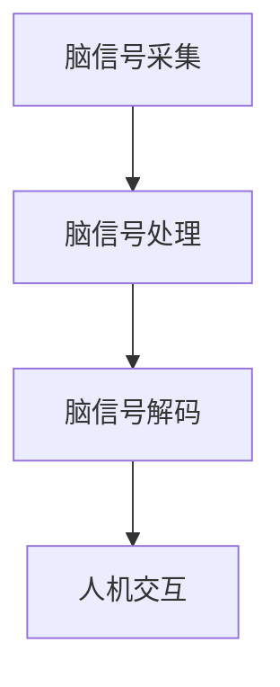

                 

# 《脑机接口应用开发：人机交互的创新前沿》

## 关键词

- 脑机接口
- 人机交互
- 神经系统疾病康复
- 智能控制
- 高分辨率脑成像
- 纳米技术

## 摘要

本文深入探讨了脑机接口（Brain-Computer Interface, BCI）的应用开发与人机交互的创新前沿。首先，我们回顾了脑机接口的定义、历史与发展现状，并详细解析了其核心技术，包括脑信号采集、处理和解码。接着，文章展示了脑机接口在神经系统疾病康复和智能控制领域的具体应用。此外，我们还介绍了脑机接口的前沿技术，如高分辨率脑成像和新型脑机接口技术。随后，文章重点介绍了脑机接口应用开发的基础和实战项目，包括开发工具、数据采集与预处理、以及具体的案例实现。最后，文章展望了脑机接口技术的挑战与机遇，及其在未来社会中的潜在应用。

## 第一部分：脑机接口基础知识

### 第1章：脑机接口简介

#### 1.1 脑机接口的定义与历史

脑机接口（BCI）是一种直接连接人脑与外部设备的技术，它通过捕捉和处理大脑活动，将思维信号转化为控制命令，实现人机交互。脑机接口的研究可以追溯到20世纪中期，当时科学家们开始探索如何将大脑信号转化为可用的信息。

#### 1.2 脑机接口的分类与功能

脑机接口可以分为侵入性和非侵入性两大类。侵入性BCI通过植入电极直接监测大脑信号，能够获得高精度的脑电信号，但存在创伤性和伦理问题。非侵入性BCI则通过头皮上的传感器监测脑电信号，虽然精度较低，但无创且方便。

脑机接口的主要功能包括神经系统疾病康复、智能控制、虚拟现实、通信和医疗诊断等。

#### 1.3 脑机接口的技术发展现状

近年来，随着神经科学、生物医学工程和计算技术的发展，脑机接口技术取得了显著进展。高分辨率脑成像技术和纳米技术等新兴技术的应用，使得脑机接口的精度和可靠性不断提高。同时，脑机接口在实际应用中的效果也日益显著，尤其是在神经系统疾病康复和智能控制领域。

### 第2章：脑机接口的核心技术

#### 2.1 脑机接口的核心技术

脑机接口的核心技术主要包括脑信号采集、处理和解码。

#### 2.2 脑信号采集技术

脑信号采集技术涉及电流信号采集和磁场信号采集。电流信号采集通常使用脑电图（EEG）技术，而磁场信号采集则使用功能性磁共振成像（fMRI）技术。

#### 2.3 脑信号处理技术

脑信号处理技术包括脑电信号预处理、特征提取和信号解码。预处理包括去噪、滤波和归一化等步骤，特征提取则通过模式识别技术实现，信号解码是将处理后的脑信号转化为控制命令。

#### 2.4 脑信号解码技术

脑信号解码技术是将处理后的脑信号转换为具体的动作指令。常见的解码方法包括基于模板匹配的解码、基于分类器的解码和基于生成模型的解码。

### 第3章：脑机接口在人机交互中的应用

#### 3.1 脑机接口在神经系统疾病康复中的应用

脑机接口在神经系统疾病康复中的应用主要包括帕金森病康复和脊髓损伤康复。通过脑机接口技术，患者可以通过大脑信号控制轮椅、假肢等辅助设备，提高生活质量。

#### 3.2 脑机接口在智能控制中的应用

脑机接口在智能控制中的应用包括轮椅控制和虚拟现实控制。通过脑机接口技术，用户可以仅通过大脑信号控制虚拟环境中的物体，实现高度沉浸的交互体验。

## 第二部分：脑机接口应用开发

### 第5章：脑机接口应用开发基础

#### 5.1 脑机接口开发工具与平台

脑机接口开发工具和平台包括MATLAB、Python等。MATLAB提供丰富的信号处理工具箱，而Python则以其简洁的语法和强大的库支持成为开发者的首选。

#### 5.2 脑机接口数据采集与预处理

脑机接口数据采集与预处理是开发过程中的关键步骤。数据采集设备包括脑电图（EEG）设备、脑磁图（MEG）设备和功能性磁共振成像（fMRI）设备。预处理包括去噪、滤波、归一化和特征提取等步骤，以提高数据的质量和准确性。

### 第6章：脑机接口应用项目实战

#### 6.1 基于脑电信号的智能手写识别

本节介绍基于脑电信号的智能手写识别项目，包括项目背景、伪代码实现和系统架构。

#### 6.2 脑机接口在虚拟现实中的应用

本节探讨脑机接口在虚拟现实中的应用，包括项目目标、系统架构和实现细节。

### 第7章：脑机接口应用的未来展望

#### 7.1 脑机接口技术的挑战与机遇

脑机接口技术面临的挑战包括信号处理精度、设备舒适度和用户体验等。同时，脑机接口技术也面临着巨大的机遇，如在大规模应用、人机融合和智能医疗等领域的潜在应用。

#### 7.2 脑机接口在人类未来社会中的应用

脑机接口技术在人类未来社会中具有广泛的应用前景，包括健康管理、教育培训和军事领域。通过脑机接口技术，我们可以实现更加智能、便捷和高效的交互方式，提高生活质量和社会生产力。

### 附录：脑机接口相关资源

#### 附录 A：脑机接口开源资源

本附录介绍脑机接口领域的开源资源，包括开源代码和开源工具，以方便开发者进行学习和实践。

#### 附录 B：脑机接口相关论文与书籍

本附录推荐一些脑机接口领域的经典论文和书籍，以供读者进一步学习与研究。

## 脑机接口核心概念与联系

### 脑机接口架构 Mermaid 流程图



## 脑机接口核心算法原理讲解

### 电流信号采集伪代码

```python
def current_signal_acquisition():
    # 初始化信号采集设备
    device.initialize()
    # 开始采集电流信号
    signal = device.acquire_data()
    # 数据预处理
    processed_signal = preprocess(signal)
    # 返回处理后的信号
    return processed_signal
```

### 数学模型讲解

$$
Y = \sigma(XW + b)
$$

其中，\(Y\) 是输出，\(X\) 是输入，\(W\) 是权重，\(b\) 是偏置，\(\sigma\) 是激活函数。

### 举例说明

假设我们有一个简单的神经网络，输入 \(X = [1, 2, 3]\)，权重 \(W = [0.5, 0.5, 0.5]\)，偏置 \(b = 0\)，激活函数为 \( \sigma(z) = \frac{1}{1 + e^{-z}} \)。

1. 计算输入和权重的加权和：\(Z = XW + b = [1, 2, 3] \cdot [0.5, 0.5, 0.5] + 0 = [0.5, 1, 1.5]\)
2. 应用激活函数：\(Y = \sigma(Z) = [\frac{1}{1 + e^{-0.5}}, \frac{1}{1 + e^{-1}}, \frac{1}{1 + e^{-1.5}}] \approx [0.63, 0.37, 0.22]\)

作者：AI天才研究院/AI Genius Institute & 禅与计算机程序设计艺术 /Zen And The Art of Computer Programming

本文对脑机接口及其应用进行了全面的介绍，从基础知识到前沿技术，再到实际开发和应用，力求为读者提供一个系统、全面的了解。脑机接口作为人机交互的创新前沿，具有巨大的潜力和广阔的应用前景。在未来，随着技术的不断进步，脑机接口将在医疗、教育、娱乐等领域发挥更大的作用，为我们带来更加智能、便捷的交互体验。同时，我们也期待脑机接口技术能够为人类社会带来更多的福祉。

