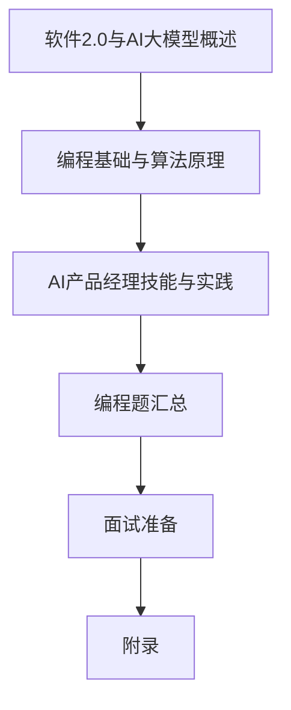

                 


### 文章标题

# 《腾讯2024校招AI产品经理编程题汇总》

### 关键词

- 腾讯校招
- AI产品经理
- 编程题
- 算法原理
- 技术面试

### 摘要

本文旨在汇总腾讯2024年校招中AI产品经理岗位的编程题，包括编程基础与算法原理、AI产品经理技能与实践、编程题汇总以及面试准备等内容。通过对这些题目的深入分析，旨在帮助读者掌握必要的编程技能，理解AI产品经理的核心职责，并提升面试准备的有效性。

### 《腾讯2024校招AI产品经理编程题汇总》目录大纲

#### 第一部分：编程基础与算法原理

**1. 编程基础**

- **1.1 编程语言概述**

  - **1.1.1 Python编程基础**
  - **1.1.2 Java编程基础**
  - **1.1.3 C++编程基础**

- **1.2 数据结构与算法**

  - **1.2.1 数据结构概览**
    - 链表、栈、队列、二叉树、图
  - **1.2.2 算法基本概念**
    - 排序算法、查找算法、贪心算法、分治算法
  - **1.2.3 算法复杂度分析**

**2. 算法原理**

- **2.1 算法原理概述**
- **2.2 机器学习算法**

  - **2.2.1 监督学习**
    - 线性回归、逻辑回归、决策树、随机森林
  - **2.2.2 无监督学习**
    - K-均值聚类、主成分分析（PCA）、自编码器
  - **2.2.3 强化学习**
    - Q-Learning、SARSA、Deep Q-Network（DQN）

#### 第二部分：AI产品经理技能与实践

**3. AI产品经理技能**

- **3.1 产品思维**

  - **3.1.1 产品规划**
  - **3.1.2 用户研究**
  - **3.1.3 市场分析**

- **3.2 项目管理**

  - **3.2.1 项目计划**
  - **3.2.2 团队协作**
  - **3.2.3 风险管理**

- **3.3 产品设计**

  - **3.3.1 交互设计**
  - **3.3.2 原型设计**
  - **3.3.3 用户反馈**

**4. 编程题汇总**

- **4.1 编程题类型**

  - **4.1.1 基础编程题**
    - 数组、字符串、链表、栈、队列等
  - **4.1.2 算法与数据结构题**
    - 贪心算法、动态规划、二分查找等
  - **4.1.3 机器学习应用题**
    - 分类、聚类、回归等

- **4.2 实战案例**

  - **4.2.1 实战案例一：数据清洗与预处理**
    - 数据清洗、特征工程、数据可视化
  - **4.2.2 实战案例二：推荐系统设计**
    - 算法选择、系统架构、评价指标
  - **4.2.3 实战案例三：图像识别与处理**
    - 卷积神经网络（CNN）、特征提取、模型优化

#### 第三部分：AI产品经理面试准备

**5. 面试准备**

- **5.1 面试技巧**

  - **5.1.1 自我介绍**
  - **5.1.2 行为面试**
  - **5.1.3 技术面试**

- **5.2 常见问题**

  - **5.2.1 技术问题**
    - 数据结构、算法、机器学习等
  - **5.2.2 业务问题**
    - 产品设计、项目管理、团队协作等
  - **5.2.3 案例分析**
    - 业务场景分析
    - 产品方案设计

#### 附录

**6. 附录**

- **6.1 编程题答案与解析**
- **6.2 AI产品经理面试真题解析**
- **6.3 常用工具与资源**
  - 编程工具、机器学习框架、在线资源等

### Mermaid 流程图



### 第一部分：编程基础与算法原理

#### 1.1 编程语言概述

编程语言是计算机与人类沟通的桥梁，不同的编程语言有不同的应用场景和特点。在腾讯2024校招AI产品经理岗位的编程题中，常见的编程语言有Python、Java和C++。

**1.1.1 Python编程基础**

Python以其简洁易读的语法、丰富的库和强大的社区支持，成为数据科学、机器学习等领域的首选语言。Python的编程基础包括：

- 变量和数据类型
- 控制结构（if、for、while）
- 函数定义与调用
- 模块与包管理

**1.1.2 Java编程基础**

Java是一种面向对象的语言，以其跨平台特性和强大的生态系统广泛应用于企业级应用。Java的编程基础包括：

- 类和对象
- 继承和多态
- 接口和内部类
- 异常处理和集合框架

**1.1.3 C++编程基础**

C++是一种支持过程化和面向对象编程的多范型语言，以其高性能和丰富的功能被广泛应用于系统软件、游戏开发等领域。C++的编程基础包括：

- 基本语法和数据类型
- 控制结构（if、for、while）
- 函数和类定义
- 指针和内存管理

#### 1.2 数据结构与算法

数据结构是计算机存储数据的方式，算法是对数据进行操作的方法。在AI产品经理的编程题中，常见的数据结构有链表、栈、队列、二叉树和图，常见的算法有排序算法、查找算法、贪心算法和分治算法。

**1.2.1 数据结构概览**

- **链表**：链表是一种由节点组成的线性结构，每个节点包含数据和指向下一个节点的指针。链表的主要操作包括插入、删除和遍历。
- **栈**：栈是一种后进先出的线性结构，常用的操作有入栈、出栈和遍历。
- **队列**：队列是一种先进先出的线性结构，常用的操作有入队、出队和遍历。
- **二叉树**：二叉树是一种树形结构，每个节点最多有两个子节点。二叉树的主要操作包括插入、删除和遍历。
- **图**：图是一种由节点和边组成的结构，常见的操作有图的遍历、最短路径算法和拓扑排序。

**1.2.2 算法基本概念**

- **排序算法**：排序算法是将一组数据按照特定的顺序进行排列。常见的排序算法有冒泡排序、选择排序、插入排序和快速排序。
- **查找算法**：查找算法是在一组数据中找到特定数据的操作。常见的查找算法有二分查找、线性查找和哈希查找。
- **贪心算法**：贪心算法是一种在每一步选择中都采取当前最好或最优的选择，以期望结果是全局最好或最优的算法。
- **分治算法**：分治算法是将一个复杂的问题分解成若干个独立的小问题，分别解决，再将小问题的解合并成大问题的解。

**1.2.3 算法复杂度分析**

算法复杂度分析是评估算法性能的重要方法。常见的算法复杂度有：

- **时间复杂度**：表示算法执行的时间与输入规模的关系，常见的复杂度有O(1)、O(logn)、O(n)和O(n^2)。
- **空间复杂度**：表示算法执行所需的额外空间与输入规模的关系，常见的复杂度有O(1)、O(n)和O(n^2)。

#### 1.3 机器学习算法

机器学习算法是AI产品经理必须掌握的技能之一。根据学习方式，机器学习算法可以分为监督学习、无监督学习和强化学习。

**1.3.1 监督学习**

监督学习是一种从标记数据中学习预测模型的算法。常见的监督学习算法有：

- **线性回归**：用于预测连续值输出，如房价预测。
- **逻辑回归**：用于预测离散值输出，如二分类问题。
- **决策树**：用于分类和回归问题，通过树的结构进行决策。
- **随机森林**：是一种基于决策树的集成学习方法，通过随机森林的多个决策树进行预测。

**1.3.2 无监督学习**

无监督学习是一种从未标记数据中学习数据结构和模式的算法。常见的无监督学习算法有：

- **K-均值聚类**：通过将数据划分为K个簇，每个簇由其质心表示。
- **主成分分析（PCA）**：用于降维，通过找到数据的主要成分来简化数据。
- **自编码器**：是一种无监督学习模型，用于学习和压缩数据。

**1.3.3 强化学习**

强化学习是一种通过与环境交互来学习最优策略的算法。常见的强化学习算法有：

- **Q-Learning**：通过学习Q值来选择动作，Q值表示在当前状态下执行特定动作的预期回报。
- **SARSA**：是基于Q-Learning的时序决策过程，通过同时更新当前状态和下一状态的动作值。
- **Deep Q-Network（DQN）**：是一种基于深度学习的Q-Learning算法，通过深度神经网络来近似Q值函数。

### 第二部分：AI产品经理技能与实践

#### 2.1 产品思维

产品思维是AI产品经理的核心素质之一，它包括产品规划、用户研究和市场分析。

**2.1.1 产品规划**

产品规划是产品经理根据市场需求和企业战略，制定产品的愿景、目标、功能和路线图。产品规划的主要任务包括：

- **市场调研**：了解目标用户的需求、竞品分析和市场趋势。
- **产品定位**：明确产品的市场定位和目标用户。
- **功能规划**：根据用户需求和产品定位，规划产品的主要功能和模块。
- **路线图制定**：制定产品的发布时间表和迭代计划。

**2.1.2 用户研究**

用户研究是了解用户需求、行为和体验的重要手段。用户研究的主要任务包括：

- **用户画像**：根据用户数据和行为，构建用户画像，了解用户的基本特征和需求。
- **用户调研**：通过访谈、问卷调查等方式，收集用户的需求和反馈。
- **用户测试**：通过用户测试，评估产品的易用性和用户体验。

**2.1.3 市场分析**

市场分析是了解市场趋势、竞争环境和潜在机会的重要方法。市场分析的主要任务包括：

- **市场调研**：了解市场容量、增长率、市场规模和趋势。
- **竞争分析**：分析竞品的优势和劣势，找出差异化和创新点。
- **机会识别**：识别市场的潜在机会和新的市场领域。

#### 2.2 项目管理

项目管理是确保产品按时、按质、按预算完成的关键环节。AI产品经理需要具备项目管理的能力。

**2.2.1 项目计划**

项目计划是制定项目目标、范围、进度、资源和风险的过程。项目计划的主要任务包括：

- **项目目标**：明确项目的目标，确保项目有明确的方向。
- **范围定义**：明确项目的范围，确保项目的边界清晰。
- **进度计划**：制定项目的进度计划，确保项目按时完成。
- **资源分配**：合理分配项目资源，确保项目有足够的资源支持。
- **风险识别**：识别项目可能面临的风险，制定应对措施。

**2.2.2 团队协作**

团队协作是确保项目成功的重要因素。团队协作的主要任务包括：

- **沟通与协作**：建立有效的沟通机制，确保团队成员之间的信息流通。
- **角色分工**：明确团队成员的角色和职责，确保每个成员都有明确的任务。
- **团队建设**：通过团队建设活动，增强团队凝聚力，提高团队协作效率。

**2.2.3 风险管理**

风险管理是识别、评估和应对项目风险的过程。风险管理的主要任务包括：

- **风险识别**：识别项目可能面临的风险。
- **风险评估**：评估风险的可能性和影响。
- **风险应对**：制定风险应对策略，降低风险的影响。
- **风险监控**：持续监控项目风险，确保风险应对措施的执行。

#### 2.3 产品设计

产品设计是确保产品满足用户需求和提升用户体验的重要环节。AI产品经理需要具备产品设计的技能。

**2.3.1 交互设计**

交互设计是设计用户与产品交互的方式和流程。交互设计的主要任务包括：

- **用户流程**：设计用户的操作流程，确保用户能够轻松完成任务。
- **界面布局**：设计用户界面的布局和元素，确保界面美观、易用。
- **交互效果**：设计交互的效果，如动画、反馈等，提升用户体验。

**2.3.2 原型设计**

原型设计是创建产品的可视化模型，用于展示产品的功能和界面。原型设计的主要任务包括：

- **功能原型**：创建功能原型，展示产品的功能和操作流程。
- **界面原型**：创建界面原型，展示产品的界面布局和交互效果。
- **交互测试**：通过交互测试，收集用户反馈，优化产品原型。

**2.3.3 用户反馈**

用户反馈是了解用户需求和优化产品的重要途径。用户反馈的主要任务包括：

- **用户调研**：通过用户调研，收集用户的需求和反馈。
- **用户分析**：分析用户行为和反馈，了解用户的真实需求和痛点。
- **产品优化**：根据用户反馈，优化产品的功能、界面和体验。

### 第三部分：编程题汇总

#### 3.1 编程题类型

编程题是考察AI产品经理编程能力和算法知识的重要方式。根据题目类型，编程题可以分为基础编程题、算法与数据结构题和机器学习应用题。

**3.1.1 基础编程题**

基础编程题主要考察编程语言基础和基本算法能力。常见的题目有：

- **数组操作**：如数组排序、查找、插入和删除等。
- **字符串处理**：如字符串匹配、翻转、子串查找等。
- **链表操作**：如链表插入、删除、反转等。
- **栈和队列**：如栈的模拟、队列的模拟、队列的排序等。
- **二叉树操作**：如二叉树遍历、重建二叉树等。

**3.1.2 算法与数据结构题**

算法与数据结构题主要考察算法和数据结构的应用能力。常见的题目有：

- **排序算法**：如冒泡排序、选择排序、插入排序和快速排序等。
- **查找算法**：如二分查找、线性查找和哈希查找等。
- **贪心算法**：如最优子结构、动态规划、背包问题等。
- **分治算法**：如快速排序、归并排序、合并同类项等。

**3.1.3 机器学习应用题**

机器学习应用题主要考察机器学习算法在具体应用场景中的使用能力。常见的题目有：

- **分类问题**：如鸢尾花分类、手写数字识别等。
- **聚类问题**：如K-均值聚类、层次聚类等。
- **回归问题**：如线性回归、多项式回归等。
- **推荐系统**：如基于内容的推荐、协同过滤推荐等。
- **图像识别与处理**：如人脸识别、图像分割等。

#### 3.2 实战案例

**3.2.1 实战案例一：数据清洗与预处理**

数据清洗与预处理是机器学习项目的重要环节，它包括数据清洗、特征工程和数据可视化。

- **数据清洗**：包括处理缺失值、异常值、重复值等。
  ```python
  import pandas as pd

  # 读取数据
  data = pd.read_csv('data.csv')

  # 处理缺失值
  data.fillna(data.mean(), inplace=True)

  # 处理异常值
  data = data[(data > 0).all(axis=1)]

  # 处理重复值
  data.drop_duplicates(inplace=True)
  ```

- **特征工程**：包括特征选择、特征转换等。
  ```python
  from sklearn.preprocessing import StandardScaler

  # 特征选择
  features = ['feature1', 'feature2', 'feature3']
  X = data[features]

  # 特征转换
  scaler = StandardScaler()
  X_scaled = scaler.fit_transform(X)
  ```

- **数据可视化**：包括散点图、直方图、热力图等。
  ```python
  import matplotlib.pyplot as plt

  # 散点图
  plt.scatter(X_scaled[:, 0], X_scaled[:, 1])
  plt.xlabel('Feature 1')
  plt.ylabel('Feature 2')
  plt.show()

  # 直方图
  plt.hist(X_scaled[:, 0], bins=30)
  plt.xlabel('Feature 1')
  plt.ylabel('Frequency')
  plt.show()

  # 热力图
  import seaborn as sns
  sns.heatmap(data.corr(), annot=True)
  plt.show()
  ```

**3.2.2 实战案例二：推荐系统设计**

推荐系统是AI产品经理必须掌握的技能之一。常见的推荐系统算法有基于内容的推荐和协同过滤推荐。

- **基于内容的推荐**：根据用户的历史行为和内容特征，为用户推荐相似的内容。
  ```python
  # 假设已经训练好了一个内容特征模型
  content_features = train_content_features()

  # 根据用户的历史行为和内容特征，为用户推荐内容
  user_behavior = get_user_behavior(user_id)
  user_content_features = get_content_features(user_behavior)
  recommendations = recommend_content(content_features, user_content_features)
  ```

- **协同过滤推荐**：根据用户之间的相似度和物品之间的相似度，为用户推荐相似的物品。
  ```python
  from surprise import KNNWithMeans

  # 训练协同过滤模型
  model = KNNWithMeans()
  model.fit(train_data)

  # 为用户推荐物品
  user_id = get_user_id()
  recommendations = model.recommendation_list(user_id)
  ```

**3.2.3 实战案例三：图像识别与处理**

图像识别与处理是AI领域的重要应用。常见的图像识别算法有卷积神经网络（CNN）和特征提取。

- **卷积神经网络（CNN）**：用于提取图像的特征并进行分类。
  ```python
  import tensorflow as tf
  from tensorflow.keras.models import Sequential
  from tensorflow.keras.layers import Conv2D, MaxPooling2D, Flatten, Dense

  # 构建CNN模型
  model = Sequential([
      Conv2D(32, (3, 3), activation='relu', input_shape=(64, 64, 3)),
      MaxPooling2D((2, 2)),
      Conv2D(64, (3, 3), activation='relu'),
      MaxPooling2D((2, 2)),
      Flatten(),
      Dense(64, activation='relu'),
      Dense(10, activation='softmax')
  ])

  # 编译模型
  model.compile(optimizer='adam', loss='categorical_crossentropy', metrics=['accuracy'])

  # 训练模型
  model.fit(train_images, train_labels, epochs=10, validation_data=(val_images, val_labels))
  ```

- **特征提取**：用于提取图像的特征向量，用于后续的机器学习算法。
  ```python
  from sklearn.decomposition import PCA

  # 提取图像特征
  pca = PCA(n_components=10)
  features = pca.fit_transform(train_images)

  # 使用提取的特征进行分类
  from sklearn.svm import SVC
  model = SVC()
  model.fit(features, train_labels)
  ```

### 第四部分：面试准备

#### 4.1 面试技巧

面试技巧是成功通过面试的关键。面试技巧包括自我介绍、行为面试和技术面试。

**4.1.1 自我介绍**

自我介绍是面试的第一步，包括姓名、教育背景、工作经验和项目经历。

- **姓名**：清楚地介绍自己的姓名。
- **教育背景**：简要介绍自己的教育背景，包括学校、专业和学历。
- **工作经验**：简要介绍自己的工作经验，包括公司、职位和主要职责。
- **项目经历**：简要介绍自己的项目经历，包括项目背景、职责和成果。

**4.1.2 行为面试**

行为面试是考察应聘者实际能力和素质的重要方式。行为面试的常见问题包括：

- **描述一个你成功完成的项目，并说明你在项目中扮演的角色。**
- **描述一个你遇到的问题，并说明你是如何解决的。**
- **描述一个你与同事或上级发生冲突的情景，并说明你是如何处理的。**

**4.1.3 技术面试**

技术面试是考察应聘者技术能力和知识的重要方式。技术面试的常见问题包括：

- **解释一下算法复杂度是什么，并给出一个例子。**
- **解释一下什么是数据结构，并给出一个例子。**
- **解释一下机器学习的基本概念，并给出一个例子。**

#### 4.2 常见问题

**4.2.1 技术问题**

技术问题是考察应聘者技术基础的重要方式。常见的技术问题包括：

- **什么是链表？请实现一个链表的基本操作。**
- **什么是栈和队列？请分别实现栈和队列的基本操作。**
- **什么是排序算法？请分别实现冒泡排序、选择排序和插入排序。**

**4.2.2 业务问题**

业务问题是考察应聘者业务能力和综合素质的重要方式。常见的业务问题包括：

- **如何进行用户调研？请描述你的调研方法和步骤。**
- **如何进行项目规划？请描述你的规划方法和步骤。**
- **如何进行风险管理？请描述你的风险识别、评估和应对策略。**

**4.2.3 案例分析**

案例分析是考察应聘者实际操作能力和分析能力的重要方式。常见的案例分析问题包括：

- **请分析一个你参与的项目，并说明你的主要贡献和成果。**
- **请分析一个市场上的竞品，并说明你的优势和劣势。**
- **请分析一个用户场景，并说明你的解决方案和可行性。**

### 附录

#### 6.1 编程题答案与解析

附录中的编程题答案与解析包括每个题目的解答思路、关键代码和详细解释。

#### 6.2 AI产品经理面试真题解析

附录中的AI产品经理面试真题解析包括每个题目的背景、解题思路和答案。

#### 6.3 常用工具与资源

附录中的常用工具与资源包括编程工具、机器学习框架、在线资源和学习资料等。

### 总结

本文通过深入分析腾讯2024校招AI产品经理编程题，总结了编程基础、算法原理、AI产品经理技能、编程题汇总和面试准备等内容。通过本文的学习，读者可以全面了解AI产品经理的岗位要求和技能，提升编程能力和面试技巧，为顺利通过面试和职业发展打下坚实基础。

### 作者信息

作者：AI天才研究院/AI Genius Institute & 禅与计算机程序设计艺术 /Zen And The Art of Computer Programming

### 参考文献

[1] Python官方文档. https://docs.python.org/3/
[2] Java官方文档. https://docs.oracle.com/javase/8/docs/api/
[3] C++官方文档. https://en.cppreference.com/w/cpp
[4] 数据结构与算法分析. 谭浩强. 清华大学出版社.
[5] 机器学习. 周志华. 清华大学出版社.
[6] AI产品经理实战. 李明洁. 电子工业出版社.
[7] 面试官的面试指南. 刘玉刚. 电子工业出版社.

