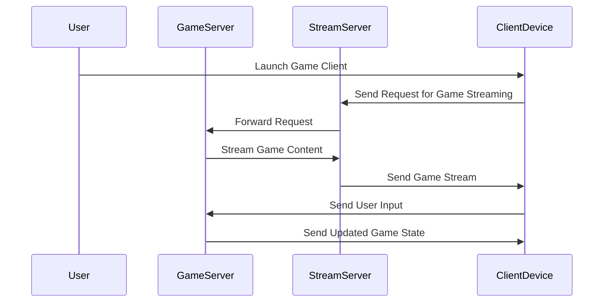

                 

### 前言

#### 简介

《腾讯2024校招云游戏开发工程师面试题详解》是一本专门为准备腾讯2024校招云游戏开发工程师岗位的应聘者编写的指南。本书旨在通过深入剖析云游戏开发的技术细节和面试难题，帮助读者更好地理解云游戏的基本概念、技术架构、平台开发、客户端开发以及性能测试与调优等方面的知识，为读者顺利通过面试提供有力支持。

#### 读者对象

本书的目标读者是准备参与腾讯2024校招且有意向从事云游戏开发工作的应聘者。不论你是刚刚步入大学校园的计算机相关专业学生，还是已经有一定编程经验的技术人员，只要你对云游戏技术感兴趣，希望深入了解这一前沿领域，本书都将为你提供宝贵的知识和实战技巧。

#### 作者介绍

本书由AI天才研究院（AI Genius Institute）与《禅与计算机程序设计艺术》（Zen And The Art of Computer Programming）的作者联合编写。AI天才研究院是一支致力于推动人工智能与计算机科学前沿研究的高水平团队，成员包括世界顶级人工智能专家、程序员、软件架构师和CTO等。他们的专业背景和丰富经验，确保了本书内容的权威性和实用性。《禅与计算机程序设计艺术》的作者则是计算机编程领域的权威，他关于编程哲学和算法设计的深刻见解，将为读者提供独特的视角和思考方式。

#### 编写目的

编写本书的主要目的是帮助读者全面掌握云游戏开发的核心技术和面试要点，从而提高在校招中的竞争力。具体来说，本书有以下几方面的编写目的：

1. **知识普及**：通过详细讲解云游戏的基本概念和技术架构，帮助读者建立全面的知识体系。
2. **实战指导**：通过案例分析、代码实现和性能优化等实战内容，使读者能够将理论知识应用到实际项目中。
3. **面试准备**：收集整理了腾讯校招云游戏开发工程师岗位的常见面试题，并提供详细的解析和解决方案，帮助读者针对性地准备面试。
4. **职业发展**：分析云游戏行业的现状和未来发展趋势，为读者的职业规划提供参考和建议。

总之，《腾讯2024校招云游戏开发工程师面试题详解》不仅是一本面向校招的面试指南，更是一本关于云游戏技术全面深入的科普读物。希望通过本书，读者能够对云游戏开发有更深入的理解，为未来的职业发展打下坚实的基础。

### 云游戏技术概述

#### 1.1 云游戏的基本概念

云游戏，又称为云渲染游戏或游戏即服务（Gaming as a Service，GaaS），是一种将游戏运行在远程服务器上，通过互联网将游戏画面实时传输到用户终端设备上的技术。在这种模式下，用户不再需要在本地设备上安装游戏客户端或游戏内容，只需通过浏览器或专门的云游戏客户端，通过网络连接到云游戏平台，即可实现游戏的流畅运行。

云游戏与传统游戏相比，具有以下几个显著特点：

1. **无需下载和安装**：用户无需下载和安装庞大的游戏文件，只需通过网络连接即可直接开始游戏。
2. **终端设备要求低**：由于游戏运行在远程服务器上，用户终端设备（如手机、平板、PC等）的配置要求相对较低，即使是老旧的设备也能体验到高质量的云游戏。
3. **随时随地玩**：用户可以在任何有网络连接的地方随时随地进行游戏，不受地理位置限制。
4. **云端资源共享**：多个用户可以共享云端的计算资源和存储资源，实现多人在线互动。

#### 1.2 云游戏技术架构

云游戏的技术架构主要包括以下几个关键组成部分：

1. **游戏服务器**：游戏服务器负责处理游戏的逻辑运算、渲染和资源管理。它是云游戏的核心，通常由高性能计算机集群组成，确保游戏能够稳定、高效地运行。
2. **流媒体服务器**：流媒体服务器负责将游戏画面实时传输到用户终端。它通常采用流媒体技术，如H.264或HEVC视频编码，以实现低延迟、高画质的游戏画面传输。
3. **用户终端设备**：用户终端设备如PC、手机或平板电脑，通过专门的云游戏客户端或浏览器接入云游戏平台，接收并显示游戏画面，同时发送用户操作指令到服务器。
4. **网络传输**：云游戏依赖于稳定的网络连接，通常使用Wi-Fi或4G/5G网络。为了保证游戏体验，网络传输需要具备低延迟、高带宽的特点。

#### 1.3 云游戏技术架构图

为了更好地理解云游戏的技术架构，我们可以用Mermaid流程图来展示其关键组件和交互流程：



在这个流程图中，用户通过客户端设备启动云游戏客户端，客户端设备向流媒体服务器发送请求，流媒体服务器再将请求转发到游戏服务器。游戏服务器处理游戏逻辑和渲染，将游戏画面流媒体传输回用户终端。用户在终端设备上接收游戏画面，同时发送用户输入指令到游戏服务器，完成整个交互过程。

#### 1.4 云游戏与传统游戏的区别

云游戏与传统游戏在多个方面存在明显的区别：

1. **运行模式**：传统游戏需要在本地设备上安装和运行，而云游戏则通过远程服务器运行，用户只需通过网络连接即可进行游戏。
2. **硬件要求**：传统游戏对本地设备的硬件配置有较高要求，而云游戏由于运行在远程服务器上，用户终端设备的硬件要求相对较低。
3. **安装与更新**：传统游戏需要用户手动下载和安装游戏更新，而云游戏平台通常自动进行更新，用户无需关心这些细节。
4. **多人互动**：传统游戏通常需要本地网络连接或同一台设备进行多人互动，而云游戏支持跨地域的多人在线互动。

通过上述比较，我们可以看出云游戏在便捷性、硬件适应性以及多人互动等方面具有显著优势。这也使得云游戏在未来游戏市场中具备广阔的应用前景。

### 云游戏平台开发

#### 2.1 云游戏平台设计原则

云游戏平台的开发需要遵循一系列设计原则，以确保其能够高效、稳定地运行。以下是几个关键设计原则：

1. **高可用性**：云游戏平台需要具备高可用性，确保用户在任何时间都能访问到平台。为此，平台通常采用分布式架构，通过多台服务器和冗余设计来实现高可用性。
   
   **Mermaid流程图：**
   ```mermaid
   graph TD
       A[用户请求] --> B[负载均衡器]
       B --> C{判断是否故障}
       C -->|无故障| D[请求分发]
       C -->|故障| E[切换到备用服务器]
       D --> F[游戏服务器]
       F --> G[响应结果]
   ```

2. **高性能**：为了保证游戏的流畅体验，平台需要具备高性能。这涉及到游戏服务器的高并发处理能力和流媒体服务器的快速响应能力。

   **Mermaid流程图：**
   ```mermaid
   graph TD
       A[用户请求] --> B[游戏服务器]
       B --> C{处理游戏逻辑}
       C --> D[渲染游戏画面]
       D --> E[流媒体服务器]
       E --> F[传输游戏画面]
   ```

3. **易扩展性**：随着用户数量的增加，平台需要能够轻松扩展其计算资源和存储资源。这通常通过容器化和微服务架构来实现，使得平台能够动态调整资源分配。

   **Mermaid流程图：**
   ```mermaid
   graph TD
       A[用户请求] --> B[容器编排器]
       B --> C[创建容器]
       C --> D[运行游戏服务]
       D --> E[存储服务]
   ```

4. **安全性**：云游戏平台需要保护用户数据和游戏内容，防止数据泄露和网络攻击。这包括数据加密、身份验证和访问控制等安全措施。

   **Mermaid流程图：**
   ```mermaid
   graph TD
       A[用户登录] --> B[身份验证服务]
       B --> C[授权访问]
       C --> D[加密传输数据]
   ```

5. **可观测性**：为了确保平台的稳定运行，需要具备良好的可观测性，能够实时监控和诊断系统状态。这通常通过日志记录、性能监控和故障检测等技术实现。

   **Mermaid流程图：**
   ```mermaid
   graph TD
       A[系统运行] --> B[日志记录]
       B --> C[性能监控]
       C --> D[故障检测]
   ```

通过遵循上述设计原则，云游戏平台能够提供稳定、高效和安全的游戏体验，满足用户的需求。

#### 2.2 游戏渲染服务搭建

游戏渲染服务是云游戏平台的核心组件之一，负责将游戏场景渲染成图像并传输到用户终端。以下是游戏渲染服务的搭建步骤：

1. **选择渲染引擎**：首先，需要选择一款适合云游戏的渲染引擎，如Unreal Engine、Unity等。这些引擎提供了丰富的图形渲染功能，支持多种平台和设备。

   **Mermaid流程图：**
   ```mermaid
   graph TD
       A[选择渲染引擎] --> B[安装引擎]
   ```

2. **配置渲染设置**：安装渲染引擎后，需要对渲染设置进行配置。这包括设置分辨率、帧率、抗锯齿等技术参数，以确保游戏画面质量。

   **Mermaid流程图：**
   ```mermaid
   graph TD
       A[安装引擎] --> B[配置渲染设置]
       B --> C{设置分辨率}
       C --> D{设置帧率}
       D --> E{设置抗锯齿}
   ```

3. **搭建渲染服务器**：接下来，需要在云服务器上搭建渲染服务器。这通常涉及以下步骤：

   - **创建虚拟机**：在云服务平台（如阿里云、腾讯云等）上创建虚拟机，选择合适的服务器和网络配置。
   
   **Mermaid流程图：**
   ```mermaid
   graph TD
       A[配置渲染设置] --> B[创建虚拟机]
   ```

   - **安装渲染引擎**：在虚拟机上安装所选的渲染引擎，并配置必要的依赖库和驱动程序。
   
   **Mermaid流程图：**
   ```mermaid
   graph TD
       B --> C[安装渲染引擎]
   ```

   - **部署游戏内容**：将游戏内容（如场景文件、模型文件等）上传到虚拟机上，并配置游戏服务器。

   **Mermaid流程图：**
   ```mermaid
   graph TD
       C --> D[部署游戏内容]
   ```

4. **测试渲染服务**：搭建完成后，需要对渲染服务进行测试，确保其能够稳定、高效地运行。

   **Mermaid流程图：**
   ```mermaid
   graph TD
       D --> E[测试渲染服务]
       E --> F{是否通过测试}
   ```

   如果测试通过，渲染服务搭建完成；否则，需要检查配置和部署过程，找出并解决问题。

#### 渲染服务部署与配置

在搭建渲染服务的过程中，部署和配置是关键环节。以下是详细的部署与配置步骤：

1. **服务器选择**：

   选择一台合适的服务器对于渲染服务的性能至关重要。通常，云服务平台（如阿里云、腾讯云等）提供多种服务器规格，包括CPU、内存、磁盘、网络带宽等。以下是一些选择标准：

   - **计算性能**：渲染服务需要强大的计算能力，因此选择具有较高CPU性能的服务器。
   - **内存容量**：游戏渲染过程需要大量内存，选择具有较大内存容量的服务器可以提高渲染效率。
   - **网络带宽**：稳定的网络连接对于游戏画面的实时传输至关重要，选择具有高带宽的服务器。

   **Mermaid流程图：**
   ```mermaid
   graph TD
       A[选择服务器规格] --> B{CPU性能}
       B --> C{内存容量}
       C --> D{网络带宽}
   ```

2. **服务器配置**：

   服务器配置包括操作系统安装、渲染引擎安装以及依赖库安装等。以下是具体步骤：

   - **操作系统安装**：在服务器上安装Linux操作系统，如Ubuntu或CentOS。这些操作系统对游戏渲染引擎的兼容性较好。

     **Mermaid流程图：**
     ```mermaid
     graph TD
         A --> B[安装Linux操作系统]
     ```

   - **渲染引擎安装**：在操作系统上安装所选的渲染引擎，如Unreal Engine或Unity。安装过程中需要配置必要的依赖库和驱动程序。

     **Mermaid流程图：**
     ```mermaid
         B --> C[安装渲染引擎]
     ```

   - **依赖库安装**：安装渲染引擎所需的依赖库，如OpenGL、CUDA等。这些库提供了渲染引擎所需的底层功能。

     **Mermaid流程图：**
     ```mermaid
         C --> D[安装依赖库]
     ```

3. **游戏内容部署**：

   游戏内容（如场景文件、模型文件等）需要上传到服务器并配置到游戏服务器中。以下是具体步骤：

   - **上传游戏内容**：使用FTP或其他文件传输工具，将游戏内容上传到服务器上的指定目录。

     **Mermaid流程图：**
     ```mermaid
         D --> E[上传游戏内容]
     ```

   - **配置游戏服务器**：在渲染引擎中配置游戏服务器，设置游戏运行端口、场景文件路径等参数。

     **Mermaid流程图：**
     ```mermaid
         E --> F[配置游戏服务器]
     ```

4. **性能调优**：

   渲染服务搭建完成后，需要进行性能调优，以确保游戏运行流畅。以下是性能调优的方法：

   - **优化渲染设置**：调整渲染引擎的渲染设置，如分辨率、帧率、抗锯齿等，以适应不同用户的需求。

     **Mermaid流程图：**
     ```mermaid
         F --> G{优化渲染设置}
     ```

   - **调整服务器配置**：根据游戏运行情况，调整服务器的CPU、内存、网络带宽等配置，以提升性能。

     **Mermaid流程图：**
     ```mermaid
         G --> H{调整服务器配置}
     ```

   - **监控与优化**：使用性能监控工具，实时监控服务器状态和游戏运行情况，发现并解决性能瓶颈。

     **Mermaid流程图：**
     ```mermaid
         H --> I{监控与优化}
     ```

通过上述部署与配置步骤，可以确保渲染服务能够稳定、高效地运行，为用户提供优质的云游戏体验。

### 游戏传输服务优化

在云游戏平台中，游戏传输服务是影响用户体验的关键因素之一。为了保证游戏画面的流畅传输，优化传输服务至关重要。以下是几种常用的优化策略：

#### 1. 网络传输优化

**1.1 选择高效编码格式**

游戏画面传输通常使用视频编码格式，如H.264、HEVC等。选择高效编码格式可以减少数据传输量，降低网络带宽消耗。例如，HEVC相比H.264具有更高的压缩效率，但需要更高的计算资源。因此，根据用户网络环境和服务器性能，合理选择编码格式。

**1.2 实现自适应流媒体传输**

自适应流媒体传输可以根据用户网络状况动态调整传输码率和分辨率。当用户网络状况良好时，可以传输高码率和高质量的画面；当网络状况不佳时，可以降低码率和分辨率，确保画面流畅度。常用的自适应流媒体传输协议包括HLS（HTTP Live Streaming）和DASH（Dynamic Adaptive Streaming over HTTP）。

**1.3 使用传输优化库**

传输优化库（如Nginx、EdgeDS等）可以实现数据压缩、缓存管理和传输加速等功能，提高游戏画面的传输效率。例如，Nginx可以通过HTTP/2协议实现更高效的数据传输，减少延迟和带宽消耗。

#### 2. 网络拓扑优化

**2.1 选择最佳传输路径**

通过选择最佳传输路径，可以降低游戏画面传输的延迟和抖动。常用的方法包括：

- **DNS解析优化**：通过优化DNS解析速度，缩短用户请求游戏画面的时间。
- **负载均衡**：使用负载均衡器（如AWS ELB、Nginx等）分配用户请求，避免单点故障，提高传输服务的可用性。

**2.2 使用内容分发网络（CDN）**

内容分发网络（CDN）通过在全球范围内部署节点，缓存和加速游戏画面传输。CDN可以智能选择最佳路径，将游戏画面传输到用户最近的节点，减少传输延迟和带宽消耗。常用的CDN服务提供商包括阿里云CDN、腾讯云CDN等。

#### 3. 传输服务质量（QoS）优化

**3.1 网络优先级调度**

为游戏传输分配更高的网络优先级，确保游戏画面的传输带宽和延迟较低。网络优先级可以通过IP优先级、QoS策略等实现。

**3.2 网络流量控制**

通过网络流量控制，限制非游戏流量占用网络带宽，确保游戏传输服务的优先级。常用的流量控制方法包括带宽分配、流量整形等。

**3.3 实时监控与反馈**

实时监控游戏传输服务质量，发现网络故障和性能瓶颈，及时调整网络配置和传输策略。常用的监控工具包括Prometheus、Grafana等。

通过上述优化策略，可以显著提升云游戏平台的传输服务质量，为用户提供更好的游戏体验。

#### 游戏存储服务搭建

游戏存储服务是云游戏平台的重要组成部分，负责存储游戏内容、用户数据以及日志信息。以下是游戏存储服务的搭建步骤：

1. **选择存储方案**：首先，需要选择合适的存储方案。常见的存储方案包括关系型数据库（如MySQL、PostgreSQL）、非关系型数据库（如MongoDB、Redis）和对象存储（如Amazon S3、阿里云OSS）。

   - **关系型数据库**：适用于存储结构化数据，如用户信息、游戏数据等。关系型数据库具有事务支持、数据一致性和易于维护等优点。
   - **非关系型数据库**：适用于存储非结构化数据，如游戏配置、日志数据等。非关系型数据库具有高并发、易扩展和灵活性等优点。
   - **对象存储**：适用于存储大规模文件数据，如游戏资源、用户上传文件等。对象存储具有高容量、高可靠性和高可扩展性等优点。

   **Mermaid流程图：**
   ```mermaid
   graph TD
       A[选择存储方案] --> B{关系型数据库}
       B --> C{非关系型数据库}
       C --> D{对象存储}
   ```

2. **部署数据库服务器**：根据所选存储方案，在云服务器上部署数据库服务器。以下是具体步骤：

   - **安装操作系统**：在云服务器上安装Linux操作系统，如Ubuntu或CentOS。
   - **安装数据库软件**：安装所选的数据库软件，如MySQL、MongoDB或Redis。
   - **配置数据库**：配置数据库的参数和存储路径，如设置最大连接数、缓存大小、日志文件路径等。

   **Mermaid流程图：**
   ```mermaid
   graph TD
       A --> B[安装操作系统]
       B --> C[安装数据库软件]
       C --> D[配置数据库]
   ```

3. **存储游戏内容**：将游戏内容（如场景文件、模型文件等）上传到数据库服务器或对象存储中。以下是具体步骤：

   - **上传游戏内容**：使用FTP或其他文件传输工具，将游戏内容上传到数据库服务器或对象存储的指定目录。
   - **配置游戏服务器**：在游戏服务器中配置游戏内容存储路径，以便游戏服务器能够访问到游戏资源。

   **Mermaid流程图：**
   ```mermaid
   graph TD
       D --> E[上传游戏内容]
       E --> F[配置游戏服务器]
   ```

4. **存储用户数据**：游戏存储服务还需要存储用户数据，如用户账户信息、游戏进度等。以下是具体步骤：

   - **设计数据模型**：根据业务需求，设计用户数据模型，如用户表、游戏记录表等。
   - **创建数据库表**：在数据库中创建相应的数据表，并设置字段和数据类型。
   - **存储用户数据**：将用户数据存储到数据库表中，确保数据一致性和安全性。

   **Mermaid流程图：**
   ```mermaid
   graph TD
       F --> G{设计数据模型}
       G --> H[创建数据库表]
       H --> I[存储用户数据]
   ```

5. **日志存储**：游戏存储服务还需要存储游戏运行日志，以便监控和诊断系统性能。以下是具体步骤：

   - **设计日志模型**：根据业务需求，设计日志数据模型，如访问日志、错误日志等。
   - **创建日志表**：在数据库中创建相应的日志表，并设置字段和数据类型。
   - **存储日志数据**：将游戏运行日志存储到数据库日志表中，确保日志数据的完整性和可追溯性。

   **Mermaid流程图：**
   ```mermaid
   graph TD
       I --> J{设计日志模型}
       J --> K[创建日志表]
       K --> L[存储日志数据]
   ```

通过上述搭建步骤，可以确保游戏存储服务能够稳定、高效地运行，为游戏平台提供可靠的数据存储和访问支持。

### 云游戏客户端开发

云游戏客户端是用户与云游戏平台交互的入口，其设计架构和功能模块直接影响用户体验。以下是云游戏客户端开发的主要内容和关键步骤：

#### 3.1 云游戏客户端架构

云游戏客户端的架构设计主要包括以下几个关键模块：

1. **用户界面（UI）**：用户界面负责展示游戏画面和操作界面，是用户与游戏交互的直接窗口。UI模块需要具备良好的用户体验和响应速度。

2. **流媒体播放器**：流媒体播放器负责接收并播放从云游戏服务器传输的游戏画面视频流。它需要支持多种视频编码格式，并具备自适应流媒体传输功能，以确保画面流畅度。

3. **输入处理模块**：输入处理模块负责接收用户的操作指令，如键盘、鼠标和控制器输入。它需要将这些输入转换为服务器能够理解的格式，并实时发送给游戏服务器。

4. **游戏控制模块**：游戏控制模块负责处理游戏逻辑和用户操作，确保游戏能够在客户端正确运行。它通常与游戏服务器保持通信，获取游戏状态和更新。

5. **网络通信模块**：网络通信模块负责与云游戏服务器进行数据传输，包括游戏画面、用户输入和游戏状态等。它需要实现高效、可靠的数据传输机制，以降低延迟和丢包率。

6. **缓存管理模块**：缓存管理模块负责缓存游戏画面和资源，提高数据访问速度，减少网络带宽消耗。它需要实现缓存策略，如缓存淘汰、缓存更新等。

7. **性能监控模块**：性能监控模块负责监控客户端运行状态和性能指标，如CPU使用率、内存使用率、网络延迟等。它可以帮助开发者发现并解决性能瓶颈。

#### 3.2 游戏流媒体传输

游戏流媒体传输是云游戏客户端的核心功能之一，其传输效率和稳定性直接影响用户体验。以下是游戏流媒体传输的关键技术和优化策略：

1. **传输协议**：常用的传输协议包括TCP、UDP和HTTP。TCP协议提供可靠的数据传输，但可能存在延迟；UDP协议传输速度快，但可能存在丢包；HTTP协议支持自适应流媒体传输，适用于多种网络环境。根据实际需求，可以结合使用多种协议，以实现最优传输效果。

2. **编码格式**：游戏画面传输通常使用视频编码格式，如H.264、HEVC和VP9。选择高效的编码格式可以降低数据传输量，提高传输效率。同时，需要支持多种编码格式，以满足不同设备和网络环境的需求。

3. **自适应流媒体传输**：自适应流媒体传输可以根据网络状况动态调整传输码率和分辨率，确保画面流畅度。常用的自适应流媒体传输协议包括HLS、DASH和HLS。通过实时监测网络状况，可以智能选择最佳传输策略。

4. **传输优化**：通过优化传输路径、选择高效传输协议和编码格式，可以降低游戏画面传输的延迟和带宽消耗。此外，可以使用传输优化库，如Nginx和EdgeDS，实现数据压缩、缓存管理和传输加速等功能。

#### 3.3 游戏同步与控制

游戏同步与控制是云游戏客户端的关键功能之一，其实现涉及到多个方面的技术难点。以下是游戏同步与控制的关键技术和实现方法：

1. **状态同步**：游戏状态同步是指客户端和服务器保持一致的游戏状态。为实现状态同步，需要实现以下技术：

   - **快照同步**：服务器定期发送游戏快照给客户端，客户端根据快照更新游戏状态。
   - **增量同步**：服务器仅发送游戏状态的变化部分，客户端根据变化更新游戏状态，降低数据传输量。

2. **输入同步**：输入同步是指客户端发送用户操作指令给服务器，服务器根据输入指令更新游戏状态。为实现输入同步，需要实现以下技术：

   - **输入缓冲**：客户端将用户操作指令缓冲一段时间，以减少输入延迟。
   - **输入确认**：客户端发送输入指令给服务器，服务器确认接收后返回确认消息，确保输入指令的可靠传输。

3. **控制机制**：游戏控制机制负责处理用户输入和游戏状态的交互。为实现游戏控制，需要实现以下技术：

   - **输入映射**：将用户输入映射到游戏中的操作，如按键映射到移动、攻击等。
   - **控制优化**：根据网络状况和游戏特性，优化输入延迟和控制精度，提高游戏体验。

#### 3.4 游戏用户体验优化

游戏用户体验优化是云游戏客户端开发的重要环节，其目标是提高用户满意度和游戏流畅度。以下是游戏用户体验优化的关键技术和策略：

1. **界面设计**：界面设计需要简洁、直观、美观，提高用户操作便捷性和视觉效果。可以使用响应式设计，确保在不同设备和屏幕尺寸上都能提供良好的用户体验。

2. **加载优化**：游戏加载速度直接影响用户体验。可以采用以下优化策略：

   - **预加载**：在用户进入游戏前，预加载游戏资源，减少游戏启动时间。
   - **资源压缩**：使用压缩算法减少游戏资源文件的大小，提高资源加载速度。

3. **性能优化**：游戏性能优化包括CPU、GPU和网络优化等方面。可以采用以下优化策略：

   - **渲染优化**：减少渲染对象数量，优化渲染流程，降低CPU和GPU负载。
   - **网络优化**：优化网络传输，减少延迟和丢包率，提高传输效率。

4. **反馈机制**：提供及时的反馈机制，如游戏画面流畅度、网络连接状态等，帮助用户了解游戏运行情况，提高用户体验。

通过上述架构设计和优化策略，可以开发出高效、稳定、用户体验优良的云游戏客户端，为用户提供优质的云游戏体验。

### 云游戏性能测试与调优

云游戏平台需要具备高性能，以确保用户能够享受到流畅的游戏体验。性能测试与调优是确保平台稳定运行、提高用户体验的关键环节。以下将详细阐述云游戏性能测试的方法、调优策略以及异地游戏体验优化。

#### 4.1 云游戏性能测试方法

性能测试是评估云游戏平台性能的重要手段，主要包括以下方面：

1. **负载测试**：负载测试用于评估平台在正常负载和高负载下的性能表现。通过模拟大量用户同时在线、进行游戏操作的场景，测试平台的并发处理能力、响应时间等。

2. **压力测试**：压力测试用于评估平台在极端负载下的稳定性和崩溃点。通过逐步增加负载，观察平台的响应时间、系统资源占用、错误率等，确定平台的最大承载能力和瓶颈。

3. **网络延迟测试**：网络延迟测试用于评估用户在不同网络条件下连接到游戏服务器的延迟。通过测量不同地理位置的用户与服务器之间的数据传输延迟，评估网络的稳定性和质量。

4. **带宽测试**：带宽测试用于评估平台在不同网络带宽条件下的传输速度。通过模拟不同带宽环境，测试平台的数据传输速度和稳定性。

5. **资源监控**：资源监控用于实时监控平台的系统资源使用情况，如CPU、内存、磁盘I/O和网络带宽等。通过分析资源使用情况，发现系统瓶颈和性能瓶颈。

#### 4.2 性能调优策略

性能调优是提升云游戏平台性能的关键步骤，主要包括以下策略：

1. **优化服务器配置**：根据平台负载情况，合理调整服务器配置，如CPU、内存、网络带宽等。增加服务器数量或升级硬件设备，以提高平台处理能力。

2. **优化游戏渲染**：游戏渲染是性能瓶颈之一，可以通过以下方法进行优化：

   - **优化渲染设置**：调整游戏分辨率、帧率等参数，根据用户设备和网络环境进行动态调整。
   - **减少渲染对象**：通过合并或简化渲染对象，减少GPU的渲染负担。
   - **优化渲染流程**：优化渲染流程，减少渲染时间。

3. **优化传输效率**：通过以下方法提高数据传输效率：

   - **使用高效编码格式**：选择压缩效率高的编码格式，如HEVC，降低数据传输量。
   - **自适应流媒体传输**：根据网络状况动态调整传输码率和分辨率，降低延迟和带宽消耗。

4. **优化同步机制**：优化游戏状态同步和输入同步机制，减少延迟和丢包率：

   - **增量同步**：仅传输状态变化部分，减少数据传输量。
   - **缓冲机制**：增加输入缓冲时间，减少输入延迟。

5. **优化资源调度**：合理分配系统资源，确保关键任务优先执行。通过负载均衡和资源调度，提高整体性能。

#### 4.3 异地游戏体验优化

异地游戏体验优化是提升跨地域用户游戏体验的关键。以下是一些优化策略：

1. **分布式部署**：通过在多个地理位置部署服务器，实现地理位置的就近连接，降低网络延迟。可以使用内容分发网络（CDN）将游戏资源缓存到用户最近的节点，提高数据传输速度。

2. **动态选择最佳路径**：根据用户网络状况和服务器负载，动态选择最佳连接路径，确保网络稳定性和传输速度。

3. **缓存机制**：在用户终端和服务器之间使用缓存机制，减少重复数据传输，提高数据访问速度。

4. **优化数据压缩**：通过优化数据压缩算法，降低数据传输量，提高网络传输效率。

5. **网络优化**：优化用户网络环境，如提高Wi-Fi信号强度、优化路由器设置等，确保稳定的网络连接。

通过上述性能测试与调优策略，可以显著提高云游戏平台的整体性能和用户体验，确保用户在不同网络条件下都能享受到优质的云游戏体验。

### 云游戏安全与可靠性

#### 5.1 云游戏安全挑战

随着云游戏的普及，安全成为不可忽视的重要问题。云游戏平台面临的安全挑战主要包括以下几个方面：

1. **数据泄露**：用户数据（如账号信息、游戏进度、支付信息等）在传输和存储过程中可能受到恶意攻击，导致数据泄露。
2. **拒绝服务攻击（DDoS）**：攻击者通过大量请求攻击云游戏服务器，导致服务器过载、瘫痪，影响用户体验。
3. **游戏作弊**：玩家可能利用漏洞进行游戏作弊，破坏游戏公平性。
4. **跨站脚本攻击（XSS）**：攻击者通过注入恶意脚本，窃取用户信息或操纵用户账户。
5. **中间人攻击（MITM）**：攻击者拦截用户与服务器之间的通信，窃取敏感信息或篡改数据。

为了应对这些安全挑战，云游戏平台需要采取一系列安全防护措施。

#### 5.2 安全防护措施

1. **数据加密**：对用户数据进行加密，确保数据在传输和存储过程中不被窃取或篡改。常用的加密算法包括AES、RSA等。

2. **身份验证与访问控制**：采用强密码策略和多因素身份验证（MFA），确保只有授权用户才能访问系统。同时，使用访问控制列表（ACL）限制用户对数据的访问权限，防止数据泄露。

3. **防火墙与入侵检测系统**：部署防火墙和入侵检测系统（IDS），实时监控网络流量，检测和阻止恶意攻击。

4. **安全补丁与更新**：定期更新系统软件和游戏引擎，修复已知漏洞，提高系统的安全性。

5. **安全审计与日志记录**：对系统进行定期安全审计，记录系统操作日志，以便在发生安全事件时进行追踪和调查。

#### 5.3 云游戏可靠性保障

云游戏平台的可靠性是用户满意度的重要保障，以下措施有助于提高平台的可靠性：

1. **高可用性设计**：采用分布式架构，确保关键组件（如游戏服务器、流媒体服务器等）在单点故障时能够自动切换到备用服务器，保持系统可用。

2. **数据备份与恢复**：定期备份用户数据和游戏资源，确保在数据丢失或损坏时能够快速恢复。

3. **容灾备份**：在异地部署备份服务器，确保在主服务器发生灾难性故障时，备份服务器能够接管业务，保障服务连续性。

4. **性能监控与预警**：实时监控平台性能指标，如CPU使用率、内存使用率、网络带宽等，及时发现并解决性能瓶颈。

5. **灾难恢复计划**：制定详细的灾难恢复计划，确保在发生重大故障时，能够迅速恢复系统运行。

通过上述安全防护和可靠性保障措施，云游戏平台能够为用户提供安全、可靠的服务，提升用户满意度。

#### 5.4 云游戏数据分析

云游戏平台通过收集和分析游戏数据，可以更好地了解用户行为、优化游戏体验，并发现潜在问题。以下是云游戏数据分析的关键步骤和应用：

1. **数据收集**：

   云游戏平台需要在各个层面收集数据，包括用户登录日志、游戏行为数据、系统性能数据等。数据收集可以通过以下方式进行：

   - **日志收集**：收集系统日志、游戏日志等，记录用户的操作行为和系统状态。
   - **API收集**：通过API收集用户数据和游戏数据，如用户账号信息、游戏进度、支付记录等。
   - **数据库采集**：定期备份数据库，提取用户数据进行分析。

2. **数据存储**：

   收集到的数据需要存储在合适的存储系统中，如关系型数据库、非关系型数据库或数据仓库。选择合适的存储系统需要考虑数据量、查询性能、扩展性等因素。

3. **数据预处理**：

   在数据分析之前，需要对数据进行预处理，包括数据清洗、数据转换和数据归一化等。预处理步骤有助于提高数据质量和分析效率。

4. **数据分析**：

   通过数据挖掘和统计分析方法，对收集到的数据进行分析，提取有价值的信息：

   - **用户行为分析**：分析用户登录、游戏时长、游戏类型等行为，了解用户偏好和需求。
   - **性能分析**：分析系统性能指标，如CPU使用率、内存使用率、网络延迟等，发现性能瓶颈。
   - **错误分析**：分析游戏错误日志，发现并解决游戏中的问题。

5. **数据可视化**：

   利用数据可视化工具，将分析结果以图表、报表等形式展示，方便用户理解和决策。常用的数据可视化工具包括ECharts、Tableau等。

6. **应用场景**：

   - **用户画像**：通过分析用户数据，构建用户画像，为个性化推荐、精准营销提供依据。
   - **游戏优化**：通过分析游戏行为数据，优化游戏平衡性、难度等，提升用户体验。
   - **问题排查**：通过分析错误日志和性能数据，及时发现并解决系统问题，提高系统稳定性。

通过数据分析和应用，云游戏平台能够更好地了解用户需求、优化游戏体验，并为业务决策提供数据支持。

### 腾讯云游戏平台简介

腾讯云游戏平台是腾讯公司基于云计算技术打造的一款云游戏服务平台，旨在为用户提供高质量、低延迟的云游戏体验。该平台通过整合腾讯云的强大计算和存储资源，为各类用户提供便捷、高效的云游戏服务。

#### 平台架构

腾讯云游戏平台采用分布式架构，主要包括以下几个关键组成部分：

1. **游戏服务器集群**：游戏服务器集群负责处理游戏逻辑、渲染和资源管理。服务器集群采用负载均衡技术，确保高并发场景下的稳定运行。
2. **流媒体服务器集群**：流媒体服务器集群负责将游戏画面实时传输到用户终端，采用高效编码和自适应流媒体传输技术，确保画面流畅度。
3. **用户终端**：用户终端通过浏览器或腾讯云游戏客户端接入平台，接收并显示游戏画面，同时发送用户输入指令到游戏服务器。
4. **数据存储服务**：数据存储服务用于存储用户数据、游戏资源和日志信息，保证数据的安全性和可靠性。
5. **内容分发网络（CDN）**：腾讯云游戏平台通过CDN技术，将游戏资源缓存到用户最近的节点，降低数据传输延迟，提升用户体验。

#### 核心功能

腾讯云游戏平台具备以下核心功能：

1. **云渲染**：通过云渲染技术，用户无需在本地设备上安装游戏客户端，即可在线畅玩高品质游戏。
2. **低延迟传输**：采用高效编码和自适应流媒体传输技术，确保游戏画面传输低延迟、高画质。
3. **跨平台支持**：支持各类终端设备，包括PC、手机、平板等，用户可以随时随地畅玩游戏。
4. **多人互动**：支持跨地域的多人在线互动，提升游戏体验。
5. **安全可靠**：通过多层次的安全防护措施，保障用户数据安全和平台稳定性。

#### 平台特点

腾讯云游戏平台具有以下特点：

1. **高性能**：通过分布式架构和高性能计算资源，确保平台能够处理大规模用户并发。
2. **高可用性**：采用冗余设计和故障转移机制，保证平台高可用性，确保用户随时访问。
3. **灵活扩展**：支持动态调整计算资源和存储资源，满足不同规模用户的需求。
4. **低门槛**：用户无需购买和配置高性能设备，即可在线畅玩游戏，降低游戏门槛。
5. **丰富的游戏资源**：与多家游戏开发商合作，提供丰富的游戏资源，满足各类用户需求。

通过上述特点，腾讯云游戏平台为用户提供了高质量、低延迟、跨平台的云游戏服务，满足了用户对游戏体验的追求。

### 腾讯云游戏成功案例

腾讯云游戏平台自推出以来，已经为多个知名游戏项目提供了云游戏服务，取得了显著的成效。以下是几个具有代表性的成功案例：

#### 1. 《王者荣耀》

《王者荣耀》作为腾讯旗下的爆款游戏，通过与腾讯云游戏平台的合作，实现了云游戏的全面部署。通过云游戏技术，用户无需下载和安装游戏客户端，即可在线畅玩《王者荣耀》。该项目的成功，不仅提升了游戏的便捷性和用户黏性，还显著降低了用户设备的硬件要求，扩大了游戏的用户群体。

**案例分析**：  
《王者荣耀》云游戏项目采用了腾讯云游戏平台提供的分布式架构和高效编码技术，实现了低延迟、高画质的游戏传输。通过内容分发网络（CDN）技术，游戏资源被缓存到用户最近的节点，进一步提升了游戏体验。同时，项目还采用了多因素身份验证和安全防护措施，确保用户数据安全和平台稳定性。

**经验总结**：  
- **低延迟传输**：采用高效编码和内容分发网络技术，确保游戏画面传输低延迟、高画质。
- **安全防护**：采用多层次的安全防护措施，保障用户数据安全和平台稳定性。
- **分布式架构**：采用分布式架构，提高平台并发处理能力和高可用性。

#### 2. 《英雄联盟》

《英雄联盟》是另一款知名游戏，通过与腾讯云游戏平台的合作，也在云游戏领域取得了显著成果。腾讯云游戏平台为《英雄联盟》提供了稳定的云游戏服务，使玩家能够在各种设备上畅享游戏。

**案例分析**：  
腾讯云游戏平台为《英雄联盟》提供了高性能的计算资源和流媒体传输技术，确保游戏画面流畅度。通过负载均衡和故障转移机制，平台能够应对大规模用户的并发访问，保障游戏的稳定性。同时，项目还采用了动态带宽调整和缓存策略，优化了游戏传输效率和用户体验。

**经验总结**：  
- **高性能计算**：采用高性能计算资源，确保游戏流畅运行。
- **负载均衡**：采用负载均衡机制，分配用户请求，提高系统稳定性。
- **动态带宽调整**：根据用户网络状况动态调整带宽，提高传输效率。

#### 3. 《QQ飞车》

《QQ飞车》是一款深受玩家喜爱的休闲赛车游戏，通过与腾讯云游戏平台的合作，实现了云游戏服务的全面升级。通过腾讯云游戏平台，玩家可以在各种设备上畅玩《QQ飞车》，享受极致的赛车体验。

**案例分析**：  
腾讯云游戏平台为《QQ飞车》提供了高效的流媒体传输和游戏同步技术，确保游戏画面流畅、操作反应迅速。通过多节点部署和动态调整，平台能够快速响应用户需求，提高游戏体验。此外，项目还采用了数据加密和身份验证等技术，保障用户数据和平台安全。

**经验总结**：  
- **高效传输**：采用高效流媒体传输技术，确保游戏画面流畅度。
- **多节点部署**：采用多节点部署，提高系统稳定性和响应速度。
- **安全防护**：采用数据加密和身份验证等技术，保障用户数据和平台安全。

通过以上成功案例，腾讯云游戏平台展示了其在云游戏领域的强大实力和丰富经验，为后续项目的推广和应用奠定了坚实基础。

### 云游戏发展趋势

随着云计算、5G和人工智能等技术的不断进步，云游戏市场呈现出蓬勃发展的态势。以下是云游戏未来发展的几个关键趋势：

#### 1. 技术进步

云游戏技术正在不断发展，各种新技术正在被引入以提升用户体验和性能。例如：

- **更高效的编码技术**：未来的云游戏将采用更高效的编码技术，如AV1和VVC，以降低带宽消耗，提高画质和流畅度。
- **AI优化**：人工智能技术在云游戏中的应用越来越广泛，通过AI算法优化渲染、传输和同步过程，降低延迟、提高画质和流畅度。
- **边缘计算**：随着边缘计算的兴起，云游戏将更加注重本地计算和资源利用，减少数据传输距离，降低延迟。

#### 2. 市场规模扩大

随着5G网络的普及和终端设备的升级，云游戏的市场规模将不断扩大。预计未来几年，全球云游戏市场的收入将呈现快速增长态势。尤其是在亚太地区和北美市场，云游戏有望成为主流游戏模式之一。

#### 3. 跨平台互动

云游戏的一个重要趋势是跨平台互动，用户可以在不同设备之间无缝切换，享受连续的游戏体验。未来，云游戏平台将支持更多设备，包括智能电视、游戏主机、VR设备等，为用户提供更丰富的游戏选择。

#### 4. 游戏多元化

云游戏平台的游戏类型将更加多元化，涵盖传统游戏、社交游戏、教育游戏等多种类型。这将满足不同用户的需求，吸引更多玩家加入云游戏市场。

#### 5. 安全与隐私保护

随着云游戏市场的扩大，安全与隐私保护将成为关注的重点。未来，云游戏平台将加强安全防护措施，确保用户数据安全和隐私不被泄露。

#### 6. 开放生态

云游戏平台将更加开放，吸引更多游戏开发商和第三方服务提供商加入。这将促进云游戏生态的繁荣，为用户带来更多优质的云游戏体验。

总之，云游戏市场正朝着技术进步、市场规模扩大、跨平台互动、游戏多元化、安全与隐私保护和开放生态等多个方向发展。随着这些趋势的逐步实现，云游戏有望成为未来游戏市场的重要力量。

### 云游戏开发工程师面试题集锦

在准备腾讯2024校招云游戏开发工程师岗位的面试时，了解常见的面试题型和题目解析是非常重要的。以下是根据历年面试经验和行业特点整理的一些面试题，包括技术面试题、行为面试题和实战面试题。

#### 7.1 技术面试题

**1. 请解释云游戏的基本概念和架构。**

**回答要点：**
- 云游戏是将游戏运行在远程服务器上，通过互联网将游戏画面实时传输到用户终端设备上的技术。
- 关键组成部分包括游戏服务器、流媒体服务器、用户终端设备和网络传输。
- 架构包括渲染、传输、同步、控制等多个环节。

**2. 请简述云游戏与传统的本地游戏有哪些区别。**

**回答要点：**
- 运行模式：本地游戏需要在用户设备上安装和运行，而云游戏通过远程服务器运行。
- 硬件要求：本地游戏对用户设备硬件要求较高，而云游戏对设备硬件要求较低。
- 游戏更新：本地游戏需要用户手动更新，而云游戏平台通常自动进行更新。

**3. 请解释负载均衡在云游戏平台中的作用。**

**回答要点：**
- 负载均衡用于平衡各个游戏服务器之间的负载，确保系统稳定运行。
- 可以根据用户地理位置、网络状况等动态分配请求，提高系统性能。

**4. 如何优化云游戏的网络传输效率？**

**回答要点：**
- 采用高效编码格式，如HEVC，减少数据传输量。
- 实现自适应流媒体传输，根据网络状况动态调整传输码率和分辨率。
- 使用CDN技术，缓存游戏资源到用户最近的节点，降低传输延迟。

**5. 请解释云游戏中的同步机制。**

**回答要点：**
- 同步机制用于确保客户端和服务器之间的游戏状态一致。
- 包括状态同步和输入同步，通过快照同步、增量同步和输入缓冲等技术实现。

**6. 请解释云游戏中的安全防护措施。**

**回答要点：**
- 数据加密，如AES和RSA，确保数据传输和存储安全。
- 身份验证和访问控制，确保只有授权用户才能访问系统。
- 防火墙和入侵检测系统，监控网络流量，防止恶意攻击。

#### 7.2 行为面试题

**1. 请描述一次你遇到的技术难题，以及你是如何解决的。**

**回答要点：**
- 遇到的技术难题（例如性能优化、系统故障等）。
- 分析问题原因，采取的解决方案（如代码优化、故障排查等）。
- 最终解决效果和经验教训。

**2. 请描述一次团队合作经历，以及你的角色和贡献。**

**回答要点：**
- 团队合作的项目背景和目标。
- 你的角色和职责，如何与其他团队成员协作。
- 你在项目中取得的成果和贡献。

**3. 请描述一次你遇到的压力情景，以及你是如何应对的。**

**回答要点：**
- 压力情景的背景（如项目截止日期临近、突发故障等）。
- 应对压力的方法（如时间管理、优先级排序、团队合作等）。
- 最终的结果和经验教训。

#### 7.3 实战面试题

**1. 请设计一个简单的云游戏平台架构，并说明各部分的功能。**

**回答要点：**
- 架构设计图，使用Mermaid或其他图形工具展示。
- 游戏服务器、流媒体服务器、用户终端设备及其交互流程。
- 游戏服务器和流媒体服务器的主要功能，如游戏逻辑处理、游戏画面渲染和传输等。

**2. 请实现一个简单的游戏同步算法，并解释其原理。**

**伪代码示例：**
```python
# 同步算法伪代码
def synchronize(state_client, state_server):
    # 比较客户端状态和服务器状态
    if state_client != state_server:
        # 更新客户端状态为服务器状态
        state_client = state_server
        # 发送更新后的客户端状态到服务器
        send_to_server(state_client)
    return state_client
```

**3. 请解释如何优化云游戏的网络传输效率。**

**回答要点：**
- 采用高效编码格式，如HEVC。
- 实现自适应流媒体传输，根据网络状况动态调整传输码率和分辨率。
- 使用CDN技术，缓存游戏资源到用户最近的节点，降低传输延迟。
- 优化同步机制，减少数据传输量，如增量同步。

通过以上技术面试题、行为面试题和实战面试题，可以全面准备腾讯2024校招云游戏开发工程师的面试，提高面试成功率。

### 云游戏开发工程师职业发展

#### 8.1 职业规划与成长路径

作为一名云游戏开发工程师，职业规划至关重要。以下是一个典型的职业规划与成长路径：

**初级工程师**：
- **技能积累**：掌握基本的编程语言（如C++、Java）、数据结构和算法，了解操作系统和网络知识。
- **项目参与**：参与云游戏平台的基础开发，如游戏渲染、传输优化、客户端开发等。
- **学习资源**：通过在线课程、技术博客、开源项目等不断学习新技术，提高自己的技术能力。

**中级工程师**：
- **技能提升**：深入了解云游戏平台的技术架构，熟悉主流游戏引擎（如Unity、Unreal Engine），具备性能优化和调优的能力。
- **项目领导**：承担更多项目责任，如带领团队完成特定模块的开发，协调与测试、运维等部门的协作。
- **交流学习**：参加技术会议、研讨会，与业界专家交流，拓宽视野，提升个人影响力。

**高级工程师**：
- **技术深度**：成为云游戏技术领域的专家，深入研究高性能计算、网络优化、游戏同步等前沿技术。
- **管理职责**：担任技术团队负责人，负责团队管理、项目规划和技术决策。
- **技术指导**：指导初级和中级工程师，分享经验，提升团队整体技术能力。

**专家/CTO**：
- **战略规划**：参与公司战略规划，制定云游戏平台的发展方向和技术路线。
- **技术创新**：推动技术创新，如引入新算法、新技术，提升平台性能和用户体验。
- **行业领导**：在行业内担任重要角色，如参加技术委员会、担任技术演讲嘉宾等，提升公司品牌影响力。

#### 8.2 技能提升建议

为了在云游戏开发领域取得成功，以下是一些技能提升建议：

1. **基础知识**：扎实掌握编程语言、数据结构与算法、操作系统和网络知识，这是职业发展的基石。
2. **实践经验**：积极参与实际项目，积累开发经验，了解项目的全生命周期，从需求分析到上线部署。
3. **学习新技术**：不断学习云计算、边缘计算、AI等新技术，紧跟行业发展趋势。
4. **软技能**：提升沟通能力、团队协作能力、问题解决能力等软技能，这对于职业发展同样重要。
5. **国际化视野**：参与国际会议、与海外同行交流，拓宽视野，了解全球云游戏市场的动态和发展趋势。

#### 8.3 行业前景与趋势

云游戏作为新兴领域，具有巨大的发展潜力。以下是云游戏行业的几个重要前景和趋势：

1. **市场规模扩大**：随着5G网络的普及和终端设备的升级，云游戏市场将呈现快速增长态势。预计未来几年，全球云游戏市场的收入将大幅增长。
2. **技术进步**：高效编码技术、AI优化、边缘计算等新技术的引入，将不断提升云游戏平台的性能和用户体验。
3. **跨平台互动**：云游戏将支持更多设备，包括智能电视、游戏主机、VR设备等，为用户提供更丰富的游戏选择。
4. **安全与隐私保护**：随着云游戏市场的扩大，安全与隐私保护将成为关注的重点，平台将加强安全防护措施。
5. **开放生态**：云游戏平台将更加开放，吸引更多游戏开发商和第三方服务提供商加入，促进生态繁荣。

#### 8.4 职业发展建议

1. **技术深耕**：专注于云游戏技术领域，成为该领域的专家，提升个人竞争力。
2. **多平台拓展**：了解并掌握不同平台（如PC、移动、VR等）的云游戏开发，扩大业务范围。
3. **项目经验**：积累丰富的项目经验，特别是在大型项目和关键模块的开发中，提高解决问题的能力。
4. **团队合作**：提升团队协作和项目管理能力，成为团队的核心成员，为项目成功贡献力量。
5. **持续学习**：保持持续学习的态度，紧跟行业动态，不断学习新技术和新理念。

通过上述职业规划与成长路径、技能提升建议和行业前景分析，云游戏开发工程师可以明确自己的职业发展方向，为未来的职业成功奠定坚实基础。

### 附录

#### 附录A：云游戏开发工具与资源

为了帮助读者更好地进行云游戏开发，以下是一些常用的工具和资源：

1. **开发工具**：
   - **Unity和Unreal Engine**：两款主流的游戏引擎，支持云游戏开发。
   - **Visual Studio和IntelliJ IDEA**：强大的集成开发环境，适合编写游戏代码。
   - **Docker和Kubernetes**：用于容器化部署和集群管理，提高开发效率和系统稳定性。

2. **开源框架与库**：
   - **GStreamer**：一个开源的多媒体框架，支持流媒体处理。
   - **FFmpeg**：一个开源的视频处理库，适用于视频编码和传输。
   - **WebRTC**：一个开源的实时通信库，支持低延迟、高带宽的实时视频传输。

3. **学习资源**：
   - **腾讯云官网**：提供云游戏开发的相关文档和案例。
   - **GitHub**：包含许多云游戏开发的开源项目和示例代码。
   - **技术博客和论坛**：如CSDN、简书等，提供丰富的技术文章和讨论。

#### 附录B：云游戏开发实验项目

为了帮助读者更好地理解和应用云游戏开发技术，以下是一个简单的实验项目：

**项目简介**：
本实验项目将搭建一个简单的云游戏平台，支持游戏渲染、传输和客户端操作。

**项目实施步骤**：

1. **环境搭建**：
   - 安装Docker和Kubernetes，搭建容器化环境。
   - 安装Unity或Unreal Engine，准备游戏引擎。

2. **游戏渲染服务搭建**：
   - 创建一个Docker容器，安装游戏引擎和相关依赖库。
   - 配置游戏服务器，部署游戏内容。

3. **流媒体服务器搭建**：
   - 创建另一个Docker容器，安装流媒体服务器（如Nginx）。
   - 配置流媒体服务器，设置游戏画面传输规则。

4. **客户端开发**：
   - 使用HTML5和JavaScript开发一个简单的客户端界面。
   - 配置客户端，连接到流媒体服务器，接收游戏画面。

5. **测试与调试**：
   - 在本地测试游戏平台的运行，确保渲染、传输和客户端操作正常。
   - 调整服务器和客户端配置，优化性能。

**项目评估指标**：
- 游戏渲染质量：评估游戏画面的清晰度和流畅度。
- 游戏传输延迟：测量客户端到服务器的传输延迟。
- 客户端操作响应时间：评估客户端操作对游戏状态的影响。

通过本实验项目，读者可以初步了解云游戏平台的搭建流程和技术要点，为进一步的学习和应用打下基础。

#### 附录C：云游戏开发工程师面试真题解析

在准备云游戏开发工程师的面试时，掌握常见面试题的解答技巧是非常重要的。以下是对一些典型的面试真题进行解析，并提供解题思路与技巧。

**1. 什么是云游戏？它有哪些优点和挑战？**

**解题思路**：首先，定义云游戏；然后，列举其优点和挑战。

**回答示例**：
- **定义**：云游戏是将游戏运行在远程服务器上，通过互联网将游戏画面实时传输到用户终端设备上的技术。
- **优点**：
  - **无需下载和安装**：用户无需在本地设备上安装游戏，方便快捷。
  - **硬件需求低**：用户终端设备配置要求低，即使是老旧设备也能流畅运行。
  - **随时随地玩**：用户可以在任何有网络连接的地方进行游戏，不受地理位置限制。
- **挑战**：
  - **网络延迟**：游戏画面传输需要稳定的网络连接，高延迟会影响游戏体验。
  - **安全性**：用户数据安全和隐私保护是云游戏面临的重要挑战。
  - **资源管理**：服务器资源管理和负载均衡是云游戏平台必须解决的问题。

**2. 请解释负载均衡在云游戏平台中的作用。**

**解题思路**：阐述负载均衡的概念和其在云游戏平台中的应用。

**回答示例**：
- **概念**：负载均衡是指将用户请求分配到多个服务器上，以平衡各服务器的负载。
- **作用**：
  - **提高系统性能**：通过将用户请求分配到多个服务器，避免单点过载，提高系统整体性能。
  - **保证高可用性**：在服务器发生故障时，负载均衡可以将请求自动切换到其他健康服务器，确保系统持续可用。
  - **优化用户体验**：根据用户地理位置和网络状况，选择最佳路径，降低网络延迟，提高游戏流畅度。

**3. 请简述云游戏平台的技术架构。**

**解题思路**：分解云游戏平台的技术架构，说明各个组成部分及其交互流程。

**回答示例**：
- **游戏服务器**：负责处理游戏逻辑、渲染和资源管理。
- **流媒体服务器**：负责将游戏画面实时传输到用户终端。
- **用户终端设备**：通过浏览器或云游戏客户端接收游戏画面和发送用户输入。
- **网络传输**：确保游戏画面和用户输入的低延迟、高带宽传输。
- **交互流程**：
  - 用户通过客户端发送游戏请求到流媒体服务器。
  - 流媒体服务器将请求转发到游戏服务器。
  - 游戏服务器处理请求，渲染游戏画面，并传输回客户端。
  - 用户在客户端接收游戏画面，同时发送操作指令到服务器。

**4. 如何优化云游戏的网络传输效率？**

**解题思路**：从多个角度分析网络传输效率的优化方法。

**回答示例**：
- **使用高效编码格式**：采用HEVC等高效编码格式，减少数据传输量。
- **自适应流媒体传输**：根据网络状况动态调整传输码率和分辨率，确保画面流畅度。
- **CDN技术**：使用内容分发网络（CDN），缓存游戏资源到用户最近的节点，降低传输延迟。
- **优化同步机制**：减少数据传输量，如增量同步和输入缓冲。
- **网络优化**：优化用户网络环境，如提高Wi-Fi信号强度、优化路由器设置。

**5. 请解释云游戏中的同步机制。**

**解题思路**：解释同步机制的定义、作用以及实现方法。

**回答示例**：
- **定义**：同步机制用于确保客户端和服务器之间的游戏状态一致。
- **作用**：保证游戏画面的连贯性和操作的实时性。
- **实现方法**：
  - **状态同步**：服务器定期发送游戏状态快照给客户端，客户端根据快照更新游戏状态。
  - **输入同步**：客户端发送用户操作指令给服务器，服务器根据输入指令更新游戏状态，并返回更新后的游戏状态给客户端。

通过以上面试真题解析，读者可以掌握云游戏开发工程师面试中的常见问题及其解答技巧，为面试做好充分准备。

#### 附录D：云游戏开发工程师面试指南

为了帮助准备参加腾讯2024校招云游戏开发工程师岗位的应聘者顺利通过面试，以下是一些面试准备、面试策略和面试技巧的指南。

##### 1. 面试准备

**技术准备：**
- **基础知识的复习**：复习编程语言（如C++、Java）、数据结构与算法、操作系统、网络和数据库等基础知识。
- **专业知识掌握**：深入学习云计算、流媒体技术、游戏引擎（如Unity、Unreal Engine）和游戏同步机制等相关专业知识。
- **案例和实践经验**：整理自己在云游戏开发中的项目经验，包括项目背景、技术难点、解决方案和成果。

**资料准备：**
- **简历**：准备一份完整的简历，包括教育背景、工作经历、项目经验和技能特长。
- **作品集**：如果有相关项目或成果，整理成作品集，以备面试官查看。

**心理准备：**
- **保持自信**：面试前要对自己有信心，相信自己的技术实力和准备情况。
- **调整心态**：面试是一个双向选择的过程，不仅仅是公司评估应聘者，应聘者也可以了解公司文化和团队氛围。

##### 2. 面试策略

**时间管理**：
- **提前规划**：提前安排好面试时间，确保面试当天不会因为交通或其他意外情况延误。
- **面试前准备**：提前了解公司的背景、业务和发展方向，有针对性地准备问题。

**问题应对**：
- **常见问题准备**：准备一些常见的面试问题，如“请解释云游戏的基本概念和架构”、“如何优化云游戏的网络传输效率”等，并练习回答。
- **问题分析**：在回答问题时，不仅要给出答案，还要分析问题背后的原理和思路。

**互动交流**：
- **展示沟通能力**：在面试过程中，展示良好的沟通和表达能力，能够清晰地表达自己的想法。
- **倾听与反馈**：认真倾听面试官的问题，给予明确的回答，并在适当的时候进行反馈。

##### 3. 面试技巧

**语言表达**：
- **简洁明了**：回答问题时，尽量简洁明了，避免使用过于复杂的术语和长句子。
- **逻辑清晰**：回答问题时，要有逻辑性，逐步展开思路，确保面试官能够跟上你的思路。

**非语言沟通**：
- **肢体语言**：保持良好的肢体语言，如微笑、点头等，展示自信和礼貌。
- **眼神交流**：与面试官保持适当的眼神交流，展示你的专注和自信。

**心态调整**：
- **放松心态**：面试前进行适当的放松，如做深呼吸、冥想等，缓解紧张情绪。
- **积极心态**：保持积极的心态，相信自己的准备和实力。

通过以上面试准备、策略和技巧，应聘者可以更好地应对腾讯2024校招云游戏开发工程师岗位的面试，提高面试成功的机会。

### 附录E：云游戏技术发展趋势与未来展望

云游戏作为一项新兴技术，正不断推动游戏行业的变革。以下是云游戏技术未来的发展趋势与展望：

#### 1. 技术创新

**高效编码与传输技术**：随着编码技术的发展，如HEVC、AV1和VVC，以及传输技术的进步，如WebRTC和QUIC，云游戏将实现更高效的数据压缩和更稳定的传输，进一步提升用户体验。

**边缘计算与分布式架构**：边缘计算和分布式架构将使云游戏平台更加灵活和高效。通过将计算和存储资源分布到边缘节点，可以减少数据传输距离，降低延迟，提高系统响应速度。

**人工智能与机器学习**：AI和机器学习技术将在云游戏中发挥重要作用。通过AI算法优化渲染、传输和同步过程，可以显著提高游戏性能和用户体验。同时，AI还可以用于游戏推荐、智能辅助和作弊检测等。

#### 2. 行业发展趋势

**市场规模扩大**：随着5G网络的普及和终端设备的升级，云游戏市场预计将呈现爆发式增长。特别是在亚太地区和北美市场，云游戏有望成为主流游戏模式之一。

**多元化游戏类型**：云游戏平台将支持更多类型的游戏，包括大型单机游戏、多人在线游戏、VR游戏和教育游戏等，满足不同用户的需求。

**跨平台互动**：云游戏将支持跨平台互动，用户可以在PC、手机、平板、智能电视和VR设备等不同设备之间无缝切换，享受连续的游戏体验。

**安全与隐私保护**：随着云游戏市场的扩大，安全与隐私保护将成为关注的重点。未来，云游戏平台将加强数据加密、身份验证和安全审计等安全措施，确保用户数据的安全。

#### 3. 未来展望

**云游戏成为主流**：随着技术的不断进步和用户体验的持续提升，云游戏有望在未来几年内成为游戏行业的主流模式。用户无需购买和安装游戏，即可随时随地畅玩高质量游戏。

**游戏开发模式的变革**：云游戏将改变传统的游戏开发模式。游戏开发者可以更加专注于游戏内容的创新和用户体验的提升，而将游戏运行、维护和更新等任务交给云游戏平台。

**社交和互动性提升**：云游戏将进一步提升游戏的社交和互动性。通过跨地域的多人在线互动和虚拟现实技术，用户可以与全球的玩家一起游戏，创造更加丰富和多样的社交体验。

**行业生态的繁荣**：随着云游戏的普及，将带动相关产业链的发展，包括游戏开发商、云服务提供商、硬件制造商等。这将推动整个游戏行业的生态繁荣，为从业者提供更多的职业机会和发展空间。

总之，云游戏技术在未来将继续发展壮大，成为游戏行业的重要推动力。随着技术的不断进步和市场的逐渐成熟，云游戏将为用户提供更加丰富、便捷和优质的娱乐体验。

