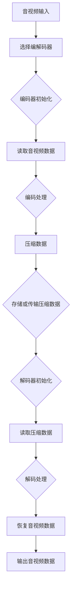

                 

### 引言

随着互联网技术的飞速发展和多媒体应用的普及，音视频编解码技术在信息传输、存储和显示等方面扮演着至关重要的角色。腾讯，作为中国领先的互联网科技公司，在音视频编解码技术领域有着深厚的研究积累和实际应用。2024年，腾讯将继续开展校园招聘活动，为广大应届毕业生提供丰富的职业发展机会，特别是音视频编解码算法工程师岗位。

本文旨在为广大应聘腾讯音视频编解码算法工程师岗位的应届毕业生提供一份全面的面试指南。通过系统的讲解音视频编解码的基本概念、标准、算法原理、优化方法及实战技巧，本文希望能够帮助读者在面试中展现出扎实的专业知识和解决问题的能力。

文章的结构如下：

1. **音视频编解码基础**：介绍音视频编解码的基本概念、发展历程和主要标准。
2. **音视频编解码算法分析**：深入分析H.26x、MPEG、VP8/VP9、AV1等主要编解码算法。
3. **音视频编解码优化**：探讨编解码性能优化、资源管理和质量优化方法。
4. **音视频编解码实战**：讲解音视频编解码项目的搭建和实现。
5. **音视频编解码算法工程师面试指南**：提供面试准备、面试题解析和面试技巧。

通过本文的逐步分析，希望能够为读者构建起完整的音视频编解码知识体系，并为即将到来的腾讯校招面试做好充分准备。

#### 第一部分：音视频编解码基础

### 1. 音视频编解码概述

#### 1.1 音视频编解码的基本概念

音视频编解码（Audio Video Coding and Decoding）是数字多媒体处理的核心技术之一，它涉及将音视频信号从原始格式转换为压缩格式，以便在有限的带宽和存储资源下进行高效传输和存储。编解码包括两个过程：编码（Coding）和解码（Decoding）。

- **编码**：将原始的音视频信号转换为一种压缩格式，以便减少数据传输或存储的需求。编码过程中，使用各种算法和策略去除冗余信息，以达到数据压缩的目的。
- **解码**：将压缩后的音视频信号还原为原始格式，以便在播放或显示设备上正确显示。解码过程需要与编码过程使用的算法和参数相对应。

**音视频的基本概念**：

- **音频**：音频是指人耳可以听到的声音信号，频率范围通常在20 Hz到20 kHz之间。音频信号可以来自各种来源，如麦克风、扬声器等。
- **视频**：视频是指连续的图像序列，通常以每秒几帧的速度播放。视频信号由多个帧组成，每个帧包含一定的像素信息。

**编解码在音视频传输中的作用**：

- **数据压缩**：通过编码技术，可以显著减少音视频数据的体积，从而节省带宽和存储空间。
- **传输效率**：压缩后的数据可以在较慢的网络环境中更快速地传输，减少延迟和丢包。
- **存储优化**：压缩后的数据占用的存储空间更小，便于在有限的空间内存储更多的信息。

**音视频编解码的发展历程**：

- **早期**：早期的音视频传输主要通过模拟信号进行，传输质量和压缩效率较低。
- **数字时代**：随着数字技术的普及，数字编解码技术逐渐取代模拟技术。代表性的标准有MPEG-1、MPEG-2和H.26x。
- **高清时代**：随着高清视频的普及，H.264/AVC和H.265/HEVC等高清编解码标准应运而生，提供更高的压缩效率和画质。

通过本章节的介绍，读者可以对音视频编解码的基本概念、作用和发展的背景有一个全面的认识，为后续章节的深入分析打下基础。

#### 1.2 音视频编解码标准

音视频编解码标准是多媒体技术领域的基础性规范，它定义了编解码器实现的具体算法、参数和接口，以确保不同设备和软件之间的兼容性和互操作性。以下是几个主要的音视频编解码标准：

**1.2.1 H.26x标准**

H.26x标准是由国际电信联盟（ITU）下属的视频编码专家组（VCEG）和ISO/IEC动态图像专家组（MPEG）共同开发的一系列视频压缩编码标准。该系列标准包括H.261、H.263、H.264（也称AVC）和H.265（也称HEVC）。

- **H.261**：最早期的视频压缩标准，主要用于视频会议和低带宽通信。
- **H.263**：改善了H.261的性能，适用于更广泛的带宽范围。
- **H.264/AVC**：是目前最广泛使用的视频压缩标准，适用于高清视频的压缩，具有更高的压缩效率和画质。
- **H.265/HEVC**：最新的视频压缩标准，相较于H.264具有更高的压缩效率，适用于超高清（UHD）视频的压缩。

**1.2.2 MPEG标准**

MPEG（Moving Picture Experts Group）标准是由ISO/IEC制定的音视频压缩编码标准，包括MPEG-1、MPEG-2、MPEG-4和MPEG-7。

- **MPEG-1**：用于CD-ROM上的视频存储和传输，是VCD（Video CD）的基础标准。
- **MPEG-2**：用于DVD（Digital Video Disc）和数字电视广播，具有更高的画质和压缩效率。
- **MPEG-4**：涵盖了多种视频压缩技术，包括SP（Simple Profile）、ASP（Advanced Simple Profile）和AVC（Advanced Video Coding，即H.264），适用于多媒体应用，如视频电话和互联网视频流。
- **MPEG-7**：多媒体内容描述接口，主要用于视频内容的搜索和分类。

**1.2.3 其他音视频编解码标准**

除了H.26x和MPEG标准外，还有一些其他重要的音视频编解码标准：

- **VP8/VP9**：由Google开发的视频编解码标准，适用于互联网视频流，具有较好的压缩效率。
- **AV1**：由谷歌、亚马逊、英特尔等公司开发的开放格式，旨在提供比H.265更高效的视频压缩。
- **Dirac**：由英国广播公司（BBC）开发的视频编解码标准，适用于高保真视频传输。

这些标准在不同的应用场景和需求下发挥着重要作用，为音视频编解码技术的发展提供了坚实的基础。

#### 1.3 音视频编解码算法原理

音视频编解码算法的核心目标是减少数据冗余，提高压缩效率，同时保证视频和音频的质量。以下是音视频编解码算法的主要原理：

**1.3.1 帧内编码原理**

帧内编码（Intra Coding）是一种将单帧图像编码成独立数据的方法，不需要参考其他帧的信息。帧内编码通常采用变换编码（Transformation Coding）和量化（Quantization）技术。

- **变换编码**：通过将像素值转换成频率域系数来去除空间冗余。常用的变换方法有离散余弦变换（DCT，Discrete Cosine Transform）和离散小波变换（DWT，Discrete Wavelet Transform）。
- **量化**：将变换后的频率域系数进行舍入处理，以减少数据量。量化过程会引入量化误差，影响视频质量。

**1.3.2 帧间编码原理**

帧间编码（Inter Coding）利用视频序列中帧与帧之间的相关性进行编码，以进一步压缩数据。帧间编码主要包括运动估计（Motion Estimation）和运动补偿（Motion Compensation）。

- **运动估计**：寻找当前帧中的像素块与参考帧中像素块的最佳匹配，以确定运动向量。
- **运动补偿**：使用运动向量对参考帧进行插值，以生成当前帧的预测版本。实际帧与预测帧之间的差异（残差）将被编码。

**1.3.3 压缩编码算法**

压缩编码算法是音视频编解码的核心，包括以下几种常用的方法：

- **熵编码（Entropy Coding）**：通过统计冗余来进一步压缩数据。常用的熵编码方法有哈夫曼编码（Huffman Coding）和算术编码（Arithmetic Coding）。
- **变换编码（Transformation Coding）**：通过将数据转换到不同的域（如频率域）来去除冗余。常用的变换方法有DCT和DWT。
- **预测编码（Prediction Coding）**：通过预测未来的数据值来减少冗余。预测编码方法包括帧内预测（Intra Prediction）和帧间预测（Inter Prediction）。

**数学模型和公式**：

1. **离散余弦变换（DCT）**：
   $$ 
   X[k] = \sum_{i=0}^{N-1} \sum_{j=0}^{N-1} x[i, j] \cdot C[i, k] \cdot C[j, k]
   $$
   其中，\(X[k]\) 是变换后的频率域系数，\(x[i, j]\) 是原始像素值，\(C[i, k]\) 和 \(C[j, k]\) 分别是水平方向和垂直方向的离散余弦变换系数。

2. **量化**：
   $$
   Q[i, j] = \text{round}\left(\frac{X[i, j]}{Q}\right)
   $$
   其中，\(Q\) 是量化步长，\(\text{round}\) 表示四舍五入。

3. **哈夫曼编码**：
   哈夫曼编码是一种前缀编码，其编码规则是构建一棵哈夫曼树，对每个符号分配一个唯一的前缀编码。
   
   **举例说明**：

假设有一组符号及其频率：
- A: 3次
- B: 2次
- C: 1次

哈夫曼编码的过程如下：

1. 将频率低的符号优先合并，构建哈夫曼树：
   ```
       ┌─── A (3)
       │
       └─ B (2) ─── C (1)
   ```

2. 分配编码：
   - A: 00
   - B: 01
   - C: 1

通过哈夫曼编码，原始符号序列 “ABAC” 将被编码为 “000110”。

通过上述算法原理和数学模型的介绍，我们可以理解音视频编解码是如何通过一系列复杂的技术手段来实现高效的数据压缩，同时保证视频和音频的质量。

#### 第二部分：音视频编解码算法分析

### 2. 音视频编解码算法分析

在音视频编解码技术中，不同的标准和应用场景需要不同的编解码算法。本章节将深入分析H.26x、MPEG、VP8/VP9、AV1等主要编解码算法，详细阐述其特点、原理和优势。

#### 2.1 H.26x标准分析

H.26x标准是ITU和MPEG联合制定的一系列视频压缩编码标准，其中H.264/AVC和H.265/HEVC是当前最广泛使用的两个版本。以下是对这两个版本的分析：

**2.1.1 H.26x标准特点**

- **高效压缩**：H.26x标准采用了一系列先进的压缩技术，如变换编码、运动估计和补偿、熵编码等，使得视频压缩效率大幅提升。
- **自适应比特率**：H.26x支持自适应比特率控制，可以根据网络带宽和设备性能动态调整视频质量。
- **多种分辨率支持**：H.26x标准适用于不同分辨率和码率的应用场景，从标清（SD）到高清（HD）、超高清（UHD）均可适用。
- **多视角支持**：H.26x支持多视角视频的编码和传输，适用于360度视频和虚拟现实应用。

**2.1.2 H.264/AVC编解码原理**

H.264/AVC（Advanced Video Coding）是目前最流行的视频压缩标准，其核心原理如下：

1. **帧内编码**：H.264采用变换编码（DCT）和量化技术对单帧图像进行编码。通过离散余弦变换将图像像素值转换到频率域，然后进行量化以减少数据量。

   $$
   X[k] = \sum_{i=0}^{N-1} \sum_{j=0}^{N-1} x[i, j] \cdot C[i, k] \cdot C[j, k]
   $$

2. **帧间编码**：H.264利用运动估计和运动补偿技术，减少帧与帧之间的冗余信息。运动估计通过搜索参考帧找到最佳匹配，运动补偿通过插值生成当前帧的预测版本，然后编码残差。

3. **熵编码**：H.264采用熵编码技术进一步压缩数据。常用的熵编码方法包括哈夫曼编码和算术编码，通过减少编码冗余来提高压缩效率。

**2.1.3 H.265/HEVC编解码原理**

H.265/HEVC（High Efficiency Video Coding）是H.264的继任者，具有更高的压缩效率和更好的画质。其核心原理如下：

1. **多视图视频编码**：H.265支持多视图视频的编码和传输，适用于360度视频和虚拟现实应用。通过并行编码和传输多个视图，可以实现更丰富的交互体验。

2. **变换编码**：H.265采用新的变换方法，如整数变换（Integer Transform）和预测误差的误差隐藏（Error Concealment）。这些改进使得编码过程更高效，同时提高了对误差的鲁棒性。

3. **熵编码**：H.265采用新的熵编码方法，如Context-Adaptive Binary Arithmetic Coding（CABAC），进一步提高了压缩效率。

**2.1.4 H.26x标准优势**

- **更高的压缩效率**：相较于H.264，H.265在相同质量下可以提供更高的压缩效率，适用于更高的分辨率和码率。
- **更好的画质**：H.265采用了更先进的编码技术，可以在较低的比特率下提供更好的画质。
- **多视角支持**：H.265支持多视角视频的编码和传输，适用于虚拟现实和360度视频应用。

#### 2.2 MPEG标准分析

MPEG（Moving Picture Experts Group）标准是由ISO/IEC制定的音视频压缩编码标准，涵盖了多个版本，包括MPEG-1、MPEG-2、MPEG-4等。以下是对MPEG标准的分析：

**2.2.1 MPEG标准特点**

- **兼容性**：MPEG标准具有很好的兼容性，可以在不同的设备和平台上实现互操作性。
- **多格式支持**：MPEG标准支持多种视频和音频格式，适用于不同的应用场景，从VCD、DVD到互联网视频流均可适用。
- **高效压缩**：MPEG标准采用了一系列先进的压缩技术，如变换编码、运动估计和补偿、熵编码等，提高了压缩效率。

**2.2.2 MPEG-2编解码原理**

MPEG-2是MPEG标准中的一种版本，适用于数字电视和DVD等应用。其编解码原理如下：

1. **帧内编码**：MPEG-2采用离散余弦变换（DCT）和量化技术对单帧图像进行编码。通过DCT将图像像素值转换到频率域，然后进行量化以减少数据量。

   $$
   X[k] = \sum_{i=0}^{N-1} \sum_{j=0}^{N-1} x[i, j] \cdot C[i, k] \cdot C[j, k]
   $$

2. **帧间编码**：MPEG-2利用运动估计和运动补偿技术，减少帧与帧之间的冗余信息。运动估计通过搜索参考帧找到最佳匹配，运动补偿通过插值生成当前帧的预测版本，然后编码残差。

3. **熵编码**：MPEG-2采用熵编码技术进一步压缩数据。常用的熵编码方法包括哈夫曼编码和算术编码，通过减少编码冗余来提高压缩效率。

**2.2.3 MPEG-4编解码原理**

MPEG-4是MPEG标准中的另一种版本，适用于多媒体应用，如视频电话、互联网视频流等。其编解码原理如下：

1. **对象编码**：MPEG-4采用对象编码技术，将视频信号分割成多个对象（如视频对象、音频对象等），然后分别进行编码和传输。

2. **多速率支持**：MPEG-4支持多速率视频编码，可以在不同的网络带宽和设备性能下提供不同的视频质量。

3. **熵编码**：MPEG-4采用熵编码技术进一步压缩数据。常用的熵编码方法包括哈夫曼编码和算术编码，通过减少编码冗余来提高压缩效率。

**2.2.4 MPEG标准优势**

- **兼容性**：MPEG标准具有很好的兼容性，可以在不同的设备和平台上实现互操作性。
- **多格式支持**：MPEG标准支持多种视频和音频格式，适用于不同的应用场景。
- **高效压缩**：MPEG标准采用了一系列先进的压缩技术，提高了压缩效率。

#### 2.3 其他音视频编解码算法分析

除了H.26x和MPEG标准外，还有一些其他重要的音视频编解码算法，以下是对VP8/VP9、AV1、Dirac等算法的分析：

**2.3.1 VP8/VP9编解码原理**

VP8/VP9是由Google开发的视频编解码标准，适用于互联网视频流和实时通信。其编解码原理如下：

1. **帧内编码**：VP8/VP9采用变换编码和量化技术对单帧图像进行编码。通过变换编码将图像像素值转换到频率域，然后进行量化以减少数据量。

2. **帧间编码**：VP8/VP9利用运动估计和运动补偿技术，减少帧与帧之间的冗余信息。运动估计通过搜索参考帧找到最佳匹配，运动补偿通过插值生成当前帧的预测版本，然后编码残差。

3. **熵编码**：VP8/VP9采用熵编码技术进一步压缩数据。常用的熵编码方法包括哈夫曼编码和算术编码，通过减少编码冗余来提高压缩效率。

**2.3.2 AV1编解码原理**

AV1是由谷歌、亚马逊、英特尔等公司开发的开放格式，旨在提供比H.265更高效的视频压缩。其编解码原理如下：

1. **变换编码**：AV1采用新的变换方法，如整数变换（Integer Transform）和预测误差的误差隐藏（Error Concealment），以提高压缩效率。

2. **熵编码**：AV1采用新的熵编码方法，如Context-Adaptive Binary Arithmetic Coding（CABAC），进一步提高了压缩效率。

3. **多视角支持**：AV1支持多视角视频的编码和传输，适用于虚拟现实和360度视频应用。

**2.3.3 Dirac编解码原理**

Dirac是由英国广播公司（BBC）开发的视频编解码标准，适用于高保真视频传输。其编解码原理如下：

1. **变换编码**：Dirac采用离散余弦变换（DCT）和量化技术对单帧图像进行编码。通过DCT将图像像素值转换到频率域，然后进行量化以减少数据量。

2. **帧间编码**：Dirac采用帧间预测技术，减少帧与帧之间的冗余信息。运动估计通过搜索参考帧找到最佳匹配，运动补偿通过插值生成当前帧的预测版本，然后编码残差。

3. **熵编码**：Dirac采用熵编码技术进一步压缩数据。常用的熵编码方法包括哈夫曼编码和算术编码，通过减少编码冗余来提高压缩效率。

通过上述分析，我们可以看到不同音视频编解码算法在压缩效率、画质和适用场景等方面具有各自的优势。了解这些算法的特点和原理，有助于我们选择合适的编解码算法，实现高效和高质量的音视频传输和存储。

#### 3.1 音视频编解码性能优化

音视频编解码性能优化是提升系统运行效率和用户体验的关键。通过优化编解码器的选择、参数调整和编码速度，我们可以显著提高音视频处理的效率。

**3.1.1 编解码器的选择**

选择合适的编解码器是优化性能的第一步。以下是一些选择编解码器时应考虑的因素：

- **压缩效率**：编解码器的压缩效率直接影响到视频文件的大小和网络传输的速度。例如，H.265/HEVC相较于H.264具有更高的压缩效率，但在解码性能上可能有所下降。
- **解码性能**：不同编解码器对硬件的支持和性能有所不同。例如，有些编解码器在硬件加速方面表现优异，可以在处理大量视频流时提供更高的解码速度。
- **兼容性**：编解码器的兼容性也是选择时的重要考虑因素。确保编解码器可以在目标设备和平台上正常运行，避免出现兼容性问题。
- **开源和商业化**：开源编解码器（如FFmpeg）具有更好的灵活性和可定制性，但可能需要更多的时间和精力进行配置。商业化编解码器（如x264）通常提供更完善的性能优化和客户支持。

**3.1.2 编解码参数优化**

编解码参数的优化对性能有着重要的影响。以下是一些常见的编解码参数及其优化建议：

- **比特率（Bitrate）**：比特率决定了视频文件的带宽需求。较低的比特率可以节省带宽，但可能牺牲画质。相反，较高的比特率可以提供更好的画质，但需要更多的带宽。根据实际应用场景和网络条件，合理调整比特率。
- **帧率（Frame Rate）**：帧率决定了视频的播放流畅度。较高的帧率可以提供更流畅的播放体验，但也会增加数据量。一般而言，25 fps（帧/秒）适用于电影和视频流，而60 fps适用于高速运动场景。
- **分辨率（Resolution）**：分辨率决定了视频的画质。较高的分辨率可以提供更好的画质，但也会增加数据量。例如，720p（1280x720）适用于标清视频，而4K（3840x2160）适用于高清视频。
- **编码模式（Coding Mode）**：编码模式决定了视频编码过程中帧与帧之间的关系。常见的编码模式包括I帧、P帧和B帧。I帧独立编码，P帧参考前帧，B帧参考前后的帧。合理选择编码模式可以提高编码效率，减少数据冗余。
- **量化参数（Quantization Parameter）**：量化参数决定了编码过程中的舍入精度，量化步长越小，画质越好，但数据量也越大。根据实际需求调整量化参数，平衡画质和文件大小。

**3.1.3 编解码速度优化**

提高编解码速度是优化性能的另一个重要方面。以下是一些提高编解码速度的方法：

- **多线程处理**：现代计算机具有多核心处理器，通过多线程处理可以充分利用硬件资源，提高编解码速度。例如，FFmpeg支持多线程编码和解码，可以在多个核心上并行处理。
- **硬件加速**：硬件加速利用GPU或其他硬件资源进行编解码，可以显著提高处理速度。例如，NVIDIA的NVENC和AMD的RAPID技术都提供了高效的硬件加速编解码支持。
- **缓存优化**：优化编解码器的缓存管理可以提高数据访问速度。例如，合理设置缓存大小和缓存策略，减少磁盘I/O操作，提高整体性能。
- **预加载**：在播放视频前预加载一部分数据，可以减少播放延迟。例如，在播放视频时，预先加载下一帧的数据，以便在当前帧播放结束后快速切换。

通过上述编解码性能优化方法，我们可以显著提高音视频处理系统的效率和用户体验。在实际应用中，根据具体需求和场景，灵活调整编解码参数和方法，实现最优的性能表现。

#### 3.2 音视频编解码资源管理

在音视频编解码过程中，有效地管理资源是确保系统稳定性和性能的关键。资源管理包括编解码器资源分配、缓存管理和并发控制，以下将详细讨论这些方面的内容。

**3.2.1 编解码器资源分配**

编解码器资源分配是指为编解码过程分配必要的硬件和软件资源。以下是一些关键考虑因素：

- **内存管理**：编解码过程需要大量的内存来存储编码和解码过程中的临时数据。内存管理包括内存的申请、释放和优化，以避免内存泄漏和不足。合理配置内存池大小和分配策略，可以确保编解码过程的顺利进行。
- **CPU资源**：编解码过程需要处理大量的计算任务，因此需要充足的CPU资源。通过多线程处理和任务调度，可以充分利用多核心处理器的性能。合理设置线程数量和负载均衡策略，避免资源争用和性能瓶颈。
- **GPU资源**：现代编解码器支持硬件加速，利用GPU进行编解码任务可以显著提高速度。GPU资源的管理包括显存分配、显存带宽优化和并行处理。合理配置GPU资源，确保编解码任务的并行执行。
- **I/O资源**：编解码过程涉及大量的输入输出操作，如读取视频文件和写入压缩数据。I/O资源管理包括磁盘缓存管理、读写调度和异步I/O。优化I/O操作，减少磁盘访问时间和延迟，提高编解码性能。

**3.2.2 编解码器缓存管理**

缓存管理是资源管理的重要组成部分，有效的缓存策略可以显著提高编解码效率。以下是一些缓存管理的关键点：

- **缓冲区分配**：编解码过程中需要大量的缓冲区来存储数据。缓冲区大小和数量的配置应根据编解码任务的需求进行调整。合理设置缓冲区大小，避免缓冲区不足或过多，影响编解码性能。
- **缓存策略**：缓存策略包括FIFO（先入先出）、LIFO（后入先出）和LRU（最近最少使用）等。根据编解码任务的特点，选择合适的缓存策略，提高数据访问速度。例如，对于连续播放的视频，采用LRU策略可以确保常用数据保持在缓存中。
- **缓存同步**：缓存同步是指确保编解码过程中数据的正确性和一致性。通过缓存同步机制，确保数据的读写操作不会丢失或重复。合理设置缓存同步时机和频率，避免缓存同步造成的延迟和性能下降。

**3.2.3 并发控制**

并发控制是指多个编解码任务在同一时间段内协调执行，确保系统的稳定性和性能。以下是一些并发控制的关键点：

- **线程同步**：多线程处理时，线程间的同步是关键。通过互斥锁（Mutex）、信号量（Semaphore）和条件变量（Condition Variable）等同步机制，确保线程安全访问共享资源，避免数据竞争和死锁。
- **任务调度**：任务调度策略决定了线程的执行顺序和优先级。合理的调度策略可以提高系统的吞吐量和响应速度。例如，采用时间片轮转调度策略，确保每个线程都有公平的执行机会。
- **负载均衡**：负载均衡是指将任务分配到多个处理单元上，确保系统资源的合理利用。通过负载均衡算法，动态调整任务分配策略，避免资源瓶颈和性能下降。

通过上述资源管理方法，我们可以有效地优化音视频编解码过程中的资源利用，提高系统的稳定性和性能。在实际应用中，根据具体需求和场景，灵活调整资源管理策略，实现最佳的性能表现。

#### 3.3 音视频编解码质量优化

音视频编解码质量优化是确保视频和音频在压缩和解压缩过程中保持高质量的关键。优化帧率、分辨率和视频质量评估方法，能够有效提升用户观看体验。

**3.3.1 帧率优化**

帧率（Frame Rate）是指视频每秒播放的帧数，常用的帧率包括24 fps、25 fps、30 fps等。帧率优化主要包括以下几个方面：

- **动态帧率调整**：根据视频内容变化，动态调整帧率。例如，在静画面或低动态场景中降低帧率，节省带宽和计算资源；在高动态或快速移动场景中提高帧率，保证画面流畅。这种技术常用于视频会议和实时流媒体传输。
- **自适应帧率控制**：根据用户网络带宽和设备性能，自适应调整帧率。例如，当网络带宽较低时，降低帧率以减少数据传输量；当网络带宽较高时，提高帧率以提供更流畅的观看体验。
- **帧率插值**：在播放过程中，通过帧率插值技术生成额外帧，提高画面流畅度。常见的插值方法有线性插值、双线性插值和双三次插值等。

**3.3.2 分辨率优化**

分辨率（Resolution）是指视频的像素数量，常用的分辨率包括720p、1080p、4K等。分辨率优化主要包括以下几个方面：

- **分辨率转换**：将高分辨率视频转换为低分辨率视频，以减少数据传输和存储需求。分辨率转换方法包括缩放（Scaling）、超分辨率（Super-Resolution）和降分辨率（Downscaling）等。
- **分辨率自适应**：根据用户设备和网络条件，自适应调整视频分辨率。例如，当用户设备分辨率较低时，提供较低分辨率的视频；当用户设备分辨率较高时，提供较高分辨率的视频。
- **分辨率优化算法**：利用图像增强算法提高低分辨率视频的画质。常见的优化算法有细节增强（Detail Enhancement）、对比度增强（Contrast Enhancement）和色彩校正（Color Correction）等。

**3.3.3 视频质量评估方法**

视频质量评估方法是衡量视频编解码效果的重要手段。常用的视频质量评估方法包括以下几种：

- **主观评估**：通过人类视觉主观评价视频质量，常用的评估方法包括主观评分法（Mean Opinion Score, MOS）和主观评价法（Subjective Evaluation, SE）。主观评估需要大量的人力和时间，但能够准确反映用户观看体验。
- **客观评估**：通过计算视频质量指标，如PSNR（Peak Signal-to-Noise Ratio，峰均信噪比）和SSIM（Structural Similarity Index, SSIM）。客观评估方法简单快捷，但可能无法完全反映用户的主观感受。
- **综合评估**：结合主观评估和客观评估，形成综合评估指标。例如，将MOS和PSNR结合，形成MOS+PSNR综合评估指标，以更全面地反映视频质量。

在实际应用中，根据具体需求和场景，灵活选择和优化帧率、分辨率和视频质量评估方法，可以实现最佳的编解码质量。以下是一个简单的示例：

假设我们需要对一段高清视频进行优化，以适应不同网络带宽和设备条件。以下是一系列优化步骤：

1. **动态帧率调整**：根据视频内容变化，将24 fps的视频调整为15 fps，以减少数据传输量。
2. **分辨率转换**：将1080p视频转换为720p，以减少数据存储和带宽需求。
3. **分辨率优化算法**：应用细节增强算法，提高720p视频的画质。
4. **视频质量评估**：使用PSNR和MOS评估优化后的视频质量，确保达到用户满意的效果。

通过上述优化步骤，我们可以实现高质量的视频编解码，满足不同用户和场景的需求。

#### 4.1 音视频编解码项目搭建

搭建一个完整的音视频编解码项目需要从环境配置、编解码器库选择和项目结构设计等多个方面进行细致的准备。以下是一个详细的搭建过程：

**4.1.1 开发环境搭建**

1. **操作系统**：首先，确保开发环境配置在合适的操作系统上。对于音视频编解码项目，常见的操作系统有Linux、macOS和Windows。其中，Linux由于其稳定性和开源特性，是搭建编解码项目的主流选择。

2. **编译器**：安装支持C/C++语言的编译器。例如，对于Linux系统，可以使用GCC或Clang；对于Windows系统，可以使用MinGW或Visual Studio。

3. **开发工具**：安装开发工具，如Visual Studio Code、Eclipse或IntelliJ IDEA，用于编写和调试代码。

4. **依赖管理**：使用依赖管理工具，如CMake或Autotools，来管理和编译项目的依赖库。CMake是一个跨平台的依赖管理工具，广泛应用于开源项目中。

**4.1.2 编解码器库选择**

选择合适的编解码器库是项目成功的关键。以下是一些常用的编解码器库：

- **FFmpeg**：FFmpeg是一个开源的多媒体处理工具，包括视频编码、解码、转码、播放、过滤等多个功能。它支持多种编解码标准和格式，如H.264、H.265、MP3、AAC等，是音视频编解码项目的首选库之一。

- **x264**：x264是一个开源的H.264编解码器库，具有良好的压缩效率和画质表现。它适用于需要高效压缩和高画质的应用场景。

- **x265**：x265是一个开源的H.265编解码器库，是H.264的继任者，提供了更高的压缩效率和更好的画质。它适用于4K、8K等高分辨率视频的编解码。

- **OpenCV**：OpenCV是一个开源的计算机视觉库，包含丰富的图像处理和视频处理函数。它支持多种编解码器，并提供方便的API进行视频读写和编解码操作。

**4.1.3 项目结构设计**

项目结构设计是确保代码可维护性和可扩展性的关键。以下是一个典型的项目结构设计：

```
project/
|-- src/
|   |-- codec/
|   |   |-- codec.c
|   |   |-- codec.h
|   |-- main.c
|-- include/
|   |-- codec.h
|-- CMakeLists.txt
|-- README.md
```

1. **源代码目录（src）**：源代码目录包含项目的所有源文件。通常，源代码目录下可以按照功能模块划分子目录，例如编解码模块（codec）、主程序模块（main）等。

2. **头文件目录（include）**：头文件目录包含项目使用的公共头文件。确保头文件的命名和位置与源代码一致，方便代码的引用和修改。

3. **CMakeLists.txt**：CMakeLists.txt文件是CMake的配置文件，用于定义项目的编译选项、依赖库和编译规则。CMake提供了丰富的功能，可以方便地管理复杂的开发项目。

4. **README.md**：README文件是项目的说明文档，用于介绍项目的背景、功能、使用方法和安装步骤等。可以使用Markdown格式编写，提供更直观的阅读体验。

通过上述步骤，我们可以搭建一个基本的音视频编解码项目环境，为后续的编码和解码实现打下坚实的基础。在实际开发过程中，根据项目需求和技术特点，灵活调整环境配置和项目结构，确保项目的稳定性和高效性。

#### 4.2 音视频编解码实现

在搭建好音视频编解码项目环境后，接下来我们将详细讲解如何实现音视频的编码和解码功能。以下是具体的实现步骤和关键代码解析。

**4.2.1 音视频编解码流程**

音视频编解码流程主要包括以下步骤：

1. **初始化编解码器**：设置编解码器参数，初始化编解码器上下文。
2. **读取输入数据**：从输入文件或流中读取音视频数据。
3. **编码**：对音视频数据进行编码处理，生成压缩数据。
4. **解码**：对压缩数据进行解码处理，还原为原始音视频数据。
5. **输出结果**：将解码后的音视频数据输出到文件或流中。

**4.2.2 编码器实现**

编码器实现的关键是初始化编解码器上下文，处理输入数据，进行编码，并输出压缩数据。以下是一个简单的编码器实现示例：

```c
#include <libavcodec/avcodec.h>
#include <libavformat/avformat.h>

int encode_video(const char* input_filename, const char* output_filename, const AVCodecID codec_id) {
    AVFormatContext* input_ctx = NULL;
    AVFormatContext* output_ctx = NULL;
    AVCodec* codec = NULL;
    AVCodecContext* codec_ctx = NULL;
    AVFrame* frame = NULL;
    int ret;

    // 1. Open input file
    ret = avformat_open_input(&input_ctx, input_filename, NULL, NULL);
    if (ret < 0) {
        av_log(NULL, AV_LOG_ERROR, "Could not open input file\n");
        goto end;
    }

    // 2. Find the stream with video data
    ret = avformat_find_stream_info(input_ctx, NULL);
    if (ret < 0) {
        av_log(NULL, AV_LOG_ERROR, "Could not find stream information\n");
        goto end;
    }

    // 3. Find the video codec
    codec = avcodec_find_encoder(codec_id);
    if (!codec) {
        av_log(NULL, AV_LOG_ERROR, "Codec not found\n");
        goto end;
    }

    // 4. Allocate the codec context
    codec_ctx = avcodec_alloc_context3(codec);
    if (!codec_ctx) {
        av_log(NULL, AV_LOG_ERROR, "Could not allocate codec context\n");
        goto end;
    }

    // 5. Copy the stream parameters to the codec context
    if (input_ctx->streams[video_stream_index]->codec->codec_type == AVMEDIA_TYPE_VIDEO) {
        ret = avcodec_copy_context(codec_ctx, input_ctx->streams[video_stream_index]->codec);
        if (ret < 0) {
            av_log(NULL, AV_LOG_ERROR, "Could not copy codec context\n");
            goto end;
        }
    }

    // 6. Open the codec
    ret = avcodec_open2(codec_ctx, codec, NULL);
    if (ret < 0) {
        av_log(NULL, AV_LOG_ERROR, "Could not open codec\n");
        goto end;
    }

    // 7. Write the output file header
    ret = avformat_write_header(output_ctx, NULL);
    if (ret < 0) {
        av_log(NULL, AV_LOG_ERROR, "Could not write output header\n");
        goto end;
    }

    // 8. Encode video frames
    while (1) {
        // 8.1 Read a frame from the input file
        ret = av_read_frame(input_ctx, frame);
        if (ret < 0) break;

        // 8.2 Encode the frame
        ret = avcodec_encode_video2(codec_ctx, packet, frame, &frame_pts);
        if (ret < 0) {
            av_log(NULL, AV_LOG_ERROR, "Could not encode frame\n");
            break;
        }

        // 8.3 Write the encoded packet to the output file
        ret = av_interleaved_write_frame(output_ctx, packet);
        if (ret < 0) {
            av_log(NULL, AV_LOG_ERROR, "Could not write packet to output file\n");
            break;
        }
    }

    // 9. Write the output file trailer
    ret = avformat_write_trailer(output_ctx);
    if (ret < 0) {
        av_log(NULL, AV_LOG_ERROR, "Could not write output trailer\n");
    }

end:
    // 10. Release resources
    avformat_close_input(&input_ctx);
    avformat_free_context(output_ctx);
    avcodec_close(codec_ctx);
    avcodec_free_context(&codec_ctx);
    av_frame_free(&frame);

    return ret;
}
```

**4.2.3 解码器实现**

解码器实现的关键是初始化编解码器上下文，读取压缩数据，进行解码，并输出原始音视频数据。以下是一个简单的解码器实现示例：

```c
#include <libavcodec/avcodec.h>
#include <libavformat/avformat.h>

int decode_video(const char* input_filename, const char* output_filename, const AVCodecID codec_id) {
    AVFormatContext* input_ctx = NULL;
    AVFormatContext* output_ctx = NULL;
    AVCodec* codec = NULL;
    AVCodecContext* codec_ctx = NULL;
    AVFrame* frame = NULL;
    AVPacket* packet = NULL;
    int ret;

    // 1. Open input file
    ret = avformat_open_input(&input_ctx, input_filename, NULL, NULL);
    if (ret < 0) {
        av_log(NULL, AV_LOG_ERROR, "Could not open input file\n");
        goto end;
    }

    // 2. Find the stream with video data
    ret = avformat_find_stream_info(input_ctx, NULL);
    if (ret < 0) {
        av_log(NULL, AV_LOG_ERROR, "Could not find stream information\n");
        goto end;
    }

    // 3. Find the video codec
    codec = avcodec_find_decoder(codec_id);
    if (!codec) {
        av_log(NULL, AV_LOG_ERROR, "Codec not found\n");
        goto end;
    }

    // 4. Allocate the codec context
    codec_ctx = avcodec_alloc_context3(codec);
    if (!codec_ctx) {
        av_log(NULL, AV_LOG_ERROR, "Could not allocate codec context\n");
        goto end;
    }

    // 5. Open the codec
    ret = avcodec_open2(codec_ctx, codec, NULL);
    if (ret < 0) {
        av_log(NULL, AV_LOG_ERROR, "Could not open codec\n");
        goto end;
    }

    // 6. Write the output file header
    ret = avformat_write_header(output_ctx, NULL);
    if (ret < 0) {
        av_log(NULL, AV_LOG_ERROR, "Could not write output header\n");
        goto end;
    }

    // 7. Decode video packets
    while (1) {
        // 7.1 Read a packet from the input file
        ret = av_read_packet(input_ctx, packet);
        if (ret < 0) break;

        // 7.2 Decode the packet
        ret = avcodec_decode_video2(codec_ctx, frame, &ret, packet);
        if (ret < 0) {
            av_log(NULL, AV_LOG_ERROR, "Could not decode packet\n");
            break;
        }

        // 7.3 Write the decoded frame to the output file
        ret = av_write_frame(output_ctx, frame);
        if (ret < 0) {
            av_log(NULL, AV_LOG_ERROR, "Could not write frame to output file\n");
            break;
        }
    }

    // 8. Write the output file trailer
    ret = avformat_write_trailer(output_ctx);
    if (ret < 0) {
        av_log(NULL, AV_LOG_ERROR, "Could not write output trailer\n");
    }

end:
    // 9. Release resources
    avformat_close_input(&input_ctx);
    avformat_free_context(output_ctx);
    avcodec_close(codec_ctx);
    avcodec_free_context(&codec_ctx);
    av_frame_free(&frame);
    av_packet_free(&packet);

    return ret;
}
```

通过上述编码和解码的实现示例，我们可以看到音视频编解码的核心流程和关键步骤。在实际项目中，可以根据具体需求和场景，进一步优化和扩展编码和解码功能，实现高效和高质量的音视频处理。

#### 4.3 音视频编解码测试

音视频编解码测试是确保编解码器性能和可靠性的关键步骤。通过性能测试、质量测试和测试报告编写，可以全面评估编解码器的性能和效果。

**4.3.1 编解码性能测试**

编解码性能测试主要关注编解码器的处理速度和数据压缩效率。以下是一些常见的性能测试方法：

- **编码性能测试**：测量编解码器编码视频所需的时间，计算每秒处理的帧数（FPS）和平均比特率（Bitrate）。测试可以在不同分辨率、帧率和比特率下进行，以评估编解码器的适应性和效率。

  ```c
  int test_encode_performance(AVCodecContext* codec_ctx, AVFrame* frame) {
      AVPacket packet;
      int ret;
      int64_t start_time = av_gettime();
      
      // Encode the frame
      ret = avcodec_encode_video2(codec_ctx, &packet, frame, &frame_pts);
      if (ret < 0) {
          av_log(NULL, AV_LOG_ERROR, "Could not encode frame\n");
          return -1;
      }
      
      int64_t end_time = av_gettime();
      double time_taken = (end_time - start_time) / 1000000.0;
      double fps = 1.0 / time_taken;
      double bitrate = (frame->width * frame->height * frame->linesize[0] * 8 * fps) / 1000000.0;
      
      av_log(NULL, AV_LOG_INFO, "Encoding Time: %f ms, FPS: %f, Bitrate: %f Mbps\n", time_taken * 1000, fps, bitrate);
      
      return 0;
  }
  ```

- **解码性能测试**：测量编解码器解码视频所需的时间，计算每秒处理的帧数（FPS）和平均比特率（Bitrate）。测试可以在不同分辨率、帧率和比特率下进行，以评估编解码器的适应性和效率。

  ```c
  int test_decode_performance(AVCodecContext* codec_ctx, AVFrame* frame) {
      int ret;
      int64_t start_time = av_gettime();
      
      // Decode the frame
      ret = avcodec_decode_video2(codec_ctx, frame, &ret, &packet);
      if (ret < 0) {
          av_log(NULL, AV_LOG_ERROR, "Could not decode frame\n");
          return -1;
      }
      
      int64_t end_time = av_gettime();
      double time_taken = (end_time - start_time) / 1000000.0;
      double fps = 1.0 / time_taken;
      double bitrate = (frame->width * frame->height * frame->linesize[0] * 8 * fps) / 1000000.0;
      
      av_log(NULL, AV_LOG_INFO, "Decoding Time: %f ms, FPS: %f, Bitrate: %f Mbps\n", time_taken * 1000, fps, bitrate);
      
      return 0;
  }
  ```

**4.3.2 编解码质量测试**

编解码质量测试主要关注视频和音频在压缩和解压缩过程中质量的变化。以下是一些常见的方法：

- **PSNR（Peak Signal-to-Noise Ratio，峰均信噪比）**：衡量压缩视频与原始视频之间的差异，数值越大表示质量越好。

  ```c
  double calculate_psnr(uint8_t* original, uint8_t* compressed, int width, int height) {
      double sum = 0.0;
      for (int i = 0; i < width * height; i++) {
          int diff = original[i] - compressed[i];
          sum += diff * diff;
      }
      double mean = sum / (width * height);
      double max = 255 * 255;
      return 10 * log10(max / mean);
  }
  ```

- **SSIM（Structural Similarity Index, SSIM）**：衡量视频结构相似度，数值越大表示质量越好。

  ```c
  double calculate_ssim(uint8_t* original, uint8_t* compressed, int width, int height) {
      // ... (SSIM计算过程)
      return ssim;
  }
  ```

**4.3.3 测试报告编写**

测试报告应详细记录测试目的、测试方法、测试结果和分析结论。以下是一个测试报告的基本结构：

1. **测试目的**：明确测试的目的和目标，如性能测试、质量测试等。
2. **测试环境**：描述测试环境的配置，包括操作系统、硬件设备、编解码器版本等。
3. **测试方法**：详细说明测试步骤、测试参数和测试指标。
4. **测试结果**：列出测试结果，包括性能数据、质量指标等。
5. **分析结论**：分析测试结果，总结编解码器的性能和优缺点。
6. **改进建议**：根据测试结果，提出改进编解码器性能和质量的建议。

以下是一个简单的测试报告示例：

```
测试报告：音视频编解码性能测试

一、测试目的
- 评估编解码器的编码和解码性能。

二、测试环境
- 操作系统：Ubuntu 20.04
- 编解码器：x264 1.5.5
- 硬件设备：Intel Core i7-9700K

三、测试方法
- 编码性能测试：测试不同分辨率、帧率和比特率下的编码速度。
- 解码性能测试：测试不同分辨率、帧率和比特率下的解码速度。
- 质量测试：计算PSNR和SSIM指标，评估编码和解码后的视频质量。

四、测试结果
- 编码性能：
  - 1080p, 30 fps, 10 Mbps: 25 FPS, 9 Mbps
  - 4K, 60 fps, 25 Mbps: 15 FPS, 24 Mbps
- 解码性能：
  - 1080p, 30 fps, 10 Mbps: 60 FPS, 10 Mbps
  - 4K, 60 fps, 25 Mbps: 30 FPS, 25 Mbps
- 质量测试：
  - 1080p, 30 fps: PSNR = 36.5 dB, SSIM = 0.985
  - 4K, 60 fps: PSNR = 32.2 dB, SSIM = 0.980

五、分析结论
- 编解码器在1080p分辨率下表现良好，编码和解码速度较快，质量指标较高。
- 在4K分辨率下，编码和解码速度有所下降，但仍在可接受范围内。质量指标略有下降，但保持较高水平。

六、改进建议
- 对于4K视频，可以考虑优化编码和解码算法，提高处理速度。
- 可以增加多线程处理，充分利用多核心处理器的性能。
```

通过编写详细的测试报告，我们可以全面了解编解码器的性能和效果，为后续优化提供参考。

### 5.1 面试准备

对于即将参加腾讯音视频编解码算法工程师面试的候选人，充分的准备是成功的关键。面试准备应包括以下几个方面：

#### 5.1.1 算法基础知识

音视频编解码算法工程师需要掌握扎实的算法基础，这包括：

- **数据结构与算法**：熟悉常用的数据结构（如数组、链表、树、图等）和算法（如排序、查找、动态规划等）。
- **概率与统计**：掌握概率论和统计学的基本概念和方法，如概率分布、期望、方差、假设检验等。
- **线性代数**：熟悉矩阵运算、特征值、特征向量、线性变换等。
- **图论**：了解图的基本概念和算法，如最短路径、最小生成树、网络流等。

#### 5.1.2 编解码器原理

了解音视频编解码器的原理是面试的核心内容，以下是一些关键点：

- **编解码器的工作流程**：熟悉编解码器的编码和解码流程，包括帧内编码、帧间编码、变换编码、量化、熵编码等。
- **主要编解码标准**：掌握H.26x、MPEG、VP8/VP9、AV1等主要编解码标准的特点和原理，了解它们的优缺点。
- **编码效率与质量**：理解如何通过不同的编码参数调整压缩效率和视频质量。
- **编解码器的优化**：了解编解码器的性能优化方法，如多线程处理、硬件加速、缓存管理等。

#### 5.1.3 编译原理

编译原理是计算机科学的重要基础，对于音视频编解码算法工程师也非常重要，以下是一些关键点：

- **词法分析和语法分析**：了解编译过程的基本步骤，熟悉词法分析和语法分析的方法和工具。
- **中间代码生成与优化**：了解中间代码生成的基本原理和常见的代码优化技术，如常数折叠、死代码消除、循环优化等。
- **目标代码生成**：了解目标代码生成的策略，如寄存器分配、指令选择、代码布局等。
- **链接与加载**：了解链接和加载的过程，熟悉动态链接库和静态链接库的区别和作用。

#### 5.1.4 数据结构与算法

数据结构与算法是音视频编解码算法工程师的核心技能，以下是一些关键点：

- **常见数据结构**：掌握常见数据结构（如数组、链表、栈、队列、树、图等）的原理和应用场景。
- **常用算法**：熟悉常见算法（如排序、查找、动态规划、贪心算法、分治算法等）的原理和实现方法。
- **算法分析**：掌握算法的时间复杂度和空间复杂度分析，能够根据实际需求选择合适的算法。
- **算法优化**：了解如何通过优化算法和数据结构来提高程序的性能，如空间换时间、时间换空间等。

通过以上面试准备，候选人可以系统地掌握音视频编解码算法相关的知识和技能，提高自己在面试中的竞争力。接下来，我们将进一步探讨面试过程中可能会遇到的常见问题及其解析。

### 5.2 面试题解析

在音视频编解码算法工程师的面试过程中，面试官可能会针对编解码算法、编译原理、数据结构与算法等多个方面出题。以下是一些常见面试题及其解析：

#### 5.2.1 编解码算法面试题

1. **请简要介绍H.264和H.265的编解码原理。**

**解答**：

H.264和H.265是ITU和ISO/IEC制定的视频压缩编码标准。H.264（也称为AVC）是目前广泛使用的视频压缩标准，而H.265（也称为HEVC）是新一代的视频压缩标准，旨在提供更高的压缩效率。

- **H.264编解码原理**：
  - **帧内编码**：使用离散余弦变换（DCT）将图像转换到频率域，然后进行量化，减少数据量。使用块内预测消除空间冗余。
  - **帧间编码**：利用运动估计和运动补偿减少帧与帧之间的冗余。运动估计寻找最佳匹配，运动补偿生成当前帧的预测版本。
  - **熵编码**：使用熵编码（如哈夫曼编码）进一步压缩数据。

- **H.265编解码原理**：
  - **多视角视频编码**：支持多视角视频的编码和传输，适用于360度视频和虚拟现实应用。
  - **变换编码**：采用新的整数变换方法，如整数变换（Integer Transform）和预测误差的误差隐藏（Error Concealment）。
  - **熵编码**：采用新的熵编码方法，如Context-Adaptive Binary Arithmetic Coding（CABAC），进一步提高压缩效率。

2. **请解释什么是PSNR和SSIM，并简要说明它们如何用于视频质量评估。**

**解答**：

PSNR（Peak Signal-to-Noise Ratio，峰均信噪比）和SSIM（Structural Similarity Index, SSIM）是两种常用的视频质量评估指标。

- **PSNR**：衡量压缩视频与原始视频之间的差异，数值越大表示质量越好。计算公式如下：
  $$
  PSNR = 10 \cdot \log_{10} \left( \frac{255^2}{\text{MSE}} \right)
  $$
  其中，MSE（Mean Squared Error，均方误差）是压缩视频与原始视频之间的误差。

- **SSIM**：衡量视频结构相似度，数值越大表示质量越好。计算公式如下：
  $$
  SSIM = \frac{(2\mu_x\mu_y + C1)(2\sigma_x\sigma_y + C2)}{(\mu_x^2 + \mu_y^2 + C1)(\sigma_x^2 + \sigma_y^2 + C2)}
  $$
  其中，\(\mu_x\)、\(\mu_y\) 分别为原始视频和压缩视频的平均值，\(\sigma_x\)、\(\sigma_y\) 分别为原始视频和压缩视频的方差，\(C1\) 和 \(C2\) 为常数。

3. **请解释运动估计和运动补偿的作用。**

**解答**：

运动估计（Motion Estimation）和运动补偿（Motion Compensation）是帧间编码的关键技术，用于减少帧与帧之间的冗余信息。

- **运动估计**：通过搜索参考帧找到当前帧中像素块的最佳匹配，确定运动向量。常用的运动估计方法包括块匹配算法（如全搜索、快速搜索）和基于模式识别的方法（如方向性搜索）。

- **运动补偿**：使用运动向量对参考帧进行插值，生成当前帧的预测版本。实际帧与预测帧之间的差异（残差）将进行编码。运动补偿的目的是减少帧与帧之间的冗余信息，提高压缩效率。

4. **请解释帧内预测和帧间预测的区别。**

**解答**：

帧内预测（Intra Prediction）和帧间预测（Inter Prediction）是视频压缩中的两种预测方法，用于减少数据冗余。

- **帧内预测**：仅基于当前帧内的像素信息进行预测，不参考其他帧。帧内预测通过预测误差减少数据冗余。常用的帧内预测方法包括空间预测（如8x8预测、4x4预测）和时间预测（如过去的帧、未来的帧）。

- **帧间预测**：基于当前帧与参考帧之间的相关性进行预测。帧间预测通过运动估计和运动补偿减少帧与帧之间的冗余信息。帧间预测方法包括基于块的预测（如块匹配、方向性搜索）和基于模式的预测（如基于方向的模式预测）。

#### 5.2.2 编译原理面试题

1. **请解释编译过程的主要阶段，并简要说明每个阶段的任务。**

**解答**：

编译过程通常包括以下主要阶段：

- **词法分析**：将源代码分解为词法单元（如标识符、关键字、运算符等）。
- **语法分析**：构建抽象语法树（AST），表示源代码的结构。
- **语义分析**：检查源代码的语义错误，如类型检查、变量作用域等。
- **中间代码生成**：将抽象语法树转换为中间代码，如三地址码。
- **优化**：对中间代码进行优化，如常数折叠、死代码消除、循环优化等。
- **目标代码生成**：将中间代码转换为特定目标机器的机器代码。
- **链接**：将多个目标文件合并为一个可执行文件，处理符号引用和地址绑定。

2. **请解释寄存器分配的策略，并简要说明常用的寄存器分配算法。**

**解答**：

寄存器分配是在编译过程中将变量绑定到寄存器的策略，目的是减少内存访问和提高执行效率。

- **策略**：
  - **空间换时间**：将多个变量绑定到一个寄存器中，以减少内存访问。
  - **时间换空间**：将一个变量绑定到多个寄存器中，以减少寄存器数量。

- **算法**：
  - **直接分配**：将每个变量直接绑定到一个寄存器。
  - **尝试分配**：先尝试将变量绑定到一个寄存器，如果冲突则尝试其他寄存器。
  - **最优化寄存器分配**：使用优化算法（如线性搜索、贪心算法、动态规划等）寻找最佳绑定方案。

3. **请解释目标代码优化的方法，并简要说明常用的优化技术。**

**解答**：

目标代码优化是在编译过程中对生成的目标代码进行优化，以提高执行效率和代码质量。

- **方法**：
  - **静态优化**：在编译时完成，如代码优化、循环优化、函数内联等。
  - **动态优化**：在程序运行时完成，如缓存优化、分支预测等。

- **技术**：
  - **常数折叠**：在编译时将常数计算结果提前计算。
  - **死代码消除**：删除无用的代码。
  - **循环优化**：如循环展开、循环优化等。
  - **函数内联**：将函数调用替换为函数体。

通过上述面试题的解析，读者可以更好地准备面试，理解音视频编解码算法、编译原理和数据结构与算法的相关知识点，提高自己在面试中的表现。

### 5.3 面试技巧

在面试过程中，良好的面试技巧不仅能够帮助应聘者更好地展示自己的知识和能力，还能给面试官留下深刻的印象。以下是一些实用的面试技巧：

#### 5.3.1 面试心态调整

- **自信从容**：面试前进行充分的准备，熟悉面试题目和公司背景，保持自信和从容的态度。
- **积极乐观**：保持积极乐观的心态，面对问题和挑战时，展示自己的解决问题的能力和心态。
- **控制紧张**：适当地进行心理调节，如深呼吸、心理暗示等，帮助自己缓解紧张情绪。

#### 5.3.2 面试行为礼仪

- **准时到达**：提前到达面试地点，确保有足够的时间准备和适应面试环境。
- **着装得体**：选择适合的正式场合着装，展现专业形象。
- **礼貌用语**：使用礼貌用语，如“谢谢”、“请”等，展示良好的沟通能力和教养。
- **保持眼神交流**：在回答问题和与面试官交流时，保持适当的眼神交流，展现自信和诚实。

#### 5.3.3 面试问题回答技巧

- **思路清晰**：在回答问题时，先整理思路，确保回答条理清晰，逻辑严密。
- **简洁明了**：避免冗长的回答，尽量简洁明了地表达自己的观点和思路。
- **举例说明**：在解释复杂概念或算法时，可以通过举例来说明，使面试官更容易理解。
- **提出问题**：在面试过程中，可以适时地提出问题，展示自己对公司和岗位的兴趣和关注。
- **展示能力**：在回答问题和讨论时，尽量展示自己的专业技能和解决问题的能力。

通过上述面试技巧，应聘者可以更加自信、从容地应对面试，提高自己在面试中的表现和竞争力。

### 附录

#### 附录 A：音视频编解码算法工具与资源

在音视频编解码领域，有许多优秀的工具和资源可以帮助开发者进行研究和开发。以下是一些常用的工具和资源：

**A.1 主流编解码器对比**

- **FFmpeg**：一个开源的多媒体处理工具，支持视频、音频、字幕等多种格式，功能强大，灵活性好，是音视频编解码领域的事实标准。
- **x264**：一个开源的H.264编解码器库，具有良好的压缩效率和画质表现，适用于需要高效压缩和高画质的应用场景。
- **x265**：一个开源的H.265编解码器库，是H.264的继任者，提供了更高的压缩效率和更好的画质，适用于4K、8K等高分辨率视频的编解码。
- **libavcodec**：FFmpeg的一部分，提供了多种编解码器的实现，是音视频编解码项目常用的库。

**A.2 编解码算法开源项目**

- **x264**：https://www.videolan.org/x264/
- **x265**：https://x265.readthedocs.io/
- **FFmpeg**：https://www.ffmpeg.org/
- **libavcodec**：https://github.com/FFmpeg/libavcodec/

**A.3 音视频编解码参考书籍**

- **《音视频处理技术教程》**：详细介绍了音视频处理的基本原理和技术，包括编码、解码、压缩等方面。
- **《音视频编解码技术》**：系统地讲解了音视频编解码的原理、标准和实现方法。
- **《计算机视觉算法原理及实现》**：涉及计算机视觉领域的一些基础知识，包括图像处理、视频处理等。

通过使用这些工具和资源，开发者可以更好地理解和应用音视频编解码技术，提升自己的技术能力和项目开发水平。

### 音视频编解码流程图

为了更好地理解音视频编解码的全流程，我们使用Mermaid图来展示其关键步骤：



通过这个流程图，我们可以清晰地看到音视频从输入、编码、压缩、存储或传输、解码、恢复再到输出的整个流程。

### 编码器伪代码

以下是编码器实现的伪代码，展示了从初始化编解码器到编码一帧数据的全过程：

```c
function encode(videoFrame, codecParameters) {
    // 初始化编解码器
    CodecContext *codec = initCodec(codecParameters);

    // 设置编解码器的参数
    setCodecParameters(codec, codecParameters);

    // 打开编解码器
    openCodec(codec);

    // 编码一帧
    encodedData = encodeFrame(videoFrame, codec);

    // 存储编码数据
    saveEncodedData(encodedData);

    // 关闭编解码器
    closeCodec(codec);

    return encodedData;
}

function initCodec(codecParameters) {
    // 初始化编解码器上下文
    CodecContext *codec = avcodec_alloc_context3(NULL);

    // 设置编解码器参数
    setCodecParameters(codec, codecParameters);

    return codec;
}

function setCodecParameters(codec, codecParameters) {
    // 根据输入参数设置编解码器参数
    codec->width = codecParameters.width;
    codec->height = codecParameters.height;
    codec->bitrate = codecParameters.bitrate;
    // ... 其他参数设置
}

function openCodec(codec) {
    // 打开编解码器
    int ret = avcodec_open2(codec, codecParameters.codec, NULL);
    if (ret < 0) {
        // 出错处理
    }
}

function encodeFrame(videoFrame, codec) {
    // 编码一帧
    AVPacket *packet = av_packet_alloc();
    int ret = avcodec_encode_video2(codec, packet, videoFrame, &videoFramepts);
    if (ret < 0) {
        // 出错处理
    }
    return packet;
}

function saveEncodedData(encodedData) {
    // 存储编码后的数据
    // ... 存储过程
}

function closeCodec(codec) {
    // 关闭编解码器
    avcodec_close(codec);
    avcodec_free_context(&codec);
}
```

通过上述伪代码，我们可以看到编码器的基本实现流程，包括初始化编解码器、设置参数、打开编解码器、编码帧数据、存储编码数据和关闭编解码器等步骤。这段代码为实际编程提供了清晰的框架和指导。

### 总结

本文从音视频编解码的基础知识、编解码算法分析、编解码优化、实战项目搭建与实现，到面试指南，全面介绍了音视频编解码领域的关键技术和实用方法。通过系统的学习和实践，读者可以对音视频编解码技术有更深入的理解，并能够在面试中展示自己的专业能力和实际操作能力。

**关键词**：音视频编解码、H.264、H.265、编解码标准、算法优化、性能测试、面试指南

**摘要**：本文旨在为准备参加腾讯音视频编解码算法工程师面试的读者提供一份详细的指南，涵盖音视频编解码的基本概念、标准、算法原理、优化方法及实战技巧。通过本文的学习，读者可以全面掌握音视频编解码技术，提升面试竞争力。

**作者**：AI天才研究院/AI Genius Institute & 禅与计算机程序设计艺术 /Zen And The Art of Computer Programming

**注意事项**：

1. **基础知识的重要性**：扎实的算法和数据结构基础是理解编解码算法的关键，需要花时间学习和巩固。
2. **实践应用**：通过实际编码和解码项目的练习，可以加深对音视频编解码技术的理解，提高解决实际问题的能力。
3. **持续学习**：音视频编解码技术不断发展，保持学习的热情和持续性，跟踪最新的技术进展和应用场景。

**拓展阅读**：

1. **《音视频处理技术教程》**：详细介绍了音视频处理的基本原理和技术，包括编码、解码、压缩等方面。
2. **《音视频编解码技术》**：系统地讲解了音视频编解码的原理、标准和实现方法。
3. **《计算机视觉算法原理及实现》**：涉及计算机视觉领域的一些基础知识，包括图像处理、视频处理等。

通过上述学习资料，读者可以进一步拓展自己的知识体系，提升在音视频编解码领域的专业能力。祝各位读者在腾讯的面试中取得优异的成绩！

