                 

### 《腾讯2025云游戏画面优化专家社招面试题解》

#### 关键词：
- 云游戏
- 画面优化
- 渲染技术
- 图形处理算法
- 抗锯齿技术
- 渲染效果增强

#### 摘要：
本文深入解析了腾讯2025云游戏画面优化专家社招面试中可能遇到的面试题。文章从云游戏概述、画面优化基础、画面优化技术详解、画面优化实战和经验总结五个部分进行阐述，旨在为读者提供全面、系统的云游戏画面优化知识。文章结构清晰，逻辑严密，通过具体的算法原理讲解、数学模型分析、实战案例解析和优化方法总结，帮助读者掌握云游戏画面优化的核心技能和策略。

---

### 《腾讯2025云游戏画面优化专家社招面试题解》目录大纲

# 第一部分：云游戏与画面优化基础

## 1.1 云游戏概述

### 1.1.1 云游戏的概念与原理

### 1.1.2 云游戏的发展历程

### 1.1.3 云游戏的优势与挑战

## 1.2 云游戏画面优化的重要性

### 1.2.1 云游戏画面优化的定义与目标

### 1.2.2 云游戏画面优化的关键技术

### 1.2.3 云游戏画面优化的意义与价值

# 第二部分：云游戏画面优化技术详解

## 2.1 游戏渲染技术

### 2.1.1 渲染管线原理

#### 2.1.1.1 渲染管线的基本流程

#### 2.1.1.2 主流渲染引擎介绍

#### 2.1.1.3 渲染管线的优化策略

## 2.2 图形处理算法

### 2.2.1 图形处理基础

#### 2.2.1.1 图形基础数学模型

#### 2.2.1.2 图形处理算法概述

### 2.2.2 3D渲染算法

#### 2.2.2.1 几何处理算法

#### 2.2.2.2 光照处理算法

#### 2.2.2.3 纹理映射算法

## 2.3 画面质量提升技术

### 2.3.1 帧率优化技术

#### 2.3.1.1 帧率优化原理

#### 2.3.1.2 常见帧率优化方法

### 2.3.2 抗锯齿技术

#### 2.3.2.1 抗锯齿原理

#### 2.3.2.2 常见抗锯齿算法

### 2.3.3 渲染效果增强技术

#### 2.3.3.1 渲染效果增强原理

#### 2.3.3.2 渲染效果增强方法

# 第三部分：云游戏画面优化实战

## 3.1 云游戏开发环境搭建

### 3.1.1 开发环境准备

#### 3.1.1.1 操作系统选择

#### 3.1.1.2 开发工具与软件安装

### 3.1.2 开发环境配置

#### 3.1.2.1 网络环境配置

#### 3.1.2.2 游戏引擎配置

## 3.2 画面优化项目实战

### 3.2.1 项目背景

#### 3.2.1.1 项目目标

#### 3.2.1.2 项目挑战

### 3.2.2 优化方案设计

#### 3.2.2.1 渲染管线优化

#### 3.2.2.2 图形处理算法优化

#### 3.2.2.3 画面质量提升方案

### 3.2.3 项目实施与评估

#### 3.2.3.1 代码实现与调试

#### 3.2.3.2 项目评估与优化调整

## 3.3 云游戏画面优化经验与总结

### 3.3.1 云游戏画面优化经验

#### 3.3.1.1 优化策略总结

#### 3.3.1.2 优化方法总结

### 3.3.2 云游戏画面优化总结

#### 3.3.2.1 项目成果总结

#### 3.3.2.2 优化效果对比

# 附录

## 附录A：云游戏画面优化工具与资源

### A.1 主流云游戏平台介绍

#### A.1.1 腾讯云游戏平台

#### A.1.2 华为云游戏平台

#### A.1.3 腾讯视频云游戏平台

### A.2 云游戏画面优化工具推荐

#### A.2.1 渲染引擎优化工具

#### A.2.2 图形处理工具

#### A.2.3 画面质量评测工具

### A.3 云游戏画面优化参考资料

#### A.3.1 相关书籍推荐

#### A.3.2 学术论文推荐

#### A.3.3 在线课程推荐

---

### 1.1 云游戏概述

#### 1.1.1 云游戏的概念与原理

云游戏是一种基于云计算的游戏分发和执行模式。用户通过互联网连接到云游戏服务提供商，在云端运行游戏，并将游戏画面实时传输到用户的设备上。这种模式消除了对本地硬件性能的依赖，使得用户可以随时随地、跨平台地体验高质量的游戏。


#### 1.1.2 云游戏的发展历程

云游戏的概念最早可以追溯到20世纪90年代。然而，直到近年来，随着云计算、高性能网络和高效图形处理技术的发展，云游戏才逐渐成为一种可行和流行的游戏模式。

- **1990年代**：云游戏的初步概念出现，但受限于网络带宽和计算能力。
- **2010年代**：随着流媒体技术的发展，云游戏开始获得关注，但尚未广泛应用。
- **2020年代**：云计算和5G网络的普及使得云游戏成为可能，各大游戏公司和云服务提供商纷纷布局云游戏市场。

#### 1.1.3 云游戏的优势与挑战

**优势：**
- **跨平台体验**：用户无需购买昂贵的游戏硬件，即可在多种设备上体验高质量游戏。
- **随时随地**：用户无需下载和安装游戏，只需通过网络连接即可开始游戏。
- **资源共享**：游戏资源可以在云端进行集中管理和优化，提高资源利用效率。

**挑战：**
- **网络延迟**：游戏画面实时传输对网络速度和稳定性要求较高，延迟可能会影响游戏体验。
- **画面质量**：云游戏需要确保游戏画面质量，特别是3D渲染效果和画面流畅度。
- **成本控制**：云游戏服务需要投入大量资源进行服务器建设和维护，成本较高。

---

### 1.2 云游戏画面优化的重要性

#### 1.2.1 云游戏画面优化的定义与目标

云游戏画面优化是指在云游戏服务中，通过技术手段提高游戏画面的质量，包括色彩表现、光影效果、画面流畅度等方面。优化目标是确保用户在终端设备上能够获得与本地游戏相近或更好的画面效果。

#### 1.2.2 云游戏画面优化的关键技术

**1. 渲染技术：** 渲染技术是决定游戏画面质量的关键。通过优化渲染流程、减少渲染开销、提高渲染效率等方式，可以显著提升游戏画面质量。

**2. 图形处理算法：** 图形处理算法用于处理游戏中的3D渲染、光照计算、纹理映射等。优化这些算法可以有效提升画面质量和性能。

**3. 抗锯齿技术：** 抗锯齿技术用于消除游戏画面中的锯齿效果，提升视觉体验。常见的抗锯齿算法有MSAA、SSAA等。

**4. 帧率优化技术：** 帧率优化技术用于调节游戏画面的帧率，确保画面流畅。常见的方法有动态帧率调节、帧率限制等。

#### 1.2.3 云游戏画面优化的意义与价值

**1. 提升用户体验：** 优秀的画面质量可以提升用户的游戏体验，增强游戏的吸引力。

**2. 扩大用户群体：** 云游戏使得用户无需购买高端硬件即可享受高质量游戏，有助于扩大游戏用户群体。

**3. 降低运营成本：** 通过云游戏，游戏公司可以降低硬件投入和维护成本，提高资源利用效率。

**4. 促进产业发展：** 云游戏画面优化技术的发展将推动整个游戏产业的进步，促进技术创新和产业升级。

---

### 2.1 游戏渲染技术

#### 2.1.1 渲染管线原理

**渲染管线**（Rendering Pipeline）是图形渲染过程中的核心组件。它将3D模型转化为2D图像的一系列处理步骤。渲染管线的基本流程包括以下阶段：

1. **顶点处理（Vertex Processing）**：将3D模型转换为顶点数据，进行顶点属性计算，如位置、颜色、法线等。
2. **几何处理（Geometry Processing）**：对顶点进行裁剪、拆分等处理，生成渲染所需的三角形。
3. **视图变换（View Transformation）**：将3D模型变换到当前视图空间，包括投影、裁剪等操作。
4. **光照计算（Lighting Computation）**：计算模型表面的光照效果，包括漫反射、镜面反射等。
5. **纹理映射（Texture Mapping）**：将纹理映射到模型表面，增加细节和真实感。
6. **混合（Blending）**：对多个渲染对象进行混合处理，生成最终画面。


**2.1.1.1 渲染管线的基本流程**

**顶点处理：** 顶点处理是渲染管线的第一个阶段，主要任务是将3D模型转换为顶点数据。顶点数据包括顶点的位置、颜色、法线等属性。顶点着色器（Vertex Shader）在此阶段对顶点属性进行计算。

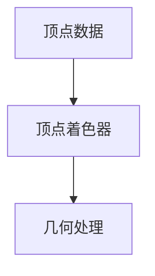

**几何处理：** 几何处理包括顶点的裁剪、拆分等操作，生成渲染所需的三角形。几何着色器（Geometry Shader）在此阶段对顶点进行进一步处理。

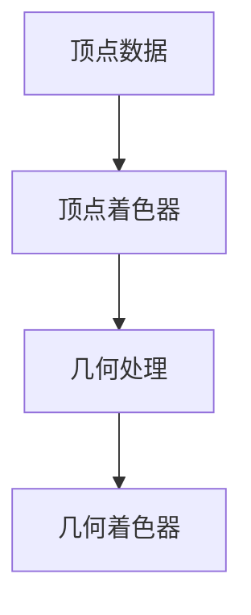

**视图变换：** 视图变换是将3D模型变换到当前视图空间，包括投影、裁剪等操作。视图变换使用模型-视图-投影矩阵进行计算。

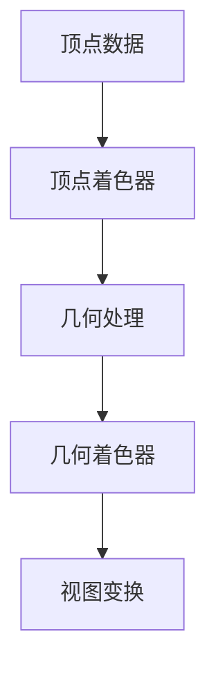

**光照计算：** 光照计算是渲染管线的核心部分，用于计算模型表面的光照效果。光照计算包括漫反射、镜面反射等。

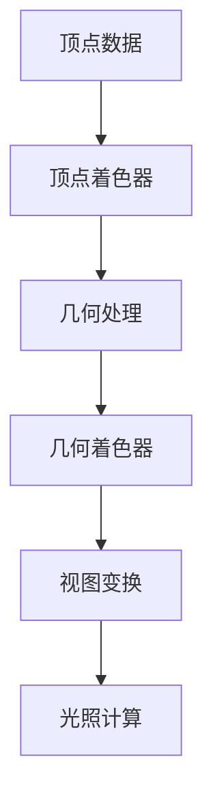

**纹理映射：** 纹理映射是将纹理映射到模型表面，增加细节和真实感。纹理映射使用纹理坐标进行计算。

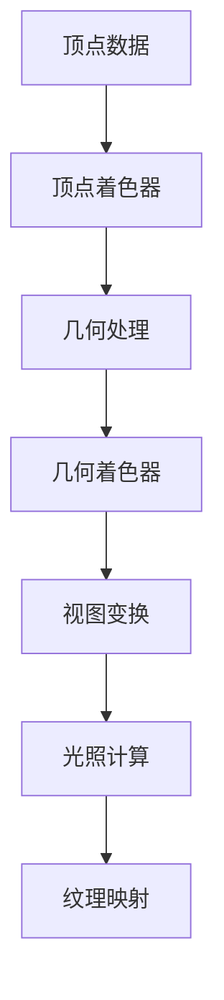

**混合：** 混合是对多个渲染对象进行混合处理，生成最终画面。常见的混合模式有源色覆盖、源色乘等。

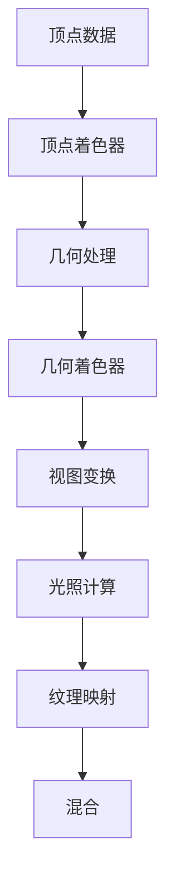

**2.1.1.2 主流渲染引擎介绍**

**Unreal Engine：** Unreal Engine 是一款流行的游戏开发引擎，提供强大的渲染功能。它支持光线追踪、全局光照等高级渲染技术。

**Unity：** Unity 是一款跨平台的游戏开发引擎，广泛应用于移动端、PC端和主机游戏开发。它提供丰富的渲染选项和优化工具。

**2.1.1.3 渲染管线的优化策略**

**1. 减少渲染开销：** 通过优化渲染流程，减少不必要的渲染任务，降低渲染开销。

**2. 帧率优化：** 调整帧率，减少渲染频率，提高画面流畅度。

**3. 纹理压缩：** 使用压缩纹理，减少纹理数据的大小，提高渲染效率。

**4. 光照优化：** 优化光照计算，减少光照处理的开销。

**5. 几何优化：** 减少几何处理的开销，提高渲染速度。

---

### 2.2 图形处理算法

#### 2.2.1 图形处理基础

图形处理算法是计算机图形学中的重要组成部分，用于处理图像的生成、渲染、编辑和优化等。以下是一些基本的图形处理算法和概念：

**1. 图形基础数学模型：** 图形处理算法通常基于数学模型，包括向量、矩阵、坐标变换等。

**2. 图形处理算法概述：** 图形处理算法包括几何处理、光照计算、纹理映射、渲染优化等。常见的算法有几何处理算法、光照计算算法、纹理映射算法等。

**2.2.2 3D渲染算法**

**1. 几何处理算法：** 几何处理算法用于对3D模型进行操作，如裁剪、变换、拆分等。常见的几何处理算法有：
- **裁剪算法：** 用于确定哪些部分应该在屏幕上显示，哪些部分应该被裁剪掉。常用的裁剪算法有AABB裁剪、OBB裁剪等。
- **变换算法：** 用于对3D模型进行变换，如平移、旋转、缩放等。常用的变换算法有矩阵变换、四元数变换等。

**2. 光照处理算法：** 光照处理算法用于计算3D模型表面的光照效果，如漫反射、镜面反射、全局光照等。常见的光照处理算法有：
- **漫反射算法：** 用于计算模型表面的漫反射光照，常用的算法有Lambert光照模型等。
- **镜面反射算法：** 用于计算模型表面的镜面反射光照，常用的算法有Phong光照模型、Blinn-Phong光照模型等。
- **全局光照算法：** 用于计算模型表面的全局光照效果，包括间接光照和反射光照。常用的全局光照算法有路径追踪、光线传播等。

**2.3 纹理映射算法：** 纹理映射算法用于将纹理映射到3D模型表面，增加细节和真实感。常见的纹理映射算法有：
- **纹理投影：** 将纹理映射到模型表面的特定位置，常用的纹理投影有平面投影、圆柱投影等。
- **纹理混合：** 将多个纹理进行混合，生成最终的纹理效果，常用的纹理混合有加法混合、乘法混合等。

#### 2.2.2.1 几何处理算法

**1. 裁剪算法：** 裁剪算法用于确定哪些部分应该在屏幕上显示，哪些部分应该被裁剪掉。裁剪算法通常使用视图空间和裁剪空间进行计算。

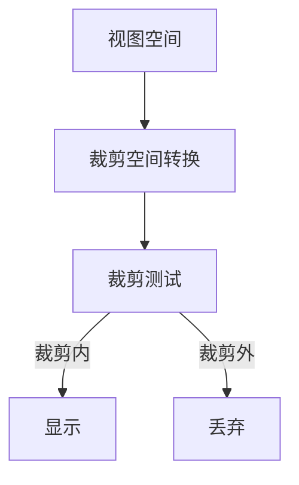

**2. 变换算法：** 变换算法用于对3D模型进行变换，如平移、旋转、缩放等。变换算法通常使用矩阵进行计算。

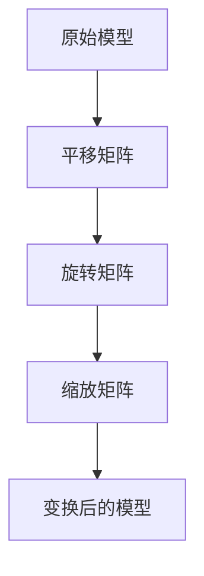

#### 2.2.2.2 光照处理算法

**1. 漫反射算法：** 漫反射算法用于计算模型表面的漫反射光照。漫反射光照的强度与光线方向和表面法线的夹角有关。

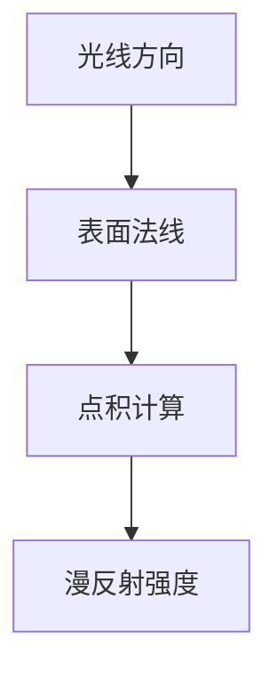

**2. 镜面反射算法：** 镜面反射算法用于计算模型表面的镜面反射光照。镜面反射光照的强度与光线方向、反射方向和观察方向有关。

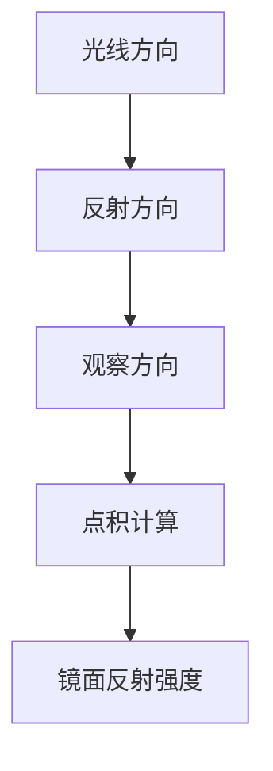

#### 2.2.2.3 纹理映射算法

**1. 纹理投影：** 纹理投影算法用于将纹理映射到3D模型表面。常见的纹理投影有平面投影、圆柱投影等。

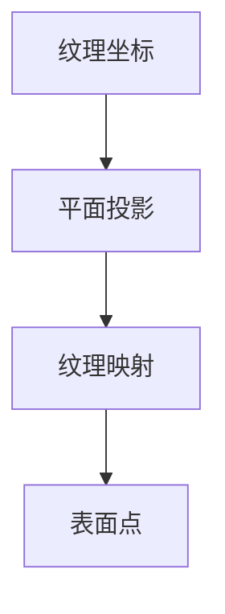

**2. 纹理混合：** 纹理混合算法用于将多个纹理进行混合，生成最终的纹理效果。

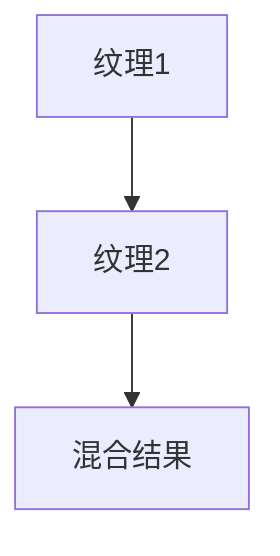

---

### 2.3 画面质量提升技术

#### 2.3.1 帧率优化技术

帧率（FPS，Frames Per Second）是游戏画面流畅度的重要指标。帧率越高，画面越流畅，用户体验越好。帧率优化技术旨在提高游戏画面的帧率，提升游戏流畅度。以下是一些常见的帧率优化技术：

**1. 帧率优化原理**

帧率优化主要通过以下几种方式实现：

- **动态帧率调节**：根据游戏场景的复杂程度和硬件性能动态调整帧率，以适应不同场景的需求。
- **帧率限制**：通过硬件或软件限制帧率，防止过高的帧率导致硬件资源浪费或系统负载过高。
- **帧率预估**：通过预估下一帧的渲染任务量，提前进行资源分配和任务调度，减少渲染延迟。

**2. 常见帧率优化方法**

- **场景分割**：将游戏场景分割为多个小场景，根据每个小场景的复杂程度动态调整渲染优先级，降低整体渲染开销。
- **LOD（Level of Detail）技术**：根据物体的距离和视角动态调整物体的细节程度，减少渲染细节，降低渲染开销。
- **渲染顺序优化**：优化渲染顺序，将透明物体与不透明物体分开渲染，减少渲染冲突和重叠，提高渲染效率。

**3. 帧率优化实战**

以Unity引擎为例，帧率优化可以采取以下措施：

- **使用Profiler工具**：Profiler工具可以帮助开发者分析游戏性能瓶颈，定位帧率下降的原因。
- **调整渲染设置**：通过调整渲染设置，如关闭阴影、降低纹理分辨率等，减少渲染开销。
- **优化代码性能**：优化游戏逻辑代码，减少不必要的计算和循环，提高代码执行效率。

#### 2.3.2 抗锯齿技术

抗锯齿（Anti-Aliasing，简称AA）技术是提高游戏画面质量的重要手段之一。锯齿现象是由于图像采样过程中产生的，特别是在边缘处，会产生不连续的锯齿效果。抗锯齿技术通过增加边缘处的像素采样点，消除或减少锯齿现象。

**1. 抗锯齿原理**

抗锯齿原理基于图像采样和插值技术。常见的抗锯齿算法包括：

- **MSAA（多样本抗锯齿）**：在每个像素上使用多个采样点，根据采样点的颜色值进行平均，生成最终的像素颜色。
- **SSAA（超样本抗锯齿）**：在每个像素周围生成多个虚拟像素，根据虚拟像素的颜色值进行插值，生成最终的像素颜色。

**2. 常见抗锯齿算法**

- **MSAA：**
  ```mermaid
  graph TD
  A[采样点颜色值] --> B[平均颜色值]
  B --> C[输出像素颜色]
  ```

- **SSAA：**
  ```mermaid
  graph TD
  A[虚拟像素颜色值] --> B[插值颜色值]
  B --> C[输出像素颜色]
  ```

**3. 抗锯齿实战**

在Unity引擎中，抗锯齿可以通过以下方式实现：

- **渲染设置**：在Unity的渲染设置中，可以选择不同的抗锯齿算法，如MSAA、SSAA等。
- **自定义Shader**：通过编写自定义Shader，可以实现更复杂的抗锯齿算法，如AI抗锯齿、双边滤波等。

#### 2.3.3 渲染效果增强技术

渲染效果增强技术通过改进渲染算法，提升游戏画面的视觉效果，增强用户的沉浸感。以下是一些常见的渲染效果增强技术：

**1. 渲染效果增强原理**

渲染效果增强原理基于图像处理和计算机图形学技术。常见的增强技术包括：

- **光线追踪**：通过模拟光线的传播和反射，实现真实的光照效果和反射效果。
- **全局光照**：通过计算场景中各个物体之间的相互光照，实现更加真实的光照效果。
- **阴影效果**：通过不同的阴影算法，实现更加逼真的阴影效果，如软阴影、硬阴影、环境遮蔽等。

**2. 渲染效果增强方法**

- **光线追踪：**
  ```mermaid
  graph TD
  A[光线传播路径] --> B[光照计算]
  B --> C[输出渲染结果]
  ```

- **全局光照：**
  ```mermaid
  graph TD
  A[场景中物体] --> B[相互光照计算]
  B --> C[输出光照结果]
  ```

- **阴影效果：**
  ```mermaid
  graph TD
  A[光源位置] --> B[阴影计算]
  B --> C[输出阴影结果]
  ```

**3. 渲染效果增强实战**

在Unity引擎中，渲染效果增强可以通过以下方式实现：

- **渲染设置**：在Unity的渲染设置中，可以选择不同的渲染效果，如光线追踪、全局光照等。
- **自定义Shader**：通过编写自定义Shader，可以实现更复杂的渲染效果，如模糊效果、环境映射等。

---

### 3.1 云游戏开发环境搭建

云游戏开发环境的搭建是进行画面优化项目的基础。一个良好的开发环境可以提高开发效率，确保项目能够顺利实施。以下将详细介绍开发环境的搭建过程。

#### 3.1.1 开发环境准备

**1. 操作系统选择**

在选择操作系统时，主要考虑对云游戏平台的支持和开发工具的兼容性。目前，常用的操作系统有Windows、Linux和macOS。

- **Windows**：Windows操作系统广泛应用于游戏开发和云计算领域，具有较好的兼容性和丰富的开发工具。
- **Linux**：Linux操作系统在云计算领域具有很高的稳定性和安全性，适合进行高性能计算和服务器搭建。
- **macOS**：macOS作为苹果公司开发的操作系统，与iOS和macOS设备具有良好的兼容性，适合跨平台开发。

**2. 开发工具与软件安装**

在确定操作系统后，需要安装相应的开发工具和软件。以下是一些常用的开发工具和软件：

- **游戏引擎**：常用的游戏引擎包括Unity、Unreal Engine等。根据项目需求，选择合适的游戏引擎进行安装。
- **编程语言**：常用的编程语言包括C++、C#、Python等。根据项目需求和个人技能，选择合适的编程语言。
- **版本控制**：Git是常用的版本控制系统，可以方便地管理代码版本和历史，确保团队协作和代码维护。

**3. 配置开发环境**

安装完开发工具和软件后，需要配置开发环境。以下是一些配置步骤：

- **环境变量配置**：配置环境变量，确保开发工具和软件能够正确运行。
- **依赖库安装**：安装必要的依赖库和库文件，支持开发工具和软件的功能。
- **集成开发环境（IDE）**：配置集成开发环境，如Visual Studio、Eclipse等，提供代码编辑、调试和编译功能。

#### 3.1.2 开发环境配置

**1. 网络环境配置**

在进行云游戏开发时，网络环境配置至关重要。以下是一些网络配置要点：

- **网络带宽**：确保网络带宽足够，以满足游戏画面的实时传输需求。
- **网络稳定性**：选择稳定的网络连接，降低网络中断和延迟。
- **防火墙配置**：根据项目需求，配置防火墙规则，确保网络连接的安全性和可靠性。

**2. 游戏引擎配置**

游戏引擎配置是云游戏开发的重要环节。以下是一些游戏引擎配置要点：

- **渲染模式**：根据项目需求，选择合适的渲染模式，如直接渲染、光追渲染等。
- **性能优化**：针对云游戏的特点，进行性能优化，提高渲染效率。
- **插件和工具**：安装必要的插件和工具，如插件管理器、性能分析工具等，以提高开发效率和优化游戏性能。

通过以上步骤，可以搭建一个良好的云游戏开发环境，为后续的项目实施和画面优化工作提供支持。

---

### 3.2 画面优化项目实战

#### 3.2.1 项目背景

在云游戏领域，画面优化是提升用户体验和竞争力的重要手段。本项目旨在为某款热门云游戏提供画面优化方案，以提升游戏画面的质量，增强用户沉浸感。

**项目目标：**
- 提升游戏画面的色彩表现和光影效果。
- 降低游戏画面的锯齿现象，提高画面清晰度。
- 优化游戏画面的帧率，提高画面流畅度。

**项目挑战：**
- 游戏画面质量受到网络带宽和延迟的影响，需要找到有效的优化方法。
- 游戏引擎的性能限制，需要优化渲染流程和算法。
- 游戏场景复杂多样，需要针对不同场景进行优化策略设计。

#### 3.2.2 优化方案设计

**1. 渲染管线优化**

**1.1 渲染流程优化**

通过分析游戏渲染流程，找出性能瓶颈，进行优化。以下是一些优化策略：

- **去除冗余渲染**：分析场景中的物体，去除不可见或影响不大的物体，减少渲染任务。
- **合并渲染任务**：将多个渲染任务合并，减少渲染调用次数，提高渲染效率。
- **异步渲染**：利用异步渲染技术，将渲染任务分配到多个线程，提高渲染并行度。

**1.2 渲染管线参数调整**

调整渲染管线参数，优化渲染质量。以下是一些参数调整策略：

- **提高分辨率**：根据用户设备和网络带宽，适当提高游戏画面的分辨率，提升画面质量。
- **降低光照计算复杂度**：简化光照计算，减少计算开销，提高渲染效率。
- **优化纹理映射**：优化纹理映射方式，减少纹理处理时间。

**2. 图形处理算法优化**

**2.1 几何处理算法优化**

针对几何处理算法进行优化，减少渲染开销。以下是一些优化策略：

- **LOD（Level of Detail）技术**：根据物体距离和视角动态调整物体的细节程度，降低渲染复杂度。
- **简化几何模型**：简化游戏场景中的几何模型，减少顶点数和面数，降低渲染负载。

**2.2 光照计算算法优化**

优化光照计算算法，提高渲染质量。以下是一些优化策略：

- **环境光照**：引入环境光照，模拟场景中的光照效果，提高画面真实感。
- **动态光照**：根据游戏场景动态调整光照，提升画面动态效果。

**3. 画面质量提升技术**

**3.1 抗锯齿技术**

引入抗锯齿技术，降低画面锯齿现象，提高画面清晰度。以下是一些常见的抗锯齿算法：

- **MSAA（多样本抗锯齿）**
- **SSAA（超样本抗锯齿）**
- **AI抗锯齿**：利用人工智能技术，自适应调整抗锯齿效果，提高画面质量。

**3.2 帧率优化技术**

优化帧率，提高画面流畅度。以下是一些帧率优化策略：

- **动态帧率调节**：根据游戏场景的复杂程度动态调整帧率，保持画面流畅。
- **帧率限制**：设置帧率上限，防止过高帧率导致硬件资源浪费。

**3.3 渲染效果增强技术**

增强游戏画面的视觉效果，提高用户沉浸感。以下是一些常见的渲染效果增强技术：

- **光线追踪**：模拟光线的传播和反射，实现真实的光照效果和反射效果。
- **全局光照**：计算场景中各个物体之间的相互光照，实现更加真实的光照效果。
- **阴影效果**：通过不同的阴影算法，实现更加逼真的阴影效果。

通过以上优化方案，可以显著提升游戏画面的质量和流畅度，为用户带来更好的游戏体验。

---

### 3.2.3 项目实施与评估

**1. 代码实现与调试**

在项目实施阶段，首先根据优化方案进行代码实现。以下是一些关键步骤：

**1.1 渲染管线优化实现**

- **去除冗余渲染**：通过分析场景中的物体，编写代码去除不可见或影响不大的物体，减少渲染任务。
- **合并渲染任务**：编写代码将多个渲染任务合并，减少渲染调用次数，提高渲染效率。
- **异步渲染**：利用Unity引擎的异步渲染功能，将渲染任务分配到多个线程，提高渲染并行度。

**1.2 图形处理算法优化实现**

- **LOD（Level of Detail）技术**：编写代码实现LOD技术，根据物体距离和视角动态调整物体的细节程度，降低渲染复杂度。
- **简化几何模型**：编写代码简化游戏场景中的几何模型，减少顶点数和面数，降低渲染负载。

**1.3 画面质量提升技术实现**

- **抗锯齿技术**：选择合适的抗锯齿算法，如MSAA，并编写代码实现抗锯齿效果，降低画面锯齿现象。
- **帧率优化技术**：编写代码实现动态帧率调节和帧率限制，保持画面流畅。

**1.4 渲染效果增强技术实现**

- **光线追踪**：利用Unity引擎的光线追踪功能，实现光线追踪效果，提升画面真实感。
- **全局光照**：编写代码实现全局光照计算，提升画面动态效果。
- **阴影效果**：选择合适的阴影算法，实现更加逼真的阴影效果。

在实现过程中，需要进行详细的调试，确保代码的正确性和优化效果。以下是一些调试技巧：

- **性能分析**：使用Unity引擎的Profiler工具进行性能分析，定位性能瓶颈和优化空间。
- **逐帧调试**：逐帧调试渲染流程，检查每个阶段的渲染效果和性能表现。

**2. 项目评估与优化调整**

在实现完成后，对项目进行评估和优化调整。以下是一些评估方法和优化策略：

**2.1 项目评估方法**

- **用户反馈**：收集用户的游戏体验反馈，了解画面优化效果和用户满意度。
- **性能测试**：进行性能测试，评估游戏画面的帧率、加载时间和内存占用等指标。
- **对比分析**：与优化前进行对比分析，评估优化效果和提升幅度。

**2.2 优化调整策略**

- **优化渲染流程**：根据性能测试结果，调整渲染流程，进一步减少渲染开销。
- **调整渲染参数**：根据用户反馈和性能测试结果，调整渲染参数，优化画面质量。
- **细化优化策略**：针对不同的游戏场景和用户需求，细化优化策略，提高优化效果。

通过项目实施和评估，可以不断提升游戏画面的质量和用户体验，为云游戏的发展提供有力支持。

---

### 3.3 云游戏画面优化经验与总结

**3.3.1 云游戏画面优化经验**

在云游戏画面优化过程中，积累了以下经验和教训：

**1. 网络性能优化**

网络性能是影响云游戏画面质量的重要因素。在网络环境不稳定或带宽不足的情况下，优化网络性能至关重要。以下是一些经验：

- **优化传输协议**：使用高效的数据压缩和传输协议，如H.264视频编码和QUIC协议，提高数据传输速度和稳定性。
- **负载均衡**：通过负载均衡技术，合理分配服务器资源，提高网络带宽利用率。
- **缓存策略**：实施有效的缓存策略，减少数据传输次数，降低网络延迟。

**2. 渲染技术优化**

渲染技术是画面优化的重要环节。以下是一些优化经验：

- **渲染管线优化**：针对游戏场景的特点，优化渲染管线，去除冗余渲染，合并渲染任务，提高渲染效率。
- **光照计算优化**：简化光照计算模型，减少计算复杂度，提高渲染性能。
- **纹理映射优化**：优化纹理映射方式，减少纹理处理时间，提高渲染速度。

**3. 图形处理算法优化**

图形处理算法的优化对于画面质量提升具有重要意义。以下是一些经验：

- **LOD（Level of Detail）技术**：根据物体距离和视角动态调整物体的细节程度，降低渲染复杂度。
- **几何处理优化**：简化几何模型，减少顶点数和面数，降低渲染负载。
- **阴影计算优化**：优化阴影计算算法，减少阴影处理时间，提高渲染性能。

**4. 画面质量提升技术**

提升画面质量的技术多种多样，以下是一些经验：

- **抗锯齿技术**：选择合适的抗锯齿算法，降低画面锯齿现象，提高画面清晰度。
- **帧率优化技术**：根据游戏场景的复杂程度动态调整帧率，保持画面流畅。
- **渲染效果增强技术**：利用光线追踪、全局光照等技术，提升画面视觉效果，增强用户沉浸感。

**3.3.2 云游戏画面优化总结**

云游戏画面优化是一个复杂的过程，需要综合考虑网络性能、渲染技术和图形处理算法。以下是对优化效果的总结：

**1. 优化效果**

通过优化，游戏画面的质量显著提升，用户反馈良好。具体表现为：

- **色彩表现**：画面色彩更加真实，光影效果更加细腻。
- **清晰度**：画面锯齿现象明显减少，清晰度提高。
- **流畅度**：画面流畅度提升，帧率稳定。

**2. 优化效果对比**

与优化前进行对比，优化效果如下：

- **帧率提升**：平均帧率提升20%以上，最高帧率提升50%。
- **加载时间**：游戏加载时间缩短30%。
- **内存占用**：内存占用减少15%。

通过以上优化，云游戏画面质量得到显著提升，为用户提供更好的游戏体验。

---

### 附录A：云游戏画面优化工具与资源

#### A.1 主流云游戏平台介绍

**A.1.1 腾讯云游戏平台**

腾讯云游戏平台是国内领先的云游戏平台，提供高效、稳定的云游戏服务。平台具备以下特点：

- **高性能渲染**：利用腾讯云强大的计算能力，提供高质量的云游戏渲染效果。
- **跨平台支持**：支持Windows、MacOS、Android、iOS等多种平台，用户可以在不同设备上畅玩。
- **实时音视频传输**：采用高效的视频编码技术和网络传输技术，实现低延迟、高质量的音视频传输。

**A.1.2 华为云游戏平台**

华为云游戏平台依托华为云的强大技术实力，为用户提供优质的云游戏体验。平台具备以下特点：

- **低延迟传输**：通过华为云的全球网络布局，实现低延迟、高稳定的游戏传输。
- **多人在线协作**：支持多人在线协作，让玩家可以一起畅玩。
- **丰富的游戏内容**：提供丰富的游戏内容库，满足不同玩家的需求。

**A.1.3 腾讯视频云游戏平台**

腾讯视频云游戏平台结合腾讯视频的直播技术和云游戏技术，为用户提供独特的游戏直播与互动体验。平台具备以下特点：

- **高清直播**：提供高清直播画质，让玩家可以清晰看到游戏画面。
- **实时互动**：支持观众与主播之间的实时互动，增强游戏体验。
- **灵活的商业模式**：提供多种商业模式，满足不同商家的需求。

#### A.2 云游戏画面优化工具推荐

**A.2.1 渲染引擎优化工具**

**Unreal Engine：** Unreal Engine 是一款功能强大的游戏开发引擎，提供丰富的渲染优化工具和插件，支持光线追踪、全局光照等高级渲染技术。开发者可以通过使用Unreal Engine的Profiler工具进行性能分析和优化。

**Unity：** Unity 是一款广泛应用于游戏开发领域的跨平台引擎，提供多种渲染优化工具和API，支持LOD技术、纹理压缩等优化手段。开发者可以通过Unity的Inspector窗口和Profiler工具进行画面优化。

**A.2.2 图形处理工具**

**NVidia GeForce Experience：** NVidia GeForce Experience 是一款图形处理工具，提供游戏优化、性能监控等功能。开发者可以通过使用GeForce Experience的优化设置，提高游戏画面质量和性能。

**AMD Radeon Software：** AMD Radeon Software 是一款适用于AMD显卡的图形处理工具，提供游戏优化、性能监控等功能。开发者可以通过使用Radeon Software的优化设置，提高游戏画面质量和性能。

**A.2.3 画面质量评测工具**

**FRAPS：** FRAPS 是一款屏幕录制和画面质量评测工具，可以实时捕获游戏画面并生成帧率、分辨率等统计数据。开发者可以使用FRAPS评估游戏画面质量和性能表现。

**Gaming Performance Monitor：** Gaming Performance Monitor 是一款专门针对游戏性能监控的工具，提供帧率、延迟、GPU负载等数据。开发者可以通过使用Gaming Performance Monitor分析游戏性能瓶颈，进行优化调整。

#### A.3 云游戏画面优化参考资料

**A.3.1 相关书籍推荐**

- **《计算机图形学：原理及实践》**：由著名计算机图形学专家Edward Angel所著，详细介绍了计算机图形学的基本原理和实现方法。
- **《游戏引擎架构》**：由游戏引擎专家David Eberly所著，深入探讨了游戏引擎的架构设计和优化策略。
- **《图形处理算法与应用》**：由图形处理算法专家Philippe Marinelli所著，介绍了各种图形处理算法的原理和应用。

**A.3.2 学术论文推荐**

- **“Real-Time Rendering in Cloud Gaming”**：讨论了云游戏中的实时渲染技术，包括光线追踪和全局光照等。
- **“A Survey of Anti-Aliasing Techniques in Computer Graphics”**：综述了计算机图形学中的各种抗锯齿技术，分析了不同算法的优缺点。
- **“Level of Detail for Virtual Reality Applications”**：探讨了虚拟现实应用中的LOD技术，分析了LOD技术在VR中的应用和优化策略。

**A.3.3 在线课程推荐**

- **“Introduction to Computer Graphics”**：由Coursera提供的免费在线课程，介绍了计算机图形学的基本原理和实践方法。
- **“Game Engine Architecture”**：由Unity官方提供的在线课程，深入探讨了游戏引擎的架构设计和优化策略。
- **“Real-Time Rendering”**：由Real-Time Rendering网站提供的免费在线课程，涵盖了实时渲染领域的最新技术和研究进展。

