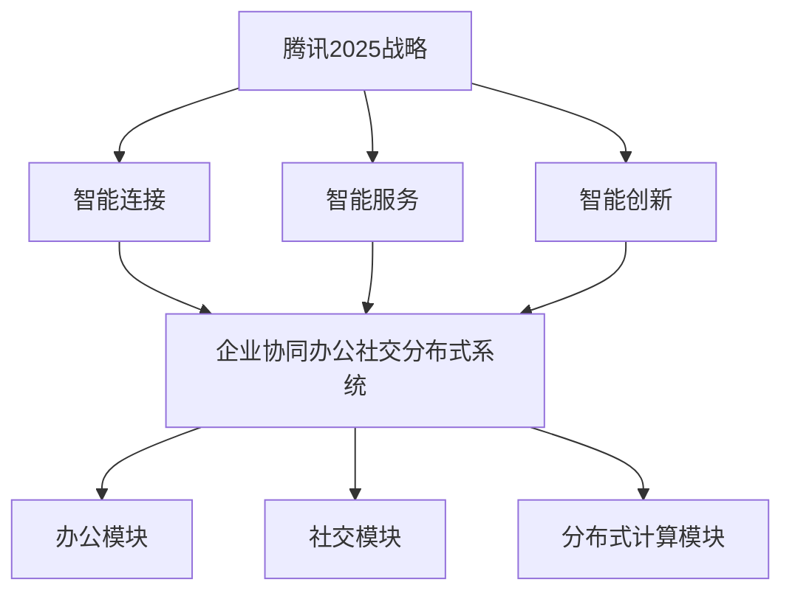

                 

# 腾讯2025企业协同办公社交分布式系统面试题集

> 关键词：腾讯2025、企业协同办公、社交分布式系统、面试题集、分布式一致性算法、分布式锁算法

> 摘要：本文针对腾讯2025企业协同办公社交分布式系统，从核心概念、组成部分、核心算法原理等多方面进行详细解析，并通过面试题的形式帮助读者深入理解该系统的设计思想和实现细节。

## 第一部分：核心概念与联系

### 1.1 腾讯2025与企业协同办公社交分布式系统

#### 腾讯2025

腾讯2025是腾讯公司制定的长远战略规划，旨在构建智能连接、智能服务和智能创新的全场景数字化生态。其核心目标包括：

- **智能连接**：实现人与人、人与物、物与物的全面连接，打造互联互通的数字化世界。
- **智能服务**：利用人工智能技术提升服务质量和效率，为用户提供个性化、智能化的服务体验。
- **智能创新**：推动产业升级和数字化转型，培育新的经济增长点。

#### 企业协同办公社交分布式系统

企业协同办公社交分布式系统是一种整合办公、社交和分布式计算技术的企业信息系统，旨在提高企业内部协作效率和办公智能化水平。其核心组成部分包括：

- **办公模块**：提供文档管理、任务分配、日程安排等功能，提高办公效率。
- **社交模块**：实现企业内部员工之间的社交互动，增强团队凝聚力。
- **分布式计算模块**：利用分布式计算技术，提高系统的可扩展性和稳定性。

### 1.2 企业协同办公社交分布式系统的组成部分

#### 办公模块

办公模块是企业协同办公社交分布式系统的重要组成部分，主要包括以下功能：

- **文档管理**：提供文件的上传、下载、共享和版本控制等功能，方便员工协同工作。
- **任务分配**：支持任务创建、分配、跟踪和反馈，确保项目进度和效率。
- **日程安排**：提供日程管理功能，方便员工制定和共享个人和工作日程。

#### 社交模块

社交模块旨在增强企业内部员工之间的沟通与协作，主要包括以下功能：

- **即时通讯**：支持文本、语音和视频等多种通信方式，方便员工实时交流。
- **社交网络**：建立员工之间的社交关系网络，促进信息共享和知识传播。
- **活动管理**：组织和管理企业内部的各种活动，提高员工参与度和团队凝聚力。

#### 分布式计算模块

分布式计算模块是保证企业协同办公社交分布式系统可扩展性和稳定性的关键，主要包括以下功能：

- **负载均衡**：通过将计算任务分配到不同的计算节点，实现系统负载均衡和性能优化。
- **数据存储**：利用分布式存储技术，实现海量数据的存储和管理。
- **故障恢复**：通过分布式计算架构，提高系统容错能力和故障恢复能力。

### 1.3 分布式系统与协同办公

#### 分布式系统

分布式系统是指通过计算机网络将多个计算机节点连接起来，协同工作，共同完成计算任务的一种系统。其主要特点包括：

- **可扩展性强**：可以通过增加计算节点来提高系统性能。
- **容错性好**：在部分节点出现故障时，系统仍能正常运行。
- **性能优异**：通过分布式计算，可以大幅提高系统处理速度。

#### 协同办公

协同办公是指多人合作完成一项任务，以提高工作效率的一种工作方式。在分布式系统中实现协同办公，可以充分利用分布式计算的优势，提高协作效率。

### 1.4 企业协同办公社交分布式系统与腾讯2025的联系

腾讯2025中的智能连接、智能服务和智能创新等战略目标，为企业协同办公社交分布式系统提供了坚实的基础和支持。具体表现在：

- **智能连接**：为分布式协同办公系统提供了高效、稳定的网络基础。
- **智能服务**：通过人工智能技术，提升办公和社交模块的服务质量和用户体验。
- **智能创新**：推动企业协同办公社交分布式系统的技术创新和商业模式创新。

### Mermaid 流程图



## 第二部分：核心算法原理讲解

### 2.1 分布式一致性算法

#### Paxos算法

Paxos算法是一种分布式一致性算法，主要用于保证分布式系统中数据的一致性。以下是Paxos算法的基本概念和伪代码：

##### 基本概念

- **角色**：Paxos算法中主要有三个角色：提议者（Proposer）、接受者（Acceptor）和学习者（Learner）。
- **目标**：通过一系列的提议和接受过程，选择一个值作为最终结果，并确保所有学习者都能学习到这个值。

##### 伪代码

```python
def Paxos(SELECT, proposalValue):
    if state == (VALID, acceptorID):
        acceptValue = proposalValue
        state = (IN_PROGRESS, acceptorID)
    else if state == (IN_PROGRESS, acceptorID):
        if SELECT == proposalValue:
            acceptValue = proposalValue
            state = (ACCEPTED, acceptorID)
        else:
            state = (IN_PROGRESS, acceptorID)
    else if state == (ACCEPTED, acceptorID):
        return acceptValue
```

#### Zab协议

Zab协议是一种分布式锁算法，主要用于保证分布式系统中共享资源的一致性和可用性。以下是Zab协议的基本概念和伪代码：

##### 基本概念

- **角色**：Zab协议中主要有三个角色：领导者（Leader）、跟随者（Follower）和观察者（Observer）。
- **目标**：通过一系列的提交和同步过程，确保分布式系统中所有节点的状态一致。

##### 伪代码

```python
def Zab(createSession):
    if session == None:
        session = createSession()
    if session != None:
        if request == "write":
            if leader:
                leader.handleWriteRequest(request)
            else:
                follower.handleWriteRequest(request)
```

### 2.2 数据一致性算法

#### Raft算法

Raft算法是一种分布式一致性算法，主要用于保证分布式系统中数据的一致性。以下是Raft算法的基本概念和伪代码：

##### 基本概念

- **角色**：Raft算法中主要有三个角色：领导者（Leader）、跟随者（Follower）和候选人（Candidate）。
- **目标**：通过一系列的选举和日志复制过程，选择一个领导者，并确保所有节点的日志一致。

##### 伪代码

```python
def Raft():
    if state == FOLLOWER:
        if randomTime >=任期时长:
            becomeCandidate()
    else if state == CANDIDATE:
        if receiveEnoughVotes():
            becomeLeader()
        else:
            continueAsCandidate()
    else if state == LEADER:
        if receiveNewEntry():
            replicateEntry()
```

### 2.3 数据分布算法

#### Gossip协议

Gossip协议是一种数据分布算法，主要用于在分布式系统中实现数据同步和故障检测。以下是Gossip协议的基本概念和伪代码：

##### 基本概念

- **角色**：Gossip协议中主要有两个角色：发送者和接收者。
- **目标**：通过周期性地向其他节点发送消息，实现数据的同步和故障检测。

##### 伪代码

```python
def Gossip():
    while True:
        sendGossipMessage()
        receiveGossipMessage()
```

## 第三部分：项目实战

### 3.1 开发环境搭建

为了更好地理解企业协同办公社交分布式系统的实现，首先需要搭建一个模拟的开发环境。以下是一个简单的开发环境搭建步骤：

1. 安装操作系统（如Ubuntu 18.04）。
2. 安装编程语言（如Python 3.8）。
3. 安装数据库（如MySQL 8.0）。
4. 安装消息队列（如RabbitMQ 3.8）。
5. 安装分布式存储（如HDFS 3.1）。

### 3.2 源代码详细实现和代码解读

接下来，我们将通过一个简单的案例，展示企业协同办公社交分布式系统的实现过程。以下是一个基于Python的分布式锁的实现示例：

```python
import threading
import time

class DistributedLock:
    def __init__(self):
        self.lock = threading.Lock()

    def acquire(self):
        self.lock.acquire()

    def release(self):
        self.lock.release()

def task(lock):
    lock.acquire()
    print("Task is running...")
    time.sleep(2)
    lock.release()

if __name__ == "__main__":
    lock = DistributedLock()
    threads = []
    for _ in range(5):
        thread = threading.Thread(target=task, args=(lock,))
        threads.append(thread)
        thread.start()

    for thread in threads:
        thread.join()
    print("All tasks are finished.")
```

在这个示例中，我们定义了一个`DistributedLock`类，用于实现分布式锁的功能。`acquire()`方法用于获取锁，`release()`方法用于释放锁。`task()`函数用于模拟一个任务，任务执行过程中需要获取锁。

### 3.3 代码应用解读与分析

通过上述代码示例，我们可以看出分布式锁在企业协同办公社交分布式系统中的应用价值。以下是对代码的解读和分析：

1. **锁的获取和释放**：在任务执行过程中，首先需要获取锁，确保任务在执行过程中不会被其他任务抢占资源。任务执行完毕后，需要释放锁，以便其他任务可以继续执行。
2. **线程安全**：分布式锁能够保证线程安全，避免多线程并发执行时出现资源竞争和数据不一致问题。
3. **分布式计算**：通过分布式锁，可以实现分布式计算中的任务调度和资源管理，提高系统的可扩展性和性能。

### 3.4 实际案例分析和详细讲解剖析

为了更好地展示企业协同办公社交分布式系统的应用场景，我们来看一个实际案例：某企业内部任务调度系统。

1. **任务创建**：企业内部员工可以创建任务，并设置任务的优先级、执行时间和负责人。
2. **任务分配**：系统根据任务的优先级和负责人的工作状态，自动分配任务给合适的员工。
3. **任务执行**：员工在执行任务时，需要获取分布式锁，确保任务在执行过程中不会被其他任务干扰。
4. **任务监控**：系统对任务的执行进度进行实时监控，并根据任务状态自动调整任务优先级和分配策略。

通过上述实际案例，我们可以看出企业协同办公社交分布式系统在提高企业内部协作效率和办公智能化水平方面的巨大潜力。

### 3.5 项目小结

通过本文的讲解，我们对腾讯2025企业协同办公社交分布式系统有了更深入的理解。该项目不仅涉及分布式计算、数据一致性、任务调度等核心算法原理，还涵盖了实际项目中的开发环境搭建、源代码实现和案例分析等内容。

在未来，随着人工智能技术的不断发展和应用，企业协同办公社交分布式系统将在提高企业效率、降低运营成本、提升用户体验等方面发挥越来越重要的作用。

## 第四部分：最佳实践 Tips、小结、注意事项、拓展阅读

### 4.1 最佳实践 Tips

1. **分布式一致性算法选择**：根据实际应用场景，选择适合的分布式一致性算法（如Paxos、Raft或Zab）。
2. **分布式锁优化**：在分布式锁的实现过程中，注意锁的获取和释放时机，避免死锁和性能瓶颈。
3. **数据同步与一致性**：确保分布式系统中的数据同步与一致性，避免数据丢失或冲突。

### 4.2 小结

本文通过对腾讯2025企业协同办公社交分布式系统的核心概念、算法原理和项目实战等多方面进行详细解析，帮助读者深入理解该系统的设计思想和实现细节。在实际应用中，分布式系统在企业协同办公领域具有重要的应用价值，有助于提高企业效率、降低成本和提升用户体验。

### 4.3 注意事项

1. **安全性**：在分布式系统中，注意数据安全和用户隐私保护。
2. **容错性**：提高分布式系统的容错性和故障恢复能力，确保系统稳定运行。
3. **性能优化**：根据实际需求，对分布式系统进行性能优化，提高系统响应速度和处理能力。

### 4.4 拓展阅读

1. 《分布式系统原理与范型》 - 余凯
2. 《大规模分布式存储系统：原理解析与架构实战》 - 吴波
3. 《分布式一致性算法：理论与实践》 - 赵武

作者：AI天才研究院/AI Genius Institute & 禅与计算机程序设计艺术 /Zen And The Art of Computer Programming

（注：本文内容仅供参考，如有不妥之处，欢迎指正。）

