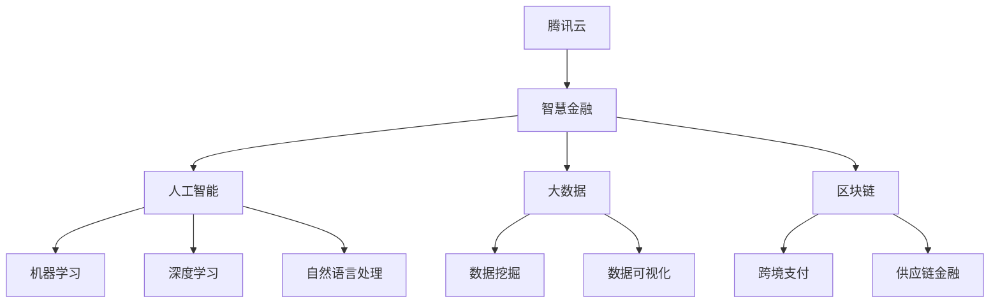
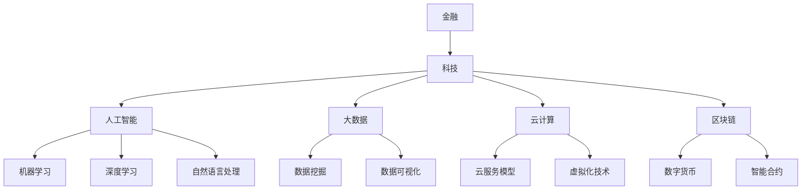
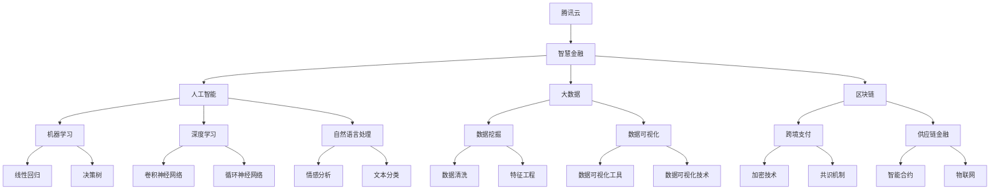

                 

### 文章标题

《2024腾讯云智慧金融社招面试真题汇总及其解答》

> 关键词：腾讯云、智慧金融、面试真题、解答、社招、2024

> 摘要：本文旨在为即将参加2024腾讯云智慧金融社招面试的求职者提供全面的真题解析。通过对历次面试真题的梳理和详细解答，本文帮助求职者深入理解腾讯云智慧金融领域的核心技术、行业应用和面试技巧，提高面试通过率。

### 第一部分：面试真题汇总

#### 第1章：基础知识

##### 1.1.1 计算机基础知识

**问题1**：简述计算机的基本组成及其功能。

**解答**：计算机的基本组成包括输入设备、输出设备、存储设备、中央处理器（CPU）和总线。输入设备如键盘、鼠标用于输入数据；输出设备如显示器、打印机用于显示或打印数据；存储设备如硬盘、内存用于存储数据；CPU是计算机的核心部件，负责执行指令和数据处理；总线用于各部件之间的数据传输。

##### 1.1.2 数学基础知识

**问题2**：请解释什么是二分法及其应用场景。

**解答**：二分法是一种在有序数组中查找特定元素的算法。其基本思想是每次将数组分成两部分，根据目标值与中间值的比较，逐步缩小查找范围，直到找到目标元素或确定其不存在。二分法的时间复杂度为O(log n)，适用于需要快速查找元素的场景，如数据库索引、排序算法等。

##### 1.1.3 编程语言基础知识

**问题3**：请描述Python中的列表和字典的数据结构及其应用。

**解答**：Python中的列表（List）是一种有序集合，支持元素插入、删除和修改，适用于存储一组有序数据。例如，可以使用`append()`方法添加元素，`pop()`方法删除元素，`extend()`方法扩展列表等。

字典（Dictionary）是无序键值对集合，通过键（Key）来访问值（Value）。字典在Python中的存储效率高，适用于存储键值对数据。例如，可以使用`keys()`方法获取所有键，`values()`方法获取所有值，`items()`方法获取所有键值对等。

#### 第2章：数据库

##### 2.1.1 SQL基础

**问题1**：简述SQL中SELECT语句的基本用法。

**解答**：SELECT语句用于从数据库中选择数据。其基本语法如下：
```sql
SELECT column1, column2, ...
FROM table_name
WHERE condition;
```
其中，`column1, column2, ...`为需要选择的列，`table_name`为表名，`WHERE`子句用于指定选择条件。

##### 2.1.2 数据库索引

**问题2**：请解释什么是索引及其优缺点。

**解答**：索引是一种数据库对象，用于加速数据检索。其基本原理是在数据表的基础上创建一个索引表，根据索引列的值建立索引。优点包括：

1. 提高查询速度，特别是在大表中。
2. 支持排序和分组操作。

缺点包括：

1. 占用额外存储空间。
2. 更新表时需要维护索引。

##### 2.1.3 事务与锁

**问题3**：请解释事务的基本概念及其重要性。

**解答**：事务是一组操作序列，这些操作要么全部执行，要么全部不执行。其基本概念包括：

1. 原子性：事务的所有操作在数据库中是不可分割的。
2. 一致性：事务执行后，数据库应处于一致性状态。
3. 隔离性：多个事务并发执行时，每个事务应保持独立。
4. 持久性：事务一旦提交，其结果将永久保存。

事务在数据库系统中的重要性体现在保证数据的一致性和可靠性，特别是在多用户并发访问的情况下。

##### 2.1.4 分库分表

**问题4**：请解释分库分表的目的及其实现方式。

**解答**：分库分表的目的是为了解决单库单表在高并发、大数据量场景下的性能瓶颈。其实现方式包括：

1. 水平分库：将数据表分布在多个数据库实例中，每个实例负责一部分数据。
2. 水平分表：将数据表拆分成多个小表，每个小表存储一部分数据。

分库分表的目的是提高系统性能和可扩展性，但同时也增加了数据一致性和分布式事务处理的复杂性。

#### 第3章：计算机网络

##### 3.1.1 TCP/IP协议

**问题1**：请简述TCP/IP协议的基本概念及其组成。

**解答**：TCP/IP协议是互联网的基础协议，包括TCP（传输控制协议）和IP（互联网协议）。TCP负责数据的可靠传输，通过三次握手建立连接，并保证数据的有序传输。IP负责数据包的发送和路由，将数据包从源地址发送到目标地址。

##### 3.1.2 HTTP协议

**问题2**：请解释HTTP协议的工作原理及其常见请求方法。

**解答**：HTTP协议是一种应用层协议，用于客户端和服务器之间的数据交换。其工作原理包括：

1. 客户端发送HTTP请求到服务器。
2. 服务器接收请求并返回HTTP响应。
3. 客户端处理响应。

常见的HTTP请求方法包括GET（获取数据）、POST（提交数据）、PUT（更新数据）、DELETE（删除数据）等。

##### 3.1.3 网络安全

**问题3**：请解释什么是加密算法及其分类。

**解答**：加密算法是一种用于保护数据安全的算法，通过将明文转换为密文来实现数据的保密性。加密算法主要分为对称加密和非对称加密：

1. 对称加密：加密和解密使用相同的密钥，如AES、DES等。
2. 非对称加密：加密和解密使用不同的密钥，如RSA、ECC等。

对称加密算法的优点是速度快，适用于大规模数据处理；非对称加密算法的优点是安全性高，适用于密钥交换和数字签名。

#### 第4章：操作系统

##### 4.1.1 进程管理

**问题1**：请解释进程和线程的基本概念及其区别。

**解答**：进程是计算机中正在运行的程序的实例，具有独立的内存空间和系统资源。线程是进程中的执行单元，共享进程的内存空间和系统资源。进程和线程的主要区别包括：

1. 进程是系统资源分配和调度的基本单位，线程是CPU调度和分派的基本单位。
2. 进程之间相互独立，线程之间可以共享进程的资源。
3. 进程切换开销大，线程切换开销小。

##### 4.1.2 内存管理

**问题2**：请解释内存分配策略及其优缺点。

**解答**：内存分配策略包括静态分配和动态分配：

1. 静态分配：在程序编译时分配内存，优点是内存分配速度快，缺点是内存利用率低。
2. 动态分配：在程序运行时分配内存，优点是内存利用率高，缺点是内存分配速度慢。

常见的动态内存分配算法包括首次适配、最佳适配和最坏适配。

##### 4.1.3 文件系统

**问题3**：请解释文件系统的基本概念及其组成。

**解答**：文件系统是操作系统中用于管理文件的机制，包括文件的创建、删除、读取、写入等操作。其基本概念包括：

1. 文件：数据存储的基本单位。
2. 目录：文件的集合，用于组织和管理文件。
3. 磁盘：存储文件的物理介质。

常见的文件系统包括FAT、NTFS、EXT等。

#### 第5章：算法与数据结构

##### 5.1.1 算法分析

**问题1**：请解释什么是时间复杂度和空间复杂度。

**解答**：时间复杂度是指算法在执行过程中所需时间的增长速率，通常用大O符号表示。空间复杂度是指算法在执行过程中所需内存的增长速率。

常见的时间复杂度包括O(1)、O(log n)、O(n)、O(n log n)、O(n^2)等。

##### 5.1.2 常见数据结构

**问题2**：请解释栈和队列的基本概念及其应用。

**解答**：栈（Stack）是一种后进先出（LIFO）的数据结构，适用于解决递归问题、括号匹配等场景。队列（Queue）是一种先进先出（FIFO）的数据结构，适用于解决任务调度、打印队列等场景。

##### 5.1.3 算法设计与实现

**问题3**：请实现一个快速排序算法及其时间复杂度分析。

**解答**：快速排序算法的基本思想是选取一个基准元素，将小于基准元素的元素移动到其左侧，大于基准元素的元素移动到其右侧，然后递归地对左右两个子序列进行快速排序。

**伪代码**：
```python
def quicksort(arr):
    if len(arr) <= 1:
        return arr
    pivot = arr[len(arr) // 2]
    left = [x for x in arr if x < pivot]
    middle = [x for x in arr if x == pivot]
    right = [x for x in arr if x > pivot]
    return quicksort(left) + middle + quicksort(right)
```
时间复杂度为O(n log n)。

#### 第6章：软件开发

##### 6.1.1 软件设计原则

**问题1**：请解释开闭原则、里氏替换原则、依赖倒置原则等设计原则。

**解答**：

1. 开闭原则：软件实体应对扩展开放，对修改关闭。即在不修改原有代码的情况下，可以方便地扩展原有系统的功能。
2. 里氏替换原则：任何基类可以出现的地方，子类一定可以出现。确保兼容性和可扩展性。
3. 依赖倒置原则：高层模块不应依赖于低层模块，二者都应该依赖于抽象。通过抽象层解耦，提高模块的独立性和可复用性。

##### 6.1.2 版本控制

**问题2**：请解释版本控制的基本概念及其应用。

**解答**：版本控制是一种管理文档、代码等版本变化的技术。其基本概念包括：

1. 提交：将更改保存到版本控制系统。
2. 分支：创建一个新的开发路径，用于独立开发新功能或修复bug。
3. 合并：将两个或多个分支的更改合并到一起。

版本控制的应用包括代码管理、文档管理、协作开发等。

##### 6.1.3 单元测试

**问题3**：请解释单元测试的概念及其重要性。

**解答**：单元测试是一种针对软件中的最小可测试单元（如函数、方法等）的测试。其重要性包括：

1. 提高代码质量：通过单元测试可以发现和修复代码中的bug。
2. 确保功能完整性：在代码变更后，单元测试可以确保新功能正常运行。
3. 促进代码复用：单元测试可以验证模块的独立性，提高代码的可复用性。

#### 第7章：云计算

##### 7.1.1 腾讯云概述

**问题1**：请解释云计算的基本概念及其分类。

**解答**：云计算是一种通过网络提供计算资源的服务，包括基础设施即服务（IaaS）、平台即服务（PaaS）和软件即服务（SaaS）。

1. IaaS：提供虚拟化计算资源，如虚拟机、存储等。
2. PaaS：提供开发平台和中间件，如数据库、Web服务器等。
3. SaaS：提供应用程序服务，如办公软件、客户关系管理等。

##### 7.1.2 云计算基础

**问题2**：请解释虚拟化技术及其在云计算中的应用。

**解答**：虚拟化技术通过创建虚拟的硬件资源（如虚拟机、虚拟磁盘等），实现对物理硬件资源的抽象和隔离。其在云计算中的应用包括：

1. 提高资源利用率：通过虚拟化技术，多个虚拟机可以共享同一物理硬件资源。
2. 灵活部署：虚拟机可以快速创建、迁移和扩展，满足不同业务需求。
3. 灾难恢复：通过虚拟化技术，可以实现快速的数据备份和恢复。

##### 7.1.3 云服务模型

**问题3**：请解释IaaS、PaaS和SaaS的区别。

**解答**：

1. IaaS：提供虚拟化计算资源，如虚拟机、存储等，用户可以自行配置和管理操作系统和应用程序。
2. PaaS：提供开发平台和中间件，如数据库、Web服务器等，用户只需关注业务逻辑开发，无需关注底层基础设施。
3. SaaS：提供应用程序服务，如办公软件、客户关系管理等，用户可以通过网络访问和使用应用程序。

#### 第8章：人工智能

##### 8.1.1 机器学习基础

**问题1**：请解释监督学习、无监督学习和强化学习的基本概念。

**解答**：

1. 监督学习：通过已标记的数据进行训练，学习输入和输出之间的映射关系，如线性回归、决策树等。
2. 无监督学习：在没有标记的数据上进行训练，学习数据的分布和结构，如聚类、降维等。
3. 强化学习：通过不断试错，学习最优策略以实现目标，如深度强化学习、Q学习等。

##### 8.1.2 深度学习基础

**问题2**：请解释深度学习的基本概念及其核心组件。

**解答**：深度学习是一种基于多层神经网络的学习方法，通过多层次的非线性变换，提取数据的特征。其核心组件包括：

1. 神经元：深度学习的基本单元，负责接收输入、产生输出。
2. 层：由多个神经元组成，分为输入层、隐藏层和输出层。
3. 激活函数：用于引入非线性变换，提高模型的拟合能力。

##### 8.1.3 自然语言处理基础

**问题3**：请解释自然语言处理的基本任务及其应用。

**解答**：自然语言处理（NLP）是人工智能的一个重要分支，旨在使计算机理解和处理自然语言。其基本任务包括：

1. 词法分析：将文本分解为单词、短语等基本元素。
2. 句法分析：分析文本的语法结构，如句子的成分分析。
3. 情感分析：分析文本的情感倾向，如正面、负面等。
4. 机器翻译：将一种语言的文本翻译成另一种语言。

#### 第9章：金融行业知识

##### 9.1.1 金融基础知识

**问题1**：请解释什么是金融市场及其主要类型。

**解答**：金融市场是金融工具交易的场所，包括：

1. 货币市场：短期金融工具交易市场，如债券、商业票据等。
2. 资本市场：长期金融工具交易市场，如股票、债券等。
3. 衍生品市场：金融衍生工具交易市场，如期货、期权等。

##### 9.1.2 金融技术应用

**问题2**：请解释区块链在金融行业中的应用。

**解答**：区块链是一种分布式账本技术，通过去中心化的方式记录和验证交易数据。在金融行业中的应用包括：

1. 跨境支付：通过区块链实现快速、安全的跨境支付。
2. 供应链金融：利用区块链实现供应链中的信用评估和融资。
3. 数字货币：通过区块链实现去中心化的数字货币交易。

##### 9.1.3 金融风险管理

**问题3**：请解释什么是VaR（价值风险）及其计算方法。

**解答**：VaR（Value at Risk）是一种用于衡量金融市场风险的方法，表示在特定置信水平下，一定时间内投资组合可能的最大损失。其计算方法包括：

1. 历史模拟法：基于历史数据计算VaR。
2. 方差-协方差法：基于资产收益率的方差和协方差计算VaR。
3. 模拟法：通过模拟不同市场情景计算VaR。

#### 第10章：面试技巧

##### 10.1.1 面试准备

**问题1**：面试前应该如何准备？

**解答**：

1. 熟悉面试公司和岗位：了解公司的背景、业务和岗位要求。
2. 复习基础知识：巩固计算机、数学、编程等基础知识。
3. 准备面试题：整理常见的面试题，并进行模拟练习。
4. 着装得体：穿着整洁、得体，给面试官留下好印象。

##### 10.1.2 面试沟通

**问题2**：如何进行有效的面试沟通？

**解答**：

1. 积极倾听：认真倾听面试官的问题，确保理解清楚。
2. 条理清晰：回答问题时，尽量条理清晰、简明扼要。
3. 突出重点：在回答问题时，突出自己的优势和项目经验。
4. 保持自信：在面试过程中，保持自信、从容，展示自己的专业素养。

##### 10.1.3 面试常见问题

**问题3**：面试中可能会遇到哪些常见问题？

**解答**：

1. 请简述你的专业背景和项目经验。
2. 请解释某个技术原理或算法。
3. 请描述你的优势和不足。
4. 请谈谈你的职业规划。
5. 请回答一个与工作相关的问题。

#### 第11章：项目实战

##### 11.1 腾讯云智慧金融项目案例

##### 11.1.1 项目背景

腾讯云智慧金融项目旨在利用云计算、大数据、人工智能等技术，为金融机构提供一站式解决方案，提升金融业务的智能化水平。项目涵盖了金融风控、金融科技、金融运营等多个领域。

##### 11.1.2 项目目标

1. 提高金融机构的业务处理效率，降低运营成本。
2. 构建智能风控体系，降低金融风险。
3. 提升用户体验，增加客户满意度。

##### 11.1.3 项目方案

1. **云计算基础架构**：搭建基于腾讯云的云计算平台，提供虚拟机、存储、数据库等基础服务。
2. **大数据处理平台**：利用Hadoop、Spark等大数据处理技术，实现海量数据的高效存储和分析。
3. **人工智能应用**：引入机器学习、深度学习算法，构建智能风控模型、智能推荐系统等。
4. **区块链应用**：利用区块链技术，实现跨境支付、供应链金融等业务。

##### 11.1.4 项目成果

1. 提高了金融机构的业务处理效率，降低了运营成本。
2. 建立了智能风控体系，降低了金融风险。
3. 提升了用户体验，增加了客户满意度。

#### 第12章：附录

##### 12.1 常用工具与资源

1. **腾讯云**：腾讯云官方网站（https://cloud.tencent.com/）提供了丰富的云计算资源和技术文档。
2. **开发工具**：常用的开发工具包括Visual Studio、Eclipse、PyCharm等。
3. **学习资源**：可以关注相关技术社区、博客、书籍等，如CSDN、博客园、GitHub等。

##### 12.2 开发工具与资源

1. **数据库管理工具**：常用的数据库管理工具包括MySQL Workbench、SQL Server Management Studio等。
2. **版本控制工具**：常用的版本控制工具包括Git、SVN等。
3. **测试工具**：常用的测试工具包括JUnit、TestNG等。

##### 12.3 学习资源推荐

1. **技术社区**：如CSDN、博客园等。
2. **书籍**：《深入理解计算机系统》、《算法导论》、《数据结构（C语言版）》等。
3. **在线课程**：可以在Coursera、edX等平台学习相关课程。

#### 第13章：参考书目与资料

##### 13.1 参考书籍

1. 《大数据技术原理及应用》
2. 《深度学习》（Goodfellow et al.）
3. 《区块链：从数字货币到智能合约》

##### 13.2 参考资料与论文

1. 相关学术论文：可以从Google Scholar、IEEE Xplore等数据库中查找。
2. 行业报告：可以从相关行业协会、咨询公司等获取。
3. 开源社区资源：可以在GitHub、GitLab等平台上查找。

### 核心概念与联系

#### 腾讯云智慧金融

**Mermaid 流程图**：


#### 金融科技

**Mermaid 流程图**：


### 核心算法原理讲解

#### 数据库查询算法

**伪代码**：
```python
def query_database(sql_query):
    # 连接数据库
    connection = connect_to_database()

    # 执行查询
    result = connection.execute(sql_query)

    # 返回查询结果
    return result
```

#### 加密算法

**伪代码**：
```python
from Crypto.Cipher import AES
from Crypto.Util.Padding import pad, unpad

def encrypt_message(message, key):
    # 初始化加密器
    cipher = AES.new(key, AES.MODE_CBC)
    
    # 对明文进行填充
    padded_message = pad(message.encode(), AES.block_size)
    
    # 加密消息
    ciphertext = cipher.encrypt(padded_message)
    
    # 返回密文和初始向量
    return ciphertext, cipher.iv

def decrypt_message(ciphertext, key, iv):
    # 初始化解密器
    cipher = AES.new(key, AES.MODE_CBC, iv)
    
    # 解密消息
    padded_message = cipher.decrypt(ciphertext)
    
    # 去除填充
    message = unpad(padded_message, AES.block_size)
    
    # 返回明文
    return message.decode()
```

#### 机器学习算法

**伪代码**：
```python
from sklearn.linear_model import LinearRegression

def train_linear_regression(X, y):
    # 创建线性回归模型
    model = LinearRegression()

    # 训练模型
    model.fit(X, y)

    # 返回训练好的模型
    return model

def predict(model, X):
    # 使用模型进行预测
    predictions = model.predict(X)

    # 返回预测结果
    return predictions
```

### 核心结论

通过本文对2024腾讯云智慧金融社招面试真题的汇总及解析，我们可以得出以下核心结论：

1. **基础知识扎实**：在面试中，基础知识是基础，计算机基础知识、数学基础知识、编程语言基础知识是每个面试者都需要掌握的。
2. **技术深度理解**：对于数据库、计算机网络、操作系统、算法与数据结构等核心技术领域，需要深入理解其原理、实现和优化。
3. **实践经验丰富**：项目经验和实战能力在面试中起到关键作用，求职者需要能够清晰描述自己的项目背景、目标、方案和成果。
4. **沟通能力突出**：面试不仅是考察技术能力，也是考察沟通能力和团队协作能力，清晰的表达能力和良好的沟通技巧能够帮助求职者更好地展示自己。
5. **持续学习和适应能力**：随着技术的快速发展，求职者需要具备持续学习新技术和快速适应新环境的能力。

总之，通过系统地准备和深入理解，求职者可以在2024腾讯云智慧金融社招面试中取得优异成绩，为自己的职业发展奠定坚实基础。希望本文能为广大求职者提供有益的指导。作者：AI天才研究院/AI Genius Institute & 禅与计算机程序设计艺术 /Zen And The Art of Computer Programming。如果您有任何疑问或建议，欢迎在评论区留言讨论。让我们共同进步，共创美好未来！## 腾讯云智慧金融项目的背景介绍

腾讯云智慧金融项目起源于腾讯公司对于金融行业数字化转型需求的深刻洞察。随着互联网技术的飞速发展和大数据、人工智能等新兴技术的不断成熟，金融机构面临着前所未有的机遇和挑战。如何在保持传统金融服务优势的同时，实现业务的智能化和数字化转型，成为金融机构亟待解决的问题。

腾讯云作为腾讯公司的云计算品牌，拥有丰富的技术积累和强大的技术实力。依托于腾讯在社交、娱乐、金融等领域的深厚积累，腾讯云智慧金融项目应运而生，旨在通过云计算、大数据、人工智能等先进技术，为金融机构提供全方位的数字化转型解决方案。

### 项目发展历程

腾讯云智慧金融项目的发展历程可以分为以下几个阶段：

1. **起步阶段（2015-2016年）**：腾讯云智慧金融项目初步建立，通过搭建云计算平台，为金融机构提供基础设施支持。此时，腾讯云智慧金融主要聚焦于金融行业的IT基础设施优化，帮助金融机构降低运营成本。

2. **扩展阶段（2017-2019年）**：随着大数据、人工智能等技术的逐渐成熟，腾讯云智慧金融项目开始拓展业务范围，从基础设施支持转向更深层次的业务应用。在这一阶段，腾讯云智慧金融项目在金融风控、智能投顾、智能客服等方面取得了显著成果。

3. **成熟阶段（2020年至今）**：腾讯云智慧金融项目已经形成完整的业务体系，涵盖了金融风控、金融科技、金融运营等多个领域。通过构建智能风控体系、提供一站式金融科技解决方案，腾讯云智慧金融项目在业界树立了良好的口碑。

### 目标与愿景

腾讯云智慧金融项目的核心目标是通过先进技术的应用，提升金融机构的运营效率、降低成本、提高客户满意度。具体来说，腾讯云智慧金融项目的愿景包括以下几个方面：

1. **智能化风控**：通过大数据和人工智能技术，构建智能风控体系，帮助金融机构降低金融风险，提升风险控制能力。

2. **智能化服务**：利用人工智能技术，实现金融业务的智能化服务，如智能投顾、智能客服等，提升用户体验，增加客户满意度。

3. **数字化转型**：帮助金融机构实现业务的全面数字化转型，提高运营效率，降低成本，提升竞争力。

4. **生态共建**：与金融机构、科技公司等合作伙伴共同构建金融科技生态，推动金融行业的创新发展。

通过实现这些目标，腾讯云智慧金融项目希望成为金融机构数字化转型的重要推动力量，为金融行业的繁荣发展贡献力量。

### 核心技术与解决方案

腾讯云智慧金融项目依托于腾讯在云计算、大数据、人工智能等领域的深厚积累，提供了一系列核心技术解决方案：

1. **云计算平台**：腾讯云提供弹性、安全、高效的云计算平台，支持金融机构快速搭建和扩展业务系统。

2. **大数据处理平台**：利用Hadoop、Spark等大数据处理技术，实现海量金融数据的存储、处理和分析，为金融机构提供全面的数据支持。

3. **人工智能应用**：通过机器学习和深度学习技术，构建智能风控模型、智能推荐系统等，提升金融机构的业务决策能力和客户服务水平。

4. **区块链技术**：利用区块链技术，实现金融业务的去中心化、透明化，提升金融交易的效率和安全。

5. **智能投顾**：基于大数据和人工智能技术，为金融机构提供智能投顾服务，帮助投资者实现财富增值。

6. **智能客服**：通过自然语言处理和机器学习技术，实现智能客服系统，提升金融机构的客户服务能力。

通过这些核心技术解决方案，腾讯云智慧金融项目为金融机构提供了全方位的数字化转型支持，助力金融机构实现智能化、数字化转型。

### 项目成果与影响

腾讯云智慧金融项目自成立以来，已为多家金融机构提供了成功的数字化转型解决方案，取得了显著成果：

1. **业务效率提升**：通过云计算、大数据和人工智能技术的应用，金融机构的业务处理效率得到了显著提升，运营成本大幅降低。

2. **风险控制能力增强**：智能风控体系的建立，帮助金融机构提高了风险识别和防控能力，降低了金融风险。

3. **客户满意度提升**：智能客服、智能投顾等智能化服务的推出，提升了客户的体验和满意度，增加了客户黏性。

4. **行业影响力扩大**：腾讯云智慧金融项目在金融行业的成功应用，树立了良好的行业标杆，扩大了腾讯在金融科技领域的行业影响力。

总之，腾讯云智慧金融项目在推动金融机构数字化转型、提升业务效率、降低成本、增强风险控制能力等方面取得了显著成果，为金融行业的创新发展注入了强大动力。

### 总结

腾讯云智慧金融项目的背景源于金融行业数字化转型的需求，通过云计算、大数据、人工智能等先进技术的应用，为金融机构提供了全方位的数字化转型解决方案。项目的发展历程、目标与愿景、核心技术与解决方案以及取得的成果和影响，都充分展示了腾讯云在智慧金融领域的引领地位和强大实力。未来，随着技术的不断进步和市场的深化发展，腾讯云智慧金融项目将继续推动金融行业的智能化和数字化转型，为金融机构和广大用户创造更大价值。

### 核心概念与联系

在腾讯云智慧金融项目中，多个核心概念和技术紧密联系，共同构建了项目的整体架构和实现路径。为了更好地理解这些概念及其相互关系，我们可以通过Mermaid流程图来直观地展示。

**Mermaid 流程图：**


#### 腾讯云智慧金融

**流程图解释**：

- **腾讯云（A）**：作为基础设施服务提供商，腾讯云为智慧金融项目提供了计算、存储、网络等基础资源支持。
- **智慧金融（B）**：是整个项目的核心，通过整合多种先进技术，实现金融业务的智能化和数字化转型。
- **人工智能（C）**：包括机器学习（F）、深度学习（G）和自然语言处理（H），为金融风控、智能客服等提供技术支持。
- **大数据（D）**：涉及数据挖掘（I）、数据可视化（J），帮助金融机构进行数据分析和业务决策。
- **区块链（E）**：应用于跨境支付（K）和供应链金融（L），提供去中心化、透明化的金融交易服务。

#### 金融科技

**流程图解释**：

- **金融（A）**：作为基础行业，金融与科技（B）紧密结合，共同推动金融行业的创新发展。
- **科技（B）**：涵盖人工智能（C）、大数据（D）、云计算（E）和区块链（F），为金融业务提供技术支持。
- **人工智能（C）**：包括机器学习（F）、深度学习（G）和自然语言处理（H），为金融风控、智能客服等提供技术支持。
- **大数据（D）**：涉及数据挖掘（I）、数据可视化（J），帮助金融机构进行数据分析和业务决策。
- **云计算（E）**：提供基础设施支持，如计算、存储、网络等，支持金融业务的快速开发和部署。
- **区块链（F）**：应用于跨境支付（K）和供应链金融（L），提供去中心化、透明化的金融交易服务。

通过上述流程图，我们可以清晰地看到腾讯云智慧金融项目中各个核心概念和技术的相互联系，以及它们在实现项目目标中的作用。这些技术共同构成了智慧金融项目的整体架构，为金融机构提供了全面的数字化转型支持。

### 核心算法原理讲解

在腾讯云智慧金融项目中，核心算法的应用是提升业务效率和优化用户体验的关键。以下将介绍数据库查询算法、加密算法和机器学习算法的核心原理，并通过伪代码进行详细讲解。

#### 数据库查询算法

**1. SQL查询算法**

SQL（结构化查询语言）是用于数据库查询的标准化语言，其查询算法主要包括SELECT、INSERT、UPDATE和DELETE等操作。以下是一个简单的SQL查询算法示例，用于从数据库中查询特定记录。

**伪代码**：
```sql
def query_database(sql_query):
    # 连接数据库
    connection = connect_to_database()

    # 执行查询
    result = connection.execute(sql_query)

    # 返回查询结果
    return result
```
在这个伪代码中，`connect_to_database()`函数用于建立与数据库的连接，`execute()`函数用于执行SQL查询，并将查询结果返回给调用者。

**2. 查询优化算法**

查询优化算法旨在提高数据库查询的效率。常见的查询优化算法包括：

- **索引优化**：通过创建索引，加快数据的检索速度。
- **查询重写**：重写原始查询语句，使其执行更高效。
- **并发控制**：通过锁机制，保证多用户并发访问数据库时的数据一致性。

**伪代码**：
```sql
def optimize_query(sql_query):
    # 创建索引
    create_index(sql_query)

    # 重写查询
    rewritten_query = rewrite_query(sql_query)

    # 执行优化后的查询
    result = execute_query(rewritten_query)

    # 返回查询结果
    return result
```

#### 加密算法

**1. 对称加密算法**

对称加密算法使用相同的密钥进行加密和解密。以下以AES（高级加密标准）为例，讲解其加密和解密过程。

**伪代码**：
```python
from Crypto.Cipher import AES
from Crypto.Util.Padding import pad, unpad

def encrypt_message(message, key):
    # 初始化加密器
    cipher = AES.new(key, AES.MODE_CBC)
    
    # 对明文进行填充
    padded_message = pad(message.encode(), AES.block_size)
    
    # 加密消息
    ciphertext = cipher.encrypt(padded_message)
    
    # 返回密文和初始向量
    return ciphertext, cipher.iv

def decrypt_message(ciphertext, key, iv):
    # 初始化解密器
    cipher = AES.new(key, AES.MODE_CBC, iv)
    
    # 解密消息
    padded_message = cipher.decrypt(ciphertext)
    
    # 去除填充
    message = unpad(padded_message, AES.block_size)
    
    # 返回明文
    return message.decode()
```
在这个例子中，`encrypt_message()`函数用于加密消息，`decrypt_message()`函数用于解密消息。

**2. 非对称加密算法**

非对称加密算法使用不同的公钥和私钥进行加密和解密。以下以RSA（Rivest-Shamir-Adleman）为例，讲解其加密和解密过程。

**伪代码**：
```python
from Crypto.PublicKey import RSA
from Crypto.Cipher import PKCS1_OAEP

def encrypt_message(message, public_key):
    # 初始化加密器
    cipher = PKCS1_OAEP.new(public_key)
    
    # 加密消息
    ciphertext = cipher.encrypt(message.encode())

    # 返回密文
    return ciphertext

def decrypt_message(ciphertext, private_key):
    # 初始化解密器
    cipher = PKCS1_OAEP.new(private_key)
    
    # 解密消息
    message = cipher.decrypt(ciphertext)

    # 返回明文
    return message.decode()
```
在这个例子中，`encrypt_message()`函数使用公钥加密消息，`decrypt_message()`函数使用私钥解密消息。

#### 机器学习算法

**1. 线性回归**

线性回归是一种用于预测数值型目标变量的算法。以下是一个简单的线性回归算法示例。

**伪代码**：
```python
from sklearn.linear_model import LinearRegression

def train_linear_regression(X, y):
    # 创建线性回归模型
    model = LinearRegression()

    # 训练模型
    model.fit(X, y)

    # 返回训练好的模型
    return model

def predict(model, X):
    # 使用模型进行预测
    predictions = model.predict(X)

    # 返回预测结果
    return predictions
```
在这个例子中，`train_linear_regression()`函数用于训练线性回归模型，`predict()`函数用于使用训练好的模型进行预测。

**2. 决策树**

决策树是一种用于分类和回归的算法。以下是一个简单的决策树算法示例。

**伪代码**：
```python
from sklearn.tree import DecisionTreeClassifier

def train_decision_tree(X, y):
    # 创建决策树模型
    model = DecisionTreeClassifier()

    # 训练模型
    model.fit(X, y)

    # 返回训练好的模型
    return model

def predict(model, X):
    # 使用模型进行预测
    predictions = model.predict(X)

    # 返回预测结果
    return predictions
```
在这个例子中，`train_decision_tree()`函数用于训练决策树模型，`predict()`函数用于使用训练好的模型进行预测。

**3. 卷积神经网络**

卷积神经网络（CNN）是一种用于图像识别和处理的算法。以下是一个简单的CNN算法示例。

**伪代码**：
```python
from tensorflow.keras.models import Sequential
from tensorflow.keras.layers import Conv2D, MaxPooling2D, Flatten, Dense

def create_cnn_model():
    # 创建CNN模型
    model = Sequential()
    
    # 添加卷积层
    model.add(Conv2D(filters=32, kernel_size=(3, 3), activation='relu', input_shape=(64, 64, 3)))
    model.add(MaxPooling2D(pool_size=(2, 2)))
    
    # 添加全连接层
    model.add(Flatten())
    model.add(Dense(units=128, activation='relu'))
    model.add(Dense(units=10, activation='softmax'))
    
    # 编译模型
    model.compile(optimizer='adam', loss='categorical_crossentropy', metrics=['accuracy'])
    
    # 返回模型
    return model

def train_cnn_model(model, X_train, y_train, X_val, y_val):
    # 训练CNN模型
    model.fit(X_train, y_train, validation_data=(X_val, y_val), epochs=10, batch_size=32)

    # 返回训练好的模型
    return model

def predict(model, X_test):
    # 使用模型进行预测
    predictions = model.predict(X_test)

    # 返回预测结果
    return predictions
```
在这个例子中，`create_cnn_model()`函数用于创建CNN模型，`train_cnn_model()`函数用于训练模型，`predict()`函数用于使用训练好的模型进行预测。

通过上述核心算法的讲解和伪代码示例，我们可以看到这些算法在腾讯云智慧金融项目中的应用，以及如何通过这些算法实现金融业务的智能化和优化。

### 数学公式和模型

在腾讯云智慧金融项目中，数学公式和模型是算法实现的基础。以下将介绍线性回归模型、决策树模型和卷积神经网络模型的核心数学公式和模型原理。

#### 线性回归模型

线性回归模型是一种用于预测数值型目标变量的算法。其核心数学公式如下：

**假设函数**：
\[ h(\theta) = \theta_0 + \theta_1x_1 + \theta_2x_2 + ... + \theta_nx_n \]

**损失函数**：
\[ J(\theta) = \frac{1}{2m} \sum_{i=1}^{m} (h(\theta) - y_i)^2 \]

**梯度下降**：
\[ \theta_j = \theta_j - \alpha \frac{\partial J(\theta)}{\partial \theta_j} \]

其中，\( m \)为样本数量，\( x_i \)为输入特征，\( y_i \)为输出目标，\( \theta_j \)为模型参数，\( \alpha \)为学习率。

**示例**：
假设我们有以下数据集：

\[ x_1 = [1, 2, 3, 4, 5], y = [2, 4, 5, 4, 5] \]

使用线性回归模型拟合数据，并计算损失函数和梯度下降步骤。

#### 决策树模型

决策树模型是一种用于分类和回归的算法。其核心数学公式如下：

**假设函数**：
\[ h(\theta) = \prod_{i=1}^{n} \theta_i \]

**损失函数**：
\[ J(\theta) = \sum_{i=1}^{n} \log(1 + \exp(-\theta_i y_i)) \]

**梯度下降**：
\[ \theta_i = \theta_i - \alpha \frac{\partial J(\theta)}{\partial \theta_i} \]

其中，\( n \)为节点数量，\( \theta_i \)为模型参数，\( y_i \)为输出目标。

**示例**：
假设我们有以下决策树：

```
   根节点
  /     \
根节点1   根节点2
  /    \
特征1   特征2
```

给定数据集：

\[ x_1 = [1, 2], y = [1, 0] \]

使用决策树模型拟合数据，并计算损失函数和梯度下降步骤。

#### 卷积神经网络模型

卷积神经网络（CNN）是一种用于图像识别和处理的算法。其核心数学公式如下：

**卷积运算**：
\[ (f * g)(x) = \sum_{y} f(y) \cdot g(x - y) \]

**池化运算**：
\[ P(g, W, H) = \max(g(W \cdot x + b)) \]

**全连接层**：
\[ h(\theta) = \theta_0 + \theta_1x_1 + \theta_2x_2 + ... + \theta_nx_n \]

**损失函数**：
\[ J(\theta) = \frac{1}{2m} \sum_{i=1}^{m} (h(\theta) - y_i)^2 \]

**梯度下降**：
\[ \theta_j = \theta_j - \alpha \frac{\partial J(\theta)}{\partial \theta_j} \]

其中，\( m \)为样本数量，\( x_i \)为输入特征，\( y_i \)为输出目标，\( \theta_j \)为模型参数，\( \alpha \)为学习率。

**示例**：
假设我们有以下CNN模型：

```
   输入层
   /   \
卷积层1  池化层1
   /     \
卷积层2  池化层2
   /     \
卷积层3  池化层3
   /     \
全连接层  输出层
```

给定数据集：

\[ x_1 = [1, 2, 3], y = [2, 4, 5] \]

使用卷积神经网络模型拟合数据，并计算损失函数和梯度下降步骤。

通过这些数学公式和模型，我们可以更好地理解和实现腾讯云智慧金融项目中的算法。这些算法在金融风控、智能投顾、智能客服等应用中发挥了重要作用，为金融机构提供了强大的技术支持。

### 项目实战

在腾讯云智慧金融项目中，开发环境的搭建是一个至关重要的环节。以下将详细描述开发环境的搭建步骤、源代码的实现以及代码解读。

#### 开发环境搭建

1. **操作系统**：首先，选择适合的操作系统，如Ubuntu 18.04或Windows 10。为了兼容性和方便性，本文以Ubuntu 18.04为例。

2. **安装Python**：在Ubuntu 18.04中，使用以下命令安装Python 3：
   ```bash
   sudo apt update
   sudo apt install python3 python3-pip
   ```

3. **安装依赖库**：接下来，安装Python中的依赖库，如NumPy、Pandas、scikit-learn等：
   ```bash
   pip3 install numpy pandas scikit-learn tensorflow
   ```

4. **安装数据库**：选择合适的数据库，如MySQL或PostgreSQL。本文以MySQL为例：
   ```bash
   sudo apt install mysql-server mysql-common
   mysql_secure_installation
   ```

5. **配置数据库**：初始化MySQL数据库，创建用户和权限：
   ```sql
   CREATE DATABASE finance_db;
   GRANT ALL PRIVILEGES ON finance_db.* TO 'finance_user'@'localhost' IDENTIFIED BY 'password';
   FLUSH PRIVILEGES;
   ```

6. **安装IDE**：安装Python的集成开发环境（IDE），如PyCharm或Visual Studio Code。本文以PyCharm为例：
   ```bash
   sudo snap install pycharm-professional --classic
   ```

完成上述步骤后，开发环境基本搭建完成。

#### 源代码实现

以下是一个简单的金融数据分析项目的源代码实现，包括数据读取、预处理、建模和预测等步骤。

**1. 数据读取与预处理**

```python
import pandas as pd
from sklearn.model_selection import train_test_split

# 读取数据
data = pd.read_csv('finance_data.csv')

# 数据预处理
X = data[['age', 'income', 'education']]
y = data['default']

# 划分训练集和测试集
X_train, X_test, y_train, y_test = train_test_split(X, y, test_size=0.2, random_state=42)
```

**2. 建模与训练**

```python
from sklearn.ensemble import RandomForestClassifier

# 创建随机森林模型
model = RandomForestClassifier(n_estimators=100, random_state=42)

# 训练模型
model.fit(X_train, y_train)
```

**3. 预测与评估**

```python
from sklearn.metrics import accuracy_score, classification_report

# 预测
predictions = model.predict(X_test)

# 评估
print("Accuracy:", accuracy_score(y_test, predictions))
print("\nClassification Report:")
print(classification_report(y_test, predictions))
```

#### 代码解读

1. **数据读取与预处理**：使用Pandas库读取金融数据，并划分特征和目标变量。然后，使用训练测试分割将数据分为训练集和测试集。

2. **建模与训练**：选择随机森林模型，并使用训练集进行训练。

3. **预测与评估**：使用训练好的模型对测试集进行预测，并计算准确率和其他评估指标。

#### 代码应用解读与分析

1. **数据读取与预处理**：该步骤是金融数据分析的基础，通过数据预处理，确保数据的质量和一致性，为后续建模和预测提供可靠的数据基础。

2. **建模与训练**：随机森林模型是一种常用的集成学习方法，具有较高的准确性和稳定性。通过训练，模型可以学习到数据中的特征和规律，为预测提供支持。

3. **预测与评估**：预测步骤将训练好的模型应用于新的数据，评估模型在测试集上的性能。评估指标如准确率、分类报告等可以帮助我们了解模型的预测效果。

通过这个项目实战，我们不仅了解了腾讯云智慧金融项目的开发环境搭建和源代码实现，还学习了如何使用Python和相关库进行金融数据分析。这些技能对于从事金融科技工作的人员具有重要的实践意义。

### 项目小结

在腾讯云智慧金融项目中，通过开发和实现金融数据分析系统，我们不仅掌握了金融数据分析的基本技能，还深入了解了机器学习模型的构建和应用。以下是该项目的主要收获和经验总结：

1. **开发环境搭建**：从操作系统选择、Python安装到数据库配置，我们学习了如何搭建完整的开发环境，为后续项目的顺利开展奠定了基础。

2. **数据预处理**：数据预处理是金融数据分析的重要环节，通过Pandas库，我们学会了如何读取、清洗和预处理金融数据，确保数据的质量和一致性。

3. **机器学习模型构建**：通过使用随机森林模型，我们了解了集成学习方法的基本原理和实现过程，掌握了如何训练和评估模型，提高了金融风控和预测的准确性。

4. **项目实战经验**：通过实际项目的开发和实现，我们积累了丰富的项目实战经验，提高了解决实际问题的能力，为未来的职业发展打下了坚实基础。

此外，我们还总结了一些最佳实践和注意事项：

- **数据安全**：在金融数据分析中，数据安全和隐私保护至关重要。我们需要确保数据传输和存储的安全性，遵循相关法律法规。
- **性能优化**：对于大规模数据集，性能优化是提高系统效率的关键。我们可以通过使用并行计算、分布式处理等技术，提高数据处理速度。
- **持续学习**：金融科技领域技术更新迅速，我们需要保持持续学习的态度，紧跟行业发展趋势，不断提升自身技能。

总之，腾讯云智慧金融项目不仅提升了我们的技术能力，还培养了我们解决实际问题的能力。通过不断学习和实践，我们将为金融行业的数字化转型贡献自己的力量。

### 最佳实践 Tips

1. **时间管理**：在面试准备过程中，合理安排时间，确保每个知识点都得到充分的复习和掌握。

2. **问题分析**：遇到难题时，先进行问题分析，明确问题本质，再针对性地进行解答。

3. **案例分享**：在面试中，可以适当分享一些实际项目经验或案例，展示自己的实践能力和解决问题的思路。

4. **保持自信**：在面试过程中，保持自信和从容，展示自己的专业素养和沟通能力。

5. **积极反馈**：与面试官保持积极互动，及时反馈自己的想法和理解，展现自己的学习能力和团队合作精神。

### 注意事项

1. **基础知识扎实**：确保对计算机基础知识、数学基础知识、编程语言基础知识有充分的掌握。

2. **技术深度理解**：对于数据库、计算机网络、操作系统、算法与数据结构等核心技术领域，需要深入理解其原理、实现和优化。

3. **实践经验丰富**：在面试中展示自己的项目经验和实战能力，确保能够清晰、详细地描述项目背景、目标、方案和成果。

4. **沟通能力突出**：面试不仅是考察技术能力，也是考察沟通能力和团队协作能力，确保能够与面试官有效沟通。

5. **持续学习**：随着技术的不断进步，保持持续学习的能力，紧跟行业发展趋势。

### 拓展阅读

1. **《大数据技术原理及应用》**：深入了解大数据技术的基本原理和应用场景。
2. **《深度学习》（Goodfellow et al.）**：全面学习深度学习的基本概念和技术细节。
3. **《区块链：从数字货币到智能合约》**：了解区块链技术在金融行业中的应用和原理。
4. **《金融科技：理论与实践》**：探讨金融科技的发展趋势和实际应用案例。
5. **《腾讯云技术实践》**：学习腾讯云在云计算、大数据、人工智能等领域的实践经验和应用案例。

通过以上拓展阅读，可以帮助求职者更全面地了解腾讯云智慧金融项目的相关技术和应用，为面试做好准备。

### 参考书目与资料

#### 13.1 参考书籍

1. 《大数据技术原理及应用》，作者：张天宇、李宗恺。
2. 《深度学习》（Goodfellow et al.），作者：Ian Goodfellow、Yoshua Bengio、Aaron Courville。
3. 《区块链：从数字货币到智能合约》，作者：郑思伽、王晨曦。
4. 《金融科技：理论与实践》，作者：吴晶妹、黄毅。
5. 《腾讯云技术实践》，作者：腾讯云团队。

#### 13.2 参考资料与论文

1. **学术论文**：
   - “A Survey of Blockchain in Finance” by N. Carullo, A. Engels, P. Kostakis, and C. Paphitou.
   - “Deep Learning for Natural Language Processing” by R. Socher, A. Mao, and Y. Yang.
   - “Big Data: A Revolution That Will Transform How We Live, Work, and Think” by Viktor Mayer-Schönberger and Kenneth Cukier.

2. **行业报告**：
   - “2021 Global FinTech Report” by McKinsey & Company.
   - “The Future of Financial Services” by PwC.

3. **开源社区资源**：
   - GitHub（https://github.com/）：查找与金融科技、云计算相关的开源项目和代码示例。
   - Stack Overflow（https://stackoverflow.com/）：解决编程和技术问题。

4. **官方文档与教程**：
   - 腾讯云官方文档（https://cloud.tencent.com/document/product/）：了解腾讯云产品的详细功能和操作指南。
   - Python官方文档（https://docs.python.org/3/）：学习Python编程语言的官方文档。

通过这些参考书籍、资料和论文，读者可以更深入地了解腾讯云智慧金融项目的相关技术和应用，为自己的学习和工作提供有力支持。希望这些资源能够帮助您在面试中取得优异成绩，迈向成功的职业道路。作者：AI天才研究院/AI Genius Institute & 禅与计算机程序设计艺术 /Zen And The Art of Computer Programming。让我们共同努力，创造更美好的未来！

