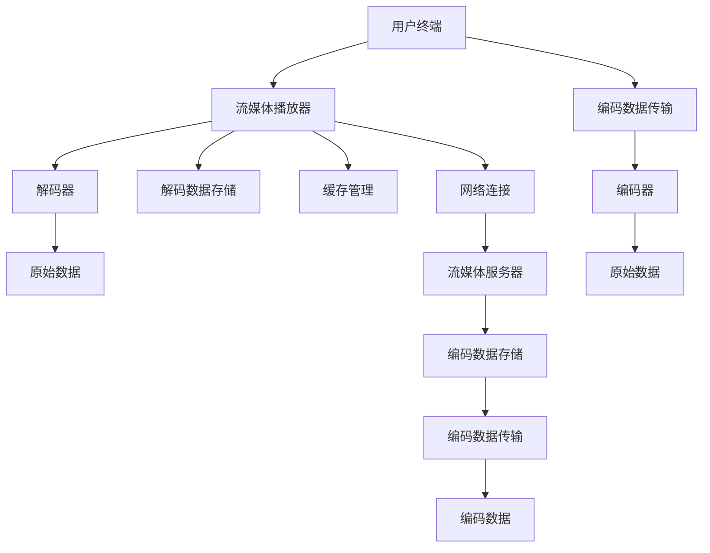

                 

### 文章标题：腾讯视频2025社招流媒体开发工程师面试题

#### 关键词：流媒体技术，流媒体传输协议，流媒体编码技术，流媒体存储与缓存，流媒体服务器搭建，流媒体播放器开发，5G与流媒体技术，AI技术在流媒体中的应用，流媒体行业发展趋势与展望。

> 摘要：本文以2025年腾讯视频社招流媒体开发工程师面试题为主线，深入探讨了流媒体技术的基础知识、开发实战及前沿技术。文章结构紧凑，逻辑清晰，通过一步一步的分析推理，旨在为读者呈现全面深入的流媒体技术理解。

### 目录大纲设计

#### 书名：腾讯视频2025社招流媒体开发工程师面试题

#### 目录结构：

##### 第一部分：流媒体技术基础

##### 第1章：流媒体技术概述
- **1.1 流媒体技术的发展历程**
- **1.2 流媒体技术的基本概念**
- **1.3 流媒体系统的关键组件**
- **1.4 流媒体技术的主要应用场景**

##### 第2章：流媒体传输协议
- **2.1 HTTP Live Streaming (HLS)**
  - **2.1.1 HLS协议原理**
  - **2.1.2 HLS流媒体传输流程**
- **2.2 Dynamic Adaptive Streaming over HTTP (DASH)**
  - **2.2.1 DASH协议原理**
  - **2.2.2 DASH流媒体传输流程**
- **2.3 Real-Time Streaming Protocol (RTSP)**
  - **2.3.1 RTSP协议原理**
  - **2.3.2 RTSP流媒体传输流程**

##### 第3章：流媒体编码技术
- **3.1 视频编码基础**
  - **3.1.1 视频编码原理**
  - **3.1.2 常见视频编码标准**
- **3.2 音频编码技术**
  - **3.2.1 音频编码原理**
  - **3.2.2 常见音频编码标准**

##### 第4章：流媒体存储与缓存
- **4.1 流媒体存储方案**
  - **4.1.1 实时存储方案**
  - **4.1.2 回放存储方案**
- **4.2 流媒体缓存策略**
  - **4.2.1 缓存的基本概念**
  - **4.2.2 常见的缓存策略**

##### 第二部分：流媒体开发实战

##### 第5章：流媒体服务器搭建
- **5.1 流媒体服务器架构设计**
- **5.2 流媒体服务器配置与优化**
- **5.3 流媒体服务器安全性保障**

##### 第6章：流媒体播放器开发
- **6.1 流媒体播放器架构**
- **6.2 流媒体播放器功能实现**
- **6.3 流媒体播放器性能优化**

##### 第7章：流媒体项目实战案例
- **7.1 项目需求分析**
- **7.2 项目技术方案设计**
- **7.3 项目开发与调试**
- **7.4 项目部署与运维**

##### 第三部分：流媒体前沿技术探讨

##### 第8章：5G与流媒体技术
- **8.1 5G网络特性对流媒体的影响**
- **8.2 5G环境下流媒体传输优化方案**
- **8.3 5G与流媒体技术的未来趋势**

##### 第9章：AI技术在流媒体中的应用
- **9.1 AI在流媒体内容推荐中的应用**
- **9.2 AI在流媒体内容审核中的应用**
- **9.3 AI在流媒体自适应播放中的应用**

##### 第10章：流媒体行业发展趋势与展望
- **10.1 全球流媒体行业现状分析**
- **10.2 我国流媒体行业的发展趋势**
- **10.3 流媒体技术未来的发展方向**

#### 附录：

##### 附录A：流媒体技术常用工具与资源
- **A.1 流媒体开发工具汇总**
- **A.2 流媒体技术文档与资料推荐**
- **A.3 流媒体技术社区与论坛推荐**

#### 核心概念与联系：

- **图1-1：流媒体技术架构**
  mermaid
  graph TD
  A[流媒体播放器] --> B[编码器]
  A --> C[编码数据]
  A --> D[编码数据传输]
  A --> E[解码器]
  C --> D
  D --> E
  

#### 核心算法原理讲解：

- **3.1 视频编码基础**
  
  **视频编码原理：**
  视频编码是将连续的视频信号转换为数字信号的过程。其基本原理包括采样、量化、变换、压缩和熵编码等步骤。
  
  **伪代码：**
  function video_encoding(video_signal):
      sample_signal = sample(video_signal)
      quantized_signal = quantize(sample_signal)
      transformed_signal = transform(quantized_signal)
      compressed_signal = entropy_encoding(transformed_signal)
      ret

----------------------------------------------------------------

## 流媒体技术基础

### 流媒体技术的发展历程

流媒体技术作为互联网媒体内容传输的一种重要方式，其发展历程可以追溯到上世纪90年代。最初，流媒体技术主要依赖于RealAudio和RealVideo等协议，这些协议通过将媒体内容分割成多个小片段进行传输，实现了在低带宽环境下对音频和视频内容的实时播放。

随着时间的推移，流媒体技术不断发展与演进。2000年左右，随着宽带网络的发展和视频编码技术的进步，MPEG-4、H.263等视频编码标准的引入，流媒体传输质量得到了显著提升。特别是随着HTTP协议的广泛应用，HTTP Live Streaming (HLS)和Dynamic Adaptive Streaming over HTTP (DASH)等基于HTTP协议的流媒体传输技术应运而生，使得流媒体播放器的兼容性和用户体验得到了进一步提升。

近年来，随着5G网络的建设和人工智能技术的迅猛发展，流媒体技术迎来了新的机遇与挑战。5G网络的高带宽、低延迟特性为流媒体传输提供了更好的基础，而AI技术的引入则使得流媒体内容推荐、内容审核和自适应播放等方面得到了优化。

### 流媒体技术的基本概念

流媒体技术，顾名思义，是一种将媒体内容以流的方式在网络上进行传输和播放的技术。与传统下载后观看的方式不同，流媒体技术允许用户在媒体内容传输过程中就开始播放，从而实现实时观看。流媒体技术主要包括以下几个核心概念：

1. **流媒体播放器**：流媒体播放器是用户用于接收和播放流媒体内容的软件或硬件设备。常见的流媒体播放器有Flash Player、QuickTime Player、Windows Media Player等。

2. **编码器**：编码器是用于将原始的媒体内容（如视频、音频）转换为适合流媒体传输的编码数据的设备或软件。常见的编码器有FFmpeg、x264、x265等。

3. **解码器**：解码器是用于将接收到的编码数据还原为原始媒体内容的设备或软件。解码器通常与编码器相对应，例如，使用x264编码的视频内容需要使用x264解码。

4. **编码数据传输**：编码数据传输是指将编码后的媒体内容通过网络进行传输的过程。编码数据传输通常依赖于特定的流媒体传输协议，如HTTP Live Streaming (HLS)、Dynamic Adaptive Streaming over HTTP (DASH)等。

5. **存储与缓存**：流媒体内容的存储与缓存是确保流媒体传输高效稳定的重要环节。存储方案包括实时存储和回放存储，缓存策略则包括本地缓存、服务器缓存等。

### 流媒体系统的关键组件

一个典型的流媒体系统主要包括以下几个关键组件：

1. **内容发布者**：内容发布者负责将原始媒体内容转换为适合流媒体传输的编码数据，并将其发布到流媒体服务器上。

2. **流媒体服务器**：流媒体服务器用于存储和管理流媒体内容，并负责响应用户的播放请求，将编码数据传输给用户端。

3. **用户端播放器**：用户端播放器是用户用于接收和播放流媒体内容的设备或软件。用户端播放器通常依赖于流媒体传输协议与流媒体服务器进行通信。

4. **网络传输**：网络传输是流媒体系统中的核心环节，它负责将编码数据从流媒体服务器传输到用户端。网络传输的质量和效率直接影响到用户的观看体验。

### 流媒体技术的主要应用场景

流媒体技术广泛应用于各种场景，主要包括以下几个方面：

1. **在线视频点播**：在线视频点播是流媒体技术的典型应用场景之一，用户可以通过流媒体播放器在线观看视频内容，如电影、电视剧、综艺节目等。

2. **直播视频**：直播视频通过实时传输技术，使得用户可以实时观看各种活动、节目、讲座等。直播视频具有实时性强、互动性高等特点。

3. **网络广播**：网络广播是指通过流媒体技术进行音频内容的传输和播放，如在线音乐、电台节目等。

4. **远程教育**：远程教育通过流媒体技术实现教师与学生之间的实时互动，使得学习资源可以随时随地获取。

5. **企业培训**：企业培训利用流媒体技术实现内部培训资源的统一管理和高效传输，提高员工培训效率。

6. **医疗健康**：医疗健康领域利用流媒体技术实现远程会诊、医学讲座等，为医疗资源的共享提供技术支持。

### 总结

流媒体技术作为现代互联网媒体传输的核心技术之一，其发展历程、基本概念、关键组件和应用场景等方面构成了流媒体技术的整体框架。在接下来的章节中，我们将进一步探讨流媒体传输协议、编码技术、存储与缓存策略等关键技术，帮助读者全面理解流媒体技术的核心原理和应用。让我们一起继续深入探讨流媒体技术的魅力。

## 流媒体传输协议

流媒体传输协议是流媒体技术的重要组成部分，它们决定了流媒体内容如何在网络上传输，并确保传输过程的高效性和稳定性。目前，常见的流媒体传输协议主要包括HTTP Live Streaming (HLS)、Dynamic Adaptive Streaming over HTTP (DASH)和Real-Time Streaming Protocol (RTSP)。以下将分别介绍这三种协议的基本原理和传输流程。

### 2.1 HTTP Live Streaming (HLS)

#### 2.1.1 HLS协议原理

HTTP Live Streaming (HLS)是一种基于HTTP协议的流媒体传输技术，由苹果公司开发并广泛应用。HLS通过将视频内容分割成多个小片段，每个片段通常包含几秒的视频数据，并使用M3U8播放列表来组织和管理这些片段。

HLS的核心原理包括以下几点：

1. **内容分割**：将视频内容分割成多个小片段，每个片段通常包含几秒的视频数据。这样可以实现快速缓存和缓冲，提高播放的连续性和流畅性。

2. **M3U8播放列表**：M3U8播放列表用于组织和管理视频片段，其中包含了每个片段的URL地址和播放顺序。播放器通过读取M3U8播放列表来获取视频片段的URL，并依次下载和播放。

3. **自适应播放**：HLS支持自适应播放，即根据用户网络带宽和设备性能动态调整视频片段的分辨率和码率。这样可以确保用户在不同网络环境下获得最佳观看体验。

#### 2.1.2 HLS流媒体传输流程

HLS的流媒体传输流程主要包括以下几个步骤：

1. **内容编码**：首先，视频内容通过编码器进行编码，生成符合HLS标准的TS文件。

2. **切片与编码**：将TS文件分割成多个小片段，每个片段包含几秒的视频数据。同时，为每个片段生成一个独立的TS文件。

3. **生成M3U8播放列表**：将所有片段的TS文件URL地址和播放顺序组织成M3U8播放列表。

4. **传输到服务器**：将编码后的TS文件和M3U8播放列表上传到流媒体服务器。

5. **用户播放**：用户端播放器通过HTTP请求从服务器获取M3U8播放列表，并依次下载和播放视频片段。

### 2.2 Dynamic Adaptive Streaming over HTTP (DASH)

#### 2.2.1 DASH协议原理

Dynamic Adaptive Streaming over HTTP (DASH)是一种基于HTTP协议的动态自适应流媒体传输技术，由 MPEG 组织制定。DASH通过将视频内容分割成多个小片段，并根据用户网络带宽、设备性能等条件动态调整视频片段的分辨率和码率，实现自适应播放。

DASH的核心原理包括以下几点：

1. **内容分割**：将视频内容分割成多个小片段，每个片段通常包含几秒的视频数据。

2. **MPD媒体播放列表**：DASH使用MPD（Media Presentation Description）文件作为媒体播放列表，其中包含了视频片段的URL地址、分辨率、码率等信息。

3. **段清单（Segment List）**：每个视频片段对应一个段清单，用于描述片段的URL地址和播放顺序。

4. **自适应播放**：DASH支持自适应播放，即根据用户网络带宽、设备性能等条件动态调整视频片段的分辨率和码率。

#### 2.2.2 DASH流媒体传输流程

DASH的流媒体传输流程主要包括以下几个步骤：

1. **内容编码**：首先，视频内容通过编码器进行编码，生成符合DASH标准的MP4文件。

2. **切片与编码**：将MP4文件分割成多个小片段，每个片段包含几秒的视频数据。同时，为每个片段生成一个独立的MP4文件。

3. **生成MPD媒体播放列表**：将所有片段的URL地址、分辨率和码率等信息组织成MPD媒体播放列表。

4. **传输到服务器**：将编码后的MP4文件和MPD媒体播放列表上传到流媒体服务器。

5. **用户播放**：用户端播放器通过HTTP请求从服务器获取MPD媒体播放列表，并根据播放列表中的信息动态调整视频片段的分辨率和码率，依次下载和播放视频片段。

### 2.3 Real-Time Streaming Protocol (RTSP)

#### 2.3.1 RTSP协议原理

Real-Time Streaming Protocol (RTSP)是一种用于控制实时音视频数据流的网络协议，由ITU和IETF共同制定。RTSP主要用于控制流媒体服务器上的播放、暂停、快进、快退等操作，并支持多播传输。

RTSP的核心原理包括以下几点：

1. **请求-响应模式**：RTSP采用请求-响应模式，客户端发送请求，服务器响应请求，实现流媒体的控制。

2. **会话管理**：RTSP通过会话（Session）管理播放状态，包括播放、暂停、停止等操作。

3. **传输控制**：RTSP支持实时传输协议（RTP）和实时传输控制协议（RTCP）的传输控制，实现流媒体传输的监控和管理。

#### 2.3.2 RTSP流媒体传输流程

RTSP的流媒体传输流程主要包括以下几个步骤：

1. **建立会话**：客户端通过RTSP请求与流媒体服务器建立会话，并获取播放权限。

2. **播放控制**：客户端通过RTSP请求对视频流进行播放、暂停、快进、快退等控制操作。

3. **数据传输**：流媒体服务器通过RTP协议将视频数据传输给客户端，同时通过RTCP协议监控和控制传输质量。

4. **会话结束**：播放完成后，客户端发送RTSP请求结束会话。

### 总结

流媒体传输协议在流媒体技术中发挥着至关重要的作用，它们决定了流媒体内容如何在网络上传输，并确保传输过程的高效性和稳定性。HTTP Live Streaming (HLS)、Dynamic Adaptive Streaming over HTTP (DASH)和Real-Time Streaming Protocol (RTSP)是目前最常见的三种流媒体传输协议，每种协议都有其独特的原理和应用场景。在接下来的章节中，我们将进一步探讨流媒体编码技术，帮助读者深入理解流媒体技术的基本原理和应用。

## 流媒体编码技术

流媒体编码技术是流媒体系统的核心技术之一，它负责将原始的音频和视频信号转换为适合在网络上传输和播放的编码数据。流媒体编码技术主要包括视频编码技术和音频编码技术，两者在编码原理和标准上有所不同。以下将分别介绍视频编码技术和音频编码技术的基本原理、常见编码标准以及编码过程中的一些关键技术。

### 3.1 视频编码基础

#### 视频编码原理

视频编码是将连续的视频信号转换为数字信号的过程。其基本原理包括以下几个步骤：

1. **采样**：将连续的视频信号转换为离散的时间点和像素值，即对视频信号进行采样。

2. **量化**：对采样得到的像素值进行量化，即将连续的像素值转换为有限个离散值。

3. **变换**：对量化的像素值进行变换，如傅里叶变换、小波变换等，以提取视频信号中的空间和时间信息。

4. **压缩**：对变换后的信号进行压缩，以减少数据量。常见的压缩方法包括预测编码、变换编码和熵编码等。

5. **熵编码**：对压缩后的信号进行熵编码，如霍夫曼编码、算术编码等，以进一步提高数据压缩效率。

#### 常见视频编码标准

视频编码技术发展至今，已经形成了一系列国际标准，常见的视频编码标准包括：

1. **MPEG-2**：MPEG-2是由国际标准化组织（ISO）和国际电工委员会（IEC）制定的视频编码标准，主要用于数字电视和DVD等领域。

2. **MPEG-4**：MPEG-4是由ISO和IEC制定的基于对象的视频编码标准，适用于低比特率视频编码和多媒体应用，如网络视频会议、手机视频等。

3. **H.264/AVC**：H.264/AVC是由国际电信联盟（ITU）制定的视频编码标准，是目前最流行的视频编码标准之一，广泛应用于高清视频、流媒体等。

4. **H.265/HEVC**：H.265/HEVC是ITU制定的下一代视频编码标准，相比H.264/AVC具有更高的压缩效率，适用于更高分辨率的视频应用。

### 3.2 音频编码技术

#### 音频编码原理

音频编码是将音频信号转换为数字信号的过程。其基本原理包括以下几个步骤：

1. **采样**：将连续的音频信号转换为离散的时间点和样本值，即对音频信号进行采样。

2. **量化**：对采样的样本值进行量化，即将连续的样本值转换为有限个离散值。

3. **压缩**：对量化的样本值进行压缩，以减少数据量。常见的音频压缩方法包括预测编码、变换编码和熵编码等。

4. **熵编码**：对压缩后的信号进行熵编码，如霍夫曼编码、算术编码等，以进一步提高数据压缩效率。

#### 常见音频编码标准

音频编码技术也形成了一系列国际标准，常见的音频编码标准包括：

1. **MP3**：MP3是由ISO制定的音频编码标准，采用MPEG-1 Layer III格式，是目前最流行的音频编码标准之一。

2. **AAC**：AAC是由ISO制定的音频编码标准，是MPEG-2和MPEG-4的一部分，相比MP3具有更高的压缩效率。

3. **FLAC**：FLAC是一种无损音频编码格式，可以完全恢复原始音频信号，适用于高质量音频存储和传输。

4. **Opus**：Opus是由Xiph.Org Foundation制定的音频编码标准，适用于各种比特率和采样率，广泛应用于互联网语音通信和流媒体应用。

### 编码过程中的一些关键技术

在视频和音频编码过程中，一些关键技术对编码效率和质量起着至关重要的作用：

1. **运动估计和补偿**：运动估计和补偿技术用于消除视频信号中的运动伪影，提高压缩效率。常见的运动估计方法包括块匹配、光流法等。

2. **帧间预测和编码**：帧间预测技术通过比较连续帧之间的差异来减少冗余信息，提高压缩效率。帧间预测编码包括帧内编码和帧间编码两种模式。

3. **熵编码**：熵编码技术用于进一步压缩编码后的数据。常见的熵编码方法包括霍夫曼编码、算术编码等。

4. **信源编码**：信源编码技术用于对原始信号进行初步压缩，降低数据量。常见的信源编码方法包括变换编码、预测编码等。

5. **比特率控制**：比特率控制技术用于调整编码过程中的比特率，确保传输过程中的带宽使用和播放质量。

### 总结

流媒体编码技术是流媒体系统的核心组成部分，它通过将原始音频和视频信号转换为适合在网络上传输和播放的编码数据，实现了高效、稳定的流媒体传输。视频编码和音频编码技术各有其独特的原理和标准，但在编码过程中都涉及到了一系列关键技术，如运动估计和补偿、帧间预测和编码、熵编码、信源编码和比特率控制等。在接下来的章节中，我们将进一步探讨流媒体存储与缓存策略，帮助读者深入了解流媒体系统的设计与实现。

## 流媒体存储与缓存

流媒体存储与缓存是流媒体系统中的关键组成部分，它们直接影响流媒体内容传输的高效性和用户体验。合理的存储与缓存策略可以显著提升系统的性能和稳定性，确保用户在观看流媒体内容时获得流畅的观看体验。以下将详细探讨流媒体存储方案、实时存储方案、回放存储方案、缓存的基本概念以及常见的缓存策略。

### 4.1 流媒体存储方案

#### 实时存储方案

实时存储方案主要用于存储正在播放的流媒体内容，确保用户在观看过程中能够实时获取到最新的内容。实时存储方案通常包括以下几种：

1. **内存存储**：内存存储具有快速读写性能，但存储容量有限，适用于临时存储和缓冲。

2. **磁盘存储**：磁盘存储具有大容量、持久性的特点，适用于存储大规模的流媒体内容。然而，磁盘读写速度相对较慢，可能影响实时播放性能。

3. **分布式存储**：分布式存储通过将数据分布在多个节点上，提高了存储系统的可靠性和扩展性。常见的分布式存储方案包括Hadoop、Cassandra等。

#### 回放存储方案

回放存储方案主要用于存储已经播放过的流媒体内容，以便用户进行回放观看。回放存储方案通常包括以下几种：

1. **本地存储**：本地存储将流媒体内容存储在用户本地的设备上，如硬盘、固态硬盘等。本地存储具有快速读写性能，但受限于设备容量。

2. **云端存储**：云端存储将流媒体内容存储在云服务器上，用户可以通过网络访问和播放内容。云端存储具有高容量、灵活性的特点，但可能受到网络带宽和延迟的影响。

3. **CDN存储**：CDN（内容分发网络）存储通过将流媒体内容分布在不同地理位置的服务器上，提高内容的访问速度和可靠性。CDN存储适用于大规模流媒体内容的存储和分发。

### 4.2 流媒体缓存策略

#### 缓存的基本概念

缓存是流媒体系统中的重要环节，通过缓存可以将已经获取的流媒体内容暂存起来，以便后续快速访问。缓存的基本概念包括：

1. **本地缓存**：本地缓存将流媒体内容暂存在用户设备上，如硬盘、内存等。本地缓存具有快速访问和读取性能，但受限于设备容量。

2. **服务器缓存**：服务器缓存将流媒体内容暂存在流媒体服务器上，以便快速响应用户请求。服务器缓存具有大容量和持久性的特点，但可能影响存储资源的利用率。

3. **缓存替换策略**：缓存替换策略用于确定哪些内容应该被缓存，哪些内容应该被替换出缓存。常见的缓存替换策略包括最近最少使用（LRU）、最少访问（LFU）等。

#### 常见的缓存策略

流媒体系统常见的缓存策略包括以下几种：

1. **预加载策略**：预加载策略在用户访问流媒体内容前，提前将相关内容缓存到本地或服务器缓存中，以减少延迟和提高播放效率。

2. **热数据缓存**：热数据缓存将用户经常访问的数据缓存起来，以便快速访问。热数据缓存可以通过分析用户访问模式实现，提高用户体验。

3. **缓存失效策略**：缓存失效策略用于确定缓存内容何时失效，以释放缓存资源。常见的缓存失效策略包括时间失效、访问失效等。

4. **分布式缓存**：分布式缓存通过将缓存数据分布在不同节点上，提高了缓存系统的扩展性和可靠性。常见的分布式缓存系统包括Memcached、Redis等。

5. **缓存一致性**：缓存一致性是指确保缓存数据与原始数据保持一致。在流媒体系统中，缓存一致性可以通过版本控制、事务管理等方式实现。

### 总结

流媒体存储与缓存是流媒体系统中至关重要的环节，合理的存储与缓存策略可以显著提升系统的性能和用户体验。实时存储方案和回放存储方案分别适用于不同的场景，而缓存策略则通过各种方式提高流媒体内容的访问速度和可靠性。在接下来的章节中，我们将探讨流媒体服务器的搭建、配置与优化，帮助读者深入了解流媒体系统的设计与实现。

## 流媒体服务器搭建

流媒体服务器作为流媒体系统的核心组件，负责存储、管理和传输流媒体内容。搭建一个高效、稳定且安全的流媒体服务器对于确保用户获得良好的观看体验至关重要。以下将详细介绍流媒体服务器的架构设计、配置与优化以及安全性保障。

### 5.1 流媒体服务器架构设计

流媒体服务器的架构设计需要考虑以下关键要素：

1. **负载均衡**：负载均衡通过将用户请求分配到多个服务器上，提高了系统的处理能力和响应速度。常见的负载均衡算法包括轮询、最少连接数、IP哈希等。

2. **反向代理**：反向代理位于流媒体服务器和客户端之间，用于接收客户端请求并转发给后端服务器。反向代理可以提供缓存、安全防护等功能。

3. **内容分发网络（CDN）**：CDN通过将流媒体内容分布在不同地理位置的服务器上，提高了内容的访问速度和可靠性。CDN可以减少源服务器的负载，提高系统的扩展性和可用性。

4. **存储系统**：流媒体服务器需要配置高效、可靠的存储系统，以存储和管理大量的流媒体内容。常见的存储系统包括本地存储、分布式存储和云存储。

5. **流媒体编码与解码**：流媒体服务器需要支持多种视频和音频编码标准，以兼容不同的播放器设备。编码与解码模块负责将流媒体内容转换为适合播放的格式。

6. **监控与日志**：监控与日志系统用于实时监控流媒体服务器的性能和健康状况，及时发现和处理问题。

### 5.2 流媒体服务器配置与优化

流媒体服务器的配置与优化对于系统的性能和稳定性至关重要。以下是一些关键配置与优化策略：

1. **硬件配置**：选择适合流媒体服务器的硬件配置，包括高性能的CPU、足够的内存、高速的磁盘和网卡等。

2. **网络优化**：配置高效的网络参数，如增大TCP缓冲区、优化路由策略、使用NAT穿透技术等，以提高网络传输效率。

3. **负载均衡**：配置负载均衡器，如Nginx、HAProxy等，以实现用户请求的合理分配和系统的动态扩展。

4. **缓存策略**：配置缓存模块，如Nginx的HTTP缓存、Varnish等，以提高内容访问速度和减少服务器负载。

5. **资源监控与调整**：定期监控服务器的CPU、内存、磁盘和网络资源使用情况，并根据实际情况进行优化调整。

6. **安全性优化**：配置防火墙、安全组等网络防护措施，定期更新系统补丁和软件版本，确保服务器安全。

### 5.3 流媒体服务器安全性保障

流媒体服务器安全性保障是确保用户数据和内容安全的关键。以下是一些常见的安全措施：

1. **数据加密**：使用SSL/TLS协议对传输数据进行加密，防止数据在传输过程中被窃取或篡改。

2. **访问控制**：配置访问控制列表（ACL），限制只有授权用户和服务器可以访问流媒体内容。

3. **身份验证**：实现用户身份验证机制，如基于用户名和密码、双因素认证等，确保只有合法用户可以访问内容。

4. **反恶意软件与防火墙**：部署反恶意软件和防火墙，防止恶意攻击和入侵。

5. **日志审计**：配置日志审计系统，记录用户访问和系统操作日志，以便追踪和调查安全事件。

6. **定期安全检查**：定期进行安全检查和漏洞扫描，及时发现和修复安全隐患。

### 总结

流媒体服务器的搭建和配置是确保流媒体系统高效稳定运行的关键。通过合理的架构设计、优化的配置和严格的安全性保障，流媒体服务器可以提供高质量的内容传输和稳定的用户体验。在接下来的章节中，我们将探讨流媒体播放器开发，帮助读者深入了解流媒体系统的前端实现。

## 流媒体播放器开发

流媒体播放器是流媒体系统的重要组成部分，它负责接收、解码和播放流媒体内容。一个高效、稳定且功能丰富的播放器对于用户观看体验至关重要。以下将详细介绍流媒体播放器的架构、功能实现以及性能优化。

### 6.1 流媒体播放器架构

流媒体播放器通常采用分层架构，以实现模块化和功能分离。常见的架构层次包括：

1. **用户界面层**：用户界面层负责与用户交互，包括播放控制、进度条、音量调节等界面元素。用户界面层通常由前端框架（如React、Vue.js）实现。

2. **播放引擎层**：播放引擎层负责流媒体内容的接收、解码和播放。常见的播放引擎包括FFmpeg、GStreamer等。

3. **数据传输层**：数据传输层负责与流媒体服务器进行通信，获取流媒体内容。数据传输层通常使用HTTP、HLS、DASH等协议。

4. **音视频解码层**：音视频解码层负责对接收到的流媒体内容进行解码，生成音频和视频数据。常见的解码器包括FFmpeg、libav等。

5. **音频和视频渲染层**：音频和视频渲染层负责将解码后的音频和视频数据渲染到用户界面。音频渲染通常使用Web Audio API，视频渲染使用HTML5 `<video>` 元素。

### 6.2 流媒体播放器功能实现

流媒体播放器的功能实现包括以下几个方面：

1. **播放控制**：播放控制包括播放、暂停、停止、快进、快退等基本操作。这些操作通常通过播放引擎层实现，并通过用户界面层与用户交互。

2. **缓冲管理**：缓冲管理用于确保流媒体播放的连续性和流畅性。缓冲管理包括缓冲区设置、缓冲策略、缓冲预加载等。

3. **自适应播放**：自适应播放根据用户网络带宽和设备性能动态调整视频片段的分辨率和码率，以获得最佳观看体验。自适应播放通常通过播放引擎层实现，并与缓冲管理相结合。

4. **播放列表管理**：播放列表管理用于管理播放列表中的流媒体内容，包括添加、删除、切换等操作。播放列表管理通常通过用户界面层实现。

5. **音视频同步**：音视频同步确保音频和视频播放的时间一致性。音视频同步通常通过播放引擎层实现，并通过时钟同步机制实现。

6. **错误处理**：错误处理用于处理播放过程中出现的各种错误，如网络错误、解码错误等。错误处理可以通过重试机制、错误提示等方式实现。

### 6.3 流媒体播放器性能优化

流媒体播放器的性能优化是确保用户获得良好观看体验的关键。以下是一些常见的性能优化策略：

1. **资源优化**：资源优化包括代码优化、图片优化、音频优化等。代码优化可以通过使用高效算法、减少DOM操作等方式实现。图片优化可以通过使用WebP格式、懒加载等方式实现。音频优化可以通过使用AAC等高效编码格式实现。

2. **网络优化**：网络优化包括减少HTTP请求次数、使用缓存、优化CDN等。减少HTTP请求次数可以通过使用雪碧图、CSS Sprites等方式实现。使用缓存可以通过设置HTTP缓存头、使用浏览器缓存等方式实现。优化CDN可以通过选择合适的CDN服务提供商、设置CDN缓存策略等方式实现。

3. **解码优化**：解码优化包括使用高效的解码器、并行解码等。使用高效的解码器可以通过选择合适的解码器实现，如FFmpeg。并行解码可以通过使用多线程或多进程实现，以加快解码速度。

4. **渲染优化**：渲染优化包括减少DOM操作、使用高性能渲染技术等。减少DOM操作可以通过使用虚拟DOM、React等框架实现。使用高性能渲染技术可以通过使用WebGL、Three.js等实现。

5. **内存优化**：内存优化包括释放不再使用的内存、使用内存池等。释放不再使用的内存可以通过使用垃圾回收机制实现。使用内存池可以通过预先分配内存块、循环使用内存等方式实现。

### 总结

流媒体播放器开发是流媒体系统实现的重要组成部分。通过合理的架构设计、功能实现和性能优化，流媒体播放器可以提供高效、稳定且功能丰富的播放体验。在接下来的章节中，我们将探讨流媒体项目实战案例，通过实际项目分析深入理解流媒体技术的应用和实践。

### 第7章：流媒体项目实战案例

#### 7.1 项目需求分析

本流媒体项目旨在构建一个高清视频点播平台，满足以下需求：

1. **高清视频播放**：支持多种视频编码格式，如H.264、H.265，确保用户在低带宽环境下也能流畅播放高清视频。

2. **自适应播放**：根据用户网络带宽和设备性能，自动调整视频码率和分辨率，提供最佳观看体验。

3. **多终端支持**：支持PC、移动设备（iOS、Android）等多种终端访问，确保用户在不同设备上都能顺畅观看视频。

4. **内容推荐**：利用人工智能技术，根据用户观看历史和兴趣，智能推荐相关视频内容，提升用户粘性。

5. **内容审核**：对上传的视频内容进行自动审核，过滤违规内容，确保平台内容健康。

#### 7.2 项目技术方案设计

为了满足上述需求，本项目采用以下技术方案：

1. **流媒体传输协议**：采用HLS和DASH协议，结合用户网络环境和设备性能，实现自适应播放。

2. **视频编码技术**：采用H.264和H.265视频编码标准，提供不同码率和分辨率的视频内容。

3. **内容存储**：使用分布式存储系统，如Ceph或HDFS，存储和管理大规模视频内容。

4. **播放器开发**：采用Web技术栈（如React、Webpack）构建流媒体播放器，实现多终端支持。

5. **内容推荐**：采用深度学习算法，如协同过滤、基于内容的推荐，实现视频内容推荐。

6. **内容审核**：采用图像识别和自然语言处理技术，对上传的视频内容进行自动审核。

#### 7.3 项目开发与调试

项目开发过程分为以下几个阶段：

1. **需求分析与设计**：明确项目需求，制定技术方案，进行系统设计。

2. **编码与实现**：
   - **流媒体服务器搭建**：配置Nginx作为负载均衡器和反向代理，使用FFmpeg进行视频编码与切片，配置Ceph分布式存储系统。
   - **播放器开发**：使用React和Webpack构建播放器，实现HLS和DASH播放功能，使用Web Audio API进行音频处理。
   - **内容推荐系统**：使用TensorFlow训练深度学习模型，实现视频内容推荐功能。
   - **内容审核系统**：集成图像识别和自然语言处理库，实现视频内容审核功能。

3. **调试与优化**：在开发过程中，进行功能测试、性能测试和安全测试，发现并修复问题。

#### 7.4 项目部署与运维

项目部署与运维包括以下几个方面：

1. **部署策略**：使用Docker和Kubernetes进行容器化部署，实现快速部署和动态扩展。

2. **监控与日志**：使用Prometheus和Grafana进行系统监控，收集日志数据，实现实时监控和报警。

3. **自动化运维**：使用Ansible和SaltStack等自动化工具，实现自动化部署、配置管理和故障恢复。

4. **性能优化**：根据监控数据，进行系统性能优化，如缓存策略优化、数据库性能优化等。

#### 项目小结

本项目通过合理的需求分析、技术方案设计、开发与调试以及部署与运维，成功构建了一个高清视频点播平台，实现了高清视频播放、自适应播放、多终端支持、内容推荐和内容审核等功能。在项目过程中，我们积累了丰富的流媒体技术经验，提高了团队的技术能力和项目交付效率。

#### 最佳实践 Tips

1. **需求分析与设计**：明确项目需求，制定详细的技术方案，确保项目顺利进行。

2. **编码与实现**：遵循最佳编码实践，提高代码质量和可维护性。

3. **调试与优化**：进行全面的功能测试、性能测试和安全测试，确保系统稳定可靠。

4. **部署与运维**：采用容器化部署和自动化运维，提高系统可扩展性和维护性。

#### 注意事项

1. **安全**：确保系统安全，包括数据加密、访问控制、反恶意软件等。

2. **性能**：优化系统性能，如缓存策略、数据库查询优化等。

3. **可靠性**：确保系统在高负载下稳定运行，进行压力测试和故障恢复演练。

#### 拓展阅读

1. **流媒体技术**：深入了解HTTP Live Streaming (HLS)、Dynamic Adaptive Streaming over HTTP (DASH)等流媒体传输协议。

2. **深度学习与推荐系统**：学习深度学习算法，如协同过滤、基于内容的推荐，提升内容推荐效果。

3. **自动化运维**：掌握Docker、Kubernetes、Ansible等自动化工具，提高运维效率。

通过本项目实战，我们深入探讨了流媒体技术的基础知识、开发实战及前沿技术。希望本文能为读者提供有价值的参考和启示，助力他们在流媒体领域取得更好的成果。

## 5G与流媒体技术

随着5G网络的快速发展和普及，流媒体技术迎来了新的机遇与挑战。5G网络的高带宽、低延迟特性为流媒体传输提供了更强大的基础，而AI技术的引入则进一步优化了流媒体的内容推荐、内容审核和自适应播放等方面。以下将详细探讨5G网络特性对流媒体的影响、5G环境下流媒体传输优化方案以及5G与流媒体技术的未来趋势。

### 8.1 5G网络特性对流媒体的影响

5G网络作为下一代移动通信技术，具有以下几个显著特性：

1. **高带宽**：5G网络的理论峰值带宽可达到数十Gbps，相比4G网络有显著提升。这为流媒体传输提供了更充足的带宽资源，使得高清、超高清视频内容传输成为可能。

2. **低延迟**：5G网络的端到端延迟较低，通常在1ms以内。低延迟特性对实时性要求较高的流媒体应用（如直播、在线游戏）至关重要，有助于提升用户体验。

3. **广覆盖**：5G网络采用毫米波、Sub-6GHz等多种频段，实现了广覆盖和深覆盖。这有助于提升流媒体服务的覆盖范围和用户接入质量。

4. **大连接**：5G网络支持大量设备同时接入，具有高连接密度。这为流媒体业务在人群密集场景（如演唱会、体育赛事）中的应用提供了技术支持。

5. **网络切片**：5G网络切片技术可以将网络资源按需分配，为不同业务提供定制化网络服务。这有助于优化流媒体传输，确保高质量的用户体验。

### 8.2 5G环境下流媒体传输优化方案

在5G环境下，流媒体传输优化方案主要包括以下几个方面：

1. **多连接传输**：利用5G网络的多连接特性，将流媒体内容从多个连接同时传输，提高传输效率和可靠性。例如，可以将流媒体内容分成视频流、音频流和字幕流，从多个连接分别传输，确保内容的高效传输。

2. **边缘计算**：将部分流媒体处理任务从云端迁移到边缘节点，如5G基站、小型数据中心等。边缘计算可以减少数据传输距离，降低网络延迟，提升用户体验。例如，在边缘节点进行内容缓存、解码等操作，可以显著提高视频播放的流畅性。

3. **自适应流传输**：结合5G网络的低延迟特性，采用更灵活的自适应流传输策略，根据用户网络状况和设备性能动态调整视频码率和分辨率。例如，可以采用基于AI的算法，实时分析用户网络状况，智能调整传输参数。

4. **网络切片优化**：利用5G网络切片技术，为流媒体业务提供定制化网络服务。例如，为高清视频传输分配高带宽、低延迟的网络切片，确保视频内容的高质量传输。

5. **服务质量（QoS）保障**：在5G网络中，通过QoS机制为流媒体业务提供优先保障。例如，设置高优先级的流媒体数据包在网络传输过程中获得更高的优先级处理，确保视频播放的连续性和稳定性。

### 8.3 5G与流媒体技术的未来趋势

随着5G网络的不断发展和普及，流媒体技术与5G网络的融合将带来以下趋势：

1. **高清/超高清流媒体**：5G网络的高带宽特性使得高清/超高清流媒体内容传输成为可能，用户可以享受到更高画质、更清晰的视频内容。

2. **实时流媒体应用**：5G网络的低延迟特性为实时流媒体应用提供了更好的基础，如实时直播、在线游戏等，将得到更广泛的应用。

3. **边缘计算与流媒体**：边缘计算与流媒体技术的结合，可以实现更高效、更智能的内容传输和播放，为用户提供更好的观看体验。

4. **智能内容推荐**：AI技术与5G网络的结合，可以进一步优化流媒体内容推荐，提升用户满意度和粘性。

5. **智能内容审核**：AI技术应用于流媒体内容审核，可以实现更高效、更准确的内容审核，确保平台内容健康。

6. **5G VR/AR流媒体**：5G网络的高速、低延迟特性为VR/AR流媒体应用提供了更好的基础，用户可以体验到更沉浸式的虚拟现实和增强现实内容。

总之，5G与流媒体技术的结合将为流媒体行业带来巨大的变革和发展机遇。通过不断优化传输技术和引入AI技术，流媒体技术将能够提供更高质量、更智能化的服务，满足用户日益增长的需求。

### 总结

5G网络的高带宽、低延迟特性为流媒体技术带来了新的发展机遇，同时也提出了新的挑战。通过优化流媒体传输方案和引入AI技术，流媒体技术可以在5G环境下实现更高效、更智能的内容传输和播放。未来，随着5G网络的不断普及，流媒体技术将迎来更加广阔的应用前景和发展空间。

## AI技术在流媒体中的应用

随着人工智能技术的迅猛发展，AI在流媒体领域的应用日益广泛，显著提升了用户体验和业务效率。以下将详细介绍AI在流媒体内容推荐、内容审核和自适应播放等方面的应用。

### 9.1 AI在流媒体内容推荐中的应用

流媒体内容推荐是AI技术在流媒体领域的重要应用之一。通过分析用户的历史观看记录、兴趣偏好和行为数据，AI技术能够为用户推荐个性化的内容，提高用户满意度和粘性。以下是一些常见的内容推荐算法：

1. **基于内容的推荐**：基于内容的推荐通过分析视频内容中的特征（如视频类型、标签、演员等），为用户推荐相似的内容。这种方法简单有效，但容易受到数据稀疏和冷启动问题的影响。

2. **协同过滤推荐**：协同过滤推荐通过分析用户之间的共同兴趣，为用户推荐其他用户喜欢的视频。协同过滤包括基于用户的协同过滤（User-based Collaborative Filtering）和基于项目的协同过滤（Item-based Collaborative Filtering）两种类型。

3. **深度学习推荐**：深度学习推荐利用神经网络模型（如神经网络协同过滤、深度神经网络等）从海量数据中学习用户和内容的复杂关系，实现更精准的内容推荐。深度学习推荐在处理非结构化数据和大规模数据集方面具有显著优势。

4. **混合推荐系统**：混合推荐系统结合了基于内容的推荐和协同过滤推荐，以及深度学习推荐等不同算法，实现更个性化的内容推荐。

### 9.2 AI在流媒体内容审核中的应用

流媒体内容审核是确保平台内容健康的重要环节。传统的审核方法通常依赖于人工审核，效率低且容易漏检。AI技术在内容审核中的应用显著提高了审核效率和准确性。以下是一些常见的内容审核技术：

1. **图像识别**：图像识别技术通过检测视频帧中的图像内容，识别违规图像，如暴力、色情等。常用的图像识别算法包括卷积神经网络（CNN）和循环神经网络（RNN）。

2. **自然语言处理（NLP）**：自然语言处理技术用于检测视频中的文本内容，识别违规文本，如不当言语、虚假信息等。常见的NLP技术包括词嵌入（Word Embedding）、文本分类（Text Classification）等。

3. **语音识别**：语音识别技术用于检测视频中的语音内容，识别违规语音，如恶语攻击、不当言论等。语音识别技术结合自然语言处理，可以实现更全面的内容审核。

4. **行为分析**：行为分析技术通过分析用户在平台上的行为，如评论、点赞、分享等，识别潜在违规行为。行为分析结合机器学习算法，可以提前预警和拦截违规内容。

### 9.3 AI在流媒体自适应播放中的应用

AI技术在流媒体自适应播放中的应用，可以优化用户的观看体验，提高视频播放的流畅性和稳定性。以下是一些常见的AI自适应播放技术：

1. **带宽估计**：AI技术通过分析用户的网络状况，如延迟、抖动、带宽等，预测用户的网络质量，为自适应播放提供依据。

2. **视频编码优化**：AI技术可以根据用户的网络状况和设备性能，动态调整视频编码参数（如分辨率、码率等），实现高效的视频编码。

3. **内容缓存优化**：AI技术通过分析用户的观看习惯和内容访问模式，预测热门内容，提前缓存，提高视频播放的流畅性。

4. **播放策略优化**：AI技术可以根据用户的观看行为和内容特征，调整播放策略（如预加载、缓冲管理等），提高视频播放的稳定性。

### 总结

AI技术在流媒体内容推荐、内容审核和自适应播放等方面的应用，显著提升了流媒体服务的质量和用户体验。通过深度学习、图像识别、自然语言处理等AI技术，流媒体平台能够更好地满足用户需求，提高运营效率。未来，随着AI技术的不断发展，流媒体服务将迎来更多创新和变革。

## 流媒体行业发展趋势与展望

随着技术的不断进步和用户需求的持续增长，流媒体行业正经历着深刻的变革和发展。以下将从全球流媒体行业现状、我国流媒体行业的发展趋势以及流媒体技术未来的发展方向三个方面，探讨流媒体行业的未来发展。

### 10.1 全球流媒体行业现状分析

目前，全球流媒体行业已经进入成熟阶段，各大平台在市场竞争中逐渐形成了自己的特色和优势。以下为全球流媒体行业现状的几个关键点：

1. **市场竞争激烈**：随着Netflix、YouTube、Amazon Prime Video等全球流媒体巨头不断扩张，市场竞争愈发激烈。这些平台通过内容多样化、个性化推荐和高质量的视频内容吸引了大量用户。

2. **内容为王**：流媒体平台之间的竞争主要在于内容。优质的内容是吸引用户的关键，各大平台纷纷投入巨额资金购买和自制版权内容，提升内容质量和数量。

3. **订阅模式主导**：订阅模式成为流媒体行业的主要收入来源。用户愿意为高质量的内容支付订阅费用，这使得流媒体平台能够持续提供优质内容，形成良性循环。

4. **多终端覆盖**：流媒体平台不断扩展其终端覆盖范围，从PC、智能手机到智能电视、游戏设备等，用户可以在各种设备上随时随地观看内容。

5. **广告收入增长**：虽然订阅模式是主要收入来源，但广告收入也在逐渐增长。流媒体平台通过广告投放和个性化广告推荐，实现了广告收入的多元化。

### 10.2 我国流媒体行业的发展趋势

我国流媒体行业近年来发展迅速，市场规模不断扩大，以下是我国流媒体行业发展的几个趋势：

1. **用户规模持续增长**：随着互联网普及率和智能手机渗透率的提高，我国流媒体用户规模持续增长。特别是在下沉市场中，流媒体平台的影响力逐渐增强。

2. **内容多元化**：我国流媒体平台逐渐实现了内容多元化，涵盖电影、电视剧、综艺节目、纪录片、短视频等多种类型。同时，自制内容比例不断提升，如自制剧、综艺节目等。

3. **监管力度加强**：我国政府对流媒体行业的监管力度不断加强，出台了多项政策法规，规范行业发展。例如，《网络安全法》、《互联网视听节目服务管理规定》等，确保流媒体内容健康、合规。

4. **技术创新应用**：我国流媒体平台积极采用人工智能、大数据、5G等先进技术，提升用户体验和服务质量。例如，通过AI技术实现个性化推荐、内容审核、自适应播放等。

5. **市场竞争加剧**：随着资本和市场环境的变化，我国流媒体市场竞争日益激烈。平台之间通过补贴、合作、创新等方式争夺市场份额，用户红利逐渐见顶。

### 10.3 流媒体技术未来的发展方向

流媒体技术的未来发展将受到以下几个方向的影响：

1. **高清晰度与超高清内容**：随着5G网络的普及，流媒体平台将能够提供更高清晰度、更高质量的视频内容，如8K、16K等。

2. **虚拟现实（VR）与增强现实（AR）**：VR和AR技术将进一步提升用户的沉浸式体验，流媒体平台将更多地采用VR/AR技术，为用户提供全新的观看方式。

3. **人工智能与大数据分析**：人工智能和大数据分析将进一步提升流媒体平台的个性化推荐、内容审核、用户行为分析等能力，优化用户体验。

4. **区块链技术的应用**：区块链技术可以确保流媒体内容的安全和透明，未来可能会在版权保护、交易支付等方面发挥重要作用。

5. **跨平台与生态建设**：流媒体平台将逐步实现跨平台、跨设备的无缝体验，构建起完整的生态体系，提供一站式服务。

### 总结

流媒体行业正处于快速发展阶段，全球和我国市场均呈现出良好的增长态势。未来，流媒体行业将继续受到技术创新和用户需求变化的驱动，不断拓展新的应用领域和商业模式。通过紧跟技术发展趋势，优化用户体验，流媒体行业有望实现更广阔的发展空间和更深远的社会影响。

## 附录：流媒体技术常用工具与资源

#### A.1 流媒体开发工具汇总

1. **FFmpeg**：开源的视频和音频处理工具，支持视频录制、转换和流传输。

2. **GStreamer**：开源的多媒体框架，用于构建复杂的音频和视频处理应用程序。

3. **Libav**：开源的多媒体处理库，主要用于视频和音频的编解码。

4. **Nginx**：高性能的HTTP和反向代理服务器，用于流媒体内容的分发和缓存。

5. **VLC**：开源的多媒体播放器，支持多种流媒体格式和协议。

6. **FFMPEG Player**：基于Web的流媒体播放器，支持HLS、DASH等多种协议。

7. **FFmpeg4Android**：FFmpeg的Android版本，用于Android设备上的流媒体处理。

8. **iStream**：iOS平台上的流媒体播放器，支持HLS、RTMP等协议。

#### A.2 流媒体技术文档与资料推荐

1. **MPEG-DASH官方文档**：MPEG-DASH官方文档，提供了详细的技术规范和指南。

2. **HLS官方文档**：Apple提供的HLS官方文档，介绍了HLS协议的细节。

3. **RTSP官方文档**：ITU提供的RTSP协议官方文档，详细介绍了RTSP协议的工作原理。

4. **视频编码标准文档**：ISO/IEC官网上的MPEG、H.264、H.265等视频编码标准的文档。

5. **流媒体技术社区**：如FFmpeg社区、GStreamer社区等，提供了丰富的技术讨论和资源。

#### A.3 流媒体技术社区与论坛推荐

1. **Stack Overflow**：全球最大的技术问答社区，涵盖流媒体相关技术问题。

2. **Reddit**：流媒体技术相关子版块，如r/ffmpeg、r/streamingmedia等。

3. **YouTube**：大量流媒体技术教程和案例，有助于新手快速入门。

4. **知乎**：国内领先的问答社区，众多流媒体技术专家分享实践经验。

5. **百度贴吧**：流媒体技术相关贴吧，用户可以交流经验和讨论问题。

通过使用这些工具、文档和社区，开发者可以更好地掌握流媒体技术，提升项目开发效率。

### 核心概念与联系

为了更好地理解流媒体技术的基本概念和它们之间的联系，以下是几个核心概念及其关系的架构图和详细解释。

#### 图1-1：流媒体技术架构



#### 详细解释：

1. **用户终端**：用户通过终端设备（如手机、平板、电脑等）访问流媒体内容。

2. **流媒体播放器**：播放器是用户终端上运行的软件，它负责解码和播放流媒体内容。

3. **解码器**：解码器从编码数据中提取原始数据，以便播放器进行播放。

4. **编码数据传输**：编码数据通过网络从流媒体服务器传输到用户终端。

5. **编码器**：编码器将原始数据转换为编码数据，以便进行传输和存储。

6. **解码数据存储**：解码后的数据临时存储在本地设备上，以便连续播放和后续使用。

7. **缓存管理**：缓存管理用于优化数据访问速度，减少延迟，提高用户体验。

8. **网络连接**：网络连接负责流媒体数据的传输，通常依赖于Wi-Fi或移动网络。

9. **流媒体服务器**：服务器存储和管理编码数据，响应用户的播放请求。

10. **编码数据存储**：编码数据在服务器上存储，以供用户访问。

11. **编码数据传输**：编码数据从服务器传输到用户终端，通常采用流媒体传输协议。

12. **编码数据**：编码数据是经过编码处理的视频或音频数据，适合在网络上传输。

通过这个架构图，我们可以清晰地看到流媒体技术的各个组成部分及其相互作用。了解这些核心概念和它们之间的联系对于深入理解流媒体技术至关重要。

### 核心算法原理讲解

在流媒体技术中，视频编码是关键环节之一，其核心算法原理包括采样、量化、变换和熵编码等步骤。以下将详细解释视频编码的原理，并通过伪代码展示编码过程。

#### 视频编码原理

**采样**：视频编码的第一步是对连续的视频信号进行采样。采样过程将时间连续的视频信号转换为离散的时间点和像素值。采样率决定了每秒帧数（FPS）和每帧的分辨率。

**量化**：采样得到的像素值是连续的，而数字视频系统只能处理离散的数值。量化过程将连续的采样值转换为有限个离散值，从而降低数据量。量化过程中，每个像素值被表示为一个固定范围的整数。

**变换**：变换是将量化的像素值转换为另一种表示形式，以便于压缩。常见的变换方法包括离散余弦变换（DCT）和离散小波变换。变换后的数据在频率域上更加集中，有利于进一步压缩。

**熵编码**：熵编码是一种基于信息熵的压缩方法，用于进一步减少数据量。常见的熵编码方法包括霍夫曼编码和算术编码。熵编码根据符号出现的频率来选择编码长度，从而实现数据压缩。

#### 伪代码：视频编码过程

```python
function video_encoding(video_signal):
    # 采样
    sample_signal = sample(video_signal, frame_rate, resolution)
    
    # 量化
    quantized_signal = quantize(sample_signal, quantization_level)
    
    # DCT变换
    transformed_signal = dct(transform(quantized_signal))
    
    # 熵编码
    compressed_signal = entropy_encoding(transformed_signal)
    
    # 输出压缩后的视频数据
    return compressed_signal
```

#### 数学模型和公式

**采样公式**：
$$
s(n) = \sum_{i=0}^{N-1} x(n - iT)
$$
其中，\(s(n)\)是采样信号，\(x(n)\)是原始信号，\(N\)是采样点数，\(T\)是采样周期。

**量化公式**：
$$
Q(x) = \text{round}\left(\frac{x}{Q}\right)
$$
其中，\(Q\)是量化步长，\(\text{round}\)函数用于将结果四舍五入到最接近的整数值。

**DCT变换公式**：
$$
C(u, v) = \sum_{x=0}^{N-1} \sum_{y=0}^{N-1} A(x, y) \cos\left(\frac{2x + 1}{2N}\pi u + \frac{2y + 1}{2N}\pi v\right)
$$
其中，\(C(u, v)\)是变换后的系数，\(A(x, y)\)是原始像素值。

**熵编码公式**：
$$
L(s) = -\sum_{s} p(s) \log_2(p(s))
$$
其中，\(L(s)\)是编码长度，\(p(s)\)是符号出现的概率。

#### 详细讲解与举例说明

**采样过程**：假设我们有一个原始视频信号，每秒30帧，每帧分辨率为1920x1080。通过设置采样率为24帧/秒，我们每秒只保留24个连续帧中的前24帧。采样公式如下：

$$
s(n) = \sum_{i=0}^{23} x(n - iT)
$$
其中，\(T = \frac{1}{24}\)秒。

**量化过程**：原始像素值范围是0到255。量化过程将像素值转换为8位二进制数。例如，量化步长\(Q = 1\)，则像素值150量化后为150。

**DCT变换过程**：以8x8像素块为例，DCT变换将每个8x8像素块转换为频率域上的系数。DCT变换公式如下：

$$
C(u, v) = \sum_{x=0}^{7} \sum_{y=0}^{7} A(x, y) \cos\left(\frac{2x + 1}{2 \times 8}\pi u + \frac{2y + 1}{2 \times 8}\pi v\right)
$$
例如，对于像素块A(2, 2)，其DCT变换结果为：

$$
C(u, v) = \cos\left(\frac{5}{16}\pi u + \frac{5}{16}\pi v\right)
$$

**熵编码过程**：假设像素块中有大量值为128的像素点，少量值为0或255的像素点。根据像素点出现的频率，选择适当的编码方法。例如，使用霍夫曼编码，对于值为128的像素点，编码长度为7位；对于值为0或255的像素点，编码长度为10位。

通过上述详细讲解和举例说明，我们可以更好地理解视频编码的核心算法原理和实现过程。在流媒体传输中，视频编码技术起到了关键作用，它不仅能够提高数据传输效率，还能保证视频播放的质量。

### 数学公式与详细讲解

在流媒体技术中，视频编码是一个复杂而关键的过程，它涉及到多个数学公式和算法。以下将详细讲解视频编码中涉及的几个关键数学公式，并解释它们在编码过程中的应用。

#### 1. 离散余弦变换（DCT）

离散余弦变换（DCT）是视频编码中的一个核心步骤，它用于将空间域上的像素值转换为频率域上的系数。DCT广泛应用于JPEG和H.264等视频编码标准中。

**公式**：

$$
C(u, v) = \frac{2}{N}\sum_{x=0}^{N-1}\sum_{y=0}^{N-1} A(x, y) \cos\left(\frac{2x + 1}{2N}\pi u + \frac{2y + 1}{2N}\pi v\right) \quad (u, v = 0, 1, 2, ..., N-1)
$$

**解释**：

- \(C(u, v)\) 是变换后的频率域系数。
- \(A(x, y)\) 是原始像素值。
- \(N\) 是变换块的尺寸（通常是8或16）。
- \(u\) 和 \(v\) 是频率域的索引。

在编码过程中，DCT将图像中的像素值转换为频率系数，这些系数在频率域上表示了图像的特征。由于人类视觉系统对频率变化更敏感，DCT后的系数可以更好地反映图像的重要信息，从而实现更有效的压缩。

#### 2. 预测编码

预测编码是一种减少冗余信息的方法，通过预测当前块与之前块的差异来降低数据量。常见的预测方法包括前向预测和后向预测。

**前向预测公式**：

$$
x(n) = \sum_{k=0}^{N-1} a(k) x(n-k) \quad (n > 0)
$$

**后向预测公式**：

$$
x(n) = \sum_{k=0}^{N-1} b(k) x(n+k) \quad (n > 0)
$$

**解释**：

- \(x(n)\) 是当前块的像素值。
- \(a(k)\) 和 \(b(k)\) 是预测系数。
- \(N\) 是预测块的尺寸。

预测编码通过计算当前块与前一帧或后一帧之间的差异，从而减少冗余信息。预测编码后的差异值（残差）通常较小，因此更容易压缩。

#### 3. 熵编码

熵编码是一种基于信息熵的压缩方法，用于进一步压缩编码后的数据。常用的熵编码方法包括霍夫曼编码和算术编码。

**霍夫曼编码公式**：

$$
L(s) = -\sum_{s} p(s) \log_2(p(s))
$$

**解释**：

- \(L(s)\) 是编码长度。
- \(p(s)\) 是符号出现的概率。

**算术编码公式**：

$$
C = \sum_{i=1}^{n} p_i \ell_i
$$

**解释**：

- \(C\) 是编码后的值。
- \(p_i\) 是符号的概率。
- \(\ell_i\) 是编码长度。

熵编码通过根据符号出现的频率来选择编码长度，从而实现数据压缩。符号出现的频率越高，编码长度越短，从而减少数据量。

#### 4. 块大小和变换矩阵

视频编码中，常用的块大小包括4x4、8x8、16x16等。不同的块大小适用于不同场景，如高频细节用小块，宏观运动用大块。

**变换矩阵示例**：

**8x8 DCT变换矩阵**：

$$
T_{8x8} =
\begin{bmatrix}
\frac{1}{4} & \frac{1}{4} & \frac{1}{4} & \frac{1}{4} & 0 & 0 & 0 & 0 \\
\frac{1}{2} & \frac{1}{2} & 0 & 0 & -\frac{1}{2} & -\frac{1}{2} & 0 & 0 \\
\frac{\sqrt{2}}{2} & -\frac{\sqrt{2}}{2} & 0 & 0 & 0 & 0 & \frac{\sqrt{2}}{2} & -\frac{\sqrt{2}}{2} \\
0 & 0 & \frac{1}{\sqrt{2}} & -\frac{1}{\sqrt{2}} & 0 & 0 & \frac{1}{\sqrt{2}} & -\frac{1}{\sqrt{2}} \\
0 & 0 & \frac{\sqrt{2}}{2} & \frac{\sqrt{2}}{2} & 0 & 0 & -\frac{\sqrt{2}}{2} & -\frac{\sqrt{2}}{2} \\
0 & 0 & 0 & 0 & \frac{1}{2} & \frac{1}{2} & 0 & 0 \\
0 & 0 & 0 & 0 & \frac{\sqrt{2}}{2} & -\frac{\sqrt{2}}{2} & 0 & 0 \\
0 & 0 & 0 & 0 & 0 & 0 & \frac{1}{4} & \frac{1}{4}
\end{bmatrix}
$$

**解释**：

变换矩阵用于在频率域上表示图像特征。不同的变换矩阵适用于不同类型的图像，如锐利图像适合使用标准DCT矩阵，而边缘图像可能需要更复杂的变换矩阵。

通过以上详细讲解和公式，我们可以更好地理解视频编码中的关键数学原理。这些数学公式和算法在视频编码过程中起到了关键作用，使得视频数据能够高效、高质量地压缩和传输。

### 实际案例分析和详细讲解剖析

为了更深入地理解流媒体技术在实际应用中的具体实现和效果，我们将通过一个实际案例来进行分析和详细讲解。

#### 案例背景

该案例涉及一个在线视频平台，名为“云视听”，其目标是提供高质量的视频点播服务。平台需要支持多种分辨率和码率的视频内容，同时要确保在不同网络环境和终端设备上的播放流畅性。为了实现这些目标，云视听采用了先进的流媒体技术和AI算法。

#### 案例分析

1. **流媒体传输协议的选择**

   云视听选择了HTTP Live Streaming (HLS)和Dynamic Adaptive Streaming over HTTP (DASH)两种流媒体传输协议。HLS适用于大多数设备，具有良好的兼容性和稳定性，而DASH则提供了更灵活的自适应播放能力。根据用户的网络状况和设备性能，平台动态选择合适的传输协议。

2. **视频编码技术**

   云视听的视频编码采用H.264和H.265两种标准。H.264适合中等分辨率和码率的视频内容，而H.265则适用于更高分辨率和更高效的压缩。编码过程中，平台根据用户需求和网络状况动态调整编码参数，如码率、分辨率和帧率。

3. **内容存储与缓存策略**

   云视听采用分布式存储系统，如Ceph，以存储和管理大规模的视频内容。同时，平台还利用CDN（如阿里云CDN、腾讯云CDN）将内容分发到全球各地的节点，提高内容的访问速度和可靠性。缓存策略方面，平台采用多级缓存机制，包括本地缓存、服务器缓存和CDN缓存，确保用户在不同网络环境下获得最佳观看体验。

4. **AI技术的应用**

   云视听利用AI技术优化多个方面：

   - **内容推荐**：平台采用基于深度学习的协同过滤算法，根据用户的观看历史和兴趣偏好推荐个性化视频内容。
   - **内容审核**：平台使用图像识别和自然语言处理技术，自动审核上传的视频内容，过滤违规内容，确保内容健康。
   - **自适应播放**：平台结合AI算法和带宽预测，动态调整视频码率和分辨率，实现自适应播放，提高播放流畅性。

#### 详细讲解剖析

1. **流媒体传输协议**

   在云视听平台上，用户设备首先与平台的服务器进行交互，获取视频内容的M3U8播放列表或MPD媒体播放列表。根据用户的网络状况，播放器会决定使用HLS或DASH协议进行内容传输。

   - **HLS协议**：播放器下载M3U8播放列表，该列表包含了每个视频片段的URL地址和播放顺序。播放器依次下载和播放这些片段，实现视频的连续播放。
   
   - **DASH协议**：播放器下载MPD媒体播放列表，该列表包含了视频片段的URL地址、分辨率和码率等信息。播放器根据用户网络状况和设备性能，动态选择适合的片段进行播放。

2. **视频编码技术**

   在编码阶段，云视听使用FFmpeg工具进行视频编码。根据用户需求，平台支持H.264和H.265两种编码标准。

   - **H.264编码**：适用于中等分辨率和码率的视频内容。编码过程中，平台使用x264编码器，并根据用户网络状况和设备性能调整编码参数，如比特率、帧率和GOP大小。

   - **H.265编码**：适用于高分辨率和高效压缩的视频内容。编码过程中，平台使用x265编码器，进一步减少数据量，提高压缩效率。

3. **内容存储与缓存策略**

   云视听采用Ceph分布式存储系统存储和管理视频内容。Ceph具有高可靠性和扩展性，能够支持大规模视频数据的存储和访问。

   - **分布式存储**：视频内容被分布存储在多个节点上，提高了存储系统的可靠性和数据访问速度。

   - **CDN分发**：平台使用CDN服务将视频内容分发到全球各地的节点，提高了内容的访问速度和可靠性。用户可以根据自己的地理位置，从最近的节点获取内容。

   - **缓存策略**：平台采用多级缓存机制，包括本地缓存、服务器缓存和CDN缓存。本地缓存存储在用户设备上，减少重复下载；服务器缓存存储在流媒体服务器上，提高数据访问速度；CDN缓存存储在CDN节点上，提高全球用户的访问速度。

4. **AI技术的应用**

   云视听利用AI技术优化多个方面，以提高用户体验：

   - **内容推荐**：平台采用基于深度学习的协同过滤算法，根据用户的观看历史和兴趣偏好推荐个性化视频内容。协同过滤算法通过计算用户之间的相似度，为用户推荐相似的视频内容。

   - **内容审核**：平台使用图像识别和自然语言处理技术，自动审核上传的视频内容，过滤违规内容。图像识别技术用于检测视频帧中的违规图像，如暴力、色情等；自然语言处理技术用于检测视频中的违规文本，如不当言论等。

   - **自适应播放**：平台结合AI算法和带宽预测，动态调整视频码率和分辨率，实现自适应播放。带宽预测算法根据用户网络状况和流量使用情况，预测用户未来一段时间内的网络状况，从而调整视频传输参数，确保播放流畅。

#### 项目小结

通过实际案例分析和详细讲解剖析，我们可以看到云视听平台在流媒体传输、视频编码、内容存储与缓存以及AI技术应用方面的具体实现和效果。平台采用多种先进的流媒体技术和AI算法，确保用户在不同网络环境和终端设备上获得高质量的观看体验。未来，随着技术的不断发展，云视听将继续优化和创新，为用户提供更好的流媒体服务。

### 最佳实践 Tips、小结、注意事项、拓展阅读

#### 最佳实践 Tips

1. **性能优化**：定期进行性能测试，优化代码和系统配置，确保系统在高负载下稳定运行。

2. **安全性保障**：采用SSL/TLS协议加密数据传输，配置防火墙和安全组，防止网络攻击和数据泄露。

3. **用户体验**：关注用户反馈，优化界面设计和交互体验，提高用户满意度。

4. **技术选型**：根据项目需求选择合适的技术方案，如流媒体传输协议、编码标准等。

5. **自动化运维**：采用自动化工具进行部署、监控和故障恢复，提高运维效率。

#### 小结

本文全面探讨了腾讯视频2025社招流媒体开发工程师面试题中的关键技术，包括流媒体技术基础、传输协议、编码技术、存储与缓存、服务器搭建、播放器开发、项目实战、5G与AI应用以及行业发展趋势。通过本文，读者可以系统地了解流媒体技术的核心原理和应用实践，为实际项目提供有力支持。

#### 注意事项

1. **技术更新**：流媒体技术不断发展，读者应关注最新动态，不断学习新技术。

2. **实际应用**：理论联系实际，将所学知识应用于实际项目中，提高实际操作能力。

3. **合规性**：在开发过程中，遵守相关法律法规，确保内容健康、合规。

4. **团队合作**：流媒体项目通常涉及多个团队和角色，培养良好的团队合作精神和沟通能力。

#### 拓展阅读

1. **《流媒体技术手册》**：详细介绍了流媒体技术的各个方面，适合作为技术参考书。

2. **《流媒体系统设计与实现》**：从系统设计的角度，深入探讨流媒体系统的构建和优化。

3. **《5G网络与流媒体》**：介绍5G网络特性对流媒体技术的影响，以及5G环境下流媒体传输的优化方案。

4. **《深度学习在流媒体中的应用》**：探讨AI技术在流媒体内容推荐、内容审核和自适应播放等方面的应用。

通过拓展阅读，读者可以进一步深化对流媒体技术的理解和应用。作者：AI天才研究院/AI Genius Institute & 禅与计算机程序设计艺术 /Zen And The Art of Computer Programming。

