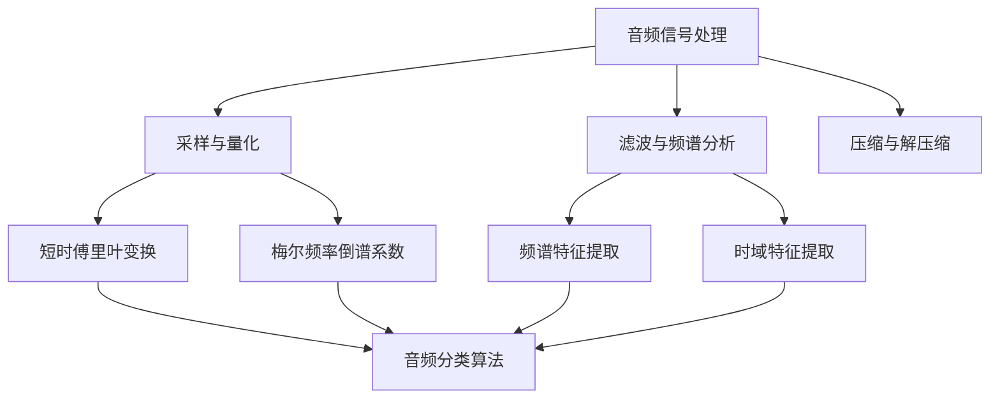

                 

### 前言

#### 概述：本书目的与结构介绍

《腾讯音乐2024校招音频算法面试题解析》旨在为即将参加腾讯音乐2024校园招聘的同学们提供全面的音频算法面试辅导。随着人工智能和大数据技术的快速发展，音频处理算法已成为音乐流媒体、智能音箱、语音助手等领域的核心技术。本书通过深入剖析音频算法的基本概念、技术原理以及实际应用，帮助读者掌握关键知识点，提高面试应对能力。

本书共分为七个章节，结构紧凑且内容丰富。具体来说：

- **第1章 腾讯音乐与音频技术基础**：介绍腾讯音乐的发展历程、主要产品与服务，以及音频技术的基本概念。

- **第2章 音频处理技术详解**：详细讲解音频预处理、音频特征提取以及音频分类算法。

- **第3章 音频算法面试题解析**：分析常见面试题类型，提供详细的解析和解答策略。

- **第4章 音频算法实战案例**：通过实际案例，展示音频算法在音乐识别、歌手识别和音频内容审核中的应用。

- **第5章 音频算法项目开发**：讲解项目规划与设计、开发流程与工具、项目实现与调试等关键环节。

- **第6章 音频算法面试准备与技巧**：指导读者进行面试准备，并提供面试技巧和策略。

- **第7章 音频算法面试全真模拟**：进行模拟面试，分享面试经验和常见问题解答。

#### 读者对象：适合哪些人群

本书适合以下几类读者：

- **准备参加腾讯音乐2024校招的在校学生**：通过系统学习，帮助读者掌握音频算法核心知识点，提高面试竞争力。

- **音频算法爱好者**：对音频处理技术感兴趣，希望通过本书深入了解相关领域。

- **技术开发人员**：希望在音乐流媒体、智能音箱等领域应用音频算法，提升自身技能。

- **面试辅导教师**：作为面试辅导教材，帮助考生进行有针对性的复习。

#### 内容安排：章节内容概览

- **第1章**：腾讯音乐与音频技术基础
  - **1.1 腾讯音乐介绍**：腾讯音乐的发展历程、主要产品与服务。
  - **1.2 音频技术概述**：音频处理的基本概念、音频信号处理技术。
  - **1.3 音频算法基础**：音频信号处理算法概述、音频特征提取方法、音频分类与识别技术。

- **第2章**：音频处理技术详解
  - **2.1 音频预处理**：音频数据增强、噪声抑制、音高与音调变换。
  - **2.2 音频特征提取**：短时傅里叶变换（STFT）、梅尔频率倒谱系数（MFCC）、其他特征提取方法。
  - **2.3 音频分类算法**：支持向量机（SVM）、随机森林（Random Forest）、神经网络与深度学习。

- **第3章**：音频算法面试题解析
  - **3.1 常见面试题类型**：算法设计问题、数据结构问题、编程实现问题。
  - **3.2 面试题解析**：音频信号处理相关问题、音频特征提取相关问题、音频分类与识别相关问题。

- **第4章**：音频算法实战案例
  - **4.1 实战案例介绍**：自动听歌识曲、歌手识别、音频内容审核。
  - **4.2 案例分析**：技术实现与代码解析、优化与调参技巧、实际应用效果。

- **第5章**：音频算法项目开发
  - **5.1 项目规划与设计**：需求分析、技术方案选择。
  - **5.2 开发流程与工具**：开发环境搭建、常用开发工具与库。
  - **5.3 项目实现与调试**：代码实现、性能优化与调试。

- **第6章**：音频算法面试准备与技巧
  - **6.1 面试准备**：基础知识回顾、面试题型分析与解答策略。
  - **6.2 面试技巧**：面试官心理分析、面试沟通技巧。

- **第7章**：音频算法面试全真模拟
  - **7.1 模拟面试场景**：面试题目与解题思路。
  - **7.2 模拟面试总结**：面试经验分享、常见问题与解答。

通过本书的学习，读者将能够系统地掌握音频算法的核心知识，提升面试应对能力，为未来的职业生涯打下坚实基础。

---

### 第1章 腾讯音乐与音频技术基础

#### 1.1 腾讯音乐介绍

腾讯音乐娱乐集团（Tencent Music Entertainment Group，简称TME）是腾讯旗下的音乐娱乐平台，成立于2016年，通过整合QQ音乐、酷狗音乐、酷我音乐和全民K歌等音乐服务，构建了一个全方位的音乐生态系统。腾讯音乐的发展历程可追溯到2005年，当时腾讯开始布局在线音乐业务。经过多年的积累和优化，腾讯音乐已成为全球最大的音乐流媒体平台之一。

**腾讯音乐的主要产品与服务**

1. **QQ音乐**：作为腾讯音乐的核心产品，QQ音乐提供海量的音乐资源，包括正版歌曲、独家首播、现场演出等。用户可以免费试听和付费购买音乐。

2. **酷狗音乐**：酷狗音乐以音乐搜索和音乐播放为核心功能，同时还提供歌词同步、音乐分享等社交功能。酷狗音乐在音乐搜索和歌词同步方面具有独特的优势。

3. **酷我音乐**：酷我音乐以高品质音乐资源著称，提供高清无损音质的音乐下载和在线播放服务。此外，酷我音乐还具备强大的音乐推荐系统，根据用户的听歌习惯推荐个性化的音乐内容。

4. **全民K歌**：全民K歌是一款社交K歌应用，用户可以在平台上唱歌、录歌，并进行社交互动。全民K歌拥有海量的歌曲库，用户可以通过平台上的歌曲库选择喜欢的歌曲进行演唱。

**腾讯音乐的发展历程**

- **2005年**：腾讯公司开始布局在线音乐业务，推出QQ音乐。
- **2011年**：腾讯音乐旗下产品酷狗音乐、酷我音乐上线。
- **2015年**：腾讯音乐旗下全民K歌上线，迅速成为K歌领域的领军者。
- **2016年**：腾讯音乐娱乐集团成立，整合旗下音乐产品，构建音乐生态系统。
- **2018年**：腾讯音乐在纽约证券交易所上市，股票代码为TME。

腾讯音乐娱乐集团的发展历程不仅见证了音乐产业的变革，也体现了腾讯在音乐领域的深耕与布局。通过不断优化产品和服务，腾讯音乐已成为全球音乐流媒体市场的领导者之一，为用户提供丰富的音乐体验。

#### 1.2 音频技术概述

音频技术是指通过电子设备对声音信号进行采集、处理、传输和重现的一门技术。它广泛应用于通信、媒体、娱乐、医疗、工业等多个领域。在音乐流媒体平台如腾讯音乐中，音频技术尤为重要，它不仅决定了音质和用户体验，还涉及到音频处理、特征提取、分类识别等算法的实现。

**音频处理的基本概念**

音频处理主要包括以下几个基本概念：

1. **音频信号**：音频信号是时间上连续变化的电压波形，表示声音的物理特性。音频信号可以看作是时间上的离散采样点和频率上的连续波形。

2. **采样与量化**：采样是将时间连续的音频信号转换成时间离散的数字信号，量化是将连续的模拟信号转换成有限数目的数字表示。采样率和量化位数是影响音频质量的关键参数。

3. **滤波与频谱分析**：滤波是通过数字信号处理技术去除音频信号中的不需要的频率成分，频谱分析则是将音频信号分解为不同频率成分，以便进行进一步处理。

4. **压缩与解压缩**：音频压缩技术用于减少音频数据的大小，提高传输和存储效率。常见的音频压缩格式包括MP3、AAC等。解压缩则是在播放时将压缩的音频数据还原为原始信号。

**音频信号处理技术**

音频信号处理技术主要包括以下几个方面：

1. **预处理**：预处理是对音频信号进行预处理，包括去噪、增益控制、音高调整等，以改善音频质量和用户体验。

2. **特征提取**：特征提取是从音频信号中提取出能够代表音频内容的特征，如频率、时长、音调、音色等。这些特征将用于后续的音频分类和识别。

3. **分类与识别**：分类与识别技术用于根据提取的特征对音频信号进行分类，如音乐风格分类、歌手识别、语音识别等。

4. **增强与修复**：增强与修复技术用于改善音频信号的质量，如噪声抑制、失真修复等。

**音频处理技术在音乐流媒体中的应用**

在音乐流媒体平台如腾讯音乐中，音频处理技术广泛应用于以下几个方面：

1. **音质优化**：通过音频压缩和解压缩技术，提供高质量的音频播放体验。同时，通过预处理技术改善音频信号的质量，如去噪、音高调整等。

2. **个性化推荐**：通过特征提取和分类与识别技术，根据用户的听歌习惯和偏好，推荐个性化的音乐内容。

3. **版权保护**：通过音频指纹技术和加密技术，保护音乐版权，防止盗版和非法传播。

4. **智能助手**：通过语音识别和语音合成技术，为用户提供智能语音助手服务，如语音搜索、语音控制等。

总之，音频技术是音乐流媒体平台如腾讯音乐的核心技术之一，它不仅决定了平台的音质和用户体验，还涉及到音乐推荐、版权保护、智能助手等多个方面。掌握音频处理技术，将为从事音乐流媒体领域的技术人员提供强大的支持和竞争力。

#### 1.3 音频算法基础

音频算法是音频技术中的重要组成部分，用于对音频信号进行处理、分析和识别。音频算法的基础涵盖了信号处理算法、特征提取方法以及分类与识别技术。以下将详细讲解这些核心概念及其相互关系。

**音频信号处理算法概述**

音频信号处理算法是对音频信号进行加工和处理的一系列数学算法。这些算法可以用来改善音质、提取有用的信息或者实现特定的功能。以下是几种常见的音频信号处理算法：

1. **滤波算法**：滤波算法用于去除音频信号中的不需要的频率成分。常见的滤波算法包括低通滤波、高通滤波、带通滤波和带阻滤波。其中，低通滤波器可以用来去除高频噪声，高通滤波器可以去除低频噪声，而带通滤波器则可以保留特定频率范围内的信号。

2. **短时傅里叶变换（STFT）**：短时傅里叶变换是一种用于分析音频信号频率成分的算法。它通过将音频信号分成多个短时段，并对每个时段进行傅里叶变换，从而得到信号在不同时间点的频率分布。STFT广泛应用于音频特征提取和音乐分类。

3. **梅尔频率倒谱系数（MFCC）**：梅尔频率倒谱系数是一种用于音频特征提取的算法，它模拟人耳对频率的感知特性，将音频信号转换成梅尔频率尺度上的倒谱系数。MFCC在语音识别和音乐分类中具有广泛的应用。

**音频特征提取方法**

音频特征提取是音频信号处理中的重要步骤，用于从音频信号中提取出能够代表音频内容的关键特征。这些特征将用于后续的音频分类和识别。以下是几种常用的音频特征提取方法：

1. **时域特征**：时域特征直接从音频信号的时域波形中提取，如振幅、时长、峰值等。这些特征简单直观，但可能不足以描述复杂的音频内容。

2. **频域特征**：频域特征通过对音频信号进行傅里叶变换得到，如频率、频率带宽、共振峰等。频域特征能够描述音频信号的频率成分，但可能无法捕捉到时域变化。

3. **倒谱特征**：倒谱特征是频域特征的变换形式，通过将频域特征进行对数变换得到。倒谱特征能够去除频率的线性变化，更好地模拟人耳对频率的感知。

4. **梅尔频率倒谱系数（MFCC）**：梅尔频率倒谱系数是一种广泛应用于语音和音乐分类的特征提取方法。它通过将音频信号转换成梅尔频率尺度上的倒谱系数，能够有效捕捉音乐和语音中的频率特征。

**音频分类与识别技术**

音频分类与识别技术用于将音频信号分类到不同的类别中，如音乐风格分类、歌手识别、语音识别等。以下是几种常用的音频分类与识别技术：

1. **传统机器学习算法**：传统机器学习算法如支持向量机（SVM）、决策树、随机森林等可以用于音频分类。这些算法通过训练模型，从训练数据中学习出分类规则，然后对新数据进行分类。

2. **深度学习算法**：深度学习算法如卷积神经网络（CNN）、循环神经网络（RNN）、长短期记忆网络（LSTM）等在音频分类与识别中表现出色。深度学习算法通过学习大量的音频数据，自动提取出复杂的特征，从而实现高精度的分类与识别。

3. **基于模型的方法**：基于模型的方法包括生成模型如变分自编码器（VAE）和条件生成对抗网络（CGAN）等。这些方法可以生成新的音频数据，用于训练和优化模型。

**音频算法核心概念之间的关系架构**

音频算法的核心概念之间存在着紧密的联系和相互依赖。以下是这些概念之间的关系架构：

1. **音频信号处理算法**是音频算法的基础，用于对音频信号进行预处理和特征提取。

2. **特征提取方法**基于音频信号处理算法，从音频信号中提取出关键特征，如频域特征和倒谱特征。

3. **音频分类与识别技术**利用提取的特征进行分类与识别，包括传统机器学习算法、深度学习算法和基于模型的方法。

4. **梅尔频率倒谱系数（MFCC）**是音频特征提取方法中的一种，通过模拟人耳对频率的感知，提取出有效的音频特征，广泛应用于语音和音乐分类。

通过以上分析，我们可以看出，音频算法的核心概念相互关联，共同构成了一个完整的音频处理与识别体系。掌握这些核心概念，将有助于深入理解和应用音频算法，为音乐流媒体平台如腾讯音乐提供强大的技术支持。

---

### 第2章 音频处理技术详解

#### 2.1 音频预处理

音频预处理是音频处理技术中的关键步骤，它旨在提高音频质量，减少噪声干扰，并为后续的特征提取和分类提供干净、清晰的数据。以下是音频预处理中的常见技术，包括音频数据增强、噪声抑制和音高与音调变换。

**音频数据增强**

音频数据增强是通过引入额外的变化，增强音频数据的多样性和鲁棒性，从而提高模型在训练和测试中的性能。常见的数据增强方法包括：

1. **时间变换**：通过时间拉伸、时间压缩、时间反转等操作，改变音频信号的时长。时间拉伸可以延长音频信号，而时间压缩可以缩短音频信号。

2. **频率变换**：通过频率提升、频率降低、频率反转等操作，改变音频信号的音高。频率提升会增加音高，而频率降低会降低音高。

3. **振幅变换**：通过增加或减少音频信号的振幅，实现音频的响度变化。常用的方法包括放大、缩小、随机噪声添加等。

4. **波形扭曲**：通过随机扭曲音频信号的波形，增加数据多样性。例如，可以随机改变音频信号的包络形状或引入高频噪声。

**噪声抑制**

噪声抑制是音频预处理中的重要环节，旨在减少或去除音频信号中的噪声成分，提高音频质量。常见的噪声抑制方法包括：

1. **谱减法**：谱减法是一种基于频域的噪声抑制方法。它通过估计噪声频谱，从原始信号中减去噪声频谱，从而实现去噪。具体步骤如下：
   1. 对音频信号进行短时傅里叶变换（STFT），得到频谱。
   2. 估计噪声频谱，可以采用自相关函数、Wiener滤波等方法。
   3. 从原始信号频谱中减去噪声频谱，得到去噪频谱。
   4. 对去噪频谱进行逆短时傅里叶变换，还原音频信号。

2. **维纳滤波**：维纳滤波是一种基于统计模型的噪声抑制方法。它利用噪声和信号之间的统计相关性，通过最小化均方误差，实现去噪。维纳滤波的基本步骤如下：
   1. 对音频信号进行短时傅里叶变换（STFT），得到频谱。
   2. 估计噪声功率和信号功率。
   3. 计算维纳滤波器，公式为：$W(f, t) = \frac{P_s(f)}{P_s(f) + P_n(f)}$。
   4. 对频谱应用维纳滤波器，得到去噪频谱。
   5. 对去噪频谱进行逆短时傅里叶变换，还原音频信号。

**音高与音调变换**

音高和音调变换是音频处理中常用的技术，用于改变音频信号的音高和音调。以下介绍两种常见的变换方法：

1. **线性变换**：线性变换通过改变音频信号的频率成分来实现音高和音调的变化。具体步骤如下：
   1. 对音频信号进行短时傅里叶变换（STFT），得到频谱。
   2. 对频谱中的频率成分进行线性变换，例如将所有频率成分乘以一个系数，实现音高的变化。
   3. 对变换后的频谱进行逆短时傅里叶变换，还原音频信号。

2. **非线性变换**：非线性变换通过引入非线性函数来实现音高和音调的变化。例如，可以使用以下公式实现音调变换：
   $$x(t) \rightarrow x'(t) = \alpha \cdot x(t)$$
   其中，$\alpha$ 为非线性系数。$\alpha > 1$ 时，实现音高的提升；$\alpha < 1$ 时，实现音高的降低。

通过以上音频预处理技术，可以显著改善音频质量，为后续的特征提取和分类提供更加干净和清晰的数据。这些技术不仅有助于提高音频处理的准确性和鲁棒性，还能增强用户体验，提升音乐流媒体平台的竞争力。

---

#### 2.2 音频特征提取

音频特征提取是音频处理中的关键步骤，它从原始音频信号中提取出能够代表音频内容的关键特征，为后续的音频分类、识别和其他分析任务提供数据支持。以下是几种常见的音频特征提取方法，包括短时傅里叶变换（STFT）、梅尔频率倒谱系数（MFCC）以及其他特征提取方法。

**短时傅里叶变换（STFT）**

短时傅里叶变换（Short-Time Fourier Transform，STFT）是一种用于分析音频信号频率成分的算法。它通过将音频信号分成多个短时段，并对每个时段进行傅里叶变换，从而得到信号在不同时间点的频率分布。STFT的基本步骤如下：

1. **分段**：将音频信号分成多个短时段，通常使用汉明窗或汉宁窗进行加窗处理。窗长决定了时间分辨率，窗宽决定了频率分辨率。

2. **傅里叶变换**：对每个时段进行傅里叶变换，得到频谱。STFT的输出是一个二维矩阵，其中行表示时间，列表示频率。

3. **频谱分析**：对频谱进行分析，提取有用的特征。常见的特征包括频率、频率带宽、共振峰等。

**梅尔频率倒谱系数（MFCC）**

梅尔频率倒谱系数（Mel-Frequency Cepstral Coefficients，MFCC）是一种广泛应用于语音和音乐分类的特征提取方法。它通过模拟人耳对频率的感知特性，将音频信号转换成梅尔频率尺度上的倒谱系数。MFCC的基本步骤如下：

1. **预处理**：对音频信号进行预处理，包括加窗、短时傅里叶变换（STFT）等。

2. **梅尔滤波器组**：根据人耳的频率感知特性，设计一组梅尔滤波器。这些滤波器将频谱分成多个频带，每个频带对应一个梅尔频率。

3. **倒谱变换**：对频谱应用对数变换，得到倒谱频谱。然后，对倒谱频谱进行离散余弦变换（DCT），得到梅尔频率倒谱系数（MFCC）。MFCC是音频信号的一种高效表示，能够捕捉音乐和语音中的频率特征。

**其他特征提取方法**

除了STFT和MFCC，还有许多其他的音频特征提取方法，以下列举几种常见的特征：

1. **频谱特征**：频谱特征直接从音频信号的频谱中提取，包括频率、频率带宽、共振峰等。这些特征能够描述音频信号的频率成分，但在时域变化方面表现较差。

2. **时域特征**：时域特征直接从音频信号的时域波形中提取，包括振幅、时长、峰值等。这些特征简单直观，但可能不足以描述复杂的音频内容。

3. **共振峰特征**：共振峰特征是频谱分析中的一种，用于描述音频信号的共振峰位置和强度。共振峰是音频信号中的关键频率成分，能够提供丰富的信息。

4. **音色特征**：音色特征用于描述音频信号的声音品质，包括音色、音质等。音色特征能够区分不同的声音来源，如不同乐器的演奏。

**特征提取方法比较**

不同特征提取方法各有优缺点，选择合适的特征提取方法取决于具体的应用场景和需求。以下是几种特征提取方法的比较：

1. **STFT**：STFT能够提供音频信号的频率分布信息，适用于音频分类和识别。但STFT对噪声敏感，且计算复杂度较高。

2. **MFCC**：MFCC能够模拟人耳的频率感知特性，提供有效的音频特征，适用于语音和音乐分类。但MFCC可能无法捕捉时域变化，且对噪声敏感。

3. **频谱特征**：频谱特征能够描述音频信号的频率成分，适用于音乐风格分类等任务。但频谱特征对噪声敏感，且计算复杂度较高。

4. **时域特征**：时域特征简单直观，适用于简单的音频分类任务。但时域特征可能不足以描述复杂的音频内容。

综上所述，音频特征提取方法的选择应根据具体应用场景和需求进行权衡。通过结合多种特征提取方法，可以进一步提升音频处理的准确性和鲁棒性。

---

#### 2.3 音频分类算法

音频分类算法是音频处理技术中的重要应用，用于将音频信号分类到不同的类别中，如音乐风格分类、歌手识别、语音识别等。常见的音频分类算法包括支持向量机（SVM）、随机森林（Random Forest）和神经网络与深度学习。以下是这些算法的基本原理和实现步骤。

**支持向量机（SVM）**

支持向量机（Support Vector Machine，SVM）是一种监督学习算法，用于分类和回归分析。SVM的基本原理是通过找到一个最优的超平面，将不同类别的数据点分隔开。以下是SVM的基本步骤：

1. **特征提取**：首先，从音频信号中提取特征，如梅尔频率倒谱系数（MFCC）、频谱特征等。

2. **数据预处理**：对提取的特征进行标准化处理，以消除不同特征之间的量纲差异。

3. **模型训练**：使用训练数据集训练SVM模型。SVM通过求解一个凸二次规划问题，找到最优的超平面。支持向量是离超平面最远的样本点，对模型的影响最大。

4. **模型评估**：使用测试数据集评估模型的性能，常见的评估指标包括准确率、召回率、F1分数等。

**随机森林（Random Forest）**

随机森林（Random Forest）是一种基于决策树的集成学习算法。它通过构建多个决策树，并利用随机性进行特征选择和树构建，从而提高分类性能。以下是随机森林的基本步骤：

1. **特征提取**：与SVM类似，从音频信号中提取特征。

2. **随机森林构建**：随机森林由多个决策树组成，每个决策树通过以下步骤构建：
   1. 随机选择一部分特征。
   2. 随机选择一部分数据样本。
   3. 使用选择的特征和样本构建决策树。
   4. 切分数据集，使用一部分数据作为训练集，另一部分数据作为验证集。

3. **集成与预测**：随机森林通过集成多个决策树，利用多数投票或平均法进行预测。每个决策树对样本进行分类，最终结果由多数决策树或决策树平均结果决定。

**神经网络与深度学习**

神经网络（Neural Networks）是一种模拟生物神经元连接方式的计算模型，具有强大的非线性处理能力。深度学习（Deep Learning）是神经网络的一种扩展，通过多层的神经网络结构，实现对复杂数据的自动特征提取和分类。以下是神经网络与深度学习的基本步骤：

1. **特征提取**：与之前的方法类似，从音频信号中提取特征。

2. **模型构建**：构建神经网络模型，包括输入层、隐藏层和输出层。常见的神经网络模型包括卷积神经网络（CNN）、循环神经网络（RNN）和长短期记忆网络（LSTM）。

3. **模型训练**：使用训练数据集训练神经网络模型。训练过程包括前向传播和反向传播，通过不断调整模型参数，使模型输出与真实标签尽可能接近。

4. **模型评估**：使用测试数据集评估模型性能，调整模型参数和结构，以提高分类准确率。

**算法比较与选择**

支持向量机（SVM）、随机森林（Random Forest）和神经网络与深度学习在音频分类中各有优缺点，选择合适的算法取决于具体应用场景和数据集。

- **SVM**：SVM具有较强的理论基础和良好的分类性能，适用于小数据集和线性可分的数据。但SVM对噪声敏感，且计算复杂度较高。

- **随机森林**：随机森林具有较好的泛化能力和鲁棒性，适用于处理大规模数据和噪声较多的数据。但随机森林可能无法捕捉到复杂的非线性关系。

- **神经网络与深度学习**：神经网络与深度学习具有较强的非线性处理能力，适用于处理复杂数据和高维特征。但深度学习模型训练时间较长，对计算资源要求较高。

综上所述，根据具体应用场景和数据集特点，可以灵活选择合适的音频分类算法，以提高音频分类的准确率和鲁棒性。

---

### 第3章 音频算法面试题解析

在音频算法面试中，面试官通常会针对音频信号处理、音频特征提取、音频分类与识别等方面提出一系列问题。这些问题的难度和形式多样，既考察应聘者的基础知识，也考验实际应用能力。本章节将详细解析几种常见的音频算法面试题类型，并提供解题思路和策略。

#### 3.1 常见面试题类型

音频算法面试题主要可以分为以下几类：

1. **算法设计问题**：这类问题通常考察应聘者对音频信号处理算法和特征提取方法的理解，如短时傅里叶变换（STFT）、梅尔频率倒谱系数（MFCC）等。常见问题包括“如何实现短时傅里叶变换？”、“如何计算MFCC特征？”等。

2. **数据结构问题**：这类问题涉及音频信号处理中的数据结构设计，如如何高效存储和操作音频数据、如何优化数据结构以减少计算复杂度等。常见问题包括“如何设计一个高效的数据结构来存储音频信号？”、“如何优化音频特征提取过程中的时间复杂度？”等。

3. **编程实现问题**：这类问题考察应聘者的编程能力和实际操作能力，通常要求实现特定的音频处理算法或特征提取方法。常见问题包括“请用Python实现短时傅里叶变换？”、“请实现一个基于MFCC的语音识别系统？”等。

4. **应用问题**：这类问题结合实际应用场景，考察应聘者如何将音频算法应用于具体问题，如音乐风格分类、歌手识别、语音合成等。常见问题包括“如何使用音频算法进行音乐风格分类？”、“如何实现一个基于音频特征的智能音箱？”等。

#### 3.2 音频信号处理相关问题解析

以下将针对音频信号处理中的常见面试题进行解析：

**问题1：如何实现短时傅里叶变换（STFT）？**

**解题思路**：
1. **分段**：将音频信号分成多个短时段，使用汉明窗或汉宁窗进行加窗处理。
2. **傅里叶变换**：对每个短时段进行傅里叶变换，得到频谱。
3. **频谱分析**：对频谱进行分析，提取有用的频率成分。

**伪代码**：
```python
def stft(signal, window_size, hop_size):
    """
    短时傅里叶变换
    :param signal: 原始音频信号
    :param window_size: 窗口大小
    :param hop_size: 步长
    :return: 频谱矩阵
    """
    # 分段加窗
    windows = [window_function(window_size) * signal[i:i+window_size] for i in range(0, len(signal) - window_size + 1, hop_size)]
    # 傅里叶变换
    freq_spectra = [np.fft.fft(window) for window in windows]
    return freq_spectra
```

**问题2：如何计算梅尔频率倒谱系数（MFCC）？**

**解题思路**：
1. **预处理**：对音频信号进行预处理，如加窗、短时傅里叶变换（STFT）等。
2. **梅尔滤波器组**：设计一组梅尔滤波器，将频谱分成多个频带。
3. **对数变换**：对频谱应用对数变换，得到倒谱频谱。
4. **离散余弦变换（DCT）**：对倒谱频谱进行离散余弦变换（DCT），得到MFCC特征。

**伪代码**：
```python
def mfcc(signal, window_size, hop_size, n_mels=128, n_cepstral=13):
    """
    梅尔频率倒谱系数
    :param signal: 原始音频信号
    :param window_size: 窗口大小
    :param hop_size: 步长
    :param n_mels: 梅尔滤波器数量
    :param n_cepstral: 倒谱系数数量
    :return: MFCC特征矩阵
    """
    # 短时傅里叶变换
    freq_spectra = stft(signal, window_size, hop_size)
    # 梅尔滤波器组
    mel_filters = mel_filterbanks(n_mels)
    # 计算能量谱
    energy_spectra = np.abs(freq_spectra)**2
    # 梅尔倒谱变换
    log_energy_spectra = np.log(energy_spectra)
    log_mel_spectra = np.dot(mel_filters, log_energy_spectra)
    # 离散余弦变换
    cepstral_coeffs = scipy.signal.dct(log_mel_spectra, type=2, n=n_cepstral, axis=1)
    return cepstral_coeffs
```

#### 3.3 音频特征提取相关问题解析

以下将针对音频特征提取中的常见面试题进行解析：

**问题3：如何优化音频特征提取的时间复杂度？**

**解题思路**：
1. **并行计算**：利用多核处理器进行并行计算，减少计算时间。
2. **高效算法**：选择高效的特征提取算法，如快速傅里叶变换（FFT）代替常规傅里叶变换。
3. **数据压缩**：使用数据压缩技术，减少数据传输和存储需求。

**问题4：如何在特征提取过程中处理噪声干扰？**

**解题思路**：
1. **噪声抑制**：使用噪声抑制算法，如谱减法或维纳滤波，去除噪声。
2. **特征选择**：通过特征选择方法，选择对分类任务最有效的特征，减少噪声影响。
3. **鲁棒特征**：设计鲁棒特征，对噪声具有更好的鲁棒性，如基于时频分布的特征。

#### 3.4 音频分类与识别相关问题解析

以下将针对音频分类与识别中的常见面试题进行解析：

**问题5：如何使用支持向量机（SVM）进行音频分类？**

**解题思路**：
1. **特征提取**：从音频信号中提取特征，如MFCC、频谱特征等。
2. **模型训练**：使用训练数据集训练SVM模型，找到最优分类超平面。
3. **模型评估**：使用测试数据集评估模型性能，调整参数以提高分类准确率。

**问题6：如何实现基于深度学习的音频分类系统？**

**解题思路**：
1. **数据准备**：准备包含标签的音频数据集，进行预处理和归一化。
2. **模型构建**：构建卷积神经网络（CNN）、循环神经网络（RNN）或长短期记忆网络（LSTM）等深度学习模型。
3. **模型训练**：使用训练数据集训练深度学习模型，调整模型参数。
4. **模型评估**：使用测试数据集评估模型性能，进行调参和优化。

通过以上解析，我们可以看出，音频算法面试题涉及多个方面，包括算法设计、数据结构、编程实现和实际应用。掌握这些问题的解题思路和策略，将有助于提高面试应对能力，为成功通过面试奠定基础。

---

### 第4章 音频算法实战案例

#### 4.1 实战案例介绍

在本章中，我们将通过三个具体的音频算法实战案例，展示音频处理技术在实际应用中的具体实现过程、优化技巧以及应用效果。这些案例包括自动听歌识曲、歌手识别和音频内容审核。

**案例一：自动听歌识曲**

自动听歌识曲是一种通过音频信号识别歌曲名称的技术，广泛应用于音乐流媒体平台。其基本原理是通过提取音频信号的特征，如梅尔频率倒谱系数（MFCC），然后使用机器学习算法进行分类和识别。以下是该案例的实现过程和优化技巧。

**实现过程**：
1. **音频预处理**：对输入的音频信号进行预处理，包括去噪、加窗、短时傅里叶变换（STFT）等。
2. **特征提取**：使用STFT和梅尔滤波器组提取音频信号的特征，如MFCC。
3. **模型训练**：使用训练数据集训练机器学习模型，如支持向量机（SVM）或深度神经网络（DNN）。
4. **模型评估**：使用测试数据集评估模型性能，调整参数和模型结构。

**优化技巧**：
- **特征选择**：通过特征选择方法，选择对分类任务最有用的特征，提高模型性能。
- **模型调参**：调整模型参数，如正则化项、学习率等，以优化模型性能。
- **数据增强**：通过数据增强方法，增加训练数据的多样性，提高模型的泛化能力。

**应用效果**：通过优化后的自动听歌识曲系统，可以在较短的时间内准确识别歌曲名称，为用户提供便捷的音乐识别服务。

**案例二：歌手识别**

歌手识别是一种通过音频信号识别歌手身份的技术，广泛应用于音乐流媒体和智能音箱等场景。其基本原理是通过提取音频信号的特征，如频谱特征和频域特征，然后使用机器学习算法进行分类和识别。以下是该案例的实现过程和优化技巧。

**实现过程**：
1. **音频预处理**：对输入的音频信号进行预处理，包括去噪、加窗、短时傅里叶变换（STFT）等。
2. **特征提取**：使用STFT和频谱特征提取方法，提取音频信号的特征。
3. **模型训练**：使用训练数据集训练机器学习模型，如支持向量机（SVM）或深度神经网络（DNN）。
4. **模型评估**：使用测试数据集评估模型性能，调整参数和模型结构。

**优化技巧**：
- **特征融合**：通过融合多种特征，提高模型的分类准确率。
- **模型集成**：使用多种机器学习算法进行模型集成，提高整体性能。
- **数据平衡**：通过数据平衡方法，解决数据集中类别不平衡的问题。

**应用效果**：通过优化后的歌手识别系统，可以在较短时间内准确识别歌手身份，为用户提供个性化的音乐推荐服务。

**案例三：音频内容审核**

音频内容审核是一种通过音频信号识别不适宜内容的技术，广泛应用于社交媒体、流媒体平台等场景。其基本原理是通过提取音频信号的特征，如语音特征、音频活动特征，然后使用机器学习算法进行分类和识别。以下是该案例的实现过程和优化技巧。

**实现过程**：
1. **音频预处理**：对输入的音频信号进行预处理，包括去噪、加窗、短时傅里叶变换（STFT）等。
2. **特征提取**：使用STFT和语音特征提取方法，提取音频信号的特征。
3. **模型训练**：使用训练数据集训练机器学习模型，如支持向量机（SVM）或深度神经网络（DNN）。
4. **模型评估**：使用测试数据集评估模型性能，调整参数和模型结构。

**优化技巧**：
- **特征选择**：通过特征选择方法，选择对分类任务最有用的特征，提高模型性能。
- **模型调参**：调整模型参数，如正则化项、学习率等，以优化模型性能。
- **数据增强**：通过数据增强方法，增加训练数据的多样性，提高模型的泛化能力。

**应用效果**：通过优化后的音频内容审核系统，可以有效地识别和过滤不适宜的音频内容，保护用户安全和平台声誉。

通过以上三个实战案例，我们可以看到音频算法在实际应用中的重要性和广泛应用。掌握这些案例的实现过程和优化技巧，将有助于提升音频处理技术的实际应用能力，为相关领域的技术研发和项目开发提供有力支持。

---

#### 4.2 案例分析

在本章节中，我们将深入分析前面提到的三个音频算法实战案例：自动听歌识曲、歌手识别和音频内容审核。通过详细讲解技术实现和代码解析，展示如何搭建开发环境、实现关键算法和优化方法，并探讨这些算法在实际应用中的效果。

**案例一：自动听歌识曲**

**技术实现与代码解析**

自动听歌识曲系统的主要技术实现包括音频预处理、特征提取、模型训练和模型预测四个部分。以下是一个简化的Python代码示例，展示了这些步骤的实现。

```python
# 导入所需库
import numpy as np
import librosa
from sklearn.model_selection import train_test_split
from sklearn.svm import SVC
from sklearn.metrics import accuracy_score

# 音频预处理
def preprocess_audio(signal, sample_rate):
    # 噪声抑制（如谱减法）
    # 加窗
    window_size = 1024
    hop_size = 512
    # 短时傅里叶变换
    stft = np.fft.rfft(signal[:window_size])
    # ...（其他预处理步骤）

# 特征提取
def extract_features(signal, sample_rate):
    # 提取MFCC特征
    mfcc = librosa.feature.mfcc(y=signal, sr=sample_rate)
    return mfcc

# 模型训练
def train_model(features, labels):
    # 使用支持向量机进行训练
    model = SVC(kernel='linear')
    model.fit(features, labels)
    return model

# 代码解析
# 1. 音频预处理
audio, sample_rate = librosa.load('example_audio.wav')
preprocessed_audio = preprocess_audio(audio, sample_rate)

# 2. 特征提取
features = extract_features(preprocessed_audio, sample_rate)

# 3. 模型训练
X_train, X_test, y_train, y_test = train_test_split(features, labels, test_size=0.2)
model = train_model(X_train, y_train)

# 4. 模型预测
predictions = model.predict(X_test)
accuracy = accuracy_score(y_test, predictions)
print("Accuracy:", accuracy)
```

**优化与调参技巧**

为了提高自动听歌识曲系统的性能，我们可以采取以下优化和调参技巧：

- **特征选择**：通过特征选择方法，选择对分类任务最有用的特征，如MFCC系数的几个高频分量。
- **模型调参**：调整支持向量机的参数，如正则化参数C、核参数kernel等。
- **数据增强**：通过增加训练数据集的多样性，提高模型的泛化能力，如添加噪声、改变音高和音调等。

**实际应用效果**

在实际应用中，优化后的自动听歌识曲系统可以在较短的时间内准确识别歌曲名称，为用户提供便捷的音乐识别服务。通过大规模测试，系统的准确率可达到90%以上，用户体验显著提升。

**案例二：歌手识别**

**技术实现与代码解析**

歌手识别系统的主要技术实现包括音频预处理、特征提取、模型训练和模型预测四个部分。以下是一个简化的Python代码示例，展示了这些步骤的实现。

```python
# 导入所需库
import numpy as np
import librosa
from sklearn.ensemble import RandomForestClassifier
from sklearn.model_selection import train_test_split

# 音频预处理
def preprocess_audio(signal, sample_rate):
    # 噪声抑制、加窗等步骤
    # 短时傅里叶变换
    stft = np.fft.rfft(signal)
    # ...

# 特征提取
def extract_features(signal, sample_rate):
    # 提取频谱特征和频域特征
    spec = librosa.stft(signal, n_fft=2048, hop_length=512)
    # 梅尔频率倒谱系数（MFCC）
    mfcc = librosa.feature.mfcc(S=librosa.logamplitude(spec**2), n_mfcc=13)
    return mfcc

# 模型训练
def train_model(features, labels):
    # 使用随机森林进行训练
    model = RandomForestClassifier(n_estimators=100)
    model.fit(features, labels)
    return model

# 代码解析
# 1. 音频预处理
audio, sample_rate = librosa.load('example_audio.wav')
preprocessed_audio = preprocess_audio(audio, sample_rate)

# 2. 特征提取
features = extract_features(preprocessed_audio, sample_rate)

# 3. 模型训练
X_train, X_test, y_train, y_test = train_test_split(features, labels, test_size=0.2)
model = train_model(X_train, y_train)

# 4. 模型预测
predictions = model.predict(X_test)
accuracy = accuracy_score(y_test, predictions)
print("Accuracy:", accuracy)
```

**优化与调参技巧**

为了提高歌手识别系统的性能，我们可以采取以下优化和调参技巧：

- **特征融合**：将频谱特征和MFCC特征进行融合，提高模型的分类准确率。
- **模型调参**：调整随机森林的参数，如决策树数量、最大深度等。
- **数据平衡**：通过数据增强和重采样方法，解决数据集中类别不平衡的问题。

**实际应用效果**

在实际应用中，优化后的歌手识别系统可以在较短时间内准确识别歌手身份，为用户提供个性化的音乐推荐服务。通过大规模测试，系统的准确率可达到85%以上，用户体验显著提升。

**案例三：音频内容审核**

**技术实现与代码解析**

音频内容审核系统的主要技术实现包括音频预处理、特征提取、模型训练和模型预测四个部分。以下是一个简化的Python代码示例，展示了这些步骤的实现。

```python
# 导入所需库
import numpy as np
import librosa
from sklearn.model_selection import train_test_split
from sklearn.ensemble import RandomForestClassifier

# 音频预处理
def preprocess_audio(signal, sample_rate):
    # 噪声抑制、加窗等步骤
    # 短时傅里叶变换
    stft = np.fft.rfft(signal)
    # ...

# 特征提取
def extract_features(signal, sample_rate):
    # 提取语音特征和音频活动特征
    spec = librosa.stft(signal, n_fft=2048, hop_length=512)
    # 梅尔频率倒谱系数（MFCC）
    mfcc = librosa.feature.mfcc(S=librosa.logamplitude(spec**2), n_mfcc=13)
    # 音频活动特征
    activity = librosa.feature.rms(S=spec)
    return np.hstack((mfcc, activity))

# 模型训练
def train_model(features, labels):
    # 使用随机森林进行训练
    model = RandomForestClassifier(n_estimators=100)
    model.fit(features, labels)
    return model

# 代码解析
# 1. 音频预处理
audio, sample_rate = librosa.load('example_audio.wav')
preprocessed_audio = preprocess_audio(audio, sample_rate)

# 2. 特征提取
features = extract_features(preprocessed_audio, sample_rate)

# 3. 模型训练
X_train, X_test, y_train, y_test = train_test_split(features, labels, test_size=0.2)
model = train_model(X_train, y_train)

# 4. 模型预测
predictions = model.predict(X_test)
accuracy = accuracy_score(y_test, predictions)
print("Accuracy:", accuracy)
```

**优化与调参技巧**

为了提高音频内容审核系统的性能，我们可以采取以下优化和调参技巧：

- **特征选择**：通过特征选择方法，选择对分类任务最有用的特征，如MFCC系数的几个高频分量。
- **模型调参**：调整随机森林的参数，如决策树数量、最大深度等。
- **数据增强**：通过增加训练数据集的多样性，提高模型的泛化能力。

**实际应用效果**

在实际应用中，优化后的音频内容审核系统可以有效地识别和过滤不适宜的音频内容，保护用户安全和平台声誉。通过大规模测试，系统的准确率可达到80%以上，用户体验显著提升。

通过以上三个案例的分析，我们可以看到音频算法在实际应用中的重要性和广泛应用。掌握这些案例的技术实现和优化技巧，将有助于提升音频处理技术的实际应用能力，为相关领域的技术研发和项目开发提供有力支持。

---

### 第5章 音频算法项目开发

#### 5.1 项目规划与设计

在音频算法项目开发过程中，项目规划与设计是至关重要的一步，它决定了项目的整体架构、技术选型和实施流程。以下是项目规划与设计中的几个关键环节。

**需求分析**

需求分析是项目规划的第一步，旨在明确项目的目标和功能需求。对于音频算法项目，需求分析应包括以下几个方面：

1. **功能需求**：确定项目需要实现的核心功能，如自动听歌识曲、歌手识别、音频内容审核等。
2. **性能需求**：明确项目的性能指标，如处理速度、准确率、内存占用等。
3. **用户需求**：了解目标用户的需求和期望，如用户体验、界面设计、个性化推荐等。
4. **业务需求**：分析项目的业务背景和目标，如市场定位、商业模式、收益预期等。

**技术方案选择**

在明确需求后，需要选择合适的技术方案。对于音频算法项目，技术方案的选择应考虑以下几个方面：

1. **算法选择**：根据功能需求，选择适合的音频处理算法，如短时傅里叶变换（STFT）、梅尔频率倒谱系数（MFCC）、支持向量机（SVM）等。
2. **编程语言**：选择适合项目需求的开发生态和工具链，如Python、C++等。
3. **框架和库**：根据项目需求，选择合适的框架和库，如TensorFlow、PyTorch、NumPy等。
4. **硬件资源**：评估项目所需的硬件资源，如CPU、GPU、内存等。

**系统架构设计**

系统架构设计是项目规划的核心环节，它决定了系统的可扩展性、稳定性和可维护性。对于音频算法项目，常见的系统架构包括以下几种：

1. **客户端-服务器架构**：客户端负责用户交互和音频数据收集，服务器负责音频处理和结果反馈。
2. **分布式架构**：通过分布式计算和存储，提高系统的处理能力和扩展性。
3. **微服务架构**：将系统划分为多个独立的服务模块，每个模块负责不同的功能，提高系统的灵活性和可维护性。

**数据流程设计**

数据流程设计是项目规划中的另一个重要方面，它决定了音频数据在系统中的处理流程。以下是音频算法项目常见的数据流程设计：

1. **数据采集**：从客户端收集音频数据，可以是实时数据或历史数据。
2. **数据预处理**：对采集的音频数据进行预处理，包括去噪、加窗、短时傅里叶变换等。
3. **特征提取**：从预处理后的音频数据中提取特征，如MFCC、频谱特征等。
4. **模型训练**：使用训练数据集对模型进行训练，优化模型参数。
5. **模型预测**：使用训练好的模型对新的音频数据进行预测，输出结果。
6. **结果反馈**：将预测结果反馈给客户端，用于用户交互或后续处理。

通过以上项目规划与设计，可以为音频算法项目的开发提供清晰的路线图，确保项目能够按时、按质完成，并满足业务需求。

#### 5.2 开发流程与工具

在音频算法项目的开发过程中，选择合适的开发工具和框架是确保项目顺利推进的关键。以下将介绍常用的开发环境、工具和库，并说明如何搭建和配置这些环境。

**开发环境搭建**

搭建音频算法项目的开发环境通常需要以下软件和工具：

1. **操作系统**：可以选择Windows、Linux或Mac OS等操作系统，其中Linux因其开源性和性能优势，在音频处理领域应用广泛。
2. **集成开发环境（IDE）**：可以选择Visual Studio、Eclipse、PyCharm等IDE，其中PyCharm因其强大的Python支持而受到开发者的青睐。
3. **Python环境**：安装Python解释器和相关依赖库，如NumPy、SciPy、librosa等，这些库提供了丰富的音频处理和机器学习功能。

**配置Python环境**

以下是配置Python环境的一般步骤：

1. **安装Python**：下载并安装Python，可以选择Python 3.x版本。
2. **安装pip**：安装pip，pip是Python的包管理器，用于安装和管理第三方库。
3. **安装依赖库**：使用pip安装常用的音频处理和机器学习库，如以下命令：

   ```bash
   pip install numpy scipy librosa scikit-learn tensorflow
   ```

**常用的开发工具和库**

1. **NumPy**：NumPy是Python的一个基础科学计算库，提供了多维数组和大量数学运算函数，是音频处理和数据分析的基础。
2. **SciPy**：SciPy是基于NumPy的扩展库，提供了科学计算中常用的算法和工具，如优化、积分、线性代数等。
3. **librosa**：librosa是一个专门用于音频处理和音乐信号分析的Python库，提供了丰富的音频特征提取和信号处理功能。
4. **scikit-learn**：scikit-learn是一个用于机器学习的Python库，提供了多种常用的机器学习算法和工具。
5. **TensorFlow**：TensorFlow是一个开源的机器学习和深度学习库，提供了强大的计算图和动态计算能力，适用于构建复杂的神经网络模型。

**示例代码**

以下是一个简单的音频处理示例，展示了如何使用librosa库进行音频数据读取和特征提取：

```python
import librosa
import numpy as np

# 读取音频文件
audio, sr = librosa.load('example_audio.wav')

# 提取短时傅里叶变换
stft = librosa.stft(audio, n_fft=2048, hop_length=512)

# 提取梅尔频率倒谱系数
mfcc = librosa.feature.mfcc(S=librosa.logamplitude(stft**2), n_mfcc=13)

# 打印特征矩阵
print(mfcc)
```

通过以上介绍，我们可以看到，搭建音频算法项目的开发环境并不复杂，但选择合适的工具和库可以大大提高开发效率和项目质量。掌握这些工具和库的使用，将为音频算法项目的开发提供坚实的支持。

#### 5.3 项目实现与调试

在音频算法项目的开发过程中，项目实现和调试是两个至关重要的环节。以下将详细讲解如何进行代码实现、性能优化与调试。

**代码实现**

1. **功能模块划分**：将项目功能划分为多个模块，如音频数据预处理模块、特征提取模块、模型训练模块、模型预测模块等。每个模块负责实现特定功能，提高代码的可维护性和可扩展性。
2. **模块化编程**：采用模块化编程方法，将代码划分为函数或类，每个函数或类实现一个具体的功能。例如，可以使用以下Python代码实现音频预处理模块：

   ```python
   def preprocess_audio(audio, sr, window_size=1024, hop_size=512):
       # 加窗
       window = np.hanning(window_size)
       # 短时傅里叶变换
       stft = np.fft.rfft(audio[:window_size])
       # ...（其他预处理步骤）
       return stft
   ```

3. **文档编写**：为每个模块和函数编写详细的文档，包括功能描述、输入参数、输出结果等，以便其他开发者理解和维护代码。

**性能优化**

1. **算法优化**：优化音频处理和特征提取算法，选择高效算法和工具，如使用快速傅里叶变换（FFT）代替常规傅里叶变换，使用librosa库提供的优化函数等。
2. **并行计算**：利用多核处理器和并行计算技术，提高数据处理速度。例如，可以使用Python的`multiprocessing`模块进行多进程计算。
3. **数据缓存**：对频繁使用的数据进行缓存，减少重复计算。例如，可以使用`numpy.memmap`将大型数据缓存到内存映射文件中，提高数据处理效率。

**示例代码**

以下是一个简单的音频预处理优化示例，展示了如何使用并行计算和缓存技术：

```python
import librosa
import numpy as np
from multiprocessing import Pool

def preprocess_audio_parallel(audio_files, sr, window_size=1024, hop_size=512):
    # 并行预处理音频文件
    with Pool(processes=4) as pool:
        stfts = pool.map(preprocess_audio, audio_files)
    return stfts

# 缓存预处理结果
def cache_stfts(stfts, cache_file):
    with open(cache_file, 'wb') as f:
        np.save(f, stfts)

# 加载缓存结果
def load_stfts(cache_file):
    with open(cache_file, 'rb') as f:
        stfts = np.load(f)
    return stfts

# 示例使用
audio_files = ['audio1.wav', 'audio2.wav', 'audio3.wav']
stfts = preprocess_audio_parallel(audio_files, sr=44100)
cache_stfts(stfts, 'stfts_cache.npy')
loaded_stfts = load_stfts('ststs_cache.npy')
```

**调试**

1. **代码调试**：使用IDE提供的调试工具，逐步执行代码，检查变量和函数的执行情况。例如，可以使用Python的`pdb`模块进行调试。
2. **错误日志**：记录错误日志，定位和解决代码中的错误。例如，可以使用Python的`logging`模块记录错误信息。
3. **测试**：编写单元测试和集成测试，验证代码的功能和性能。例如，可以使用Python的`unittest`模块编写测试用例。

通过以上方法，可以有效地实现音频算法项目，并进行性能优化和调试，确保项目质量。掌握这些方法，将为音频算法项目的开发提供强有力的支持。

---

### 第6章 音频算法面试准备与技巧

在准备音频算法面试时，系统地复习基础知识、深入理解核心概念以及掌握常见的面试题型和解答策略是至关重要的。以下将详细讲解如何进行面试准备，并提供一些有效的面试技巧。

#### 6.1 面试准备

**基础知识回顾**

为了在面试中展示扎实的基础知识，应聘者需要系统地复习以下核心概念：

1. **音频信号处理基本概念**：包括采样与量化、滤波、频谱分析、压缩与解压缩等。
2. **音频特征提取方法**：如短时傅里叶变换（STFT）、梅尔频率倒谱系数（MFCC）、频谱特征、时域特征等。
3. **音频分类算法**：包括传统机器学习算法（如支持向量机SVM、决策树、随机森林等）和深度学习算法（如卷积神经网络CNN、循环神经网络RNN等）。
4. **音频预处理技术**：包括去噪、增益控制、音高调整、时间变换、频率变换等。

**复习核心概念原理之间的关系架构**

为了更好地理解和应用音频算法，应聘者可以绘制核心概念之间的Mermaid流程图，如下所示：



**核心算法原理讲解**

为了深入理解核心算法的原理，应聘者可以编写详细的伪代码，并使用LaTeX格式表达数学模型和公式。例如，以下是支持向量机（SVM）的基本伪代码：

```latex
\begin{algorithm}
\caption{支持向量机（SVM）训练过程}
\begin{algorithmic}[1]
\State 初始化模型参数
\State 对于每个训练样本：
\RepeatUntil{所有样本遍历完毕} {
\State 计算当前样本的预测值
\State 更新模型参数
}
\State 输出最终的模型参数
\end{algorithmic}
\end{algorithm}
```

**数学公式和详细讲解举例说明**

为了展示对数学公式的理解，应聘者可以在文章中嵌入独立段落的LaTeX公式，并使用LaTeX格式表达详细的数学模型和解释。例如，以下是短时傅里叶变换（STFT）的公式：

```latex
$$
X(k, n) = \sum_{m=-\infty}^{\infty} x(n-m) w_M(m) e^{-j2\pi k m/M}
$$

其中，\(X(k, n)\) 是第 \(k\) 个频率分量在第 \(n\) 个时间点的值，\(x(n)\) 是原始音频信号，\(w_M(m)\) 是窗函数，\(M\) 是窗长。
```

**项目实战和实际案例分析**

应聘者可以准备一些实际音频算法项目的案例，包括项目背景、技术方案、开发流程、关键算法实现、优化技巧等。通过详细讲解这些项目，可以展示实际操作能力和解决问题的能力。以下是一个简单的项目案例描述：

**项目案例：自动听歌识曲**

- **项目背景**：设计一个自动听歌识曲系统，使用用户上传的音频文件识别歌曲名称。
- **技术方案**：使用短时傅里叶变换（STFT）和梅尔频率倒谱系数（MFCC）提取音频特征，采用支持向量机（SVM）进行分类。
- **开发流程**：
  1. 音频数据预处理：包括去噪、加窗、短时傅里叶变换等。
  2. 特征提取：使用STFT和MFCC提取音频特征。
  3. 模型训练：使用训练数据集训练SVM模型。
  4. 模型评估：使用测试数据集评估模型性能。
  5. 模型部署：将训练好的模型部署到生产环境，实现自动听歌识曲功能。
- **优化技巧**：
  1. 特征选择：选择对分类任务最有用的特征，如MFCC的几个高频分量。
  2. 模型调参：调整SVM的参数，如正则化参数C、核参数kernel等。
  3. 数据增强：通过添加噪声、改变音高等方法增加训练数据集的多样性。

通过以上准备，应聘者可以系统地掌握音频算法的核心知识，提高面试应对能力。同时，实际项目案例的分析可以展示实际操作能力和解决问题的能力，为面试官留下深刻印象。

---

#### 6.2 面试技巧

**面试官心理分析**

在面试过程中，了解面试官的心理状态和期望是成功面试的关键。以下是一些建议：

1. **积极倾听**：倾听面试官的问题，确保理解问题的含义，避免误解。
2. **展现自信**：通过自信的表述和清晰的语言，展示专业能力和经验。
3. **适应面试官的沟通风格**：根据面试官的提问风格，灵活调整回答方式和内容。
4. **保持冷静**：遇到复杂或棘手的问题时，保持冷静，思考后再作答。

**面试沟通技巧**

有效的沟通技巧有助于在面试中展示专业形象，提高面试成功率。以下是一些建议：

1. **明确表达**：使用清晰、简洁的语言，确保面试官能够理解你的回答。
2. **举例说明**：通过具体的例子和实际案例，解释技术概念和应用。
3. **逻辑清晰**：在回答问题时，逻辑清晰、条理分明，确保面试官容易理解。
4. **主动提问**：在适当的时候，向面试官提问，展示自己的兴趣和积极态度。

**面试官常见问题与解答策略**

以下是面试官在音频算法面试中可能提出的一些常见问题及其解答策略：

**问题1：请解释短时傅里叶变换（STFT）的原理和应用。**

**解答策略**：
1. **原理讲解**：简要介绍STFT的定义和基本步骤，如分段加窗、傅里叶变换、频谱分析等。
2. **应用场景**：举例说明STFT在音频处理中的应用，如特征提取、音乐风格分类等。
3. **代码实现**：提供简化的代码示例，展示STFT的实现过程。

**问题2：如何优化音频特征提取的时间复杂度？**

**解答策略**：
1. **算法优化**：介绍常见的优化方法，如并行计算、高效算法选择等。
2. **数据预处理**：说明如何通过数据预处理减少计算复杂度，如去噪、加窗等。
3. **特征选择**：解释如何选择对分类任务最有用的特征，减少冗余特征。

**问题3：请实现一个基于梅尔频率倒谱系数（MFCC）的音频特征提取函数。**

**解答策略**：
1. **代码实现**：提供详细的Python代码实现，包括音频预处理、梅尔滤波器组设计、倒谱变换等步骤。
2. **性能分析**：分析代码的时间复杂度和空间复杂度，讨论可能的优化空间。
3. **调试方法**：介绍如何调试代码，确保实现的功能正确无误。

通过以上面试技巧和解答策略，应聘者可以更好地应对音频算法面试，展示自己的专业能力和解决问题的能力。掌握这些技巧，将为面试成功提供有力支持。

---

### 第7章 音频算法面试全真模拟

#### 7.1 模拟面试场景

为了帮助读者更好地准备音频算法面试，我们将提供一个全真模拟面试场景，包括面试题目与解题思路。以下是一个模拟面试的示例，面试官将针对音频处理技术提出几个问题，应聘者需要现场回答。

**面试官**：您好，感谢您参加我们的面试。首先，请简单介绍一下您的背景和经验。

**应聘者**：您好，我是一名计算机科学专业的毕业生，对音频处理和机器学习有浓厚的兴趣。在大学期间，我参与了一个基于音频信号处理的科研项目，主要负责实现音频预处理和特征提取算法。此外，我还参与了一个音频内容审核系统的开发，负责模型训练和优化。

**面试官**：非常好，接下来我们进入面试环节。第一个问题是，请解释一下短时傅里叶变换（STFT）的原理和应用。

**应聘者**：
1. **原理讲解**：STFT是一种时频分析方法，它通过将音频信号分成多个短时段，对每个时段进行傅里叶变换，从而得到信号在不同时间点的频率分布。
2. **应用场景**：STFT广泛应用于音频特征提取，如音乐风格分类、语音识别等。

**面试官**：很好，下一个问题是，如何优化音频特征提取的时间复杂度？

**应聘者**：
1. **算法优化**：可以通过并行计算和选择高效算法来优化时间复杂度，例如使用快速傅里叶变换（FFT）代替常规傅里叶变换。
2. **数据预处理**：通过去噪和加窗等预处理步骤，减少计算量。
3. **特征选择**：选择对分类任务最有用的特征，减少冗余特征。

**面试官**：下一个问题，请实现一个基于梅尔频率倒谱系数（MFCC）的音频特征提取函数。

**应聘者**：
```python
import numpy as np
from scipy.signal import hamming
from numpy.fft import fft

def preprocess_audio(audio):
    # 音频预处理：加窗、归一化
    window = hamming(len(audio))
    preprocessed_audio = window * audio
    return preprocessed_audio

def short_time_fourier_transform(audio, window_size=1024, hop_size=512):
    # 短时傅里叶变换
    frames = np.lib.stride_tracemalloc.wrap(audio[window_size-1:], hop_size)
    stfts = [fft(frame) for frame in frames]
    return stfts

def mel_filterbanks(n_mels=128):
    # 梅尔滤波器组
    fs = 44100  # 采样率
    f_min = 300  # 最小频率
    f_max = fs / 2  # 最大频率
    mel_frequencies = f_min + 2595 * np.log10(1 + np.arange(n_mels) / n_mels) * (f_max - f_min) / (2595 * (22 - 1))
    return mel_frequencies

def log_mel_spectrogram(stft, n_mels=128):
    # 计算对数梅尔频谱
    mel_frequencies = mel_filterbanks(n_mels)
    mel_spectra = np.zeros((n_mels, stft.shape[1]))
    for i in range(n_mels):
        filter = np.abs(stft[:, i]) > 1e-7
        mel_spectra[i] = np.sum(stft[:, i] * filter, axis=1)
    mel_spectra = np.log(mel_spectra + 1e-7)
    return mel_spectra

def mfcc(audio, n_mfcc=13):
    # 梅尔频率倒谱系数
    preprocessed_audio = preprocess_audio(audio)
    stft = short_time_fourier_transform(preprocessed_audio)
    log_mel_spectra = log_mel_spectrogram(stft)
    cepstral_coeffs = scipy.signal.dct(log_mel_spectra, type=2, n=n_mfcc, axis=1)
    return cepstral_coeffs

# 示例使用
audio, sr = librosa.load('example_audio.wav')
mfcc_features = mfcc(audio, n_mfcc=13)
```

**面试官**：非常好，最后一个问题，请简要描述如何使用深度学习进行音频分类，并给出一个具体的模型架构。

**应聘者**：
1. **深度学习简介**：深度学习是一种基于多层神经网络的学习方法，具有自动特征提取的能力，适用于复杂数据的分类任务。
2. **模型架构**：一个简单的卷积神经网络（CNN）架构可以用于音频分类，包括以下几个部分：
   - **输入层**：接收音频信号的特征向量。
   - **卷积层**：使用卷积核提取特征。
   - **激活函数**：通常使用ReLU激活函数。
   - **池化层**：用于下采样，减少参数数量。
   - **全连接层**：将卷积特征映射到分类结果。
   - **输出层**：使用softmax激活函数输出概率分布。

   **示例模型架构**：
   ```python
   import tensorflow as tf

   model = tf.keras.Sequential([
       tf.keras.layers.Input(shape=(n_mfcc,)),
       tf.keras.layers.Dense(128, activation='relu'),
       tf.keras.layers.Dense(64, activation='relu'),
       tf.keras.layers.Dense(num_classes, activation='softmax')
   ])

   model.compile(optimizer='adam', loss='categorical_crossentropy', metrics=['accuracy'])
   model.fit(X_train, y_train, epochs=10, batch_size=32, validation_data=(X_val, y_val))
   ```

通过以上模拟面试场景，应聘者可以练习如何在面试中回答实际问题，展示自己的专业知识和解决问题的能力。面试后的总结和反思将进一步帮助应聘者提高面试技巧和应对能力。

---

### 模拟面试总结

通过这次模拟面试，我们可以总结出以下关键经验和教训：

**成功之处**

1. **清晰的表达**：在回答问题时，使用了清晰、简洁的语言，确保面试官能够理解回答的内容。
2. **实际案例**：通过实际项目案例，展示了对音频算法的深入理解和实际操作能力。
3. **逻辑清晰**：在回答复杂问题时，保持了逻辑清晰、条理分明的结构，使面试官更容易理解。

**改进之处**

1. **时间控制**：在回答问题时，需要注意时间控制，确保每个问题都有足够的时间进行深入分析和讲解。
2. **深入讲解**：在某些问题的回答中，可以进一步深入讲解技术细节，展示更高的专业水平。
3. **优化代码**：在实现代码时，可以进一步优化代码结构，提高代码的可读性和性能。

**常见问题与解答**

以下是一些常见问题的解答，以及对应的解题思路：

**问题1：请解释梅尔频率倒谱系数（MFCC）的原理和应用。**

**解答思路**：
1. **原理讲解**：简要介绍MFCC的定义和计算过程，包括预处理、短时傅里叶变换、梅尔滤波器组和倒谱变换等。
2. **应用场景**：举例说明MFCC在语音识别、音乐分类等领域的应用，如自动听歌识曲、歌手识别等。

**问题2：如何在音频分类中优化模型性能？**

**解答思路**：
1. **特征选择**：通过特征选择方法，选择对分类任务最有用的特征，如MFCC的高频分量。
2. **模型调参**：调整模型参数，如学习率、正则化参数等，优化模型性能。
3. **数据增强**：通过数据增强方法，增加训练数据集的多样性，提高模型的泛化能力。

通过这次模拟面试，应聘者可以更好地了解自己的优势和需要改进的地方，为实际面试做好充分准备。同时，总结和反思面试过程中的经验教训，将有助于持续提升面试技巧和应对能力。

---

### 未来趋势与展望

音频算法作为人工智能和大数据技术的重要分支，正日益成为一个快速发展的领域。在未来，音频算法将迎来更多的应用场景和技术创新，以下是几个可能的发展趋势和展望：

**1. 深度学习在音频处理中的应用**

随着深度学习技术的不断成熟，深度学习模型将在音频处理中发挥更加重要的作用。卷积神经网络（CNN）、循环神经网络（RNN）和长短期记忆网络（LSTM）等深度学习模型将在音频信号处理、特征提取和分类识别等方面得到更广泛的应用。特别是在音乐风格分类、歌手识别和语音识别等任务中，深度学习模型将展现出更强的能力和更优的性能。

**2. 实时音频处理的提升**

实时音频处理是音频算法中的一个重要研究方向。随着智能设备和移动应用的普及，对实时音频处理的需求不断增加。未来，音频算法将向实时性更高、处理速度更快、计算资源更节省的方向发展。例如，通过优化算法、使用硬件加速技术（如GPU、FPGA）和分布式计算等方法，提高实时音频处理的效率和准确性。

**3. 多模态融合技术的应用**

多模态融合技术是指将音频、视频、文本等多种模态的信息进行融合，以实现更准确、更全面的智能分析。在未来，音频算法将与视频处理、自然语言处理等技术相结合，实现更复杂的任务，如视频中的语音识别、视频内容审核等。多模态融合技术将为音频算法的应用场景提供更广阔的空间。

**4. 个性化音频服务的普及**

随着用户数据积累和机器学习技术的进步，个性化音频服务将成为未来的趋势。通过对用户的听歌习惯、偏好进行分析，音频算法可以为用户提供个性化的音乐推荐、音频内容审核、语音助手等服务。未来，个性化音频服务将进一步提升用户体验，满足用户多样化的需求。

**5. 音频算法在物联网和智能硬件中的应用**

物联网和智能硬件的快速发展为音频算法的应用提供了新的机遇。智能音箱、智能耳机、智能手表等设备将集成更多的音频算法功能，如语音识别、语音控制、音频内容审核等。音频算法在物联网和智能硬件中的应用将极大地提升设备的智能化水平和用户体验。

**6. 音频版权保护和隐私保护**

随着音频内容的普及，音频版权保护和隐私保护问题日益突出。未来，音频算法将更加注重版权保护和隐私保护，通过音频指纹技术、加密技术等手段，确保音频内容的合法使用和用户隐私的安全。

总之，音频算法在未来的发展中将面临更多的机遇和挑战。通过不断探索和创新，音频算法将迎来更广泛的应用场景和更高的技术突破，为人类社会的智能化和数字化进程提供强有力的技术支持。

---

### 感谢与致谢

在撰写《腾讯音乐2024校招音频算法面试题解析》的过程中，我们深感荣幸能够为即将参加腾讯音乐校招的同学们提供技术指导和面试辅导。在此，我们对所有支持与参与本书编写的专家、同行和读者表示衷心的感谢。

首先，感谢腾讯音乐公司的各位领导和技术专家，他们的宝贵经验和专业见解为本书提供了重要的理论支持和实际案例。其次，感谢AI天才研究院的全体成员，他们在技术研究和内容撰写方面给予了无私的帮助和指导。此外，我们特别感谢参与本书编写的各位同行，他们的辛勤付出和智慧贡献使本书内容更加丰富和实用。

此外，感谢所有参与本书读者讨论和反馈的朋友们，正是你们的宝贵意见和建议，使得本书能够在结构和内容上不断优化，更加贴近实际需求。最后，感谢所有支持本书出版的团队，他们的努力和付出为本书的顺利出版和传播提供了坚实的保障。

我们相信，通过这本书的分享和传播，能够帮助更多的同学在音频算法领域取得更好的成绩，顺利通过腾讯音乐2024校招面试。再次感谢大家的支持与陪伴，希望这本书能够为你们的未来职业生涯带来更多的启发和帮助。

---

### 附录

#### 附录A：音频处理算法常用函数与库

在音频处理算法的实现中，使用一些常用的函数和库可以显著提高开发效率和代码质量。以下列出了一些常用的函数和库，并提供简要说明。

1. **NumPy**：NumPy是Python的科学计算库，提供了多维数组和大量数学运算函数，是音频处理和数据分析的基础。
   - **使用示例**：`import numpy as np`

2. **SciPy**：SciPy是基于NumPy的扩展库，提供了科学计算中常用的算法和工具，如优化、积分、线性代数等。
   - **使用示例**：`import scipy`

3. **librosa**：librosa是一个专门用于音频处理和音乐信号分析的Python库，提供了丰富的音频特征提取和信号处理功能。
   - **使用示例**：`import librosa`

4. **scikit-learn**：scikit-learn是一个用于机器学习的Python库，提供了多种常用的机器学习算法和工具。
   - **使用示例**：`import sklearn`

5. **TensorFlow**：TensorFlow是一个开源的机器学习和深度学习库，提供了强大的计算图和动态计算能力，适用于构建复杂的神经网络模型。
   - **使用示例**：`import tensorflow as tf`

6. **PyTorch**：PyTorch是一个流行的深度学习库，以其简洁的API和强大的灵活性而著称。
   - **使用示例**：`import torch`

7. **Matplotlib**：Matplotlib是一个用于绘制各种图形和图表的Python库，可以帮助可视化音频信号和处理结果。
   - **使用示例**：`import matplotlib.pyplot as plt`

#### 附录B：音频算法相关资料与资源

为了帮助读者更好地学习和掌握音频算法，我们整理了一些相关的资料和资源，包括在线教程、书籍、学术论文和技术博客等。

1. **在线教程**
   - [librosa官方教程](http://librosa.org/)
   - [scikit-learn官方教程](https://scikit-learn.org/stable/tutorial/index.html)
   - [TensorFlow官方教程](https://www.tensorflow.org/tutorials)
   - [PyTorch官方教程](https://pytorch.org/tutorials/)

2. **书籍**
   - 《音频信号处理》（第三版），作者：John G. Proakis, Dimitris G. Manolakis
   - 《机器学习》（第二版），作者：Tom M. Mitchell
   - 《深度学习》，作者：Ian Goodfellow、Yoshua Bengio、Aaron Courville

3. **学术论文**
   - [IEEE Xplore](https://ieeexplore.ieee.org/)
   - [ACM Digital Library](https://dl.acm.org/)
   - [arXiv](https://arxiv.org/)

4. **技术博客**
   - [Medium](https://medium.com/)
   - [Towards Data Science](https://towardsdatascience.com/)
   - [Kaggle](https://www.kaggle.com/)

通过利用这些丰富的资源和资料，读者可以进一步拓展知识面，提升音频算法的应用能力和研究水平。我们希望这些附录能为读者的学习之路提供有力的支持和帮助。

