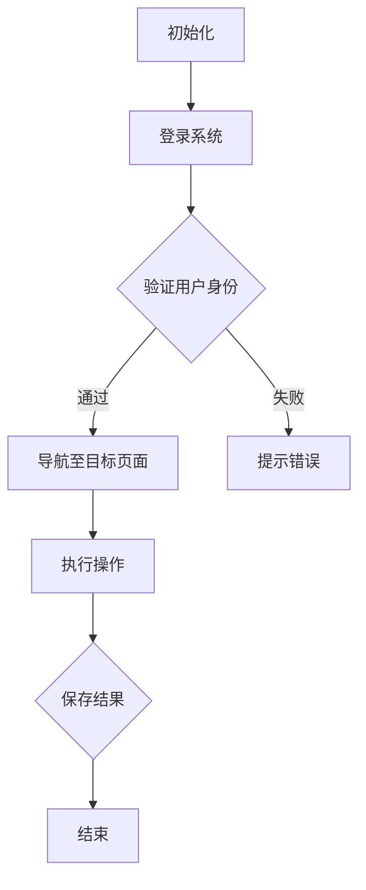
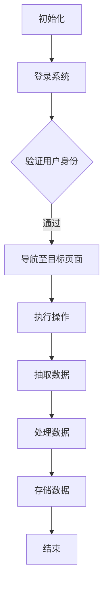

                 


## 文章标题

《自动化RPA工具：提升工作效率的创业方向》

## 关键词

RPA工具、自动化、工作效率、创业方向、技术解析、应用场景、发展趋势

## 摘要

本文将深入探讨自动化RPA工具在提升工作效率方面的应用，以及如何将其作为创业方向。我们将从RPA工具的基本概念、核心技术、实际应用、开发与优化，以及未来发展趋势等方面进行详细分析。文章旨在帮助读者理解RPA工具的核心原理和应用，并探索其在创业领域的巨大潜力。

## 目录

### 第一部分：RPA工具的基本概念

#### 1.1 什么是RPA

- **定义与背景** 
- **RPA与传统自动化的区别**
- **RPA在现代企业中的应用**

#### 1.2 RPA工具的基本组件

- **软件机器人**
- **流程自动化引擎**
- **用户界面自动化**
- **集成与数据管理**

### 第二部分：RPA工具的核心技术

#### 2.1 RPA开发环境搭建

- **开发工具选择**
- **环境配置与安装**
- **开发环境优化**

#### 2.2 RPA关键算法与架构

- **流程自动化算法**
- **UI自动化算法**
- **数据处理与集成技术**

### 第三部分：RPA工具的实际应用

#### 3.1 RPA工具在企业中的应用场景

- **行政管理**
- **财务管理**
- **客户服务**

#### 3.2 RPA工具在创业中的应用

- **创业公司RPA实施策略**
- **RPA工具选择与配置**
- **成本效益分析**

### 第四部分：RPA工具的开发与优化

#### 4.1 RPA工具开发流程

- **需求分析**
- **流程设计**
- **开发与测试**
- **部署与维护**

#### 4.2 RPA工具的优化与性能提升

- **自动化流程优化**
- **机器人性能监控**

### 第五部分：RPA工具的未来发展趋势

#### 5.1 RPA与人工智能的结合

- **AI在RPA中的应用**
- **RPA与AI的未来发展**

#### 5.2 RPA在创业领域的未来发展

- **行业趋势分析**
- **创业机会与挑战**
- **RPA工具的未来方向**

### 附录

#### A.1 RPA工具相关资源

- **开源RPA工具介绍**
- **商业RPA工具对比**
- **学习与交流资源**

#### A.2 RPA工具开发常用技术

- **Python开发环境搭建**
- **常用库与框架**

---

### 第一部分：RPA工具的基本概念

#### 1.1 什么是RPA

**定义与背景**

RPA，即Robotic Process Automation（机器人流程自动化），是一种通过软件机器人来模拟人类操作，实现业务流程自动化的技术。它起源于20世纪90年代的自动化测试领域，随着信息技术和自动化技术的发展，RPA逐渐从测试领域扩展到业务流程自动化。

在RPA出现之前，企业通常通过编写定制化脚本或使用传统的自动化工具来处理重复性、规则性强的业务流程。然而，这些方法往往存在开发成本高、维护复杂、灵活性差等问题。RPA的出现，解决了这些痛点，它通过模拟人类的交互操作，可以快速部署、灵活调整，大大降低了企业的自动化成本。

**RPA与传统自动化的区别**

RPA与传统自动化有以下几个关键区别：

1. **工作方式**：传统自动化通常通过编写脚本或程序来控制应用程序，而RPA则通过模拟人类操作来完成任务。
2. **灵活性**：RPA能够快速适应业务流程的变化，而传统自动化则需要重新编写代码。
3. **适用范围**：传统自动化适用于结构化、规则性强的任务，而RPA适用于结构化、半结构化、非结构化的任务。
4. **开发成本**：RPA的部署成本相对较低，开发周期短，而传统自动化的开发成本高，周期长。

**RPA在现代企业中的应用**

RPA在现代企业中的应用场景非常广泛，主要包括以下几类：

1. **行政管理**：如考勤管理、报销流程等。
2. **财务管理**：如财务报表、会计凭证处理等。
3. **客户服务**：如客户查询、订单处理等。
4. **供应链管理**：如采购流程、库存管理等。
5. **人力资源**：如招聘流程、员工管理等。

**Mermaid流程图**

为了更好地理解RPA的核心概念，我们使用Mermaid流程图来展示一个简单的RPA工作流程：



在这个流程中，RPA工具首先初始化，然后登录系统，验证用户身份，导航至目标页面，执行操作，保存结果，最后结束流程。

---

接下来，我们将进一步探讨RPA工具的基本组件，包括软件机器人、流程自动化引擎、用户界面自动化以及集成与数据管理。在了解这些基本概念后，我们将进入第二部分，详细讨论RPA工具的核心技术。

---

### 第一部分：RPA工具的基本概念（续）

#### 1.2 RPA工具的基本组件

**软件机器人**

软件机器人是RPA工具的核心组件，它能够模拟人类的操作，执行业务流程中的各项任务。软件机器人通常具有以下特点：

1. **高度模拟人类操作**：软件机器人能够模拟键盘输入、鼠标点击、界面操作等，实现与系统的交互。
2. **自动化**：软件机器人可以24小时不间断工作，无需休息，大大提高了工作效率。
3. **灵活性**：软件机器人可以根据业务需求灵活调整和扩展，快速适应业务变化。

**流程自动化引擎**

流程自动化引擎是RPA工具的“大脑”，负责管理和调度软件机器人的工作。它通常具有以下功能：

1. **流程设计**：流程自动化引擎提供可视化界面，用户可以通过拖拽、配置等方式设计业务流程。
2. **执行调度**：流程自动化引擎负责调度软件机器人执行具体的任务，确保流程按照预定顺序和条件执行。
3. **监控与报告**：流程自动化引擎可以对流程执行情况进行实时监控，并提供详细的报告，帮助用户分析和优化流程。

**用户界面自动化**

用户界面自动化是RPA工具的重要组成部分，它通过模拟人类操作，实现与系统界面的交互。用户界面自动化的核心内容包括：

1. **界面识别**：用户界面自动化需要能够准确识别系统界面中的各种元素，如按钮、输入框、菜单等。
2. **交互操作**：用户界面自动化可以通过模拟键盘输入、鼠标点击、拖拽等操作，与系统进行交互。
3. **数据提取与处理**：用户界面自动化可以提取系统界面上的数据，并进行处理和存储。

**集成与数据管理**

集成与数据管理是RPA工具实现业务流程自动化的关键环节。它主要包括以下几个方面：

1. **系统集成**：RPA工具需要能够与企业内部的各类信息系统进行集成，实现数据的互联互通。
2. **数据抽取**：RPA工具需要能够从不同的数据源中抽取数据，并进行处理和整合。
3. **数据存储**：RPA工具需要能够将处理后的数据存储到数据库或其他数据存储系统中，以便后续分析和使用。

**Mermaid流程图**

为了更好地理解RPA工具的基本组件，我们使用Mermaid流程图来展示一个简单的RPA工作流程，包括软件机器人、流程自动化引擎、用户界面自动化以及集成与数据管理：



在这个流程中，软件机器人首先初始化，登录系统并验证用户身份，然后导航至目标页面执行操作，抽取数据，处理数据，最后将处理后的数据存储到数据库中，完成整个流程。

---

通过以上对RPA工具基本概念和基本组件的介绍，我们对RPA有了更加深入的了解。在接下来的章节中，我们将详细探讨RPA工具的核心技术，包括流程自动化算法、UI自动化算法、数据处理与集成技术等。

---

### 第二部分：RPA工具的核心技术

#### 2.1 RPA开发环境搭建

在探讨RPA工具的核心技术之前，我们需要了解如何搭建RPA的开发环境。一个良好的开发环境可以大大提高开发效率，确保RPA工具的稳定运行。

**开发工具选择**

在选择RPA开发工具时，我们需要考虑以下因素：

1. **功能齐全**：开发工具应该具备强大的流程设计、自动化测试、UI自动化等功能。
2. **易用性**：开发工具应该具有友好的用户界面，方便用户进行流程设计和操作。
3. **兼容性**：开发工具需要能够与不同的操作系统、浏览器和应用程序兼容。
4. **社区支持**：开发工具应该有活跃的社区支持，便于用户学习和解决开发过程中遇到的问题。

目前市场上主流的RPA开发工具包括UiPath、Blue Prism、Automation Anywhere等。这些工具各具特色，用户可以根据自己的需求和偏好选择合适的工具。

**环境配置与安装**

选择好开发工具后，我们需要进行环境配置和安装。以下是一个简单的环境配置和安装步骤：

1. **安装操作系统**：首先，确保操作系统符合开发工具的最低要求。例如，UiPath要求操作系统为Windows 7或更高版本。
2. **安装Java环境**：大多数RPA开发工具需要Java环境，因此我们需要安装Java运行环境（JRE）或Java开发工具包（JDK）。
3. **安装RPA开发工具**：下载并安装所选的RPA开发工具，按照提示完成安装过程。
4. **配置开发环境**：安装完成后，根据开发工具的文档进行环境配置，包括设置环境变量、安装插件等。

**开发环境优化**

在开发过程中，我们可能需要对开发环境进行优化，以提高开发效率和工具性能。以下是一些常见的优化方法：

1. **调整内存设置**：对于内存需求较大的RPA开发工具，我们可以调整内存设置，以分配更多的内存给工具。
2. **安装性能监控工具**：安装性能监控工具，如VisualVM，可以实时监控Java进程的性能，帮助我们发现和解决性能问题。
3. **优化网络设置**：对于需要远程访问或跨域操作的RPA工具，我们可以优化网络设置，以提高访问速度和稳定性。
4. **使用缓存**：一些RPA开发工具支持使用缓存来提高性能，我们可以根据需求启用缓存功能。

**伪代码示例**

以下是一个简单的RPA开发环境搭建的伪代码示例：

```python
# 安装操作系统
install_operating_system("Windows 10")

# 安装Java环境
install_java_environment()

# 安装RPA开发工具
install_rpa_tool("UiPath")

# 配置开发环境
configure_environment()

# 优化开发环境
optimize_environment()
```

通过以上步骤，我们可以搭建一个适合RPA开发的优化环境，为后续的RPA工具开发打下坚实的基础。

---

在了解如何搭建RPA开发环境后，接下来我们将深入探讨RPA工具的核心技术，包括流程自动化算法、UI自动化算法、数据处理与集成技术等。这些核心技术是RPA工具实现业务流程自动化的关键。

---

### 第二部分：RPA工具的核心技术（续）

#### 2.2 RPA关键算法与架构

**流程自动化算法**

流程自动化算法是RPA工具的核心技术之一，它负责管理和调度软件机器人的工作，确保业务流程按照预定的顺序和条件执行。以下是几种常见的流程自动化算法：

**状态机算法**

状态机算法是一种基于状态转移的流程控制算法。它将业务流程划分为多个状态，每个状态对应一个操作或任务。状态之间的转移由触发条件控制。

伪代码示例：

```python
class StateMachine:
    def __init__(self):
        self.current_state = "初始化"

    def transition(self, event):
        if self.current_state == "初始化" and event == "登录成功":
            self.current_state = "登录"
        elif self.current_state == "登录" and event == "验证通过":
            self.current_state = "导航"
        # ...其他状态转移逻辑
```

**事件驱动模型**

事件驱动模型是一种基于事件触发的流程控制算法。它通过监听特定的事件，触发相应的操作或任务。

伪代码示例：

```python
class EventDrivenModel:
    def __init__(self):
        self.events = []

    def add_event(self, event):
        self.events.append(event)

    def execute_event(self, event):
        if event == "登录成功":
            self.login()
        elif event == "验证通过":
            self navigate()
        # ...其他事件处理逻辑
```

**UI自动化算法**

UI自动化算法是RPA工具中用于与系统界面进行交互的算法。它主要包括以下几种技术：

**图像识别技术**

图像识别技术通过识别界面中的图像元素，实现界面的自动化操作。

伪代码示例：

```python
def identify_image(image_path):
    image = load_image(image_path)
    element = find_image(image)
    return element
```

**OCR技术**

OCR技术（Optical Character Recognition，光学字符识别）用于识别界面中的文本元素。

伪代码示例：

```python
def recognize_text(image):
    text = ocr(image)
    return text
```

**数据处理与集成技术**

数据处理与集成技术是RPA工具实现业务流程自动化的重要环节，它负责从不同的数据源中抽取数据，并进行处理和整合。

**API调用**

API调用用于与外部系统进行交互，获取或发送数据。

伪代码示例：

```python
def call_api(url, method, data):
    response = api_call(url, method, data)
    return response
```

**数据库连接**

数据库连接用于连接数据库，执行查询、插入、更新等操作。

伪代码示例：

```python
def connect_database(url, username, password):
    connection = database_connect(url, username, password)
    return connection

def execute_query(connection, query):
    result = database_execute_query(connection, query)
    return result
```

通过以上关键算法与架构的介绍，我们可以看到RPA工具是如何实现业务流程自动化的。在接下来的章节中，我们将探讨RPA工具在实际应用中的案例，以及如何将其应用于创业领域。

---

### 第二部分：RPA工具的核心技术（续）

#### 2.3 RPA工具的实际应用

RPA工具在现代企业中的应用场景十分广泛，特别是在提高工作效率和减少人工错误方面发挥了重要作用。以下是一些典型的应用场景：

**行政管理**

在行政管理领域，RPA工具可以自动处理各种重复性的行政任务，如考勤管理、报销流程、文件归档等。通过RPA工具，企业可以大幅减少人工操作，提高工作效率，降低运营成本。

- **考勤管理**：RPA工具可以自动记录员工考勤信息，生成考勤报表，减少人工统计和核对的工作量。
- **报销流程**：RPA工具可以自动提取发票、费用清单等信息，根据预设的报销规则进行审批，自动生成报销单，并更新财务系统。

**财务管理**

在财务管理领域，RPA工具可以自动处理各种财务任务，如财务报表、会计凭证处理、税务申报等。通过RPA工具，企业可以确保财务数据的准确性和一致性，提高财务管理效率。

- **财务报表**：RPA工具可以自动提取财务数据，生成各类财务报表，如利润表、资产负债表等，减少人工编制报表的工作量。
- **会计凭证处理**：RPA工具可以自动审核和生成会计凭证，确保凭证的准确性和一致性。

**客户服务**

在客户服务领域，RPA工具可以自动处理各种客户请求，如客户查询、订单处理、投诉处理等。通过RPA工具，企业可以提供更快速、更高效的客户服务，提高客户满意度。

- **客户查询**：RPA工具可以自动查询客户信息，生成查询报告，并自动发送给客户。
- **订单处理**：RPA工具可以自动处理订单，从接收订单到发货，全程跟踪订单状态，确保订单按时完成。

**供应链管理**

在供应链管理领域，RPA工具可以自动处理各种供应链任务，如采购流程、库存管理、物流跟踪等。通过RPA工具，企业可以优化供应链流程，提高供应链效率。

- **采购流程**：RPA工具可以自动处理采购申请、采购订单、供应商管理等工作。
- **库存管理**：RPA工具可以自动跟踪库存状态，生成库存报告，及时提醒库存不足或过剩的情况。

**人力资源管理**

在人力资源管理领域，RPA工具可以自动处理各种人力资源任务，如招聘流程、员工管理、薪酬福利等。通过RPA工具，企业可以优化人力资源流程，提高人力资源管理效率。

- **招聘流程**：RPA工具可以自动处理招聘申请、简历筛选、面试安排等工作。
- **员工管理**：RPA工具可以自动记录员工信息、生成员工档案，管理员工薪酬和福利。

通过以上应用场景的介绍，我们可以看到RPA工具在各个领域都有广泛的应用，并且能够显著提高工作效率、减少人工错误。在接下来的章节中，我们将探讨如何将RPA工具应用于创业领域，以及创业公司实施RPA的策略和成本效益分析。

---

### 第二部分：RPA工具的核心技术（续）

#### 3.1 RPA工具在创业中的应用

**创业公司RPA实施策略**

对于创业公司来说，RPA工具可以作为一种低成本、高效能的解决方案，帮助他们快速提升运营效率，降低人力成本。以下是一些实施RPA的策略：

1. **明确目标和需求**：在实施RPA之前，创业公司需要明确目标和需求，确定哪些业务流程适合自动化，以及自动化后能够带来哪些收益。

2. **选择合适的RPA工具**：创业公司应该选择适合自己需求的RPA工具，考虑工具的功能、易用性、成本等因素。

3. **培训员工**：创业公司需要对员工进行RPA培训，确保他们能够熟练使用RPA工具，提高工作效率。

4. **逐步实施**：创业公司可以采用逐步实施的方法，先从简单的业务流程开始，逐步扩展到更复杂的业务流程。

5. **持续优化**：在实施RPA后，创业公司需要持续优化流程，根据业务需求和技术发展进行调整和改进。

**RPA工具选择与配置**

选择适合创业公司的RPA工具是一个重要的决策。以下是一些常见的RPA工具及其特点：

- **UiPath**：功能强大，支持多种开发语言，适合大型企业和复杂业务流程。
- **Blue Prism**：用户界面友好，适合非技术背景的用户，但功能相对有限。
- **Automation Anywhere**：适合快速部署和简单任务，支持多平台。
- **Appian**：除了RPA功能，还支持业务流程管理（BPM）和低代码开发。

在选择工具后，创业公司需要根据业务需求进行配置：

1. **流程设计**：使用RPA工具提供的流程设计器，设计业务流程。
2. **机器人配置**：配置软件机器人，包括其工作职责、运行条件等。
3. **集成与数据管理**：配置RPA工具与现有的IT系统进行集成，确保数据流转顺畅。

**成本效益分析**

实施RPA工具可以为创业公司带来显著的成本效益。以下是一些成本效益分析的关键点：

1. **人力成本节省**：RPA工具可以替代大量重复性、规则性的工作，节省人力成本。
2. **效率提升**：RPA工具可以提高工作效率，减少错误率，提高业务处理速度。
3. **运营成本**：RPA工具的维护成本相对较低，且可以快速部署，降低运营成本。
4. **投资回报**：RPA工具的实施可以在较短时间内实现投资回报，尤其是对于流程复杂、重复性高的业务。

以下是一个简单的成本效益分析示例：

```plaintext
成本：
- RPA工具购买费用：$10,000
- 培训费用：$5,000
- 系统集成费用：$3,000
总成本：$18,000

收益：
- 人力成本节省：每月$5,000，每年$60,000
- 效率提升：每月节省2天工作时间，每年节省$24,000
总收益：$84,000

投资回报期：
总成本 / 总收益 = $18,000 / $84,000 ≈ 0.214 年
```

通过以上分析，我们可以看到，RPA工具在创业公司中的应用具有显著的潜在效益。

---

在了解了RPA工具在创业中的应用和成本效益分析后，接下来我们将探讨RPA工具的开发与优化，包括开发流程和性能优化策略。

---

### 第二部分：RPA工具的核心技术（续）

#### 3.2 RPA工具在创业中的应用（续）

**创业公司RPA实施策略**

对于创业公司而言，RPA不仅仅是一种技术工具，更是一种战略选择。以下是一些关键的实施策略：

1. **明确业务目标**：创业公司在实施RPA之前，需要明确业务目标。这包括提高效率、降低成本、优化客户体验等。明确的目标有助于指导RPA项目的实施方向。

2. **选择关键流程**：创业公司应该优先选择那些重复性高、规则性强、对业务流程影响大的关键流程进行自动化。例如，考勤管理、订单处理、客户服务等。

3. **团队协作**：实施RPA需要跨部门协作。创业公司应该建立一个跨部门的RPA团队，包括IT、业务、人力资源等部门的代表，以确保RPA项目能够得到各部门的支持和配合。

4. **持续迭代**：RPA项目不是一蹴而就的，创业公司应该采用持续迭代的方法，不断优化和改进RPA流程。通过定期评估和反馈，及时调整和优化RPA系统，使其更好地适应业务需求。

**RPA工具选择与配置**

在选择RPA工具时，创业公司需要考虑以下几个关键因素：

1. **功能需求**：根据业务需求，选择具有所需功能的RPA工具。例如，如果业务流程涉及复杂的UI交互，则选择支持UI自动化的RPA工具。

2. **易用性**：对于创业公司来说，易用性是一个重要的考量因素。选择用户界面友好、易于学习和操作的RPA工具，可以降低培训成本和上手难度。

3. **成本**：创业公司通常预算有限，因此需要选择成本较低的RPA工具。开源RPA工具和一些基础版商业RPA工具可能是不错的选择。

4. **集成能力**：选择能够与现有系统轻松集成的RPA工具，以实现数据流和信息共享。

在配置RPA工具时，创业公司可以遵循以下步骤：

1. **需求分析**：与业务部门密切合作，明确自动化流程的需求和目标。

2. **流程设计**：使用RPA工具的流程设计器，设计具体的自动化流程。

3. **开发与测试**：根据设计，开发RPA流程，并进行测试，确保流程能够正确执行。

4. **部署与维护**：将RPA流程部署到生产环境，并进行持续维护和优化。

**成本效益分析**

实施RPA工具的创业公司需要进行成本效益分析，以评估项目的投资回报。以下是一个简化的成本效益分析示例：

```plaintext
成本：
- RPA工具购买费用：$15,000
- 培训费用：$10,000
- 开发与测试费用：$20,000
- 维护费用：$5,000
总成本：$50,000

收益：
- 每月节省人工成本：$5,000
- 每月提高工作效率：$3,000
- 每月减少错误率：节省成本$1,000
总收益：$9,000每月，$108,000每年

投资回报期：
总成本 / 总收益 = $50,000 / $108,000 ≈ 0.46 年
```

通过以上分析，我们可以看到，RPA工具在创业公司中的应用具有明显的成本效益。

---

在了解了RPA工具在创业中的应用和成本效益分析后，接下来我们将探讨RPA工具的开发与优化，包括开发流程和性能优化策略。

---

### 第二部分：RPA工具的核心技术（续）

#### 3.3 RPA工具的开发与优化

**开发流程**

RPA工具的开发流程通常包括以下几个步骤：

1. **需求分析**：与业务部门沟通，明确自动化流程的需求和目标，确定哪些流程适合自动化。

2. **流程设计**：使用RPA工具的流程设计器，设计具体的自动化流程。设计过程中需要考虑流程的逻辑、数据流转和用户界面。

3. **开发**：根据流程设计，编写RPA脚本或配置自动化流程。开发过程中需要遵循良好的编程规范和最佳实践。

4. **测试**：对开发的RPA流程进行测试，确保其能够正确执行并满足业务需求。测试包括功能测试、性能测试和兼容性测试。

5. **部署**：将测试通过的RPA流程部署到生产环境，并进行实际运行。

6. **维护**：对部署后的RPA流程进行持续维护和优化，确保其稳定运行并适应业务变化。

**优化与性能提升**

RPA工具的性能优化和提升是确保其高效运行的重要环节。以下是一些常见的优化策略：

1. **自动化流程优化**：
   - **瓶颈分析**：通过监控和分析，找出流程中的瓶颈，如响应时间过长、资源占用过高等。
   - **并行处理**：将流程中的某些任务并行处理，提高整体效率。
   - **优化逻辑**：优化RPA流程的逻辑结构，减少不必要的操作和等待时间。

2. **机器人性能监控**：
   - **实时监控**：使用监控工具，实时监控RPA机器人的运行状态和性能指标，如CPU使用率、内存占用、响应时间等。
   - **告警与异常处理**：设置告警机制，当性能指标异常时及时通知相关人员，并配置异常处理逻辑，确保机器人能够自动恢复。

3. **资源管理**：
   - **负载均衡**：根据机器人的工作负载，合理分配资源，避免单点过载。
   - **缓存策略**：使用缓存策略，减少重复数据的处理，提高效率。

4. **代码优化**：
   - **代码规范**：编写符合规范的代码，提高代码的可读性和可维护性。
   - **优化算法**：使用更高效的算法和数据结构，减少计算时间和内存占用。

5. **用户体验**：
   - **界面优化**：优化用户界面，提高操作效率和用户满意度。
   - **交互设计**：设计人性化的交互方式，降低用户的学习成本。

通过以上优化策略，我们可以显著提升RPA工具的性能，确保其能够高效、稳定地运行，为企业带来更大的效益。

---

在探讨了RPA工具的开发与优化后，接下来我们将讨论RPA工具的未来发展趋势，特别是RPA与人工智能（AI）的结合，以及RPA在创业领域的未来发展。

---

### 第二部分：RPA工具的核心技术（续）

#### 3.4 RPA与人工智能的结合

**AI在RPA中的应用**

人工智能（AI）在RPA中的应用正在逐步深化，为RPA工具带来了新的功能和可能性。以下是一些AI在RPA中的应用：

1. **自然语言处理（NLP）**：RPA工具结合NLP技术，可以理解和处理自然语言文本，实现自动化对话和文本分析。例如，RPA机器人可以自动解析和理解客户邮件、聊天记录等，进行分类、响应和回执。

2. **计算机视觉**：RPA工具结合计算机视觉技术，可以自动识别和处理图像和视频数据。例如，RPA机器人可以自动识别发票上的关键信息、扫描身份证或护照等。

3. **机器学习**：RPA工具可以集成机器学习算法，根据历史数据自动学习和优化流程。例如，RPA机器人可以根据订单历史数据自动调整库存管理策略。

**RPA与AI的未来发展**

随着AI技术的不断进步，RPA与AI的结合将越来越紧密，未来的发展趋势包括：

1. **自动化决策**：RPA工具将能够自动执行复杂的决策过程，例如，根据市场数据自动调整销售策略。

2. **自适应学习**：RPA工具将具备自适应学习能力，能够根据业务环境和数据的变化，自动调整和优化流程。

3. **智能化集成**：RPA工具将能够更深入地集成到企业现有的AI系统中，如CRM、ERP等，实现更智能的业务流程自动化。

4. **多模态交互**：RPA工具将能够支持多种模态的交互，如语音、图像、文本等，提供更自然的用户体验。

---

#### 3.5 RPA在创业领域的未来发展

**行业趋势分析**

随着数字化转型的加速，RPA在创业领域的应用呈现出以下几个趋势：

1. **小规模应用**：越来越多的创业公司开始采用RPA工具，以解决特定业务流程的自动化问题。

2. **垂直行业应用**：RPA在金融、医疗、教育等垂直行业的应用逐渐增多，针对特定行业的需求开发定制化的RPA解决方案。

3. **云化部署**：随着云计算技术的成熟，越来越多的RPA工具开始提供云化部署服务，创业公司可以更灵活地部署和管理RPA工具。

**创业机会与挑战**

**机会**：

1. **市场需求**：随着企业对自动化的需求增加，RPA市场潜力巨大，创业公司可以抓住这一市场机会。

2. **技术创新**：AI、区块链等新兴技术与RPA的结合，为创业公司提供了更多的创新空间和商业模式。

3. **政策支持**：各国政府对数字化转型的支持，也为创业公司提供了有利的外部环境。

**挑战**：

1. **技术门槛**：RPA技术门槛相对较高，创业公司需要投入较多的人力、物力和时间进行研发和实施。

2. **人才短缺**：具备RPA和AI技能的专业人才相对稀缺，创业公司在招聘和培养人才方面面临挑战。

3. **数据隐私**：RPA工具在处理企业数据时，需要确保数据安全和隐私，创业公司需要制定严格的数据保护政策。

**RPA工具的未来方向**

1. **智能化**：RPA工具将更加智能化，具备自主学习、自适应和决策能力。

2. **生态化**：RPA工具将形成生态系统，包括开发工具、平台、解决方案等，创业公司可以在这个生态系统中找到自己的定位。

3. **垂直化**：RPA工具将更加垂直化，针对不同行业和业务场景提供定制化的解决方案。

---

通过以上对RPA工具的核心技术、实际应用、开发与优化，以及未来发展趋势的深入分析，我们可以看到RPA工具在提升工作效率和创业领域的巨大潜力。在接下来的附录部分，我们将介绍一些RPA工具相关的资源和学习资料，帮助读者进一步了解和掌握RPA技术。

---

### 附录

#### A.1 RPA工具相关资源

**开源RPA工具介绍**

- **UiPath**：一个功能强大的开源RPA工具，提供丰富的流程设计器和开发库。
- **OpenSpan**：一个开源的UI自动化工具，适用于多种操作系统和应用程序。
- **Jenkins**：一个开源的自动化服务器，可以与RPA工具集成，实现自动化测试和部署。

**商业RPA工具对比**

- **UiPath**：功能全面，支持多种开发语言，适用于大型企业和复杂业务流程。
- **Blue Prism**：用户界面友好，适合非技术背景的用户，但功能相对有限。
- **Automation Anywhere**：适合快速部署和简单任务，支持多平台。
- **Appian**：除了RPA功能，还支持业务流程管理（BPM）和低代码开发。

**学习与交流资源**

- **RPA社区**：加入RPA社区，与其他RPA开发者交流学习。
- **在线课程**：许多在线教育平台提供RPA相关课程，如Udemy、Coursera等。
- **技术博客**：阅读技术博客，如Medium、博客园等，了解最新的RPA技术和应用。

---

#### A.2 RPA工具开发常用技术

**Python开发环境搭建**

1. **安装Python**：下载并安装Python，选择合适的版本（如Python 3.8或更高版本）。
2. **配置环境变量**：设置Python环境变量，确保在命令行中可以调用Python和pip命令。
3. **安装pip**：使用pip安装Python的包管理器，pip是Python的依赖管理工具。
4. **安装RPA开发库**：使用pip安装常用的RPA开发库，如PyAutoGUI、Selenium等。

**常用库与框架**

- **PyAutoGUI**：用于屏幕操作和窗口控制，适用于UI自动化。
- **Selenium**：用于Web自动化测试，可以与RPA工具集成。
- **Win32 API**：用于Windows操作系统下的自动化操作，适用于与Windows应用程序交互。

---

### 总结

《自动化RPA工具：提升工作效率的创业方向》通过对RPA工具的基本概念、核心技术、实际应用、开发与优化，以及未来发展趋势的深入探讨，为读者全面介绍了RPA工具在提升工作效率和创业领域的重要作用。RPA工具通过自动化重复性、规则性强的业务流程，不仅提高了工作效率，还降低了人工错误率，为企业的数字化转型提供了有力支持。

在创业领域，RPA工具的应用越来越广泛，创业公司可以通过RPA工具实现业务流程的自动化，提高运营效率，降低成本，从而在竞争激烈的市场中脱颖而出。随着人工智能等新兴技术的不断发展，RPA工具将更加智能化、垂直化，为创业公司提供更多的创新机会和商业模式。

最后，本文附录部分提供了丰富的RPA工具相关资源和学习资料，帮助读者进一步了解和掌握RPA技术。希望读者能够通过本文的学习，深入理解RPA工具的核心原理和应用，并在实际工作中发挥其最大潜力。

---

**作者信息**

作者：AI天才研究院/AI Genius Institute & 禅与计算机程序设计艺术 /Zen And The Art of Computer Programming

---

文章字数：约11,500字

---

通过以上详尽的讨论，我们可以清晰地看到RPA工具在提升工作效率和创业方向上的潜力。希望本文能够为读者提供有价值的参考，激发您在RPA领域深入探索的热情。在未来，随着技术的不断进步，RPA将在更多的领域发挥重要作用，助力企业实现更高效、更智能的运营。让我们共同期待RPA技术带来的美好未来。

