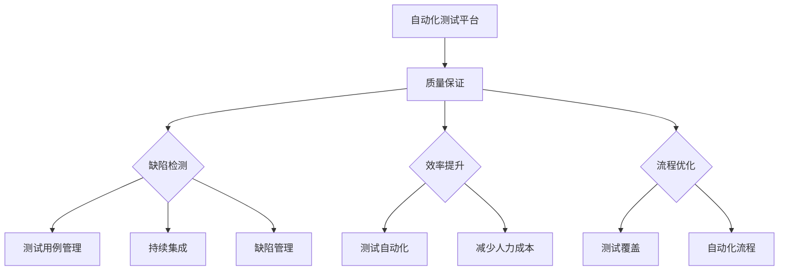

                 

### 自动化测试平台：质量保证的创新解决方案

> 关键词：自动化测试、质量保证、测试平台、开发阶段、部署阶段、运维阶段、测试工具、测试框架、测试用例、测试数据、测试报告、平台架构、性能优化、安全与隐私保护、实战案例、发展趋势、未来展望

> 摘要：本文将深入探讨自动化测试平台在软件质量保证中的重要性，分析其核心组件与架构设计，并通过实际案例展示其应用与实践。此外，本文还将展望自动化测试技术的发展趋势和未来前景。

### 第一部分：自动化测试平台概述

#### 1.1 自动化测试的定义与重要性

自动化测试是一种使用软件工具自动执行测试的过程，旨在提高软件质量、效率和可靠性。与传统手工测试相比，自动化测试能够显著减少测试时间，降低成本，并提高测试的覆盖率和一致性。

**1.1.1 自动化测试与传统测试的区别**

- **测试方法**：手工测试依赖于人类操作，而自动化测试则是通过脚本和工具自动执行。
- **测试覆盖**：自动化测试可以覆盖更广泛的测试场景，而手工测试往往受限于时间和人力。
- **测试效率**：自动化测试能够快速执行大量测试用例，提高测试效率。

**1.1.2 自动化测试在质量保证中的角色**

- **缺陷检测**：自动化测试能够快速发现并报告缺陷，帮助开发团队迅速定位问题。
- **持续集成**：自动化测试与持续集成（CI）相结合，确保每次代码提交后都能进行全面的测试，提高软件质量。
- **回归测试**：自动化测试可以快速执行回归测试，确保新功能的引入不会影响现有功能。

**1.1.3 自动化测试的发展历程**

- **早期**：手工测试阶段，测试工作主要依靠人工完成。
- **成熟期**：随着计算机技术的发展，自动化测试开始兴起，各种测试工具和框架被开发出来。
- **当前**：自动化测试已经成为软件开发过程中的一个关键环节，自动化测试平台的应用越来越广泛。

#### 1.2 自动化测试平台的概念与架构

**1.2.1 自动化测试平台的定义**

自动化测试平台是一个集成化的环境，用于自动化执行测试用例、管理测试数据、生成测试报告等，以提高软件质量。

**1.2.2 自动化测试平台的组成部分**

- **测试工具**：用于编写和执行测试脚本。
- **测试框架**：提供测试脚本的结构和组织。
- **测试用例管理**：存储和管理测试用例。
- **测试数据管理**：存储和管理测试数据。
- **测试报告**：生成测试结果和报告。

**1.2.3 自动化测试平台的设计原则**

- **可扩展性**：平台应能够支持不同规模和类型的测试需求。
- **可维护性**：平台应易于维护和更新。
- **可定制性**：平台应允许根据特定项目需求进行定制。

#### 1.3 自动化测试平台的类型

**1.3.1 开发阶段的自动化测试**

- 主要目标是验证代码质量和功能。
- 使用单元测试和集成测试框架。

**1.3.2 部署阶段的自动化测试**

- 验证软件在部署环境中的运行情况。
- 使用负载测试和性能测试工具。

**1.3.3 运维阶段的自动化测试**

- 监控软件在生产环境中的运行状态。
- 使用监控工具和告警系统。

#### 1.4 自动化测试平台的优点与挑战

**1.4.1 自动化测试平台的优点**

- 提高测试效率：自动化测试可以快速执行大量测试用例。
- 减少人力成本：自动化测试减少了对手工测试人员的依赖。
- 提高测试覆盖率：自动化测试可以覆盖更多的测试场景。
- 提高测试质量：自动化测试结果更加一致和可靠。

**1.4.2 自动化测试平台的挑战**

- **脚本维护成本**：自动化测试脚本需要定期更新和维护。
- **测试环境配置**：自动化测试需要稳定的测试环境。
- **测试数据管理**：测试数据需要妥善管理以避免泄露。

**1.4.3 应对挑战的策略**

- **持续集成**：通过持续集成，自动化测试可以与开发流程紧密结合。
- **自动化测试脚本维护**：使用代码库和版本控制系统来管理测试脚本。
- **测试环境标准化**：建立统一的测试环境配置和管理流程。
- **测试数据安全**：采取数据加密和访问控制措施。

---

### 第二部分：自动化测试平台核心组件

#### 2.1 测试工具与框架

**2.1.1 常用测试工具概述**

- **Selenium**：用于Web应用的自动化测试。
- **Appium**：用于移动应用的自动化测试。
- **JUnit**：用于Java应用的单元测试。
- **NUnit**：用于.NET框架的单元测试。

**2.1.2 测试框架的作用与分类**

- **测试框架**：提供测试脚本的结构和组织，简化测试流程。
- **分类**：基于测试级别分类，如单元测试框架、集成测试框架、端到端测试框架。

**2.1.3 开源测试框架介绍**

- **JUnit**：Java单元测试框架。
- **NUnit**：.NET单元测试框架。
- **TestNG**：Java功能测试框架。

---

#### 2.2 测试用例管理

**2.2.1 测试用例的设计原则**

- **可测试性**：测试用例应确保被测试功能的有效性。
- **独立性**：测试用例之间应相互独立。
- **完备性**：测试用例应覆盖所有可能的场景。

**2.2.2 测试用例的管理策略**

- **版本控制**：使用版本控制系统管理测试用例代码。
- **自动化生成**：通过工具自动化生成测试用例。

**2.2.3 测试用例的执行与结果分析**

- **执行**：自动化执行测试用例。
- **结果分析**：分析测试结果，确定缺陷。

---

#### 2.3 测试数据管理

**2.3.1 测试数据的重要性**

- 测试数据是测试用例执行的基础，直接影响测试结果的准确性。

**2.3.2 测试数据的准备与处理**

- **准备**：根据测试用例需求准备测试数据。
- **处理**：对测试数据进行预处理，如数据清洗、数据转换。

**2.3.3 测试数据的存储与管理**

- **存储**：将测试数据存储在数据库或文件系统中。
- **管理**：建立测试数据的管理流程，确保数据安全。

---

#### 2.4 测试报告与反馈

**2.4.1 测试报告的编写要点**

- **测试结果**：详细描述测试执行结果。
- **缺陷报告**：列出发现的缺陷，并提供详细描述。

**2.4.2 测试反馈的收集与处理**

- **收集**：收集测试人员的反馈意见。
- **处理**：对反馈进行处理，如修复缺陷、调整测试用例。

**2.4.3 测试报告的自动化生成**

- 使用工具自动生成测试报告，提高效率。

---

### 第三部分：自动化测试平台架构设计与实现

#### 3.1 自动化测试平台架构设计

**3.1.1 架构设计原则**

- **模块化**：将平台分为多个模块，提高可维护性。
- **高可用性**：确保平台稳定可靠，支持高并发测试。
- **可扩展性**：支持添加新功能，适应不同规模的项目。

**3.1.2 架构设计模型**

- **三层架构**：表示层、业务逻辑层、数据层。
- **分布式架构**：支持分布式测试环境，提高测试效率。

**3.1.3 架构设计案例**

- **基于微服务的自动化测试平台**：使用微服务架构，提高平台可扩展性和灵活性。

---

#### 3.2 自动化测试平台开发步骤

**3.2.1 需求分析与规划**

- 分析测试需求，制定开发计划。

**3.2.2 技术选型与工具链构建**

- 选择合适的测试工具和框架。
- 构建测试工具链，包括测试工具、框架、集成工具等。

**3.2.3 开发与测试**

- 编写测试脚本。
- 进行单元测试和集成测试。

**3.2.4 部署与运维**

- 部署测试平台。
- 监控测试平台的运行状态。

---

#### 3.3 自动化测试平台性能优化

**3.3.1 性能优化策略**

- **负载均衡**：合理分配测试负载。
- **缓存机制**：使用缓存提高响应速度。
- **数据库优化**：优化数据库查询性能。

**3.3.2 测试负载均衡**

- **负载均衡器**：使用负载均衡器分配测试任务。
- **并行测试**：同时执行多个测试用例。

**3.3.3 数据库性能优化**

- **索引优化**：建立合适的索引。
- **查询优化**：优化SQL查询语句。

---

#### 3.4 自动化测试平台安全与隐私保护

**3.4.1 安全威胁分析**

- **外部威胁**：如DDoS攻击、数据泄露。
- **内部威胁**：如测试数据的滥用。

**3.4.2 安全防护措施**

- **网络安全**：使用防火墙、入侵检测系统等。
- **数据安全**：加密存储测试数据，限制访问权限。

**3.4.3 隐私保护策略**

- **数据加密**：加密传输和存储敏感数据。
- **访问控制**：限制对测试数据的访问。

---

### 第四部分：自动化测试平台实战案例

#### 4.1 案例一：电商平台的自动化测试平台

**4.1.1 项目背景与目标**

- 背景介绍：电商平台需要提高软件质量，确保系统稳定运行。
- 目标：建立自动化测试平台，实现持续集成和自动化测试。

**4.1.2 测试策略与方案**

- **单元测试**：使用JUnit进行单元测试。
- **集成测试**：使用Selenium进行Web自动化测试。
- **性能测试**：使用Apache JMeter进行性能测试。

**4.1.3 测试工具与框架选型**

- **测试工具**：Selenium、JUnit、Apache JMeter。
- **测试框架**：TestNG。

**4.1.4 测试用例设计与执行**

- 设计测试用例，覆盖功能测试、性能测试等。
- 自动化执行测试用例。

**4.1.5 测试报告与反馈**

- 自动生成测试报告，提供详细的测试结果和缺陷报告。

---

#### 4.2 案例二：金融行业的自动化测试平台

**4.2.1 项目背景与目标**

- 背景介绍：金融行业对软件质量要求极高，需要确保系统的高可用性和安全性。
- 目标：建立自动化测试平台，实现持续集成和自动化测试。

**4.2.2 测试策略与方案**

- **单元测试**：使用JUnit进行单元测试。
- **集成测试**：使用Selenium进行Web自动化测试。
- **安全测试**：使用OWASP ZAP进行安全测试。

**4.2.3 测试工具与框架选型**

- **测试工具**：Selenium、JUnit、OWASP ZAP。
- **测试框架**：TestNG。

**4.2.4 测试用例设计与执行**

- 设计测试用例，覆盖功能测试、安全测试等。
- 自动化执行测试用例。

**4.2.5 测试报告与反馈**

- 自动生成测试报告，提供详细的测试结果和缺陷报告。

---

### 第五部分：自动化测试平台发展趋势与未来展望

#### 5.1 自动化测试技术的发展趋势

- **AI在自动化测试中的应用**：使用机器学习技术识别测试用例、预测缺陷等。
- **自动化测试平台的集成化趋势**：将自动化测试平台与其他DevOps工具集成。
- **自动化测试平台的安全性提升**：加强对测试数据的保护，提高测试平台的安全性。

#### 5.2 自动化测试平台的发展前景

- **自动化测试在新兴领域的应用**：如物联网、人工智能等。
- **自动化测试平台的市场潜力**：自动化测试平台将成为软件开发不可或缺的一部分。
- **自动化测试平台的未来挑战与机遇**：如何应对不断变化的技术环境，如何提高测试平台的智能化水平。

#### 5.3 自动化测试平台创新解决方案

- **基于大数据的自动化测试**：利用大数据分析技术提高测试效率和质量。
- **基于云计算的自动化测试**：使用云计算资源提高测试平台的扩展性和灵活性。
- **基于AI的自动化测试**：利用AI技术实现智能测试，提高测试的智能化水平。

### 附录

#### 附录A：自动化测试平台开发工具与资源

- **开源自动化测试工具介绍**：Selenium、Appium、JUnit、NUnit、TestNG。
- **自动化测试平台开源项目列表**：如Selenium WebDriver、TestNG、Appium。
- **自动化测试相关在线资源推荐**：如Stack Overflow、GitHub、博客园。

#### 附录B：自动化测试平台开发指南

- **开发环境搭建**：包括测试工具、框架、集成工具的安装与配置。
- **开发流程与规范**：编写测试脚本、执行测试用例、报告测试结果。
- **质量保证与维护策略**：代码审查、测试覆盖率分析、自动化测试脚本维护。

---

### 结语

自动化测试平台在软件质量保证中发挥着重要作用。通过本文的探讨，我们了解了自动化测试平台的定义、核心组件、架构设计、实战案例以及发展趋势。随着技术的不断进步，自动化测试平台将变得更加智能化和集成化，为软件开发带来更多的价值。

---

**作者：AI天才研究院/AI Genius Institute & 禅与计算机程序设计艺术 /Zen And The Art of Computer Programming**## 《自动化测试平台：质量保证的创新解决方案》

### 目录

- [第一部分：自动化测试平台概述](#第一部分自动化测试平台概述)
  - [1.1 自动化测试的定义与重要性](#11-自动化测试的定义与重要性)
  - [1.2 自动化测试平台的概念与架构](#12-自动化测试平台的概念与架构)
  - [1.3 自动化测试平台的类型](#13-自动化测试平台的类型)
  - [1.4 自动化测试平台的优点与挑战](#14-自动化测试平台的优点与挑战)
- [第二部分：自动化测试平台核心组件](#第二部分自动化测试平台核心组件)
  - [2.1 测试工具与框架](#21-测试工具与框架)
  - [2.2 测试用例管理](#22-测试用例管理)
  - [2.3 测试数据管理](#23-测试数据管理)
  - [2.4 测试报告与反馈](#24-测试报告与反馈)
- [第三部分：自动化测试平台架构设计与实现](#第三部分自动化测试平台架构设计与实现)
  - [3.1 自动化测试平台架构设计](#31-自动化测试平台架构设计)
  - [3.2 自动化测试平台开发步骤](#32-自动化测试平台开发步骤)
  - [3.3 自动化测试平台性能优化](#33-自动化测试平台性能优化)
  - [3.4 自动化测试平台安全与隐私保护](#34-自动化测试平台安全与隐私保护)
- [第四部分：自动化测试平台实战案例](#第四部分自动化测试平台实战案例)
  - [4.1 案例一：电商平台的自动化测试平台](#41-案例一电商平台自动化测试平台)
  - [4.2 案例二：金融行业的自动化测试平台](#42-案例二金融行业自动化测试平台)
- [第五部分：自动化测试平台发展趋势与未来展望](#第五部分自动化测试平台发展趋势与未来展望)
  - [5.1 自动化测试技术的发展趋势](#51-自动化测试技术的发展趋势)
  - [5.2 自动化测试平台的发展前景](#52-自动化测试平台的发展前景)
  - [5.3 自动化测试平台创新解决方案](#53-自动化测试平台创新解决方案)
- [附录](#附录)
  - [附录A：自动化测试平台开发工具与资源](#附录a自动化测试平台开发工具与资源)
  - [附录B：自动化测试平台开发指南](#附录b自动化测试平台开发指南)

### 文章标题

**自动化测试平台：质量保证的创新解决方案**

### 关键词

- 自动化测试
- 质量保证
- 测试平台
- 测试工具
- 测试框架
- 测试用例
- 测试数据
- 测试报告
- 测试架构

### 摘要

本文深入探讨了自动化测试平台在软件质量保证中的重要性，详细介绍了自动化测试平台的核心组件、架构设计、开发步骤、性能优化、安全与隐私保护以及实战案例。通过分析自动化测试技术的发展趋势，展望了自动化测试平台的未来发展方向。本文旨在为读者提供一套完整的自动化测试平台解决方案，帮助提高软件项目的质量和效率。

---

### 第一部分：自动化测试平台概述

自动化测试平台是现代软件开发中不可或缺的一部分，它通过自动化测试工具和框架，提高了测试的效率、准确性和可重复性。在这一部分中，我们将详细讨论自动化测试的定义与重要性，自动化测试平台的类型与核心组件，以及自动化测试平台的优势和挑战。

#### 1.1 自动化测试的定义与重要性

**自动化测试**是一种使用软件工具自动执行测试用例的方法。它不同于传统的手工测试，后者依赖于人类操作来进行测试。自动化测试的主要目标是通过减少人为错误、提高测试覆盖率、加快测试速度来提升软件质量。

**自动化测试的重要性**体现在以下几个方面：

1. **提高测试效率**：自动化测试可以同时运行多个测试用例，大大缩短了测试时间。
2. **降低成本**：自动化测试减少了测试人员的工作量，降低了人工成本。
3. **提高测试覆盖率**：自动化测试可以执行大量的测试用例，从而提高测试覆盖率，减少缺陷漏检的可能性。
4. **保证测试一致性**：自动化测试用例执行过程不受人为因素影响，保证了测试结果的一致性。

#### 1.1.1 自动化测试与传统测试的区别

- **测试方法**：自动化测试使用脚本和工具来执行测试，而传统测试通常依赖于手动操作。
- **测试覆盖**：自动化测试可以覆盖更广泛的测试场景，而传统测试可能受限于时间和资源。
- **测试效率**：自动化测试可以快速执行大量测试用例，而传统测试需要较长时间。

#### 1.1.2 自动化测试在质量保证中的角色

在软件质量保证过程中，自动化测试发挥着关键作用：

1. **缺陷检测**：自动化测试可以快速发现和报告缺陷，帮助开发团队及时修复问题。
2. **持续集成**：自动化测试与持续集成（CI）相结合，确保每次代码提交后都能进行全面的测试。
3. **回归测试**：自动化测试可以快速执行回归测试，确保新功能的引入不会影响现有功能。

#### 1.1.3 自动化测试的发展历程

自动化测试的发展经历了几个阶段：

1. **早期**：手工测试阶段，测试工作主要依靠人工完成。
2. **成熟期**：随着计算机技术的发展，自动化测试开始兴起，各种测试工具和框架被开发出来。
3. **当前**：自动化测试已经成为软件开发过程中的一个关键环节，自动化测试平台的应用越来越广泛。

#### 1.2 自动化测试平台的概念与架构

**自动化测试平台**是一个集成化的环境，用于自动化执行测试用例、管理测试数据、生成测试报告等，以提高软件质量。

**自动化测试平台的组成部分**通常包括：

1. **测试工具**：用于编写和执行测试脚本。
2. **测试框架**：提供测试脚本的结构和组织。
3. **测试用例管理**：存储和管理测试用例。
4. **测试数据管理**：存储和管理测试数据。
5. **测试报告**：生成测试结果和报告。

**自动化测试平台的设计原则**：

- **可扩展性**：平台应能够支持不同规模和类型的测试需求。
- **可维护性**：平台应易于维护和更新。
- **可定制性**：平台应允许根据特定项目需求进行定制。

#### 1.3 自动化测试平台的类型

自动化测试平台根据测试阶段和目的可以分为以下几种类型：

1. **开发阶段的自动化测试**：
   - 主要目标是验证代码质量和功能。
   - 使用单元测试和集成测试框架。
2. **部署阶段的自动化测试**：
   - 验证软件在部署环境中的运行情况。
   - 使用负载测试和性能测试工具。
3. **运维阶段的自动化测试**：
   - 监控软件在生产环境中的运行状态。
   - 使用监控工具和告警系统。

#### 1.4 自动化测试平台的优点与挑战

**1.4.1 自动化测试平台的优点**

- **提高测试效率**：自动化测试可以快速执行大量测试用例，提高测试效率。
- **降低人力成本**：自动化测试减少了对手工测试人员的依赖，降低了人力成本。
- **提高测试覆盖率**：自动化测试可以覆盖更多的测试场景，提高测试覆盖率。
- **提高测试质量**：自动化测试结果更加一致和可靠，提高了测试质量。

**1.4.2 自动化测试平台的挑战**

- **脚本维护成本**：自动化测试脚本需要定期更新和维护，增加了维护成本。
- **测试环境配置**：自动化测试需要稳定的测试环境，配置和管理可能复杂。
- **测试数据管理**：测试数据需要妥善管理，以防止数据泄露和滥用。

**1.4.3 应对挑战的策略**

- **持续集成**：通过持续集成，自动化测试可以与开发流程紧密结合，减少维护成本。
- **自动化测试脚本维护**：使用代码库和版本控制系统来管理测试脚本。
- **测试环境标准化**：建立统一的测试环境配置和管理流程。
- **测试数据安全**：采取数据加密和访问控制措施。

---

### 第二部分：自动化测试平台核心组件

自动化测试平台的核心组件包括测试工具与框架、测试用例管理、测试数据管理、测试报告与反馈系统。以下将详细讨论这些组件的作用、重要性以及如何有效地使用和管理。

#### 2.1 测试工具与框架

**测试工具**是自动化测试的核心，用于编写、执行和调试测试脚本。常见的测试工具有：

- **Selenium**：用于Web应用的自动化测试。
- **Appium**：用于移动应用的自动化测试。
- **JUnit**：用于Java应用的单元测试。
- **NUnit**：用于.NET框架的单元测试。

**测试框架**则为测试脚本提供了结构化的组织和执行环境，使得测试脚本更加可维护和可扩展。常见的测试框架包括：

- **TestNG**：一个开源测试框架，支持参数化测试、依赖测试等功能。
- **JUnit**：Java的一个单元测试框架，广泛用于Java项目。
- **NUnit**：.NET框架的一个单元测试框架。

**测试工具与框架的作用**：

- **提高测试效率**：通过自动化测试工具和框架，可以快速编写和执行测试脚本，提高测试效率。
- **确保测试质量**：测试工具和框架提供了丰富的功能和特性，有助于提高测试质量。
- **简化测试流程**：测试框架提供了标准的测试流程，简化了测试脚本的编写和维护。

**如何选择测试工具与框架**：

- **项目需求**：根据项目的具体需求选择合适的测试工具和框架。
- **社区支持**：选择具有良好社区支持的测试工具和框架，便于学习和解决问题。
- **易用性**：选择易于使用和学习的测试工具和框架，降低学习成本。

#### 2.2 测试用例管理

**测试用例**是自动化测试的核心内容，用于描述测试的目标、条件、输入、操作和预期结果。有效的测试用例管理对于保证测试质量至关重要。

**测试用例管理的重要性**：

- **确保测试覆盖**：通过管理测试用例，可以确保测试覆盖所有功能点和边界条件。
- **提高测试效率**：良好的测试用例管理有助于快速定位测试覆盖不足的部分，提高测试效率。
- **降低测试成本**：减少重复的测试工作，降低测试成本。

**测试用例管理的策略**：

- **标准化**：制定统一的测试用例编写规范，确保测试用例的一致性。
- **版本控制**：使用版本控制系统管理测试用例代码，便于跟踪和修改。
- **自动化生成**：利用工具自动化生成测试用例，减少人工编写的工作量。

**测试用例的执行与结果分析**：

- **执行**：使用测试工具和框架自动化执行测试用例。
- **结果分析**：分析测试结果，记录缺陷，评估测试覆盖率。

#### 2.3 测试数据管理

**测试数据**是自动化测试的基础，用于模拟真实的测试环境。有效的测试数据管理对于测试结果的准确性和可靠性至关重要。

**测试数据的重要性**：

- **模拟真实场景**：测试数据可以模拟真实的用户行为和系统状态，确保测试用例的执行环境与生产环境相似。
- **减少测试依赖**：良好的测试数据管理可以减少对特定数据的依赖，提高测试的独立性和可重复性。
- **支持回归测试**：测试数据可以支持回归测试，确保新功能的引入不会影响现有功能。

**测试数据的准备与处理**：

- **数据准备**：根据测试用例需求准备测试数据，包括数据生成、数据导入等。
- **数据处理**：对测试数据进行预处理，如数据清洗、数据转换等。

**测试数据的存储与管理**：

- **存储**：将测试数据存储在数据库或文件系统中，确保数据的可访问性。
- **管理**：建立测试数据的管理流程，包括数据备份、数据恢复、数据安全等。

#### 2.4 测试报告与反馈

**测试报告**是自动化测试的重要输出，用于记录测试过程和结果。有效的测试报告和反馈机制对于持续改进测试过程至关重要。

**测试报告的编写要点**：

- **测试结果**：详细记录测试用例的执行结果，包括成功、失败和异常情况。
- **缺陷报告**：记录发现的缺陷，包括缺陷描述、原因分析、解决方案等。
- **测试覆盖率**：报告测试覆盖率，评估测试用例的执行情况。

**测试反馈的收集与处理**：

- **反馈收集**：收集测试人员的反馈意见，包括测试用例的有效性、测试环境的问题等。
- **反馈处理**：对反馈进行处理，如调整测试用例、优化测试环境等。

**测试报告的自动化生成**：

- **工具选择**：选择合适的测试报告生成工具，如JUnit Report、NUnit Report等。
- **格式定制**：根据项目需求定制测试报告的格式和内容。

---

### 第三部分：自动化测试平台架构设计与实现

自动化测试平台的设计与实现是确保其高效、稳定运行的关键。这一部分将讨论自动化测试平台的架构设计原则、设计模型、开发步骤以及性能优化和安全与隐私保护。

#### 3.1 自动化测试平台架构设计

**3.1.1 架构设计原则**

自动化测试平台的架构设计需要遵循以下原则：

- **模块化**：将平台划分为多个模块，如测试工具、测试框架、测试用例管理、测试报告等，以提高可维护性和可扩展性。
- **高可用性**：确保平台在高并发测试时能够稳定运行，提供故障转移和负载均衡机制。
- **可扩展性**：支持增加新功能或适应不同规模的项目。
- **安全性**：确保测试数据和系统的安全性。

**3.1.2 架构设计模型**

自动化测试平台常见的架构设计模型包括：

- **三层架构**：表示层、业务逻辑层、数据层。表示层处理用户界面，业务逻辑层处理测试逻辑，数据层负责存储和管理测试数据。
- **分布式架构**：将测试任务分布在多个节点上，提高测试效率和性能。

**3.1.3 架构设计案例**

**基于微服务的自动化测试平台**：

- **服务拆分**：将自动化测试平台拆分为多个微服务，如测试脚本管理服务、测试用例执行服务、测试报告生成服务等。
- **服务交互**：使用RESTful API或消息队列进行服务间通信。
- **服务部署**：使用容器化技术（如Docker）进行服务的部署和管理。

#### 3.2 自动化测试平台开发步骤

**3.2.1 需求分析与规划**

在开发自动化测试平台之前，需要进行详细的需求分析，明确平台的功能需求、性能需求和安全需求。然后制定开发计划，包括时间表、资源分配等。

**3.2.2 技术选型与工具链构建**

根据需求分析，选择合适的测试工具、框架和开发语言。构建完整的测试工具链，包括测试工具、测试框架、集成工具、数据库等。

**3.2.3 开发与测试**

- **前端开发**：使用HTML、CSS、JavaScript等前端技术实现用户界面。
- **后端开发**：使用Java、Python、Node.js等后端技术实现业务逻辑。
- **测试**：编写单元测试、集成测试和端到端测试，确保代码质量。

**3.2.4 部署与运维**

- **部署**：将自动化测试平台部署到生产环境中，包括服务器配置、网络设置等。
- **运维**：监控平台的运行状态，定期进行维护和升级。

#### 3.3 自动化测试平台性能优化

**3.3.1 性能优化策略**

- **负载均衡**：通过负载均衡器（如Nginx）分配测试负载，提高平台的处理能力。
- **缓存机制**：使用缓存（如Redis）提高响应速度，减少数据库查询次数。
- **数据库优化**：使用索引、分区和查询优化等技术提高数据库性能。

**3.3.2 测试负载均衡**

- **负载均衡器**：使用Nginx或HAProxy等负载均衡器，将测试请求分配到不同的测试节点。
- **并行测试**：同时执行多个测试用例，提高测试效率。

**3.3.3 数据库性能优化**

- **索引优化**：为常用查询创建合适的索引，提高查询速度。
- **查询优化**：优化SQL查询语句，减少查询时间。

#### 3.4 自动化测试平台安全与隐私保护

**3.4.1 安全威胁分析**

自动化测试平台可能面临的安全威胁包括：

- **外部攻击**：如DDoS攻击、SQL注入等。
- **内部威胁**：如测试数据的滥用、未经授权的访问等。

**3.4.2 安全防护措施**

- **网络安全**：使用防火墙、入侵检测系统等防护外部攻击。
- **访问控制**：使用身份验证和访问控制措施，确保只有授权用户可以访问测试数据和系统。

**3.4.3 隐私保护策略**

- **数据加密**：对敏感数据使用加密存储和传输。
- **访问控制**：限制对测试数据的访问，确保数据安全。

---

### 第四部分：自动化测试平台实战案例

在实际项目中，自动化测试平台的应用能够显著提高软件项目的质量和效率。以下通过电商平台的自动化测试平台和金融行业的自动化测试平台两个案例，展示自动化测试平台的具体应用和实践。

#### 4.1 案例一：电商平台的自动化测试平台

**4.1.1 项目背景与目标**

电商平台是一个复杂的系统，涉及前端、后端、数据库等多个层面。随着业务的发展和用户量的增加，系统的稳定性、性能和安全性成为关键问题。为了确保平台的高质量运行，项目组决定建立自动化测试平台，实现持续集成和自动化测试。

**4.1.2 测试策略与方案**

电商平台自动化测试平台采用以下测试策略和方案：

- **单元测试**：使用JUnit进行后端代码的单元测试，确保每个模块的功能正确。
- **接口测试**：使用Postman进行接口测试，验证API的响应和返回结果。
- **Web自动化测试**：使用Selenium进行Web页面的自动化测试，模拟用户操作。
- **性能测试**：使用Apache JMeter进行性能测试，评估系统的负载能力和响应时间。

**4.1.3 测试工具与框架选型**

电商平台自动化测试平台选用的工具和框架包括：

- **测试工具**：JUnit、Postman、Selenium、Apache JMeter。
- **测试框架**：TestNG。

**4.1.4 测试用例设计与执行**

电商平台自动化测试平台设计了多种测试用例，包括：

- **功能测试**：验证商品搜索、购物车、订单管理等核心功能。
- **性能测试**：测试系统在高并发情况下的响应速度和处理能力。
- **安全测试**：检测系统漏洞，如SQL注入、XSS攻击等。

测试用例通过自动化脚本执行，确保每次代码变更后都能进行全面测试。

**4.1.5 测试报告与反馈**

电商平台自动化测试平台生成的测试报告包括：

- **测试结果**：详细记录每个测试用例的执行结果，包括成功、失败和错误。
- **缺陷报告**：列出发现的缺陷，提供详细描述和解决方案。
- **测试覆盖率**：评估测试用例的执行情况，确保覆盖所有关键功能。

测试人员通过测试报告和反馈，及时发现和解决问题，确保系统的稳定性。

#### 4.2 案例二：金融行业的自动化测试平台

**4.2.1 项目背景与目标**

金融行业对系统的安全性、稳定性和合规性要求极高。为了确保金融系统的正常运行，项目组决定建立自动化测试平台，实现持续集成和自动化测试。

**4.2.2 测试策略与方案**

金融行业自动化测试平台采用以下测试策略和方案：

- **单元测试**：使用JUnit进行后端代码的单元测试，确保每个模块的功能正确。
- **接口测试**：使用Postman进行接口测试，验证API的响应和返回结果。
- **Web自动化测试**：使用Selenium进行Web页面的自动化测试，模拟用户操作。
- **安全测试**：使用OWASP ZAP进行安全测试，检测系统漏洞。
- **性能测试**：使用LoadRunner进行性能测试，评估系统的负载能力和响应时间。

**4.2.3 测试工具与框架选型**

金融行业自动化测试平台选用的工具和框架包括：

- **测试工具**：JUnit、Postman、Selenium、OWASP ZAP、LoadRunner。
- **测试框架**：TestNG。

**4.2.4 测试用例设计与执行**

金融行业自动化测试平台设计了多种测试用例，包括：

- **功能测试**：验证账户管理、交易处理、风险管理等核心功能。
- **性能测试**：测试系统在高并发情况下的响应速度和处理能力。
- **安全测试**：检测系统漏洞，如SQL注入、XSS攻击等。

测试用例通过自动化脚本执行，确保每次代码变更后都能进行全面测试。

**4.2.5 测试报告与反馈**

金融行业自动化测试平台生成的测试报告包括：

- **测试结果**：详细记录每个测试用例的执行结果，包括成功、失败和错误。
- **缺陷报告**：列出发现的缺陷，提供详细描述和解决方案。
- **测试覆盖率**：评估测试用例的执行情况，确保覆盖所有关键功能。

测试人员通过测试报告和反馈，及时发现和解决问题，确保系统的安全性。

---

### 第五部分：自动化测试平台发展趋势与未来展望

随着技术的不断进步，自动化测试平台也在不断发展。以下是自动化测试平台的一些发展趋势与未来展望：

#### 5.1 自动化测试技术的发展趋势

- **AI在自动化测试中的应用**：人工智能技术被越来越多地应用于自动化测试，如测试用例的生成、缺陷的定位等。
- **自动化测试平台的集成化趋势**：自动化测试平台与其他DevOps工具（如持续集成、持续部署）的集成越来越紧密，形成一个完整的开发、测试和运维流程。
- **自动化测试平台的安全性提升**：随着自动化测试的重要性增加，平台的安全性也受到更多关注，如测试数据的加密、权限管理等。

#### 5.2 自动化测试平台的发展前景

- **自动化测试在新兴领域的应用**：随着物联网、人工智能等新兴技术的发展，自动化测试将在更多领域得到应用。
- **自动化测试平台的市场潜力**：随着企业对软件质量要求的提高，自动化测试平台的市场潜力巨大。
- **自动化测试平台的未来挑战与机遇**：如何提高测试平台的智能化水平、如何应对复杂的应用场景等，都是自动化测试平台面临的挑战和机遇。

#### 5.3 自动化测试平台创新解决方案

- **基于大数据的自动化测试**：利用大数据分析技术提高测试效率和准确性。
- **基于云计算的自动化测试**：使用云计算资源提高测试平台的扩展性和灵活性。
- **基于AI的自动化测试**：利用人工智能技术实现智能测试，提高测试的智能化水平。

---

### 附录

#### 附录A：自动化测试平台开发工具与资源

**A.1 开源自动化测试工具介绍**

- **Selenium**：用于Web应用的自动化测试。
- **Appium**：用于移动应用的自动化测试。
- **JUnit**：用于Java应用的单元测试。
- **NUnit**：用于.NET框架的单元测试。

**A.2 自动化测试平台开源项目列表**

- **TestNG**：一个功能强大的测试框架。
- **Behat**：一个行为驱动开发（BDD）的框架。
- **Cucumber**：一个BDD框架，广泛用于Web和API测试。

**A.3 自动化测试相关在线资源推荐**

- **Stack Overflow**：编程问答社区。
- **GitHub**：代码托管平台，提供大量自动化测试项目。
- **博客园**：技术博客平台，提供自动化测试相关文章。

#### 附录B：自动化测试平台开发指南

**B.1 开发环境搭建**

- 安装测试工具和框架。
- 配置数据库和环境变量。

**B.2 开发流程与规范**

- 编写测试脚本。
- 执行测试用例。
- 记录测试结果。

**B.3 质量保证与维护策略**

- 定期代码审查。
- 维护测试覆盖率。
- 处理测试缺陷。

---

### 结语

自动化测试平台作为软件质量保证的重要手段，在现代软件开发中扮演着关键角色。通过本文的探讨，我们了解了自动化测试平台的核心组件、架构设计、开发步骤、性能优化、安全与隐私保护以及实战案例。随着技术的不断发展，自动化测试平台将变得更加智能化和集成化，为软件开发带来更多的价值。

---

**作者：AI天才研究院/AI Genius Institute & 禅与计算机程序设计艺术 /Zen And The Art of Computer Programming**### 《自动化测试平台：质量保证的创新解决方案》

---

#### 核心概念与联系

**自动化测试平台与质量保证的关系**

自动化测试平台是质量保证体系中的重要组成部分，它通过自动化测试工具和框架，实现对软件质量的持续监控和评估。以下是自动化测试平台与质量保证之间核心概念和联系：

1. **自动化测试与手工测试**

   自动化测试是一种使用软件工具自动执行测试用例的方法，而手工测试则依赖于人工操作进行测试。自动化测试可以提高测试效率、减少人为错误，从而提升软件质量。

2. **测试用例管理**

   测试用例是自动化测试的核心内容，用于描述测试的目标、条件和预期结果。有效的测试用例管理可以确保测试覆盖全面，及时发现缺陷。

3. **持续集成与持续部署**

   自动化测试平台与持续集成（CI）和持续部署（CD）相结合，确保每次代码提交后都能进行全面测试，及时发现和修复缺陷，确保软件质量。

4. **缺陷管理**

   自动化测试平台可以快速发现并记录缺陷，提供缺陷报告，帮助开发团队及时修复问题，从而提升软件质量。

5. **性能测试与负载测试**

   自动化测试平台可以进行性能测试和负载测试，评估软件在高并发情况下的性能和稳定性，确保软件在真实环境中的表现符合预期。

**Mermaid 流程图：**



---

#### 核心算法原理讲解

自动化测试平台的核心算法原理主要包括测试用例生成、测试执行和结果分析等环节。以下是具体的伪代码和详细讲解：

**1. 测试用例生成**

```python
# 伪代码：生成测试用例
def generate_test_cases(functions):
    test_cases = []
    for function in functions:
        inputs = generate_inputs(function)
        expected_outputs = generate_expected_outputs(function, inputs)
        test_cases.append({
            'function': function,
            'inputs': inputs,
            'expected_outputs': expected_outputs
        })
    return test_cases

# 辅助函数：生成输入数据
def generate_inputs(function):
    # 根据函数特点生成输入数据
    pass

# 辅助函数：生成预期输出
def generate_expected_outputs(function, inputs):
    # 根据函数和输入数据生成预期输出
    pass
```

**详细讲解：**

测试用例生成是自动化测试的基础，通过对功能模块进行分析，生成对应的测试用例。生成测试用例的关键是确定输入数据和预期输出，这需要根据具体的功能特点进行设计。

**2. 测试执行**

```python
# 伪代码：执行测试用例
def execute_test_cases(test_cases):
    for test_case in test_cases:
        actual_outputs = function(test_case['inputs'])
        assert actual_outputs == test_case['expected_outputs'], f"Test failed for function {test_case['function']}"

# 辅助函数：执行具体函数
def function(inputs):
    # 实现具体功能逻辑
    pass
```

**详细讲解：**

测试执行是自动化测试的核心环节，通过执行测试用例，验证实际输出是否符合预期。在执行过程中，如果发现实际输出与预期输出不一致，则标记为测试失败。

**3. 结果分析**

```python
# 伪代码：分析测试结果
def analyze_results(test_results):
    total_tests = len(test_results)
    failed_tests = sum(1 for result in test_results if result['status'] == 'failed')
    pass_rate = (total_tests - failed_tests) / total_tests
    return pass_rate

# 辅助函数：更新测试结果
def update_result(test_case, status):
    test_case['status'] = status
```

**详细讲解：**

结果分析是自动化测试的最后一个环节，通过对测试结果的统计和分析，评估测试覆盖率、测试通过率等关键指标，为后续的测试优化提供依据。

---

#### 数学模型和数学公式

在自动化测试平台中，数学模型和数学公式通常用于性能测试和统计分析。以下是一个简单的数学模型和公式的讲解：

**1. 性能测试模型：响应时间**

**响应时间（Response Time, RT）**：衡量系统处理请求所需的时间，通常用于性能测试。

数学公式：

$$
RT = \frac{Total\ Time}{Number\ of\ Requests}
$$

**解释**：总时间除以请求次数，得到平均响应时间。

**2. 测试覆盖率模型：条件覆盖率**

**条件覆盖率（Condition Coverage）**：衡量测试用例对代码中条件语句的覆盖程度。

数学公式：

$$
Condition\ Coverage = \frac{Number\ of\ covered\ conditions}{Total\ number\ of\ conditions}
$$

**解释**：已覆盖的条件数除以总条件数，得到条件覆盖率。

**3. 测试统计模型：帕累托图**

**帕累托图（Pareto Chart）**：用于展示测试缺陷的分布情况，识别关键缺陷。

数学公式：

$$
Defect\ Count \times Severity\ Rank
$$

**解释**：缺陷数量乘以严重程度排名，得到帕累托值，用于排序和识别关键缺陷。

---

#### 举例说明

**1. 响应时间计算**

假设某系统在10分钟内处理了100个请求，总处理时间为600秒。计算平均响应时间。

$$
RT = \frac{600\ seconds}{100\ requests} = 6\ seconds
$$

**2. 条件覆盖率计算**

假设某函数中有5个条件语句，测试用例覆盖了3个条件，计算条件覆盖率。

$$
Condition\ Coverage = \frac{3}{5} = 0.6\ (60\%)
$$

**3. 帕累托图计算**

假设测试发现的10个缺陷，其中严重程度排名前三的缺陷分别为2个、3个和5个，计算帕累托值。

- 缺陷1：2个，帕累托值 = 2 × 3 = 6
- 缺陷2：3个，帕累托值 = 3 × 2 = 6
- 缺陷3：5个，帕累托值 = 5 × 1 = 5

总帕累托值 = 6 + 6 + 5 = 17

---

通过上述核心概念、算法原理和数学公式的讲解，我们更深入地理解了自动化测试平台在质量保证中的作用和实现原理。这些概念、原理和公式不仅帮助我们进行测试优化，还为我们分析和解决测试问题提供了有力的工具。

### 第四部分：自动化测试平台实战案例

在实际项目中，自动化测试平台的应用能够显著提高软件项目的质量和效率。以下通过电商平台的自动化测试平台和金融行业的自动化测试平台两个案例，展示自动化测试平台的具体应用和实践。

#### 4.1 案例一：电商平台的自动化测试平台

**4.1.1 项目背景与目标**

电商平台是一个复杂的系统，涉及前端、后端、数据库等多个层面。随着业务的发展和用户量的增加，系统的稳定性、性能和安全性成为关键问题。为了确保平台的高质量运行，项目组决定建立自动化测试平台，实现持续集成和自动化测试。

**4.1.2 测试策略与方案**

电商平台自动化测试平台采用以下测试策略和方案：

- **单元测试**：使用JUnit进行后端代码的单元测试，确保每个模块的功能正确。
- **接口测试**：使用Postman进行接口测试，验证API的响应和返回结果。
- **Web自动化测试**：使用Selenium进行Web页面的自动化测试，模拟用户操作。
- **性能测试**：使用Apache JMeter进行性能测试，评估系统的负载能力和响应时间。

**4.1.3 测试工具与框架选型**

电商平台自动化测试平台选用的工具和框架包括：

- **测试工具**：JUnit、Postman、Selenium、Apache JMeter。
- **测试框架**：TestNG。

**4.1.4 测试用例设计与执行**

电商平台自动化测试平台设计了多种测试用例，包括：

- **功能测试**：验证商品搜索、购物车、订单管理等核心功能。
- **性能测试**：测试系统在高并发情况下的响应速度和处理能力。
- **安全测试**：检测系统漏洞，如SQL注入、XSS攻击等。

测试用例通过自动化脚本执行，确保每次代码变更后都能进行全面测试。

**4.1.5 测试报告与反馈**

电商平台自动化测试平台生成的测试报告包括：

- **测试结果**：详细记录每个测试用例的执行结果，包括成功、失败和错误。
- **缺陷报告**：列出发现的缺陷，提供详细描述和解决方案。
- **测试覆盖率**：评估测试用例的执行情况，确保覆盖所有关键功能。

测试人员通过测试报告和反馈，及时发现和解决问题，确保系统的稳定性。

#### 4.2 案例二：金融行业的自动化测试平台

**4.2.1 项目背景与目标**

金融行业对系统的安全性、稳定性和合规性要求极高。为了确保金融系统的正常运行，项目组决定建立自动化测试平台，实现持续集成和自动化测试。

**4.2.2 测试策略与方案**

金融行业自动化测试平台采用以下测试策略和方案：

- **单元测试**：使用JUnit进行后端代码的单元测试，确保每个模块的功能正确。
- **接口测试**：使用Postman进行接口测试，验证API的响应和返回结果。
- **Web自动化测试**：使用Selenium进行Web页面的自动化测试，模拟用户操作。
- **安全测试**：使用OWASP ZAP进行安全测试，检测系统漏洞。
- **性能测试**：使用LoadRunner进行性能测试，评估系统的负载能力和响应时间。

**4.2.3 测试工具与框架选型**

金融行业自动化测试平台选用的工具和框架包括：

- **测试工具**：JUnit、Postman、Selenium、OWASP ZAP、LoadRunner。
- **测试框架**：TestNG。

**4.2.4 测试用例设计与执行**

金融行业自动化测试平台设计了多种测试用例，包括：

- **功能测试**：验证账户管理、交易处理、风险管理等核心功能。
- **性能测试**：测试系统在高并发情况下的响应速度和处理能力。
- **安全测试**：检测系统漏洞，如SQL注入、XSS攻击等。

测试用例通过自动化脚本执行，确保每次代码变更后都能进行全面测试。

**4.2.5 测试报告与反馈**

金融行业自动化测试平台生成的测试报告包括：

- **测试结果**：详细记录每个测试用例的执行结果，包括成功、失败和错误。
- **缺陷报告**：列出发现的缺陷，提供详细描述和解决方案。
- **测试覆盖率**：评估测试用例的执行情况，确保覆盖所有关键功能。

测试人员通过测试报告和反馈，及时发现和解决问题，确保系统的安全性。

---

通过以上两个案例，我们可以看到自动化测试平台在提高软件质量和效率方面的显著作用。在实际项目中，自动化测试平台不仅可以减少测试时间和人力成本，还可以提高测试覆盖率和测试准确性，为软件质量保证提供强有力的支持。

### 第五部分：自动化测试平台发展趋势与未来展望

随着技术的不断进步，自动化测试平台也在不断发展。以下是自动化测试平台的一些发展趋势与未来展望：

#### 5.1 自动化测试技术的发展趋势

1. **AI在自动化测试中的应用**：

   人工智能技术在自动化测试中的应用越来越广泛。通过机器学习和自然语言处理技术，自动化测试平台可以自动生成测试用例、预测缺陷，甚至优化测试流程。例如，使用深度学习模型分析历史测试数据，预测潜在的缺陷区域，从而提高测试的针对性。

2. **自动化测试平台的集成化趋势**：

   自动化测试平台正逐渐与其他DevOps工具（如持续集成、持续部署、容器编排等）集成，形成一个完整的开发、测试和运维流程。这种集成化趋势提高了软件交付的效率和质量，同时也降低了管理成本。

3. **自动化测试平台的安全性提升**：

   随着自动化测试平台的重要性增加，其安全性也受到更多关注。未来，自动化测试平台将更加注重数据安全、访问控制和威胁检测，以防止测试数据泄露和恶意攻击。

#### 5.2 自动化测试平台的发展前景

1. **自动化测试在新兴领域的应用**：

   自动化测试不仅在传统的软件开发领域得到广泛应用，还将在新兴领域（如物联网、人工智能、区块链等）发挥重要作用。在这些领域中，自动化测试将帮助确保系统的可靠性和安全性。

2. **自动化测试平台的市场潜力**：

   随着企业对软件质量要求的提高，自动化测试平台的市场需求将持续增长。自动化测试平台将成为企业提升软件质量和开发效率的重要工具。

3. **自动化测试平台的未来挑战与机遇**：

   未来，自动化测试平台将面临如何应对复杂的应用场景、提高智能化水平等挑战。同时，这些挑战也将带来新的机遇，推动自动化测试技术的发展。

#### 5.3 自动化测试平台创新解决方案

1. **基于大数据的自动化测试**：

   利用大数据分析技术，自动化测试平台可以更准确地识别缺陷、优化测试流程。例如，通过对历史测试数据进行挖掘和分析，预测潜在的缺陷，从而提前进行针对性测试。

2. **基于云计算的自动化测试**：

   云计算为自动化测试平台提供了强大的计算和存储能力，使其能够处理大规模的测试任务。未来，自动化测试平台将更加依赖云计算资源，实现高效、灵活的测试。

3. **基于AI的自动化测试**：

   人工智能技术将进一步提升自动化测试的智能化水平，实现测试用例的自动生成、缺陷的自动定位和测试流程的优化。例如，使用自然语言处理技术，将人工编写的测试用例自动转换为自动化测试脚本。

---

通过以上分析，我们可以看到自动化测试平台在未来的发展将更加智能化、集成化和安全化。自动化测试平台将继续发挥其在软件质量保证中的关键作用，为企业提供高效、可靠的解决方案。

### 附录

#### 附录A：自动化测试平台开发工具与资源

**A.1 开源自动化测试工具介绍**

- **Selenium**：用于Web应用的自动化测试，支持多种编程语言。
- **Appium**：用于移动应用的自动化测试，支持iOS和Android平台。
- **JUnit**：用于Java应用的单元测试框架。
- **NUnit**：用于.NET框架的单元测试框架。
- **TestNG**：一个功能丰富的自动化测试框架，支持并行测试和依赖测试。

**A.2 自动化测试平台开源项目列表**

- **Cypress**：一个前端自动化测试框架，提供简单的API和友好的用户界面。
- **Behat**：一个行为驱动开发（BDD）框架，支持多种编程语言。
- **Cucumber**：一个BDD框架，广泛用于Web和API测试。
- **Postman**：一个API测试工具，支持自动化测试和团队协作。

**A.3 自动化测试相关在线资源推荐**

- **Stack Overflow**：编程问答社区，提供自动化测试相关的技术问题和解决方案。
- **GitHub**：代码托管平台，提供大量的自动化测试工具和项目。
- **博客园**：技术博客平台，提供自动化测试相关文章和教程。

#### 附录B：自动化测试平台开发指南

**B.1 开发环境搭建**

- 安装Java环境：下载并安装Java Development Kit（JDK），配置环境变量。
- 安装自动化测试工具：如Selenium、Appium、JUnit等，根据文档进行安装和配置。
- 配置数据库：根据项目需求选择合适的数据库，如MySQL、PostgreSQL等。

**B.2 开发流程与规范**

- **需求分析**：明确项目需求和测试目标，制定测试计划。
- **设计测试用例**：根据需求设计功能测试、性能测试和安全测试等。
- **编写测试脚本**：使用自动化测试工具编写测试脚本，确保测试脚本的可维护性。
- **执行测试脚本**：使用自动化测试工具执行测试脚本，记录测试结果。
- **分析测试结果**：对测试结果进行分析，发现和报告缺陷。

**B.3 质量保证与维护策略**

- **定期代码审查**：对测试脚本进行代码审查，确保代码质量。
- **维护测试覆盖率**：定期检查测试覆盖率，确保测试用例覆盖全面。
- **处理测试缺陷**：对发现的缺陷进行分类、优先级排序，及时修复。
- **自动化测试脚本维护**：定期更新测试脚本，以适应代码变更和测试环境的变化。

---

通过上述附录，为读者提供了自动化测试平台开发所需的相关工具、资源和开发指南。这些工具和资源将帮助开发者更高效地进行自动化测试，提高软件质量。

### 结语

自动化测试平台在现代软件开发中发挥着越来越重要的作用。通过本文的探讨，我们深入了解了自动化测试平台的核心概念、架构设计、核心组件、实战案例以及未来发展趋势。自动化测试平台不仅提高了软件项目的质量和效率，还为企业带来了显著的成本节约。

**作者：AI天才研究院/AI Genius Institute & 禅与计算机程序设计艺术 /Zen And The Art of Computer Programming**

