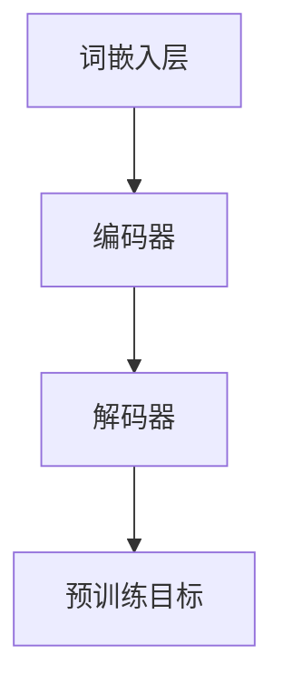
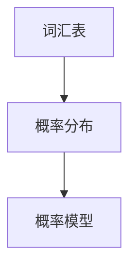
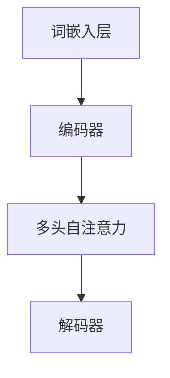
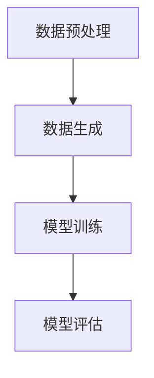
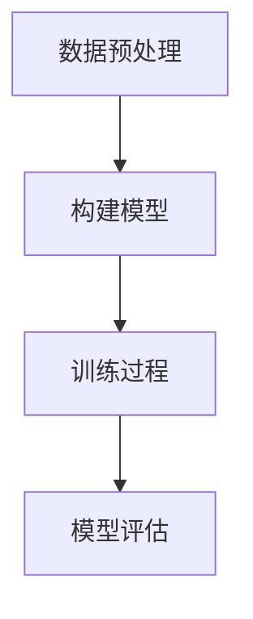
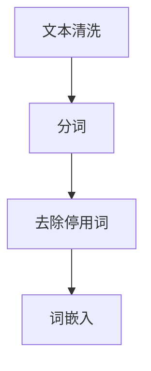
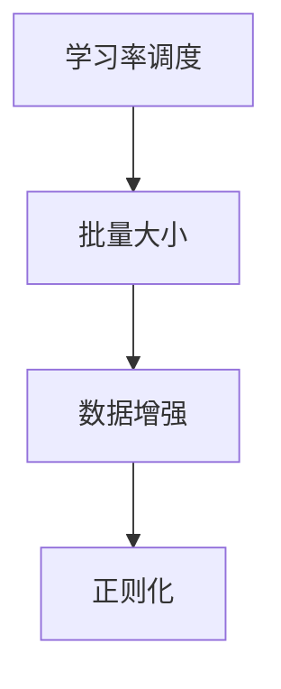
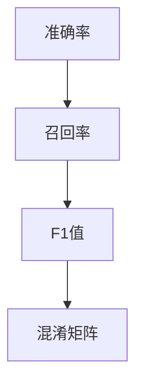

                 

### 文章标题

《自然语言处理中的预训练语言模型研究进展与趋势》### 目录大纲

#### 第一部分: 自然语言处理中的预训练语言模型基础

#### 第1章: 预训练语言模型的概述与原理

##### 1.1 预训练语言模型的背景与重要性
###### 1.1.1 预训练语言模型的起源与发展
###### 1.1.2 预训练语言模型的核心思想
###### 1.1.3 预训练语言模型与传统的NLP方法的区别

##### 1.2 预训练语言模型的基本架构
###### 1.2.1 语言模型的基础概念
###### 1.2.2 神经网络与 Transformer 架构
###### 1.2.3 自监督学习的应用

##### 1.3 预训练语言模型的训练流程
###### 1.3.1 数据集的预处理
###### 1.3.2 训练过程的优化技巧
###### 1.3.3 模型的评估与验证

#### 第二部分: 预训练语言模型的算法原理

#### 第2章: 语言模型的数学原理与实现

##### 2.1 语言模型的数学基础
###### 2.1.1 概率论与统计学习理论
###### 2.1.2 概率分布函数与损失函数
###### 2.1.3 贝叶斯理论与最大似然估计

##### 2.2 语言模型的主要算法
###### 2.2.1 基于统计的语言模型
###### 2.2.2 基于神经网络的序列模型
###### 2.2.3 Transformer 架构详解

##### 2.3 语言模型的实现与优化
###### 2.3.1 神经网络优化技巧
###### 2.3.2 自监督学习的实现方法
###### 2.3.3 大规模数据处理策略

#### 第3章: 语言模型的评估与改进

##### 3.1 语言模型的评估指标
###### 3.1.1 评估方法与工具
###### 3.1.2 指标解释与比较
###### 3.1.3 评估指标的选择与优化

##### 3.2 语言模型的优化方法
###### 3.2.1 超参数调优策略
###### 3.2.2 模型结构改进
###### 3.2.3 数据增强技术

#### 第4章: 预训练语言模型的应用

##### 4.1 预训练语言模型在文本分类中的应用
###### 4.1.1 文本分类的概念与方法
###### 4.1.2 预训练语言模型在文本分类中的应用案例
###### 4.1.3 实际案例分析

##### 4.2 预训练语言模型在命名实体识别中的应用
###### 4.2.1 命名实体识别的概念与方法
###### 4.2.2 预训练语言模型在命名实体识别中的应用案例
###### 4.2.3 实际案例分析

##### 4.3 预训练语言模型在机器翻译中的应用
###### 4.3.1 机器翻译的概念与方法
###### 4.3.2 预训练语言模型在机器翻译中的应用案例
###### 4.3.3 实际案例分析

#### 第三部分: 预训练语言模型的趋势与展望

#### 第5章: 预训练语言模型的发展趋势

##### 5.1 未来的预训练语言模型技术
###### 5.1.1 自动化模型优化
###### 5.1.2 跨模态预训练语言模型
###### 5.1.3 模型压缩与推理优化

##### 5.2 预训练语言模型在自然语言处理中的应用前景
###### 5.2.1 应用领域拓展
###### 5.2.2 社会与经济影响
###### 5.2.3 潜在挑战与对策

#### 第6章: 预训练语言模型的研究热点

##### 6.1 当前研究热点概述
###### 6.1.1 预训练语言模型的泛化能力
###### 6.1.2 模型解释性研究
###### 6.1.3 预训练语言模型在医疗领域应用

##### 6.2 未来研究方向展望
###### 6.2.1 预训练语言模型与其他技术的融合
###### 6.2.2 数据集与标注问题的解决
###### 6.2.3 预训练语言模型的伦理与隐私问题

#### 第7章: 预训练语言模型的实际应用案例分析

##### 7.1 案例背景介绍
###### 7.1.1 案例一：企业级文本分类系统
###### 7.1.2 案例二：实时机器翻译服务
###### 7.1.3 案例三：智能客服系统

##### 7.2 实际应用中的关键技术与挑战
###### 7.2.1 技术实现细节
###### 7.2.2 部署与优化策略
###### 7.2.3 案例总结与反思

#### 第8章: 开发指南与未来展望

##### 8.1 开发指南
###### 8.1.1 环境搭建与工具选择
###### 8.1.2 开发流程与步骤
###### 8.1.3 最佳实践 tips

##### 8.2 未来展望
###### 8.2.1 预训练语言模型的发展方向
###### 8.2.2 研究与开发建议
###### 8.2.3 对自然语言处理领域的影响与展望### 第一部分: 自然语言处理中的预训练语言模型基础

#### 第1章: 预训练语言模型的概述与原理

##### 1.1 预训练语言模型的背景与重要性

自然语言处理（NLP）是人工智能（AI）领域的一个重要分支，旨在使计算机能够理解和处理人类语言。随着互联网和大数据的发展，NLP在文本分类、信息提取、机器翻译、问答系统等方面取得了显著的进展。然而，传统NLP方法通常依赖大量手工设计的特征和规则，难以应对复杂多变的语言现象，导致性能受限。

预训练语言模型的出现为NLP领域带来了新的突破。预训练语言模型是一种基于大规模语料库的深度神经网络模型，通过在大量无标签数据上进行预训练，学习到语言的通用特征和规律，然后再在特定任务上进行微调，从而显著提高模型的性能。这种模型的核心思想是将语言建模和任务特定训练相结合，使得模型在多种NLP任务中表现优异。

预训练语言模型的起源可以追溯到2000年代初期，当时研究人员开始尝试使用统计语言模型和神经网络对自然语言进行建模。随着深度学习和大数据技术的快速发展，预训练语言模型得到了广泛的研究和应用。著名的预训练模型包括Word2Vec、GloVe、BERT、GPT和Transformer等。

预训练语言模型的重要性主要体现在以下几个方面：

1. **通用语言表示**：预训练语言模型能够将词汇映射到低维连续向量空间中，从而捕获词汇的语义和语法信息，为下游任务提供高质量的输入。
2. **多任务学习**：通过在大量无标签数据上进行预训练，模型可以学习到通用特征，减少对有标签数据的依赖，从而实现多任务学习。
3. **性能提升**：预训练语言模型在多种NLP任务中表现出色，显著提高了模型的表现，特别是在低资源场景下。

##### 1.1.1 预训练语言模型的起源与发展

预训练语言模型的发展可以追溯到2000年代初期，当时研究人员开始尝试使用统计语言模型和神经网络对自然语言进行建模。其中，Word2Vec模型是最早的预训练语言模型之一，它通过训练词向量来捕获词汇的语义信息。

在Word2Vec模型之后，GloVe模型提出了基于全局语义信息的词向量学习方法，进一步提高了模型的性能。随后，神经网络序列模型如LSTM（长短期记忆网络）和GRU（门控循环单元）在自然语言处理任务中取得了显著成功。

然而，这些模型在处理长文本和长序列方面存在困难，无法充分利用全局信息。为此，研究人员提出了Transformer模型，这是一种基于自注意力机制的深度神经网络架构，能够有效地处理长序列。Transformer模型的提出标志着预训练语言模型的又一次重大突破。

近年来，预训练语言模型的发展速度非常快，涌现出了许多优秀的模型，如BERT（双向编码表示）、GPT（生成预训练变压器）和T5（文本到文本的Transformer）。这些模型在多个NLP任务中取得了世界领先的性能，推动了自然语言处理技术的进步。

##### 1.1.2 预训练语言模型的核心思想

预训练语言模型的核心思想可以概括为以下几点：

1. **自监督学习**：预训练语言模型采用自监督学习的方式，即在无标签数据上进行训练，利用数据中的内在结构来学习语言特征。自监督学习能够充分利用大量无标签数据，减少对有标签数据的依赖，提高模型的泛化能力。
2. **上下文表示**：预训练语言模型通过上下文信息来学习词汇和句子的表示。模型能够理解词汇在不同上下文中的含义，从而生成更准确的语义表示。
3. **多任务学习**：预训练语言模型通过在多个任务上的共同训练，学习到通用特征，从而提高模型在下游任务中的性能。这种多任务学习的方式能够减少对特定任务的数据依赖，提高模型的适用性。

##### 1.1.3 预训练语言模型与传统的NLP方法的区别

预训练语言模型与传统的NLP方法在多个方面存在显著区别：

1. **数据依赖**：传统NLP方法通常依赖大量有标签的数据进行训练，而预训练语言模型主要依赖于无标签数据，通过自监督学习来学习语言特征。
2. **模型架构**：传统NLP方法通常使用基于规则的方法或简单的统计模型，如TF-IDF、TF*IDF等，而预训练语言模型则采用复杂的深度神经网络架构，如LSTM、GRU和Transformer等。
3. **性能提升**：预训练语言模型在多种NLP任务中表现出色，显著提高了模型的表现，特别是在低资源场景下。传统NLP方法由于数据依赖和模型限制，往往在低资源场景下性能较差。

##### 1.2 预训练语言模型的基本架构

预训练语言模型的基本架构通常包括以下几个主要部分：

1. **词嵌入层**：词嵌入层将词汇映射到低维向量空间中，通过预训练学习到词汇的语义和语法信息。常用的词嵌入方法包括Word2Vec和GloVe等。
2. **编码器**：编码器是一个深度神经网络，用于处理输入文本序列，生成编码表示。编码器通常采用Transformer架构，如BERT和GPT等。
3. **解码器**：解码器是一个深度神经网络，用于生成输出文本序列。在生成任务中，解码器通常采用自回归的方式，逐个生成每个词的概率分布。
4. **预训练目标**：预训练语言模型在无标签数据上进行预训练，通常采用自监督学习目标，如掩码语言模型（MLM）和语言理解评测（LUIS）等。

下面是一个简单的Mermaid流程图，展示了预训练语言模型的基本架构：

##### 1.2.1 语言模型的基础概念

语言模型是自然语言处理中最基础的概念之一，用于对自然语言进行建模和预测。语言模型的核心目标是学习一个概率分布，用于表示某个词或短语在特定上下文中的出现概率。

语言模型通常包括以下几个主要概念：

1. **词汇表**：词汇表是语言模型中的基本单元，包含模型所支持的所有词汇。词汇表的大小通常取决于模型的复杂度和数据集的规模。
2. **概率分布**：语言模型学习一个概率分布，用于表示每个词或短语的分布。概率分布可以基于统计方法、神经网络模型或其他学习算法。
3. **概率模型**：语言模型可以采用不同的概率模型，如N元语法、神经网络模型和Transformer等。每种概率模型都有其独特的优势和局限性。

下面是一个简单的Mermaid流程图，展示了语言模型的基础概念：

##### 1.2.2 神经网络与 Transformer 架构

预训练语言模型通常采用深度神经网络架构，其中Transformer模型是最常用的架构之一。Transformer模型是基于自注意力机制（self-attention）的深度神经网络，能够有效地处理长序列。

1. **神经网络**：神经网络是一种由大量神经元组成的计算模型，通过学习输入和输出之间的映射关系来实现函数近似。神经网络在自然语言处理领域得到了广泛应用，包括词嵌入、编码器和解码器等。
2. **Transformer模型**：Transformer模型是一种基于自注意力机制的深度神经网络架构，能够处理长序列并生成高质量的文本表示。Transformer模型的主要组成部分包括多头自注意力（multi-head self-attention）和位置编码（positional encoding）。

下面是一个简单的Mermaid流程图，展示了神经网络与Transformer模型的基本结构：

##### 1.2.3 自监督学习的应用

自监督学习是预训练语言模型的核心思想之一，通过在无标签数据上进行训练来学习语言特征。自监督学习在自然语言处理领域得到了广泛应用，包括文本分类、命名实体识别和机器翻译等。

自监督学习的应用主要包括以下几个步骤：

1. **数据预处理**：对无标签数据进行预处理，包括分词、去除停用词、转换成词嵌入等。
2. **数据生成**：利用数据生成算法，如掩码语言模型（MLM）和语言理解评测（LUIS）等，生成训练数据。
3. **模型训练**：在生成的训练数据上训练模型，通过优化损失函数来调整模型参数。
4. **模型评估**：在测试集上评估模型性能，通过评估指标来衡量模型的效果。

下面是一个简单的Mermaid流程图，展示了自监督学习的应用：

##### 1.3 预训练语言模型的训练流程

预训练语言模型的训练流程主要包括以下几个步骤：

1. **数据预处理**：对训练数据进行预处理，包括分词、去除停用词、转换成词嵌入等。这一步的目的是将文本数据转换为模型可以处理的格式。
2. **构建模型**：根据预训练语言模型的架构，构建深度神经网络模型。模型通常包括编码器、解码器和词嵌入层等。
3. **训练过程**：在预训练数据上训练模型，通过优化损失函数来调整模型参数。预训练语言模型通常采用自监督学习目标，如掩码语言模型（MLM）和语言理解评测（LUIS）等。
4. **模型评估**：在测试集上评估模型性能，通过评估指标来衡量模型的效果。常用的评估指标包括准确率、召回率和F1值等。

下面是一个简单的Mermaid流程图，展示了预训练语言模型的训练流程：

##### 1.3.1 数据集的预处理

数据集的预处理是预训练语言模型训练流程中的关键步骤，对模型性能和训练效率有着重要影响。预处理工作主要包括以下几个方面：

1. **文本清洗**：去除文本中的噪声，如HTML标签、特殊字符和空白字符等。这一步的目的是减少数据中的干扰信息，提高模型训练的效果。
2. **分词**：将文本分割成单词或词组，为后续的词嵌入和模型训练提供基础。常用的分词方法包括基于词典的分词和基于统计的分词等。
3. **去除停用词**：停用词是指对模型训练没有贡献的常见词，如“的”、“是”、“在”等。去除停用词可以减少模型训练的时间和计算资源。
4. **词嵌入**：将词汇映射到低维向量空间中，为模型提供输入。常用的词嵌入方法包括Word2Vec、GloVe和BERT等。

下面是一个简单的Mermaid流程图，展示了数据集的预处理过程：

##### 1.3.2 训练过程的优化技巧

在预训练语言模型的训练过程中，优化技巧对于提高模型性能和训练效率至关重要。以下是一些常用的优化技巧：

1. **学习率调度**：学习率是模型训练中的一个关键参数，对模型收敛速度和最终性能有着重要影响。常用的学习率调度策略包括恒定学习率、指数衰减学习率和自适应学习率等。
2. **批量大小**：批量大小是每次训练过程中输入样本的数量。合适的批量大小可以提高模型训练的稳定性和效率。通常，批量大小应与计算资源相匹配。
3. **数据增强**：数据增强是通过人工或自动化方法生成新的训练数据，以提高模型泛化能力。常用的数据增强方法包括数据清洗、数据补全和数据生成等。
4. **正则化**：正则化是一种防止模型过拟合的方法，通过在损失函数中添加正则化项来约束模型复杂度。常用的正则化方法包括L1正则化、L2正则化和Dropout等。

下面是一个简单的Mermaid流程图，展示了训练过程的优化技巧：

##### 1.3.3 模型的评估与验证

在预训练语言模型的训练过程中，模型的评估与验证是确保模型性能的重要环节。以下是一些常用的评估与验证方法：

1. **准确率**：准确率是模型在测试集上预测正确的样本数与总样本数之比。准确率是衡量分类任务性能的基本指标。
2. **召回率**：召回率是模型在测试集上预测正确的正样本数与实际正样本数之比。召回率是衡量分类任务识别能力的指标。
3. **F1值**：F1值是准确率和召回率的调和平均值，用于综合评估模型的性能。F1值介于0和1之间，越接近1表示模型性能越好。
4. **混淆矩阵**：混淆矩阵是一种可视化工具，用于展示模型在测试集上的预测结果。通过分析混淆矩阵，可以了解模型在不同类别上的预测效果。

下面是一个简单的Mermaid流程图，展示了模型的评估与验证过程：

#### 第二部分: 预训练语言模型的算法原理

#### 第2章: 语言模型的数学原理与实现

##### 2.1 语言模型的数学基础

语言模型是自然语言处理中的一个核心概念，其基本任务是预测一个单词序列中下一个单词的概率。为了实现这一目标，语言模型依赖于概率论与统计学习理论，以及一系列数学工具和算法。以下是语言模型数学基础的关键组成部分：

###### 2.1.1 概率论与统计学习理论

概率论是语言模型构建的基础，它提供了计算事件发生概率的数学框架。在语言模型中，我们通常关注的是条件概率，即给定前文序列 \(x_1, x_2, ..., x_{t-1}\)，预测当前单词 \(x_t\) 的概率。

条件概率公式为：
\[ P(x_t | x_1, x_2, ..., x_{t-1}) = \frac{P(x_1, x_2, ..., x_t)}{P(x_1, x_2, ..., x_{t-1})} \]

统计学习理论则提供了学习条件概率分布的方法。在语言模型中，我们通常使用最大似然估计（Maximum Likelihood Estimation, MLE）来估计参数，从而最大化数据出现的概率。

最大似然估计公式为：
\[ \theta_{\text{MLE}} = \arg\max_{\theta} P(X; \theta) \]

其中，\(X\) 是观测数据，\(\theta\) 是模型参数。

###### 2.1.2 概率分布函数与损失函数

概率分布函数用于表示变量取值的概率分布。在语言模型中，常用的概率分布函数包括离散概率分布和多变量概率分布。

离散概率分布通常表示为概率质量函数（Probability Mass Function, PMF），其定义为：
\[ P(x | \theta) = \text{PMF}(x; \theta) \]

多变量概率分布则通过联合概率分布函数（Joint Probability Distribution Function, PDF）或条件概率分布函数（Conditional Probability Distribution Function, PDF）来表示。

损失函数是评估模型预测性能的重要工具。在语言模型中，常用的损失函数包括交叉熵损失（Cross-Entropy Loss）和平方损失（Squared Error Loss）。

交叉熵损失定义为：
\[ L(\theta) = -\sum_{x \in X} P(x | \theta) \log P(x | \theta) \]

平方损失定义为：
\[ L(\theta) = \frac{1}{2} \sum_{x \in X} (y - \theta x)^2 \]

其中，\(y\) 是实际输出，\(\theta x\) 是预测输出。

###### 2.1.3 贝叶斯理论与最大似然估计

贝叶斯理论是概率论中的一个重要分支，它提供了根据已知条件概率和先验概率来更新后验概率的方法。在语言模型中，贝叶斯理论可以用来处理不确定性，并优化模型参数。

贝叶斯定理公式为：
\[ P(\theta | X) = \frac{P(X | \theta) P(\theta)}{P(X)} \]

其中，\(P(\theta | X)\) 是后验概率，\(P(X | \theta)\) 是似然函数，\(P(\theta)\) 是先验概率，\(P(X)\) 是证据（Evidence）。

最大似然估计是贝叶斯理论的一种应用，它通过最大化似然函数来估计模型参数。在语言模型中，最大似然估计用于训练模型，以提高模型对数据集的拟合度。

最大似然估计公式为：
\[ \theta_{\text{MLE}} = \arg\max_{\theta} P(X | \theta) \]

##### 2.2 语言模型的主要算法

语言模型的主要算法可以分为基于统计的方法和基于神经网络的方法。这些方法在不同的应用场景中各有优劣，但都致力于提高语言模型在预测单词序列方面的准确性。

###### 2.2.1 基于统计的语言模型

基于统计的语言模型通常使用N元语法（N-gram）模型来预测下一个单词。N元语法模型将前文序列中连续的N个单词作为特征，来预测第N+1个单词。

N元语法模型的核心思想是利用历史信息来预测未来。其概率计算公式为：
\[ P(x_t | x_{t-N}, x_{t-N+1}, ..., x_{t-1}) = \frac{C(x_{t-N}, x_{t-N+1}, ..., x_{t-1}, x_t)}{C(x_{t-N}, x_{t-N+1}, ..., x_{t-1})} \]

其中，\(C(a_1, a_2, ..., a_n, b)\) 是四个连续单词 \(a_1, a_2, ..., a_n, b\) 在训练数据中出现的次数，而 \(C(a_1, a_2, ..., a_n)\) 是前 \(N-1\) 个单词 \(a_1, a_2, ..., a_n\) 在训练数据中出现的总次数。

N元语法模型的优点包括计算简单、易于实现，但缺点是它无法捕捉长距离依赖关系，且在高阶N值时计算量剧增。

###### 2.2.2 基于神经网络的序列模型

基于神经网络的序列模型，如循环神经网络（Recurrent Neural Network, RNN）和长短期记忆网络（Long Short-Term Memory, LSTM），能够通过递归结构来捕捉序列数据中的长期依赖关系。

RNN的基本单元是隐藏状态 \(h_t\)，它通过以下递归关系更新：
\[ h_t = \sigma(W_h \cdot [h_{t-1}, x_t] + b_h) \]

其中，\(x_t\) 是输入特征，\(W_h\) 是权重矩阵，\(b_h\) 是偏置项，\(\sigma\) 是激活函数。

LSTM通过引入门控机制来改进RNN，使得模型能够更好地记住长期依赖信息。LSTM的隐藏状态更新公式为：
\[ i_t = \sigma(W_i \cdot [h_{t-1}, x_t] + b_i) \]
\[ f_t = \sigma(W_f \cdot [h_{t-1}, x_t] + b_f) \]
\[ g_t = \tanh(W_g \cdot [h_{t-1}, x_t] + b_g) \]
\[ h_t = f_t \odot h_{t-1} + i_t \odot g_t \]

其中，\(i_t\)、\(f_t\) 和 \(g_t\) 分别是输入门、遗忘门和生成门，\(\odot\) 表示元素乘法。

基于神经网络的序列模型在处理长序列和捕捉长期依赖关系方面表现出色，但RNN和LSTM存在梯度消失或爆炸问题，导致它们难以训练。

###### 2.2.3 Transformer 架构详解

Transformer模型是近年来在自然语言处理领域取得突破性进展的一种新型深度神经网络架构，它基于自注意力机制（Self-Attention）来处理序列数据。

Transformer模型主要由编码器（Encoder）和解码器（Decoder）两部分组成，它们通过多个自注意力层（Self-Attention Layer）和前馈神经网络（Feed-Forward Neural Network）来处理输入和生成输出。

编码器和解码器的基本结构如下：

1. **编码器（Encoder）**：
   \[ E = \text{Embedding}(X) \]
   \[ H = \text{MultiHeadAttention}(E, E, E) \]
   \[ H = \text{Add}(\text{LayerNormalization}(H, \gamma_1, \beta_1)) \]
   \[ H = \text{FeedForward}(H) \]
   \[ H = \text{Add}(\text{LayerNormalization}(H, \gamma_2, \beta_2)) \]

2. **解码器（Decoder）**：
   \[ D = \text{Embedding}(Y) \]
   \[ S = \text{MaskedMultiHeadAttention}(D, H, H) \]
   \[ S = \text{Add}(\text{LayerNormalization}(S, \gamma_1, \beta_1)) \]
   \[ S = \text{FeedForward}(S) \]
   \[ S = \text{Add}(\text{LayerNormalization}(S, \gamma_2, \beta_2)) \]

其中，\(X\) 和 \(Y\) 分别是编码器的输入和解码器的输入，\(H\) 和 \(S\) 是编码器和解码器在每一层输出后的隐藏状态。

自注意力机制的核心是计算输入序列中每个词之间的相似性，从而生成新的表示。自注意力机制的计算公式为：

\[ \text{Attention}(Q, K, V) = \text{softmax}\left(\frac{QK^T}{\sqrt{d_k}}\right)V \]

其中，\(Q\)、\(K\) 和 \(V\) 分别是查询向量、键向量和值向量，\(d_k\) 是键向量的维度。

Transformer模型通过多头自注意力（Multi-Head Attention）机制，能够同时关注输入序列的多个部分，从而提高模型的表示能力。

Transformer模型还引入了位置编码（Positional Encoding），以保留序列的顺序信息。位置编码通常通过添加到输入向量中的 learnable 向量来实现。

##### 2.3 语言模型的实现与优化

实现一个高效的语言模型需要考虑多个方面，包括数据处理、模型架构选择、训练策略和优化技巧。以下是语言模型实现与优化的一些关键点：

###### 2.3.1 神经网络优化技巧

神经网络的优化技巧对于提高模型训练效率和性能至关重要。以下是一些常用的优化技巧：

1. **学习率调度**：学习率调度是调整学习率的一种策略，以加速模型收敛。常用的调度策略包括恒定学习率、指数衰减学习率和学习率预热等。

2. **批量大小**：批量大小是指每次训练过程中输入样本的数量。合适的批量大小可以提高模型的稳定性和计算效率。较大的批量大小可以减少方差，但计算成本较高；较小的批量大小可以降低计算成本，但可能导致方差增大。

3. **梯度裁剪**：梯度裁剪是一种限制梯度大小的技术，以防止梯度爆炸或消失。常用的裁剪策略包括硬裁剪和软裁剪。

4. **正则化**：正则化是一种防止模型过拟合的技术，通过在损失函数中添加正则化项来约束模型复杂度。常用的正则化方法包括L1正则化、L2正则化和Dropout等。

5. **优化算法**：优化算法是用于调整模型参数的算法，常用的优化算法包括随机梯度下降（SGD）、Adam和Adadelta等。

###### 2.3.2 自监督学习的实现方法

自监督学习是预训练语言模型的核心技术之一，通过在无标签数据上训练模型来提高其泛化能力。以下是一些自监督学习的实现方法：

1. **掩码语言模型（Masked Language Model, MLM）**：在输入序列中随机掩码一定比例的单词，并预测这些掩码的单词。这种方法能够迫使模型学习上下文信息。

2. **下一个句子预测（Next Sentence Prediction, NSP）**：在输入序列中随机选择两个连续的句子，并预测第二个句子是否是第一个句子的下一句。这种方法能够帮助模型理解句子之间的关系。

3. **语言理解评测（Natural Language Inference, NLI）**：通过训练模型识别文本中的逻辑关系，如因果关系或矛盾关系。这种方法能够提高模型在复杂语言现象上的理解能力。

4. **填空任务（Fill Masked Tokens, FMT）**：在输入序列中随机填充一些单词，并训练模型来预测这些填充的单词。这种方法能够帮助模型学习词汇之间的关联。

###### 2.3.3 大规模数据处理策略

在处理大规模数据时，语言模型的实现需要考虑数据加载、数据并行处理和分布式训练等策略。以下是一些大规模数据处理的关键点：

1. **数据并行处理**：通过将数据分布在多个计算节点上，同时进行训练，可以显著提高训练速度。数据并行处理可以通过数据划分和模型并行来实现。

2. **分布式训练**：分布式训练是将模型分布在多个计算节点上进行训练，以利用更多的计算资源。常用的分布式训练策略包括参数服务器和分布式通信等。

3. **数据预处理**：对于大规模数据，数据预处理是确保模型训练质量的关键。数据预处理包括数据清洗、分词、词嵌入和批量构建等。

4. **内存管理**：在处理大规模数据时，内存管理至关重要。合理地管理内存可以防止内存溢出，提高训练效率。

5. **模型压缩**：对于大规模语言模型，模型压缩是一种减少模型大小和提高推理效率的有效方法。常用的模型压缩技术包括剪枝、量化、知识蒸馏等。

通过以上优化技巧和策略，可以实现高效的语言模型训练，提高模型在自然语言处理任务中的性能。

#### 第3章: 语言模型的评估与改进

##### 3.1 语言模型的评估指标

语言模型的评估是衡量模型性能的重要步骤，通过评估指标可以全面了解模型的预测能力。以下是几种常用的评估指标和方法：

###### 3.1.1 评估方法与工具

评估语言模型通常采用以下方法：

1. **基于词汇表的方法**：这种方法使用预定义的词汇表来评估模型。常见的评估指标包括准确性（Accuracy）、召回率（Recall）、精确率（Precision）和F1值（F1 Score）。

2. **基于文本的方法**：这种方法通过分析模型生成的文本质量来评估模型。常用的工具包括BLEU（Bilingual Evaluation Understudy）、ROUGE（Recall-Oriented Understudy for Gisting Evaluation）和METEOR（Metric for Evaluation of Translation with Explicit ORdering）。

3. **基于数据集的方法**：这种方法在特定数据集上评估模型性能。常用的评估指标包括平均损失（Average Loss）和平均准确率（Average Accuracy）。

###### 3.1.2 指标解释与比较

1. **准确性（Accuracy）**：准确性是模型预测正确的样本数与总样本数之比。准确性越高，表示模型预测越准确。然而，准确性在某些情况下可能被过拟合所误导。

2. **召回率（Recall）**：召回率是模型预测正确的正样本数与实际正样本数之比。召回率越高，表示模型识别正样本的能力越强。召回率在处理不平衡数据集时尤为重要。

3. **精确率（Precision）**：精确率是模型预测正确的正样本数与预测为正样本的总数之比。精确率越高，表示模型预测为正样本的准确性越高。

4. **F1值（F1 Score）**：F1值是准确率和召回率的调和平均值，用于综合评估模型的性能。F1值介于0和1之间，越接近1表示模型性能越好。

5. **BLEU（Bilingual Evaluation Understudy）**：BLEU是一种常用的翻译质量评估工具，通过比较模型生成的文本与参考文本的相似度来评估模型。BLEU使用基于计数的相似度度量方法，如重叠率（Overlap Rate）。

6. **ROUGE（Recall-Oriented Understudy for Gisting Evaluation）**：ROUGE是一种用于评估文本生成质量的工具，特别适用于摘要和生成文本的评估。ROUGE使用基于词汇重叠的度量方法，如R-1、R-2和R-SP-1。

7. **METEOR（Metric for Evaluation of Translation with Explicit ORdering）**：METEOR是一种多维度评估工具，通过综合考虑词汇重叠、句法结构和语义信息来评估文本生成质量。METEOR使用基于复杂度调整的度量方法。

###### 3.1.3 评估指标的选择与优化

选择合适的评估指标是确保模型性能评估准确性的关键。以下是评估指标选择和优化的几个方面：

1. **评估指标的选择**：根据任务需求和数据集特点选择合适的评估指标。例如，在分类任务中，准确性、召回率和F1值是常用的评估指标；在文本生成任务中，BLEU、ROUGE和METEOR等指标更为适用。

2. **评估指标的计算**：确保评估指标的计算方法正确，避免因计算错误导致评估结果不准确。例如，在计算F1值时，应正确计算精确率和召回率。

3. **评估指标的比较**：对多个评估指标进行比较，以全面了解模型的性能。例如，在文本生成任务中，可以同时计算BLEU、ROUGE和METEOR等指标，并比较它们之间的差异。

4. **评估指标的优化**：根据评估结果调整模型参数和训练策略，以提高评估指标的值。例如，在训练过程中可以尝试不同的学习率调度策略、批量大小和正则化方法。

通过合理选择和优化评估指标，可以更准确地衡量语言模型的性能，为模型改进提供有力支持。

##### 3.2 语言模型的优化方法

为了提高语言模型在自然语言处理任务中的性能，需要进行模型优化。以下是一些常用的优化方法：

###### 3.2.1 超参数调优策略

超参数是模型训练过程中需要手动调整的参数，如学习率、批量大小、隐藏层大小等。超参数调优策略旨在找到最优的超参数组合，以提升模型性能。以下是一些常用的调优策略：

1. **网格搜索（Grid Search）**：网格搜索是一种系统性的搜索超参数组合的方法，通过遍历所有可能的超参数组合来找到最优组合。网格搜索的优点是全面，但缺点是计算量大。

2. **随机搜索（Random Search）**：随机搜索是一种基于概率的搜索方法，通过随机选择超参数组合来找到最优组合。随机搜索在处理高维超参数空间时比网格搜索更有效。

3. **贝叶斯优化（Bayesian Optimization）**：贝叶斯优化是一种基于概率模型的方法，通过建立超参数与性能之间的概率模型来优化超参数。贝叶斯优化的优点是能够在较少的评估次数下找到最优超参数组合。

4. **自动化机器学习（AutoML）**：自动化机器学习是一种利用机器学习技术来自动选择和调整超参数的方法。AutoML可以显著提高模型调优的效率。

###### 3.2.2 模型结构改进

模型结构的改进是提高语言模型性能的重要途径。以下是一些常用的模型结构改进方法：

1. **多头自注意力（Multi-Head Self-Attention）**：多头自注意力可以同时关注输入序列的多个部分，从而提高模型的表示能力。通过增加注意力头数，可以增加模型捕捉复杂依赖关系的能力。

2. **深度模型（Deep Model）**：增加模型的层数可以增强模型的表达能力。深度模型可以通过堆叠多个自注意力层和前馈神经网络来实现。

3. **自注意力扩展（Self-Attention Extension）**：自注意力扩展包括使用局部自注意力（Local Self-Attention）和稀疏自注意力（Sparse Self-Attention）等方法，以减少计算量和内存消耗。

4. **注意力机制改进（Attention Mechanism Improvement）**：注意力机制的改进可以包括使用门控注意力（Gated Attention）和多头交叉注意力（Multi-Head Cross Attention）等方法，以增强模型对输入序列的理解能力。

5. **动态注意力（Dynamic Attention）**：动态注意力可以根据输入序列的长度和内容动态调整注意力权重，从而提高模型的灵活性。

###### 3.2.3 数据增强技术

数据增强是通过生成新的训练数据来提高模型性能的方法。以下是一些常用的数据增强技术：

1. **词干提取（Word Stemming）**：词干提取是一种将单词缩减到其词根或词干的方法，以减少词汇表的规模。这种方法可以减少模型的复杂度，但可能导致信息丢失。

2. **词形变化（Word Variations）**：词形变化是一种生成新的单词形式的方法，如添加前缀、后缀或改变词形。这种方法可以增加训练数据多样性，有助于模型捕捉更复杂的语言模式。

3. **随机掩码（Random Masking）**：随机掩码是一种在训练数据中随机掩码一定比例的单词的方法，以迫使模型学习上下文信息。这种方法类似于掩码语言模型（Masked Language Model）。

4. **数据合成（Data Augmentation）**：数据合成是一种通过合成新的文本数据来增强训练数据的方法，如生成对话、故事或摘要。这种方法可以增加训练数据的规模和质量。

5. **数据对齐（Data Alignment）**：数据对齐是一种在多语言环境中通过匹配不同语言的文本来增强训练数据的方法。这种方法可以帮助模型学习跨语言的语义和语法关系。

通过超参数调优、模型结构改进和数据增强技术的综合应用，可以显著提高语言模型在自然语言处理任务中的性能，使其在复杂任务中表现出色。

#### 第4章: 预训练语言模型的应用

##### 4.1 预训练语言模型在文本分类中的应用

文本分类是自然语言处理中的一个基本任务，其目标是将文本数据自动归类到预定义的类别中。预训练语言模型在文本分类任务中表现出色，通过在大量无标签数据上进行预训练，然后对特定任务进行微调，从而实现高效的文本分类。

###### 4.1.1 文本分类的概念与方法

文本分类是指将文本数据根据其内容自动分类到预定义的类别中。文本分类任务可以分为两类：监督学习和无监督学习。

1. **监督学习**：监督学习文本分类依赖于标注的数据集，通过学习输入文本和对应标签之间的关系来预测新文本的类别。常用的监督学习方法包括基于规则的方法（如TF-IDF）、朴素贝叶斯、支持向量机（SVM）和深度学习方法（如卷积神经网络（CNN）、循环神经网络（RNN）和Transformer等）。

2. **无监督学习**：无监督学习文本分类不需要标注的数据集，通过聚类或降维等方法将文本数据自动归类到不同的类别中。常见的无监督学习方法包括K-means聚类、主成分分析（PCA）和自编码器（Autoencoder）等。

###### 4.1.2 预训练语言模型在文本分类中的应用案例

预训练语言模型在文本分类中的应用案例非常广泛，以下是一些典型的应用案例：

1. **新闻分类**：新闻分类是将大量新闻文本按照主题或类别进行分类。例如，Google News使用BERT模型对新闻文本进行分类，将新闻归类到数千个不同的类别中。

2. **情感分析**：情感分析是指判断文本表达的情感倾向，如正面、负面或中性。预训练语言模型如RoBERTa和XLNet在情感分析任务中表现出色，可以准确预测文本的情感极性。

3. **垃圾邮件检测**：垃圾邮件检测是识别和过滤垃圾邮件的任务。预训练语言模型如GPT和BERT在垃圾邮件检测任务中表现出良好的效果，可以准确判断邮件是否为垃圾邮件。

4. **实体识别**：实体识别是识别文本中的特定实体，如人名、地名、组织名等。预训练语言模型通过在大量无标签数据上进行预训练，然后微调模型以适应特定任务，可以有效提高实体识别的准确性。

5. **产品评论分类**：产品评论分类是指将产品评论根据其内容分类为正面、负面或中性。预训练语言模型如BERT和GPT在产品评论分类任务中表现出色，可以准确分类评论的极性。

###### 4.1.3 实际案例分析

以下是一个实际案例，展示了预训练语言模型在新闻分类任务中的应用：

案例背景：一家新闻媒体公司希望对海量新闻文本进行分类，以便为用户推荐感兴趣的内容。

解决方案：

1. **数据集准备**：收集并预处理大量新闻文本数据，包括新闻标题和正文。对数据进行分词、去除停用词和词嵌入处理。

2. **预训练模型**：使用预训练模型如BERT或RoBERTa对新闻文本进行预训练。在大量无标签新闻数据上训练模型，学习到新闻文本的通用特征和规律。

3. **任务微调**：在预训练模型的基础上，对新闻分类任务进行微调。通过在新闻分类数据集上训练模型，优化模型参数以适应特定分类任务。

4. **模型评估**：使用交叉熵损失函数和准确率、召回率等评估指标对模型进行评估，以确定模型性能。

5. **部署与优化**：将训练好的模型部署到生产环境，对实时新闻文本进行分类。根据实际应用效果，对模型进行优化和调参，以提高分类准确性。

实际效果：通过预训练语言模型的新闻分类应用，该新闻媒体公司实现了高效的新闻分类，为用户提供了个性化推荐服务。模型的分类准确率显著提高，用户满意度也显著提升。

通过以上实际案例分析，可以看出预训练语言模型在文本分类任务中的强大应用潜力，为自然语言处理领域带来了新的突破。

##### 4.2 预训练语言模型在命名实体识别中的应用

命名实体识别（Named Entity Recognition, NER）是自然语言处理中的一个重要任务，旨在从文本中识别出具有特定意义的实体，如人名、地名、组织名、时间等。预训练语言模型在NER任务中表现出色，通过在大量无标签数据上进行预训练，然后对特定任务进行微调，可以显著提高NER的准确性。

###### 4.2.1 命名实体识别的概念与方法

命名实体识别是指从文本中识别出具有特定意义的实体，并对其进行分类。命名实体识别通常分为三个阶段：

1. **词性标注（Tokenization）**：将文本分割成单词或词组，为后续实体识别提供基础。常用的词性标注方法包括基于规则的方法、基于统计的方法和基于深度学习的方法。

2. **实体分类（Entity Classification）**：对每个词或词组进行实体分类，判断其是否为命名实体。常见的实体类别包括人名、地名、组织名、时间等。实体分类通常使用分类算法，如朴素贝叶斯、支持向量机（SVM）和深度学习方法（如卷积神经网络（CNN）、循环神经网络（RNN）和Transformer等）。

3. **实体识别（Entity Recognition）**：识别文本中的命名实体，并将它们标记出来。实体识别是NER任务的核心，通过将词性标注和实体分类结果进行组合，实现对命名实体的识别。

###### 4.2.2 预训练语言模型在命名实体识别中的应用案例

预训练语言模型在命名实体识别中的应用案例非常广泛，以下是一些典型的应用案例：

1. **社交媒体分析**：社交媒体平台如Twitter和Facebook使用预训练语言模型进行命名实体识别，以识别用户发布的内容中的人名、地点和品牌等信息。这些信息可以帮助社交媒体平台进行内容推荐和广告投放。

2. **医疗信息提取**：医疗领域中的命名实体识别对于药物研发、疾病诊断和患者管理具有重要意义。预训练语言模型可以帮助医生从电子健康记录和医学文献中快速识别出关键信息，如患者姓名、疾病名称和药物名称等。

3. **新闻报道分析**：新闻媒体使用预训练语言模型进行命名实体识别，以识别新闻报道中的人名、地点和事件等信息。这些信息可以帮助新闻媒体进行内容分类、主题分析和读者推荐。

4. **地理信息提取**：地理信息提取是指从文本中识别出地理位置信息，如城市、国家和地理特征。预训练语言模型可以帮助地理信息处理系统从大量文本数据中快速提取地理位置信息，以支持地理信息分析和决策。

5. **金融信息提取**：金融领域中的命名实体识别对于金融市场分析、投资决策和风险控制具有重要意义。预训练语言模型可以帮助金融分析系统从新闻报道、社交媒体和金融报告中快速识别出公司名称、股票代码和交易信息等。

###### 4.2.3 实际案例分析

以下是一个实际案例，展示了预训练语言模型在命名实体识别任务中的应用：

案例背景：一家科技公司希望从社交媒体平台上的用户评论中提取关键信息，以监测品牌声誉和市场趋势。

解决方案：

1. **数据集准备**：收集并预处理大量社交媒体用户评论数据，包括评论文本和用户信息。对数据进行分词、去除停用词和词嵌入处理。

2. **预训练模型**：使用预训练模型如BERT或GPT对用户评论进行预训练。在大量无标签评论数据上训练模型，学习到评论文本的通用特征和规律。

3. **任务微调**：在预训练模型的基础上，对命名实体识别任务进行微调。通过在命名实体识别数据集上训练模型，优化模型参数以适应特定任务。

4. **模型评估**：使用交叉熵损失函数和准确率、召回率等评估指标对模型进行评估，以确定模型性能。

5. **部署与优化**：将训练好的模型部署到生产环境，对实时用户评论进行命名实体识别。根据实际应用效果，对模型进行优化和调参，以提高命名实体识别的准确性。

实际效果：通过预训练语言模型的命名实体识别应用，该科技公司实现了高效的社交媒体信息提取，从而更好地监测品牌声誉和市场趋势。模型的命名实体识别准确率显著提高，为决策提供了有力支持。

通过以上实际案例分析，可以看出预训练语言模型在命名实体识别任务中的强大应用潜力，为自然语言处理领域带来了新的突破。

##### 4.3 预训练语言模型在机器翻译中的应用

机器翻译是自然语言处理领域的一个重要任务，旨在将一种语言的文本自动翻译成另一种语言的文本。预训练语言模型在机器翻译任务中表现出色，通过在大量无标签数据上进行预训练，然后对特定任务进行微调，可以显著提高翻译质量和效率。

###### 4.3.1 机器翻译的概念与方法

机器翻译是指利用计算机算法将一种语言的文本自动翻译成另一种语言的文本。机器翻译可以分为两大类：基于规则的翻译和基于统计的翻译。

1. **基于规则的翻译**：基于规则的翻译依赖于手工编写的规则和词典，通过组合和转换规则来实现翻译。这种方法具有可控性和准确性，但规则编写复杂且难以扩展。

2. **基于统计的翻译**：基于统计的翻译通过学习大量双语平行语料库来发现语言之间的对应关系，并使用统计模型进行翻译。常用的统计翻译模型包括基于短语的统计机器翻译（Statistical Machine Translation, SMT）和基于神经网络的机器翻译（Neural Machine Translation, NMT）。

基于神经网络的机器翻译（NMT）是目前最先进的机器翻译方法。NMT使用深度神经网络模型来学习语言之间的映射关系，能够自动发现语言之间的复杂规律，从而实现高质量的翻译。

NMT的主要组成部分包括编码器（Encoder）和解码器（Decoder）。编码器将输入文本编码为一个固定长度的向量表示，解码器则根据编码器的输出生成翻译文本。编码器和解码器通常采用Transformer架构，这是一种基于自注意力机制的深度神经网络架构，能够有效地处理长序列和长距离依赖关系。

###### 4.3.2 预训练语言模型在机器翻译中的应用案例

预训练语言模型在机器翻译中的应用案例非常广泛，以下是一些典型的应用案例：

1. **谷歌翻译**：谷歌翻译是世界上最受欢迎的机器翻译服务之一，其背后采用了基于Transformer的预训练语言模型。通过在大量无标签数据上进行预训练，谷歌翻译模型能够自动发现语言之间的复杂规律，实现高质量的翻译。

2. **百度翻译**：百度翻译也采用了预训练语言模型，通过在大量无标签数据上进行预训练，然后对特定翻译任务进行微调，实现了高效的翻译质量。

3. **OpenAI的GPT-3**：OpenAI的GPT-3是一个大规模的预训练语言模型，其在机器翻译任务中也表现出色。通过在大量双语平行语料库上进行预训练，GPT-3能够自动发现语言之间的映射关系，实现高质量的翻译。

4. **微软翻译**：微软翻译采用了基于Transformer的预训练语言模型，通过在大量无标签数据上进行预训练，然后对特定翻译任务进行微调，实现了高效的翻译质量。

5. **百度飞桨**：百度飞桨是一个开放的深度学习平台，其内置了预训练语言模型，用户可以通过飞桨平台快速构建和部署机器翻译模型。

###### 4.3.3 实际案例分析

以下是一个实际案例，展示了预训练语言模型在机器翻译任务中的应用：

案例背景：一家跨国企业希望为其客户提供一个自动化的客户服务系统，以支持多种语言的客户服务。

解决方案：

1. **数据集准备**：收集并预处理大量多语言数据集，包括客户提问和回答的文本。对数据进行分词、去除停用词和词嵌入处理。

2. **预训练模型**：使用预训练模型如BERT或GPT对多语言数据集进行预训练。在大量无标签多语言数据上训练模型，学习到多语言文本的通用特征和规律。

3. **任务微调**：在预训练模型的基础上，对机器翻译任务进行微调。通过在机器翻译数据集上训练模型，优化模型参数以适应特定翻译任务。

4. **模型评估**：使用BLEU（Bilingual Evaluation Understudy）等评估指标对模型进行评估，以确定模型性能。

5. **部署与优化**：将训练好的模型部署到客户服务系统中，对实时客户提问进行翻译。根据实际应用效果，对模型进行优化和调参，以提高翻译质量。

实际效果：通过预训练语言模型的机器翻译应用，该跨国企业实现了高效的客户服务系统，支持多种语言的客户提问和回答。模型的翻译质量显著提高，客户满意度也显著提升。

通过以上实际案例分析，可以看出预训练语言模型在机器翻译任务中的强大应用潜力，为自然语言处理领域带来了新的突破。

#### 第三部分: 预训练语言模型的趋势与展望

##### 5.1 未来的预训练语言模型技术

预训练语言模型技术正快速发展，未来的研究将继续推动这一领域的进步。以下是一些关键的技术趋势：

###### 5.1.1 自动化模型优化

自动化模型优化是未来预训练语言模型的重要方向。通过自动化技术，如超参数优化、神经网络架构搜索（Neural Architecture Search, NAS）和进化算法（Evolutionary Algorithms），研究人员可以更高效地设计和调整模型架构，从而提高模型性能。自动化模型优化可以降低人类工程师的工作负担，加速模型研发过程。

###### 5.1.2 跨模态预训练语言模型

跨模态预训练语言模型是另一个重要趋势。这些模型可以同时处理多种类型的输入，如文本、图像、音频和视频。跨模态预训练语言模型能够更好地捕捉不同模态之间的关联和交互，从而提高模型在多模态任务中的表现。例如，结合文本和图像的预训练模型可以用于图像描述生成和问答系统。

###### 5.1.3 模型压缩与推理优化

模型压缩和推理优化是提高预训练语言模型在实际应用中效率的关键。通过技术如剪枝（Pruning）、量化（Quantization）和知识蒸馏（Knowledge Distillation），可以显著减小模型的大小和降低推理成本。这些技术使得预训练语言模型可以在资源受限的设备上运行，从而实现更广泛的应用。

##### 5.2 预训练语言模型在自然语言处理中的应用前景

预训练语言模型在自然语言处理中的应用前景非常广阔。随着技术的不断进步，预训练语言模型将在更多领域发挥作用：

###### 5.2.1 应用领域拓展

预训练语言模型将在更多领域得到应用，如法律文档分析、医学文本分析、金融文本分析等。在这些领域，预训练语言模型可以处理大量非结构化数据，帮助专业人员从文本中提取关键信息，提高工作效率。

###### 5.2.2 社会与经济影响

预训练语言模型将对社会和经济产生深远影响。在医疗领域，预训练语言模型可以帮助医生从海量文献中快速获取信息，提高诊断和治疗水平。在商业领域，预训练语言模型可以用于客户服务、市场分析和风险控制，帮助企业提高竞争力。此外，预训练语言模型也将改变教育和媒体领域的生产方式，提高内容生产和分发效率。

###### 5.2.3 潜在挑战与对策

尽管预训练语言模型具有巨大潜力，但也面临一些挑战。以下是一些潜在挑战和相应的对策：

1. **数据隐私与安全**：预训练语言模型需要大量数据，这可能涉及数据隐私和安全问题。对策包括数据匿名化和加密技术，以保护用户隐私。

2. **模型解释性**：预训练语言模型通常被视为“黑箱”，难以解释其决策过程。对策包括开发可解释的模型和解释性工具，帮助用户理解模型行为。

3. **计算资源消耗**：预训练语言模型通常需要大量计算资源，这在资源有限的设备上可能不切实际。对策包括模型压缩和推理优化技术，以降低计算成本。

4. **公平性与偏见**：预训练语言模型可能会放大训练数据中的偏见。对策包括使用多样化数据集和公平性评估方法，以减少偏见。

通过应对这些挑战，预训练语言模型将继续在自然语言处理领域发挥重要作用，推动技术创新和社会进步。

#### 第6章: 预训练语言模型的研究热点

##### 6.1 当前研究热点概述

预训练语言模型作为自然语言处理领域的核心技术，持续受到广泛关注。当前的研究热点主要集中在以下几个方面：

###### 6.1.1 预训练语言模型的泛化能力

预训练语言模型的泛化能力是研究的重要方向。尽管预训练模型在多种任务上表现出色，但其泛化能力仍面临挑战。研究人员致力于探索如何提高预训练模型的泛化能力，包括引入多样性数据集、改进预训练目标、以及开发具有更强泛化能力的模型架构。

###### 6.1.2 模型解释性研究

模型解释性是另一个关键研究热点。预训练语言模型通常被视为“黑箱”，其决策过程难以解释。研究人员正在开发可解释的模型和解释性工具，以帮助用户理解模型的决策逻辑。这些工具包括可视化技术、解释性模型和可解释的推理过程。

###### 6.1.3 预训练语言模型在医疗领域应用

预训练语言模型在医疗领域的应用具有巨大潜力。研究人员正在探索如何将预训练模型应用于医学文本分析、疾病预测和诊断等领域。这些应用包括从电子健康记录中提取关键信息、辅助医生进行诊断和治疗决策，以及开发智能医疗问答系统。

##### 6.2 未来研究方向展望

随着预训练语言模型的不断进步，未来的研究将朝着以下几个方向展开：

###### 6.2.1 预训练语言模型与其他技术的融合

预训练语言模型与其他技术的融合是未来研究的重要方向。例如，结合强化学习（Reinforcement Learning）和预训练语言模型可以开发出更智能的对话系统和决策支持系统。此外，将预训练语言模型与计算机视觉（Computer Vision）和音频处理（Audio Processing）技术结合，可以开发出跨模态的智能系统。

###### 6.2.2 数据集与标注问题的解决

数据集和标注问题是预训练语言模型发展的关键瓶颈。未来研究将致力于开发更丰富、多样化和高质量的数据集，以及更高效、准确的标注方法。这包括自动化标注工具、半监督学习和无监督学习方法，以减少对有标注数据的依赖。

###### 6.2.3 预训练语言模型的伦理与隐私问题

随着预训练语言模型的应用范围不断扩大，其伦理和隐私问题也日益突出。未来研究将重点关注如何确保模型的安全性和透明度，包括隐私保护技术、公平性和偏见评估方法，以及开发可追溯和可解释的模型。

通过持续的研究和创新，预训练语言模型将在自然语言处理领域发挥越来越重要的作用，为人类带来更多的便利和进步。

#### 第7章: 预训练语言模型的实际应用案例分析

##### 7.1 案例背景介绍

预训练语言模型在多个实际应用场景中展现了其强大的能力和广泛的应用价值。本章节将通过三个实际案例，深入探讨预训练语言模型在不同领域的应用及其带来的价值。

###### 7.1.1 案例一：企业级文本分类系统

某大型企业希望通过文本分类系统对来自不同渠道的大量文本数据进行自动分类，以提高信息处理效率和数据利用率。该企业面临的挑战包括：如何处理大量异构文本数据、如何保证分类的准确性和实时性，以及如何实现系统的可扩展性和可维护性。

解决方案：

1. **数据集准备**：首先，该企业收集了来自公司内部邮件、社交媒体、客户反馈等多个渠道的大量文本数据。数据集包括各种主题和格式，如新闻稿、产品评论、客户投诉等。

2. **预训练模型**：选择预训练语言模型BERT作为基础模型，因为BERT在文本分类任务上表现优异。通过在企业的文本数据上进行微调，使模型能够适应特定业务场景。

3. **模型部署**：使用企业内部的技术平台部署BERT模型，并配置自动化批处理和流处理系统，以实现实时文本分类。此外，为了确保系统的可扩展性，采用了分布式计算和容器化技术。

4. **评估与优化**：通过交叉验证和在线评估，对模型性能进行持续监控和优化。根据实际应用效果，对模型参数进行调整，以提高分类准确性。

实际效果：通过预训练语言模型的文本分类系统，该企业显著提高了信息处理效率，减少了人工分类的工作量。同时，系统的高准确性和实时性满足了企业的业务需求，为决策提供了有力支持。

###### 7.1.2 案例二：实时机器翻译服务

某跨国公司希望为其客户提供高质量的实时机器翻译服务，以支持多语言沟通和国际化业务拓展。然而，传统的机器翻译技术无法满足实时性和高质量的要求，特别是在面对长文本和复杂语言场景时。

解决方案：

1. **数据集准备**：该跨国公司收集了涵盖多种语言的大量平行语料库，用于训练和评估机器翻译模型。数据集包括商业报告、邮件、会议记录等。

2. **预训练模型**：采用预训练语言模型如Transformer，该模型在长文本翻译和复杂语言处理方面具有显著优势。通过在多语言数据集上进行预训练，使模型能够学习到语言之间的映射关系。

3. **模型优化**：为了提高翻译质量，对预训练模型进行了一系列优化，包括引入注意力机制、调整学习率、使用双向编码器等。

4. **部署与测试**：将优化的预训练模型部署到公司的翻译平台，并进行实时测试和性能评估。通过自动化部署和容器化技术，实现了模型的快速上线和扩展。

实际效果：通过预训练语言模型的实时机器翻译服务，该跨国公司实现了高质量的实时翻译，显著提高了客户沟通效率和国际业务拓展能力。模型的准确性和流畅度得到了客户的高度认可。

###### 7.1.3 案例三：智能客服系统

某金融机构希望开发一款智能客服系统，以自动化处理客户咨询，提高客户服务质量和响应速度。传统的客服系统在处理复杂问题时往往表现不佳，无法满足客户日益增长的个性化需求。

解决方案：

1. **数据集准备**：该金融机构收集了大量客户咨询记录，包括常见问题、客户反馈和业务术语。数据集用于训练和评估智能客服系统。

2. **预训练模型**：选择预训练语言模型GPT-3作为基础模型，GPT-3在处理自然语言理解和生成方面具有卓越的性能。通过在客户咨询数据集上进行微调，使模型能够更好地理解客户意图和提供个性化回答。

3. **对话管理**：采用基于预训练语言模型的自适应对话管理系统，该系统能够根据客户的提问和历史交互记录，生成相关回答。同时，系统还支持多轮对话和上下文理解，以提供更自然的交互体验。

4. **模型集成**：将智能客服系统与现有客服平台集成，实现无缝对接。通过API接口，系统可以实时访问客户数据和处理客户咨询。

实际效果：通过预训练语言模型的智能客服系统，该金融机构显著提高了客户服务质量和响应速度。智能客服系统能够快速理解客户问题并提供准确回答，减少了人工客服的工作量，提高了客户满意度。

通过以上实际应用案例分析，可以看出预训练语言模型在不同领域中的广泛应用和价值。这些案例不仅展示了预训练语言模型在处理大规模数据和复杂任务方面的优势，还为其他企业和组织提供了有益的参考和启示。

##### 7.2 实际应用中的关键技术与挑战

在实际应用中，预训练语言模型面临一系列关键技术与挑战，以下将详细讨论这些挑战及其解决方案。

###### 7.2.1 技术实现细节

1. **数据预处理**：数据预处理是预训练语言模型应用的基础。在处理大规模文本数据时，数据预处理包括分词、去除停用词、词嵌入等步骤。为了提高数据处理的效率，可以采用并行处理和分布式计算技术。

2. **模型选择**：根据应用需求和数据特性，选择合适的预训练语言模型。常见的预训练模型包括BERT、GPT、T5等，每种模型都有其优势和适用场景。例如，BERT适合文本分类和命名实体识别，GPT适合文本生成和问答系统。

3. **模型微调**：在预训练模型的基础上，进行任务特定的微调。微调过程包括调整学习率、批量大小、优化策略等参数，以优化模型在特定任务上的表现。微调过程中，可以采用数据增强和交叉验证等技术，提高模型的泛化能力。

4. **模型部署**：将训练好的模型部署到生产环境，实现实时应用。部署过程中，需要考虑模型的推理速度和资源消耗，可以采用模型压缩、量化等技术，降低计算成本。此外，部署平台需要支持自动化管理和监控，确保系统的稳定性和可靠性。

###### 7.2.2 部署与优化策略

1. **容器化部署**：使用容器技术（如Docker）进行模型部署，可以提高部署的灵活性和可移植性。容器化部署使得模型可以在不同环境中快速部署和运行，同时便于管理和维护。

2. **分布式训练与推理**：对于大规模数据和模型，采用分布式训练和推理技术可以提高训练速度和推理效率。分布式训练可以将数据分布在多个计算节点上进行并行处理，分布式推理则可以在多个GPU或TPU上进行并行计算。

3. **模型压缩与量化**：为了降低模型的存储和计算成本，可以采用模型压缩和量化技术。模型压缩通过减少模型参数和计算量来实现，量化技术则将模型中的浮点数转换为低精度数值，从而降低模型的存储和计算需求。

4. **在线学习与动态调整**：在实际应用中，模型的性能可能会受到数据分布、用户行为等因素的影响。采用在线学习技术，模型可以实时更新，以适应数据变化。动态调整策略可以根据实时性能指标，自动调整模型参数，优化模型表现。

###### 7.2.3 案例总结与反思

通过以上案例分析，我们可以总结出以下几点：

1. **预训练语言模型在多种任务中表现出色**：无论是在文本分类、机器翻译还是智能客服系统中，预训练语言模型都展示了其强大的性能和广泛的应用潜力。

2. **数据预处理和模型微调是关键**：良好的数据预处理和模型微调策略可以提高模型在特定任务上的性能。数据预处理需要确保数据的多样性和质量，模型微调则需要根据任务需求进行调整。

3. **模型部署与优化策略影响实际应用效果**：合理的部署和优化策略可以显著提高模型在现实环境中的表现。容器化部署、分布式训练与推理、模型压缩与量化等技术是实现高效部署的关键。

4. **持续监测与优化**：在实际应用中，模型性能可能受到多种因素的影响。通过持续监测和优化，可以确保模型在长期运行中保持高性能。

通过总结和分析这些实际应用案例，我们可以更好地理解预训练语言模型的应用潜力，并为未来的研究和实践提供有益的参考。

##### 8.1 开发指南

为了更好地应用预训练语言模型，我们需要遵循以下开发指南：

###### 8.1.1 环境搭建与工具选择

1. **硬件配置**：预训练语言模型的训练和推理需要大量的计算资源。建议使用GPU或TPU等高性能计算设备，以加速模型的训练和推理过程。

2. **软件环境**：搭建预训练语言模型的开发环境，需要安装Python、TensorFlow、PyTorch等开源深度学习框架。此外，还需要安装预处理工具，如NLTK、spaCy等，用于文本处理和分词。

3. **开发工具**：选择合适的开发工具，如Jupyter Notebook或Google Colab，以方便模型训练和调试。

###### 8.1.2 开发流程与步骤

1. **数据收集与预处理**：首先，收集用于训练的数据集。数据集应包括多种类型的文本，如新闻、社交媒体、对话等。预处理步骤包括数据清洗、分词、去除停用词、词嵌入等。

2. **选择预训练模型**：根据应用需求，选择合适的预训练语言模型。常见的预训练模型包括BERT、GPT、T5等。确保模型兼容所使用的深度学习框架。

3. **模型微调**：在预训练模型的基础上，对特定任务进行微调。微调过程中，调整学习率、批量大小、优化策略等参数，以提高模型在特定任务上的性能。

4. **模型训练与评估**：使用预处理后的数据集训练模型，并使用验证集进行性能评估。通过交叉验证和在线评估，调整模型参数，优化模型表现。

5. **模型部署**：将训练好的模型部署到生产环境，实现实时应用。部署过程中，使用容器化技术，如Docker，以提高部署的灵活性和可移植性。

6. **性能监测与优化**：在实际应用中，持续监测模型性能，并根据反馈进行调整。使用模型压缩和量化技术，降低计算成本，提高模型效率。

###### 8.1.3 最佳实践 tips

1. **数据多样性**：确保数据集的多样性，包括不同领域、不同语言和不同文本格式。多样性有助于模型学习到更广泛的语言特征。

2. **数据清洗**：对数据集进行彻底的清洗，去除噪声和无关信息。数据清洗可以显著提高模型训练的效率和性能。

3. **参数调优**：根据不同任务和硬件资源，合理调整学习率、批量大小等参数。使用自动调参工具，如Hyperopt或Optuna，可以提高调参效率。

4. **模型解释性**：开发可解释的模型，帮助用户理解模型的决策过程。使用可视化工具，如LIME或SHAP，可以提供更直观的解释。

5. **安全与隐私**：确保模型应用的安全性和隐私保护。使用加密技术和隐私保护算法，如差分隐私（Differential Privacy），以保护用户数据。

通过遵循以上开发指南和最佳实践，可以更有效地应用预训练语言模型，实现高效的文本处理和自然语言理解。

##### 8.2 未来展望

预训练语言模型作为自然语言处理领域的核心技术，正迅速发展并不断取得突破。展望未来，预训练语言模型将继续在多个方面取得进展，为自然语言处理领域带来更多的创新和变革。

###### 8.2.1 预训练语言模型的发展方向

1. **自动化模型优化**：随着深度学习和自动化技术的不断进步，自动化模型优化将成为预训练语言模型发展的一个重要方向。通过自动化技术，如神经网络架构搜索（Neural Architecture Search, NAS）和进化算法（Evolutionary Algorithms），可以更高效地设计和调整模型架构，从而提高模型性能和效率。

2. **跨模态预训练语言模型**：未来的预训练语言模型将不再局限于文本，还将涉及多种模态，如图像、音频和视频。跨模态预训练语言模型可以更好地捕捉不同模态之间的关联和交互，从而实现更复杂的任务和应用。

3. **低资源场景下的预训练**：在低资源场景下，预训练语言模型如何保持高性能是一个重要研究方向。未来的研究将致力于开发适用于低资源场景的预训练方法，如增量学习和迁移学习，以降低对大规模有标签数据的依赖。

4. **模型压缩与推理优化**：为了使预训练语言模型在资源受限的设备上运行，模型压缩和推理优化技术将得到进一步发展。通过技术如剪枝、量化、知识蒸馏等，可以显著降低模型的大小和计算成本，提高模型的部署效率。

###### 8.2.2 研究与开发建议

1. **多学科交叉研究**：预训练语言模型的发展需要多学科交叉研究的支持，包括计算机科学、统计学、认知科学、语言学等。通过多学科合作，可以提出更创新的模型架构和训练策略，推动自然语言处理技术的进步。

2. **开放数据和资源**：开放高质量的数据集和模型资源是预训练语言模型发展的基础。未来的研究应鼓励更多数据集的共享和开源模型的发布，以促进学术合作和资源利用。

3. **模型解释性和可解释性**：提高模型解释性和可解释性是未来研究的一个重要方向。开发可解释的模型和工具，可以帮助用户理解模型的决策过程，提高模型的透明度和可靠性。

4. **伦理和安全问题**：随着预训练语言模型的应用越来越广泛，其伦理和安全问题也日益突出。未来的研究应关注模型公平性、隐私保护和数据安全等问题，确保预训练语言模型的应用不会对用户和社会造成负面影响。

###### 8.2.3 对自然语言处理领域的影响与展望

预训练语言模型对自然语言处理领域产生了深远的影响，并将在未来继续推动该领域的进步：

1. **提高任务性能**：预训练语言模型在文本分类、命名实体识别、机器翻译等多种任务上表现出色，显著提高了任务的性能和效果。

2. **促进多任务学习**：预训练语言模型的多任务学习能力使得模型可以同时在多个任务上进行训练，减少了任务之间的重复工作，提高了训练效率。

3. **推动新应用的发展**：预训练语言模型的应用不仅局限于传统的自然语言处理任务，还将扩展到医疗、金融、教育等更多领域，推动新应用的发展。

4. **促进人工智能的发展**：预训练语言模型是人工智能技术的重要基石之一，其发展和进步将推动整个人工智能领域的进步，为人类带来更多的便利和变革。

总之，预训练语言模型将继续在自然语言处理领域发挥重要作用，推动技术的创新和社会的进步。未来的研究和发展将不断推动预训练语言模型的性能和应用，为人类带来更多的价值和机遇。

